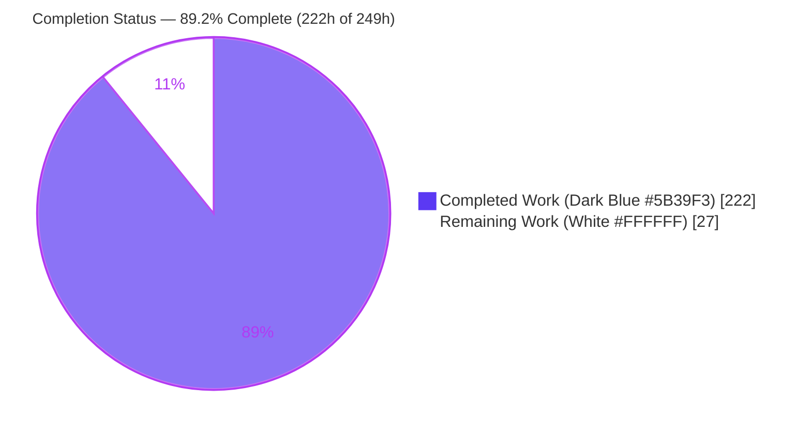
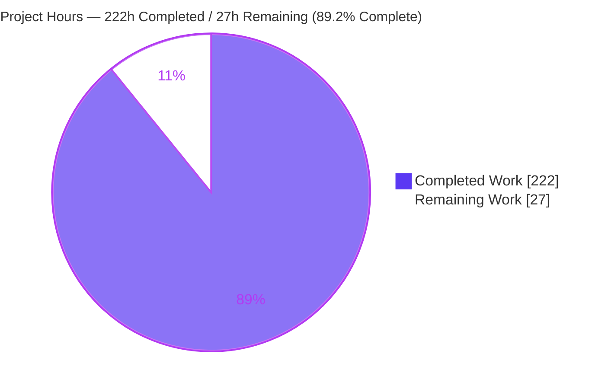
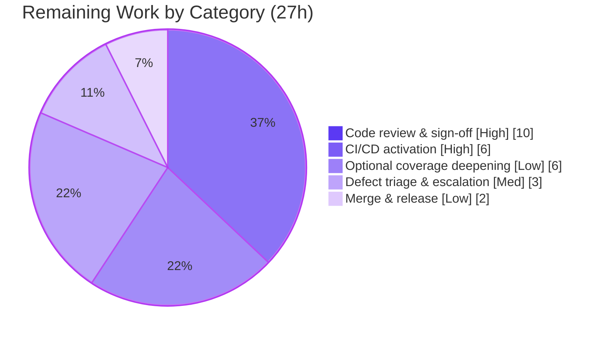

# Blitzy Project Guide — AWS CardDemo End-to-End Test Suite

---

## 1. Executive Summary

### 1.1 Project Overview

AWS CardDemo is a mainframe credit-card management workload written in procedural COBOL running under CICS (online) and JCL/JES (batch) against VSAM data. The project's objective was to design and construct a complete, automated, **end-to-end test suite to financial-enterprise standards**, together with executable runner scripts that drive the entire suite from a single command. Because the repository shipped **zero programmatic tests**, this was a net-new, greenfield construction effort. The suite targets the twelve batch programs that process monetary transactions (posting, interest accrual, statement generation, export/import), delivering exact fixed-point monetary assertions, full business-rule branch coverage, deterministic isolated execution, and machine-readable JUnit reporting for CI. The primary users are CardDemo maintainers and CI pipelines.

### 1.2 Completion Status

The completion percentage is calculated using the AAP-scoped hours methodology (PA1): every hour traces to a specific Agent Action Plan deliverable or to a standard path-to-production activity required to deploy it.



| Metric | Hours |
|---|---|
| **Total Hours** | **249** |
| Completed Hours (AI + Manual) | 222 |
| &nbsp;&nbsp;• Completed by Blitzy AI agents | 222 |
| &nbsp;&nbsp;• Completed by prior manual work | 0 |
| Remaining Hours | 27 |
| **Percent Complete** | **89.2%** |

> Completion formula: `222 / (222 + 27) = 222 / 249 = 89.2%`. All completed work was delivered autonomously by Blitzy agents across 26 commits (16 Blitzy Agent + 10 Blitzy Integrator); the 27 remaining hours are exclusively human path-to-production activities.

### 1.3 Key Accomplishments

- ✅ **Three-layer automated test suite delivered** — COBOL unit (GCBLUnit), Python integration (pytest), and full batch-chain end-to-end (pytest) layers, all compiling and passing.
- ✅ **132 tests executed, 128 runnable pass, 0 failures, 0 errors** across all layers in the fresh validation run.
- ✅ **One-command runner delivered** — `scripts/run_tests.sh` orchestrates build → unit → integration → e2e with a single aggregated CI exit code, fully satisfying the user's "create the scripts to completely run this test suite" requirement.
- ✅ **Mandatory 100% business-rule branch coverage met** — posting reject reasons 100–103, over-limit and expiration boundaries, the CBACT04C DEFAULT-group fallback, TCATBAL create-vs-update, and the `(TRAN-CAT-BAL × rate) / 1200` interest formula are each asserted by dedicated tests, fixtures, and golden masters.
- ✅ **Financial-grade determinism** — 99 fixed-width fixtures + 94 golden masters, byte-deterministic comparison, parallel-safe isolation verified under `pytest -n auto`.
- ✅ **AWS virtualization** — headless, Docker-less LocalStack S3 dataset-staging executed live against the emulator.
- ✅ **CI pipeline authored** — `.github/workflows/tests.yml` with SHA-pinned actions and a fail-closed pip-audit supply-chain gate.
- ✅ **Minimal-change principle honored** — 41,729 lines added across 247 files with **zero** production COBOL/copybook/JCL modifications (only `.gitignore` touched).
- ✅ **Explainability rule satisfied** — docstrings (purpose/parameters/returns/exceptions) and WHY-oriented inline comments throughout the suite.

### 1.4 Critical Unresolved Issues

There are **no unresolved issues that block the test suite** — every runnable in-scope test passes with 0 failures and 0 errors. The only open items are two **pre-existing, out-of-scope production COBOL defects** that the AAP explicitly forbids modifying (`app/cbl/*` is REFERENCE-only per §0.8.2). The suite already documents and guards each one; they are recorded here for handoff transparency.

| Issue | Impact | Owner | ETA |
|---|---|---|---|
| CBEXPORT/CBIMPORT compile defect — `RECORD KEY IS EXPORT-SEQUENCE-NUM` names a field absent from the FD record (`CBEXPORT.cbl:68`, `CBIMPORT.cbl:40`) | Sole cause of the RC=4 build WARN; blocks the full export→import E2E round-trip (guarded by 1 sanctioned skip + 1 e2e xfail). Record-format logic is still unit-tested. | CardDemo application owners (out of test scope) | To be scheduled by app team |
| CBACT04C final-account interest-flush defect — the last distinct account's accrued interest is never flushed at end-of-file | Latent interest-accrual correctness gap in production; encoded by 2 xfail(strict) tests that auto-fail if the baseline is corrected. | CardDemo application owners (out of test scope) | To be scheduled by app team |

### 1.5 Access Issues

**No access issues identified.** The test suite requires no repository permissions beyond the working branch, no service credentials, and no third-party API access. All AWS interactions are fully virtualized through LocalStack (no live AWS account, keys, or endpoints are used), and no production data or secrets are involved.

| System/Resource | Type of Access | Issue Description | Resolution Status | Owner |
|---|---|---|---|---|
| — | — | No access issues identified | N/A | — |

### 1.6 Recommended Next Steps

1. **[High]** Perform peer code review and sign-off of the 41,729-line, 26-commit test-only delta (financial-assertion correctness, golden-master validity, Explainability compliance). *(10h)*
2. **[High]** Activate the CI pipeline in the real environment — provision the toolchain on the GitHub Actions runner, achieve the first green run, and enable branch protection requiring the suite. *(6h)*
3. **[Medium]** Triage and escalate the two documented out-of-scope production COBOL defects to the CardDemo application owners. *(3h)*
4. **[Low]** Merge the pull request and coordinate release (tag, release notes, close-out). *(2h)*
5. **[Low]** Optionally deepen coverage toward the aspirational, non-contractual ≥90% line / ≥85% branch recommendations on CBTRN02C and CBACT04C. *(6h)*

---

## 2. Project Hours Breakdown

### 2.1 Completed Work Detail

All completed components were delivered autonomously by Blitzy agents. Each traces to a specific AAP deliverable.

| Component | Hours | Description |
|---|---|---|
| Test harness & helpers | 38 | `cobol_runner`, `record_codec` (fixed-width + zoned-decimal sign-overpunch + COMP-3 codec), `vsam_loader`/`load_indexed.sh` (flat→indexed IDCAMS-REPRO analog), `golden_compare`, `e2e_records`, `statement_compat`, and `conftest.py` shared fixtures (~9,900 LOC) |
| COBOL unit test layer | 22 | Vendored GCBLUnit framework + 10 `*_test.cbl` programs + driver covering validation/reject/posting paragraphs, interest formula & DEFAULT fallback, date edits, op-code contracts (4,325 LOC) |
| Integration test layer | 38 | 9 pytest modules / 103 parametrized cases: posting reject stream & masters, interest category balances, statement text+HTML golden, provisioning round-trips, date utility, export/import (9,240 LOC) |
| End-to-end test layer | 18 | 4 pytest modules / 19 cases chaining provision→post→interest→statement→report with golden-master comparison + LocalStack staging (3,283 LOC) |
| Fixtures & golden masters | 18 | 99 fixed-width fixtures (all 9 posting scenarios + interest/statement/provisioning/export) and 94 golden-master expected outputs |
| Mocks | 8 | `mock_discgrp` (incl. missing-key fallback row), `mq_request_stub` (absent MQ producer, 650 LOC), `localstack_s3_manifest` |
| LocalStack AWS virtualization | 10 | `setup_localstack.sh` + `localstack_setup.py` + S3 dataset-staging tests (headless, Docker-less) |
| Runner scripts | 22 | Master `run_tests.sh` + 3 layer runners + `build_test_programs.sh` + `test_env.sh` (ASSIGN bindings) with RC rubric, JUnit aggregation, coverage wiring, completion-aware waits (4,343 LOC) |
| CI workflow + supply-chain gate | 8 | `.github/workflows/tests.yml` (SHA-pinned actions) + fail-closed pip-audit `audit-allowlist.json` |
| Test config & dependency manifests | 6 | `pytest.ini`, `.coveragerc`, hash-pinned `requirements-test.txt`, `cobolget.json`, `import.json` |
| Documentation | 10 | `tests/README.md` (30 KB) + fixture/golden/mock READMEs (how to build/run/extend) |
| QA hardening & code-review remediation | 18 | Iterative resolution of 37 + 18 + 9 code-review/QA findings across the commit history |
| Research & toolchain selection | 6 | Web-search selection of the COBOL testing stack (GCBLUnit vs zUnit), version-compatibility validation |
| **Total Completed** | **222** | |

### 2.2 Remaining Work Detail

All remaining work is human path-to-production; no AAP construction deliverable is incomplete.

| Category | Hours | Priority |
|---|---|---|
| Test-suite code review & sign-off | 10 | High |
| CI/CD pipeline activation & go-live (runner provisioning, first green run, branch protection, live pip-audit) | 6 | High |
| Out-of-scope production defect triage & escalation (CBEXPORT/CBIMPORT + CBACT04C) | 3 | Medium |
| Optional coverage deepening toward aspirational ≥90%/≥85% recommendations (non-contractual) | 6 | Low |
| Merge & release coordination (PR merge, tag, release notes) | 2 | Low |
| **Total Remaining** | **27** | |

### 2.3 Hours Summary

| Category | Hours | Share |
|---|---|---|
| Completed (Section 2.1) | 222 | 89.2% |
| Remaining (Section 2.2) | 27 | 10.8% |
| **Total Project** | **249** | **100%** |

> Cross-section check: `Section 2.1 (222) + Section 2.2 (27) = 249 = Total Project Hours (Section 1.2)`. ✓

---

## 3. Test Results

All results below originate from Blitzy's autonomous validation logs — the JUnit XML written to `reports/{unit,integration,e2e}.xml` by the master run `scripts/run_tests.sh --with-localstack`, independently reproduced during this assessment.

| Test Category | Framework | Total Tests | Passed | Failed | Coverage % | Notes |
|---|---|---|---|---|---|---|
| Unit | GCBLUnit (GnuCOBOL) | 10 | 10 | 0 | see below | 10/10 pass; 0 skipped. Validation/reject/posting paragraphs, interest formula, date edits, op-code contracts. |
| Integration | pytest 9.1.1 | 103 | 101 | 0 | 63.4% (Py harness) | 101 runnable pass; 2 non-failing (1 sanctioned skip + 1 xfail) guarding out-of-scope defects. |
| End-to-End | pytest 9.1.1 | 19 | 17 | 0 | — | 17 runnable pass; 2 xfail guarding the out-of-scope CBACT04C/export defects. Live LocalStack S3 staging executed. |
| **Total** | — | **132** | **128** | **0** | — | 0 failures, 0 errors across all layers. 4 non-failing skip/xfail, all documenting out-of-scope production defects. |

**COBOL line/branch coverage** (gcov on the GnuCOBOL-transpiled C — denominator includes unreachable runtime/abend boilerplate, so figures are upper-bounded and reported verbatim):

| Program | Line % | Branch % | Role |
|---|---|---|---|
| CBTRN02C (posting) | 59.70% | 73.53% | financial-critical |
| CBACT04C (interest) | 54.26% | 67.03% | financial-critical |
| CBTRN03C (reporting) | 62.29% | 75.44% | batch |

> **Coverage context:** Per AAP §0.7.1, these percentages are explicitly **non-contractual recommendations** (the repository defines no SLAs). The **mandatory** requirement — 100% business-rule branch coverage of reject reasons 100–103, over-limit/expiration boundaries, the DEFAULT-group fallback, TCATBAL create/update, and the interest formula — **is met** and enforced by dedicated asserting tests, independent of these aggregate figures. Provisioning read/print programs report gcov "stale" (gcda orphaned by the double-compile in the `--with-tests` build) and are deliberately suppressed rather than published as a false 0%.

---

## 4. Runtime Validation & UI Verification

CardDemo's batch programs are non-interactive; there is **no web/GUI front end in scope**, so runtime validation focuses on program execution, file I/O, the batch chain, and the AWS staging layer. The eighteen online CICS `CO*` programs are environment-bounded (no CICS runtime on the runner) and out of scope per AAP §0.8.2.

- ✅ **Build** — 8 main programs + 3 modules + 10 COBOL test programs compile under GnuCOBOL 3.2.0 (`--std=ibm-strict`/`-fixed`); 0 in-scope compile errors.
- ✅ **COBOL unit execution** — GCBLUnit programs run and self-report 10/10 pass with JUnit XML emission.
- ✅ **Integration runtime** — compiled COBOL executes against native GnuCOBOL indexed/sequential files with ASSIGN-name env bindings; reject stream, updated masters, and RETURN-CODE asserted.
- ✅ **End-to-end batch chain** — full daily cycle (provision → post → interest → statement → report) runs and compares against golden masters.
- ✅ **AWS S3 dataset staging** — live LocalStack emulator (healthy at `:4566`); buckets `carddemo-dataset-staging` and `carddemo-dataset-staging-ebcdic` seeded from the manifest and exercised.
- ✅ **Parallel isolation** — integration layer under `pytest -n auto` yields an identical pass result, confirming deterministic, isolated, parallel-safe tests.
- ⚠ **Export/import full round-trip** — partial: gated by the out-of-scope CBEXPORT/CBIMPORT compile defect; the extractable record-format logic **is** unit-tested, while the full-program round-trip is honestly skipped/xfailed.
- ⚠ **CICS online `CO*` E2E** — not executed: no CICS runtime available (out of scope); extractable field-validation logic is unit-tested where feasible.

---

## 5. Compliance & Quality Review

This matrix cross-maps the AAP's deliverables and mandatory rules to their delivery status, including fixes applied during autonomous validation.

| AAP Requirement / Benchmark | Status | Progress | Notes |
|---|---|---|---|
| Complete 3-layer test suite (unit/integration/e2e) | ✅ Pass | 100% | All layers present, compile, and pass |
| One-command runner scripts | ✅ Pass | 100% | `run_tests.sh` + 3 layer runners + build/env/localstack scripts; `bash -n` + shellcheck clean |
| Mandatory 100% business-rule branch coverage | ✅ Pass | 100% | Reject 100–103, boundaries, DEFAULT fallback, TCATBAL, interest formula each asserted |
| Exact fixed-point monetary assertions | ✅ Pass | 100% | Zoned-decimal/COMP-3 codec; byte-deterministic golden masters |
| Deterministic & isolated execution | ✅ Pass | 100% | Per-test workspace; verified under `pytest -n auto` |
| Machine-readable (CI) reporting | ✅ Pass | 100% | JUnit XML to `reports/`; single aggregated exit code |
| LocalStack AWS virtualization (headless, Docker-less) | ✅ Pass | 100% | Live S3 staging executed |
| CI workflow + supply-chain gate | ✅ Pass (authored) | 100% code / pending go-live | SHA-pinned actions; fail-closed pip-audit; first real run is a path-to-production task |
| Explainability rule (docstrings + WHY comments) | ✅ Pass | 100% | Hard review gate observed across the suite |
| Minimal-change / test-only principle | ✅ Pass | 100% | 246 files added + only `.gitignore` modified; zero production source touched |
| Aspirational ≥90% line / ≥85% branch coverage | ⚠ Partial | Below target | Non-contractual; transpiled-C denominator upper-bounds figures; optional deepening remains |

**Fixes applied during autonomous validation:** none required — the Final Validator made **zero source modifications**; the suite (built across 16 prior agent commits, integrated across 10) already compiled, ran, and passed all gates. Earlier iterations resolved 37 + 18 + 9 code-review/QA findings, recorded in the commit history.

**Outstanding compliance items:** first live CI run (exercises pip-audit against the live advisory feed) and human sign-off — both path-to-production.

---

## 6. Risk Assessment

| Risk | Category | Severity | Probability | Mitigation | Status |
|---|---|---|---|---|---|
| Two out-of-scope production COBOL defects (CBEXPORT/CBIMPORT compile; CBACT04C final-account flush) | Technical | Medium | Certain (pre-existing) | Guarded by sanctioned skip + xfail(strict) that auto-fails if baseline is corrected; escalate to app owners; record-format logic still unit-tested | Documented / Guarded |
| Aggregate coverage below aspirational ≥90% line on CBTRN02C/CBACT04C | Technical | Low | Accepted | Non-contractual; transpiled-C denominator includes unreachable boilerplate; mandatory branch coverage met | Accepted / Documented |
| gcov "stale" on provisioning programs (double-compile gcda orphaning) | Technical | Low | Medium | False 0% deliberately suppressed; financial-critical targets report valid coverage | Documented |
| pip-audit supply-chain gate not yet exercised against a live advisory feed | Security | Medium | Low | Gate is fail-closed with empty allowlist; first networked CI run exercises it fully | Partial (pending live run) |
| Test-dependency / CI-action pinning | Security | Low | Low | `requirements-test.txt` hash-pinned; CI actions SHA-pinned; LocalStack is test-only | Mitigated |
| Credential / data exposure | Security | Low | Low | No live AWS/prod secrets; all cloud virtualized; no production data | Mitigated |
| CI pipeline never run in the real environment | Operational | Medium | Medium | Path-to-production task (6h); workflow authored & gate-validated offline | Not started (human) |
| Toolchain drift (validated cobc 3.2.0 / Python 3.13.7) | Operational | Low-Medium | Medium | Pin/provision matching versions in CI; deps pinned | Partial |
| LocalStack lifecycle reliability in CI | Operational | Low | Low | `setup_localstack.sh` + opt-in `--with-localstack`; layers soft-degrade without it | Mitigated |
| CICS online E2E for 18 `CO*` programs not automatable | Integration | Low | Certain | Explicitly out of scope; extractable field logic unit-tested | Accepted / Out-of-scope |
| External MQ authorization producer stubbed (not supplied) | Integration | Low | N/A | `mq_request_stub` covers optional modules F-016–F-018 | Accepted / Stubbed |
| LocalStack-vs-live-AWS fidelity for S3 staging | Integration | Low | Low | LocalStack mandated by AAP; no live AWS in scope | Accepted |

**Overall risk posture:** Low. No risk threatens the delivered suite's correctness (all layers pass, 0 failures/0 errors). The three actionable risks map 1:1 to path-to-production remaining-work items (CI activation, live pip-audit, out-of-scope defect escalation).

---

## 7. Visual Project Status

**Project hours breakdown** (Completed = Dark Blue `#5B39F3`, Remaining = White `#FFFFFF`):



**Remaining hours by category** (from Section 2.2; total = 27h):



> Integrity check: "Remaining Work" = 27h in the pie above = Section 1.2 Remaining Hours = Section 2.2 total (10+6+3+6+2). ✓

---

## 8. Summary & Recommendations

**Achievements.** The project delivered a complete, financial-enterprise-grade automated test suite for AWS CardDemo, built essentially greenfield: three test layers (COBOL unit, Python integration, end-to-end batch chain), 132 tests with 128 runnable passing and **0 failures / 0 errors**, 99 deterministic fixtures, 94 golden masters, LocalStack-backed AWS virtualization, a CI workflow with a fail-closed supply-chain gate, and — critically for the user's explicit request — a **single-command runner** (`scripts/run_tests.sh`) that builds and runs the entire suite with one aggregated CI exit code. The mandatory 100% business-rule branch coverage is met, and the minimal-change/test-only principle was honored exactly (zero production source touched).

**Remaining gaps.** All 27 remaining hours are human path-to-production activities — not construction gaps. They are: code review and sign-off (10h), CI go-live (6h), out-of-scope production-defect escalation (3h), optional coverage deepening (6h), and merge/release (2h).

**Critical path to production.** (1) Peer review and sign-off → (2) activate CI and achieve first green run with branch protection → (3) merge → (4) escalate the two documented out-of-scope production defects to the CardDemo app team in parallel.

**Success metrics.** All in-scope tests pass (128/128 runnable); aggregate RC = 4, attributable solely to the documented, unfixable out-of-scope build WARN; every test layer is RC = 0; parallel isolation confirmed.

**Production readiness assessment.** The test suite itself is **production-ready** and the project is **89.2% complete** on an AAP-scoped basis. The residual 10.8% is standard human deployment/governance work. The two open production COBOL defects are outside this project's scope (the AAP forbids modifying `app/cbl`), are fully documented, and are guarded so that any future fix automatically surfaces in the suite.

| Metric | Value |
|---|---|
| AAP-scoped completion | 89.2% |
| In-scope test pass rate | 100% (128/128 runnable) |
| Test failures / errors | 0 / 0 |
| Production source files modified | 0 |
| Aggregate RC | 4 (out-of-scope build WARN only) |

---

## 9. Development Guide

All commands were tested against the live toolchain during this assessment.

### 9.1 System Prerequisites

- **OS:** Linux (validated on Ubuntu); macOS compatible.
- **GnuCOBOL:** `cobc` 3.x (validated on **3.2.0**) with a gcc backend.
- **Python:** 3.9+ (validated on **3.13.7**); a project virtual environment at `.venv`.
- **Shell:** `bash`; standard Unix utilities.
- **Optional (AWS layer only):** LocalStack CLI (validated on **2026.6.1**) for the S3 dataset-staging tests.

### 9.2 Environment Setup

```bash
# From the repository root
cd /path/to/aws-mainframe-modernization-carddemo

# 1. (Optional) Activate the project virtual environment
#    scripts/run_tests.sh self-provisions the venv if absent.
source .venv/bin/activate

# 2. Export GnuCOBOL ASSIGN-name bindings + workspace/report/build paths.
#    This is the single source of truth for runtime file bindings
#    (DALYTRAN, TRANFILE, XREFFILE, DALYREJS, ACCTFILE, TCATBALF, DISCGRP, ...).
#    run_tests.sh sources this internally, so manual setup is not required.
source scripts/test_env.sh
```

### 9.3 Dependency Installation

```bash
# Python test dependencies (hash-pinned for supply-chain integrity)
pip install --require-hashes -r tests/requirements-test.txt

# GCBLUnit is vendored in-tree (tests/cobol-unit/gcblunit.cbl) and cached;
# no separate install step is required to run the unit layer.
```

### 9.4 Build

```bash
# Compile the programs under test + the COBOL test programs
scripts/build_test_programs.sh --with-tests

# Underlying per-program form (reference):
#   cobc -x -fixed -I app/cpy -o build/CBTRN02C app/cbl/CBTRN02C.cbl
# Strict-dialect variant:
#   cobc ... --std=ibm-strict
```

> **Expected:** 8 mains + 3 modules + 10 COBOL test programs compile. The build emits an RC=4 **WARN** for the out-of-scope CBEXPORT/CBIMPORT compile defect — this is expected and documented, not a failure.

### 9.5 Running the Suite

```bash
# Full suite (build -> unit -> integration -> e2e), single aggregated exit code
bash scripts/run_tests.sh

# Also exercise the live LocalStack S3 staging layer (REQUIRE mode)
bash scripts/run_tests.sh --with-localstack

# ... plus coverage (writes reports/coverage.xml + reports/cobol-coverage.xml)
bash scripts/run_tests.sh --with-localstack --coverage

# Per-layer runners
bash scripts/run_unit_tests.sh
bash scripts/run_integration_tests.sh
bash scripts/run_e2e_tests.sh --with-localstack
```

### 9.6 Verification

```bash
# JUnit XML lands here for CI ingestion
ls reports/unit.xml reports/integration.xml reports/e2e.xml
```

Expected steady-state master summary:

```
#  build        rc=4
#  unit         rc=0
#  integration  rc=0
#  e2e          rc=0
#   aggregate RC = 4  (0 pass / 4 warn / 8 fail / 16 fatal)
```

**RC rubric:** `0` pass · `4` warn · `8` fail · `16` fatal. The expected steady-state aggregate is **RC=4** (the unfixable out-of-scope build WARN); every **test layer is RC=0**. Only RC≥8 indicates a genuine test failure.

### 9.7 Example Usage

```bash
# Run a single scenario (verified: passes)
python -m pytest tests/integration/test_cbtrn02c_posting.py::test_reject_102_overlimit -v

# Select by keyword
python -m pytest tests/integration/test_cbtrn02c_posting.py -k "overlimit or reject_102" -v

# Debug a module with full tracebacks, stop on first failure
python -m pytest -vv --tb=long -x tests/integration/test_cbtrn02c_posting.py

# Validate parallel isolation
python -m pytest tests -n auto
```

### 9.8 Troubleshooting

- **`run_tests.sh` exits 4** — Expected. RC=4 is the documented out-of-scope CBEXPORT/CBIMPORT build WARN, not a test failure. All test layers are RC=0. Investigate only if RC≥8.
- **LocalStack tests skip with "AWS_ENDPOINT_URL unset"** — Expected without the AWS layer. Run `scripts/run_tests.sh --with-localstack` to exercise live S3 (set `CARDDEMO_REQUIRE_LOCALSTACK=1` to hard-require it).
- **gcov reports "stale" for provisioning programs** — Expected (double-compile gcda orphaning). Financial-critical CBTRN02C/CBACT04C report valid coverage.
- **`cobc: command not found`** — Install GnuCOBOL 3.x and ensure `cobc` is on `PATH`.
- **Missing Python deps** — `pip install --require-hashes -r tests/requirements-test.txt` inside `.venv` (or let `run_tests.sh` self-provision).

---

## 10. Appendices

### Appendix A — Command Reference

| Command | Purpose |
|---|---|
| `source scripts/test_env.sh` | Export ASSIGN-name bindings + workspace/report paths |
| `scripts/build_test_programs.sh --with-tests` | Compile UUTs + COBOL test programs |
| `bash scripts/run_tests.sh` | Master runner (build→unit→integration→e2e) |
| `bash scripts/run_tests.sh --with-localstack` | Master runner + live S3 staging |
| `bash scripts/run_tests.sh --with-localstack --coverage` | + coverage XML output |
| `bash scripts/run_unit_tests.sh` | COBOL/GCBLUnit unit layer |
| `bash scripts/run_integration_tests.sh` | pytest integration layer |
| `bash scripts/run_e2e_tests.sh [--with-localstack]` | pytest e2e layer |
| `python -m pytest <file>::<test> -v` | Run a single test |
| `python -m pytest tests -n auto` | Parallel isolation check |

### Appendix B — Port Reference

| Port | Service | Notes |
|---|---|---|
| 4566 | LocalStack (S3 edge) | Only when `--with-localstack`; test-only, not a production service |

> The CardDemo batch programs are non-interactive and expose no network ports.

### Appendix C — Key File Locations

| Path | Contents |
|---|---|
| `tests/cobol-unit/` | GCBLUnit COBOL test programs + vendored `gcblunit.cbl` |
| `tests/integration/` | pytest integration modules (9) |
| `tests/e2e/` | pytest end-to-end modules (4) |
| `tests/helpers/` | `cobol_runner`, `record_codec`, `vsam_loader`/`load_indexed.sh`, `golden_compare`, `localstack_setup`, `e2e_records`, `statement_compat` |
| `tests/fixtures/` | 99 fixed-width per-scenario fixtures |
| `tests/golden/` | 94 golden-master expected outputs |
| `tests/mocks/` | `mock_discgrp.txt`, `mq_request_stub.py`, `localstack_s3_manifest.json` |
| `tests/conftest.py` | Shared pytest fixtures (workspace, build cache, env wiring) |
| `tests/pytest.ini`, `tests/.coveragerc` | Test configuration |
| `tests/requirements-test.txt` | Hash-pinned Python test dependencies |
| `scripts/run_tests.sh` | Master runner (single entry point) |
| `.github/workflows/tests.yml` | CI workflow |
| `reports/` | JUnit XML + coverage output |

### Appendix D — Technology Versions

| Component | Version (validated) | AAP-anticipated |
|---|---|---|
| GnuCOBOL (`cobc`) | 3.2.0 | 3.1.2.0 |
| Python | 3.13.7 | 3.12.3 |
| pytest | 9.1.1 | 9.1.1 |
| pytest-xdist | 3.8.0 | 3.8.0 |
| pytest-golden | 1.0.1 | 1.0.1 |
| coverage | 7.15.2 | 7.15.2 |
| LocalStack CLI | 2026.6.1 | 2026.6.1 |
| awscli / awscli-local | 1.45.50 / 0.22.2 | 1.45.49 / 0.22.2 |
| GCBLUnit | 1.22.6 | 1.22.6 |
| boto3 / botocore | 1.43.50 / 1.43.50 | — |

> The runner ships GnuCOBOL 3.2.0 (GnuCOBOL's own recommended release) rather than the AAP-anticipated 3.1.2.0; both compile the CardDemo batch programs cleanly under `--std=ibm-strict`.

### Appendix E — Environment Variable Reference

| Variable | Purpose |
|---|---|
| `DALYTRAN`, `TRANFILE`, `XREFFILE`, `DALYREJS`, `ACCTFILE`, `TCATBALF`, `DISCGRP`, `CARDFILE`, `CARDXREF`, `CUSTFILE`, `TRANSACT`, `OUTFILE`, `ARRYFILE`, `VBRCFILE` | GnuCOBOL `SELECT ... ASSIGN TO <NAME>` → file bindings (set by `test_env.sh`) |
| `CARDDEMO_REPO_ROOT`, `CARDDEMO_BUILD_DIR`, `CARDDEMO_REPORTS_DIR`, `CARDDEMO_DATA_DIR`, `CARDDEMO_TEST_WORKSPACE`, `CARDDEMO_WS_BASE` | Repository / workspace / output path anchors |
| `COB_LIBRARY_PATH` | GnuCOBOL dynamic-call module search path |
| `AWS_ENDPOINT_URL` | LocalStack endpoint (AWS layer); unset → S3 staging tests soft-skip |
| `CARDDEMO_REQUIRE_LOCALSTACK` | `1` → hard-require LocalStack (else soft-skip) |
| `CARDDEMO_REQUIRE_COBOL` | `1` → escalate out-of-scope CBEXPORT/CBIMPORT skip to hard fail |

### Appendix F — Developer Tools Guide

| Tool | Use |
|---|---|
| GCBLUnit | COBOL unit-test framework (JUnit XML output, CI exit code); vendored in-tree |
| pytest (+ xdist, golden) | Integration/E2E orchestration, parallel isolation, golden-file support |
| coverage / gcov | Python-harness coverage; COBOL line coverage via gcov on transpiled C |
| LocalStack + awslocal | Headless, Docker-less AWS S3 emulation for dataset staging |
| pip-audit | Supply-chain gate (fail-closed) in CI |
| shellcheck / `bash -n` | Runner-script static analysis (clean) |

### Appendix G — Glossary

| Term | Definition |
|---|---|
| **AAP** | Agent Action Plan — the authoritative project scope/requirements document |
| **GCBLUnit** | Pure-GnuCOBOL unit-testing framework used for the COBOL unit layer |
| **Golden master** | A deterministic expected-output file compared byte-for-byte against a program's actual output |
| **VSAM / KSDS** | Mainframe indexed dataset organization; emulated here via GnuCOBOL indexed files |
| **Zoned decimal / COMP-3** | Fixed-width numeric encodings (sign overpunch / packed decimal) used in CardDemo records |
| **RC rubric** | Condition-code convention: 0 pass · 4 warn · 8 fail · 16 fatal |
| **xfail(strict)** | A test expected to fail that becomes a hard error if it unexpectedly passes (guards out-of-scope defects) |
| **Path-to-production** | Standard human deployment/governance activities (review, CI go-live, merge) required to ship a validated deliverable |