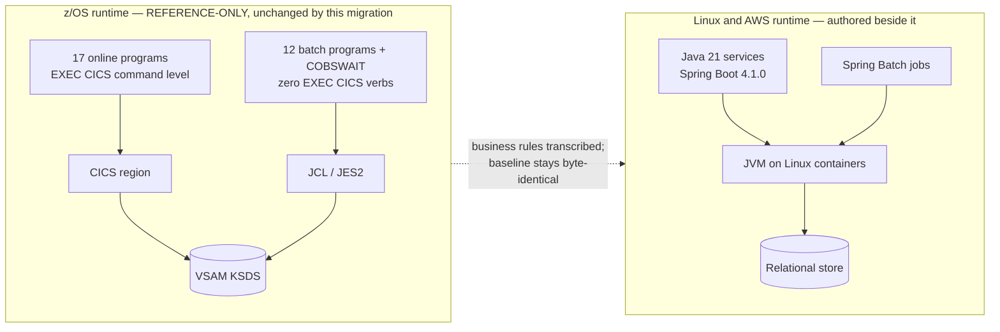

# ADR-001: Language and Runtime for the Migrated Application

> **Purpose.** Record decision D1 — the disposition of the COBOL application
> code — with the options that were weighed, the facts that decided between
> them, the cost shape each option carries, and the risks the accepted option
> takes on. This record explains the choice; it does not reopen it.
>
> **Source of truth.** Two sources, and no others. The behavioural
> specification is the COBOL baseline under `app/**`, which is **read-only**:
> this record cites it by path and line and never edits it. The decision of
> record is the Agent Action Plan (AAP) §0.1.2 row D1, which fixes the accepted
> option. Where this record and the baseline appear to disagree about
> behaviour, the baseline is right and this record is wrong.

- **Status:** Accepted
- **Decision:** Re-express the migrated behaviour as an **idiomatic rewrite in
  Java 21 LTS on Spring Boot 4.1.0**. **No program is transpiled** — not one,
  and not in part. GnuCOBOL remains in the repository as the existing test
  harness's compiler and is never a production runtime.
- **Scope of this record.** The language and the runtime, and nothing else.
  Compute platform belongs to [ADR-002](ADR-002-compute-platform.md),
  datastores to [ADR-003](ADR-003-datastore-targets.md), and service boundaries
  to [ADR-007](ADR-007-service-boundaries.md). This record cites those
  decisions where the reasoning touches them and re-decides none of them.

## Context

The baseline is a z/OS credit-card management application written in
procedural COBOL. Online interaction runs as CICS command-level transactions,
batch runs under JCL and JES2, record data lives in VSAM, and the optional
extension trees add Db2 tables, IMS DL/I segments and IBM MQ request/reply
messaging. The application's own summary of its stack is the "Technical
Highlights" table in [`README.md`](../../README.md) (L366–L371): the base
application is COBOL, CICS, JCL (Batch) and VSAM (KSDS with AIX), and the
optional features add DB2, MQ, IMS DB, JCL Utilities, complex data formats,
various dataset types and advanced copybook structures. That table is the
inventory of what has to be re-expressed.

The question this record answers is narrow and prior to every other decision:
**in what language, and on what runtime, does the migrated behaviour execute?**
Every subsequent ADR assumes an answer to it.

### The baseline, counted rather than estimated

Each figure below was counted directly in the working tree, because the size
and the shape of the asset base bound what a rewrite can be asked to cover.

| Asset | Count | Where |
|---|---|---|
| COBOL programs, base tree | **31** — 12 batch `CB*`, 18 `CO*` members of which **17 are online and one is a batch utility** (`COBSWAIT`), 1 date utility `CSUTLDTC` | `app/cbl` |
| COBOL programs, all trees | **44** under `app/**` — the base 31 plus 13 in the three extension trees (8 authorization, 3 transaction-type, 2 VSAM/MQ) | `app/**` |
| Copybooks | **30** in `app/cpy`; **62** under `app/**` | `app/cpy`, extension trees |
| BMS mapsets | **17** in `app/bms`; **21** under `app/**` | `app/bms`, extension trees |
| JCL jobs | **38** in `app/jcl`; **46** under `app/**` — 55 across the repository once the nine mainframe build samples under `samples/**` are counted, and those are reference and out of scope | `app/jcl`, extension trees |
| CICS resource definitions | 505 lines defining **8** `DEFINE FILE` resources and **18** `DEFINE TRANSACTION` stanzas | [`app/csd/CARDDEMO.CSD`](../../app/csd/CARDDEMO.CSD) |

Two properties of that inventory decide more than its size does.

**The online and batch tiers are coupled to the platform very differently.**
Across the eighteen `CO*` members there are 174 `EXEC CICS` occurrences — among
them 10 `XCTL`, 31 `SEND`, 17 `RECEIVE`, 30 `READ`, and the
`STARTBR`/`READNEXT`/`READPREV`/`ENDBR` browse quartet — and seventeen of the
eighteen files contain at least one. The exception is
[`COBSWAIT`](../../app/cbl/COBSWAIT.cbl), which carries the online filename
prefix, contains **zero** `EXEC CICS` verbs, declares itself a batch program in
its own header, and is driven by
[`app/jcl/WAITSTEP.jcl`](../../app/jcl/WAITSTEP.jcl) — so the *functional* split
of the eighteen is **17 online plus one batch utility**, and the filename prefix
is not a reliable guide to it. The register at
[`docs/architecture/cobol-to-service-traceability.md`](../architecture/cobol-to-service-traceability.md)
is the authority for that split and this record follows it.
The twelve `CB*` batch programs contain
**zero**, which [`tests/README.md`](../../tests/README.md) §1 records as the
reason they "run standalone under GnuCOBOL". The online tier's dependence on
CICS is therefore pervasive and the batch tier's is absent, and any option that
treats the two tiers alike will be wrong about one of them.

**The target toolchain is net-new.** The baseline carries no `package.json`,
`pom.xml`, `build.gradle`, `go.mod`, `Cargo.toml`, `pyproject.toml` or root
`requirements.txt`. There is no existing target-side build to preserve
compatibility with, so this decision is unconstrained by prior tooling
commitments — and correspondingly owes its reader a full justification, since
nothing about the repository pre-selects an answer.



### The constraint that narrows the option set

One of the user's non-negotiable constraints decides more of this than any
preference does: the system must be **deployable end to end from the provided
infrastructure code with no manual mainframe dependency**. Read precisely,
that forbids a runtime call back into CICS, VSAM, Db2, IMS or IBM MQ. An option
that leaves any online transaction requiring a CICS region does not satisfy it,
however attractive the option is on other grounds.

## Options Considered

Four options were weighed. The first three are set out on their merits before
their disqualifying facts, because an option dismissed without its case stated
cannot be audited later.

### Option 1 — Managed replatform on AWS Mainframe Modernization

Run the COBOL substantially as it stands on an AWS-managed runtime. On the
guiding principle alone this option would be attractive: it is the most
managed of the four, it preserves the programs, and it would carry the smallest
transcription risk of any option here.

**Not available.** Both experiences of the service are closed to new
customers. AWS's service documentation records the decision to close new
customer access to the self-managed experience effective **30 June 2026**,
states that existing customers continue to use the service as normal, and
states that AWS continues to invest in security and availability but does not
plan to introduce new features; the managed runtime environment experience is
likewise closed to new customers. A workload that is new to the service
therefore cannot adopt it, and AWS's own guidance directs new work to
vendor-direct offerings and to AWS Transform.

This is a fact about a service's availability, not a judgement about the
programs. It is recorded first because it removes the option that the guiding
principle would otherwise have selected, and because it is what makes the
accepted option the available one rather than the ambitious one.

### Option 2 — Recompile the COBOL for Linux with GnuCOBOL and run it in production

Compile the existing programs with the open-source compiler and operate them on
Linux. This option keeps the programs, keeps their business logic
bit-for-bit, and — for the batch tier — is demonstrably feasible: the harness in
this repository already does it.

**Rejected on two checkable facts.**

Refactoring Rationale: the coupling this option would carry forward is the
exact coupling the migration exists to remove.

- **It does not remove the CICS dependency.** GnuCOBOL does not execute
  `EXEC CICS` verbs, and the online tier is written against them — control
  transfer as `EXEC CICS XCTL PROGRAM(...) COMMAREA(...)`, screen traffic as
  `SEND`/`RECEIVE MAP`, file access as `READ`/`REWRITE`, browse as
  `STARTBR`/`READNEXT`/`READPREV`/`ENDBR`, and commit scope as `SYNCPOINT`.
  [`tests/README.md`](../../tests/README.md) §1.1 records the consequence
  independently: the online `CO*` programs cannot be run end to end without a
  CICS runtime, which is why the existing suite unit-tests only their
  extractable field-validation logic. Recompiling for Linux therefore leaves
  every online transaction still requiring a CICS region, and the
  no-manual-mainframe-dependency constraint above is unsatisfiable under it.
- **It carries the platform-specific compilation constraints forward
  permanently.** Even the batch tier compiles only under a non-default dialect
  and a non-default sign convention. [`tests/README.md`](../../tests/README.md)
  §5.2 documents both and says why each is mandatory: `--std=ibm-strict`
  because the 1985 standard rejects the packed-decimal money fields these
  programs use, and `-fsign=EBCDIC` because the default ASCII sign convention
  misreads the zoned-decimal sign overpunch and **silently corrupts negative
  balances**. Under this option those two settings become production runtime
  configuration, and the second of them is a silent-failure mode held off by a
  compiler flag.

### Option 3 — Automated transpilation to Java, program by program

Mechanically translate each program and keep the translation as the source of
record. The AAP permits this per program, so it is a genuinely open option, and
its advantage is real: mechanical translation preserves behaviour more reliably
than hand transcription does.

**Rejected, and rejected uniformly — no program is transpiled.**

Alternatives Considered: transpiled output carries COBOL's procedural,
record-at-a-time structure inside Java syntax — `PERFORM` paragraph chains as
method chains, `WORKING-STORAGE` as long-lived shared mutable state, and
fixed-arity `OCCURS` tables as fixed-length arrays. Two consequences decide
against it. It would defeat the modularity and design-pattern objectives that
the rest of this migration is built on — repository, service layer, dependency
injection, anti-corruption layer, ports and adapters — because those patterns
are properties of structure and transpilation preserves the structure it is
given. And it would defeat the project's single user-specified rule,
Explainability, outright: that rule requires a documented rationale at each
non-obvious decision, and generated code has nowhere to hold one and no
decision-maker to attribute it to.

Its advantage is not simply forfeited, however, and saying so honestly matters
more than winning the argument. Mechanical fidelity is recovered by a different
mechanism: the existing golden-master suite is retained unchanged as the
behavioural oracle, so the transcription is checked against the baseline's own
output rather than trusted. That mechanism is set out under
[How functional parity is verified](#how-functional-parity-is-verified) below.

### Option 4 — Idiomatic rewrite in Java 21 LTS on Spring Boot 4.1.0 — ACCEPTED

Transcribe the business rules into hand-written, documented Java, structured
around the target patterns, with the baseline retained as the specification and
as the parity oracle.

### The four options side by side

| Option | Removes the CICS dependency | Keeps COBOL skills required to operate | Available | Carries transcription risk | Verdict |
|---|---|---|---|---|---|
| 1 — Managed replatform | Would replace the region with a managed equivalent | Yes | **No** — closed to new customers | Lowest | Rejected: unavailable |
| 2 — GnuCOBOL on Linux | **No** | Yes | Yes | None | Rejected: constraint unsatisfiable |
| 3 — Transpilation | Yes | Reduced | Yes | Low | Rejected: defeats the structural and documentation objectives |
| 4 — Idiomatic Java rewrite | **Yes** | No — though reading the baseline as the specification and maintaining the parity oracle still does | Yes | **Highest — mitigated by the oracle** | **Accepted** |

### Why Java, rather than another rewrite target

A rewrite in another language was not pursued, and the reasons are specific
rather than preferential.

Alternatives Considered: three properties decided it. Exact fixed-point
arithmetic is available as a first-class library type with explicit scale and
rounding control, which is the single hardest requirement this migration has
(see [Rationale](#rationale)); the managed-container and JDBC path is
long-established, which keeps [ADR-002](ADR-002-compute-platform.md) and
[ADR-003](ADR-003-datastore-targets.md) free of language-specific workarounds;
and the framework's own core now supplies the retry capability that would
otherwise be an added dependency, which is why this migration **declares** no
resilience library. Declares is the precise verb and is chosen over "adds none at
all": `org.springframework.retry:spring-retry` still arrives transitively at
compile scope through the Spring Cloud AWS SQS starter in four of the nine
reactor modules, so an absolute absence claim would be false, and what is
actually guaranteed is non-**use** rather than non-presence. That guarantee is
enforced rather than asserted — an ArchUnit rule forbids any `com.carddemo` class
from depending on `org.springframework.retry..` or `io.github.resilience4j..`,
and it runs in every module of the reactor. That decision belongs to
[ADR-002](ADR-002-compute-platform.md), which records it in full alongside the
container base-image pin; it appears as item 9 of
[`docs/CODE_DOCUMENTATION_STANDARD.md`](../CODE_DOCUMENTATION_STANDARD.md) as a
worked example of a documented non-obvious choice, and again at its point of use
in the dependency rationale in [`services/pom.xml`](../../services/pom.xml), in
the comment block immediately preceding the `<parent>` element, where the two
candidate libraries are named and rejected — one because its published artifact
targets the previous framework generation, the other as superseded by the core
relocation — and where the deliberate absence of a circuit breaker is recorded
alongside them. Assumptions: that block is cited by POSITION — immediately above the `<parent>`
element — rather than by line number, because a line range in another file drifts
silently as that file is edited while "immediately above `<parent>`" does not. This
record states only the consequence for the language choice: the framework
generation that arrives with the chosen parent is what makes the added dependency
unnecessary.

Trade-offs: a language with a lighter runtime footprint would reduce container
memory and start-up time, and that cost is real and is accepted. It was
outweighed by the fixed-point requirement, because a start-up cost is visible
and measurable whereas a cent-level arithmetic error is neither.

## Rationale

Five facts carry the decision. Each is checkable in this repository or in the
cited service documentation; none of them is a preference.

### 1. The option the guiding principle would have chosen is closed

The principle this project is held to is reproduced verbatim:

> "Prefer AWS-managed services over self-managed where it lowers operational
> burden, unless cost or a hard constraint dictates otherwise. When a decision
> is a close call, choose the lower-risk, lower-cost option and note it."

Applied to D1, the first sentence points at Option 1 and the second does not
apply. Option 1 is unavailable to a new workload, so the principle has no
managed replatform to prefer; what it selects instead is the option that most
reduces operational burden among those that remain, which is a rewrite onto
managed compute and managed data services — the subject of
[ADR-002](ADR-002-compute-platform.md) and
[ADR-003](ADR-003-datastore-targets.md).

**D1 is not a close call, and it is not presented as one.** Exactly two
decisions in this migration are genuinely close, and both are recorded as such
in their own records: queue service versus managed broker in
[ADR-004](ADR-004-messaging.md), and orchestrator versus batch service in
[ADR-005](ADR-005-batch-orchestration.md). D1 is decided by an availability
fact and a hard constraint, which makes it clear rather than close. Recording a
third close call here would misrepresent how much judgement the choice actually
required.

### 2. A recompile cannot satisfy the stated constraint

Established under [Option 2](#option-2--recompile-the-cobol-for-linux-with-gnucobol-and-run-it-in-production):
GnuCOBOL does not execute `EXEC CICS`, the online tier is written against it,
and [`tests/README.md`](../../tests/README.md) §1.1 records independently that
those programs cannot run end to end without a CICS runtime. The
no-manual-mainframe-dependency requirement is a constraint rather than a goal,
so an option that cannot meet it is out regardless of its other merits.

### 3. Money stays exact fixed point, and the runtime has to make that expressible

This is the highest-risk requirement in the migration, because a failure here is
silent: it produces plausible numbers that are wrong.

Every money field in the base masters is **zoned decimal with sign overpunch**
rather than binary — for example
[`app/cpy/CVACT01Y.cpy`](../../app/cpy/CVACT01Y.cpy) **L7**,
`05 ACCT-CURR-BAL PIC S9(10)V99`, in a 300-byte account record. The invariant
the target holds end to end is a fixed-scale numeric column in SQL, a scaled
decimal at scale 2 with half-up rounding in Java, a decimal type in the ETL, and
money **as a JSON string** on the wire.

Assumptions: the JSON-string rule is not fastidiousness about types. Most
clients parse a JSON number into an IEEE-754 double, which destroys exactness at
the boundary a user actually reads, so the representation has to be chosen at
the edge rather than repaired behind it. The invariant is centralised so it is
decided once: `Money` in the shared kernel fixes the scale at 2 and the general
rounding mode at half-up, and its companion Jackson module renders the value
through its plain-string accessor rather than as a number. The prohibition on
`float` and `double` in the money path is enforced as an executable architecture
rule owned in one location — the `architecture` test package of the shared kernel
— and applied to every module by the `architecture-rules` execution in
[`services/pom.xml`](../../services/pom.xml), which selects those rules by a
reserved class name and scans each module against the kernel's test artifact.
Expressing the invariant as a rule the build runs, rather than as a convention a
reviewer checks, is what makes it a decision this record can stand behind: a
violation fails the module that introduces it, and extending the rule set needs
no change to any module's build.

**One formula must be bit-exact**, and it is worth naming because the failure
mode is an ordering mistake rather than a typing mistake.
[`app/cbl/CBACT04C.cbl`](../../app/cbl/CBACT04C.cbl) **L462–L465**, paragraph
`1300-COMPUTE-INTEREST`, computes:

```cobol
COMPUTE WS-MONTHLY-INT
 = ( TRAN-CAT-BAL * DIS-INT-RATE) / 1200
```

Trade-offs: the Java forms the product at full precision **first** and only then
divides with an explicit scale and rounding mode. Dividing first and multiplying
second is the more natural reading order and yields a **different final cent on
many balances**, so the arithmetic order is part of the behavioural contract
rather than an implementation detail. The cost accepted is a slightly less
readable expression than the naive order would give, in exchange for an
intermediate precision that matches the reference.

### 4. The unit of work the baseline already commits atomically stays atomic

[`app/cbl/CBTRN02C.cbl`](../../app/cbl/CBTRN02C.cbl) **L424–L442**, paragraph
`2000-POST-TRANSACTION`, performs `2700-UPDATE-TCATBAL`,
`2800-UPDATE-ACCOUNT-REC` and `2900-WRITE-TRANSACTION-FILE` in sequence as one
commit scope. Its online counterparts do the same explicitly:
[`app/cbl/COACTUPC.cbl`](../../app/cbl/COACTUPC.cbl) commits at **L953** and
rolls back at **L4100**, and
[`app/cbl/COCRDUPC.cbl`](../../app/cbl/COCRDUPC.cbl) commits at **L470**.

A declarative transaction boundary in the chosen framework expresses each of
those scopes without change of meaning — a commit becomes the boundary, a
rollback becomes exception propagation. The consequence for schema ownership is
[ADR-007](ADR-007-service-boundaries.md)'s to record, not this record's; what
matters here is only that the runtime can express the existing scope directly,
so no unit of work has to be decomposed in order to be migrated.

### 5. GnuCOBOL is retained — as a test tool, never as a production runtime

Stated explicitly because Option 2 was rejected and the compiler nevertheless
stays in the repository, which without this paragraph would read as a
contradiction.

The existing harness compiles the baseline programs with
`cobc -fixed -fsign=EBCDIC --std=ibm-strict -I app/cpy`, building eight main
programs as executables and three dynamically-called subprograms — `CBACT04C`,
`CSUTLDTC` and `CBSTM03B` — as shared modules resolved at run time
([`tests/README.md`](../../tests/README.md) §5.2). That harness is unchanged by
this decision, keeps its pinned dependencies exactly as they are, and keeps
serving as the parity oracle. Nothing in the migrated runtime loads a COBOL
module, links a COBOL subprogram, or reads either of those compiler settings.

Alternatives Considered: retiring the compiler along with the option that would
have used it in production. That was rejected because the harness is the only
thing in this repository that can produce the reference outputs the rewrite is
compared against — remove it and the parity claim in the next section becomes an
assertion with nothing behind it. Retaining a build-time dependency on a COBOL
compiler is the price of keeping the oracle executable, and it is confined to
the test path where the no-manual-mainframe-dependency constraint does not
reach, because that constraint governs the deployed system rather than the
verification of it.

## How functional parity is verified

Choosing a rewrite obliges this record to answer one question: how is it known
that behaviour has not changed? The answer is that the repository already
contains the oracle, and this migration uses it rather than inventing a new one.

**The oracle.** The existing three-layer suite — COBOL unit tests under
GCBLUnit, single-program integration tests against compiled programs, and
full-cycle golden-master end-to-end tests — is retained untouched, with its
pinned dependencies unmoved. Its determinism properties are what make it usable
as an oracle at all: a fresh workspace per test, business dates injected as a
parameter rather than read from the wall clock, and processing timestamps
normalised before comparison
([`tests/README.md`](../../tests/README.md) §11).

**The method.** Run the COBOL pipeline to produce the golden outputs; run the
equivalent Java job over the migrated data; compare after identical timestamp
normalisation. The reject stream, the posted transaction records, the updated
masters and the return code are all compared.

```bash
# WHAT: run the three-layer COBOL suite that this decision keeps as its
#       behavioural oracle. The master runner wires the environment, compiles
#       the baseline programs, runs the unit, integration and end-to-end layers,
#       and aggregates the worst return code it sees into one status.
# WHY : Assumptions: the compiler this invokes is a TEST tool and never a
#       production runtime, and the dialect and sign settings it uses belong to
#       the baseline rather than to the target — `--std=ibm-strict` because the
#       1985 standard rejects the packed-decimal money fields, `-fsign=EBCDIC`
#       because the default ASCII convention misreads the zoned-decimal sign
#       overpunch and silently corrupts negative balances. No migrated service
#       reads either setting.
bash scripts/run_tests.sh
```

**The parity targets**, asserted verbatim by
[`tests/README.md`](../../tests/README.md) §13 and therefore the specification
the Java is written against:

| Rule | Contract |
|---|---|
| Reject 100 | Card number not found in the cross-reference — `INVALID CARD NUMBER FOUND` |
| Reject 101 | Account record not found — `ACCOUNT RECORD NOT FOUND` |
| Reject 102 | Transaction would exceed the credit limit — `OVERLIMIT TRANSACTION` |
| Reject 103 | Transaction received after account expiration — `TRANSACTION RECEIVED AFTER ACCT EXPIRATION` |
| Over-limit boundary | A balance **exactly at** the credit limit must post; one cent over must reject with 102 |
| Expiration boundary | A transaction dated **equal to** the expiration date must post; one day past must reject with 103 |
| Interest formula | `(TRAN-CAT-BAL × rate) / 1200`, fixed point and exact |
| Disclosure-group fallback | When the group key is not found, the `DEFAULT` group's rate is used |
| Category balance | The create-versus-update branch is exercised both ways |

**The green state is a warn, and that must not be misread.**
[`tests/README.md`](../../tests/README.md) §8 defines the return-code rubric —
`0` pass, `4` warn or soft reject, `8` fail, `16` fatal, `2` usage — and states
that runners aggregate the **worst (highest)** code seen. The suite's documented
aggregate is the warn level, `RC = 4`, and that is its passing state.

Assumptions: the aggregate is a warn for reasons that predate this migration and
are recorded in [`tests/README.md`](../../tests/README.md) §1.1 — chiefly that
two of the twelve batch programs do not compile under the open-source compiler,
which the build classifies as known-unsupported and reports as a soft warn
rather than a hard failure. A reader who assumes `0` is the target will read
this migration as having introduced a regression it did not introduce, which is
why the rubric is restated here rather than left to be looked up.

New Java, TypeScript and Python tests are **strictly additive**. The COBOL
suite is never replaced, never modified, and never has its pins moved.

Trade-offs: the cost of that is real — the new tests cannot extend the existing
harness or reuse its fixtures in place, so each language gets its own runner and
its own fixtures, and the two test trees are maintained side by side rather than
merged. The alternative, adapting the existing suite to serve both, was declined
because a parity oracle this migration is free to edit would prove nothing about
parity: any disagreement could be resolved by changing the oracle.

## Cost Implications

Reasoned as pricing **shape and drivers**: which dimension is charged, what
drives it up, and how the environments differ under it.

Trade-offs: no currency figure is stated and no price list is quoted, which
makes this section less immediately actionable than a costed estimate would be.
That is accepted because an unverified figure in an architecture record is worse
than none — it gets cited, and it then goes stale silently, since a price list
can change without anything in this repository changing. A charge dimension and
its driver stay true across a price revision, so that is what is recorded.

### The dominant cost of this decision is engineering effort, and it is concentrated at authoring

A rewrite costs more to produce than a recompile does. That is the honest
headline and it is not softened here: transcribing the business rules of the 44
programs under `app/**`, together with their copybook contracts and their
validation chains, and then proving each against a golden master, is a far
larger body of work than compiling the same programs with two non-default flags.
The per-program disposition — including the handful of baseline utilities whose
function is carried by a target platform feature rather than by transcribed code
— is recorded in
[`docs/architecture/cobol-to-service-traceability.md`](../architecture/cobol-to-service-traceability.md)
rather than here.

The cost is concentrated at the point of authoring rather than spread across
operation, which is the opposite shape from Option 2.

### What the rejected options would have cost instead

- **Option 1 — moot, and worth recording as moot.** Had it been available, it
  would have traded the lowest migration effort of the four for a charge levied
  per unit of managed runtime capacity, plus continued retention of COBOL
  skills. Because the option is closed to new customers, that trade is not on
  the table and no weight is placed on it.
- **Option 2 — ongoing rather than concentrated.** Its cost is not a migration
  bill; it is a standing one. Two skill sets to recruit for and retain rather
  than one, a COBOL toolchain to keep current on a platform it was not written
  for, and — decisively — the CICS dependency still to be satisfied somehow,
  which is a cost with no upper bound expressed in this decision because the
  constraint forbids paying it at all.
- **Option 3 — cheaper to produce, more expensive to hold.** Transpilation
  lowers the authoring cost and raises the cost of every subsequent change,
  because the artifact a maintainer opens has COBOL's structure and Java's
  syntax and is idiomatic in neither.

### What this decision enables downstream

The pricing shapes of the target platform belong to the records that choose it,
and they are cross-referenced rather than restated:
[ADR-002](ADR-002-compute-platform.md) for compute and
[ADR-003](ADR-003-datastore-targets.md) for the datastore. What matters at the
language level is that a JVM service is a long-running process that fits a
serverless container platform charged per vCPU-second and GiB-second **only
while a task runs**, with no host fleet to keep warm underneath it.

That charge shape is what lets `dev` and `prod` differ in cost without
differing in topology. The two environment roots are parameterised on task
count, task CPU and memory, database capacity bounds and retention — never on
which resources exist — so a development environment is cheaper by being smaller
and by running fewer tasks, and an operator reading either root sees the same
architecture.

### A skills-pool observation, stated as operational risk

Trade-offs: recruiting and retaining for one runtime is a narrower and cheaper
hiring problem than doing so for two, and that is a cost borne by whoever
operates the system rather than by whoever migrates it. This is an observation
about an operator's labour market and carries no judgement about the programs or
about the people who maintain them; the baseline exists precisely to help teams
build those skills, and it continues to.

## Trade-offs and Risks

### Risk: behavioural drift during transcription

The accepted option is the one with the highest transcription risk of the four,
and that is inherent rather than incidental — a hand-written re-expression can
diverge from its source in a way a mechanical translation cannot.

Mitigation is the oracle described under
[How functional parity is verified](#how-functional-parity-is-verified), plus
paragraph-level traceability: each significant COBOL paragraph maps to a named
Java method so the comparison can be made at the granularity at which the rules
were written, and the mapping is recorded in
[`docs/architecture/cobol-to-service-traceability.md`](../architecture/cobol-to-service-traceability.md).
Trade-offs: residual risk is accepted rather than eliminated, and the two tiers
do not carry the same guarantee. The oracle covers the behaviour the suite
asserts, and the online tier's end-to-end behaviour is not among it, because
[`tests/README.md`](../../tests/README.md) §1.1 records that those programs
cannot be run end to end without a CICS runtime. For the online tier the
specification is therefore the program source read directly, and the
verification is per-service tests plus the field-validation logic the existing
suite does extract. The alternative would be to stand up a CICS-compatible
runtime purely to generate online golden masters, which would reintroduce the very
dependency this decision exists to eliminate, in order to demonstrate its
elimination.
The weaker guarantee is accepted and stated rather than glossed.

### Accepted trade-off — concentrated authoring effort, in exchange for removing the platform dependency

Trade-offs: the alternative shape of this cost — a smaller authoring effort and a
standing operational one — was available under Option 2 and was declined,
because the constraint that decided it is not a cost constraint. No amount of
effort saved makes an option viable if it leaves an online transaction
requiring a CICS region.

### Risk: silent fixed-point arithmetic error

An error in the money path does not raise; it produces a plausible number that
is wrong, and it surfaces as an unexplained one-cent difference against a golden
master far from the conversion that caused it.

Mitigations, all of them structural rather than procedural: money is centralised
in a single value type that fixes scale and rounding once; serialisation to
JSON goes through one module that renders a string rather than a number; the
prohibition on binary floating-point types in the money path is chartered as an
executable architecture rule in one owned location rather than repeated as prose
per service; and the multiply-before-divide ordering is documented at the point
of use, where a reader is in a position to preserve it.

### Risk: the sign-convention trap, relocated rather than removed

Assumptions: the reason the harness needs `-fsign=EBCDIC` is that the default
convention misreads the zoned-decimal sign overpunch and silently corrupts
negative balances. That hazard does not disappear when the runtime changes — it
moves to the boundary where fixed-width records are decoded during data
migration. The same class of mistake there is decoding a record through a text
decoder instead of decoding one fixed-width field at a time, which passes sign
bytes, packed nibbles and embedded low values through a substitution and yields
data that looks almost right.

The resolution is per-field decoding at exactly one boundary. It is not
re-decided here: it belongs to
[`data-migration/README.md`](../../data-migration/README.md) and
[`docs/runbooks/data-migration.md`](../runbooks/data-migration.md), and it is
named in this record only so that a reader who understands why the compiler flag
exists also understands where its analogue lives.

### Accepted limitation: this record chooses a language, not a running system

Stated plainly because an architecture record can be read as a claim about a
deployed environment.

- The infrastructure code is **authored and statically validated** —
  formatting, initialisation, validation, lint and generated-document drift are
  build gates. Applying it to a live AWS account is an operator action outside
  this scope, so nothing here should be read as evidence that a provisioned
  environment exists.
- **No benchmark and no load test has been performed.** This record makes no
  throughput, latency or capacity claim, and the start-up-cost trade-off
  acknowledged under
  [Why Java, rather than another rewrite target](#why-java-rather-than-another-rewrite-target)
  is reasoned from the runtime's nature rather than measured.
- Machine gates prove presence and shape, not truth. A green pipeline is
  evidence about the gates' coverage and not evidence of Explainability
  compliance, per
  [`docs/CODE_DOCUMENTATION_STANDARD.md`](../CODE_DOCUMENTATION_STANDARD.md).

## Consequences

### The migration is additive, and the baseline stays byte-identical

The COBOL baseline under `app/**` — programs, copybooks, BMS mapsets, symbolic
maps, JCL, the CICS resource definitions, control cards, procedures, assembler,
macros, the catalog listing, the scheduler definitions and all the seed data —
is reference-only and is not modified by this decision or by anything downstream
of it. The same holds for `tests/**`, `scripts/**`, `samples/**` and the
existing test workflow. Exactly three pre-existing files are modified anywhere
in this migration: [`README.md`](../../README.md),
[`CONTRIBUTING.md`](../../CONTRIBUTING.md) and `.gitignore`.

Assumptions: byte-identity is not deference for its own sake — it is what makes
the oracle mean anything. A baseline this migration were free to adjust could be
adjusted until it agreed with the migration, at which point the comparison would
test nothing.

### Relationship to the baseline

Refactoring Rationale: this record replaces a runtime rather than a body of
code, and the distinction is the whole of its framing. Three facts discharge it,
and none of them is a judgement about the programs.

First, the migration serves the repository's own declared purpose. The
maintainers publish, at [`README.md`](../../README.md) **L393–L400**, an
invitation to "raise issues, create code, and submit merge requests for
enhancements to help build this application as a resource for programmers
wanting to understand and modernize their mainframes." An additive migration
authored beside the baseline is the kind of contribution that text asks for.

Second, the option that would have preserved the programs on a managed runtime
is closed to new customers — a fact about a service's availability, not about
the code.

Third, a Linux recompile retains the `EXEC CICS` coupling, corroborated
independently by [`tests/README.md`](../../tests/README.md) §1.1 — a technical
fact about a compiler's verb support.

**The mainframe path is not retired, deprecated or replaced.** The programs,
the data, the jobs and the CICS definitions remain exactly where they are and
continue to run; the existing z/OS and AWS Mainframe Modernization deployment
paths and everything under `samples/**` are untouched. This migration adds a
path, it does not remove one — which is also what makes rollback cheap, since
reverting to the mainframe path requires no un-migration at all
([`docs/runbooks/teardown.md`](../runbooks/teardown.md)).

### Three documented baseline limitations become registered divergences

Because the migrated code is written rather than translated, it implements
correct behaviour in three places where the baseline has a limitation that
[`tests/README.md`](../../tests/README.md) §1.1 already documents. **No COBOL is
edited, and none of these is fixed in the baseline.** Each divergence is
registered in
[`docs/architecture/cobol-to-service-traceability.md`](../architecture/cobol-to-service-traceability.md)
§7, which is the authoritative register and holds more entries than the three
below.

| Limitation | Baseline evidence | Register entry |
|---|---|---|
| `CBEXPORT` and `CBIMPORT` each declare `RECORD KEY IS EXPORT-SEQUENCE-NUM` on the file description while that field is defined only in working storage, so neither compiles under the open-source compiler — ten of the twelve batch programs build, the shortfall aggregates a soft `RC = 4`, and the export/import integration test is skipped | [`app/cbl/CBEXPORT.cbl`](../../app/cbl/CBEXPORT.cbl) **L68**, [`app/cbl/CBIMPORT.cbl`](../../app/cbl/CBIMPORT.cbl) **L40** | D-1 |
| `CBSTM03A` has **two independent** unchecked statement tables: a single card renders up to **512** transactions and the **513th** overruns the inner same-card table, and up to **51 distinct cards** render while the **52nd** overruns the `OCCURS 51` outer table. There is no single "~51 transactions" limit — that figure conflates the two. The migrated implementation has no fixed arity | [`app/cbl/CBSTM03A.CBL`](../../app/cbl/CBSTM03A.CBL) **L226** and **L232**, thresholds measured and recorded in [`tests/README.md`](../../tests/README.md) §1.1 | D-2 |
| `CBACT04C` omits a final-account interest flush | [`app/cbl/CBACT04C.cbl`](../../app/cbl/CBACT04C.cbl) | D-3 |

Trade-offs: registering a divergence rather than reproducing the baseline's
behaviour means the two systems are knowingly not identical at three points, and
a golden-master comparison at those points will differ. That is accepted, and
the register is what makes it auditable: an unregistered difference is a defect,
a registered one is a decision.

### What this decision does not deliver

Recorded so that nothing here reads as a claim to have shipped it. Out of scope
for this migration, each with its reason: multi-region and disaster-recovery
topology (single region, three availability zones only); blue-green and canary
deployment (rolling deployment only); streaming platforms (the messaging
requirement is request/reply, which
[ADR-004](ADR-004-messaging.md)'s choice satisfies); an application cache tier
(the baseline has none and parity requires none); and read replicas (reporting
reads go to the writer through read-only views, so a replica would add cost and
replica-lag semantics for no parity benefit).

Separately, the maintainers publish their **own** roadmap at
[`README.md`](../../README.md) **L377–L389** — a Db2 rewards extension with
stored procedures, functions and dynamic SQL; IMS DC; FTP and SFTP integration;
Web Service connectivity; and exposure of transactions for distributed
application integration. Those are their published plans for the baseline, and
they are outside this migration's scope. They are listed here as forthcoming
baseline features, not as gaps.

### Downstream obligations this decision creates

- Every migrated program's business rules are transcribed with their source
  cited, and the mapping is recorded in
  [`docs/architecture/cobol-to-service-traceability.md`](../architecture/cobol-to-service-traceability.md).
- Every newly authored file carries its documentation and its rationale under
  [`docs/CODE_DOCUMENTATION_STANDARD.md`](../CODE_DOCUMENTATION_STANDARD.md),
  which the [`CONTRIBUTING.md`](../../CONTRIBUTING.md) explainability section
  makes a review gate.
- The copybook layouts remain the normative contract for database columns, API
  payloads and ETL field offsets, per
  [`docs/architecture/data-model-and-schema-mapping.md`](../architecture/data-model-and-schema-mapping.md).
- **The framework minor line has to be tracked, and the runtime does not.** The
  two halves of this decision carry very different maintenance obligations, and
  recording only the choice would leave the asymmetry invisible. Amazon Corretto
  21 is a long-term-support release with vendor support stated to **October 2030**,
  so the Java half needs no scheduled action inside any plausible horizon for this
  work. Spring Boot carries no long-term-support designation of that kind: its
  minor line advances on a roughly six-month cadence and each minor carries a
  stated minimum of twelve months of open-source support from its own release, so
  the pinned 4.1.0 — a June 2026 release — leaves open-source support around the
  middle of 2027, and a minor upgrade is a recurring obligation rather than a
  one-off. Staying put past that point is possible only under a paid extended
  support arrangement, so the standing choice is an upgrade cadence or a
  subscription and not a third option. Two consequences follow and belong to
  whoever operates the system. A minor upgrade must be treated as a first-class
  change with the parity oracle re-run against it, because the framework supplies
  the retry capability this record relies on in place of a resilience library, and
  an annotation or attribute rename there is a source change in every service. And
  the `typescript` ceiling recorded in
  [`ui/package.json`](../../ui/package.json) **L46–L49** is an unrelated pin with
  the same shape — held below the newest major by `typescript-eslint`'s declared
  peer range, where crossing the bound silently stops the documentation gate rather
  than failing — so neither pin should be advanced on currency alone. No date
  beyond the two above is quoted here, for the reason
  [Cost Implications](#cost-implications) gives for quoting no figures: a published
  support window can move without anything in this repository changing, and a
  stale date in an architecture record is worse than a stated cadence.
- A later implementation change that conflicts with this record requires a
  superseding ADR rather than a silent edit to the decision.

## References

**Decision records.** [Index](README.md) ·
[ADR-002 compute platform](ADR-002-compute-platform.md) ·
[ADR-003 datastore targets](ADR-003-datastore-targets.md) ·
[ADR-004 messaging](ADR-004-messaging.md) ·
[ADR-005 batch orchestration](ADR-005-batch-orchestration.md) ·
[ADR-006 API and UI](ADR-006-api-and-ui.md) ·
[ADR-007 service boundaries](ADR-007-service-boundaries.md) ·
[ADR-008 security and identity](ADR-008-security-and-identity.md) ·
[ADR-009 IaC tool](ADR-009-iac-tool.md)

**Architecture and operations.**
[COBOL-to-service traceability and divergence register](../architecture/cobol-to-service-traceability.md) ·
[service catalog](../architecture/service-catalog.md) ·
[data model and schema mapping](../architecture/data-model-and-schema-mapping.md) ·
[batch orchestration](../architecture/batch-orchestration.md) ·
[messaging contracts](../architecture/messaging-contracts.md) ·
[security and identity](../architecture/security-and-identity.md) ·
[data-migration runbook](../runbooks/data-migration.md) ·
[teardown runbook](../runbooks/teardown.md)

**Conventions.**
[code documentation standard](../CODE_DOCUMENTATION_STANDARD.md) ·
[contributing guidelines](../../CONTRIBUTING.md) ·
[migration guide](../../MIGRATION_README.md)

**Baseline cited by this record — read-only.**
[`app/cbl/COSGN00C.cbl`](../../app/cbl/COSGN00C.cbl) L65–L67, L80, L230–L240 ·
[`app/cbl/CBTRN02C.cbl`](../../app/cbl/CBTRN02C.cbl) L424–L442 ·
[`app/cbl/CBACT04C.cbl`](../../app/cbl/CBACT04C.cbl) L462–L465 ·
[`app/cbl/COACTUPC.cbl`](../../app/cbl/COACTUPC.cbl) L953, L4100 ·
[`app/cbl/COCRDUPC.cbl`](../../app/cbl/COCRDUPC.cbl) L470 ·
[`app/cbl/CBEXPORT.cbl`](../../app/cbl/CBEXPORT.cbl) L68 ·
[`app/cbl/CBIMPORT.cbl`](../../app/cbl/CBIMPORT.cbl) L40 ·
[`app/cpy/CVACT01Y.cpy`](../../app/cpy/CVACT01Y.cpy) L7 ·
[`app/csd/CARDDEMO.CSD`](../../app/csd/CARDDEMO.CSD) ·
[`tests/README.md`](../../tests/README.md) §1.1, §5.2, §8, §11, §13 ·
[`README.md`](../../README.md) L366–L371, L377–L389, L393–L400

**External.** AWS Mainframe Modernization availability change, and the service's
"What is" overview, in the AWS Mainframe Modernization User Guide — the source
of the availability fact recorded under
[Option 1](#option-1--managed-replatform-on-aws-mainframe-modernization).
