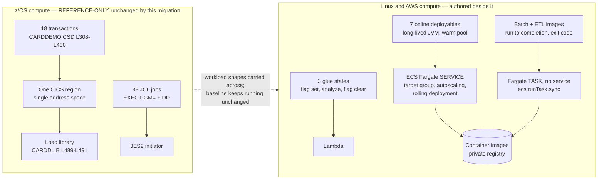

# ADR-002: Compute Platform for Services, Batch and Glue

> **Purpose.** Record decision D2 — which compute model runs each tier of the
> migrated system — together with the two further decisions this record is
> assigned by name: the container base-image pin, and the deliberate absence of
> any external resilience library. This record explains those choices; it does
> not reopen them.
>
> **Source of truth.** The decision of record is the Agent Action Plan (AAP)
> §0.1.2 row D2, which fixes the accepted option; §0.5.1.13 and §0.6.1.1 assign
> the two further decisions to this file. The behavioural specification is the
> COBOL baseline under `app/**`, which is **read-only**: this record cites it by
> path and line and never edits it. Where this record and the baseline appear to
> disagree about behaviour, the baseline is right and this record is wrong.

- **Status:** Accepted
- **Decision:** Run the **seven online deployables** as **ECS Fargate services**,
  run every batch step as a **Step-Functions-invoked Fargate task** from a task
  definition that has **no long-running service** behind it, and reserve **Lambda
  for glue only**. Three of the eleven states in the nightly chain are Lambda
  invocations; a small number of operational functions outside the chain are too,
  and all of them are enumerated in
  [The glue tier is bounded by role, not by count](#the-glue-tier-is-bounded-by-role-not-by-count)
  so that "glue only" stays a checkable claim. One platform, three provisioning
  shapes.
- Assumptions: Every count and cost figure below is read from what the
  environment roots actually compose — `local.online_services` and
  `local.workloads` in
  [`infra/envs/dev/main.tf`](../../infra/envs/dev/main.tf) — rather than from the
  number of service modules. **Nine** workloads receive a task definition,
  **seven** of them receive a service, a target group and autoscaling, and **two**
  — batch-service and the data-migration ETL — receive a task definition and
  nothing else, because nothing about them runs between invocations. Reasoning from
  eight always-on tiers instead inflates every figure that follows.
- Refactoring Rationale: The glue tier is bounded by ROLE and evidenced by the
  inventory below, never by a count of chain states, because the two are different
  quantities: two of the five functions are invoked from outside the chain
  altogether and two of the in-chain functions carry a second duty. A role boundary
  is also a claim a reader can check against the Terraform, where a count goes
  stale the moment an operational function is added.
- **Scope of this record.** The compute substrate, and nothing else. The
  language and runtime belong to [ADR-001](ADR-001-language-and-runtime.md), the
  datastore to [ADR-003](ADR-003-datastore-targets.md), the queues to
  [ADR-004](ADR-004-messaging.md), the batch state machine itself to
  [ADR-005](ADR-005-batch-orchestration.md), the API and UI surface to
  [ADR-006](ADR-006-api-and-ui.md), the service boundaries to
  [ADR-007](ADR-007-service-boundaries.md), the network and identity to
  [ADR-008](ADR-008-security-and-identity.md), and the provisioning tool to
  [ADR-009](ADR-009-iac-tool.md). This record cites those decisions where the
  reasoning touches them and re-decides none of them.

## Context

Three distinct workload shapes have to land somewhere, and they are not alike.
Each is described below from the baseline that defines it, because a compute
model chosen without reference to the shape it must carry is a preference rather
than a decision.

### Shape 1 — the online tier is one region hosting eighteen transactions

[`app/csd/CARDDEMO.CSD`](../../app/csd/CARDDEMO.CSD) is 505 lines and defines
**18** `DEFINE TRANSACTION` stanzas, each paired with a `PROGRAM(...)` entry
across **L308–L480**, alongside **8** `DEFINE FILE` resources. Those eighteen
transactions run inside a single CICS region: one address space, and therefore
one unit of deployment, one unit of failure and one unit of capacity for all of
them at once.

The migration decomposes that into eight bounded contexts, and which transaction
lands in which context is [ADR-007](ADR-007-service-boundaries.md)'s decision
rather than this one. What matters here is the consequence for compute, and it is
not simply "eight of something": **seven** of those contexts answer HTTP requests
and therefore need a substrate on which a long-lived process can be sized,
scaled, deployed and failed independently. The eighth, the batch context, answers
no request at all — it runs when the nightly chain invokes it and does not exist
between invocations — so it needs the same substrate in a different shape, which
is exactly the distinction Shape 2 draws.

Assumptions: the seven are auth, account, card, transaction, reference,
authorization and reporting, which is `local.online_services` in
[`infra/envs/dev/main.tf`](../../infra/envs/dev/main.tf) verbatim, and each is
reached through an ALB path pattern that root declares beside it. Reporting is
one of the seven and not a batch tier: it publishes report and statement
endpoints, and it *also* supplies the image two states of the nightly chain run
as a task — one image, two provisioning shapes, which is why the count of
services and the count of images are different numbers.

The programs themselves are long-lived processes serving short interactions.
That is the property the compute model has to accommodate for those seven, and it
is the property the [Rationale](#rationale) turns on.

### Shape 2 — a batch step is a process that runs to completion and reports a code

There are **38** JCL jobs in [`app/jcl`](../../app/jcl).
[`app/jcl/POSTTRAN.jcl`](../../app/jcl/POSTTRAN.jcl) is representative and small
enough to read whole: **L23** is its single `//STEP15 EXEC PGM=CBTRN02C`, and
**L24–L41** carry exactly **nine** `DD` statements — `STEPLIB`, `SYSPRINT`,
`SYSOUT`, `TRANFILE`, `DALYTRAN`, `XREFFILE`, `DALYREJS`, `ACCTFILE` and
`TCATBALF`. Eight of the nine reference an existing dataset; the ninth,
`DALYREJS` at **L34**, is created by the step itself with
`DISP=(NEW,CATLG,DELETE)`, a fixed 430-byte record length at **L36**, and a new
generation `(+1)` at **L38**.

Read as a contract rather than as syntax, that step is: a process, handed its
inputs by name, which runs to completion, writes its outputs, and reports a
return code an orchestrator can branch on. Nothing about it is
request/response, and nothing about it is short.

### Shape 3 — some steps are neither, and are barely work at all

Two of the baseline's operational jobs bracket the batch window rather than
doing any of its work — quiescing online writes before it and resuming them
after — and a third rebuilds an index. In the target these become three states
that set a flag, run a maintenance statement, and clear a flag. They hold no
connection pool and process no records: two of them write a single parameter and
the third issues a single statement, so their work does not scale with the record
volume the chain is moving. No duration is claimed for them here — see
[Accepted limitation](#accepted-limitation--this-record-chooses-a-platform-not-a-running-system)
— and one of them genuinely is not instantaneous in principle: `VACUUM ANALYZE`
takes as long as the database takes, which is why that function carries a
300-second timeout rather than a token one. What matters for the shape is that the work is a
single call and not a volume of records.

Recognising this third shape as distinct is what keeps the decision from
collapsing into a single answer applied uniformly.

### How a deployable reaches the runtime today

Program deployment in the baseline is a load library.
[`app/csd/CARDDEMO.CSD`](../../app/csd/CARDDEMO.CSD) **L489** defines
`LIBRARY(CARDDLIB)`, **L490** marks it `STATUS(ENABLED)`, and **L491** names
`DSNAME01(AWS.M2.CARDDEMO.LOADLIB)`. A second library follows at **L494**,
`LIBRARY(COM2DOLL)`, marked `STATUS(DISABLED)` at **L495**, whose **L496**
names that same load-library dataset — so the region carries two defined routes
to one body of code, with one of them switched off. That is a fact about the
definition, recorded because a reader comparing the two models needs to know
that the baseline's deployment target is a dataset that definitions point at,
not an artifact they contain.

The deck that installs those definitions is
[`app/jcl/CBADMCDJ.jcl`](../../app/jcl/CBADMCDJ.jcl), 167 lines, and two of its
properties are worth stating precisely. Re-running it takes a hand edit first:
**L38** reads `IF YOU ARE RERUNNING THIS, UNCOMMENT THE DELETE COMMAND.` above
a `DELETE GROUP(CARDDEMO)` that sits commented out at **L42**. And it does not
finish the job on its own: **L37** reads
`NOTE: INSTALL GROUP(CARDDEMO) - CEDA IN G(CARDDEMO)`, deferring installation
to an operator running CEDA afterwards.

Refactoring Rationale: these are properties of a deck written to be driven by an
operator at a terminal, which is what it is and what it was for — not defects.
They are cited here for one narrow purpose: the target's deployment unit is an
immutable image identified by content and rolled out by a controller, so the
re-run and the completion steps that the deck leaves to a person are properties
of the mechanism rather than instructions in it. The general treatment of
idempotence belongs to [ADR-009](ADR-009-iac-tool.md) and is not restated here.

### The question this record answers

Given three workload shapes and nine container workloads where there was one
region — seven of them answering requests continuously and two of them existing
only while a batch step runs:
**on what substrate does each shape execute, and what is each charged on?**



## Decision

Each shape gets the model that matches it, and the match is stated together with
the charge dimension it carries, because the two are the same choice seen from
two directions.

| Tier | Workload shape | Compute model | Charged on |
|---|---|---|---|
| The seven online deployables — auth, account, card, transaction, reference, authorization, reporting | Long-lived process, short request/response interactions, holds a connection pool | **ECS Fargate service** with a target group and autoscaling, rolling deployment, autoscaled between a floor and a bounded ceiling | vCPU-seconds and GiB-seconds **for as long as a task runs** |
| Every batch step — the batch-service image, the data-migration ETL image, and the reporting image in its task shape | Runs to completion, is handed arguments, reports an exit status | **Fargate task definition with no service behind it**, invoked by the state machine through the synchronous run-task integration | The same dimensions, **only for the step's own duration** |
| Glue and operational tasks — three of the eleven chain states, and the out-of-chain functions the inventory below names | Short, stateless, no pool, no records | **Lambda** | Per request and per GB-second of execution |

Assumptions: the second row is a *provisioning* distinction and not a different
platform. One reusable module builds every workload, and two of its inputs decide
the shape: `create_service` and `attach_load_balancer` are both set from
`each.value.online` in [`infra/envs/dev/main.tf`](../../infra/envs/dev/main.tf)
and identically in [`infra/envs/prod/main.tf`](../../infra/envs/prod/main.tf), and
in [`infra/modules/ecs-service/main.tf`](../../infra/modules/ecs-service/main.tf)
that one flag gates the `aws_ecs_service`, its load-balancer target group and its
autoscaling target and policy together. So the two offline workloads get a task
definition, a task role, a log group and an image, and get no service, no target
group and no autoscaling. This is why the tier boundary is legible in a plan
rather than only in prose: the resources themselves are absent.

### The glue tier is bounded by role, not by count

Every Lambda workload is named, so that "glue only" is a bounded claim and not a
loophole. Inside the nightly chain,
[`infra/modules/step-functions-batch/main.tf`](../../infra/modules/step-functions-batch/main.tf)
declares state **1 `QuiesceOnlineWrites`**, state **10 `AnalyzeTables`** and
state **11 `ResumeOnlineWrites`** as Lambda invocations, and the module's
[README](../../infra/modules/step-functions-batch/README.md) records the same
three against the baseline jobs whose behaviour they carry. Every other state in
the chain — the ones that stage datasets, post transactions, accrue interest,
back up, combine, generate statements and generate reports — is a Fargate task.

The complete inventory is four functions carrying six duties. All four are declared
in the environment roots and nowhere else; one of the four is invoked from outside
the chain entirely, and two of the in-chain functions carry a second duty, so a
count of chain states is not a count of functions:

| Function | Declared in | Duty |
|---|---|---|
| `quiesce` | each environment root | Chain state 1 — sets the read-only flag |
| `resume` | each environment root | Chain state 11 — clears the flag; **also** the target of the bracket-finalizer rule (`aws_cloudwatch_event_rule.daily_finalizer`), which releases the flag when an execution ends FAILED, TIMED\_OUT or ABORTED without reaching state 12 |
| `database_admin` | each environment root | Chain state 10 — runs `VACUUM ANALYZE`; **also** invoked once at apply time to run the schema-and-role bootstrap transactionally |
| `dataset_retention` | each environment root | Not a chain state — triggered by object creation in the dataset bucket to enforce generation retention |

Two clarifications the inventory earns. The maintenance statement is
`VACUUM ANALYZE`, which is what AAP §0.4.1.7 specifies for this state, and the
handler falls back to `ANALYZE` alone only if Aurora refuses the statement for
being inside a transaction block — logging a warning when it does, so a night that
refreshed statistics without reclaiming is distinguishable from one that did both.

Refactoring Rationale: this passage previously asserted the opposite — that the
statement is plain `ANALYZE` because "the Data API wraps a statement in a
transaction context and PostgreSQL refuses `VACUUM` there" — and the handler was
narrowed to match. The premise does not hold: `ExecuteStatement` documents that a
call omitting `transactionId` is not part of a transaction and commits
automatically, and the maintenance call passes no `transactionId`; only the
bootstrap path opens one. The claim was wrong in the same words in three places at
once — here, in [ADR-005](ADR-005-batch-orchestration.md) and in the cluster
module's README — which is what a shared false premise looks like when it is
copied rather than re-derived. The retained fallback is a hedge against the
protocol detail rather than a restatement of the premise, and it is narrow enough
that any other failure still fails the state.

And `seed_user_bootstrap.py` under the
Cognito module is **not** a Lambda despite the shape of its name — it runs as a
local provisioner at apply time — so it is absent from the table on purpose.

What makes the claim hold is the role boundary, not the number: not one of these
four holds a connection pool for request serving, and not one of them carries a
batch step's work. That is the whole content of "glue only".

Refactoring Rationale: a fifth row named `rotation`, attributed to
[`infra/modules/secrets`](../../infra/modules/secrets), stood in the table above
and has been removed, together with the "five functions" count and the claim that
two of them ran outside the chain. **No rotation function exists anywhere in this
package.** That module implements no rotation and says so at length in its
[`variables.tf`](../../infra/modules/secrets/variables.tf), which records that its
rotation input is a pass-through hook and closes with the instruction not to read
the presence of the variable as a claim that rotation ships working; both
environment roots leave that hook null; and both roots leave the observability
module's `rotation_lambda_function_names` at its empty default precisely so that no
alarm is created for a function that is not there. The row was the only artifact in
the repository asserting the opposite, and it asserted it in the record a reader
consults to learn what the compute tier contains — which is the worst place for it,
because a control listed as delivered stops being looked for.

### Credentials are static, and the re-issue procedure is the compensating control

The consequence of the paragraph above has to be stated plainly rather than left as
an absence: **the eight service database credentials do not rotate.** Each is
generated at apply time by an ephemeral `random_password` and written straight into
Secrets Manager through a write-only argument, so no value reaches Terraform state
— that part of the design is intact and is what
[ADR-008](ADR-008-security-and-identity.md) relies on. What is missing is any
schedule that replaces the value afterwards, so a credential's lifetime is the
lifetime of the stack unless an operator intervenes.

Re-issuing is a single deliberate action, and it is deliberate rather than
automatic. It is also **all-or-nothing**: the trigger is one literal shared by every
entry, so a re-issue replaces all eight credentials together and there is no
per-role variant.

1. Advance `secret_string_wo_version` in
   [`infra/modules/secrets/main.tf`](../../infra/modules/secrets/main.tf) from its
   current literal. That is the only trigger: a write-only argument is re-sent to the
   provider only when its paired version number changes, so an ephemeral generator
   producing fresh bytes on an unrelated plan does **not** rewrite a stored
   credential. The literal is pinned rather than exposed as an input on purpose, and
   the module records the reason at its point of use — a module cannot tell a
   deliberate increment from an accidental one, and an accidental one would replace
   every live credential at once.
2. `terraform apply` the environment root. Eight new values are generated ephemerally
   and written as new secret versions; each previous version remains staged, so a
   rollback needs no regeneration. No credential value is typed by an operator and
   none is committed.
3. Roll every ECS service, so that tasks holding a pool opened under a previous value
   re-resolve it. The pool is opened at task start, so a task is the unit of adoption.
4. Confirm no previous version is still referenced before allowing it to be removed by
   the recovery window.

Risk accepted, explicitly. A static credential's exposure window is unbounded in
time, so a value disclosed and not noticed stays usable until step 1 is performed —
and step 1 is a reviewed source edit rather than a parameter change, which raises the
friction of the remedy at the same time as it protects against an accidental mass
replacement. Three things bound the consequence rather than the window: the credential admits
only a PostgreSQL session, and the cluster sits in isolated subnets with no
internet route, so possession of the value is not sufficient to reach the database
from outside the VPC; each of the eight roles is scoped to one schema, so one
disclosed credential is not eight; and the value is never in Terraform state, so the
state file — the artifact most likely to be copied to a workstation — does not
carry it. Alternatives Considered: shipping a rotation function inside the secrets
module, which is what an earlier revision of that module actually did. It was
removed there for a reason recorded at its point of use — it pulled eight inputs
into the module's contract that existed only to serve a function the module has no
remit to own, and it required a third Terraform provider to build the deployment
package — and re-adding it here would recreate that coupling to close a window
that the two structural bounds above already narrow. Trade-offs: the accepted cost
is a manual step in a runbook rather than a schedule in code, and the honest
statement of that cost is this section. A deployment that requires scheduled
rotation supplies a function ARN to the pass-through hook the secrets module already
exposes; nothing in this package has to change for it to take effect.

Refactoring Rationale: an earlier revision of this record said "three of the
states in the nightly chain, and nothing else". The clause was false in two
independent ways — two functions run outside the chain, and two in-chain
functions have a second duty — so a reader auditing the decision against the
Terraform would have found five functions where the record promised three and
been right to call it a loophole. The count is replaced by an enumeration because
a count goes stale the moment an operational function is added, whereas the role
boundary does not.
The chain's shape, its condition-code handling and its restart behaviour are
[ADR-005](ADR-005-batch-orchestration.md)'s to record.

## Options Considered

Four options were weighed. Each is stated on its merits before the fact that
decided against it, because an option dismissed without its case stated cannot
be audited later.

### Option 1 — Serverless container tasks on ECS Fargate — ACCEPTED

Package each deployable as a container image, run the service tiers as
long-lived tasks behind a load balancer, and run each batch step as a task that
exits when the step is done. No host fleet exists underneath either.

Its fit is specific rather than general: a task is a **process**, so it can hold
process-scoped state that survives across requests — which for this workload
means a JDBC connection pool — and it can equally be started, allowed to run to
completion and read for an exit status, which is what a batch step is.

### Option 2 — Functions for every tier

Run each API endpoint and each batch step as a function invocation. Its
attraction is real and worth stating: nothing is charged between invocations at
all, and there is no task to size.

**Rejected for the API tier and for batch; adopted for glue.**

Alternatives Considered: two facts decided it, and only the second is absolute.

- **A per-invocation model has nowhere to keep a connection pool.** Each
  invocation begins with no guarantee of reusable process state, so a pool has to
  be established per invocation or moved out of the application into a separate
  connection-proxy component. The first defeats the purpose of pooling and the
  second adds a component whose only job is to solve a problem the accepted
  option does not have.
- **Batch steps exceed the fifteen-minute function execution ceiling.** This is
  a hard platform limit rather than a preference or a tuning question, and it
  removes functions from the batch tier outright. A posting run over a daily
  transaction file, a statement generation pass and a report pass are all
  bounded by the volume they are given rather than by a timeout, so an option
  that caps them at a quarter of an hour cannot carry them.

The option is nonetheless **adopted where the shape fits**, which is the third
workload shape above and exactly the three states named under
[Decision](#decision). Each sets or clears a flag, or issues one maintenance
statement, holds no pool and finishes well inside the ceiling. Recording this as
"Lambda for glue only" with the three states enumerated is what makes the scope
checkable.

### Option 3 — Containers on instances the project operates (ECS on EC2, or plain EC2)

Run the same container images, but on a fleet of instances the project
provisions, patches and scales. Its attraction is control: instance types are
chosen directly, the kernel and the operating system are reachable, and reserved
or spot purchasing becomes available.

**Rejected.**

Trade-offs: what this option buys is operating-system-level control, and what it
costs is an operating system to own — patching, AMI lifecycle, node draining
during replacement, and capacity planning for a fleet that has to be large
enough for the nightly peak. Nothing in this workload asks for that control:
these are JVM processes reading a relational database and a queue, with no kernel
tuning, no device access and no host-level agent requirement. And the charge
shape is instance-hours whether or not work is running, so a fleet sized for the
nightly batch window is idle for the rest of the day while still being paid for.
The control is given up deliberately, because the burden is the thing being shed.

### Option 4 — Kubernetes on EKS

Run the images on a managed Kubernetes control plane. Its attraction is a
scheduling and workload vocabulary that would express both tiers — Deployments
for the services and Jobs for the batch steps — under one API.

**Rejected.**

Trade-offs: this is an operational-burden judgement scaled to the component
count, and it is not a criticism of Kubernetes, whose capabilities exceed what
this system needs rather than fall short of it. The system is seven online
services, two invoke-only images and one nightly chain. Adopting Kubernetes would add a control plane
to run, a cluster version and add-on lifecycle to track, and a manifest and
scheduling discipline for engineers to hold, in exchange for capabilities —
custom scheduling, service meshes, operators, portable workload definitions —
that no requirement in this migration asks for. The batch chain's dependency
graph is already expressed declaratively by the orchestrator chosen in
[ADR-005](ADR-005-batch-orchestration.md), so the strongest reason to reach for
a workload API is already met elsewhere.

### The four options side by side

| Option | Holds a warm pool across requests | Carries a step past fifteen minutes | Host fleet to patch and size | Charged when idle | Verdict |
|---|---|---|---|---|---|
| 1 — Fargate tasks | **Yes** | **Yes** | **None** | **No** | **Accepted for services and batch** |
| 2 — Functions | No, without an added proxy | **No — hard ceiling** | None | No | Rejected for services and batch; **accepted for the three glue states** |
| 3 — Containers on owned instances | Yes | Yes | **Yes** | **Yes — instance-hours** | Rejected: burden and idle capacity with no offsetting requirement |
| 4 — Kubernetes on EKS | Yes | Yes | Control plane and cluster lifecycle | Control plane, continuously | Rejected: capability the component count does not call for |

## Rationale

Five facts carry the decision. Each is checkable in this repository or is a
stated platform limit; none of them is a preference.

### 1. The workload holds a connection pool, and a task process can hold one

Every one of the seven online services reads and writes a relational database on
essentially every request. Establishing a database connection is expensive
relative to the work a single request does, which is why the services pool
connections: the pool is built once when the task starts and reused across every
request that task subsequently serves.

That pooling is not incidental to this migration — it is the direct analogue of
what the baseline already had. A CICS region holds its file-control connections
open for the life of the region, so no transaction pays a per-interaction cost
to reach its data. A Fargate task holds its JDBC pool open for the life of the
task and reproduces that property. The pools are sized explicitly rather than
left at a default, per service and per environment: the base configuration sets
`maximum-pool-size: 10` for the six request-path services (4 for reporting and
for batch, whose work is job-shaped), the development profile lowers it, and the
production profile raises it — for example
[`services/account-service/src/main/resources/application.yml`](../../services/account-service/src/main/resources/application.yml)
against its `application-dev.yml` and `application-prod.yml` siblings.

Alternatives Considered: a per-invocation compute model with a managed
connection proxy in front of the database would also give pooled connections. It
was rejected because it reaches the same place by adding a component: a proxy to
provision, authorise, monitor and pay for, whose entire purpose is to restore a
property a task process has natively. The comparison is not pooling versus no
pooling; it is one component versus two.

### 2. Statelessness is earned from the baseline, and it is what makes scale-out available

A tier can only be scaled horizontally if any task can serve any request. The
baseline could not do that, and understanding exactly why is what shows the
target can.

The baseline is strictly pseudo-conversational: the CICS task ends at every
screen turn, so everything that has to survive between turns is carried in one
passed structure.
[`app/cpy/COCOM01Y.cpy`](../../app/cpy/COCOM01Y.cpy) **L19–L44** defines that
structure — `CARDDEMO-COMMAREA`, with navigation fields
(`CDEMO-FROM-TRANID`, `CDEMO-TO-PROGRAM`, `CDEMO-LAST-MAP`), identity
(`CDEMO-USER-ID`, `CDEMO-USER-TYPE` with its `'A'`/`'U'` condition names),
selection context (`CDEMO-ACCT-ID`, `CDEMO-CARD-NUM`, `CDEMO-CUST-ID`) and a
re-entry discriminator (`CDEMO-PGM-CONTEXT`) — and it is shared by all eighteen
online programs. The mechanism is visible in one program end to end:
[`app/cbl/COSGN00C.cbl`](../../app/cbl/COSGN00C.cbl) declares the inbound side
at **L65–L67** as `01 DFHCOMMAREA.` with
`05 LK-COMMAREA PIC X(01) OCCURS 1 TO 32767 TIMES DEPENDING ON EIBCALEN`,
distinguishes a first entry from a continuation at **L80** with
`IF EIBCALEN = 0`, and closes every turn at **L98–L102** with
`EXEC CICS RETURN ... COMMAREA (CARDDEMO-COMMAREA)`.

The migration decomposes that one structure into three separate mechanisms, none
of which lives on the server between requests: navigation becomes client-side
router history, identity becomes claims in a signed token validated per request,
and selection context becomes request path parameters. The re-entry
discriminator disappears entirely, because a handler that returns a structured
per-field error response has no first-entry-versus-continuation distinction to
make. The mechanisms themselves belong to
[ADR-006](ADR-006-api-and-ui.md) and
[ADR-008](ADR-008-security-and-identity.md).

The consequence **for compute** is this record's, and it is the load-bearing
one: no service holds session state, so **no sticky sessions and no server-side
session store are required**, and any task can serve any request. That is what
makes a tier of interchangeable tasks behind a load balancer viable at all — and
it is also what makes rolling replacement safe, since replacing a task destroys
nothing a subsequent request needs.

Assumptions: this rests on identity arriving as a validated token claim rather
than as a field the client supplies. The distinction is load-bearing beyond
compute — a passed structure is storage the client echoes back, whereas a signed
claim cannot be asserted by the client — and it is
[ADR-008](ADR-008-security-and-identity.md)'s to establish. This record depends
on it and does not prove it.

### 3. A batch step is a process with an exit status, and a task exposes exactly that

Shape 2 above described the contract:
[`app/jcl/POSTTRAN.jcl`](../../app/jcl/POSTTRAN.jcl) hands `CBTRN02C` nine named
resources, lets it run to completion, and leaves a return code for the next step
to branch on. A container task reproduces every element of that contract without
adaptation — the container's command and environment carry what `PARM=` and
`DD DSN=` carried, the task runs unbounded by any invocation timeout, and the
task's exit status is the return code.

The synchronous run-task integration is what joins the two: the state machine
starts the task, waits for it to finish, and treats the terminal task state as
the state's own result. That integration is declared in
[`infra/modules/step-functions-batch/main.tf`](../../infra/modules/step-functions-batch/main.tf)
and its per-state retry, catch and timeout behaviour is
[ADR-005](ADR-005-batch-orchestration.md)'s to record.

### 4. Health is a checkable endpoint, and for the online tier that endpoint drives replacement

Each service exposes an actuator health endpoint. For the **seven online
services** it is the **load balancer's target group** that consumes it: a task
failing the configured threshold is taken out of rotation and, because the target
group's health is the service's health, replaced. That health block is declared in
[`infra/modules/ecs-service/main.tf`](../../infra/modules/ecs-service/main.tf)
and is created only when a load balancer is attached, which is the same condition
that creates the service at all.

Assumptions: the image's own `HEALTHCHECK` is **not** an ECS health signal, and
reading it as one mistakes the mechanism. ECS acts on a **task-definition**
`healthCheck`, and this module deliberately declares none — the rationale is
recorded at the container definition itself: the command a container health check
runs must exist inside the image, only each Dockerfile knows what its pinned base
image ships, and a headless Corretto runtime carries no `curl`. So the authored
`HEALTHCHECK` instructions — for example
[`services/batch-service/Dockerfile`](../../services/batch-service/Dockerfile),
`HEALTHCHECK --interval=30s --timeout=5s --start-period=30s --retries=3` against
`http://127.0.0.1:8080/actuator/health` — are **image metadata**. They are honoured
by a container runtime that reads them, which is what makes them useful for a local
`docker run` and for any registry or scanner that reports image health, and they are
**not** part of ECS's replacement decision.

Assumptions: the two offline workloads therefore have no health-driven replacement
at all, and need none. They are not load-balanced, so there is no target group to
report to, and they are not services, so there is nothing to replace: a batch task
that hangs is bounded by its state's own `TimeoutSeconds` in the state machine,
whose catch handler notifies and fails the chain. Health for that tier is the
step's outcome, not a probe.

Assumptions: for the online tier the probe is only as useful as its reach. A
liveness-only response would report a task healthy while its database connectivity
was gone, so the probe is datasource-aware — which is what lets a hung dependency
surface as an unhealthy target rather than as a task that accepts requests it
cannot serve.

### 5. Deployment is rolling replacement, and that is the whole of it

Because tasks are interchangeable (fact 2) and health is checkable (fact 4), a
new image version is deployed by starting replacement tasks and stopping old
ones under a controller bounded by explicit minimum-healthy and maximum-percent
settings. Roll forward and roll back are the same operation with a different
image version.

Blue-green and canary deployment are **out of scope** for this migration and are
not available here. They are named explicitly so that nothing in this section
reads as a claim to have shipped them: each would require a second task set and
traffic-shifting configuration that the authored service module does not create.

## Cost Implications

Reasoned as pricing **shape and drivers** — which dimension is charged, what
drives it up, and how the two environments differ under it.

Trade-offs: no currency figure appears in this section and no price list is
quoted, which makes it less immediately actionable than a costed estimate would
be. That is accepted for a specific reason rather than a general one: a price
list can change without anything in this repository changing, so a figure
recorded here would be cited and would then go stale silently, whereas a charge
dimension and its driver stay true across a price revision. The numbers that do
appear below are **configuration values committed in this repository**, not
prices.

### The charge dimension, stated once

Serverless container tasks are charged on **vCPU-seconds and GiB-seconds for the
duration a task runs**. Three drivers follow directly, and they are the only
three: how large each task is, how many tasks there are, and how long they run.
There is no charge for a task that is not running and no host fleet charged
underneath one.

That last property is what makes the three tiers cost fundamentally differently
on one platform, which is the point of this section.

### The always-on tier: task count times task size times hours running

For the **seven online services** the third driver is pinned — they run
continuously — so cost reduces to `task count × task size × hours running`. Those
are therefore exactly the levers that separate the environments, and per AAP
§0.4.1.6 the two environment roots differ **only** in sizing and retention, never
in topology: an operator reading either root sees the same resources.

Assumptions: seven is the number this arithmetic is multiplied by, and the two
offline workloads are excluded from it because nothing of theirs runs between
invocations — a task definition is a description, and a description is not
charged. Including them would overstate the always-on bill by two ninths, and it
would misplace their cost as well as its size: batch and ETL compute belongs to
the batch tier below, where it is charged by the step.

The committed values make the lever concrete:

| Lever | `dev` | `prod` |
|---|---|---|
| `ecs_task_cpu` | 512 | 1024 |
| `ecs_task_memory` | 1024 | 2048 |
| `ecs_desired_count` | 1 | 2 |
| `log_retention_days` | 7 | 365 |
| `deletion_protection` | `false` | `true` |

Read from
[`infra/envs/dev/terraform.tfvars`](../../infra/envs/dev/terraform.tfvars) and
[`infra/envs/prod/terraform.tfvars`](../../infra/envs/prod/terraform.tfvars).
A development environment is cheaper by being smaller and by running fewer
tasks, and by nothing else — no resource is absent from it. Autoscaling adds the
one variable term: the task count floats between a floor and a **bounded**
ceiling, which is what keeps a fault-driven scale-out from becoming an unbounded
charge as well as an unbounded load.

### The batch tier: charged by the step, not by the window

Every batch step runs on the same platform and is therefore charged on the same
dimensions — but only for its own duration. A nightly chain's compute cost is
bounded by the chain's own runtime, and between chains it is nil. This is the
single largest cost difference between the accepted option and Option 3: a fleet
provisioned to be large enough for the nightly peak is paid for during the
hours it is not being used, whereas a per-step task is charged only while its own
step runs. How large that gap is depends on the chain's runtime, which this record
does not measure and therefore does not quantify; the direction of the difference
follows from the charge shape alone, which is all the comparison needs.

### The glue tier: per request, on a cadence measured in invocations per day

Functions are charged per request and per GB-second of execution. Of those two
terms only the first can be stated here without a measurement, and it can be
stated exactly, because an invocation count is a property of the design rather
than of observed load: the three chain states run once per nightly execution, the
watchdog fires only when an execution ends abnormally, credential rotation runs on
its configured schedule, and dataset retention runs once per object created. That
is single-digit invocations per day in normal operation, so the per-request term is
negligible by arithmetic on the count and not by assumption.

The GB-second term is the product of memory and duration, and **duration is not
measured anywhere in this record** — see
[Accepted limitation](#accepted-limitation--this-record-chooses-a-platform-not-a-running-system).
No figure is offered for it. Naming the split is the point: what makes "glue" the
honest description is that these workloads are bought per invocation on a
low-frequency cadence, and were they doing real work the per-invocation dimension
would stop being the cheapest way to buy them.

Refactoring Rationale: the three sentences corrected in this section and the two
above it previously asserted that the glue states "finish in moments", that a
provisioned fleet idles for "twenty-odd hours", and that the per-request term
"rounds to nothing" — while this same record states that no benchmark or load
test has been performed and that it makes no latency or throughput claim. Those
are duration claims, so the record contradicted its own caveat. Each is now either
grounded in something knowable without measurement — a billing dimension, an
invocation count, the number of calls a handler makes — or explicitly declined.
The claims were not merely deleted, because the cost reasoning they supported is
required of this record and remains sound on the mechanical grounds now given.

### What the rejected options would have cost instead

- **Option 2, had it carried the API tier.** Its charge shape is attractive —
  nothing between invocations — but the connection proxy that makes it workable
  is a separately charged managed component, so the comparison is not
  invocations versus tasks; it is invocations plus a proxy versus tasks. Its
  disqualification is the execution ceiling rather than its cost.
- **Option 3, the shape this decision most avoids.** Instance-hours accrue
  whether or not work is running, so the fleet must be sized for the nightly
  peak and is idle for most of the day at full price. Reserved or spot purchasing
  could reduce the rate but not the shape, and both add commitment or
  interruption handling to manage. On top of the rate sits an unpriced but real
  operational cost: patching, AMI rebuilds and capacity planning are engineering
  hours that the accepted option does not spend.
- **Option 4.** A managed control plane is charged continuously per cluster,
  independent of the workload on it, and the cluster and add-on lifecycle is
  again engineering hours. For seven online services, two invoke-only images and
  one nightly chain both terms buy capability the workload has no requirement
  for.

### The guiding principle, and the one place it applied here

The principle this project is held to is reproduced verbatim:

> "Prefer AWS-managed services over self-managed where it lowers operational
> burden, unless cost or a hard constraint dictates otherwise. When a decision
> is a close call, choose the lower-risk, lower-cost option and note it."

Its first sentence decides D2 on its own. Fargate removes the host fleet
entirely, which is the largest single reduction in operational burden available
among the four options, and neither cost nor a hard constraint points the other
way — the cost comparison favours it as well, because it removes the idle
instance-hours that Options 3 and 4 carry. This is the instance the AAP §0.9.4
summary refers to when it notes the principle applying "most visibly in choosing
serverless container tasks over a persistently-provisioned cluster", and it is
recorded here because this is the record it belongs to.

**D2 is not a close call, and it is not presented as one.** Exactly two
decisions in this migration are genuinely close, and each is recorded as such in
its own record: queue service versus managed broker in
[ADR-004](ADR-004-messaging.md), and orchestrator versus batch service in
[ADR-005](ADR-005-batch-orchestration.md). D2 is decided by a stated platform
limit for the batch tier and by an unopposed burden-and-cost comparison for the
service tier. Recording a third close call here would misrepresent how much
judgement the choice actually required.


## Trade-offs and Risks

### Accepted trade-off — a new task is not immediately useful

A replacement or scale-out task has to start a JVM, load classes and establish
its connection pool before it can serve a request. That latency is inherent to
the model chosen in fact 1 of the [Rationale](#rationale): the thing that makes
a warm pool possible is that the process is long-lived, and a long-lived process
has a start-up.

Trade-offs: the cost is paid at scale-out and at deployment rather than per
request, and it is accepted because the alternative shape — paying a smaller
setup cost on every single invocation — is what Option 2 does, and it is worse
for a request path that touches the database every time. It is made tolerable
rather than eliminated: the service tier keeps a warm floor of running tasks
(`ecs_desired_count`, and the module's `min_capacity`) so the steady state is
never a cold start, autoscaling adds capacity ahead of saturation rather than in
response to an individual request, and the health probe's start period keeps a
starting task out of rotation until its pool is up instead of routing to it early.

### Accepted trade-off — no operating-system-level control

There is no host to log into, no kernel to tune and no node-level agent to
install. Trade-offs: this is the burden being shed rather than a limitation
reluctantly accepted, and the exchange is explicit — Option 3 offered that
control and was declined for it. The residual constraint is real and worth
stating: anything that would have been solved by a host-level daemon has to be
solved inside the image or by a platform feature instead.

### Risk — connection pools multiply with task count

Each task holds its own pool, so the total number of database connections the
tier can open is `pool size × task count`, and autoscaling moves the second
term. Left unbounded this is a genuine failure mode: a scale-out driven by a
fault rather than by demand could exhaust the database's connection capacity and
turn a partial problem into a total one.

Mitigation is on both terms, and both are committed rather than intended. The
pool size is set explicitly per service and per profile rather than left at a
framework default — `maximum-pool-size: 10` in the base configuration for the six
request-path services and 4 for reporting and for batch, lowered again in `dev`
(2 to 5 across the services) and raised in `prod` (8 to 20). And the task count
has a ceiling.

The ceiling that actually applies is set in the environment roots, **not** by the
module default, and the difference matters enough to state both:

| Autoscaling bound | Module *default* | `dev` (effective) | `prod` (effective) |
|---|---|---|---|
| `min_capacity` | 2 | **1** | **2** |
| `max_capacity` | 6 | **2** | **4** |

The module's own numbers live in
[`infra/modules/ecs-service/variables.tf`](../../infra/modules/ecs-service/variables.tf),
which documents `max_capacity` as bounding the blast radius of a scale-out driven
by a fault rather than by demand. They are **defaults only**, and no environment
uses them: both roots pass the bounds explicitly, deriving them from the single
lever that already separates the environments —
`min_capacity = var.ecs_desired_count` and
`max_capacity = max(var.ecs_desired_count, var.ecs_desired_count * 2)` in
[`infra/envs/dev/main.tf`](../../infra/envs/dev/main.tf) and
[`infra/envs/prod/main.tf`](../../infra/envs/prod/main.tf), over the
`ecs_desired_count` of 1 in `dev` and 2 in `prod` recorded in
[Cost Implications](#the-always-on-tier-task-count-times-task-size-times-hours-running).
The defaults are retained in the table rather than dropped, because a root that
omitted the override would get them, so they remain the fallback a reader needs
to know.

Autoscaling is additionally enabled only for the online services; the batch and
data-migration workloads are pinned at a single task with autoscaling off, so the
ceiling above bounds the request-serving tier and nothing else.

The products the database has to accept therefore are the following, taking each
service's `prod` pool against the effective `prod` ceiling of 4 tasks and each
`dev` pool against the effective `dev` ceiling of 2:

| Service | `dev` pool × 2 | `prod` pool × 4 |
|---|---|---|
| auth | 5 × 2 = **10** | 20 × 4 = **80** |
| account | 4 × 2 = 8 | 20 × 4 = **80** |
| card | 3 × 2 = 6 | 20 × 4 = **80** |
| reference | 4 × 2 = 8 | 20 × 4 = **80** |
| authorization | 4 × 2 = 8 | 20 × 4 = **80** |
| transaction | 4 × 2 = 8 | 16 × 4 = 64 |
| reporting | 2 × 2 = 4 | 8 × 4 = 32 |
| batch (1 task, no autoscaling) | 4 × 1 = 4 | 4 × 1 = 4 |
| **Tier total** | **56** | **500** |

Assumptions: the module DEFAULTS are not the deployed bounds, and quoting them as
though they were is an error that stays invisible until it matters — it overstates
`dev`'s floor and both ceilings, so a reader sizing the database against this record,
or carrying a figure into an [ADR-003](ADR-003-datastore-targets.md) capacity
conversation, would provision for a scale-out that cannot happen while still not
knowing what the real one is. Quoting only the single largest product is not enough
either: the per-service products are the numbers that have to fit together.
Trade-offs: naming the module value and both effective values in one table, and
then every service's product in a second, is more numbers than a bound and a
maximum would be. That is the cost of keeping the module's own contract visible
without letting it stand in for the deployment, and of making the tier total
addable rather than asserted.

Assumptions: the product of those two terms has to fit what the database will
accept, and the database's capacity is [ADR-003](ADR-003-datastore-targets.md)'s
to set. The two decisions are coupled here and nowhere else, so raising a pool
size or a task ceiling is a change that has to be read against that record
rather than made in isolation.

### Risk — image size becomes task start time

Every second a task spends pulling an image is a second added to the latency
described in the first trade-off above, and it is paid on every scale-out and
every deployment.

Mitigation: the images are multi-stage, so the runtime stage carries the
application and a Java runtime and none of the build tooling that produced it —
the build stage's Maven installation, the local repository it populates and the
source tree all stay behind. The `-headless` runtime variant chosen under
[Additional decision 1](#1-container-base-image-pin) contributes to the same
end, carrying no graphical toolkit for a service that renders nothing.

### Risk — a task's local storage is not somewhere to keep anything

A task can be replaced at any time by a deployment, a scaling action or a health
failure, so nothing written to its filesystem or held in its heap survives.

This is a risk only for code that forgets it. It is structurally addressed for
session state, which fact 2 of the [Rationale](#rationale) establishes does not
exist server-side at all. It remains a live constraint for batch steps, whose
intermediate outputs go to object storage or to the database rather than to a
task-local path, and whose restartability is a durable step ledger rather than a
file left on disk — both [ADR-005](ADR-005-batch-orchestration.md)'s to record.

### Accepted limitation — this record chooses a platform, not a running system

Stated plainly, because an architecture record can be read as a claim about a
deployed environment.

- The infrastructure is **authored and statically validated** — formatting,
  initialisation, validation and lint run as gates. Applying it to a live AWS
  account is an operator action outside this scope, so nothing here should be
  read as evidence that a provisioned environment exists.
- **No benchmark and no load test has been performed.** This record makes no
  throughput, latency, start-up-time or capacity claim. Every statement about
  task start-up, pool warmth and scale-out above is reasoned from the model's
  mechanics, and none of it is measured.
- The task sizes and counts in [Cost Implications](#cost-implications) are
  committed starting values chosen to differentiate the environments, not results
  derived from observed load.

## Additional Decisions Recorded Here

AAP §0.5.1.13 assigns two further decisions to this record by name, and §0.6.1.1
closes its resilience discussion by directing the reader here. A third is
recorded below as well: the dependency-compatibility decision behind the
`spring-cloud-aws.version` pin, which belongs with the other two because it is
the same kind of choice — a version fact that is invisible in a green build.
Each is recorded in its own right, because each is a non-obvious choice with an
alternative that looks reasonable until the fact against it is known.

### 1. Container base image pin

Every base image named below is pinned to an exact tag rather than a floating one,
and **all ten Dockerfiles** additionally pin the immutable content digest alongside
the tag, so a rebuild resolves the same bytes even if a tag is republished.

| Stage | Image | Used by |
|---|---|---|
| Java runtime | `public.ecr.aws/amazoncorretto/amazoncorretto:21.0.12-al2023-headless` | The eight service images |
| Java build | `maven:3.9.16-amazoncorretto-21-al2023` | The build stage of the same eight |
| SPA build | `node:22.23.2-alpine` | The build stage of the user-interface image |
| SPA runtime | `nginx:1.30.4-alpine` | The runtime stage of the user-interface image |
| ETL | `python:3.13.14-slim-trixie` | The data-migration image |

Four properties of that table are decisions rather than defaults.

**There is no Alpine variant of the Corretto image, and assuming one costs a
build.** Alternatives Considered: `21-alpine` is the tag a reader would reach for
to shrink the runtime layer, and it is the tag the migration plan names.
**That tag does not exist and fails every image build.** The repository publishes only `-al2` and `-al2023` tags, carried with
`headful`, `headless`, `generic` and `jdk` suffixes; there is no Alpine or musl
variant at all, and the highest 21.x available at the time of verification is
`21.0.12`. The `-headless` suffix is the size reduction that *is* available here,
and it is the one taken. This is recorded so that the tag is not "simplified"
later into one that cannot resolve.

**The build stage is matched to the runtime deliberately.** Assumptions: the
build image names the same JDK vendor and the same major version as the runtime
image, so bytecode is produced by the same vendor's compiler that will execute
it. An unmatched pair would compile against one JDK and run on another, which is
supported in general but removes a guarantee for nothing in return, since the
matched tag is published and equally available.

**The SPA runtime takes the stable nginx branch rather than mainline.**
Trade-offs: mainline carries newer features and stable receives a longer patch
window. A server whose entire job is returning pre-built static assets and one
SPA fallback route has no use for mainline's feature additions, so the currency
is given up and the longer patch window taken. The trade would go the other way
for a server doing request processing that mainline had improved.

**The ETL image matches the interpreter the existing test suite already runs
on.** Assumptions: the fixed-width and zoned-decimal decoding the ETL performs is
validated against the existing COBOL suite's own outputs, so the ETL and that
harness must agree byte for byte on how a record decodes. Pinning the same
interpreter line removes interpreter version as a possible source of
disagreement, which matters because a decoding difference in the money path does
not raise an error — it produces a plausible number that is wrong. The
per-field decoding rule this depends on belongs to
[`data-migration/README.md`](../../data-migration/README.md).

**Every digest is the multi-platform INDEX digest, not a platform manifest
digest.** Assumptions: the two are different values for the same tag, and
`docker images` reports the second while `docker buildx imagetools inspect`
reports the first. Pinning a platform manifest would resolve on one builder
architecture and fail on the other, so the index digest is the only form that
lets a linux/amd64 and a linux/arm64 builder both reproduce the image. The ten
files are the eight service images —
[`services/auth-service/Dockerfile`](../../services/auth-service/Dockerfile) and
its seven siblings, each pinning both the Maven build tag and the Corretto runtime
tag — the ETL image
([`data-migration/Dockerfile`](../../data-migration/Dockerfile)), which pins its one
tag in both stages, and the browser SPA image
([`ui/Dockerfile`](../../ui/Dockerfile)), which pins the Node build tag and the
nginx runtime tag.

**The SPA runtime is the stable nginx branch rather than mainline.**
Alternatives Considered: mainline 1.31.x, which carries newer features. Declined
because a static asset server needs none of them and stable receives the longer
patch window, so the branch that changes least is the one serving a bundle that
changes on every deployment.

**Private registry references are placeholders, and that is deliberate.** The
public base images above are named verbatim because they are public registry
paths carrying no account identity. The project's own image registry is never
written concretely anywhere in this documentation; a reference to it takes the
form below, and no account identifier, region-qualified private hostname or ARN
appears in this record.

```bash
# WHAT: the shape of a private image reference as it appears in documentation —
#       a placeholder for the account identifier, the region and the repository,
#       with the tag supplied by the build.
# WHY : Assumptions: an account identifier is account-identifying metadata, so it
#       is supplied at deploy time from infrastructure outputs and never written
#       into a document or a variables file. Trade-offs: a reader cannot copy this
#       line and run it, which is the intended cost — a concrete registry host
#       committed to the repository would be a durable disclosure, whereas a
#       placeholder only costs one substitution.
echo "<aws-account-id>.dkr.ecr.<region>.amazonaws.com/<repository>:<tag>"
```

### 2. No external resilience library

**Decision: no resilience library is added at all** — neither
`io.github.resilience4j:resilience4j-spring-boot3` nor the superseded
`org.springframework.retry:spring-retry` is adopted, declared or used by any
CardDemo class. This is AAP §0.6.1.1 verbatim and this record does not reopen it.

The capability that would have justified one is already on the classpath. Spring
Framework 7, which arrives inside the Spring Boot parent chosen in
[ADR-001](ADR-001-language-and-runtime.md), relocated retry support into the
framework core: `@Retryable`, `@ConcurrencyLimit` and a programmatic
`RetryTemplate` with a `RetryPolicy`, whose builder accepts `includes`,
`excludes`, `maxRetries`, `delay`, `jitter`, `multiplier` and `maxDelay`. Adding
a library would duplicate a capability already present and would have to be
re-evaluated at every framework upgrade.
`io.github.resilience4j:resilience4j-spring-boot3` is additionally rejected
because its published artifact targets the previous Spring Boot generation.

**The decision is enforced in two places rather than asserted once.**

1. `services/pom.xml` declares a `maven-enforcer-plugin` `bannedDependencies`
   rule over both coordinates with `searchTransitive` set to `false`, so a module
   that DECLARES either library fails at `validate` — before compilation, in the
   same execution that already pins the toolchain and bans dynamic versions.
2. Rule **A5** of the ArchUnit gate in the shared kernel
   ([`LayeringRulesTest`](../../services/common-lib/src/test/java/com/carddemo/common/architecture/LayeringRulesTest.java))
   fails the build if any class under `com.carddemo` depends on
   `org.springframework.retry..` or `io.github.resilience4j..`, and that gate runs
   in every module of the reactor rather than only in the module declaring it.

Together those cover the two ways a library gets adopted: named in a manifest, or
imported in source. The day a service reaches for either one the build stops,
instead of a reviewer having to notice.

**Assumptions: one transitive copy of `spring-retry` is on the classpath and is
neither adopted nor removable.** The resolution path is
`io.awspring.cloud:spring-cloud-aws-starter-sqs:4.1.0` →
`io.awspring.cloud:spring-cloud-aws-sqs:4.1.0` →
`org.springframework.retry:spring-retry:2.0.13`, at **compile** scope, in the four
modules that consume the SQS starter — account, reference, batch and authorization
services. It belongs to the AWS integration and not to this project: that artifact
references `org/springframework/retry` from six of its own classes, among them
`AbstractPollingMessageSource`, `ContainerOptions`, `ContainerOptionsBuilder` and
`AbstractPollingMessageSource$NoOpsBackOffContext`. The command that shows it is:

```bash
# WHAT: list every path by which Spring Retry reaches this reactor.
# Assumptions: this is a claim about the dependency graph, so it is stated with the
#   command that checks it rather than left to be trusted.
mvn -f services/pom.xml dependency:tree \
    -Dincludes=org.springframework.retry:spring-retry
```

Alternatives Considered: **excluding `spring-retry` from the SQS starter**, so the
artifact would be absent from the classpath entirely. Rejected on that same
measurement: those six classes implement the listener container's own polling
back-off, so the exclusion would delete a type the integration loads at run time
and turn a clean dependency report into a `NoClassDefFoundError` that appears only
once a queue is being polled. The enforcer rule is therefore scoped to DIRECT
declarations deliberately — `searchTransitive=false` — because banning the
coordinate transitively would ban the SQS starter with it.

Alternatives Considered: both candidates are rejected at the point of use as well
as here — in the dependency rationale in
[`services/pom.xml`](../../services/pom.xml), and as item 9 of
[`docs/CODE_DOCUMENTATION_STANDARD.md`](../CODE_DOCUMENTATION_STANDARD.md), where
it serves as a worked example of a documented non-obvious choice. This record is
the decision of record for both rejections; the other two locations restate it
where a reader of that file needs it.

**Two API details are recorded because getting either wrong costs a debugging
cycle**, and both differ from the shape a reader will find in an example written
against the previous framework generation.

1. The annotation attribute is **`maxRetries`**, **not** `maxAttempts`. Total
   attempts are **one plus** that value, and the default is three. Reading it as
   an attempt count is an off-by-one in a retry budget, which is the kind of
   error that surfaces only under the failure it was meant to handle.
2. The enabling annotation is **`@EnableResilientMethods`** on a configuration
   class, **not** the older `@EnableRetry`. A service that copies a previous-
   generation example will not compile, which at least fails loudly — but it
   fails at a point far from the cause unless the difference is written down.

**In-process retry is the thin top layer, not the whole story.** The durable
retry tiers are supplied by the infrastructure rather than by the application,
which is the second and independent reason no library is declared:

- Queue redelivery, with a dead-letter queue at **`maxReceiveCount` 5** —
  [ADR-004](ADR-004-messaging.md).
- Per-state retry with exponential backoff in the batch state machine —
  [ADR-005](ADR-005-batch-orchestration.md).

Both survive a task being replaced mid-work, which no in-process retry can. An
in-process retry loop covers a transient blip inside one request; it cannot
cover the process disappearing, and the risks section above establishes that a
task can disappear at any time.

**A circuit breaker is deliberately omitted.** Trade-offs: the only synchronous
service-to-service hops in this system run **inside the private network behind an
internal load balancer, with explicit connect and read timeouts on the HTTP
client**. A breaker would add a failure mode of its own — an open circuit
rejecting calls a recovered dependency could have served — without removing one,
because the bounded timeouts already stop a slow dependency from consuming
callers indefinitely. What is given up is fast failure during a partial outage,
which those timeouts approximate. The absence is a decision, not an oversight,
which is why it is recorded rather than left to be noticed.

**Lombok is not adopted either, and for a related reason.** Alternatives
Considered: it was evaluated for the entity and DTO classes and rejected because
generated accessors cannot carry the documentation that Rule 1 and
[`docs/CODE_DOCUMENTATION_STANDARD.md`](../CODE_DOCUMENTATION_STANDARD.md)
require of every public member; Java 21 `record` types with explicit constructors
give the same brevity with members a reader and a documentation gate can both
see. It is grouped here with the other decisions to add nothing, and the
rejection is recorded at its point of use in
[`services/pom.xml`](../../services/pom.xml) beside the gate that forced it.

### 3. Spring Cloud AWS runs one Boot minor ahead of what it is built against

**Decision: `io.awspring.cloud` stays pinned at 4.1.0 under Spring Boot 4.1.0,
the mismatch is stated rather than implied, and the combination is held to
account by tests instead of by a claim.**

The fact first, because it is checkable. `io.awspring.cloud:spring-cloud-aws-dependencies:4.1.0`
inherits `org.springframework.cloud:spring-cloud-dependencies-parent:5.0.2`,
whose own parent `spring-cloud-build:5.0.2` declares `spring-boot.version` as
**4.0.7**. This reactor's parent is Boot **4.1.0**, pinned by AAP §0.6.1.1 and
not negotiable here. So the starters this system depends on for its queue
consumers and for every runtime endpoint lookup are running one Boot minor ahead
of the release their publisher builds and tests against. A compiling build says
nothing about that, because no module here compiles against the affected types:
the risk is entirely at startup, where a relocated Boot type surfaces as a
`NoClassDefFoundError`, a changed bean signature as an unsatisfied dependency,
and — worst of the three because it is silent — a moved configuration-data
service-provider interface as a `spring.config.import` location that resolves to
nothing at all.

**Alternatives Considered: pin a Spring Cloud AWS release built against Boot
4.1. There is none to pin.** 4.1.0 is the newest release of the line, and every
release of the line is built against Boot 4.0.x, so this is not a choice between
a matched pair and a mismatched one.

**Alternatives Considered: withdraw the starters and hand-wire AWS SDK clients.**
Rejected. It would remove the configuration-import mechanism that makes every
endpoint and credential a runtime lookup rather than a committed value — the
mechanism [ADR-008](ADR-008-security-and-identity.md) relies on for "no secrets
in source" — and the listener container the authorization and inquiry consumers
are built on, replacing a published integration with bespoke wiring that nothing
verifies. That trades a stated, tested risk for an unstated, untested one.

**What makes the acceptance legitimate is that it is verified, at two levels.**
[`AwsIntegrationStartupTest`](../../services/account-service/src/test/java/com/carddemo/account/config/AwsIntegrationStartupTest.java)
runs on every build with no network and no container: it asserts that the SQS,
Parameter Store and Secrets Manager auto-configurations produce their client,
template and listener-container-factory beans under this Boot, and that the
`ConfigDataLocationResolver` and `ConfigDataLoader` service-provider keys still
name interfaces this Boot declares and that the AWS implementations behind them
still implement those interfaces. That last assertion exists for the silent
failure mode above.
[`AwsStarterRuntimeIT`](../../services/account-service/src/test/java/com/carddemo/account/config/AwsStarterRuntimeIT.java)
goes further where a container runtime is available: it seeds a real emulator,
imports a parameter path through `spring.config.import=aws-parameterstore:` and
asserts the value reaches the environment, then publishes through `SqsTemplate`
and asserts an `@SqsListener` method receives it. Both were run against the
pinned emulator release and both pass.

**Trade-offs: the integration test is opt-in, and that is a real limitation
rather than a convenience.** The pinned emulator release refuses to start without
a licence token — it exits with status 55 — so the test skips when
`LOCALSTACK_AUTH_TOKEN` is absent, and `CARDDEMO_REQUIRE_LOCALSTACK=1` turns that
skip into a failure for a run that meant to exercise the layer. This mirrors the
convention the repository's existing COBOL harness already applies to the same
problem, so one rule governs both. What is given up is that a pipeline without
emulator credentials verifies the startup half and not the endpoint half; what is
kept is that such a pipeline reports honestly instead of appearing to verify
something it skipped.

**Risk — a Boot patch or minor upgrade could break an integration whose
publisher has not built against it.** The mitigation is the pairing above: the
failure lands on a test rather than on a deployment, and the property carrying
the pin in [`services/pom.xml`](../../services/pom.xml) names both tests beside
it so whoever raises the Boot version finds the obligation at the point of the
edit.


## Consequences

### Every deployable becomes an image, and an image is what gets deployed

Ten container images replace the load library as the unit of deployment: the
eight services, the user interface and the data-migration ETL. Each has its own
repository, and each is built by the pipeline and pushed under a short-lived
federated role rather than a stored credential. **Nine** of the ten are then
deployed by replacing tasks rather than by rewriting a shared location; the
user-interface image is the exception, because the SPA reaches a browser as
static objects synced to the CloudFront-fronted bucket — which is why
[`.github/workflows/deploy.yml`](../../.github/workflows/deploy.yml) omits it
from the image-digest map it hands to Terraform, and why the delivery mechanism
itself is [ADR-006](ADR-006-api-and-ui.md)'s to record rather than this one's.
Assumptions: the image is still built and pushed so that every artifact in the
inventory has the same provenance trail, not because a task runs from it.

Refactoring Rationale: the property gained is that the artifact is immutable and
content-identified, so what was tested is provably what runs. The baseline's unit
was a dataset that resource definitions point at — see
[Context](#how-a-deployable-reaches-the-runtime-today) — which is a shared
mutable location by nature. This is a difference in mechanism, and the mainframe
mechanism continues to work exactly as it does today.

### The infrastructure has to express three compute idioms, not one

Because the decision is three-way, the provisioning code carries a reusable
service module for the always-on tier, task definitions invoked by the state
machine for the batch tier, and function definitions for the three glue states.
[ADR-009](ADR-009-iac-tool.md) records the tool; the modules themselves are
described in [`infra/README.md`](../../infra/README.md).

### Downstream obligations this decision creates

- **Pool size and task ceiling are read together.** Any change to
  `maximum-pool-size` or to `max_capacity` has to be checked against the database
  capacity in [ADR-003](ADR-003-datastore-targets.md), because their product is
  what reaches the database.
- **Batch steps stay argument-driven and side-effect-free on local disk.** A step
  receives its parameters as container arguments and writes nothing durable to the
  task filesystem, which is what lets a state be retried or redriven — see
  [ADR-005](ADR-005-batch-orchestration.md).
- **Services stay stateless.** Introducing server-side session state would
  reintroduce the need for sticky sessions and invalidate fact 2 of the
  [Rationale](#rationale), so it requires a superseding ADR rather than a code
  change.
- **The base-image tags are pinned, and the Corretto tag in particular is not to
  be shortened.** The no-Alpine fact under
  [Additional decision 1](#1-container-base-image-pin) is the reason.
- **A framework minor upgrade is a source-level event for retry.** Because the
  retry capability comes from the framework core rather than a library, an
  annotation or attribute rename there is a change in every service that uses it.
  [ADR-001](ADR-001-language-and-runtime.md) records the upgrade cadence this
  implies.
- A later implementation change that conflicts with this record requires a
  superseding ADR rather than a silent edit to the decision.

### What this decision does not deliver

Recorded so that nothing above reads as a claim to have shipped it. Each item is
out of scope with its reason:

- **Blue-green and canary deployment** — rolling replacement only; each would
  need a second task set and traffic-shifting configuration the authored service
  module does not create.
- **Read replicas** — reporting reads reach the writer through read-only
  cross-schema views, so a replica would add cost and replica-lag semantics for no
  parity benefit.
- **An application cache tier (Redis or ElastiCache)** — the baseline has no
  cache tier and functional parity requires none, so adding one would introduce an
  invalidation problem the reference system does not have.
- **Streaming platforms (Kafka or Kinesis)** — the messaging requirement is
  request/reply, which [ADR-004](ADR-004-messaging.md)'s choice satisfies.
- **Multi-region and disaster-recovery topology** — single region, three
  availability zones only.
- **A live deployment** — the infrastructure is authored and statically
  validated; applying it is an operator action, per the accepted limitation above.

### The mainframe path is not retired, deprecated or replaced

The CICS region, the eighteen transaction definitions, the load library
definitions and the CSD deploy deck remain exactly where they are and continue to
run. The existing z/OS and AWS Mainframe Modernization deployment paths, and
everything under `samples/**`, are untouched by this decision. **This migration
adds a path, it does not remove one** — which is also what makes rollback cheap,
since reverting to the mainframe path requires no un-migration at all
([`docs/runbooks/teardown.md`](../runbooks/teardown.md)).

The maintainers publish, at [`README.md`](../../README.md) **L393–L400**, an
invitation to "raise issues, create code, and submit merge requests for
enhancements to help build this application as a resource for programmers
wanting to understand and modernize their mainframes." An additive compute
platform authored beside the baseline is the kind of contribution that text asks
for, and the comparisons drawn in this record exist to make the two models
legible side by side rather than to rank them.

### Three documented baseline limitations, and where each divergence is recorded

Named here only to forestall a misreading of the comparisons above. In three places
the baseline has a documented limitation and the target implements different
behaviour: **the baseline keeps the behaviour it has, `app/**` is untouched, and the
target's behaviour is the divergence.** Each of the three is registered in
[`docs/architecture/cobol-to-service-traceability.md`](../architecture/cobol-to-service-traceability.md),
which is the authoritative register. Nothing in this record should be read as a claim
that anything in the baseline was altered.

## References

**Decision records.** [Index](README.md) ·
[ADR-001 language and runtime](ADR-001-language-and-runtime.md) ·
[ADR-003 datastore targets](ADR-003-datastore-targets.md) ·
[ADR-004 messaging](ADR-004-messaging.md) ·
[ADR-005 batch orchestration](ADR-005-batch-orchestration.md) ·
[ADR-006 API and UI](ADR-006-api-and-ui.md) ·
[ADR-007 service boundaries](ADR-007-service-boundaries.md) ·
[ADR-008 security and identity](ADR-008-security-and-identity.md) ·
[ADR-009 IaC tool](ADR-009-iac-tool.md)

**Architecture and operations.**
[service catalog](../architecture/service-catalog.md) ·
[context and container diagrams](../architecture/context-and-container-diagrams.md) ·
[batch orchestration](../architecture/batch-orchestration.md) ·
[observability](../architecture/observability.md) ·
[security and identity](../architecture/security-and-identity.md) ·
[COBOL-to-service traceability and divergence register](../architecture/cobol-to-service-traceability.md) ·
[deploy runbook](../runbooks/deploy.md) ·
[teardown runbook](../runbooks/teardown.md) ·
[batch operations runbook](../runbooks/batch-operations.md)

**Authored artifacts this record cites.**
[`services/pom.xml`](../../services/pom.xml) ·
[`services/account-service/src/test/java/com/carddemo/account/config/AwsIntegrationStartupTest.java`](../../services/account-service/src/test/java/com/carddemo/account/config/AwsIntegrationStartupTest.java) ·
[`services/account-service/src/test/java/com/carddemo/account/config/AwsStarterRuntimeIT.java`](../../services/account-service/src/test/java/com/carddemo/account/config/AwsStarterRuntimeIT.java) ·
[`services/batch-service/Dockerfile`](../../services/batch-service/Dockerfile) ·
[`services/account-service/src/main/resources/application.yml`](../../services/account-service/src/main/resources/application.yml) ·
[`infra/modules/ecs-service/variables.tf`](../../infra/modules/ecs-service/variables.tf) ·
[`infra/modules/step-functions-batch/main.tf`](../../infra/modules/step-functions-batch/main.tf) ·
[`infra/envs/dev/terraform.tfvars`](../../infra/envs/dev/terraform.tfvars) ·
[`infra/envs/prod/terraform.tfvars`](../../infra/envs/prod/terraform.tfvars) ·
[`infra/README.md`](../../infra/README.md) ·
[`data-migration/README.md`](../../data-migration/README.md) ·
[`ui/Dockerfile`](../../ui/Dockerfile)

**Conventions.**
[code documentation standard](../CODE_DOCUMENTATION_STANDARD.md) ·
[contributing guidelines](../../CONTRIBUTING.md) ·
[migration guide](../../MIGRATION_README.md) ·
[`tests/README.md`](../../tests/README.md)

**Baseline cited by this record — read-only.**
[`app/csd/CARDDEMO.CSD`](../../app/csd/CARDDEMO.CSD) L308–L480, L489–L491,
L494–L496 ·
[`app/jcl/CBADMCDJ.jcl`](../../app/jcl/CBADMCDJ.jcl) L37, L38, L42 ·
[`app/jcl/POSTTRAN.jcl`](../../app/jcl/POSTTRAN.jcl) L23–L41 ·
[`app/cpy/COCOM01Y.cpy`](../../app/cpy/COCOM01Y.cpy) L19–L44 ·
[`app/cbl/COSGN00C.cbl`](../../app/cbl/COSGN00C.cbl) L65–L67, L80, L98–L102 ·
[`README.md`](../../README.md) L393–L400

**External.** The fifteen-minute function execution ceiling and the synchronous
run-task integration are stated platform limits and integration contracts
respectively, documented by AWS; the Corretto base-image tag set was read from
the published repository listing, and the framework's relocated retry API from
the Spring Framework 7 reference. No currency figure from any price list is
reproduced in this record, for the reason given under
[Cost Implications](#cost-implications).
