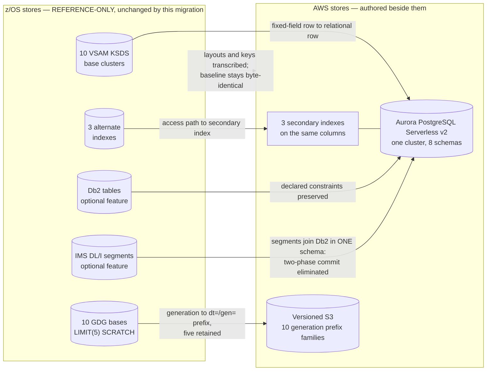

# ADR-003: Datastore Targets for Record Data and Dataset Generations

> **Purpose.** Record decision D3 — where the migrated system keeps its record
> data and its generation datasets — together with the options that were weighed,
> the facts that decided between them, the charge dimensions each option carries,
> and the risks the accepted option takes on. This record explains the choice; it
> does not reopen it.
>
> **Source of truth.** Two sources, and no others. The behavioural specification
> is the COBOL baseline under `app/**`, which is **read-only**: this record cites
> it by path and line and never edits it. The decision of record is the Agent
> Action Plan (AAP) §0.1.2 row D3, which fixes the accepted option. Within the
> baseline, three groups of files carry most of the weight here — the CICS file
> definitions in [`app/csd/CARDDEMO.CSD`](../../app/csd/CARDDEMO.CSD), the record
> copybooks under `app/cpy` and the extension copybook trees, and the
> generation-data-group definitions under `app/jcl`. Where this record and the
> baseline appear to disagree about a layout, a key or a constraint, the baseline
> is right and this record is wrong.

- **Status:** Accepted
- **Decision:** Keep all record data in **Aurora PostgreSQL Serverless v2**, one
  cluster with one schema per bounded context, and keep dataset generations in
  **versioned Amazon S3**.
- **Scope of this record.** The stores, and nothing else. The language and
  runtime belong to [ADR-001](ADR-001-language-and-runtime.md), the compute
  platform to [ADR-002](ADR-002-compute-platform.md), messaging to
  [ADR-004](ADR-004-messaging.md), batch orchestration to
  [ADR-005](ADR-005-batch-orchestration.md), the service boundaries whose
  schemas this record hosts to [ADR-007](ADR-007-service-boundaries.md),
  encryption and network isolation to
  [ADR-008](ADR-008-security-and-identity.md), and the provisioning tool and its
  version pins to [ADR-009](ADR-009-iac-tool.md). This record cites those
  decisions where the reasoning touches them and re-decides none of them.
- **Where the column-level detail lives.** This is a decision record, not the
  schema reference. The picture-clause-to-SQL-type derivation, the three
  corrected field misspellings and the per-record `FILLER` drops are in
  [`docs/architecture/data-model-and-schema-mapping.md`](../architecture/data-model-and-schema-mapping.md)
  and are not reproduced here.

## Context

The baseline keeps its record data in VSAM key-sequenced datasets, and its
optional extension trees add Db2 tables and IMS DL/I segments. The application's
own summary of that stack is the "Technical Highlights" table in
[`README.md`](../../README.md) (L366–L371): the base application is COBOL, CICS,
JCL (Batch) and **VSAM (KSDS with AIX)**, and the optional features add **DB2**,
**MQ** and **IMS DB** among others. Those two rows are the inventory this
decision has to find targets for.

The question this record answers is narrow: **in what store does each of those
records live after the migration, and what has to be true of that store for the
records to behave as they do today?**

### What is being replaced, counted rather than estimated

Each figure below was counted directly in the working tree, because the shape of
the data — not its volume — is what decides between the options.

| Asset | Count | Where |
|---|---|---|
| VSAM KSDS base clusters | **10** record masters | `app/jcl` `DEFINE CLUSTER` statements |
| Alternate indexes | **3** | `app/jcl` `DEFINE ALTERNATEINDEX` statements |
| CICS file resources | **8** `DEFINE FILE` stanzas | [`app/csd/CARDDEMO.CSD`](../../app/csd/CARDDEMO.CSD) |
| Generation-data-group bases | **10** distinct names | `app/jcl/DEFGDGB.jcl`, `DEFGDGD.jcl`, `DALYREJS.jcl` |
| Extension relational and hierarchical stores | Db2 tables and IMS segments, joined by two-phase commit | `app/app-transaction-type-db2`, `app/app-authorization-ims-db2-mq` |

#### The count of eight is a count of access paths, not of datasets

This distinction decides how many secondary indexes the target owes, so it is
set out rather than assumed. [`app/csd/CARDDEMO.CSD`](../../app/csd/CARDDEMO.CSD)
defines exactly **8** `DEFINE FILE` resources, and reading that number as "eight
datasets" double-counts two of them and loses two others. Two of the eight are
**alternate-index paths over base clusters that are already in the list**:

- `DEFINE FILE(CARDAIX)` at **L13** resolves to
  `DSNAME(AWS.M2.CARDDEMO.CARDDATA.VSAM.AIX.PATH)` — a path over the same base
  cluster that `DEFINE FILE(CARDDAT)` at **L25** opens directly. It is the
  cards-by-account access path.
- `DEFINE FILE(CXACAIX)` at **L63** is the equivalent path over the
  cross-reference cluster that `DEFINE FILE(CCXREF)` at **L37** opens directly.
  It is the cross-reference-by-account access path.

The third alternate index is not in the CSD at all, because no online program
reads it: `AWS.M2.CARDDEMO.TRANSACT.VSAM.AIX` is defined at
[`app/jcl/TRANIDX.jcl`](../../app/jcl/TRANIDX.jcl) **L25**, given a path at
**L43–L44** and populated by `BLDINDEX` at **L52**. It is a batch path keyed on a
**single 26-byte field at offset 304 — the processing timestamp — and on nothing
else**: `KEYS(26 304)` at **L27** declares one key of length 26 starting at that
offset, `NONUNIQUEKEY` on the next line admits repeats of it, and the job's own
header at **L20** reads `CREATE ALTERNATE INDEX ON PROCESSED TIMESTAMP`.

Assumptions: **card-number ordering over transactions is a different mechanism in a
different job, and conflating the two would misattribute one index to the other.**
`KEYS(26 304)` is one key of 26 bytes, not two keys; a two-part key would need two
length-and-offset pairs. Card ordering comes from the report job's DFSORT control at
[`app/jcl/TRANREPT.jcl`](../../app/jcl/TRANREPT.jcl) **L41** and **L46**, which
declares `TRAN-CARD-NUM,263,16,ZD` and sorts on it ascending — a sort over a
sequential backup, not an index over the master. That job's `INCLUDE` at **L47–L48**
then filters on the `TRAN-PROC-DT,305,10,CH` symbol declared at **L42**, which is the
leading date of the very timestamp this alternate index is keyed on, read as ten
characters instead of twenty-six — DFSORT's one-based 305 and `IDCAMS`'s zero-based
304 name the same byte. The two mechanisms therefore have one column between them,
not two.

Assumptions: **an alternate index is an access path that programs read, not
decoration on a dataset.** Two of the three are surfaced to CICS as first-class
file resources precisely so that online programs can open them by name, and the
third is built by a dedicated batch job. Each therefore becomes a **real
secondary index** in the target rather than a query the application filters in
memory — the commitment is discharged in [Rationale](#rationale) and the index
names are listed in [Consequences](#consequences). Had this been read as "eight
datasets", the target would have shipped six tables and no secondary indexes,
and every browse and lookup path that runs through those two paths today would
have degraded into a full scan without anything failing to report it.

#### The baseline file definitions declare no recovery and no journalling

All **8** `DEFINE FILE` stanzas in
[`app/csd/CARDDEMO.CSD`](../../app/csd/CARDDEMO.CSD) carry `RECOVERY(NONE)`, and
all **8** carry `JOURNAL(NO)`. This is stated as a factual property of how the
baseline is configured, and it is the honest point of comparison for the
target's automated backups and its encryption at rest. It is **not** a defect
and is not described as one: these are the settings a demonstration and training
application reasonably ships with, the repository presents itself as
"a resource for programmers wanting to understand and modernize their mainframes"
([`README.md`](../../README.md) L400), and nothing in this migration changes
them. The baseline path keeps running exactly as it does today — the migration
adds a path, it does not remove one.

#### Db2 and IMS are optional extension features, and they collapse into one schema

The Db2 tables and IMS segments belong to the optional features row of the
Technical Highlights table ([`README.md`](../../README.md) L371), not to the base
application. Two of them matter to this decision.

The transaction-type extension declares a foreign key in
[`app/app-transaction-type-db2/ddl/TRNTYCAT.ddl`](../../app/app-transaction-type-db2/ddl/TRNTYCAT.ddl)
**L6–L7**:
`FOREIGN KEY TRC_TYPE_CODE (TRC_TYPE_CODE) REFERENCES CARDDEMO.TRANSACTION_TYPE (TR_TYPE) ON DELETE RESTRICT`.
That is declared, database-enforced referential integrity, and the extension's
own documentation states the same rule in prose at
[`app/app-transaction-type-db2/README.md`](../../app/app-transaction-type-db2/README.md)
**L122**. It reappears under [Options Considered](#options-considered) as the
first of the two grounds on which a key-value store was rejected.

The authorization extension splits one logical unit of work across an IMS
hierarchy and a Db2 table and joins them with two-phase commit. In the target
both land in a single PostgreSQL schema, so that distributed commit is
**eliminated rather than emulated**. The messaging half of that change belongs to
[ADR-004](ADR-004-messaging.md) and the ownership half to
[ADR-007](ADR-007-service-boundaries.md); the datastore half is simply that one
schema holds both, which is what makes a single local transaction sufficient.

#### There are ten generation-dataset bases, not six

This is the highest-risk count in the record, because six is what a reader gets
from [`app/jcl/DEFGDGB.jcl`](../../app/jcl/DEFGDGB.jcl) alone and that file looks
complete — it is headed "DEFINE GDG BASES NEEDED BY CARDDEMO PROJECT" and defines
six bases in one `IDCAMS` step. The other four sit elsewhere.

| Generation base | Defined at | Retention | Replaces, in target terms |
|---|---|---|---|
| `TRANSACT.BKUP` | `DEFGDGB.jcl` **L25** | `LIMIT(5)` L26, `SCRATCH` L27 | transaction master backup |
| `TRANSACT.DALY` | `DEFGDGB.jcl` **L31** | `LIMIT(5)` L32, `SCRATCH` L33 | daily transaction input |
| `TRANREPT` | `DEFGDGB.jcl` **L37** | `LIMIT(5)` L38, `SCRATCH` L39 | 133-column transaction report |
| `TCATBALF.BKUP` | `DEFGDGB.jcl` **L43** | `LIMIT(5)` L44, `SCRATCH` L45 | category-balance backup |
| `SYSTRAN` | `DEFGDGB.jcl` **L49** | `LIMIT(5)` L50, `SCRATCH` L51 | system-generated transactions |
| `TRANSACT.COMBINED` | `DEFGDGB.jcl` **L55** | `LIMIT(5)` L56, `SCRATCH` L57 | combined transaction set |
| `TRANTYPE.BKUP` | `DEFGDGD.jcl` **L28** | `LIMIT(5)` L29, `SCRATCH` L30 | transaction-type backup |
| `TRANCATG.PS.BKUP` | `DEFGDGD.jcl` **L51** | `LIMIT(5)` L52, `SCRATCH` L53 | transaction-category backup |
| `DISCGRP.BKUP` | `DEFGDGD.jcl` **L74** | `LIMIT(5)` L75, `SCRATCH` L76 | disclosure-group backup |
| `DALYREJS` | `DALYREJS.jcl` **L25** | `LIMIT(5)` L26, `SCRATCH` L27 | daily reject stream |

Nine of the ten are defined at `LIMIT(5)` once each, and the tenth carries two
competing definitions as the note below records, so the target's retention count is
read off the baseline rather than chosen. Six belong to the ledger domain, three
to reference data and one to reporting, which is the split the object-storage
module provisions.

Refactoring Rationale: this sentence read "every one of the ten is defined at
`LIMIT(5)`" and was immediately qualified by the note beneath it, which is the
arrangement that lets a reader quoting the opening state something the same page
disproves — and [ADR-005](ADR-005-batch-orchestration.md) did exactly that, carrying
the unqualified form into its consequences while claiming the two records agree. The
count now leads with the nine that are unambiguous and defers the tenth to the note
that owns it, so the two records agree on the sentence as well as on the finding.

Assumptions: **the baseline is not self-consistent about one of the ten, and the
conflict is recorded rather than quietly resolved.** An exhaustive search for
`DEFINE GENERATIONDATAGROUP` under `app/jcl` matches **four** files and yields
**eleven** define statements over **ten distinct base names**, because
[`app/jcl/REPTFILE.jcl`](../../app/jcl/REPTFILE.jcl) **L25–L28** holds a second,
standalone definition of the same `TRANREPT` base already defined at
`DEFGDGB.jcl` **L37**, this one with `LIMIT(10)` and no `SCRATCH`. The distinct
base count is therefore still ten; `TRANREPT` simply has two competing
definitions. Alternatives Considered: applying ten to that one family, which is
the other defensible reading. Five is applied uniformly because the three files
that define the full set — `DEFGDGB.jcl` L25–L57, `DEFGDGD.jcl` L28–L76 and
`DALYREJS.jcl` L24–L26 — agree on five for all ten, and a uniform retention that
matches nine definitions exactly and one conservatively is easier to audit than a
per-family exception. The retention is expressed as a per-family override that is
left unset on all ten, so the variant stays reachable from configuration if the
discrepancy is ever resolved the other way, without changing the prefix
topology.



## Decision

Record data goes to **Aurora PostgreSQL Serverless v2** — one cluster, one
schema per bounded context, one database role per service. Dataset generations
go to **versioned Amazon S3**, with one prefix family per baseline generation
base and five retained generations per family.

The two halves are one decision rather than two because the boundary between
them is drawn on a single property: **a record that a service reads or writes by
key goes in the relational store, and an immutable dataset that a batch step
produces whole and a later step consumes whole goes in object storage.** Every
asset in the [Context](#context) inventory falls on one side of that line
without ambiguity, which is why no asset needed a case-by-case ruling.

## Options Considered

Alternatives Considered: seven options were weighed — four for record data, one
for dataset generations with two rejected alternatives of its own, and two that
are recorded here because they are out of scope rather than rejected. Each
rejected option is stated on its merits before its disqualifying fact, because an
option dismissed without its case stated cannot be audited later.

### Option 1 — Aurora PostgreSQL Serverless v2 — ACCEPTED for all record data

A managed relational engine, PostgreSQL-compatible, whose capacity is expressed
as a range rather than an instance size. It carries declared primary keys,
declared foreign keys, secondary indexes, multi-statement ACID transactions and
schema-level namespacing — which between them cover every property the
[Context](#context) inventory needs — and it is charged for the capacity actually
in use rather than for a running host. The case against it is the resume delay
its zero-minimum configuration implies, which is stated in
[Capacity Semantics](#capacity-semantics) and accepted in
[Trade-offs and Risks](#trade-offs-and-risks) rather than minimised.

### Option 2 — A key-value or document store — rejected on two concrete grounds

The case for it is real and is not dismissed: nine of the ten base clusters are
read predominantly by a single deterministic key, a key-value store would serve
those reads without a schema to migrate, and its capacity model needs no
minimum at all. Two facts about this particular baseline disqualify it, and
neither is a matter of preference.

**First, it cannot express the referential integrity the baseline already
declares.** The constraint at
[`app/app-transaction-type-db2/ddl/TRNTYCAT.ddl`](../../app/app-transaction-type-db2/ddl/TRNTYCAT.ddl)
**L6–L7** is `ON DELETE RESTRICT` on a foreign key from transaction categories to
transaction types. That rule is enforced by the engine today, for every writer,
including one that has never heard of the rule. Reproducing it in a store with no
foreign keys means implementing the existence check in application code — which
moves an already-declared, already-enforced constraint into a code path that any
other writer can bypass, and turns a guarantee into a convention. This is a
fidelity argument about a specific declared constraint, not a general preference
for relational engines.

**Second, the posting unit of work is genuinely multi-record and atomic.** Inside
one paragraph, [`app/cbl/CBTRN02C.cbl`](../../app/cbl/CBTRN02C.cbl) performs
three writes to three different records:

| Step | Line | Writes |
|---|---|---|
| `PERFORM 2700-UPDATE-TCATBAL` | **L440** | the transaction-category balance — creating it at `2700-A-CREATE-TCATBAL-REC` (**L503**) or updating it at `2700-B-UPDATE-TCATBAL-REC` (**L526**), branched at **L496**/**L498** |
| `PERFORM 2800-UPDATE-ACCOUNT-REC` | **L441** | the account master (paragraph at **L545**) |
| `PERFORM 2900-WRITE-TRANSACTION-FILE` | **L442** | the posted transaction (paragraph at **L562**) |

All three sit in `2000-POST-TRANSACTION` (**L424–L444**) and all three land or
none do. A store without a transaction spanning that shape forces the three
writes into a saga with compensating reversals, and a saga makes intermediate
states **observable** that are not observable today — a posted transaction whose
category balance has not moved, or an updated account with no transaction behind
it. Those states are exactly what the golden masters would flag, and they would
be right to: a parity failure is the correct verdict on a system that can be
observed halfway through a unit of work the baseline commits atomically. The
service-ownership consequence of keeping this atomic, including the explicit
rejection of saga, belongs to [ADR-007](ADR-007-service-boundaries.md); the
datastore consequence is recorded here.

**A third observation supports the same conclusion without being needed to reach
it: every VSAM record is a fixed-field row with a deterministic key.** The
account record at [`app/cpy/CVACT01Y.cpy`](../../app/cpy/CVACT01Y.cpy) is 300
bytes of fixed-width fields at fixed offsets, of which `ACCT-CURR-BAL` at **L7**
is `PIC S9(10)V99` — a fixed-width, fixed-scale numeric in a fixed position. A
record shaped like that is a relational row already; the mapping loses nothing
and invents nothing. Modelling it as a document would add a
representation mismatch in order to solve a problem the data does not have, since
there are no variable-arity nested structures and no per-record schema variation
anywhere in the ten masters.

### Option 3 — A provisioned Aurora or RDS cluster — rejected, and its counter-argument stated

Trade-offs: **this option is the lower-risk choice on exactly one axis, and that
is recorded rather than hidden.** A provisioned cluster never pauses, so it never
resumes, so the fifteen-second first-request delay described in
[Capacity Semantics](#capacity-semantics) does not exist for it. Anyone reading
this record and finding that delay unacceptable is reading the argument for
Option 3, and they are not wrong about the mechanism.

It is rejected because it is charged as instance-hours for a running host whether
or not any query arrives, and because it forecloses the development-environment
capacity floor of zero that [Cost Implications](#cost-implications) relies on.
The delay it avoids lands on a development environment and on the first request
after an idle period; the cost it adds lands on every hour of every environment.
Serverless capacity keeps the relational guarantees that decided against Option 2
while removing the standing charge, so the axis on which Option 3 wins is the
narrower of the two.

### Option 4 — Self-managed PostgreSQL on instances — rejected on operational burden

The case for it is the strongest possible engine-level match: it is the same
engine, with no managed-service constraint on extensions, minor versions or
parameters. It is rejected because choosing it moves patching, backup
orchestration, failover engineering, storage growth and capacity planning into
the operating scope of the team that migrated the application, and none of those
buys a behaviour the baseline needs. This is the guiding principle quoted in
[Cost Implications](#cost-implications) applied directly: managed relational
capacity over self-managed database hosts, because the operational burden is
lower and no hard constraint points the other way.

### Option 5 — Versioned object storage for dataset generations — ACCEPTED

A generation dataset is written once by one batch step, read whole by a later
step, retained for a fixed number of generations and then discarded. Object
storage matches that lifecycle without translation: one object per dataset, a
prefix convention carrying the business date and the generation number, and a
lifecycle rule expressing the retention. Two alternatives were considered.

- **A relational table per generation — rejected.** It would put immutable
  archive data in the store whose capacity serves interactive queries, and, more
  decisively, it would lose the byte-exact file semantics the parity comparison
  depends on. The report output is a 133-column fixed-width record and the reject
  stream is a fixed-composition record; the golden masters compare those bytes.
  A table holding parsed columns can round-trip to the same bytes only if the
  formatting is reimplemented on the way out, which replaces a stored artifact
  with a rendering step that can drift.
- **Unversioned object storage with date-only prefixes — rejected.** It can
  express "one object per day" but not "retain five generations and discard the
  sixth", because there is nothing for a lifecycle rule to count. The retention
  contract would move back into application code, which is the same failure mode
  as Option 2's integrity check: a rule the platform used to enforce becomes a
  rule a program is trusted to remember.

### Option 6 — Read replicas — out of scope, not delivered

Recorded so it is not mistaken for part of the accepted option. AAP §0.2.2 places
read replicas **out of scope**, and no replica is provisioned. Reporting reads go
to the writer through read-only cross-schema views, described in
[Consequences](#consequences). The reason is that a replica would add both a
standing charge and replica-lag semantics — a reporting read that legitimately
returns slightly stale data, which the baseline has no equivalent of — for **no
parity benefit**, since nothing in the baseline reads from a second copy.

### Option 7 — An application cache such as Redis or ElastiCache — out of scope, not delivered

Also recorded to avoid misreading. AAP §0.2.2 places application-level caching
**out of scope**, and no cache tier is provisioned. The reason is that the
baseline has no cache tier, so there is no cached-read behaviour to preserve, and
introducing one would add an invalidation contract that no baseline behaviour
requires. Streaming platforms are out of scope on the same footing: the
messaging requirement is request and reply, which
[ADR-004](ADR-004-messaging.md) satisfies with queues.

### The options side by side

| Option | Declared referential integrity | Multi-record atomic commit | Charged while idle | Verdict |
|---|---|---|---|---|
| 1 — Aurora PostgreSQL Serverless v2 | Yes, engine-enforced | Yes, one local transaction | No, with a zero minimum | **Accepted** |
| 2 — Key-value or document store | No, application-enforced only | Not across this shape | Varies by capacity mode | Rejected |
| 3 — Provisioned Aurora or RDS | Yes, engine-enforced | Yes | Yes, instance-hours | Rejected |
| 4 — Self-managed PostgreSQL | Yes, engine-enforced | Yes | Yes, plus operating burden | Rejected |
| 5 — Versioned object storage | Not applicable | Not applicable | No, storage and requests only | **Accepted for generations** |
| 6 — Read replicas | — | — | Yes | Out of scope |
| 7 — Application cache | — | — | Yes | Out of scope |

## Rationale

Seven facts decided this, and each one is checkable against a cited line in the
baseline or a named artifact in the target. None of them is a preference.

### 1. The records are already rows, so the mapping loses nothing

Every one of the ten base clusters is a fixed-length record of fixed-width fields
at fixed offsets, keyed deterministically. The account master is the
representative case: 300 bytes, declared field by field at
[`app/cpy/CVACT01Y.cpy`](../../app/cpy/CVACT01Y.cpy), with `ACCT-ID` at **L5** as
the key and five money fields at **L7–L9** and **L13–L14** each declared
`PIC S9(10)V99`. There is no nesting, no repeating group of variable arity and no
per-record schema variation anywhere in the ten. A store that required a
different shape would be solving a problem this data does not present; a
relational table is the same shape written differently.

### 2. The one genuinely multi-record unit of work stays a single local transaction

The three writes at [`app/cbl/CBTRN02C.cbl`](../../app/cbl/CBTRN02C.cbl)
**L440–L442** become one `@Transactional` method rather than three coordinated
steps. This is the property that decided against Option 2, and it is also the
property that decides the one deliberate departure from database-per-service
purity described in [Consequences](#consequences): the posting job runs against
the same cluster under a role holding narrowly-scoped cross-schema write grants,
so the commit stays atomic without a distributed protocol and without a saga.

### 3. Declared integrity stays declared

`ON DELETE RESTRICT` at
[`app/app-transaction-type-db2/ddl/TRNTYCAT.ddl`](../../app/app-transaction-type-db2/ddl/TRNTYCAT.ddl)
**L6–L7** becomes a foreign key with the same referential action, not a check in
a service method. The observable consequence is preserved at the edge too: an
attempt to delete a transaction type that categories still reference is refused,
and the refusal surfaces as a conflict response rather than as a raw database
error. Assumptions: the constraint is relied on as the enforcement point, so the
service-level check exists to produce a useful message and not to be the
guarantee — which is why a writer that bypasses the service still cannot break
the invariant.

### 4. All three alternate indexes become real secondary indexes

Every browse and lookup path that exists today still exists, on the same columns:

| Baseline access path | Defined at | Target index |
|---|---|---|
| `CARDAIX` — cards by account | [`app/jcl/CARDFILE.jcl`](../../app/jcl/CARDFILE.jcl) **L83**, path **L101–L102**, `BLDINDEX` **L110**; surfaced to CICS at CSD **L13** | `idx_cards_account_id` |
| `CXACAIX` — cross-reference by account | [`app/jcl/XREFFILE.jcl`](../../app/jcl/XREFFILE.jcl) **L72**, path **L91–L92**, `BLDINDEX` **L100**; surfaced to CICS at CSD **L63** | `idx_card_xref_account_id` |
| `TRANSACT.VSAM.AIX` — transactions by processing timestamp, `KEYS(26 304)` and `NONUNIQUEKEY` | [`app/jcl/TRANIDX.jcl`](../../app/jcl/TRANIDX.jcl) **L25**, key **L27**, path **L43–L44**, `BLDINDEX` **L52** | `idx_transactions_proc_ts` |
| Transactions ordered by card number — a DFSORT sort, not an alternate index | [`app/jcl/TRANREPT.jcl`](../../app/jcl/TRANREPT.jcl) symbol **L41**, `SORT FIELDS` **L46** | `idx_transactions_card_num` |

Assumptions: **the fourth row is deliberately not an alternate index, and it is
listed so that the fourth target index has a stated origin.** Three alternate indexes
yield three secondary indexes; `idx_transactions_card_num` exists because the report
job sorts on card number and the online card-scoped list reads by it, not because a
`DEFINE ALTERNATEINDEX` names that column. Leaving it out of this table would have
made it look unmotivated; folding it into the `TRANSACT.VSAM.AIX` row — as an earlier
revision of this record did — misattributed it to a key that
[Context](#the-count-of-eight-is-a-count-of-access-paths-not-of-datasets) shows is a
single 26-byte timestamp.

Refactoring Rationale: what changes is not the access path but who maintains it.
`BLDINDEX` is a batch step that rebuilds an index from the base cluster, so the
index is only as current as the last run of the job that rebuilt it, and a
`DEFINE ALTERNATEINDEX` has to be followed by a `BLDINDEX` for the path to be
usable at all. PostgreSQL maintains an index inside the same transaction that
writes the row, so the rebuild step has no target equivalent and is retired
rather than translated. The batch orchestration record
([ADR-005](ADR-005-batch-orchestration.md)) is where that retirement is recorded
as a state that no longer exists.

### 5. Schema-per-service isolation is expressible inside one cluster

One cluster, eight schemas, one database role per service. Ownership is enforced
by the engine rather than by convention: each schema is created with an owning
role, and a service role holds grants on its own schema only. Two consequences
follow that matter more than the arrangement itself.

The first is that the posting unit of work in §2 stays atomic, because the schemas
it spans are in the same database and therefore in the same transaction. The
second is that the isolation is auditable — a role's grants are queryable, so
"which service can write this table" has an answer that does not depend on
reading application code. The service-boundary half of this belongs to
[ADR-007](ADR-007-service-boundaries.md); the datastore half is that one cluster
is sufficient to express eight boundaries.

### 6. Money is exact fixed point at every hop

This is the property most easily lost, because losing it produces plausible
numbers rather than errors. The chain is fixed at four points: `NUMERIC(p,2)` in
SQL, `BigDecimal` at scale 2 with `HALF_UP` in Java, `Decimal` in Python, and a
JSON **string** on the wire. Three facts anchor it.

**The base masters carry money as zoned decimal with sign overpunch.**
`ACCT-CURR-BAL PIC S9(10)V99` at
[`app/cpy/CVACT01Y.cpy`](../../app/cpy/CVACT01Y.cpy) **L7** is a display field
whose sign is carried in the low-order byte, which is why the migration decodes it
at the ETL edge into an exact decimal rather than reading it as text. The same
dataset read with the wrong sign convention yields silently wrong negatives, a
trap [`tests/README.md`](../../tests/README.md) §5.2 documents for the baseline
toolchain.

**One formula has to stay bit-exact.** The interest calculation at
[`app/cbl/CBACT04C.cbl`](../../app/cbl/CBACT04C.cbl) **L462–L465** is:

```text
1300-COMPUTE-INTEREST.

    COMPUTE WS-MONTHLY-INT
     = ( TRAN-CAT-BAL * DIS-INT-RATE) / 1200
```

Assumptions: the parenthesisation is part of the contract. The product is formed
first at full precision and only the quotient is rounded, so the Java multiplies
before it divides and supplies an explicit scale and rounding mode at the
division. Dividing first and multiplying second is algebraically equivalent and
arithmetically is not — it rounds an intermediate value — and it differs by cents
on ordinary inputs. Nothing about the expression signals that if it is skimmed,
which is why it is quoted here rather than paraphrased.

**Money leaves the system as a JSON string, not a JSON number.**
Alternatives Considered: serialising money as a JSON number, which is the obvious
choice and reads more naturally to a client author. It is rejected because most
JSON parsers materialise a number as an IEEE-754 double, so a value that was
exact in the database, exact in the service and exact in the payload becomes
inexact inside the client — at the last hop, past every check the migration
controls, and without any error to observe. A string forces the client to choose
its own decimal type explicitly. Trade-offs: a client author has to parse before
arithmetic, and that cost is accepted because the alternative silently relocates
the loss of exactness to the one place this repository cannot test.

Packed decimal is a narrower case and worth stating precisely. It appears in the
export record and, heavily, in the authorization extension's IMS segments — six
`COMP-3` money fields at
[`app/app-authorization-ims-db2-mq/cpy/CIPAUSMY.cpy`](../../app/app-authorization-ims-db2-mq/cpy/CIPAUSMY.cpy)
**L23–L26** and **L29–L30**, plus a packed key at **L19**. That extension is
therefore the only place packed decimal reaches data the target persists, and it
is decoded to an exact decimal at the ETL edge. **No packed bytes are stored in
any target column**, because storing them would put the decoding burden on every
future reader of the column and defeat the point of a typed numeric.

### 7. A fixed-arity array becomes fixed columns, deliberately

[`app/app-authorization-ims-db2-mq/cpy/CIPAUSMY.cpy`](../../app/app-authorization-ims-db2-mq/cpy/CIPAUSMY.cpy)
**L22** declares `PA-ACCOUNT-STATUS PIC X(02) OCCURS 5 TIMES`. In the target this
becomes five discrete columns rather than one array column.

Alternatives Considered: a PostgreSQL array column, which is the closer literal
translation of `OCCURS` and needs no decision about how to name five columns. It
is rejected on two grounds. The arity is **fixed at five by the baseline
layout**, and a schema of five columns makes the engine enforce that arity, while
an array column accepts four or six without complaint and turns a layout
guarantee into an application check — the same failure mode as the integrity
argument in §3. And an array column is not portable across object-relational
mappings in the way a scalar column is, so the mapping would carry a
vendor-specific type for a structure that has no variability to justify it.

Trade-offs: a query that wants to treat the five slots uniformly has to name
them, where an array would let it iterate. That is accepted because the five
slots are read positionally in the baseline rather than iterated, so uniform
treatment is not a behaviour being preserved — and because the arity is enforced
in exchange.

## Capacity Semantics

This section exists because the capacity model of the accepted option behaves in
ways a reader would otherwise be surprised by, and because two of those
behaviours are configuration preconditions rather than preferences. The
provisioning detail is in the infrastructure module; what follows is the set of
service properties the configuration has to satisfy.

- **Capacity is a range, expressed in Aurora Capacity Units.** It runs from **0**
  to **256** units and moves in **half-unit** increments. There is no instance
  size to choose; there is a floor and a ceiling, and the service moves between
  them.
- **A floor of zero requires a sufficiently recent engine minor release.**
  Assumptions: this is a precondition on the engine version, not a property of the
  configuration, and the set of qualifying minor releases is not knowable from the
  provisioning code. A zero floor on too old a minor fails at apply time and
  reports against the capacity argument rather than against the version argument,
  which is why the version is always a reviewed value in an environment root and
  is never defaulted.
- **A floor of zero makes the auto-pause setting mandatory, and forces the ceiling
  to at least one.** This is the property most easily got wrong, because a
  floor-and-ceiling pair that looks valid on its own becomes invalid through a
  third input. The auto-pause delay is a whole number of seconds and must fall
  between **300** and **86,400**.
- **Configuring serverless capacity is not the same as selecting a serverless
  engine mode.** Assumptions: Serverless v2 capacity is a scaling-configuration
  block on a cluster in **provisioned** engine mode whose instances use the
  serverless class. The older `serverless` engine mode selects Aurora Serverless
  v1, a different product with different scaling granularity, different pause
  behaviour and no auto-pause delay control. Both spellings provision
  successfully, so choosing the older one by accident yields a working cluster
  whose capacity behaviour silently differs from everything documented here —
  which is why the distinction is recorded rather than left to the provisioning
  code to imply.
- **The provisioning provider has a version floor of its own.** A provider release
  at or after **5.81.0** is required to accept a floor of zero. The pinned
  constraint is `~> 6.56`, which clears it with room; the pin itself belongs to
  [ADR-009](ADR-009-iac-tool.md) and is not re-decided here.
- **Resuming from a paused state takes on the order of fifteen seconds.** This is
  a cited service behaviour, not an estimate of any kind about this project's
  work.

Trade-offs: **that resume delay lands very differently on the two workloads this
cluster serves, which is why the floor is a per-environment value rather than a
global one.**

For the nightly batch chain it is **immaterial**. The chain is a scheduled state
machine whose first state already brackets the run by quiescing online writes, so
one resume at the front of it changes nothing observable and nothing measurable
against a golden master.

For interactive use it is **a noted risk**, and it is not softened here: the delay
is paid by whoever issues the first request after an idle period, which in a
development environment is a person waiting on a screen. The resolution is to
accept it exactly where it is cheap and to refuse it where it is not — the
development environment holds a floor of zero and pays the delay in exchange for
no idle **capacity-unit** charge, and the production environment holds a floor
above zero so no request ever pays it. The concrete values are in
[Cost Implications](#cost-implications).

Refactoring Rationale: this replaces per-dataset manual capacity planning
outright. Nine of the ten base clusters were hand-sized with `CYLINDERS(1 5)` on
one named volume — see
[`app/jcl/ACCTFILE.jcl`](../../app/jcl/ACCTFILE.jcl) **L36–L38** — and the tenth,
the security file, was sized separately with `TRACKS(45,15)` and named no volume
at all ([`app/jcl/DUSRSECJ.jcl`](../../app/jcl/DUSRSECJ.jcl) **L64–L69**). Ten
independent allocations meant capacity was a per-file estimate that had to be
revisited by hand whenever any one file grew. One capacity range replaces all ten
with a bound the service enforces continuously.

## Cost Implications

Reasoned as **charge dimensions and their drivers**: which dimension is billed,
what drives it up, and how the two environments differ under it.

Trade-offs: no currency figure is stated and no price list is quoted, which makes
this section less immediately actionable than a costed estimate would be. That is
accepted because an unverified figure in an architecture record is worse than
none — it gets cited, and then it goes stale silently, since a price list can
change without anything in this repository changing. A charge dimension and its
driver stay true across a price revision, so that is what is recorded.

### The relational store is charged on four dimensions

| Dimension | What drives it |
|---|---|
| Capacity unit-hours | The capacity **actually in use**, integrated over time. Not a fixed instance size |
| Storage per GB-month | The volume of stored data |
| I/O | Read and write operations against the storage layer |
| Backup storage | Retained backup data **beyond** the cluster volume, so it is driven by the retention window rather than by database size alone |

The dominant driver is therefore **how much capacity is in use and for how long**.
That is a materially different shape from a provisioned instance, whose bill is
set by a size decision and a clock, and it is the reason the two environments can
differ in cost by an order of magnitude without differing in topology.

### The environment lever is capacity and retention, and nothing else

AAP §0.4.1.6 constrains the two environment roots to differ **only** in sizing and
retention — never in which resources exist. Applied to this decision, the levers
are the capacity floor and ceiling, the auto-pause delay, the backup retention
window, the log retention window, and the deletion-protection and final-snapshot
flags. The values are set in
[`infra/envs/dev/terraform.tfvars`](../../infra/envs/dev/terraform.tfvars) and
[`infra/envs/prod/terraform.tfvars`](../../infra/envs/prod/terraform.tfvars):

| Lever | `dev` | `prod` | Cost consequence |
|---|---|---|---|
| Capacity floor | **0** | **2** | `dev` is charged no capacity while idle; `prod` never pays a resume delay |
| Capacity ceiling | 4 | 32 | Bounds the worst-case capacity charge per environment |
| Auto-pause delay | 300 s | 300 s | Mandatory in `dev` because the floor is zero; inert in `prod`, where pausing cannot occur |
| Backup retention | 1 day | 35 days | Drives the backup-storage dimension directly |
| Log retention | 7 days | 365 days | Drives log storage, which belongs to [ADR-008](ADR-008-security-and-identity.md) |
| Deletion protection / final snapshot | off / skipped | on / taken | No recurring charge; changes teardown behaviour, see [the teardown runbook](../runbooks/teardown.md) |

AAP §0.9.3 names **scaling development database capacity to zero** as one of the
places the guiding principle chose the lower-cost option, and the floor of `0`
above is that choice expressed in configuration. Its price is the resume delay in
[Capacity Semantics](#capacity-semantics), paid only in the environment that
accepts it.

### Object storage is charged on storage and requests — and versioning multiplies the first

Object storage is charged per GB-month of stored data plus a charge per request.
The non-obvious part is what versioning does to the first of those: **a versioned
bucket stores every noncurrent version as billable data, so retaining five
noncurrent versions of an object multiplies its storage footprint by up to six —
the current version plus five.** A delete marker does not reclaim the bytes it
hides.

The consequence is that **the noncurrent-version lifecycle rule is simultaneously
a fidelity mechanism and a cost control**, and it is easy to notice only the
first. It reproduces the baseline's five-generation retention, and it is also the
only thing standing between a nightly batch chain and storage that grows without
bound. Assumptions: two distinct mechanisms are both capped at five and they are
not the same mechanism — a logical generation is a distinct `dt=`/`gen=` prefix
that the staging writer prunes once the count is exceeded, whereas the lifecycle
rule bounds the version history of a single object key that has been rewritten.
Distinct generation prefixes are **not** noncurrent versions of one another.
Conflating them would leave one of the two uncapped, and the uncapped one grows
silently because nothing fails when it does.

### What the rejected options would have cost instead

- **Option 2, a key-value store — two costs, and the second is the larger.** Its
  service charge is per request unit and per GB, which for key-based reads could
  well compare favourably. The cost that decides it is not a service charge at
  all: recovering the declared integrity of §3 and the multi-record atomicity of
  §2 in application code is **engineering effort**, paid once at authoring and
  again at every change to the affected write paths, and it buys back a guarantee
  the relational option supplies for nothing. An option that is cheaper per
  request and more expensive per change is not cheaper.
- **Option 3, a provisioned cluster — charged as instance-hours whether or not
  queries run.** A development environment that is idle overnight and at weekends
  pays for that idleness at the same rate as a busy one, and the floor of zero
  above becomes unreachable.
- **Option 4, self-managed PostgreSQL — instance-hours plus operating labour.**
  It carries Option 3's standing charge and adds patching, backup orchestration
  and failover engineering as recurring work.
- **Options 6 and 7, replicas and a cache — a standing charge for no parity
  benefit.** Both are out of scope; each would add a continuously running
  component to reproduce behaviour the baseline does not have.

### The guiding principle, and where it applied

Reproduced verbatim from AAP §0.9.4:

> "Prefer AWS-managed services over self-managed where it lowers operational
> burden, unless cost or a hard constraint dictates otherwise. When a decision is
> a close call, choose the lower-risk, lower-cost option and note it."

The first sentence decided Option 4: managed relational capacity over
self-managed database hosts, because patching, backups and failover are
operational burden that no baseline behaviour requires the team to carry. It also
decided the development capacity floor, where the lower-cost configuration was
available and its one cost was acceptable in that environment alone.

Assumptions: **the second sentence does not apply to this record, and saying so is
part of getting the record right.** AAP §0.1.2 names exactly two close calls in
the whole decision set — queues versus a managed broker in
[ADR-004](ADR-004-messaging.md), and a state machine versus a managed batch
service in [ADR-005](ADR-005-batch-orchestration.md). This decision is not one of
them and is not presented as one. The two facts in
[Options Considered](#options-considered) that rejected Option 2 are categorical
rather than marginal: a declared foreign key either exists or does not, and a
three-record write either commits atomically or becomes observable halfway
through. Manufacturing a third close call here would misreport how much
uncertainty this decision actually carries.

## Trade-offs and Risks

### Accepted trade-off — a resume delay in exchange for no idle capacity-unit charge in `dev`

Stated in full under [Capacity Semantics](#capacity-semantics) and priced under
[Cost Implications](#cost-implications). The short form: the development
environment holds a capacity floor of zero, so the first request after an idle
period waits on the order of fifteen seconds. It is accepted there and refused in
production, where the floor is held above zero.

Refactoring Rationale: this heading and the sentence under
[Capacity Semantics](#capacity-semantics) previously said the trade bought "no idle
charge", unqualified. That overstated it. What a zero capacity floor removes is the
**capacity-unit** charge — the per-second compute meter — and it removes nothing
else. **Storage, automated-backup storage and I/O continue to be billed while
capacity is paused**, because the data has not gone anywhere: a paused cluster still
holds every byte of the eight schemas, still retains its backups for the window this
record's per-environment table sets, and still bills any read or write that arrives
and wakes it. The unqualified phrasing therefore described a floor of zero where the
real floor is small but non-zero, which is exactly the kind of cost claim a reader
would carry into a budget. The narrowing is stated rather than the sentence deleted,
because the trade itself is real and worth recording — a development environment that
is idle overnight genuinely stops paying for compute.

### Accepted trade-off — one cluster hosting eight schemas

Trade-offs: the alternative was one cluster per bounded context, which is the
stronger isolation and the more literal reading of database-per-service. It was
declined because the posting unit of work at
[`app/cbl/CBTRN02C.cbl`](../../app/cbl/CBTRN02C.cbl) **L440–L442** spans the
ledger and account schemas, and separate clusters would turn that single atomic
commit into a distributed one — reintroducing exactly the two-phase commit that
[Context](#context) records as eliminated for the authorization extension, and in
a place where the baseline never had one.

The cost of the choice is a **shared blast radius**: eight schemas share a
cluster, so a cluster-level failure is an eight-service failure. Three mitigations
carry it, and none of them is this record's to decide:

- **Per-service database roles with narrowly-scoped grants.** A service role holds
  privileges on its own schema; the posting role holds only the cross-schema
  write grants the unit of work needs and nothing beyond them.
- **The cluster sits in subnets with no route to the internet.** Network isolation
  and encryption at rest belong to
  [ADR-008](ADR-008-security-and-identity.md).
- **Automated backups**, with the retention window differing per environment as
  tabulated above.

### Risk — connection count grows with task count

Each service task holds its own connection pool, so the total connection count
scales with horizontal scale-out rather than with request volume, and a
sufficiently wide scale-out can exhaust connections before it exhausts capacity.
The relationship is multiplicative and therefore easy to underestimate: tasks
times pool size, not tasks plus pool size.

Mitigations are explicit pool sizing per service and a bounded maximum task
count, both of which are properties of the compute platform rather than of the
store — see [ADR-002](ADR-002-compute-platform.md), which records the same risk
from the compute side.

### Risk — a silent fixed-point error

This is the highest-consequence risk in the record, and its defining property is
that it does not announce itself: an arithmetic or decoding error in the money
path produces plausible numbers that are wrong, and a plausible wrong number
survives review in a way a stack trace does not. Four mitigations, layered
because no single one is sufficient:

- **Money is one type, in one place.** The arithmetic, the scale and the rounding
  mode are defined once rather than per service, so there is one place for the
  behaviour to be right or wrong.
- **`float` and `double` are banned from the money path by an architecture
  test.** The prohibition is executable and runs in the build, so it fails a
  change rather than being noticed during review.
- **Multiply-before-divide is documented at the point of use**, with the
  parenthesised source expression from
  [`app/cbl/CBACT04C.cbl`](../../app/cbl/CBACT04C.cbl) **L462–L465** quoted where
  the calculation is implemented. Assumptions: a future maintainer reordering the
  operations for readability is the realistic failure mode, and the only defence
  against it is a comment at the line that explains why the order is load-bearing.
- **Post-load verification is a deliverable, not a step.** The migration verifies
  row counts per dataset, record checksums, and **money-total parity against the
  source files**. A load that reported success without a money-total check is not
  evidence of anything, which is why the check exists as its own harness rather
  than as an assertion inside the loader.

### Risk — object-storage version sprawl

A versioned bucket written to nightly accumulates noncurrent versions
indefinitely unless something expires them, and the accumulation is invisible
because nothing fails while it happens. Mitigation is the
five-noncurrent-version lifecycle rule, which is the same mechanism as the
generation-retention fidelity rule — one control serving two purposes, as
[Cost Implications](#cost-implications) records. Assumptions: the risk returns in
full for any prefix provisioned without a lifecycle rule, which is precisely why
the count of ten in [Context](#context) matters. A family provisioned without its
rule would still receive its objects and would still work, so the omission would
never surface as a failure.

### Honest boundary — what this record does not establish

The infrastructure that implements this decision is **authored and statically
validated**: formatted, validated, linted and planned. It has **not** been applied
against a live AWS account — that is an operator action outside this scope — and
consequently **no benchmark, no capacity test and no load test has been
performed**. Nothing in this record should be read as a measured result. The
capacity bounds, the auto-pause behaviour and the resume delay are cited service
properties; the environment values are reviewed configuration. Which capacity
ceiling a real workload needs is a question this record deliberately does not
answer, because answering it without measurement would be inventing a figure.

## Consequences

### Eight schemas, one per bounded context, and one of them is read-only to its service

The relational store is created as eight schemas by
[`data-migration/sql/V0__schemas_and_roles.sql`](../../data-migration/sql/V0__schemas_and_roles.sql):
`auth`, `account`, `card`, `ledger`, `reference`, `batch`, `authorization` and
`reporting`. Seven are owned by the service that reads and writes them. The eighth is
deliberately different, and the difference has to be stated at three levels, because
any one of them alone is misleading.

**One, the reporting service owns no tables.** **Two, the `reporting` schema
nevertheless holds exactly one table**, `reporting.card_grouping_key`, created by
[`data-migration/sql/V1__reporting_views.sql`](../../data-migration/sql/V1__reporting_views.sql).
**Three, the reporting service cannot read that table** — it is owned by the separate
`carddemo_reporting_owner` role, and `SELECT` is revoked from the service's own login
role. The table is a single row holding the salt that the statement views cross-join to
compute a card fingerprint, so a service able to read it could invert the fingerprint by
exhausting sixteen digits; withholding it from the reader is the whole point of its
existing. The ownership authority for all eight schemas is
[`docs/architecture/data-model-and-schema-mapping.md`](../architecture/data-model-and-schema-mapping.md),
and this record follows it rather than restating it independently.

Refactoring Rationale: this passage previously asserted flatly that the reporting
service owns no tables and left the reader to conclude the schema was empty, and the
section heading said the schema "owns nothing". The first statement is true and the
implication is false — the schema holds that one table — so a reader reconciling this
record against the delivered DDL would find a table the decision appeared to forbid and
would have no way to tell whether the table or the decision was the error. Two
alternatives were weighed. Deleting the table to make the original wording true was
rejected outright: the fingerprint's non-invertibility depends on the salt being
unreadable by the reader, so removing it would trade a documentation inconsistency for
a disclosure. Leaving the wording and treating the table as an exception was rejected
because an unstated exception is how the next reader arrives at the same confusion. The
three-level statement is what makes the arrangement checkable: each level is
independently verifiable against the DDL and the grants.

It reads through read-only cross-schema
views, and the arrangement is stronger than a read-only grant: the `reporting`
schema is owned by a **separate** owner role rather than by the reporting
service's own login role, so the service role can create, replace and drop
nothing. It holds usage on that schema and `SELECT` on named views, and **no
privilege at all** on `ledger`, `account`, `card` or `reference`. The views are
created with a security barrier and left in the default non-invoker mode, so their
reads are checked against the view owner's privileges — which is exactly what lets
the service role hold no underlying privilege and still read — and the card number
every ledger-derived view publishes is masked.

Refactoring Rationale: an earlier revision made the reporting service's own role
the schema owner. That let a compromised reporting task replace a masking view
with an unmasked one and read the very data the view exists to withhold, entirely
within its own rights. Separating the owner from the reader closes that path.

### One deliberate departure from database-per-service purity

The posting job runs against the same cluster under a role holding
**narrowly-scoped** cross-schema grants: usage on the four schemas it reads and
insert and update on the ledger tables it writes, and nothing beyond that. This is
the mechanism that keeps the three writes at
[`app/cbl/CBTRN02C.cbl`](../../app/cbl/CBTRN02C.cbl) **L440–L442** inside one
commit. It is recorded as a departure rather than presented as the general
pattern, because the general pattern is one schema per service and this is the one
place it is relaxed. [ADR-007](ADR-007-service-boundaries.md) is where the
ownership consequence and the rejection of saga are recorded.

### Ten object-storage prefix families, each retaining five generations

One prefix family per baseline generation base — six for the ledger domain, three
for reference data, one for reporting — each with a lifecycle rule retaining five
noncurrent versions, and a generation addressed by a `dt=`/`gen=` prefix under its
family. Two further prefixes carry the statement artifacts, which are not
generation datasets and are listed separately so the count of ten stays a count of
generation families. The batch steps that write and read these prefixes belong to
[ADR-005](ADR-005-batch-orchestration.md) and
[`docs/architecture/batch-orchestration.md`](../architecture/batch-orchestration.md).

### Three secondary indexes replacing three alternate indexes, plus one added lookup

The three replacements stand one-to-one against the three baseline alternate indexes,
on the columns tabulated in [Rationale](#rationale) §4:

| Baseline alternate index | Target secondary index | Relation |
| --- | --- | --- |
| `CARDAIX` | `idx_cards_account_id` | `card.cards` |
| `CXACAIX` | `idx_card_xref_account_id` | `account.card_xref` |
| `TRANSACT.VSAM.AIX` | `idx_transactions_proc_ts` | `ledger.transactions` |

`idx_transactions_card_num` is a **fourth** index and is **not** one of those
replacements. It has a different origin, set out in the fourth row of the
[Rationale](#rationale) §4 table: the report job's card-number sort, declared as a
symbol at [`app/jcl/TRANREPT.jcl`](../../app/jcl/TRANREPT.jcl) **L41** and sorted on at
**L46**, together with the card-scoped reads the statement and transaction-list paths
perform. The baseline satisfies all of those by sorting rather than by a
`DEFINE ALTERNATEINDEX`.

The `BLDINDEX` rebuild step has no target equivalent and is retired, because the engine
maintains an index in the same transaction that writes the row.

Refactoring Rationale: the heading counted three while the sentence beneath it named
four, listing the added card-number index among the replacements and joining it to
`idx_transactions_proc_ts` with a "with" that read as though the two together replaced
one alternate index. The count was right and the list was wrong: there are exactly three
alternate indexes in the baseline and the fourth target index answers to none of them.
Separating them is not cosmetic — a reader auditing alternate-index coverage would
otherwise look for a fourth baseline alternate index that does not exist, or conclude
that one replacement was missing.


### Encryption at rest, in transit, and automated backups

Provided by customer-managed keys and by the cluster's backup configuration, with
the retention window as the per-environment lever tabulated above. These are
**decided in [ADR-008](ADR-008-security-and-identity.md)** and are recorded here
only as consequences of choosing a managed store — this record does not re-decide
them, and the contrast with the baseline's `RECOVERY(NONE)` and `JOURNAL(NO)`
settings is the factual comparison drawn in [Context](#context) rather than a
criticism of them.

### Where the schema detail and the divergences are recorded

- **Column-level derivation** — picture clause to SQL type to Java type, the three
  corrected field misspellings, and the per-record `FILLER` drops — is in
  [`docs/architecture/data-model-and-schema-mapping.md`](../architecture/data-model-and-schema-mapping.md).
  It is linked rather than reproduced, because a mapping table duplicated into a
  decision record drifts from the one the migrations are actually built from.
- **Behavioural divergences** are registered in
  [`docs/architecture/cobol-to-service-traceability.md`](../architecture/cobol-to-service-traceability.md).
  Assumptions: the three documented baseline limitations recorded in
  [`tests/README.md`](../../tests/README.md) §1.1 are **not fixed in COBOL** —
  `app/**` is read-only and stays byte-identical. Where the migrated
  implementation behaves correctly and the baseline does not, the difference is
  registered in that document as a divergence. This record describes no change to
  any COBOL program.
- **Operational procedure** for loading and verifying the data is in
  [the data-migration runbook](../runbooks/data-migration.md), and for removing the
  stores in [the teardown runbook](../runbooks/teardown.md).

### Downstream obligations this decision creates

- Every money column is `NUMERIC(p,2)`, every money field is `BigDecimal` at scale
  2 with `HALF_UP`, and every money value on the wire is a JSON string.
- Every alternate index has a named secondary index, and every generation base has
  a prefix family with a lifecycle rule. A missing lifecycle rule does not fail,
  so the counts are cross-checked against
  [`docs/architecture/batch-orchestration.md`](../architecture/batch-orchestration.md)
  and [`data-migration/README.md`](../../data-migration/README.md), and all three
  must agree.
- No service holds a privilege on another service's schema, with the single scoped
  exception recorded above.
- No credential appears in any file in this repository. Database credentials are
  generated at provisioning time into a secret store and read by services at
  startup; the environment parameter files carry capacity and retention values
  only. Assumptions: this is a structural property rather than an observed one —
  there is no committed value to redact because none is ever written.
- A later implementation change that conflicts with this record requires a
  superseding ADR rather than a silent edit to the decision.

## References

**Decision records.** [Index](README.md) ·
[ADR-001 language and runtime](ADR-001-language-and-runtime.md) ·
[ADR-002 compute platform](ADR-002-compute-platform.md) ·
[ADR-004 messaging](ADR-004-messaging.md) ·
[ADR-005 batch orchestration](ADR-005-batch-orchestration.md) ·
[ADR-006 API and UI](ADR-006-api-and-ui.md) ·
[ADR-007 service boundaries](ADR-007-service-boundaries.md) ·
[ADR-008 security and identity](ADR-008-security-and-identity.md) ·
[ADR-009 IaC tool](ADR-009-iac-tool.md)

**Architecture and operations.**
[data model and schema mapping](../architecture/data-model-and-schema-mapping.md) ·
[COBOL-to-service traceability and divergence register](../architecture/cobol-to-service-traceability.md) ·
[service catalog](../architecture/service-catalog.md) ·
[batch orchestration](../architecture/batch-orchestration.md) ·
[security and identity](../architecture/security-and-identity.md) ·
[data-migration runbook](../runbooks/data-migration.md) ·
[batch-operations runbook](../runbooks/batch-operations.md) ·
[teardown runbook](../runbooks/teardown.md)

**Conventions.**
[code documentation standard](../CODE_DOCUMENTATION_STANDARD.md) ·
[contributing guidelines](../../CONTRIBUTING.md) ·
[migration guide](../../MIGRATION_README.md)

**Target artifacts implementing this decision.**
[`data-migration/sql/V0__schemas_and_roles.sql`](../../data-migration/sql/V0__schemas_and_roles.sql) ·
[`infra/modules/aurora-postgresql`](../../infra/modules/aurora-postgresql) ·
[`infra/modules/s3-datasets`](../../infra/modules/s3-datasets) ·
[`infra/envs/dev/terraform.tfvars`](../../infra/envs/dev/terraform.tfvars) ·
[`infra/envs/prod/terraform.tfvars`](../../infra/envs/prod/terraform.tfvars)

**Baseline cited by this record — read-only.**
[`app/csd/CARDDEMO.CSD`](../../app/csd/CARDDEMO.CSD) L1, L13, L25, L37, L63, L88 ·
[`app/cpy/CVACT01Y.cpy`](../../app/cpy/CVACT01Y.cpy) L5, L7–L9, L13–L14 ·
[`app/cbl/CBTRN02C.cbl`](../../app/cbl/CBTRN02C.cbl) L424–L444, L440–L442, L496, L498, L503, L526, L545, L562 ·
[`app/cbl/CBACT04C.cbl`](../../app/cbl/CBACT04C.cbl) L462–L465 ·
[`app/jcl/DEFGDGB.jcl`](../../app/jcl/DEFGDGB.jcl) L25–L57 ·
[`app/jcl/DEFGDGD.jcl`](../../app/jcl/DEFGDGD.jcl) L28–L76 ·
[`app/jcl/DALYREJS.jcl`](../../app/jcl/DALYREJS.jcl) L24–L26 ·
[`app/jcl/REPTFILE.jcl`](../../app/jcl/REPTFILE.jcl) L25–L28 ·
[`app/jcl/CARDFILE.jcl`](../../app/jcl/CARDFILE.jcl) L83, L101–L102, L110 ·
[`app/jcl/XREFFILE.jcl`](../../app/jcl/XREFFILE.jcl) L72, L91–L92, L100 ·
[`app/jcl/TRANIDX.jcl`](../../app/jcl/TRANIDX.jcl) L20, L25, L27, L43–L44, L52 ·
[`app/jcl/TRANREPT.jcl`](../../app/jcl/TRANREPT.jcl) L41, L42, L46, L47–L48 ·
[`app/jcl/ACCTFILE.jcl`](../../app/jcl/ACCTFILE.jcl) L36–L38 ·
[`app/jcl/DUSRSECJ.jcl`](../../app/jcl/DUSRSECJ.jcl) L64–L69 ·
[`app/app-authorization-ims-db2-mq/cpy/CIPAUSMY.cpy`](../../app/app-authorization-ims-db2-mq/cpy/CIPAUSMY.cpy) L19, L22, L23–L26, L29–L30 ·
[`app/app-transaction-type-db2/ddl/TRNTYCAT.ddl`](../../app/app-transaction-type-db2/ddl/TRNTYCAT.ddl) L6–L7 ·
[`app/app-transaction-type-db2/README.md`](../../app/app-transaction-type-db2/README.md) L122 ·
[`tests/README.md`](../../tests/README.md) §1.1, §5.2, §13 ·
[`README.md`](../../README.md) L366–L371, L400

**External.** Aurora Serverless v2 capacity behaviour — the capacity range and
half-unit increment, the engine-minor precondition for a floor of zero, the
mandatory auto-pause setting and its 300-to-86,400-second range, the provider
version floor, and the resume delay — from the AWS announcement of scaling to zero
capacity with Amazon Aurora Serverless v2 and the Aurora User Guide.
