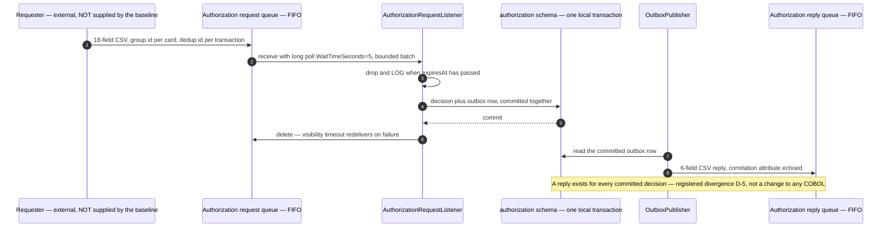

# ADR-004: Messaging Target Replacing IBM MQ

> **Purpose.** Record decision D4 — which messaging service replaces the five IBM
> MQ queues that carry the three decoupled extension flows — together with the one
> further duty this record is assigned by name: the **message-expiry semantic gap**
> and its resolution. This decision is **one of only two genuine close calls in the
> whole migration**, and it is presented as one rather than as a foregone
> conclusion. This record explains the choice; it does not reopen it.
>
> **Source of truth.** The decision of record is the Agent Action Plan (AAP)
> §0.1.2 row D4, which fixes the accepted option. AAP §0.4.1.8 and §0.7.6 assign
> the expiry gap to this file by path. The behavioural specification is the COBOL
> baseline under `app/**` — specifically the `app/app-authorization-ims-db2-mq` and
> `app/app-vsam-mq` extension trees — which is **read-only**: this record cites it
> by path and line and never edits it. Where this record and the baseline appear to
> disagree about behaviour, the baseline is right and this record is wrong.

- **Status:** Accepted
- **Decision:** Replace IBM MQ with **Amazon SQS**. Use **FIFO** queues for the
  **authorization** request and reply pair, where per-card ordering and duplicate
  suppression are observable baseline behaviour, and **standard** queues for the
  **inquiry** flows and the terminal error sink, where no ordering requirement
  exists. Every queue carries a **dead-letter queue at `maxReceiveCount` 5**.
  Request and reply stay a request/reply pair through explicit reply queues plus
  correlation attributes, and the positional CSV payloads keep their field order,
  their field widths and their delimiter through a single codec. The wire guarantee is
  **direction-specific rather than byte-for-byte in both directions** — the codec is
  tolerant on input and canonical on output, and the exact lengths, the boundaries
  where they differ and the registered divergences are enumerated in
  [Wire Contract Preservation](#wire-contract-preservation).
- **Scope of this record.** The message transport, the attributes that carry
  request/reply identity, the expiry gap and the wire contract. Nothing else. The
  language and runtime belong to [ADR-001](ADR-001-language-and-runtime.md), the
  compute substrate that runs the consumers to
  [ADR-002](ADR-002-compute-platform.md), the datastore whose single schema makes
  the outbox a local write to [ADR-003](ADR-003-datastore-targets.md), the batch
  state machine to [ADR-005](ADR-005-batch-orchestration.md), the synchronous API
  surface to [ADR-006](ADR-006-api-and-ui.md), the ownership of each flow to
  [ADR-007](ADR-007-service-boundaries.md), and encryption, key management and
  identity to [ADR-008](ADR-008-security-and-identity.md). The exhaustive
  field-by-field contract lives in
  [`docs/architecture/messaging-contracts.md`](../architecture/messaging-contracts.md);
  this record decides, that document specifies.

## Context

Five IBM MQ queues carry three flows that the baseline deliberately decoupled from
the online transactions. The flows are described from the source that defines
them, because a transport chosen without reference to the semantics it must carry
is a preference rather than a decision.

### The five baseline queues become six target queues, and what each one carries

Assumptions: **the two counts differ by one and the difference is deliberate.** The
baseline names FIVE queues, but one of them — `CARDDEMO.REQUEST.QUEUE` — is shared by
two unrelated flows read by two different programs, and the target gives each flow its
own source queue so that one context's consumer cannot receive the other's request. The
target therefore provisions **six source queues and six dead-letter queues**, and every
count in this record is stated against six. The per-queue contracts are specified in
[`docs/architecture/messaging-contracts.md`](../architecture/messaging-contracts.md).

| Baseline queue | Declared at | Target queue | Type |
|---|---|---|---|
| `AWS.M2.CARDDEMO.PAUTH.REQUEST` | [`app/app-authorization-ims-db2-mq/README.md`](../../app/app-authorization-ims-db2-mq/README.md) **L278** | `carddemo-pauth-request-<env>.fifo`, with `carddemo-pauth-request-<env>-dlq.fifo` | FIFO |
| `AWS.M2.CARDDEMO.PAUTH.REPLY` | [`app/app-authorization-ims-db2-mq/README.md`](../../app/app-authorization-ims-db2-mq/README.md) **L279** | `carddemo-pauth-reply-<env>.fifo`, with `carddemo-pauth-reply-<env>-dlq.fifo` | FIFO |
| `CARDDEMO.REQUEST.QUEUE`, account-detail traffic | [`app/app-vsam-mq/README.md`](../../app/app-vsam-mq/README.md) **L53**, **L71** | `carddemo-account-inquiry-request-<env>` + `-dlq` | standard |
| `CARDDEMO.REQUEST.QUEUE`, date-conversion traffic | [`app/app-vsam-mq/README.md`](../../app/app-vsam-mq/README.md) **L53**, **L71** | `carddemo-date-inquiry-request-<env>` + `-dlq` | standard |
| `CARDDEMO.RESPONSE.QUEUE` | [`app/app-vsam-mq/README.md`](../../app/app-vsam-mq/README.md) **L54**, **L72** | `carddemo-inquiry-reply-<env>` + `-dlq` | standard |
| `CARD.DEMO.ERROR` | [`app/app-vsam-mq/cbl/CODATE01.cbl`](../../app/app-vsam-mq/cbl/CODATE01.cbl) **L243**, [`COACCT01.cbl`](../../app/app-vsam-mq/cbl/COACCT01.cbl) **L294** | `carddemo-error-<env>` + `-dlq` | standard |

Trade-offs: splitting one baseline queue into two target queues costs one more queue
pair to provision and one more URL to inject. The alternative — one shared request queue
with a discriminator on the message — was rejected because either consumer would then
receive and have to re-queue the other's messages, which turns a routing decision into a
redelivery loop and makes each context's dead-letter queue carry the other's failures.
The single reply queue is NOT split, because a reply is routed by the requester's own
reply-to attribute rather than by the flow it belongs to.

**Five baseline queues become six primary queues, each with its own dead-letter
queue — twelve provisioned queues in total.** Row three is the only row that fans
out, and it fans out for the reason given in
[One baseline request queue serves two future owners](#one-baseline-request-queue-serves-two-future-owners).
The five rows above are the granularity at which AAP §0.4.1.8 fixes the decision;
the delivered resource count is the granularity at which
[`infra/modules/sqs/README.md`](../../infra/modules/sqs/README.md) records it, and
that module README is the authority for provisioned names. Assumptions: the two FIFO
dead-letter names are spelled out in full rather than abbreviated to a `-dlq` suffix,
because a FIFO queue's name must END in `.fifo` — so the dead-letter name is
`…-<env>-dlq.fifo` and not `…-<env>.fifo-dlq`, and a suffix notation would have
implied the second. The four standard rows keep the suffix notation because for them
it is exact. Refactoring Rationale:
this record previously named a single `carddemo-inquiry-request-<env>` queue that
is not provisioned under that name, so a reader reconciling the document against
the module would have found a queue that does not exist and two that were
undocumented. Stating both counts — five logical flows, six primary queues —
removes the contradiction without reopening the decision, because the fan-out
changes no flow's semantics.

None of the three flows drives a screen. The repository's own transaction
inventory records `CP00` → `COPAUA0C` as "MQ trigger, request and response; Insert
and Update to IMS" with an empty map column at
[`README.md`](../../README.md) **L305**, and `CDRD` → `CODATE01` and `CDRA` →
`COACCT01` as "Demonstrates MQ request/response pattern", also with no map, at
**L313** and **L314**. Assumptions: a flow with no map has no terminal to carry
state between turns, so the transport is the entire interface. That is what makes
the payload shape in [Wire Contract Preservation](#wire-contract-preservation) a
contract rather than an implementation detail.

### The three extensions do not share one messaging discipline

**This is the single most important fact in this record, and treating the flows
uniformly would break one of them.** The two disciplines are opposites in the
source, not variations on a theme.

**Authorization reads and writes outside the message-queue unit of work.** In
[`COPAUA0C.cbl`](../../app/app-authorization-ims-db2-mq/cbl/COPAUA0C.cbl) the get
is `MQGMO-NO-SYNCPOINT + MQGMO-WAIT` at **L389**, the reply put is
`MQPMO-NO-SYNCPOINT` at **L753** issued through `MQPUT1` at **L758**, and the
database work commits **separately** through `EXEC CICS SYNCPOINT` at **L335** —
once per message, inside the main loop at **L326**–**L344**.

**The order the source performs these in is the fact that determines all three
consequences below, so it is stated before them.** Inside `5000-PROCESS-AUTH` the
decision is made at **L459**, the reply is put at **L461**
(`PERFORM 7100-SEND-RESPONSE`, whose `MQPUT1` is **L758**), and only **then** is the
authorization written, at **L464** (`PERFORM 8000-WRITE-AUTH-TO-DB`, guarded by
`IF CARD-FOUND-XREF` at **L463**). `5000-PROCESS-AUTH` is itself performed at **L330**,
which is **before** the `EXEC CICS SYNCPOINT` at **L335**. **The reply therefore leaves
ahead of both the database write and the commit** — not after them. Assumptions: a
reader who has only the three line numbers L335, L753 and L758 in front of them will
naturally read them in numeric order and infer commit-then-publish, which is the
opposite of what the program does; the paragraph numbers are what settle it.

Three consequences follow directly, and each one shapes the target:

1. Request consumption is **at-most-once**. The get at **L389** carries
   `MQGMO-NO-SYNCPOINT`, so it is a **destructive get outside any unit of work**: the
   message is gone from the queue the moment it is read, a rollback does not put it
   back, and the queue manager never redelivers it. A failure anywhere after **L389**
   loses that request outright. Assumptions: "no automatic redelivery" is precisely
   what makes this at-most-once — at-least-once would require the opposite, a message
   that survives a failed attempt and is presented again.
2. The reply is **published before the decision is persisted or committed**, per the
   order above. The observable window therefore runs in the direction a reader is
   least likely to guess: a failure after the put at **L758** and before or during the
   write at **L464** or the commit at **L335** leaves **a reply on the queue with no
   committed decision behind it**, and — because the request was already consumed
   destructively at **L389** — nothing re-derives that decision. The window in the
   other direction, a committed decision with no reply, cannot arise from a failure
   between the commit and the put, because the put has already happened by then. This
   is described here **factually as the behaviour being migrated**; the baseline is the
   specification, not a defect list.
3. The message-batch discipline is explicit, not incidental. The limit is declared
   as `WS-REQSTS-PROCESS-LIMIT PIC S9(4) COMP VALUE 500` at **L40** and enforced at
   **L339**; the get waits on a `WS-WAIT-INTERVAL` of `5000` set at **L242**. The
   enforcement increments at **L332** and only then tests with `>`, so the count the
   loop actually admits is **501**, not the declared 500 — see
   [The batch discipline is reproduced, not silently changed](#5-the-batch-discipline-is-reproduced-not-silently-changed).

**Inquiry reads and writes inside the message-queue unit of work.** Both
[`COACCT01.cbl`](../../app/app-vsam-mq/cbl/COACCT01.cbl) and
[`CODATE01.cbl`](../../app/app-vsam-mq/cbl/CODATE01.cbl) use `MQGMO-SYNCPOINT` on
the get — **L347** and **L296** respectively, each combined with `MQGMO-WAIT` at
**L350** and **L299** — and `MQPMO-SYNCPOINT` on both the reply put and the error
put, at **L475** and **L512** in `COACCT01` and **L379** and **L416** in
`CODATE01`. Each opens its main process with `EXEC CICS SYNCPOINT`, at **L327** and
**L276**. Alternatives Considered: mapping every flow onto one target discipline,
which is the shorter design and the reason this section exists. It is rejected
because the two source disciplines demand different target mechanisms — a
read-under-syncpoint get maps cleanly onto **visibility timeout plus
delete-on-success**, where the queue itself redelivers on failure, whereas the
authorization flow's separate commit has no such coupling and needs the outbox in
[Rationale](#rationale) to obtain the same guarantee. Applying the inquiry mapping
to authorization would claim a redelivery property the baseline does not have;
applying the authorization mapping to inquiry would discard one it does.

Both inquiry programs take their input queue name from the CICS trigger message
rather than a literal — `MOVE MQTM-QNAME TO INPUT-QUEUE-NAME` at
[`COACCT01.cbl`](../../app/app-vsam-mq/cbl/COACCT01.cbl) **L197** and
[`CODATE01.cbl`](../../app/app-vsam-mq/cbl/CODATE01.cbl) **L146** — and both
resolve the error destination to the same literal `CARD.DEMO.ERROR`.

### One baseline request queue serves two future owners

`CARDDEMO.REQUEST.QUEUE` is declared once, for the group, and serves **both**
inquiry transactions. In the target those two flows are owned by two different
bounded contexts: account inquiry by `account-service` and date conversion by
`reference-service`, per [ADR-007](ADR-007-service-boundaries.md).

Refactoring Rationale: a single queue polled by two independent services is a
competing-consumer arrangement in which each service's poller receives and deletes
messages intended for the other, because a standard queue delivers a message to
whichever consumer asks first and has no per-consumer filter. The detailed contract
in
[`docs/architecture/messaging-contracts.md`](../architecture/messaging-contracts.md)
therefore fans the one baseline request queue out into **two per-flow request
queues**, each consumed by exactly one service, with a configured shared reply
destination. The mapping table above records the decision of record at the
granularity AAP §0.4.1.8 fixes it; the fan-out is a refinement of the same
decision, not a departure from it, and the two documents agree.

### What the transport has to carry



The requester at the left of that diagram is deliberately labelled as absent. AAP
§0.2.2 records that the authorization request **producer is not supplied by the
baseline** — only a stub exists, at
[`tests/mocks/mq_request_stub.py`](../../tests/mocks/mq_request_stub.py) — and that
building one is not requested. It is **out of scope and is not delivered**.

## Decision

Amazon SQS is the messaging target. The decision has four parts, and each is
motivated by a property of the flows above rather than by a preference between
services.

1. **FIFO queues for the authorization request and reply pair.** Ordering per card
   and duplicate suppression are the two properties the authorization flow needs,
   and a FIFO queue is the only SQS queue type that provides either.
2. **Standard queues for the two inquiry flows and the terminal error sink** —
   four in the delivered set, because the two inquiry request legs are provisioned
   as separate queues while sharing one reply queue. Neither inquiry flow has an
   ordering requirement, and the error queue is a sink with no sequencing
   semantics at all.
3. **A dead-letter queue on every queue, at `maxReceiveCount` 5.** This is the
   durable retry tier, and it is one of the two independent reasons
   [ADR-002](ADR-002-compute-platform.md#2-no-external-resilience-library) declares
   no external resilience library.
4. **A transactional outbox for the authorization reply.** The reply row is
   written inside the same local transaction as the decision and published from
   that row afterwards.

Adopting SQS is not free of consequence, and the cost is named rather than
implied: the per-message expiry that the baseline obtains from the queue manager
has to be re-implemented in application code. That is the whole subject of
[The Message-Expiry Semantic Gap](#the-message-expiry-semantic-gap).

## Options Considered

### Option 1 — Amazon SQS — ACCEPTED

FIFO for authorization, standard for inquiry and the error sink, a dead-letter
queue on each, correlation carried in message attributes, and the positional CSV
payload preserved by one codec. There is no broker: a queue exists, and it is
charged for the requests made against it.

What it does not provide is a per-message time to live. Queue-level message
retention exists; per-message expiry does not. That single missing capability is
the entire cost of this option and is resolved explicitly below.

### Option 2 — Self-managed IBM MQ on AWS — the protocol-fidelity maximum, rejected

Assumptions: **there is no managed IBM MQ engine on AWS.** Amazon MQ's broker
engine set is exactly ActiveMQ and RabbitMQ — its `engineType` admits those two
values and no others — so an "Amazon MQ for IBM MQ" is not a thing that can be
selected. Keeping the baseline's own protocol on AWS therefore means running IBM MQ
oneself: a licensed queue manager on EC2, or that same queue manager in a container
on ECS or EKS. That is the option evaluated here, and naming it accurately is what
makes its burden and its charge legible instead of flattering.

Refactoring Rationale: AAP §0.1.2 row D4 states the rejected alternative in the
shorthand "Amazon MQ for IBM MQ". **The decision that row fixes is unchanged and is
not reopened here** — SQS is accepted — but that shorthand collapses two different
things into one name, so this record splits it into the two options it can only have
meant: the self-managed queue manager below, which supplies the protocol fidelity,
and [Option 3](#option-3--amazon-mq-for-activemq-or-rabbitmq--the-managed-broker-close-call-rejected),
which supplies the managed broker. Evaluating a combination that cannot be
provisioned would have overstated the rejected side's capability and understated its
cost, which is the opposite of what an option set is for.

This option deserves — and gets — a genuinely fair hearing, because on capability
it is the strongest of the five.

Assumptions: **IBM MQ is not an Amazon MQ engine.** Amazon MQ offers exactly two
broker engines, ActiveMQ and RabbitMQ, so "managed IBM MQ" is not a purchasable
AWS service and cannot be the option compared here. Obtaining IBM MQ on AWS means
running it yourself on EC2 — from a Marketplace listing or an own-licence
install — which is what this option is. Refactoring Rationale: this record
previously named a non-existent "Amazon MQ for IBM MQ" service. Naming the real
deployment shape matters to the outcome rather than only to accuracy, because it
moves the option from *managed* to *self-managed* and so decides it against the
AAP §0.9.4 guiding principle directly, as point 1 below now records.

- It speaks **the same wire protocol**. The programs' `MQGET`, `MQPUT` and `MQPUT1`
  calls and their message-descriptor fields are the native vocabulary of this
  software, not a translation target.
- It supports **the same queue and message-descriptor concepts** the baseline
  relies on: correlation identifier, message identifier, reply-to queue,
  persistence, format indicator and message type.
- It has a **native per-message expiry**. `MQMD-EXPIRY` at
  [`COPAUA0C.cbl`](../../app/app-authorization-ims-db2-mq/cbl/COPAUA0C.cbl)
  **L750** would be honoured by the queue manager exactly as the baseline sets it,
  with no application code involved. **This is one capability the accepted option
  lacks.**
- It would therefore require **the least translation of any option** — the
  syncpoint distinction in [Context](#the-three-extensions-do-not-share-one-messaging-discipline)
  would map onto the same two queue-manager behaviours it already names.

It is rejected on three grounds, all concrete:

1. **It is not a managed service at all**, which is the ground the guiding
   principle at AAP §0.9.4 rules on most directly. A queue manager brings an
   administration surface that nothing delegates: queue and channel definitions, a
   dead-letter queue policy, authority records, log and backup management, version
   patching, MQ fix packs, licence compliance, and a multi-instance or replicated
   arrangement for availability. The accepted option has none of that surface;
   Option 3 at least has AWS carrying most of it.
2. **It carries a licence in addition to compute.** Its charge is the same
   instance-hours-plus-storage shape as Option 3 with a software licence added on
   top — see [Cost Implications](#cost-implications). Its floor is non-zero by
   construction and materially larger than the accepted option's, which
   [The accepted option's floor is small but not zero](#the-accepted-options-floor-is-small-but-not-zero)
   states rather than rounding to nothing.
3. **It keeps a broker for a workload that needs none.** Nothing in the three flows

   requires a broker's capabilities — no protocol bridging, no topic hierarchy, no
   selector-based routing, no transactional coupling between the queue and the
   database that the baseline does not already forgo at
   [`COPAUA0C.cbl`](../../app/app-authorization-ims-db2-mq/cbl/COPAUA0C.cbl)
   **L389** and **L753**.

Trade-offs: **rejecting this option has a price, and it is paid in application
code.** Choosing the accepted option gives up protocol fidelity — every
message-descriptor field becomes a message attribute and every payload passes
through a codec — and it gives up the queue-manager-enforced per-message expiry,
which has to be re-implemented as the `expiresAt` check described in
[The Message-Expiry Semantic Gap](#the-message-expiry-semantic-gap). What is bought
with that price is the removal of an entire administered component: no broker to
size, version, patch or fail over, and no instance-hour or licence charge accruing
while no message flows. The exchange is a bounded, testable amount of consumer code
for a permanently absent operational surface, which is why it resolves as it does —
but it is an exchange, not a free choice, and this record does not present it as one.

### Option 3 — Amazon MQ for ActiveMQ or RabbitMQ — the managed-broker close call, rejected

This is **the managed broker option**, and it is the genuine runner-up: of the
rejected options it is the only one that AWS operates *and* that closes the expiry
gap without application code.

- It does **not** speak the baseline's protocol, so it needs **the same payload
  translation the accepted option needs**, plus a header mapping rather than an
  attribute mapping: the message-descriptor correlation identifier, message
  identifier, reply-to queue and format indicator become `JMSCorrelationID`,
  `JMSMessageID`, `JMSReplyTo` and a content-type property under ActiveMQ, or
  `correlation-id`, `message-id`, `reply-to` and `content-type` under RabbitMQ's
  AMQP model. Assumptions: that translation is neither harder nor easier than the
  accepted option's — it is the same work against a different target vocabulary,
  which is why this option's protocol column reads the same as Option 1's.
- It does have **a per-message expiry primitive**: a per-message time to live under
  JMS, and a per-message expiration under AMQP. `MQMD-EXPIRY` would convert into
  one of those rather than into the consumer-side check the accepted option
  requires. **This is the one thing this option buys that the accepted option
  cannot**, and it is what makes this a close call rather than a dominated choice.

It is rejected on two grounds, both concrete:

1. **It keeps a broker to operate for a workload that needs none.** AWS carries the
   patching and the failover, but the broker remains a sized, versioned component
   whose availability all three flows would depend on and whose maintenance window
   would have to be scheduled around the batch window. The accepted option has no
   such component to schedule around, and the argument against a broker's
   capabilities in Option 2's third ground applies here unchanged.
2. **It prices as broker-instance-hours plus storage whether or not messages
   flow.** See [Cost Implications](#cost-implications). Its cost floor is non-zero
   by construction and a highly available deployment multiplies it by instance
   count; the accepted option's floor is zero.

Trade-offs: what this option offers over the accepted one is **exactly one
primitive** — broker-enforced per-message expiry — and the price of declining it is
the `expiresAt` check in
[The Message-Expiry Semantic Gap](#the-message-expiry-semantic-gap). Alternatives
Considered: accepting this option purely to obtain that primitive natively, which is
rejected because one primitive does not pay for a permanent operational and cost
surface when the primitive is reproducible in consumer code whose behaviour this
record specifies and whose tests can assert it. Note that this option is **not**
dominated — an earlier framing of this record called it so, which was only true
while the option set contained a managed IBM MQ engine that does not exist.

### Option 4 — Kafka or Kinesis — out of scope, not delivered

AAP §0.2.2 places streaming platforms explicitly out of scope, and the reason is a
mismatch of problem shape rather than of capability: **the messaging requirement
here is request and reply**, which the accepted option satisfies. A log-oriented
streaming platform solves partitioned ordered replay over a retained log — durable
re-reading by offset, multiple independent consumer groups over the same records,
and long retention as a feature. None of those appears in the three flows: a reply
is consumed once by the party that asked for it, and
[`COPAUA0C.cbl`](../../app/app-authorization-ims-db2-mq/cbl/COPAUA0C.cbl) **L749**
marks it non-persistent precisely because it is not meant to be re-readable. This
option is **not delivered** and no part of this design depends on one.

### Option 5 — Replacing messaging with synchronous calls — rejected

Alternatives Considered: collapsing the three flows into synchronous HTTP calls,
which would remove a transport from the architecture altogether. Rejected because
the baseline **chose** decoupling: the authorization consumer is triggered by a
queue rather than invoked by a caller, which is exactly what the empty map column
at [`README.md`](../../README.md) **L305** records. Making the call synchronous
would couple the authorization decision path to the caller's availability and
would convert a queued backlog — which survives a consumer being unavailable —
into a failed request. That changes the failure semantics the baseline selected,
which [Rationale](#rationale) treats as a contract to preserve.

A JSON envelope **is** offered additively for new consumers, and is never a
replacement for the CSV contract. That is a payload option, not a transport
option, and it is recorded in
[Wire Contract Preservation](#wire-contract-preservation).

### The five options side by side

| Option | Speaks the baseline protocol | Native per-message expiry | Broker to operate | Cost floor when idle | Verdict |
|---|---|---|---|---|---|
| 1. Amazon SQS | No — translated by one codec | No — re-implemented in the consumer | None | None | **Accepted** |
| 2. Self-managed IBM MQ on AWS | Yes | Yes — `MQMD-EXPIRY`, honoured by the queue manager | Yes, and self-administered | Licence plus instance-hours plus storage | Rejected — not a managed service |
| 3. Amazon MQ for ActiveMQ or RabbitMQ | No — the same codec as option 1, plus a header mapping | Yes — a JMS time to live or an AMQP expiration | Yes, operated by AWS | Instance-hours plus storage | Rejected — close call |
| 4. Kafka or Kinesis | No | No | Managed cluster or shards | Non-zero | Out of scope, not delivered |
| 5. Synchronous calls | Not applicable — no queue | Not applicable | None | None | Rejected — changes failure semantics |

Assumptions: **Amazon MQ appears once in this table, not twice.** Its broker engine
set is ActiveMQ and RabbitMQ, so the row that would have read "Amazon MQ for IBM MQ"
is instead the self-managed row above it — which is why the protocol-fidelity option
and the managed-broker option are two different rows with two different verdicts
rather than one row that claimed both properties at once.

## Rationale

Each numbered claim below is checkable against a cited line or a named
configuration value. None of them restates the decision.

### 1. Request and reply survive as a pair, through attributes rather than descriptors

The baseline does not hard-code where a reply goes. It reads the routing and the
correlation identity out of the incoming message descriptor and echoes them back:
`MQMD-CORRELID` is saved to `WS-SAVE-CORRELID` and `MQMD-REPLYTOQ` to
`WS-REPLY-QNAME` at
[`COPAUA0C.cbl`](../../app/app-authorization-ims-db2-mq/cbl/COPAUA0C.cbl)
**L411**–**L414**, and the reply then sets `MQOD-OBJECTNAME` from that saved queue
name at **L742** and `MQMD-CORRELID` from that saved identity at **L745**, with
`MQMT-REPLY` as the message type at **L744**. The inquiry side does the same,
restoring the saved message and correlation identifiers at
[`COACCT01.cbl`](../../app/app-vsam-mq/cbl/COACCT01.cbl) **L469**–**L470**.

Assumptions: request/reply in this baseline is **carried by the message, not
configured in the broker**. That is what makes the pattern portable to a service
with no descriptor structure — the same four values move to message attributes:

All line numbers in this table are in
[`COPAUA0C.cbl`](../../app/app-authorization-ims-db2-mq/cbl/COPAUA0C.cbl).

| Message-descriptor field | Target message attribute | Cited baseline use in `COPAUA0C.cbl` |
|---|---|---|
| Correlation identifier | `correlationId` | `MQMD-CORRELID` saved **L412**, echoed **L745** |
| Message identifier | `messageId` | `MQMD-MSGID` **L395**, **L746** |
| Reply-to queue | `replyToQueueUrl` | `MQMD-REPLYTOQ` saved **L413**–**L414**, applied **L742** |
| Format indicator, string | `contentType` of `text/csv` | `MQFMT-STRING` **L751** |

Alternatives Considered: inferring the reply destination from the queue a message
arrived on, which would remove one attribute. Rejected because the baseline reads
it per message, so a requester is free to nominate a different reply destination
per request; hard-coding the pairing would silently remove a capability the source
actually exercises.

### 2. Ordering is grouped by card, because that is the granularity the domain has

The FIFO group **identity** is the card and the deduplication **identity** is the
transaction. Both are drawn from fields present in the request layout:
`PA-RQ-CARD-NUM` at
[`CCPAURQY.cpy`](../../app/app-authorization-ims-db2-mq/cpy/CCPAURQY.cpy) **L21**
and `PA-RQ-TRANSACTION-ID` at **L36**.

Both are carried as their **raw values**: `MessageGroupId` is the sixteen-character
card number and `MessageDeduplicationId` is the fifteen-character transaction
identifier, which is what §0.4.1.8 of the technical specification states literally
and §0.7.6 repeats for the grouping rule.

Alternatives Considered: **a single global group**, which is the simpler
configuration and would guarantee total order across the whole stream. Rejected
because it would serialise every authorization behind every other one to obtain a
guarantee nothing asks for. The authorization sequence that matters is the sequence
of decisions **against one card** — two transactions on unrelated cards have no
ordering relationship in the baseline, which processes them one after another only
because a single task reads a single queue. Grouping by card preserves the
relationship that exists and allows parallel progress across the ones that do not.

Assumptions: **the ordering guarantee is per-card FIFO on the source queue, and it
is bounded at the dead-letter boundary.** Once a message exhausts
`maxReceiveCount` and leaves the source queue, later messages in the same group may
proceed. An unqualified claim that two authorizations can never be observed out of
sequence would be too broad, and the narrower enforceable commitment is stated in
[`docs/architecture/messaging-contracts.md`](../architecture/messaging-contracts.md).

Refactoring Rationale: an earlier revision of this decision carried both identities
as **purpose-separated keyed derivations** produced by `CsvAuthCodec` through
`OpaqueIdentifier`, so that neither the card number nor the transaction identifier
entered queue metadata. That is withdrawn, and the reason is not tidiness. A group
identity orders one card's messages only while **every** producer on the queue
computes the same value for that card, and a deduplication identity suppresses a
resend only while the **requester** that may resend can predict it. A value keyed
from the consumer's own secret satisfies neither: a second producer written to this
ADR would have placed one card's messages in a different group and lost the ordering
guarantee, and a requester's honest resend would have been accepted as new. The
specification states both identities literally for exactly that reason, and a
confidentiality measure that removes an ordering guarantee is not a trade this ADR
can make on the specification's behalf.

Trade-offs: the primary account number therefore **does** appear in queue metadata,
which is where [ADR-008](ADR-008-security-and-identity.md) requires it to be masked
for logs and metrics, and the conflict is resolved in the specification's favour and
registered rather than hidden — divergence
`D-AUTHORIZATION-FIFO-IDENTITY-METADATA` in the
[divergence register](../architecture/cobol-to-service-traceability.md). Three
provisioned controls bound the exposure, and each is asserted in infrastructure code
rather than assumed: the queues are encrypted with a customer-managed KMS key, they
are reachable only through an interface endpoint inside the private network, and
receive/send capability is scoped to the task roles of the consumer and the
requesting producer. What the controls do not cover is queue telemetry and any log
line that records a group identity, so the containment rule is asserted in code
instead: `OutboxMetadataConfidentialityTest` pins the number to that **one**
metadata field and fails if it reaches the deduplication identity, the queue address
or any message attribute. The cost of the withdrawn derivation — an operator seeing
a token and needing the codec to relate it to a card — also disappears.

### 3. Duplicate suppression is real but bounded, and the durable backstop is the database

The deduplication attribute gives exactly-once **acceptance** of a given transaction
identity — a second send of the same identifier inside the deduplication window is
accepted and discarded rather than delivered twice.

Assumptions: **that window is five minutes, not unbounded.** This matters more here
than it would in a system inheriting redelivery from its source, because the
baseline's own consumption is **at-most-once**, not at-least-once: the get at
[`COPAUA0C.cbl`](../../app/app-authorization-ims-db2-mq/cbl/COPAUA0C.cbl) **L389**
carries `MQGMO-NO-SYNCPOINT`, so the message is destroyed on read and the queue
manager never presents it again. Redelivery is therefore a behaviour the **target
introduces** — an SQS message reappears when its visibility timeout expires — and
introducing it obliges the target to be idempotent where the baseline never had to
be. Queue-level deduplication removes the near-duplicate case; it cannot remove a
redelivery that arrives after the window. The durable
idempotency backstop is therefore the **database**, where a committed authorization
is recognisable by its own key, exactly as
[ADR-003](ADR-003-datastore-targets.md) makes the decision plus outbox one local
transaction. Presenting the queue's window as unbounded exactly-once would put the
whole correctness argument on a five-minute guarantee.

### 4. Dead-letter queues are the durable retry tier

Every queue has a dead-letter queue at **`maxReceiveCount` 5**. A message that
fails five receive attempts leaves the source queue for quarantine rather than
blocking its group indefinitely.

Assumptions: this, together with per-state retry in the batch state machine of
[ADR-005](ADR-005-batch-orchestration.md), is the tier that survives a consumer
**process disappearing** — which no in-process retry can, because the retry state
disappears with it. That is the second of the two independent reasons
[ADR-002](ADR-002-compute-platform.md#2-no-external-resilience-library) declares no
external resilience library, and that record cites this one for the
`maxReceiveCount` value. The two records must agree, and they do.

### 5. The batch discipline is reproduced, not silently changed

Two numbers in the baseline govern how the consumer paces itself, and both are
carried across deliberately.

| Baseline behaviour | Cited at | Target mechanism |
|---|---|---|
| A **declared** bound of 500 requests per invocation, which the loop **observably admits 501** of | `WS-REQSTS-PROCESS-LIMIT ... VALUE 500` **L40**; `ADD 1 TO WS-MSG-PROCESSED` **L332** then `IF WS-MSG-PROCESSED > WS-REQSTS-PROCESS-LIMIT` **L339** | A **bounded intake window** that admits the same **501** — the declared 500 is configured and the offset is added, so no divergence is registered |
| A five-second wait on the get | `MOVE 5000 TO WS-WAIT-INTERVAL` **L242**, applied to `MQGMO-WAITINTERVAL` **L393** | **`WaitTimeSeconds=5`** on receive |

**500 is declared; 501 is what the loop admits, and the two are different numbers.**
The counter is incremented at **L332** *before* being tested at **L339**, and the test
is a strict `>` rather than `>=`. On the request that makes the count 500 the test is
`500 > 500`, which is false, so **L342** reads one more request; the loop ends only
when the count reaches 501. Assumptions: this is arithmetic on the source as written,
not an inference about intent — the declared literal and the admitted count simply are
not the same figure, and a record that quotes only the literal leaves a reader unable
to reconcile a 501st processed request with the number they were given.

Refactoring Rationale: the target admits the **observed 501**, and this decision has been
reversed. An earlier revision enforced the declared 500 — on the argument that 500 is the
number the source states as its policy and the number every other document quotes — and
registered the one-request difference as **D-AUTH-REQUEST-WINDOW**. That entry has been
withdrawn and the withdrawal is recorded in the section preamble of
[the divergence register](../architecture/cobol-to-service-traceability.md). Two things
decided the reversal. Functional parity with observable behaviour is a stated constraint
of this migration rather than a preference, so a difference that can be removed outright
is not a difference to register. And the objection the earlier choice rested on —
that a constant reading 500 would have to be explained as meaning 501 — is answered
without any divergence at all, by keeping the configured value at the declared 500 and
holding the `+1` as `BASELINE_COMPARISON_OFFSET`, a separately named constant carrying the
increment-then-compare citation that derives it. Two named numbers that add up beat one
number that has to be re-explained. Assumptions: the bound governs pacing rather than any
reject reason, message, boundary or calculation, so this reversal changes no parity
comparison of business output; what it changes is that a full run of the migrated consumer
now handles as many requests as a full run of the reference program.

The unit is worth stating because the literal is ambiguous on its face: the
interval is in **milliseconds**, so `5000` is five seconds. The baseline says so
itself — the comment at
[`COACCT01.cbl`](../../app/app-vsam-mq/cbl/COACCT01.cbl) **L336** reads
`*** ADDED 5000 MS (5 SECS) AS THE WAIT INTERVAL FOR GET`, immediately above the
same `MOVE 5000` at **L337**.

Trade-offs: an unbounded consumer loop and a shorter or absent receive wait would
both be less code. They are rejected because either one **changes throughput
characteristics without changing any stated requirement** — removing the bound lets
one invocation drain an arbitrarily long backlog and hold its database connection
for the duration, and shortening the wait converts one long poll into many short
empty polls, which costs more requests for the same work
([Cost Implications](#cost-implications)). Preserving both numbers keeps the
migrated consumer's pacing comparable to the baseline's, which is what makes a
parity comparison meaningful.

### 6. The publish-before-commit window is closed by an outbox, and the closure is a registered divergence

The baseline **publishes first and commits second**, in that order:
[`COPAUA0C.cbl`](../../app/app-authorization-ims-db2-mq/cbl/COPAUA0C.cbl) puts the
reply at **L461** (reaching `MQPUT1` at **L758**), writes the authorization at
**L464**, and commits at **L335** — the whole of `5000-PROCESS-AUTH` being performed
at **L330**, ahead of that commit. The two events are therefore independently
observable in the direction **reply-without-decision**: a failure after the put and
before the write or the commit lands a reply on the queue that no committed row
accounts for, and the request that produced it was already destructively consumed at
**L389**, so it cannot be presented again to re-derive the decision.

The target writes the reply into an **outbox row inside the same local transaction as
the decision** and publishes from that row afterwards. That inverts the ordering
deliberately: a reply can no longer precede the decision it reports, and — because the
row survives a publish failure and is retried — a reply exists for every committed
decision. Both halves of the guarantee change, so both are stated.

Refactoring Rationale: this is an **intentional behavioural divergence in the
migrated Java, and no COBOL is changed by it**. The baseline stays byte-identical
because it is the parity oracle; the divergence is registered as **D-5** in
[the divergence register](../architecture/cobol-to-service-traceability.md#d-5--the-reply-published-before-the-decision-is-committed),
which is the authoritative list of every intentional difference. Alternatives
Considered: reproducing the window exactly, which is the strictest reading of
functional parity. Rejected because the window is a **failure-path** behaviour
rather than an observable business rule — no reject reason, message, boundary or
calculation depends on it — and reproducing an uncommitted-but-answered
authorization on purpose would create a state the two endpoints permanently disagree
about, which the surrounding design has no way to detect or reconcile.

### 7. The distributed commit is eliminated, not emulated

The baseline authorization flow spans an IMS hierarchy and a Db2 table, so one
logical authorization requires a commit coordinated across two resource managers.
In the target, the summary, detail, fraud **and outbox** data all live in **one**
PostgreSQL schema, per [ADR-003](ADR-003-datastore-targets.md) and
[ADR-007](ADR-007-service-boundaries.md), so the same unit of work is a **single
local transaction**. Registered as **D-6** in
[the divergence register](../architecture/cobol-to-service-traceability.md#d-6--the-distributed-commit-is-eliminated-not-emulated).

Assumptions: this is what makes the outbox in claim 6 a plain local write rather
than a second coordinated participant. Had the data stayed split, an outbox would
have needed the very coordination it exists to avoid.

Note that **exposing transactions for distributed integration is explicitly out of
scope** (AAP §0.2.2) and **is not delivered**. It also appears on the maintainers'
**own** published roadmap — "Exposure of transactions for distributed application
integration" at [`README.md`](../../README.md) **L389**, within the Roadmap section
opening at **L377**. It is cited here as their stated plan, not as a gap.

### 8. The inquiry path stays deliberately plain

The inquiry flows use standard queues with delete-on-success, which is the direct
target expression of their read-under-syncpoint discipline: the queue redelivers on
failure because the message is only deleted after the work succeeds.

Trade-offs: applying FIFO uniformly would be one fewer distinction to explain and
is rejected on cost and on semantics together. FIFO requests are **priced above
standard requests**, so uniform FIFO would pay the higher rate on every inquiry
message to obtain an ordering guarantee neither inquiry program requires — nothing
in [`COACCT01.cbl`](../../app/app-vsam-mq/cbl/COACCT01.cbl) or
[`CODATE01.cbl`](../../app/app-vsam-mq/cbl/CODATE01.cbl) relates one request to a
prior one. It would also impose FIFO's grouped-throughput behaviour
([Trade-offs and Risks](#trade-offs-and-risks)) on a flow that can otherwise run
fully in parallel. The cost of the split is that two queue types now exist in one
system and a reader has to know which flow uses which, which this record and the
mapping table resolve.


## The Message-Expiry Semantic Gap

**This is the one genuine semantic gap in the messaging migration, and it is
recorded here rather than papered over.** It is also the single capability on which
both rejected broker options — Option 2's `MQMD-EXPIRY` and Option 3's JMS or AMQP
per-message expiry — are stronger than the accepted one, which is why this section
sits immediately after the rationale rather than among the risks.

### The baseline behaviour

The authorization reply is short-lived by explicit instruction, set two lines
apart in
[`COPAUA0C.cbl`](../../app/app-authorization-ims-db2-mq/cbl/COPAUA0C.cbl):

| Line | Statement | Meaning |
|---|---|---|
| **L749** | `MOVE MQPER-NOT-PERSISTENT TO MQMD-PERSISTENCE OF MQM-MD-REPLY` | The reply is **not persistent** — it is not expected to survive a queue-manager restart |
| **L750** | `MOVE 50 TO MQMD-EXPIRY OF MQM-MD-REPLY` | The reply **expires after five seconds** |

Assumptions: **the expiry field is expressed in tenths of a second, so the literal
`50` is five seconds — not fifty.** The conversion is stated explicitly because the
literal is misleading on its face, and because it is the only place in this record
where a cited number does not mean what it appears to mean. Read as seconds it
would be a fifty-second expiry, which is an order of magnitude wrong and would make
the queue-retention choice below look far too aggressive. The two lines are
consistent with each other and with the flow's purpose: a synchronous requester
waiting on a reply has no use for one that arrives after it has stopped waiting, so
the baseline instructs the queue manager to discard it.

### The gap

**SQS has no per-message time to live.** Queue-level message retention exists and
applies to every message on the queue alike; a per-message expiry instant that the
service itself enforces does not. There is no configuration that reproduces
`MQMD-EXPIRY`, and nothing in this record claims otherwise.

### The resolution — three parts, which only work together

1. **Carry the expiry instant as a message attribute — `expiresAt`.** The producer
   computes the instant rather than a duration, so the value survives queue time and
   clock differences between producer and consumer without needing a countdown.
2. **The consumer honours it by dropping the message and logging the drop.** The
   log record is not optional bookkeeping. Assumptions: a silently dropped reply and
   a lost reply are indistinguishable from outside the consumer — both present as a
   reply that never arrived — so without the log record the target would have
   reintroduced, as an unobservable event, precisely the ambiguity that the outbox
   in [Rationale](#6-the-publish-before-commit-window-is-closed-by-an-outbox-and-the-closure-is-a-registered-divergence)
   exists to remove. Dropping is something the system chose to do and can account
   for; losing is something that happened to it. Only the log record tells an
   operator which of the two occurred.
3. **Keep reply-queue retention short**, mirroring the original non-persistent,
   short-lived reply at **L749** and **L750**, so an unconsumed reply does not
   accumulate.

Trade-offs: retention is bounded **below** by the retry budget, not only above by
the baseline's five seconds. Retention shorter than the combined visibility timeout,
receive-count and long-poll budget would let the queue delete a repeatedly failing
reply before it could reach its dead-letter queue, converting a quarantined message
into a vanished one. Short therefore means short relative to the reply's usefulness
and long relative to the retry budget — the two bounds are set in
[`docs/architecture/messaging-contracts.md`](../architecture/messaging-contracts.md),
which owns the numbers.

### What is not equivalent, stated plainly

**In the baseline the expiry is enforced by the queue manager; in the target it is
enforced by the consumer.** That difference has an observable consequence and this
record does not claim parity where there is none:

- A baseline reply that expires is discarded by the queue manager **whether or not
  anything ever reads it**.
- A target reply that expires **remains on the queue until a consumer receives it**
  and discards it. If nothing is polling, the stale message sits there until queue
  retention removes it.

Trade-offs: the accepted consequence is that "expired" describes when a message
**stops being acted upon**, not when it stops existing. Every consumer in this
design checks `expiresAt` before doing any work, so no expired message is ever acted
upon — which is the property the baseline's expiry actually protects. What is given
up is prompt removal of an unread stale message, and short reply retention bounds
how long that can last. Alternatives Considered: a scheduled sweeper that receives
and discards stale messages so the queue is empty of them, which would restore
prompt removal. Rejected because it would spend receive and delete requests on
every stale message purely to make a queue look tidy, while adding a component
whose failure is silent — and it would not improve the guarantee that matters,
since a message the sweeper has not yet reached is in exactly the state the
consumer already handles correctly.

## Wire Contract Preservation

Both directions of the authorization flow are declared with the **string format
indicator** — `MQFMT-STRING` at
[`COPAUA0C.cbl`](../../app/app-authorization-ims-db2-mq/cbl/COPAUA0C.cbl) **L751**
for the reply and **L397** for the request, and again at
[`COACCT01.cbl`](../../app/app-vsam-mq/cbl/COACCT01.cbl) **L471** for inquiry.
There is no schema, no type marker and no length prefix on the wire.

**Therefore field order and the delimiter are the interface.** This is not an
inference from the format indicator alone; the parse and the build both state it
outright:

```text
# WHAT: the two statements that define the authorization wire format — the request
#       parse and the reply build — as they appear in the baseline consumer.
# WHY : Assumptions: these two statements ARE the contract. A positional,
#       comma-delimited payload has nowhere to record a field's name or type, so a
#       field inserted, reordered or re-widened shifts every field after it and is
#       accepted silently as valid data. Quoting them here means the target's codec
#       is checkable against the source rather than against a description of it.

app/app-authorization-ims-db2-mq/cbl/COPAUA0C.cbl  L354-L355   (request, inbound)
    UNSTRING W01-GET-BUFFER(1:W01-DATALEN)
             DELIMITED BY ','

app/app-authorization-ims-db2-mq/cbl/COPAUA0C.cbl  L722-L731   (reply, outbound)
    STRING PA-RL-CARD-NUM         ','
           ...
           DELIMITED BY SIZE
           INTO W02-PUT-BUFFER
```

Two properties follow, and the second is stronger than the delimiter alone:

- **The delimiter is a comma**, stated literally at **L355**.
- **`DELIMITED BY SIZE` at L728 means every field is emitted at its full declared
  width.** Assumptions: field **width** is therefore part of the contract as much
  as field order is. Widening a field by one character does not merely change that
  field — it moves the byte offset of every field after it.

### The request carries eighteen fields

[`CCPAURQY.cpy`](../../app/app-authorization-ims-db2-mq/cpy/CCPAURQY.cpy)
**L19**–**L36** declares exactly eighteen fields, and the parse in
[`COPAUA0C.cbl`](../../app/app-authorization-ims-db2-mq/cbl/COPAUA0C.cbl)
**L356**–**L373** receives exactly eighteen in the same order. The count is
verifiable rather than asserted:

```bash
# WHAT: count the declared fields in each authorization payload layout.
# WHY : Assumptions: the field count IS part of the positional contract, so this
#       record states it as a command a reader can re-run against the read-only
#       baseline rather than as a number to be trusted. Expected output: 18 then 6.
grep -c '^ *05  PA-RQ' app/app-authorization-ims-db2-mq/cpy/CCPAURQY.cpy
grep -c '^ *05  PA-RL' app/app-authorization-ims-db2-mq/cpy/CCPAURLY.cpy
```

### The reply carries six fields

[`CCPAURLY.cpy`](../../app/app-authorization-ims-db2-mq/cpy/CCPAURLY.cpy)
**L19**–**L24**, in order:

| # | Field | Picture | Width |
|---|---|---|---|
| 1 | `PA-RL-CARD-NUM` | `X(16)` | 16 |
| 2 | `PA-RL-TRANSACTION-ID` | `X(15)` | 15 |
| 3 | `PA-RL-AUTH-ID-CODE` | `X(06)` | 6 |
| 4 | `PA-RL-AUTH-RESP-CODE` | `X(02)` | 2 |
| 5 | `PA-RL-AUTH-RESP-REASON` | `X(04)` | 4 |
| 6 | `PA-RL-APPROVED-AMT` | `+9(10).99` | 14 |

### Money crosses the wire as characters, and the baseline proves it

The sixth reply field is not a binary number. `PIC +9(10).99` is a **display-edited**
field: an explicit sign position, ten integer digit positions, an explicit decimal
point and two decimal digit positions. The request's amount is declared the same
way — `PA-RQ-TRANSACTION-AMT PIC +9(10).99` at
[`CCPAURQY.cpy`](../../app/app-authorization-ims-db2-mq/cpy/CCPAURQY.cpy) **L27** —
so **both directions carry money as characters**.

The consumer's own handling settles it beyond the picture clause. The inbound amount
is parsed out of the CSV into an **alphanumeric** staging field at
[`COPAUA0C.cbl`](../../app/app-authorization-ims-db2-mq/cbl/COPAUA0C.cbl) **L364**
and only then converted numerically, by `COMPUTE PA-RQ-TRANSACTION-AMT = FUNCTION
NUMVAL(WS-TRANSACTION-AMT-AN)` at **L376**–**L377**. Outbound, the amount is moved
into an edited display field — `WS-APPROVED-AMT-DIS PIC -zzzzzzzzz9.99`, declared at
**L66** — at **L720**, and that edited field is what the `STRING` emits at **L727**.

Assumptions: **the baseline itself transports money as characters and parses it at
the boundary.** That is a checkable argument rather than a stylistic preference, and
it corroborates the target's rule that money crosses every boundary as a **string**
and never as a JSON number — a JSON number is parsed into a binary floating-point
double by most clients, which would destroy exactness at the one boundary a user
sees. Inside the target, money is exact fixed point at every hop, which
[ADR-003](ADR-003-datastore-targets.md#6-money-is-exact-fixed-point-at-every-hop)
decides and enforces.

### A baseline misspelling is preserved on the wire, character for character

The merchant category field is misspelled `CATAGORY` throughout the extension, and
the wire form is **not** tidied. The two occurrences that matter here are distinct
names at distinct locations, and both were read from the files rather than assumed:

| Occurrence | Location | Role |
|---|---|---|
| `PA-RQ-MERCHANT-CATAGORY-CODE` | [`CCPAURQY.cpy`](../../app/app-authorization-ims-db2-mq/cpy/CCPAURQY.cpy) **L28** | The **wire** field, position 10 of 18 |
| `PA-MERCHANT-CATAGORY-CODE` | [`CIPAUDTY.cpy`](../../app/app-authorization-ims-db2-mq/cpy/CIPAUDTY.cpy) **L36** | The stored **segment** field |

The consumer moves one into the other at
[`COPAUA0C.cbl`](../../app/app-authorization-ims-db2-mq/cbl/COPAUA0C.cbl)
**L886**–**L887**, so the spelling propagates from wire to storage in the baseline.

Trade-offs: the target **corrects the internal name** to `merchantCategoryCode` in
Java and `merchant_category_code` in SQL, while **the wire form is preserved
exactly**. Two spellings of one concept therefore coexist, and a reader moving
between the codec and the entity meets both — that is the accepted cost.
Alternatives Considered: correcting the wire form too, which would make the system
internally uniform. Rejected because the payload is positional and externally
observable, so renaming a field on the wire is either a no-op that misleads a reader
about what the bytes contain, or, if a requester ever keys on the name, a breaking
change to an interface this migration is required to preserve. Alternatives
Considered: propagating the misspelling inward for uniformity instead. Rejected
because the internal name is not an interface and carrying a known error into new
code costs a correction later at every use site. The full register of misspelling
corrections is
[`docs/architecture/data-model-and-schema-mapping.md`](../architecture/data-model-and-schema-mapping.md).

### The JSON envelope is additive and never a replacement

A JSON envelope is offered **additively** for new consumers. The CSV contract
remains the contract for the existing flows, and nothing in this design requires a
consumer to adopt the envelope. Trade-offs: two payload encodings exist where one
would be simpler, and the codec must produce both. That is accepted because the
alternative — replacing CSV with JSON — would break a positional interface that
this migration is required to preserve, and because a new consumer gains nothing
from being forced into a format whose field order is load-bearing.

### One codec owns both directions

`CsvAuthCodec` in the shared kernel performs every encode and decode for both
payloads. Alternatives Considered: letting each service encode and decode the
payload it happens to handle. Rejected because a positional format has no
self-describing element to disagree about — two implementations that drift by one
field width produce output that still parses and is still wrong. A single codec with
round-trip tests makes the drift a failing test rather than a corrupted field.


## Cost Implications

This section reasons about **charge dimensions and the drivers that move them**.
Assumptions: no currency figure is quoted and no price list is reproduced, because a
rate copied into a repository is stale the moment a region or a tier changes, and a
decision that depends on a specific rate rather than on a cost **shape** would have
to be re-litigated on every price revision. What follows is the shape, which is
stable.

### The accepted option is charged per request

The charge dimension is the **request**, where a request is an individual send,
receive or delete call against a queue, plus payload size for large messages and the
key-management and storage charges that
[ADR-008](ADR-008-security-and-identity.md) attaches to encryption at rest. Two
consequences are design levers rather than accounting details:

- **Batching reduces the request count.** Sending or receiving several messages in
  one call is charged as fewer requests than the same messages handled one at a
  time, so the bounded loop in
  [Rationale](#5-the-batch-discipline-is-reproduced-not-silently-changed) is a cost
  control as well as a pacing control.
- **Long polling reduces the number of empty receives.** This is the least obvious
  item in this section and it belongs here rather than only in a latency discussion.
  A receive call that returns nothing is still a **billable request**. A consumer
  polling continuously with no wait therefore spends requests in proportion to how
  long it sits idle, which is worst precisely when there is no work to do. The
  `WaitTimeSeconds=5` carried over from `MOVE 5000 TO WS-WAIT-INTERVAL` at
  [`COPAUA0C.cbl`](../../app/app-authorization-ims-db2-mq/cbl/COPAUA0C.cbl) **L242**
  therefore does two jobs at once: it reproduces the baseline's wait semantics, and
  it collapses many empty polls into one waiting call. The baseline's own pacing
  choice turns out to be the economical one.

### FIFO is priced above standard, and that is why FIFO is used only where ordering is required

**FIFO requests are priced above standard requests.** That asymmetry is the reason
the decision splits the queue set instead of applying one type uniformly, and the
split is therefore a **cost-motivated design choice** and not only a semantic one:

| Flow | Queue type | Why that type | Cost consequence |
|---|---|---|---|
| Authorization request and reply | FIFO | Per-card ordering and duplicate suppression are observable baseline behaviour | The higher FIFO rate is paid **only** on the flow that needs it |
| Account inquiry, date inquiry, error sink | Standard | No ordering relationship exists between requests | The lower standard rate applies to the remaining flows |

Alternatives Considered: uniform FIFO across all six queues, for a single
configuration and one fewer distinction to document. Rejected on both axes at once —
it would pay the higher rate on every inquiry and error message for a guarantee
those flows do not require, and it would impose grouped throughput on flows that can
otherwise proceed fully in parallel. Alternatives Considered: uniform standard
queues, for the lower rate everywhere. Rejected because it would discard per-card
ordering and deduplication, which is a behavioural loss and not a saving.

### There is no broker to pay for while idle

The accepted option has **no broker cost floor**. A queue that receives no messages
generates no requests, so it accrues **no request charges**: SQS request pricing is
purely usage-based, and an idle queue is free on that dimension.

### The accepted option's floor is small but not zero

Scoping matters here, and the scope is **SQS requests**. The messaging tier as
provisioned does carry a small recurring charge that accrues with no message flow at
all, and naming it is what keeps this section honest:

- **The customer-managed KMS key.** Every queue sets `kms_master_key_id` to the
  caller-supplied customer-managed key, so encryption at rest is on a CMK rather
  than an AWS-owned key. A customer-managed key carries a **recurring per-key
  charge for as long as it exists**, independent of traffic, and rotation retains
  prior key material that is charged as well. Sends and receives additionally
  consume KMS requests, which
  [The accepted option is charged per request](#the-accepted-option-is-charged-per-request)
  already attributes to
  [ADR-008](ADR-008-security-and-identity.md). `kms_data_key_reuse_period_seconds`
  is the lever that keeps that request count down by reusing a data key across
  many messages.
- **The CloudWatch alarms on the queue set.** The alarms the `observability` module
  attaches to queue depth and message age are each charged **per alarm per month**
  whether or not they ever leave the `OK` state.

Assumptions: **"no cost floor" was too strong and is now scoped.** The floor is a
few fixed charges rather than a broker's instance-hours, so the comparison with the
rejected option is unchanged in direction and changes only in precision — the
difference remains one of **kind**, per-request-plus-a-small-fixed-floor against
instance-hours-plus-licence. Refactoring Rationale: an unqualified "no cost floor"
contradicted this record's own acknowledgement of key-management charges two
sections earlier, and a reader provisioning a `dev` environment would have been
surprised by a non-zero bill on a tier documented as free when idle. Alternatives
Considered: dropping the CMK for the AWS-owned SQS key to make the floor genuinely
zero. Rejected because
[ADR-008](ADR-008-security-and-identity.md) requires customer-managed keys for
encryption at rest, and a documentation inconvenience is not a reason to weaken an
encryption decision.

### What the rejected broker options would have cost instead

Both broker options' cost shapes are the concrete half of the close call, and both
differ from the accepted option in **kind** rather than in degree:

- An **Amazon MQ broker (Option 3)** is charged as **broker-instance-hours plus
  storage, whether or not any message flows.** The meter runs on elapsed time, not
  on work performed.
- A **self-managed IBM MQ queue manager (Option 2)** is charged on that same elapsed-
  time shape — the instance-hours and storage of whatever runs it — **plus a software
  licence**. Naming the option accurately is what puts that third charge on the
  page: a managed IBM MQ engine, which would have carried no separate licence line,
  is not on offer.
- **A highly available deployment multiplies the instance count** in either case, so
  the resilience that the accepted option obtains from a managed queue's own
  redundancy is, in both rejected options, an additional line of charge.
- The floor is therefore **non-zero by construction** for both. An idle `dev` broker
  costs the same as a busy one.

Assumptions: this comparison is about cost **shape**, not magnitude. A high enough
message volume could make a per-request meter exceed a fixed hourly one — that
crossover is real and is not hidden here. It is not the deciding factor because the
close call is decided on the combination of that shape with the operational burden
in [Options Considered](#option-3--amazon-mq-for-activemq-or-rabbitmq--the-managed-broker-close-call-rejected),
and because no throughput measurement exists for this workload
([Trade-offs and Risks](#honest-boundary--what-this-record-does-not-establish)).

### The environment lever is volume and retention, and there is no third

The queue set is **identical in topology** between `dev` and `prod`. AAP §0.4.1.6
parameterises environments on sizing and retention only, and messaging has almost
nothing to size: the same six logical queues, the same types, the same
`maxReceiveCount` 5, the same attributes.

Assumptions: **this makes the messaging tier one of the few components with no `dev`
sizing knob at all.** Its cost difference between environments is therefore purely
message volume and retention — there is no capacity floor to lower as
[ADR-003](ADR-003-datastore-targets.md) lowers one for the database, and no task
count to reduce as [ADR-002](ADR-002-compute-platform.md) reduces one for compute.
This is worth stating because a reader looking for a `dev` cost lever on this tier
will not find one, and the absence is a property of the design rather than an
omission from the environment roots.

### The guiding principle, and how it applied here

Reproduced verbatim from AAP §0.9.4:

> "Prefer AWS-managed services over self-managed where it lowers operational
> burden, unless cost or a hard constraint dictates otherwise. When a decision is
> a close call, choose the lower-risk, lower-cost option and note it."

The **first** sentence does not separate the two leading options: a managed queue
service and a managed broker service are both managed, so neither is the
self-managed choice the first sentence rejects. It does dispose of the possibility
of operating a message broker directly, which is not among the options for that
reason.

The **second** sentence is the one that decides this record, and it applies here in
full force. AAP §0.1.2 names exactly **two** genuine close calls in the entire
decision set, and this is one of them — queues versus a managed broker here, and a
state machine versus a managed batch service in
[ADR-005](ADR-005-batch-orchestration.md). Applying the sentence literally:

- **Lower risk.** The accepted option has **no broker to size, patch, version or
  fail over**. Either rejected broker is a component whose availability the three
  flows would depend on and whose maintenance would have to be scheduled around the
  batch window — and Option 2's is additionally self-administered.
- **Lower cost.** The accepted option has **no idle *request* charge and only a small
  fixed floor** — the customer-managed key and the queue alarms, itemised in
  [The accepted option's floor is small but not zero](#the-accepted-options-floor-is-small-but-not-zero);
  both rejected brokers are charged in instance-hours plus storage regardless of
  traffic, multiplied by instance count for high availability, with a licence on top
  of Option 2.
- **And it is noted as a close call, exactly as the principle requires.** The
  managed runner-up is genuinely stronger on native per-message expiry — and the
  self-managed option additionally on protocol fidelity — and this record says so in
  [Options Considered](#option-3--amazon-mq-for-activemq-or-rabbitmq--the-managed-broker-close-call-rejected)

  rather than presenting a one-sided comparison. The price of choosing the
  lower-risk, lower-cost option is the application-level expiry handling in
  [The Message-Expiry Semantic Gap](#the-message-expiry-semantic-gap) — a bounded,
  testable amount of consumer code in exchange for removing a component from the
  system.


## Trade-offs and Risks

### Accepted trade-off — broker-enforced expiry becomes consumer-enforced expiry

Trade-offs: the full treatment is
[The Message-Expiry Semantic Gap](#the-message-expiry-semantic-gap). In summary: an
expired message is never acted upon, because every consumer checks `expiresAt`
before doing work, but an expired message may still **exist** on a queue nobody is
polling until retention removes it. The baseline's queue manager removed it
regardless. This is the price of the accepted option and it is not presented as
parity.

### Accepted trade-off — deduplication is bounded, not unbounded exactly-once

Trade-offs: the queue's deduplication window is five minutes. A redelivery arriving
later is a real message that reaches the consumer, and the durable idempotency
backstop is the **database** — a committed authorization is recognisable by its own
key — not the queue. The queue's window removes the common near-duplicate case
cheaply; the database removes the rest correctly. Describing the queue's guarantee as
unbounded exactly-once would rest the correctness of the whole flow on a five-minute
property.

### Accepted trade-off — FIFO throughput is grouped, so one hot card serialises behind itself

Trade-offs: `MessageGroupId` per card means messages in the **same** group are
processed in order, one after another. A single very active card therefore forms a
serial queue of its own while unrelated cards proceed in parallel. This is accepted
because it is exactly the guarantee the domain requires — two authorizations against
one card have a meaningful order, and two against different cards do not — and
because the alternative that removes the limit also removes the guarantee.
Alternatives Considered: a finer group key that splits one card's traffic across
groups for parallelism. Rejected because it would reorder authorizations against the
same card, which is the one ordering property this design exists to preserve.

### Accepted trade-off — two queue types and two disciplines in one system

Trade-offs: a reader has to know that authorization is FIFO with an outbox while
inquiry is standard with delete-on-success. One uniform arrangement would be easier
to describe. It is rejected because the two source disciplines genuinely differ
([Context](#the-three-extensions-do-not-share-one-messaging-discipline)), and a
uniform target would either claim a property the baseline lacks or discard one it
has. The cost of the distinction is documentation, which this record and
[`docs/architecture/messaging-contracts.md`](../architecture/messaging-contracts.md)
pay.

### Risk — the wire contract is positional, so a field change corrupts silently

A positional, comma-delimited payload emitted `DELIMITED BY SIZE` has no
self-describing element. A field **inserted**, **reordered** or **re-widened** shifts
every field after it, and the result is still well-formed text that parses without
error into wrong values. This is the highest-severity risk in this record because its
failure mode is silence rather than an exception.

Mitigation: **one codec** — `CsvAuthCodec` — owns encode and decode for both
payloads, with round-trip tests, so a drift becomes a failing test rather than a
corrupted field. The field-by-field layout with widths and offsets is single-sourced
in
[`docs/architecture/messaging-contracts.md`](../architecture/messaging-contracts.md).

### Risk — poison messages

A message that cannot be processed would otherwise be received, fail and be
redelivered indefinitely, and on a FIFO queue it would hold up its group while doing
so.

Mitigation: **dead-letter queues at `maxReceiveCount` 5** on every queue remove such
a message from the source queue for inspection, plus the terminal
`carddemo-error-<env>` sink that succeeds the baseline's `CARD.DEMO.ERROR`. Assumptions:
quarantine is the point at which the per-group ordering guarantee ends, as
[Rationale](#2-ordering-is-grouped-by-card-because-that-is-the-granularity-the-domain-has)
states, so dead-lettering is a deliberate exchange of strict ordering for liveness
rather than a silent exception to it.

### Risk — a stale reply consumed as though it were current

If a consumer failed to check `expiresAt`, it would act on a reply the baseline would
have discarded.

Mitigation: the check happens in the shared codec path rather than in each consumer,
and the drop is logged, so a missing check is visible as an absence of drop records
rather than as a wrong decision. The three parts of the resolution in
[The Message-Expiry Semantic Gap](#the-resolution--three-parts-which-only-work-together)
are only effective together.

### Out of scope, each with its reason, none of it delivered

None of the following is provided by this decision, and none of it is implied by it:

| Item | Status | Reason |
|---|---|---|
| Kafka, Kinesis or any streaming platform | Out of scope (AAP §0.2.2), **not delivered** | The requirement is request and reply, which the accepted option satisfies; a retained partitioned log solves ordered replay, which no flow here performs |
| The external POS or authorizer client | Out of scope (AAP §0.2.2), **not delivered** | The request **producer is not supplied by the baseline** — only a stub exists, at [`tests/mocks/mq_request_stub.py`](../../tests/mocks/mq_request_stub.py) — and building one is not requested |
| Exposing transactions for distributed integration | Out of scope (AAP §0.2.2), **not delivered** | On the maintainers' **own** roadmap at [`README.md`](../../README.md) **L389**; cited as their stated plan |
| IMS DC | Out of scope, **not delivered** | On the maintainers' **own** roadmap at [`README.md`](../../README.md) **L384** |
| FTP and SFTP integration | Out of scope, **not delivered** | On the maintainers' **own** roadmap at [`README.md`](../../README.md) **L387** |
| Multi-region topology and disaster recovery | Out of scope (AAP §0.2.2), **not delivered** | The target is single-region, three-availability-zone; cross-region queue replication is not designed, provisioned or tested |

### Honest boundary — what this record does not establish

Assumptions: this record decides a transport and specifies the semantics it must
carry. It does **not** establish operational behaviour under load, and three limits
are stated so that nothing here is read as more than it is.

- **The infrastructure is authored and statically validated only.** The queue module
  is formatted, validated, linted and planned. Running `terraform apply` against a
  live account is an **operator action outside this scope**, so no queue in this
  design has been observed serving traffic in a real account.
- **No throughput benchmark and no load test have been performed.** Every
  throughput-shaped statement in this record — grouped FIFO progress, the effect of
  batching on request count, the bounded loop's pacing — is reasoning from documented
  service semantics and from the cited baseline behaviour, **not** a measurement. No
  message rate, latency figure or capacity claim appears anywhere in this record, and
  none should be inferred from it.
- **The deduplication window, the retention bounds and the FIFO price relationship
  are properties of the service**, not results this project produced. They are
  reported as the constraints the design was built against.

## Consequences

### Six logical queues become twelve provisioned queues with dead-letter queues

The `sqs` infrastructure module provisions **six source queues** — the FIFO pair for
authorization, the two standard request queues for the split inquiry flows, their
shared standard reply queue and the terminal error sink — and **a dead-letter queue
for each of the six**, for twelve queues in total, with encryption at rest under a
customer-managed key per

[ADR-008](ADR-008-security-and-identity.md). Queue names follow the
`carddemo-<flow>-<env>` convention with the `.fifo` suffix where required.
Assumptions: **no concrete queue URL, queue ARN, account identifier or region
appears in this record or in any environment parameter file.** Endpoints and
identifiers are infrastructure outputs read at startup, which is what keeps the
"no secrets committed" constraint structurally true rather than merely observed.

### The authorization consumer gains an outbox it must maintain

`AuthorizationRequestListener` and `OutboxPublisher` exist because of this decision.
The listener consumes with a bounded long poll, checks `expiresAt`, and commits the
decision and the outbox row together; the publisher sends from the committed row.
Downstream obligations this creates:

- `CsvAuthCodec` in the shared kernel owns both payload directions and their
  round-trip tests.
- The `authorization` schema carries the outbox table alongside the summary, detail
  and fraud tables, which is what
  [ADR-003](ADR-003-datastore-targets.md#2-the-one-genuinely-multi-record-unit-of-work-stays-a-single-local-transaction)
  makes a single local transaction.
- Consumers of the inquiry flows — `account-service` and `reference-service` per
  [ADR-007](ADR-007-service-boundaries.md) — each poll exactly one request queue.
- Correlation identity travels as a message attribute and is joined to the HTTP
  correlation identifier in logs, per
  [`docs/architecture/observability.md`](../architecture/observability.md).

### Every messaging divergence is registered, and none is a change to any COBOL

The guarantee this record makes is **direction-specific**, and stating it as
"byte-for-byte parity with two divergences" would be wrong on both counts. What is
preserved exactly is the **field order, the field widths, the delimiter, the
correlation identity and the reply routing**. What differs is enumerated here in full
— five entries, not two — so that a reader auditing the transport does not have to
discover any of them by measurement. Refactoring Rationale: this read six until
`D-AUTH-REQUEST-WINDOW` was withdrawn, its request-window difference having been removed
rather than re-argued; the figure is re-counted from the rows below rather than decremented,
because a tally adjusted by hand is how such a figure goes stale in the first place.

| ID | Divergence | Registered at |
|---|---|---|
| **D-5** | The reply is published from an outbox committed with the decision, inverting the baseline's publish-at-**L461**-then-write-at-**L464**-then-commit-at-**L335** order in [`COPAUA0C.cbl`](../../app/app-authorization-ims-db2-mq/cbl/COPAUA0C.cbl) | [divergence register](../architecture/cobol-to-service-traceability.md#d-5--the-reply-published-before-the-decision-is-committed) |
| **D-6** | The distributed commit across IMS and Db2 becomes a single local transaction — **eliminated, not emulated** | [divergence register](../architecture/cobol-to-service-traceability.md#d-6--the-distributed-commit-is-eliminated-not-emulated) |
| **D-REPLY-PUT-LENGTH** | The reply is sent at the **63** bytes built, where the baseline passes **64** to `MQPUT1` (one trailing pad byte from the reply pointer) | [divergence register](../architecture/cobol-to-service-traceability.md#d-reply-put-length--the-reply-is-sent-at-the-sixty-three-built-not-the-sixty-four-transmitted) |
| **D-AUTH-AMOUNT-TOLERANT-READ** | A **170**-byte request whose amount is at the copybook's declared 14 characters is read whole, where the baseline receiver truncates it into `PIC X(13)`; the codec still emits the canonical **169** | [divergence register](../architecture/cobol-to-service-traceability.md#d-auth-amount-tolerant-read--the-declared-width-amount-token-is-emitted-and-read-whole) |
| **D-NEGATIVE-AUTH-AMOUNT** | An amount outside the emittable domain is **refused by name** rather than silently narrowed | [divergence register](../architecture/cobol-to-service-traceability.md#d-negative-auth-amount--an-out-of-domain-authorization-amount-is-refused) |

The three length figures — 169 versus 170 on the request, 63 versus 64 on the reply —
are reconciled field by field, with the receiving `PIC` clause that settles each, in
[`messaging-contracts.md`](../architecture/messaging-contracts.md), which owns the wire
arithmetic. This record does not restate it; it points at it so the two cannot drift.

Assumptions: the baseline under `app/**` stays **byte-identical**, because it is the
functional-parity oracle that the existing test suite compares against. Every
divergence above is implemented in the migrated Java and recorded in the register;
**no COBOL is edited, and no divergence is described as a fix to the baseline.**

### The mainframe path is not retired, deprecated or replaced

This decision **adds** a messaging path; it removes none. The IBM MQ definitions,
the CICS-MQ connection resources, the triggered transactions and the programs that
use them remain exactly as they are and continue to work exactly as they did. The
existing z/OS and AWS Mainframe Modernization deployment paths are untouched.

The baseline's messaging design — including the no-syncpoint get and put at
[`COPAUA0C.cbl`](../../app/app-authorization-ims-db2-mq/cbl/COPAUA0C.cbl) **L389**
and **L753**, the at-most-once request consumption that follows from the first, and the
publish-before-commit ordering that follows from the second — is described in this
record **factually, as the behaviour being migrated**. It is the specification this
decision is measured against. The repository is offered by its maintainers as, in
their words at [`README.md`](../../README.md) **L400**, "a resource for programmers
wanting to understand and modernize their mainframes", and this record is written in
that spirit.

### What this decision does not deliver

A transport, its attributes, its expiry handling and its wire contract. It does not
deliver a message producer ([Trade-offs and Risks](#out-of-scope-each-with-its-reason-none-of-it-delivered)),
a running deployment
([Honest boundary](#honest-boundary--what-this-record-does-not-establish)), a
streaming platform, or any cross-region capability.

## References

**Decision records.** [Index](README.md) ·
[ADR-001 language and runtime](ADR-001-language-and-runtime.md) ·
[ADR-002 compute platform](ADR-002-compute-platform.md) ·
[ADR-003 datastore targets](ADR-003-datastore-targets.md) ·
[ADR-005 batch orchestration](ADR-005-batch-orchestration.md) ·
[ADR-006 API and UI](ADR-006-api-and-ui.md) ·
[ADR-007 service boundaries](ADR-007-service-boundaries.md) ·
[ADR-008 security and identity](ADR-008-security-and-identity.md) ·
[ADR-009 IaC tool](ADR-009-iac-tool.md)

**Architecture and operations.**
[messaging contracts — the field-by-field specification](../architecture/messaging-contracts.md) ·
[COBOL-to-service traceability and divergence register](../architecture/cobol-to-service-traceability.md) ·
[data model and schema mapping](../architecture/data-model-and-schema-mapping.md) ·
[service catalog](../architecture/service-catalog.md) ·
[context and container diagrams](../architecture/context-and-container-diagrams.md) ·
[security and identity](../architecture/security-and-identity.md) ·
[observability](../architecture/observability.md) ·
[batch-operations runbook](../runbooks/batch-operations.md) ·
[deploy runbook](../runbooks/deploy.md)

**Conventions.**
[code documentation standard](../CODE_DOCUMENTATION_STANDARD.md) ·
[contributing guidelines](../../CONTRIBUTING.md) ·
[migration guide](../../MIGRATION_README.md)

**Baseline cited by this record — read-only.**
[`app/app-authorization-ims-db2-mq/cbl/COPAUA0C.cbl`](../../app/app-authorization-ims-db2-mq/cbl/COPAUA0C.cbl)
L40, L66, L242, L335, L339, L354–L355, L356–L373, L364, L376–L377, L389, L393,
L395, L397, L411–L414, L720, L722–L731, L727, L728, L741–L748, L749, L750, L751,
L753, L758, L886–L887 ·
[`app/app-authorization-ims-db2-mq/cpy/CCPAURQY.cpy`](../../app/app-authorization-ims-db2-mq/cpy/CCPAURQY.cpy)
L19–L36, L21, L27, L28, L36 ·
[`app/app-authorization-ims-db2-mq/cpy/CCPAURLY.cpy`](../../app/app-authorization-ims-db2-mq/cpy/CCPAURLY.cpy)
L19–L24 ·
[`app/app-authorization-ims-db2-mq/cpy/CIPAUDTY.cpy`](../../app/app-authorization-ims-db2-mq/cpy/CIPAUDTY.cpy)
L36 ·
[`app/app-authorization-ims-db2-mq/README.md`](../../app/app-authorization-ims-db2-mq/README.md)
L278–L279 ·
[`app/app-vsam-mq/cbl/COACCT01.cbl`](../../app/app-vsam-mq/cbl/COACCT01.cbl)
L197, L294, L327, L336, L337, L347, L350, L469–L470, L471, L475, L512 ·
[`app/app-vsam-mq/cbl/CODATE01.cbl`](../../app/app-vsam-mq/cbl/CODATE01.cbl)
L146, L243, L276, L286, L296, L299, L379, L416 ·
[`app/app-vsam-mq/README.md`](../../app/app-vsam-mq/README.md) L53–L54, L71–L72 ·
[`tests/mocks/mq_request_stub.py`](../../tests/mocks/mq_request_stub.py) — the stub
that stands in for the unsupplied producer ·
[`README.md`](../../README.md) L305, L313–L314, L377, L384, L387, L389, L400

**External.** SQS semantics relied on by this record — per-request charging, the
higher FIFO request rate, long polling and its effect on empty receives, message
group identifiers for per-group ordering, deduplication identifiers and their
five-minute window, visibility timeout, queue-level message retention, the absence
of a per-message time to live, and redrive to a dead-letter queue on
`maxReceiveCount` — from the Amazon SQS Developer Guide. **Amazon MQ's broker engine
set — `ACTIVEMQ` and `RABBITMQ`, and no IBM MQ engine — from the Amazon MQ API
reference for broker engine types and for `create-broker`, which enumerate those two
values as the whole of `engineType`.** That enumeration is what fixes Option 2 as a
self-managed queue manager rather than a managed engine. The rejected broker options'
charge shape — broker-instance-hours plus storage, multiplied by instance count for a
highly available deployment — from the Amazon MQ documentation, with the licence line
of the self-managed option following from its being licensed software rather than a
service. The per-message expiry primitives that Option 3 would have carried — a JMS
per-message time to live, and an AMQP per-message expiration — from the ActiveMQ and
RabbitMQ documentation for their respective protocols. The IBM MQ
message-descriptor semantics relied on for the expiry conversion — `MQMD-EXPIRY`
expressed in tenths of a second, and `MQPER-NOT-PERSISTENT` persistence — from the
IBM MQ documentation for the message descriptor.
