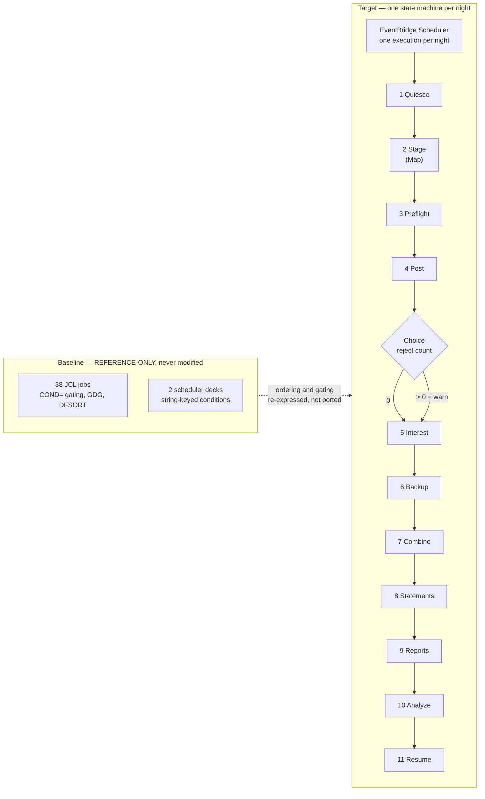

# ADR-005: Batch Orchestration Strategy

> **Purpose.** Record decision D5 — what replaces the JCL/JES2 batch pipeline as
> the thing that decides *which step runs, in what order, and what happens when
> one of them fails* — together with the three further duties this record is
> assigned by name: the **condition-code inversion**, the **restart and retry
> semantics**, and the **generation-dataset mapping**. This decision is **one of
> only two genuine close calls in the whole migration** — the other being queues
> versus a managed broker in [ADR-004](ADR-004-messaging.md) — and it is presented
> as one rather than as a foregone conclusion. This record explains the choice; it
> does not reopen it.
>
> **Source of truth.** The decision of record is the Agent Action Plan (AAP)
> §0.1.2 row D5, which fixes the accepted option. AAP §0.4.1.7 fixes the eleven
> states of the nightly chain, and AAP §0.7.5 assigns the condition-code,
> restart and generation analyses to this file. The behavioural specification is
> the COBOL and JCL baseline under `app/**` — specifically `app/jcl/**`,
> `app/scheduler/**` and `app/cbl/CBTRN02C.cbl` — which is **read-only**: this
> record cites it by path and line and never edits it. Where this record and the
> baseline appear to disagree about behaviour, the baseline is right and this
> record is wrong.

- **Status:** Accepted
- **Decision:** Replace JES2 job submission and the two scheduler decks with
  **EventBridge Scheduler → Step Functions → Spring Batch on ECS Fargate**. One
  state machine, `carddemo-daily-batch`, holds the nightly chain as **eleven
  states**; a scheduler rule starts one execution per night; each state that does
  real work runs a container task through the **synchronous run-task
  integration** and waits for it, receiving its step arguments as **container
  overrides**. Every work state carries an explicit `TimeoutSeconds`, a `Retry`
  with exponential backoff, and a `Catch` that routes to a notification state and
  then to failure. Restart comes from **execution redrive** plus a durable
  **`batch.batch_run`** step ledger whose unique `(run_id, step_name)` is the
  per-step idempotency key.
- **Scope of this record.** What orchestrates the chain, how JCL step gating and
  condition codes translate, how restart works, and how generation datasets are
  addressed. Nothing else. The language and runtime belong to
  [ADR-001](ADR-001-language-and-runtime.md); the compute substrate that runs each
  step — and the boundary that keeps Lambda to glue — to
  [ADR-002](ADR-002-compute-platform.md); the datastore and the object storage
  that holds the generations to [ADR-003](ADR-003-datastore-targets.md); the
  message transport to [ADR-004](ADR-004-messaging.md); the ownership of each
  migrated program to [ADR-007](ADR-007-service-boundaries.md); and the tool that
  provisions all of it to [ADR-009](ADR-009-iac-tool.md). The state-by-state
  specification lives in
  [`docs/architecture/batch-orchestration.md`](../architecture/batch-orchestration.md)
  and the operator procedures in
  [`docs/runbooks/batch-operations.md`](../runbooks/batch-operations.md); **this
  record decides, those documents specify.**

## Context

The baseline expresses a batch pipeline in four separate mechanisms, and the
decision is only defensible if each is named from the source that defines it. A
scheduler chosen without reference to the semantics it must carry is a preference
rather than a decision.

### What the baseline pipeline is made of

`app/jcl/` holds **38** jobs. The wider repository holds 55 `.jcl` files, and the
difference is not one tree but three: `samples/jcl` contributes 9 compile and
security samples that are reference-only and out of scope,
`app/app-authorization-ims-db2-mq/jcl` contributes 5, and
`app/app-transaction-type-db2/jcl` contributes 3. The root
[`README.md`](../../README.md) publishes the maintainers' own batch inventory with
each job's program and function, and it is the authoritative list of what the
pipeline is *for*.

Four mechanisms carry the orchestration, and each maps to a different target
construct:

| Baseline mechanism | What it expresses | Where it lives |
|---|---|---|
| `EXEC PGM=` plus `PARM=` | which program runs in a step, and its one parameter string | every job in `app/jcl/**` |
| `DD DSN=` | which dataset each logical file name resolves to | every job in `app/jcl/**` |
| `COND=` | whether a step is **skipped**, and record selection inside a sort | 5 files, enumerated in [Condition-Code Semantics](#condition-code-semantics-the-inversion) |
| GDG bases and `(+1)`/`(0)` references | dataset generations and how many are retained | `DEFGDGB.jcl`, `DEFGDGD.jcl`, `DALYREJS.jcl`, `REPTFILE.jcl` |

Job-to-job sequencing above the step level is expressed twice more, in two
scheduler decks, and those are the subject of the next two subsections.

### The two scheduler decks, as an inventory

The following is a factual inventory of two read-only files, offered because the
decision turns on what the decks do and do not express. It is not a criticism of
either deck: both are demonstration artifacts in a repository whose stated purpose
is to be a teaching resource, and every figure below is a count a reader can
re-run.

```text
# WHAT: count the folder containers, job elements and scheduling attributes in the
#       Control-M deck, and the job stanzas in the CA-7 deck.
# WHY : Assumptions: these counts ARE the evidence for "the decks do not agree on
#       an inventory", so this record states them as commands to re-run against the
#       read-only baseline rather than as numbers to be trusted. Expected output:
#       3 then 2 then 15 then 17 then 15, then 30 then 17.
grep -c '<FOLDER'        app/scheduler/CardDemo.controlm
grep -c '<SMART_FOLDER'  app/scheduler/CardDemo.controlm
grep -c '<JOB '          app/scheduler/CardDemo.controlm
grep -c 'JOBNAME='       app/scheduler/CardDemo.controlm
grep -c 'MAXRERUN="5"'   app/scheduler/CardDemo.controlm
grep -c '1LJOB,JOB='     app/scheduler/CardDemo.ca7
grep -o  '1LJOB,JOB=[A-Z0-9]*' app/scheduler/CardDemo.ca7 | sort -u | wc -l
```

**`app/scheduler/CardDemo.controlm`** (92 lines) declares **five folder-scope
containers**, numbered `REAL_FOLDER_ID` 1 through 5, in two element types: three
`<FOLDER>` elements at L3, L26 and L64, and two `<SMART_FOLDER>` elements at L32
and L57. One folder name is carried by two of those containers —
`FOLDER_NAME="WEEKLY-TransactionTypesDBRefresh"` appears both on the `<FOLDER>` at
L26 (`REAL_FOLDER_ID="2"`) and on the `<SMART_FOLDER>` at L57
(`REAL_FOLDER_ID="4"`). Inside them are **15 `<JOB>` elements** carrying **9
distinct job names**: `CLOSEFIL`, `COMBTRAN`, `DISCGRP`, `INTCALC`, `MNTTRDB2`,
`OPENFIL`, `TRANBKP`, `TRANEXTR`, `WAITSTEP`. The deck holds **17 `JOBNAME`
attributes** in total, because the two `<SMART_FOLDER>` elements carry one each of
their own.

**`app/scheduler/CardDemo.ca7`** (570 newline-terminated lines) holds **30
`1LJOB,JOB=` stanza headers** over **17 distinct job names** — `CBPAUP0J`,
`CLOSEFIL`, `CLOSEFIL1`, `CLOSEFIL2`, `CREASTMT`, `OPENFIL`, `POSTTRAN`,
`PRTCATBL`, `READACCT`, `READCARD`, `READCUST`, `READXREF`, `TCATBALF`,
`TRANCATG`, `TRANTYPE`, `TXT2PDF1`, `WAITSTEP` — chained by **27** `TRIGGERED
JOBS` declarations, each naming its successor as `JOB=<name>`.

The two inventories intersect in exactly three names, and those three are the
utility jobs rather than the business jobs:

| Relationship | Jobs |
|---|---|
| In **both** decks | `CLOSEFIL`, `OPENFIL`, `WAITSTEP` — the quiesce, resume and wait utilities |
| Only in Control-M | `COMBTRAN`, `DISCGRP`, `INTCALC`, `MNTTRDB2`, `TRANBKP`, `TRANEXTR` |
| Only in CA-7 | `CBPAUP0J`, `CLOSEFIL1`, `CLOSEFIL2`, `CREASTMT`, `POSTTRAN`, `PRTCATBL`, `READACCT`, `READCARD`, `READCUST`, `READXREF`, `TCATBALF`, `TRANCATG`, `TRANTYPE`, `TXT2PDF1` |

Two consequences follow, and the second corrects a claim that is easy to make
carelessly. First, **every business job named in one deck is absent from the
other**, so neither deck on its own is a description of the nightly chain.
Second, **`POSTTRAN` — the transaction-posting job — is present, in the CA-7 deck
only**, triggered from `CBPAUP0J` at `app/scheduler/CardDemo.ca7:L70` with its own
stanza at L72; it is absent from the Control-M deck. `TRANREPT` is the job absent
from **both** decks, which is consistent with how it is actually submitted — see
[Two facts that are easy to miss](#two-facts-that-are-easy-to-miss).

Refactoring Rationale: this is the concrete reason AAP §0.5.1.12 retires the two
decks **as syntax** while carrying their *intent* to EventBridge Scheduler. There
is no single deck to translate. A faithful port would have to choose one deck's
inventory over the other's, or merge two files that disagree, and either choice
would be an editorial decision about business behaviour disguised as a
translation. Deriving the chain from the jobs themselves — which is what AAP
§0.4.1.7 does — is the only option that does not require inventing a fact.

### The condition protocol being replaced, and why a typo is silent

Control-M sequences jobs through **string-keyed conditions in a shared pool**
rather than through a declared graph. The deck contains **12 `<INCOND>`** and
**23 `<OUTCOND>`** elements, and the protocol is entirely nominal: an
`<OUTCOND ... SIGN="+"/>` posts a condition name, an `<INCOND .../>` makes a job
wait for that name, and an `<OUTCOND ... SIGN="-"/>` deletes it. The linkage
between a producer and its consumer exists **only as string equality of the `NAME`
attribute**. One condition shows the whole shape: the name
`WEEKLY-TransactionTypesDBRefresh-MNTTRDB2` is posted once at L28, waited on at
L34 and again at L59, and deleted at both L55 and L62.

Assumptions: **nothing in the file declares the pool, so nothing can validate a
member of it.** A mistyped condition name is not a parse error and not a
dangling-reference error — it is simply a name nobody posts, so the job that waits
for it never becomes eligible and the deck reports no problem at all. The failure
mode is a job that quietly does not run.

That is the strongest concrete argument for a declarative state machine, and it is
mechanical rather than aesthetic: **a state machine names its successor with
`Next`, and every `Next` must resolve to a state defined in the same definition, so
an unresolvable one is rejected when the definition is deployed** rather than
discovered on a night when a step silently did not run. The same property is what
makes the chain reviewable as a whole: the ordering is one object, not a set of
strings distributed across job definitions.

Two further inventory facts are recorded because a reader comparing the deck with
this record will find them and should not have to wonder whether they were missed:
two `<JOB>` elements inside `MONTHLY-InterestCalculation` share `JOBISN="4"`
(`WAITSTEP` at L81 and `OPENFIL` at L87), and the `TRANEXTR` job at L58 sits inside
the container whose `FOLDER_NAME` is `WEEKLY-TransactionTypesDBRefresh` while
carrying `PARENT_FOLDER="WEEKLY-DisclosureGroupsRefresh"`.

### The nightly chain as eleven states

AAP §0.4.1.7 fixes the chain. The state names below are not a paraphrase: they are
the names declared in
[`infra/modules/step-functions-batch/main.tf`](../../infra/modules/step-functions-batch/main.tf)
at L75–L87, so this table and the provisioned definition cannot drift apart
without one of them failing review.

Assumptions: **naming the states after the provisioned definition rather than
after the jobs they replace is a deliberate choice, and it costs something.** A
state named `PostTransactions` does not announce that it replaces `POSTTRAN.jcl`,
so the mapping has to be written down — which is what the second column of this
table is for. Alternatives Considered: naming each state after its baseline job
would have made the mapping self-evident and was rejected, because three states
have no single job behind them (state 2 replaces a block of `IDCAMS REPRO` steps,
state 3 replaces a program with no job at all, and state 9 covers two jobs), so a
job-derived name would have been either misleading or unavailable for those three.

| State | Replaces | Mechanism |
|---|---|---|
| 1 `QuiesceOnlineWrites` | `CLOSEFIL.jcl` — `EXEC PGM=SDSF` at L22 issuing `CEMT SET FIL(...) CLO` at L26–L30 | Lambda setting a read-only flag in Parameter Store |
| 2 `StageSeedDatasets` | the `IDCAMS REPRO` master-refresh block | `Map` state, one branch per dataset, each a synchronous run-task on the ETL image |
| 3 `PreflightDailyTransactions` | `CBTRN01C` — **which has no JCL driver in the baseline** | Fargate task |
| 4 `PostTransactions` | `POSTTRAN.jcl` / `CBTRN02C` | Fargate task, then a `Choice` on reject count that takes the **warn** path rather than failing |
| 5 `CalculateInterest` | `INTCALC.jcl` / `CBACT04C` | Fargate task; business date passed as a parameter, never read from the clock |
| 6 `BackupTransactions` | `TRANBKP.jcl` | Fargate task exporting to a new object-storage generation |
| 7 `CombineTransactions` | `COMBTRAN.jcl` — `PGM=SORT` at L22 merging two generation inputs | Fargate task using SQL ordering |
| 8 `GenerateStatements` | `CREASTMT.JCL` / `CBSTM03A` + `CBSTM03B` | Fargate task writing text and HTML statements |
| 9 `GenerateReports` | `TRANREPT.jcl` / `CBTRN03C` and `PRTCATBL.jcl` | Fargate task writing the 133-column report |
| 10 `AnalyzeTables` | `TRANIDX.jcl` — `BLDINDEX` at L52 | Lambda running `ANALYZE`; index *building* is retired because PostgreSQL maintains indexes transactionally |
| 11 `ResumeOnlineWrites` | `OPENFIL.jcl` — `EXEC PGM=SDSF` at L22 issuing `CEMT SET FIL(...) OPE` at L26–L30 | Lambda clearing the read-only flag |

Three of the eleven states — 1, 10 and 11 — are Lambda invocations, and that
boundary is owned by [ADR-002](ADR-002-compute-platform.md), which enumerates every
function so that "Lambda for glue only" stays a checkable claim. State 10 runs
plain `ANALYZE` rather than `VACUUM ANALYZE`, for the reason that record gives at
its point of use.



### Two facts that are easy to miss

**`CBTRN01C` has no JCL driver anywhere in the baseline.** No file in `app/jcl/**`
names it; the only things that reference it are the program itself and the test
suite — `tests/integration/test_cbtrn01c_prepost.py` and its fixtures. It is
migrated regardless, as state 3, because the program exists and encodes
pre-posting behaviour. Assumptions: a program with no driver has no baseline step
order to preserve, so its position in the chain is derived from its data
dependency — it reads the daily transaction input that state 4 then posts — rather
than from a job it never had.

**`TRANREPT` is submitted from CICS, not from a scheduler.** The transaction-report
job reaches JES through the transient-data queue defined at
`app/csd/CARDDEMO.CSD:L499` as `DEFINE TDQUEUE(JOBS)`, described at L500 as
`SUBMIT JOBS FROM CICS` and mapped at L501 to `DDNAME(INREADER)`. That is why
`TRANREPT` appears in neither scheduler deck, and it is why ad-hoc report
submission is **not** a state in the nightly chain: it becomes the reporting
service calling `StartExecution` on a **second, smaller state machine**, declared
separately in the same module. The nightly chain still generates the scheduled
report as state 9; the two paths are distinct in the baseline and stay distinct in
the target.

## Decision

**EventBridge Scheduler starts one Step Functions execution per night; the state
machine holds the eleven-state chain; each work state runs a Spring Batch job as
an ECS Fargate task through the synchronous run-task integration.**

Concretely, and each clause is a commitment this record can be held to:

1. **One state machine holds the whole chain.** Ordering is expressed with `Next`,
   so it is one reviewable object whose state references are validated at deploy
   time rather than a set of condition strings spread across job definitions.
2. **One scheduler rule starts it**, on a cron expression, with a dead-letter
   target for a delivery that cannot be made.
3. **Each work state invokes a container task and waits for it to finish**, passing
   that step's arguments as **container overrides** — the direct mechanical
   analogue of `EXEC PGM=` plus `PARM=`.
4. **Every work state carries `TimeoutSeconds`, a `Retry` with exponential backoff,
   and a `Catch`** routing to a notification state and then to failure.
5. **Condition-code semantics are inverted, deliberately and once**, per
   [Condition-Code Semantics](#condition-code-semantics-the-inversion). Step gating
   becomes edges and `Choice` predicates; record selection becomes SQL.
6. **Restart is redrive plus a durable ledger** — `batch.batch_run`, unique on
   `(run_id, step_name)`, so a resumed step that already completed is a no-op.
7. **Generations become object-storage prefixes** under
   `s3://carddemo-datasets-<env>/<domain>/<dataset>/dt=YYYY-MM-DD/gen=NNNN/`, with
   versioning on and a lifecycle rule retaining five noncurrent versions, across
   **ten** prefix families.
8. **The chain internals stay inside the jobs.** Spring Batch owns chunk sizing and
   commit intervals; the state machine owns only inter-step dependency.

## Options Considered

Six options were evaluated. Two of them are genuinely strong, and the second is
the reason this record exists at all.

### Option 1 — EventBridge Scheduler → Step Functions → Spring Batch on Fargate — ACCEPTED

A managed scheduler triggers a managed state machine whose work states run
containers on a managed compute platform. There is no scheduler host, no broker,
no queue and no compute environment to operate. The step-dependency graph, the
per-state timeout, the retry policy and the failure route are all expressed in one
definition that is validated when it is deployed. Its costs are stated plainly in
[Cost Implications](#cost-implications) and in
[Trade-offs and Risks](#trade-offs-and-risks); this record does not present it as
free of consequence.

### Option 2 — AWS Batch — the close-call runner-up, rejected

**This option deserves and receives a fair hearing, because it is purpose-built for
exactly the category of work being migrated.** Four of its properties map onto JCL
concepts more directly than anything in the accepted option:

- **It is a batch service, not a general workflow service.** Its domain model is
  jobs, queues and compute environments, which is much closer to JES2's own model
  of a job entry subsystem than a state machine is.
- **Job dependencies are first class.** A job can be submitted depending on another
  job's completion, which is a recognisable analogue of `COND=` step gating without
  the inversion this record has to spend a whole section on.
- **Array jobs give native fan-out.** State 2 stages a set of datasets, and an array
  job expresses "the same work once per element" natively.
- **Retry strategies are declared on the job definition**, including evaluation on
  exit code — closer in shape to a return-code convention than a generic retry
  policy is.

It is rejected for one reason, and the reason is about fit rather than capability:
**it would add job-queue and compute-environment management for a fixed nightly
chain.** The workload is a known sequence of eleven steps running once per night —
not a variable-width queue of independent work arriving at an unpredictable rate.
Queues and compute environments are the machinery that solves the second problem,
and this workload is the first. Adopting them would mean owning a queue's
configuration, a compute environment's provisioning model and its capacity
boundaries, and keeping all three correct, in exchange for capabilities the chain's
shape does not exercise: the dependency graph is fixed, and the only fan-out is one
`Map` state over a small, known dataset list.

Trade-offs: the price of rejecting it is real and is recorded rather than waved
away. The inversion section exists because the accepted option's `Choice` predicate
runs on the opposite sense to `COND=`, and array-style fan-out is expressed by a
`Map` state whose practical concurrency ceiling is lower than a purpose-built batch
service's. Both are accepted, for the reasons in
[Trade-offs and Risks](#trade-offs-and-risks).

### Option 3 — Lambda for orchestration and execution — rejected on a hard limit

Rejected because **batch steps exceed the fifteen-minute function execution
ceiling**. This is a published service limit rather than a preference, which makes
it the cleanest rejection in the set: no amount of tuning turns a step that may run
longer than the ceiling into one that does not, and a step that is retried because
it was truncated is worse than one that was never attempted.

The rejection is scoped, though, and the scope matters: **Lambda is adopted for
glue — exactly three of the eleven states, 1, 10 and 11** — because those three do
one short, stateless thing each (set a flag, run a maintenance statement, clear a
flag) and hold no connection pool and no step's work.
[ADR-002](ADR-002-compute-platform.md) owns that boundary and names every function
so the claim stays bounded.

### Option 4 — A self-managed scheduler on compute — rejected

Cron on an instance, or a self-hosted workflow engine. Rejected on operational
burden: it means an always-on host to patch, monitor and keep available, plus the
scheduler process itself to keep available, to run one chain per night. The first
sentence of the guiding principle disposes of this directly — it is the
self-managed option in a set that contains managed ones.

### Option 5 — A managed workflow-orchestration service of the Airflow family — rejected

Genuinely capable, and it would express a directed chain well. Rejected for two
specific reasons rather than a general preference. First, it keeps an **always-on
scheduler and web tier**, so its cost floor is non-zero on every night when nothing
changes — which is the opposite shape to a chain that runs once and stops. Second,
it introduces a **second definition language** for orchestration alongside the
Spring Batch job definitions that already exist, so the pipeline would be described
in two places by two idioms.

### Option 6 — Porting the two scheduler decks as they stand — not possible, not attempted

Not an option in practice, for the reason established in
[The two scheduler decks](#the-two-scheduler-decks-as-an-inventory): the decks'
job inventories intersect in only the three utility jobs, so there is no single
deck that describes the nightly chain. AAP §0.2.2 accordingly retires the CA-7 and
Control-M definitions **as syntax**, with their *intent* carried by EventBridge
Scheduler. That is a retirement of a file format, not a judgement about either
deck: both remain in the repository, unmodified, and the z/OS path that reads them
is untouched.

### The six options side by side

| Option | Long steps supported | Compute environment to operate | Cost floor between runs | Definition surfaces | Verdict |
|---|---|---|---|---|---|
| 1 — Scheduler + state machine + Fargate | Yes | **None** | Per-execution only | 2 (orchestration, job internals) | **ACCEPTED** |
| 2 — AWS Batch | Yes | **Queue + compute environment** | Depends on environment's minimum | 2 | Rejected — machinery the chain's shape does not need |
| 3 — Lambda only | **No — hard ceiling** | None | Per-invocation only | 1 | Rejected for steps; **accepted for the three glue states** |
| 4 — Self-managed scheduler | Yes | **Always-on host** | Continuous | 2 | Rejected — operational burden |
| 5 — Managed Airflow-family service | Yes | Managed, but always-on tier | **Continuous** | 3 | Rejected — non-zero floor, extra language |
| 6 — Port the decks | n/a | n/a | n/a | n/a | Not possible — no single deck describes the chain |

## Rationale

Five mechanisms carry the decision. Each is stated as something a reader can check
against either the read-only baseline or the provisioned definition.

### 1. Step dependency, timeout, retry and failure routing are one declaration

The chain's ordering is expressed with `Next`, its per-state ceiling with
`TimeoutSeconds`, its transient-failure policy with a `Retry` carrying
`IntervalSeconds`, `MaxAttempts` and `BackoffRate`, and its failure route with a
`Catch` that leads to a notification state and then to failure. All four live in
the same definition as the states they govern, so reviewing the chain's behaviour
is reading one object rather than correlating attributes across job cards and a
condition pool.

The property that matters most is the one established in
[The condition protocol being replaced](#the-condition-protocol-being-replaced-and-why-a-typo-is-silent):
**a `Next` that names no defined state is rejected when the definition is
deployed.** Compare the failure modes honestly. A mistyped condition name in the
baseline deck produces a job that waits forever for a name nobody posts, and
nothing reports a problem. A mistyped state name produces a deployment that does
not happen. The second failure is louder, earlier, and cheaper.

### 2. `EXEC PGM=` plus `PARM=` becomes run-task-and-wait plus container overrides

The synchronous run-task integration starts a container task and **does not
advance until that task has finished**, which is the semantics a JCL step already
has. Per-step arguments ride in the task's **container overrides**, which is the
`PARM=` analogue.

The baseline supplies a worked example. `app/jcl/INTCALC.jcl:L22` reads:

```text
//STEP15 EXEC PGM=CBACT04C,PARM='2022071800'
```

The target passes the same fact as a command override on the batch image — in the
shape `--job=calculate-interest --business-date=2022-07-18`.

**The conclusion is the point of the example, not the syntax.** The business date
is an *injected parameter* in the baseline, and it stays an injected parameter in
the target; it is never read from the wall clock. Assumptions: that is exactly what
makes a rerun reproducible. A job that reads the clock produces different output on
a different night from identical input, which would destroy the golden-master
comparison that
[Functional-parity verification](#the-warn-tier-is-preserved-because-it-is-an-existing-contract)
depends on. The same discipline is already house policy in the existing suite,
which injects business dates rather than reading them so that reruns produce
identical output — `tests/README.md` §11.

### 3. `DD DSN=` becomes a resolved connection or an object-storage URI

Each `DD` statement binds a logical file name to a dataset. In the target each
becomes either a database connection resolved from Parameter Store or an
object-storage URI, supplied through the same container-override mechanism.

`app/jcl/POSTTRAN.jcl` is the worked example, and it is the densest one in the
pipeline: a **single** `EXEC PGM=CBTRN02C` step at L23 with **nine `DD`
statements** — `STEPLIB` L24, `SYSPRINT` L26, `SYSOUT` L27, `TRANFILE` L28,
`DALYTRAN` L30, `XREFFILE` L32, `DALYREJS` L34, `ACCTFILE` L39 and `TCATBALF` L41.

One of the nine deserves separate mention because it is not an input: `DALYREJS` at
L34 is declared `DISP=(NEW,CATLG,DELETE)` with `DCB=(RECFM=F,LRECL=430,BLKSIZE=0)`
against `DSN=AWS.M2.CARDDEMO.DALYREJS(+1)` at L38 — a **newly created** reject
stream, written to a new generation, at a fixed 430-byte record length. Assumptions:
that record length is a contract, not an implementation detail, and it is preserved
on the target side as the three-column reject row described in AAP §0.4.1.3. The
step both consumes files and produces a new generation, so a step's `DD` list is
not reducible to "its inputs".

### 4. DFSORT becomes SQL, and `BLDINDEX` is retired rather than translated

Sorting and filtering are data operations, and the target already has a data engine:

| Baseline construct | Target | Note |
|---|---|---|
| `SORT FIELDS=(...)` | `ORDER BY` | `app/jcl/TRANREPT.jcl:L46` sorts by card number; `app/jcl/COMBTRAN.jcl:L30` sorts by transaction id |
| `INCLUDE COND=(...)` | `WHERE` | Record selection — see [the inversion table](#condition-code-semantics-the-inversion) |
| `IDCAMS REPRO` | an ETL load step | State 2 stages datasets through the ETL image |
| `IDCAMS BLDINDEX` | **retired** | `app/jcl/TRANIDX.jcl:L52` |

`COMBTRAN.jcl` shows why the sort maps cleanly: `PGM=SORT` at L22 reads **two**
inputs — `TRANSACT.BKUP(0)` at L24 and `SYSTRAN(0)` at L26 — orders them by
transaction id at L30, and writes `TRANSACT.COMBINED(+1)` at L37. Combining two
ordered sources into one ordered result is what a query does natively.

**`BLDINDEX` is retired rather than translated, and the reason is the whole
justification.** In the baseline an alternate index is a separate physical object
that must be *rebuilt* after a bulk load, which is why `TRANIDX.jcl` exists at all.
In PostgreSQL a secondary index is maintained transactionally as part of the write
that changes the row, so there is no rebuild step to schedule — the index is never
stale in the way a freshly reloaded VSAM alternate index is. What remains useful
after a bulk load is refreshing the planner's statistics, which is what state 10
does. Alternatives Considered: keeping a state that rebuilt indexes explicitly was
rejected because it would either be a no-op dressed as work, or it would drop and
recreate indexes, which would *introduce* a window of missing indexes that the
baseline's own design does not have.

### 5. The scheduler carries the decks' intent, not their syntax

One cron rule starts one execution per night, with a dead-letter target for an
undeliverable invocation. That is the whole of what the two decks' calendar
attributes express for the nightly path — `DAYS="ALL"` with every month enabled,
in the Control-M deck's own attributes.

Refactoring Rationale: the decks express *when* through calendar attributes on each
job and *what follows what* through the condition pool, so the same job's schedule
and its dependencies are declared in two different mechanisms. In the target those
concerns are separated by construction: the scheduler owns *when the chain starts*
and holds exactly one fact, and the state machine owns *what follows what* and holds
all of the ordering. Nothing in the target needs to state a per-step calendar,
because a step's eligibility is its predecessor's completion.

## Condition-Code Semantics: The Inversion

AAP §0.7.5 calls this "the easiest thing in the whole migration to get backwards",
and it gets its own section for that reason.

**A JCL `COND` is a SKIP predicate. A Step Functions `Choice` is a RUN predicate.
The sense must be inverted.** A `COND` that evaluates true causes the step to be
*bypassed*; a `Choice` rule that evaluates true causes its branch to be *taken*.
Translating one into the other by copying the comparison across, without flipping
it, produces a chain that runs exactly the steps it should skip.

The pipeline contains **ten** `COND=` occurrences in **five** files, and the
complete inventory is given here so that no occurrence is silently unaccounted for:

```text
# WHAT: list every COND= in the batch pipeline with its file, line and text.
# WHY : Assumptions: the inversion is only safe if the inventory is COMPLETE — a
#       missed occurrence is a step whose gating was never translated. This record
#       therefore states the inventory as a command rather than a summary. Expected
#       output: 10 lines across 5 files.
grep -rn 'COND=' app/jcl/
```

| Baseline construct | Meaning | Verified locations | Target |
|---|---|---|---|
| `COND=(0,NE)` | *skip when zero is not equal to the prior return code* → run only when every predecessor ended cleanly | `app/jcl/DEFGDGD.jcl` L36, L47, L59, L82; `app/jcl/CREASTMT.JCL` L56, L66, L79 | the **default success edge** — an unadorned `Next` — with any non-zero code caught by the state's `Catch` and routed to failure notification |
| `COND=(4,LT)` | *skip when four is less than the return code* → run only when the code is four or lower | `app/jcl/TRANBKP.jcl:L51` | an explicit `Choice` that lets the **soft-warn** path continue |
| `INCLUDE COND=(...)` inside a sort step | **record selection**, not a step gate | `app/jcl/TRANREPT.jcl:L47` | a SQL `WHERE` clause — **never** a `Choice` state |

The inventory has one entry beyond the seven step gates in migrated jobs: an eighth
`COND=(0,NE)` at `app/jcl/TXT2PDF1.JCL:L26`, a continuation line of the
`EXEC PGM=IKJEFT1B` statement at L24. It is listed for completeness and has no
target, because `TXT2PDF1.JCL` is the TSO text-to-PDF utility that retires with no
cloud analogue — see
[Out of scope](#out-of-scope-each-with-its-reason-none-of-it-delivered).

### The two `COND=` forms share a keyword, and conflating them is a real hazard

`COND=` on an `EXEC` statement gates a **step**. `COND=` inside a sort control
statement selects **records**. They are different languages that happen to share
four characters, and only context distinguishes them.

Assumptions: modelling `app/jcl/TRANREPT.jcl:L47` as a `Choice` state would be
accepted by every tool in the chain and would still be wrong. That statement — and
its continuation at L48 — selects transactions whose processing date falls between
two parameters, using the symbolic fields declared at L41–L44
(`TRAN-PROC-DT,305,10,CH`, with `PARM-START-DATE` and `PARM-END-DATE`). Treated as a
step gate it would decide *whether the report step runs*; treated correctly it
decides *which rows the report contains*. The first reading produces a report that
runs and is silently wrong — every transaction included regardless of date — and no
step failed, so nothing signals it. Trade-offs: this record spends a paragraph on a
single line of JCL because a wrong row set in a financial report is exactly the
class of defect that survives testing when the test only asserts that the step
succeeded.

### The warn tier is preserved because it is an existing contract

The `COND=(4,LT)` semantic is not an incidental scheduling detail. It is the
mainframe condition-code convention in which **4 means "completed with a soft
reject"**, and the posting program sets it. `app/cbl/CBTRN02C.cbl` closes its main
loop with:

```text
229:            IF WS-REJECT-COUNT > 0
230:               MOVE 4 TO RETURN-CODE
```

So a night on which some transactions were correctly rejected ends with return code
4, and `app/jcl/TRANBKP.jcl:L51`'s `COND=(4,LT)` is what lets the backup step run
anyway. **State 4's `Choice` on reject count is therefore preservation, not
invention** — it reproduces a contract the baseline already has. In the provisioned
definition the warn branch is labelled `POSTING_REJECTS_PRESENT`.

Refactoring Rationale: the alternative — treating a non-zero return code uniformly
as failure — would be simpler to write and would be wrong, because it would turn a
routine reject night into a failed chain and stop the backup, the statements and the
reports from running at all. That is a behavioural change, and AAP Rule T9 permits
none without documenting it.

The same rubric is the parity oracle's, which is why it must be carried across
exactly. `tests/README.md` §8 documents it as **0** Pass, **4** Warn / soft reject,
**8** Fail, **16** Fatal and **2** Usage, with runners **aggregating the worst
(highest) code seen**. Two consequences follow for anyone reading a run of this
pipeline:

- A three-tier outcome must survive the translation. Success, warn and failure are
  distinguishable states, and collapsing warn into either neighbour loses
  information the baseline reports.
- **The suite's documented warn-level aggregate — RC = 4 — is the green state, and
  it must not be misread as a regression introduced by this work.** It is green
  before this migration and it stays green after it, for reasons the suite records
  itself: a correctly written business reject sets 4, and the two programs the suite
  documents as not compiling under the open-source compiler contribute a soft warn
  rather than a failure.

## Restart, Retry and Generation Semantics

Three separate matters, deliberately kept apart, because two of them are
**preservation** of something the baseline already declares and one is a **genuine
addition** — and presenting either as the other would be inaccurate.

### (a) Retry and timeout are preservation, not new capability

It would be easy, and wrong, to present per-state retry and explicit timeouts as
capability the target adds. The Control-M deck already declares all three
attributes on **15 of its 17** `JOBNAME`-bearing elements — precisely the 15
`<JOB>` elements, since the two `<SMART_FOLDER>` containers carry `MAXRERUN="0"`,
`MAXWAIT="0"` and no `TIMETO` at all:

| Baseline attribute | Value, on 15 of 17 | Target construct |
|---|---|---|
| `MAXRERUN` | `"5"` | `Retry` with `MaxAttempts` and `BackoffRate` |
| `MAXWAIT` | `"7"` | the scheduler's own retry and dead-letter target |
| `TIMETO` | `"23:00"` | `TimeoutSeconds` per state |

Refactoring Rationale: the target's contribution here is not the *existence* of a
retry limit or a deadline — the baseline has both — but where they are declared. In
the deck they are per-job attributes sitting alongside twelve month flags and a
calendar relationship, in a file whose job inventory does not match the other
deck's. In the target they are per-state attributes in the same definition as the
ordering they modify. The capability is preserved; what changes is that it is
declared once, next to the thing it governs, and validated with it.

Assumptions: the exact numbers are **not** carried across as literals. `MAXRERUN="5"`
is a baseline attribute value, and the target's retry counts and per-state timeouts
are configured per environment through the module's own variables — which is why
[Cost Implications](#cost-implications) treats step runtime, not retry count, as
the cost driver. What is preserved is that every step has a bounded number of
attempts and a deadline, not a particular integer.

### (b) Redrive and the step ledger are a genuine improvement, and there is no baseline checkpoint contract to preserve

This is the one place where the target adds something the baseline does not have,
and the honest framing is to say so rather than to describe it as a port.

```text
# WHAT: search the read-only baseline for a step-restart or checkpoint contract.
# WHY : Assumptions: this record claims the target ADDS restart rather than porting
#       it, and that claim is only credible if the absence is checkable. Expected
#       output: exactly one RESTART= hit, on a commented line, and no CHKPT= at all.
grep -rn 'RESTART=' app/jcl/
grep -rn 'CHKPT='   app/jcl/ app/
```

The results are unambiguous. **`RESTART=` appears exactly once in the entire
baseline, and it is commented out**, at `app/jcl/DEFGDGD.jcl:L2`:

```text
2: //*  RESTART=STEP30                                                     JOB05067
```

The leading `//*` makes it a comment, so it is a note to a human operator about
where a rerun would resume, not an active restart instruction. And **the JCL
checkpoint parameter `CHKPT=` appears nowhere in the repository at all**, with no
occurrence of the string `CHKPT` anywhere in `app/jcl/**`.

One precision, so that claim cannot be read as broader than it is: the string
`CHKPT` *does* occur elsewhere in the baseline, in the authorization extension's
IMS programs — `WK-CHKPT-ID` working-storage fields and an
`EXEC DLI CHKP ID(WK-CHKPT-ID)` call at
`app/app-authorization-ims-db2-mq/cbl/CBPAUP0C.cbl:L355`. That is an IMS
commit-point call inside one program, not a JCL step-restart contract for the
nightly chain, and the messaging and transactional behaviour of that extension
belongs to [ADR-004](ADR-004-messaging.md).

Therefore, per AAP §0.7.5, the target's restart story is **"a strict improvement
and should be documented as such rather than presented as a port of something that
existed."** It has two halves that only work together:

1. **Execution redrive** resumes a failed execution from the state that failed,
   rather than from the beginning. It is an operator action taken on a failed
   execution — not a declared attribute of the definition — so it appears in
   [`docs/runbooks/batch-operations.md`](../runbooks/batch-operations.md) as a
   procedure rather than in the module as configuration.
2. **The `batch.batch_run` ledger** makes resumption safe. It records one row per
   orchestrator run and step, with the step's status, its start and finish
   timestamps and its return code, and it is **unique on `(run_id, step_name)`**.
   That uniqueness is the per-step **idempotency key**: a resumed step that already
   completed finds its own completed row and is a no-op.

Trade-offs: the second half is what makes the first half safe, and neither is
sufficient alone. Redrive without a ledger would re-run a step that had already
committed financial work — posting a night's transactions twice is precisely the
outcome a batch restart is supposed to prevent. A ledger without redrive would
record what happened without offering a way to continue. Alternatives Considered:
relying on redrive alone was rejected for that reason; relying on each job's own
Spring Batch job repository alone was rejected because it tracks a *job's* internal
step state and cannot express "state 6 of this orchestrator run already finished",
which is the question a resumed chain has to answer.

### (c) Generation datasets: ten bases, not six

Every generation base in the baseline is declared with a five-generation scratch
limit, and the count is the thing most likely to be got wrong, because the
definitions are spread across more files than one would expect:

```text
# WHAT: count generation-group definitions and list the base names they declare.
# WHY : Assumptions: the target provisions one prefix family PER BASE, so a
#       miscount is a missing dataset family. The two numbers deliberately differ —
#       see the note below. Expected output: 11 definitions, 10 distinct names.
grep -rc 'DEFINE GENERATIONDATAGROUP' app/jcl/ | grep -v ':0'
grep -rh -A1 'DEFINE GENERATIONDATAGROUP' app/jcl/ | grep -o 'NAME([A-Z0-9.]*)' | sort -u | wc -l
```

| Base | Declared at | Retention | Carries |
|---|---|---|---|
| `TRANSACT.BKUP` | `DEFGDGB.jcl` **L25** | `LIMIT(5)` L26, `SCRATCH` L27 | transaction master backup |
| `TRANSACT.DALY` | `DEFGDGB.jcl` **L31** | `LIMIT(5)` L32, `SCRATCH` L33 | daily transaction input |
| `TRANREPT` | `DEFGDGB.jcl` **L37** | `LIMIT(5)` L38, `SCRATCH` L39 | the 133-column transaction report |
| `TCATBALF.BKUP` | `DEFGDGB.jcl` **L43** | `LIMIT(5)` L44, `SCRATCH` L45 | category-balance backup |
| `SYSTRAN` | `DEFGDGB.jcl` **L49** | `LIMIT(5)` L50, `SCRATCH` L51 | system-generated transactions |
| `TRANSACT.COMBINED` | `DEFGDGB.jcl` **L55** | `LIMIT(5)` L56, `SCRATCH` L57 | the combined transaction set |
| `TRANTYPE.BKUP` | `DEFGDGD.jcl` **L28** | `LIMIT(5)` L29, `SCRATCH` L30 | transaction-type backup |
| `TRANCATG.PS.BKUP` | `DEFGDGD.jcl` **L51** | `LIMIT(5)` L52, `SCRATCH` L53 | transaction-category backup |
| `DISCGRP.BKUP` | `DEFGDGD.jcl` **L74** | `LIMIT(5)` L75, `SCRATCH` L76 | disclosure-group backup |
| `DALYREJS` | `DALYREJS.jcl` **L25** | `LIMIT(5)` L26, `SCRATCH` L27 | the daily reject stream |

**Six in `DEFGDGB.jcl`, three in `DEFGDGD.jcl`, one in `DALYREJS.jcl` — ten, not
six.** A count taken from `DEFGDGB.jcl` alone would find six and under-provision the
target by four families.

Assumptions: the two figures in the command above differ deliberately. There are
**eleven** definition statements over **ten distinct base names**, because
`AWS.M2.CARDDEMO.TRANREPT` is declared twice — at `DEFGDGB.jcl:L37` with
`LIMIT(5)` and `SCRATCH`, and again at `app/jcl/REPTFILE.jcl:L26` with `LIMIT(10)`
and no `SCRATCH`. The target provisions **ten** prefix families, one per distinct
base, and the retention for the report family is therefore a parameter to confirm
at apply time rather than a number this record picks silently.
[ADR-003](ADR-003-datastore-targets.md) owns the storage decision and records the
same eleven-over-ten finding; the two records agree.

Relative generation references are used throughout the pipeline — `(+1)` for a new
generation and `(0)` for the current one, as at `POSTTRAN.jcl:L38`,
`INTCALC.jcl:L41`, `TRANBKP.jcl:L33`, `COMBTRAN.jcl:L24`, `L26` and `L37`, and
`TRANREPT.jcl:L33`, `L39`, `L55`, `L66` and `L80`. They map by convention:

| Baseline | Target |
|---|---|
| GDG base | one prefix family under `s3://carddemo-datasets-<env>/<domain>/<dataset>/` |
| `(+1)` | a **new** generation prefix, `dt=YYYY-MM-DD/gen=NNNN/` |
| `(0)` | the **current** generation prefix |
| `LIMIT(5) SCRATCH` | bucket versioning on, with a lifecycle rule **retaining five noncurrent versions** |

## Cost Implications

Assumptions: "cost" here means **billing dimensions, their drivers, and
operational burden** — the things that distinguish the options from one another. No
currency figure appears in this record and no price list is quoted, because a rate
copied into a document is wrong as soon as it changes and no decision below turns
on one. What each option is *charged for*, and what *drives* that charge, is
stable and is what a reader needs.

### The orchestrator is charged per state transition, and the chain bounds it by construction

Step Functions standard workflows are charged per **state transition**. The nightly
chain has **eleven** states and runs **one execution per night**, so the
orchestration charge is bounded by a fixed, small state count multiplied by a fixed,
small execution count. Retries and the `Map` state's branches add transitions, and
they are bounded too — retries by `MaxAttempts` and the `Map` by the number of seed
datasets.

**Saying this explicitly is the point: orchestration is not the interesting cost
variable in this decision.** A chain of eleven states once a night cannot become
expensive as *orchestration*, whatever the per-transition rate is. That is what
frees the comparison between Options 1 and 2 to be decided on operational burden
rather than on the orchestrator's own bill.

### The work is charged for the time each step actually runs, and nothing between runs

Each work state's task is charged in **Fargate vCPU-seconds and GiB-seconds for the
duration that task runs**, at the CPU and memory the task definition requests.
Between nightly runs **no task exists and nothing is charged** for compute.

The dominant cost driver of this decision is therefore **total step runtime across
the chain**, multiplied by the CPU and memory each step is sized for — not the
orchestrator, not the scheduler, and not the glue. Anything that shortens a step or
right-sizes it moves the bill; anything that adds orchestration states barely does.
This is the structural reason the set-based rewrite matters commercially as well as
behaviourally: replacing record-at-a-time file traversal with set-based SQL reduces
the quantity the bill is actually computed on.

### The glue and the scheduler are negligible by invocation count

- **The three glue states** (1, 10 and 11) are Lambda functions, charged **per
  request and per GB-second**. Each runs **once per nightly execution**, and each
  does one short thing — set a flag, run `ANALYZE`, clear a flag. Three invocations
  per night is a negligible quantity against either dimension.
- **The scheduler** is charged **per invocation** and makes **one invocation per
  night**.

Neither is a cost lever. They are itemised so that the claim "the driver is step
runtime" is a conclusion from a complete list rather than an assertion that ignored
two line items.

### The environment lever is sizing and retention, and there is no third

AAP §0.4.1.6 fixes that `dev` and `prod` differ **only in sizing and retention,
never in topology**. The same eleven states run in both environments, so the
levers are exactly:

| Lever | Effect |
|---|---|
| Task CPU and memory per state | scales the vCPU-second and GiB-second quantity directly |
| Log retention days | scales stored log volume |
| Generation retention | scales stored object volume; the baseline analogue is `LIMIT(5)` |

The larger `dev` saving is not in this record's own dimensions at all: it is that the
`dev` database can scale to zero between nightly runs, which is
[ADR-003](ADR-003-datastore-targets.md)'s decision, not this one's. It is
cross-referenced rather than claimed here because a record that counted another
record's saving as its own would double-count it.

Trade-offs: identical topology across environments costs something. A `dev`
environment could be made cheaper still by running fewer states or collapsing steps,
and that is deliberately not done — a `dev` chain with a different shape from `prod`
cannot validate `prod`'s behaviour, which is the only reason to have it.

### The accepted option's own floor is small but not zero

Stated so that the accepted option is not presented as costless. Between nightly
runs there is no compute charge, but the state machine's existence carries a small
fixed footprint: the log group the execution writes to, the alarms and the
notification topic that the `Catch` path targets, and the stored object generations
that retention deliberately keeps. Those are storage and monitoring line items, not
compute, and they are the price of having a failure path and an audit trail at all.

### What the rejected option would have been charged for instead

AWS Batch's own control plane carries no charge; what it introduces is a **compute
environment**, and that is where the difference lies:

- On a **persistent or minimum-capacity** compute environment, the charge is
  instance-hours **held continuously** for a chain that runs once a night. That is
  the shape this workload least resembles.
- On a **fully on-demand** environment, the instance-hour charge tracks usage more
  closely, so the cost difference narrows — this is a close call, and the cost half
  of it is genuinely close. What remains is the **operational** half: a job queue and
  a compute environment are two more configuration surfaces to own, keep correct and
  reason about when a step does not start, plus provisioning latency ahead of each
  step that a task launch does not have.

The operational half is stated plainly because it is the half that decides. The
question is not which option's per-hour rate is lower; it is whether this workload
needs a queue and a compute environment at all. A fixed eleven-step nightly chain
does not.

Options 4 and 5 are both charged for **always-on** capacity — an instance to host a
scheduler, or a managed scheduler-and-web tier — so both carry a **continuous floor
on every night when nothing changes**. That is the specific property that removed
them, and it is a cost property rather than a capability one.

### The guiding principle, and how it applied here

Reproduced verbatim from AAP §0.9.4:

> "Prefer AWS-managed services over self-managed where it lowers operational
> burden, unless cost or a hard constraint dictates otherwise. When a decision is
> a close call, choose the lower-risk, lower-cost option and note it."

The **first** sentence disposes of Option 4 directly and does not separate Options
1, 2 and 5, all three of which are managed services. Option 3 is removed by the
sentence's own escape clause — a fifteen-minute execution ceiling is exactly the
"hard constraint" it contemplates.

The **second** sentence is the one that decides this record. AAP §0.1.2 names
exactly **two** genuine close calls in the entire decision set: queues versus a
managed broker in [ADR-004](ADR-004-messaging.md), and **a state machine versus a
managed batch service here**. Applying the sentence literally:

- **Lower risk.** The accepted option has **no job queue and no compute environment
  to operate** — nothing to size, no provisioning model to keep correct, and no
  capacity boundary to discover on a night when a step must run. Its failure modes
  are per-state and declared: a timeout, a bounded retry, a `Catch`.
- **Lower cost.** The accepted option is charged for the seconds its steps run and
  for eleven transitions a night, with **no compute charge between runs**. The
  rejected option's cost depends on a compute environment's provisioning model, and
  on a persistent or minimum-capacity one it holds instance-hours for a chain that
  is idle almost all of the time.
- **And it is noted as a close call, exactly as the principle requires.** The
  runner-up is genuinely stronger on three counts — it is purpose-built for batch,
  its job dependencies need no inversion, and its array jobs express fan-out
  natively — and this record says so at length in
  [Option 2](#option-2--aws-batch--the-close-call-runner-up-rejected) rather than
  presenting a one-sided comparison. The price of choosing the lower-risk,
  lower-cost option is paid in two places, both admitted: the inversion this record
  devotes a section to, and a lower practical fan-out ceiling. Both are bounded and
  testable; a compute environment is a standing obligation.

## Trade-offs and Risks

### Accepted trade-off — per-transition charging and a definition to maintain

The chain's ordering becomes an artifact that has to be kept correct: a state
machine definition, reviewed and versioned, whose states are charged per transition.
That is a real obligation and it is accepted in exchange for shedding a job queue
and a compute environment. Assumptions: a definition is cheaper to own than a
compute environment because it is *declarative and validated at deploy time* — a
malformed one fails to deploy, whereas a mis-sized compute environment deploys
successfully and fails later, under load, on a night when a step has to run.

### Accepted trade-off — a lower practical ceiling on massive parallel fan-out

A purpose-built batch service's array jobs scale fan-out further than a `Map` state
does in practice. Accepted, because the chain is a fixed eleven-step sequence with
**one** `Map` state, and that `Map` iterates a small, known list of seed datasets
rather than an open-ended work queue. Trade-offs: if this pipeline ever grew a
genuinely wide, variable-width parallel stage, this is the trade-off that would be
revisited first — and revisiting it would mean a superseding ADR, not a silent
change here.

### Accepted trade-off — two definition surfaces, deliberately

Orchestration lives in the state machine; chunk-oriented step internals live in
Spring Batch. Two places describe the pipeline, and a reader has to know which
question each answers.

This split is deliberate rather than incidental, and the boundary is the useful
part: **inter-step dependency belongs to the orchestrator, because it is a fact
about the chain; chunk commit intervals and within-step restartability belong inside
the job, because they are facts about one step's data access.** Alternatives
Considered: pushing chunk control up into the state machine — one state per chunk —
was rejected because it would make the transition count scale with data volume,
turning the orchestrator into the cost driver and making the chain's shape depend on
how much data arrived. Pushing dependency down into the jobs was rejected because it
would recreate the baseline's condition, where ordering is implied by what each job
happens to do rather than declared in one validated place.

### Risk — the inversion is done backwards

The highest-consequence risk in this record, because its failure is silent: a chain
that runs the steps it should skip, or skips the steps it should run, without
raising an error.

Mitigation is in three layers. The inversion table in
[Condition-Code Semantics](#condition-code-semantics-the-inversion) enumerates every
`COND=` in the pipeline with its file and line, so translation is checkable rather
than remembered. The `INCLUDE COND=` form is called out separately, since modelling
record selection as a step gate is the one mistake that produces a report that runs
and is wrong. And the golden-master comparison is the backstop: a step that was
skipped or wrongly run changes the output bytes, and the parity suite compares them
after timestamp normalisation.

### Risk — the quiesce/resume bracket is not transactional

States 1 and 11 set and clear a read-only flag, and **they are not an atomic pair**.
A failure between them could leave online writes quiesced after the chain has
stopped. This is stated plainly rather than implying the bracket is atomic, because
an operator woken by it needs to know the shape of the failure.

Three things bound it. The `Catch` path on every work state routes to notification,
so a failed chain is announced rather than merely stopped. State 11's flag clear is
**idempotent**, so clearing an already-cleared flag is safe and can be re-run
freely. And the flag release does not depend solely on the chain reaching state 11:
[ADR-002](ADR-002-compute-platform.md) records that the same `resume` function is
also the target of a bracket-finalizer rule
(`aws_cloudwatch_event_rule.daily_finalizer`) which releases the flag when an
execution ends `FAILED`, `TIMED_OUT` or `ABORTED` without reaching state 11 —
including the abort case, which no in-execution `Catch` can observe.

### Risk — a resumed step re-runs work that already committed

Mitigated by the `batch.batch_run` idempotency key, unique on
`(run_id, step_name)`: a redriven step that already completed finds its own
completed row and does nothing. See
[Restart, Retry and Generation Semantics](#b-redrive-and-the-step-ledger-are-a-genuine-improvement-and-there-is-no-baseline-checkpoint-contract-to-preserve).
Assumptions: this depends on the orchestrator supplying a **stable run identifier**
across a redrive of the same execution. If a redrive presented a new run identifier,
every step would look unattempted and the key would protect nothing — which is why
the ledger's natural key is `(run_id, step_name)` and not a per-attempt identifier.

### Risk — the generation count is under-provisioned

Six of the ten generation bases are declared in one file, so a count taken from
`DEFGDGB.jcl` alone finds six and silently omits four families. Mitigated by the
enumerated ten-row table with per-line citations, and by
[ADR-003](ADR-003-datastore-targets.md) recording the same figure independently — two
records would have to be wrong in the same way for this to slip through.

### Assumptions this decision rests on

- **The business date arrives as a job parameter and is never read from the wall
  clock.** This is the baseline's own discipline, visible at
  `app/jcl/INTCALC.jcl:L22`, and the parity oracle depends on it.
- **The ETL image and the batch image are separately versioned.** State 2 runs the
  ETL image; states 3 through 9 run the batch image. They are different artifacts
  with different release cadences, and the state machine passes each its own
  overrides.
- **The reject-count warn contract at return code 4 is preserved end to end** — from
  `app/cbl/CBTRN02C.cbl:L229-L230` through the state 4 `Choice` to the aggregate a
  runner reports.
- **A step's arguments are data, not code.** Everything that varies between runs —
  the business date, the dataset generation, the environment — arrives as an
  override, so the same image runs every night.

### Out of scope, each with its reason, none of it delivered

Named here because a reader assessing what this decision covers is entitled to know
what it does not, and none of the following is provided by it:

- **Blue-green and canary deployment.** Out of scope; ECS rolling deployment only.
  The chain is a nightly batch pipeline, not a request-serving surface where traffic
  can be split between two versions.
- **Multi-region and disaster-recovery topology.** Out of scope; single region,
  three availability zones.
- **Kafka and Kinesis.** Out of scope. Nothing in the batch chain is a stream; the
  messaging requirement is request/reply and belongs to
  [ADR-004](ADR-004-messaging.md).
- **Read replicas.** Out of scope; reporting reads go to the writer through
  read-only cross-schema views, which is [ADR-003](ADR-003-datastore-targets.md)'s
  decision.
- **The maintainers' published roadmap items** — the Db2 rewards extension, IMS DC,
  FTP and SFTP integration, and exposing transactions for distributed application
  integration. These are listed by the maintainers themselves as planned future work
  in [`README.md`](../../README.md) L377–L389; they are their plans for the baseline,
  cited as such, and this migration neither delivers nor pre-empts them.

**Baseline artifacts retired with no cloud analogue.** Each is named with its reason,
and each reason is a statement about the mechanism's dependence on a mainframe
facility, not a defect claim:

| Retired | Reason |
|---|---|
| The **SDSF operator-command mechanism** in `CLOSEFIL.jcl` and `OPENFIL.jcl` — `EXEC PGM=SDSF` at L22 issuing `CEMT SET FIL(...) CLO`/`OPE` at L26–L30 | It drives a CICS region through an operator console. There is no console and no region in the target. **The behaviour is preserved** as states 1 and 11 setting and clearing a read-only flag; only the mechanism retires |
| **DFHCSDUP CSD deployment** (`app/jcl/CBADMCDJ.jcl`) | It installs CICS resource definitions. The target has no CSD; the equivalent is container images and infrastructure-as-code, per [ADR-009](ADR-009-iac-tool.md) |
| The **FTP-to-JES submission tunnel** (`app/jcl/FTPJCL.JCL`) | It submits JCL to a job entry subsystem over FTP. There is no JES in the target; an execution is started by an API call |
| The **TSO text-to-PDF utility** (`app/jcl/TXT2PDF1.JCL`) | It runs a TSO-hosted utility under `PGM=IKJEFT1B`. **This one retires with no target at all** — it is not replaced by anything, and its `COND=(0,NE)` at L26 is the eighth gate listed in the inversion inventory |
| **`COBSWAIT`** (`app/cbl/COBSWAIT.cbl`, driven by `app/jcl/WAITSTEP.jcl`) | It is a wait-step utility whose whole function is to pause between jobs. **Its function is the state transition itself** — a state machine's `Next` already waits for the predecessor, so no state is needed to wait. This is why `WAITSTEP` is one of only three jobs both scheduler decks share |
| The **CA-7 and Control-M deck syntax** (`app/scheduler/**`) | Retired **as syntax**, with their intent carried by EventBridge Scheduler, for the reason established in [The two scheduler decks](#the-two-scheduler-decks-as-an-inventory): the decks' job inventories intersect in only three utility jobs, so neither is a description of the chain |

### Honest boundary — what this record does not establish

- **The state machine and its infrastructure are authored and statically validated
  only.** `terraform apply` against a live account is an operator action outside this
  scope.
- **No nightly chain has been executed against a live environment.** Nothing here
  has been benchmarked or timed, and this record makes no performance claim, no
  duration claim and no throughput claim. Where it says set-based SQL moves the cost
  driver, that is a statement about *what the bill is computed on*, not a measured
  improvement.
- **The baseline is not modified, and its known defects are not fixed in COBOL.** Two
  bear on batch: the `CBEXPORT`/`CBIMPORT` FD `RECORD KEY` defect, and the
  `CBACT04C` final-account interest-flush omission. In both cases the migrated Java
  implements correct behaviour, no COBOL is edited, and the divergence is registered
  in
  [`docs/architecture/cobol-to-service-traceability.md`](../architecture/cobol-to-service-traceability.md).
  This record points at that register and describes no COBOL fix.
- **The existing z/OS and AWS Mainframe Modernization paths remain exactly as they
  are.** The migration adds a path; it does not remove one. Every inventory
  observation in this record — the duplicated folder name, the disjoint deck
  inventories, the single commented-out `RESTART=`, the absent `CHKPT=` — is a
  checkable fact about a read-only file, recorded so a downstream implementer does
  not have to rediscover it, and none of it is a judgement about the baseline. The
  repository describes itself in [`README.md`](../../README.md) L400 as a resource
  for programmers wanting to understand and modernize their mainframes, and these
  files are exactly that.

## Consequences

**One state machine and one schedule replace two decks and a submission tunnel.**
Ordering that was distributed across per-job calendar attributes and a string-keyed
condition pool becomes a single definition whose state references are validated at
deploy time. `app/scheduler/**` and `app/jcl/**` stay in the repository, unmodified,
as the specification this chain was derived from.

**A second, smaller state machine exists for ad-hoc reports.** Because `TRANREPT` is
submitted from CICS through the transient-data queue at `app/csd/CARDDEMO.CSD:L499`
rather than scheduled, on-demand report submission becomes the reporting service
calling `StartExecution` on a separate machine. The scheduled report stays as state
9. Two submission paths existed in the baseline and two exist in the target.

Alternatives Considered: folding ad-hoc submission into the nightly machine — by
starting it with a parameter that skipped the other ten states — was rejected for
two reasons. It would let a user-triggered request enter the same execution history
that the nightly run's redrive operates on, so an operator resuming a failed night
would have to distinguish the two by parameter rather than by machine; and it would
give a request-time action the quiesce/resume bracket's blast radius, since state 1
of that machine takes online writes read-only. A separate machine has neither
property.

**The three-tier return-code convention becomes an orchestration concern.** Success,
warn and failure are distinguishable outcomes, with the warn tier carried by an
explicit `Choice` on reject count. A reader of a chain execution can tell a reject
night from a failed night — and `RC = 4` remains the documented green state.

**Restart becomes a capability the pipeline did not previously have**, as redrive
plus the `batch.batch_run` ledger. Anyone comparing this with the baseline should
read it as an addition, not as a port: `RESTART=` appears once and commented out, and
`CHKPT=` nowhere.

**Ten object-storage prefix families with five-noncurrent-version retention carry
the generation semantics**, and the retention figure has a baseline origin —
`LIMIT(5)` on every one of the ten bases — rather than being a chosen default.

**A batch step's environment is entirely data.** The business date, the generation
and the environment all arrive as container overrides, so the same image runs every
night and a rerun of a past date is a parameter change rather than a rebuild.

Assumptions: this consequence is load-bearing for the parity method, and it depends
on the baseline's own discipline rather than on anything invented here. Because the
business date is a parameter at `app/jcl/INTCALC.jcl:L22` and stays a parameter in
the target, the same input reproduces the same output on any night it is run — which
is the precondition for comparing a Java run against a golden master at all.
Trade-offs: the cost is that every step needs its parameters supplied explicitly, so
a step invoked with none does not silently fall back to today's date; it is a
configuration error the chain surfaces rather than a wrong answer it computes.

**What this decision does not change.** It does not alter any business rule, any
validation, any calculation or any output layout. The reject reasons, the over-limit
and expiration boundaries, the interest formula, the disclosure-group fallback and
the category-balance create-versus-update branch are all preserved as
[ADR-001](ADR-001-language-and-runtime.md)'s rewrite scope, verified against the
existing suite, and untouched by the choice of orchestrator. This record decides
*what runs the steps*, not *what the steps compute*.

## References

**Baseline, read-only — cited by path and line, never modified:**

- `app/jcl/POSTTRAN.jcl` — L23 the single `EXEC PGM=CBTRN02C` step; L24–L41 its nine `DD` statements; L34–L38 the newly created 430-byte reject stream at `(+1)`
- `app/jcl/INTCALC.jcl` — L22 `EXEC PGM=CBACT04C,PARM='2022071800'`; L37–L41 the new system-transaction generation
- `app/jcl/TRANBKP.jcl` — L23 the `REPROC` backup step; L33 the `(+1)` reference; **L51 `COND=(4,LT)`**
- `app/jcl/TRANREPT.jcl` — L41–L44 the sort symbolics and date parameters; L46 `SORT FIELDS=`; **L47–L48 `INCLUDE COND=`**; L59 `PGM=CBTRN03C`; L76–L80 the 133-byte report output
- `app/jcl/CREASTMT.JCL` — **L56, L66, L79 `COND=(0,NE)`**
- `app/jcl/DEFGDGD.jcl` — **L2 the commented-out `RESTART=STEP30`**; L28, L51, L74 three generation bases; **L36, L47, L59, L82 `COND=(0,NE)`**
- `app/jcl/DEFGDGB.jcl` — L25, L31, L37, L43, L49, L55 six generation bases at `LIMIT(5) SCRATCH`
- `app/jcl/DALYREJS.jcl` — L25 the tenth generation base
- `app/jcl/REPTFILE.jcl` — L26 the second declaration of the `TRANREPT` base, at `LIMIT(10)`
- `app/jcl/COMBTRAN.jcl` — L22 `PGM=SORT`; L24, L26 two generation inputs; L30 the sort key; L37 the combined output
- `app/jcl/TRANIDX.jcl` — L52 `BLDINDEX`
- `app/jcl/CLOSEFIL.jcl`, `app/jcl/OPENFIL.jcl` — L22 `EXEC PGM=SDSF`; L26–L30 the `CEMT SET FIL` commands
- `app/jcl/TXT2PDF1.JCL` — L24 `PGM=IKJEFT1B`; L26 the eighth `COND=(0,NE)`
- `app/cbl/CBTRN02C.cbl` — **L229–L230 the reject-count return code of 4**
- `app/cbl/COBSWAIT.cbl` with `app/jcl/WAITSTEP.jcl` — the wait-step utility
- `app/csd/CARDDEMO.CSD` — L499–L501 `DEFINE TDQUEUE(JOBS)` / `SUBMIT JOBS FROM CICS` / `DDNAME(INREADER)`
- `app/scheduler/CardDemo.controlm` — L3, L26, L64 the `<FOLDER>` containers; L32, L57 the `<SMART_FOLDER>` containers; L28, L34, L55, L59, L62 one condition's full lifecycle
- `app/scheduler/CardDemo.ca7` — L70, L72 the `POSTTRAN` trigger and stanza
- `app/app-authorization-ims-db2-mq/cbl/CBPAUP0C.cbl` — L355 `EXEC DLI CHKP`, the one checkpoint-like construct in the baseline
- [`README.md`](../../README.md) — the maintainers' batch inventory; L377–L389 their roadmap; L400 the repository's own framing
- [`tests/README.md`](../../tests/README.md) — §8 the return-code rubric and the documented warn-level green state; §11 determinism and injected business dates; §13 the business rules asserted verbatim

**Sibling decisions:**

- [ADR-001](ADR-001-language-and-runtime.md) — language and runtime; what the steps compute
- [ADR-002](ADR-002-compute-platform.md) — the compute platform, the fifteen-minute ceiling, the three glue states and the bracket-finalizer rule
- [ADR-003](ADR-003-datastore-targets.md) — the datastore and the versioned object storage holding the ten generation families
- [ADR-004](ADR-004-messaging.md) — messaging; **the other of the two close calls**
- [ADR-007](ADR-007-service-boundaries.md) — which context owns each migrated program
- [ADR-009](ADR-009-iac-tool.md) — the tool that provisions the state machine and the schedule
- [ADR index](README.md)

**Specifications and procedures:**

- [`docs/architecture/batch-orchestration.md`](../architecture/batch-orchestration.md) — the state-by-state specification
- [`docs/architecture/cobol-to-service-traceability.md`](../architecture/cobol-to-service-traceability.md) — the register of documented behavioural divergences
- [`docs/runbooks/batch-operations.md`](../runbooks/batch-operations.md) — running, monitoring and redriving the chain
- [`docs/CODE_DOCUMENTATION_STANDARD.md`](../CODE_DOCUMENTATION_STANDARD.md) — the documentation convention this record is written to
- [`infra/modules/step-functions-batch/main.tf`](../../infra/modules/step-functions-batch/main.tf) — L75–L87 the eleven state names as provisioned
