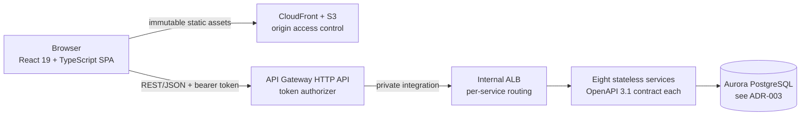

# ADR-006: API Protocol and User Interface Strategy

> **Purpose.** Record decision D6 — the protocol the migrated services speak, and
> the strategy that replaces the 3270 presentation layer — together with the
> options that were weighed, the facts that decided between them, the charge
> dimensions each option carries, and the risks the accepted option takes on.
> This record also closes one question the original request deliberately left
> open: whether a browser interface is in scope at all. It is, and the reason is
> recorded here rather than assumed. This record explains the choices; it does not
> reopen them.
>
> **Source of truth.** Two sources, and no others. The behavioural specification
> is the COBOL baseline under `app/**`, which is **read-only**: this record cites
> it by path and line and never edits it. The decision of record is the Agent
> Action Plan (AAP) §0.1.2 row D6, which fixes the accepted option, together with
> §0.1.1.4 (the open questions this record closes), §0.3 (the component library
> and the token bridge), §0.4.1.4 (the screen inventory) and §0.7.1 (the
> pseudo-conversational state analysis). Within the baseline, four groups of files
> carry most of the weight here — the map definitions under `app/bms`, the
> communication-area and presentation copybooks under `app/cpy`, the transaction
> definitions in [`app/csd/CARDDEMO.CSD`](../../app/csd/CARDDEMO.CSD), and the
> online programs under `app/cbl`. Where this record and the baseline appear to
> disagree about a field, a key or an attribute, the baseline is right and this
> record is wrong.

- **Status:** Accepted
- **Decision:** Publish **REST/JSON described by OpenAPI 3.1** behind an **API
  Gateway HTTP API** with a token authorizer, and re-implement the online screens
  as a **React 19 + TypeScript single-page application** using **Ant Design**,
  delivered from **S3 behind CloudFront**.
- **Scope of this record.** The protocol and the interface, and nothing else. The
  language and runtime belong to
  [ADR-001](ADR-001-language-and-runtime.md), the compute platform that runs the
  handlers to [ADR-002](ADR-002-compute-platform.md), the stores behind them to
  [ADR-003](ADR-003-datastore-targets.md), asynchronous messaging to
  [ADR-004](ADR-004-messaging.md), batch orchestration to
  [ADR-005](ADR-005-batch-orchestration.md), the service boundaries whose
  contracts this record publishes to
  [ADR-007](ADR-007-service-boundaries.md), and identity, token issuance,
  encryption and network isolation to
  [ADR-008](ADR-008-security-and-identity.md). This record cites those decisions
  where the reasoning touches them and re-decides none of them.
- **Where the screen-level detail lives.** This is a decision record, not the
  interface reference. The per-screen field inventory, the component composition
  of each screen and the full BMS-attribute-to-design-token mapping are in
  [`docs/architecture/design-token-reference.md`](../architecture/design-token-reference.md)
  and
  [`docs/architecture/service-catalog.md`](../architecture/service-catalog.md),
  and are not reproduced here.

## Context

The baseline's only user interface is the 3270 presentation layer built with
Basic Mapping Support. It is a character-cell interface: a fixed grid, absolute
positioning for every field, presentation carried in per-field attributes, and
operation entirely from the keyboard. Its data contracts are the copybooks, and
its continuity between screen turns is a single passed structure.

The question this record answers is narrow: **what protocol do the migrated
services speak, and what consumes it once there is no terminal?**

### What is being replaced, counted rather than estimated

Every figure below was counted directly in the working tree. The shape and
regularity of the interface — not its size — is what decides between the options.

| Asset | Count | Where |
|---|---|---|
| BMS mapsets, base application | **17** | `app/bms/*.bms` |
| BMS mapsets, repository-wide | **21** | the 17 above plus 4 in the optional extension trees |
| `DFHMDF` field definitions, base | **902** | summed across the 17 base mapsets |
| `DFHMDF` field definitions, repository-wide | **1166** | the 902 above plus **264** in the 4 extension mapsets |
| Terminal geometry | `SIZE=(24,80)` | **exactly one** per mapset, in all 17 — for example [`app/bms/COSGN00.bms`](../../app/bms/COSGN00.bms) **L28** and [`app/bms/COACTUP.bms`](../../app/bms/COACTUP.bms) **L28** |
| `DEFINE TRANSACTION` stanzas | **18** | [`app/csd/CARDDEMO.CSD`](../../app/csd/CARDDEMO.CSD) **L306–L480** |
| Transactions in the application's own inventory | **24** | [`README.md`](../../README.md) **L291–L314** |
| Screens the target implements | **21** | 17 base mapsets + 4 extension mapsets |
| Front-end assets of any kind in the baseline | **0** | no web, CSS or JavaScript asset, and no Node, Maven, Gradle, Go, Cargo or Python manifest anywhere |

The last row is the reason this decision has no incremental option. There is
nothing to extend and no existing front-end convention to honour: the entire
browser-side stack, its component library and its build toolchain are net-new,
which is also why AAP §0.3.1 requires the component library to be selected
explicitly rather than inherited.

#### Twenty-four transactions and twenty-one screens is not a discrepancy

A reader who counts transactions against screens will find two apparent gaps, and
both resolve to facts rather than to omissions. Setting them out is cheaper than
letting each reader re-derive them.

The base CSD defines **18** transactions; the application's own inventory
documents **24**. Seventeen appear in both. The remaining **seven** are defined
not in the base CSD but in the optional extension trees' own resource
definitions — `CPVS`, `CPVD` and `CP00` in
[`app/app-authorization-ims-db2-mq/csd/CRDDEMO2.csd`](../../app/app-authorization-ims-db2-mq/csd/CRDDEMO2.csd)
at **L49**, **L39** and **L59**; `CTTU` and `CTLI` in
[`app/app-transaction-type-db2/csd/CRDDEMOD.csd`](../../app/app-transaction-type-db2/csd/CRDDEMOD.csd)
at **L35** and **L25**; and `CDRD` and `CDRA` in
[`app/app-vsam-mq/csd/CRDDEMOM.csd`](../../app/app-vsam-mq/csd/CRDDEMOM.csd) at
**L27** and **L17**. Seventeen plus seven is the documented twenty-four.

**Three of those twenty-four carry no BMS map at all**, and their rows in the
inventory table have an empty map column accordingly: `CP00` → `COPAUA0C`
([`README.md`](../../README.md) **L305**), `CDRD` → `CODATE01` (**L313**) and
`CDRA` → `COACCT01` (**L314**). Each is driven by a message rather than by a
terminal, so none of them has a screen to re-implement — they are the request and
reply flows that belong to [ADR-004](ADR-004-messaging.md). Twenty-four
transactions less those three is **21**, and 21 is exactly 17 base mapsets plus
4 extension mapsets. The two counts close on each other.

One further inventory observation, recorded because it is checkable and because a
reader reconciling the CSD against the inventory will otherwise stop at it:
`CDV1` is defined in the base CSD at **L388** with `PROGRAM(COCRDSEC)` at
**L390**, it does not appear in the inventory table's twenty-four rows, and
`COCRDSEC` has no source file anywhere in the repository. AAP §0.5.2 records the
entry as documented with no target. That is the whole of the observation — it is
stated as a property of the inventory, not as a defect, and nothing in this
decision depends on it.

#### The interaction model being replaced is strictly pseudo-conversational

This is the single most consequential property of the baseline for this decision,
so it is set out from the source rather than summarised.

A CICS task ends at every screen turn. Nothing survives in the program between
turns, so all continuity travels in one structure that the terminal holds and
returns. That structure is defined once in
[`app/cpy/COCOM01Y.cpy`](../../app/cpy/COCOM01Y.cpy) **L19–L44** and is shared by
every online program: navigation fields at **L21–L24**, the user identifier and
user type at **L25–L26** with its `'A'` and `'U'` condition names at **L27–L28**,
a program-context flag at **L29** with `88 CDEMO-PGM-ENTER VALUE 0` at **L30**
and `88 CDEMO-PGM-REENTER VALUE 1` at **L31**, selection context at **L33**,
**L38** and **L41**, and the last map and mapset at **L43–L44**.

The sign-on program shows the full cycle, in
[`app/cbl/COSGN00C.cbl`](../../app/cbl/COSGN00C.cbl). It declares the inbound area
as a variable-length byte array whose length is the communication-area length at
**L65–L67**:

```text
01  DFHCOMMAREA.
  05  LK-COMMAREA                           PIC X(01)
      OCCURS 1 TO 32767 TIMES DEPENDING ON EIBCALEN.
```

It then distinguishes a first entry from a continuation by testing
`IF EIBCALEN = 0` at **L80**; it transfers control on success with
`EXEC CICS XCTL PROGRAM('COADM01C')` at **L231–L234** or `PROGRAM('COMEN01C')` at
**L236–L239**, selected by the administrator test at **L230**; and it ends every
turn by handing the structure back with
`EXEC CICS RETURN ... COMMAREA(CARDDEMO-COMMAREA)` at **L98–L102**.

Assumptions: the structure is **storage the client holds between turns**, not
server-side session state. That distinction is what makes the target
transformation in [Rationale](#rationale) a decomposition rather than a
port — there is no server-held session to relocate, and there is also no
server-side guarantee about what comes back. Both halves of that observation
matter, and the second one has a security consequence that
[ADR-008](ADR-008-security-and-identity.md) owns.

## Decision

Two halves, decided together because neither is usable without the other.

**Protocol.** Each service publishes **REST over JSON**, described by an
**OpenAPI 3.1** contract held with the service under
`services/*/src/main/resources/openapi/`. Requests arrive through an **API
Gateway HTTP API** that validates a bearer token at the edge and forwards to an
**internal** application load balancer, which routes per service. Every service
additionally validates the token itself as a resource server, so no service
depends on the front door having done it.

**Interface.** The **21** screens are re-implemented as one **React 19 +
TypeScript** single-page application, one route per mapset, using **Ant Design**
for every interactive element. The built assets are static files served from
**S3 behind CloudFront**; no application server participates in delivering them.



The screen inventory is one route per mapset. It is summarised by group rather
than enumerated field-by-field, because the exhaustive table belongs in the
architecture documentation:

| Group | Screens | Representative source | Predominant composition |
|---|---|---|---|
| Sign-on | 1 | `COSGN00` / `COSGN00C` | form with a masked entry field |
| Menus | 2 | `COMEN01`, `COADM01` | option list, text and numbering preserved |
| Account | 2 | `COACTVW` (100 fields), `COACTUP` (**128** fields) | detail view; multi-column form |
| Card | 3 | `COCRDLI` (72), `COCRDSL`, `COCRDUP` | keyset-paged table; detail; form |
| Transaction | 3 | `COTRN00` (89), `COTRN01`, `COTRN02` | keyset-paged table with selection; detail; form |
| Bill payment | 1 | `COBIL00` | form with confirmation |
| Reports | 1 | `CORPT00` | form with a date range |
| Users | 4 | `COUSR00` (89) – `COUSR03` | table plus add, update and delete forms |
| Extensions | 4 | `COPAU00`, `COPAU01`, `COTRTLI`, `COTRTUP` | table and detail, table and form |
| **Total** | **21** | | |

## Options Considered

Nine options across the two halves. Alternatives Considered: each rejection below
names a mechanism or a measured property of the baseline rather than a preference,
because a rejection that cannot be checked is not a reason.

### Option 1 — REST over JSON, described by OpenAPI 3.1 — ACCEPTED

A browser consumes JSON over HTTP natively, with no intermediary. A machine-readable
contract per service gives the typed client layer a single artifact to be built
against, so the request and response shapes on the browser side and the DTOs on the
service side derive from the same declaration instead of being maintained in
parallel. And because the surface needs no language-specific stub and no record
decoder, a non-browser consumer can call the same endpoints the interface calls.

Assumptions: this record does not claim the baseline's own external integrations
are already HTTP — they are not. The baseline's decoupled flows are message-based,
and they keep their own wire contract under
[ADR-004](ADR-004-messaging.md) rather than being folded into this one. What is
claimed is narrower and is the part that decides the option: the **new synchronous
surface** has exactly one consumer that must work without an intermediary, and
that consumer is a browser.

### Option 2 — gRPC — rejected on the browser-proxy mechanism

The decisive fact is mechanical, not stylistic: **a browser cannot originate gRPC
calls against a gRPC service without a translating proxy in between.** Adopting
gRPC would therefore require standing up and operating a component whose only
function is to undo the protocol choice for the one consumer that matters most
here. The efficiencies gRPC offers — a compact binary encoding, streaming, code
generation from a schema — are real, but they accrue to service-to-service traffic,
and this system has very little of it: the synchronous hops are few and in-VPC,
and the genuinely decoupled flows are asynchronous and belong to
[ADR-004](ADR-004-messaging.md). Paying for a proxy to serve the dominant consumer
badly is not a trade this workload can win.

### Option 3 — GraphQL — rejected because the over-fetching it solves does not exist here

GraphQL earns its resolver layer when clients need to compose variable subsets of
a large graph. These screens are the opposite shape. Each maps onto a record read
or a record write whose field set is **fixed by a copybook layout** — the account
update screen renders 128 fields because the account record has those fields, not
because a client chose them. A flexible query surface would therefore solve a
problem the fixed-field screens do not have, while inserting a resolver layer
between the request and the validation chain transcribed from the COBOL
paragraphs. That layer is exactly where field-level parity would be at risk, and
it would buy nothing back.

### Option 4 — SOAP, or a fixed-width payload carried over HTTP — rejected for the interactive surface

Sending the copybook record across the wire unchanged has an obvious appeal: the
layout is already normative, so nothing would need mapping. It was rejected
because the consumer decides this. A browser client would have to implement
offset-and-length decoding and sign-overpunch handling in TypeScript to render a
form, and the OpenAPI-driven typed client layer would have nothing to describe.

This rejection is narrow and it is worth bounding precisely, because a broad
reading of it would be wrong. **Where a fixed-width or delimited contract still
has a real external consumer, it is preserved exactly.** The authorization request
and reply keep their field order and delimiter under
[ADR-004](ADR-004-messaging.md), and the 133-column report output keeps its width
and its edit masks. What is rejected is fixed-width as the encoding of the *new
interactive* surface, not fixed-width as a contract.

### Option 5 — React 19 and TypeScript, statically hosted behind a content-delivery network — ACCEPTED

Static delivery separates the interface from the service tier completely: the
assets are immutable files, the edge cache serves repeat requests without
reaching the origin, and the service tier is left to do nothing but answer API
calls. TypeScript matters for a specific reason rather than a general one — the
copybook-derived field widths, the money-as-string rule and the token claims all
become declared types, so a mismatch between a screen and a service contract
surfaces at compile time in the same pass that runs the documentation gate.

### Option 6 — A 3270 terminal emulator over a protocol bridge — rejected

An emulator would preserve the interface exactly, including the character grid.
It was rejected because of what it would have to connect to: a terminal
datastream needs a transaction runtime to talk to, and the target has none by
construction. This option would reintroduce precisely the runtime coupling that
[ADR-001](ADR-001-language-and-runtime.md) removes, and it would place a
mainframe-side dependency in the runtime path — which AAP §0.9.1 rules out as a
hard constraint, not a preference.

### Option 7 — Server-rendered pages from the service tier — rejected

Rendering markup inside the eight services would put presentation concerns back
into the same deployables that hold the transcribed business rules, and it would
charge container time to produce pages. Its more serious cost is structural:
server-rendered flows tend to reacquire server-held view state, which is the one
property [Rationale](#rationale) exists to eliminate. The pseudo-conversational
analysis is not a detail to be worked around here; removing that state is what
makes the compute decision in [ADR-002](ADR-002-compute-platform.md) work.

### Option 8 — Defer the user interface entirely — rejected, and the rejection is itself a decision

Recorded in full under
[Bringing the User Interface Explicitly Into Scope](#bringing-the-user-interface-explicitly-into-scope),
because AAP §0.1.1.3 requires the question to be closed rather than left open.

### Option 9 — The component library: Ant Design — ACCEPTED, over two named alternatives

AAP §0.3.1 requires this selection to be explicit, so the two alternatives and
the property that decided between them are recorded rather than implied.

- **Ant Design — accepted.** The deciding property is **information density**.
  These are dense enterprise screens of forms and tables — **128 fields on the
  account-update screen alone** — and the library supplies `Table`,
  `Descriptions` and `Form` as first-class primitives that map directly onto the
  three shapes every screen reduces to. Two further properties are load-bearing
  and are recorded under
  [The TypeScript Version Ceiling](#the-typescript-version-ceiling): its current
  major requires no React 19 compatibility shim, and it themes through CSS
  variables by default.
- **Material UI — rejected.** Its design language is tuned for consumer
  applications, where generous spacing and prominent motion serve the goal. Applied
  to a 128-field form the same choices work against the reading task, and the
  table and detail-view primitives would carry more of the layout in bespoke code.
- **Shadcn/ui — rejected on two concrete grounds.** It requires a utility-CSS
  toolchain plus hand-assembly of each component into the repository, and it ships
  no `Table` or `Descriptions` equivalent. Both grounds converge on the same
  outcome: a large amount of table and detail-view behaviour would become
  first-party code, and the zero-hardcoded-values rule that
  [`docs/architecture/design-token-reference.md`](../architecture/design-token-reference.md)
  enforces would have to be maintained by review rather than by the library.

Alternatives Considered: all three candidates can render every screen in the
inventory, so capability did not separate them and is not offered as the reason.
What separated them is **how much of the table and detail-view behaviour each one
leaves to be written here.** That is measurable against this inventory rather than
in the abstract: the three screens with the largest field counts are a 128-field
form, a 100-field detail view and an 89-field paged list, and a library shipping
`Form`, `Descriptions` and `Table` covers all three shapes directly, whereas a
library missing two of the three converts them into first-party code that has to
carry its own accessibility, keyboard and paging behaviour.

Trade-offs: the accepted library is the most opinionated of the three, so its
visual language is inherited rather than composed, and stepping outside it costs
more than it would with a component kit assembled locally. That is accepted here
because the deviation this migration actually needs is
[the abandoned character grid](#the-one-deliberate-deviation-the-character-grid-is-not-reproduced),
which is a layout decision the library does not constrain, and because a single
inherited language applied through one theme module is what makes the
zero-hardcoded-values rule mechanically checkable instead of a review habit.

### The options side by side

| # | Option | Verdict | The fact that decided it |
|---|---|---|---|
| 1 | REST/JSON + OpenAPI 3.1 | **ACCEPTED** | The dominant consumer is a browser, which speaks it without an intermediary |
| 2 | gRPC | Rejected | Browser traffic needs a translating proxy — a component that exists only to undo the choice |
| 3 | GraphQL | Rejected | Field sets are fixed by copybook layouts, so there is no over-fetching to solve |
| 4 | SOAP / fixed-width over HTTP | Rejected for the interactive surface | Pushes record decoding into the browser; preserved where an external consumer exists |
| 5 | React 19 + TypeScript SPA on S3/CloudFront | **ACCEPTED** | Immutable assets served from an edge cache; contracts become declared types |
| 6 | 3270 emulator over a bridge | Rejected | Needs a transaction runtime the target does not have; reintroduces the coupling ADR-001 removes |
| 7 | Server-rendered pages | Rejected | Returns presentation and view state to the service tier |
| 8 | Defer the interface | Rejected | Would leave every online transaction without a consumer |
| 9 | Ant Design, over Material UI and Shadcn/ui | **ACCEPTED** | Density: `Table`, `Descriptions` and `Form` as primitives for 128-field screens |

## Rationale

### 1. The dominant consumer speaks JSON over HTTP with nothing in between

This is the whole of the protocol argument, and it is deliberately not dressed up
as more than that. A browser issues HTTP requests and parses JSON natively. Every
rejected protocol requires something extra in the path — a proxy for Option 2, a
resolver layer for Option 3, a decoder in the client for Option 4 — and none of
those buys back a property this workload needs. The choice is therefore not a
close one, and [Cost Implications](#cost-implications) says so explicitly rather
than implying more deliberation than actually occurred.

### 2. The OpenAPI contract is what stops the client and the service drifting apart

Each service holds its own OpenAPI 3.1 document. The typed client layer under
[`ui/src/api`](../../ui/src/api) is built against those documents, so a field that
is renamed, retyped or removed on one side is a compile-time failure on the other
rather than a runtime surprise on one screen.

Assumptions: the contract is authoritative for the client. Where a service's
handler and its contract disagree, the contract is the defect — not the client
that believed it.

### 3. A signed claim cannot be asserted by the client, and the baseline field could be

The baseline carries the user type in the same structure the terminal returns:
`CDEMO-USER-TYPE` at [`app/cpy/COCOM01Y.cpy`](../../app/cpy/COCOM01Y.cpy) **L26**,
with `88 CDEMO-USRTYP-ADMIN VALUE 'A'` at **L27**. The sign-on program sets it
from the security record at [`app/cbl/COSGN00C.cbl`](../../app/cbl/COSGN00C.cbl)
**L227** and then branches on it at **L230** to reach either the administrator
menu or the main menu.

Refactoring Rationale: because that structure is storage the client holds and
returns, a client is in a position to send back a value the server did not put
there, and nothing in the flow re-establishes it. In the target the equivalent
value is a **claim inside a signed token** that the client cannot forge, verified
at the front door and independently by each service. The administrator branch
therefore reads a claim rather than a returned field. This is stated as a
structural property of the two mechanisms, and it is one of the places the
migration deliberately does not preserve baseline behaviour. Token issuance,
group mapping and the claim's contents belong to
[ADR-008](ADR-008-security-and-identity.md); this record only records that the
protocol boundary is where the substitution takes effect.

### 4. One structure decomposes into four mechanisms — and one of them disappears

This is the most consequential structural transformation in the migration, so all
four destinations are named. The source is
[`app/cpy/COCOM01Y.cpy`](../../app/cpy/COCOM01Y.cpy) **L19–L44**.

1. **Navigation fields** — `CDEMO-FROM-TRANID`, `CDEMO-FROM-PROGRAM`,
   `CDEMO-TO-TRANID`, `CDEMO-TO-PROGRAM` (**L21–L24**) and `CDEMO-LAST-MAP`,
   `CDEMO-LAST-MAPSET` (**L43–L44**) → **client-side router history**. The
   transfer at [`app/cbl/COSGN00C.cbl`](../../app/cbl/COSGN00C.cbl) **L231–L234**
   becomes a route change in the browser. **No server-side "next program" field
   exists at all in the target** — not relocated, not renamed, absent.
2. **Identity** — `CDEMO-USER-ID PIC X(08)` and `CDEMO-USER-TYPE PIC X(01)`
   (**L25–L26**, condition names **L27–L28**) → **validated token claims**, per §3
   above.
3. **Selection context** — `CDEMO-CUST-ID` (**L33**), `CDEMO-ACCT-ID` (**L38**)
   and `CDEMO-CARD-NUM` (**L41**) → **REST path and query parameters**. The
   consequence is worth naming: every request becomes self-describing, and a
   request that carries its own subject can be authorized on its own terms. In the
   baseline the subject arrives in returned storage, so the authorization decision
   and the subject have different provenance.
4. **Re-entry discriminator** — `CDEMO-PGM-CONTEXT` (**L29**) with
   `88 CDEMO-PGM-ENTER VALUE 0` (**L30**) and `88 CDEMO-PGM-REENTER VALUE 1`
   (**L31**) → **it disappears entirely.** A stateless handler that answers each
   request with a field-error array has no first-entry-versus-continuation
   distinction to draw. The corresponding baseline test at
   [`app/cbl/COSGN00C.cbl`](../../app/cbl/COSGN00C.cbl) **L80** has no target
   equivalent because the condition it detects cannot arise.

### 5. The coupling item 4 severs is load-bearing, and it is a presentation coupling

Item 4 reads like housekeeping. It is not, and the reason is in the copybook that
implements error highlighting.

[`app/cpy/CSSETATY.cpy`](../../app/cpy/CSSETATY.cpy) is a 30-line templated
copybook with `(TESTVAR1)`, `(SCRNVAR2)` and `(MAPNAME3)` substitution
placeholders. It moves `DFHRED` into a field's colour attribute at **L21–L22** and
additionally moves a literal `'*'` into the field when the field is blank at
**L24–L25**. The condition it does that under is the point:

```text
IF (FLG-(TESTVAR1)-NOT-OK
OR  FLG-(TESTVAR1)-BLANK)
AND CDEMO-PGM-REENTER          <- app/cpy/CSSETATY.cpy L20
```

Refactoring Rationale: the `AND CDEMO-PGM-REENTER` conjunct at **L20** means
**error visibility is a property of server-held conversation state**. A field is
highlighted because the validation flag is set *and* because this turn is a
continuation. Remove the discriminator and the second half of that condition has
nothing to test.

That is precisely the coupling this decision severs, and it is why the field-error
contract becomes a **structured per-field error array in the response body** rather
than an attribute mutation on a map. In the target, error presentation is driven
purely by what the response says — the same request produces the same rendering
regardless of what came before it, which is what makes a screen independently
testable.

### 6. Statelessness is not a side effect here; it is the enabling condition

With navigation in the browser, identity in a claim, subject in the path and the
discriminator gone, nothing is left for a handler to remember. All eight services
are therefore stateless: **no sticky sessions and no server-side session store.**

Assumptions: this is what makes horizontally-scaled tasks behind a load balancer
viable at all — any task can answer any request, so scaling out and replacing
tasks are both transparent. [ADR-002](ADR-002-compute-platform.md) depends on that
property; this record is where it is established.

## Bringing the User Interface Explicitly Into Scope

AAP §0.1.1.4 lists the browser interface among five choices the original request
deliberately left open — it made the thin web UI conditional, "if in scope". AAP
§0.1.1.3 states why it cannot stay open: **a UI decision must be made, not
deferred.** This section is that decision, recorded with its reason so that it is
never read as an assumption.

**The decision is to bring the interface explicitly into scope.** All **21**
screens are re-implemented, one route per mapset.

The reason is a consequence, not a preference. **Leaving the screens unreplaced
would strand every online transaction.** The baseline's online half is reached
exclusively through the 3270 presentation layer; the target has no terminal. Defer
the interface and the outcome is not a smaller delivery but an unreachable one —
the eight services and their OpenAPI contracts would exist with nothing calling
them, and the acceptance criteria in AAP §0.9.4 that name sign-on, account
view/update, card list/update, transaction add/list and bill pay as flows that must
work end to end could not be satisfied by any means.

Alternatives Considered: deferring the interface and exposing the APIs alone was
weighed on the grounds that an API-first delivery is independently useful and that
a UI could follow. It was rejected because the value of the API tier here is
realised only through the flows above, all of which are screen-driven. An API with
no consumer does not demonstrate parity with a system whose observable behaviour
*is* its screens.

## Fidelity Contracts Carried Across

The goal is stated precisely, because both halves of it are load-bearing:
**preserve field semantics, keyboard workflow, message text and validation
behaviour, while abandoning fixed character-cell positioning.** What follows is
what "preserve" means in each case.

### The function-key contract

[`app/cpy/CSSTRPFY.cpy`](../../app/cpy/CSSTRPFY.cpy) is 85 lines that normalise
the CICS attention identifier into named flags: Enter, Clear, PA1 and PA2 at
**L22–L29**, then PF01 through PF12 at **L30–L53**. The part that must survive
translation is at **L54–L77**, where **PF13 through PF24 are aliased onto PF01
through PF12** — `DFHPF13` sets the same flag as `DFHPF1`, and so on to `DFHPF24`
setting the PF12 flag.

Measured usage across the online programs fixes the semantics, and the target
binds exactly these:

| Key | Action | Also aliased from |
|---|---|---|
| Enter | Submit | — |
| PF3 | Back | PF15 |
| PF4 | Clear | PF16 |
| PF5 | Save | PF17 |
| PF7 | Page backward | PF19 |
| PF8 | Page forward | PF20 |
| PF12 | Cancel or sign off | PF24 |

Each becomes **both** a visible button in a persistent key bar
([`ui/src/layout/PfKeyBar.tsx`](../../ui/src/layout/PfKeyBar.tsx)) **and** a real
keyboard binding ([`ui/src/layout/usePfKeys.ts`](../../ui/src/layout/usePfKeys.ts)),
with the aliasing preserved.

Assumptions: **keyboard operation is a fidelity requirement, not an accessibility
extra.** The baseline interface is operated entirely from the keyboard, so an
operator's existing muscle memory is part of the behaviour being migrated. Buttons
are added so the same actions are discoverable to someone who has not used the
3270 interface; they do not replace the key bindings, and a target that offered
only buttons would have removed a capability rather than added one.

### The field-error contract

Per [Rationale §5](#5-the-coupling-item-4-severs-is-load-bearing-and-it-is-a-presentation-coupling):
the templated highlight becomes an error status plus help text on the
corresponding form item, and **the literal `'*'` marker is preserved for the blank
case** — matching
[`app/cpy/CSSETATY.cpy`](../../app/cpy/CSSETATY.cpy) **L24–L25** rather than
quietly dropping a marker an operator reads.

### Field constraints come from the copybooks

Each input's maximum length **is** the copybook picture width — not a value chosen
for the form. Numeric-only fields reject non-digits, mirroring the baseline's
numeric attribute. **Money crosses the boundary as a string end to end**, per
[ADR-003](ADR-003-datastore-targets.md), and is rendered in the monospaced code
token so that columns align down a table as they did in fixed-pitch cells.

Assumptions: a JSON number is parsed into a double-precision float by most
clients, which destroys exactness at the boundary the operator actually reads. The
string is therefore a correctness mechanism, not a formatting preference.

### Lists page by key, not by offset

The browse screens bind PF7 and PF8 to a keyset envelope's backward and forward
availability. That envelope is
[`PageResponse`](../../services/common-lib/src/main/java/com/carddemo/common/web/PageResponse.java):
forward reads query for keys strictly greater than the trailing cursor ordered
ascending, backward reads for keys strictly less than the leading cursor ordered
descending — which is what a read-previous does — and forward availability is
discovered by requesting one row beyond the page.

**The component library's built-in offset pagination is deliberately disabled.**
Alternatives Considered: offset pagination is the library default and would have
been less code. It was rejected because **under concurrent inserts an offset
window skips and repeats rows** — a row inserted before the window shifts every
later row by one, so paging forward silently omits a row and paging back shows one
twice. Browse-by-key has no such behaviour, and the baseline's own next-page
indicator is a keyset signal already. Adopting offsets would have changed
observable behaviour under exactly the concurrency the online system runs under.

### Every user-visible string is verbatim and centralised

All message text is carried across character-for-character in a single catalog
([`ui/src/messages/messages.ts`](../../ui/src/messages/messages.ts)), keyed by the
copybook or program it came from. **The two distinct thank-you strings are both
preserved and are never merged**: `CCDA-THANK-YOU` at
[`app/cpy/COTTL01Y.cpy`](../../app/cpy/COTTL01Y.cpy) **L23** is declared
`PIC X(40)`, while `CCDA-MSG-THANK-YOU` at
[`app/cpy/CSMSG01Y.cpy`](../../app/cpy/CSMSG01Y.cpy) **L18** is declared
`PIC X(50)` — and beyond the different declared widths they name the application
differently. They are two strings, and the catalog keeps them as two.

### Theming happens in exactly one place

Design values resolve to library tokens in
[`ui/src/theme/tokens.ts`](../../ui/src/theme/tokens.ts) and are applied once in
[`ui/src/theme/antdTheme.ts`](../../ui/src/theme/antdTheme.ts), so no component
carries a literal colour, spacing or radius value. The values themselves come from
the measured BMS attribute histogram; the mapping table, the exact snaps and the
counts behind them are recorded in
[`docs/architecture/design-token-reference.md`](../architecture/design-token-reference.md)
and are not restated here.

### The one deliberate deviation: the character grid is not reproduced

Every base mapset declares `SIZE=(24,80)` and positions all 902 fields absolutely.
**The target does not reproduce that.** AAP §0.3.4 records this as gap G1, and it
is an intentional, documented deviation rather than an oversight.

Trade-offs: reproducing absolute character positioning in a browser would fix the
interface to one viewport and would tie reading order to pixel coordinates, which
works against assistive technology and cannot be made responsive. What is
preserved instead is what the positioning was expressing: **field grouping,
reading order and tab order.** What is not preserved is **pixel-for-character
positioning.** Stated plainly so that a reviewer comparing a screenshot against a
terminal capture knows which differences are intended.

Two smaller accepted differences, each recorded so it is not mistaken for a defect:

- **Masked entry renders dots where the baseline renders blank.** The sign-on
  password field is declared `ATTRB=(DRK,FSET,UNPROT)` at
  [`app/bms/COSGN00.bms`](../../app/bms/COSGN00.bms) **L175**, so the field shows
  nothing at all as it is typed. A masked input shows one dot per character. The
  difference is accepted: it confirms keystrokes were received, and there is no
  behavioural difference in what is submitted or validated.
- **Radius, elevation and motion are additive.** The 3270 vocabulary has no
  equivalent of any of the three, so nothing is being translated. They are applied
  through tokens like every other value, which keeps them auditable rather than
  ad hoc.

## The TypeScript Version Ceiling

This section exists because the decision it records looks like an unrelated
version choice until it is traced, and AAP §0.8.1 flags it as a transitive
consequence of the project's one rule. Leaving it undocumented would be exactly
the failure that rule's third forbidden pattern describes.

**The TypeScript compiler is deliberately held below the newest major release.**
[`ui/package.json`](../../ui/package.json) pins `typescript` at **6.0.3**.

**The reason is not the compiler.** It is the lint toolchain that runs the
documentation gate. `typescript-eslint` is pinned at **8.65.0**, and that release
and its constituent packages each declare a peer requirement with a hard upper
bound:

```text
typescript-eslint@8.65.0                    peer typescript: >=4.8.4 <6.1.0
@typescript-eslint/parser@8.65.0            peer typescript: >=4.8.4 <6.1.0
@typescript-eslint/eslint-plugin@8.65.0     peer typescript: >=4.8.4 <6.1.0
@typescript-eslint/typescript-estree@8.65.0 peer typescript: >=4.8.4 <6.1.0
```

`6.0.3` satisfies `<6.1.0`. A 7.x compiler does not. The type-aware lint pass
would therefore stop running, and the JSDoc rules configured in
[`ui/eslint.config.js`](../../ui/eslint.config.js) go with it — that is the gate
which enforces the documentation obligation on every exported component and
function in the browser tree.

Trade-offs: **this pin trades compiler throughput for an enforceable documentation
rule.** A newer major compiler builds faster; without it the rule's TypeScript
gate cannot run at all, and an unenforced documentation rule degrades into a
review convention that erodes silently. The faster build was judged the cheaper
thing to give up, because the gate is the only mechanism that makes the obligation
checkable in this language.

**This is recorded so that nobody upgrades the compiler later without
understanding what breaks.** The failure mode is quiet: raising `typescript` alone
does not obviously break the application, it breaks the lint pass — and a gate
that has stopped running does not announce itself. The two versions move together
or not at all, and they move only when a `typescript-eslint` release widens its
peer range.

Three further browser-tier version facts belong here, because each was chosen for
a non-obvious reason:

- **The component library's current major needs no React 19 compatibility shim.**
  `antd@6.5.2` declares `peer react: >=18.0.0` and `peer react-dom: >=18.0.0`,
  which the pinned `react` and `react-dom` at **19.2.8** satisfy directly. The
  compatibility patch package that an earlier major required is not a dependency
  here and is not needed. Assumptions: that peer range is the contract this pin
  relies on; nothing else in the interface tree asserts a React version.
- **The library themes through CSS variables by default**, which is what allows
  the token bridge to be declared once in
  [`ui/src/theme/antdTheme.ts`](../../ui/src/theme/antdTheme.ts) and inherited by
  every component. Without it the same values would have to be pushed into
  per-component style overrides, and the zero-hardcoded-values rule would become
  unenforceable in practice.
- **Routing depends on `react-router` directly, and its companion package is
  absent on purpose.** `react-router` is pinned at **8.3.0**;
  `react-router-dom` appears neither in
  [`ui/package.json`](../../ui/package.json) nor anywhere in the lock file.
  Alternatives Considered: depending on the companion is the more familiar
  arrangement and would have read as the conventional choice. It was rejected
  because per AAP §0.6.1.2 the companion is a thin shim published only at an older
  major, which depends on `react-router` a major version behind — so depending on
  it would have pinned routing backwards while appearing to be current. Both
  [`ui/src/router.tsx`](../../ui/src/router.tsx) and every screen therefore import
  from `react-router`.

## Cost Implications

Reasoned as **charge dimensions and their drivers**: which dimension is billed,
what drives it up, and how the two environments differ under it.

Trade-offs: no currency figure is stated and no price list is quoted, which makes
this section less immediately actionable than a costed estimate would be. That is
accepted because an unverified figure in an architecture record is worse than
none — it gets cited and then goes stale silently, since a price list can change
without anything in this repository changing. A charge dimension and its driver
stay true across a price revision, so that is what is recorded.

### The API tier is charged per request, with no idle charge

| Dimension | What drives it |
|---|---|
| API requests | The number of API calls received. **No charge accrues while no request arrives** |
| Data transfer out | Response payload volume leaving the edge |
| Load-balancer hours and capacity units | The internal load balancer behind the front door, which runs continuously |
| Log storage | Access and execution log volume, times the retention window |

The decisive property is the first row. An internal enterprise application is used
in bursts during working hours and is close to idle outside them, so a per-request
charge means **cost tracks use** rather than tracking a provisioned size and a
clock. That shape is the reason a request-priced front door suits this workload
specifically, rather than being a general preference: the same choice would be far
less advantageous for a continuously saturated public API.

### Static delivery is charged on storage, transfer and requests — and the cache moves the largest one

| Dimension | What drives it |
|---|---|
| Object storage per GB-month | The volume of built assets stored |
| Content-delivery data transfer out | Bytes served to browsers |
| Content-delivery requests | Number of asset requests served |
| Invalidations | Cache invalidations issued at deploy time |

A single-page application is a handful of immutable files, so **the storage
dimension is negligible and the driver is data transfer out.** The mechanism that
matters is specific: because the assets are immutable and content-hashed, the edge
cache serves repeat requests **from an edge location rather than from the origin**,
so origin requests and origin transfer fall to roughly one fill per asset per edge
rather than one per user. That is why the delivery choice and the caching behaviour
are one decision and not two — the cache is what makes the transfer dimension
tractable, and a non-cacheable delivery path would pay the same bytes repeatedly.

### The environment lever is narrow, and naming it precisely is the point

AAP §0.4.1.6 constrains the two environment roots to differ **only** in sizing and
retention, never in which resources exist. For this tier the levers are therefore
few:

| Lever | `dev` | `prod` | Cost consequence |
|---|---|---|---|
| Content-delivery price class | Restricted to the lower-cost edge footprint | Broader edge footprint | Bounds transfer and request pricing by geography |
| Log retention | Short | Long | Drives log storage directly; the window belongs to [ADR-008](ADR-008-security-and-identity.md) |

**Topology is identical between the two.** Both environments have the same front
door, the same internal load balancer, the same distribution and the same origin.
Assumptions: keeping topology identical is what makes a `dev` verification
meaningful — an environment that differed structurally would validate a different
system, and a topology difference is precisely the kind that is not noticed until
production.

### What the rejected options would have cost instead

- **Option 7, serving the application from the container tier — vCPU-seconds and
  GiB-seconds to serve immutable files.** Static assets that an edge cache serves
  for nothing would instead be served by tasks billed for the time they spend doing
  it, and that traffic would additionally pass through the application load
  balancer, consuming capacity units alongside genuine API calls. The charge scales
  with page loads rather than with work performed.
- **Option 2, gRPC — the proxy is a component to run and to pay for.** Its cost is
  not the protocol but the translating tier the browser requires: continuously
  running compute, its own scaling behaviour and its own failure modes, all
  existing solely to undo the protocol choice for the primary consumer. An option
  whose enabling component has no other purpose is not cheaper for having a
  compact encoding.
- **Option 6, a terminal emulator over a bridge — a standing charge plus a
  dependency the constraints forbid.** The bridge would run continuously, and it
  would require a transaction runtime to bridge to, which is ruled out by the
  no-manual-mainframe-dependency constraint rather than by cost.

### The guiding principle, and where it applied

Reproduced verbatim from AAP §0.9.4:

> "Prefer AWS-managed services over self-managed where it lowers operational
> burden, unless cost or a hard constraint dictates otherwise. When a decision is
> a close call, choose the lower-risk, lower-cost option and note it."

The first sentence decided both halves of this record. On the API side it selected
a **managed HTTP front door with a managed token authorizer** over a self-managed
gateway or an authentication filter hand-rolled at the edge — token validation is
security-critical code whose correctness is entirely operational burden, and none
of it is behaviour the baseline requires the team to own. On the delivery side it
selected **managed static hosting behind a managed content-delivery network** over
a web-server fleet, which would have brought patching, scaling and certificate
management for the job of returning files that have not changed.

Assumptions: **the second sentence does not apply to this record, and saying so is
part of getting the record right.** AAP §0.1.2 names exactly two close calls in
the whole decision set — queues versus a managed broker in
[ADR-004](ADR-004-messaging.md), and a state machine versus a managed batch service
in [ADR-005](ADR-005-batch-orchestration.md). **This decision is not one of them
and is not presented as one.** The facts that rejected the alternatives here are
categorical rather than marginal: a browser either needs a translating proxy or it
does not, and the field set of a screen is either fixed by a copybook or chosen by
a client. Manufacturing a third close call would misreport how much uncertainty
this decision actually carries.

## Trade-offs and Risks

### Accepted trade-off — the fixed character grid is abandoned

Stated in full under
[the deliberate deviation](#the-one-deliberate-deviation-the-character-grid-is-not-reproduced).
The short form: `SIZE=(24,80)` and absolute positioning are not reproduced;
grouping, reading order and tab order are. This is the largest single visible
difference between the two interfaces and it is intentional.

### Accepted trade-off — the compiler is held a major version back

Stated in full under
[The TypeScript Version Ceiling](#the-typescript-version-ceiling). Build throughput
is given up so that the documentation gate can run.

### Accepted trade-off — JSON is more verbose than a fixed-width record

A JSON object carrying an account record is larger on the wire than the 300-byte
fixed-width form, and it costs parsing on both sides. Accepted because the
payloads on this path are **per-screen record reads and writes** — one record, or
one page of a list — where the absolute difference is small and the browser needs
no decoder. The paths where volume genuinely matters are not on this boundary at
all: bulk dataset movement goes to object storage under
[ADR-003](ADR-003-datastore-targets.md) and batch flows under
[ADR-005](ADR-005-batch-orchestration.md), neither of which carries JSON.

### Accepted trade-off — the browser now holds navigation state

This is the deliberate consequence of removing the passed structure, and it cuts
both ways.

The capability gained is one the baseline does not have: because the subject is in
the path, **a route can be deep-linked, bookmarked and shared.** The obligation
incurred is the other side of the same fact: **every route must be independently
authorizable**, since a request may arrive at any screen without having passed
through the ones before it. In the baseline, reaching a screen implied a path
through the transfer graph; in the target it implies nothing. That is exactly why
selection context moved into the path in
[Rationale §4](#4-one-structure-decomposes-into-four-mechanisms--and-one-of-them-disappears)
rather than into browser storage — a subject in the path is a subject the server can
check.

### Risk — message-text drift

A user-visible string retyped by hand rather than copied breaks the verbatim
guarantee, and the failure is invisible: a message that reads plausibly but differs
by a character or a trailing space still looks correct in review.

Mitigation: one central catalog keyed by originating copybook
([`ui/src/messages/messages.ts`](../../ui/src/messages/messages.ts)) so that no
string is declared twice, plus per-screen tests asserting the rendered text. The
two thank-you strings are the worked example of why this matters — they are similar
enough that a catalog holding one of them would look complete.

### Risk — field-width drift

An input whose maximum length does not match the copybook picture width lets an
operator type a value the service must then reject, or truncates one the baseline
would have accepted.

Mitigation: widths derive from the copybook layout rather than being written per
form, with per-screen tests asserting the constraints. The register of any
divergence found is
[`docs/architecture/cobol-to-service-traceability.md`](../architecture/cobol-to-service-traceability.md).

### Risk — token handling diverging between the front door and the services

If the front door validates a token and the services trust it blindly, a request
that reaches a service by any other path is unauthenticated.

Mitigation: **validation happens twice, independently.** The authorizer validates
at the edge, and each service additionally validates as a resource server, so no
service depends on its caller having checked. The token's issuance, claims and
group mapping belong to [ADR-008](ADR-008-security-and-identity.md).

### The assumptions this decision rests on

- The OpenAPI contract per service is authoritative for the typed client; where a
  handler and its contract disagree, the contract is the defect.
- The component library's peer requirement of React 18 or later is satisfied by
  the pinned React 19 runtime, verified against the lock file.
- Money crosses the API boundary as a string, never as a JSON number.
- The baseline copybooks are the normative source for field widths, and the
  baseline programs and copybooks are the normative source for message text.

### Out of scope — stated with reasons, and not delivered

None of the following is provided by this decision, and none should be read as
delivered:

- **Blue-green and canary deployment.** Rolling deployment only. The interface is
  static assets behind a cache and the services deploy by rolling replacement;
  adding a second parallel environment and traffic-shifting machinery is a
  capability this migration does not require for parity.
- **Multi-region and disaster-recovery topology.** Single region, three
  availability zones. A second region would multiply every dimension in
  [Cost Implications](#cost-implications) to reproduce availability behaviour the
  baseline does not have.
- **Application-level caching — no Redis and no ElastiCache.** The baseline has no
  cache tier, so none is required for parity, and adding one would introduce
  staleness semantics that do not exist today. The edge cache in this record caches
  **immutable static assets**, which is a different mechanism and is not an
  application cache.
- **Read replicas.** Not part of this decision; the reasoning is recorded in
  [ADR-003](ADR-003-datastore-targets.md).
- **A design source.** **No Figma file, frame or URL was provided** (AAP §0.10.1),
  so the design values are measured from the BMS attributes rather than mapped from
  a design document. AAP §0.3.4 records this as gap G6, and the distinction is
  worth keeping: this is **an absence of a design source, not a gap in the design
  system.** Nothing is missing from the component library and nothing is blocked;
  there is simply no design file to map from, which is why the histogram in
  [`docs/architecture/design-token-reference.md`](../architecture/design-token-reference.md)
  is the measured substitute.

The application's own published plans are a separate matter and are not in this
list. [`README.md`](../../README.md) **L377–L389** sets out the maintainers'
roadmap — further database-syntax scenarios including DB2 Rewards at **L382**, IMS
DC at **L384**, FTP and SFTP integration at **L387**, and exposure of transactions
for distributed application integration at **L389**. Those are the maintainers'
plans for the baseline application, cited here only so a reader does not mistake
their absence from this record for an omission in it.

### Honest boundary — what this record does not establish

The interface and its infrastructure are **authored and statically validated**:
type-checked, linted against the documentation gate, and unit-tested at component
level, with the infrastructure formatted, validated, linted and planned. What has
**not** happened is stated plainly:

- **No `terraform apply` against a live AWS account.** That is an operator action
  outside this scope, so no distribution, no front door and no user pool exists as
  a running resource.
- **No screen has been exercised against a live provisioned environment.** Nothing
  in this record is a report of an end-to-end run through a deployed stack.
- **No benchmark and no load test.** Every cost statement above is a charge
  dimension and a driver, not a measured throughput or a measured bill.
- **No usability test.** The interface decisions are justified against baseline
  behaviour and the design system, not against observed operator performance. Where
  this record claims a difference is acceptable — the masked entry field, for
  instance — that is a reasoned judgement, and it is not presented as a tested one.

Assumptions: naming these boundaries is more useful than a confident summary would
be. A reader who needs to know whether a screen has been driven through a real
front door can find the answer here instead of inferring it from silence.

## Consequences

### Eight OpenAPI contracts, one per service, held with the service

Each service publishes its own contract under
`services/*/src/main/resources/openapi/`, versioned with the code that implements
it rather than in a central registry. Assumptions: co-locating the contract with
the handler is what keeps the two in step — a contract in a separate tree drifts
from its implementation because nothing fails when it does.

### Twenty-one routes, and three transactions with no route

The interface implements one route per mapset, 21 in total. **`CP00`, `CDRD` and
`CDRA` have no route**, because they have no map: each is driven by a message and
belongs to [ADR-004](ADR-004-messaging.md). A reader auditing routes against the
transaction inventory should expect exactly that difference and no other.

### A shared shell, authored once

Every 3270 screen carries a title band, a message line and a function-key legend.
These become three shell components — a screen header, a message band and the key
bar — authored once rather than per screen, alongside the key-binding hook. The
message band honours the 75-character width of the baseline's message fields as a
rendering constraint.

### No session affinity anywhere in the stack

No sticky sessions, no server-side session store, no session table. This is a
positive commitment rather than an omission: it is the property
[ADR-002](ADR-002-compute-platform.md) relies on, and a later change that
introduced server-held session state would invalidate that decision as well as this
one.

### Where the divergences are recorded

Every intentional behavioural difference introduced by this decision — the
character grid, the masked entry field, the vanished re-entry discriminator, the
claim replacing the returned user-type field — is registered in
[`docs/architecture/cobol-to-service-traceability.md`](../architecture/cobol-to-service-traceability.md),
which is the single register of divergences for the whole migration. **No COBOL is
changed to accommodate any of them.** The baseline programs, copybooks and maps are
byte-identical to what they were, they keep running exactly as they do today, and
the repository's existing z/OS and AWS Mainframe Modernization paths remain
available unchanged — the migration adds a path, it does not remove one.

### Downstream obligations this decision creates

- Every input's maximum length equals its copybook picture width, and every
  user-visible string is taken verbatim from the catalog. Both are assertable, and
  both are asserted by per-screen tests.
- Every list screen pages by key. Offset pagination is not reintroduced, in any
  screen, for any reason short of a superseding record.
- Every route is independently authorizable, and no route infers authorization
  from the route the user came from.
- No component carries a literal colour, spacing or radius value; every design
  value resolves through the token module.
- `typescript` and `typescript-eslint` move together. Raising the compiler past the
  peer bound disables the documentation gate silently, so neither is bumped alone.
- No credential, endpoint, distribution identifier or user-pool identifier appears
  in this repository. Assumptions: this is structural rather than observed — the
  interface reads its API base URL from an environment variable documented by name
  with no value, and identity resources are provisioned with generated secrets under
  [ADR-008](ADR-008-security-and-identity.md).
- A later implementation change that conflicts with this record requires a
  superseding ADR rather than a silent edit to the decision.

## References

**Decision records.** [Index](README.md) ·
[ADR-001 language and runtime](ADR-001-language-and-runtime.md) ·
[ADR-002 compute platform](ADR-002-compute-platform.md) ·
[ADR-003 datastore targets](ADR-003-datastore-targets.md) ·
[ADR-004 messaging](ADR-004-messaging.md) ·
[ADR-005 batch orchestration](ADR-005-batch-orchestration.md) ·
[ADR-007 service boundaries](ADR-007-service-boundaries.md) ·
[ADR-008 security and identity](ADR-008-security-and-identity.md) ·
[ADR-009 IaC tool](ADR-009-iac-tool.md)

**Architecture and operations.**
[design token reference](../architecture/design-token-reference.md) ·
[service catalog](../architecture/service-catalog.md) ·
[context and container diagrams](../architecture/context-and-container-diagrams.md) ·
[COBOL-to-service traceability and divergence register](../architecture/cobol-to-service-traceability.md) ·
[security and identity](../architecture/security-and-identity.md) ·
[messaging contracts](../architecture/messaging-contracts.md) ·
[deploy runbook](../runbooks/deploy.md)

**Conventions.**
[code documentation standard](../CODE_DOCUMENTATION_STANDARD.md) ·
[contributing guidelines](../../CONTRIBUTING.md) ·
[migration guide](../../MIGRATION_README.md)

**Target artifacts implementing this decision.**
[`ui/README.md`](../../ui/README.md) ·
[`ui/package.json`](../../ui/package.json) ·
[`ui/eslint.config.js`](../../ui/eslint.config.js) ·
[`ui/src/router.tsx`](../../ui/src/router.tsx) ·
[`ui/src/theme/tokens.ts`](../../ui/src/theme/tokens.ts) ·
[`ui/src/theme/antdTheme.ts`](../../ui/src/theme/antdTheme.ts) ·
[`ui/src/messages/messages.ts`](../../ui/src/messages/messages.ts) ·
[`ui/src/layout/PfKeyBar.tsx`](../../ui/src/layout/PfKeyBar.tsx) ·
[`ui/src/layout/usePfKeys.ts`](../../ui/src/layout/usePfKeys.ts) ·
[`ui/src/layout/MessageBand.tsx`](../../ui/src/layout/MessageBand.tsx) ·
[`PageResponse.java`](../../services/common-lib/src/main/java/com/carddemo/common/web/PageResponse.java) ·
[`infra/modules/api-gateway-http`](../../infra/modules/api-gateway-http) ·
[`infra/modules/cloudfront-spa`](../../infra/modules/cloudfront-spa) ·
[`infra/modules/alb`](../../infra/modules/alb) ·
[`infra/modules/cognito`](../../infra/modules/cognito)

**Baseline cited by this record — read-only.**
[`app/cpy/COCOM01Y.cpy`](../../app/cpy/COCOM01Y.cpy) L19–L44, L21–L24, L25–L26, L27–L28, L29, L30, L31, L33, L38, L41, L43–L44 ·
[`app/cpy/CSSTRPFY.cpy`](../../app/cpy/CSSTRPFY.cpy) L22–L29, L30–L53, L54–L77 ·
[`app/cpy/CSSETATY.cpy`](../../app/cpy/CSSETATY.cpy) L20, L21–L22, L24–L25 ·
[`app/cpy/COTTL01Y.cpy`](../../app/cpy/COTTL01Y.cpy) L23 ·
[`app/cpy/CSMSG01Y.cpy`](../../app/cpy/CSMSG01Y.cpy) L18 ·
[`app/cbl/COSGN00C.cbl`](../../app/cbl/COSGN00C.cbl) L65–L67, L80, L98–L102, L227, L230, L231–L234, L236–L239 ·
[`app/bms/COSGN00.bms`](../../app/bms/COSGN00.bms) L28, L175 ·
[`app/bms/COACTUP.bms`](../../app/bms/COACTUP.bms) L28 ·
[`app/csd/CARDDEMO.CSD`](../../app/csd/CARDDEMO.CSD) L306–L480, L388, L390 ·
[`app/app-authorization-ims-db2-mq/csd/CRDDEMO2.csd`](../../app/app-authorization-ims-db2-mq/csd/CRDDEMO2.csd) L39, L49, L59 ·
[`app/app-transaction-type-db2/csd/CRDDEMOD.csd`](../../app/app-transaction-type-db2/csd/CRDDEMOD.csd) L25, L35 ·
[`app/app-vsam-mq/csd/CRDDEMOM.csd`](../../app/app-vsam-mq/csd/CRDDEMOM.csd) L17, L27 ·
[`README.md`](../../README.md) L291–L314, L305, L313, L314, L377–L389, L400

**External.** The component library's peer requirements, its removal of the
React 19 compatibility patch and its CSS-variables theming default — from the
library's own published package metadata and its v6 migration guide. The
`typescript` peer range that fixes the compiler ceiling — from the
`typescript-eslint` package metadata recorded in
[`ui/package-lock.json`](../../ui/package-lock.json).
