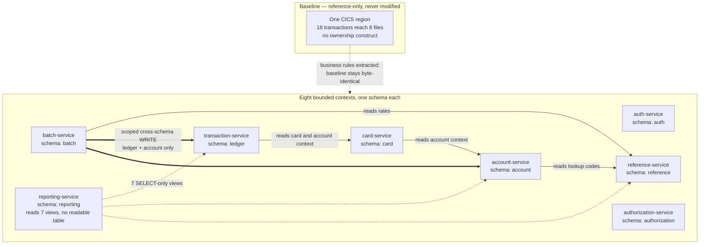

# ADR-007: Service Boundaries

> **Purpose.** Record decision D7 — how one CICS region decomposes into bounded
> contexts, which context owns which data, why nine candidate seams became eight
> contexts, and the one place where database-per-service ownership is deliberately
> relaxed. This record also states the options that were weighed, the facts that
> decided between them, the charge dimensions each option carries, and the risks
> the accepted option takes on. It explains the choice; it does not reopen it.
>
> **Source of truth.** Two sources, and no others. The decision of record is the
> Agent Action Plan (AAP) §0.1.2 row D7, which fixes the accepted option, together
> with §0.4.1.2 and §0.4.1.3 for the context list and schema ownership and §0.9.4
> for the candidate seams this record refines. The behavioural specification is the
> COBOL baseline under `app/**`, which is **read-only**: this record cites it by
> path and line and never edits it. Three parts of the baseline carry most of the
> weight here — the CICS resource definitions in
> [`app/csd/CARDDEMO.CSD`](../../app/csd/CARDDEMO.CSD), the posting program
> [`app/cbl/CBTRN02C.cbl`](../../app/cbl/CBTRN02C.cbl), and the maintainers' own
> application inventory in the root [`README.md`](../../README.md) under
> *Application Inventory*. Where this record and the baseline appear to disagree
> about a program, a file or a transaction, the baseline is right and this record
> is wrong.

- **Status:** Accepted
- **Decision:** Decompose the application into **eight bounded contexts**, each
  deployed independently, with **one PostgreSQL schema per context** as the
  ownership boundary: `auth-service`, `account-service`, `card-service`,
  `transaction-service`, `reference-service`, `batch-service`,
  `authorization-service` and `reporting-service`.
- **Scope of this record.** The boundaries, and nothing else. The language and
  runtime belong to [ADR-001](ADR-001-language-and-runtime.md), the compute
  platform each context runs on to [ADR-002](ADR-002-compute-platform.md), the
  store that hosts the eight schemas to
  [ADR-003](ADR-003-datastore-targets.md), the queues that cross the boundaries
  to [ADR-004](ADR-004-messaging.md), batch orchestration to
  [ADR-005](ADR-005-batch-orchestration.md), the API and UI surface to
  [ADR-006](ADR-006-api-and-ui.md), identity and network isolation to
  [ADR-008](ADR-008-security-and-identity.md), and the provisioning tool to
  [ADR-009](ADR-009-iac-tool.md). This record cites those decisions where the
  reasoning touches them and re-decides none of them.
- **Where the per-context detail lives.** This is a decision record, not the
  service reference. The endpoint-by-endpoint responsibilities and dependency
  lists are in
  [`docs/architecture/service-catalog.md`](../architecture/service-catalog.md);
  the column-level schema derivation, the three corrected field misspellings and
  the per-record `FILLER` drops are in
  [`docs/architecture/data-model-and-schema-mapping.md`](../architecture/data-model-and-schema-mapping.md);
  the program-to-method traceability and the register of every documented
  behavioural divergence are in
  [`docs/architecture/cobol-to-service-traceability.md`](../architecture/cobol-to-service-traceability.md).
  None of that is reproduced here.

## Context

### What is being decomposed, counted rather than estimated

The baseline is one CICS region carrying the whole online application, and the
counts below were read from the files rather than rounded from memory.

| Baseline artifact | Verified count | Where |
|---|---|---|
| Lines in the CICS resource definition | **505** | [`app/csd/CARDDEMO.CSD`](../../app/csd/CARDDEMO.CSD) |
| `DEFINE FILE` stanzas | **8** | same file |
| `DEFINE TRANSACTION` stanzas | **18** | same file |
| `DEFINE PROGRAM` stanzas | **18** | same file |
| `DEFINE LIBRARY` stanzas | **2** | same file |
| `TDQUEUE` definitions | **1** (`JOBS`) | same file |
| Programs in `app/cbl` | **31** — **12** batch `CB*`, **18** online `CO*`, **1** date utility (`CSUTLDTC`) | `app/cbl` |
| Programs across `app/**` | **44** — the 31 above plus **13** in the three extension trees | `app/**` |
| Copybooks | **30** in `app/cpy`, **62** across `app/**` | `app/cpy` and the extension trees |
| JCL jobs | **38** in `app/jcl`, **46** across `app/**`, **55** repository-wide | `app/jcl`, the extension trees, and the sibling `samples/**` tree |

Two of those counts need a word of precision, because the obvious reading of each
is wrong. The **44** is the program count across `app/**`, not across the whole
repository: the repository holds more `.cbl` files than that — **56** — because the
existing test suite contributes **12** COBOL unit-test programs under
`tests/cobol-unit`, and those are test artifacts rather than baseline programs.

The JCL row needs the same care, and it needs it in the other direction. **38** is
what `app/jcl` itself holds; **46** is the `app/**` total, the extra eight being the
five jobs in `app/app-authorization-ims-db2-mq/jcl` and the three in
`app/app-transaction-type-db2/jcl`; and **55** is the repository-wide total, whose
remaining nine live in `samples/jcl`. Those nine are compile and security samples
for the mainframe build path and are reference-only.

Refactoring Rationale: this row previously read "**55** across `app/**` including
`samples/**`", which was wrong twice in one clause. It overstated the `app/**` total
by nine, and it placed `samples/**` inside `app/**` when `samples/**` is a sibling
top-level tree — so a reader trying to reconcile the number against the filesystem
would have found neither the count nor the path. The three figures are now given
separately with the directory each one covers, because a single number spanning two
unrelated trees is the shape of claim that goes stale without anyone noticing. The
distinction is load-bearing rather than pedantic: `app/**` is the reference baseline
this decomposition is derived FROM, while `samples/**` is tooling for the mainframe
build path that §0.2.2 of the plan places out of scope entirely, and a count that
merges the two would put nine out-of-scope jobs inside the input to a boundary
argument.

Assumptions: these counts are the decomposition's input, so the ADR states them
as measurements with their source rather than as approximations. A boundary
argument that rests on "roughly thirty programs" cannot be checked; one that
rests on 12 batch, 18 online and 1 utility can be, and a reader who recounts and
disagrees has found a defect in this record.

### There is no module boundary inside the region, and that is a property of the model

Every one of the 18 transactions defined in the CSD can reach every one of the 8
files defined there. Nothing in the resource definitions expresses ownership,
because CICS resource definitions do not have a construct for it: a file is
installed into a region and is then addressable by any program running in that
region. The absence of an internal boundary is therefore a property of the CICS
programming model, not a shortcoming of the programs or of the people who wrote
them — and it is exactly what makes this region a well-suited subject for a
decomposition exercise, since the seams have to be derived from data usage rather
than read off a manifest.

The root [`README.md`](../../README.md) publishes the maintainers' own inventory
under *Application Inventory*, and it is the authoritative list this record works
from: **24** online transactions and **27** batch jobs, each row carrying an
`Optional Module` column that marks which of them belong to the three extension
trees. That column is the baseline's own statement of where its optional seams
lie, and this record follows it rather than inventing seams of its own.

The existing z/OS and AWS Mainframe Modernization deployment paths are untouched
by this decision and remain exactly as they are. The migration adds a path; it
does not remove one.

### The three extension trees are already separate seams

Each optional feature ships as its own tree with its own README, its own CICS
definitions and its own datastore technology. They are the closest thing the
baseline has to a declared boundary, so they are the natural starting point for
one.

| Extension tree | Programs | Character |
|---|---|---|
| `app/app-authorization-ims-db2-mq` | **8** — `COPAUS0C`, `COPAUS1C`, `COPAUS2C`, `COPAUA0C`, `CBPAUP0C`, `PAUDBLOD`, `PAUDBUNL`, `DBUNLDGS` | Message-triggered authorization processing. Its own README describes the datastore arrangement in the maintainers' words as "Two-phase commit transactions across IMS DB and DB2" |
| `app/app-vsam-mq` | **2** — `COACCT01`, `CODATE01` | Request/reply messaging over VSAM. The inventory names the transactions "Inquire account details via MQ" (`CDRA`) and "Inquire System Date via MQ" (`CDRD`) |
| `app/app-transaction-type-db2` | **3** — `COTRTLIC`, `COTRTUPC`, `COBTUPDT` | Reference-data screens and a maintenance job over Db2 |

**Two facts about these trees decide the refinement below, so they are established
here rather than asserted later.** First, the account-inquiry program reads the
account master that the online account screens already read: it names the dataset
in a literal, `LIT-ACCTFILENAME ... VALUE 'ACCTDAT '`
[`app/app-vsam-mq/cbl/COACCT01.cbl`](../../app/app-vsam-mq/cbl/COACCT01.cbl)
**L115–L116**, copies the account record layout with `COPY CVACT01Y` at **L171**,
and reads it at **L397**. Second, the transaction-type screens maintain the
reference table that disclosure-group and category logic already reads: they
declare cursors over `CARDDEMO.TRANSACTION_TYPE` at
[`app/app-transaction-type-db2/cbl/COTRTLIC.cbl`](../../app/app-transaction-type-db2/cbl/COTRTLIC.cbl)
**L339** and **L355** and update and delete rows in it at **L1847** and **L1901**.

Neither tree introduces data that is not already owned somewhere else. That single
observation is the whole argument for folding both of them inward, and it is
developed in [Refining Nine Candidates Into Eight Contexts](#refining-nine-candidates-into-eight-contexts).

### The unit of work that constrains every boundary proposal

One baseline behaviour limits what any decomposition may do, so it belongs in
Context rather than buried in rationale. Posting a transaction performs three
writes in immediate succession inside `2000-POST-TRANSACTION`
[`app/cbl/CBTRN02C.cbl`](../../app/cbl/CBTRN02C.cbl) **L424–L444**:

```text
L440    PERFORM 2700-UPDATE-TCATBAL          (transaction category balance)
L441    PERFORM 2800-UPDATE-ACCOUNT-REC      (account master)
L442    PERFORM 2900-WRITE-TRANSACTION-FILE  (transaction master)
```

There is no intervening commit point between them, and none is expressible: the
program is a standalone batch program with no `EXEC CICS` and no `SYNCPOINT`
anywhere in it, so the three writes simply succeed or the program abends. The six
files it declares at **L29–L57** fall into exactly two of the target schemas — the
daily-transaction input, the transaction master, the reject stream and the
category balances become `ledger`, while the card cross-reference and the account
master become `account`, and the account master is not merely read but rewritten
by `2800-UPDATE-ACCOUNT-REC` at **L545**.

So the one genuinely multi-entity unit of work in the application spans two of the
eight contexts. Any proposal that puts a network boundary or a separate commit
between those three writes changes observable behaviour. That constraint, not a
preference about service granularity, is what settles the exception recorded in
[The One Deliberate Exception to Database-per-Service Purity](#the-one-deliberate-exception-to-database-per-service-purity).

### The eight contexts and the dependencies between them



> **This diagram is the target dependency design, not an inventory of delivered
> clients.** The distinction matters because the two differ today, and this record's own
> [status table](#honest-boundary--what-this-record-does-not-establish) is where the
> difference is tracked. Exactly **three** synchronous cross-context clients are
> authored: `account-service` → `reference-service`
> (`RestReferenceAddressLookup`), `transaction-service` → `account-service` and
> `authorization-service` → `account-service` (each a `RestAccountContextClient`). The
> delivered edges are enumerated with the operations they carry in
> [`service-catalog.md`](../architecture/service-catalog.md#cross-service-dependency-rules).
> Assumptions: the heading above this diagram reads "the
> dependencies between them," which a reader can reasonably take as a statement of what
> exists rather than of what is decided. Labelling the diagram's status here keeps the
> design intent this ADR owns from being read as a delivered-state claim it does not
> make, without weakening the decision itself.


## Decision

Decompose into **eight bounded contexts**, each an independently deployable unit,
and make **the schema the ownership boundary**: each context owns exactly one
PostgreSQL schema in the single cluster chosen by
[ADR-003](ADR-003-datastore-targets.md), and no context writes another context's
schema. The one departure from that last clause is scoped, named and justified
below; it is the only one.

Ownership is assigned by **data**, not by screen and not by transport. A context
owns the tables its programs read and write, and an alternate way of reaching
those tables — a message queue instead of a terminal — becomes an additional
inbound adapter on the owning context rather than a context of its own.

## Options Considered

### Option 1 — Eight bounded contexts with schema-per-service — ACCEPTED

Follows the candidate seams supplied with the requirements, consolidating the
extension seeds into the contexts that already own their data and adding one
context to own the seeded lookup data. Ownership is expressible (one schema, one
owner), the posting unit of work stays a single local commit, and the boundary is
visible in an import statement.

### Option 2 — Nine services, one per candidate seam as listed — considered and refined

Rejected as listed, not rejected in substance: all nine responsibilities are
delivered, but two of the nine are alternate transports over data another context
already owns rather than distinct data owners. Standing them up separately would
put two deployables in the write path of one table. The reasoning is in
[Refining Nine Candidates Into Eight Contexts](#refining-nine-candidates-into-eight-contexts).

### Option 3 — A single migrated deployable — rejected

Alternatives Considered: one deployable would collapse the compute floor to a
single always-on footprint, which is the cheapest shape available, and that is a
real argument for it. It was rejected on three concrete grounds. It forfeits
independent scaling, so the interactive account screens and the nightly posting
job would size together despite having unrelated load shapes. It forfeits
independent deployment, so a change to reference data would redeploy the
authorization consumer. And it reproduces the property established in Context —
every component reachable from every other, with no construct expressing
ownership — which is the specific structural problem this refactor exists to
address. Choosing it would mean changing the runtime while keeping the
characteristic that motivated the change.

### Option 4 — Finer-grained decomposition, one service per screen or transaction — rejected

Alternatives Considered: with 18 transactions in the CSD this would produce on the
order of eighteen deployables where eight suffice, multiplying every per-service
charge dimension enumerated under [Cost Implications](#cost-implications) and
adding a network hop wherever a validation chain currently runs in one process. It
would also split chains that are single units of validation: the account-update
screen alone carries 128 fields whose cross-field rules are transcribed as one
chain, and cutting it across two deployables would turn a local branch into a
remote call with a failure mode the baseline does not have. Granularity is not
free, and no unit of ownership smaller than a schema was identified that needed
one.

### Option 5 — Cluster-per-service rather than schema-per-service — rejected

Rejected on cost and on the atomicity constraint together, which is unusual — most
of the options here fail on one or the other. Eight clusters would pay eight
capacity floors and carry eight backup footprints instead of one, as
[ADR-003](ADR-003-datastore-targets.md) works through. Independently of cost, it
would convert the posting unit of work at **L440–L442** from a single local commit
into a genuinely distributed transaction across two clusters, which is the outcome
Option 6 is rejected for producing. An isolation boundary that forces a
distributed transaction to buy isolation is the wrong boundary here.

### Option 6 — A saga for the posting unit of work — considered and explicitly rejected

Rejected on a parity constraint rather than on preference. Developed in full in
[The One Deliberate Exception to Database-per-Service Purity](#the-one-deliberate-exception-to-database-per-service-purity).

### Option 7 — Exposing distributed transactions across contexts — out of scope, not delivered

Not delivered, and stated as out of scope rather than as a gap. Generalising
distributed transactions is listed on the maintainers' own published plans in the
root [`README.md`](../../README.md) under *Roadmap*, as a future direction for the
baseline. This migration moves the other way: it **eliminates** the one two-phase
commit that exists in the baseline, by collapsing the authorization tree's IMS
segments and Db2 tables into a single schema. Nothing here emulates two-phase
commit and nothing here adds a new distributed transaction.

### The options side by side

| Option | Ownership expressible | Posting stays one local commit | Independent scale and deploy | Verdict |
|---|---|---|---|---|
| 1. Eight contexts, schema-per-service | Yes — one schema, one owner | Yes, via one scoped grant | Yes | **ACCEPTED** |
| 2. Nine services as listed | No — one table, two writers | Yes | Yes | Refined into Option 1 |
| 3. Single deployable | No construct for it | Yes | No | Rejected |
| 4. One service per screen or transaction | Yes, but far past need | No — splits validation chains | Yes | Rejected |
| 5. Cluster-per-service | Yes, strongly | No — becomes distributed | Yes | Rejected |
| 6. Saga for posting | Yes | No — by construction | Yes | Rejected on parity |
| 7. Distributed transactions | n/a | n/a | n/a | Out of scope |

## Rationale

### 1. The eight contexts, with their programs and their owned data

| Context | Migrated programs | Owns |
|---|---|---|
| `auth-service` | `COSGN00C`, `COUSR00C`–`COUSR03C` | the `auth` schema (users) |
| `account-service` | `COACTVWC`, `COACTUPC`, `CBACT01C`, `CBACT03C`, `CBCUS01C`, `COACCT01` | the `account` schema (accounts, customers, card cross-reference) |
| `card-service` | `COCRDLIC`, `COCRDSLC`, `COCRDUPC`, `CBACT02C` | the `card` schema (cards) |
| `transaction-service` | `COTRN00C`, `COTRN01C`, `COTRN02C`, `COBIL00C` | the `ledger` schema (transactions, daily transactions, rejects, category balances) |
| `reference-service` | `COTRTLIC`, `COTRTUPC`, `COBTUPDT`, `CODATE01`, `CSUTLDTC` | the `reference` schema (transaction types, categories, disclosure groups, lookup tables) |
| `batch-service` | `CBTRN01C`, `CBTRN02C`, `CBACT04C`, `CBEXPORT`, `CBIMPORT` | the `batch` schema, plus the scoped grants described below |
| `authorization-service` | `COPAUS0C`, `COPAUS1C`, `COPAUS2C`, `COPAUA0C`, `CBPAUP0C`, `PAUDBLOD`, `PAUDBUNL`, `DBUNLDGS` | the `authorization` schema |
| `reporting-service` | `CORPT00C`, `CBTRN03C`, `CBSTM03A`, `CBSTM03B` | the `reporting` schema, in which its own role can read **no table** — only 7 `SELECT`-only views, all owned by a separate `NOLOGIN` role |

### 2. Ownership follows data, which makes the boundary checkable

Each context owns the tables its programs read and write, and no other context
writes them. The test of a proposed boundary is therefore mechanical rather than
aesthetic: if two contexts would write one table, the boundary is in the wrong
place. That test is what rejects Option 2 and what produces the fold in the next
section. The single exception is scoped and named below, and it exists because a
baseline behaviour requires it, not because the rule was inconvenient.

### 3. `reference-service` exists because the seeded lookup data needed an owner

Assumptions: this context is the one addition to the candidate list, so its
justification is a dependency that would otherwise have had no owner. Address
validation on the account screens reads three seeded lookup domains — North
American phone area codes, US state codes, and state-plus-ZIP-prefix
combinations — all of which come from the allow-lists in
[`app/cpy/CSLKPCDY.cpy`](../../app/cpy/CSLKPCDY.cpy). That copybook carries
**1,276** code literals across **five** `88`-level allow-lists, of which the
phone-area-code list alone contributes **490** (**L30–L520**). Interest accrual
separately reads the disclosure-group rate table to obtain a rate.

Without this context that data would have been owned by whichever service reached
it first, which is precisely the split ownership the boundary rule exists to
prevent: address validation is used by `account-service` while the rate table is
read by `batch-service`, so neither is a defensible owner of the whole reference
domain. Giving the domain one owner and letting both read it keeps a single writer
for every reference table.

### 4. `reporting-service` reading no table is a boundary decision, not an omission

Reporting consumes data from other contexts — transactions, accounts, customers,
the card cross-reference and the reference codes — and produces statements and
reports from them. If it owned any table those contexts read, every context that
writes the data it reports on would depend on the reporting context for part of its
own domain, inverting the dependency direction for no gain. So the boundary is
drawn so that **the reporting service role can read no table anywhere**: it reads
seven views, and it is the only context whose own role holds no table privilege at
all.

That sentence is deliberately about the ROLE rather than about the schema, because
three different things are easy to conflate here and only one of them is the
boundary. They are separated below, each with the artifact that fixes it.

| The question | The answer | Where it is fixed |
|---|---|---|
| What does the `reporting` schema physically contain? | **One table and seven views.** The table is `reporting.card_grouping_key`; the views are `v_report_transactions`, `v_statement_transactions`, `v_transaction_types`, `v_transaction_categories`, `v_accounts`, `v_customers` and `v_card_xref`, each created `WITH (security_barrier)`. | [`data-migration/sql/V1__reporting_views.sql`](../../data-migration/sql/V1__reporting_views.sql) |
| Who owns those objects? | **`carddemo_reporting_owner`**, a `NOLOGIN` role. It owns the schema, the table and all seven views, and it is the principal that holds the cross-schema read grants the views need. Nothing authenticates as it. | `V0__schemas_and_roles.sql` (schema and role) and `V1__reporting_views.sql` (`ALTER ... OWNER TO`, once per object) |
| What can the service actually read at run time? | **The seven views and nothing else.** `carddemo_reporting` holds `USAGE` on `reporting` and `SELECT` on each view by name; `CREATE` on the schema is revoked; every privilege on `ledger`, `account`, `card` and `reference` is explicitly revoked from it, at both table and schema level; and `reporting.card_grouping_key` is revoked from it by name, so the one physical table in its own schema is not readable by it either. | `V0__schemas_and_roles.sql` §5 and the per-view grants in `V1__reporting_views.sql` |

Refactoring Rationale: this section previously said the schema "holds **no tables at
all** — only read-only views over the other seven schemas". Both halves were wrong,
and each was wrong in a way that mattered. The schema does hold a table, so a reader
checking the claim against the migration would have found a counter-example in the
first `CREATE` statement and had no way to tell which of the two documents to trust.
And the views span **three** source schemas — `ledger`, `account` and `reference` —
not seven: no view reads `auth`, `authorization`, `batch` or `card`. The corrected
form states the property that is actually true and actually load-bearing, which is
about the reachable privilege of the role rather than the emptiness of the schema.
An emptiness claim is also the more fragile of the two: it would be falsified by the
next helper object anyone adds, whereas the privilege claim is falsified only by a
grant, which is the thing the boundary is about.

Assumptions: `reporting.card_grouping_key` does not weaken the decision, and the
reason is the revoke rather than the table's contents. It exists because
`CBSTM03A`'s statement ordering is by card, and the grouping key that ordering needs
is derived once rather than recomputed per statement. It is owned by the `NOLOGIN`
owner and revoked from the service role, so it is reachable only through the views
that read it — meaning the service still cannot address a table directly, which is
the invariant, and the invariant survives the table's existence intact.

Assumptions: the owner role's read grants are broader than current use, and that gap
is recorded rather than tidied away. It holds `USAGE` plus `SELECT` on `ledger`,
`account`, `card` and `reference` — four schemas — while the seven views read only
three of them. The `card` grant is unexercised today. It is left in place because
`CBSTM03A` and `CBSTM03B` are the statement programs assigned to this context and
their migration is not yet complete, so a statement view over `card.cards` is a
foreseeable addition rather than a hypothetical one; and because narrowing it would
put a grant change on the critical path of that work for no present security gain,
the owner being `NOLOGIN` and unreachable. A reader auditing grants against use will
find this one over-provisioned, and this paragraph is here so that finding it does
not read as an undocumented mistake.

Trade-offs: the cost of this boundary is that reporting cannot persist anything, so
report-run bookkeeping lives with the batch step ledger rather than with the
reporting context. That was accepted because the alternative — one table owned and
writable by the reporting role — would establish exactly the write-ownership
precedent the read-only role exists to prevent, and a role holding no write
privilege anywhere cannot drift into writing by accident.

### 5. The extension trees' data collapses inward, eliminating a two-phase commit

The authorization tree's IMS segments and Db2 tables become **one PostgreSQL
schema**. Refactoring Rationale: the baseline coordinates those two stores with
what its own README calls "Two-phase commit transactions across IMS DB and DB2",
and a coordinated commit across two heterogeneous stores is the most operationally
demanding thing in the baseline's data layer. Putting the summary, detail and
fraud data in one schema makes the coordination unnecessary rather than
reimplementing it, so the two-phase commit is **eliminated, not emulated**. This
is what also makes the reply outbox in [ADR-004](ADR-004-messaging.md) a plain
local write rather than a second coordinated participant; the store side of the
same reasoning is in [ADR-003](ADR-003-datastore-targets.md).

### 6. Cross-context imports are forbidden by a test, not by a convention

No context may import another context's domain package, and shared technical
concerns — money, codecs, the error model, the page envelope — live only in the
common library. That prohibition is asserted by an architecture test in the shared
module, so a violation fails the build.

Alternatives Considered: the alternative was to state the rule in a contributing
guide and rely on review to enforce it. That was rejected because boundary erosion
is incremental and individually defensible — one import of one class to avoid one
duplicated field — and a reviewer comparing a diff against a written convention
catches it only if they happen to recall the convention. A test compares every
import against the rule on every build, and it is the mechanism that keeps the
eight contexts eight. The package roots are fixed one-per-context beneath a single
common root, so the boundary is visible in the import statement itself rather than
inferable from a directory listing.

### 7. Two baseline defects sit inside `batch-service`, and neither is fixed in COBOL

Assumptions: `CBEXPORT` and `CBIMPORT` carry a record-key declaration defect, and
`CBACT04C` omits a final-account interest flush. All three programs are assigned
to `batch-service` by the table above, so a reader of this record will meet them.
The baseline is the parity oracle and stays byte-identical, so **no COBOL is
edited**: the migrated implementations behave correctly and each divergence is
registered in
[`docs/architecture/cobol-to-service-traceability.md`](../architecture/cobol-to-service-traceability.md),
which is the register of record. This ADR points at that register and describes no
fix, because describing a fix would imply an edit to `app/**` that has not
happened and will not happen.

## Refining Nine Candidates Into Eight Contexts

The requirements supplied nine candidate seams and noted that they may be refined
as needed. They are reproduced faithfully here before anything is changed, because
a refinement that paraphrases what it is refining cannot be checked.

| # | Candidate seam as supplied | Disposition |
|---|---|---|
| 1 | Auth/User service — `COSGN00C` sign-on + `COUSR00`–`03` user CRUD; owns `USRSEC` | Becomes `auth-service` |
| 2 | Account service — `COACTVWC`/`COACTUPC`; owns `ACCTDAT`, `CUSTDAT`, `CCXREF` | Becomes `account-service` |
| 3 | Card service — `COCRDLIC`/`COCRDSLC`/`COCRDUPC`; owns `CARDDAT`, `CARDAIX` | Becomes `card-service` |
| 4 | Transaction service — `COTRN00`/`01`/`02` + `COBIL00C` bill pay; owns `TRANSACT` | Becomes `transaction-service` |
| 5 | Reporting service — `CORPT00C` | Becomes `reporting-service` |
| 6 | Batch/Posting service — `CBTRN02C`/`03C`, `CBACT04C`, `CBSTM03*`, import/export | Becomes `batch-service`, with the statement and report programs assigned to `reporting-service` |
| 7 | Pending Authorization — from `app/app-authorization-ims-db2-mq` | Becomes `authorization-service` |
| 8 | Account Inquiry — from `app/app-vsam-mq` | **Folded into `account-service`** |
| 9 | Transaction-Type Ref — from `app/app-transaction-type-db2` | **Folded into `reference-service`** |
| + | *(added)* | **`reference-service`**, to own the seeded lookup and rate data |

### Why the two folds

Each of the two folded candidates is **an alternate transport over data another
context already owns**, not a distinct data owner. Account Inquiry is a message
front door onto the account master — the evidence is in Context: `COACCT01` names
`ACCTDAT` in a literal and copies the account record layout. Transaction-Type Ref
is a screen pair onto reference tables — `COTRTLIC` reads, updates and deletes
rows of `CARDDEMO.TRANSACTION_TYPE`.

Alternatives Considered: standing each of them up as its own service was the
supplied arrangement and was seriously weighed, because it maps one-to-one onto
the baseline's own optional-module seams and would have needed no argument. It was
rejected because of what it does to ownership. Quoting the consequence as the AAP
§0.9.4 states it — *"standing them up as separate services would have split
ownership of a single table across two deployables, which is the failure mode
bounded contexts exist to prevent."* Two deployables writing the account master
means two independently released codebases enforcing the account validation rules,
and the moment they disagree the table has no single authority over its own
invariants. Transport is a way in; it is not a reason to duplicate an owner.

### The arithmetic, stated plainly

Nine candidates, minus the two folded in, plus the one added, equals **eight**
contexts. The net effect on the deployable count is therefore **one** fewer than the
supplied arrangement, not two — the fold and the addition are separate terms and both
have to be counted.

**Every one of the nine candidate responsibilities is assigned to a context; only
their packaging differs.** Nothing was dropped, and the two folded ones are the two
that are furthest along: account inquiry still answers inquiries through
`account-service`'s queue consumer, and transaction-type maintenance still maintains
transaction types through `reference-service`'s endpoints, each reachable exactly as
before through its own inbound adapter. Assignment is not the same as completion,
though, and the difference is per responsibility rather than uniform — the
[honest-boundary table](#honest-boundary--what-this-record-does-not-establish) states
which capabilities are implemented and which are still targets.

Refactoring Rationale: this paragraph read "All nine candidate responsibilities are
delivered". "Delivered" spanning the whole set converted a boundary statement into a
completion claim it was never making, and the gap it papered over has since narrowed
rather than closed: every responsibility is now implemented in code, and none of the
eight boundaries has been exercised against a live provisioned environment, because
applying the infrastructure against a real account is an operator action outside this
scope. The sentence is therefore about assignment, which is what a boundary decision
actually establishes, and completion is deferred to the one table that tracks it so
the two cannot disagree.

### Folding a transport in does not remove the transport

This is the consequence most easily misread, so it is stated explicitly. The fold
moves where a message consumer is *deployed*; it does not delete the consumer.
`account-service` still hosts an inquiry consumer, and `reference-service` still
hosts a date-conversion consumer. Both remain decoupled request/reply flows with
their own queues, their correlation identity and their reply routing preserved —
see [ADR-004](ADR-004-messaging.md) for the queue topology and the wire contracts,
and [`docs/architecture/messaging-contracts.md`](../architecture/messaging-contracts.md)
for the field-level payload detail. The practical effect is that two contexts each
carry two inbound adapters, an HTTP API and a queue consumer, over one owned
schema. That is accepted; the trade-off is recorded below.

## The One Deliberate Exception to Database-per-Service Purity

This is the one place where the ownership rule stated in the Decision is
deliberately relaxed, so the relaxation is recorded here in full rather than left
to be discovered in a schema grant.

### The constraint

Posting performs three writes in immediate succession —
`2700-UPDATE-TCATBAL`, then `2800-UPDATE-ACCOUNT-REC`, then
`2900-WRITE-TRANSACTION-FILE` — at
[`app/cbl/CBTRN02C.cbl`](../../app/cbl/CBTRN02C.cbl) **L440–L442**. Those three
writes land in two of the eight schemas: the category balance and the transaction
in `ledger`, the account master in `account`. There is no commit point between
them in the baseline and no partially-posted state is reachable from outside the
program.

### The decision

`batch-service` connects to the one cluster as a **dedicated database role whose
only cross-schema write grants are `INSERT` and `UPDATE` across `ledger` and
`UPDATE` on `account.accounts`**. The unit of work is therefore **a single ACID
commit**, expressed as one transaction boundary in the posting job rather than as a
distributed protocol.

Assumptions: both halves of that sentence have landed, and each is checkable
separately rather than on trust. The **grant** is in
[`data-migration/sql/V0__schemas_and_roles.sql`](../../data-migration/sql/V0__schemas_and_roles.sql)
section 4, and the matrix below reproduces it action by action. The **transaction
boundary** is declared in `PostTransactionsJob`, which builds its tasklet with the
caller's `PlatformTransactionManager` so that the pass — and therefore the ledger
insert, the category-balance write and the account update — commits as one, and the
sibling business-rule services deliberately annotate no method `@Transactional` so
that the job file stays the single owner of that boundary. It is asserted by
`PostingUnitOfWorkIT`, which proves the cross-schema writes commit together and roll
back together against a real database. What is decided, and what this ADR is for, is
that the boundary is one local transaction rather than a saga — and that decision is
what the grant encodes and what the integration test now demonstrates.

Refactoring Rationale: this section previously said the boundary did not exist yet and
that "no posting job currently opens" it, on the ground that the module held no `Job`
bean. That was true when it was written and is not true now: the module registers
seven job beans, one per published `--job=` token. The wording is corrected to the
present tense and paired with the specific test that establishes it, because a
deliberate exception to schema-per-service purity is exactly the kind of claim a
reader should be able to check rather than accept. An earlier revision also described
the grant as covering "the `ledger` and `account` schemas only", which reads as two
whole schemas when the `account` half is one named table.
An ADR that reports a target as delivered is worse than one that reports nothing,
because the reader most likely to rely on it is the one deciding whether the work is
still to do.

### The alternative considered and rejected

Alternatives Considered: the orthodox alternative is a saga — commit the ledger
write, publish an event, commit the account write, and provide a compensating
reversal for each step that can fail after an earlier one has committed. It was
rejected on a parity constraint, and the constraint is decisive rather than
finely balanced. A saga replaces one atomic commit with a sequence of committed
steps, and every gap between those steps is a state an observer can read: a posted
transaction whose account balance has not yet moved, or a moved balance with no
transaction behind it. Neither state exists in the baseline. The golden-master
suite compares the reject stream, the posted transaction records, the updated
masters and the return code after timestamp normalisation, and it asserts the
posting rules verbatim — including the transaction-category-balance
create-versus-update branch, which the baseline expresses as the
`2700-A-CREATE-TCATBAL-REC` and `2700-B-UPDATE-TCATBAL-REC` paragraphs at
**L503** and **L526**. A saga would surface intermediate states that the suite
would immediately and correctly flag as a parity failure. Functional parity is a
non-negotiable requirement, so an option that breaks it is not available at any
price.

### The exception is scoped, and the scope is stated as a matrix rather than as an adjective

`batch-service` is the only principal anywhere in the cluster that holds a
cross-schema **WRITE** grant, and that is the property the boundary rests on. It is
not, however, the only principal that reaches outside its own schema at all, and it
does not reach only two schemas. The full picture is small enough to state exactly,
so it is stated exactly — every row below is a statement in
[`data-migration/sql/V0__schemas_and_roles.sql`](../../data-migration/sql/V0__schemas_and_roles.sql),
sections 4 and 5.

| Principal | Kind | Own schema | `ledger` | `account` | `card` | `reference` | `reporting` |
|---|---|---|---|---|---|---|---|
| `carddemo_batch` | service, `LOGIN` | `batch`: `SELECT, INSERT, UPDATE` on all tables, sequences, `CREATE` revoked | `USAGE` + **`SELECT, INSERT, UPDATE` on all tables** + sequences + future defaults | `USAGE` + `SELECT` on all tables; `UPDATE` revoked schema-wide, then **re-granted on `account.accounts` alone** | — | `USAGE` + `SELECT` only | — |
| `carddemo_reporting` | service, `LOGIN` | none it can read — see decision 4 | all privileges revoked, table and schema level | revoked | revoked | revoked | `USAGE` + `SELECT` on the 7 views; `CREATE` revoked; `card_grouping_key` revoked by name |
| `carddemo_reporting_owner` | owner, **`NOLOGIN`** | owns `reporting` | `USAGE` + `SELECT` on all tables | `USAGE` + `SELECT` | `USAGE` + `SELECT` | `USAGE` + `SELECT` | owns the table and all 7 views |
| `carddemo_auth`, `carddemo_account`, `carddemo_card`, `carddemo_ledger`, `carddemo_reference`, `carddemo_authorization` | service, `LOGIN` | `SELECT, INSERT, UPDATE` on all tables of its own schema, sequences, `CREATE` revoked | — | — | — | — | — |

Three things follow from that table, and each of them is narrower than the sentence
this section used to carry.

First, the **write** exception really is singular: exactly one principal holds
`INSERT` or `UPDATE` outside its own schema, it is `carddemo_batch`, and its write
reach is two schemas — all of `ledger`, and one named table in `account`. Second,
there is a **second** cross-schema principal, and it is read-only and
credential-less: `carddemo_reporting_owner` holds `SELECT` across four schemas so
that the views can read what their caller cannot, and it is `NOLOGIN`, so no session
can ever authenticate as it. Third, the six remaining service roles do touch only
their own schema, so the no-precedent claim survives for them intact.

Refactoring Rationale: this section previously read "The grant is narrow — two
schemas, and write access only where a write actually occurs … every other context
reads and writes only its own schema". Each clause was wrong in a different
direction, which is why the matrix replaces the prose rather than trimming it.
`carddemo_batch` reaches **three** schemas, not two — it reads `reference`
as well. Write access is **not** confined to where a write occurs: the `ledger`
grant is `ON ALL TABLES` plus a future-table default, so it covers
`ledger.daily_transactions`, which posting only reads. And "every other context"
overstated the isolation by omitting `carddemo_reporting_owner`'s four-schema read.
A privilege claim carried as an adjective cannot be checked; a matrix naming
principal, schema and action can be diffed against the SQL, which is what this ADR
needs a reader to be able to do.

Refactoring Rationale: the `carddemo_batch` row's `card` cell read
`USAGE` + `SELECT` only, and this section counted the role's reach as four schemas.
Both were reduced to three when the grant itself was removed from
`V0__schemas_and_roles.sql`. The grant had been justified on the reading that
pre-posting validation reads the card master, and that reading does not survive the
baseline: `app/cbl/CBTRN01C.cbl` opens `CARD-FILE` at `:309` and closes it at
`:417` without ever issuing a READ, its three reads being the daily feed at `:203`,
the cross-reference at `:229` and the account at `:243` — and the cross-reference is
`CVACT03Y`, which `batch-service` maps to `account.card_xref` under the `account`
grant this matrix already lists. Trade-offs: an unused `SELECT` on the schema
holding the primary account number and the card verification value is not a
harmless surplus, so the grant went rather than the row. This also brings the matrix
into line with the plan's data-ownership section, which scopes the cross-schema
exception to `ledger.*` and `account.*`; a standing `card` read was the one entry
here that had no counterpart in that specification.
[`CrossSchemaPrivilegeContractTest`](../../services/common-lib/src/test/java/com/carddemo/common/architecture/CrossSchemaPrivilegeContractTest.java)
now fails the build if a schema is granted to a service role that the service's own
`search_path` does not name, so this row cannot silently reacquire a fourth schema.

Assumptions: the schema-wide `ledger` grant is deliberate and is **not** narrowed to
the three tables posting writes. The target design fixes that shape — the plan's own
data-ownership section specifies "narrowly-scoped cross-schema write grants on
`ledger.*` and `account.*` **only**" — and `ledger.*` is a schema-wide expression.
Narrowing it further would depart from the frozen design to buy a boundary against
one table the same role already reads, so the grant is left as specified and the gap
is documented here instead. The `account` side goes the other way: the SQL is
**narrower** than `account.*`, granting `UPDATE` on `account.accounts` alone,
because the baseline's unit of work rewrites only the account master. Being narrower
than the design needs no exception — it moves in the same direction the design is
arguing in — so it is recorded here as a deliberate tightening rather than as a
divergence. Of the four `ledger` tables, posting writes
`transactions`, `transaction_category_balances` and `transaction_rejects` and reads
`daily_transactions`; the excess is therefore `UPDATE` and `INSERT` on that one
input table.

Trade-offs: documenting an over-broad grant rather than tightening it trades a small
amount of privilege minimisation for fidelity to a frozen specification and for a
reader's ability to reconcile the two. It is the right trade only because the
statement is written down: an undocumented over-grant is indistinguishable from an
oversight, and the next person to audit it would either narrow it and diverge from
the design or leave it and not know why.

It remains true that this is **not** a general licence for cross-schema access, that
it applies to one context and exists for one unit of work, and that
`reporting-service` holds no write access anywhere. The corresponding store-side
statement is in [ADR-003](ADR-003-datastore-targets.md).

### This is not the same thing as the outbox that is adopted

Trade-offs: rejecting a saga for posting while adopting a transactional outbox for
authorization replies looks inconsistent until the difference is named, so it is
named here. The outbox in `authorization-service` writes a reply row **inside the
same local transaction** as the authorization decision and publishes it afterwards
from the committed row. It adds a row to one schema and it moves publication from
**before** the commit to **after** it, which is the whole of its effect. It does not
split an atomic commit into steps and it introduces no intermediate state that an
observer can mistake for a finished one. A saga for posting would do the opposite:
fragment a commit that is currently atomic, in order to satisfy a boundary rule, at
the cost of behaviour. Adopting one and rejecting the other is therefore the same
criterion applied twice — never make a state observable that the baseline does not
make observable. See [ADR-004](ADR-004-messaging.md) for the outbox itself.

The window the outbox closes is worth naming precisely, because its direction is
counter-intuitive and this record previously had it backwards. In the baseline,
[`app/app-authorization-ims-db2-mq/cbl/COPAUA0C.cbl`](../../app/app-authorization-ims-db2-mq/cbl/COPAUA0C.cbl)
processes one message per iteration in this order: `6000-MAKE-DECISION` at **L459**,
then `7100-SEND-RESPONSE` at **L461**, which reaches `MQPUT1` at **L758** under
`MQPMO-NO-SYNCPOINT` set at **L753**, then `8000-WRITE-AUTH-TO-DB` at **L464**, and
only then `EXEC CICS SYNCPOINT` at **L335**. The reply is therefore published
**before** the database work commits, and published outside the unit of work, so the
commit cannot take it back. The failure that window admits is a **ghost reply**: a
requester holds an approval or decline for an authorization that was never persisted.
Moving publication after the commit is what eliminates it.

Refactoring Rationale: this section previously described the window as one in which
"the baseline could commit a decision and then fail before its reply was published" —
a lost reply, which is the opposite failure and would have been closed by a different
mechanism entirely. Getting the direction wrong is not a wording slip: a lost reply is
a liveness problem a retry can repair, while a ghost reply is a correctness problem
that leaves the requester's view and the system of record permanently disagreeing, and
only the second justifies writing the reply inside the transaction. [ADR-004](ADR-004-messaging.md)
states the order correctly and is the authority; this record now agrees with it, and
the divergence is registered as
[**D-5**](../architecture/cobol-to-service-traceability.md#d-5--the-reply-published-before-the-decision-is-committed).

## Cost Implications

A boundary decision has no line item of its own. What it has is a multiplier on
other people's line items, and that indirect shape is what this section reasons
about. No currency figure is estimated here and no price list is quoted; the claim
is about which dimensions are multiplied by what, which is checkable from the
infrastructure definitions.

### Service count multiplies the per-service floor — but only for the online contexts

The eight contexts do not all carry the same charge dimensions, because they are not
all deployed the same way. Seven of them answer HTTP requests and run as long-lived
ECS services; the eighth, `batch-service`, runs only as a task that Step Functions
starts one execution at a time. The infrastructure states that split directly: the
environment roots build a `workloads` map in which the seven online contexts carry
`online = true` and `batch` carries `online = false`, and
[`infra/modules/ecs-service`](../../infra/modules/ecs-service) gates its resources on
the resulting `create_service` input. So the table has to distinguish the two.

| Per-workload dimension | Applies to | Why it is a floor rather than a variable | Gated in `ecs-service/main.tf` by |
|---|---|---|---|
| Always-on task footprint (`aws_ecs_service`) | the **7** online contexts only | An online context runs at least one task to answer a request at all; below that it is not deployed. A batch task is charged for its run and is absent between runs. | `count = var.create_service ? 1 : 0` |
| Load-balancer target group and health checks | the **7** online contexts only | Polled continuously whether or not traffic arrives | `count = var.create_service && var.attach_load_balancer ? 1 : 0` |
| Autoscaling target and policy | the **7** online contexts only | One registered target per service | `count = var.create_service && var.enable_autoscaling ? 1 : 0` |
| Log group | **every** workload — the 8 contexts plus the ETL image | Charged on ingestion and on retained volume, for a task as much as for a service | unconditional |
| Task definition, execution role, task role | **every** workload | No charge of their own; listed so the table is not read as an inventory of what exists | unconditional |
| Container image repository | **10** repositories | Charged on stored image versions | `infra/modules/ecr` — the eight services plus `ui` and `data-migration` |

**Each online context removed is one fewer always-on task, target group, autoscaling
target, log group and image repository.** Applied to this decision the net is one:
the fold in the previous section removes two online contexts — Account Inquiry and
Transaction-Type Ref, both of which would have been online — while
`reference-service` is added to own the seeded lookup data, so eight contexts stand
where the supplied arrangement had nine. That is a small, structural, permanent
saving of one online floor, and it is named because it is the direct cost consequence
of the fold rather than an incidental benefit. The count itself is derived in
[The arithmetic, stated plainly](#the-arithmetic-stated-plainly), which is the single
authority for it in this record. The fold was decided on ownership grounds; the cost
effect confirms it rather than motivating it.

Refactoring Rationale: the table previously listed four dimensions and presented each
as applying to "each deployable context", with an always-on task and a target group
among them. That is false for `batch-service`, which has `online = false` in both
environment roots and therefore gets a task definition, two IAM roles and a log group
and **no** ECS service, target group or autoscaling target at all. It also
under-counted the image repositories, which are ten rather than eight because `ui` and
`data-migration` each have one and neither is a bounded context. A cost table that
multiplies the wrong dimensions by the wrong count is the kind of error that survives
review precisely because the conclusion it supports is correct, so the dimensions are
now separated by the input that actually gates them and each row names that input.

### The environment lever is size and retention, never topology

Topology is identical between `dev` and `prod` by construction — the `online` flag of
every workload is the same in both roots, so the two differ in sizing and retention
and never in which resources exist. The only levers are therefore per-service task
count, per-service task CPU and memory, and log retention in days. Cost scales as
**the number of *online* services multiplied by the online floor, plus one log group
and one image repository per remaining deployable**. That product is the concrete
reason not to split a context for tidiness: a ninth online context that owns no table
of its own still pays a task, a target group, an autoscaling target, a log group and a
repository in every environment, for the whole life of the system.

### Schema-per-service and cluster-per-service have materially different shapes

This is the strongest cost argument in the record, and it is the reason the
isolation boundary is a schema and a database role rather than a cluster. One
cluster hosting eight schemas pays **one** capacity floor and carries **one**
backup footprint. Eight clusters would pay **eight** capacity floors and carry
**eight** backup footprints, for the same eight schemas and the same total data —
and, as Option 5 notes, would additionally convert an atomic commit into a
distributed one. A schema and a dedicated role deliver the ownership boundary that
the decision actually needs at one eighth of the floor count. The capacity model
itself belongs to [ADR-003](ADR-003-datastore-targets.md).

### What the rejected options would have cost instead

- **Finer-grained decomposition (Option 4)** multiplies all four per-service
  dimensions by roughly the transaction count instead of the context count, and
  adds an inter-service network hop wherever a validation chain is cut. Data
  transfer between contexts is a charged dimension that an in-process branch is
  not.
- **A single deployable (Option 3)** would collapse the compute floor to one,
  which is genuinely the cheapest of the options on this dimension. It was rejected
  on the structural grounds in Option 3, not on cost — and the honest statement of
  that is that this decision accepts a higher compute floor than the cheapest
  available option, in exchange for independent scaling and independent deployment.
- **Cluster-per-service (Option 5)** multiplies the datastore floor and the backup
  footprint by eight.
- **A saga (Option 6)** adds orchestration state to persist, compensating
  transactions to write, and a reconciliation path to operate. That is an
  engineering cost before it is a runtime cost, and both are paid to obtain a
  boundary property that a scoped grant already provides.

### The guiding principle, and where it applied

The requirements state the tie-breaker verbatim:

> "Prefer AWS-managed services over self-managed where it lowers operational
> burden, unless cost or a hard constraint dictates otherwise. When a decision is
> a close call, choose the lower-risk, lower-cost option and note it."

Its *lower-risk, lower-cost* clause settles both refinements in this record. The
refinement is a fold **and** an addition, so its net cost effect is smaller than the
fold alone suggests: as derived in
[The arithmetic, stated plainly](#the-arithmetic-stated-plainly), the arrangement
carries **one** fewer deployable than the supplied one. That one is an online context,
so the saving is one online floor — one always-on task, one target group, one
autoscaling target, one log group and one image repository, in every environment. It
is lower risk on a separate ground that does not net out at all: each fold leaves one
writer per table instead of two, and that property holds for both of them
independently of the context that was added. Keeping the posting unit of work as one
atomic commit is likewise both lower cost — no orchestration state, no compensation
code — and lower risk, since it introduces no observable state that the baseline does
not have.

Refactoring Rationale: this paragraph previously claimed "two fewer per-service floors
than the supplied arrangement". It counted the two folds and omitted the added
context, which the same document derives correctly three sections earlier, so the
record contradicted itself on a figure a cost reviewer would take at face value. The
fix is to stop restating the derivation here and cite the one section that owns it:
the defect was a second copy of an arithmetic result drifting from the first, and
removing the copy is what stops it recurring rather than correcting it in place.

**This decision is not one of the two close calls.** The AAP identifies exactly
two, and neither is this one: SQS versus Amazon MQ in
[ADR-004](ADR-004-messaging.md), and Step Functions versus AWS Batch in
[ADR-005](ADR-005-batch-orchestration.md). No third close call is manufactured
here. In particular the rejection of a saga in the previous section is **not** a
close call — it is decided by a parity constraint, and a requirement that
functional parity be preserved does not leave a balance to weigh.

## Trade-offs and Risks

### Accepted trade-off — the scoped cross-schema grant weakens strict isolation

Trade-offs: strict database-per-service isolation would have no context holding
any grant on another context's schema, and this decision knowingly falls short of
that for one context and one unit of work. It was accepted because the alternative
changes observable behaviour, which is not permitted. The compensating controls are
that the role is dedicated to the posting workload rather than shared, that its
**write** reach is two schemas — all of `ledger`, and `account.accounts` alone — that
its reach in the other two cross-schema targets, `card` and `reference`, is `SELECT`
only, and that **no other principal holds cross-schema write access at all**. The
one other principal that crosses a schema boundary, `carddemo_reporting_owner`, is
read-only and `NOLOGIN`. The exact per-schema actions are in the matrix above.

Refactoring Rationale: this paragraph previously offered "the grant is narrow rather
than schema-wide-by-default" and "write access reaches only the two schemas the three
writes touch" as compensating controls. The first is not true of the `ledger` grant,
which is `ON ALL TABLES` with a future-table default and therefore is schema-wide by
default; the second miscounts the reach by omitting the two read-only schemas.
Offering a control that does not hold is worse than offering one fewer control,
because a reader auditing the compensations would have found the strongest-sounding
one falsified and had no way to judge the rest. The claims are now the ones the
matrix substantiates, and the word "context" is replaced by "principal" because the
owner role is not a context.

### Accepted trade-off — one cluster hosting eight schemas is a shared blast radius

Trade-offs: eight schemas in one cluster means a cluster-level failure reaches all
eight contexts, where eight clusters would have contained it to one. Accepted for
the cost shape set out above and because the atomicity constraint pushes the same
way. Mitigated by a per-service database role with grants confined to its own
schema, so a compromised or defective service cannot read or write another's data,
and by placing the data tier in isolated subnets with no route to the internet.
The store-side and network-side statements are in
[ADR-003](ADR-003-datastore-targets.md) and
[ADR-008](ADR-008-security-and-identity.md).

### Accepted trade-off — two contexts each carry an extra inbound transport

Trade-offs: folding the two transport candidates in means `account-service` and
`reference-service` each run a queue consumer alongside an HTTP API, so each has
two inbound paths to reason about, two sets of failure modes and two sets of tests.
Accepted because the alternative splits table ownership, and one context with two
adapters over one schema is easier to reason about than two contexts with one
adapter each over one shared table.

### Accepted trade-off — eight deployables are eight release units

Trade-offs: eight contexts mean eight images to build and scan, eight log groups
to search when tracing one request, and eight deployment surfaces to keep
configured. A reader diagnosing a cross-context flow has to look in more than one
place. Accepted in exchange for independent scaling and independent deployment,
which is precisely what the single deployable of Option 3 would have given up: it
would have one release unit instead of eight, and every change to any context
would redeploy all of them. Mitigated by a correlation identifier propagated
across contexts, so one request remains traceable through eight log groups, and by
the centralised logging described in
[`docs/architecture/observability.md`](../architecture/observability.md).

### Risk — boundary erosion

The realistic failure mode is not a redesign but an accumulation of individually
reasonable imports. Mitigated by the architecture test in the shared module that
forbids cross-context domain imports and fails the build rather than a review, as
set out in Rationale claim 6. Residual risk: a test can only forbid what it can
see, so data-level coupling introduced through a widened grant would not be caught
by it. That is why the grant in the exception above is enumerated in this record
rather than only in a migration script — a change to it should require a
superseding decision, not a silent edit.

### Risk — a chatty read path across contexts

Account view composes customer and cross-reference data; card and transaction
screens reference account data. Mitigated structurally: those compositions are kept
**inside** the owning context wherever the data is co-owned, which is why
`account-service` owns accounts, customers and the cross-reference together rather
than splitting them into three contexts. Where a genuine synchronous hop remains it
carries explicit connect and read timeouts. No circuit breaker is added, and
[ADR-002](ADR-002-compute-platform.md) records why: the remaining hops are
in-network behind an internal load balancer with bounded timeouts, so a breaker
would add a failure mode without removing one.

### Risk — `reporting-service`'s read-only role drifting into write access

Mitigated by construction rather than by policy: `carddemo_reporting` is granted
`SELECT` and nothing else, anywhere. It holds no `INSERT`, `UPDATE`, `DELETE` or
`TRUNCATE` in any schema, `CREATE` on its own schema is revoked, and the one physical
table in that schema is revoked from it by name — so acquiring write access would
take a new grant, and a new grant is a change visible in a migration and in this
record. Two further properties make the drift harder rather than merely visible: the
seven views are created `WITH (security_barrier)` and left non-`security_invoker`, so
they execute with the owner's rights rather than the caller's, and the owner is
`NOLOGIN`, so the principal that does hold cross-schema reads has no way to
authenticate at all.

Refactoring Rationale: this risk previously rested on "the context owns no tables …
There is no table for it to be given write access to". The premise is false —
`reporting.card_grouping_key` exists in that schema — so the mitigation as stated
would have collapsed the moment a reader checked it, and the reader most likely to
check is the one assessing exactly this risk. The mitigation is restated on the
privilege facts, which is where it actually lives: a role holding no write privilege
anywhere cannot drift into writing whether or not a table is present for it to write
to. That framing is also strictly stronger, because it keeps holding when the next
helper relation is added.

### Assumptions this decision rests on

Assumptions: three, and each would invalidate part of the record if it failed.
First, the three extension trees' data has no owner outside the contexts named
here — established in Context from the account-master literal in `COACCT01` and
the `CARDDEMO.TRANSACTION_TYPE` access in `COTRTLIC`. Second, the posting unit of
work remains three writes with no intervening commit point; if a future baseline
change split it, the exception above would need re-deciding rather than widening.
Third, the existing golden-master suite remains the parity oracle and is neither
modified nor re-pinned, since it is the mechanism by which the saga rejection is
enforced rather than merely asserted.

### Out of scope, with reasons, and not delivered

Each item below is named because a reader might otherwise expect it. None of them
is delivered.

- **Exposing distributed transactions across contexts** — out of scope per Option
  7. This migration eliminates the one two-phase commit the baseline has; it does
  not generalise the pattern.
- **Read replicas** — out of scope. Reporting reads go to the writer through
  read-only views, so a replica would add cost and replica-lag semantics for no
  parity benefit.
- **The Db2 rewards extension and IMS DC** — out of scope, and both appear on the
  maintainers' own published plans in the root [`README.md`](../../README.md)
  under *Roadmap*. They are cited as the maintainers' future direction for the
  baseline, not as deficiencies in it, and no context here claims to implement
  them.
- **SFTP integration** — out of scope, and likewise listed on that same roadmap.
- **Kafka and Kinesis** — out of scope. The messaging requirement crossing these
  boundaries is request/reply, which the queues in
  [ADR-004](ADR-004-messaging.md) satisfy; a streaming platform would add a
  component with no requirement behind it.
- **Redis and ElastiCache** — out of scope. The baseline has no cache tier and
  parity does not require one, so no context here depends on a cache.
- **Multi-region and disaster-recovery topology** — out of scope. Single region,
  three availability zones.
- **Blue-green and canary deployment** — out of scope. Rolling deployment per
  service only, which is what "independent deployment" means in this record.

### Honest boundary — what this record does not establish

All eight contexts exist as Maven modules that **build and whose tests run**, and the
infrastructure that would host them is defined and statically checked. Neither of those
is the same as a boundary having been exercised where it will actually run, and the
difference is set out claim by claim below rather than left inside one adjective.

| Claim | Status |
|---|---|
| Eight modules build; the reactor is green; each module's unit tests run | **Established.** `mvn -B clean verify` across the aggregator |
| Each context owns exactly one schema, and the grants match this record | **Established**, and checkable against `V0__schemas_and_roles.sql` and the per-service `V1__*.sql` migrations |
| Cross-context domain imports fail the build | **Established** by the architecture test in the shared module |
| Posting is one ACID transaction over three writes | **Implemented.** The grant is provisioned, `PostTransactionsJob` builds its tasklet with the caller's transaction manager so the three writes commit as one, and `PostingUnitOfWorkIT` proves they commit and roll back together against a real database |
| The account context's update endpoint | **Implemented.** `POST /api/v1/accounts/update` is routed, published in `account-api.yaml`, and served by `AccountUpdateService`; the optimistic-conflict path returns 409 |
| The account context's reference address lookups | **Implemented.** `RestReferenceAddressLookup` satisfies the port with bounded timeouts and is registered as a bean, and the reference context publishes the three lookups it reads |
| Any boundary load-tested or benchmarked against a live provisioned environment | **Not established at all.** Applying the infrastructure against a live account is an operator action outside this scope |

Consequently **no boundary in this record has been load-tested or benchmarked**. The
claims made here are about ownership, atomicity and charge dimensions — all of which
are checkable from the baseline and the definitions — and not about measured latency
or measured throughput, for which this record offers no evidence and makes no
assertion.

Refactoring Rationale: this section previously said the eight contexts were "authored
and statically validated: the modules build, their tests run", and left it there. The
sentence was true of every module and was read as though it were true of every
capability, which it was not — the gap it hid was the largest one in the record, namely
that the posting transaction this ADR's central exception exists to permit had no code
behind it. Splitting the paragraph into a claim-by-claim table costs some brevity and
buys the one thing a status statement is for: a reader can tell which rows are safe to
build on. The maintenance cost is real and has now been paid twice — the posting row
and the account-update row have both moved from target to implemented, each paired with
the specific test or route that establishes it — which is precisely the upkeep a single
adjective would have skipped while going stale invisibly.

## Consequences

- **Eight schemas, one owner each, and one context that can read no table.** All
  eight contexts own a schema, so the ownership rule has no exception at the schema
  level. Seven of those schemas hold the tables their context reads and writes. The
  eighth, `reporting`, holds one table and seven `security_barrier` views over three
  source schemas — `ledger`, `account` and `reference` — and its one table is revoked
  from the reporting service role by name, so that context addresses no table
  directly. The schema list and its per-table detail are in
  [`docs/architecture/data-model-and-schema-mapping.md`](../architecture/data-model-and-schema-mapping.md).
- **One scoped cross-schema WRITE grant exists, and only one.** `batch-service` holds
  `INSERT` and `UPDATE` across `ledger` and on `account.accounts` so that posting
  stays a single ACID commit; it additionally reads `card` and `reference`. Exactly
  one other principal crosses a schema boundary at all — `carddemo_reporting_owner`,
  which is read-only and `NOLOGIN` — and the remaining six service roles touch only
  their own schema. Any future request for a second cross-schema write grant is a
  request to reopen this decision.
- **Two contexts carry a queue consumer as well as an HTTP API.**
  `account-service` hosts the inquiry consumer and `reference-service` hosts the
  date-conversion consumer, both preserving request/reply semantics per
  [ADR-004](ADR-004-messaging.md).
- **The authorization context is a single schema, so the baseline's two-phase
  commit has nothing left to coordinate.** It is eliminated rather than emulated.
- **Cross-context domain imports fail the build.** The architecture test in the
  shared module is the enforcement mechanism; the fixed one-package-root-per-context
  layout makes a violation visible in the import statement.
- **A saga is not used anywhere for posting**, and the transactional outbox is
  used only for authorization reply publication. The two positions share one
  criterion: never make a state observable that the baseline does not make
  observable.
- **The baseline is unchanged.** No file under `app/**` was modified by this
  decision or by anything downstream of it, the existing test suite keeps running
  as the parity oracle, and the existing z/OS and AWS Mainframe Modernization
  deployment paths remain available exactly as they are.

## References

**Decision records.** [Index](README.md) ·
[ADR-001 language and runtime](ADR-001-language-and-runtime.md) ·
[ADR-002 compute platform](ADR-002-compute-platform.md) ·
[ADR-003 datastore targets](ADR-003-datastore-targets.md) ·
[ADR-004 messaging](ADR-004-messaging.md) ·
[ADR-005 batch orchestration](ADR-005-batch-orchestration.md) ·
[ADR-006 API and UI](ADR-006-api-and-ui.md) ·
[ADR-008 security and identity](ADR-008-security-and-identity.md) ·
[ADR-009 IaC tool](ADR-009-iac-tool.md)

**Architecture and operations.**
[service catalog](../architecture/service-catalog.md) ·
[data model and schema mapping](../architecture/data-model-and-schema-mapping.md) ·
[COBOL-to-service traceability and divergence register](../architecture/cobol-to-service-traceability.md) ·
[context and container diagrams](../architecture/context-and-container-diagrams.md) ·
[messaging contracts](../architecture/messaging-contracts.md) ·
[batch orchestration](../architecture/batch-orchestration.md) ·
[security and identity](../architecture/security-and-identity.md) ·
[observability](../architecture/observability.md)

**Conventions.**
[code documentation standard](../CODE_DOCUMENTATION_STANDARD.md) ·
[contributing guide](../../CONTRIBUTING.md)

**Baseline cited, read-only.**
[`app/csd/CARDDEMO.CSD`](../../app/csd/CARDDEMO.CSD) ·
[`app/cbl/CBTRN02C.cbl`](../../app/cbl/CBTRN02C.cbl) ·
[`app/cpy/CSLKPCDY.cpy`](../../app/cpy/CSLKPCDY.cpy) ·
[`app/app-vsam-mq/cbl/COACCT01.cbl`](../../app/app-vsam-mq/cbl/COACCT01.cbl) ·
[`app/app-transaction-type-db2/cbl/COTRTLIC.cbl`](../../app/app-transaction-type-db2/cbl/COTRTLIC.cbl) ·
[`app/app-authorization-ims-db2-mq/README.md`](../../app/app-authorization-ims-db2-mq/README.md) ·
[`app/app-vsam-mq/README.md`](../../app/app-vsam-mq/README.md) ·
[root `README.md`](../../README.md)

Assumptions: citations into `app/**` use line numbers, because that tree is
read-only and byte-identical for the life of this migration, so a line number is
stable. Citations into the root `README.md` name a **section** instead — the
*Application Inventory* and *Roadmap* headings — because that file is one of the
three pre-existing files this migration updates, so any line number written here
would go stale the moment the update landed. The same convention is stated in the
[contributing guide](../../CONTRIBUTING.md).
