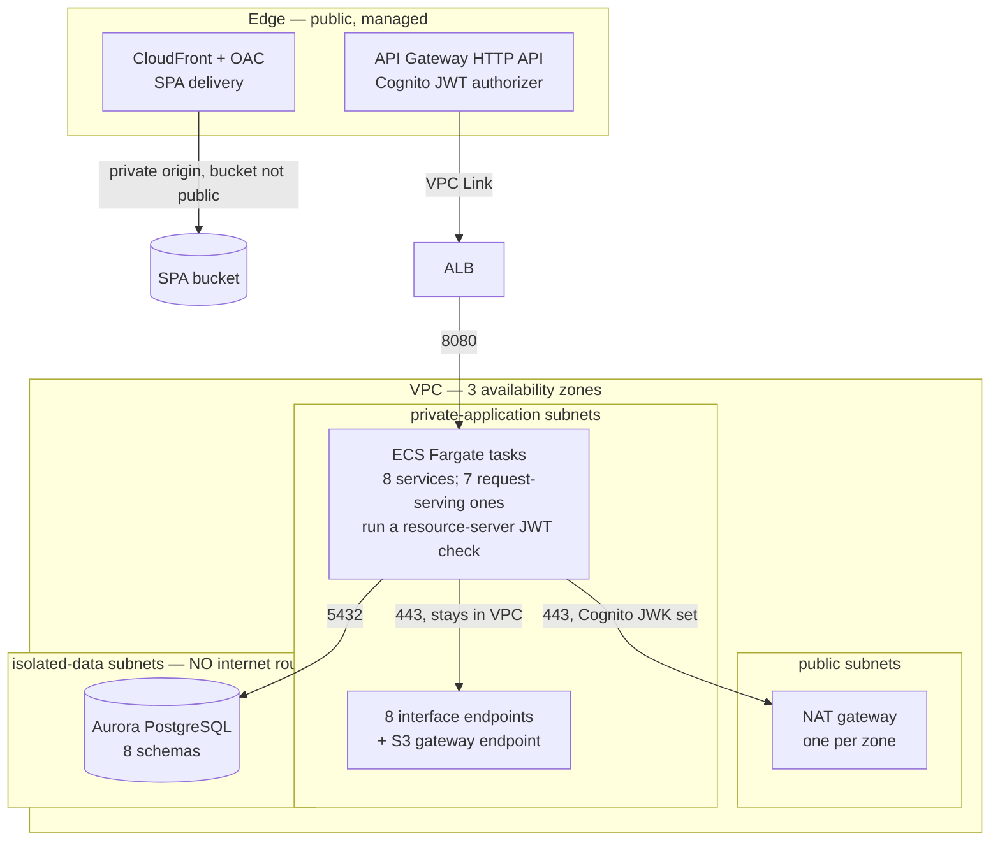

# ADR-008: Networking, Security and Identity

> **Purpose.** Record decision D8 — the network topology the migrated system runs
> in, the identity provider that replaces the VSAM security file, the encryption
> posture, and the least-privilege access model applied to machine identity, human
> identity and the database tier. This record also states the options that were
> weighed, the facts that decided between them, the charge dimensions each option
> carries, and the risks the accepted option takes on. It contains the one place in
> this migration where behavioural parity with the baseline is **explicitly
> declined** rather than preserved, and it labels that place as such. It explains
> the choice; it does not reopen it.
>
> **Source of truth.** Two sources, and no others. The decision of record is the
> Agent Action Plan (AAP) §0.1.2 row D8, which fixes the accepted option, together
> with §0.4.1.9 for the topology and identity design, §0.7.8 for the security and
> identity mapping, and §0.9.1 for the two non-negotiable constraints this record
> discharges. The behavioural specification is the COBOL baseline under `app/**`,
> which is **read-only**: this record cites it by path and line and never edits it.
> Four parts of the baseline carry most of the weight here — the security record
> [`app/cpy/CSUSR01Y.cpy`](../../app/cpy/CSUSR01Y.cpy), the sign-on program
> [`app/cbl/COSGN00C.cbl`](../../app/cbl/COSGN00C.cbl), the shared session
> structure [`app/cpy/COCOM01Y.cpy`](../../app/cpy/COCOM01Y.cpy), and the CICS
> resource definitions [`app/csd/CARDDEMO.CSD`](../../app/csd/CARDDEMO.CSD). Where
> this record and the baseline appear to disagree about a field, a file or a
> paragraph, the baseline is right and this record is wrong.

- **Status:** Accepted
- **Decision:** A **three-availability-zone VPC** with **public**,
  **private-application** and **isolated-data** subnet tiers, in which the data
  tier has no route to the internet; **Amazon Cognito** replacing the `USRSEC`
  sign-on path, with the baseline's two user-type values mapped to two groups;
  **AWS KMS customer-managed keys and AWS Secrets Manager** for encryption and
  credential storage; and **least-privilege IAM task roles**, one per service,
  paired with one database role per service.
- **Scope of this record.** Networking, identity, encryption and least privilege,
  and nothing else. The language and runtime belong to
  [ADR-001](ADR-001-language-and-runtime.md), the compute platform the task roles
  attach to belongs to [ADR-002](ADR-002-compute-platform.md), the store that the
  data tier holds to [ADR-003](ADR-003-datastore-targets.md), queue encryption to
  [ADR-004](ADR-004-messaging.md), the batch execution role to
  [ADR-005](ADR-005-batch-orchestration.md), the API and UI surface the edge
  fronts to [ADR-006](ADR-006-api-and-ui.md), the schema ownership the database
  roles enforce to [ADR-007](ADR-007-service-boundaries.md), and the provisioning
  tool that applies all of it to [ADR-009](ADR-009-iac-tool.md). This record cites
  those decisions where the reasoning touches them and re-decides none of them.
- **Where the exhaustive detail lives.** This is a decision record, not the
  security reference. The subnet-by-subnet address plan, the full endpoint
  inventory, the per-role policy statements and the field-by-field masking table
  are in
  [`docs/architecture/security-and-identity.md`](../architecture/security-and-identity.md);
  the tier diagram in its wider system context is in
  [`docs/architecture/context-and-container-diagrams.md`](../architecture/context-and-container-diagrams.md);
  the register of every documented behavioural divergence, including the declined
  parity recorded here, is in
  [`docs/architecture/cobol-to-service-traceability.md`](../architecture/cobol-to-service-traceability.md);
  the exact deploy and teardown commands are in
  [`docs/runbooks/deploy.md`](../runbooks/deploy.md) and
  [`docs/runbooks/teardown.md`](../runbooks/teardown.md). None of that is
  reproduced here.

## Context

### What the baseline does, counted rather than recalled

The four facts below are properties of the sample application as it stands. Each
was read from the file rather than remembered, and each is stated as a fact
because each one is the input to a decision further down. CardDemo is published by
its maintainers as a deliberately readable teaching sample — the root
[`README.md`](../../README.md) invites contributions "to help build this
application as a resource for programmers wanting to understand and modernize
their mainframes" in its *Contributing* section — and the facts below are recorded
in that spirit: as the starting position a migration reads, not as a scorecard.

| Baseline property | Verified detail | Where |
|---|---|---|
| Credential storage | `05 SEC-USR-PWD PIC X(08).` — eight characters, held as characters | [`app/cpy/CSUSR01Y.cpy`](../../app/cpy/CSUSR01Y.cpy) L21 |
| Credential comparison | `IF SEC-USR-PWD = WS-USER-PWD` — the supplied value compared directly against the stored value | [`app/cbl/COSGN00C.cbl`](../../app/cbl/COSGN00C.cbl) L223 |
| Authority carrier | `CDEMO-USER-TYPE PIC X(01)` with `88 CDEMO-USRTYP-ADMIN VALUE 'A'` and `88 CDEMO-USRTYP-USER VALUE 'U'` | [`app/cpy/COCOM01Y.cpy`](../../app/cpy/COCOM01Y.cpy) L26–L28 |
| File recovery attributes | **8** `DEFINE FILE` stanzas, **all 8** carrying `RECOVERY(NONE)` and **all 8** carrying `JOURNAL(NO)` | [`app/csd/CARDDEMO.CSD`](../../app/csd/CARDDEMO.CSD), 505 lines |

### How sign-on works today

The sign-on program reads the security record and branches on the result. The
paragraph `READ-USER-SEC-FILE.` begins at
[`app/cbl/COSGN00C.cbl`](../../app/cbl/COSGN00C.cbl) L209 and issues an
`EXEC CICS READ` of the `USRSEC` dataset at L211–L219, keyed on the entered
identifier. On a response of zero it compares the credential at L223. When the
comparison succeeds it copies the stored user type into the session structure at
L227, then transfers control with `EXEC CICS XCTL` at L231 — to `COADM01C` at L232
when the administrative condition name is set, and to `COMEN01C` at L237
otherwise. When the comparison fails, or the read returns a not-found or any other
response, it writes one of three sentences and redisplays the screen:
`'Wrong Password. Try again ...'` at L242–L243, `'User not found. Try again ...'`
at L249, and `'Unable to verify the User ...'` at L254.

Two properties of that flow decide this record, and both are mechanical rather
than evaluative.

**The credential is stored in a form that can only be compared, not verified.** A
field declared `PIC X(08)` holds the characters it was given. Any check against it
is a comparison of those characters, which is exactly what L223 performs. This is
the property that makes the target's choice in
[§Identity](#identity-replacing-the-vsam-security-file) a removal rather than a
re-implementation: there is no way to add hashing, rotation or lockout to a field
whose contract is the eight characters themselves without changing the field, and
the field is in `app/**`, which is read-only.

**The authority value travels through client-held storage.** The session structure
at [`app/cpy/COCOM01Y.cpy`](../../app/cpy/COCOM01Y.cpy) L19–L44 is passed on the
`COMMAREA` of every transfer — visible at L233 and L238 of the sign-on program —
and CardDemo is pseudo-conversational, so a task ends at each screen turn and the
structure is returned to the terminal and presented again on the next turn. The
user type at L26 is therefore carried in storage the client holds between turns.
The security-relevant consequence is narrow and specific: whatever the server
wrote, the value the server reads on the next turn is the value it was handed
back. That single property is the whole reason the target's authority claim is
signed, and it is the difference between the mapping in
[§Identity](#identity-replacing-the-vsam-security-file) and a like-for-like port.

### What the baseline leaves for the target to supply

`RECOVERY(NONE)` and `JOURNAL(NO)` on all eight file stanzas mean the sample
carries no recovery or journalling configuration, and VSAM datasets on the sample's
own terms carry no at-rest encryption configuration either. Nothing follows from
that about the platform, which has both available; it follows only that the
migrated system has to specify them itself, because a managed datastore, a bucket,
a secret and a queue each take an explicit key and an explicit backup setting. The
encryption posture in [§Rationale](#rationale) is therefore written as **what the
target adds**, which is the only accurate framing: there is no baseline setting
being replaced.

The external security manager on the mainframe is RACF. It mediates access to
datasets, transactions and programs for the whole system image, and it has no
single counterpart in the target. That is treated as a mapping problem rather than
a porting problem, and
[§RACF](#racf-has-no-cloud-analogue--it-is-mapped-not-ported) states the argument.

Finally, three classes of sensitive value appear in the record layouts as plain
character fields: the card verification value on the card record, and the national
identifier and the government-issued identifier on the customer record. The
target's handling of all three is a mapping-layer concern and is stated in
[§Rationale](#rationale).

## Decision

Adopt the following, together, as one posture. The four parts are listed
separately because they are separately justified, not because they are separately
optional.

1. **Network.** One VPC spanning **three availability zones**, with three subnet
   tiers per zone: **public** subnets carrying only the load balancer and the NAT
   gateways; **private-application** subnets carrying the ECS tasks; and
   **isolated-data** subnets carrying the database, **with no route to the
   internet at all**. Eight interface VPC endpoints and one S3 gateway endpoint
   keep AWS API traffic inside the VPC. **Three** security groups — `alb`, `app`
   and `data` — carry the only permitted flows, and the count is frozen: the
   interface-endpoint ENIs share the `app` group and the API Gateway VPC Link
   shares the `alb` group rather than either holding one of its own. There are
   **six** flows, not three, and the extra three are mandatory rather than
   discretionary: tasks reach S3 through the gateway endpoint (which is also how
   an ECR image pull fetches its layers), tasks fetch the identity provider's key
   set, and tasks reach sibling contexts through the internal listener. See the
   flow table in
   [security-and-identity.md](../architecture/security-and-identity.md) for the
   per-flow ports and destination forms.
2. **Identity.** A **Cognito user pool** with an application client. The
   baseline's `'A'` and `'U'` user types become the groups `carddemo-admin` and
   `carddemo-user`; the `cognito:groups` claim is converted to Spring Security
   authorities. **The password field is not carried forward at all** — the `auth`
   schema's user table keeps only a subject reference.
3. **Encryption and credentials.** **Four** customer-managed KMS keys — one per
   data domain: Aurora, S3, Secrets Manager and SQS — and **Secrets Manager**
   holding every credential, with values generated at provisioning time. The
   field-level envelopes the application produces itself are drawn from the
   **Aurora** key, under a grant conditioned on a declared `carddemo:purpose`,
   because the ciphertext is stored in Aurora columns. Refactoring Rationale: this
   bullet read "four protecting data at rest … plus one the application draws
   envelope data keys from", which is five, and the frozen design allocates exactly
   four (technical specification sections 0.4.1.6 and 0.4.1.9). The fifth key was
   withdrawn and its grant folded into the domain that owns the data rather than
   the count being restated.
4. **Least privilege.** **One IAM task role per service**, and **one database role
   per service**, with the single deliberate cross-schema exception owned by
   [ADR-007](ADR-007-service-boundaries.md).

The shape of the network tiers and the path AWS API traffic takes out of the
application tier are the two things a reader most often gets wrong from prose
alone, so they are drawn once here. The exhaustive inventory stays in
[`docs/architecture/security-and-identity.md`](../architecture/security-and-identity.md).

## Options Considered

Four groups of options were weighed. Each group states what was chosen and what
was rejected, and each rejection gives the concrete consequence that decided it
rather than a preference.

### Network topology

1. **Three availability zones, three tiers, data tier with no internet route —
   CHOSEN.** The data subnets have no NAT association and no internet gateway
   route.
2. **Two tiers, with the database in the private-application subnets — rejected.**
   The application subnets have an egress route, because tasks pull images and
   reach non-AWS endpoints through NAT. Placing the database there gives the
   database's subnet an egress route it never uses, and it collapses two different
   exposures into one: a compromised task in a subnet with an egress route and a
   compromised task in a subnet without are not the same incident, and the
   two-tier shape removes the distinction. Alternatives Considered: this option is
   cheaper by the whole isolated tier's share of route-table and subnet
   management, which is negligible, so cost did not decide it.
3. **Public subnets throughout, with security groups as the only control —
   rejected.** Every control then becomes a policy statement that has to be
   correct. The chosen option keeps one control that is a routing fact instead,
   and [§Rationale](#rationale) states why that distinction is the substance of
   the decision rather than a restatement of it.
4. **A single availability zone — rejected.** It divides the per-zone charges
   named in [§Cost Implications](#cost-implications) — one NAT gateway instead of
   three, and one endpoint ENI per service instead of three — and it forfeits zone
   redundancy for the load balancer, the tasks and the database. Trade-offs: this
   is the one rejected network option with a real cost argument in its favour, and
   it was rejected on availability rather than on security.

### Identity

5. **A managed user pool with group-to-authority mapping — CHOSEN.** Credential
   handling, password policy, rotation and lockout are the provider's; the
   application receives a signed token and reads a claim.
6. **Porting the security record to a database table, credential field included —
   rejected outright.** This option reproduces the comparison at
   [`app/cbl/COSGN00C.cbl`](../../app/cbl/COSGN00C.cbl) L223 in a new place, which
   is the one outcome the decision exists to avoid. The field is **not carried
   forward at all**, and the migration `V1__auth.sql` has no password, hash or
   shadow column of any kind.
7. **Porting the table but hashing the credential in the application — rejected.**
   This is the closest rejected option and it deserves the specific reason. It
   requires the application to own a credential lifecycle: a hash function and
   parameters chosen and kept current, a rotation path, a lockout counter, a
   recovery flow, and a store that must never appear in a log, a trace, a
   backup-restore path or an error payload. Each is a place a defect can hide, and
   none of them is business logic this migration is otherwise obliged to write.
   Alternatives Considered: choosing it would keep credential material inside
   application-owned storage, which is the property the chosen option removes
   rather than protects.
8. **Federating to an external identity provider — not required, and not
   precluded.** A user pool can federate to an external provider, so an operator
   who already has one is not blocked by this decision. That is stated as a
   property of the chosen option, not as planned work: no federation is configured
   here, and none is implied.

### Encryption and credential storage

9. **Managed secret storage, with values generated at provisioning time, plus
   customer-managed keys — CHOSEN.** The generation step is what makes
   [§Zero Secrets](#zero-secrets-in-source-enforced-structurally) structural
   rather than procedural.
10. **Credentials in environment variables or in per-environment parameter files —
    rejected.** This is the option whose failure mode the structural controls
    exist to make impossible: a parameter file is committed by definition, so a
    credential placed in one is a committed credential. Rejecting it is what
    forces the generate-at-apply-time mechanism rather than merely recommending
    care.
11. **Service-managed keys instead of customer-managed keys — rejected.** Service
    keys carry no monthly key charge and need no key policy, which is a genuine
    saving named in [§Cost Implications](#cost-implications). They were rejected
    because they give no per-domain key policy and no independent rotation
    control, so a grant mistake has the whole account's encrypted data in its
    reach rather than one domain's.

### Authorization model

12. **One IAM task role per service, and one database role per service — CHOSEN.**
13. **A single shared task role — rejected.** A shared role holds the union of
    every service's permissions, so every service can reach every queue, every
    secret and every key any service needs. That is the opposite of the ownership
    boundary in [ADR-007](ADR-007-service-boundaries.md), and it would make the
    schema-per-service boundary unenforceable at the tier where it is cheapest to
    enforce.
14. **A single shared database role — rejected for the same reason at the data
    tier.** Per-service roles are what make the one deliberate cross-schema grant
    visible as an exception; with a shared role there would be nothing for it to
    be an exception to.

## Rationale

### Isolation is a routing fact, not a policy statement

This is the anchor of the whole decision and it is worth stating mechanically,
because stated loosely it collapses into a tautology.

A security group rule, a key policy, an IAM policy and a database grant are all
statements that have to be **correct**. Each is authored, each can be authored
wrongly, and a wrong one is permissive in exactly the direction nobody intended. A
route table is different in kind: the isolated-data subnets have **no NAT gateway
association and no internet gateway route**, so there is no next hop toward the
internet for a packet originating there. An attempt to reach an external address
from the data tier does not fail an authorization check — it fails to route.

The practical consequence is what matters. If a key policy is authored too
broadly, or a task's credentials leak, or a security group is opened wider than
intended, none of those mistakes creates an egress path out of the data tier,
because the path does not exist to be authorized. That is the sense in which this
is the strongest control available here, and it is the reason the two-tier and
all-public options in [§Options Considered](#options-considered) were rejected on
mechanism rather than on price. Assumptions: this holds only while the data tier
has no route added to it, so the absence is an invariant of the network module
rather than a default a caller can override — the module exposes no variable that
attaches egress to the data tier.

### AWS API traffic takes the private path wherever an endpoint exists

Application tasks need to pull images, deliver logs, read secrets, perform
envelope operations, use queues, start workflow executions and read configuration.
Every one of those is an AWS API call, and by default each would leave through the
NAT gateways and traverse the public internet to a public service endpoint.

Eight **interface** endpoints are provisioned instead, one set per zone, covering
exactly: the ECR API and the ECR Docker registry for image pulls, CloudWatch Logs
for delivery, Secrets Manager for credentials, KMS for envelope operations, SQS
for messaging, Step Functions for workflow calls, and Systems Manager for
configuration. Object storage uses a **gateway** endpoint instead, which is a
route-table entry rather than an ENI — the distinction matters twice over, because
a gateway endpoint carries no hourly charge (see
[§Cost Implications](#cost-implications)) and because it is why S3 is deliberately
absent from the interface set.

The security consequence is specific and checkable, and it is stated with its
exception rather than without it: with those endpoints in place, **no call to one of
the nine endpointed services needs internet egress**, so the NAT gateways carry only
the traffic that has nowhere else to go. Assumptions: the endpoint set is treated as
identical in every environment and is validated as an exact set rather than a
minimum, so an environment cannot quietly omit one and send that service's traffic
out through NAT instead — a drift that would be invisible in behaviour and visible
only in a flow log.

### Six security-group rules, each with one purpose

* the **security** claim is bounded, not absolute — the accurate statement is that
  task-to-AWS traffic stays inside the VPC *for every service an endpoint covers*,
  and that the two uncovered services carry no customer record data in either
  direction: a token operation carries a credential and a claim set, and a trace
  segment carries timing and identifiers the observability rules already require to
  be non-identifying;
* the **cost** claim in [§Cost Implications](#cost-implications) is bounded the same
  way — NAT data-processing spend is displaced by the endpoints for the nine covered
  services and is *not* eliminated, because these two remain.

Refactoring Rationale: this paragraph previously asserted that no AWS call from a
task needed internet egress at all. That was untrue in both directions at once — the
two services above did need it, and the application group carried no egress rule
permitting it, so the calls would have been dropped rather than routed. Adding the
endpoints for them was considered and rejected: the eight-service set is a frozen AAP
decision, and widening it here would resolve a documentation inconsistency by
editing the specification the documentation describes. Alternatives Considered:
narrowing the sixth rule to the published address ranges of those two services was
also rejected, because those ranges change without notice and a rule that silently
stops matching one of them fails **closed** on sign-on — which is the whole service.

### Six security-group flows, each with one purpose

The permitted flows are narrow enough to enumerate completely, and the table below
is that complete enumeration — ten rule resources expressing six flows:

| Flow | Port | Destination form | Why it exists |
|---|---|---|---|
| Load balancer → application tasks | **8080** | group | The only ingress to a service; the tasks accept traffic from the load balancer's group and from nothing else |
| Application tasks → database | **5432** | group | The only data-tier ingress, and it is sourced from the application group rather than from a CIDR range |
| Application tasks → interface endpoints | **443** | group | Carries almost every AWS API call, which is what keeps that traffic off the public path |
| Application tasks → S3 gateway endpoint | **443** | **prefix list** | Object-storage reads and writes. A gateway endpoint places no network interface and so has no group to reference, so this rule matches the service's managed prefix list instead |
| Isolated data tier → S3 gateway endpoint | **443** | **prefix list** | What makes the data tier's own gateway-endpoint association usable — a snapshot export, for instance — without giving it any internet path |
| Application tasks → Cognito | **443** | **CIDR input** | The JWK set every service fetches while starting, and the user-pool admin API `auth-service` calls. Cognito has no interface endpoint in the specified eight-service set, so this leaves through NAT |

Wherever a group can be named, the rule is written source-group to
destination-group rather than by address range. Alternatives Considered:
CIDR-based rules would be equivalent on the day they are written and would drift
the moment a subnet is resized or re-numbered, because the range and the
membership are then two facts that have to agree.

Assumptions: the last three rules cannot take that form, and the reason differs
between them. The two S3 rules cannot because the destination is a gateway
endpoint with no group to reference; a managed prefix list is the narrowest
destination available and it still resolves to one service. The Cognito rule
cannot because the destination is a public regional endpoint outside the VPC.
Trade-offs: that last rule's destination is therefore an **input** with an open
default rather than a literal, so an environment that has determined its
provider's ranges can narrow it without editing the module. Deriving it from
AWS's published ranges was rejected on a hard limit — the regional ranges run to
hundreds of CIDRs and a security group admits far fewer, so the apply would fail
on quota. What bounds it meanwhile is that it is TLS-only, that it is one rule
carrying its purpose in its description so it is identifiable in a plan diff and
in a flow log, and that it is the only rule in the topology with an open
destination.

### The edge validates, and so does every request-serving service

Public entry is an **API Gateway HTTP API** with a **Cognito JWT authorizer**,
reaching the **internal** load balancer through a **VPC Link**. The load balancer
is internal, so it has no public address of its own. The SPA is served from an S3
bucket behind a **CloudFront distribution using an origin access control**, with
the bucket's public-access blocks set, so the bucket is not publicly readable and
the distribution is the only reader. The API and UI surface itself belongs to
[ADR-006](ADR-006-api-and-ui.md).

The token is then validated **twice**: once by the authorizer at the edge, and
again independently by each of the **seven request-serving services**, each of which
runs as an OAuth2 resource server. The
duplication is deliberate and the reason is concrete rather than stylistic. The
edge is not the only way to reach the load balancer — anything inside the VPC that
can route to it can call a service directly, which includes another service and
anything that later joins the application tier. If validation lived only at the
edge, every one of those callers would be unauthenticated by construction.
Validating in the service means authentication is a property of the service rather
than of the path taken to it. Trade-offs: the same token is parsed and verified
twice on every request, and that cost is accepted because the alternative makes
the service's security depend on a network assumption that the network does not
actually enforce.

**`batch-service` is the eighth service and it validates no token, because it
serves no request.** It carries neither an `oauth2ResourceServer` configuration nor
the `spring-boot-starter-oauth2-resource-server` dependency, and that absence is
correct rather than an omission: it is started as a Fargate task by the Step
Functions state machine ([ADR-005](ADR-005-batch-orchestration.md)), reads its work
from the database and object storage, and exposes no HTTP surface to the load
balancer or to the edge. There is no caller to authenticate, so a resource-server
filter chain would have nothing to filter. Its authority comes from the two
mechanisms that do govern a task rather than a request: the **IAM task role**, which
bounds which AWS APIs it may call, and its **database role**, which bounds which
schemas it may read and write — including the deliberately scoped cross-schema
grant on `ledger` and `account` that keeps transaction posting a single ACID commit
(AAP §0.4.1.3). Adding a resource server to it would add a dependency and a
filter chain that no request would ever reach.

*WHY (Refactoring Rationale).* This section previously said the token is validated
"again independently by **each service**, which runs as an OAuth2 resource server,"
under a heading that read "and so does **every service**." Both were false for
`batch-service`, measured directly: it is the one module of the eight with zero
`oauth2ResourceServer` configuration sites **and** no resource-server dependency in
its POM. The error was not merely a miscount. Left as written, the claim describes
a uniform authentication posture across all eight services, which would lead a
reader auditing the batch path to look for a token check that does not exist and
should not, and to miss the two controls that actually bound that path. Naming the
count as seven and then stating the batch model separately makes the batch tier's
authority auditable on its own terms instead of hiding it inside a generalisation.

### Encryption is what the target adds

The baseline defines its eight file resources with `RECOVERY(NONE)` and
`JOURNAL(NO)`
([`app/csd/CARDDEMO.CSD`](../../app/csd/CARDDEMO.CSD), verified on all eight
stanzas), and its datasets carry no at-rest encryption configuration. There is
therefore no baseline setting for the target to preserve or to change here, and
this section is written as an addition rather than as a comparison:

* the database cluster is encrypted at rest under a customer-managed key, with
  automated backups enabled;
* the dataset bucket, the secrets and the queues are each encrypted under their
  own customer-managed key;
* the card verification value and the two customer identifiers are encrypted at
  the field level, under an envelope grant on the **Aurora** key conditioned on a
  declared `carddemo:purpose`, so they are ciphertext in the table rather than
  plaintext columns that happen to sit in an encrypted volume;
* traffic is encrypted in transit end to end — client to distribution, client to
  API, API to load balancer, load balancer to task, task to database and task to
  endpoint.

Assumptions: the envelope grant is a *second, separate statement* on the Aurora key
rather than a second key, and separateness is what the field-level use needs. The
application asks for envelope data keys under a declared purpose, where a service
uses a key transparently on the application's behalf, so the two grants carry
different conditions: the RDS statement is constrained by `kms:ViaService` to
`rds.<region>` and by the cluster's own identifier, while the envelope statement
carries no `kms:ViaService` at all and is constrained instead by
`kms:EncryptionContext:carddemo:purpose`. That condition is what stops a principal
holding the grant for one purpose from deciphering a value written under another.

Refactoring Rationale: this passage previously described a **fifth**,
application-purposed key and recorded it as "a departure from the four-key sketch
in AAP §0.4.1.6", arguing that the field-level columns AAP §0.4.1.3 requires
"cannot be written under a key whose grants are scoped to a service, so a fifth key
is a consequence of that requirement". The premise was sound and the conclusion did
not follow. A key's grants are not uniformly scoped — a single key policy carries
several statements with different conditions — so the requirement is met by adding a
purpose-conditioned statement to a key whose *other* statement is service-scoped.
The AAP's four-key allocation is frozen and names the four by data domain, and the
Aurora key is the domain whose columns hold this ciphertext, so the fifth key was
withdrawn and the grant folded onto it. The count is now the AAP's rather than a
recorded departure from it.

Trade-offs: the fold costs defence in depth, and the cost is stated rather than
absorbed. One key now protects both the RDS-managed volume encryption and the
field-level envelopes, so a compromise of it reaches both where previously it
reached one. Two things bound that. Neither principal can perform the other's
operation, because the RDS grant is unusable except through RDS and the envelope
grant unusable except under a declared purpose. And each envelope carries an
encryption context naming its purpose and its column as authenticated additional
data, so an envelope moved between the card and customer contexts still fails its
integrity check under one key.

### Exposure is narrowed in exactly one layer

Four rules govern sensitive values on the wire, and all four are enforced in the
mapper layer — the anti-corruption layer that
[ADR-007](ADR-007-service-boundaries.md) establishes as the only place
representation concerns may appear:

1. **Primary account numbers are masked to the last four digits**, except on the
   administrative card-detail endpoint, which is the one caller with a stated need
   for the full value.
2. **Card verification values are never returned by any endpoint.** There is no
   exception, and the assertion has test coverage rather than only a convention
   behind it.
3. **The national identifier and the government-issued identifier are stored
   encrypted and returned masked.** The storage half is authorised as well as
   implemented: `com.carddemo.account.config.CustomerIdentifierProtectionConfig`
   wires `CustomerIdentifierCipher` to draw one envelope data key per identifier,
   and the **account** task role carries an
   `EnvelopeEncryptCustomerIdentifiers` statement granting
   `kms:GenerateDataKey*` and `kms:Decrypt` on the Aurora key, conditioned on
   `carddemo:purpose = customer-identifier`. Refactoring Rationale: this claim
   stood while that grant did **not exist** — the card context had its equivalent
   and the account context had none — so every write of either identifier would
   have been refused by KMS with an AccessDenied on `GenerateDataKey`, surfacing
   as a failed account update rather than as a configuration error. The claim is
   restated to name the authorising path, because a promise of field encryption
   that only describes the cipher and not the grant is exactly the shape that
   defect took.
4. **Money and identifiers cross the wire as strings**, which belongs to
   [ADR-003](ADR-003-datastore-targets.md) and is mentioned only because it is the
   same mapper that applies it.

Alternatives Considered: masking could be applied in each controller, which would
put the rule next to the endpoint that needs it. It was rejected because the
number of places a rule has to be repeated is the number of places it can be
forgotten, and a masking rule that is missing from one response is not visible in
any test that does not specifically look for it. One home for the rule makes the
audit finite.

### Least privilege at both tiers

Machine identity is one IAM task role per service, scoped to the specific queues,
secrets, keys and parameters that service uses. Human identity is the user pool
and its two groups. The data tier adds its own half: **one database role per
service**, holding grants on its own schema.

There is exactly one deliberate exception. The batch role holds narrowly-scoped
cross-schema write grants — for instance `GRANT UPDATE ON account.accounts` — so
that the posting unit of work remains a single ACID commit. That exception is
argued in full in [ADR-007](ADR-007-service-boundaries.md) and is **not
re-argued here**; it is named because a reader auditing the roles will find it and
should be sent to the record that owns it rather than left to conclude it is an
oversight.

## Identity: Replacing the VSAM Security File

### The decision, and the one thing it does not carry forward

Identity moves to a Cognito user pool with an application client. The `auth`
schema's user table keeps the identifier, the name fields, the user type and a
**subject reference** to the pool. It does **not** keep a password column, a hash
column or a shadow column of any kind — the migration that creates it declares
none, and the exclusion is recorded in the migration itself rather than left as an
absence a reader has to notice.

**This is the one place in the migration where behavioural parity is explicitly
declined.** That label is precise and it is worth being precise about, because
every other difference between the baseline and the target falls into one of two
other categories: either behaviour is preserved, or a difference is a documented
divergence registered in
[`docs/architecture/cobol-to-service-traceability.md`](../architecture/cobol-to-service-traceability.md)
with its reason. This one is neither an accident nor a bug fix. It is a deliberate
decision not to reproduce a behaviour that the baseline exhibits, and AAP §0.7.8
frames it the same way. Recording it here is what keeps it from being smuggled in
under the general heading of modernisation.

Refactoring Rationale: the property that decides this is a property of the data
type, not of the program. A field declared `PIC X(08)`
([`app/cpy/CSUSR01Y.cpy`](../../app/cpy/CSUSR01Y.cpy) L21) holds the eight
characters it was given, and the only check available against such a field is the
character comparison at
[`app/cbl/COSGN00C.cbl`](../../app/cbl/COSGN00C.cbl) L223. No amount of
surrounding control changes that: encrypting the volume it sits on, restricting
the file, or auditing every read all leave the stored value recoverable by anything
authorized to read the record, because being readable is what the field is for.
The chosen option therefore **removes the field** rather than protecting it —
Cognito performs the credential check, and the migrated system holds no value to
protect. Alternatives Considered: hashing in the application (option 7 above) was
the closest alternative and would have kept a credential lifecycle inside
application-owned storage; the point of this option is that there is nothing left
to get wrong.

### The authorization mapping is structural

The mapping is a change of carrier, not a change of model. The baseline already
has exactly two authority levels, and the target keeps exactly two:

| Baseline | Target |
|---|---|
| `SEC-USR-TYPE PIC X(01)` on the security record | `user_type CHAR(1)` with `CHECK (user_type IN ('A','U'))`, preserving the domain |
| `88 CDEMO-USRTYP-ADMIN VALUE 'A'` | group `carddemo-admin` |
| `88 CDEMO-USRTYP-USER VALUE 'U'` | group `carddemo-user` |
| `IF CDEMO-USRTYP-ADMIN` gating the transfer at L230–L232 | the `cognito:groups` claim converted to authorities, gating the administrative routes |

The improvement is mechanical and it is the only claim made here: **the group claim
is signed, so it cannot be asserted by the client.** The baseline's carrier is the
session structure at [`app/cpy/COCOM01Y.cpy`](../../app/cpy/COCOM01Y.cpy) L19–L44,
which is returned to the terminal and presented again on the next turn, so the
value the server reads is the value it was handed back. The target's carrier is a
token claim verified against the pool's signing keys, so a client that alters it
produces a token that fails verification. Assumptions: this holds only while the
claim is the sole source of application authority — a service that also accepted a
user type from a request field would reintroduce exactly the property the change
removes, which is why no DTO in the migrated services carries one.

### Sign-on messages, and where this stops short of parity

The user-visible vocabulary is carried across character-for-character. All five
sentences the sign-on program writes are held in the UI message catalogue keyed to
`COSGN00C`, including the three refusal sentences at
[`app/cbl/COSGN00C.cbl`](../../app/cbl/COSGN00C.cbl) L242–L243, L249 and L254.
Declining to carry the password field forward did **not** mean redesigning
sign-on: the screen, the field semantics and the sentences are the baseline's.

One difference in *which* sentence is emitted has to be stated, because claiming
unqualified parity here would be wrong. The pool is provisioned not to disclose
whether an identifier exists, so a refused sign-on returns the credential-refused
sentence rather than distinguishing an absent identifier from a mismatched
credential. `'User not found. Try again ...'` is preserved in the catalogue and is
not emitted on that path. Trade-offs: the baseline's two distinct sentences at L242
and L249 are diagnostically more specific, and that specificity is given up
because the distinction is itself an answer to the question of whether an
identifier exists. The sentence for an unevaluable outcome at L254 is preserved and
emitted. Assumptions: this difference is a documented divergence and belongs in the
traceability register alongside the declined-parity item, not in the reader's
inference.

### Seed users

The pool is provisioned with a seed user set, created by the infrastructure with
**generated** initial passwords written directly to Secrets Manager. No credential
is typed, and none appears in source — which is the mechanism the next section
generalises. Trade-offs: a seeded user set is a provisioning and validation
convenience rather than a user-management strategy; a real deployment would
federate to an existing provider or manage its users through the pool's own
administration, and this record does not claim otherwise.

## RACF Has No Cloud Analogue — It Is Mapped, Not Ported

The mainframe's external security manager is RACF, and it has **no cloud
analogue**. This record does not pretend that it has one.

### What fills its role

Three mechanisms together cover what RACF covered, each for one class of access:

| Class of access | Target mechanism |
|---|---|
| Machine identity, and authorization of AWS API calls | One least-privilege IAM task role per service |
| Human identity, and application-level authorization | The Cognito user pool and its two groups |
| Data-tier authorization | One database role per service, with schema-scoped grants |

### Why this is a mapping rather than a port

The argument is about scope, and it runs in both directions.

RACF is **one** external authority. A single component mediates access to datasets,
transactions and programs across one system image, under one administrative model,
with one audit trail. The target has **several** authorities, each mediating one
class of access, each with its own policy language, its own administrative surface
and its own audit trail. No single target component reproduces RACF's scope, and
RACF has no notion of most of what the target's authorities decide — there is no
RACF concept of a role assumed by a container task to call a queue.

Presenting the substitution as a port would misrepresent both sides: it would
imply the target has one authority when it has three, and it would imply RACF's
model decomposes cleanly into them when the boundaries fall in different places.
Calling it a mapping says the accurate thing — that the *effect* is reproduced by a
different arrangement of parts.

### What is actually being preserved

**The effective-privilege boundary, not the mechanism.** The question this mapping
has to answer is whether the same principal can reach the same data, and it is
deliberately not the question of whether an equivalent construct exists. A review
of this mapping should therefore ask, for each principal in the baseline, which
target principal corresponds to it and what that principal can reach — and should
not expect to find a component-for-component correspondence, because there is not
one to find.

Assumptions: the correspondence is asserted at the level of reachable data, which
means it is only as good as the enumeration behind it; the per-principal detail
lives in
[`docs/architecture/security-and-identity.md`](../architecture/security-and-identity.md)
and that document, not this one, is where the mapping is checked. Trade-offs: three
administrative surfaces replace one, so an operator who previously reasoned about
privilege in a single place now reasons about it in three, and a complete answer to
"what can this principal reach" requires consulting all of them. That is accepted
because the alternative — one shared role spanning every class of access — was
rejected as options 13 and 14 for giving every service every permission.

The mainframe-side security samples under `samples/**` remain reference-only and
out of scope. **The migration adds a path; it does not remove one.** The existing
z/OS and AWS Mainframe Modernization deployment paths remain exactly as they are,
and nothing in this record changes, retires or supersedes them.

## Zero Secrets in Source, Enforced Structurally

"No secrets committed to the repository" is a non-negotiable constraint
(AAP §0.9.1). The point of this section is that it is **structurally true rather
than merely observed** — that is, the repository does not depend on every
contributor remembering it. Six mechanisms carry it, and each is named because each
closes a different way a credential could otherwise arrive.

1. **Credentials are generated at provisioning time — by four different generators,
   which is worth naming because "the provisioning tool" is not one of them in every
   case.** There is no step at which a human sees any of these values, and therefore
   no step at which one could be pasted into a file.

   | Credential | Generated by | Destination |
   |---|---|---|
   | Per-service database role passwords | An ephemeral `random_password` in [`infra/modules/secrets`](../../infra/modules/secrets/main.tf) | Secrets Manager |
   | Aurora **master** user password | **RDS itself**, via `manage_master_user_password = true` ([`aurora-postgresql/main.tf`](../../infra/modules/aurora-postgresql/main.tf)) | An RDS-managed secret, encrypted with the secrets CMK |
   | Cognito seed-user temporary passwords | The **Python `secrets` module** in [`cognito/seed_user_bootstrap.py`](../../infra/modules/cognito/seed_user_bootstrap.py) | Secrets Manager, as a **one-time handover**: set with `Permanent = false`, so the user lands in `FORCE_CHANGE_PASSWORD` and the stored value buys exactly one sign-in before going inert |
   | The five symmetric application keys | An ephemeral `random_password` in each environment root | Secrets Manager |

   *WHY (Refactoring Rationale).* This item previously said database credentials and
   seed-user passwords "are generated by the **provisioning tool**," and
   [ADR-009](ADR-009-iac-tool.md) said "by the **random-value provider**." Both
   attributions are wrong for two of the four classes, and wrong in a way that
   matters for rotation rather than merely for tidiness. The Aurora master password
   is generated and rotated by **RDS**, so it is not in Terraform state at all and is
   not rotated by re-applying; the seed-user passwords are generated by a **Python
   script**, so they are not governed by the random-value provider's arguments
   either. An operator reading the old sentence would look for both in the wrong
   place and could conclude that a `terraform apply` rotates credentials it does not
   touch. Naming each generator alongside its destination makes the rotation owner of
   each credential legible from this record.

   The claim the item actually needs is unaffected and still holds: **no generator
   here takes its value from a repository file, and none writes one back.** That is
   what makes "no secrets committed" structural rather than observed, and it is true
   of all four independently.

   Alternatives Considered: a documented instruction to set each credential by hand
   and keep it out of source. Rejected because it makes correctness depend on every
   future reader following it, whereas generation removes the value from human hands
   entirely.
2. **Per-environment parameter files carry sizing, capacity and retention values
   only.** The `terraform.tfvars` files hold capacity units, task counts,
   retention days and protection flags. They hold no credential of any kind, which
   is a property of the design rather than a convention (AAP §0.4.1.6) — there is
   no variable for a credential to be supplied through.
3. **Deployment authenticates by short-lived federated role assumption.** The
   deploy workflow requests an OIDC token and assumes a deployment role. **No
   long-lived access key exists** in the repository or in the workflow
   configuration; the role reference is a repository variable, which is an
   identifier and not a secret.
4. **The example environment file lists variable names with no values.** A reader
   copying it gets the shape of the configuration and nothing that could be
   mistaken for a working credential.
5. **The ignore file makes state and local environment files uncommittable.** It
   covers `.terraform/`, the state-file pair, `.env` and its variants, alongside
   the build-output entries. Assumptions: the reason state matters here is
   non-obvious and is the substance of this item — **provisioning state can
   contain resolved secret values**, because state records what was created,
   including generated values. Ignoring it is therefore a security control, not
   housekeeping filed alongside `node_modules/`. The state entries are written as
   an explicit pair rather than one trailing-wildcard glob, so that the pattern
   matches the state file and its dot-suffixed backups without also matching an
   unrelated name that merely starts the same way.
6. **No service hard-codes an endpoint.** Every endpoint, queue URL, issuer and
   key reference is a provisioning output read at startup from parameter or secret
   storage. Trade-offs: startup now depends on that storage being reachable, so a
   service cannot start in an environment where it is not — accepted, because the
   alternative is a committed endpoint that is wrong in every environment but one,
   and endpoints are the values most likely to be edited into source under time
   pressure.

Trade-offs: taken together these mechanisms mean an operator cannot simply read a
credential out of the repository to debug with, and has to retrieve it from the
secret store instead. That is the intended consequence rather than a side effect.

## Cost Implications

The guiding principle for this migration is reproduced verbatim:

> "Prefer AWS-managed services over self-managed where it lowers operational
> burden, unless cost or a hard constraint dictates otherwise. When a decision is a
> close call, choose the lower-risk, lower-cost option and note it."

The instance of that principle in this record is **managed identity over a
self-managed user store**, and the same choice is applied twice more — managed key
storage rather than self-operated key material, and managed secret storage rather
than a self-operated credential store.

**This decision is not one of the two close calls.** The two close calls in this
migration are SQS versus Amazon MQ, recorded in
[ADR-004](ADR-004-messaging.md), and Step Functions versus AWS Batch, recorded in
[ADR-005](ADR-005-batch-orchestration.md). Nothing in this record is close: an
isolated data tier and a managed identity provider each dominate their alternatives
on risk, so neither needed the tie-breaker. Saying so explicitly matters because a
security decision is the easiest place to manufacture a third close call and then
resolve it by preference.

No currency figures appear below, and none are estimated. What is stated is the
**charge shape** of each item — the dimension the bill is computed on — which is
what makes the reasoning checkable against a price list at the time of reading
rather than against a number that was stale when it was written.

### The network tier, which is where the real money is

| Item | Charge dimensions | Fixed hourly units | What drives it |
|---|---|---|---|
| NAT gateways | Per **hour per gateway**, plus per **GB processed** | **3** (one per zone) | One gateway per zone × 3 zones multiplies the hourly term threefold |
| Elastic IPs on the NAT gateways | Per **hour per address** | **3** (one per gateway) | Every public NAT gateway carries an address, and all public IPv4 addresses are chargeable |
| Interface VPC endpoints | Per **hour per endpoint per availability zone**, plus per **GB processed** | **24** (8 endpoints × 3 zones) | 8 endpoints × 3 zones sets the hourly term; it dominates the data term at this workload's volume |
| S3 gateway endpoint | **No hourly charge** | **0** | It is a route-table entry, not an ENI — which is precisely why object storage uses this form |

**The interface-endpoint fleet, not the NAT tier, carries the larger fixed hourly
term — and the ratio that decides it is stated so the claim survives a price
change.** The endpoint fleet bills **24** hourly units against the NAT tier's **3**,
so the endpoints are the larger fixed cost unless a single NAT gateway-hour costs
**more than eight times** an endpoint-zone-hour. At `us-east-1` list rates read
while writing this record — `$0.045` per NAT gateway-hour against `$0.01` per
endpoint per zone-hour ([Amazon VPC pricing](https://aws.amazon.com/vpc/pricing/),
[AWS PrivateLink pricing](https://aws.amazon.com/privatelink/pricing/)) — the
actual ratio is **4.5 : 1**, which is below that break-even, so the endpoint fleet
is the larger fixed charge: `24 × $0.01 = $0.24` per hour against
`3 × $0.045 = $0.135` per hour for the gateways plus `3 × $0.005 = $0.015` per hour
for their addresses. The break-even ratio is the durable half of this statement and
the dollar figures are the perishable half, which is why both are given rather than
only the second.

*WHY (Refactoring Rationale).* This passage previously asserted that **"the three
NAT gateways are the single largest fixed cost in the network tier,"** and
commended itself for stating that "plainly rather than buried." The claim was
false at the list rates above, and it was false in the direction that mattered: it
pointed a cost review at the smaller of the two line items. It was also
methodologically inconsistent with this section's own stated approach two
paragraphs earlier — that only **charge shapes** are recorded, so that reasoning
stays "checkable against a price list at the time of reading rather than against a
number that was stale when it was written." A *ranking* of two items is an
arithmetic claim about their rates wearing the clothes of a structural one, so it
inherited exactly the staleness the method was designed to avoid while looking
immune to it. The replacement keeps the method honest by giving the **unit counts**
(structural, and checkable against the module without any price list) and the
**break-even ratio** they imply, then naming a region and a read date for the
rates. The `Fixed hourly units` column and the Elastic IP row were added for the
same reason: the address charge is a real fixed network cost that the table omitted
entirely, and unit counts are what make the ranking derivable rather than asserted.

**One NAT gateway would cost a third of that tier's hourly term, and that trade was
not taken.** The reason is availability rather than security: with one gateway,
egress from the two zones that do not hold it becomes a cross-zone data path, and
the loss of the zone holding it takes egress from all three. Trade-offs: three
hourly gateway charges and three address charges are accepted in exchange for
per-zone egress independence.

**The ten interface endpoints are worth paying for, and the reason is partly
financial.** The security consequence is stated in [§Rationale](#rationale) —
task-to-AWS traffic stays inside the VPC for every service an endpoint covers. The
cost consequence is that this traffic **stops flowing through the NAT gateways**, so
it no longer accrues NAT per-GB processing charges. Part of the endpoint spend
therefore **displaces** NAT data-processing spend rather than adding to it. The
hourly per-endpoint-per-zone term is genuinely additive; the data term largely moves
from one line to another. Presenting the endpoints as pure additional cost would
overstate them, and presenting them as free would understate them.

Assumptions: "largely" is doing real work in that sentence and is not a hedge.
**Cognito and X-Ray have no endpoint in the frozen eight-service set**, so their
traffic continues to cross the NAT gateways and continues to accrue the per-GB
processing term. Token operations are small and infrequent relative to image pulls
and log delivery, so the residue is a small share of what it displaces — but it is
not zero, and a reader modelling this tier as "endpoints eliminate NAT data
processing" would model it wrong. Refactoring Rationale: this paragraph previously
claimed task-to-AWS traffic never takes the public path, which overstated the
displacement by describing an exception-free rule that the endpoint set does not
support.

### Identity, keys and secrets

| Item | Charge dimensions | Assessment |
|---|---|---|
| Cognito user pool | Per **monthly active user** | Negligible here: an internal application with a small population, and a seeded set that is tiny |
| Customer-managed KMS keys | Per **key per month**, plus per **request** | **Four** keys is four monthly charges; the request term tracks use, and the field-level envelope requests — which now resolve the Aurora key — scale with reads of the encrypted columns |
| Secrets Manager | Per **secret per month**, plus per **retrieval** | Retrievals happen at service start, so the request term is small; the per-secret term is the one that matters |

**Identity, compared honestly.** A self-managed user store has **no per-user
charge**, and that is a real advantage of the rejected option. What it carries
instead is the cost of operating, patching and securing the store, and of
implementing password hashing, rotation and lockout correctly — which is engineering
effort and ongoing attention rather than a line on a bill, and is therefore easy to
omit from a cost comparison that only counts invoiced items. The per-monthly-active-user
charge for this application's population is small enough that the comparison is not
close, which is why this is not one of the two close calls.

**Four keys rather than one, with both halves of the argument stated.** One key
would cost one monthly charge instead of four. The security argument for four is
that a key policy is per-key, so a policy mistake reaches exactly the data that key
protects: a mistake on the queue key does not expose the database, and a mistake on
the secrets key does not expose the dataset bucket. Four at-rest keys give one
blast-radius boundary per data domain. Trade-offs: three additional monthly key
charges and four key policies to review instead of one, accepted for per-domain
containment. Both halves belong in this record because a security argument with a
cost consequence is incomplete with either half missing.

**The field-level envelopes share the Aurora key, and that costs defence in depth.**
This paragraph argued for a *fifth* key on the ground that "the field-level columns
need a key whose grants are conditioned on a declared purpose rather than scoped to
a service". The need is real and is still met — the grant on the Aurora key carries
a `kms:EncryptionContext:carddemo:purpose` condition and no `kms:ViaService`
condition — but it did not require a key of its own, and the frozen allocation has
no room for one. Trade-offs, stated rather than glossed: one key now protects both
the RDS-managed volume encryption and the application's field-level envelopes, so a
compromise of it reaches both where previously it reached one. That is a genuine
reduction and is bounded in two ways rather than dismissed. The two uses are
separated by **authorization**, not by key material: the RDS grant cannot be
exercised except through `rds.<region>`, and the envelope grant cannot be exercised
except under a declared purpose, so neither principal can perform the other's
operation. And each envelope carries an encryption context naming its purpose and
its column as authenticated additional data, so an envelope moved between the card
and customer contexts still fails its integrity check under the one key.

### The `dev` and `prod` levers, and what is deliberately not one

Environments differ **only in sizing and retention, never in topology**
(AAP §0.4.1.6). The levers available here are narrow and they are worth listing so
that their limits are visible: **log retention days**, and the
**deletion-protection** and **final-snapshot** flags.

**The security topology is not a place `dev` saves money, and that is deliberate.**
The same three tiers across the same three zones, the same ten interface
endpoints and the same three NAT gateways are deployed to both, so `dev` pays the
full network floor. The reason is validation: a `dev` environment with one zone, or
with the database in the application subnets, or reaching AWS services through NAT
instead of endpoints, would not exercise the topology that `prod` runs. Every
routing and endpoint defect would then first appear in production, which is the one
place the cost of finding it is highest. Alternatives Considered: a boolean
collapsing the gateways to one in `dev` is the standard saving here and was
specifically not offered — the network module exposes no such variable, so the
saving cannot be taken by configuration.

### What the rejected options would have cost

Stating these prevents the reasoning above from reading as though the chosen option
were also the cheapest. It is not, and that is the point.

* **A public data tier** would have cost **nothing extra** and would have removed
  much of the endpoint and NAT spend. It was rejected on blast radius, not on
  price — which is exactly why [§Rationale](#rationale) argues the routing-fact
  mechanism rather than appealing to cost.
* **A single availability zone** would have **divided the per-zone charges** — one
  NAT gateway and one endpoint ENI per service instead of three. It was rejected on
  zone redundancy.
* **Service-managed keys** would have removed **all four monthly key charges** and
  every key policy. Rejected for the per-domain containment argued above.
* **Porting the credential field** would have cost **nothing at all**: no user
  pool, no per-monthly-active-user charge. It was rejected on the risk it carries,
  and it is the clearest case in this record of the guiding principle's "unless
  cost or a hard constraint dictates otherwise" resolving toward the constraint.
* **A single shared task role** would have cost nothing and saved policy-authoring
  effort. Rejected as option 13.

## Trade-offs and Risks

### Trade-offs accepted

* **Three NAT gateways and ten interface endpoints across three zones are the
  price of zone-independent egress and a private AWS API path.** The charge shape
  is in [§Cost Implications](#cost-implications). Accepted: the hourly terms are
  paid so that no zone depends on another for egress and no task needs internet
  egress to call an AWS service.
* **An isolated data tier means no direct operator access to the database.** This
  is the trade-off with the largest day-to-day operational consequence, so it is
  stated rather than glossed. There is no path from an operator's workstation to
  the database, because the subnets have no inbound route and the security group
  admits only the application group on 5432. Access is therefore through the
  application tier, or through a controlled session mechanism into the application
  tier — which means routine tasks such as inspecting a row or running an ad-hoc
  query require a deliberate, auditable step rather than a direct connection.
  Accepted: the same absence of a route that makes casual access inconvenient is
  the control described in [§Rationale](#rationale), and an exception carved for
  operator convenience would be an exception for anything that acquired the same
  credentials.
* **Identical topology in `dev` and `prod` means `dev` pays the network floor.**
  Accepted deliberately, and the network module offers no variable to opt out. A
  `dev` environment with a different network shape would not validate the `prod`
  one.
* **Four customer-managed keys cost four monthly key charges and add key-policy
  surface.** Accepted for per-domain blast-radius containment, with the field-level
  envelope grant folded onto the Aurora key rather than carrying a fifth.
* **Declining password parity is a behavioural change.** It is the only one of its
  kind in this migration, it is labelled as such in
  [§Identity](#identity-replacing-the-vsam-security-file), and it is registered in
  [`docs/architecture/cobol-to-service-traceability.md`](../architecture/cobol-to-service-traceability.md)
  rather than left implicit.
* **The token is verified twice on every request.** Accepted for the reason in
  [§Rationale](#rationale): the alternative makes a service's authentication depend
  on the path a caller took to reach it.

### Risks and their mitigations

* **Token-claim handling diverging between the edge authorizer and the services.**
  Two components validate the same token, so they could disagree — on issuer,
  audience, clock skew or the claim they read authority from. Mitigated by
  validating in both places against the same pool configuration supplied from one
  provisioning output, so neither is configured independently, and by treating the
  group claim as the single authority source everywhere.
* **A masking rule missed at one endpoint.** Mitigated by confining representation
  concerns to the mapper layer, so each rule has one home and the audit is finite
  rather than per-endpoint, and by tests that assert the card verification value is
  never serialised.
* **Key-policy or role-policy misconfiguration.** The residual risk of choosing
  customer-managed keys and per-service roles is that there are more policies to
  author. Mitigated by one key per data domain and one task role per service, which
  bounds what any single wrong policy reaches, and by static policy scanning in the
  infrastructure pipeline. That mitigation is a **static** check on authored
  configuration, and the boundary below states exactly what that does and does not
  establish.
* **The seeded user set is a convenience.** It exists so the stack can be
  provisioned and validated with a working sign-on. Its passwords are generated at
  apply time and stored in Secrets Manager, so it introduces no committed
  credential — but it is not a user-management strategy, and a real deployment
  would federate to an existing provider or manage its users through the pool's own
  administration.

### Assumptions

* The **group claim is the sole source of application authority**. No service
  accepts a user type from a request field; doing so would restore the property
  that [§Identity](#identity-replacing-the-vsam-security-file) removes.
* The user pool's **issuer is reachable from the application tier**, so a service
  can fetch signing keys at startup and refresh them.
* **Masking and field-level encryption happen in the mapper layer**, and no
  representation concern is applied anywhere else.
* The **declined-parity item and the sign-on message difference are both recorded**
  in
  [`docs/architecture/cobol-to-service-traceability.md`](../architecture/cobol-to-service-traceability.md).
* The **isolated tier has no egress route added to it** by any environment, which
  is an invariant of the network module rather than a default.

### Out of scope, with the reason in each case

None of the following is delivered by this decision, and none should be read as
implied by it:

* **Multi-region and disaster-recovery topology** — the design is single-region,
  three-availability-zone only. Zone redundancy is in scope; region redundancy is
  not, and the cross-region replication, failover and data-residency reasoning it
  would require is not present.
* **Blue-green and canary deployment** — rolling ECS service deployment only, so
  there is no traffic-shifting or dual-stack security posture to reason about.
* **Read replicas** — reporting reads reach the writer through read-only
  cross-schema views, so no replica endpoint or replica-lag semantics exist to
  secure.
* **Kafka, Kinesis, Redis and ElastiCache** — none is used, so none appears in the
  network or key design. The messaging requirement is request/reply and is
  satisfied by SQS ([ADR-004](ADR-004-messaging.md)); the baseline has no cache
  tier.
* **A web application firewall, threat detection, formal penetration testing and a
  compliance-control mapping** — **none of these is part of this decision.** No WAF
  is provisioned, no threat-detection service is enabled, no penetration test has
  been performed and no control has been mapped to any compliance framework. This
  is stated explicitly rather than left to inference, because a security record that
  is silent about them invites the reader to assume coverage.
* **SFTP integration and exposing transactions for distributed application
  integration** — these appear on the maintainers' **own published roadmap** in the
  root [`README.md`](../../README.md) under *Roadmap*, alongside the Db2 rewards
  extension and IMS DC. They are the maintainers' stated plans for the sample, and
  they are listed here as such — not as gaps and not as work this migration
  undertakes.

### The honest boundary

The topology, the policies, the key configuration and the identity configuration in
this record are **authored and statically validated**. The infrastructure pipeline
runs `terraform fmt -check`, `terraform validate`, `tflint`, a policy scan and a
documentation-drift check as gating steps, and a real remote-state `terraform plan`
only as a conditional, credentialed job.

**`terraform apply` against a live account is an operator action outside this
scope.** No security control described here has been exercised against a live
provisioned environment: no route table has refused a packet, no key policy has
denied a request, no authorizer has rejected a token and no database grant has
blocked a statement in a running deployment. **There has been no penetration test,
no threat model review and no compliance audit**, and no benchmark of any kind. What
static validation establishes is that the configuration is well-formed, internally
consistent and free of the specific findings the scanners check for. It does not
establish that the resulting environment behaves as described.

## Consequences

* **All seven request-serving services are stateless with respect to identity.**
  Authority arrives as a signed claim on each request, so there is no session store
  and no sticky routing, which is what lets tasks scale horizontally behind the load
  balancer ([ADR-002](ADR-002-compute-platform.md)). `batch-service` holds no
  session state either, but for a different reason — it serves no request, so its
  authority is its task role and its database role rather than a per-request claim.
  *WHY (Assumption made explicit):* the original bullet asserted this of "all eight
  services" and grounded it in a claim arriving "on each request," which cannot hold
  for a service that receives none; separating the two cases keeps the horizontal-
  scaling conclusion attached to the services it actually follows from.
* **The `auth` schema holds no credential.** Anything that needs to authenticate a
  user calls the pool. A future change that adds a password column to that table
  would contradict this record and requires a superseding ADR, not an edit.
* **Every service reads its endpoints and credentials at startup** from parameter
  and secret storage, so a service cannot be run against the wrong environment by
  editing a constant, and cannot be run at all without that storage reachable.
* **Adding a service means adding a task role and a database role.** The
  per-service pattern is the unit of provisioning, and a new service that reuses an
  existing role contradicts options 12–14.
* **Adding an AWS service dependency means adding an interface endpoint.** Omitting
  one no longer falls back to the NAT path: the application group's egress is
  enumerated, so an omitted service is **dropped at the group**. Refactoring
  Rationale: this bullet previously said the call falls back to NAT, which was true
  of an earlier revision carrying a `0.0.0.0/0` egress rule and became false when
  that rule was withdrawn — and the difference matters, because it turns an omission
  from a cost and privacy defect into an outage. The endpoint set is validated as an
  exact set for that reason, and X-Ray and the Cognito identity provider were both
  added to it after exactly this omission was found.
* **Two behavioural differences are registered rather than absorbed:** the declined
  password parity, and the sign-on sentence emitted for a refused credential. Both
  belong in
  [`docs/architecture/cobol-to-service-traceability.md`](../architecture/cobol-to-service-traceability.md).
* **The baseline is unchanged.** No file under `app/**` was modified by this
  decision or by this record; the credential field at
  [`app/cpy/CSUSR01Y.cpy`](../../app/cpy/CSUSR01Y.cpy) L21 and the comparison at
  [`app/cbl/COSGN00C.cbl`](../../app/cbl/COSGN00C.cbl) L223 remain exactly as they
  are. The migrated system does not carry the field forward; the baseline keeps it.
  **The migration adds a path; it does not remove one.**

## References

### Baseline, read-only

| Path | What it establishes here |
|---|---|
| [`app/cpy/CSUSR01Y.cpy`](../../app/cpy/CSUSR01Y.cpy) | L21 `SEC-USR-PWD PIC X(08)`; L22 `SEC-USR-TYPE PIC X(01)` |
| [`app/cbl/COSGN00C.cbl`](../../app/cbl/COSGN00C.cbl) | L209 `READ-USER-SEC-FILE.`; L211–L219 the dataset read; L223 the credential comparison; L227 the user-type copy; L230–L232 the administrative branch to `COADM01C`; L237 the branch to `COMEN01C`; L242–L243, L249 and L254 the three refusal sentences |
| [`app/cpy/COCOM01Y.cpy`](../../app/cpy/COCOM01Y.cpy) | L19–L44 the session structure; L26–L28 `CDEMO-USER-TYPE` with its `'A'` and `'U'` condition names |
| [`app/csd/CARDDEMO.CSD`](../../app/csd/CARDDEMO.CSD) | 505 lines; 8 `DEFINE FILE` stanzas; `RECOVERY(NONE)` and `JOURNAL(NO)` on all 8; the `USRSEC` stanza at L88–L97 |
| [`README.md`](../../README.md) | *Roadmap* — the maintainers' own planned features; *Contributing* — the framing of the repository as a resource for understanding and modernizing mainframes |

### Sibling decisions

| Record | Why it is cited |
|---|---|
| [ADR-001](ADR-001-language-and-runtime.md) | The language and runtime the resource-server validation is written in |
| [ADR-002](ADR-002-compute-platform.md) | The compute platform the task roles attach to, and horizontal scaling |
| [ADR-003](ADR-003-datastore-targets.md) | The datastore the isolated tier holds, and the string-on-the-wire rule the mapper applies |
| [ADR-004](ADR-004-messaging.md) | Queue encryption, and **one of the two close calls** this record is explicitly not |
| [ADR-005](ADR-005-batch-orchestration.md) | The batch execution role, and **the other of the two close calls** |
| [ADR-006](ADR-006-api-and-ui.md) | The API and UI surface the edge fronts |
| [ADR-007](ADR-007-service-boundaries.md) | Schema ownership, the mapper layer, and the one deliberate cross-schema grant |
| [ADR-009](ADR-009-iac-tool.md) | The provisioning tool that generates credentials at apply time |
| [ADR index](README.md) | The full decision set |

### Architecture and operations

| Document | Why it is cited |
|---|---|
| [`docs/architecture/security-and-identity.md`](../architecture/security-and-identity.md) | The exhaustive network, endpoint, role and masking detail this record deliberately does not reproduce |
| [`docs/architecture/context-and-container-diagrams.md`](../architecture/context-and-container-diagrams.md) | The tier diagram in its wider system context |
| [`docs/architecture/cobol-to-service-traceability.md`](../architecture/cobol-to-service-traceability.md) | The register of documented divergences, including the declined password parity |
| [`docs/architecture/observability.md`](../architecture/observability.md) | Where security-relevant logs and alarms are defined |
| [`docs/runbooks/deploy.md`](../runbooks/deploy.md) | The exact deploy commands |
| [`docs/runbooks/teardown.md`](../runbooks/teardown.md) | The exact teardown commands |
| [`docs/CODE_DOCUMENTATION_STANDARD.md`](../CODE_DOCUMENTATION_STANDARD.md) | The documentation convention this record is written to |
