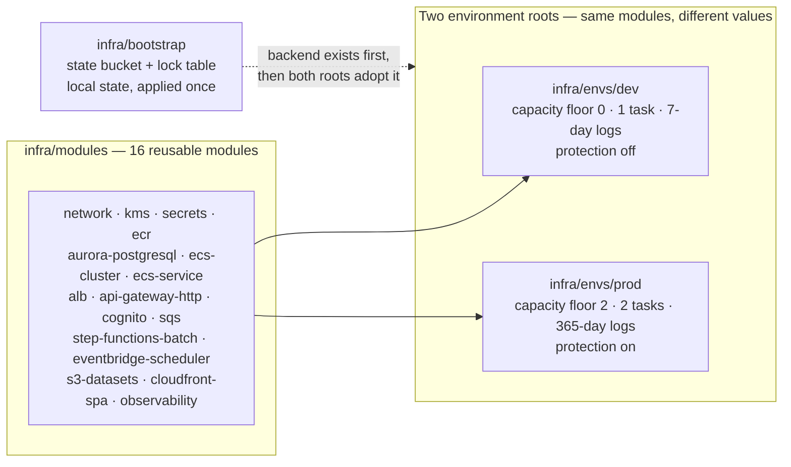

# ADR-009: Infrastructure-as-Code Tool

> **Purpose.** Record decision **D9** — the tool in which the entire target stack
> is expressed as code: how sixteen reusable modules are shared by two
> environments, how the record of what was created is stored and protected, why
> the tool and provider versions are constrained rather than floated, and how the
> teardown half of the acceptance criterion becomes a command an operator can run.
>
> **Source of truth.** AAP §0.1.2 row **D9** fixes the decision; §0.4.1.6 fixes
> the package shape; §0.9.1 makes an ADR per critical decision non-negotiable and
> §0.9.4 lists both the deliverable and the acceptance criterion. The baseline
> under `app/**` is **read-only**: this record cites it by path and line and
> changes nothing in it. Where a figure here differs from a figure elsewhere, the
> file wins — every count below was re-derived from the file it describes.

## Status

**Accepted.** This record does not reopen the decision; a later change that
conflicts with it requires a superseding ADR rather than a silent edit
([ADR index](README.md)).

## Context

### There is no infrastructure as code to displace

The repository contains **no infrastructure-as-code of any kind**, and no
container or build manifest either — AAP §0.1.1.1 records the absence of
`package.json`, `pom.xml`, `build.gradle`, `go.mod`, `Cargo.toml`,
`pyproject.toml` and a root `requirements.txt` anywhere in the tree. The entire
target stack is therefore **net-new**. That matters for the shape of this
decision in one specific way: there is no incumbent tool whose migration cost
would weigh against a change, so the decision is made on the properties the
package needs rather than on the cost of moving away from something.

### What exists instead is imperative deployment tooling, and it is instructive

Provisioning today is expressed as decks a human submits and, in one case,
finishes by hand:

| Read-only baseline artifact | What it provisions |
|---|---|
| [`app/jcl/CBADMCDJ.jcl`](../../app/jcl/CBADMCDJ.jcl) | The resource-definition deployment deck — 167 lines defining a library, mapsets, programs and transactions into one resource group |
| [`app/csd/CARDDEMO.CSD`](../../app/csd/CARDDEMO.CSD) | The installed resource definition itself — 505 lines, 8 `DEFINE FILE`, 18 `DEFINE TRANSACTION`, 18 `DEFINE PROGRAM`, 2 `DEFINE LIBRARY`, 1 `DEFINE TDQUEUE` |
| [`app/scheduler/CardDemo.controlm`](../../app/scheduler/CardDemo.controlm) | One scheduler's folder and job declarations |
| [`app/scheduler/CardDemo.ca7`](../../app/scheduler/CardDemo.ca7) | The other scheduler's job listing |

[What the Baseline Deployment Deck Shows About Idempotence](#what-the-baseline-deployment-deck-shows-about-idempotence)
reads the first of these closely, because it is the clearest evidence in the
repository for *which* properties a declarative model supplies. It is read as
teaching material, which is what [`README.md`](../../README.md) **L400** says the
repository is for.

### The scope the tool has to carry

AAP §0.4.1.6 fixes the package as **sixteen reusable modules, two environment
roots and one bootstrap root**, and the delivered tree matches it exactly:

```text
# WHAT: count the modules, the environment roots, the version-constraint files and
#       the rule-mandated per-directory READMEs in the delivered package.
# WHY : Assumptions: every claim this record makes about the package's shape is a
#       claim about files on disk, so it is stated as a command to re-run rather
#       than a number to be trusted. Expected output: 16, then 2, then 19, then 19.
ls -1d infra/modules/*/ | wc -l
ls -1d infra/envs/*/ | wc -l
find infra -name versions.tf | wc -l
ls infra/modules/*/README.md infra/envs/*/README.md infra/bootstrap/README.md | wc -l
```

The nineteen version-constraint files are the sixteen modules plus the two
environment roots plus the bootstrap — that is, **every** root and **every**
module states its own constraints, with no directory inheriting them implicitly.

### The acceptance criterion is two-sided

AAP §0.9.4 lists it verbatim: *"`terraform apply` (or CFN deploy) provisions the
full stack cleanly, and `destroy` tears it down cleanly"*. Both halves count. A
tool that provisions well but leaves residue behind on teardown satisfies half a
criterion, and the half it fails is the one that costs money for as long as the
residue exists.

### The environments must not fork

AAP §0.4.1.6 requires that `dev` and `prod` differ in sizing and retention and
**never in topology**. That is a requirement on the tool as much as on the code:
it has to let one definition serve two environments without either of them
becoming a separate description of a separate system.

### The documentation obligation lands on this tool too

Rule 1 (*Explainability*) requires a docstring per unit of code, and HCL has no
docstring construct. AAP §0.8.1 resolves that by imposing the analogous
obligation — a file-header comment block per `.tf` file, a `description` on every
`variable` and `output`, a why-comment on each non-obvious argument, and a
`README.md` in **each of the sixteen modules and both environment roots** — with
lint and documentation-generation configuration supplying the mechanical half.
This is not incidental to the tool choice: the artifacts that discharge it are
named in AAP §0.8.1 as **rule-mandated files**, so the tool's surrounding
tooling is part of what is being decided. See
[Rationale item 7](#7-the-surrounding-tooling-is-what-makes-the-rule-1-hcl-analogue-checkable).

### The question this record answers

Given a net-new stack of sixteen modules with no algorithmic content, two
environments that must stay topologically identical, a two-sided acceptance
criterion naming a command, a hard constraint that no secret reaches the
repository, and a documentation rule with no native construct in the target
language — **in what should the infrastructure be written, and what does that
choice oblige?**

## Decision

**Terraform**, with every root and module constraining both the CLI and its
providers.

| Element | Constraint | Where it appears |
|---|---|---|
| Terraform CLI, in the three roots | `~> 1.15.0` | `infra/bootstrap`, `infra/envs/dev`, `infra/envs/prod` |
| Terraform CLI, in the sixteen modules | `>= 1.15.0` | every `infra/modules/*/versions.tf` |
| AWS provider | `~> 6.56` | all nineteen `versions.tf` files |
| Random-value provider | `~> 3.9` | where credentials are generated at apply time |

The two CLI constraint forms are deliberate and are the kind of choice Rule 1's
third forbidden pattern requires be explained where it is made. **Assumptions:**
Terraform intersects every `required_version` constraint it encounters across a
configuration and its modules. A module is a *consumed* artifact, so pinning it
to one minor series would let any module veto the CLI the root has chosen, and
sixteen modules would then have to be edited in lockstep with every CLI bump; an
open floor keeps each module consumable. A **root** is where a version is
actually selected, so the roots carry the pessimistic form and the reviewed
series lives in exactly three files. **Trade-offs:** the floor in a module admits
a CLI newer than any yet exercised against it — accepted, because the roots
constrain what is really run and the modules are never applied on their own.

Provider selection is additionally recorded in nineteen committed
`.terraform.lock.hcl` files, so a provider change is a reviewable diff of
recorded checksums rather than a silent resolution at init time.



## Options Considered

Seven options were weighed. This section discharges Rule 1's **Alternatives
Considered** category for the decision as a whole, and each rejected option is
given the strengths it actually has.

### Option 1 — Terraform — ACCEPTED

Sixteen modules with typed inputs consumed by two roots from one source; `plan`
as a reviewable artifact over a whole environment; `destroy` as one command
against a root; and a lint and documentation-generation ecosystem that lets the
Rule 1 HCL analogue be machine-checked rather than asserted.

### Option 2 — The AWS-native template service — considered, not chosen

Its strengths are real and are the reason it was a genuine candidate rather than a
straw man. **There is no state file to own** — the service keeps the record, so
the whole of
[State, Environments and the Teardown Criterion](#state-environments-and-the-teardown-criterion)
would simply not exist as a concern. **Drift detection is built in** rather than
inferred from a subsequent plan. **Change sets** give a review artifact before a
change is applied. **Stack deletion** answers the teardown half of the criterion
directly. It is also the AWS-managed option, which the guiding principle
generally favours.

It was not chosen for three specific reasons, none of them a defect in the
service:

1. **Reuse across two environments is expressed differently.** Sharing a
   definition means nested stacks or exported values rather than a module with
   typed, described inputs. The requirement here is the narrow one that `dev` and
   `prod` stay topologically identical while differing in sizing, and a module
   with a typed input list is the more direct way to hold that — the input list
   *is* the enumeration of what may differ.
2. **The review artifact is scoped differently.** A change set describes a change
   to one stack. The review this package needs is over a whole environment root at
   once, including which resources would be **replaced** rather than updated.
3. **The documentation tooling is what discharges a rule here.** The mechanical
   half of the Rule 1 HCL analogue is a linter and a documentation generator wired
   into the pipeline (AAP §0.8.1). That tooling is well established around HCL,
   and it is the reason the obligation is checkable in CI rather than left to
   review.

### Option 3 — A general-purpose programming-language framework — rejected

It would place a compiler, a package manager and a transitive dependency tree on
the review path, and the artifact that reaches the account is synthesised rather
than the code that was read. For sixteen modules of declarative resources with no
algorithmic content, the expressive power has little to buy: there are no loops
worth writing and no abstractions the module system cannot already express.

### Option 4 — Configuration-management tooling — rejected

It is built to converge the state of long-lived machines, and this stack has none
to converge — the compute is serverless container tasks
([ADR-002](ADR-002-compute-platform.md)) and the database is a managed service
([ADR-003](ADR-003-datastore-targets.md)). There is no host to log into, so the
capability that makes the category valuable has nothing here to act on.

### Option 5 — Shell scripts over the AWS command-line tool — rejected

No record of what was created, so no diff before a change and no way to ask what
exists; no dependency graph, so ordering becomes the author's responsibility; and
teardown becomes a second script maintained as the inverse of the first, which is
the artifact most likely to be out of date precisely when it is needed. What this
looks like at scale in a real, working deck is
[the next section](#what-the-baseline-deployment-deck-shows-about-idempotence).

### Option 6 — Console-driven provisioning — rejected

It cannot satisfy an acceptance criterion phrased as a command, and it produces no
artifact to review before a change or to diff after one.

### Option 7 — A multi-cloud abstraction layer — out of scope, not delivered

AWS is the stated target (AAP §0.9.1). An abstraction whose purpose is
portability to a second provider would add a layer of indirection between the
author and the resource in exchange for a property nobody asked for.

### The seven options side by side

| Option | Reuse across two environments | Review artifact | Teardown | Record of what exists | Verdict |
|---|---|---|---|---|---|
| Terraform | Module with typed inputs | Plan diff over a whole root | One command per root | State file, owned by the project | **ACCEPTED** |
| AWS-native templates | Nested stacks or exports | Change set per stack | Stack deletion | Held by the service | Considered |
| Language framework | Language-level abstraction | Synthesised template | One command per stack | Held by the service | Rejected |
| Configuration management | Roles | None before the run | Hand-written inverse | Convergence, not a record | Rejected |
| Shell over the CLI | Copy and edit | None | Hand-written inverse | None | Rejected |
| Console | Repeat by hand | None | By hand | None | Rejected |
| Multi-cloud abstraction | Provider-neutral module | Tool-dependent | One command | Tool-dependent | Out of scope |

## Rationale

Each item below is a mechanism with a consequence, not a preference.

### 1. One source of definitions is what makes "identical topology" structural

Sixteen modules are consumed by two roots, and the roots supply **variable values,
not resource declarations**. The consequence is directional and worth stating
plainly: a change to a module reaches both environments, so the two cannot drift
apart through ordinary maintenance. What may differ is bounded by the variable
list, which is checkable:

```text
# WHAT: compare the variable NAMES set in each environment's parameter file.
# WHY : Assumptions: "the environments differ only in values" is only true if both
#       roots set the SAME variables, so the claim is stated as a diff rather than
#       as an assurance. Expected output: no differences.
diff <(grep -oE '^[a-z_]+' infra/envs/dev/terraform.tfvars   | sort) \
     <(grep -oE '^[a-z_]+' infra/envs/prod/terraform.tfvars  | sort)
```

### 2. `plan` is a whole-environment review artifact

The infrastructure pipeline runs a formatting check without mutation, initialises
and validates **every** root with no backend, runs the HCL linter as the Rule 1
gate, checks documentation drift across all modules and roots, verifies the
hand-written prose counts, scans for committed secrets, and runs a
material-security policy gate
([`.github/workflows/infra-ci.yml`](../../.github/workflows/infra-ci.yml)). A
reviewer therefore sees a resource-level diff — including which resources would be
**replaced** rather than updated — before anything is applied.

**Assumptions,** stated because the distinction is easy to overstate: a plan that
reaches a real backend needs credentials, so that job is opt-in and
operator-triggered rather than running on every push. The always-on gates are the
ones that need no account.

### 3. `destroy` answers the teardown half as one command

Teardown is a single command against an environment root rather than a
hand-maintained reverse sequence. Two values are parameterised precisely so this
works without a human in the loop where that is wanted: `deletion_protection` and
`skip_final_snapshot` are variables, set to `false`/`true` in `dev` and
`true`/`false` in `prod`. **Trade-offs:** `prod` therefore does **not** tear down
without a deliberate change to those values — that is the intent, not an
oversight, and it is why they are inputs rather than constants.

### 4. The provider constraint has a floor for a reason

`~> 6.56` is not a preference. A **zero** minimum database capacity requires a
provider release at or after **5.81.0**, and `dev` sets exactly that floor
(`aurora_min_capacity = 0`, with `aurora_seconds_until_auto_pause = 300` because a
zero floor makes the auto-pause setting mandatory). The constraint clears the
required floor with room. The capacity semantics themselves belong to
[ADR-003](ADR-003-datastore-targets.md), which delegates the pin here explicitly;
this record owns the pin and not the capacity model.

**Assumptions:** a provider below that floor does not warn — it fails at apply
time, and it reports against the capacity argument rather than the provider
version, so the cause of the failure is one step removed from its symptom. That is
the whole reason the floor is written down rather than left to whatever resolves.

### 5. Idempotence is a property of the model, not of discipline

The tool reconciles declared state against recorded and actual state, so running
the same configuration twice is defined behaviour rather than a second creation
attempt. Nothing has to be edited between runs, and nothing has to be remembered.
[The next section](#what-the-baseline-deployment-deck-shows-about-idempotence)
sets that against a deck that documents the opposite requirement in its own
comments.

### 6. Credentials are generated at apply time, so no secret has a path into source

Database and seed-user credentials are generated by the random-value provider and
written straight to the secret store; the per-environment parameter files carry
capacity, sizing, retention and protection values only. There is no variable
through which a credential could be supplied, which is what makes "no secrets
committed" structural rather than observed. The full mechanism set belongs to
[ADR-008](ADR-008-security-and-identity.md) and is not re-argued here.

### 7. The surrounding tooling is what makes the Rule 1 HCL analogue checkable

HCL has no docstring, so the obligation is discharged by file-header blocks, a
`description` on every variable and output, why-comments on non-obvious arguments,
and a `README.md` in each of the sixteen modules and both environment roots — with
[`infra/.tflint.hcl`](../../infra/.tflint.hcl) and
[`infra/.terraform-docs.yml`](../../infra/.terraform-docs.yml) supplying the
mechanical half and the pipeline running both as required steps. **Alternatives
Considered:** leaving the analogue to review alone. Rejected because AAP §0.8.1
classes these files as rule-mandated, and a documentation rule enforced only by
review is satisfied unevenly by construction — the point of naming a linter is
that it decides the same way every time.

## What the Baseline Deployment Deck Shows About Idempotence

**How to read this section.** What follows is a factual inventory of one
read-only file, offered because the decision turns on which properties a
declarative model supplies and this deck is where those properties are visibly
absent by design. It is **not** a criticism of the deck, its authors or the
mainframe path. The deck is a demonstration artifact in a repository whose stated
purpose is to be *"a resource for programmers wanting to understand and modernize
their mainframes"* ([`README.md`](../../README.md) **L400**), so reading it
closely is the use it invites. Every figure is a count a reader can re-run, and
**this record proposes no change to it whatsoever** — the deck, like the whole of
`app/**`, is read-only, and the z/OS and AWS Mainframe Modernization deployment
paths it belongs to stay exactly as they are.

```text
# WHAT: re-derive every count this section states, from the two read-only decks.
# WHY : Assumptions: these numbers ARE the evidence, so they are stated as commands
#       to re-run rather than as figures to be trusted. Expected output: 167, then
#       20 then 15, then 19 then 15, then 5, then 0 (no STATUS clause anywhere).
wc -l < app/jcl/CBADMCDJ.jcl
grep -c 'DEFINE MAPSET' app/jcl/CBADMCDJ.jcl
grep -o 'DEFINE MAPSET([A-Z0-9]*)' app/jcl/CBADMCDJ.jcl | sort -u | wc -l
grep -c 'DEFINE PROGRAM' app/jcl/CBADMCDJ.jcl
grep -o 'DEFINE PROGRAM([A-Z0-9]*)' app/jcl/CBADMCDJ.jcl | sort -u | wc -l
grep -c 'DEFINE TRANSACTION' app/jcl/CBADMCDJ.jcl
grep -c 'STATUS' app/jcl/CBADMCDJ.jcl
```

### It states its own non-idempotence, in a comment

[`app/jcl/CBADMCDJ.jcl`](../../app/jcl/CBADMCDJ.jcl) **L38** carries
`IF YOU ARE RERUNNING THIS, UNCOMMENT THE DELETE COMMAND.`, sitting directly above
a commented-out `DELETE GROUP(CARDDEMO)` at **L42**. **This is the single clearest
contrast the repository offers.** Re-running the deck requires a human to edit it
first, and the edit is one a reader has to know to make; a declarative model
reconciles what is declared against what exists, so a second run is defined
behaviour and no file changes between the two.

### It defines resources; a separate manual step realises them

**L37** carries `NOTE: INSTALL GROUP(CARDDEMO) - CEDA IN G(CARDDEMO)`, deferring
installation to an interactive step after the deck completes. Definition and
realisation are two acts with a person between them. Under the accepted option
they are one reconciliation: `apply` both records the intent and makes it real, and
the exit status covers both.

### It parameterises by symbol substitution — and that deserves credit

`SET HLQ=AWS.M2.CARDDEMO` at **L25** is consumed as `DSNAME01(&HLQ..LOADLIB)` at
**L45**, with the step running under `PARM='CSD(READWRITE),PAGESIZE(60),NOCOMPAT'`
at **L28**. This is a real parameterisation mechanism doing real work: the
qualifier is stated once and referenced, which is exactly the instinct that
per-environment variables formalise. (Those dataset names are published repository
content, not credentials, which is why they are quoted here while account
identifiers and endpoints elsewhere in this record are placeholders.)

What typed module inputs add on top is narrow and specific: a declared **type**, a
declared **description**, and validation at plan time rather than at run time. A
symbol is a string until the moment it is substituted; a typed input with a
description is checkable before anything runs, and the description is what
discharges the Rule 1 obligation for it.

### A duplicate definition is present, and a plan step is what catches that class of thing

`DEFINE MAPSET(COSGN00M)` appears at **L50** and again at **L53**, with the same
name and the same `DESCRIPTION(LOGIN SCREEN)`. In a declarative model two
declarations of one address are a **validation error reported before anything
runs**, because addresses are required to be unique.

### Named resources and available sources have moved apart over time

The deck names **15 distinct programs** across 19 `DEFINE PROGRAM` stanzas.
**Ten of those fifteen have no source file anywhere under `app/`:**

| Named in the deck | Source present under `app/`? |
|---|---|
| `COSGN00C`, `COACTVWC`, `COACTUPC`, `COTRN00C`, `COBIL00C` | Yes — 5 of 15 |
| `COACT00C`, `COACTDEC`, `COTRNVWC`, `COTRNVDC`, `COTRNATC`, `COADM00C` (**L130**), `COTSTP1C`–`COTSTP4C` (**L134**, **L137**, **L140**, **L143**) | No — 10 of 15 |

The same holds for presentation and transaction resources. The deck's **20**
`DEFINE MAPSET` stanzas name **15 distinct mapsets**, and **none of the fifteen**
matches any of the 17 mapsets in `app/bms`. Its five transactions — `CCDM` at
**L147** and `CCT1`–`CCT4` at **L150**, **L152**, **L154** and **L156** — have
**zero overlap** with the 18 `DEFINE TRANSACTION` names in the installed
definition. And the deck defines `DEFINE LIBRARY(COM2DOLL)` at **L44** with **no
`STATUS` clause at all** — the deck contains none anywhere — while the installed
definition records that same library as `STATUS(DISABLED)`
([`app/csd/CARDDEMO.CSD`](../../app/csd/CARDDEMO.CSD) **L494–L495**).

**Refactoring Rationale.** What this demonstrates is a property of **the
imperative-deployment-script approach as a class**, and the object of that
sentence is deliberately the approach and not this file: when the script that
deploys resources is maintained separately, by hand, from the resources it
deploys, the two are free to move independently, and nothing in the mechanism
notices. This is the expected outcome of that arrangement rather than a failure
within it. The generalisable points are the two properties the accepted option
supplies:

* **A plan step turns a reference to something absent into a planning error.**
  The names above are the kind of thing a plan surfaces before an apply — *this is
  what a plan step is for.*
* **A state file makes what is actually deployed answerable.** The question "which
  of these definitions is live right now?" has a recorded answer instead of
  requiring an inspection of the running system.

### The deck already has the instinct behind `plan`

**L159** is `LIST GROUP(CARDDEMO)` — the deck's own inspection step, and the
closest thing it has to a plan. The intent is present and should be credited as
such. The difference is one of ordering and of comparison basis: a plan is produced
**before** changes are made and is diffed against a recorded prior state, whereas a
listing reports what is there after the fact.

### The two scheduler decks show the same shape in another domain

**Alternatives Considered:** porting the scheduler decks as they stand.
[`app/scheduler/CardDemo.controlm`](../../app/scheduler/CardDemo.controlm) (92
lines) declares **five folder-scope containers** in two element types — three
`<FOLDER>` at **L3**, **L26** and **L64**, and two `<SMART_FOLDER>` at **L32** and
**L57** — with one folder name carried by two of them
(`WEEKLY-TransactionTypesDBRefresh`, on the container at **L26** and again at
**L57**). Inside are **15 `<JOB>` elements**, and the deck holds **17 `JOBNAME`
attributes** because the two `<SMART_FOLDER>` elements carry one each of their own.
[`app/scheduler/CardDemo.ca7`](../../app/scheduler/CardDemo.ca7) (570 lines) holds
**30 `1LJOB,JOB=` stanza headers** over **17 distinct job names**, chained by **27**
`TRIGGERED JOBS` declarations. `TRANREPT` appears in **neither** deck, while
`POSTTRAN` appears in the CA-7 deck **only** (triggered at **L70**, its own stanza
at **L72**).

Ordering in both is expressed through **string-keyed conditions posted into a
shared pool** — `<INCOND>`/`<OUTCOND>` names in one, `TRIGGERED JOBS` entries in
the other — rather than as a declared graph. Kept narrow, the point relevant *here*
is only this: **a declared dependency is validated when it is deployed, and a
string-keyed convention is not** — a mistyped condition name is a job that silently
never becomes eligible. The orchestration decision itself, including the full
inventory and why the decks are carried as intent rather than as syntax, belongs to
[ADR-005](ADR-005-batch-orchestration.md) and is not re-argued here.

## State, Environments and the Teardown Criterion

### State is the price of the model, and it is named as a cost rather than hidden

The tool needs a record of what it created, and that record is an asset the project
now owns and has to protect. It is not a by-product. The backend is a **versioned,
encrypted object-storage bucket plus a lock table**, provisioned by
`infra/bootstrap`.

* **Versioning** gives the record a history, so a corrupted or truncated state has
  a prior version to recover from.
* **Encryption** matters for a reason that is not housekeeping: **provisioning
  state can contain resolved secret values**, because it records what was created
  and generated credentials are among the things created. That is also why the
  ignore file makes the state file uncommittable — `.terraform/` at
  [`.gitignore`](../../.gitignore) **L186** and the explicit pair `*.tfstate`
  (**L201**) and `*.tfstate.*` (**L202**). **Assumptions:** the pair is written as
  two rules rather than one `*.tfstate*` glob deliberately, because a single
  trailing wildcard would also match an unrelated name that merely begins the same
  way. Treating the state file as a security artifact rather than as build output
  follows directly from what it can contain; the wider mechanism set is
  [ADR-008](ADR-008-security-and-identity.md).
* **Locking** buys one specific thing: two engineers, or an engineer and a
  pipeline, cannot apply against one environment concurrently and interleave their
  writes into the record.

### The bootstrap is a genuine ordering constraint

**The backend cannot store the record of its own creation.** `infra/bootstrap` is
therefore applied **once, with local state, before either environment root**, and
the backend it creates is then adopted by both. This is an operational fact a
reader would not infer from the tree — the bootstrap directory looks like a third
environment — and leaving it undocumented is precisely Rule 1's third forbidden
pattern. It is also why the bootstrap is the one root whose `backend.tf` is absent
while both environment roots have one.

### Two roots, the same modules, an enumerated set of differences

Each environment root has its own backend configuration, variables and parameter
file, and both consume the same sixteen modules. The verified differences between
the two parameter files are these and no others:

| Lever | `dev` | `prod` | Cross-reference |
|---|---|---|---|
| Database capacity floor / ceiling | `0` / `4` | `2` / `32` | [ADR-003](ADR-003-datastore-targets.md) |
| Auto-pause delay (seconds) | `300` | `300` — identical | [ADR-003](ADR-003-datastore-targets.md) |
| Backup retention (days) | `1` | `35` | [ADR-003](ADR-003-datastore-targets.md) |
| Task CPU / memory | `512` / `1024` | `1024` / `2048` | [ADR-002](ADR-002-compute-platform.md) |
| Desired task count | `1` | `2` | [ADR-002](ADR-002-compute-platform.md) |
| Log retention (days) | `7` | `365` | — |
| Content-delivery price class | `PriceClass_100` | `PriceClass_All` | [ADR-006](ADR-006-api-and-ui.md) |
| Deletion protection / skip-final-snapshot | `false` / `true` | `true` / `false` | This record |
| Secret recovery window (days) | `0` | `30` | [ADR-008](ADR-008-security-and-identity.md) |
| Network address range | `10.0.0.0/16` | `10.1.0.0/16` | [ADR-008](ADR-008-security-and-identity.md) |

**Assumptions,** and this is a precision that matters: the address range differs
too, so the accurate claim is that the **resource graph** is identical — the same
modules, the same subnet tiers, the same availability-zone count, the same
relationships — while the values that differ are addressing plus sizing, retention
and protection. Stating "only sizing and retention differ" without that
qualification would be a claim the parameter files do not support.

**No secret value appears in any parameter file.** There is no variable for one to
be supplied through, which is what makes the property structural rather than
observed ([ADR-008](ADR-008-security-and-identity.md)).

### The teardown criterion, stated exactly as far as it goes

`destroy` against an environment root removes what that root created, and the
protection values above are parameterised precisely so `dev` tears down without
manual intervention while `prod` keeps its guards. Two boundaries a reader should
carry away, neither of them softened:

* **The bootstrap backend is deliberately not destroyed by an environment
  teardown.** It holds the state that makes teardown possible, so it outlives the
  environments and is removed last and separately, if at all.
* **Retained artifacts are governed by the flags, not by the command.** With
  `skip_final_snapshot = false` a final snapshot is deliberately left behind, and
  log groups persist for their retention period. That residue is intended, and it
  is intended in `prod` specifically.

**Trade-offs:** the acceptance criterion is therefore *expressible and verifiable
by an operator* through the documented commands, which is a different and weaker
claim than an observed outcome — see
[Honest boundary](#honest-boundary--what-this-record-does-not-establish). The exact
commands are in [`docs/runbooks/teardown.md`](../runbooks/teardown.md) and
[`docs/runbooks/deploy.md`](../runbooks/deploy.md) and are deliberately not
duplicated here, so there is one place to correct them.

## Cost Implications

### The licence cost is zero on both sides of the comparison, which is where the analysis starts rather than ends

Neither the accepted tool nor the AWS-native alternative carries a licence charge.
Treating that as the answer would be the easiest way to write a hollow section, so
what follows is the cost shape the choice actually determines: one small recurring
charge it introduces, and three larger charges it gives the project control over.

### The state backend is the only resource the tool itself requires

A versioned, encrypted bucket and a lock table. Both are charged on **storage per
GB-month** and **per request**; state files are small and locks are taken
per-operation, which makes this **the smallest recurring cost in the whole stack**
by a wide margin. It is provisioned **once by a bootstrap shared by both
environments** rather than per environment, so the charge does not scale with the
number of environments. Versioning multiplies stored bytes by the number of
retained versions, which on an object this size is not a material quantity.

### `destroy` is a cost control, and this is the strongest cost argument in the record

A stack that can be torn down **completely and reliably** is a stack that does not
have to run continuously. That converts the `dev` environment from a standing
charge into a charge incurred only while it is in use — and every per-hour and
per-GB-month dimension in the stack is inside that scope: the database's capacity
units and storage, the load balancer's hourly charge, the address-translation
gateways, the container tasks, the log retention. **The ability to destroy is
therefore a cost control and not merely a convenience**, and the mechanism that
makes it usable is the one in
[Rationale item 3](#3-destroy-answers-the-teardown-half-as-one-command): the
protection flags are inputs, so `dev` tears down without a human deciding anything.

### `plan` avoids cost before it is incurred, by a specific mechanism

The mechanism is the **replacement** marker in a diff. A change that would replace
a database cluster rather than update it in place, or that would add a per-hour
resource such as another load balancer or address-translation gateway, appears in
the plan as exactly that — before an apply. The cost avoided is the one that would
otherwise be discovered on a bill, and the reason it is avoidable at all is that
the review artifact covers a whole environment root rather than one resource at a
time.

### Module reuse lets `dev` be cheap without becoming a different system

Because the sizing difference is expressed as **parameter values against shared
modules**, `dev` can run at a capacity floor of zero, one task per service, seven-day
log retention and the narrowest content-delivery price class while remaining
topologically the same system as `prod`. The alternative — two divergent
definitions — makes a cheap `dev` cheap *and* unrepresentative, so tests pass
against something that is not what `prod` is. The lever list is fixed and is the
table in
[Two roots, the same modules](#two-roots-the-same-modules-an-enumerated-set-of-differences);
the capacity lever is reasoned in [ADR-003](ADR-003-datastore-targets.md) and the
task-sizing lever in [ADR-002](ADR-002-compute-platform.md).

### What the rejected options would have been charged for instead

| Option | Cost shape |
|---|---|
| AWS-native templates | No licence charge and **no state backend to pay for** — the service holds the record, so this option is marginally cheaper on that one dimension. The dimension is the smallest in the stack, and the reasons it was not chosen are in [Option 2](#option-2--the-aws-native-template-service--considered-not-chosen) rather than cost. |
| Language framework | No licence charge, plus a build and dependency toolchain on the review and CI path. The cost is pipeline time and dependency maintenance rather than an AWS charge. |
| Configuration management | No licence charge for the open tooling, and a control host to run and patch if the managed variant is not used — an operational charge for a capability this stack has no use for. |
| Shell over the CLI, or console | No licence charge and an **unbounded drift cost**: resources created outside any record are not enumerable, so they are not reliably removable, and anything that is not reliably removable is charged for until somebody finds it. This is the cost consequence of the properties inventoried in [the deck section](#what-the-baseline-deployment-deck-shows-about-idempotence). |
| Multi-cloud abstraction | No licence charge, and indirection to maintain in exchange for portability that AAP §0.9.1 does not ask for. |

No currency figure appears anywhere above, and none is estimated. What is stated
are the **billing dimensions** — per GB-month, per request, per hour, per capacity
unit — and which of them the choice puts under the project's control.

### The guiding principle, and the one honest nuance in applying it here

AAP §0.9.4 states it verbatim:

> "Prefer AWS-managed services over self-managed where it lowers operational
> burden, unless cost or a hard constraint dictates otherwise. When a decision is a
> close call, choose the lower-risk, lower-cost option and note it."

**This is the one decision in the nine where the principle does not point at the
AWS-native option, and pretending otherwise would be a rationale that re-asserts
the conclusion.** The principle governs the services that **run** the workload, and
every such choice in this migration does select a managed service — managed
identity, managed relational capacity, managed queues, managed orchestration. This
decision is about the tool that **describes** those services, which is a different
kind of object: it runs in a pipeline and on an operator's machine, not in the
account, so "operational burden" barely discriminates between the candidates. The
AWS-native template service is the managed option, it was genuinely considered, and
the factors that decided against it were **review workflow and single-source reuse**
([Option 2](#option-2--the-aws-native-template-service--considered-not-chosen)) —
not operational burden and not cost.

**This is also not one of the two close calls.** AAP §0.1.2 identifies exactly
two, and neither is this one: **SQS versus Amazon MQ**
([ADR-004](ADR-004-messaging.md)) and **Step Functions versus AWS Batch**
([ADR-005](ADR-005-batch-orchestration.md)). Terraform against the native template
service is a real comparison with a real runner-up, but it is recorded as a
reasoned preference rather than as a close call, because manufacturing a third
would misrepresent what the AAP fixed.

## Trade-offs and Risks

### Accepted trade-off — the project owns a state file

The AWS-native alternative would not require one. Accepted in exchange for module
reuse from a single source and a plan diff over a whole environment; mitigated by
versioning, encryption, locking and an ignore rule that makes the file
uncommittable. The residual cost is real and is not argued away: state is now an
asset with a lifecycle, and
[State is the price of the model](#state-is-the-price-of-the-model-and-it-is-named-as-a-cost-rather-than-hidden)
says so before saying anything else about it.

### Accepted trade-off — a third-party CLI and providers to version-manage

Accepted; mitigated by constraints in **every** module, **every** root and the
bootstrap, plus nineteen committed lock files. The consequence is that an upgrade
is a deliberate, reviewable diff rather than something that happens because an
`init` ran on a different day.

### Accepted trade-off — HCL has no docstring construct

Accepted, and **this is a Rule 1 obligation rather than a preference**. Discharged
by file-header blocks, variable and output descriptions, why-comments on non-obvious
arguments, a README in each of the sixteen modules and both environment roots, and
lint plus documentation-drift checks as required pipeline steps. The cost is that
the convention is longer to write than a docstring would be; the alternative is an
unenforceable rule.

### Accepted trade-off — a bootstrap step exists before either environment can be applied

Accepted; it is applied once and its ordering is documented both here and in
[`docs/runbooks/deploy.md`](../runbooks/deploy.md). The cost is one extra concept
for a first-time reader, which is why the reason the backend cannot store its own
creation is written down rather than implied.

### Risk — state drift if a resource is changed outside the tool

Mitigated by the next plan showing the difference, and by the operational
convention that changes go through code. **Stated as a convention, not as a
guarantee:** nothing prevents a console edit, and the tool's response to one is to
propose reverting it — which is the correct behaviour and can still be a surprise
to whoever made the edit.

### Risk — an unreviewed plan applied by mistake

Mitigated by the pipeline running the always-on gates on every change, by the
backend-connected plan job being explicitly operator-triggered rather than
automatic, and by deployment authenticating through short-lived federated role
assumption rather than a stored key
([ADR-008](ADR-008-security-and-identity.md)).

### Risk — a destructive plan that replaces a stateful resource

Mitigated by deletion protection and the final-snapshot setting in `prod`, and by
the replacement being visible in the plan diff before an apply. **The mitigation is
visibility plus flags, not prevention** — a plan that replaces a cluster can still
be applied by someone who reads the diff and proceeds. What the mechanism
guarantees is that the information was available, not that it was acted on.

### Risk — module interface churn across sixteen modules

Mitigated by typed variables carrying descriptions, and by outputs being the only
sanctioned route by which endpoints and identifiers reach services — **no service
hard-codes an endpoint**, so an interface change surfaces at plan or startup rather
than as a value that is quietly wrong.

### Assumptions

* The pinned AWS provider clears the release floor that a **zero** minimum database
  capacity requires; `dev` sets that floor, so the assumption is load-bearing and
  not theoretical ([ADR-003](ADR-003-datastore-targets.md)).
* The bootstrap backend exists before either environment root is applied.
* Module outputs, written to parameter and secret storage, are the sole source of
  runtime endpoints and identifiers.
* The two environments differ in the enumerated addressing, sizing, retention and
  protection values, and in nothing else — their resource graph is the same.
* The baseline under `app/**` is read-only, so every count in this record describes
  a file that will not change beneath it.

### Out of scope, each with its reason, none of it delivered

* **Multi-region and disaster-recovery topology** — single-region,
  three-availability-zone only (AAP §0.2.2). The modules take no second region and
  the roots declare none.
* **Blue-green and canary deployment** — rolling service replacement only
  ([ADR-002](ADR-002-compute-platform.md)); no traffic-shifting resources are
  provisioned.
* **A policy-as-code framework beyond the static scan already in the pipeline** —
  the material-security gate in
  [`.github/workflows/infra-ci.yml`](../../.github/workflows/infra-ci.yml) is what
  exists; no admission-control or policy-engine deployment is part of this record.
* **A cost-estimation gate** — no plan-cost estimator runs in the pipeline, which
  is why [Cost Implications](#cost-implications) reasons about billing dimensions
  rather than quoting amounts.
* **Read replicas, streaming platforms and an application cache** — each out of
  scope for reasons owned elsewhere ([ADR-003](ADR-003-datastore-targets.md),
  [ADR-004](ADR-004-messaging.md)); no module provisions any of them.
* **Executing a real AWS deployment** — AAP §0.2.2 states this explicitly. The
  infrastructure is authored and statically validated; `apply` against a live
  account, and the charges it incurs, are an operator action outside this scope.

### Honest boundary — what this record does not establish

The infrastructure in this repository is **authored and statically validated**:
formatting checked without mutation, every root initialised and validated with no
backend, HCL linted, documentation drift checked across all modules and roots,
secrets scanned for, and a material-security policy gate run.

**`terraform apply` has not been run against a live AWS account. `destroy` has not
been exercised against a live AWS account. Nothing here has been benchmarked or
load-tested.**

This paragraph is deliberately unsoftened, and it is in this record specifically
because **this is the ADR a reader is most likely to mistake for a claim that the
stack has been deployed** — it is the document that names the commands the
acceptance criterion is phrased in. So, precisely: the criterion is **expressible
and verifiable by an operator** through the commands in
[`docs/runbooks/deploy.md`](../runbooks/deploy.md) and
[`docs/runbooks/teardown.md`](../runbooks/teardown.md). Nowhere in this record is
it asserted that the stack *provisions cleanly* as an observed outcome, because
that observation has not been made here.

## Consequences

### Every infrastructure change becomes a reviewable diff, and that is the workflow

Provisioning is no longer a submitted deck plus a follow-up manual step. It is a
change to code, a plan a reviewer reads, and an apply — with the always-on gates
in [`.github/workflows/infra-ci.yml`](../../.github/workflows/infra-ci.yml) running
on every change and the backend-connected plan available on request.

### The bootstrap becomes a documented prerequisite

Both environment roots depend on a backend that must exist first. That ordering is
now part of the deploy procedure rather than tribal knowledge, and it is the one
step that cannot be inferred from the directory layout.

### Sixteen modules and two roots become the unit of change

A change to shared behaviour is a change to one module that reaches both
environments. A change to sizing is a change to one parameter file that reaches
one environment. These are the only two shapes an infrastructure change takes,
which is what keeps the environments from diverging.

### Nineteen READMEs and a lint gate exist because of this decision

The per-module and per-environment READMEs, `infra/.tflint.hcl` and
`infra/.terraform-docs.yml` are **rule-mandated** artifacts (AAP §0.8.1): they
exist to discharge Rule 1 in a language with no docstring, and they would not be
in scope from the migration requirements alone. The coupling runs both ways — the
tool choice determines how the rule is discharged, and the rule's need for a
mechanical check is one of the reasons the tool was chosen
([Rationale item 7](#7-the-surrounding-tooling-is-what-makes-the-rule-1-hcl-analogue-checkable)).

### Downstream obligations this decision creates

* Every new `.tf` file carries a header block, and every new `variable` and
  `output` carries a `description`, or the pipeline's documentation gate fails.
* Every new module and environment root carries a `README.md` kept free of drift
  against its declarations.
* Every new root or module states its own `required_version` and provider
  constraints; nothing inherits them implicitly.
* No endpoint, queue URL, issuer or key reference is hard-coded in a service — each
  is a module output resolved at startup.
* No credential is ever added to a parameter file; credentials are generated at
  apply time into the secret store.

### The mainframe deployment path is not retired, deprecated or replaced

The migration **adds** a provisioning path; it removes none. The deck at
[`app/jcl/CBADMCDJ.jcl`](../../app/jcl/CBADMCDJ.jcl), the resource definition at
[`app/csd/CARDDEMO.CSD`](../../app/csd/CARDDEMO.CSD), both scheduler decks and the
whole of `samples/**` — including the AWS Mainframe Modernization archives and
their configuration files — remain exactly as they are. Nothing in this record
proposes an edit to any of them, and the z/OS and Mainframe Modernization
deployment routes stay available. Where a baseline artifact has no cloud analogue
it is recorded as such in
[`docs/architecture/cobol-to-service-traceability.md`](../architecture/cobol-to-service-traceability.md),
which is also the register of documented behavioural divergences — none of which
this decision creates, and none of which is fixed in COBOL.

## References

### Baseline, read-only

| Path | What it establishes here |
|---|---|
| [`app/jcl/CBADMCDJ.jcl`](../../app/jcl/CBADMCDJ.jcl) | 167 lines; L25 `SET HLQ=AWS.M2.CARDDEMO`; L28 the `CSD(READWRITE)` parameter; L37 the deferred-install note; L38 the rerun instruction; L42 the commented-out group delete; L44–L45 the library definition with no `STATUS` clause and its `&HLQ..LOADLIB` reference; L50 and L53 the duplicate `MAPSET(COSGN00M)`; 20 `DEFINE MAPSET` stanzas over 15 distinct names; 19 `DEFINE PROGRAM` stanzas over 15 distinct names, 10 of them without a source under `app/`, including L130 and L134–L143; L147–L156 the five transactions; L159 `LIST GROUP(CARDDEMO)` |
| [`app/csd/CARDDEMO.CSD`](../../app/csd/CARDDEMO.CSD) | 505 lines; 8 `DEFINE FILE`, 18 `DEFINE TRANSACTION`, 18 `DEFINE PROGRAM`, 2 `DEFINE LIBRARY`, 1 `DEFINE TDQUEUE`; L494–L495 `LIBRARY(COM2DOLL)` with `STATUS(DISABLED)`; the 18 transaction names that have zero overlap with the deck's five |
| [`app/scheduler/CardDemo.controlm`](../../app/scheduler/CardDemo.controlm) | 92 lines; five folder-scope containers at L3, L26, L32, L57 and L64 with one name carried twice; 15 `<JOB>` elements; 17 `JOBNAME` attributes; string-keyed `<INCOND>`/`<OUTCOND>` ordering |
| [`app/scheduler/CardDemo.ca7`](../../app/scheduler/CardDemo.ca7) | 570 lines; 30 `1LJOB,JOB=` stanzas over 17 distinct job names; 27 `TRIGGERED JOBS` declarations; `POSTTRAN` at L70 and L72; no `TRANREPT` |
| [`README.md`](../../README.md) | L400 — the framing of the repository as a resource for understanding and modernizing mainframes, which is how this record reads the decks |

### Sibling decisions

| Record | Why it is cited |
|---|---|
| [ADR-001](ADR-001-language-and-runtime.md) | The language and runtime whose deployables this package provisions for |
| [ADR-002](ADR-002-compute-platform.md) | The task-sizing lever, and rolling deployment as the reason no traffic-shifting resources exist |
| [ADR-003](ADR-003-datastore-targets.md) | The capacity lever, and the zero-floor precondition that fixes the provider version floor this record pins |
| [ADR-004](ADR-004-messaging.md) | **One of the two close calls** this record is explicitly not |
| [ADR-005](ADR-005-batch-orchestration.md) | **The other of the two close calls**, and the owner of the scheduler-deck inventory and the decks-as-intent decision |
| [ADR-006](ADR-006-api-and-ui.md) | The delivery path whose price class is a per-environment lever |
| [ADR-007](ADR-007-service-boundaries.md) | The schema ownership the database module provisions for |
| [ADR-008](ADR-008-security-and-identity.md) | Apply-time credential generation, the ignore-file rules, and short-lived federated deployment credentials |
| [ADR index](README.md) | The full decision set |

### Architecture and operations

| Document | Why it is cited |
|---|---|
| [`infra/README.md`](../../infra/README.md) | The per-module inventory this record deliberately does not duplicate |
| [`infra/.tflint.hcl`](../../infra/.tflint.hcl) | The HCL lint gate, one half of the Rule 1 analogue's mechanical check |
| [`infra/.terraform-docs.yml`](../../infra/.terraform-docs.yml) | The documentation-generation configuration, the other half |
| [`.github/workflows/infra-ci.yml`](../../.github/workflows/infra-ci.yml) | The always-on static gates and the operator-triggered plan job |
| [`.github/workflows/deploy.yml`](../../.github/workflows/deploy.yml) | The deployment pipeline that authenticates by short-lived role assumption |
| [`docs/runbooks/deploy.md`](../runbooks/deploy.md) | The exact bootstrap and apply commands |
| [`docs/runbooks/teardown.md`](../runbooks/teardown.md) | The exact teardown commands, including what is deliberately retained |
| [`docs/architecture/context-and-container-diagrams.md`](../architecture/context-and-container-diagrams.md) | The provisioned stack in its wider system context |
| [`docs/architecture/cobol-to-service-traceability.md`](../architecture/cobol-to-service-traceability.md) | The register of documented divergences, and where retired baseline artifacts are recorded |
| [`MIGRATION_README.md`](../../MIGRATION_README.md) | The top-level build, deploy, migrate, validate and roll-back guide |
| [`CONTRIBUTING.md`](../../CONTRIBUTING.md) | The repository-wide explainability convention this record is written to |
| [`docs/CODE_DOCUMENTATION_STANDARD.md`](../CODE_DOCUMENTATION_STANDARD.md) | The per-language form of that convention, including the HCL and Markdown clauses |
