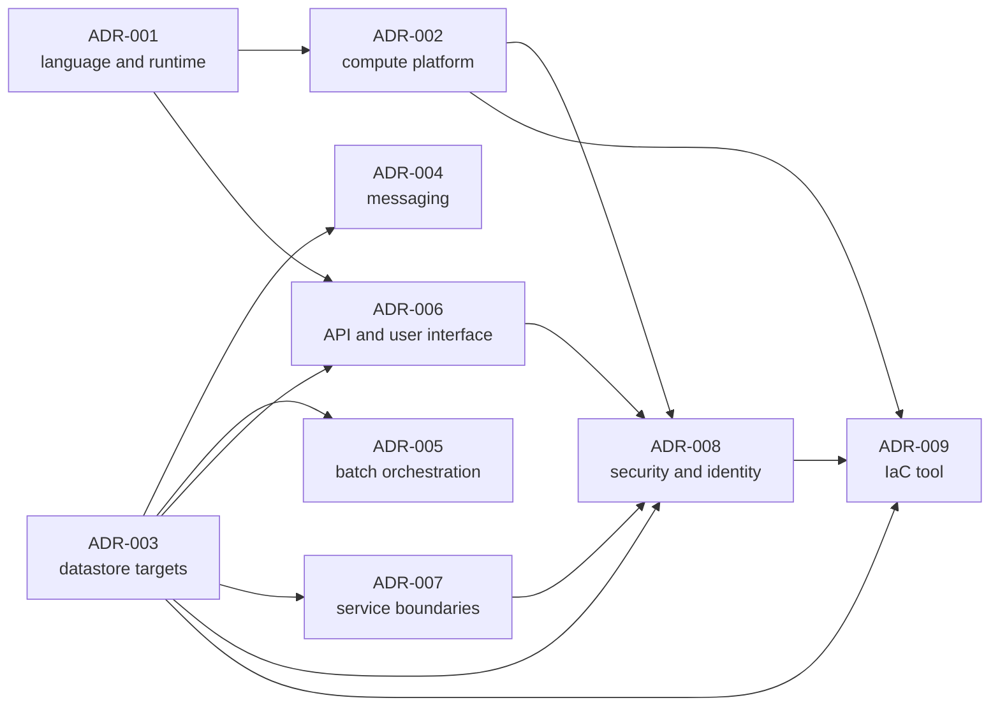

# Architecture Decision Records

> **Purpose.** The entry point to the nine architecture decision records that
> govern the CardDemo migration: what each one decided, the format they all
> follow, how they depend on one another, and what the set as a whole does and
> does not claim. This index records no decision of its own.
>
> **Source of truth.** The Agent Action Plan (AAP) §0.1.2 fixes the nine
> decisions and the accepted option for each. AAP §0.2.1.4 and §0.4.1.1 fix this
> folder's contents as one index plus nine records. AAP §0.9.1 makes *"every
> critical decision has a corresponding ADR"* a non-negotiable constraint, and
> §0.9.4 lists this folder as the first deliverable. The behavioural
> specification the records cite is the COBOL baseline under `app/**`, which is
> **read-only**: they reference it by path and line, and not one of them edits a
> byte of it.

The baseline being migrated is a z/OS credit-card management application written
in procedural COBOL — online interaction under CICS, batch under JCL and JES2,
record data in VSAM, and Db2, IMS and IBM MQ appearing in three optional
extension modules. `app/cbl` holds 31 programs: 12 batch `CB*`, 18 online `CO*`,
and the date utility `CSUTLDTC`; the three extension trees bring the `app/**`
total to 44. Beside them sit 30 copybooks in `app/cpy` (62 across `app/**`), 17
BMS mapsets in `app/bms` (21), and 38 JCL jobs in `app/jcl` (55, counting the
reference-only `samples/**`). The CICS resource definitions in
[`app/csd/CARDDEMO.CSD`](../../app/csd/CARDDEMO.CSD) run to 505 lines and declare
8 `FILE` and 18 `DEFINE TRANSACTION` stanzas. The maintainers publish their own
inventory of the application in
[`README.md`](../../README.md#application-inventory) — 24 online transactions and
27 batch jobs, each row marked with the optional module it belongs to, if any.

## The Nine Decisions

| # | Title | Decision taken | Status |
|---|---|---|---|
| [ADR-001](ADR-001-language-and-runtime.md) | Language and Runtime | Idiomatic rewrite in Java 21 LTS with Spring Boot; no transpilation for any program | Accepted |
| [ADR-002](ADR-002-compute-platform.md) | Compute Platform | ECS Fargate for the eight services; Step-Functions-invoked Fargate tasks for batch; Lambda for glue only | Accepted |
| [ADR-003](ADR-003-datastore-targets.md) | Datastore Targets | Aurora PostgreSQL Serverless (v2) for all record data; versioned S3 for dataset generations | Accepted |
| [ADR-004](ADR-004-messaging.md) | Messaging Target | Amazon SQS — FIFO queues for authorization request/reply, standard queues for inquiry | Accepted |
| [ADR-005](ADR-005-batch-orchestration.md) | Batch Orchestration | EventBridge Scheduler → Step Functions → Spring Batch on Fargate | Accepted |
| [ADR-006](ADR-006-api-and-ui.md) | API and User Interface | REST/JSON with OpenAPI 3.1 behind an API Gateway HTTP API; BMS screens become a React and TypeScript SPA on S3/CloudFront | Accepted |
| [ADR-007](ADR-007-service-boundaries.md) | Service Boundaries | Eight bounded contexts with schema-per-service | Accepted |
| [ADR-008](ADR-008-security-and-identity.md) | Networking, Security and Identity | Three-availability-zone VPC with public, private-application and isolated-data tiers; Cognito replacing the VSAM sign-on file; KMS and Secrets Manager; least-privilege IAM task roles | Accepted |
| [ADR-009](ADR-009-iac-tool.md) | Infrastructure-as-Code Tool | Terraform with a pinned AWS provider | Accepted |

## ADR Format

AAP §0.1.2 requires five things of every record — the decision, the options
considered, the rationale, the cost implications, and the trade-offs and risks.
Each record presents those five under their own headings, framed by a status and
a context, so a reviewer auditing the deliverable knows what to look for:

- **Status** — **all nine records are Accepted.** None is proposed, deprecated
  or superseded. A later change that conflicts with a record requires a
  superseding ADR rather than a silent edit to the decision.
- **Context** — what is being replaced, with counts and line-level citations
  into the read-only baseline.
- **Decision** and **Options Considered** — the choice, and every alternative
  weighed with the concrete reason it was or was not taken.
- **Rationale** — checkable facts rather than preferences.
- **Cost Implications** — each record reasons about *the shape of the charge*:
  which pricing dimension applies, what drives it, how the `dev` and `prod`
  profiles differ under it, and what the rejected option would have been charged
  for instead. **No record quotes a price list or invents a currency figure**,
  because a number that cannot be verified from the repository would read as
  evidence while carrying none.
- **Trade-offs and Risks** — what the accepted option gives up, including an
  honest statement of the delivery boundary described under
  [Scope Boundary](#scope-boundary).

Each record then closes with its consequences and its references.

Placement varies slightly and harmlessly: eight records state their status in
the opening block and ADR-009 under a heading of its own, while ADR-001 states
its decision in that opening block rather than under a separate heading. All
five required sections are present in all nine records either way.

**Why there are nine records rather than a summary.** Rule 1's third forbidden
pattern is *"leaving a non-obvious implementation choice undocumented when a
reasonable alternative exists"*. Each of these nine decisions is exactly that —
a non-obvious choice with a reasonable alternative that was actually weighed —
so omitting any one of them would be a rule breach and not merely an incomplete
deliverable. That is why this folder exists at all, and why the table above is
the artifact a reviewer uses to confirm the set is complete.

Alternatives Considered: this index could have summarised each record's
reasoning inline, which would spare a reader one click. It does not, because a
summary of a rationale is a second copy of it, and two copies drift — at which
point a reader cannot tell which one the system was built from. The record is
the authority; the index states only the decision taken and where to read why.

Trade-offs: the folder holds exactly ten files — this index and the nine
records — with no template, no `ADR-000`, no numbering gaps and no placeholder
for records not yet written. A template would be convenient for whoever adds
ADR-010, and that convenience is given up deliberately: AAP §0.4.1.1 fixes the
set at one index plus nine records, and any additional file here would imply a
decision that has not been made. The numbering is contiguous so that a gap is
always a real omission rather than a reserved slot.

The documentation convention these records follow is machine-checked in CI —
Javadoc completeness for Java, JSDoc rules for TypeScript, the docstring rule
family for Python, and lint plus generated documentation for HCL. The single
written convention behind all of them, including what it requires of Markdown
such as this file, is [`docs/CODE_DOCUMENTATION_STANDARD.md`](../CODE_DOCUMENTATION_STANDARD.md).

## Close Calls and the Guiding Principle

The user's guiding principle governs all nine decisions:

> "Prefer AWS-managed services over self-managed where it lowers operational
> burden, unless cost or a hard constraint dictates otherwise. When a decision
> is a close call, choose the lower-risk, lower-cost option and note it."

It recurs across the set as managed identity over a self-managed user store,
managed relational capacity over self-managed database hosts, managed queues
over a self-managed broker, managed orchestration over a self-managed scheduler,
serverless container tasks over a persistently-provisioned cluster, `dev`
database capacity scaled to zero, and — where the framework already provided
what was needed — adding no resilience library at all.

**Exactly two of the nine are genuine close calls**, and they are where the real
tension in the set sits:

- **[ADR-004](ADR-004-messaging.md)** — Amazon SQS versus Amazon MQ for IBM MQ.
- **[ADR-005](ADR-005-batch-orchestration.md)** — Step Functions versus AWS Batch.

Both resolve toward the option with **no broker and no compute environment to
operate**. The remaining seven decisions are not close calls, and each of those
records says so rather than dramatising a choice that was not finely balanced.

## How These Records Relate

The records were authored in dependency order, and reading them in that order
means no record refers forward to something undecided:

- **[ADR-001](ADR-001-language-and-runtime.md)** fixes the language and runtime
  that every later record presupposes. Read it first.
- **[ADR-002](ADR-002-compute-platform.md)** presupposes ADR-001, and
  additionally records the container base-image pin and the decision to add no
  external resilience library.
- **[ADR-003](ADR-003-datastore-targets.md)** is presupposed by every record that
  follows it — ADR-004, ADR-005, ADR-007 and ADR-008 rest on it directly, and
  ADR-006 and ADR-009 rest on it too. Read it second, ahead of its number.
- **[ADR-004](ADR-004-messaging.md)** and
  **[ADR-005](ADR-005-batch-orchestration.md)** each build on ADR-003 and are
  independent of one another.
- **[ADR-006](ADR-006-api-and-ui.md)** presupposes ADR-001 and ADR-003.
- **[ADR-007](ADR-007-service-boundaries.md)** presupposes ADR-003 and is where
  data ownership is settled.
- **[ADR-008](ADR-008-security-and-identity.md)** presupposes ADR-002, ADR-003,
  ADR-006 and ADR-007, because it secures what those four established.
- **[ADR-009](ADR-009-iac-tool.md)** presupposes ADR-002, ADR-003 and ADR-008,
  and is the record that underwrites the provision-and-teardown acceptance
  criterion.

## Scope Boundary

What these records claim, and what they do not:

- **The migration is additive.** The COBOL baseline under `app/**`, the existing
  test suite under `tests/**`, `scripts/**` and `samples/**` are reference-only
  and unmodified. The migration adds a path, it does not remove one — the
  existing z/OS and AWS Mainframe Modernization deployment paths remain exactly
  as they are.
- **The infrastructure is authored and statically validated** — format check,
  validate, plan, lint and policy scan. `terraform apply` against a live account
  is an operator action outside this scope. No record claims a live environment
  exists, and **nothing has been benchmarked or load-tested**; where a record
  discusses throughput or latency it reasons from a documented service
  characteristic, never from a measurement taken here.
- **Three baseline defects are documented, not fixed in COBOL.** The migrated
  Java implements correct behaviour and every intentional divergence is
  registered in
  [`docs/architecture/cobol-to-service-traceability.md`](../architecture/cobol-to-service-traceability.md).
  No record presents a defect as repaired in the baseline.
- **Out of scope across the set, and never presented as delivered:**
  multi-region and disaster-recovery topology (single region, three availability
  zones only); blue-green and canary deployment (rolling ECS deployment only);
  Kafka and Kinesis (the requirement is request/reply, which queues satisfy);
  Redis, ElastiCache and application-level caching (the baseline has no cache
  tier and parity needs none); and read replicas (reporting reads reach the
  writer through read-only views, so a replica would add replica-lag semantics
  for no parity benefit).
- **Four further items belong to the maintainers' own published plans**, not to
  this migration, and are named here so that their absence is not read as a
  deficiency: the Db2 rewards extension, IMS DC, SFTP integration, and exposing
  transactions for distributed integration — all four listed under
  [Roadmap](../../README.md#roadmap) in the repository's own `README.md`.

## References

The nine records themselves are linked from
[The Nine Decisions](#the-nine-decisions) above. Everything this index does not
carry is below.

**Architecture — the records decide; these describe what was built.**

- [context and container diagrams](../architecture/context-and-container-diagrams.md)
  — current and target architecture
- [service catalog](../architecture/service-catalog.md) — the eight services with
  their responsibilities, owned data and dependencies
- [data model and schema mapping](../architecture/data-model-and-schema-mapping.md)
  — field-by-field record-to-column mapping
- [batch orchestration](../architecture/batch-orchestration.md) — job-to-state
  mapping and condition-code semantics
- [messaging contracts](../architecture/messaging-contracts.md) — queue mapping,
  wire format and correlation
- [security and identity](../architecture/security-and-identity.md) — the full
  network, identity and encryption inventory
- [observability](../architecture/observability.md) — logs, metrics, traces and
  alarms
- [COBOL-to-service traceability](../architecture/cobol-to-service-traceability.md)
  — the authoritative program-to-service matrix and **the register of every
  intentional behavioural divergence**. A reader asking what changed
  behaviourally is answered there and nowhere else.

**Operations — exact commands.** [deploy](../runbooks/deploy.md) ·
[teardown](../runbooks/teardown.md) ·
[data migration](../runbooks/data-migration.md) ·
[batch operations](../runbooks/batch-operations.md)

**Conventions and entry points.**

- [`docs/CODE_DOCUMENTATION_STANDARD.md`](../CODE_DOCUMENTATION_STANDARD.md) —
  the documentation convention these records follow
- [`CONTRIBUTING.md`](../../CONTRIBUTING.md) — the same convention as a
  contribution gate
- [`MIGRATION_README.md`](../../MIGRATION_README.md) — build, deploy, run,
  migrate data, validate and roll back
- [`README.md`](../../README.md) — the application overview and the maintainers'
  own inventory
- [`tests/README.md`](../../tests/README.md) — the existing COBOL suite, which is
  the functional-parity oracle the migrated behaviour is checked against
