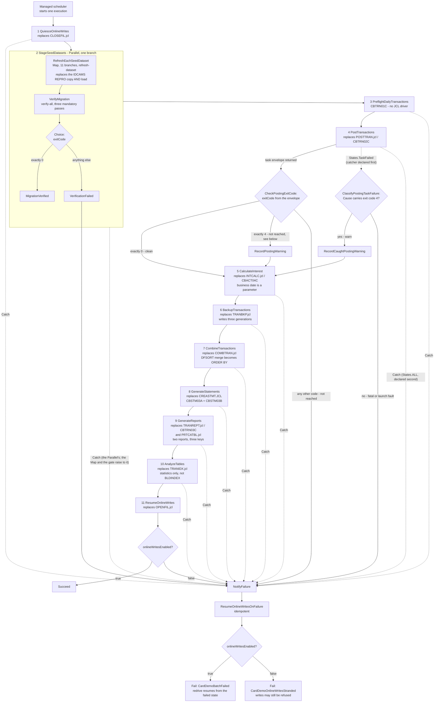

# Batch Orchestration

---

> **Purpose.** This document maps the CardDemo batch tier from JCL and JES2 onto a
> managed orchestrator. It fixes four things that the rest of the migration then
> depends on: the **job-to-state mapping** of the `carddemo-daily-batch` state
> machine, the **condition-code semantics** and the direction in which they must be
> translated, the **generation-dataset convention** and how many dataset families
> there actually are, and the **restart story** — including the fact that the
> baseline has no checkpoint contract to port. It discharges the
> batch-orchestration portion of **Deliverable 2** of the seven numbered
> deliverables: *"/docs/architecture — target architecture diagram, service
> catalog, and data-mapping (VSAM/Db2/IMS → AWS) tables"*.
>
> It is the **fourth** of the nine documents in this folder. The canonical service
> and schema names it uses are not defined here: the batch tier is
> [`service-catalog.md`](service-catalog.md)'s `batch-service`, it owns the `batch`
> schema, and its cross-schema write grants and per-column table derivations belong
> to [`data-model-and-schema-mapping.md`](data-model-and-schema-mapping.md). This
> document cites both rather than restating either, so that a service name or a
> grant can only ever be changed in one place.
>
> **Source of truth.** Six bodies of reference material, all read and none
> modified:
>
> * the **38** members of `app/jcl`, of which nineteen were read in full for this
>   document — the generation-base definitions
>   [`DEFGDGB.jcl`](../../app/jcl/DEFGDGB.jcl) (63 lines),
>   [`DEFGDGD.jcl`](../../app/jcl/DEFGDGD.jcl) (94 lines) and
>   [`DALYREJS.jcl`](../../app/jcl/DALYREJS.jcl) (32 lines); the chain payload
>   [`POSTTRAN.jcl`](../../app/jcl/POSTTRAN.jcl),
>   [`INTCALC.jcl`](../../app/jcl/INTCALC.jcl),
>   [`TRANBKP.jcl`](../../app/jcl/TRANBKP.jcl),
>   [`COMBTRAN.jcl`](../../app/jcl/COMBTRAN.jcl),
>   [`TRANREPT.jcl`](../../app/jcl/TRANREPT.jcl),
>   [`CREASTMT.JCL`](../../app/jcl/CREASTMT.JCL),
>   [`PRTCATBL.jcl`](../../app/jcl/PRTCATBL.jcl) and
>   [`TRANIDX.jcl`](../../app/jcl/TRANIDX.jcl); the operator bracket
>   [`CLOSEFIL.jcl`](../../app/jcl/CLOSEFIL.jcl) and
>   [`OPENFIL.jcl`](../../app/jcl/OPENFIL.jcl); the wait utility driver
>   [`WAITSTEP.jcl`](../../app/jcl/WAITSTEP.jcl); the four read-only unload jobs
>   [`READACCT.jcl`](../../app/jcl/READACCT.jcl),
>   [`READCARD.jcl`](../../app/jcl/READCARD.jcl),
>   [`READCUST.jcl`](../../app/jcl/READCUST.jcl) and
>   [`READXREF.jcl`](../../app/jcl/READXREF.jcl); and
>   [`TXT2PDF1.JCL`](../../app/jcl/TXT2PDF1.JCL);
> * the procedure and control-card tier —
>   [`app/proc/REPROC.prc`](../../app/proc/REPROC.prc) (32 lines),
>   [`app/proc/TRANREPT.prc`](../../app/proc/TRANREPT.prc) (82 lines) and
>   [`app/ctl/REPROCT.ctl`](../../app/ctl/REPROCT.ctl) (15 lines);
> * the two scheduler artifacts —
>   [`app/scheduler/CardDemo.ca7`](../../app/scheduler/CardDemo.ca7) (570 lines)
>   and [`app/scheduler/CardDemo.controlm`](../../app/scheduler/CardDemo.controlm)
>   (92 lines);
> * the batch programs the states carry —
>   [`CBTRN01C.cbl`](../../app/cbl/CBTRN01C.cbl),
>   [`CBTRN02C.cbl`](../../app/cbl/CBTRN02C.cbl),
>   [`CBACT04C.cbl`](../../app/cbl/CBACT04C.cbl),
>   [`CBSTM03A.CBL`](../../app/cbl/CBSTM03A.CBL) and the wait utility
>   [`COBSWAIT.cbl`](../../app/cbl/COBSWAIT.cbl);
> * the CICS resource definitions [`app/csd/CARDDEMO.CSD`](../../app/csd/CARDDEMO.CSD)
>   — its eight `DEFINE FILE` stanzas fix what the operator bracket does and does
>   not quiesce, and its `DEFINE TDQUEUE(JOBS)` stanza is the baseline's ad-hoc
>   submission tunnel;
> * the existing test suite [`tests/README.md`](../../tests/README.md) as the
>   functional-parity oracle and as the in-repository documentation precedent.
>
> Every figure below was measured from those files rather than carried over from
> prose, and each measurement is stated with the command that reproduces it so a
> reader can repeat it. Where a narrative figure and a measured figure could
> differ, the measured one is recorded.
>
> **Delivers, and who consumes it.** It delivers the eleven-state mapping with
> the JCL each state replaces, the inversion rule for condition codes, the ten
> generation-dataset families and their retention equivalence, the restart design,
> and the register of baseline artifacts observed while reading the batch tier. Its
> consumers are [`MIGRATION_README.md`](../../MIGRATION_README.md), which lists
> this document and links it by exactly the path
> `docs/architecture/batch-orchestration.md`; `docs/adr/ADR-005-batch-orchestration.md`,
> which records the orchestrator decision this document details;
> `infra/modules/step-functions-batch/README.md` and
> `infra/modules/s3-datasets/README.md`, which implement the state list and the ten
> prefix families; `services/batch-service/README.md`; and
> `docs/runbooks/batch-operations.md`. **The path spelling is part of the
> contract** — a single character of drift breaks a consumer that matches the
> string literally.
>
> **Current state.** The migration guide, ADR, infrastructure modules, batch
> service README, and batch/data-migration runbooks are present. Their paths are
> links rather than future contracts.
>
> **Caveats.** Four, stated up front rather than buried. First, this describes a
> **target design**, not a running system. The dataset module and generation
> writer are implemented; the state machine and deployable roots are not. The
> target paragraphs and Mermaid diagrams below are normative requirements until
> the missing graph lands, so nothing here asserts that a provisioned environment
> exists and **no throughput, duration or cost figure in this document is a
> measurement**. Second, a list of
> technologies is deliberately **out of scope** and is named as such in
> [Caveats, boundaries and out-of-scope](#caveats-boundaries-and-out-of-scope);
> none of it is described anywhere below as delivered. Third, several **baseline
> artifacts** are recorded in
> [Observed baseline artifacts](#observed-baseline-artifacts) as observations — they
> are neither asserted to be defects nor claimed to have been corrected, because
> the baseline is not modified by this migration at all. Fourth, the mainframe
> batch path is preserved: every job, procedure, control card and scheduler
> definition named below still exists and still runs exactly as it did. **The
> migration adds a path, it does not remove one.**

**Scope of this document is additive and reference-driven.** `app/**` — the JCL,
the procedures, the control cards, the COBOL programs, the CICS resource
definitions and the scheduler definitions — is cited here by path and line and is
read-only. The same reference status applies to `tests/**`, `scripts/**` and
`samples/**`. Nothing in this document licenses an edit to any of them, and in
particular the three known baseline defects recorded by the existing suite are
**not** fixed in COBOL; where the migrated Java behaves differently, the
divergence is registered in `docs/architecture/cobol-to-service-traceability.md`
rather than here.


## WHY (non-obvious design decisions)

This section carries the reasoning for the choices this document makes *about
itself*. Decisions about the orchestration it describes are justified at the point
where each is stated, under the same four category names.

- Assumptions: the documentation convention this file follows is the one already
  established in the repository, not a new one. The in-repository precedent is
  [`tests/README.md`](../../tests/README.md) §12 (heading L516, the mandatory
  clause at L544–L549), which requires every test, fixture builder, helper, mock
  and runner routine to carry purpose, parameters, returns and exceptions, and
  requires its inline comments to justify decisions under one of four named
  categories, calling that a hard review gate. The forward-looking polyglot
  authority is [`../CODE_DOCUMENTATION_STANDARD.md`](../CODE_DOCUMENTATION_STANDARD.md),
  whose *Markdown and documentation* section binds every document under `docs/**`
  to open with a header stating its purpose and source of truth, to carry
  reasoning for each non-obvious assertion under the four category names spelled
  exactly as in the rule, and to use the `# WHAT:` / `# WHY :` idiom in fenced
  command blocks. Both obligations are discharged above and throughout.
- Assumptions: this document's dominant category is **Assumptions**, and that
  follows from what it is about rather than from preference. The rule defines the
  category as *what external contracts, data formats, or behaviors this code
  depends on*, and the three things most likely to be got wrong here — the
  direction of a condition-code test, the retention semantics of a generation
  data group, and the injection of the business date — are precisely external
  behavioural contracts that the target has to reproduce rather than reinterpret.
  Each is labelled as an assumption where it is stated.
- Trade-offs: every assertion about the baseline is carried with a path and a line
  number, which makes the document longer and denser to read than a prose summary
  of the same material. That cost is accepted because the alternative failed once
  already in this migration's own inputs: a narrative count of **six** generation
  families is in circulation, the repository contains **ten**, and only a citation
  per family makes the difference visible instead of arguable. A line number is
  also the only form of evidence a reader can check without a mainframe.
- Alternatives Considered: the eleven states are presented **twice**, as a table
  and as a Mermaid flow. Presenting only the table was rejected because the
  failure edges are the part most easily got wrong and a table cannot show that
  the reject-count branch rejoins the success path while a caught error does not.
  Presenting only the diagram was rejected because a diagram cannot carry the
  per-state timeout, retry and catch settings without becoming unreadable. The
  accepted cost is that the state list appears in two places in one document and
  must be kept consistent between them.
- Alternatives Considered: the diagrams are inline Mermaid rather than committed
  image assets. An image would render identically everywhere, but it cannot be
  reviewed in a diff — a reviewer would have to trust a binary — and it would add
  a build step to regenerate. Mermaid is diffable text that the repository's own
  documents already use, so the convention is inherited rather than introduced.
- Refactoring Rationale: where the target improves on the baseline this document
  says so explicitly and says *why the baseline had nothing to improve on*, rather
  than presenting the improvement as a port. This matters most for restart: it
  would be straightforward, and false, to describe the run ledger as reproducing a
  mainframe checkpoint facility. The baseline's only restart directive is a
  comment, so the honest framing is an addition, and
  [The restart story](#the-restart-story-there-is-no-baseline-checkpoint-contract-to-preserve)
  states both facts that establish it.
- Trade-offs: this document specifies that **every** state carries an explicit
  timeout, and deliberately does **not** print a numeric value for it. Publishing
  numbers would read as guidance, and no execution has been observed against a
  provisioned environment from which a duration could be derived, so any figure
  here would be an invention dressed as a specification. Retry **attempt counts**
  are given, because a count is a policy decision rather than an observation. The
  accepted cost is that an operator must read the timeout values out of the
  environment parameters instead of out of this page.


## The `carddemo-daily-batch` state machine

**Target contract.** The batch chain will be one state machine,
`carddemo-daily-batch`, started by a managed scheduler whose schedule expression
is a per-environment infrastructure parameter rather than a value fixed by this
document. Each state that does real work runs a container task through the
**synchronous run-task integration**, so the state does not complete until the
task does, and per-step arguments arrive as **container overrides** — the direct
analogue of a JCL `PARM=` value and of a `DD DSN=` resolved at submission. Each
task-invoking state passes `--job=` and `--business-date=` as its `Command`
override and the dataset bucket name as an environment entry, exactly as the
table below specifies.

`infra/modules/step-functions-batch/main.tf` is authored and declares all eleven
work states, and both environment roots instantiate it. The table and diagram in this
section therefore describe the authored resource graph; they still do not describe
a *deployed* state machine, because applying the package to a live account is an
operator action outside this repository's scope.

Refactoring Rationale: this paragraph said the module's `main.tf` was absent and
that the table specified what a future resource graph must implement. Both halves
were overtaken when the module landed. The distinction worth keeping is the other
one — authored versus deployed — so the correction narrows the caveat to that
rather than dropping it.

Refactoring Rationale: the chain is **eleven** states, which is the count AAP §0.4.1.7
fixes, and the whole-migration verification gate runs **inside** state 2 rather than
beside it. A previous revision published that gate as a twelfth top-level state. It was
nested instead, because the two requirements it sat between are both binding: §0.4.1.7
fixes the nightly chain at eleven top-level work states and describes state 2 as "a Map
state, one branch per dataset, each a runTask.sync", while §0.9.2 mandates the combined
verification as a first-class deliverable and §0.7.7 specifies its three passes without
§0.4.1.7 giving it a state to run in. Nesting satisfies both; a twelfth state satisfied
the second by changing the first. State 2 is therefore a `Parallel` wrapping one branch,
and that branch runs the seed-refresh `Map` and then `VerifyMigration`, whose `Choice`
admits only a clean verdict. State 2's single outgoing edge is the ONLY edge into state
3, so business processing is unreachable over data that does not match its source — the
guarantee is unchanged by the nesting, because a failed branch fails the wrapper and the
wrapper's catch is the same shared handler every other work state uses. `VerifyMigration`
is consequently a **timed state that is not a top-level state**, which is why
`var.state_timeout_seconds` carries twelve keys for an eleven-state chain. What state 2
does changed at the same time, and that
change carries no new state. It used to invoke `stage-dataset`, which copies an extract
to a retained generation prefix and writes no row — so with nothing after it loading
Aurora, every business state ran against whatever the tables already held, and a first
execution against an empty cluster posted nothing and reported success. It now invokes
`refresh-dataset`, which performs the whole per-dataset round trip in one branch:
fetch, stage, load, the three verification passes, and for the transaction master the
identifier-allocator reconciliation without which the first transaction the online
service adds would collide on the primary key hours later. Ten of the eleven branches
run that whole round trip; the eleventh, `transactions`, stages its generation and
reconciles the allocator without loading, for the reason recorded under
[State 2](#state-2--refreshing-and-verifying-the-eleven-seed-datasets).

Alternatives Considered: the load and the allocator reconciliation were authored as two
further top-level states, `LoadSeedDatasets` and `ReconcileTransactionSequence`, which
together with `VerifyMigration` would have made the chain fourteen. All three are
withdrawn, and the work each was to
perform is done — inside state 2's branch, in the same invocation that staged the
generation. Withdrawing them is what keeps a dataset's fetch, stage, load and verify in
one unit whose failure names the dataset that failed, rather than spreading one
dataset's round trip across three `Map` states that can disagree about which generation
they are looking at. The count is stated as eleven throughout this document,
`docs/adr/ADR-005-batch-orchestration.md`, `infra/README.md` and the module's own
README precisely because a chain length is the one figure a reader checks against the
resource graph. The one place a reader will meet **twelve** is
`var.state_timeout_seconds`, which carries a ceiling for each of the eleven top-level
states plus one for the nested `VerifyMigration`; that variable's own validation states
the distinction, so the two figures cannot be mistaken for a disagreement.

| # | State | Replaces | Mechanism |
|---|---|---|---|
| 1 | `QuiesceOnlineWrites` | [`app/jcl/CLOSEFIL.jcl`](../../app/jcl/CLOSEFIL.jcl) L22–L30 — an SDSF operator command issuing `CEMT SET FIL(...) CLO` | Function setting a read-only flag in Parameter Store |
| 2 | `StageSeedDatasets` | the whole `IDCAMS REPRO` master-refresh block — the ten load jobs listed in [State 2](#state-2--refreshing-and-verifying-the-eleven-seed-datasets), plus the `DALYTRAN.PS` daily feed. The verification nested inside it replaces **nothing**: the baseline verified no load at all | `Parallel` wrapping one branch. The branch runs a `Map` of eleven branches, each a synchronous run-task on the data-migration image invoking `refresh-dataset` — fetch, stage a generation, load, verify, and for the transaction master reconcile the identifier allocator — and then `VerifyMigration`, a run-task invoking `verify-all`, followed by a `Choice` admitting only exit code zero. Ten Map branches load and verify; `transactions` stages only, because no TRANSACT extract is committed. This state's single outgoing edge is the ONLY edge into state 3 |
| 3 | `PreflightDailyTransactions` | `CBTRN01C` — **which has no JCL driver in the baseline**; see [State 3](#state-3--cbtrn01c-has-no-jcl-driver-in-the-baseline) | Container task |
| 4 | `PostTransactions` | [`app/jcl/POSTTRAN.jcl`](../../app/jcl/POSTTRAN.jcl) L23–L41 driving `CBTRN02C` | Container task with **two** outcome routes: a `Choice` on the returned task envelope for the clean exit, and an ordered `States.TaskFailed` catcher feeding a `Choice` that classifies the error's `Cause` for the warn exit; see [the state-4 status handoff](#the-state-4-status-handoff-is-explicit) |
| 5 | `CalculateInterest` | [`app/jcl/INTCALC.jcl`](../../app/jcl/INTCALC.jcl) L22–L41 driving `CBACT04C` | Container task; the business date arrives as a parameter, never as a clock read |
| 6 | `BackupTransactions` | [`app/jcl/TRANBKP.jcl`](../../app/jcl/TRANBKP.jcl) L23–L67, **and** the unload halves of [`app/jcl/TRANREPT.jcl`](../../app/jcl/TRANREPT.jcl) L23–L55 and [`app/jcl/PRTCATBL.jcl`](../../app/jcl/PRTCATBL.jcl) L29–L39 | Container task exporting **three** generations: the full transaction copy, the card-ordered daily subset, and the category-balance unload |
| 7 | `CombineTransactions` | [`app/jcl/COMBTRAN.jcl`](../../app/jcl/COMBTRAN.jcl) L22–L48 — a DFSORT merge followed by a `REPRO` reload | Container task using SQL ordering |
| 8 | `GenerateStatements` | [`app/jcl/CREASTMT.JCL`](../../app/jcl/CREASTMT.JCL) L22–L96 driving `CBSTM03A` with its called subprogram `CBSTM03B` | Container task writing plain-text and HTML statements to object storage |
| 9 | `GenerateReports` | [`app/jcl/TRANREPT.jcl`](../../app/jcl/TRANREPT.jcl) L59–L80 driving `CBTRN03C`, **and** [`app/jcl/PRTCATBL.jcl`](../../app/jcl/PRTCATBL.jcl) L43–L63 | Container task writing **both** reports to object storage: the 133-column transaction report, to a request-scoped key and to the `TRANREPT` generation, and the 40-byte category-balance report to its fixed key |
| 10 | `AnalyzeTables` | [`app/jcl/TRANIDX.jcl`](../../app/jcl/TRANIDX.jcl) L22–L54 — `DEFINE ALTERNATEINDEX`, `DEFINE PATH` and `BLDINDEX` | Function running `VACUUM ANALYZE`; see [Index building is retired](#index-building-is-retired-and-the-index-is-not) |
| 11 | `ResumeOnlineWrites` | [`app/jcl/OPENFIL.jcl`](../../app/jcl/OPENFIL.jcl) L22–L30 — the matching `CEMT SET FIL(...) OPE` | Function clearing the read-only flag |

### Per-state resilience settings

The target contract requires every state to carry all three settings; none is
optional or inherited by default. The columns below give the required shape, and
the numeric interval and timeout values will be per-environment parameters of
`infra/modules/step-functions-batch` for the reason recorded in the final bullet of
[WHY (non-obvious design decisions)](#why-non-obvious-design-decisions).

| State | Integration | Timeout | Retry | Catch |
|---|---|---|---|---|
| 1, 12 | Function invoke | Explicit, parameterised | Up to 3 attempts on a transient parameter-store or throttling error, exponential backoff | To `NotifyFailure` |
| 2 | `Map` over eleven branches, each a synchronous run-task | Explicit per branch **and** on the `Map` state | Up to 3 attempts per branch on task-launch failure | Branch catch aborts the `Map`, then to `NotifyFailure` |
| 3 | Synchronous run-task, then a `Choice` admitting only exit code zero | Explicit, parameterised | Up to 3 attempts on an ECS **service fault** only | To `NotifyFailure` |
| 4 | Synchronous run-task, a `Choice` on the returned envelope, and an ordered `States.TaskFailed` catcher feeding a `Cause` classifier | Explicit, parameterised | Up to 3 attempts on an ECS **service fault** only | `States.TaskFailed` to the classifier, which routes exit code 4 to the warning and everything else to `NotifyFailure`; every other error to `NotifyFailure` |
| 5, 6, 7, 8, 9 | Synchronous run-task, then a `Choice` admitting only exit code zero | Explicit, parameterised | Up to 3 attempts on an ECS **service fault** only | To `NotifyFailure` |
| 10, 11 | Function invoke | Explicit, parameterised | Up to 3 attempts on a transient connection error, exponential backoff | To `NotifyFailure` |

Assumptions: each retrier names **service fault errors only** — the four
`ECS.*` names for the run-task states, the four `Lambda.*` names for the function
states — and `States.TaskFailed` is deliberately **absent** from all of them.
Naming the four is a *replacement* for that entry and not a narrowing of it,
because `States.TaskFailed` in a retrier is a wildcard over every known error name
except `States.Timeout`: it was already retrying these service faults, under a name
that could not be told apart from the job's own exit. `ECS.AmazonECSException` is
the name AWS documents for a `RunTask` that could not be placed for want of
capacity; the rest follow the `<Service>.<ExceptionName>` form the language uses for
service exceptions. That wildcard name is what the synchronous run-task integration
raises for a non-zero essential-container exit, so retrying it replays an
application outcome: a
container that started and then exited non-zero has already done work against the
database, and a reject night simply returns the same code on every attempt. The
`batch.batch_run` ledger described in
[The restart story](#the-restart-story-there-is-no-baseline-checkpoint-contract-to-preserve)
is what makes those repeats a recorded no-op rather than a double posting, which
is also what shows the retry to be futile: nothing about the outcome changes
between attempts.

Trade-offs: the same error name also reports a task that never ran — an image-pull
failure, a capacity failure — and those are genuinely retryable. Excluding the name
sends them to the failure path on their first attempt, and the recovery is an
operator redrive, which the ledger makes safe because a step that completed before
the fault is a no-op on the way back through. The exclusion is accepted because the
name cannot separate the two classes at retry time, and retrying it is what made
the state-4 warn tier unreachable.

Assumptions: `States.Timeout` is likewise absent, for a reason that must not be
conflated with the one above. A synchronous run-task state whose timeout expires
does **not** stop its container — Step Functions abandons the wait and the task
keeps running — so retrying that error would start a second task of the same job
while the first was still writing. An expiry therefore goes straight to the failure
path, where the residual-task cancellation sub-chain stops the abandoned task
before the run is declared failed.

Trade-offs: the failure path passes through the resume state before it fails. A
caught error routes to `NotifyFailure` and then to a resume of online writes, and
only then to `Fail`. The simpler alternative — catch, notify, `Fail` — was
rejected because it would leave the read-only flag set after the execution ended,
so a failed batch would silently hold the online tier read-only until an operator
noticed. The baseline does not have this exposure: its resume is a separate
scheduler job reached from several predecessors, and
[`app/scheduler/CardDemo.ca7`](../../app/scheduler/CardDemo.ca7) carries four
distinct edges into `OPENFIL` (L124, L453, L527, L569). The accepted cost is that
the flag-clearing action is reachable twice in one execution and must therefore be
idempotent — it writes a known value rather than toggling one.



### The state-4 status handoff is explicit

The posting warn branch cannot be inferred from
[`TRANBKP.jcl`](../../app/jcl/TRANBKP.jcl), and the way the orchestrator learns
about it is decided by the integration rather than chosen freely.

**The integration's error contract, stated first, because everything below follows
from it.** For `arn:aws:states:::ecs:runTask.sync`, an essential container that
exits non-zero is **not** an ordinary result. Step Functions raises the error
`States.TaskFailed`, and the exit code survives only inside that error's `Cause`,
which the integration supplies as the `DescribeTasks` view of the stopped task
serialised into a JSON **string**. The state's `Next` — and therefore any `Choice`
on the state's result — is reached only when the container exited **0**.

**The job's return code is unchanged, and must be.**
[`app/cbl/CBTRN02C.cbl`](../../app/cbl/CBTRN02C.cbl) L229–L230 moves 4 to
`RETURN-CODE` when `WS-REJECT-COUNT > 0`, `batch-service` reproduces exactly that,
and AAP §0.5.1.7 makes it a parity requirement. Making the container exit zero on
a reject night would resolve the routing problem by discarding the contract the
routing exists to carry, so the orchestration learns to read the code out of the
failure instead.

**How state 4 is wired.** `PostTransactions` declares **two catchers, in order**:

| Order | `ErrorEquals` | `ResultPath` | Next |
|---|---|---|---|
| 1 | `States.TaskFailed` | `$.postingFailure` | `ClassifyPostingTaskFailure` |
| 2 | `States.ALL` | `$.failure` | `NotifyFailure` |

Assumptions: Amazon States Language evaluates catchers in **declaration order**
and the first match wins, so the order is load-bearing. The `States.ALL` wildcard
placed first would swallow the error before the specific catcher was consulted,
which is precisely the shape that made this warn tier unreachable.

Assumptions: catcher 1's name is **itself a wildcard**. The language defines
`States.TaskFailed`, wherever it appears in a `Retry` or a `Catch`, as matching
every known error name except `States.Timeout`. So catcher 1 also receives the
`ECS.*` integration faults once their retries are spent — which is safe, and is why
the classification is done by guards on the `Cause` rather than by the error name: a
fault that never ran the job carries no batch container reporting 4, so it takes the
classifier's `Default` and ends the run exactly as before, one `Choice` hop later.
The single documented exception is load-bearing in the other direction:
`States.Timeout` does **not** match catcher 1, so an abandoned-wait expiry falls
through to catcher 2 and still reaches the residual-task sweep that stops the task
the state stopped waiting for.

`ClassifyPostingTaskFailure` is a `Choice` that guards with `IsPresent` and
`IsString` on `$.postingFailure.Cause`, then requires the `Cause` to **name the
batch container**, and only then matches the exit code. All three groups are
`StringMatches` patterns; the last two groups are each combined under `Or`:

| `StringMatches` pattern | Shape it admits |
|---|---|
| `*"Name":"<batch container>"*` | compact serialisation of the container's name |
| `*"Name": "<batch container>"*` | one space after the colon |
| `*"ExitCode":4,*` | compact serialisation, another member follows |
| `*"ExitCode":4}*` | compact serialisation, last member of its object |
| `*"ExitCode": 4,*` | one space after the colon, another member follows |
| `*"ExitCode": 4}*` | one space after the colon, last member of its object |

The name comes from `var.batch_container_name`, the same input the
`ContainerOverrides` address, and it is what binds the classification to this task
rather than to any failure that happens to carry a 4: a `Cause` with no container
entries at all — a `RunTask` response holding only `Failures`, or a plain-text
integration message — fails closed. Both spacings are covered in both groups for one
reason: a compact-only pattern refuses a payload whose members are separated with a
space, which would be a warn tier that stops matching on a serialiser detail rather
than on the outcome.

Assumptions: `StringMatches` is the only comparator in the language that admits a
wildcard, and exactly one character is special in its pattern — `*`. Each pattern
carries a **boundary character** after the digit, and that is what makes the rule
correct rather than merely plausible: a bare `*"ExitCode":4*` also matches
`"ExitCode":40`, which would read a hard failure as a reject night.

| Outcome | How it is recognised | Next state |
|---|---|---|
| Clean | the integration RETURNED an envelope and `exitCode = 0` | `CheckPostingExitCode` continues to state 5 |
| Warn | `States.TaskFailed` whose `Cause` matches one of the four patterns | `RecordCaughtPostingWarning` writes `{code = "POSTING_REJECTS_PRESENT", exitCode = 4}` to `$.warning`, then state 5 |
| Fatal, launch fault, or unrecognised `Cause` | `States.TaskFailed` that matches none of the patterns, or any other error | `NotifyFailure`, the residual-task sweep, the bracket release, then `Fail` |

Assumptions: `RecordCaughtPostingWarning`'s payload is **static**. A task state
applies no `ResultPath` when it fails, so `$.posting` does not exist on this edge
and the `"exitCode.$"` reference `RecordPostingWarning` uses would address nothing.
Its two members and its code string are identical to `RecordPostingWarning`'s, so
an execution that warned reports one shape at `$.warning` whichever route produced
it.

Assumptions: only the CLEAN rule of `CheckPostingExitCode` — and of every other
`Check*ExitCode` gate in the chain — is reachable, because the result they inspect
can only ever carry a zero. The warn rule and the `Default` edges are kept anyway,
and the reasons differ: a `Choice` with no `Default` raises
`States.NoChoiceMatched`, a `Choice` state cannot carry a `Catch`, and that error
would end the execution without publishing the notification, sweeping the residual
tasks or releasing the write bracket; while the warn rule is the one declarative
statement of the rc=4 contract on the result path, beside which the classifier
reads as the same contract on the error path. They are annotated as unreachable at
the states themselves so a reader does not have to rediscover it from an execution
history.

Trade-offs: an unrecognised `Cause` **fails closed**. Over-matching would continue
the chain past a genuine hard failure; under-matching stops a night that is
recoverable by redrive and whose reject stream is already durable — the rejects are
committed to `ledger.transaction_rejects` and staged as the `DALYREJS` generation
before posting exits.

Trade-offs: the name conjunct proves the payload is **this task's** stopped-task
description; it does not attribute the exit code to one entry inside it. The batch
task definition carries the telemetry collector beside the application container —
`enable_telemetry_collector` defaults to `true` in `infra/modules/ecs-service` and
neither environment root overrides it — and both containers are essential, so an
`ExitCode` of 4 on either satisfies the rule. Attributing it within the pattern
language is not expressible: the only wildcard is `*`, the comparator has no
negation, and a pattern holding both tokens matches a name from one entry with an
exit code from the next just as readily as it matches one entry, while pinning an
order between the two members would bet the whole warn tier on a key order this
integration does not document. Making it exact is a property of the **task
definition** rather than of this graph: passing `enable_telemetry_collector = false`
for the batch workload in the environment roots leaves one container able to report
an exit code, and a run-to-completion task has no long-lived telemetry to export
anyway. The residual is bounded and detectable rather than silent — it needs the
collector to stop with exactly 4 in the same stop event, the outcome is a chain that
continues, and the code posting actually finished with is durable in
`batch.batch_run` for that run.

Alternatives Considered, and why each was rejected:

* **Exit zero and hand the outcome over out of band** — the container writing a
  run-scoped Parameter Store value such as
  `/carddemo/<environment>/batch/<run_id>/post-transactions` carrying
  `returnCode`, `processedCount` and `rejectCount`, with a later state reading and
  deleting it. Rejected because it requires the container to exit zero on a reject
  night, which contradicts the return-code contract above, and because it adds a
  parameter whose creation, reading and deletion have to succeed on both the
  completed branches and the failure path for the chain to be correct at all.
* **`States.StringToJson` on the `Cause`, then `NumericEquals` on the decoded
  `Containers[i].ExitCode`** — exact, attributing the code to a named container, and
  needing no patterns. Rejected because a `Pass` state cannot carry a `Catch`: a
  `Cause` that is not parseable JSON, which is what an integration-level fault
  produces and is the case most in need of routing, would fail the intrinsic with
  `States.IntrinsicFailure` and end the execution there, skipping `NotifyFailure`,
  the residual-task sweep and the bracket release. A missing reference path on a
  one-container payload raises `States.Runtime`, which `States.ALL` does not catch,
  so that route trades a rare detectable misroute for a rare silent unnotified abort
  of the whole chain.
* **Querying Aurora from the orchestrator** — rejected because Step Functions has
  no direct PostgreSQL integration, and adding a function solely to relay one
  result would duplicate the run ledger's application responsibility.
* **Treating code 4 as a failure** — rejected because it reports a correctly posted
  night with business rejects as an infrastructure incident and skips the interest,
  backup, combine, statement and report work the baseline performs
  unconditionally.

### Why a container task per work step, and not a function

Alternatives Considered: each work-bearing state runs a **container task** rather
than a function. A function runtime imposes a hard fifteen-minute execution
ceiling, and the posting and statement steps exceed it — posting walks the daily
transaction file against three keyed masters and commits per transaction
([`POSTTRAN.jcl`](../../app/jcl/POSTTRAN.jcl) L23–L41 wires nine data
definitions for exactly that), while statement generation renders one document per
card across the whole cross-reference file
([`CREASTMT.JCL`](../../app/jcl/CREASTMT.JCL) L79–L96). A step that exceeds the
ceiling does not run slowly, it is terminated mid-work, which for the posting step
means an interrupted chain of committed transactions. The two states that *are*
functions — 1, 11 and the statistics state 10 — each perform a single bounded
action with no per-record loop, so the ceiling is not in play for them.

### Why a state machine, and not a managed batch queue service

Alternatives Considered: the orchestrator is a **state machine** rather than a
managed batch queue service. The contract being reproduced is not "run this list
of jobs somewhere with capacity" — it is **step dependency plus condition-code
gating**, which is exactly what a state machine expresses declaratively: an edge
per dependency, a `Choice` per gate, and per-state retry, catch, timeout and
redrive as first-class attributes. A batch queue service would express the
dependency graph as job-dependency metadata and would additionally require a
queue and a compute environment to be defined, sized and maintained, for a chain
whose step membership is fixed and known in advance. The accepted cost of the
state machine is that the chain is defined in one document rather than assembled
from independently submitted jobs, so adding a step is an infrastructure change
rather than a submission.


## The condition-code inversion

**A JCL `COND` is a *skip* predicate. A Step Functions `Choice` is a *run*
predicate. The sense must be inverted, not copied.**

Assumptions: this is the single external behavioural contract in the batch tier
that is most easily reproduced backwards, and it is reproduced backwards by doing
the obvious thing. `COND=(0,NE)` reads, in English, as a condition under which the
step *executes* — and it is not; it states the condition under which the step is
**bypassed**. Transcribe the operator and the operands into a `Choice` unchanged
and every gate in the chain runs when it should have been skipped and skips when it
should have run, with no syntax error anywhere to reveal it. The three forms below
are the only forms present in the batch tier, and each is translated separately.

```text
# WHAT: count and locate every condition-code construct in the JCL, procedure and
#       control-card tier, so that no gate is translated from memory.
# WHY : Assumptions: the two step-gate forms and the record-selection form all
#       spell the same keyword COND=, so a single grep returns all three mixed
#       together and they must be separated by reading each hit rather than by
#       counting matches. The tier is scoped to app/jcl, app/proc and app/ctl
#       because a COND= inside a COBOL source or a CSD stanza is a different
#       construct entirely and would inflate the figure.
grep -rn 'COND=' app/jcl app/proc app/ctl
```

That returns **eleven** occurrences: **nine step gates** — eight of them
`COND=(0,NE)` and one `COND=(4,LT)` — and **two record-selection predicates**. The
nine and the two are the same keyword doing two unrelated jobs, which is the whole
reason this section separates them before translating any of them.

### Form 1 — `COND=(0,NE)`: run only when every predecessor ended cleanly

It reads "skip this step when zero is *not equal* to a prior step's return code",
so the step executes only when every predecessor returned zero. **Eight
occurrences**, all of them step gates:

| Occurrence | Step gated |
|---|---|
| [`app/jcl/DEFGDGD.jcl`](../../app/jcl/DEFGDGD.jcl) L36 | `STEP20 EXEC PGM=IEBGENER` — load the first generation of `TRANTYPE.BKUP` |
| [`app/jcl/DEFGDGD.jcl`](../../app/jcl/DEFGDGD.jcl) L47 | `STEP30 EXEC PGM=IDCAMS` — define the `TRANCATG.PS.BKUP` base |
| [`app/jcl/DEFGDGD.jcl`](../../app/jcl/DEFGDGD.jcl) L59 | `STEP40 EXEC PGM=IEBGENER` — load its first generation |
| [`app/jcl/DEFGDGD.jcl`](../../app/jcl/DEFGDGD.jcl) L82 | `STEP60 EXEC PGM=IEBGENER` — load the first generation of `DISCGRP.BKUP` |
| [`app/jcl/CREASTMT.JCL`](../../app/jcl/CREASTMT.JCL) L56 | `STEP020 EXEC PGM=IDCAMS` — `REPRO` the card-ordered sequential file into its cluster |
| [`app/jcl/CREASTMT.JCL`](../../app/jcl/CREASTMT.JCL) L66 | `STEP030 EXEC PGM=IEFBR14` — delete the prior run's statement outputs |
| [`app/jcl/CREASTMT.JCL`](../../app/jcl/CREASTMT.JCL) L79 | `STEP040 EXEC PGM=CBSTM03A` — generate the statements |
| [`app/jcl/TXT2PDF1.JCL`](../../app/jcl/TXT2PDF1.JCL) L26 | `TXT2PDF EXEC PGM=IKJEFT1B` — the text-to-PDF conversion, which [retires with no target](#the-txt2pdf1-retirement-and-its-consequence) |

**Target.** The **default success edge**. No `Choice` state is generated for this
form, because the state machine's ordinary edge already carries "the predecessor
completed successfully" — that is what an edge means. Any non-zero outcome is
caught by the state's `Catch` and routed to `NotifyFailure`, then to the resume
state, then to `Fail`.

Alternatives Considered: an explicit `Choice` reading the previous state's exit
code was rejected for this form. It would restate the semantics the edge already
has, and it would add a state that can itself fail, so the chain would gain a
failure mode it does not currently have while expressing nothing new. The `Catch`
plus default edge covers the same two outcomes with one fewer moving part.

Note that `COND=(0,NE)` gating is applied unevenly in the baseline; the target
contract inherits the *effect*, not the unevenness. In
[`DEFGDGD.jcl`](../../app/jcl/DEFGDGD.jcl) the two `IDCAMS` define steps at L24
(`STEP10`) and L70 (`STEP50`) carry **no** `COND` at all, while the define at L47
(`STEP30`) does. In the future state machine every state will be gated by its
incoming edge, so the distinction disappears.

### Form 2 — `COND=(4,LT)`: run only when the code is four or lower

It reads "skip this step when four is *less than* the return code", so the step
executes for codes zero through four and is bypassed from five upward. There is
**one occurrence**, and its scope is one JCL job:

* [`app/jcl/TRANBKP.jcl`](../../app/jcl/TRANBKP.jcl) L51 —
  `//STEP10 EXEC PGM=IDCAMS,COND=(4,LT)`, the step that re-defines the transaction
  master cluster after the same job's `STEP05R` unload and `STEP05` delete. The
  delete step at L37–L45 resets each `MAXCC <= 08` result to zero at L42 and L45,
  so an absent cluster or alternate index does not prevent the define. A larger
  local delete failure, or an earlier unload failure above four, causes `STEP10`
  to be skipped.

This gate cannot observe `CBTRN02C`. `POSTTRAN.jcl` and `TRANBKP.jcl` are
different jobs, and JCL `COND` evaluates return codes from earlier steps in the
**same job**. The prior wording incorrectly treated the only syntactic
`COND=(4,LT)` as provenance for the posting warn path.

**Target mapping.** The specific gate retires with the VSAM
delete-and-redefine mechanism. State 6 exports the relational transaction data
without deleting and recreating its Aurora table, so there is no target redefine
step to conditionally enter. An export/task failure follows state 6's `Catch`;
successful export continues. Creating a `Choice` for this JCL occurrence would
preserve syntax after the operation it guarded had disappeared.

**The posting warn branch is independent.**
[`app/cbl/CBTRN02C.cbl`](../../app/cbl/CBTRN02C.cbl) L229–L230 sets
`RETURN-CODE` to 4 when `WS-REJECT-COUNT > 0`, and
[`tests/README.md`](../../tests/README.md) §8 classifies 4 as warn/soft reject.
That business contract, not `TRANBKP.jcl`, is why state 4 distinguishes clean and
warn outcomes at all, and it is carried by the ordered `States.TaskFailed` catcher
and `Cause` classifier described in
[the state-4 status handoff](#the-state-4-status-handoff-is-explicit).

### Form 3 — `INCLUDE COND=(...)`: record selection, never a step gate

**This form shares the `COND=` keyword with the two above and means something
entirely different: it selects *records*, not steps.** Conflating the two is a
real hazard precisely *because they share a keyword* — a reader scanning for gates
finds it, and a translator that treats it as a gate produces a `Choice` state that
decides whether to run the report at all, in place of a filter that decides which
rows the report contains. **Two occurrences**, both the same predicate:

* [`app/jcl/TRANREPT.jcl`](../../app/jcl/TRANREPT.jcl) L47–L48 —
  `INCLUDE COND=(TRAN-PROC-DT,GE,PARM-START-DATE,AND, TRAN-PROC-DT,LE,PARM-END-DATE)`,
  inside the `STEP05R EXEC PGM=SORT` at L37. Its operands are resolved from the
  `SYMNAMES` at L40–L44, which declare the field positions
  `TRAN-CARD-NUM,263,16,ZD` and `TRAN-PROC-DT,305,10,CH` and the two literals
  `PARM-START-DATE,C'2022-01-01'` and `PARM-END-DATE,C'2022-07-06'`.
* [`app/proc/TRANREPT.prc`](../../app/proc/TRANREPT.prc) L45–L46 — the identical
  predicate in the procedure member discussed under
  [Observed baseline artifacts](#observed-baseline-artifacts).

**Target.** A SQL `WHERE` clause on the real `ledger.transactions.proc_ts`
`TIMESTAMP(6)` column, bounded by the two report-date parameters:

```sql
-- Assumptions: the baseline compares TRAN-PROC-DT as CH (character) at one-based
-- position 305, and the field holds an ISO 'YYYY-MM-DD' value, so a lexical
-- GE/LE range and a DATE range select the same rows. That equivalence is what
-- makes the inclusive bounds safe to carry across unchanged; a differently
-- ordered date format would not survive the same translation.
-- The half-open upper bound includes every timestamp on report_end_date while
-- leaving proc_ts uncast so idx_transactions_proc_ts remains usable.
WHERE proc_ts >= CAST(:report_start_date AS date)
  AND proc_ts <  CAST(:report_end_date AS date) + INTERVAL '1 day'
```

**It must never be modelled as a `Choice` state.** The accompanying
`SORT FIELDS=(TRAN-CARD-NUM,A)` at L46 becomes the `ORDER BY` of the same query
rather than a separate state, for the same reason: a sort of the result set is part
of the query, not a step in the chain.

### The three forms side by side

| JCL construct | What it gates | Target construct | What a naive copy would do |
|---|---|---|---|
| `COND=(0,NE)` | The step, on any non-zero predecessor code | Default success edge plus `Catch` | Run the step only on failure |
| `TRANBKP COND=(4,LT)` | That job's local VSAM redefine step, based on its own earlier steps | No direct state: the relational target does not delete/redefine the transaction table | Misattribute a local backup guard to the separate posting job |
| `INCLUDE COND=(...)` | **Records**, inside a sort | SQL `WHERE` in the report query | Decide whether to run the report instead of which rows it contains |


## Generation datasets: there are ten families, not six

**The repository defines ten generation data groups, and every one of them is
declared with `LIMIT(5)` and `SCRATCH`.** A narrative count of six is in
circulation because six of the ten are defined in one job and the other four are
easy to miss — three sit in the Db2 reference-data job and one in a job whose name
gives no hint that it defines a generation base at all.

```text
# WHAT: list every generation-data-group definition in the JCL tree together with
#       the name and retention line that follows it.
# WHY : Assumptions: the DEFINE verb and its NAME operand sit on separate lines
#       because IDCAMS continues with a trailing hyphen, so a single-line grep for
#       GENERATIONDATAGROUP returns the verb without the name and undercounts
#       nothing but tells you nothing either. The -A3 window is what pairs each
#       definition with its NAME, LIMIT and SCRATCH operands.
grep -rn -A3 'DEFINE GENERATIONDATAGROUP' app/jcl
```

| # | Generation base | Defined at | `LIMIT(5)` at | Written by |
|---|---|---|---|---|
| 1 | `TRANSACT.BKUP` | [`DEFGDGB.jcl`](../../app/jcl/DEFGDGB.jcl) L25 | L26, `SCRATCH` L27 | State 6 — written by `BackupTransactionsJob` |
| 2 | `TRANSACT.DALY` | [`DEFGDGB.jcl`](../../app/jcl/DEFGDGB.jcl) L31 | L32, `SCRATCH` L33 | State 6 — the card-ordered subset bounded to the business date |
| 3 | `TRANREPT` | [`DEFGDGB.jcl`](../../app/jcl/DEFGDGB.jcl) L37 | L38, `SCRATCH` L39 | State 9 — `ReportArtifactPublisher.publishDaily` writes this generation and the request-scoped key from one pass |
| 4 | `TCATBALF.BKUP` | [`DEFGDGB.jcl`](../../app/jcl/DEFGDGB.jcl) L43 | L44, `SCRATCH` L45 | State 6 — the category-balance unload, staged beside the two transaction families |
| 5 | `SYSTRAN` | [`DEFGDGB.jcl`](../../app/jcl/DEFGDGB.jcl) L49 | L50, `SCRATCH` L51 | State 5 — the system-generated interest transactions |
| 6 | `TRANSACT.COMBINED` | [`DEFGDGB.jcl`](../../app/jcl/DEFGDGB.jcl) L55 | L56, `SCRATCH` L57 | State 7 |
| 7 | `TRANTYPE.BKUP` | [`DEFGDGD.jcl`](../../app/jcl/DEFGDGD.jcl) L28 | L29, `SCRATCH` L30 | Reference-data refresh |
| 8 | `TRANCATG.PS.BKUP` | [`DEFGDGD.jcl`](../../app/jcl/DEFGDGD.jcl) L51 | L52, `SCRATCH` L53 | Reference-data refresh |
| 9 | `DISCGRP.BKUP` | [`DEFGDGD.jcl`](../../app/jcl/DEFGDGD.jcl) L74 | L75, `SCRATCH` L76 | Reference-data refresh |
| 10 | `DALYREJS` | [`DALYREJS.jcl`](../../app/jcl/DALYREJS.jcl) L25 | L26, `SCRATCH` L27 | State 4 — the reject stream |

The authored `infra/modules/s3-datasets` contract declares prefixes, versioning
and lifecycle configuration for **ten** families, and publishes the effective
logical count through `noncurrent_version_retention`, and the ten families
themselves through `dataset_prefixes` and `dataset_uris`. Assumptions: **a design
that declared six would silently omit four cleanup contracts**. The reject stream
is the fourth of those four and the most consequential to lose, since it is the
audit trail of every transaction the chain declined to post.

Both environment roots instantiate the module, and each passes its
`bucket_name` into `step-functions-batch`, which sets it on every task-invoking
state as the `CARDDEMO_DATASET_BUCKET` environment override. The per-family
prefixes are NOT passed as overrides: each task composes its own prefix from that
bucket name and the family it is writing, so a family added to the module needs no
change at the orchestration boundary.

Refactoring Rationale: this paragraph named an output, `generation_retention_by_family`,
that the module does not declare — its retention output is `noncurrent_version_retention` —
and reported the environment roots as "missing". Both roots exist and both wire the
bucket. The prefix-versus-bucket distinction is stated explicitly because the
original sentence read as though a wiring were outstanding when the design does not
call for one.

### Relative generation references

Generations are referenced relatively throughout the chain, and the two forms carry
different meanings that the target must keep distinct: `(+1)` names a **new**
generation being created by this step, `(0)` names the **current** one.

| Reference | Where | Meaning in the chain |
|---|---|---|
| `TRANSACT.BKUP(+1)` | [`TRANBKP.jcl`](../../app/jcl/TRANBKP.jcl) L33 | State 6 creates the backup generation |
| `TRANSACT.BKUP(+1)` | [`TRANREPT.jcl`](../../app/jcl/TRANREPT.jcl) L33 | **Not reproduced as a second unload.** The reference unloads the master twice per night because each job is self-contained; state 6 unloads once and state 9 reads the relation directly |
| `TRANSACT.DALY(+1)` | [`TRANREPT.jcl`](../../app/jcl/TRANREPT.jcl) L55 | The filtered, card-ordered extract, read back at L66 |
| `TRANREPT(+1)` | [`TRANREPT.jcl`](../../app/jcl/TRANREPT.jcl) L80 | The 133-column report output, `LRECL=133` at L78 |
| `TRANSACT.BKUP(0)` | [`COMBTRAN.jcl`](../../app/jcl/COMBTRAN.jcl) L24 | State 7 reads the **current** backup generation |
| `SYSTRAN(0)` | [`COMBTRAN.jcl`](../../app/jcl/COMBTRAN.jcl) L26 | Concatenated as the second input — the current interest generation |
| `TRANSACT.COMBINED(+1)` | [`COMBTRAN.jcl`](../../app/jcl/COMBTRAN.jcl) L37, then L44 | Written by the sort, then read by the reload in the same job |
| `SYSTRAN(+1)` | [`INTCALC.jcl`](../../app/jcl/INTCALC.jcl) L41 | State 5 creates the interest-transaction generation |
| `DALYREJS(+1)` | [`POSTTRAN.jcl`](../../app/jcl/POSTTRAN.jcl) L38 | State 4 creates the reject generation |
| `TCATBALF.BKUP(+1)` | [`PRTCATBL.jcl`](../../app/jcl/PRTCATBL.jcl) L39, read back at L45 | State 6 stages the generation; state 9 reads the relation directly rather than reading the generation back |
| `TRANTYPE.BKUP(+1)`, `TRANCATG.PS.BKUP(+1)`, `DISCGRP.BKUP(+1)` | [`DEFGDGD.jcl`](../../app/jcl/DEFGDGD.jcl) L40, L63, L86 | First generation of each reference base |

Note the pattern at [`COMBTRAN.jcl`](../../app/jcl/COMBTRAN.jcl) L37 and L44: the
same `(+1)` is written by one step and read by the next **within one job**, which
resolves to the same physical generation because a relative reference is fixed for
the duration of the job. The target reaches the same guarantee by a different
mechanism: `DatasetGenerationService` records each allocation per family and run, so a
repeat request inside one execution answers with the coordinate it already gave, and
the states that touch a generation receive it rather than deriving "the next" for
themselves. Assumptions: two independent computations of "next" would resolve to two
different prefixes. In the reference that would leave the reload at L48 reading an
empty location while the sort's output sat elsewhere; the migrated chain has no reload
— registered as `D-COMBINE-NO-LOADBACK` — so the same hazard would instead surface as
a later state naming a generation no step wrote, which is why the allocator's
record-and-reuse behaviour is a contract and not an optimisation.

### The object-store convention

```text
<domain>/<dataset>/dt=YYYY-MM-DD/gen=NNNN/
```

The `dt=` component carries the injected business date, and `gen=` carries a
four-digit logical generation number. `(+1)` becomes a new prefix; `(0)` resolves
to the newest valid prefix in the family. The authored
`data-migration/src/carddemo_migration/loaders/s3_stage.py` writer parses only this
fixed shape, orders generations by `(business_date, generation)`, keeps the newest
configured count and permanently deletes every object version and delete marker
beneath prefixes that roll off. With the default count of five, staging a sixth
logical generation scratches the oldest complete prefix.

Bucket versioning and lifecycle remain necessary, but for a **different layer**:
they protect and expire repeated writes of the same object key. Terraform's
`newer_noncurrent_versions` counts versions of one key; it cannot count distinct
current keys beneath `gen=0001/`, `gen=0002/` and so on. The shared
`noncurrent_version_retention` value keeps the writer's logical-prefix count and
the lifecycle's same-key revision count under one configuration authority without
claiming they are the same mechanism. Refactoring Rationale: this sentence named
the value `generation_retention_by_family`, which the module does not declare; the
output it does declare is `noncurrent_version_retention`, and the naming error was
the same one corrected earlier in this document.

Trade-offs: retention is enforced when a writer stages a generation rather than
as an autonomous catalog service. That keeps the operation adjacent to the write
that can exceed the limit and lets `delete_objects` report partial failures
immediately. The cost is that every generation writer must use
`stage_dataset_file` (or the family-aware `stage_family_file` that wraps it);
a direct `put_object` can bypass cleanup. The environment/task wiring that passes
the Terraform output to every writer is therefore still required and is not yet
authored. Deriving order from object modification times was rejected because a
retry would then alter catalog order; the explicit date and generation labels make
ordering deterministic.

Refactoring Rationale: this previously named a byte-oriented `stage_generation`
entry point, which has been withdrawn. It accepted a payload the caller had
already read into memory, so peak usage scaled with the dataset; it opened the
extract separately from the transfer, so the digest it recorded was not provably
of the bytes uploaded; and it wrote the object with no checksum the service could
verify. `stage_dataset_file` holds one descriptor across the digest and the
transfer, streams it in bounded chunks, and supplies `ChecksumSHA256` so S3
itself rejects a mismatched write. Generation numbers are allocated by
`reserve_generation`, a conditional create keyed by execution token, family and
business date, so two concurrent writers cannot take the same number and a
retried step reuses the one its first attempt reserved instead of staging a
duplicate generation of identical bytes.


## The restart story: there is no baseline checkpoint contract to preserve

Two facts establish this, and both are verifiable in one command each.

**Fact one: the only `RESTART=` in the batch tier is commented out.**

```text
# WHAT: find every restart directive in the JCL, procedure and control-card tier.
# WHY : Assumptions: a JCL restart directive lives on the JOB statement, so the
#       search must include the first lines of each member rather than only step
#       statements. The single hit is prefixed //* which is the JCL comment form,
#       making it inert - a distinction a match count alone would hide.
grep -rn 'RESTART' app/jcl app/proc app/ctl
```

One hit: [`app/jcl/DEFGDGD.jcl`](../../app/jcl/DEFGDGD.jcl) L2 —
`//*  RESTART=STEP30`. The `//*` prefix makes it a comment, so it restarts nothing;
it records that somebody once needed to resume that job at its third step.

**Fact two: there is no `CHKPT=` anywhere in the tier.**

```text
# WHAT: confirm that no checkpoint DD parameter is declared anywhere in the batch
#       tier, and show where the string does occur so the zero is checkable.
# WHY : Assumptions: the first command is scoped to the JCL tier because CHKPT= is
#       a DD parameter and can only appear there; the second is repository-wide
#       precisely so a reader who greps more broadly, finds hits, and concludes the
#       claim is wrong can see that those hits are a different construct.
grep -rn 'CHKPT' app/jcl app/proc app/ctl | wc -l    # -> 0
grep -rn 'CHKPT' app                                  # COBOL working storage, and one DL/I call
```

The first returns **0**. The second returns COBOL working-storage fields named
`WK-CHKPT-ID` and one `EXEC DLI CHKP` at
[`app/app-authorization-ims-db2-mq/cbl/CBPAUP0C.cbl`](../../app/app-authorization-ims-db2-mq/cbl/CBPAUP0C.cbl)
L355 — an IMS DL/I checkpoint call inside the authorization extension, which is a
different mechanism in a different context and is not part of this chain. Recording
that second result is deliberate: a bare claim of "no checkpoints" would look wrong
to anyone who greps the whole repository.

Refactoring Rationale: because the baseline's restart story is a commented-out
hint, the target's restart design is a **documented improvement, not a
reproduction**, and describing it as a port would be a false claim about the
baseline. It specifies two complementary mechanisms:

* **Redrive** resumes a failed execution **from the failed state**, so states
  that already succeeded are not re-entered. This is the analogue of what the
  commented `RESTART=STEP30` was reaching for, and it is a property of the
  STANDARD workflow type the authored state machines are declared with.
* **A durable per-step run ledger** in `batch.batch_run` gives every step an
  idempotency key, so **a resumed step that already completed is a no-op**. Its
  columns — `run_id`, `step_name`, `status`, `started_at`, `finished_at`,
  `return_code` — are specified in
  [`data-model-and-schema-mapping.md`](data-model-and-schema-mapping.md) and are
  not restated here. It is written by `BatchStepLedger` through
  `BatchStepLedgerWriter`.
* **A durable feed watermark** in `batch.daily_feed_watermark` records how far a
  named consumer has read the accumulating daily feed. This one has no baseline
  counterpart at all, not even a commented hint, because the reference's feed is a
  flat dataset REPLACED between runs: a program reading it from the top reads
  exactly one night. The target's feed is `ledger.daily_transactions`, which
  accumulates because its rows are what the three post-load verification passes
  compare against, so reading it from the top would repost every retained night.
  Posting advances the watermark; the preflight report reads it and advances
  nothing.

Refactoring Rationale: the first two bullets read "will resume", "is not authored"
and "No repository/job writer currently records those rows". All three described a
checkpoint state that has since been left behind, and the last was the one that
misled — a reader planning a resumed run would conclude no idempotency key existed
and that a redrive would repost. The third bullet is new; it is listed here rather
than with the posting state because it is a restart mechanism, and separating it
from the ledger matters: the ledger answers "did this STEP finish", the watermark
answers "how much of the INPUT was consumed", and a step can fail after consuming.

Assumptions: the three mechanisms cover different failure modes and none is
sufficient alone. Redrive handles a state that failed and was never marked
complete. The ledger handles the harder case — a state whose work committed but
whose completion was not recorded, because the task died between the commit and the
reply — where redrive alone would re-enter a step that had already posted. The
watermark handles the case neither addresses: a step that consumed part of its input
and then failed, where re-entering from the top is correct for the step and wrong
for the input. Together they make a resumed execution converge on the same end state
as an uninterrupted one, which is the property golden-master comparison actually
depends on.

Trade-offs: the ledger write and the watermark advance sit on OPPOSITE sides of the
step's transaction, deliberately, and the asymmetry is the point rather than an
inconsistency. `BatchStepLedgerWriter` annotates every method
`Propagation.REQUIRES_NEW` so a ledger row survives the failure it exists to record
— a row saved inside the step's transaction is rolled back by that very failure, so
a hard-failed run would leave no failed row at all. The watermark does the opposite
and takes no propagation annotation of its own, so it commits WITH the postings it
describes: a position that committed while the postings rolled back would silently
skip a night's records, which is the one outcome worse than reposting one. An
independent store for either was considered and rejected — a position that commits
separately from the work it describes can disagree with it.


## State contracts preserved from the JCL

### State 2 — refreshing and verifying the eleven seed datasets

The master-refresh block is not one job; it is ten `IDCAMS REPRO` load jobs, each
loading one flat dataset into one indexed cluster. One `Map` state carries one branch per
dataset, and the branch list is fixed by that inventory plus the daily feed — eleven
branches, which is exactly what `var.seed_datasets` defaults to:

| Load job | `REPRO` statement |
|---|---|
| [`ACCTFILE.jcl`](../../app/jcl/ACCTFILE.jcl) | `REPRO INFILE(ACCTDATA) OUTFILE(ACCTVSAM)` |
| [`CARDFILE.jcl`](../../app/jcl/CARDFILE.jcl) | `REPRO INFILE(CARDDATA) OUTFILE(CARDVSAM)` |
| [`CUSTFILE.jcl`](../../app/jcl/CUSTFILE.jcl) | `REPRO INFILE(CUSTDATA) OUTFILE(CUSTVSAM)` |
| [`XREFFILE.jcl`](../../app/jcl/XREFFILE.jcl) | `REPRO INFILE(XREFDATA) OUTFILE(XREFVSAM)` |
| [`TRANFILE.jcl`](../../app/jcl/TRANFILE.jcl) | `REPRO INFILE(TRANSACT) OUTFILE(TRANVSAM)` |
| [`TCATBALF.jcl`](../../app/jcl/TCATBALF.jcl) | `REPRO INFILE(TCATBAL) OUTFILE(TCATBALV)` |
| [`DISCGRP.jcl`](../../app/jcl/DISCGRP.jcl) | `REPRO INFILE(DISCGRP) OUTFILE(DISCVSAM)` |
| [`TRANTYPE.jcl`](../../app/jcl/TRANTYPE.jcl) | `REPRO INFILE(TRANTYPE) OUTFILE(TTYPVSAM)` |
| [`TRANCATG.jcl`](../../app/jcl/TRANCATG.jcl) | `REPRO INFILE(TRANCATG) OUTFILE(TCATVSAM)` |
| [`DUSRSECJ.jcl`](../../app/jcl/DUSRSECJ.jcl) | `REPRO INFILE(IN) OUTFILE(OUT)` |

Each branch runs the data-migration image with the `refresh-dataset` subcommand,
whose readers and loaders are the `IDCAMS REPRO` equivalent. One invocation
performs the whole per-dataset round trip: fetch the published extract from the
dataset bucket's source-extract prefix, refuse it if its byte count is not a whole
multiple of the registered record length or if any integrity value the object
carries disagrees with the bytes that arrived, stage it as a new generation,
decode and load it into its owning schema, run the three mandatory verification
passes in order — row counts, record checksum, money parity — and, for the
transaction master alone, reconcile the transaction-identifier allocator. The
allocator step is appended after the verifications rather than before them because
advancing a sequence changes nothing the three passes compare.

**One of the eleven branches stages and stops, and that is the correct outcome rather
than a truncated one.** `transactions` is the exception, and the exemption is the ETL's
own: the repository commits no `TRANSACT` extract, so the registry points that token at
[`AWS.M2.CARDDEMO.DALYTRAN.PS.INIT`](../../app/data/EBCDIC/AWS.M2.CARDDEMO.DALYTRAN.PS.INIT)
— the single 350-byte record `TRANFILE.jcl` L67–L75 `REPRO`s to prime the cluster, whose
unpopulated fields do not decode as a whole transaction. `carddemo_migration.readers.transaction`
declares `HAS_COMMITTED_SEED_DATASET = False`, and the nested gate's own row-count query names
`TRAN` the unseeded layout and REQUIRES `ledger.transactions` to hold zero rows after the
ETL, because posting at state 4 is what fills it. `refresh-dataset` reads that same
predicate and composes the load and the three passes only for a seeded layout, so the
branch stages its generation, reconciles the allocator and exits zero while stating the
exemption in its log. Loading it would not merely be difficult — it would turn a green
`Map` into a failed gate two states later, which is the failure hardest to attribute to
the branch that caused it. Staging still runs because the generation family is real: the
bytes are the ones the baseline `REPRO`s, so the `ledger/transactions` family stays
populated and its `LIMIT(5)` retention sweep stays meaningful, which dropping the token
from `var.seed_datasets` would have silently stopped.

**One `IDCAMS` job is two halves, and the missing half was the defect.** A `REPRO`
load both places the bytes and fills the cluster. Staging performed only the first
half — it copied an extract to a retained generation prefix, which is what gives
the target its `LIMIT(5)` generation semantics, and it wrote no row. The second
half, decoding each record per field and bulk-copying it into the schema that owns
it as a single committed unit of work, did not happen anywhere in the chain. Both
halves now run in one branch, in one invocation, against one resolved generation.

Refactoring Rationale: the branch used to invoke `stage-dataset`, which stages a
generation and stops, and the extracts were expected at a container FILESYSTEM
path supplied as `CARDDEMO_DATASET_STAGING_ROOT` from a `dataset_staging_root`
module input. Three things were wrong with that, and each on its own breaks the
state. Staging alone performs no load, so a chain that reported success at state 2
continued into posting against whatever the previous run had left in the
relational masters — the load half of the ten `REPRO` jobs this state claims
lineage from was simply absent, and a first execution against an empty cluster
posted nothing, accrued interest over nothing, produced empty statements and
reported success. Nothing in the deployable package provisioned that filesystem:
no volume, no mount, no file. The path was therefore an out-of-band operator
action, which the migration's own end-to-end deployability constraint forbids. And
the transaction-identifier allocator was left behind the rows the load inserts, so
the first transaction the online service added would have collided on the primary
key hours later. The extracts are now read from object storage, which the
runbook's `aws s3 sync` already populates, through the same client and credentials
the branch uses to write generations.

Alternatives Considered: expanding the round trip into further TOP-LEVEL states —
a `LoadSeedDatasets` `Map` running `load-dataset` once per dataset, and a
`ReconcileTransactionSequence` task running `reconcile-sequences`, which together
would have made the chain fourteen work states. Both are withdrawn, and the work
each was to perform runs inside this branch instead. The argument for splitting was
that each state's failure would then be attributable to one action; the argument
against, which won, is that a dataset's fetch, stage, load and verify are one unit
of work over one resolved generation, and splitting them across three `Map` states
re-opens the question of WHICH generation the load reads — the operator's inbox or
the prefix staging actually wrote. Keeping them together also keeps the branch's
failure attributable to one DATASET, which is the attribution an operator needs,
and it keeps the published chain length countable: a `Map` whose branch holds five
work states makes "eleven" ambiguous the moment anyone counts what actually runs.
The branch is therefore four states — the task, its exit-code `Choice`, and the two
terminals — so what the branch reports is the refresh's own exit status rather than
the task integration's.

Alternatives Considered: a single task looping over the eleven datasets was rejected
in favour of a `Map` with eleven branches because a `Map` branch failure identifies
*which* dataset failed in the execution history, whereas a loop inside one task
reports one failure for the whole block and leaves the operator to read logs to find
out which load did not complete.

Assumptions: the eleventh branch, `daily_transactions`, has no `IDCAMS` row in the
table above and is not an invention. [`app/jcl/POSTTRAN.jcl`](../../app/jcl/POSTTRAN.jcl)
L30 reads `DALYTRAN.PS` directly with `DISP=SHR`, so in the baseline it is flat
sequential input rather than a loaded master; in the target, posting reads
`ledger.daily_transactions`, a real table with a declared load target whose `amount`
column the committed money-total query totals. Omitting it would leave a declared
target unloaded while verification totalled it, which the third pass refuses — which
is why `var.seed_datasets` defaults to eleven names and its validation admits only
those eleven.

Assumptions: a branch is idempotent per dataset within a business date, and
nothing detects that a branch already ran. The durable ledger below records steps
of the chain, not items of a `Map`, so a partially-completed `Map` redriven from
state 2 repeats every branch. Repetition converges rather than duplicating — the
single-writer loads decline against a populated table and the transaction master
merges on its key — so the cost is time, not correctness.

### State 3 — `CBTRN01C` has no JCL driver in the baseline

**`CBTRN01C` is specified as a work state — state 3 in the current chain — even though
no member of `app/jcl` executes it.** No corresponding `Job` bean exists yet. This is
stated explicitly because a reader comparing the state list against the JCL tree will
otherwise go looking for a job that does not exist.

Assumptions: this heading's number has moved twice and is renumbered rather than frozen
each time. It went from 3 to 4 when the verification gate was published as a twelfth
top-level state ahead of it, and back to 3 when that gate was nested inside state 2 to
restore the eleven-state topology AAP §0.4.1.7 fixes. Freezing it was the alternative
considered — the heading is a link target — and it was rejected because an ordinal that
disagrees with the table two screens above it is read as a defect in one of the two. The
cost is a small set of link sites to update in lockstep, and they are named so the set
stays closed: this document's own state table, and `docs/architecture/observability.md`,
whose references to
[the state-4 status handoff](#the-state-4-status-handoff-is-explicit) move with it.

```text
# WHAT: show which JCL member drives each batch program, and that one program has
#       no driver at all.
# WHY : Assumptions: every other batch program is reachable from exactly one JCL
#       member, so an empty result is meaningful rather than a search error. The
#       loop prints the program name even when the result is empty, which is what
#       makes the absence visible instead of being an omitted line.
for p in CBTRN01C CBTRN02C CBTRN03C CBACT04C CBSTM03A; do
  printf '%-9s : ' "$p"; grep -rl "PGM=$p" app/jcl/ | tr '\n' ' '; echo
done
```

`CBTRN02C` resolves to [`POSTTRAN.jcl`](../../app/jcl/POSTTRAN.jcl), `CBTRN03C` to
[`TRANREPT.jcl`](../../app/jcl/TRANREPT.jcl), `CBACT04C` to
[`INTCALC.jcl`](../../app/jcl/INTCALC.jcl) and `CBSTM03A` to
[`CREASTMT.JCL`](../../app/jcl/CREASTMT.JCL). `CBTRN01C` resolves to nothing. Its
only driver in the repository is the existing integration test
[`tests/integration/test_cbtrn01c_prepost.py`](../../tests/integration/test_cbtrn01c_prepost.py).

Alternatives Considered: the program could have been left out of the chain on the
grounds that the baseline never scheduled it. That was rejected because the program
exists, is compiled by the existing build, and performs the daily-transaction
preflight that the posting step assumes has happened; omitting it would move a
validation the baseline performs somewhere into a place the target performs it
nowhere. The accepted consequence is that state 3 is the one state whose ordering
is inferred from the program's function rather than read off a scheduler edge, and
this paragraph is the disclosure of that inference.

### State 4 — the posting step and its nine data definitions

[`POSTTRAN.jcl`](../../app/jcl/POSTTRAN.jcl) runs posting as a **single step** —
`//STEP15 EXEC PGM=CBTRN02C` at L23 — with **nine data definitions** at L24–L41:

| DD | Line | Disposition |
|---|---|---|
| `STEPLIB` | L24 | `DISP=SHR` — the load library |
| `SYSPRINT` | L26 | `SYSOUT=*` |
| `SYSOUT` | L27 | `SYSOUT=*` |
| `TRANFILE` | L28 | `DISP=SHR` — the transaction master |
| `DALYTRAN` | L30 | `DISP=SHR` — the daily transaction input |
| `XREFFILE` | L32 | `DISP=SHR` — the card cross-reference |
| **`DALYREJS`** | **L34** | **`DISP=(NEW,CATLG,DELETE)`, `DCB=(RECFM=F,LRECL=430,BLKSIZE=0)` at L36, `DSN=...DALYREJS(+1)` at L38 — newly created every run** |
| `ACCTFILE` | L39 | `DISP=SHR` — the account master |
| `TCATBALF` | L41 | `DISP=SHR` — the transaction category balances |

Assumptions: the reject stream is **created new on every run**, at a fixed record
length of 430 bytes, into a new generation. Both properties are contract. A target
that appended to a single reject location would make one run's rejects
indistinguishable from the previous run's, and the 430-byte record composition is
what the existing suite compares against its golden masters; the per-column
derivation of that record belongs to
[`data-model-and-schema-mapping.md`](data-model-and-schema-mapping.md).

### State 5 — the injected business date

[`INTCALC.jcl`](../../app/jcl/INTCALC.jcl) L22 reads:

```text
//STEP15 EXEC PGM=CBACT04C,PARM='2022071800'
```

Assumptions: **the business date is a job parameter, never a wall-clock read**, and
that single property is what makes a rerun reproducible. The program's own
signature is the second, independent confirmation:
[`app/cbl/CBACT04C.cbl`](../../app/cbl/CBACT04C.cbl) L176–L178 declares
`01 EXTERNAL-PARMS.` with `05 PARM-LENGTH PIC S9(04) COMP.` and
`05 PARM-DATE PIC X(10).`, and L180 is
`PROCEDURE DIVISION USING EXTERNAL-PARMS.` — the date arrives through the program's
parameter list, so there is no code path in which it could come from the clock.
A target job that read the clock would produce different output on a rerun of the
same business day, and the existing suite would flag it: the suite injects business
dates for exactly this reason and normalises processing timestamps before comparing
against golden masters — [`tests/README.md`](../../tests/README.md) §11.

The step's remaining eight data definitions are at L23–L41, and two are worth
naming. L31–L32 declares `XREFFIL1` over `CARDXREF.VSAM.AIX.PATH`, so the interest
job **reads through an alternate-index path** rather than the base cluster — a
second access path that the target satisfies with a secondary index. L37–L41
creates the system-transaction output, `DISP=(NEW,CATLG,DELETE)` with `LRECL=350`
at L39, into `SYSTRAN(+1)` at L41.

### States 6 and 7 — backup, then combine

State 6 replaces [`TRANBKP.jcl`](../../app/jcl/TRANBKP.jcl), whose three steps
unload the transaction master to a new generation through the shared procedure
(L23–L33), delete the cluster and its alternate index (L37–L45), then re-define the
cluster behind the `COND=(4,LT)` gate at L51 with `KEYS(16 0)` at L58 and
`RECORDSIZE(350 350)` at L59.

State 6 also stages the **two other generation families the baseline derives from an
unload**, so one state produces three:

| Family | Object name | Baseline unload | What the target writes |
|---|---|---|---|
| `TRANSACT.BKUP` | `transact.bkup` | [`TRANBKP.jcl`](../../app/jcl/TRANBKP.jcl) L23–L33 | Every posted transaction, in transaction-identifier order |
| `TRANSACT.DALY` | `transact.daly` | [`TRANREPT.jcl`](../../app/jcl/TRANREPT.jcl) L37–L55 | The business date's transactions, ordered by card number then identifier |
| `TCATBALF.BKUP` | `tcatbalf.bkup` | [`PRTCATBL.jcl`](../../app/jcl/PRTCATBL.jcl) L29–L39 | Every category balance, 50 bytes each, in the three-key sort order `PRTCATBL.jcl` L52 declares |

Refactoring Rationale: these three were one state rather than three because the
alternative is three states each holding the same open cursor over the same
relation, and because two of the three families **had no production writer at
all** before this — so the prefixes and the five-generation lifecycle rules
`infra/modules/s3-datasets` provisions for them governed nothing. The list is
published by `BackupTransactionsJob.stagedFamilies()` and the IAM scoping in both
environment roots reads it, so a family added without a grant fails at run time
rather than at plan time; `BackupTransactionsJobTest` asserts the list exactly for
that reason.

Assumptions: the daily subset is bounded by a **half-open** window over
`proc_ts` — from the business date's first instant, up to but excluding the next
date's. The reference selects on `TRAN-PROC-DT,305,10,CH`, which is the first ten
characters of that timestamp and therefore a date, so a closed upper bound at the
following midnight would carry a row the reference's `INCLUDE` at
[`TRANREPT.jcl`](../../app/jcl/TRANREPT.jcl) L47–L48 excludes.

Assumptions: the daily subset carries a **tie-break the reference sort does not**.
`SORT FIELDS=(TRAN-CARD-NUM,A)` at L46 names one control field, so the order of two
records sharing a card number is decided by whether the `EQUALS` option is in effect
at the installation rather than by the job. The target orders by card number then
transaction identifier, which makes the staged bytes repeatable; registered as
`D-DALY-CARD-TIE-BREAK` in
[`cobol-to-service-traceability.md`](cobol-to-service-traceability.md).

State 7 replaces [`COMBTRAN.jcl`](../../app/jcl/COMBTRAN.jcl), a DFSORT merge of
two concatenated inputs — the current backup generation at L24 and the current
interest generation at L26 — under `SYMNAMES` declaring `TRAN-ID,1,16,CH` at L28
and `SORT FIELDS=(TRAN-ID,A)` at L30, followed by a `REPRO` reload into the master
at L48. The merge becomes `ORDER BY` on the transaction identifier.

Three differences then reach the artefact, and each is registered in
[`cobol-to-service-traceability.md`](cobol-to-service-traceability.md) rather than
described only here, because each is visible to somebody comparing a migrated
generation against a reference extract:

* the reload at L48 has **no counterpart** — `D-COMBINE-NO-LOADBACK`. The copy exists
  to fold rows into the master that were written outside it, and the migrated accrual
  pass commits them to `ledger.transactions` directly, so the master already holds
  everything the combined extract is assembled from.
* the two inputs are resolved as a **precondition and never read** —
  `D-COMBINE-GENERATION-BYPASS`. `CombineTransactionsJob` requires a current
  generation of each family, fails the state by family name when one is absent, and
  then composes its output from the relation; `DatasetGenerationService` publishes no
  operation that returns a generation's contents at all.
* the backup generation is a **superset of the reference's** —
  `D-COMBINE-BACKUP-SUPERSET`. State 6 runs after state 5, so `transact.bkup` already
  carries the night's accrual rows, which `systran` also carries. Concatenating the
  two objects the way the reference does would therefore emit every accrual row twice
  in the target, which is the second independent reason the output is composed from
  the relation instead.

`CH` is a **byte-by-byte** character comparison, and reproducing it takes an explicit
decision rather than an `ORDER BY` alone: a character column's comparison resolves
through its collation, so on a database created with a linguistic default the same
`ORDER BY` reorders exactly the identifiers state 5 produces — the accrual pass
concatenates a ten-character token into the key unchanged at
[`CBACT04C.cbl`](../../app/cbl/CBACT04C.cbl) L476–L480, and one committed layout of
that token carries hyphens, to which a linguistic collation gives no primary weight.
The ordering-critical character columns of the `ledger` schema are therefore pinned to
the bytewise `C` collation by
`services/transaction-service/src/main/resources/db/migration/V3__ledger_bytewise_collation.sql`:
`transactions.transaction_id` for this state's `CH` sort, `transactions.card_num` for
the card-ordered sequence state 8 and state 9 read, and
`transaction_category_balances.type_cd` and `.category_cd` for the three-key sort
described below. The pin sits on the **column**, so every ordered read inherits it —
including the derived repository finders, which cannot express a `COLLATE` clause of
their own. The descriptive columns are deliberately left on the database default,
where a locale-aware order is the correct one.

### State 9's second half — `PRTCATBL.jcl`

State 9 carries two report jobs, and the category-balance half is easy to overlook.
[`PRTCATBL.jcl`](../../app/jcl/PRTCATBL.jcl):

* declares `//JOBLIB JCLLIB ORDER=('AWS.M2.CARDDEMO.PROC')` at L19, which is how it
  resolves the shared procedure;
* deletes the prior report with `//DELDEF EXEC PGM=IEFBR14` at L21, the dataset
  named at L25 under `DISP=(MOD,DELETE)` at L22;
* invokes `//STEP05R EXEC PROC=REPROC,` at L29 — whose **internal step is named
  `PRC001`**, which is why the caller's overrides are written `PRC001.FILEIN` at
  L32 and `PRC001.FILEOUT` at L35;
* writes `TCATBALF.BKUP(+1)` at L39 and reads it back as the sort input at L45;
* then runs `//STEP10R EXEC PGM=SORT` at L43 whose `SYMNAMES` at L47–L50 —
  `TRANCAT-ACCT-ID,1,11,ZD`, `TRANCAT-TYPE-CD,12,2,CH`, `TRANCAT-CD,14,4,ZD`,
  `TRAN-CAT-BAL,18,11,ZD` — **independently corroborate the category-balance record
  offsets** derived from the copybook in
  [`data-model-and-schema-mapping.md`](data-model-and-schema-mapping.md). The
  three-key `SORT FIELDS=` at L52 becomes an `ORDER BY` on the same three columns,
  and the `OUTREC` at L53–L56 with `EDIT=(TTTTTTTTT.TT)` is the output edit mask.

The job carries no `COND=` at all, so all three of its steps run unconditionally in
the baseline; the target folds them into one state reached by one edge — with its
**unload half in state 6** and its **report half in state 9**, because the unload
produces a generation and the report produces an artifact and the two have different
retention contracts.

The report half is produced by `CategoryBalanceReportService`, over the read-only
view `reporting.v_transaction_category_balances`, and published by
`CategoryBalanceArtifactPublisher` to `reports/category-balance/category-balance.txt`
— a **fixed key with no date partition**, because `PRTCATBL.jcl` writes a plain
sequential dataset that it deletes first at L21–L25 and no `GENERATIONDATAGROUP`
base for `TCATBALF.REPT` exists anywhere in the baseline. Object versioning is what
expresses the delete-then-rewrite, so each run's predecessor becomes a noncurrent
version rather than being scratched.

Assumptions: the emitted line is **forty** bytes and the `OUTREC` operand list at
L53–L56 composes forty-one. The `EDIT=(TTTTTTTTT.TT)` mask is twelve characters, so
`11 + 1 + 2 + 1 + 4 + 1 + 12 + 9 = 41` against the `LRECL=40` declared at L61.
Unlike the comparable disagreement in [`CREASTMT.JCL`](../../app/jcl/CREASTMT.JCL),
which a COBOL record declaration settles, `PRTCATBL.jcl` has no program at all — so
the declared length is taken and the disputed byte comes out of the trailing
padding, which loses nothing. Registered as `D-PRTCATBL-LRECL`.

Refactoring Rationale: this section previously recorded the category-balance half as
having no target path, and the state's own rationale in
`infra/modules/step-functions-batch/main.tf` claimed it replaced both report jobs
while only the transaction report was built. The half is now built, so both
statements are corrected rather than one being left to contradict the other.

### The wait step retires with an analogue

[`app/jcl/WAITSTEP.jcl`](../../app/jcl/WAITSTEP.jcl) L22 —
`//WAIT     EXEC PGM=COBSWAIT` — drives the wait utility, passing a centisecond
count through `SYSIN` at L25–L26.
[`app/cbl/COBSWAIT.cbl`](../../app/cbl/COBSWAIT.cbl) L36–L38 accepts that value,
moves it, and calls `'MVSWAIT'`: it is a pure delay with no business effect.

Refactoring Rationale: the wait step **retires with an analogue rather than with no
target**, and the analogue is the state transition itself. In the baseline a delay
job is how a chain waits for a predecessor's effect to be observable when the
scheduler cannot express that dependency directly — and the scheduler graph bears
this out, with the wait job appearing as a successor of six different payload jobs
in [`app/scheduler/CardDemo.ca7`](../../app/scheduler/CardDemo.ca7). In the target
the dependency **is** the edge: a state reached through the synchronous run-task
integration does not begin until the prior task has reported completion, so there
is nothing left for a delay to wait for. The retirement register lives in
`docs/architecture/cobol-to-service-traceability.md`.


## The export/import pair is on demand, in a third state machine

`app/jcl/CBEXPORT.jcl` and `app/jcl/CBIMPORT.jcl` are the two batch drivers that
are **not** part of the nightly stream. Neither job name appears in
[`app/scheduler/CardDemo.ca7`](../../app/scheduler/CardDemo.ca7) or in
[`app/scheduler/CardDemo.controlm`](../../app/scheduler/CardDemo.controlm), and
neither carries a `COND=` that would place it after a predecessor in the chain:
they are submitted by an operator when an extract is wanted.

Refactoring Rationale: this section is **new**, and its absence was a real gap
rather than an editorial one. `BatchApplication` accepts `--job=export` and
`--job=import`, `ExportJob` and `ImportJob` register beans under exactly those
tokens, and until now no state machine, schedule or API in this repository could
pass either token — so both jobs could be built, tested and deployed while
remaining impossible to run in a provisioned environment. The target for them is
`carddemo-<env>-dataset-roundtrip`, a third STANDARD state machine in
[`infra/modules/step-functions-batch`](../../infra/modules/step-functions-batch),
alongside the nightly chain and the ad-hoc report machine.

| State | Type | Replaces | Notes |
|---|---|---|---|
| 1 | `Choice` | — | `ValidateDatasetRequest`: refuses an absent or misshapen `businessDate` before any task starts |
| 2 | `Pass` | — | `InvalidDatasetRequest`: the refusal payload, routed to the notification path |
| 3 | `Task` | [`app/jcl/CBEXPORT.jcl`](../../app/jcl/CBEXPORT.jcl) L43 | `ExportDataset`: batch task with `--job=export` |
| 4 | `Choice` | — | `CheckExportExitCode`: asserts that a RETURNED task envelope carried exit code zero. A non-zero container exit does not reach it -- the synchronous integration raises `States.TaskFailed` for that and the task's `Catch` takes it to `NotifyDatasetFailure`, which is the correct outcome for a pair with no warn tier of its own |
| 5 | `Task` | [`app/jcl/CBIMPORT.jcl`](../../app/jcl/CBIMPORT.jcl) L22 | `ImportDataset`: same task definition, `--job=import` |
| 6 | `Choice` | — | `CheckImportExitCode` |
| 7 | `Task` | — | `NotifyDatasetFailure`: publishes to the shared notification topic |
| 8/9 | `Succeed` / `Fail` | — | Terminal states |

Alternatives Considered: adding two states to the nightly chain, which is where
every other batch job lives. Rejected because it changes **when** the pair runs:
the baseline submits both by hand, and a nightly export would produce a full
five-master extract every night whether or not anyone asked for one. Adding them
to the ad-hoc report machine was also rejected — that machine's input contract is
a report request (`startDate`, `endDate`, `reportType`) while the round trip needs
only a business date, so a shared validator would have had to accept the union of
both shapes and would therefore have validated neither. A bare `runTask` from an
operator's shell was rejected last: the export must succeed before the import
runs, and a shell sequence has no retry, no per-step ceiling, no exit-code gate
and no execution history, so an import over a half-written dataset would be
indistinguishable from a clean round trip.

Assumptions: the two states run **sequentially and the import is gated on the
export's exit code**, because the import reads exactly the object the export
writes — `export/<yyyymmdd00>/export.dat`, composed identically by both jobs from
the same business date.

Assumptions: idempotency is layered, and it matters more here than for any other
job in the module. Each task receives `CARDDEMO_BATCH_RUN_ID` bound to
`$$.Execution.Name`, and `BatchStepLedger` keys on `(runId, stepName)` over
`batch.batch_run` — so a re-invocation carrying the same execution name replays a
recorded outcome instead of running the body twice. A second import body run
would append a second copy of every record to all six artefacts, and those
artefacts carry no marker that would let a consumer notice. Step Functions
independently refuses a duplicate execution name on a STANDARD machine. The
operator convention that makes the name repeatable is in
[the batch operations runbook](../runbooks/batch-operations.md).

Refactoring Rationale: this machine holds its **own** execution role, keyed `dataset`
in the module's `local.machines`. This paragraph previously said the shared role was
reused because it "already covers the batch task definition, and the round trip runs
no other, so a third role would duplicate every statement with no narrowing" — the
first clause was true and the conclusion was not. The shared role also covered the
data-migration, reporting and authorization task definitions, all eight task and
execution roles, and the quiesce, analyze-tables and resume functions, none of which
this two-state round trip references; so a per-machine role narrows a great deal
rather than duplicating. There are now four roles, four inline policies and four
trust documents, each constrained to one exact state-machine ARN, and the module
publishes them as the `execution_role_arns` and `execution_role_names` maps.


## The pending-authorization segment export is operator-invoked too

[`app/app-authorization-ims-db2-mq/jcl/UNLDPADB.JCL`](../../app/app-authorization-ims-db2-mq/jcl/UNLDPADB.JCL)
and
[`app/app-authorization-ims-db2-mq/jcl/UNLDGSAM.JCL`](../../app/app-authorization-ims-db2-mq/jcl/UNLDGSAM.JCL)
are the two drivers of the segment unloads, and neither appears in
[`app/scheduler/CardDemo.ca7`](../../app/scheduler/CardDemo.ca7) or
[`app/scheduler/CardDemo.controlm`](../../app/scheduler/CardDemo.controlm): like
the export/import pair above, they are submitted when an extract is wanted.

Refactoring Rationale: this section is **new**, and it records a gap of exactly
the same shape as the one above and one degree worse. `UnloadService` transcribes
both `PAUDBUNL.CBL` and `DBUNLDGS.CBL` in full and is covered by 38 unit cases,
and until now it had no caller of ANY kind — where the export/import pair at least
had `--job=` tokens a state machine could someday pass, the segment export had no
task bean, so there was no token to pass. The target is
`carddemo-<env>-authorization-extract`, a **fourth** STANDARD state machine in
[`infra/modules/step-functions-batch`](../../infra/modules/step-functions-batch),
and it runs the **authorization** task definition rather than the batch one —
which is why that module now takes four task-definition inputs and eight
pass-role entries rather than three and six.

| State | Type | Replaces | Notes |
|---|---|---|---|
| 1 | `Choice` | — | `ValidateAuthorizationExtractRequest`: routes on `mode` and refuses a request whose own arguments are absent |
| 2 | `Pass` | — | `InvalidAuthorizationExtractRequest`: the refusal payload, naming both accepted shapes |
| 3 | `Task` | [`UNLDPADB.JCL`](../../app/app-authorization-ims-db2-mq/jcl/UNLDPADB.JCL) L38, [`UNLDGSAM.JCL`](../../app/app-authorization-ims-db2-mq/jcl/UNLDGSAM.JCL) L26 | `UnloadAuthorizations`: authorization task with `--job=unload-authorizations`; the record form selects which of the two drivers it stands in for |
| 4 | `Choice` | — | `CheckUnloadExitCode` |
| 5 | `Task` | [`LOADPADB.JCL`](../../app/app-authorization-ims-db2-mq/jcl/LOADPADB.JCL) L36, L38 | `LoadAuthorizations`: same task definition, `--job=load-authorizations`, over operator-named sources |
| 6 | `Choice` | — | `CheckLoadExitCode` |
| 7 | `Task` | — | `NotifyAuthorizationExtractFailure`: publishes to the shared notification topic |
| 8/9 | `Succeed` / `Fail` | — | Terminal states |

Assumptions: the two work states are **alternatives selected by `mode`, never a
sequence**, and this is the one structural way this machine departs from the
round trip above. That machine chains its export into its import because
verifying an export by importing it writes only dataset artefacts. The equivalent
here would load an extract back into the live `authorization` schema, and because
`--job=purge-authorizations` deletes expired rows a load run after a purge would
**resurrect exactly the rows the purge removed**. A verification that can undo a
retention decision is worse than none. The consequence for the machine's own
ceiling is recorded on `authorization_extract_timeout_seconds`, whose floor is
the LARGER of the two per-state ceilings rather than their sum — the opposite of
the round trip's, and for this reason.

Assumptions: the export's two destination keys are **composed by the graph**, from
the dataset bucket, the business date and `$$.Execution.Name`, as
`authorization/extract/dt=<date>/run=<execution>/{roots,children}.dat`. An export
therefore cannot be aimed at an unrelated key and two executions cannot collide.
The load's two sources are the opposite — taken from the request — because the
extract being loaded need not have come from this machine: the reference
programs' own output is a legitimate input and carries no run identifier a graph
could reconstruct a key from.

Assumptions: the execution name is **unique per export rather than
deterministic**, which is again the reverse of the round trip's convention. That
machine derives a repeatable name because its jobs are ledger-idempotent and a
repeat must replay; this machine's export writes to keys that contain the
execution name, so a unique name is what keeps an earlier export readable after a
later one has run.

Assumptions: the privilege the export needs is on the **task** role, not the
execution role. `com.carddemo.authorization.task.ExtractStore` is the access path
and the container authenticates as the task role, so the object-store grants are
written beside the rest of that role's policy in each environment root —
`s3:PutObject` and `s3:GetObject` under the extract prefix, an `s3:ListBucket`
bounded by an `s3:prefix` condition, and the S3 customer-managed key. Granting
them to the state machine's execution role instead would grant them to the wrong
identity and would not work.

Assumptions: neither extract becomes visible at its destination until the export
has **returned**. Both are staged and published together, because a child record
is attributed to its parent by a key only the root file explains — so a complete
`roots.dat` beside a truncated `children.dat` is not a partial export but a
misleading one. The operator commands are in
[the batch operations runbook](../runbooks/batch-operations.md).


## Index building is retired, and the index is not

[`app/jcl/TRANIDX.jcl`](../../app/jcl/TRANIDX.jcl) has three ungated steps:

| Line | Construct |
|---|---|
| L22 | `//STEP20  EXEC PGM=IDCAMS` |
| L25 | `DEFINE ALTERNATEINDEX (NAME(AWS.M2.CARDDEMO.TRANSACT.VSAM.AIX)-` |
| L26 | `RELATE(AWS.M2.CARDDEMO.TRANSACT.VSAM.KSDS)` |
| **L27** | **`KEYS(26 304)` — note the operands are space-separated in the source, not comma-separated** |
| L28 | `NONUNIQUEKEY` |
| L29 | `UPGRADE` |
| L30 | `RECORDSIZE(350,350)` — comma-separated, **in the same stanza** as the space-separated `KEYS` above |
| L39, L42–L44 | `//STEP25  EXEC PGM=IDCAMS` then `DEFINE PATH` with `PATHENTRY` |
| L49, L52–L54 | `//STEP30  EXEC PGM=IDCAMS` then `BLDINDEX INDATASET(...KSDS) OUTDATASET(...AIX)` |

Assumptions: the operand delimiter is **not** uniform even within one `DEFINE`
stanza — L27 separates with a space and L30 with a comma, and IDCAMS accepts both.
Anything that parses these definitions mechanically has to accept either, and a
reader transcribing `KEYS(26 304)` as `KEYS(26,304)` has changed the source text
while preserving the meaning, which is the kind of silent edit this document's
citation style exists to prevent. The key is 26 bytes at zero-based offset 304,
which is one-based position 305 — agreeing exactly with
[`TRANREPT.jcl`](../../app/jcl/TRANREPT.jcl) L42's `TRAN-PROC-DT,305,10,CH` and
confirming that the alternate index is keyed on the processing timestamp.

**Index *building* is retired because PostgreSQL maintains indexes
transactionally**, so an explicit rebuild step has nothing to do. The baseline
itself makes the distinction visible: `UPGRADE` at L29 declares the alternate index
to be maintained automatically **once it has been built**, and the separate
`BLDINDEX` at L52–L54 exists only to *populate* it from the rows already in the
base cluster. A PostgreSQL `CREATE INDEX` both populates and thereafter maintains,
inside transactions, so the populate step is the only part with no analogue.

**The index is not dropped — only the rebuild step is.** The secondary index that
replaces this alternate index is declared in the owning service's schema migration
and is specified in
[`data-model-and-schema-mapping.md`](data-model-and-schema-mapping.md); the
`DEFINE PATH` at L42 becomes nothing at all, because a relational index needs no
separate object to make it readable.

What survives as state 10 is **table maintenance** — `VACUUM ANALYZE` — which is a
different job with a different purpose: it reclaims the dead tuples the chain's write
states just produced and refreshes the planner's statistics, and it would be required
whether or not the baseline had ever had a `BLDINDEX` step. `VACUUM ANALYZE` is what
AAP §0.4.1.7 specifies for this state, and it is what the function issues.

Refactoring Rationale: this paragraph previously claimed the state ran `ANALYZE`
alone and deliberately **not** the usual pairing, on the ground that the Data API
wraps a statement in a transaction context and PostgreSQL refuses `VACUUM` inside a
transaction. That premise is false. `ExecuteStatement` documents that a call omitting
`transactionId` is not part of a transaction and commits automatically, and the
maintenance call passes no `transactionId` — only the bootstrap path opens one. The
same wrong premise had been copied into two ADRs and a module README, so the reclaim
half of the operation was being skipped in four places for one reason that did not
hold. Trade-offs: the function still falls back to `ANALYZE` alone if Aurora
specifically refuses the statement for being inside a transaction block, and logs a
warning when it does; the guard is narrow, so any other failure fails the state. The
fallback protects the statistics refresh — the thing this state is accountable for —
without pretending the reclaim is impossible. It is recorded at its point of use in
[`infra/lambda/database_admin.py`](../../infra/lambda/database_admin.py).
Alternatives Considered: state 10 could have been
dropped entirely on the grounds that the step it replaces is retired. That was
rejected because the chain's write states change row counts and value
distributions substantially in one execution, and a planner working from
pre-execution statistics can choose a scan strategy suited to the old
distribution. Keeping the state costs one function invocation per execution and
removes that exposure.


## The quiesce bracket, and why it covers five of eight files

[`CLOSEFIL.jcl`](../../app/jcl/CLOSEFIL.jcl) L22 runs `EXEC PGM=SDSF` and issues
five operator commands at L26–L30:

```text
 /F CICSAWSA,'CEMT SET FIL(TRANSACT ) CLO'      <- L26
 /F CICSAWSA,'CEMT SET FIL(CCXREF ) CLO'        <- L27
 /F CICSAWSA,'CEMT SET FIL(ACCTDAT ) CLO'       <- L28
 /F CICSAWSA,'CEMT SET FIL(CXACAIX ) CLO'       <- L29
 /F CICSAWSA,'CEMT SET FIL(USRSEC ) CLO'        <- L30
```

[`OPENFIL.jcl`](../../app/jcl/OPENFIL.jcl) is the same shape at L22 and L26–L30
with `OPE` in place of `CLO`. But
[`app/csd/CARDDEMO.CSD`](../../app/csd/CARDDEMO.CSD) defines **eight** files —
`ACCTDAT` L1, `CARDAIX` L13, `CARDDAT` L25, `CCXREF` L37, `CUSTDAT` L50,
`CXACAIX` L63, `TRANSACT` L76, `USRSEC` L88 — so the bracket leaves exactly three
untouched: **`CARDAIX`, `CARDDAT` and `CUSTDAT`**.

**The reason is now established: the bracket is scoped to the write path.**

Assumptions: the bracket exists so that batch jobs which *rewrite* a dataset are
not contending with a CICS region holding it open, and it therefore covers exactly
the files the chain writes. `ACCTDAT` is inside the bracket because posting rewrites
it — it is `POSTTRAN.jcl` L39's `ACCTFILE`. `TRANSACT` is inside it because the
backup step deletes and re-defines the cluster outright
([`TRANBKP.jcl`](../../app/jcl/TRANBKP.jcl) L40–L44, L54). `CARDDAT`, `CARDAIX` and
`CUSTDAT` are never written by any job inside a scheduler chain, and the four
read-only unload jobs that touch them prove that reading never required the CICS
file to be closed, because all four open their dataset `DISP=SHR`:

| Unload job | Program | `DISP=SHR` at |
|---|---|---|
| [`READACCT.jcl`](../../app/jcl/READACCT.jcl) | `CBACT01C` (L32) | L35, `ACCTFILE` |
| [`READCARD.jcl`](../../app/jcl/READCARD.jcl) | `CBACT02C` (L22) | L25, `CARDFILE` |
| [`READCUST.jcl`](../../app/jcl/READCUST.jcl) | `CBCUS01C` (L21) | L24, `CUSTFILE` |
| [`READXREF.jcl`](../../app/jcl/READXREF.jcl) | `CBACT03C` (L22) | L25, `XREFFILE` |

**The honest caveat.** The write-path scoping holds for the scheduler chains, and
not for initial load: the ten `IDCAMS REPRO` load jobs listed under
[State 2](#state-2--refreshing-and-verifying-the-eleven-seed-datasets) do write those same
datasets, and they sit outside every scheduler chain. So the correct statement is
that the bracket covers the write path *of the chains it brackets*, and that
initial load is a separate activity performed outside them. Anyone reading the
bracket as "every file the system ever writes" would be wrong.

A detail of interest: [`READACCT.jcl`](../../app/jcl/READACCT.jcl) is the outlier
among the four read jobs. It front-loads an `IEFBR14` delete of its own outputs at
L22–L28 and then emits **three distinct unload formats** from one program run —
`LRECL=107, RECFM=FB` at L39, `LRECL=110, RECFM=FB` at L43 and
`LRECL=84, RECFM=VB` at L47. The other three read jobs are a single step with no
dataset output at all.

**Target mapping.** The SDSF operator quiesce **mechanism** retires — there will
be no CICS region and no `CEMT` — while its **behaviour** is carried by states
1 and 11, which set and clear a read-only flag in Parameter Store bracketing
the batch window. Both states are authored, in
[`infra/modules/step-functions-batch/main.tf`](../../infra/modules/step-functions-batch/main.tf),
together with the conditional lease described immediately below. Alternatives Considered:
revoking the online services' database write grants for the duration would enforce
the quiesce in the database rather than in application code, and was rejected
because a revoked grant surfaces to a user as a database error rather than as the
read-only condition the flag lets a service report deliberately. The retirement
of the mechanism is registered in
`docs/architecture/cobol-to-service-traceability.md` once that register is
authored.

**The application half of the bracket.** The two states set a flag; what makes the
flag mean anything to a running service is
[`OnlineWriteGate`](../../services/common-lib/src/main/java/com/carddemo/common/control/OnlineWriteGate.java)
in the shared kernel, applied to every mutating request by
[`OnlineWriteGateInterceptor`](../../services/common-lib/src/main/java/com/carddemo/common/control/OnlineWriteGateInterceptor.java).
A refused request is answered **`503` with code `CARDDEMO-0503`**, carrying the
sentence a caller sees and the statement that nothing was applied; the status is
declared as the shared `ServiceUnavailable` response in all seven published
contracts. Four properties of it are worth knowing before diagnosing anything
against it:

- **It fails closed.** If the flag cannot be read at all — the parameter is
  missing, the task role lacks `ssm:GetParameter`, the call times out — the gate
  refuses the write. An unknown window is not evidence of an open one, and a write
  interleaved with posting is not recoverable the way a refused one is. The
  distinction between a deliberate quiesce and a broken read is visible only in the
  service's own log, which is why the gate logs the read failure at warning level
  with the parameter named.
- **The flag is read, not injected.** The task definition carries the parameter's
  NAME; a value injected at start would freeze the answer for the life of the task.
  A short cache — five seconds by default — sits in front of the read, so a quiesce
  takes effect up to one cache period late.
- **Reads keep working.** Only the unsafe HTTP methods are gated, and the several
  operations that are a `POST` because their identifier travels in a body rather
  than in a request line declare themselves reads with
  `@OnlineWriteGateExempt`, each carrying its own stated reason. Sign-on is among
  them, which is a deliberate **narrowing** of the reference bracket: `CLOSEFIL.jcl`
  L30 closed `USRSEC` outright, so the reference denied sign-on for the duration of
  the chain, whereas the target closes writes only — and nobody can read without
  signing on first. User maintenance, which does write, is gated.
- **The queue consumers are deliberately not gated.** None of them writes data this
  bracket protects: the account and date inquiries persist nothing, and the
  authorization consumer writes the `authorization` schema, which the posting chain
  does not touch. Refusing a queued message would also be a deferral rather than a
  refusal — redelivery ends at the dead-letter queue on the fifth receive — so a
  closed window would turn legitimate authorization traffic into a backlog needing a
  manual redrive. The reasoning is recorded at the listener itself and in the
  `control` package charter.

### The bracket is a conditional lease, not the flag

The read-only flag is what every online service reads, and it is **not** what holds
the bracket. Ownership lives in a DynamoDB item the environment root provisions, and
the two edges operate on it with condition expressions the service arbitrates.
`QuiesceOnlineWrites` acquires with a conditional `PutItem` that succeeds in exactly
three cases — no lease is stored, the stored one has expired, or the stored one
already names **this** execution. Every release path takes two steps around the flag
write: a conditional `UpdateItem` that **claims** the release for the recorded owner
or an expired lease, shortening the expiry to the release window without giving the
lease up, and then a conditional `DeleteItem` that completes it. The flag is written
as a **consequence** of the lease decision, between the claim and the delete.

Refactoring Rationale: the flag used to be the lease, and that could not work. There
is no compare-and-set for a plain String parameter in Parameter Store, so acquisition
was a read followed by a write — two executions reading in the same instant both
concluded they had acquired — and release had no stored owner against which to check a
claimed one, so an out-of-graph watchdog release was necessarily unconditional. Three
concrete failures followed, and all three are closed together because they share that
one cause. Two executions could each believe they owned the window. A watchdog firing
for one terminating execution could clear a bracket a healthy execution still held,
re-enabling online writes mid-window. And the acquisition result was ignored on the
success edge entirely — the graph continued to staging whether or not it had acquired
— so a chain starting while a previous night still held the window went on to post
transactions and accrue interest with online writes enabled.

Trade-offs: moving the **bracket** into a store with a conditional primitive was
chosen over moving the **flag** there, so that every online service still reads one
boolean at one parameter path and none of them gains a second client. The cost is one
additional resource per environment — a single-item, on-demand table — and one
additional grant on the quiesce/resume role.

Assumptions: expiry is compared inside the conditional writes rather than delegated to
a DynamoDB time-to-live. TTL deletion is asynchronous and documented as taking up to a
few days, so a TTL-expired lease could still be present and still block acquisition
long after it should have lapsed; comparing the stored `expiresAt` makes takeover exact
and immediate. The expiry recorded is the state machine's own timeout, which is the
longest a running execution can hold the bracket, so a lease can only be expired once
its owner can no longer be running. That is what makes the mechanism self-healing
without letting a lease lapse underneath a live chain.

⚠️ Refactoring Rationale: self-healing describes the **lease** and must not be read as
covering the **flag**. Expiry changes what a future caller is permitted to do; nothing
observes an expiry and nothing writes the flag on it, so a release that never happened
leaves online writes refused until some later invocation performs one. Three mechanisms
close that, and none of them is an expiry. The release itself is ordered claim, write,
delete — the lease is held across the flag write, so a failed write leaves a lease a
retry can verify and finish, where deleting first left a retry unable to tell an
abandoned release from a completed one. Both graph release edges then gate on the flag's
resulting state, so an execution cannot reach `Succeed`, or report an ordinary
`CardDemoBatchFailed`, without having proved writes were re-enabled. And the
out-of-graph finalizer's undelivered events land on a dead-letter queue with an alarm,
so the one path with no in-graph recovery has an out-of-band one.

Refactoring Rationale: both edges are retry-safe, and the first shape of the lease left
neither of them so. The quiesce admits its own execution because a fault the platform
reports after the `PutItem` landed — a lost response, a throttle on the way back, an
attempt the state timed out — leaves a lease owned by this execution and a flag not yet
written; without that third case the retry met a condition that could only fail,
reported `leaseAcquired` false naming **itself** as the holder, and
`CheckQuiesceLeaseAcquired` routed it to `OnlineWriteLeaseUnavailable`: an execution
deadlocked against its own lease, with online writes still enabled and the bracket held
until it expired. The release claims before writing because it used to delete first, so
a failed flag write left online writes disabled with no lease left to prove who was
entitled to re-enable them — and this graph's own recovery re-invoked the release with
the same `expectedLeaseOwner`, which found no lease, was refused with "no lease is
held", skipped the write and returned **success** with every online service still
read-only. The delete runs on every successful claim, including the retry that finds the
flag already correct, which is what makes the pair converge rather than stall on a flag
that needs no write.

Assumptions: the claim window is far shorter than the lease itself — five minutes
against the state machine's own timeout — because every caller that claims has by
definition finished the work the bracket protected. Both in-graph release states are
terminal on their paths, and the bracket-finalizer rule fires only for an execution that
has already ended, so shortening the expiry at that moment is what stops a release that
never completes from locking the next night out for whatever remained of the original
hold. It does not have to cover the caller's own retries, which are admitted by the
owner clause rather than by expiry, and it covers the one flag write it must by an order
of magnitude, because both functions run under a 30-second Lambda timeout.


## The procedure and control-card tier

Three members carry the reusable load/unload mechanic that four jobs share, and all
three fold into the extract-transform-load and report steps rather than becoming
states of their own.

[`app/proc/REPROC.prc`](../../app/proc/REPROC.prc) — 32 lines — is the reusable
procedure:

* L1 declares `//REPROC PROC`;
* L21 is its single step, `//PRC001 EXEC PGM=IDCAMS` — the name callers must use
  when overriding its data definitions, which is why every caller writes
  `PRC001.FILEIN` and `PRC001.FILEOUT`;
* L23 and L25 declare `FILEIN` and `FILEOUT` as `DSN=NULLFILE`, placeholders the
  caller replaces;
* L28 points `SYSIN` at `DSN=&CNTLLIB(REPROCT)`, which is how the procedure reaches
  its control card;
* L29 is `// PEND`.

[`app/ctl/REPROCT.ctl`](../../app/ctl/REPROCT.ctl) — 15 lines, fourteen of them the
licence header — carries one functional line at L15:
`REPRO INFILE(FILEIN) OUTFILE(FILEOUT)`. Assumptions: the control card names **data
definitions, not datasets**, which is the whole reason one procedure and one control
card serve four different jobs — the caller substitutes the datasets and the copy
logic never changes. The target design keeps that separation: the
extract-transform-load image will take its source and target as parameters rather
than embedding either, so a new dataset needs a new invocation and not new code.

Its three callers each override the same two definitions:
[`TRANBKP.jcl`](../../app/jcl/TRANBKP.jcl) L23 (unloading the transaction master),
[`TRANREPT.jcl`](../../app/jcl/TRANREPT.jcl) L23 (the same unload for the report
pipeline) and [`PRTCATBL.jcl`](../../app/jcl/PRTCATBL.jcl) L29 (unloading the
category balances). All three resolve the procedure through
`JCLLIB ORDER=('AWS.M2.CARDDEMO.PROC')`, declared at
[`TRANBKP.jcl`](../../app/jcl/TRANBKP.jcl) L19,
[`TRANREPT.jcl`](../../app/jcl/TRANREPT.jcl) L19 and
[`PRTCATBL.jcl`](../../app/jcl/PRTCATBL.jcl) L19.


## Observed baseline artifacts

The following were observed while reading the batch tier. They are recorded here as
**observations about the baseline artifacts**, and deliberately not as asserted
defects. Nothing below has been changed, and nothing below is claimed to have been
corrected: `app/**` is reference-only for this migration, so the only useful thing
this document can do with an oddity is to describe it precisely enough that the next
reader does not have to rediscover it.

### A duplicated procedure name

[`app/proc/TRANREPT.prc`](../../app/proc/TRANREPT.prc) L1 declares `//REPROC PROC`
— **the same procedure name** as
[`app/proc/REPROC.prc`](../../app/proc/REPROC.prc) L1. Because
[`PRTCATBL.jcl`](../../app/jcl/PRTCATBL.jcl) L29 and
[`TRANREPT.jcl`](../../app/jcl/TRANREPT.jcl) L23 both resolve `EXEC PROC=REPROC`
through the `JCLLIB` order, the member named `REPROC` is the one that is found, and
`TRANREPT.prc` — 82 lines that duplicate the report pipeline, including its own
`INCLUDE COND=` at L45–L46 and its own `SYMNAMES` — is not reached by any caller in
the repository. Recorded as an observed duplication. It is not asserted to be a
defect, and the target has no equivalent construct: the report query is specified
once in the reporting service rather than duplicated as a procedure member.

### A duplicated step name

[`TRANREPT.jcl`](../../app/jcl/TRANREPT.jcl) declares the step name `STEP05R`
**twice** — at L23 for `EXEC PROC=REPROC` and again at L37 for `EXEC PGM=SORT`.
Reading [`PRTCATBL.jcl`](../../app/jcl/PRTCATBL.jcl) isolated this to
`TRANREPT.jcl` alone: the sibling job has one clean `STEP05R` at L29 and names its
sort step `STEP10R` at L43. Recorded as an observed duplication, not as an asserted
defect. It is worth knowing because a `RESTART=` or a `COND` referring to `STEP05R`
in that job would be ambiguous — which is a second, independent reason the target
does not attempt to port step-name-based restart.

### A record-length disagreement and a corrupted line

[`CREASTMT.JCL`](../../app/jcl/CREASTMT.JCL) declares the HTML statement dataset
twice with two different record lengths:

| Line | Step | Declaration |
|---|---|---|
| L69 | `STEP030 EXEC PGM=IEFBR14` (the delete, L66) | `DCB=(LRECL=80,BLKSIZE=3200,RECFM=FB)`, `DSN=...STATEMNT.HTML` at L71 |
| L94 | `STEP040 EXEC PGM=CBSTM03A` (the create, L79) | `DCB=(LRECL=100,BLKSIZE=800,RECFM=FB)`, the **same** `DSN=...STATEMNT.HTML` at L96 |

Separately, **L90 contains corrupted overlapping text** —
`//         SPACE=(CYL,(1,1),RLSE), 00,RECFM=FB), ATA.VSAM.KSDS` — in which
fragments of a `DCB` operand and of a dataset name appear appended to an otherwise
ordinary `SPACE=` parameter. This is described here as an **artifact anomaly in the
source file**, not as an asserted defect in the application, and it is not
corrected.

**Which record length the target adopts, and why.** The target statement writer
emits **80-byte plain-text lines and 100-byte HTML lines**, and the deciding
evidence is neither of the two disagreeing data definitions but the program's own
file description: [`app/cbl/CBSTM03A.CBL`](../../app/cbl/CBSTM03A.CBL) L45 declares
`01  FD-STMTFILE-REC         PIC X(80).` and L47 declares
`01  FD-HTMLFILE-REC         PIC X(100).`. Assumptions: the record length a program
writes is fixed by its own file description, so where a data definition disagrees
with it the data definition cannot win. The disagreement also resolves cleanly once
the two lines are read in context — L69 sits on an `IEFBR14` delete step, whose
`DCB` operands describe nothing it creates, while L94 sits on the step that actually
creates the dataset and agrees with the program at 100. The plain-text file has no
such ambiguity: L73's delete and L89's create both say 80, and the program agrees.

### Uneven re-run guards on the generation-define jobs

[`DEFGDGB.jcl`](../../app/jcl/DEFGDGB.jcl) follows each of its six definitions with
`IF LASTCC=12 THEN SET MAXCC=0` — at L29, L35, L41, L47, L53 and L59 — so a second
execution treats "already exists" as success and the job is re-runnable.
[`DEFGDGD.jcl`](../../app/jcl/DEFGDGD.jcl) and
[`DALYREJS.jcl`](../../app/jcl/DALYREJS.jcl) carry no such guard. Recorded as an
observed difference between the three jobs. The target contract makes the
property uniform rather than per-statement: the authored dataset module declares
the prefixes and lifecycle rules once, and a future environment root must compose
that unchanged declaration idempotently.

### A second, card-ordered copy of the transaction master

[`CREASTMT.JCL`](../../app/jcl/CREASTMT.JCL) L22–L61 builds an entire second
indexed cluster to serve statement generation: L29–L39 defines `TRXFL.VSAM.KSDS`
with `KEYS(32 0)` at L30, L44–L54 sorts the master by
`SORT FIELDS=(263,16,CH,A,1,16,CH,A)` and rebuilds each record card-number-first
with `OUTREC FIELDS=(1:263,16,17:1,262,279:279,50)`, and L56–L61 `REPRO`s the result
into the cluster. The 32-byte key is corroborated by
[`app/cpy/COSTM01.CPY`](../../app/cpy/COSTM01.CPY) L21–L23, where `TRNX-KEY` is
`TRNX-CARD-NUM PIC X(16)` followed by `TRNX-ID PIC X(16)`.

Recorded because it explains a target decision that would otherwise look like a
simplification: state 8 builds **no** second table. Alternatives Considered:
materialising a card-ordered copy would mirror the baseline structurally, and was
rejected because the reason the baseline needs a physical copy is that VSAM requires
a separate cluster or index to browse in a different order, whereas the target
obtains the same order from an index on the same rows. Duplicating the data would
add a write of the whole transaction history per execution and a second copy that
can disagree with the first.


## Scheduler artifacts: scope and curation

The repository holds two scheduler artifacts, and neither is the source of the state
list. This section discloses what they contain so a reader can see exactly what was
and was not consolidated into the single state machine. **It describes job sets and
dependency edges only.** Cadence claims are limited to what the source literally
states, and no schedule expression, duration or ordering-in-time claim is made here.

### The two artifacts describe disjoint payload job sets

```text
# WHAT: take the distinct job names from each scheduler artifact and compare the
#       two sets, then check each name for a matching JCL member.
# WHY : Assumptions: the CA-7 artifact is a captured LJOB listing rather than a
#       source definition, so the distinct names must be read from each report's
#       header row and NOT from its '1LJOB,JOB=...' command line - the command line
#       at L423 is truncated mid-token, which makes a command-line count return 16
#       where the header rows return 17. The header row is the authoritative field.
sed -n '423,424p' app/scheduler/CardDemo.ca7        # the truncated command line
grep -c 'STP DDS RUNS' app/scheduler/CardDemo.ca7   # one per report header -> 18
```

| Artifact | Distinct job names | Payload names |
|---|---|---|
| [`CardDemo.ca7`](../../app/scheduler/CardDemo.ca7) | **17** (across 18 report headers; the wait job is reported twice) | `CBPAUP0J`, `CLOSEFIL1`, `CLOSEFIL2`, `CREASTMT`, `POSTTRAN`, `PRTCATBL`, `READACCT`, `READCARD`, `READCUST`, `READXREF`, `TCATBALF`, `TRANCATG`, `TRANTYPE`, `TXT2PDF1` |
| [`CardDemo.controlm`](../../app/scheduler/CardDemo.controlm) | **9** | `COMBTRAN`, `DISCGRP`, `INTCALC`, `MNTTRDB2`, `TRANBKP`, `TRANEXTR` |
| Shared | **3** | `CLOSEFIL`, `OPENFIL`, `WAITSTEP` — the bracket jobs, and nothing else |
| **Union** | **23** | 17 + 9 − 3 |

**The payload sets are disjoint.** The only names the two artifacts have in common
are the three bracket jobs. The union across both is **23 job names**, which is more
than a reader would find by listing `app/jcl`, and the reason is that three of the
names resolve into the extension trees rather than into `app/jcl`:
`CBPAUP0J` to [`app/app-authorization-ims-db2-mq/jcl/CBPAUP0J.jcl`](../../app/app-authorization-ims-db2-mq/jcl/CBPAUP0J.jcl),
`MNTTRDB2` to [`app/app-transaction-type-db2/jcl/MNTTRDB2.jcl`](../../app/app-transaction-type-db2/jcl/MNTTRDB2.jcl)
and `TRANEXTR` to [`app/app-transaction-type-db2/jcl/TRANEXTR.jcl`](../../app/app-transaction-type-db2/jcl/TRANEXTR.jcl).
**Every one of the 23 names resolves to a member**; there are no dangling job
references in either artifact.

### `CLOSEFIL1` and `CLOSEFIL2` are schedule-id aliases, not a problem

This is stated explicitly so that a reader does not register a phantom problem.
Two CA-7 job names have no same-named JCL member, and both are **aliases on the one
`CLOSEFIL` member**, distinguished by schedule id:

| Report header | Job name | JCL member | Schedule id |
|---|---|---|---|
| [`CardDemo.ca7`](../../app/scheduler/CardDemo.ca7) L24 | `CLOSEFIL` | `CLOSEFIL` | `SCHID=030` (L303) |
| [`CardDemo.ca7`](../../app/scheduler/CardDemo.ca7) L225 | `CLOSEFIL1` | **`CLOSEFIL`** | `SCHID=031` (L216) |
| [`CardDemo.ca7`](../../app/scheduler/CardDemo.ca7) L252 | `CLOSEFIL2` | **`CLOSEFIL`** | `SCHID=032` (L217) |

Those two rows are the **only** two in the whole listing where the job name differs
from the JCL member; every other job's name equals its member. So this is neither a
dangling reference nor a defect — it is one job member scheduled under three
identities so that three independent chains can each bracket their own work. The
target has no equivalent construct because the bracket is two states inside one
execution rather than a separately schedulable job.

### Cadence, stated only as the source states it

| Container | Declared cadence in the artifact | Jobs it contains |
|---|---|---|
| `FOLDER DAILY-TransactionBackup` (L3) | job-level `DAYS="ALL"` present on all four jobs (L4, L8, L14, L20) | `CLOSEFIL`, `TRANBKP`, `WAITSTEP`, `OPENFIL` |
| `FOLDER WEEKLY-TransactionTypesDBRefresh` (L26) | **no job-level `DAYS` attribute** | `MNTTRDB2` (L27) |
| `SMART_FOLDER WEEKLY-DisclosureGroupsRefresh` (L32) | `DAYS="SA"` | `CLOSEFIL` (L33), `DISCGRP` (L38), `WAITSTEP` (L44), `OPENFIL` (L50) |
| `SMART_FOLDER WEEKLY-TransactionTypesDBRefresh` (L57) | `DAYS="SA"` | `TRANEXTR` (L58) |
| `FOLDER MONTHLY-InterestCalculation` (L64) | **no `DAYS` attribute on the folder or on any of its five jobs** | `CLOSEFIL` (L65), `INTCALC` (L69), `COMBTRAN` (L75), `WAITSTEP` (L81), `OPENFIL` (L87) |

Two consequences follow, and one open question is left open rather than answered.

**The Control-M artifact carries more than one cadence, and interest calculation is
not in the daily container.** `INTCALC` appears only at L69, inside
`MONTHLY-InterestCalculation`. That is a fact about the artifact, and it is the
single most important input to the curation trade-off below.

**One residual gap is disclosed rather than guessed.** The monthly container's
**exact cadence attribute is not recoverable** from this artifact: no `DAYS`
attribute appears on the folder element or on any of its five jobs, and each job
defers to `<RULE_BASED_CALENDARS NAME="*" />`, a wildcard resolved against a
calendar definition that is not present in the repository. The container's *name*
asserts a monthly cadence; nothing in its attributes states one. **No value is
invented here.** Separately, a declared job-count attribute does not reconcile with
its contents: `SMART_FOLDER WEEKLY-DisclosureGroupsRefresh` at L32 declares
`JOBS_IN_GROUP="00001"` while containing **four** child jobs, where its sibling at
L57 declares the same value and contains one. Both are recorded as open
observations about the artifact.

### The CA-7 dependency graph

The CA-7 listing is a **completion-trigger graph**: each report's `TRIGGERED JOBS`
section names the jobs that become eligible when this one completes. Those are
dependency edges, and they are what the target design reproduces — 28 of them, from
`CLOSEFIL → CBPAUP0J` at L43 through `PRTCATBL → OPENFIL` at L569. The payload
spine is:

```mermaid
flowchart LR
    A["CLOSEFIL<br/>L43"] --> B["CBPAUP0J<br/>L70"]
    B --> C["POSTTRAN<br/>L97"]
    C --> D["WAITSTEP"]
    D --> E["OPENFIL<br/>L162"]
    E --> F["TRANTYPE<br/>L189"]
    F --> G["WAITSTEP"]
    G --> H1["CLOSEFIL1<br/>L216, SCHID 031"]
    G --> H2["CLOSEFIL2<br/>L217, SCHID 032"]
    H1 --> I["TRANCATG<br/>L244"]
    H2 --> J["TCATBALF<br/>L271"]
    J --> K["READACCT<br/>L340"]
    K --> L["READCARD<br/>L367"]
    L --> M["READCUST<br/>L394"]
    M --> N["READXREF<br/>L421"]
    N --> O["CREASTMT<br/>L468"]
    O --> P["TXT2PDF1<br/>L495 - retires"]
    P --> Q["PRTCATBL<br/>L537"]
%% Bracket edges into WAITSTEP/OPENFIL/CLOSEFIL are omitted from this view: they
%% recur from six different predecessors and would obscure the payload spine.
```



Assumptions: the target inherits **ordering from these edges**, not from any clock
value in the artifact. That is what fixes state 8 before state 9 — see
[the retirement consequence](#the-txt2pdf1-retirement-and-its-consequence) — and it
is why this section can describe the chain's shape without making a single temporal
claim.

**The CA-7 `CPUTM` and `ELAPTM` attributes are artifact data points, never
performance commitments.** Each report carries a line of the form
`CLASS=,MSGCLASS=A,REGION=4096K,PRTY=000,CPUTM=00023,ELAPTM=2359` — for example
[`CardDemo.ca7`](../../app/scheduler/CardDemo.ca7) L37. Those are values recorded in
a captured listing of a system this migration has never run. Restating them as
targets would present a figure from another platform as a commitment about this one,
and no throughput or duration commitment is made anywhere in this document.

### The curation trade-off

Trade-offs: the single eleven-state `carddemo-daily-batch` machine is a **curated
consolidation of the write-path chain the migration brings into scope**, not a
transcription of either scheduler artifact. Concretely: the states cover the posting,
interest, backup, combine, statement and report work plus the bracket, drawing
`POSTTRAN`, `CREASTMT`, `PRTCATBL` and the report pipeline from the CA-7 artifact
and `TRANBKP`, `INTCALC` and `COMBTRAN` from the Control-M artifact — which is only
coherent as one chain **because the two artifacts' payload sets are disjoint**, so
consolidating them combines rather than conflicts. What is **not** consolidated is
disclosed by the same table above: the four read-only unload jobs, the reference-data
refresh jobs `TRANTYPE`, `TRANCATG` and `TCATBALF`, the extension jobs `CBPAUP0J`,
`MNTTRDB2`, `TRANEXTR` and `DISCGRP`, and the text-to-PDF utility are not states of
this machine. Their dispositions belong to the owning services and to
`docs/architecture/cobol-to-service-traceability.md` once that register is
authored.

The accepted cost of one machine is that work the artifacts placed in separate
containers — most visibly interest calculation, which appears only in the monthly
container at L69 — is expressed as one state in one chain, with the containment
decision moved from the scheduler definition into the state machine's own input
parameters. Alternatives Considered: one state machine per scheduler container would
have mirrored the artifacts' partitioning more closely, and was rejected because the
containers share the bracket jobs, so three machines would each need their own
quiesce and resume states over the same flag — and two of them running against one
flag is precisely the interleaving the bracket exists to prevent.


## The `TXT2PDF1` retirement, and its consequence

[`app/jcl/TXT2PDF1.JCL`](../../app/jcl/TXT2PDF1.JCL) is one of only **two** baseline
items that retire with **no target at all**. The other is
[`app/cpy/UNUSED1Y.cpy`](../../app/cpy/UNUSED1Y.cpy), a copybook referenced by no
program, which is outside this document's tier.

What the job does is narrow and specific. L24 runs `EXEC PGM=IKJEFT1B,DYNAMNBR=50,`
— a TSO batch terminal monitor — with `PARM=('')` at L25 and the `COND=(0,NE)` gate
at L26. Its `STEPLIB` at L29 and `SYSEXEC` at L31 point at a text-to-PDF utility that
lives outside the CardDemo dataset namespace altogether. L33 reads
`INDD DD DISP=SHR,DSN=AWS.M2.CARDDEMO.STATEMNT.PS` — the plain-text statement file
created by [`CREASTMT.JCL`](../../app/jcl/CREASTMT.JCL) at L91 — and L38–L39 invokes
`%TXT2PDF BROWSE Y IN DD:INDD OUT 'AWS.M2.CARDDEMO.STATEMNT.PS.PDF'`.

**The retirement is not free, and the cost is a graph edge.** `TXT2PDF1` is not a
leaf of the CA-7 dependency graph — it is an **intermediate node**:

* [`CardDemo.ca7`](../../app/scheduler/CardDemo.ca7) L495 — `CREASTMT` triggers
  `TXT2PDF1`;
* [`CardDemo.ca7`](../../app/scheduler/CardDemo.ca7) L537 — `TXT2PDF1` triggers
  `PRTCATBL`, in addition to its bracket successors at L522, L527 and L532.

So the statement-creation job fed the text-to-PDF utility, which then fed both the
wait step and the category-balance report job. Removing the middle node collapses
that link, and the report job's predecessor edge has to be **re-parented onto the
statement step**. That is what the target graph must do, and it is the structural
reason state 8 (`GenerateStatements`) precedes state 9 (`GenerateReports`) — the
adjacency is inherited from the baseline graph with the retired node's edge spliced
out, rather than chosen.

Trade-offs: **what is lost is a PDF rendition of the statement, and no PDF
equivalent is in scope.** The target statement step is specified to write plain
text and HTML directly to object storage, so the intermediate conversion has no
successor state and nothing downstream consumes a PDF. The alternative — carrying
a rendering dependency into the statement service so the artifact set stays
identical — was rejected because the utility being replaced is a third-party TSO
product that is not part of this repository, so reproducing its output would mean
choosing a different renderer and then owning the difference between two
renderings of the same text.
The accepted cost is a narrower output set: two formats where the baseline produced
three. This consequence is disclosed **both here and in the retirement table of**
`docs/architecture/cobol-to-service-traceability.md`, so that a reader arriving from
either direction sees it.


## The posting unit of work stays a single ACID commit

The posting step commits **three** writes as one unit of work: the transaction
itself, the transaction-category balance, and the account.

Alternatives Considered: a **saga with compensating reversals** was considered and
**rejected**. It would replace one atomic commit with a sequence of separately
committed steps plus reversals, and that introduces **observable intermediate states
that do not exist in the baseline** — a posted transaction whose category balance has
not yet moved, or an updated account whose transaction has not yet landed. The
existing suite compares the posted records, the reject stream, the updated masters
and the return code against golden masters, so it would observe those states and
**correctly** report them as a parity failure. The target batch design therefore
keeps the single cluster and a dedicated database role with narrowly-scoped
cross-schema write grants on the ledger and account schemas **only**. That grant is
specified once, in [`service-catalog.md`](service-catalog.md) and
[`data-model-and-schema-mapping.md`](data-model-and-schema-mapping.md), and is not
restated here.

Refactoring Rationale: within states 7 and 9 the record-at-a-time file reads become
set-based SQL and the sort-merge step becomes an ordered query, because a relational
engine can express the whole operation as one statement where the baseline had to
read, compare and write a record at a time through a file interface. But **faster is
only acceptable here if it is also identical**, so the change stops at the boundary
of the unit of work: state 4's three writes remain one commit, and no set-based
rewrite is applied to them. That sentence is the justification for where the
rewriting stops.


## Ad-hoc report submission

The baseline submits an on-demand report from the online region by **writing JCL to a
transient data queue mapped to the internal reader**.
[`app/csd/CARDDEMO.CSD`](../../app/csd/CARDDEMO.CSD) L499 declares
`DEFINE TDQUEUE(JOBS)`, described at L500 as `SUBMIT JOBS FROM CICS`, and L501 gives
it `TYPE(EXTRA) DATABUFFERS(1) DDNAME(INREADER) ERROROPTION(IGNORE)`. L502–L503 fix
the payload shape: `TYPEFILE(OUTPUT) RECORDSIZE(80)` with
`RECORDFORMAT(FIXED)` — that is, 80-column fixed card images, which is what job
control looked like when it was punched.

**Target.** `reporting-service` will start an execution of a second, smaller state
machine. Neither the caller nor that state machine is authored. The **submission
tunnel retires**; the **capability is preserved by design**. The
distinction matters because the two are easy to conflate: what disappears is the
mechanism of writing card images into a queue that a reader picks up, and what
remains is a caller in the online tier causing report work to run without waiting
for the chain.

Alternatives Considered: the report could have been generated synchronously inside
the request that asked for it. That was rejected because the report reads the whole
filtered transaction range and writes a 133-column output file — the same work state
8 performs — so it would hold a request open for the duration of a batch-shaped
operation. A separate execution keeps the caller's request short and gives the report
run the same retry, catch and timeout treatment as the chain, since it is the same
kind of state machine.


## Caveats, boundaries and out-of-scope

### The deployment boundary

The dataset bucket module, generation writer, scheduler module and batch schema
DDL are authored. The state-machine resource graph, container `Job` beans,
environment roots, deploy workflow and batch-operations runbook are not. The
existing HCL validates only as its own partial directories; recursive TFLint
still reports the known findings in the missing `step-functions-batch` and root
graphs. No execution of `carddemo-daily-batch` or complete environment plan
exists. Consequently **no throughput, duration or cost figure in this document is
a measurement**. The CA-7 `CPUTM`/`ELAPTM` values are artifact data from a
captured listing, and the per-state settings above are target parameters rather
than observed durations.

### Explicitly out of scope

None of the following is described anywhere above as delivered, and none is part of
this design:

| Out of scope | Note |
|---|---|
| Multi-region and disaster-recovery topology | Single-region, three-availability-zone only |
| Blue-green and canary deployment | Rolling service deployment only |
| Kafka and Kinesis | The batch tier has no streaming requirement; the messaging requirement is request/reply and belongs to [`messaging-contracts.md`](messaging-contracts.md) |
| Redis and ElastiCache | The baseline batch chain has no cache tier and none is required for parity |
| Read replicas | Reporting reads go to the writer through read-only cross-schema views, per [`service-catalog.md`](service-catalog.md) |
| The Db2 rewards extension, IMS DC, SFTP integration, exposing distributed transactions | Listed by the baseline itself as future work |
| A PDF rendition of the statement | See [the retirement consequence](#the-txt2pdf1-retirement-and-its-consequence) |

### The baseline is preserved

Every job, procedure, control card, program and scheduler definition cited above
still exists, unmodified, and still runs. The mainframe batch path is not retired,
not deprecated and not disparaged here: it remains the functional-parity oracle
against which the migrated chain is compared, which is only possible because it keeps
working. **The migration adds a path, it does not remove one.**

The planned comparison method reuses the existing suite's oracle: run the COBOL
pipeline to produce golden outputs, run the equivalent migrated job once its
missing `Job` beans exist, and compare after the same timestamp normalisation.
Assumptions: that method depends on the two properties this document has treated
as contract — the injected business date and the reject stream's fixed
composition — so a target that read the clock or appended its rejects would break
the comparison rather than fail it.
[`tests/README.md`](../../tests/README.md) §13 records the business rules the suite
asserts verbatim, and §8 records the return-code rubric in which 4 is a warn rather
than a failure. Its documented warn-level aggregate return code remains the green
state and must not be read as a regression introduced by this work.


## Related documents

All related documents are present and linked.

| Document | What it covers that this one does not |
|---|---|
| [`service-catalog.md`](service-catalog.md) | The canonical service names, `batch-service`'s responsibilities and owned data, and the cross-schema grant exception in full |
| [`data-model-and-schema-mapping.md`](data-model-and-schema-mapping.md) | Every table and column the states read and write, including `batch.batch_run`, the reject record and the secondary index that replaces the alternate index |
| [`cobol-to-service-traceability.md`](cobol-to-service-traceability.md) | The program-by-program matrix, the retirement register and every documented behavioural divergence |
| [`observability.md`](observability.md) | The logs, metrics, traces and alarms the states emit, and what `NotifyFailure` reaches |
| [`messaging-contracts.md`](messaging-contracts.md) | Queue mapping, wire format, correlation, ordering and deduplication — the asynchronous tier, which this chain does not use |
| [`context-and-container-diagrams.md`](context-and-container-diagrams.md) | The current-state and target-state architecture diagrams this chain sits inside |
| [`../adr/ADR-005-batch-orchestration.md`](../adr/ADR-005-batch-orchestration.md) | The orchestrator decision with its options, cost implications and risks |
| [`../runbooks/batch-operations.md`](../runbooks/batch-operations.md) | Operating the chain: starting an execution, reading a failure, redriving, and the exact commands |
| [`../runbooks/data-migration.md`](../runbooks/data-migration.md) | The load and verification activity that state 2's branches perform |
| [`../CODE_DOCUMENTATION_STANDARD.md`](../CODE_DOCUMENTATION_STANDARD.md) | The documentation convention this document follows |
| [`tests/README.md`](../../tests/README.md) | The parity oracle: the three-layer suite, its markers, its return-code rubric and the business rules it asserts |
