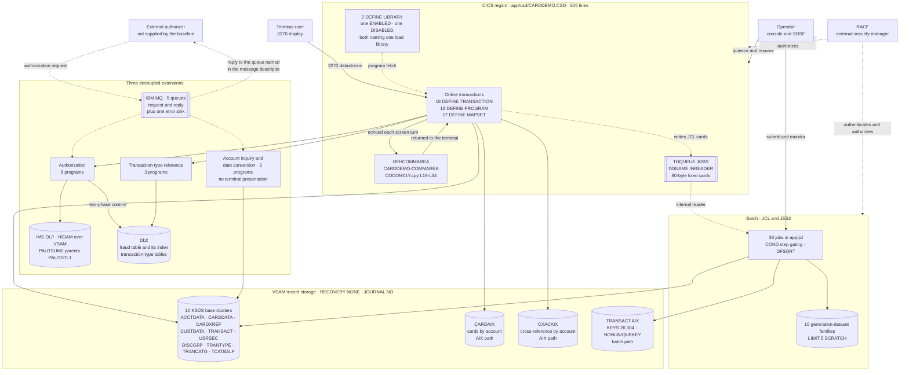

# Context and Container Diagrams

---

> **Purpose.** This document holds the **current-state and target-state context and
> container diagrams** for CardDemo: one view of the z/OS system as it runs today,
> one view of the AWS system the migration adds beside it, and one explicit mapping
> from each mainframe platform primitive to the single managed-service equivalent
> chosen for it. It discharges the "target architecture diagram" half of
> **Deliverable 2** of the seven numbered deliverables: *"/docs/architecture —
> target architecture diagram, service catalog, and data-mapping (VSAM/Db2/IMS →
> AWS) tables"*.
>
> It is deliberately a **topology** document. It answers *what talks to what, and
> which managed service carries which contract*. It does not answer *how a field
> becomes a column*, *which job becomes which state*, or *what the wire format is* —
> each of those has an owning sibling named in
> [Related documents](#related-documents), and this document points there rather
> than restating it. Where a figure is needed only as a diagram legend, the figure
> appears; where the reasoning behind a figure is needed, the citation appears
> instead.
>
> **Source of truth.** Five bodies of reference material, all read and none
> modified:
>
> * the four CICS resource definitions —
>   [`app/csd/CARDDEMO.CSD`](../../app/csd/CARDDEMO.CSD) at 505 lines,
>   [`CRDDEMO2.csd`](../../app/app-authorization-ims-db2-mq/csd/CRDDEMO2.csd),
>   [`CRDDEMOD.csd`](../../app/app-transaction-type-db2/csd/CRDDEMOD.csd) and
>   [`CRDDEMOM.csd`](../../app/app-vsam-mq/csd/CRDDEMOM.csd) — from which every
>   online resource count in the current-state diagram is parsed;
> * the **44** migration-scope COBOL programs — 31 under `app/cbl` plus 13 across
>   the three extension trees — together with the 21 BMS mapsets and the 30
>   copybooks in `app/cpy`;
> * the JCL tree: the **38** jobs in `app/jcl`, of which
>   [`TRANIDX.jcl`](../../app/jcl/TRANIDX.jcl) L25–L28 supplies the alternate-index
>   definition and [`DEFGDGB.jcl`](../../app/jcl/DEFGDGB.jcl) L25–L57 six of the ten
>   generation-dataset bases;
> * the IMS database descriptions, principally
>   [`DBPAUTP0.dbd`](../../app/app-authorization-ims-db2-mq/ims/DBPAUTP0.dbd), whose
>   `ACCESS=(HIDAM,VSAM)` root `PAUTSUM0` parents `PAUTDTL1`, alongside the Db2
>   fraud table and its index; and
> * the shared session structure
>   [`app/cpy/COCOM01Y.cpy`](../../app/cpy/COCOM01Y.cpy) L19–L44, which is the one
>   baseline component with **no counterpart at all** in the target diagram.
>
> For the target state, [`service-catalog.md`](service-catalog.md) is the **naming
> authority** and [`data-model-and-schema-mapping.md`](data-model-and-schema-mapping.md)
> the schema authority. Every service name and every schema name below is taken
> from them verbatim; none is coined here.
>
> **Delivers, and who consumes it.** It delivers three diagrams — current
> state, target state, and the one-way dependency between them — each followed by a
> prose legend, plus the platform-primitive mapping table. Its consumers
> are the root [`README.md`](../../README.md) and
> [`MIGRATION_README.md`](../../MIGRATION_README.md), which link this file
> by exactly the path `docs/architecture/context-and-container-diagrams.md`; the
> nine architecture decision records under `docs/adr/`, which cite these diagrams as
> the topology their decisions produce; and any reader who needs the whole system on
> one screen before descending into a sibling document. The path spelling is part of
> the contract: both peer documents in this folder already name this file by that
> exact string, so a single character of drift breaks their Related-documents rows.
>
> **Current state.** The root migration section, migration guide, and all nine
> ADRs are present. Their links are part of the documentation contract and are
> checked as existing repository paths rather than described as future consumers.
>
> **Caveats.** Four, stated here rather than left to the end. First, **every diagram
> in this document is a design, not an observation.** The infrastructure is partially
> authored and checked to the extent its current state admits; applying it to a live account
> is an operator action outside this scope. Nineteen Terraform directories validate,
> but the two environment roots and the `network`, `observability` and
> `step-functions-batch` modules have no resource graph; recursive TFLint therefore
> reports the measured 86-warning incomplete-tree baseline. No deploy workflow,
> runbook set or infrastructure-module README set is authored. Nothing here asserts
> that a provisioned environment exists, and no element of any diagram was measured
> on a running system, load-tested or benchmarked. Second, a substantial list of technologies is
> deliberately **out of scope** and is enumerated in
> [Caveats, boundaries and out-of-scope](#caveats-boundaries-and-out-of-scope);
> none of it appears as a node or an edge in any diagram, because in a topology
> document drawing a thing is claiming it. Third, this document reports counts only
> where a legend needs them and defers the reconciliation of the repository's four
> distinct component populations to [`service-catalog.md`](service-catalog.md) —
> **no single number here is "the" transaction count.** Fourth, the baseline is
> preserved: the mainframe path keeps working exactly as it does, and both diagrams
> exist simultaneously by design.

**Scope of this document is additive and reference-driven.** It never modifies the
COBOL baseline. `app/**` — programs, copybooks, BMS mapsets, symbolic maps, JCL, the
CICS resource definitions, control cards, procedures, assembler, macros, the catalog
listing, the scheduler definitions and the seed data — is cited here by path and
line, and is read-only. The same reference status applies to `tests/**`,
`scripts/**` and `samples/**`.


## WHY (non-obvious design decisions)

This section carries the reasoning for the choices this document makes *about
itself* — what it draws, in what notation, and what it refuses to draw. Decisions
about the architecture it depicts are justified at the point where each is stated,
under the same four category names.

- Trade-offs: **every diagram is an inline Mermaid fenced block, and no image
  asset is created or referenced.** The alternative was to export rendered
  diagrams — PNG, SVG or a `.drawio` source — and embed them. It was rejected for a
  specific, checkable reason: a Mermaid block is text, so a change to an edge shows
  up as a one-line diff a reviewer can read and argue with in a pull request, and
  the diagram cannot silently disagree with the prose beside it because both change
  in the same commit under the same review. An exported asset is opaque in review —
  a reviewer sees that some bytes changed and must render the file to learn what —
  and it drifts, because nothing forces the export to be regenerated when the
  paragraph explaining it is edited. The accepted cost is real and worth naming:
  Mermaid gives less control over layout than a drawing tool, so these diagrams are
  arranged by grouping and edge direction rather than by pixel placement, and a very
  dense diagram is split into separate views rather than laid out by hand.
- Assumptions: **the repository is authoritative and prose is not.** Every count in
  the current-state diagram was parsed from the files named in the header rather
  than carried over from a narrative summary, and the two places where a measured
  figure and a commonly-quoted figure differ are reconciled explicitly in the
  legends rather than silently resolved — see the eight-versus-ten note under
  [Current-state legend](#current-state-legend). One measurement detail is recorded
  in [Reproducing the current-state figures](#reproducing-the-current-state-figures)
  rather than here, because it is a trap that silently returns a plausible wrong
  number: two of the four resource definitions have **no terminal newline**, which
  interacts with how the counting pattern is written. Every figure below was
  re-measured after that interaction was understood, and the commands that produce
  them are given so a reader can repeat the measurement rather than trust it.
- Alternatives Considered: **three separate diagrams rather than one combined
  before-and-after.** A single diagram showing both states with the mapping drawn as
  edges between them was drafted and abandoned: at 44 programs, 10 datasets, 6
  target primary queues and 8 target services the cross-edges dominate, and the reader loses the
  ability to read either state on its own. The chosen split gives each state a
  diagram that stands alone, expresses the primitive-by-primitive correspondence as
  a table where one line per row is genuinely enough, and reserves a third, minimal
  diagram for the single most important structural fact — the direction of the
  dependency between the two.
- Refactoring Rationale: **the mainframe path is described as running, not as
  superseded.** The migration adds a path; it does not remove one. This is not a
  courtesy — it is what makes the current-state diagram load-bearing. That diagram
  documents a system that keeps operating and that the existing test suite exercises
  as the functional-parity oracle, so it is a specification the target is checked
  against rather than a historical record. Consequently no element of it is labelled
  obsolete or superseded anywhere in this document, and the arrow between the two
  states points one way only, for the reason given under
  [The one-way dependency](#the-one-way-dependency).


## How to read these diagrams

**Notation.** All three diagrams are [Mermaid](https://mermaid.js.org/) flowcharts
embedded as fenced code blocks, so they render in the repository host and diff as
text. Conventions are uniform across the three and match the two peer documents in
this folder:

| Element | Meaning |
|---|---|
| Solid edge `-->` | Synchronous call, transactional write, or in-process control transfer |
| Dashed edge `-.->` | Asynchronous message, scheduled trigger, or build-time relationship |
| `[[double bracket]]` node | A queue or a queue-like card stream |
| `[(cylinder)]` node | A datastore |
| `subgraph` | A deployment or trust boundary — a CICS region, a subnet tier, a VPC |
| `%%` line inside the fence | A note on edge semantics that belongs with the source, not the prose |

**Level.** These are context-and-container views. They stop at the container
boundary — a CICS region, a service, a datastore, a queue — and deliberately do not
descend to component or class level. The program-by-program correspondence is the
subject of `docs/architecture/cobol-to-service-traceability.md`.

**No image assets exist for these diagrams, and none should be looked for.** The
repository does contain a `diagrams/` folder at its root, holding twelve
pre-existing assets — six screen captures and flow charts of the online
application, and six data-model exports covering the IMS and Db2 structures. That
folder is **reference-only and is untouched by this migration**: it is part of the
baseline documentation, it is not regenerated here, and it is not the source of any
diagram below. It is named explicitly so that a reader neither expects an exported
counterpart to the Mermaid blocks below nor mistakes the folder's exclusion from
this migration for an omission.


## Current state — z/OS context and container

The system as it runs today: a CICS region serving 3270 terminals over VSAM record
storage, a JCL batch stream on the same data, and three optional extensions
decoupled by IBM MQ over IMS and Db2.



### Current-state legend

The diagram asserts a claim at every node and edge. The ones that are not
self-evident are explained here.

**The region node's counts are the base region's, not the repository's, and both
figures matter.** The `18` / `18` / `17` inside the CICS-region node are parsed from
[`app/csd/CARDDEMO.CSD`](../../app/csd/CARDDEMO.CSD) alone, which defines the base
application and **no extension resources at all**. Summing all four resource
definitions instead gives a larger population: **25** `DEFINE TRANSACTION`, **26**
`DEFINE PROGRAM` and **21** `DEFINE MAPSET` repository-wide. The diagram carries the
base-region figures because the box it labels *is* the base region, and the three
extensions are drawn as their own subgraph with their own programs. Neither figure is
wrong and neither supersedes the other — they answer different questions, and this
repository maintains **four** distinct component populations that disagree by
construction. Their full reconciliation, including which identifier accounts for each
difference, belongs to [`service-catalog.md`](service-catalog.md) and is deliberately
not repeated here. **No single number in this document is "the" transaction count.**


**The three alternate indexes are drawn as separate access paths, not folded into
the KSDS node.** An alternate index in VSAM is a catalogued object in its own right
with its own key definition, and two of the three are surfaced to CICS as files
that online programs open by name — which is exactly why they must be visible in a
container diagram rather than hidden as an implementation detail of the base
cluster. `CARDAIX` reads cards by account and `CXACAIX` reads the cross-reference by
account; the third, over `TRANSACT`, is defined by
[`TRANIDX.jcl`](../../app/jcl/TRANIDX.jcl) with `KEYS(26 304)` and `NONUNIQUEKEY`
at L27–L28 and is a batch path only. Drawing them separately is what makes the
target-state claim checkable: each one must reappear as a real secondary index, and
`data-model-and-schema-mapping.md` records which index each became.

**Why the diagram shows ten base clusters when the CICS region shows eight.** Both
figures are correct about different questions, and conflating them is the single
most common error in describing this baseline. The base resource definition declares
**8** `DEFINE FILE` stanzas — but **two of those eight are alternate-index *paths*,
not base clusters**: `CARDAIX` at L13 and `CXACAIX` at L63 both name a
`...VSAM.AIX.PATH` dataset. So the eight CICS file resources are six base clusters
plus two access paths, while the full persistent population defined across the JCL
tree is **ten** base clusters and **three** alternate indexes. A frequently-quoted
list of "eight VSAM datasets" is therefore a count of CICS file resources being read
as a count of datasets. The diagram shows the datastore population, so it shows ten
and three — and, for the same reason given above about transaction counts, **neither
eight nor ten is "the" dataset count**; each answers a different question, and the
question this diagram asks is what storage exists.

**A further eleventh KSDS cluster exists and is deliberately absent.** The statement
job defines, loads and discards a work cluster on every run: it deletes and
re-creates the cluster, builds it by sorting the transaction master into
card-number order, copies into it, and reads it as its transaction input. It is a
per-run reordering of data that already exists rather than a master of its own, so
it is not part of the persistent storage population and does not appear as a
datastore node. It becomes an index and a read-only projection in the target rather
than a table of its own, which is recorded in
[`data-model-and-schema-mapping.md`](data-model-and-schema-mapping.md).

**The MQ extensions are drawn outside the CICS region, and that placement is the
architectural point.** The three extensions are not modules of the region; they are
separately deployed applications reached over a message transport, each with its own
resource definition file, and one of them has no terminal presentation at all — the
account-inquiry and date-conversion pair declares **zero** mapsets and exists only
as a request-reply program pair. Drawing them inside the region would imply that a
CICS task failure takes them down and that they share its transaction scope, and
neither is true: the authorization consumer commits its own unit of work per
message. The region does reach them synchronously for the screens that display
pending authorizations and reference data, which is why those two solid edges exist
alongside the dashed message edges.

**The `TDQUEUE(JOBS)` edge is a job-submission tunnel, not a data flow.** An online
program that needs an ad-hoc report writes 80-byte JCL card images to a transient
data queue whose `DDNAME` is `INREADER`, and the system's internal reader submits
them as a job. Nothing about that edge carries business data: it carries a job. It
is drawn dashed and labelled for that reason, because reading it as a data path
would suggest the online transaction produces the report itself, when in fact it
requests that a batch job be started. In the target this becomes a request to start
an orchestration execution — see the mapping table.

**`DFHCOMMAREA` has a bidirectional edge because it is the client that stores it.**
The region is strictly pseudo-conversational: a task ends at every screen turn, so
all continuity between turns lives in one structure that is sent to the terminal and
returned on the next input. The two edges are not decoration; they are the reason
this node exists at all, and the reason it has no counterpart in the target diagram.
The structure and its per-field decomposition are at
[`app/cpy/COCOM01Y.cpy`](../../app/cpy/COCOM01Y.cpy) L19–L44.

**RACF and the operator are drawn as external actors, not as containers.** Neither
is part of the application: RACF is the platform's external security manager
consulted by both the region and the batch stream, and the operator acts on the
region and the job stream from outside. They appear because the target must account
for what they do, and because two of the mapping rows below exist only to record
that these have no direct cloud analogue.

**The external authorizer is shown dashed and labelled as not supplied.** The
baseline contains no request producer for the authorization flow — only a test
stub — so the node marks where requests enter without claiming an implementation
exists. Building one is not in scope.

### Reproducing the current-state figures

Every count in the diagram above is measured, so every count is re-measurable. Run
from the repository root; all four commands are read-only and none writes anything.

```bash
# WHAT: count the resource stanzas of the base CICS definition -- the 18/18/17/8/2/1
#       figures carried in the CICS-region and load-library nodes of the diagram.
# WHY : Assumptions: every stanza in this file begins a line, preceded only by a
#       single leading space, so a line-anchored pattern is exact here and will not
#       match the word DEFINE occurring inside a continuation line.
for k in TRANSACTION PROGRAM MAPSET FILE LIBRARY TDQUEUE; do
  printf '%-12s %s\n' "$k" "$(grep -cE "^[[:space:]]*DEFINE ${k}\(" app/csd/CARDDEMO.CSD)"
done            # -> 18 18 17 8 2 1

# WHAT: count the same stanzas across all four resource definitions.
# WHY : Trade-offs: this sums per-file counts instead of counting a concatenation,
#       and the difference is not cosmetic. Two of the four files end WITHOUT a
#       terminal newline, so concatenating them joins one file's last line to the
#       next file's first line -- producing a line like
#       "CHANGEAGREL(0730)DEFINE MAPSET(COTRTLI)". A line-ANCHORED pattern no longer
#       matches that joined stanza, so it returns 20 for MAPSET and 25 for PROGRAM
#       where the true figures are 21 and 26 -- while still returning a correct 25
#       for TRANSACTION, because no TRANSACTION stanza happens to fall on a join.
#       That is what makes the failure dangerous: it is partial, so the totals stay
#       plausible and internally consistent. An UNANCHORED pattern over a
#       concatenation survives it, because the stanza text is still present.
#       Per-file summation survives it regardless of how the pattern is written,
#       which is why it is used here.
for k in TRANSACTION PROGRAM MAPSET; do
  s=0
  for f in app/csd/CARDDEMO.CSD app/app-*/csd/*.csd; do
    s=$(( s + $(grep -cE "^[[:space:]]*DEFINE ${k}\(" "$f") ))
  done
  printf '%-12s %s\n' "$k" "$s"
done            # -> 25 26 21

# WHAT: count the persistent VSAM population -- the ten base clusters and three
#       alternate indexes drawn as datastore nodes.
# WHY : Assumptions: the first command returns ELEVEN, not ten, and that is correct.
#       The eleventh is the statement job's work cluster, which that job deletes and
#       re-creates on every run; excluding it is what makes the figure a count of
#       persistent masters rather than of every cluster name that appears in JCL.
grep -rhoE 'NAME\([A-Z0-9.]+\.VSAM\.KSDS\)' app/jcl | sort -u | wc -l    # -> 11
grep -rhoE 'NAME\([A-Z0-9.]+\.VSAM\.KSDS\)' app/jcl | sort -u \
  | grep -vc 'TRXFL'                                                     # -> 10
grep -rhoE 'NAME\([A-Z0-9.]+\.VSAM\.AIX\)'  app/jcl | sort -u | wc -l    # -> 3

# WHAT: count the batch population -- 38 jobs, and the ten generation-dataset
#       families drawn as a single datastore node.
# WHY : Assumptions: the family count is of DISTINCT names, not of stanzas. There
#       are eleven stanzas because one family is defined twice -- once at the
#       canonical five-generation limit and once by a separate provisioning job at a
#       larger limit -- so counting stanzas would report eleven families where ten
#       exist.
ls app/jcl | wc -l                                                       # -> 38
grep -rhA2 'GENERATIONDATAGROUP' app/jcl \
  | grep -oE 'NAME\([A-Z0-9.]+\)' | sort -u | wc -l                      # -> 10
```

Two figures in the diagram are not produced by these commands and are cited to their
source instead, because they are structural facts rather than counts: the
alternate-index key definition at [`TRANIDX.jcl`](../../app/jcl/TRANIDX.jcl) L27–L28,
and the IMS parent-child relationship in
[`DBPAUTP0.dbd`](../../app/app-authorization-ims-db2-mq/ims/DBPAUTP0.dbd).


## Target state — AWS context and container

The path the migration adds beside the baseline: a browser single-page application
over an API edge with one public sign-on route and authenticated business routes,
eight stateless services on serverless containers, one managed relational cluster
holding eight schemas in subnets with no internet route, managed queues for the
three decoupled flows, and a managed orchestrator driving the batch chain.

Service names and schema names are taken verbatim from
[`service-catalog.md`](service-catalog.md).

```mermaid
graph TB
    BROWSER["Browser<br/>single-page application<br/>React and TypeScript"]
    CI["Deployment workflow<br/>.github/workflows/deploy.yml<br/>OIDC role assumption · authored"]
    REGISTRY[("Private container registry<br/>scan on push<br/>image reference supplied by the deploy workflow")]
    OPS["Operator<br/>docs/runbooks/ · four runbooks authored<br/>deploy · teardown · data-migration · batch-operations"]

    subgraph EDGE["Public edge"]
        CDN["Content delivery network<br/>origin access control<br/>single-page routing"]
        SPABUCKET[("Object store<br/>built application bundle")]
        APIGW["HTTP API<br/>14 JWT route keys<br/>1 public sign-on route"]
        POOL["Managed user directory<br/>two groups: admin and user"]
    end

    subgraph VPC["Target VPC contract · one region · three availability zones"]
        subgraph PUB["Public subnets"]
            NAT["Egress only<br/>network address translation"]
        end

        subgraph APP["Private application subnets"]
            ALB["Internal load balancer<br/>reached from the edge<br/>through a private link"]
            SVC["Eight target services on serverless containers<br/>auth-service · account-service · card-service<br/>transaction-service · reference-service<br/>batch-service · authorization-service · reporting-service"]
            BATCHTASK["Target batch tasks<br/>one task per orchestration state"]
            ENDPOINTS["Interface endpoints<br/>declared by infra/modules/network"]
            S3GW["Target gateway endpoint<br/>object store"]
        end

        subgraph DATA["Isolated data subnets · no internet route"]
            AURORA[("Managed PostgreSQL cluster<br/>eight schemas<br/>auth · account · card · ledger<br/>reference · batch · authorization · reporting")]
        end
    end

    subgraph MSG["Five primary managed queues · each with a dead-letter queue"]
        FIFOREQ[["Authorization request<br/>group is the card number itself<br/>quarantine boundary on failure"]]
        FIFOREP[["Authorization reply"]]
        INQREQ[["Inquiry request<br/>one queue, one consumer<br/>dispatched on the function code"]]
        STDREP[["Inquiry reply"]]
        ERRQ[["Error sink"]]
    end
%% Five primaries, not six: the account-inquiry and date-conversion requests share
%% ONE queue. AAP 0.4.1.8 maps five MQ queues onto five target queues, and the
%% earlier split into two request queues is withdrawn -- infra/modules/sqs/README.md
%% records why the two-consumer hazard is closed by consumer count instead.

    subgraph ORCH["Batch orchestration"]
        SCHED["Schedule<br/>nightly trigger"]
        SFN["State machine<br/>retry · catch · timeout per state"]
        DATASETS[("Versioned object store<br/>ten dataset families<br/>newest five logical generations retained by cleanup")]
    end

    subgraph XCUT["Cross-cutting"]
        KMS["Customer-managed keys<br/>with rotation"]
        SECRETS["Secret store<br/>values generated at provisioning time"]
        OBS["Logs · metrics · traces · alarms<br/>declared by infra/modules/observability"]
    end

    BROWSER --> CDN
    CDN --> SPABUCKET
    BROWSER -->|"public sign-on or bearer token"| APIGW
    POOL -.->|"signing keys"| APIGW
    APIGW -->|"private link"| ALB
    ALB --> SVC
    SVC -.->|"server-side sign-on exchange"| POOL
    OPS -.-> SFN

    SVC --> AURORA
    SVC --> ENDPOINTS
    SVC --> S3GW
    BATCHTASK --> AURORA
    BATCHTASK --> DATASETS
    NAT -.->|"egress for image pull fallback"| APP

    FIFOREQ -.-> SVC
    SVC -.->|"prospective transactional outbox"| FIFOREP
    INQREQ -.-> SVC
    SVC -.-> STDREP
    SVC -.-> ERRQ

    SCHED -.-> SFN
    SFN --> BATCHTASK
    SVC -.->|"starts an execution"| SFN

    KMS -.->|"encrypts at rest"| AURORA
    KMS -.->|"encrypts at rest"| DATASETS
    KMS -.->|"encrypts at rest"| MSG
    KMS -.->|"encrypts at rest"| SECRETS
    SECRETS -.->|"read at startup"| SVC
    SVC -.-> OBS
    BATCHTASK -.-> OBS
    SFN -.-> OBS

    CI -.->|"builds and pushes"| REGISTRY
    REGISTRY -.->|"image pull through the registry endpoint"| APP
    CI -.->|"publishes the bundle"| SPABUCKET
%% Solid edges are synchronous or transactional; dashed edges are asynchronous,
%% scheduled, or a provisioning-time relationship rather than a request path.
%% There is NO server-side session node: the baseline's DFHCOMMAREA has no
%% counterpart here, for the reason given in the legend below.
%% Reporting reads reach AURORA through SELECT-only cross-schema views on the
%% WRITER. No read replica exists in this design.
%% This is a target-contract diagram. Every node above is declared by an authored
%% Terraform module or workflow -- network, orchestration and observability included --
%% and both environment roots compose them. What is NOT claimed is a live apply: no
%% drawn path has been exercised against a provisioned AWS account.
```



### Target-state legend

Each bullet below is labelled with the Rule 1 category that carries its reasoning,
because in a topology diagram the absent nodes are as much a design decision as the
present ones.

- Refactoring Rationale: **the `DFHCOMMAREA` node has no counterpart in this
  diagram, and its absence is the single most consequential structural change in the
  migration.** In the baseline one structure carries every kind of continuity between
  screen turns; here it decomposes into four mechanisms, none of which is a
  server-side session store. Navigation becomes client-side router history, so **no
  server-side "next program" field exists at all**. Identity becomes signed token
  claims validated on every protected request; the one public sign-on route performs
  the server-side exchange that obtains the token before those requests begin.
  Selection context — which account, which card, which customer — becomes request
  path and query parameters, which is what makes each protected request independently
  authorizable. And the first-entry-versus-re-entry discriminator **disappears
  entirely**, because a stateless handler that returns a field-error array has no
  turn to remember. The security consequence deserves stating precisely rather than
  as a general improvement: in the baseline the structure is storage the client
  receives and echoes back, so the field that decides administrative access arrives
  *from the client* and a client could in principle assert its own user type; here the
  group claim is signed by the directory and validated per protected request, so the
  client cannot assert its own privileges at all.
  Statelessness then falls out as a consequence — with no session store and no
  sticky sessions, each service runs as several interchangeable instances behind the
  load balancer. The per-field decomposition is tabulated in
  [`service-catalog.md`](service-catalog.md); the authorization model and the
  encryption and isolation posture are specified in
  [`security-and-identity.md`](security-and-identity.md).
- Refactoring Rationale: **uniform user-existence errors intentionally collapse two
  baseline responses.** The browser submits the transient credential to the public
  sign-on route; auth-service is intended to call Cognito's `USER_PASSWORD_AUTH`
  flow rather than let the browser call the directory directly. With user-existence
  errors suppressed, both an unknown user and a bad password return
  `Wrong Password. Try again ...`; unrelated provider failures return
  `Unable to verify the User ...`. The baseline's
  `User not found. Try again ...` remains catalogued for traceability **only**: it
  is not a public response of any published operation, and there is no posture in
  which it becomes one, because `infra/modules/cognito` fixes
  `PreventUserExistenceErrors` inside the module and deliberately publishes no
  input that could relax it. An earlier revision of this bullet offered "a
  deliberately selected legacy posture" as the second possibility; that posture
  does not exist and the clause is withdrawn. This is a security-driven
  behavioural divergence, not preservation of all three sign-on messages, and it
  is registered as `D-SIGNON-EXISTENCE-UNIFORM` in section 7.4 of the
  [divergence register](cobol-to-service-traceability.md).
- Trade-offs: **reporting reads go to the writer through read-only cross-schema
  views, and there is deliberately no read-replica node.** The alternative — adding a
  replica and pointing reporting at it — was considered and is **out of scope**. It
  was rejected because it buys nothing for functional parity while adding two real
  costs: a second always-on instance to pay for, and replica-lag semantics, which
  means a report could legitimately disagree with the screen a user just looked at
  and neither would be wrong. The baseline has no such divergence to reproduce. The
  accepted cost is that reporting query load lands on the writer; it is accepted
  because the reporting workload here is a nightly batch chain plus on-demand report
  requests, not a continuous analytical load. The `reporting` schema accordingly
  owns **no tables at all** — only views, reachable through `SELECT` grants and
  through no base-table grant.
- Trade-offs: **one region with three availability zones, and nothing more.**
  Multi-region topology and disaster-recovery failover are **out of scope** and
  appear as no node and no edge anywhere in this document. The target three-zone
  topology is intended to tolerate a single zone's loss through cluster failover and
  load-balancer distribution; the network graph and environment composition that
  would provide that topology are absent. The accepted cost is stated plainly: this
  design does not survive the loss of a region, and nothing here should be read as
  claiming that a deployed topology exists or has been failover-tested.
- Alternatives Considered: **no streaming-platform node.** A log-based broker —
  Kafka or a managed stream — was considered for the three decoupled flows and
  rejected. The requirement the baseline actually expresses is request-reply: a
  producer sends a request, names a queue to reply to in the message descriptor, and
  waits for a correlated response. Queues express that directly, including the
  ordering guarantee that matters, which is per-card ordering rather than global
  ordering. A log-based broker would add partition assignment, consumer-group
  rebalancing and offset management — semantics the baseline never had and that no
  parity requirement asks for — while still requiring a reply mechanism built on
  top. Both are therefore out of scope, and the wire contract, correlation identity,
  ordering and deduplication guarantees are specified in
  [`messaging-contracts.md`](messaging-contracts.md).
- Alternatives Considered: **no cache node.** An in-memory cache tier was considered
  and rejected because the baseline has no cache at all, so adding one would
  introduce an invalidation problem that does not currently exist — and the first
  behaviour to break under a stale cache is exactly the kind the golden-master
  comparison is designed to catch, such as a balance read after a posting write.
  Reference data is the plausible candidate and is small enough to be served from
  indexed lookups on the cluster. Managed caching is out of scope.
- Assumptions: **the target isolated data subnets have no route to the internet, and
  interface endpoints are what make that survivable.** The cluster is intended to sit in subnets
  with no gateway route in either direction, so it is unreachable from outside the
  private network by construction rather than by rule — which is what makes the
  blast-radius claim in
  [`security-and-identity.md`](security-and-identity.md) a property of
  the topology rather than an aspiration. That isolation only works because service
  traffic to managed APIs — the registry, logs, the secret store, keys, queues, the
  orchestrator, the parameter store, the trace collector's export target and the
  identity provider — leaves through interface endpoints inside
  the network, with a gateway endpoint for the object store, so no task needs a path
  to the internet to reach the platform services it depends on. Refactoring
  Rationale: the last two were added to this list rather than left implicit. Tracing
  and identity were the two managed dependencies the endpoint set originally omitted,
  and an enumeration that stops before them is exactly the reading under which the
  omission looked deliberate. The target egress
  path is drawn dashed and scoped: address translation from the private application
  subnets only, never from the data subnets. The network module currently has no
  resource graph, so these are intended absences and paths rather than deployed ones.
- Alternatives Considered: **the node labels name a capability, not a product.** The
  diagram says "managed PostgreSQL cluster", "internal load balancer" and "managed
  user directory" where it could have named the specific services selected for each.
  Naming the products was the obvious alternative and was rejected for a concrete
  reason rather than a stylistic one: the product selections are decisions with
  recorded rationale and cost analysis, and they are already stated once — row by row
  in [Platform-primitive mapping](#platform-primitive-mapping) and in full in the
  architecture decision records under `docs/adr/`. Repeating them inside the diagram
  would create a second place to edit whenever a decision is revisited, and a stale
  product name in a diagram does not read as out of date — it reads as current, so it
  actively misinforms, whereas a capability label stays true across a change of
  product. Two things make this cost-free rather than a loss of information: the
  mapping table resolves every node to its product on the same page, and the short
  node identifiers in the Mermaid source — which are internal to the source and never
  rendered — carry the mnemonic, so the correspondence is legible to anyone reading
  the block as text. The accepted cost is that a reader who wants the product names
  must look one section down.

- Assumptions: **nine Maven modules, eight bounded contexts, and the diagram shows
  eight.** A ninth module, `common-lib`, sits alongside the eight services and is
  the **shared kernel** — it owns no schema, exposes no endpoint and is intended to be deployed as
  a library compiled into the other eight rather than as a container. It is
  deliberately not a node here, because a container diagram shows what is deployed
  and a library is not deployed on its own. The distinction matters when counting: a
  build contains nine modules and the target topology contains eight services; no
  environment currently deploys them. It exists because the
  concerns it holds — fixed-point money, the record codecs, the error model, the
  page envelope — must have exactly one implementation, and it is the direct
  analogue of the single copybook include path every baseline program compiles
  against.
- Assumptions: **the eight services are drawn as one node, not eight.** They share
  an identical internal shape and an identical set of infrastructure edges — the
  same cluster, the same endpoints, the same secret store, the same log
  destination — so drawing eight nodes would multiply every one of those edges by
  eight and obscure the topology the diagram exists to show. The per-service
  responsibilities, owned data and inter-service dependency edges are the subject of
  [`service-catalog.md`](service-catalog.md), which draws exactly that graph. The
  names are listed inside the node so the correspondence is not lost.
- Assumptions: **the container registry appears without an address, deliberately.**
  No registry hostname, account identifier or resource identifier appears anywhere in
  this document, because a concrete registry address is an account-specific value that
  has no place in version control. The image reference reaching a task is produced at
  deploy time and consumed through the `image_uri` input of
  [`../../infra/modules/ecs-service`](../../infra/modules/ecs-service).
  Refactoring Rationale: this bullet previously said the deployment workflow was not
  authored, so the registry described a target boundary rather than a CI path.
  [`.github/workflows/deploy.yml`](../../.github/workflows/deploy.yml) is authored and
  does assume a role by OIDC with no stored credential, so the edge is a real CI path;
  what remains unproven is that it has ever run against a live account, and that is the
  narrower claim this bullet now makes.


## Platform-primitive mapping

Each mainframe platform primitive has **exactly one** managed-service counterpart in
the target path, chosen so that the observable contract the primitive carried is
preserved. Read the table as a correspondence, not as a substitution: everything in
the **Current primitive** column keeps running in the baseline, and the
**Contract preserved** column states what the **Target counterpart** has to reproduce
for the correspondence to hold. That contract column is the point of the table — a
mapping that does not name what it preserves is a technology swap rather than a
migration. One line per row, with the owning sibling document named for the detail.

| Concern | Current primitive | Target counterpart | Contract preserved | Detail owned by |
|---|---|---|---|---|
| Online interaction | CICS pseudo-conversational tasks, continuity in `DFHCOMMAREA` | Stateless request handlers; identity from signed claims, selection from the request path | Screen-by-screen behaviour and every user-visible message string, verbatim | [`service-catalog.md`](service-catalog.md) |
| Presentation | 21 BMS mapsets, fixed 24×80 character grid, extended field attributes | Target single-page application to be delivered from an object store behind a content delivery network | Field semantics, function-key actions, error-highlight behaviour, message text | [`design-token-reference.md`](design-token-reference.md) |
| Program flow | `XCTL` and `LINK` between programs | `XCTL` becomes a client-side route change; `LINK` becomes a method or in-network call | Reachability of every online function | `docs/architecture/cobol-to-service-traceability.md` |
| Record storage | 10 VSAM KSDS base clusters, `RECOVERY(NONE)`, `JOURNAL(NO)` | One managed PostgreSQL cluster, eight schemas, encrypted with automated backups | Primary keys, field lengths, decimal scale and sign semantics | [`data-model-and-schema-mapping.md`](data-model-and-schema-mapping.md) |
| Secondary access | 3 alternate indexes, two surfaced to CICS as files | Three real non-unique secondary indexes on the same columns | Every browse and lookup access path | [`data-model-and-schema-mapping.md`](data-model-and-schema-mapping.md) |
| Browse paging | `STARTBR` / `READNEXT` / `READPREV` / `ENDBR` with the cursor key in the session structure | Keyset pagination over the same key columns | Page boundaries and next/previous availability under concurrent inserts | [`data-model-and-schema-mapping.md`](data-model-and-schema-mapping.md) |
| Batch | 38 JCL jobs, `COND` step gating, DFSORT, 10 generation-dataset families | Scheduled trigger into a state machine invoking container tasks; dataset generations as object-store prefixes | Step order, condition-code semantics, generation retention, output bytes | `docs/architecture/batch-orchestration.md` |
| Messaging | 5 IBM MQ queues, two different syncpoint disciplines | Six primary managed queues — FIFO request/reply for authorization; separate account/date inquiry requests; one shared inquiry reply; one error sink — each with a dead-letter queue | Field order and delimiter, correlation identity, reply routing, ordering guarantees | [`messaging-contracts.md`](messaging-contracts.md) |
| Extension datastores | IMS DL/I segments plus Db2 tables, joined by two-phase commit | One PostgreSQL schema; **two-phase commit is eliminated, not emulated** | Segment field layouts, value domains as check constraints, index order | [`data-model-and-schema-mapping.md`](data-model-and-schema-mapping.md) |
| Identity | `USRSEC` VSAM file holding a plaintext password field | Managed user directory; fixed `carddemo-admin`/`carddemo-user` groups surfaced as signed claims; auth-service handles the transient credential | Administrator-versus-user split preserved. **Intentional divergence:** unknown user and bad password both return `Wrong Password. Try again ...`; unrelated provider failures return `Unable to verify the User ...` | [`security-and-identity.md`](security-and-identity.md) |
| System authorization | RACF, the external security manager | Least-privilege task roles plus directory groups — **a mapping, not a port** | Effective privilege boundaries | [`security-and-identity.md`](security-and-identity.md) |
| Operations | Operator quiesce and resume around the batch window | Orchestration states that set and clear a read-only flag in a parameter store | The quiesce-and-resume bracket around the batch window | `docs/architecture/batch-orchestration.md` |
| Ad-hoc job submission | An online program writes 80-byte JCL cards to `TDQUEUE(JOBS)` via `DDNAME(INREADER)` | A service starts an orchestration execution | The ability to request a report on demand from the online path | `docs/architecture/batch-orchestration.md` |
| Deployment | A load library, refreshed by a resource-definition utility | Container images in a private registry, deployed by [`.github/workflows/deploy.yml`](../../.github/workflows/deploy.yml) using short-lived federated role assumption; the workflow is authored, and no run against a live account is claimed | Deployable-unit versioning and rollback capability | `docs/adr/` |
| Infrastructure | Not expressed as code anywhere in the baseline | 16 module directories, bootstrap resources and two environment roots, each root carrying its backend, variables, tfvars, outputs and README; all 19 directories are authored and statically checked | Nothing to preserve — this is net-new, and the row exists to record that | [`../../infra/README.md`](../../infra/README.md) |
| Observability | Job logs, `SYSOUT` and `SYSPRINT` output, the operator console | Centralised logs, metrics and traces with alarms and a notification topic, declared by [`../../infra/modules/observability`](../../infra/modules/observability) | Auditability of every batch step's outcome | [`observability.md`](observability.md) |

### Primitives with no cloud analogue

Six baseline mechanisms have no managed-service counterpart. Naming them as retired
is more useful than inventing an equivalent, because an invented equivalent is a
claim that something was migrated when it was not. In every case the *intent* is
carried somewhere; the *mechanism* is not.

| Primitive | Disposition |
|---|---|
| RACF | **Mapped, not ported.** Its role is filled by least-privilege task roles plus directory groups. There is no cloud construct that corresponds to an external security manager mediating both online and batch access to datasets, so this is documented as a correspondence of effect rather than a migration of a component |
| The resource-definition deployment utility | **Retired.** Defining online resources by submitting a batch update against a definition file has no counterpart; resource definition becomes infrastructure code applied by the same pipeline that ships the images |
| The operator quiesce mechanism | **Intent carried, mechanism retired.** The quiesce-and-resume bracket around the batch window is preserved as orchestration states that set and clear a read-only flag; the console-command mechanism that achieves it today is not reproduced |
| The file-transfer-to-job-entry submission tunnel | **Retired.** Submitting jobs by transferring card images into the job-entry subsystem has no analogue; job initiation becomes an orchestration execution |
| The assembler modules and macro library | **Retired.** These exist to interface with platform services that do not exist in the target, so there is nothing for them to interface with |
| The enterprise scheduler definitions | **Intent carried, syntax retired.** The nightly chain and its dependencies are expressed as a schedule plus a state machine; neither scheduler's definition syntax is translated |

The authoritative register of every retirement and every documented behavioural
divergence is `docs/architecture/cobol-to-service-traceability.md`. This table
records only the platform primitives; that document records the programs, the
copybooks, the jobs and the divergences.


## The one-way dependency

One relationship matters more than any edge inside either diagram: the direction of
the dependency between them.

```mermaid
graph LR
    subgraph CURRENT["Current state · z/OS · REFERENCE — read, never modified"]
        C1["44 COBOL programs<br/>21 BMS mapsets · 30 copybooks<br/>38 JCL jobs · 4 resource definitions"]
        C2["10 VSAM KSDS base clusters<br/>3 alternate indexes<br/>22 seed data files"]
        C3["Existing test suite<br/>the functional-parity oracle"]
    end

    subgraph TARGET["Target contract · AWS · authored incrementally"]
        T1["9 Maven modules<br/>8 services · 16 controllers<br/>card-service handlers absent"]
        T2["Single-page application<br/>21 screen routes contracted<br/>4 authored"]
        T3["Extract-transform-load package<br/>16 infrastructure module directories"]
    end

    CURRENT ==>|"business rules extracted · contracts defined · parity to be verified against"| TARGET
%% The dependency is one-way and total. Target code READS the baseline as its
%% specification; it NEVER writes it. The current-state subgraph is byte-identical
%% to what it was before this migration. Target nodes describe contracted
%% deployables; they do not claim each implementation or composition file exists.
%% There is deliberately NO reverse edge: nothing in the target is a prerequisite
%% for the baseline continuing to run exactly as it does.
```



### One-way dependency legend

**The arrow has one head, and the absence of a reverse edge is the claim.** Target
code reads the baseline as its specification and never writes it. Concretely: no
file under `app/**` is modified by this migration, no baseline defect is corrected
in COBOL, and the existing test suite continues to run unchanged as the
functional-parity oracle. Nothing in the target is a prerequisite for the baseline
continuing to operate.

- Refactoring Rationale: **the migration adds a path; it does not remove one.** The
  existing mainframe deployment path is left exactly as it is, and `samples/**` —
  including the deployment archives and configuration for the existing
  mainframe-modernization path — is untouched. The practical consequence is worth
  stating because it is the reason the additive shape was chosen over an in-place
  rewrite: reverting to the mainframe path requires **no un-migration**, because the
  original programs, data and jobs are still exactly where they were and still run.
  A rollback is therefore a routing decision rather than a restoration project. The
  baseline is not superseded by the target; it is the specification the target is
  measured against, and it keeps its own pipeline.
- Assumptions: **the baseline's byte-identity is what makes parity verifiable at
  all.** The verification method depends on it — run the baseline pipeline to produce
  reference outputs, run the equivalent target job over migrated data, and compare
  after the same timestamp normalisation. If the baseline could drift, a comparison
  failure would be ambiguous between a target defect and a baseline change. Keeping
  `app/**` and `tests/**` read-only removes that ambiguity by construction, which is
  why it is a hard constraint rather than a convention.
- Trade-offs: **the three known baseline defects are left in place.** Where a target
  implementation deliberately behaves differently from the baseline, the divergence
  is recorded rather than resolved by editing COBOL — the accepted cost being that
  the baseline and the target are knowingly not identical in those specific cases,
  and the benefit being that the oracle stays stable and the difference stays
  visible. Every such case is registered in
  `docs/architecture/cobol-to-service-traceability.md`, which is the register for all
  of them; none is corrected in the baseline, and this document does not enumerate
  them.


## Caveats, boundaries and out-of-scope

### The deployment boundary

**No diagram in this document depicts a running environment.** Every diagram is a
design. The infrastructure is partially authored and checked to the extent its current state
admits, and applying it to a live account — with the cost that incurs — is an
**operator action outside this scope**. Consequently:

* no claim is made anywhere in this document that a provisioned environment exists;
* no element of any diagram was measured on a running system, load-tested or
  benchmarked, and no throughput, latency or availability figure appears anywhere
  above, because there is none to report;
* every count in the current-state diagram comes from the repository, and every
  statement about the target state describes a design.

[`service-catalog.md`](service-catalog.md) records the exact matrix of which
infrastructure checks pass and which require a live account. That matrix is not
restated here, because one copy is easier to keep true than two. The exact
provisioning and teardown commands belong to
[`../runbooks/deploy.md`](../runbooks/deploy.md) and
[`../runbooks/teardown.md`](../runbooks/teardown.md).

### Explicitly out of scope

The following are **not delivered** by this migration and appear nowhere in this
document as a node, an edge, or a delivered capability. Each is listed so that its
absence is a recorded decision rather than an apparent omission:

* **Multi-region topology and disaster recovery** — the design is single-region,
  three-availability-zone only.
* **Blue-green and canary deployment** — rolling service deployment only.
* **Streaming platforms** — no Kafka and no Kinesis. The messaging requirement the
  baseline expresses is request-reply, which queues satisfy directly.
* **Application-level caching** — no Redis and no ElastiCache. The baseline has no
  cache tier and none is required for parity.
* **Read replicas** — reporting reads go to the writer through `SELECT`-only
  cross-schema views, for the reason given in the target-state legend.
* **The Db2 rewards extension, IMS DC, SFTP integration, and exposing distributed
  transactions** — all four are listed as future work by the baseline itself and are
  not brought into this migration.
* **A request producer for the authorization flow** — the baseline supplies only a
  test stub, and building an external authorizer client is not requested.

### One boundary worth stating twice

The current-state diagram is the more likely of the two to be misread, because a
diagram of a system that still runs looks like a diagram of something being
switched off. It is not. It documents the behavioural specification this migration
encodes and the system that continues to serve its users, and it is drawn with the
same care as the target diagram for exactly that reason.


## Related documents

All related architecture documents are present. Links are used so a stale path
fails visibly instead of remaining an untestable future contract.

| Document | What it covers that this one does not |
|---|---|
| [`service-catalog.md`](service-catalog.md) | The naming authority: per-service responsibilities, owned data, the inter-service dependency graph, and the full reconciliation of the repository's four component populations |
| [`data-model-and-schema-mapping.md`](data-model-and-schema-mapping.md) | Field-by-field derivation from copybook to column, the alternate-index mapping, and the money invariant |
| [`batch-orchestration.md`](batch-orchestration.md) | The job-to-state mapping, condition-code semantics and generation-dataset handling |
| [`messaging-contracts.md`](messaging-contracts.md) | Queue mapping, the positional wire format, correlation, ordering and deduplication |
| [`security-and-identity.md`](security-and-identity.md) | The identity mapping, the authorization model, encryption at rest and in transit, and network isolation |
| [`observability.md`](observability.md) | Logs, metrics, traces and alarms |
| [`design-token-reference.md`](design-token-reference.md) | The presentation-layer mapping from the 21 mapsets to screen routes and design tokens |
| [`cobol-to-service-traceability.md`](cobol-to-service-traceability.md) | The program-by-program matrix, the authoritative retirement register, and every documented behavioural divergence |
| [`../CODE_DOCUMENTATION_STANDARD.md`](../CODE_DOCUMENTATION_STANDARD.md) | The documentation convention this document follows |

The in-repository precedent for this convention is
[`tests/README.md`](../../tests/README.md) §12, whose explainability blockquote
imposes the same obligation and names the same four justification categories used
throughout this document.
