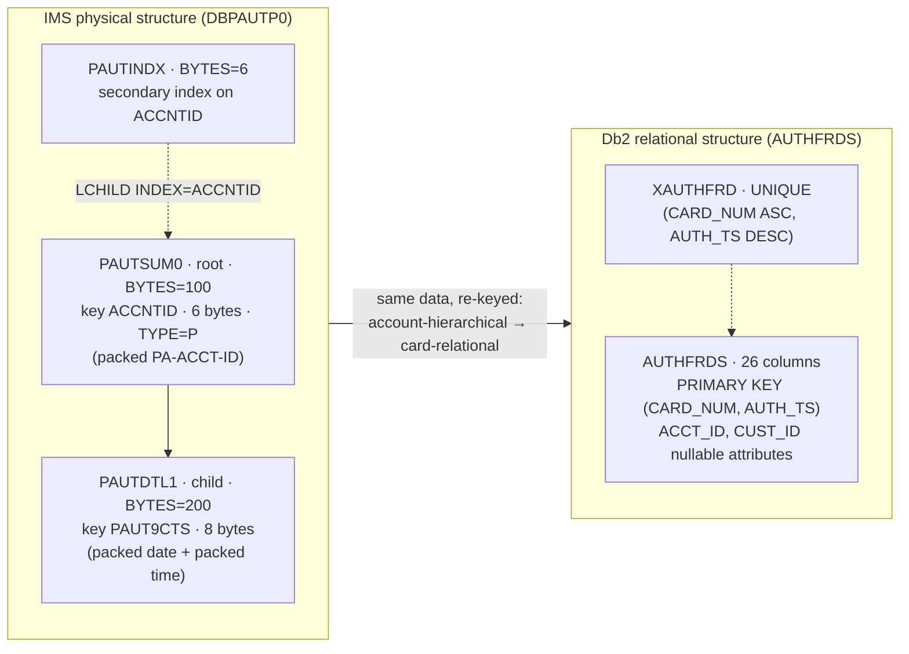
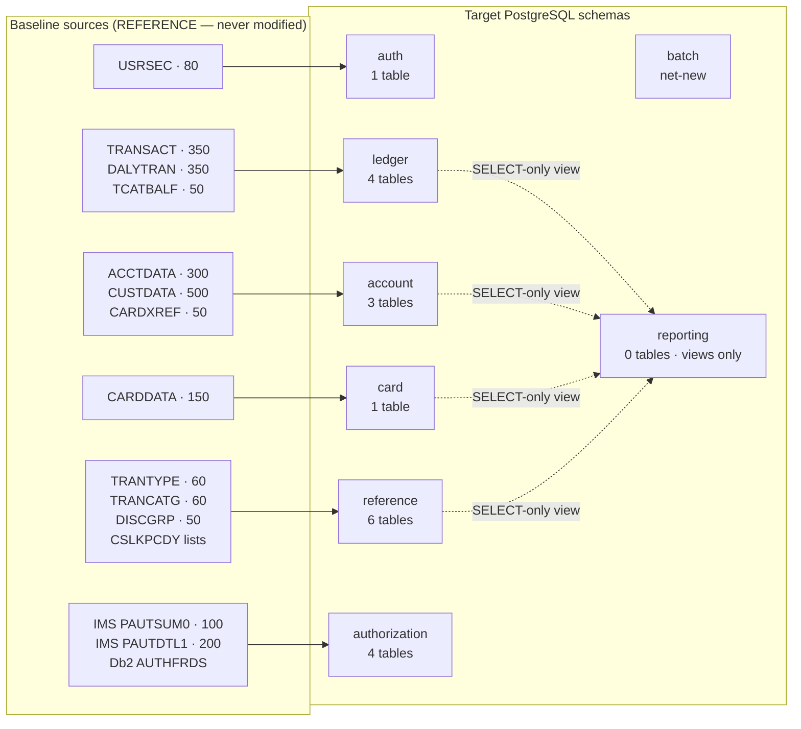

# Data Model and Schema Mapping

---

> **Purpose.** This document is the field-by-field derivation of the target
> PostgreSQL data model from the baseline's VSAM record layouts, Db2 table
> definitions and IMS segment definitions. It fixes the `PICTURE`-to-type
> derivation rules that every schema migration, every data-transfer object and
> every extract-transform-load reader then obeys, and it records the offsets,
> record lengths, dropped `FILLER` and name corrections that those readers depend
> on. It discharges the "data-mapping" half of **Deliverable 2** of the seven
> numbered deliverables: *"/docs/architecture — target architecture diagram,
> service catalog, and data-mapping (VSAM/Db2/IMS → AWS) tables"*.
>
> It is authored second among the nine documents in this folder, after
> [`service-catalog.md`](service-catalog.md), because the derivation rules and the
> per-schema table inventory established here are cited by the batch, messaging,
> security and traceability documents. Every service name and schema name below is
> taken verbatim from the catalog, which is the naming authority; this document
> introduces no variant spelling of either.
>
> **Source of truth.** Five bodies of reference material, all read and none
> modified:
>
> * the **30 base copybooks** in [`app/cpy`](../../app/cpy) — of which eleven
>   define the record layouts of the migrated datasets, one
>   ([`CSLKPCDY.cpy`](../../app/cpy/CSLKPCDY.cpy), 1318 lines) supplies the seeded
>   lookup domains, and one ([`CVEXPORT.cpy`](../../app/cpy/CVEXPORT.cpy), 103
>   lines) defines the 500-byte export record;
> * the **two IMS segment copybooks** of the authorization extension —
>   [`CIPAUSMY.cpy`](../../app/app-authorization-ims-db2-mq/cpy/CIPAUSMY.cpy) (31
>   lines, the summary segment) and
>   [`CIPAUDTY.cpy`](../../app/app-authorization-ims-db2-mq/cpy/CIPAUDTY.cpy) (54
>   lines, the detail segment) — together with the message payload layouts
>   [`CCPAURQY.cpy`](../../app/app-authorization-ims-db2-mq/cpy/CCPAURQY.cpy) and
>   [`CCPAURLY.cpy`](../../app/app-authorization-ims-db2-mq/cpy/CCPAURLY.cpy);
> * the **six Db2 DDL files** —
>   [`AUTHFRDS.ddl`](../../app/app-authorization-ims-db2-mq/ddl/AUTHFRDS.ddl) (28
>   lines) and
>   [`XAUTHFRD.ddl`](../../app/app-authorization-ims-db2-mq/ddl/XAUTHFRD.ddl) (4
>   lines) in the authorization tree, and
>   [`TRNTYPE.ddl`](../../app/app-transaction-type-db2/ddl/TRNTYPE.ddl) (4 lines),
>   [`TRNTYCAT.ddl`](../../app/app-transaction-type-db2/ddl/TRNTYCAT.ddl) (7
>   lines),
>   [`XTRNTYPE.ddl`](../../app/app-transaction-type-db2/ddl/XTRNTYPE.ddl) (5 lines)
>   and
>   [`XTRNTYCAT.ddl`](../../app/app-transaction-type-db2/ddl/XTRNTYCAT.ddl) (5
>   lines) in the transaction-type tree — plus the three matching `dcl` host-variable
>   declarations;
> * the **IMS database and program-specification sources** in
>   [`app/app-authorization-ims-db2-mq/ims`](../../app/app-authorization-ims-db2-mq/ims) —
>   `DBPAUTP0.dbd` (41 lines), `DBPAUTX0.dbd` (34 lines), the two GSAM descriptions
>   `PADFLDBD.DBD` and `PASFLDBD.DBD`, and `DLIGSAMP.PSB`;
> * the **JCL sort control cards** that independently corroborate record offsets —
>   [`TRANREPT.jcl`](../../app/jcl/TRANREPT.jcl) L41–L48,
>   [`PRTCATBL.jcl`](../../app/jcl/PRTCATBL.jcl) L47–L50,
>   [`TRANIDX.jcl`](../../app/jcl/TRANIDX.jcl) L25–L30 and
>   [`POSTTRAN.jcl`](../../app/jcl/POSTTRAN.jcl) L36.
>
> **Delivers, and who consumes it.** It delivers eight things: the
> `PICTURE`-to-type derivation rules; the per-schema table and column inventory for
> all eight bounded contexts; the dataset-to-copybook-to-record-length contract that
> fixes every reader offset; the per-record `FILLER` inventory; the three name
> corrections; the alternate-index-to-secondary-index mapping; the money
> invariant; and the register of the mapping decisions that deliberately diverge
> from the baseline. Its declared consumers are the per-service Flyway migrations
> under `services/*/src/main/resources/db/migration/**`, whose column types must
> match these tables; the copybook layout module of the extract-transform-load
> package, whose byte offsets must match §[The dataset, copybook and record-length
> contract](#the-dataset-copybook-and-record-length-contract); the data-transfer
> objects and mappers in every service; and the sibling documents
> [`batch-orchestration.md`](batch-orchestration.md),
> [`messaging-contracts.md`](messaging-contracts.md),
> [`security-and-identity.md`](security-and-identity.md) and
> `docs/architecture/cobol-to-service-traceability.md`. The
> catalog links this file by exactly the path
> [`docs/architecture/data-model-and-schema-mapping.md`](data-model-and-schema-mapping.md),
> so the spelling is part of
> the contract.
>
> **Measured consumer status.** Five per-service Flyway files are authored across
> four services: auth V1, batch V1, reference V1 plus V2, and transaction V1. The
> extract-transform-load layout module exists, as do the batch, messaging and
> security sibling documents. Reporting has one DTO and one mapper utility, but no
> other service has an authored DTO/mapper implementation, and the traceability
> matrix remains absent. Assumptions: a path naming an absent document is a code
> span; an existing document is linked, per
> [`../CODE_DOCUMENTATION_STANDARD.md`](../CODE_DOCUMENTATION_STANDARD.md). This
> prevents a target consumer from being presented as delivered.
>
> **Caveats.** Four, stated up front rather than buried. First, this describes a
> **target design**: the infrastructure is partially authored and statically checked
> (the measured per-check state is tabulated under
> [Caveats, boundaries and out-of-scope](#caveats-boundaries-and-out-of-scope)), and
> applying it to a live account is an operator action outside this scope, so no
> table below is asserted to exist in a provisioned database and no figure in this
> document was measured on a running system. Second, a list of technologies is
> deliberately **out of scope** and is named in
> [Caveats, boundaries and out-of-scope](#caveats-boundaries-and-out-of-scope) —
> none of it appears anywhere below as delivered. Third, where the repository and
> narrative prose disagree about a count, **the repository wins**: every count in
> this document is the one measured from the file it cites, and the five figures
> most easily mistaken carry the measurement that establishes them at the point
> they are stated. Fourth, the baseline is preserved
> byte-for-byte — nothing under `app/**` is modified, no baseline defect is
> corrected in COBOL, and the existing mainframe path keeps working exactly as it
> does.

**Scope of this document is additive and reference-driven.** `app/**` — programs,
copybooks, BMS mapsets, symbolic maps, JCL, the CICS resource definitions, control
cards, procedures and the seed data — is cited here by path and line and is
read-only. The same reference status applies to `tests/**`, `scripts/**` and
`samples/**`.

**Exactly three pre-existing files may be modified by this migration**, and naming
them is what makes the additive claim above checkable rather than asserted: `README.md`,
`CONTRIBUTING.md` and `.gitignore`. There is no fourth — every other artifact of the
migration, every table derived below included, is a new file in a new tree. The
current `.gitignore` contains the migration's build-output, state, plan-file and
environment patterns; the root `README.md` and `CONTRIBUTING.md` migration updates
remain unauthored.


## WHY (non-obvious design decisions)

This section carries the reasoning for the choices made *by this document about
itself*. Every mapping decision it records is justified at the point where the
mapping is stated, under the same four category names.

- Assumptions: the copybook `PICTURE` clauses **are** the external data-format
  contract, so this document's dominant category is necessarily `Assumptions`.
  Every derivation rule below is an assumption about byte-level layout — width,
  scale, sign representation, character set, padding — and each one is stated as
  such rather than as a preference. Where a rule can be checked against a second,
  independent source in the repository, it is, and the check is shown.
- Assumptions: the repository is authoritative and prose is not. Every count,
  offset, length and column total below was measured directly from the files named
  in the header. Five of them are easy to get wrong and are therefore stated with
  the measurement that establishes them, in a marked callout at the point of use —
  the fraud table's column count, the detail segment's field count, the file that
  holds the restrict-on-delete clause, the reach of one misspelling, and whether
  one copybook carries a record-length annotation. A figure that cannot be
  re-derived from a cited file has no standing in a document whose whole purpose is
  byte-level fidelity.
- Refactoring Rationale:  the baseline already contains a COBOL-to-relational
  mapping of its own, in the Db2 DDL of its two extensions. That mapping is used
  here as **precedent rather than paraphrase** — including the one place where it
  disagrees with the derivation rules adopted for the target. Presenting the
  target's rules without the baseline's own answer would turn a checkable argument
  into an assertion, and would hide the fact that a reasonable alternative exists
  and was measured.
- Trade-offs: this document reproduces **complete field-by-field tables** —
  every field of every migrated record, with its picture, its byte width, its
  zero-based offset and its target column — rather than a summary of the rules and
  a worked example. The tables are long, and the accepted cost is length. The
  alternative was a rules-only document leaving each reader to derive offsets
  independently, which was rejected because two readers deriving the same offset
  independently is precisely how two decoders of the same record come to disagree
  by one byte, and a one-byte disagreement in a zoned-decimal money field is
  silent.
- Alternatives Considered: the derivation rules could have lived inside each
  service's migration file as comments next to the columns they govern. That was
  rejected because eleven record layouts feed eight schemas, several fields cross
  context boundaries — the account identifier appears in four different records —
  and a rule copied into eight migrations drifts in eight directions. Fixing the
  rules once here and citing them from the migrations is the same
  single-source-of-truth discipline the baseline itself applies by compiling every
  program against one copybook include path, a discipline
  [`tests/README.md`](../../tests/README.md) §12 (L540–L542) states as a requirement
  in its own terms: *"never duplicate a layout; keep it single‑sourced from
  `app/cpy/`"* — reproduced with that file's non-breaking hyphen intact, because a
  quotation this document presents as verbatim has to be verbatim down to the
  codepoint.
- Assumptions: the documentation convention this file follows is the one
  already established in the repository, rather than one invented for it. The
  in-repository precedent is [`tests/README.md`](../../tests/README.md) §12
  (L544–L549), which requires every test, fixture builder, helper, mock and runner
  routine to carry purpose, parameters, returns and exceptions, and requires its
  inline comments to justify decisions under one of four named categories, calling
  that a hard review gate. The forward-looking polyglot authority is
  [`docs/CODE_DOCUMENTATION_STANDARD.md`](../CODE_DOCUMENTATION_STANDARD.md),
  whose *Markdown and documentation* section (L480–L500) binds every document under
  `docs/**` to open with a header stating its purpose and source of truth, to carry
  reasoning for each non-obvious assertion under the four category names spelled
  exactly as in the rule, and to use the `# WHAT:` / `# WHY :` idiom in fenced
  command blocks. Adopting the existing convention rather than a local one has a
  specific consequence worth stating: the four category names become greppable
  across the whole repository, so a reviewer can enumerate every justified decision
  in the new trees with one search instead of learning a second vocabulary per
  document. Both obligations are discharged above and throughout.


## Two numeric regimes, and where each one lives

Getting this distinction wrong is the highest-risk error available in this
migration, because the failure is silent: a decoder that reads the wrong regime
produces plausible numbers that are wrong, and nothing raises an exception.

There are exactly **two** numeric representations in the baseline's persisted
data, and they do not overlap in the way a reader might expect.

| Regime | Where it appears | How it encodes |
|---|---|---|
| **Zoned decimal with sign overpunch** | Every money field in all eleven base master records | One byte per digit; the sign is folded into the zone half of the *last* byte, so a negative value differs from a positive one only in that byte's high-order nibble |
| **Packed decimal (`COMP-3`)** | The export record, and pervasively in the two authorization IMS segments | Two digits per byte, with the sign in the low-order nibble of the final byte; a value of *n* digits occupies `ceil((n+1)/2)` bytes |

**The base masters are zoned, not packed — and that is measured, not assumed.**
`COMP-3` appears in exactly **one** of the thirty copybooks in `app/cpy`, namely
[`CVEXPORT.cpy`](../../app/cpy/CVEXPORT.cpy), which describes a sequential export
file rather than a master. Every money field in the ten VSAM masters and in the
user-security record is display-form zoned decimal — for example
`ACCT-CURR-BAL PIC S9(10)V99` at
[`app/cpy/CVACT01Y.cpy`](../../app/cpy/CVACT01Y.cpy) L7.

```bash
# WHAT: show that packed decimal occurs in exactly one of the thirty base
#       copybooks, and name it. The third command establishes the denominator.
# WHY : Assumptions: the ETL needs one decoder per regime, and it needs to know
#       which records use which. Counting the copybooks that declare COMP-3 is a
#       direct measurement of that partition, so the zoned-versus-packed split is
#       a checkable fact rather than an inference from the money field names.
# WHY : Assumptions: the search is RECURSIVE OVER THE DIRECTORY rather than over a
#       `*.cpy` glob, and that is load-bearing. One of the thirty files --
#       COSTM01.CPY -- carries an UPPERCASE extension, so on a case-sensitive
#       filesystem a `*.cpy` glob sees only 29 and silently excludes it. A reader
#       who measures with the glob will get a denominator of 29 and conclude this
#       document is wrong about "thirty"; both figures below are correct, and the
#       difference is exactly that one file.
grep -rl 'COMP-3' app/cpy/ | wc -l        # -> 1
grep -rl 'COMP-3' app/cpy/                # -> app/cpy/CVEXPORT.cpy
ls -1 app/cpy | wc -l                     # -> 30   (ls app/cpy/*.cpy gives 29)
```

**Packed decimal reaches persisted target data in one context only.** Across the
three extension trees, `COMP-3` appears in three copybooks:
`CIPAUSMY.cpy`, `CIPAUDTY.cpy` and
[`CSDB2RWY.cpy`](../../app/app-transaction-type-db2/cpy/CSDB2RWY.cpy). The third is
not a counter-example — its only packed field is `WS-DUMMY-DB2-INT PIC S9(4)
COMP-3 VALUE 0`, a working-storage scratch variable in a Db2 status-handling
copybook used by one program, not a field in any record. So the accurate statement
is that the two authorization segments are the only **persisted** packed layouts,
and `CVEXPORT` is the only packed **file** layout. `authorization` is therefore the
one target schema whose columns are derived from packed source bytes.

> **Assumptions: the sign convention is a compiler setting in the baseline, and
> must be an explicit codec in the target.**
> [`tests/README.md`](../../tests/README.md) §5.2 (L273–L275) records that
> `-fsign=EBCDIC` is **required** when compiling these programs, because *"the
> default `-fsign=ASCII` misreads the zoned-decimal sign overpunch and silently
> corrupts negative balances."* That is a statement about the data, not about the
> compiler: the overpunch bytes in the seed datasets follow the EBCDIC convention,
> so any decoder must be told which convention to apply. The target therefore
> carries an **explicit** sign-overpunch codec in the shared kernel rather than
> relying on a platform default, precisely because the baseline demonstrates that
> the wrong default is accepted without complaint and produces wrong signs.

### The EBCDIC decode boundary has exactly one correct position

Thirteen of the seed datasets are EBCDIC-encoded fixed-width files under
[`app/data/EBCDIC`](../../app/data/EBCDIC); nine are ASCII text under
[`app/data/ASCII`](../../app/data/ASCII).

> **Assumptions: decode per fixed-width field, never per record. This is the
> single most likely implementation mistake in the whole extract-transform-load
> path.** A record decoded as one string routes sign-overpunch bytes, packed
> nibbles and embedded low values through a text decoder. Some of those bytes are
> not characters at all, and a text decoder either substitutes a replacement
> character or maps them to something plausible — so the result *looks* almost
> right, which is exactly why the mistake survives review. The correct boundary is
> to open in binary mode, slice the record at the byte offsets fixed in
> §[The dataset, copybook and record-length
> contract](#the-dataset-copybook-and-record-length-contract), and decode only the
> slices that are genuinely character data, handing numeric slices to the zoned or
> packed codec as raw bytes.
>
> The existing test suite already demonstrates this boundary and its failure mode.
> It treats the thirteen EBCDIC datasets as **opaque binary** and never transcodes
> them: [`tests/helpers/localstack_setup.py`](../../tests/helpers/localstack_setup.py)
> L728–L729 uploads their raw bytes verbatim, *"including binary EBCDIC with NULs
> and overpunch sign bytes"*; L741 records that routing such a dataset through a
> UTF-8 write would corrupt it; and L1067–L1068 states that the text-returning
> accessor *"MANGLES binary EBCDIC"* by substituting replacement characters, which
> is why a binary-safe accessor exists alongside it at L1044–L1048.

**One seed-data asymmetry the readers must handle.** `usrsec` exists **only** in
EBCDIC form, as `AWS.M2.CARDDEMO.USRSEC.PS`; there is no ASCII counterpart among
the nine text files. Separately, `TRANSACT` has no seed file in either set — the
transaction master is produced by the posting job rather than loaded, which is why
it appears in the record-length contract below but not in the seed inventory.


## The `PICTURE`-to-type derivation rules

These twelve rules are applied **uniformly** across every table in this document.
They are stated once here so that two people mapping two different records produce
the same column types, and so that a reviewer can check any single column against a
rule rather than against taste.

Each rule is an **assumption about the external data-format contract** — that is
the category Rule 1 assigns to *"what external contracts, data formats, or
behaviors this code depends on"* — and the reason column states the specific
consequence that makes the mapping correct, not a preference.

| COBOL `PICTURE` | PostgreSQL | Java | Assumptions: the byte-level reason the mapping is correct |
|---|---|---|---|
| `PIC 9(n)` used as a key or identifier | `BIGINT` | `Long` | Numeric identity with no arithmetic beyond comparison. The two widths in use, `9(11)` and `9(09)`, have maxima of 99,999,999,999 and 999,999,999, both inside `BIGINT`'s ±9.22 × 10¹⁸, so a single type covers every identifier in the model without a per-column width decision |
| `PIC X(n)` used as a key or a fixed code | `CHAR(n)` | `String` | The fixed width **is** the contract. A 16-character card number and a 2-character type code are always exactly that long in the source; storing them variable-width would let a 15-character value in, and the golden-master comparison reads fixed-width records back out |
| `PIC X(n)` descriptive | `VARCHAR(n)` | `String` | Trailing blanks in a name, address line or description are padding to the fixed record length, not data. `VARCHAR` preserves the declared maximum as a constraint while letting the stored value be the trimmed text, so a round-trip does not have to guess how many blanks to re-add |
| `PIC S9(10)V99` | `NUMERIC(12,2)` | `BigDecimal` | Exact fixed point. Ten integer digits plus two fractional digits is precision 12, scale 2 — the same arithmetic the source performs, with no binary floating-point step anywhere between the file and the response body |
| `PIC S9(09)V99` | `NUMERIC(11,2)` | `BigDecimal` | Exact fixed point; nine integer digits plus two fractional is precision 11, scale 2 |
| `PIC S9(04)V99` | `NUMERIC(6,2)` | `BigDecimal` | The interest-rate width. Four integer digits plus two fractional is precision 6, scale 2, which holds the declared domain exactly and keeps the rate in the same exact-arithmetic family as the balances it multiplies |
| `PIC 9(03)` credit score | `SMALLINT` | `Short` | A three-digit unsigned value has a maximum of 999, so `SMALLINT` (−32,768 to 32,767) is the narrowest exact integer type that covers the whole declared domain; a wider type would reserve bytes no value can use |
| `PIC 9(03)` card verification value | `BYTEA`, encrypted | `byte[]` | Not a number to the application: it is a secret that is written, never read back, and returned by **no** endpoint. Storing it as an integer would make it legible in every query result and every log of one; storing ciphertext bytes means a `SELECT *` cannot disclose it |
| `PIC X(10)` holding `'YYYY-MM-DD'` | `DATE` | `LocalDate` | The form is already ISO-ordered, so a lexical comparison of the ten characters gives the same ordering as a date comparison. The baseline relies on exactly that equivalence — see the character-literal range filter in [Corroboration A](#corroboration-a-the-transaction-record) — so `DATE` preserves the ordering the source already uses while adding calendar validity |
| `PIC X(26)` timestamp | `TIMESTAMP(6)` | `LocalDateTime` | The 26-character form is `YYYY-MM-DD HH:MM:SS.mmmmmm` — 19 characters to the second plus a point plus six fractional digits. Microsecond precision matches it exactly, so no digit is truncated on the way in and none is invented on the way out |
| `PIC S9(n) COMP-3` | `NUMERIC` or `INTEGER`, per scale | `BigDecimal` or `Integer` | **Decoded at the extract-transform-load edge; packed bytes are never persisted.** Storing the nibbles as `BYTEA` would make every query and every constraint depend on a decoder, so the packing is unwound exactly once, at the boundary where the file is read |
| `FILLER` | dropped | — | Padding to the fixed record length, carrying no data. Every `FILLER` in the eleven records is the final field and exists to reach the declared length; mapping it to a column would create a column whose only content is blanks. The drop is recorded per record in [The dropped `FILLER`, per record](#the-dropped-filler-per-record) so no reader mistakes a missing column for a missing field |

Two rules in that table look like the same rule and are not. `PIC 9(n)` maps to an
integer type when the field is an identifier or a quantity, and to `CHAR(n)` when
the field is a **code** — the digits are a label rather than a magnitude, and
leading zeros are significant. The baseline itself makes exactly this distinction,
in two different tables, and the next section shows where.


## The baseline's own COBOL-to-relational mapping

The strongest evidence available for any rule above is that the baseline already
performed this exercise. Its two Db2 extensions contain hand-written
COBOL-to-relational mappings, and those mappings are used here as **precedent**:
where they agree with the rules above, that is corroboration; where one disagrees,
the disagreement is recorded rather than smoothed over.

### `AUTHFRDS`: the fraud table, column by column

[`app/app-authorization-ims-db2-mq/ddl/AUTHFRDS.ddl`](../../app/app-authorization-ims-db2-mq/ddl/AUTHFRDS.ddl)
is 28 lines. It declares `CREATE TABLE CARDDEMO.AUTHFRDS` with **26 columns** on
lines 2–27 and `PRIMARY KEY(CARD_NUM,AUTH_TS )` on line 28. Only two columns are
`NOT NULL`: `CARD_NUM` (L2) and `AUTH_TS` (L3) — which are exactly the two primary
key columns.

> **Measured — this table has 26 columns.** Lines 2 through 27 inclusive are 26
> lines, each declaring one column; line 28 is the primary-key clause and the
> closing parenthesis, not a column. A count of 27 therefore counts the key clause
> as a column. Assumptions:  the figure matters downstream because the column
> count is the arithmetic check on the segment-to-table reconciliation below, and a
> reconciliation that lands on the wrong total hides whichever field is actually
> unaccounted for.

```bash
# WHAT: count the column definitions in the fraud table, and confirm that the
#       final line is the primary-key clause rather than a column.
# WHY : Assumptions: the DDL declares exactly one column per line between the
#       opening parenthesis and the key clause, so a line count over that range IS
#       the column count. Printing line 28 separately is what distinguishes 26
#       columns plus a key clause from 27 columns.
awk 'NR>=2 && NR<=27' app/app-authorization-ims-db2-mq/ddl/AUTHFRDS.ddl | wc -l   # -> 26
sed -n '28p'          app/app-authorization-ims-db2-mq/ddl/AUTHFRDS.ddl           # -> PRIMARY KEY(...)
```

The derivations the baseline chose, each with the target rule it corroborates:

| `AUTHFRDS` line | Db2 column | Source field in `CIPAUDTY` | Source `PICTURE` | What it establishes |
|---|---|---|---|---|
| L2 | `CARD_NUM CHAR(16) NOT NULL` | `PA-CARD-NUM` (L24) | `X(16)` | Fixed-width key → `CHAR(n)`. Corroborates rule 2 |
| L3 | `AUTH_TS TIMESTAMP NOT NULL` | four fields — see below | packed + `X(06)` ×2 | A four-field collapse the baseline performed itself |
| L11 | `PROCESSING_CODE CHAR(6)` | `PA-PROCESSING-CODE` (L33) | `9(06)` | A zoned **code** → `CHAR`, not an integer |
| L12 | `TRANSACTION_AMT DECIMAL(12,2)` | `PA-TRANSACTION-AMT` (L34) | `S9(10)V99 COMP-3` | 10 + 2 digits → precision 12, scale 2. Corroborates rule 4 exactly |
| L13 | `APPROVED_AMT DECIMAL(12,2)` | `PA-APPROVED-AMT` (L35) | `S9(10)V99 COMP-3` | The same, on the second money field |
| L14 | `MERCHANT_CATAGORY_CODE CHAR(4)` | `PA-MERCHANT-CATAGORY-CODE` (L36) | `X(04)` | The misspelling reaches a **persisted column name** — see [The three name corrections](#the-three-name-corrections) |
| L16 | `POS_ENTRY_MODE SMALLINT` | `PA-POS-ENTRY-MODE` (L38) | `9(02)` | A zoned **quantity** → an integer type |
| L18 | `MERCHANT_NAME VARCHAR(22)` | `PA-MERCHANT-NAME` (L40) | `X(22)` | The **only** `VARCHAR` in the table. Corroborates rule 3 |
| L19–L21 | `MERCHANT_CITY CHAR(13)`, `MERCHANT_STATE CHAR(02)`, `MERCHANT_ZIP CHAR(09)` | L41–L43 | `X(13)`, `X(02)`, `X(09)` | The other side of rule 3: city, state and postal code stay fixed-width |
| L23–L24 | `MATCH_STATUS CHAR(1)`, `AUTH_FRAUD CHAR(1)` | L45, L50 | `X(01)` | Both carry **no** `CHECK` constraint — see below |
| L25 | `FRAUD_RPT_DATE DATE` | `PA-FRAUD-RPT-DATE` (L53) | `X(08)` | A character date → `DATE`, from an **eight**-character form |
| L26–L27 | `ACCT_ID DECIMAL(11)`, `CUST_ID DECIMAL(9)` | `CIPAUSMY` L19, L20 | `S9(11) COMP-3`, `9(09)` | Identifiers as `DECIMAL` — the one place the baseline **disagrees** with the target rules |

> Refactoring Rationale: the timestamp collapse is precedent, not invention.
> `AUTH_TS` at L3 is a single `TIMESTAMP` derived from **four** separate segment
> fields: the packed pair `PA-AUTH-DATE-9C PIC S9(05) COMP-3` and
> `PA-AUTH-TIME-9C PIC S9(09) COMP-3` (`CIPAUDTY.cpy` L20–L21, which together form
> the segment's `PA-AUTHORIZATION-KEY` group at L19), and the character pair
> `PA-AUTH-ORIG-DATE PIC X(06)` and `PA-AUTH-ORIG-TIME PIC X(06)` (L22–L23). The
> baseline had four representations of one instant across two encodings and reduced
> them to one typed column when it moved the data to a relational store. The target
> does the same thing for the same reason, and cites this line rather than claiming
> the idea: what was wrong with the old shape is that four fields could disagree
> about one instant, and no constraint prevented it.

> **Refactoring Rationale: the target adds the `CHECK` constraints the baseline
> could not enforce.** `MATCH_STATUS` (L23) and `AUTH_FRAUD` (L24) are bare
> `CHAR(1)` columns with no domain constraint, yet both fields have fully specified
> domains in COBOL: `PA-MATCH-STATUS` carries the `88`-level values `'P'`, `'D'`,
> `'E'` and `'M'` at `CIPAUDTY.cpy` L46–L49, and `PA-AUTH-FRAUD` carries `'F'` and
> `'R'` at L51–L52. Those domains are therefore **application-only invariants**: a
> program that wrote `'X'` would be accepted by the table. The target promotes both
> into the database as `CHECK (match_status IN ('P','D','E','M'))` and
> `CHECK (auth_fraud IN ('F','R') OR auth_fraud IS NULL)`. What was wrong with the
> old approach is specific and not stylistic — the invariant existed only in the
> code path that happened to write the row, so a second writer, a migration or a
> manual correction could violate it undetected.

> Trade-offs: identifiers as `BIGINT` here, `DECIMAL` in the baseline. The
> rules above map `PIC 9(n)` identifiers to `BIGINT`, but the baseline's own DDL
> chose `DECIMAL(11)` for `ACCT_ID` (L26) and `DECIMAL(9)` for `CUST_ID` (L27).
> Both are defensible and the divergence is real, so it is recorded rather than
> presented as the only option. `DECIMAL(p)` preserves the declared digit count as
> a constraint, which rejects a twelve-digit account identifier that `BIGINT`
> accepts. `BIGINT` is a native machine integer: comparisons and joins on it are
> integer operations rather than variable-precision decimal operations, and its
> index entries are a fixed eight bytes rather than a length-prefixed decimal
> encoding, which matters because the account identifier is the join column between
> `accounts`, `card_xref`, `cards` and `transaction_category_balances` and carries a
> secondary index in two of them. **The accepted cost is that digit-count
> enforcement moves from the column type into validation**, so the services
> constrain identifier width at the request boundary rather than relying on the
> store to reject an over-wide value.

> **Assumptions: two date-string conventions coexist in the baseline, and both
> reach `DATE`.** `FRAUD_RPT_DATE` at L25 is a `DATE` derived from
> `PA-FRAUD-RPT-DATE PIC X(08)`, an eight-character form. Every character date in
> the base masters is ten characters — `ACCT-OPEN-DATE`, `ACCT-EXPIRAION-DATE`,
> `ACCT-REISSUE-DATE`, `CARD-EXPIRAION-DATE`, `CUST-DOB-YYYY-MM-DD` — carrying the
> hyphenated ISO form. The eight-character form has no separators. The consequence
> for the readers is concrete: **the parse format is a property of the field, not of
> the record**, so the layout descriptor must carry the format alongside the offset
> rather than applying one date parser to every date-shaped slice.

### Column-count reconciliation: 28 fields become 26 columns

This arithmetic is stated explicitly because it is the check that no field went
missing. All figures are measured.

`CIPAUDTY.cpy` declares **27** `05`-level entries. Twenty-six of them carry a
`PICTURE`; the twenty-seventh, `PA-AUTHORIZATION-KEY` at L19, is a group containing
**two** `10`-level packed subfields. The segment therefore has
**28 elementary fields**.

```text
  28   elementary fields in CIPAUDTY  (26 PIC-bearing 05-levels + 2 10-levels)
 − 1   FILLER X(17) at L54, dropped as padding
 − 3   net effect of four date/time fields collapsing into one AUTH_TS
       (PA-AUTH-DATE-9C, PA-AUTH-TIME-9C, PA-AUTH-ORIG-DATE, PA-AUTH-ORIG-TIME → 1)
 + 2   ACCT_ID and CUST_ID, imported from the parent summary segment CIPAUSMY
 ────
  26   columns in AUTHFRDS   ✓ matches the measured column count
```

Read the other way: 23 of the segment's fields map one-to-one onto columns, `AUTH_TS`
accounts for four more, and the two imported identifiers complete the 26.

```bash
# WHAT: measure the level counts that the reconciliation above depends on.
# WHY : Assumptions: an 05-level is only an elementary field if it carries a PIC;
#       a group 05 contributes its subordinate 10-levels instead. Counting the two
#       classes separately is what turns "27 declarations" into "28 fields", and
#       that distinction is the whole reason the arithmetic closes on 26.
P=app/app-authorization-ims-db2-mq/cpy/CIPAUDTY.cpy
grep -cE '^ +05 ' "$P"                 # -> 27  declarations at the 05 level
grep -E  '^ +05 ' "$P" | grep -c PIC   # -> 26  of which carry a PICTURE
grep -cE '^ +10 ' "$P"                 # ->  2  subfields of the key group
grep -cE '^ +88 ' "$P"                 # ->  7  condition names (domains, not fields)
```

> **Measured — the detail segment has 28 elementary fields, and the reconciliation
> is `28 − 1 − 3 + 2`.** Assumptions:  two details decide the arithmetic, and
> both are easy to miss. The collapse is four fields *into one*, so its net effect
> on the count is −3 and not −4; and the group/elementary distinction adds the two
> `10`-levels that a count of `05` levels alone omits. A figure of 24 fields with a
> `−4 −1 +2` adjustment reconciles to no column count the file actually has.

**Four fields are absent from `AUTHFRDS` altogether**, and the reason differs per
field. `FILLER X(17)` (`CIPAUDTY.cpy` L54) is dropped as padding — **the baseline
itself established the `FILLER`-drop precedent**, which is why the target's
per-record drop policy cites this line rather than asserting a convention.
`PA-AUTH-ORIG-DATE` and `PA-AUTH-ORIG-TIME` are absorbed into `AUTH_TS`. And
`PA-AUTH-STATUS`, together with the five-slot `PA-ACCOUNT-STATUS OCCURS 5 TIMES`
array, is **not in this segment at all**: both belong to `CIPAUSMY`, the summary
segment. That distinction is load-bearing — the five-discrete-column treatment
described in [`authorization`](#authorization--authorization-service) applies to
`pending_auth_summary` and to nothing else.

### `XAUTHFRD.ddl` is a separate file, and its `DESC` is an access path

[`app/app-authorization-ims-db2-mq/ddl/XAUTHFRD.ddl`](../../app/app-authorization-ims-db2-mq/ddl/XAUTHFRD.ddl)
is its own four-line file rather than a clause inside the table definition:

```sql
CREATE UNIQUE INDEX CARDDEMO.XAUTHFRD
    ON CARDDEMO.AUTHFRDS
    (CARD_NUM ASC, AUTH_TS DESC)
    COPY YES;
```

Two properties of those four lines carry into the target.

> **Assumptions: the descending order is deliberate access-path intent, not
> decoration.** This is a `UNIQUE` index over the **same two columns as the primary
> key** already declared at `AUTHFRDS.ddl` L28. A unique index that duplicates the
> primary key adds no new uniqueness, so the only thing it can be adding is the
> **order**: `CARD_NUM ASC, AUTH_TS DESC` is "newest authorization first, per
> card", which is precisely how the pending-authorization summary screen reads the
> data. The target preserves the descending order on the timestamp for a specific
> reason: an all-ascending index over the same columns cannot serve that ordering
> directly, so the query degrades into a backward scan or an explicit sort of the
> matched rows. Preserving `(card_num ASC, auth_ts DESC)` keeps the read a forward
> index scan, which is the behaviour the baseline index was created to obtain.

> Trade-offs: `COPY YES` is dropped, and its replacement is named. `COPY YES`
> is a Db2 recoverability attribute: it declares that the index is eligible for
> image-copy and so can be recovered rather than rebuilt. PostgreSQL has **no index
> option that corresponds to it**, so the attribute cannot be carried across as
> written. Its intent — that this data is recoverable to a point in time — is
> satisfied at the cluster level instead, by encrypted automated backups and
> point-in-time recovery, which is where the security and
> identity ([`security-and-identity.md`](security-and-identity.md)) document places
> it. It is recorded here as a
> **dropped attribute with a named replacement**, because an attribute that simply
> disappears from a migration reads as an oversight, and the replacement is not an
> index option so a reader will not find it by looking at the index.

The two transaction-type indexes carry the same class of dropped attribute:
`XTRNTYPE.ddl` L4–L5 and `XTRNTYCAT.ddl` L4–L5 both declare `ERASE NO` and
`CLOSE NO`, Db2 physical-storage and dataset-handling directives with no
PostgreSQL analogue. Both indexes are, like `XAUTHFRD`, `UNIQUE` over exactly the
columns of their table's primary key.

### The transaction-type tables corroborate two more rules

The second Db2 extension is small, and every one of its lines is a mapping decision.

| File and line | Db2 declaration | Source `PICTURE` | What it establishes |
|---|---|---|---|
| `TRNTYPE.ddl` L2 | `TR_TYPE CHAR(2) NOT NULL` | `TRAN-TYPE PIC X(02)` ([`CVTRA03Y.cpy`](../../app/cpy/CVTRA03Y.cpy) L5) | Fixed code → `CHAR(n)` |
| `TRNTYPE.ddl` L3 | `TR_DESCRIPTION VARCHAR(50) NOT NULL` | `TRAN-TYPE-DESC PIC X(50)` (L6) | Descriptive → `VARCHAR(n)`. A second in-baseline instance of rule 3 |
| `TRNTYCAT.ddl` L2 | `TRC_TYPE_CODE CHAR(2) NOT NULL` | `TRAN-TYPE-CD PIC X(02)` ([`CVTRA04Y.cpy`](../../app/cpy/CVTRA04Y.cpy) L6) | Fixed code → `CHAR(n)` |
| `TRNTYCAT.ddl` L3 | `TRC_TYPE_CATEGORY CHAR(4) NOT NULL` | `TRAN-CAT-CD PIC 9(04)` (L7) | **A `9(n)` field mapped to `CHAR`** because it is a code, not a magnitude |
| `TRNTYCAT.ddl` L4 | `TRC_CAT_DATA VARCHAR(50) NOT NULL` | `TRAN-CAT-TYPE-DESC PIC X(50)` (L8) | Descriptive → `VARCHAR(n)` |
| `TRNTYCAT.ddl` L5 | `PRIMARY KEY(TRC_TYPE_CODE,TRC_TYPE_CATEGORY)` | the `TRAN-CAT-KEY` group (L5–L7) | The group item becomes the composite key |
| `TRNTYCAT.ddl` L6–L7 | `FOREIGN KEY ... REFERENCES CARDDEMO.TRANSACTION_TYPE (TR_TYPE) ON DELETE RESTRICT` | — | The referential rule the target must preserve |

`TRC_TYPE_CATEGORY` is the decisive row. Its source picture is `9(04)` — all
digits — and the baseline nevertheless stored it as `CHAR(4)`. Assumptions: a
category code of `0001` is a label whose leading zeros are part of its identity, so
an integer column would render it as `1` and two different four-character codes
could collide on one integer. That is the concrete reason the derivation rules
split `PIC 9(n)` by role rather than by picture, and the baseline reached the same
split independently.

> **Measured — the restrict-on-delete clause lives in `TRNTYCAT.ddl`.** The foreign
> key with `ON DELETE RESTRICT` is at `TRNTYCAT.ddl` L6–L7, inside the table
> definition. `XTRNTYCAT.ddl` is a separate five-line file that creates the unique
> index `CARDDEMO.X_TRAN_TYPE_CATG` and contains no referential clause at all, so
> the two file names are not interchangeable. Assumptions:  the distinction
> matters because the behaviour being preserved is a *constraint*, which a migration
> expresses in the `CREATE TABLE`, and looking for it in the index file finds
> nothing.


## From IMS hierarchy to relational keys

The authorization extension is the only part of the baseline whose data lives in a
hierarchical store, and its physical definition is the clearest available
demonstration of what changes when a hierarchy becomes a set of tables.

### What the database descriptions declare

[`DBPAUTP0.dbd`](../../app/app-authorization-ims-db2-mq/ims/DBPAUTP0.dbd) (41
lines) is the primary database:

| Line | Declaration | Meaning |
|---|---|---|
| L18 | `DBD NAME=DBPAUTP0,ACCESS=(HIDAM,VSAM)` | A hierarchical-indexed database whose physical storage is VSAM |
| L24 | `DSG001 DATASET DD1=DDPAUTP0,SIZE=(4096),SCAN=3` | One dataset group, 4096-byte blocks |
| L28–L29 | `SEGM NAME=PAUTSUM0,PARENT=0,BYTES=100,RULES=(,HERE)` with `POINTER=(TWINBWD)` | The root segment — the pending-authorization **summary** — is 100 bytes |
| L30 | `FIELD NAME=(ACCNTID,SEQ,U),START=1,BYTES=6,TYPE=P` | Its unique sequence key is a **6-byte packed** field at offset 1 |
| L31–L32 | `LCHILD NAME=(PAUTINDX,DBPAUTX0),POINTER=INDX` | The root is reachable through a secondary index |
| L36 | `SEGM NAME=PAUTDTL1,PARENT=((PAUTSUM0,)),BYTES=200` | The child segment — the pending-authorization **detail** — is 200 bytes |
| L37 | `FIELD NAME=(PAUT9CTS,SEQ,U),START=1,BYTES=8,TYPE=C` | Its unique sequence key is an **8-byte** field at offset 1, typed as character |

[`DBPAUTX0.dbd`](../../app/app-authorization-ims-db2-mq/ims/DBPAUTX0.dbd) (34
lines) is the secondary index: L18 `ACCESS=(INDEX,VSAM,PROT)`, L27–L28
`SEGM NAME=PAUTINDX,PARENT=0,BYTES=6,FREQ=100000`, L29
`FIELD NAME=(INDXSEQ,SEQ,U),START=1,BYTES=6,TYPE=P`, and L30–L31 the reverse
`LCHILD` pointing back at `PAUTSUM0` with `INDEX=ACCNTID`.

`PADFLDBD.DBD` L22 and `PASFLDBD.DBD` L22 are both `ACCESS=(GSAM,BSAM)` — plain
sequential files used to load and unload the segments, not additional databases
with structure of their own. `DLIGSAMP.PSB` L21–L22 declares them as two
`PCB TYPE=GSAM,PROCOPT=LS` entries.

> **Assumptions: the segment byte counts independently validate the copybook
> layouts, and both totals were recomputed here from the pictures.** The two
> `BYTES=` values are declared in the database description; the two copybooks
> declare field widths. They are independent statements about the same records, and
> they agree exactly:
>
> * `CIPAUSMY` — `6 + 9 + 1 + (2 × 5) + 6 + 6 + 6 + 6 + 2 + 2 + 6 + 6 = 66` data
>   bytes, plus `FILLER X(34)` at L31, totalling **100** = `SEGM PAUTSUM0 BYTES=100`
> * `CIPAUDTY` — `3 + 5 + 6 + 6 + 16 + 4 + 4 + 6 + 6 + 6 + 2 + 4 + 6 + 7 + 7 + 4 +
>   3 + 2 + 15 + 22 + 13 + 2 + 9 + 15 + 1 + 1 + 8 = 183` data bytes, plus
>   `FILLER X(17)` at L54, totalling **200** = `SEGM PAUTDTL1 BYTES=200`
>
> The packed widths in those sums follow `ceil((digits + 1) / 2)`: `S9(11) COMP-3`
> and `S9(09)V99 COMP-3` are 6 bytes, `S9(10)V99 COMP-3` is 7, `S9(05) COMP-3` is 3
> and `S9(09) COMP-3` is 5; the two `S9(04) COMP` counters are 2-byte binary rather
> than packed. **This is the check that the packed-byte rule is being applied
> correctly** — if any packed width were computed wrongly the totals would miss 100
> or 200, so the agreement validates the rule and the layout together.

A third corroboration comes from the program specification.
`DLIGSAMP.PSB` L18 declares
`PAUTBPCB PCB TYPE=DB,DBDNAME=DBPAUTP0,PROCOPT=GOTP,KEYLEN=14`, with `SENSEG`
entries for `PAUTSUM0` (`PARENT=0`) at L19 and `PAUTDTL1` (`PARENT=PAUTSUM0`) at
L20. **`KEYLEN=14` is exactly `6 + 8`** — the root's 6-byte packed key
concatenated with the child's 8-byte key — which is how a hierarchical store
addresses a child: by the full path from the root, not by a key of its own.

> **Assumptions: `PAUTBPCB` is a program-communication-block mask for
> `DBPAUTP0`, not a third database.** The three masks in the extension's copybook
> set (`PADFLPCB.CPY`, `PASFLPCB.CPY`, `PAUTBPCB.CPY`) are DL/I *linkage*
> structures — the areas through which a program receives segment-level status —
> and they are not data contracts. This is stated explicitly because the naming
> invites the opposite conclusion: a reader who takes `PAUTBPCB` for a database
> name will look for a segment definition that does not exist. There are two
> databases plus two sequential files, and `DLIGSAMP.PSB` L18 names `DBPAUTP0` as
> the database this mask addresses.

`IMSFUNCS.cpy` holds the DL/I verb vocabulary — `GU`, `GHU`, `GN`, `GHN`, `GNP`,
`GHNP`, `REPL`, `ISRT` and `DLET`. That vocabulary is *navigational*: get-unique,
get-next, get-next-within-parent and their hold variants describe movement through
a hierarchy, and it has no relational analogue at all, because a query language
states which rows are wanted rather than how to walk to them. The verbs therefore
map onto repository methods and ordered queries rather than onto anything named.

### The key changes shape: account-scoped hierarchical to card-scoped relational

This is the single most instructive mapping in the baseline, because the baseline
performed it twice, in two directions, and the two answers differ.



In IMS the detail record is addressed **by its position under an account**: the
child key is the packed date-and-time pair, unique only within its parent, and the
full address is the 14-byte concatenation. In Db2 the same data is keyed
**`(CARD_NUM, AUTH_TS)`**, and the account and customer identifiers are demoted to
ordinary nullable columns (`AUTHFRDS.ddl` L26–L27 — neither is `NOT NULL`).

> **Refactoring Rationale: the target adopts the baseline's relational key, not
> its hierarchical one.** What was wrong with the hierarchical shape, for the
> queries this data actually serves, is that a detail row has no identity of its own:
> it is identified by a path, so every access begins at an account even when the
> question is about a card. The authorization request arriving on the queue is keyed
> by card number, and the fraud-marking and detail screens read per card, so the
> relational key matches the access pattern while the hierarchical key does not.
> The target's `pending_auth_detail` therefore keys on the composite that the
> segment's own key expresses — the account together with the authorization instant —
> and carries the `(card_num ASC, auth_ts DESC)` index that `XAUTHFRD` establishes,
> which is how both access paths stay indexed instead of one of them becoming a
> scan.

> **Assumptions: two-phase commit disappears, and it disappears because of a
> storage decision made here.** In the baseline the pending-authorization segments
> are in IMS and the fraud rows are in Db2, so marking an authorization fraudulent
> spans two products and requires a coordinated commit. The target places all three
> tables in the **one** `authorization` schema, so the same action is a single local
> transaction and there is no distributed commit to coordinate. This is recorded
> here because it is a *consequence of the data model* rather than of the service
> design; the boundary decision itself, with the alternative it rejected, is in
> [`service-catalog.md`](service-catalog.md).


## The dataset, copybook and record-length contract

**Every reader offset in the extract-transform-load package depends on this
table.** It pairs each migrated dataset with the copybook that lays it out and the
resulting fixed record length. All eleven lengths were verified by summing the
declared field widths and confirming that the sum plus the trailing `FILLER`
equals the length exactly; the per-record arithmetic is in
[The dropped `FILLER`, per record](#the-dropped-filler-per-record).

| Dataset | Copybook | `01` record name | Record length | Owning schema |
|---|---|---|---|---|
| `USRSEC` | [`CSUSR01Y.cpy`](../../app/cpy/CSUSR01Y.cpy) | `SEC-USER-DATA` | **80** | `auth` |
| `ACCTDATA` | [`CVACT01Y.cpy`](../../app/cpy/CVACT01Y.cpy) | `ACCOUNT-RECORD` | **300** | `account` |
| `CARDDATA` | [`CVACT02Y.cpy`](../../app/cpy/CVACT02Y.cpy) | `CARD-RECORD` | **150** | `card` |
| `CUSTDATA` | [`CVCUS01Y.cpy`](../../app/cpy/CVCUS01Y.cpy) | `CUSTOMER-RECORD` | **500** | `account` |
| `CARDXREF` | [`CVACT03Y.cpy`](../../app/cpy/CVACT03Y.cpy) | `CARD-XREF-RECORD` | **50** | `account` |
| `DALYTRAN` | [`CVTRA06Y.cpy`](../../app/cpy/CVTRA06Y.cpy) | `DALYTRAN-RECORD` | **350** | `ledger` |
| `TRANSACT` | [`CVTRA05Y.cpy`](../../app/cpy/CVTRA05Y.cpy) | `TRAN-RECORD` | **350** | `ledger` |
| `DISCGRP` | [`CVTRA02Y.cpy`](../../app/cpy/CVTRA02Y.cpy) | `DIS-GROUP-RECORD` | **50** | `reference` |
| `TRANCATG` | [`CVTRA04Y.cpy`](../../app/cpy/CVTRA04Y.cpy) | `TRAN-CAT-RECORD` | **60** | `reference` |
| `TRANTYPE` | [`CVTRA03Y.cpy`](../../app/cpy/CVTRA03Y.cpy) | `TRAN-TYPE-RECORD` | **60** | `reference` |
| `TCATBALF` | [`CVTRA01Y.cpy`](../../app/cpy/CVTRA01Y.cpy) | `TRAN-CAT-BAL-RECORD` | **50** | `ledger` |

Ten of the eleven copybooks state their own record length in a comment on line 2 —
`CVCUS01Y.cpy` L2 reads *"Data-structure for Customer entity (RECLN 500)"*, and the
others follow the same form.

> **Measured — `CSUSR01Y.cpy` carries no record-length annotation, and its padding
> field is named.** Lines 1–16 of that file are the Apache licence header,
> so there is no `RECLN` comment: its 80 bytes are **derived** from the field widths
> (`8 + 20 + 20 + 8 + 1 = 57`, plus 23) rather than declared. Its trailing field is
> also called `SEC-USR-FILLER` (L23) rather than the anonymous `FILLER` every other
> record uses. Assumptions: both details matter to a reader-generator that
> locates padding by looking for the literal name `FILLER`, because on this one
> record that search finds nothing and the 23 bytes would be mapped to a column.

### Corroboration A: the transaction record

The transaction record's offsets are the ones the most machinery depends on — the
alternate index, the report filter and the by-card query all read them — so they
are established twice, from unrelated sources.

**Derivation from the copybook.** Summing the declared widths of
`CVTRA05Y.cpy` L5–L17 puts `TRAN-CARD-NUM` at zero-based offset **262** and
`TRAN-PROC-TS` at zero-based offset **304**.

**Independent declaration in the sort control card.**
[`app/jcl/TRANREPT.jcl`](../../app/jcl/TRANREPT.jcl) L41–L42 declares, in
**one-based** positions:

```text
TRAN-CARD-NUM,263,16,ZD
TRAN-PROC-DT,305,10,CH
```

One-based 263 is zero-based 262; one-based 305 is zero-based 304. **The two agree
exactly.** And they in turn confirm the alternate-index key at
[`app/jcl/TRANIDX.jcl`](../../app/jcl/TRANIDX.jcl) L27, `KEYS(26 304)` — a 26-byte
key at zero-based offset 304, which is precisely the full width and position of
`TRAN-PROC-TS`. The operands there are **space**-separated in the source, not
comma-separated, which is worth noting because a reader transcribing the clause
into a comma-separated form will not find it by searching.

> **Assumptions: two honest discrepancies in that control card, disclosed rather
> than smoothed over.** First, L41 annotates the card number as `ZD` (zoned
> decimal) although `CVTRA05Y.cpy` L15 declares it `PIC X(16)`. The *offsets and
> widths* agree exactly, which is the corroboration being claimed; only the sort-side
> type annotation differs, because the sort is collating a string of digits and
> either annotation orders that string identically. The copybook remains normative,
> so the target column is `CHAR(16)`. Second, L42's field is **10** bytes at
> position 305 and is named `TRAN-PROC-DT` — a *date*, not the 26-byte timestamp —
> so the control card reads only the leading ten characters of `TRAN-PROC-TS`.
>
> That second point is more than a caveat: it is the proof behind the
> `PIC X(10)` → `DATE` rule. L47–L48 filters with
> `INCLUDE COND=(TRAN-PROC-DT,GE,PARM-START-DATE,AND,TRAN-PROC-DT,LE,PARM-END-DATE)`
> against the character literals `C'2022-01-01'` and `C'2022-07-06'` declared at
> L43–L44. Those are **character** comparisons producing a **date** range, which
> works only because the hyphenated ISO form sorts lexically in date order. The
> baseline depends on that equivalence, so mapping the form to `DATE` preserves the
> ordering it already relies on. Note also that `INCLUDE COND` here selects
> *records*; it is not a step-gating condition code, and conflating the two forms is
> a real hazard since they share the keyword — the step-gating semantics are covered
> in [`batch-orchestration.md`](batch-orchestration.md).

### Corroboration B: the category-balance record

[`app/jcl/PRTCATBL.jcl`](../../app/jcl/PRTCATBL.jcl) L47–L50 gives a second,
entirely independent offset source, for a different record:

```text
TRANCAT-ACCT-ID,1,11,ZD
TRANCAT-TYPE-CD,12,2,CH
TRANCAT-CD,14,4,ZD
TRAN-CAT-BAL,18,11,ZD
```

Computing the same positions from `CVTRA01Y.cpy` L6–L9 gives one-based 1–11, 12–13,
14–17 and 18–28, with `FILLER` occupying 29–50. **Every position and length
matches.** Two further details in that job corroborate other facts: L37 declares
`DCB=(LRECL=50,...)` on the unloaded file, independently confirming the 50-byte
record length, and L52's `SORT FIELDS=(TRANCAT-ACCT-ID,A,TRANCAT-TYPE-CD,A,TRANCAT-CD,A)`
sorts on all three key components in order, corroborating that
`transaction_category_balances` needs a three-column composite primary key rather
than a single surrogate. The job consumes `TCATBALF.BKUP(+1)` (L39) and its
`REPROC` procedure's internal step is named `PRC001` (L32, L35).

> **Assumptions: `TRAN-CAT-BAL,18,11,ZD` is independent proof that base-master
> money is zoned.** The control card declares the balance field as `ZD`, zoned
> decimal. This is a second source, written for a different purpose by a different
> mechanism, agreeing with the copybook's `PIC S9(09)V99` display form — which is
> what makes the zoned-versus-packed partition in
> [Two numeric regimes](#two-numeric-regimes-and-where-each-one-lives) a measured
> conclusion rather than a reading of the pictures alone. L56 adds a third
> observation: `TRAN-CAT-BAL,EDIT=(TTTTTTTTT.TT),9X` writes the balance out as
> **edited decimal text** with an explicit point, nine integer digits and two
> fractional — consistent with `S9(09)V99` and relevant to
> [The money invariant](#the-money-invariant).


## The dropped `FILLER`, per record

`FILLER` is dropped rather than mapped to a column, for one specific reason: in
every one of these records the `FILLER` is the **final** field and exists solely to
pad the declared fields out to the fixed record length. It carries no data — a
column derived from it would contain nothing but blanks in every row — and the
baseline's own relational mapping already drops it, at `CIPAUDTY.cpy` L54 versus
`AUTHFRDS.ddl`, which is the precedent cited in
[Column-count reconciliation](#column-count-reconciliation-28-fields-become-26-columns).

The drop is recorded per record so that a reader comparing a copybook against a
migration can account for every byte. Each row below is the identity
*declared fields + `FILLER` = record length*, and every one was checked.

| Record | Copybook | Declared fields | `FILLER` field and width | Identity |
|---|---|---|---|---|
| `SEC-USER-DATA` | `CSUSR01Y.cpy` | 5 fields, 57 bytes | `SEC-USR-FILLER PIC X(23)` (L23) — **named, not anonymous** | 57 + 23 = **80** |
| `ACCOUNT-RECORD` | `CVACT01Y.cpy` | 12 fields, 122 bytes | `FILLER PIC X(178)` (L17) | 122 + 178 = **300** |
| `CARD-RECORD` | `CVACT02Y.cpy` | 6 fields, 91 bytes | `FILLER PIC X(59)` (L11) | 91 + 59 = **150** |
| `CUSTOMER-RECORD` | `CVCUS01Y.cpy` | 18 fields, 332 bytes | `FILLER PIC X(168)` (L23) | 332 + 168 = **500** |
| `CARD-XREF-RECORD` | `CVACT03Y.cpy` | 3 fields, 36 bytes | `FILLER PIC X(14)` (L8) | 36 + 14 = **50** |
| `DALYTRAN-RECORD` | `CVTRA06Y.cpy` | 13 fields, 330 bytes | `FILLER PIC X(20)` (L18) | 330 + 20 = **350** |
| `TRAN-RECORD` | `CVTRA05Y.cpy` | 13 fields, 330 bytes | `FILLER PIC X(20)` (L18) | 330 + 20 = **350** |
| `DIS-GROUP-RECORD` | `CVTRA02Y.cpy` | 4 fields, 22 bytes | `FILLER PIC X(28)` (L10) | 22 + 28 = **50** |
| `TRAN-CAT-RECORD` | `CVTRA04Y.cpy` | 3 fields, 56 bytes | `FILLER PIC X(04)` (L9) | 56 + 4 = **60** |
| `TRAN-TYPE-RECORD` | `CVTRA03Y.cpy` | 2 fields, 52 bytes | `FILLER PIC X(08)` (L7) | 52 + 8 = **60** |
| `TRAN-CAT-BAL-RECORD` | `CVTRA01Y.cpy` | 4 fields, 28 bytes | `FILLER PIC X(22)` (L10) | 28 + 22 = **50** |
| `CIPAUSMY` (IMS summary) | `CIPAUSMY.cpy` | 12 fields, 66 bytes | `FILLER PIC X(34)` (L31) | 66 + 34 = **100** |
| `CIPAUDTY` (IMS detail) | `CIPAUDTY.cpy` | 27 fields, 183 bytes | `FILLER PIC X(17)` (L54) | 183 + 17 = **200** |

Two records outside that set are noted for completeness rather than mapped.
`CVEXPORT.cpy` describes a 500-byte export record built from a 40-byte prefix plus
`EXPORT-RECORD-DATA PIC X(460)` (L19) redefined five ways, and **each** of the five
overlays ends in its own `FILLER` — `X(134)` at L42, `X(352)` at L60, `X(140)` at
L79, `X(427)` at L88 and `X(373)` at L100 — because each overlay pads a different
payload out to the same 460 bytes. And the reject record has no `FILLER` at all: it
is fully occupied, as the next section shows.

### The reject record: 430 bytes, corroborated three ways

The reject stream is the one output whose byte layout is asserted by the existing
golden-master comparison, so its composition is fixed from three independent places.

| Source | Declaration |
|---|---|
| [`app/cbl/CBTRN02C.cbl`](../../app/cbl/CBTRN02C.cbl) L82–L84 | The file description: `FD-REJECT-RECORD PIC X(350)` followed by `FD-VALIDATION-TRAILER PIC X(80)` |
| `app/cbl/CBTRN02C.cbl` L176–L182 | The working-storage form: `REJECT-TRAN-DATA PIC X(350)` plus `VALIDATION-TRAILER PIC X(80)`, where the trailer decomposes into `WS-VALIDATION-FAIL-REASON PIC 9(04)` and `WS-VALIDATION-FAIL-REASON-DESC PIC X(76)` |
| [`app/jcl/POSTTRAN.jcl`](../../app/jcl/POSTTRAN.jcl) L36 | The dataset attributes: `DCB=(RECFM=F,LRECL=430,BLKSIZE=0)` |

So the contract is `350 + 4 + 76 = 430`, and the target preserves it as three
columns rather than one opaque field:

| Target column | Type | Source | Assumptions: the byte-level reason the mapping is correct |
|---|---|---|---|
| `raw_record` | `CHAR(350)` | `REJECT-TRAN-DATA` | Fixed width, deliberately **not** `VARCHAR`: the golden-master comparison reads these records back at 350 bytes including trailing blanks, so a type that trimmed them would change the compared bytes even when the content was identical |
| `reason_code` | `SMALLINT` | `WS-VALIDATION-FAIL-REASON PIC 9(04)` | A four-digit unsigned value has a maximum of 9999, inside `SMALLINT`'s 32,767, so `SMALLINT` is the narrowest exact integer type covering the whole declared domain. The documented reject reasons occupy 100–103 of that range |
| `reason_desc` | `VARCHAR(76)` | `WS-VALIDATION-FAIL-REASON-DESC PIC X(76)` | Descriptive text, so rule 3 applies; the declared 76-character maximum is kept as the constraint |

> Alternatives Considered: one 430-character column, versus these three.
> Storing the whole reject record as a single `CHAR(430)` was considered, since that
> is literally what the file holds, and rejected: the reason code is the field every
> consumer filters on, and extracting it from a substring of a character column on
> every read would make the reject count — which the posting job's return code
> depends on — a string operation over the whole table. Splitting at the boundary the
> COBOL itself splits at (`X(350)` then `X(80)`, then `9(04)` then `X(76)`) keeps the
> raw bytes intact for comparison **and** makes the code a first-class filterable
> column. The accepted cost is that reconstructing the original 430-byte line
> requires concatenating three columns in the documented order, which the reporting
> path does when it needs the literal record.


## The eight schemas and their owners

The target ownership model is schema-per-service, and the names below are taken
verbatim from [`service-catalog.md`](service-catalog.md), which is the naming
authority. There are **eight schemas for eight contexts**: six contexts own a schema
and the tables designed for it, one owns a schema plus narrowly-scoped write grants
outside it, and one owns a schema that holds no table at all.

| Schema | Owning context | Target tables or views | Authored migration status |
|---|---|---|---|
| `auth` | `auth-service` | `users` | `V1__auth.sql` authored |
| `account` | `account-service` | `accounts`, `customers`, `card_xref` | no service migration authored |
| `card` | `card-service` | `cards` | no service migration authored |
| `ledger` | `transaction-service` | `transactions`, `daily_transactions`, `transaction_rejects`, `transaction_category_balances` | `V1__ledger.sql` authored |
| `reference` | `reference-service` | `transaction_types`, `transaction_categories`, `disclosure_groups`, `us_phone_area_codes`, `us_states`, `us_state_zip_prefixes` | `V1__reference.sql` and `V2__seed_reference.sql` authored |
| `batch` | `batch-service` | `batch_run`, plus the batch framework's own job-repository tables | `V1__batch.sql` authored |
| `authorization` | `authorization-service` | `pending_auth_summary`, `pending_auth_detail`, `auth_fraud`, `auth_reply_outbox` | no service migration authored |
| `reporting` | `reporting-service`, schema owned in the database by `carddemo_reporting_owner` | **no table** — four read-only cross-schema views | `data-migration/sql/V1__reporting_views.sql` authored; its account/card source migrations remain absent |

When the bootstrap SQL is applied, `batch-service` receives narrowly-scoped
cross-schema **write** grants on `ledger.*` and `account.*` only. That is the one
deliberate departure from database-per-service purity in the design, and it exists
because transaction posting commits three rows — the transaction, its category
balance and the account — as one unit of work. The decision, and the saga
alternative it rejects, is recorded in
[`service-catalog.md`](service-catalog.md); it appears here only because it is why
two schemas have a second writer.



In the field tables that follow, the **Offset** column is **zero-based** and is the
value the extract-transform-load reader slices at. `—` in that column means the
target column has no single source field.


### `auth` — `auth-service`

`SEC-USER-DATA`, [`app/cpy/CSUSR01Y.cpy`](../../app/cpy/CSUSR01Y.cpy) L17–L23 · 80
bytes · dataset `USRSEC` → table **`auth.users`**

| COBOL field | `PICTURE` | Bytes | Offset | Column | Type | Java |
|---|---|---|---|---|---|---|
| `SEC-USR-ID` (L18) | `X(08)` | 8 | 0 | `user_id` | `CHAR(8)` **PK** | `String` |
| `SEC-USR-FNAME` (L19) | `X(20)` | 20 | 8 | `first_name` | `VARCHAR(20)` | `String` |
| `SEC-USR-LNAME` (L20) | `X(20)` | 20 | 28 | `last_name` | `VARCHAR(20)` | `String` |
| `SEC-USR-PWD` (L21) | `X(08)` | 8 | 48 | **not carried forward** | — | — |
| `SEC-USR-TYPE` (L22) | `X(01)` | 1 | 56 | `user_type` | `CHAR(1)` `CHECK IN ('A','U')` | `String` |
| `SEC-USR-FILLER` (L23) | `X(23)` | 23 | 57 | dropped | — | — |
| — | — | — | — | `cognito_sub` | `UUID UNIQUE` | `UUID` |

The identifier is `CHAR(8)` rather than `VARCHAR(8)` because it is a key of declared
fixed width and rule 2 applies; the two name fields are descriptive, so rule 3 gives
`VARCHAR`.

> **Refactoring Rationale: the plaintext password field is deliberately not
> carried forward.** `SEC-USR-PWD PIC X(08)` at
> [`app/cpy/CSUSR01Y.cpy`](../../app/cpy/CSUSR01Y.cpy) L21 stores an
> eight-character password in plain text, and sign-on compares it directly. The
> target `auth.users` table has **no password column at all**: credential handling
> moves to the managed identity provider and the table keeps only `cognito_sub`, a
> subject reference. This is a **documented security correction**, recorded here as
> a deliberate decision rather than as an omission, so that a reviewer comparing the
> copybook against the migration finds the reason instead of a gap. What was wrong
> with the old approach is concrete and not a matter of preference: a plaintext
> credential is disclosed by any read of the row, by any backup of the file and by
> any dump of it, and porting the field would carry that exposure into a new system
> for no behavioural benefit that the identity provider does not already give.
>
> **This document makes no claim that the COBOL was changed.** The baseline is
> untouched and continues to behave exactly as it does; the divergence is registered
> in `docs/architecture/cobol-to-service-traceability.md`, and the
> full identity mapping — including how `'A'` and `'U'` become group claims — is in
> [`security-and-identity.md`](security-and-identity.md).

The `CHECK` constraint on `user_type` encodes the `'A'` / `'U'` domain that the
baseline expresses as condition names in the shared session structure
([`app/cpy/COCOM01Y.cpy`](../../app/cpy/COCOM01Y.cpy) L27–L28) rather than as a
constraint on stored data — the same promotion of an application-only invariant into
the database described for the fraud table.


### `account` — `account-service`

**`ACCOUNT-RECORD`**, [`app/cpy/CVACT01Y.cpy`](../../app/cpy/CVACT01Y.cpy) L4–L17 ·
300 bytes · dataset `ACCTDATA` → table **`account.accounts`**

| COBOL field | `PICTURE` | Bytes | Offset | Column | Type | Java |
|---|---|---|---|---|---|---|
| `ACCT-ID` (L5) | `9(11)` | 11 | 0 | `account_id` | `BIGINT` **PK** | `Long` |
| `ACCT-ACTIVE-STATUS` (L6) | `X(01)` | 1 | 11 | `active_status` | `CHAR(1)` | `String` |
| `ACCT-CURR-BAL` (L7) | `S9(10)V99` | 12 | 12 | `curr_bal` | `NUMERIC(12,2)` | `BigDecimal` |
| `ACCT-CREDIT-LIMIT` (L8) | `S9(10)V99` | 12 | 24 | `credit_limit` | `NUMERIC(12,2)` | `BigDecimal` |
| `ACCT-CASH-CREDIT-LIMIT` (L9) | `S9(10)V99` | 12 | 36 | `cash_credit_limit` | `NUMERIC(12,2)` | `BigDecimal` |
| `ACCT-OPEN-DATE` (L10) | `X(10)` | 10 | 48 | `open_date` | `DATE` | `LocalDate` |
| `ACCT-EXPIRAION-DATE` (L11) | `X(10)` | 10 | 58 | `expiration_date` **(name corrected)** | `DATE` | `LocalDate` |
| `ACCT-REISSUE-DATE` (L12) | `X(10)` | 10 | 68 | `reissue_date` | `DATE` | `LocalDate` |
| `ACCT-CURR-CYC-CREDIT` (L13) | `S9(10)V99` | 12 | 78 | `curr_cyc_credit` | `NUMERIC(12,2)` | `BigDecimal` |
| `ACCT-CURR-CYC-DEBIT` (L14) | `S9(10)V99` | 12 | 90 | `curr_cyc_debit` | `NUMERIC(12,2)` | `BigDecimal` |
| `ACCT-ADDR-ZIP` (L15) | `X(10)` | 10 | 102 | `addr_zip` | `CHAR(10)` | `String` |
| `ACCT-GROUP-ID` (L16) | `X(10)` | 10 | 112 | `group_id` | `CHAR(10)` | `String` |
| `FILLER` (L17) | `X(178)` | 178 | 122 | dropped | — | — |
| — | — | — | — | `version` | `BIGINT NOT NULL` | `long` |

`addr_zip` and `group_id` are `CHAR` rather than `VARCHAR` because both are codes
whose width is meaningful: the group identifier is the lookup key into
`reference.disclosure_groups`, and a trimmed value would not match the seeded key.

> **Refactoring Rationale: the `version` column expresses concurrency control the
> baseline already implements.** `COACTUPC` snapshots the entire pre-edit record
> into a before-image area and compares it before rewriting, holding each numeric as
> a display field with a numeric `REDEFINES` alongside. That is optimistic
> concurrency, written by hand across the pseudo-conversational gap because the read
> lock could not be held across client think-time. The target expresses the same
> control natively with a version column, and a conflict surfaces as HTTP 409
> carrying the same data-changed semantic. Nothing is lost, because the baseline's
> lock was never held either. The before-image's paired character/numeric
> declarations are also the reason the data-transfer objects transport these fields
> as digit-validated strings: the baseline itself treats them as characters on the
> wire and as numbers only inside arithmetic.

**`CUSTOMER-RECORD`**, [`app/cpy/CVCUS01Y.cpy`](../../app/cpy/CVCUS01Y.cpy) L4–L23 ·
500 bytes · dataset `CUSTDATA` → table **`account.customers`**

| COBOL field | `PICTURE` | Bytes | Offset | Column | Type | Java |
|---|---|---|---|---|---|---|
| `CUST-ID` (L5) | `9(09)` | 9 | 0 | `customer_id` | `BIGINT` **PK** | `Long` |
| `CUST-FIRST-NAME` (L6) | `X(25)` | 25 | 9 | `first_name` | `VARCHAR(25)` | `String` |
| `CUST-MIDDLE-NAME` (L7) | `X(25)` | 25 | 34 | `middle_name` | `VARCHAR(25)` | `String` |
| `CUST-LAST-NAME` (L8) | `X(25)` | 25 | 59 | `last_name` | `VARCHAR(25)` | `String` |
| `CUST-ADDR-LINE-1` (L9) | `X(50)` | 50 | 84 | `addr_line_1` | `VARCHAR(50)` | `String` |
| `CUST-ADDR-LINE-2` (L10) | `X(50)` | 50 | 134 | `addr_line_2` | `VARCHAR(50)` | `String` |
| `CUST-ADDR-LINE-3` (L11) | `X(50)` | 50 | 184 | `addr_line_3` | `VARCHAR(50)` | `String` |
| `CUST-ADDR-STATE-CD` (L12) | `X(02)` | 2 | 234 | `addr_state_cd` | `CHAR(2)` | `String` |
| `CUST-ADDR-COUNTRY-CD` (L13) | `X(03)` | 3 | 236 | `addr_country_cd` | `CHAR(3)` | `String` |
| `CUST-ADDR-ZIP` (L14) | `X(10)` | 10 | 239 | `addr_zip` | `CHAR(10)` | `String` |
| `CUST-PHONE-NUM-1` (L15) | `X(15)` | 15 | 249 | `phone_num_1` | `VARCHAR(15)` | `String` |
| `CUST-PHONE-NUM-2` (L16) | `X(15)` | 15 | 264 | `phone_num_2` | `VARCHAR(15)` | `String` |
| `CUST-SSN` (L17) | `9(09)` | 9 | 279 | `ssn_encrypted` | `BYTEA` | `byte[]` |
| `CUST-GOVT-ISSUED-ID` (L18) | `X(20)` | 20 | 288 | `govt_issued_id_encrypted` | `BYTEA` | `byte[]` |
| `CUST-DOB-YYYY-MM-DD` (L19) | `X(10)` | 10 | 308 | `dob` | `DATE` | `LocalDate` |
| `CUST-EFT-ACCOUNT-ID` (L20) | `X(10)` | 10 | 318 | `eft_account_id` | `CHAR(10)` | `String` |
| `CUST-PRI-CARD-HOLDER-IND` (L21) | `X(01)` | 1 | 328 | `pri_card_holder_ind` | `CHAR(1)` | `String` |
| `CUST-FICO-CREDIT-SCORE` (L22) | `9(03)` | 3 | 329 | `fico_credit_score` | `SMALLINT` | `Short` |
| `FILLER` (L23) | `X(168)` | 168 | 332 | dropped | — | — |
| — | — | — | — | `version` | `BIGINT NOT NULL` | `long` |

> **Trade-offs: the two national-identifier fields become encrypted `BYTEA`, not
> the type their pictures suggest.** `CUST-SSN PIC 9(09)` is all digits and
> `CUST-GOVT-ISSUED-ID PIC X(20)` is characters, so rules 1 and 3 would give
> `BIGINT` and `VARCHAR(20)`. Both are overridden because these are the two most
> sensitive attributes in the model, and the accepted cost is specific: **a `BYTEA`
> ciphertext column cannot be range-queried, sorted or matched by prefix**, so no
> endpoint can search customers by national identifier and none is offered. In
> exchange, a query result, a log of one and a backup of the table all disclose
> ciphertext rather than the identifier. Responses return a masked form, never the
> decrypted value.

**`CARD-XREF-RECORD`**, [`app/cpy/CVACT03Y.cpy`](../../app/cpy/CVACT03Y.cpy) L4–L8 ·
50 bytes · dataset `CARDXREF` → table **`account.card_xref`**

| COBOL field | `PICTURE` | Bytes | Offset | Column | Type | Java |
|---|---|---|---|---|---|---|
| `XREF-CARD-NUM` (L5) | `X(16)` | 16 | 0 | `card_num` | `CHAR(16)` **PK** | `String` |
| `XREF-CUST-ID` (L6) | `9(09)` | 9 | 16 | `customer_id` | `BIGINT` | `Long` |
| `XREF-ACCT-ID` (L7) | `9(11)` | 11 | 25 | `account_id` | `BIGINT` | `Long` |
| `FILLER` (L8) | `X(14)` | 14 | 36 | dropped | — | — |

`idx_card_xref_account_id` on `account_id` replaces the `CXACAIX` alternate index —
see [Alternate indexes become real secondary
indexes](#alternate-indexes-become-real-secondary-indexes).


### `card` — `card-service`

`CARD-RECORD`, [`app/cpy/CVACT02Y.cpy`](../../app/cpy/CVACT02Y.cpy) L4–L11 · 150
bytes · dataset `CARDDATA` → table **`card.cards`**

| COBOL field | `PICTURE` | Bytes | Offset | Column | Type | Java |
|---|---|---|---|---|---|---|
| `CARD-NUM` (L5) | `X(16)` | 16 | 0 | `card_num` | `CHAR(16)` **PK** | `String` |
| `CARD-ACCT-ID` (L6) | `9(11)` | 11 | 16 | `account_id` | `BIGINT` | `Long` |
| `CARD-CVV-CD` (L7) | `9(03)` | 3 | 27 | `cvv_encrypted` | `BYTEA` | `byte[]` |
| `CARD-EMBOSSED-NAME` (L8) | `X(50)` | 50 | 30 | `embossed_name` | `VARCHAR(50)` | `String` |
| `CARD-EXPIRAION-DATE` (L9) | `X(10)` | 10 | 80 | `expiration_date` **(name corrected)** | `DATE` | `LocalDate` |
| `CARD-ACTIVE-STATUS` (L10) | `X(01)` | 1 | 90 | `active_status` | `CHAR(1)` | `String` |
| `FILLER` (L11) | `X(59)` | 59 | 91 | dropped | — | — |
| — | — | — | — | `version` | `BIGINT NOT NULL` | `long` |

> **Trade-offs: the card verification value is stored as encrypted `BYTEA` and
> returned by no endpoint.** `CARD-CVV-CD PIC 9(03)` is a three-digit number, so
> rule 7 would give `SMALLINT`. It is overridden for the same reason as the national
> identifiers, and more strictly: the value is **write-only** from the application's
> point of view. The accepted cost is that it cannot participate in any query
> predicate at all, which is precisely the intended effect — a `SELECT *` on this
> table cannot disclose it, and no serialiser can accidentally include it in a
> response body because no mapper reads it.

`idx_cards_account_id` on `account_id` replaces the `CARDAIX` alternate index.
Primary account numbers are masked to their last four digits in every response
except the administrative card-detail endpoint; the masking happens in the mapper,
which is the only layer permitted to know about the representation concerns of the
source records.


### `ledger` — `transaction-service`

**`TRAN-RECORD`**, [`app/cpy/CVTRA05Y.cpy`](../../app/cpy/CVTRA05Y.cpy) L4–L18 · 350
bytes · dataset `TRANSACT` → table **`ledger.transactions`**

| COBOL field | `PICTURE` | Bytes | Offset | Column | Type | Java |
|---|---|---|---|---|---|---|
| `TRAN-ID` (L5) | `X(16)` | 16 | 0 | `transaction_id` | `CHAR(16)` **PK** | `String` |
| `TRAN-TYPE-CD` (L6) | `X(02)` | 2 | 16 | `type_cd` | `CHAR(2)` | `String` |
| `TRAN-CAT-CD` (L7) | `9(04)` | 4 | 18 | `category_cd` | `CHAR(4)` | `String` |
| `TRAN-SOURCE` (L8) | `X(10)` | 10 | 22 | `source` | `CHAR(10)` | `String` |
| `TRAN-DESC` (L9) | `X(100)` | 100 | 32 | `description` | `VARCHAR(100)` | `String` |
| `TRAN-AMT` (L10) | `S9(09)V99` | 11 | 132 | `amount` | `NUMERIC(11,2)` | `BigDecimal` |
| `TRAN-MERCHANT-ID` (L11) | `9(09)` | 9 | 143 | `merchant_id` | `BIGINT` | `Long` |
| `TRAN-MERCHANT-NAME` (L12) | `X(50)` | 50 | 152 | `merchant_name` | `VARCHAR(50)` | `String` |
| `TRAN-MERCHANT-CITY` (L13) | `X(50)` | 50 | 202 | `merchant_city` | `VARCHAR(50)` | `String` |
| `TRAN-MERCHANT-ZIP` (L14) | `X(10)` | 10 | 252 | `merchant_zip` | `CHAR(10)` | `String` |
| `TRAN-CARD-NUM` (L15) | `X(16)` | 16 | **262** | `card_num` | `CHAR(16)` | `String` |
| `TRAN-ORIG-TS` (L16) | `X(26)` | 26 | 278 | `orig_ts` | `TIMESTAMP(6)` | `LocalDateTime` |
| `TRAN-PROC-TS` (L17) | `X(26)` | 26 | **304** | `proc_ts` | `TIMESTAMP(6)` | `LocalDateTime` |
| `FILLER` (L18) | `X(20)` | 20 | 330 | dropped | — | — |

`category_cd` is `CHAR(4)` although its picture is `9(04)`, applying the code-versus-quantity
split — and the baseline's own `TRNTYCAT.ddl` L3 made the identical choice for the
identical field, as shown in [The transaction-type
tables](#the-transaction-type-tables-corroborate-two-more-rules). The two bold
offsets are the ones corroborated in
[Corroboration A](#corroboration-a-the-transaction-record).

Indexes: `idx_transactions_proc_ts` (non-unique, on `proc_ts`) replaces the batch
alternate-index path, and `idx_transactions_card_num` carries the by-card access
path that the statement and report jobs read.

**`DALYTRAN-RECORD`**, [`app/cpy/CVTRA06Y.cpy`](../../app/cpy/CVTRA06Y.cpy) L4–L18 ·
350 bytes · dataset `DALYTRAN` → table **`ledger.daily_transactions`**

The daily-transaction record is **field-for-field identical** to the transaction
record in picture, width and offset — the only difference is the `DALYTRAN-` field-name
prefix in place of `TRAN-`. Every offset in the table above therefore applies
unchanged: `DALYTRAN-CARD-NUM` at 262, `DALYTRAN-PROC-TS` at 304, `FILLER X(20)` at
330.

> **Alternatives Considered: two tables with one shape, rather than one table with
> a discriminator column.** Because the two layouts are byte-identical, a single
> table with a `stage` column distinguishing daily from posted rows was the obvious
> alternative, and it was rejected for a specific reason: the posting job reads the
> daily set and **writes** the posted set within one transaction, so a single table
> would make that an in-place update of rows the same statement is reading, and the
> two sets have different lifecycles — the daily set is replaced on each cycle while
> the posted set accumulates. Two tables keep the read set and the write set
> distinct, which is what allows the reject stream and the posted output to be
> compared independently against the golden masters. The accepted cost is a
> duplicated column list in the migration, which is exactly the cost this document's
> shared offset table is here to bound.

**`TRAN-CAT-BAL-RECORD`**, [`app/cpy/CVTRA01Y.cpy`](../../app/cpy/CVTRA01Y.cpy)
L4–L10 · 50 bytes · dataset `TCATBALF` → table
**`ledger.transaction_category_balances`**

| COBOL field | `PICTURE` | Bytes | Offset | Column | Type | Java |
|---|---|---|---|---|---|---|
| `TRANCAT-ACCT-ID` (L6) | `9(11)` | 11 | 0 | `account_id` | `BIGINT` **PK₁** | `Long` |
| `TRANCAT-TYPE-CD` (L7) | `X(02)` | 2 | 11 | `type_cd` | `CHAR(2)` **PK₂** | `String` |
| `TRANCAT-CD` (L8) | `9(04)` | 4 | 13 | `category_cd` | `CHAR(4)` **PK₃** | `String` |
| `TRAN-CAT-BAL` (L9) | `S9(09)V99` | 11 | 17 | `balance` | `NUMERIC(11,2)` | `BigDecimal` |
| `FILLER` (L10) | `X(22)` | 22 | 28 | dropped | — | — |

The three-column composite primary key transcribes the `TRAN-CAT-KEY` group item at
L5, whose components are exactly those three fields; the sort order at
`PRTCATBL.jcl` L52 confirms the component order. These are the offsets corroborated
in [Corroboration B](#corroboration-b-the-category-balance-record).

**`transaction_rejects`** has no copybook of its own — its layout is declared inline
in the posting program, and its composition is in [The reject record](#the-reject-record-430-bytes-corroborated-three-ways).


### `reference` — `reference-service`

**`TRAN-TYPE-RECORD`**, [`app/cpy/CVTRA03Y.cpy`](../../app/cpy/CVTRA03Y.cpy) L4–L7 ·
60 bytes · dataset `TRANTYPE` → table **`reference.transaction_types`**

| COBOL field | `PICTURE` | Bytes | Offset | Column | Type | Java |
|---|---|---|---|---|---|---|
| `TRAN-TYPE` (L5) | `X(02)` | 2 | 0 | `type_cd` | `CHAR(2)` **PK** | `String` |
| `TRAN-TYPE-DESC` (L6) | `X(50)` | 50 | 2 | `description` | `VARCHAR(50)` | `String` |
| `FILLER` (L7) | `X(08)` | 8 | 52 | dropped | — | — |

Both columns match the baseline's own choice at `TRNTYPE.ddl` L2–L3 exactly,
including `VARCHAR(50)` for the description.

**`TRAN-CAT-RECORD`**, [`app/cpy/CVTRA04Y.cpy`](../../app/cpy/CVTRA04Y.cpy) L4–L9 ·
60 bytes · dataset `TRANCATG` → table **`reference.transaction_categories`**

| COBOL field | `PICTURE` | Bytes | Offset | Column | Type | Java |
|---|---|---|---|---|---|---|
| `TRAN-TYPE-CD` (L6) | `X(02)` | 2 | 0 | `type_cd` | `CHAR(2)` **PK₁**, **FK** | `String` |
| `TRAN-CAT-CD` (L7) | `9(04)` | 4 | 2 | `cat_cd` | `CHAR(4)` **PK₂** | `String` |
| `TRAN-CAT-TYPE-DESC` (L8) | `X(50)` | 50 | 6 | `description` | `VARCHAR(50)` | `String` |
| `FILLER` (L9) | `X(04)` | 4 | 56 | dropped | — | — |

> **Refactoring Rationale: the restrict-on-delete rule is preserved as a
> constraint and surfaced as a status code.** `transaction_categories` carries
> `FOREIGN KEY (type_cd) REFERENCES transaction_types (type_cd) ON DELETE RESTRICT`,
> transcribing `TRNTYCAT.ddl` L6–L7 — which is where that clause actually lives, as
> corrected above. What changes is only how the refusal reaches a caller: in the
> baseline a blocked delete surfaces as a database status code the program inspects,
> whereas the target maps the constraint violation to **HTTP 409 Conflict**, so a
> client learns that dependent categories exist rather than receiving a raw database
> error. The referential behaviour itself is unchanged, which is the point — the
> constraint is preserved rather than reimplemented as an application check, because
> an application check can be bypassed by any other writer to the schema.

**`DIS-GROUP-RECORD`**, [`app/cpy/CVTRA02Y.cpy`](../../app/cpy/CVTRA02Y.cpy) L4–L10 ·
50 bytes · dataset `DISCGRP` → table **`reference.disclosure_groups`**

| COBOL field | `PICTURE` | Bytes | Offset | Column | Type | Java |
|---|---|---|---|---|---|---|
| `DIS-ACCT-GROUP-ID` (L6) | `X(10)` | 10 | 0 | `acct_group_id` | `CHAR(10)` **PK₁** | `String` |
| `DIS-TRAN-TYPE-CD` (L7) | `X(02)` | 2 | 10 | `tran_type_cd` | `CHAR(2)` **PK₂** | `String` |
| `DIS-TRAN-CAT-CD` (L8) | `9(04)` | 4 | 12 | `tran_cat_cd` | `CHAR(4)` **PK₃** | `String` |
| `DIS-INT-RATE` (L9) | `S9(04)V99` | 6 | 16 | `interest_rate` | `NUMERIC(6,2)` | `BigDecimal` |
| `FILLER` (L10) | `X(28)` | 28 | 22 | dropped | — | — |

> **Trade-offs: the key columns keep the record's own `DIS-TRAN-` prefix here, while
> `transaction_categories` drops it.** The two tables carry the same two code values,
> so an unqualified `type_cd`/`cat_cd` pair would read identically in both and the
> shorter form was considered for that reason. It is not used, because the disclosure
> table's primary key is a **three-part** key whose first part is the account group:
> keeping `tran_` on the second and third parts is what makes
> `(acct_group_id, tran_type_cd, tran_cat_cd)` legible as "this group's rate for this
> type and category" at a query site, and it matches the source field names one-to-one
> so the extract-transform-load reader's column list is a direct transcription. The
> names in this table are the ones the migration creates, in
> [`services/reference-service/src/main/resources/db/migration/V1__reference.sql`](../../services/reference-service/src/main/resources/db/migration/V1__reference.sql).

> **Assumptions: the `'DEFAULT'` group row is mandatory seed data, and its absence
> fails silently.** The interest calculation reads this table by
> `(acct_group_id, tran_type_cd, tran_cat_cd)`; when the account's own group key is not
> found it retries with the literal group `'DEFAULT'`, at
> [`app/cbl/CBACT04C.cbl`](../../app/cbl/CBACT04C.cbl) L437
> (`MOVE 'DEFAULT' TO FD-DIS-ACCT-GROUP-ID`, inside the rate-lookup paragraph
> beginning at L415, dispatching to the default-rate paragraph at L438/L443). The
> fallback is therefore a **data** dependency, not a code path that can stand alone:
> if the `'DEFAULT'` rows are not seeded, the retry finds nothing and a documented
> business rule produces no interest without raising anything. The reference-service
> seed migration must create them, and the seeded row is asserted by a test rather
> than assumed.

Three lookup tables complete this schema: **`us_phone_area_codes`**,
**`us_states`** and **`us_state_zip_prefixes`**. They have no dataset and no
copybook record — their content is seeded from the condition-name allow-lists in
[`app/cpy/CSLKPCDY.cpy`](../../app/cpy/CSLKPCDY.cpy), enumerated in
[The lookup allow-lists](#the-lookup-allow-lists-five-lists-not-four).


### `batch` — `batch-service`

This schema has **no baseline source at all**, and that is the point worth
recording.

| Table | Columns | Origin |
|---|---|---|
| `batch_run` | `run_id`, `step_name`, `status`, `started_at`, `finished_at`, `return_code` | Net-new |
| the batch framework's job-repository tables | as the framework defines them | Net-new |

> **Assumptions: this is an addition, not a port, because the baseline has no
> checkpoint contract to port.** There is no active restart directive anywhere in
> the JCL tree — the only one present is commented out — and no checkpoint
> declaration at all. `batch_run` therefore gives each step a durable idempotency
> key so that a resumed step which already completed is a no-op, and it is
> documented here as a **capability the target adds**. Describing it as a migration
> of an existing mechanism would misrepresent the baseline, which recovers from a
> failed step by resubmitting from a step the operator selects. The orchestration
> that uses this table is in
> [`batch-orchestration.md`](batch-orchestration.md).


### `authorization` — `authorization-service`

This is the only schema whose columns derive from packed source bytes, and the only
one that consolidates two baseline datastores.

**`CIPAUSMY`** (IMS summary segment),
[`app/app-authorization-ims-db2-mq/cpy/CIPAUSMY.cpy`](../../app/app-authorization-ims-db2-mq/cpy/CIPAUSMY.cpy)
L19–L31 · 100 bytes · segment `PAUTSUM0` → table
**`authorization.pending_auth_summary`**

| COBOL field | `PICTURE` | Bytes | Offset | Column | Type | Java |
|---|---|---|---|---|---|---|
| `PA-ACCT-ID` (L19) | `S9(11) COMP-3` | 6 | 0 | `account_id` | `BIGINT` **PK** | `Long` |
| `PA-CUST-ID` (L20) | `9(09)` | 9 | 6 | `customer_id` | `BIGINT` | `Long` |
| `PA-AUTH-STATUS` (L21) | `X(01)` | 1 | 15 | `auth_status` | `CHAR(1)` | `String` |
| `PA-ACCOUNT-STATUS` (L22) | `X(02)` `OCCURS 5` | 10 | 16 | `account_status_1` … `account_status_5` | `CHAR(2)` × 5 | `String` × 5 |
| `PA-CREDIT-LIMIT` (L23) | `S9(09)V99 COMP-3` | 6 | 26 | `credit_limit` | `NUMERIC(11,2)` | `BigDecimal` |
| `PA-CASH-LIMIT` (L24) | `S9(09)V99 COMP-3` | 6 | 32 | `cash_limit` | `NUMERIC(11,2)` | `BigDecimal` |
| `PA-CREDIT-BALANCE` (L25) | `S9(09)V99 COMP-3` | 6 | 38 | `credit_balance` | `NUMERIC(11,2)` | `BigDecimal` |
| `PA-CASH-BALANCE` (L26) | `S9(09)V99 COMP-3` | 6 | 44 | `cash_balance` | `NUMERIC(11,2)` | `BigDecimal` |
| `PA-APPROVED-AUTH-CNT` (L27) | `S9(04) COMP` | 2 | 50 | `approved_auth_cnt` | `SMALLINT` | `Short` |
| `PA-DECLINED-AUTH-CNT` (L28) | `S9(04) COMP` | 2 | 52 | `declined_auth_cnt` | `SMALLINT` | `Short` |
| `PA-APPROVED-AUTH-AMT` (L29) | `S9(09)V99 COMP-3` | 6 | 54 | `approved_auth_amt` | `NUMERIC(11,2)` | `BigDecimal` |
| `PA-DECLINED-AUTH-AMT` (L30) | `S9(09)V99 COMP-3` | 6 | 60 | `declined_auth_amt` | `NUMERIC(11,2)` | `BigDecimal` |
| `FILLER` (L31) | `X(34)` | 34 | 66 | dropped | — | — |

Note the two `S9(04) COMP` counters at L27–L28: these are **binary**, two bytes
each, not packed, so the reader must not hand them to the packed codec. They are the
only binary fields in either segment.

> **Trade-offs: the five-slot array becomes five discrete columns, not a
> PostgreSQL array.** `PA-ACCOUNT-STATUS PIC X(02) OCCURS 5 TIMES` at
> [`CIPAUSMY.cpy`](../../app/app-authorization-ims-db2-mq/cpy/CIPAUSMY.cpy) L22
> becomes `account_status_1` through `account_status_5`. **A `CHAR(2)[]` array column
> was considered and rejected**, for two specific reasons. First, the arity is fixed
> at five by the source layout, and five discrete columns make the schema itself
> enforce that — an array column accepts three elements or seven, so the arity would
> have to be re-checked in application code on every write, which is the invariant
> class this document has already argued belongs in the database. Second, array
> columns require a provider-specific type mapping in the persistence layer, whereas
> five `CHAR(2)` columns map with the portable, ordinary mapping. **The accepted cost
> is a wider table and five column names where one would do**, plus the fact that
> "any slot equals *X*" becomes a five-way predicate rather than an array
> containment test — acceptable because no endpoint queries the slots that way; they
> are displayed, not searched.

**`CIPAUDTY`** (IMS detail segment),
[`app/app-authorization-ims-db2-mq/cpy/CIPAUDTY.cpy`](../../app/app-authorization-ims-db2-mq/cpy/CIPAUDTY.cpy)
L19–L54 · 200 bytes · segment `PAUTDTL1` → table
**`authorization.pending_auth_detail`**

| COBOL field | `PICTURE` | Bytes | Offset | Column | Type | Java |
|---|---|---|---|---|---|---|
| `PA-AUTH-DATE-9C` (L20) | `S9(05) COMP-3` | 3 | 0 | `auth_date` | `INTEGER` **PK₂** | `Integer` |
| `PA-AUTH-TIME-9C` (L21) | `S9(09) COMP-3` | 5 | 3 | `auth_time` | `INTEGER` **PK₃** | `Integer` |
| `PA-AUTH-ORIG-DATE` (L22) | `X(06)` | 6 | 8 | `auth_orig_date` | `CHAR(6)` | `String` |
| `PA-AUTH-ORIG-TIME` (L23) | `X(06)` | 6 | 14 | `auth_orig_time` | `CHAR(6)` | `String` |
| `PA-CARD-NUM` (L24) | `X(16)` | 16 | 20 | `card_num` | `CHAR(16)` | `String` |
| `PA-AUTH-TYPE` (L25) | `X(04)` | 4 | 36 | `auth_type` | `CHAR(4)` | `String` |
| `PA-CARD-EXPIRY-DATE` (L26) | `X(04)` | 4 | 40 | `card_expiry_date` | `CHAR(4)` | `String` |
| `PA-MESSAGE-TYPE` (L27) | `X(06)` | 6 | 44 | `message_type` | `CHAR(6)` | `String` |
| `PA-MESSAGE-SOURCE` (L28) | `X(06)` | 6 | 50 | `message_source` | `CHAR(6)` | `String` |
| `PA-AUTH-ID-CODE` (L29) | `X(06)` | 6 | 56 | `auth_id_code` | `CHAR(6)` | `String` |
| `PA-AUTH-RESP-CODE` (L30) | `X(02)` | 2 | 62 | `auth_resp_code` | `CHAR(2)` | `String` |
| `PA-AUTH-RESP-REASON` (L32) | `X(04)` | 4 | 64 | `auth_resp_reason` | `CHAR(4)` | `String` |
| `PA-PROCESSING-CODE` (L33) | `9(06)` | 6 | 68 | `processing_code` | `CHAR(6)` | `String` |
| `PA-TRANSACTION-AMT` (L34) | `S9(10)V99 COMP-3` | 7 | 74 | `transaction_amt` | `NUMERIC(12,2)` | `BigDecimal` |
| `PA-APPROVED-AMT` (L35) | `S9(10)V99 COMP-3` | 7 | 81 | `approved_amt` | `NUMERIC(12,2)` | `BigDecimal` |
| `PA-MERCHANT-CATAGORY-CODE` (L36) | `X(04)` | 4 | 88 | `merchant_category_code` **(name corrected)** | `CHAR(4)` | `String` |
| `PA-ACQR-COUNTRY-CODE` (L37) | `X(03)` | 3 | 92 | `acqr_country_code` | `CHAR(3)` | `String` |
| `PA-POS-ENTRY-MODE` (L38) | `9(02)` | 2 | 95 | `pos_entry_mode` | `SMALLINT` | `Short` |
| `PA-MERCHANT-ID` (L39) | `X(15)` | 15 | 97 | `merchant_id` | `CHAR(15)` | `String` |
| `PA-MERCHANT-NAME` (L40) | `X(22)` | 22 | 112 | `merchant_name` | `VARCHAR(22)` | `String` |
| `PA-MERCHANT-CITY` (L41) | `X(13)` | 13 | 134 | `merchant_city` | `CHAR(13)` | `String` |
| `PA-MERCHANT-STATE` (L42) | `X(02)` | 2 | 147 | `merchant_state` | `CHAR(2)` | `String` |
| `PA-MERCHANT-ZIP` (L43) | `X(09)` | 9 | 149 | `merchant_zip` | `CHAR(9)` | `String` |
| `PA-TRANSACTION-ID` (L44) | `X(15)` | 15 | 158 | `transaction_id` | `CHAR(15)` | `String` |
| `PA-MATCH-STATUS` (L45) | `X(01)` | 1 | 173 | `match_status` | `CHAR(1)` + `CHECK` | `String` |
| `PA-AUTH-FRAUD` (L50) | `X(01)` | 1 | 174 | `auth_fraud` | `CHAR(1)` + `CHECK` | `String` |
| `PA-FRAUD-RPT-DATE` (L53) | `X(08)` | 8 | 175 | `fraud_rpt_date` | `DATE` | `LocalDate` |
| `FILLER` (L54) | `X(17)` | 17 | 183 | dropped | — | — |
| — | — | — | — | `account_id` | `BIGINT` **PK₁** | `Long` |

Every type choice in that table follows the baseline's own `AUTHFRDS` mapping where
one exists — `merchant_name` is the single `VARCHAR`, `processing_code` is `CHAR(6)`
from a `9(06)` picture, `pos_entry_mode` is an integer from a `9(02)` picture, both
money columns are precision 12 scale 2, and `fraud_rpt_date` is a `DATE` from the
eight-character form. The two `CHECK` constraints are the addition described in
[`AUTHFRDS`, column by column](#authfrds-the-fraud-table-column-by-column):
`CHECK (match_status IN ('P','D','E','M'))` from L46–L49 and
`CHECK (auth_fraud IN ('F','R') OR auth_fraud IS NULL)` from L51–L52.

> **Assumptions: the composite primary key transcribes the hierarchical path, and
> the two key components stay separate integers.** IMS addresses a detail segment by
> the concatenation of the root key and the child key, 14 bytes in total
> (`DLIGSAMP.PSB` L18 `KEYLEN=14`). The target expresses the same identity as
> `PRIMARY KEY (account_id, auth_date, auth_time)`: the parent's account identifier
> plus the two components of `PA-AUTHORIZATION-KEY`. The packed date and time are
> decoded to two separate `INTEGER` columns rather than combined into one
> `TIMESTAMP`, because they are **key** columns here and splitting them keeps the key
> ordering byte-comparable to the segment's own ordering, which is what makes a
> migrated row sort where the segment put it. The four-field collapse into a single
> timestamp happens in the fraud table instead, exactly as the baseline did it there.

**`auth_fraud`** derives from `AUTHFRDS.ddl` directly — 26 columns,
`PRIMARY KEY (card_num, auth_ts)`, plus the index
`(card_num ASC, auth_ts DESC)` transcribed from `XAUTHFRD.ddl` L3 with its
descending order preserved for the reason given above. It is the one target table
whose source is already relational, so its mapping is a transcription rather than a
derivation.

#### `authorization.auth_reply_outbox` — the fourth table, with no baseline source

No copybook, segment or table in the baseline corresponds to this one, because the
behaviour it exists for is a correction rather than a migration. The baseline uses
`MQPMO-NO-SYNCPOINT` and publishes the reply **before** its database write and later
CICS syncpoint. A reply can therefore escape even when the database write or commit
subsequently fails; the queue and database do not form one atomic unit. The target
contract instead writes an outbox row in the same transaction as the decision and
drains it afterwards. The row holds routing and correlation, the card and transaction
the reply belongs to, the moment it was written and the moment it was published.
`authorization-service` is the target owner, and the extract-transform-load path
never loads into it.

**Measured implementation status:** the authorization module currently has no
Flyway migration and no non-`package-info.java` main-source implementation. The
table, both indexes, transactional writer, publisher and purge integration described
below are therefore specified but not yet authored.

Two target indexes, both partial and both on unpublished rows only:

| Index | Definition | Why |
|---|---|---|
| `idx_auth_reply_outbox_pending` | `(created_at) WHERE published_at IS NULL` | The drain's claim query. Partial rather than full because a published row is never selected again, so indexing one would grow the index for the lifetime of the retention window without ever serving a read. |
| `idx_auth_reply_outbox_group` | `(order_group_token, outbox_id) WHERE published_at IS NULL` | Per-card publication order through the purpose-scoped opaque group token. The drain sends one token's pending replies in write order without putting the primary account number in SQS metadata; this index makes that ordering an index scan rather than a sort. |

> **Assumptions — publication state is a nullable timestamp rather than a status
> column.** A `CHAR(1)` status with a check constraint was the alternative, matching
> how `match_status` and `auth_fraud` are modelled elsewhere in this schema. It was
> rejected here for a specific reason: those columns carry a domain the baseline
> defines, while this one carries a two-valued fact the target invented, and a
> nullable timestamp states both the fact and the moment in one column. It also
> makes the partial-index predicate exactly the drain predicate, so the index cannot
> drift from the query it exists for. The accepted cost is that "published" is read
> as `published_at IS NOT NULL` rather than as an equality, which is one more
> keyword in every query that touches it.

> **Assumptions — target retention is bounded by the existing purge job, not by a new
> one.** A published row has no further purpose, and rows accumulate at the rate
> authorizations are decided. Deleting them at drain time was considered and
> rejected: keeping a short published history is what lets an operator answer
> whether a reply was ever sent for a given transaction, which is precisely the
> question the baseline's inconsistent queue/database window made unanswerable.
> Rows are therefore to be removed by the migrated `CBPAUP0C` purge job — the one that already expires
> pending authorizations — so retention is one scheduled job's concern rather than
> two. Only rows with `published_at IS NOT NULL` are eligible; an unpublished row is
> never purged, because purging one would lose the reply this table exists to
> guarantee.

> **Assumptions — this target table belongs in the service migration, not data-migration.** It
> holds no migrated data, so the extract-transform-load path has nothing to load into
> it; it is created by `authorization-service`'s own Flyway migration,
> [`V1__authorization.sql`](../../services/authorization-service/src/main/resources/db/migration/V1__authorization.sql),
> alongside the three derived tables, and no other context reads or writes it. Its
> queue-attribute columns are `message_group_id`, `deduplication_id`,
> `correlation_id` and `reply_queue_url`, and the first three carry
> purpose-separated KEYED TOKENS rather than the values they stand for -- so neither
> the primary account number nor the raw transaction tuple becomes SQS metadata or a
> queue-telemetry dimension. The tokens are derived by `CsvAuthCodec` through
> `OpaqueIdentifier`, and the attribute mapping they feed is specified in
> [`messaging-contracts.md`](messaging-contracts.md).


### `reporting` — `reporting-service`, a schema with no tables

`reporting-service` owns **no tables**. The authored database bootstrap nevertheless
defines `reporting` as the eighth of the eight schemas in
[`V0__schemas_and_roles.sql`](../../data-migration/sql/V0__schemas_and_roles.sql)
and [`V1__reporting_views.sql`](../../data-migration/sql/V1__reporting_views.sql)
authors the four read-only cross-schema views. Applying those scripts makes the
context read `ledger`, `account`, `card` and `reference` through a login holding
`SELECT` on the views alone. The artifacts have been executed successfully against a
disposable PostgreSQL validation database; no provisioned application environment is
claimed.

Three properties of this schema differ from the other seven, and all three are
deliberate:

| Property | The other seven | `reporting` |
|---|---|---|
| Database owner | the login role named after the schema | `carddemo_reporting_owner`, created `NOLOGIN` |
| Contents | tables, indexes and constraints | views only, no table of any kind |
| Target creation authority | the owning service's own Flyway migration | `data-migration/sql/V1__reporting_views.sql`, applied after the source-table migrations |

> **Assumptions — the owner is deliberately not the reporting login, and that is
> the security property.** A schema's owner holds `CREATE` in it unconditionally.
> Owning `reporting` with `carddemo_reporting` would therefore let the one role a
> reporting process authenticates as create, replace or drop the very views that are
> supposed to be its only reach into other contexts' data, which would leave the
> context read-only by convention in code rather than in the database.
> `carddemo_reporting_owner` owns it instead, cannot open a connection at all, and is reachable
> only by a principal already holding membership in it. The schema's NAME is still
> `reporting`, matching the login role and every configuration string that resolves
> it, so nothing that looks the schema up by name is affected — only the owner
> differs.

> **Assumptions — a view executes with its owner's privileges, which is why the
> grant model has two halves.** `carddemo_reporting_owner` holds `USAGE` and `SELECT` on
> `ledger`, `account`, `card` and `reference` because it owns the views and they
> resolve their reads as it when the scripts are applied; `carddemo_reporting` then
> holds `USAGE` on `reporting` plus `SELECT` on the views there, and **no grant of
> any kind on a base table**. V0's
> default privileges attach that `SELECT` to each new view automatically, so
> `V1__reporting_views.sql` issues no `GRANT` and cannot get one wrong. An earlier
> revision of V0 did the opposite — it made `carddemo_reporting` the schema owner and
> granted it direct `SELECT` on every base table in four schemas, while the views it
> was documented to read through did not exist — so the least-privilege model was
> described accurately and implemented nowhere. V0 now revokes those grants as well
> as not issuing them, which is what makes it idempotent in the direction a
> `GRANT`-only script cannot be.

> **Assumptions — the views are a data-migration artifact rather than a service
> migration, for an ordering reason and not a stylistic one.** A view cannot be
> created over a table that does not exist, and V0 runs before any table exists
> anywhere, so the views cannot be created with the schema. They also span four
> schemas owned by four different services, so no single service's migration is the
> right home for them: `reporting-service` deliberately has no `db/migration`
> directory, and one appearing under that module would be a defect its own POM
> records as such. The authored `V1__reporting_views.sql` connects as the bootstrap principal and
> issues `SET ROLE carddemo_reporting_owner` before each `CREATE VIEW`, which is what makes
> `carddemo_reporting_owner` their owner. A view missing at run time is a defect to report
> against that artifact. `V1__reporting_views.sql` is present, and its
> verification scripts prove masked-view access and source-table denial.

> Alternatives Considered: **a card-ordered projection instead of a second
> table.** The statement generator reads transactions grouped by card, which invites
> a physically card-ordered copy of the ledger. That was rejected because a second
> copy of the transaction data introduces a second thing that can disagree with the
> first, and the reject and posting comparisons are made against the ledger. The
> access path is provided by `idx_transactions_card_num` plus a read-only view
> instead, so the ordering is an index property rather than a stored duplicate. The
> accepted cost is that statement generation reads through the index rather than
> from a pre-sorted extract.


## Alternate indexes become real secondary indexes

The baseline has three VSAM alternate access paths. **They are access paths, not
decoration**: `CARDAIX` and `CXACAIX` are surfaced to the online region as files in
their own right and are read directly by the online programs, so each one must
become a real secondary index or a browse that exists today stops existing.

| Baseline path | What it indexes | Target index | On table |
|---|---|---|---|
| `CARDAIX` | Cards by account | `idx_cards_account_id` | `card.cards` |
| `CXACAIX` | Card cross-reference by account | `idx_card_xref_account_id` | `account.card_xref` |
| `TRANSACT.VSAM.AIX` | Transactions by processing timestamp | `idx_transactions_proc_ts` | `ledger.transactions` |

The third is defined in full by [`app/jcl/TRANIDX.jcl`](../../app/jcl/TRANIDX.jcl),
and every operand of that definition carries into the target index:

| Line | Clause | Target consequence |
|---|---|---|
| L20 | Comment: *"CREATE ALTERNATE INDEX ON PROCESSED TIMESTAMP"* | The baseline names its own index key, so the target index column is not an inference |
| L22 | `//STEP20 EXEC PGM=IDCAMS` | The utility step that defines the index |
| L25 | `DEFINE ALTERNATEINDEX (NAME(AWS.M2.CARDDEMO.TRANSACT.VSAM.AIX)-` | The index being created |
| L26 | `RELATE(AWS.M2.CARDDEMO.TRANSACT.VSAM.KSDS)` | Its base cluster — the transaction master |
| **L27** | **`KEYS(26 304)`** | Key length 26 at zero-based offset 304 — exactly `TRAN-PROC-TS`. **Operands are space-separated in the source**, not comma-separated |
| L28 | `NONUNIQUEKEY` | The target index is **non-unique**: two transactions can share a processing timestamp, and a unique index would reject the second |
| L29 | `UPGRADE` | The index is maintained as the base cluster changes. In PostgreSQL index maintenance is transactional and unconditional, so this operand has no target expression and the separate index-build step it implies is retired |
| L30 | `RECORDSIZE(350,350)` | Fixed 350-byte records, corroborating the record length |
| L39, L42–L44 | `STEP25` `DEFINE PATH NAME(...AIX.PATH) PATHENTRY(...AIX)` | The path object that lets a program open the index as a file. A relational secondary index needs no separate object, so this step has no target equivalent |
| L49, L52–L54 | `STEP30` `BLDINDEX INDATASET(...KSDS) OUTDATASET(...AIX)` | The bulk index build. Retired for the same reason as `UPGRADE` |

> **Refactoring Rationale: three of these clauses are retired rather than mapped,
> and the reason is a property of the target store.** `UPGRADE`, `DEFINE PATH` and
> `BLDINDEX` all exist because a VSAM alternate index is a **separate dataset** that
> must be declared, related, opened and populated as its own object, and can drift
> out of step with its base cluster. A PostgreSQL secondary index is maintained
> inside the same transaction as the row it indexes and is addressed through the
> table rather than opened, so there is no object to define, nothing to build and no
> drift to repair. These clauses are recorded as retired **with the mechanism that
> replaces them** rather than dropped silently, because a reader auditing the
> migration against this job will otherwise find three steps with no counterpart and
> reasonably suspect an omission.

> **Alternatives Considered: keyset pagination rather than offset pagination, for
> the browses these indexes serve.** The online list screens drive a sequential
> browse over these paths rather than a keyed read, carrying a first-key, last-key
> and next-page-exists triple between turns. Offset pagination was the alternative
> and was rejected: under concurrent inserts an offset window skips and repeats rows,
> which is observable behaviour the baseline's browse does not have. The paging
> contract is therefore expressed against these same index columns; the mechanics are
> in [`service-catalog.md`](service-catalog.md), and they are named here because the
> index choice and the paging choice are the same decision seen from two sides.


## The three name corrections

Three baseline field names are misspelled, and the target corrects all three. The
lineage is recorded here so that a reader tracing a column back to a copybook is
never left guessing which field it came from.

| Baseline name | Target column | Where the baseline name appears |
|---|---|---|
| `ACCT-EXPIRAION-DATE` | `account.accounts.expiration_date` | [`app/cpy/CVACT01Y.cpy`](../../app/cpy/CVACT01Y.cpy) L11 |
| `CARD-EXPIRAION-DATE` | `card.cards.expiration_date` | [`app/cpy/CVACT02Y.cpy`](../../app/cpy/CVACT02Y.cpy) L9 |
| `PA-MERCHANT-CATAGORY-CODE` | `authorization.pending_auth_detail.merchant_category_code` | [`CIPAUDTY.cpy`](../../app/app-authorization-ims-db2-mq/cpy/CIPAUDTY.cpy) L36 — **and five more places, below** |

The first two are contained: `EXPIRAION` occurs in twelve files, all of them either
copybooks or COBOL programs, so the misspelling never leaves the source tree.

**The third is different in kind, and the difference matters.**

> **Trade-offs: correcting `CATAGORY` is a breaking divergence, because it is a
> persisted column name and not only a copybook typo.** The misspelling reaches
> **six** source-of-truth locations, not one:
>
> | File and line | Form |
> |---|---|
> | `CIPAUDTY.cpy` L36 | `PA-MERCHANT-CATAGORY-CODE` — the IMS segment field |
> | `CCPAURQY.cpy` L28 | `PA-RQ-MERCHANT-CATAGORY-CODE` — the message request payload field |
> | `AUTHFRDS.ddl` L14 | `MERCHANT_CATAGORY_CODE CHAR(4)` — **a persisted Db2 column name** |
> | `AUTHFRDS.dcl` L37 | `MERCHANT_CATAGORY_CODE CHAR(4)` — the host-variable table declaration |
> | `AUTHFRDS.dcl` L68 | `MERCHANT-CATAGORY-CODE` — the host-variable structure field |
> | `COPAUS2C.cbl`, `COPAUA0C.cbl`, `COPAUS1C.cbl` | Program references, including the embedded-SQL column list at `COPAUS2C.cbl` L155 |
>
> A misspelling confined to copybooks can be corrected freely, because only the
> COBOL compiler reads it. A misspelling in a `CREATE TABLE` is an **interface**: any
> query, report or tool written against `CARDDEMO.AUTHFRDS` names the column as
> spelled. Correcting it therefore changes something outside this repository can
> depend on, and the accepted cost is exactly that — the corrected column will not
> match a query written against the Db2 table. It is corrected anyway because the
> target schema is new and has no existing clients, so the choice is between one
> documented rename now and the misspelling being permanent. The rename is registered
> in `docs/architecture/cobol-to-service-traceability.md`, and the
> **message payload field order and delimiter are unaffected** — the wire format is
> positional, so renaming a field changes no byte on the queue. The wire contract is
> in [`messaging-contracts.md`](messaging-contracts.md).

```bash
# WHAT: show how far each misspelling reaches, and in what kind of file.
# WHY : Trade-offs: the two misspellings are corrected the same way but carry very
#       different costs, and the cost is determined by WHERE each one appears. The
#       second command is the one that matters -- it shows CATAGORY reaching a DDL
#       and a DCL, which is what makes correcting it a schema-interface change
#       rather than an internal rename.
grep -rl 'EXPIRAION' app/ | wc -l                      # -> 12, all .cpy and .cbl
grep -rn 'CATAGORY' app/ --include='*.ddl' --include='*.dcl'   # -> the persisted names
```


## The money invariant

Money is exact fixed point at **every** hop, with no exception anywhere in the
model:

| Layer | Representation |
|---|---|
| PostgreSQL | `NUMERIC(p,2)` |
| Java | `BigDecimal`, scale 2, `RoundingMode.HALF_UP` at one reduction point — see [Arithmetic order is preserved](#arithmetic-order-is-preserved) for where that point sits |
| Python (the extract-transform-load path) | `Decimal` |
| JSON on the wire | a **string** |

> **Assumptions: money is a JSON string because a JSON number is parsed into an
> IEEE-754 double by most clients.** That is the specific reason, and it is a
> statement about client behaviour rather than about taste. A double has 53 bits of
> significand, so it cannot represent every two-decimal value exactly; a balance
> serialised as the JSON number `1234567890.12` is re-materialised by a
> standard-library JSON parser as the nearest double, and the value the user is shown
> can differ from the value the database holds in the last cent. Emitting the same
> value as `"1234567890.12"` leaves the client holding the exact digits, and a client
> that wants a number has to choose a type deliberately. `float` and `double` are
> prohibited in the money path, and the prohibition is enforced by an architecture
> test rather than by review, so a reintroduction fails the build.

> **Assumptions: this preserves the baseline's own wire contract rather than
> inventing a convention, and that is verifiable in two files.** The baseline already
> transports money as **edited decimal text** on its message wire:
> `PA-RQ-TRANSACTION-AMT PIC +9(10).99` at
> [`CCPAURQY.cpy`](../../app/app-authorization-ims-db2-mq/cpy/CCPAURQY.cpy) L27 and
> `PA-RL-APPROVED-AMT PIC +9(10).99` at
> [`CCPAURLY.cpy`](../../app/app-authorization-ims-db2-mq/cpy/CCPAURLY.cpy) L24 — a
> fourteen-character edited form: an explicit leading sign, ten digits, a literal
> point, two digits. The **same logical amounts** are `S9(10)V99 COMP-3` in the
> segment, at `CIPAUDTY.cpy` L34–L35. So the baseline stores money in a compact
> binary-coded form and puts **signed decimal text** on the wire, which is exactly
> the split the target reproduces. A third instance appears in the report path:
> `PRTCATBL.jcl` L56 writes a balance out as `EDIT=(TTTTTTTTT.TT)`, again decimal
> text with an explicit point. The JSON string is therefore the baseline's convention
> carried forward, not a new constraint imposed on clients.

### Arithmetic order is preserved

> **Assumptions: where the baseline computes a product before a quotient, the
> target multiplies at full precision and only then divides, with an explicit scale
> and rounding mode.** The interest calculation is the case that matters:
> [`app/cbl/CBACT04C.cbl`](../../app/cbl/CBACT04C.cbl) L462–L465, in paragraph
> `1300-COMPUTE-INTEREST`, reads
> `COMPUTE WS-MONTHLY-INT = ( TRAN-CAT-BAL * DIS-INT-RATE) / 1200`. The product is
> parenthesised and evaluated **first**.
>
> Reordering to divide first is not an equivalent transformation and the reason is
> arithmetical, not stylistic: dividing a scale-2 rate by 1200 before multiplying
> forces a rounding decision on an intermediate value that the original never
> rounds, and the rounded intermediate then multiplies a balance of up to eleven
> digits — so **the two orders yield different cents on many inputs**. Because the
> golden-master comparison is byte-deterministic, the difference would surface as a
> parity failure rather than as a rounding note. The target therefore multiplies at
> full precision, divides once, and applies scale 2 at that single point.

> **Assumptions — the mode at that single point is `HALF_UP`, the same mode as every
> other hop, and the baseline diverges from it in a way that is recorded rather than
> matched.** The reference program truncates, and two observations establish that.
> First, the receiving field is declared at
> [`app/cbl/CBACT04C.cbl`](../../app/cbl/CBACT04C.cbl) L168 as
> `05 WS-MONTHLY-INT PIC S9(09)V99`, so the result is stored at exactly two decimal
> places and the surplus precision of the quotient has to go somewhere. Second, the
> `COMPUTE` carries **no `ROUNDED` phrase** — and neither does any other statement in
> that program, because a search for the phrase across all 652 lines returns no match.
> A store into a fixed-scale field without `ROUNDED` **discards** the surplus digits
> rather than rounding them, so the baseline behaviour is truncation toward zero.
>
> The target applies `HALF_UP` regardless, because transformation rule T3 states the
> money contract as one mode at every hop and that plan is the frozen contract this
> migration is measured against. The resulting one-cent difference is therefore a
> documented behavioural divergence, not a defect and not an exception to the table
> above: it is registered as **C-ROUNDING** in
> `docs/architecture/cobol-to-service-traceability.md`, the register of every
> intentional divergence, alongside the three baseline defects that are likewise not
> reproduced.
>
> **Trade-offs — the cost is exactly one cent, and only where a quotient lands on an
> exact half cent.** On the vectors the reference fixtures actually carry the two modes
> agree, which is why the divergence has to be written down rather than left for a
> fixture to catch: a balance of `1000.00` at a rate of `15.00` yields `12.5000`
> exactly and both modes return `12.50`; at a rate of `2.50` against the same balance
> the quotient is `2.08333…` and both return `2.08`. They part company only at
> `1000.80` and `2.50`, where the quotient is `2.0850` exactly — truncation returns
> `2.08` and half-up returns `2.09`. **Alternatives Considered — implementing
> `RoundingMode.DOWN` here to match the baseline cent for cent** was evaluated and
> rejected: it would leave the plan, every sibling package descriptor and the
> documentation standard stating one mode while the shared kernel implemented another,
> with nothing to indicate which a reader should believe, and it would remove the one
> money-rounding contract an architecture rule can assert mechanically. The
> authoritative statement of the contract lives beside the implementation, in
> [`../../services/common-lib/src/main/java/com/carddemo/common/money/package-info.java`](../../services/common-lib/src/main/java/com/carddemo/common/money/package-info.java),
> which carries the same two baseline observations and the same vectors.


## Reference seed data

### The lookup allow-lists: five lists, not four

[`app/cpy/CSLKPCDY.cpy`](../../app/cpy/CSLKPCDY.cpy) is the source for the three
lookup tables in the `reference` schema. It is **1318 lines** and contains **three**
`01`-level items — `WS-US-PHONE-AREA-CODE-TO-EDIT PIC XXX` (L24),
`US-STATE-CODE-TO-EDIT PIC X(2)` (L1012) and `US-STATE-ZIPCODE-TO-EDIT` (L1071) —
and **five** `88`-level allow-lists, each a set of literal values:

| `88`-level condition name | Literals | Literal-bearing lines | Seeds |
|---|---|---|---|
| `VALID-PHONE-AREA-CODE` | **490** | L30–L520 | `us_phone_area_codes` |
| `VALID-GENERAL-PURP-CODE` | **410** | L521–L930 | `us_phone_area_codes` (subset flag) |
| `VALID-EASY-RECOG-AREA-CODE` | **80** | L931–L1011 | `us_phone_area_codes` (subset flag) |
| `VALID-US-STATE-CODE` | **56** | L1013–L1070 | `us_states` |
| `VALID-US-STATE-ZIP-CD2-COMBO` | **240** | L1073–L1318 | `us_state_zip_prefixes` |
| **grand total** | **1276** | | |

> **Measured — the figure 490 belongs to `VALID-PHONE-AREA-CODE` alone, and the
> file holds 1276 literals across five lists.** 490 is therefore not the whole-file
> total, and reading it as one understates the file by 786 literals. `410 + 80 = 490`
> exactly, which
> **proves** that the first list is precisely the union of the two phone sub-lists —
> general-purpose area codes plus easily-recognisable ones. The three phone lists are
> therefore one domain expressed three ways, which is why they seed **one** table
> with subset flags rather than three tables. Assumptions: the arithmetic is the
> evidence for that modelling decision, so it is shown rather than asserted; without
> it, three separate tables would look equally defensible.

```bash
# WHAT: count the literals in each of the five allow-lists, and total them.
# WHY : Assumptions: each list runs from its own 88-level to the line before the
#       next 88-level or 01-level, and every value is single-quoted, so counting
#       quoted tokens over that range IS the literal count. The ranges stop at the
#       last literal-bearing line rather than at the next declaration, which is why
#       list 3 ends at 1011 and not 1012.
P=app/cpy/CSLKPCDY.cpy
for r in "30 520" "521 930" "931 1011" "1013 1070" "1073 1318"; do
  set -- $r
  awk -v a="$1" -v b="$2" 'NR>=a && NR<=b' "$P" | grep -o "'[^']*'" | wc -l
done                                    # -> 490  410  80  56  240   (sum 1276)
grep -cE '^ +88 ' "$P"                  # ->   5  allow-lists
grep -cE '^ +01 ' "$P"                  # ->   3  01-level items
```

### The other seeded reference rows

`transaction_types` and `transaction_categories` are seeded from
[`app/data/ASCII/trantype.txt`](../../app/data/ASCII) and `trancatg.txt`;
`disclosure_groups` from `discgrp.txt`, **including the mandatory `'DEFAULT'`
rows** whose necessity is established in
[`reference`](#reference--reference-service).


## Deliberate divergences, collected

Every place where the target data model deliberately differs from the baseline is
listed here in one table, so the set is bounded and countable. Each is justified at
the point in this document where it is introduced, and each is registered in
`docs/architecture/cobol-to-service-traceability.md`, which is the
register for all divergences across the migration.

| # | Divergence | Rule 1 category | Where justified |
|---|---|---|---|
| 1 | The plaintext password field is not carried forward | Refactoring Rationale | [`auth`](#auth--auth-service) |
| 2 | Identifier columns are `BIGINT` where the baseline DDL used `DECIMAL(p)` | Trade-offs | [`AUTHFRDS`, column by column](#authfrds-the-fraud-table-column-by-column) |
| 3 | `CHECK` constraints added on `match_status` and `auth_fraud` | Refactoring Rationale | [`AUTHFRDS`, column by column](#authfrds-the-fraud-table-column-by-column) |
| 4 | `merchant_category_code` corrects a persisted Db2 column name | Trade-offs | [The three name corrections](#the-three-name-corrections) |
| 5 | `COPY YES`, `ERASE NO` and `CLOSE NO` are dropped; recoverability moves to cluster backups | Trade-offs | [`XAUTHFRD.ddl`](#xauthfrdddl-is-a-separate-file-and-its-desc-is-an-access-path) |
| 6 | The five-slot array becomes five columns rather than an array column | Trade-offs | [`authorization`](#authorization--authorization-service) |
| 7 | Two-phase commit across the two authorization stores is eliminated, not emulated | Assumptions | [From IMS hierarchy to relational keys](#the-key-changes-shape-account-scoped-hierarchical-to-card-scoped-relational) |
| 8 | Version columns added on `accounts`, `customers` and `cards` | Refactoring Rationale | [`account`](#account--account-service) |
| 9 | National identifiers and the card verification value become encrypted `BYTEA` | Trade-offs | [`account`](#account--account-service), [`card`](#card--card-service) |
| 10 | `batch.batch_run` is an addition; the baseline has no checkpoint contract | Assumptions | [`batch`](#batch--batch-service) |
| 11 | `UPGRADE`, `DEFINE PATH` and `BLDINDEX` are retired with a named replacement | Refactoring Rationale | [Alternate indexes](#alternate-indexes-become-real-secondary-indexes) |

**Three baseline defects are deliberately absent from this list**, because they are
not data-model divergences and are not addressed here: the export/import record-key
declaration, the statement generator's unchecked table bounds, and the interest
job's final-account flush. All three are properties of program behaviour rather than
of storage, all three are left exactly as they are in the COBOL, and all three are
registered — with what the target implementation does instead — in
`docs/architecture/cobol-to-service-traceability.md`.


## Caveats, boundaries and out-of-scope

### The deployment boundary

The infrastructure that would host these schemas is **authored and statically
validated**. Applying it to a live
account is an **operator action outside this scope**. Consequently **no table in this
document is asserted to exist in a provisioned database**, no figure here was
measured on a running system, and nothing below is load-tested or benchmarked. Every
count, offset and length comes from the repository files named in the header; every
schema statement describes a target design. The provisioning and teardown commands
belong to [`docs/runbooks/deploy.md`](../runbooks/deploy.md) and
[`docs/runbooks/teardown.md`](../runbooks/teardown.md).

**Assumptions — the measured state is given rather than the phrase, because
"statically validated" is a claim a reader can check.** All sixteen modules,
both environment roots, and the bootstrap root have resource bodies and outputs.
Formatting, initialized backend-free validation, recursive TFLint,
terraform-docs drift across nineteen directories, graph-cycle checks, and the
explicit material-security Checkov baseline pass. The complete soft scan remains
visible beside that hard gate. The same table, with the per-check detail, is in
[`service-catalog.md`](service-catalog.md) under its deployment boundary.

**One consequence for this document specifically.** The schemas described above are
created by
[`../../data-migration/sql/V0__schemas_and_roles.sql`](../../data-migration/sql/V0__schemas_and_roles.sql),
which exists, and the tables in them by the per-service Flyway migrations, of which
**six files across five of the seven table-owning services** exist: auth V1,
authorization V1, batch V1, reference V1 plus V2, and transaction V1. Account and
card migrations are absent, and for those two the derivation below remains
authoritative rather than a provisioned table. Separately,
`data-migration/sql/V1__reporting_views.sql` authors the four reporting views, which
own no tables of their own.

### Explicitly out of scope

The following are **not delivered** and appear nowhere above as delivered. Each is
listed so that its absence is a recorded decision rather than an apparent omission:

* **Read replicas** — reporting reads go to the writer through `SELECT`-only
  cross-schema views, for the reason given under
  [`reporting-service`](#reporting--reporting-service-a-schema-with-no-tables).
* **Application-level caching** — no in-memory cache tier of any kind. The baseline
  has none and none is required for parity, so every read in this model goes to the
  database.
* **Streaming platforms** — no Kafka and no Kinesis. The messaging requirement the
  baseline expresses is request-reply, which queues satisfy; nothing in this data
  model is fed by a stream.
* **Multi-region topology and disaster recovery** — the design is single-region,
  three-availability-zone only, so no table here is replicated across regions.
* **Blue-green and canary deployment** — rolling deployment only, so no schema here
  is designed for two concurrent application versions.
* **The Db2 rewards extension, IMS DC, SFTP integration, and exposing distributed
  transactions** — listed as future work by the baseline itself and not brought into
  this migration. In particular, **no table in this document participates in a
  distributed transaction**.

### One observation left open

`CVEXPORT.cpy` describes a 500-byte export record with five `REDEFINES` overlays on
a shared 460-byte data area, and the packed and binary usages within those overlays
do **not** match the base masters they are named after — for example
`EXP-ACCT-CURR-BAL` is `S9(10)V99 COMP-3` at L50 while `EXP-ACCT-CREDIT-LIMIT`
immediately below it at L51 is plain display `S9(10)V99`. This is recorded as an
observation about the layout rather than resolved here: the export record is a
file-interchange format handled by the batch round-trip, it is not a source for any
table in the eight schemas, and its per-overlay usages are transcribed field by
field by the reader rather than inherited from the master layout. Assuming an
overlay field shares its master's usage is a decoding error waiting to happen, which
is why the difference is called out.

### The baseline is preserved

The COBOL baseline is reference material for this document and a working system in
its own right. Nothing under `app/**` is modified, no baseline defect is corrected in
COBOL, the existing test suite continues to run unchanged as the functional-parity
oracle, and the existing mainframe deployment path is left exactly as it is.
**The migration adds a path; it does not remove one.**


## Related documents

All related architecture documents are present and linked.

| Document | What it covers that this one does not |
|---|---|
| [`service-catalog.md`](service-catalog.md) | The naming authority: service responsibilities, ownership and dependency edges |
| [`context-and-container-diagrams.md`](context-and-container-diagrams.md) | The current-state and target-state architecture diagrams |
| [`batch-orchestration.md`](batch-orchestration.md) | Job-to-state mapping, condition-code semantics and generation-dataset handling |
| [`messaging-contracts.md`](messaging-contracts.md) | Queue mapping, the positional wire format, correlation, ordering and deduplication |
| [`security-and-identity.md`](security-and-identity.md) | The identity mapping, the authorization model, encryption at rest and in transit, and network isolation |
| [`observability.md`](observability.md) | Logs, metrics, traces and alarms |
| [`design-token-reference.md`](design-token-reference.md) | The presentation-layer mapping from mapsets to screen routes and tokens |
| [`cobol-to-service-traceability.md`](cobol-to-service-traceability.md) | The program-by-program matrix and the authoritative register of every documented divergence |
| [`../CODE_DOCUMENTATION_STANDARD.md`](../CODE_DOCUMENTATION_STANDARD.md) | The documentation convention this document follows |
