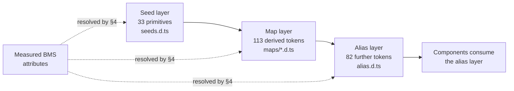

# Design Token Reference

> **Purpose.** This document records the complete design-token surface of the
> component library selected for the CardDemo user interface, and the mapping
> from the measured 3270 presentation attributes of the COBOL baseline onto that
> surface. It discharges the requirement in the technical specification §0.3.3
> that the token surface *"was read directly from the published package rather
> than from documentation, and is recorded in `docs/architecture/` for downstream
> reference."* It is a **reference surface**, not a narrative: its job is to be
> complete, exact and citable, so that a later reader can re-derive every number
> in it from the same sources rather than take it on trust.
>
> **Source of truth.** Three sources, and no others.
> 1. The **BMS mapsets** under `app/bms` — all **17** of them — together with the
>    attribute copybooks [`app/cpy/CSSETATY.cpy`](../../app/cpy/CSSETATY.cpy) and
>    [`app/cpy/CSSTRPFY.cpy`](../../app/cpy/CSSTRPFY.cpy), the screen-title
>    constants in [`app/cpy/COTTL01Y.cpy`](../../app/cpy/COTTL01Y.cpy), and the
>    message-field declarations in
>    [`app/cpy/CVCRD01Y.cpy`](../../app/cpy/CVCRD01Y.cpy),
>    [`app/cpy/CSMSG01Y.cpy`](../../app/cpy/CSMSG01Y.cpy) and
>    [`app/cpy/CSMSG02Y.cpy`](../../app/cpy/CSMSG02Y.cpy). Every one of these is
>    cited by path and line and is **never modified**.
> 2. The **18 online programs** under `app/cbl` matching `CO*.cbl`, read for the
>    `DFH*` colour constants and attention identifiers they reference at run time.
> 3. The **published `antd@6.5.2` package**, read from its own TypeScript
>    declaration files — `es/theme/interface/seeds.d.ts`,
>    `es/theme/interface/maps/*.d.ts` and `es/theme/interface/alias.d.ts` — rather
>    than from documentation prose.
>
> **Delivers, and to whom.** A token bridge specification: every measured design
> value in the baseline resolved to a named token, every gap named, and every
> choice recorded with the alternative it beat. Its declared downstream consumer
> is **`ui/src/theme/tokens.ts`**, which encodes this bridge, and
> **`ui/src/theme/antdTheme.ts`**, which assembles it into the provider theme
> object. This document is **upstream** of both.
>
> **Gaps and boundaries.** Six gaps are inventoried in [§8](#8-gaps-inventory)
> and none of them blocks the migration. One boundary is stated plainly up front
> rather than buried: **no Figma or other design source was supplied**, so the
> Figma-to-token mapping a reader might look for here is **not applicable** — see
> [§1](#1-there-is-no-figma-source--gap-g6). A second boundary is equally plain:
> **nothing in this document has been rendered in a browser**; see
> [§11](#11-caveats-and-boundaries).
>
> **Convention.** This document follows
> [`docs/CODE_DOCUMENTATION_STANDARD.md`](../CODE_DOCUMENTATION_STANDARD.md),
> whose *Markdown and documentation* section requires every document under
> `docs/**` to open with its purpose and source of truth, to justify every
> non-obvious assertion under one of four named categories, and to annotate
> fenced command blocks with the aligned `# WHAT:` / `# WHY :` idiom. The
> in-repository precedent for that obligation is
> [`tests/README.md`](../../tests/README.md) §12, which already requires the same
> four justification categories of every test, helper and runner routine.

**WHY (non-obvious design decisions):**

- **Assumptions:** every frequency in this document is a **measured count** taken
  from the baseline source, not an estimate. The mapping has no other authority —
  there is no design specification behind the 3270 screens to appeal to — so the
  counts are reproduced here, and [§4.4](#44-re-deriving-the-counts) publishes the
  exact commands that produce them. A reader who disagrees with a mapping can
  re-measure the input and argue from the same numbers.
- **Alternatives Considered:** the dominant category in this document is this one,
  because almost every entry in the mapping table is a *snap* — a source value
  resolved onto the nearest token whose **role** matches, when no token matches
  its **name**. A snap recorded without the alternative it beat is unauditable: a
  future reader cannot tell whether turquoise became an informational token by
  reasoning or by accident. Every snap below therefore names its rejected
  alternative and the specific consequence that rejected it.
- **Trade-offs:** this document records **named tokens in tables** and no colour
  swatches, screenshots or exported diagrams of any kind. Rendered swatches would
  communicate the palette faster, but they would also fix the palette as an image
  that silently disagrees with the theme the moment a token value changes, and
  they cannot be diffed in review. A token name is the thing that is actually
  normative, so the token name is what is recorded.
- **Refactoring Rationale:** two contracts carried by the baseline are reproduced
  here with their coupling to CICS deliberately removed, and each severance is
  argued at the point it is made rather than assumed. The field-error highlight in
  [§5](#5-the-field-error-contract) loses its dependence on the
  pseudo-conversational re-entry flag, because the state that flag described no
  longer exists in a stateless request handler. The PF-key contract in
  [§6](#6-the-pf-key-contract) loses its dependence on the CICS attention
  identifier, because the terminal that produced that identifier is replaced by a
  browser that reports key events directly — so the normalisation the baseline
  performs in COBOL happens at the edge instead, and the *semantics* it normalised
  to are what carry across.

---

## 1. There is no Figma source — gap G6

**No Figma files, frames or URLs were provided with this project, and no
attachments of any kind accompany it.** The Figma-to-token mapping table that a
design-system document normally carries is therefore **not applicable**, and this
section exists so that a reader stops looking for it rather than assuming it was
omitted by oversight.

That absence is **not a design-system gap**. It is inventoried as **G6** in
[§8](#8-gaps-inventory) only so the record is complete.

**The BMS attributes are the design source.** The 3270 presentation layer is a
coherent, information-dense and fully keyboard-operable design language, and it
carries real presentational semantics in machine-readable form: the `COLOR`,
`HILIGHT` and `ATTRB` operands of every `DFHMDF` field definition. Those operands
were measured **exhaustively across all 17 mapsets** in `app/bms` — not sampled,
not estimated — and the resulting histogram is what the mapping in
[§4](#4-the-measured-bms-attribute-to-token-mapping) resolves.

- **Assumptions:** this document depends on the BMS operand vocabulary being a
  genuine expression of design intent rather than incidental formatting. The
  evidence for that assumption is the shape of the histogram itself: the seven
  `COLOR` values are used with sharply different frequencies and in consistent
  roles — one dominant colour for labels and frames, one for informational
  values, one for warnings, one for errors — which is what a deliberate palette
  looks like and not what arbitrary choices look like.

---

## 2. The design system

| Property | Value |
|---|---|
| Library | Ant Design — npm package `antd` |
| Version | **6.5.2** |
| Companion icon package | `@ant-design/icons` at **6.3.2** |
| Status | **net-new** — nothing is upgraded, because nothing existed |
| Peer requirements, as published | `react >= 18.0.0`, `react-dom >= 18.0.0` |
| Token surface read from | `es/theme/interface/seeds.d.ts`, `es/theme/interface/maps/*.d.ts`, `es/theme/interface/alias.d.ts` |

The repository was searched exhaustively before the library was chosen.
**CardDemo contains no design system, no component library, no design tokens, and
no web, CSS or JavaScript asset of any kind**, and no dependency manifest of any
ecosystem. The only user interface in the baseline is the 3270 BMS presentation
layer. A component library therefore had to be **added** as a new dependency;
there was no existing one to extend, and no version to raise.

### 2.1 Two properties of version 6 that shaped the choice

Both are stated with their consequence, because the consequence is the reason
each one mattered.

1. **It requires only React ≥ 18 and needs no React-19 compatibility patch.**
   The compatibility shim that the previous major version required alongside
   React 19 was removed in version 6. The published package declares `react` and
   `react-dom` as peer dependencies at `>= 18.0.0` and depends on neither
   directly. **Consequence:** the pinned React 19 runtime is satisfied by the
   library as published, so the dependency set contains no shim whose only job is
   to reconcile two versions of the same ecosystem — one fewer package that has
   to be kept in step with a React upgrade.
2. **It defaults to pure CSS-variables theming.** Theme values reach components
   as inherited CSS custom properties rather than as per-component generated
   style. **Consequence:** the entire token bridge can be expressed **once**, in
   a single theme configuration, and consumed by every component **without
   per-component style overrides**. This is what makes the zero-hardcoded-values
   rule in [§7](#7-the-three-non-negotiable-rules) enforceable rather than
   aspirational — there is exactly one place where a design value is allowed to
   be written down.

### 2.2 Alternatives considered and rejected

- **Alternatives Considered — Material UI, rejected.** The Material design
  language is tuned for consumer applications, with generous spacing and a
  type scale built for reading rather than for scanning. CardDemo is the
  opposite workload: a dense enterprise application of forms and tables, whose
  largest single screen carries **128 field definitions**
  (`app/bms/COACTUP.bms`, the account-update mapset). Fitting 128 fields into a
  layout designed for consumer density would require overriding the spacing and
  type scale across the whole application, which is precisely the
  per-component-override pattern that property 2 above was chosen to avoid.
- **Alternatives Considered — Shadcn/ui, rejected.** It requires a Tailwind
  toolchain plus hand-assembly of every component from primitives, and it ships
  no table or description-list equivalent. **Ten of the twenty-one screens** are
  either a paged list (five) or a read-only record view (five), so its absence
  would push the column definition, selection, paging and detail-view behaviour of
  almost half the application into bespoke code. Bespoke code is where hardcoded values accumulate, so this
  choice would have undermined the zero-hardcoded-values rule in
  [§7](#7-the-three-non-negotiable-rules) directly rather than incidentally.

---

## 3. The token surface

The library organises its tokens in three layers, and this document records them
in the library's own layers rather than flattening them, because the layer a
token belongs to determines whether it may be *set* or only *read*. The layers
are **strictly nested** — as declared in the package, the map token type extends
the seed token type, and the alias token type extends the map token type — so the
alias layer is a superset and every seed token remains addressable from it.



- **Assumptions:** the layer names and every token name below are an **external
  contract of one pinned package version**. They were read from that version's
  own declaration files, which is why this document records the surface instead
  of paraphrasing it, and why the version is pinned exactly rather than by range.
  A token renamed or relocated in a future major version would not fail a build —
  a theme object simply carries a property the library no longer reads — so the
  failure would be **silent**, and a recorded surface is what makes it detectable
  by comparison.

### 3.1 Seed layer — 33 primitives

The values from which everything else is derived. This is the layer the bridge in
`ui/src/theme/tokens.ts` sets.

| Group | Tokens |
|---|---|
| Semantic colour | `colorPrimary`, `colorSuccess`, `colorWarning`, `colorError`, `colorInfo`, `colorLink` |
| Base colour | `colorTextBase`, `colorBgBase` |
| Shape | `borderRadius`, `lineType`, `lineWidth`, `wireframe` |
| Size | `controlHeight`, `sizeUnit`, `sizeStep`, `sizePopupArrow` |
| Typography | `fontFamily`, `fontFamilyCode`, `fontSize` |
| Motion base | `motion`, `motionBase`, `motionUnit` |
| Motion easing set | `motionEaseInBack`, `motionEaseInOut`, `motionEaseInOutCirc`, `motionEaseInQuint`, `motionEaseOut`, `motionEaseOutBack`, `motionEaseOutCirc`, `motionEaseOutQuint` |
| Layering | `zIndexBase`, `zIndexPopupBase` |
| Other | `opacityImage` |

### 3.2 Map layer — 113 derived tokens

Scales and ramps computed from the seed layer. Read, not set.

| Group | Tokens |
|---|---|
| Surface colour | `colorBgContainer`, `colorBgLayout`, `colorBgElevated`, `colorBgMask`, `colorBgBlur`, `colorBgSpotlight`, `colorBgSolid`, `colorBgSolidHover`, `colorBgSolidActive` |
| Border colour | `colorBorder`, `colorBorderSecondary`, `colorBorderDisabled` |
| Fill colour | `colorFill`, `colorFillSecondary`, `colorFillTertiary`, `colorFillQuaternary` |
| Text colour | `colorText`, `colorTextSecondary`, `colorTextTertiary`, `colorTextQuaternary`, `colorWhite` |
| Semantic colour variants | for **each** of `colorPrimary`, `colorSuccess`, `colorWarning`, `colorError`, `colorInfo`: the `…Hover`, `…Active`, `…Bg`, `…BgHover`, `…Border`, `…BorderHover`, `…Text`, `…TextHover`, `…TextActive` variants — plus `colorErrorBgFilledHover`, and `colorLinkHover` / `colorLinkActive` |
| Font scale | `fontSizeSM`, `fontSize`, `fontSizeLG`, `fontSizeXL`, `fontSizeHeading1`–`fontSizeHeading5` |
| Line-height scale | `lineHeightSM`, `lineHeight`, `lineHeightLG`, `lineHeightHeading1`–`lineHeightHeading5` |
| Size scale | `sizeXXS`, `sizeXS`, `sizeSM`, `size`, `sizeMS`, `sizeMD`, `sizeLG`, `sizeXL`, `sizeXXL` |
| Control height scale | `controlHeightXS`, `controlHeightSM`, `controlHeightLG` |
| Shape scale | `borderRadiusXS`, `borderRadiusSM`, `borderRadiusLG`, `borderRadiusOuter`, `lineWidthBold` |
| Motion duration | `motionDurationFast`, `motionDurationMid`, `motionDurationSlow` |

- **Assumptions:** the three motion-duration tokens are declared in the map
  layer, not the alias layer — they sit in the package's `CommonMapToken` in
  `maps/index.d.ts`. `colorTextSecondary` is likewise a map-layer token. Both
  placements are recorded because both are consumed by the mapping in
  [§4](#4-the-measured-bms-attribute-to-token-mapping), and a bridge that tried
  to set either one as if it were a seed value would be writing a property the
  library computes for itself.

### 3.3 Alias layer — 82 further tokens

What components actually consume. Read, not set.

| Group | Tokens |
|---|---|
| Spacing — 21 tokens | `marginXXS`, `marginXS`, `marginSM`, `margin`, `marginMD`, `marginLG`, `marginXL`, `marginXXL`; `paddingXXS`, `paddingXS`, `paddingSM`, `padding`, `paddingMD`, `paddingLG`, `paddingXL`; `paddingContentHorizontal`, `paddingContentHorizontalSM`, `paddingContentHorizontalLG`, `paddingContentVertical`, `paddingContentVerticalSM`, `paddingContentVerticalLG` |
| Elevation | `boxShadow`, `boxShadowSecondary`, `boxShadowTertiary` |
| Text role colour | `colorTextDescription`, `colorTextDisabled`, `colorTextHeading`, `colorTextLabel`, `colorTextPlaceholder`, `colorTextLightSolid` |
| Separator and fill | `colorSplit`, `colorFillAlter`, `colorFillContent`, `colorFillContentHover`, `colorBorderBg`, `colorBgContainerDisabled`, `colorBgTextHover`, `colorBgTextActive`, `colorHighlight` |
| Icon | `colorIcon`, `colorIconHover`, `fontSizeIcon` |
| Control | `controlItemBgHover`, `controlItemBgActive`, `controlItemBgActiveHover`, `controlItemBgActiveDisabled`, `controlOutline`, `controlOutlineWidth`, `controlTmpOutline`, `controlInteractiveSize`, `controlPaddingHorizontal`, `controlPaddingHorizontalSM` |
| Status outline and affix | `colorErrorOutline`, `colorWarningOutline`, `colorErrorAffix`, `colorWarningAffix` |
| Typography weight | `fontWeightStrong` |
| Focus | `lineWidthFocus` |
| Link decoration | `linkDecoration`, `linkHoverDecoration`, `linkFocusDecoration` |
| Breakpoints — 20 tokens | `screenXS`, `screenSM`, `screenMD`, `screenLG`, `screenXL`, `screenXXL` with their `…Min` and `…Max` variants, plus `screenXXXL` and `screenXXXLMin` |
| Other | `opacityLoading` |

---

## 4. The measured BMS-attribute-to-token mapping

### 4.1 Terminal geometry

Every mapset declares a **fixed 24×80** character grid — `DFHMDI … SIZE=(24,80)`
appears in all 17 — and across those mapsets there are **902 `DFHMDF` field
definitions**, every one of them absolutely positioned by a `POS=(row,column)`
operand. Field density per mapset ranges from 24 to 128.

That geometry is the reason [§8](#8-gaps-inventory) opens with **G1**: absolute
character positioning is the one property of the source design that the target
deliberately does not reproduce.

### 4.2 Colour and attribute mapping

This is the load-bearing table. Each row carries its **measured frequency** and,
where the resolution is a snap, the **alternative it beat**. Counts in the
"Measured count" column are occurrences across all 17 mapsets; where a second
figure is given it is the count of the corresponding `DFH*` constant referenced
from the 18 online programs under `app/cbl`.

| Source design value | Measured count | Token | Resolution, and the rejected alternative |
|---|---|---|---|
| `COLOR=BLUE` | **289** — the dominant label and frame colour | `colorPrimary` | **Exact match in role.** The most-used colour in the source is the one that frames and labels the application, which is what the primary token denotes. |
| `COLOR=TURQUOISE` | **127** — informational values | `colorInfo` | **Snap.** *Alternative: a bespoke turquoise token.* **Rejected** because the system has no turquoise semantic, so a bespoke token would carry a literal colour value — the one thing [§7](#7-the-three-non-negotiable-rules) forbids — and a literal is invisible to the CSS-variables theme, so the field would keep its turquoise through a theme change while everything around it moved. The original value is recorded alongside the snap in the theme module so the decision stays auditable. |
| `COLOR=GREEN` | **76**, plus **9** in-program `DFHGREEN` | `colorSuccess` | **Exact match in role.** Green marks accepted or completed state in the source and success state in the system. |
| `COLOR=NEUTRAL` | **60**, plus **5** in-program `DFHNEUTR` | `colorTextSecondary` | **Snap.** *Alternative: `colorText`.* **Rejected** because 3270 "neutral" is a **de-emphasis** role — it is what a field is given to make it recede relative to the coloured fields around it — whereas `colorText` is the base role that everything else is measured against. Mapping a de-emphasis role onto the base role would erase the distinction the source draws 60 times. |
| `COLOR=YELLOW` | **55** — warnings | `colorWarning` | **Exact match in role.** |
| `COLOR=RED` | **17**, plus **32** in-program `DFHRED` | `colorError` | **Exact match in role.** Note the asymmetry: red is referenced almost twice as often from *program logic* as from *map definition*, which is consistent with it being the error-highlight colour applied at run time by the template in [§5](#5-the-field-error-contract) rather than a static property of a field. |
| `COLOR=DEFAULT` | **38**, plus **6** in-program `DFHDFCOL` | `colorText` | **Inherit.** No snap is needed: the source is explicitly declining to specify a colour, so the target lets the field fall through to the base text token. |
| `ATTRB=BRT` | **37** | `fontWeightStrong` | **Snap, and deliberately not to a colour.** *Alternative: mapping brightness onto a brighter colour value.* **Rejected** because 3270 brightness is **orthogonal** to `COLOR=`, and the source proves it: **all 37** bright fields also carry a colour operand, spread across **three different** colours — 17 red, 13 neutral and 7 turquoise. Resolving brightness to a colour would therefore collide with the colour mapping on every one of the 37, and one of the two attributes would have to be discarded. Weight is the axis that is genuinely free. |
| `HILIGHT=UNDERLINE` | **158** — marks input fields | *(none — no token)* | **Structural, not tokenised.** The input component's own border carries the affordance that the underline carried on the terminal, so no token is required. **This absence is recorded explicitly so that a future reader does not read it as an oversight** — it is gap **G4**. |

Two adjacent measurements complete the histogram, so that "exhaustive" is
literally true rather than approximately true:

- `HILIGHT` takes exactly **two** operand values in the source. The second is
  `HILIGHT=OFF`, at **35** occurrences, which explicitly declines highlighting and
  likewise needs no token.
- The seven `COLOR` values in the table above are the **only** `COLOR` operands
  present, totalling **662** occurrences. Correspondingly, only four `DFH*` colour
  constants are referenced from the online programs — `DFHRED`, `DFHGREEN`,
  `DFHNEUTR` and `DFHDFCOL`. There is no `DFHBLUE`, `DFHYELLO` or `DFHTURQ`
  reference anywhere in them, which is why only four in-program figures appear.

### 4.3 Non-colour resolutions

| Category | Source value | Token | Resolution |
|---|---|---|---|
| Typography | fixed-pitch money and identifier columns | `fontFamilyCode` | **Exact.** Preserves the column alignment that numeric data had on a character terminal, where every glyph occupied one cell. A proportional face would misalign digits down a column. |
| Typography | screen title band | `fontSizeHeading4` / `lineHeightHeading4` | **Snap.** The band is one line of emphasised text above the content, which is the fourth-level heading role; the two tokens are paired so the line box matches the type size. *Alternative: a larger heading level such as `fontSizeHeading1`.* **Rejected** because the source gives the title exactly one of its 24 rows, and a larger heading claims more vertical space than one row — on the 128-field screen that displaces content that the source kept on the same screen. |
| Spacing | inter-section gaps on the 24-row grid | `marginLG`, `marginMD`, `marginXS` | **Snap** to the nearest step on the system scale. The source expresses a gap as a count of blank rows, so each distinct gap size resolves to the nearest scale step. *Alternative: computing a pixel value from the character-cell height — blank rows × line height.* **Rejected** because that reintroduces a fixed character metric into a responsive layout, which is the exact coupling **G1** removes, and it yields values that sit off the token scale and therefore have to be written as literals. |
| Spacing | intra-control padding | `paddingLG`, `paddingSM` | **Snap** to the nearest step on the same scale. *Alternative: deriving padding from the source's own column offset between a label and its field.* **Rejected** because that offset is measured in character cells and varies with the length of each label's text, so it does not describe padding at all — it describes absolute position, which **G1** does not preserve. |
| Radius | card and panel corners | `borderRadiusLG` | **Additive.** The 3270 has no radius concept at all, so this is not a mapping — it is a new value, applied through a token so it stays theme-controlled. |
| Elevation | modal and dropdown surfaces | `boxShadowSecondary` | **Additive**, on the same basis. |
| Motion | transitions | `motionDurationFast`, `motionDurationMid` | **Additive**, on the same basis. |
| Layout | the fixed 24×80 character grid | `Layout` + `Row`/`Col` + `screenMD` / `screenLG` | **Gap G1** — see [§8](#8-gaps-inventory). |

### 4.4 Re-deriving the counts

Every figure above is reproducible from the baseline. Two of the counting
conventions are **not** the obvious ones, and getting either wrong yields a
different number, so both are published rather than left implicit.

```bash
# WHAT: reproduce the colour histogram and the underline count across all 17
#       mapsets, and the per-mapset field-density ranking that sums to 902.
# WHY : Assumptions: the operand text is the measurement surface. Counting
#       `DFHMDF` occurrences rather than named fields is deliberate — an
#       unnamed literal field still occupies grid cells and still carries a
#       colour, so excluding them would understate the palette.
grep -ho 'COLOR=[A-Z]*' app/bms/*.bms | sort | uniq -c | sort -rn
grep -ho 'HILIGHT=[A-Z]*' app/bms/*.bms | sort | uniq -c | sort -rn
grep -h 'DFHMDF' app/bms/*.bms | wc -l
```

```bash
# WHAT: reproduce the 37 bright-attribute fields.
# WHY : Assumptions: the literal string `ATTRB=BRT` occurs ZERO times. BRT is
#       only ever an operand inside a parenthesised list, so a naive grep for
#       `ATTRB=BRT` reports nothing and invites the false conclusion that the
#       attribute is unused. The 37 is 20 + 17 across two operand lists.
grep -ho 'ATTRB=(ASKIP,BRT)' app/bms/*.bms | wc -l      # 20
grep -ho 'ATTRB=(ASKIP,BRT,FSET)' app/bms/*.bms | wc -l # 17
```

```bash
# WHAT: reproduce the PF-key usage frequencies quoted in §6.
# WHY : Assumptions: the measurement surface is the `DFH*` attention-identifier
#       constants in the 18 online programs, NOT the normalised `CCARD-AID-*`
#       flags those constants are mapped onto. The two surfaces give different
#       numbers, because one program can test a stored flag more than once per
#       screen turn while comparing the identifier only once. Grepping the flags
#       instead is the likeliest way to conclude, wrongly, that §6 is inaccurate.
grep -ho 'DFHENTER\|DFHPF[0-9]*\|DFHCLEAR\|DFHPA[0-9]' app/cbl/CO*.cbl \
  | sort | uniq -c | sort -rn
```

---

## 5. The field-error contract

`app/cpy/CSSETATY.cpy` **lines 17–27** is a **templated copybook**: it is written
with three substitution placeholders — `(TESTVAR1)`, `(SCRNVAR2)` and
`(MAPNAME3)` — which each including program replaces with the names of the field
it is validating. Its behaviour is:

1. When the named field's validation flag is **not-OK or blank**, it moves
   `DFHRED` into that field's **colour** attribute — the `C` suffixed subfield of
   the symbolic map.
2. When the field is additionally **blank**, it moves a literal **`'*'`** into the
   field's **output** value — the `O` suffixed subfield.

This is the mechanism the target's form validation reproduces, and it is why
`colorError` in [§4.2](#42-colour-and-attribute-mapping) carries far more
in-program than in-map references.

**Target rendering.** An error validation status on the corresponding form item,
with help text carrying the message, **plus the `'*'` marker preserved for the
blank case**. The marker is kept rather than dropped because it distinguishes
"you left this empty" from "what you typed here is not valid" without reading the
message, and that distinction is observable behaviour in the baseline.

- **Refactoring Rationale — the re-entry gate is severed.** The COBOL condition
  at line 20 is `AND CDEMO-PGM-REENTER`: the highlight is applied **only on a
  re-entry turn**, because in a pseudo-conversational task the first turn has no
  prior input to have failed validation. That flag is not local to this template —
  it is a condition name on `CDEMO-PGM-CONTEXT`, declared in the shared session
  structure at `app/cpy/COCOM01Y.cpy:L29-L31` and passed between turns, so the
  highlight depends on state the terminal round-trip carried. The target has no such flag and cannot
  have one — a stateless request handler has no notion of a first entry versus a
  re-entry, since each request is complete in itself. The highlight is therefore
  driven **purely by the response body**: if the response carries a field error,
  the field renders as an error. What was wrong with carrying the flag forward is
  that it would have required the server to remember a turn count in order to
  decide whether to render an error it had itself just computed — reintroducing
  exactly the session state that the stateless design removes, to gate a decision
  the response already contains.

---

## 6. The PF-key contract

`app/cpy/CSSTRPFY.cpy` **lines 21–78** is a single `EVALUATE TRUE` block that
normalises the CICS attention identifier into named flags: Enter, Clear, PA1, PA2
and PF01 through PF12. **Lines 54–77 alias PF13 through PF24 onto PF01 through
PF12** — `DFHPF13` sets the PF01 flag, `DFHPF14` sets PF02, and so on to
`DFHPF24` setting PF12. That aliasing is real behaviour on a keyboard that offers
24 function keys, and it is recorded explicitly because it is the kind of detail a
naive implementation drops silently.

**Measured usage across the 18 online programs fixes the semantics.** These are
occurrences of the attention-identifier constants, counted as in
[§4.4](#44-re-deriving-the-counts):

| Attention identifier | Measured count | Fixed semantic in the target |
|---|---|---|
| `DFHENTER` | **16** | Enter submits |
| `DFHPF3` | **14** | PF3 goes back |
| `DFHPF4` | **6** | PF4 clears |
| `DFHPF5` | **4** | PF5 saves |
| `DFHPF7` | **4** | PF7 pages backward |
| `DFHPF8` | **4** | PF8 pages forward |
| `DFHPF12` | **2** | PF12 cancels or signs off |

**Target.** Both **visible buttons in a persistent key bar** and **real keyboard
bindings** in a hook, so the original keyboard-only workflow continues to work
unchanged while also becoming discoverable to a reader who has never used a 3270.
Neither replaces the other.

- **Assumptions:** the seven semantics above are **inferred from measured usage
  frequency**, not read from a written specification — the baseline contains no
  document stating what PF5 means. The copybook normalises all of Enter, Clear,
  PA1, PA2 and PF01–PF24, but only these **seven** identifiers are actually
  compared anywhere in the 18 online programs: there is no reference to `DFHPF1`,
  `DFHPF2`, `DFHPF6`, `DFHPF9`–`DFHPF11`, `DFHCLEAR`, `DFHPA1` or `DFHPA2` among
  them. That the set of *compared* identifiers is exactly seven is what makes the
  inference safe: the target binds every key the baseline reacts to, and no key it
  does not.

---

## 7. The three non-negotiable rules

Each rule is stated with the specific consequence of breaking it, because a rule
whose reason is "consistency" is a rule that gets traded away under pressure.

1. **Zero hardcoded values.** Every CSS property value must resolve to a token.
   The only permitted exceptions are `0`, `none`, `auto`, `inherit`,
   `currentColor` and `transparent`, none of which is a design value.
   **Reason:** with CSS-variables theming, a literal value does not merely
   duplicate a token — it **silently opts that component out of the theme**. A
   later change to the token leaves that one component behind, and nothing fails,
   so the divergence is found by eye rather than by build.
2. **Library components over raw HTML.** No raw `<button>`, `<input>`,
   `<select>`, `<table>` or heading element where the system provides an
   equivalent. **Reason:** the system components carry the focus management,
   keyboard interaction and ARIA attributes that the 3270 original had natively as
   a property of the terminal. A hand-rolled element carries none of that, so
   using one converts a parity obligation into a defect.
3. **Layout through system primitives.** All spacing and alignment goes through
   the flex, space, grid and layout primitives, never bespoke CSS on a raw
   container. **Reason:** those primitives take their gaps from the token scale
   automatically, so spacing resolves to a token without anyone choosing to make
   it do so. This is what makes rule 1 enforceable rather than aspirational.

**Resolution order when the system lacks a needed element.** Applied in order,
stopping at the first that works:

1. the exact component, if one exists;
2. the closest component with a prop adjustment, annotated at the point of use
   with what was adjusted and why;
3. a generic container styled **only** with system tokens;
4. and only then a placeholder, explicitly flagged as one.

No element in the CardDemo interface required step 4 — see
[§8](#8-gaps-inventory).

---

## 8. Gaps inventory

| ID | Gap | Source value | Resolution |
|---|---|---|---|
| **G1** | No equivalent of the fixed 24×80 character grid | `SIZE=(24,80)` in every one of the 17 mapsets; absolute `POS=(row,column)` positioning on all **902** fields | **An intentional, documented deviation.** Resolved with a responsive layout, description lists for detail views and tables for lists. Two specific reasons, neither of them a preference: reproducing absolute character positioning would be **hostile to assistive technology**, because a screen reader follows DOM order and a grid-coordinate layout has no reliable DOM order — fields adjacent on screen can be arbitrarily far apart in the document; and it would be **impossible to make responsive**, because a fixed character grid has no reflow behaviour to fall back on and can only be scaled or clipped. **Preserved:** field grouping, reading order and tab order. **Not preserved:** pixel-for-character positioning. |
| **G2** | 3270 non-display renders a genuinely blank field; a password input renders dots | `ATTRB=(ASKIP,DRK,FSET)`, **6** occurrences — see the provenance note below | A password input with the visibility toggle disabled. **An accepted cosmetic difference, and it returns more information than the original:** the user can see that keystrokes registered. **No behavioural difference** — the value is still never displayed and still never echoed. |
| **G3** | No semantic token for turquoise, and none for 3270 "neutral" | `COLOR=TURQUOISE` (**127**), `COLOR=NEUTRAL` (**60**) | Snapped to `colorInfo` and `colorTextSecondary` respectively, each with its rejected alternative recorded in [§4.2](#42-colour-and-attribute-mapping). **Both original values are recorded alongside the snap in the theme module**, so a reader who wants to know what the source actually said does not have to re-measure the baseline to find out. |
| **G4** | `HILIGHT=UNDERLINE` has no token | **158** occurrences | **No token is needed** — the input component's own border carries the affordance. Recorded here precisely so that the absence of an underline token is not mistaken for an oversight in the mapping. |
| **G5** | The 3270 has no radius, elevation or motion vocabulary at all | — | `borderRadiusLG`, `boxShadowSecondary` and the `motionDuration*` family are **purely additive**. They are applied **through tokens** rather than as literals, so the additions remain inside the theme and stay subject to rule 1 of [§7](#7-the-three-non-negotiable-rules). |
| **G6** | No Figma design source exists | — | **Not a system gap.** The Figma-to-token mapping table is **not applicable**; the BMS attributes are the design source and were measured exhaustively. See [§1](#1-there-is-no-figma-source--gap-g6). |

**Provenance note for G2.** The count of **6** is the number of
`ATTRB=(ASKIP,DRK,FSET)` field definitions, and all six are in
`app/bms/COCRDLI.bms` (fields `CRDSTP2` through `CRDSTP7`, at lines 169, 196, 223,
250, 277 and 304), where they serve as per-row non-display carriers. The
**password** fields that G2's resolution applies to use a different operand list,
`ATTRB=(DRK,FSET,UNPROT)`, and there are three of them —
`app/bms/COSGN00.bms:175`, `app/bms/COUSR01.bms:126` and
`app/bms/COUSR02.bms:130`. Across all 17 mapsets the `DRK` non-display attribute
appears in **14** field definitions spread over five operand lists.

- **Assumptions:** G2 is about the `DRK` attribute, whichever operand list carries
  it, because `DRK` is what makes a field non-display. This provenance is recorded
  in full because the entire authority of this document is that its numbers can be
  re-derived: a reader who greps `app/bms/COSGN00.bms` for
  `ATTRB=(ASKIP,DRK,FSET)` will find nothing, and without this note would
  reasonably conclude the figure was wrong rather than that it counts a different
  operand list in a different mapset.

**Summary — six gaps exist and none of them blocks the migration.** One is a
deliberate architectural deviation (G1), one an accepted cosmetic difference (G2),
two are documented token snaps whose originals are retained (G3, G4), one is a set
of purely additive affordances applied through tokens (G5), and the last is simply
the absence of a Figma source (G6). **No gap requires a placeholder component**,
and no gap requires follow-up from a design-system team.

---

## 9. Citation corrections

Two citations that circulate for these contracts point at the wrong file or the
wrong lines. Both are corrected here, each with the reason the other citation
cannot be right, because both are external data-contract facts that downstream
code depends on.

### 9.1 The 75-character message-line contract

`CCARD-ERROR-MSG` and `CCARD-RETURN-MSG`, both `PIC X(75)`, live in
[`app/cpy/CVCRD01Y.cpy`](../../app/cpy/CVCRD01Y.cpy) **lines 28–30** — **not in
`CSMSG01Y.cpy`**. The same copybook also declares the `CCARD-AID-*` condition
names at lines 4–19, which is what allows the PF-key block in
[§6](#6-the-pf-key-contract) to set them; `CSMSG01Y.cpy` contains neither, holding
only two 50-character message constants. Cite **`CVCRD01Y.cpy:L28-L30`**.

Two different misattributions of this contract circulate, and both are disproven
by the same one-line test — **neither candidate file declares a `PIC X(75)` field
at all**. `CSMSG01Y.cpy` declares two `PIC X(50)` constants and nothing else, and
`COCOM01Y.cpy` declares no message field of any width: it carries navigation,
identity, selection context and the re-entry discriminator. `CVCRD01Y.cpy` is the
only copybook in `app/cpy` that declares the two 75-byte message fields.

- **Assumptions:** the sentinel for "no message" is **`LOW-VALUES`, not spaces** —
  line 30 declares `88 CCARD-RETURN-MSG-OFF VALUE LOW-VALUES`. A target
  implementation that tested for an empty or whitespace-only string instead of the
  sentinel would behave differently on a message that had been **explicitly
  cleared**, because a field of low values is not a field of spaces. The
  distinction is load-bearing rather than pedantic: the same copybook's abend
  fields, by contrast, initialise to `VALUE SPACES`, so the baseline genuinely
  uses two different empty conventions and a single "is it blank" helper cannot
  serve both.

### 9.2 The structured abend fields

`ABEND-CODE`, `ABEND-CULPRIT`, `ABEND-REASON` and `ABEND-MSG` are at
[`app/cpy/CSMSG02Y.cpy`](../../app/cpy/CSMSG02Y.cpy) **lines 21–29** — **not at
lines 45–53**. The reason the other range cannot be correct is decisive: **the
file is only 35 lines long**, so lines 45–53 do not exist. Lines 21–29 span the
whole `ABEND-DATA` structure, from its `01` level to the last `VALUE` clause. Cite
**`CSMSG02Y.cpy:L21-L29`**.

- **Assumptions:** the declared widths are part of the contract and differ from
  the screen message width — `ABEND-CODE` is `X(4)`, `ABEND-CULPRIT` is `X(8)`,
  `ABEND-REASON` is `X(50)` and `ABEND-MSG` is `X(72)`.

### 9.3 Three message-width regimes

The baseline carries three distinct message widths, and conflating them is what
produces the citation errors above:

| Width | Fields | Location |
|---|---|---|
| **50** characters | `CCDA-MSG-THANK-YOU`, `CCDA-MSG-INVALID-KEY` | `app/cpy/CSMSG01Y.cpy:L18-L21` |
| **72** characters | `ABEND-MSG` | `app/cpy/CSMSG02Y.cpy:L28` |
| **75** characters | `CCARD-ERROR-MSG`, `CCARD-RETURN-MSG` | `app/cpy/CVCRD01Y.cpy:L28-L29` |

**Only the 75-character screen contract survives as a rendering constraint in the
user interface**, because it is the only one of the three that describes a region
of a screen. The other two describe strings that are composed into a message or
into a log record, and the way they collapse on the log side is owned by
[`observability.md`](./observability.md), not by this document.

The screen-title band is a fourth width and a separate concern: the three title
constants in `app/cpy/COTTL01Y.cpy:L17-L24` are each `PIC X(40)`, and they map to
typography rather than to a message region — see the title-band row in
[§4.3](#43-non-colour-resolutions).

---

## 10. Where the tokens are applied

The bridge is applied in **exactly one place**: a theme configuration passed to
the library's configuration provider at the root of the application. **No
component carries a literal colour, spacing or radius value.**

| Module | Role |
|---|---|
| `ui/src/theme/tokens.ts` | The bridge recorded by this document — the measured BMS values resolved to named tokens, with each snapped original retained alongside its token per G3 |
| `ui/src/theme/antdTheme.ts` | The provider theme object assembled from that bridge and handed to `ConfigProvider` |

**Dependency direction.** This document is **upstream** of both modules, and
neither exists yet. The path spellings above are therefore not descriptions of
something already written — they are **the contract the later user-interface work
will look for**, which is why they are given exactly and why the filename of this
document is fixed rather than incidental.

---

## 11. Caveats and boundaries

- **Nothing here has been rendered in a browser.** This mapping is authored and
  statically reviewable only. **No visual regression test has been run, no
  accessibility audit has been performed, and no conformance level of any kind is
  claimed.**
- **Accessibility is treated as a fidelity requirement, not an addition.** The
  3270 original was operated entirely from the keyboard, so full keyboard
  operation in the target is a parity obligation inherited from the source rather
  than an enhancement layered on top of it. That is the whole of the claim made
  here; it is a design commitment expressed through semantic components and real
  key bindings, and it is deliberately not stated as an assessed rating.
- **The frequencies in this document are measured counts**, taken from `app/bms`
  and from the 18 online programs under `app/cbl`, and reproducible with the
  commands in [§4.4](#44-re-deriving-the-counts). They are not estimates, and they
  are not benchmarks of anything.
- **The 3270 presentation layer is preserved intact.** It is a coherent,
  information-dense and fully keyboard-operable design language, and this
  migration reads it as a specification and borrows its semantics deliberately.
  The baseline keeps running: the migration adds a path, it does not remove one.
  Nothing under `app/**` is modified by this document or by the work it describes.
- **Out of scope, and not to be read as delivered anywhere above:** multi-region
  and disaster-recovery topology, blue-green and canary deployment, streaming
  platforms, an application cache tier, database read replicas, the reference
  rewards extension, IMS DC, SFTP integration, and exposing distributed
  transactions. None of these has any bearing on the token surface; they are
  listed so that a reader does not infer them from the presence of a design system.
- **Behavioural divergences from the baseline are registered elsewhere.** Where
  the target deliberately behaves differently — as the field-error highlight in
  [§5](#5-the-field-error-contract) does — the divergence belongs to the register
  in [`cobol-to-service-traceability.md`](./cobol-to-service-traceability.md).
  This document records the presentational mapping only.

---

<sub>Apache-2.0 · Reference surface for `ui/src/theme/tokens.ts`. The COBOL
baseline under `app/**` is cited by path and line throughout and is never
modified. Convention:
[`docs/CODE_DOCUMENTATION_STANDARD.md`](../CODE_DOCUMENTATION_STANDARD.md).</sub>
