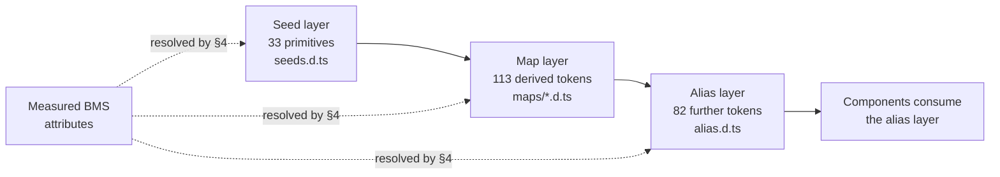

# Design Token Reference

> **Purpose.** This document records the complete design-token surface of the
> component library selected for the CardDemo user interface, and the mapping
> from the measured 3270 presentation attributes of the COBOL baseline onto that
> surface. It discharges the requirement in the technical specification §0.3.3
> that the token surface *"was read directly from the published package rather
> than from documentation, and is recorded in `docs/architecture/` for downstream
> reference."* It is a **reference surface**, not a narrative: its job is to be
> complete, exact and citable, so that a later reader can re-derive every number
> in it from the same sources rather than take it on trust.
>
> **Source of truth.** Three sources, and no others.
> 1. **Every BMS mapset in the repository — all 21**, which is the **17** under
>    `app/bms` plus the **4** that the two decoupled extensions contribute:
>    `app/app-authorization-ims-db2-mq/bms/COPAU00.bms` and `COPAU01.bms`, and
>    `app/app-transaction-type-db2/bms/COTRTLI.bms` and `COTRTUP.bms`. Together with
>    the attribute copybooks [`app/cpy/CSSETATY.cpy`](../../app/cpy/CSSETATY.cpy) and
>    [`app/cpy/CSSTRPFY.cpy`](../../app/cpy/CSSTRPFY.cpy), the screen-title
>    constants in [`app/cpy/COTTL01Y.cpy`](../../app/cpy/COTTL01Y.cpy), and the
>    message-field declarations in
>    [`app/cpy/CVCRD01Y.cpy`](../../app/cpy/CVCRD01Y.cpy),
>    [`app/cpy/CSMSG01Y.cpy`](../../app/cpy/CSMSG01Y.cpy) and
>    [`app/cpy/CSMSG02Y.cpy`](../../app/cpy/CSMSG02Y.cpy). Every one of these is
>    cited by path and line and is **never modified**.
> 2. The **22 online programs** that drive those 21 mapsets, read for the `DFH*`
>    colour constants and attention identifiers they reference at run time: the
>    **17** screen programs under `app/cbl` matching `CO*.cbl`, plus `COPAUS0C`,
>    `COPAUS1C` and `COPAUS2C` from the authorization extension and `COTRTLIC` and
>    `COTRTUPC` from the transaction-type extension. `app/cbl` holds an eighteenth
>    `CO*.cbl`, `COBSWAIT`, which drives no mapset and is therefore not a source
>    here.
> 3. The **published `antd@6.5.2` package**, read from its own TypeScript
>    declaration files — `es/theme/interface/seeds.d.ts`,
>    `es/theme/interface/maps/*.d.ts` and `es/theme/interface/alias.d.ts` — rather
>    than from documentation prose.
>
> **Delivers, and to whom.** A token bridge specification: every measured design
> value in the baseline resolved to a named token, every gap named, and every
> choice recorded with the alternative it beat. Its declared downstream consumer
> is **`ui/src/theme/tokens.ts`**, which encodes this bridge, and
> **`ui/src/theme/antdTheme.ts`**, which assembles it into the provider theme
> object. This document is **upstream** of both.
>
> **Gaps and boundaries.** Six gaps are inventoried in [§8](#8-gaps-inventory)
> and none of them blocks the migration. One boundary is stated plainly up front
> rather than buried: **no Figma or other design source was supplied**, so the
> Figma-to-token mapping a reader might look for here is **not applicable** — see
> [§1](#1-there-is-no-figma-source--gap-g6). A second boundary is equally plain:
> **nothing in this document has been rendered in a browser**; see
> [§11](#11-caveats-and-boundaries).
>
> **Convention.** This document follows
> [`docs/CODE_DOCUMENTATION_STANDARD.md`](../CODE_DOCUMENTATION_STANDARD.md),
> whose *Markdown and documentation* section requires every document under
> `docs/**` to open with its purpose and source of truth, to justify every
> non-obvious assertion under one of four named categories, and to annotate
> fenced command blocks with the aligned `# WHAT:` / `# WHY :` idiom. The
> in-repository precedent for that obligation is
> [`tests/README.md`](../../tests/README.md) §12, which already requires the same
> four justification categories of every test, helper and runner routine.
>
> **Sibling documents not yet authored are named, not linked.** Two of the nine
> documents in this folder are cited below —
> `docs/architecture/observability.md` and
> `docs/architecture/cobol-to-service-traceability.md` — and neither exists at this
> checkpoint; both are authored at later indexes of the same plan. Per the same
> convention, each appears as a plain code span rather than as a link, because a link
> resolving to nothing is a defect a reader finds by clicking. Each becomes a link
> when the file it names exists. The same applies to this document's declared
> downstream consumers, `ui/src/theme/tokens.ts` and `ui/src/theme/antdTheme.ts`,
> which are likewise not yet authored: this document is upstream of both, and is
> written first so that they can encode it.

**WHY (non-obvious design decisions):**

- Assumptions: every frequency in this document is a **measured count** taken
  from the baseline source, not an estimate. The mapping has no other authority —
  there is no design specification behind the 3270 screens to appeal to — so the
  counts are reproduced here, and [§4.4](#44-re-deriving-the-counts) publishes the
  exact commands that produce them. A reader who disagrees with a mapping can
  re-measure the input and argue from the same numbers.
- Alternatives Considered: the dominant category in this document is this one,
  because almost every entry in the mapping table is a *snap* — a source value
  resolved onto the nearest token whose **role** matches, when no token matches
  its **name**. A snap recorded without the alternative it beat is unauditable: a
  future reader cannot tell whether turquoise became an informational token by
  reasoning or by accident. Every snap below therefore names its rejected
  alternative and the specific consequence that rejected it.
- Trade-offs: this document records **named tokens in tables** and no colour
  swatches, screenshots or exported diagrams of any kind. Rendered swatches would
  communicate the palette faster, but they would also fix the palette as an image
  that silently disagrees with the theme the moment a token value changes, and
  they cannot be diffed in review. A token name is the thing that is actually
  normative, so the token name is what is recorded.
- Refactoring Rationale: two contracts carried by the baseline are reproduced
  here with their coupling to CICS deliberately removed, and each severance is
  argued at the point it is made rather than assumed. The field-error highlight in
  [§5](#5-the-field-error-contract) loses its dependence on the
  pseudo-conversational re-entry flag, because the state that flag described no
  longer exists in a stateless request handler. The PF-key contract in
  [§6](#6-the-pf-key-contract) loses its dependence on the CICS attention
  identifier, because the terminal that produced that identifier is replaced by a
  browser that reports key events directly — so the normalisation the baseline
  performs in COBOL happens at the edge instead, and the *semantics* it normalised
  to are what carry across.

---

## 1. There is no Figma source — gap G6

**No Figma files, frames or URLs were provided with this project, and no
attachments of any kind accompany it.** The Figma-to-token mapping table that a
design-system document normally carries is therefore **not applicable**, and this
section exists so that a reader stops looking for it rather than assuming it was
omitted by oversight.

That absence is **not a design-system gap**. It is inventoried as **G6** in
[§8](#8-gaps-inventory) only so the record is complete.

**The BMS attributes are the design source.** The 3270 presentation layer is a
coherent, information-dense and fully keyboard-operable design language, and it
carries real presentational semantics in machine-readable form: the `COLOR`,
`HILIGHT` and `ATTRB` operands of every `DFHMDF` field definition. Those operands
were measured **exhaustively across all 21 mapsets in the repository** — not
sampled, not estimated, and not restricted to the 17 under `app/bms` — and the
resulting histogram is what the mapping in
[§4](#4-the-measured-bms-attribute-to-token-mapping) resolves.

- **Refactoring Rationale — why the measurement scope is 21 and not 17.** An
  earlier revision of this document measured only the 17 mapsets under `app/bms`.
  That scope is wrong for a token bridge, because the target renders **21** screens:
  the specification's screen inventory is the 17 base mapsets *plus* the 4 from the
  two decoupled extensions. Measuring 17 while specifying 21 leaves the four
  extension screens' design values unresolved, and it is not a harmless
  under-count — one `COLOR` operand, `PINK`, occurs **only** in the extension
  mapsets, so restricting the scope to `app/bms` is precisely what made it possible
  to publish a histogram of "the seven `COLOR` values" and call it exhaustive when
  the baseline uses eight. Every count below is therefore repo-wide, and the
  base-17 subtotal is given alongside wherever the two differ, so the earlier
  figures remain checkable rather than merely superseded.

- Assumptions:  this document depends on the BMS operand vocabulary being a
  genuine expression of design intent rather than incidental formatting. The
  evidence for that assumption is the shape of the histogram itself: the seven
  `COLOR` values are used with sharply different frequencies and in consistent
  roles — one dominant colour for labels and frames, one for informational
  values, one for warnings, one for errors — which is what a deliberate palette
  looks like and not what arbitrary choices look like.

---

## 2. The design system

| Property | Value |
|---|---|
| Library | Ant Design — npm package `antd` |
| Version | **6.5.2** |
| Companion icon package | `@ant-design/icons` at **6.3.2** |
| Status | **net-new** — nothing is upgraded, because nothing existed |
| Peer requirements, as published | `react >= 18.0.0`, `react-dom >= 18.0.0` |
| Token surface read from | `es/theme/interface/seeds.d.ts`, `es/theme/interface/maps/*.d.ts`, `es/theme/interface/alias.d.ts` |

The repository was searched exhaustively before the library was chosen.
**CardDemo contains no design system, no component library, no design tokens, and
no web, CSS or JavaScript asset of any kind**, and no dependency manifest of any
ecosystem. The only user interface in the baseline is the 3270 BMS presentation
layer. A component library therefore had to be **added** as a new dependency;
there was no existing one to extend, and no version to raise.

### 2.1 Two properties of version 6 that shaped the choice

Both are stated with their consequence, because the consequence is the reason
each one mattered.

1. **It requires only React ≥ 18 and needs no React-19 compatibility patch.**
   The compatibility shim that the previous major version required alongside
   React 19 was removed in version 6. The published package declares `react` and
   `react-dom` as peer dependencies at `>= 18.0.0` and depends on neither
   directly. **Consequence:** the pinned React 19 runtime is satisfied by the
   library as published, so the dependency set contains no shim whose only job is
   to reconcile two versions of the same ecosystem — one fewer package that has
   to be kept in step with a React upgrade.
2. **It defaults to pure CSS-variables theming.** Theme values reach components
   as inherited CSS custom properties rather than as per-component generated
   style. **Consequence:** the entire token bridge can be expressed **once**, in
   a single theme configuration, and consumed by every component **without
   per-component style overrides**. This is what makes the zero-hardcoded-values
   rule in [§7](#7-the-three-non-negotiable-rules) enforceable rather than
   aspirational — there is exactly one place where a design value is allowed to
   be written down.

### 2.2 Alternatives considered and rejected

- Alternatives Considered: Material UI, rejected. The Material design
  language is tuned for consumer applications, with generous spacing and a
  type scale built for reading rather than for scanning. CardDemo is the
  opposite workload: a dense enterprise application of forms and tables, whose
  largest single screen carries **128 field definitions**
  (`app/bms/COACTUP.bms`, the account-update mapset). Fitting 128 fields into a
  layout designed for consumer density would require overriding the spacing and
  type scale across the whole application, which is precisely the
  per-component-override pattern that property 2 above was chosen to avoid.
- Alternatives Considered: Shadcn/ui, rejected. It requires a Tailwind
  toolchain plus hand-assembly of every component from primitives, and it ships
  no table or description-list equivalent. **Ten of the twenty-one screens** are
  either a paged list (five) or a read-only record view (five), so its absence
  would push the column definition, selection, paging and detail-view behaviour of
  almost half the application into bespoke code. Bespoke code is where hardcoded values accumulate, so this
  choice would have undermined the zero-hardcoded-values rule in
  [§7](#7-the-three-non-negotiable-rules) directly rather than incidentally.

---

## 3. The token surface

The library organises its tokens in three layers, and this document records them
in the library's own layers rather than flattening them, because the layer a
token belongs to determines whether it may be *set* or only *read*. The layers
are **strictly nested** — as declared in the package, the map token type extends
the seed token type, and the alias token type extends the map token type — so the
alias layer is a superset and every seed token remains addressable from it.



- Assumptions: the layer names and every token name below are an **external
  contract of one pinned package version**. They were read from that version's
  own declaration files, which is why this document records the surface instead
  of paraphrasing it, and why the version is pinned exactly rather than by range.
  A token renamed or relocated in a future major version would not fail a build —
  a theme object simply carries a property the library no longer reads — so the
  failure would be **silent**, and a recorded surface is what makes it detectable
  by comparison.

### 3.0 What is settable, and what merely has a default

The three layers below describe **derivation**, not permission. All three are
override-capable through a single property, and the package's own declarations say
so — this is quoted rather than paraphrased because a wrong answer here silently
changes what a bridge is allowed to do:

| Declaration | File in `antd@6.5.2` | Line |
|---|---|---|
| `token?: Partial<AliasToken>` | `es/config-provider/context.d.ts` | 94 |
| `components?: ComponentsConfig` | `es/config-provider/context.d.ts` | 99 |
| `interface AliasToken extends MapToken` | `es/theme/interface/alias.d.ts` | 3 |
| `interface MapToken extends SeedToken, ColorPalettes, LegacyColorPalettes, ColorMapToken, SizeMapToken, HeightMapToken, StyleMapToken, FontMapToken, CommonMapToken` | `es/theme/interface/maps/index.d.ts` | 28 |
| `interface SeedToken extends PresetColorType` | `es/theme/interface/seeds.d.ts` | 2 |

Because `AliasToken` transitively extends `MapToken` and `SeedToken`, the single
`theme.token` property accepts **any token from any of the three layers**, plus the
13 preset colours and their generated ramps. `components` additionally overrides the
alias tokens an individual component consumes — the package's own doc comment on it
reads *"Modify Component Token and Alias Token applied to components."*

Verified by type-checking against the pinned package rather than by reading prose:
a theme object setting a seed token, a **map**-layer token (`colorTextSecondary`,
`motionDurationMid`), a preset colour (`pink`) and a component-scoped alias
(`components.Table.headerBg`) all compile under `strict`.

- **Refactoring Rationale — "read, not set" was wrong and is corrected here.** The
  previous revision labelled the map and alias layers *"Read, not set"* and named
  the seed layer as the one the bridge sets. That describes the *derivation* graph
  correctly and the *override* surface incorrectly, and the error is consequential
  in one direction: two of the tokens this document's own mapping in
  [§4](#4-the-measured-bms-attribute-to-token-mapping) resolves to —
  `colorTextSecondary` for `COLOR=NEUTRAL` and `colorTextHeading` for `COLOR=PINK` —
  are **not** seed tokens, and `fontWeightStrong` for `ATTRB=BRT` is an alias token.
  A reader who believed those layers were read-only would conclude the mapping was
  unimplementable and either abandon the snaps or write literal CSS for them, which
  is what rule 1 of [§7](#7-the-three-non-negotiable-rules) exists to prevent.
- **Trade-offs — settable is not the same as should-be-set.** The bridge sets the
  **seed** layer wherever a seed token expresses the role, precisely because the map
  and alias layers are *derived*: overriding a derived token pins one value while
  everything computed alongside it keeps moving, so a palette can be left internally
  inconsistent. Derived tokens are therefore overridden only where no seed token
  carries the role — which is the case for the three named above. The layer labels
  below now say what each layer is **for**, and this section says what is
  **permitted**, so the two are no longer conflated.

### 3.1 Seed layer — 33 primitives

The values from which everything else is derived, and the layer the bridge in
`ui/src/theme/tokens.ts` sets by default — see [§3.0](#30-what-is-settable-and-what-merely-has-a-default)
for the three documented exceptions.

| Group | Tokens |
|---|---|
| Semantic colour | `colorPrimary`, `colorSuccess`, `colorWarning`, `colorError`, `colorInfo`, `colorLink` |
| Base colour | `colorTextBase`, `colorBgBase` |
| Shape | `borderRadius`, `lineType`, `lineWidth`, `wireframe` |
| Size | `controlHeight`, `sizeUnit`, `sizeStep`, `sizePopupArrow` |
| Typography | `fontFamily`, `fontFamilyCode`, `fontSize` |
| Motion base | `motion`, `motionBase`, `motionUnit` |
| Motion easing set | `motionEaseInBack`, `motionEaseInOut`, `motionEaseInOutCirc`, `motionEaseInQuint`, `motionEaseOut`, `motionEaseOutBack`, `motionEaseOutCirc`, `motionEaseOutQuint` |
| Layering | `zIndexBase`, `zIndexPopupBase` |
| Other | `opacityImage` |

### 3.2 Map layer — 113 derived tokens

Scales and ramps computed from the seed layer. **Derived, and overridable** — the
bridge reads these rather than setting them, except where no seed token carries the
role; `colorTextSecondary` is one such exception. See
[§3.0](#30-what-is-settable-and-what-merely-has-a-default).

| Group | Tokens |
|---|---|
| Surface colour | `colorBgContainer`, `colorBgLayout`, `colorBgElevated`, `colorBgMask`, `colorBgBlur`, `colorBgSpotlight`, `colorBgSolid`, `colorBgSolidHover`, `colorBgSolidActive` |
| Border colour | `colorBorder`, `colorBorderSecondary`, `colorBorderDisabled` |
| Fill colour | `colorFill`, `colorFillSecondary`, `colorFillTertiary`, `colorFillQuaternary` |
| Text colour | `colorText`, `colorTextSecondary`, `colorTextTertiary`, `colorTextQuaternary`, `colorWhite` |
| Semantic colour variants | for **each** of `colorPrimary`, `colorSuccess`, `colorWarning`, `colorError`, `colorInfo`: the `…Hover`, `…Active`, `…Bg`, `…BgHover`, `…Border`, `…BorderHover`, `…Text`, `…TextHover`, `…TextActive` variants — plus `colorErrorBgFilledHover`, and `colorLinkHover` / `colorLinkActive` |
| Font scale | `fontSizeSM`, `fontSize`, `fontSizeLG`, `fontSizeXL`, `fontSizeHeading1`–`fontSizeHeading5` |
| Line-height scale | `lineHeightSM`, `lineHeight`, `lineHeightLG`, `lineHeightHeading1`–`lineHeightHeading5` |
| Size scale | `sizeXXS`, `sizeXS`, `sizeSM`, `size`, `sizeMS`, `sizeMD`, `sizeLG`, `sizeXL`, `sizeXXL` |
| Control height scale | `controlHeightXS`, `controlHeightSM`, `controlHeightLG` |
| Shape scale | `borderRadiusXS`, `borderRadiusSM`, `borderRadiusLG`, `borderRadiusOuter`, `lineWidthBold` |
| Motion duration | `motionDurationFast`, `motionDurationMid`, `motionDurationSlow` |

- Assumptions: the three motion-duration tokens are declared in the map
  layer, not the alias layer — they sit in the package's `CommonMapToken` in
  `maps/index.d.ts`. `colorTextSecondary` is likewise a map-layer token. Both
  placements are recorded because both are consumed by the mapping in
  [§4](#4-the-measured-bms-attribute-to-token-mapping), and knowing which layer a
  token lives in is what tells a bridge author whether setting it **replaces a
  derived value** — which is permitted, and is the right choice only when no seed
  token carries the role — or merely **restates one the algorithm would have
  produced anyway**, which pins a value for no benefit and is the failure mode
  [§3.0](#30-what-is-settable-and-what-merely-has-a-default) warns about.

### 3.3 Alias layer — 82 further tokens

What components actually consume. **Derived, and overridable** — both globally
through `theme.token` and per component through `theme.components`. The bridge reads
these rather than setting them, except where no seed token carries the role;
`fontWeightStrong` and `colorTextHeading` are two such exceptions. See
[§3.0](#30-what-is-settable-and-what-merely-has-a-default).

| Group | Tokens |
|---|---|
| Spacing — 21 tokens | `marginXXS`, `marginXS`, `marginSM`, `margin`, `marginMD`, `marginLG`, `marginXL`, `marginXXL`; `paddingXXS`, `paddingXS`, `paddingSM`, `padding`, `paddingMD`, `paddingLG`, `paddingXL`; `paddingContentHorizontal`, `paddingContentHorizontalSM`, `paddingContentHorizontalLG`, `paddingContentVertical`, `paddingContentVerticalSM`, `paddingContentVerticalLG` |
| Elevation | `boxShadow`, `boxShadowSecondary`, `boxShadowTertiary` |
| Text role colour | `colorTextDescription`, `colorTextDisabled`, `colorTextHeading`, `colorTextLabel`, `colorTextPlaceholder`, `colorTextLightSolid` |
| Separator and fill | `colorSplit`, `colorFillAlter`, `colorFillContent`, `colorFillContentHover`, `colorBorderBg`, `colorBgContainerDisabled`, `colorBgTextHover`, `colorBgTextActive`, `colorHighlight` |
| Icon | `colorIcon`, `colorIconHover`, `fontSizeIcon` |
| Control | `controlItemBgHover`, `controlItemBgActive`, `controlItemBgActiveHover`, `controlItemBgActiveDisabled`, `controlOutline`, `controlOutlineWidth`, `controlTmpOutline`, `controlInteractiveSize`, `controlPaddingHorizontal`, `controlPaddingHorizontalSM` |
| Status outline and affix | `colorErrorOutline`, `colorWarningOutline`, `colorErrorAffix`, `colorWarningAffix` |
| Typography weight | `fontWeightStrong` |
| Focus | `lineWidthFocus` |
| Link decoration | `linkDecoration`, `linkHoverDecoration`, `linkFocusDecoration` |
| Breakpoints — 20 tokens | `screenXS`, `screenSM`, `screenMD`, `screenLG`, `screenXL`, `screenXXL` with their `…Min` and `…Max` variants, plus `screenXXXL` and `screenXXXLMin` |
| Other | `opacityLoading` |

---

## 4. The measured BMS-attribute-to-token mapping

### 4.1 Terminal geometry

Every mapset declares a **fixed 24×80** character grid — `SIZE=(24,80)` appears
**21** times, once in each — and across those mapsets there are **1166 `DFHMDF`
field definitions**, every one of them absolutely positioned by a `POS=(row,column)`
operand. Field density per mapset ranges from **24** (`COBIL00`) to **128**
(`COACTUP`).

Of those 1166 fields, **902** are in the 17 mapsets under `app/bms` and **264** are
in the 4 extension mapsets: `COPAU00` 104, `COTRTLI` 81, `COPAU01` 54 and
`COTRTUP` 25. The extension screens sit inside the same density range, so they add
volume without changing the geometry conclusion.

That geometry is the reason [§8](#8-gaps-inventory) opens with **G1**: absolute
character positioning is the one property of the source design that the target
deliberately does not reproduce.

### 4.2 Colour and attribute mapping

This is the load-bearing table. Each row carries its **measured frequency** and,
where the resolution is a snap, the **alternative it beat**. Counts in the
"Measured count" column are occurrences across **all 21 mapsets**, with the
base-17 subtotal in parentheses wherever it differs; where a second figure is
given it is the count of the corresponding `DFH*` constant referenced from the 22
online programs.

| Source design value | Measured count | Token | Resolution, and the rejected alternative |
|---|---|---|---|
| `COLOR=BLUE` | **384** (base 17: 289) — the dominant label and frame colour; plus **2** in-program `DFHBLUE` | `colorPrimary` | **Exact match in role.** The most-used colour in the source is the one that frames and labels the application, which is what the primary token denotes. The two in-program references are both in `COTRTLIC` (lines 1449 and 1465), restoring a filter field to blue after an error highlight — the reset counterpart of the red in [§5](#5-the-field-error-contract). |
| `COLOR=TURQUOISE` | **157** (base 17: 127) — informational values | `colorInfo` | **Snap.** *Alternative: a bespoke turquoise token.* **Rejected** because the system has no turquoise semantic, so a bespoke token would carry a literal colour value — the one thing [§7](#7-the-three-non-negotiable-rules) forbids — and a literal is invisible to the CSS-variables theme, so the field would keep its turquoise through a theme change while everything around it moved. The original value is recorded alongside the snap in the theme module so the decision stays auditable. |
| `COLOR=NEUTRAL` | **90** (base 17: 60), plus **9** in-program `DFHNEUTR` | `colorTextSecondary` | **Snap.** *Alternative: `colorText`.* **Rejected** because 3270 "neutral" is a **de-emphasis** role — it is what a field is given to make it recede relative to the coloured fields around it — whereas `colorText` is the base role that everything else is measured against. Mapping a de-emphasis role onto the base role would erase the distinction the source draws 90 times. |
| `COLOR=GREEN` | **84** (base 17: 76), plus **10** in-program `DFHGREEN` | `colorSuccess` | **Exact match in role.** Green marks accepted or completed state in the source and success state in the system. |
| `COLOR=YELLOW` | **70** (base 17: 55) — warnings | `colorWarning` | **Exact match in role.** |
| `COLOR=DEFAULT` | **69** (base 17: 38), plus **6** in-program `DFHDFCOL` | `colorText` | **Inherit.** No snap is needed: the source is explicitly declining to specify a colour, so the target lets the field fall through to the base text token. |
| `COLOR=RED` | **23** (base 17: 17), plus **38** in-program `DFHRED` | `colorError` | **Exact match in role.** Note the asymmetry: red is referenced far more often from *program logic* than from *map definition*, which is consistent with it being the error-highlight colour applied at run time by the template in [§5](#5-the-field-error-contract) rather than a static property of a field. |
| `COLOR=PINK` | **4** (base 17: **0** — extension mapsets only) | `colorTextHeading` | **Snap — the eighth colour, and the one an `app/bms`-only measurement cannot see.** All four are in `app/app-authorization-ims-db2-mq/bms/COPAU01.bms` (the `COLOR=PINK` operands at lines 86, 95, 105 and 115) and they colour exactly the fields `CARDNUM`, `AUTHDT`, `AUTHTM` and `AUTHRSP` — the composite key of the pending-authorization record plus its response code. On that 54-field screen labels are turquoise (20) and ordinary values blue (22), so pink is not decoration: it is a distinct **record-identity** role, marking the values that say *which* authorization you are looking at. `colorTextHeading` is the system's most-prominent text role, which is the same job. *Alternatives, both rejected:* **(a) `token.pink`.** This one is genuinely available — `SeedToken extends PresetColorType`, so `pink` is a settable token and `{ token: { pink: '…' } }` type-checks (verified against the pinned package). It is rejected on **role**, not availability: `pink` is a *palette anchor* whose only effect is to regenerate the `pink1`–`pink10` ramp, and no component consumes it for any semantic purpose. A field coloured from it carries a hue with no meaning attached, so it would not move when the theme's semantics moved, and the token name would tell a later reader the field is pink rather than that it is an identifier. **(b) `colorPrimary`.** Rejected because blue already resolves there, and the source deliberately distinguishes these 4 fields from the 22 blue ones on the same screen; collapsing them erases exactly the distinction being migrated. |
| `ATTRB=BRT` | **43** (base 17: 37) | `fontWeightStrong` | **Snap, and deliberately not to a colour.** *Alternative: mapping brightness onto a brighter colour value.* **Rejected** because 3270 brightness is **orthogonal** to `COLOR=`, and the source proves it: **all 43** bright fields also carry a colour operand, spread across **three different** colours — 21 red, 15 neutral and 7 turquoise. Resolving brightness to a colour would therefore collide with the colour mapping on every one of the 43, and one of the two attributes would have to be discarded. Weight is the axis that is genuinely free. |
| `HILIGHT=UNDERLINE` | **175** (base 17: 158) — marks input fields | *(none — no token)* | **Structural, not tokenised.** The input component's own border carries the affordance that the underline carried on the terminal, so no token is required. **This absence is recorded explicitly so that a future reader does not read it as an oversight** — it is gap **G4**. |

Two adjacent measurements complete the histogram, so that "exhaustive" is
literally true rather than approximately true:

- `HILIGHT` takes exactly **two** operand values in the source. The second is
  `HILIGHT=OFF`, at **54** occurrences (base 17: 35), which explicitly declines
  highlighting and likewise needs no token. Underline plus off accounts for all
  **229** `HILIGHT` operands, so the histogram closes.
- The **eight** `COLOR` values in the table above are the **only** `COLOR` operands
  present, totalling **881** occurrences (base 17: seven values, 662 occurrences).
  Correspondingly, **five** `DFH*` colour constants are referenced from the 22
  online programs — `DFHRED` 38, `DFHGREEN` 10, `DFHNEUTR` 9, `DFHDFCOL` 6 and
  `DFHBLUE` 2 — which is why five in-program figures appear in the table. There is
  no `DFHYELLO`, `DFHTURQ` or `DFHPINK` reference anywhere in the repository,
  verified repo-wide across `.cbl` and `.cpy`.

- **Assumptions — every program-side count excludes commented-out code.** COBOL
  fixed-format source marks a comment with `*` or `/` in **column 7**, and the
  baseline contains commented-out statements that mention the very constants being
  counted: `COACTUPC.cbl:3201` is a disabled `MOVE DFHRED`, and
  `COTRTUPC.cbl:613` a disabled `SET CCARD-AID-ENTER`. A plain `grep` counts both
  and reports `DFHRED` 39 and `CCARD-AID-ENTER` 22; the figures here are 38 and 21,
  because a statement that cannot execute is not a usage. The commands in
  [§4.4](#44-re-deriving-the-counts) apply the column-7 filter, so they reproduce
  these numbers rather than the naive ones. The mapset counts need no such filter:
  BMS comment lines cannot carry a `COLOR=` operand.

- **Assumptions — the two counting surfaces are independent and must not be
  reconciled.** A `COLOR=` operand is a *static* property of a map field; a `DFH*`
  constant is a colour a program moves into a field's attribute byte at *run time*.
  A field can therefore be counted once in the map histogram and repainted many
  times by program logic, which is why `RED` is 23 in the maps and `DFHRED` is 39 in
  the programs, and why the two columns are reported side by side rather than
  summed. Summing them would double-count every field the error template touches.

### 4.3 Non-colour resolutions

| Category | Source value | Token | Resolution |
|---|---|---|---|
| Typography | fixed-pitch money and identifier columns | `fontFamilyCode` | **Exact.** Preserves the column alignment that numeric data had on a character terminal, where every glyph occupied one cell. A proportional face would misalign digits down a column. |
| Typography | screen title band | `fontSizeHeading4` / `lineHeightHeading4` | **Snap.** The band is one line of emphasised text above the content, which is the fourth-level heading role; the two tokens are paired so the line box matches the type size. *Alternative: a larger heading level such as `fontSizeHeading1`.* **Rejected** because the source gives the title exactly one of its 24 rows, and a larger heading claims more vertical space than one row — on the 128-field screen that displaces content that the source kept on the same screen. |
| Spacing | inter-section gaps on the 24-row grid | `marginLG`, `marginMD`, `marginXS` | **Snap** to the nearest step on the system scale. The source expresses a gap as a count of blank rows, so each distinct gap size resolves to the nearest scale step. *Alternative: computing a pixel value from the character-cell height — blank rows × line height.* **Rejected** because that reintroduces a fixed character metric into a responsive layout, which is the exact coupling **G1** removes, and it yields values that sit off the token scale and therefore have to be written as literals. |
| Spacing | intra-control padding | `paddingLG`, `paddingSM` | **Snap** to the nearest step on the same scale. *Alternative: deriving padding from the source's own column offset between a label and its field.* **Rejected** because that offset is measured in character cells and varies with the length of each label's text, so it does not describe padding at all — it describes absolute position, which **G1** does not preserve. |
| Radius | card and panel corners | `borderRadiusLG` | **Additive.** The 3270 has no radius concept at all, so this is not a mapping — it is a new value, applied through a token so it stays theme-controlled. |
| Elevation | modal and dropdown surfaces | `boxShadowSecondary` | **Additive**, on the same basis. |
| Motion | transitions | `motionDurationFast`, `motionDurationMid` | **Additive**, on the same basis. |
| Layout | the fixed 24×80 character grid | `Layout` + `Row`/`Col` + `screenMD` / `screenLG` | **Gap G1** — see [§8](#8-gaps-inventory). |

### 4.4 Re-deriving the counts

Every figure above is reproducible from the baseline. Two of the counting
conventions are **not** the obvious ones, and getting either wrong yields a
different number, so both are published rather than left implicit.

```bash
# WHAT: reproduce the repo-wide colour and highlight histograms and the field
#       count that sums to 1166, across all 21 mapsets.
# WHY : Assumptions: the operand text is the measurement surface. Counting
#       `DFHMDF` occurrences rather than named fields is deliberate — an
#       unnamed literal field still occupies grid cells and still carries a
#       colour, so excluding them would understate the palette. The glob MUST
#       include app/app-*/bms: restricting it to app/bms is what hides
#       COLOR=PINK entirely and yields seven colours instead of eight.
BMS="app/bms/*.bms app/app-*/bms/*.bms"
grep -ho 'COLOR=[A-Z]*'   $BMS | sort | uniq -c | sort -rn   # 8 values, 881 total
grep -ho 'HILIGHT=[A-Z]*' $BMS | sort | uniq -c | sort -rn   # UNDERLINE 175, OFF 54
grep -h  'DFHMDF'         $BMS | wc -l                       # 1166
grep -ho 'SIZE=(24,80)'   $BMS | wc -l                       # 21
```

Counting `DFHMDF` **lines** equals counting occurrences here because no line in any
of the 21 mapsets carries the macro twice — checked, not assumed.

```bash
# WHAT: reproduce the base-17 subtotals quoted in parentheses, so the earlier
#       revision's figures stay checkable rather than merely superseded.
# WHY : Trade-offs: keeping both scopes costs a second command but makes the
#       re-scoping auditable — a reader can confirm that 384 - 289 = 95 blue
#       operands came from the four extension mapsets and that all 4 pink ones
#       did, rather than having to trust that the counts were recounted.
grep -ho 'COLOR=[A-Z]*' app/bms/*.bms | sort | uniq -c | sort -rn   # 7 values, 662
grep -h  'DFHMDF'       app/bms/*.bms | wc -l                       # 902
grep -h  'DFHMDF'       app/app-*/bms/*.bms | wc -l                 # 264, and 902+264=1166
```

```bash
# WHAT: reproduce the 43 bright-attribute fields (base 17: 37).
# WHY : Assumptions: the literal string `ATTRB=BRT` occurs ZERO times. BRT is
#       only ever an operand inside a parenthesised list, so a naive grep for
#       `ATTRB=BRT` reports nothing and invites the false conclusion that the
#       attribute is unused. The 43 is 22 + 21 across two operand lists.
BMS="app/bms/*.bms app/app-*/bms/*.bms"
grep -ho 'ATTRB=(ASKIP,BRT)'      $BMS | wc -l   # 22
grep -ho 'ATTRB=(ASKIP,BRT,FSET)' $BMS | wc -l   # 21
```

```bash
# WHAT: reproduce the five in-program DFH* colour-constant counts.
# WHY : Assumptions: TWO conventions are load bearing here and a naive grep gets
#       both wrong. (1) The program surface is the 22 mapset-driving programs, not
#       the 18 files matching app/cbl/CO*.cbl - the app/cbl glob alone drops
#       DFHBLUE to zero, because both of its references are in COTRTLIC, which is
#       how "only four DFH* constants are referenced" became a published claim.
#       (2) COBOL marks a comment with * or / in COLUMN 7, and COACTUPC:3201 is a
#       commented-out MOVE DFHRED - so the `code` filter below is what makes this
#       report 38 rather than 39.
CBL="app/cbl/CO*.cbl app/app-authorization-ims-db2-mq/cbl/COPAUS*.cbl \
     app/app-transaction-type-db2/cbl/COTRT*.cbl"
code() { awk 'substr($0,7,1)!="*" && substr($0,7,1)!="/" { print substr($0,7,66) }' "$@"; }
code $CBL | grep -o 'DFHRED\|DFHGREEN\|DFHNEUTR\|DFHDFCOL\|DFHBLUE' \
  | sort | uniq -c | sort -rn      # RED 38, GREEN 10, NEUTR 9, DFCOL 6, BLUE 2
```

```bash
# WHAT: reproduce BOTH PF-key surfaces quoted in §6 - the raw attention
#       identifiers and the normalised flags.
# WHY : Assumptions: these are two different surfaces and neither subsumes the
#       other. 15 programs compare `DFH*` directly; 7 include CSSTRPFY.cpy and
#       branch on `CCARD-AID-*` instead. Counting only the first misses PF2 and
#       PF10 entirely - both have a raw count of ZERO yet are branched on seven
#       times between them in COTRTLIC - which is exactly how a published figure
#       of "seven keys" came to be two short. The `code` filter from the previous
#       block is reused: COTRTUPC:613 is a commented-out SET CCARD-AID-ENTER, so
#       without it ENTER reports 22 instead of 21.
code $CBL | grep -o 'DFHENTER\|DFHPF[0-9]*\|DFHCLEAR\|DFHPA[0-9]' \
  | sort | uniq -c | sort -rn        # raw surface: 7 keys, ENTER 18, PF3 16
code $CBL | grep -o 'CCARD-AID-[A-Z0-9]*' \
  | sort | uniq -c | sort -rn        # normalised surface: 9 keys, ENTER 21
```

The `CCARD-AID-*` grep counts only *tests*, because the `88`-level declarations live
in `CVCRD01Y.cpy` and the `SET` statements in `CSSTRPFY.cpy` — neither of which is a
`.cbl` file, so neither is matched by `$CBL`.

---

## 5. The field-error contract

`app/cpy/CSSETATY.cpy` **lines 17–27** is a **templated copybook**: it is written
with three substitution placeholders — `(TESTVAR1)`, `(SCRNVAR2)` and
`(MAPNAME3)` — which each including program replaces with the names of the field
it is validating. Its behaviour is:

1. When the named field's validation flag is **not-OK or blank**, it moves
   `DFHRED` into that field's **colour** attribute — the `C` suffixed subfield of
   the symbolic map.
2. When the field is additionally **blank**, it moves a literal **`'*'`** into the
   field's **output** value — the `O` suffixed subfield.

This is the mechanism the target's form validation reproduces, and it is why
`colorError` in [§4.2](#42-colour-and-attribute-mapping) carries far more
in-program than in-map references.

**Target rendering.** An error validation status on the corresponding form item,
with help text carrying the message, **plus the `'*'` marker preserved for the
blank case**. The marker is kept rather than dropped because it distinguishes
"you left this empty" from "what you typed here is not valid" without reading the
message, and that distinction is observable behaviour in the baseline.

- Refactoring Rationale: the re-entry gate is severed. The COBOL condition
  at line 20 is `AND CDEMO-PGM-REENTER`: the highlight is applied **only on a
  re-entry turn**, because in a pseudo-conversational task the first turn has no
  prior input to have failed validation. That flag is not local to this template —
  it is a condition name on `CDEMO-PGM-CONTEXT`, declared in the shared session
  structure at `app/cpy/COCOM01Y.cpy:L29-L31` and passed between turns, so the
  highlight depends on state the terminal round-trip carried. The target has no such flag and cannot
  have one — a stateless request handler has no notion of a first entry versus a
  re-entry, since each request is complete in itself. The highlight is therefore
  driven **purely by the response body**: if the response carries a field error,
  the field renders as an error. What was wrong with carrying the flag forward is
  that it would have required the server to remember a turn count in order to
  decide whether to render an error it had itself just computed — reintroducing
  exactly the session state that the stateless design removes, to gate a decision
  the response already contains.

---

## 6. The PF-key contract

`app/cpy/CSSTRPFY.cpy` **lines 21–78** is a single `EVALUATE TRUE` block that
normalises the CICS attention identifier into named flags: Enter, Clear, PA1, PA2
and PF01 through PF12. **Lines 54–77 alias PF13 through PF24 onto PF01 through
PF12** — `DFHPF13` sets the PF01 flag, `DFHPF14` sets PF02, and so on to
`DFHPF24` setting PF12. That aliasing is real behaviour on a keyboard that offers
24 function keys, and it is recorded explicitly because it is the kind of detail a
naive implementation drops silently.

**The baseline branches on keys through two different surfaces, and both must be
measured.** Fifteen of the 22 programs compare the raw attention identifier
(`DFHPF3` and friends) directly; the other seven include `CSSTRPFY.cpy` and branch
on the **normalised flags** it sets (`CCARD-AID-PFK03`). Those seven are `COACTUPC`,
`COACTVWC`, `COCRDLIC`, `COCRDSLC`, `COCRDUPC`, `COTRTLIC` and `COTRTUPC`. Counting
only the first surface misses every key that only the second one reaches.

| Key | Raw `DFH*` count | Normalised `CCARD-AID-*` count | Semantic, and where the baseline states it |
|---|---|---|---|
| Enter | **18** | **21** in 7 programs | Submit. `COTRTUP.bms:115` labels it `ENTER=Process`. |
| PF3 | **16** | **19** in 7 programs | Go back. `COTRTLI.bms:321` and `COTRTUP.bms:115` both label it `F3=Exit`. |
| PF8 | **6** | **13** in 2 programs | Page forward. `COTRTLI.bms:331` labels it `F8=Page Dn`. |
| PF7 | **6** | **11** in 2 programs | Page backward. `COTRTLI.bms:326` labels it `F7=Page Up`. |
| PF5 | **5** | **10** in 3 programs | Save. `COTRTUP.bms:125` labels it `F5=Save`. |
| PF12 | **2** | **10** in 3 programs | Cancel, or sign off. `COTRTUP.bms:135` labels it `F12=Cancel`. |
| PF4 | **6** | **3** in 1 program | Clear on the base screens; **delete** on the transaction-type update screen, which `COTRTUP.bms:120` labels `F4=Delete`. |
| **PF10** | **0** | **5** in `COTRTLIC` | **Save/confirm.** `COTRTLI.bms:336` labels it `F10=Save`, and the program's own comments at lines 808 and 852 read *"F10 AFTER DELETE CONFIRM REQUESTED"* and *"F10 AFTER UPDATE CONFIRM REQUESTED"*. |
| **PF2** | **0** | **2** in `COTRTLIC` | **Add.** `COTRTLI.bms:316` labels it `F2=Add`, and the comment at line 628 reads *"If the user pressed PF2 transfer to add screen"*. |

So the target must bind **nine** keys, not seven. Enter, PF3, PF4, PF5, PF7, PF8 and
PF12 are reachable through either surface; **PF2 and PF10 are reachable only through
the normalised flags**, and both have a raw-identifier count of exactly zero.

**Target.** Both **visible buttons in a persistent key bar** and **real keyboard
bindings** in a hook, so the original keyboard-only workflow continues to work
unchanged while also becoming discoverable to a reader who has never used a 3270.
Neither replaces the other.

- **Refactoring Rationale — why the count changed from seven to nine.** The previous
  revision measured only the raw `DFH*` surface across the 18 files matching
  `app/cbl/CO*.cbl`, and concluded that *"only these seven identifiers are actually
  compared anywhere … there is no reference to `DFHPF1`, `DFHPF2`, `DFHPF6`,
  `DFHPF9`–`DFHPF11`"*. `DFHPF2` and `DFHPF10` genuinely do not appear — and PF2 and
  PF10 are nonetheless branched on, seven times between them, through the normalised
  flags in `COTRTLIC`. The scope error and the surface error compounded: the program
  is an extension program, so the `app/cbl` glob excluded it, *and* it uses the
  surface that was not being counted. A target built on "exactly seven" would leave
  the transaction-type list screen with no way to add a record and no way to confirm
  a delete — the two things that screen exists to do.
- **Assumptions — the semantics are now read, not inferred.** The previous revision
  inferred each key's meaning from usage frequency because *"the baseline contains no
  document stating what PF5 means"*. It does, in the place a 3270 application always
  puts it: the on-screen legend. The four extension mapsets label their keys in
  `INITIAL=` text (`F2=Add`, `F3=Exit`, `F7=Page Up`, `F8=Page Dn`, `F10=Save`,
  `ENTER=Process`, `F4=Delete`, `F5=Save`, `F6=Add`, `F12=Cancel`), which is
  authoritative in a way a frequency count is not. Every semantic above is now
  sourced from that text, and the frequencies are retained only as evidence of reach.
- **Trade-offs — two baseline inconsistencies are recorded rather than reconciled.**
  The two transaction-type screens disagree with each other: the list screen binds
  **F2** to Add and **F10** to Save, while the update screen binds **F6** to Add and
  **F5** to Save. Worse, `COTRTUP.bms:130` advertises `F6=Add` but **no program
  branches on PF6 through either surface** — the flag `CCARD-AID-PFK06` is set by the
  copybook and tested nowhere — and that legend slot is one of the seven hidden
  `DRK` slots in [§8.1](#81-g2-in-detail-the-five-jobs-of-drk), so it is never even
  revealed. It is a dead key with a dead label. These are reproduced as found rather
  than harmonised, because `app/**` is the behavioural oracle; a target that quietly
  made both screens use one key for Add would be changing behaviour under cover of
  tidying it.

---

## 7. The three non-negotiable rules

Each rule is stated with the specific consequence of breaking it, because a rule
whose reason is "consistency" is a rule that gets traded away under pressure.

1. **Zero hardcoded values.** Every CSS property value must resolve to a token.
   The only permitted exceptions are `0`, `none`, `auto`, `inherit`,
   `currentColor` and `transparent`, none of which is a design value.
   **Reason:** with CSS-variables theming, a literal value does not merely
   duplicate a token — it **silently opts that component out of the theme**. A
   later change to the token leaves that one component behind, and nothing fails,
   so the divergence is found by eye rather than by build.
2. **Library components over raw HTML.** No raw `<button>`, `<input>`,
   `<select>`, `<table>` or heading element where the system provides an
   equivalent. **Reason:** the system components carry the focus management,
   keyboard interaction and ARIA attributes that the 3270 original had natively as
   a property of the terminal. A hand-rolled element carries none of that, so
   using one converts a parity obligation into a defect.
3. **Layout through system primitives.** All spacing and alignment goes through
   the flex, space, grid and layout primitives, never bespoke CSS on a raw
   container. **Reason:** those primitives take their gaps from the token scale
   automatically, so spacing resolves to a token without anyone choosing to make
   it do so. This is what makes rule 1 enforceable rather than aspirational.

**Resolution order when the system lacks a needed element.** Applied in order,
stopping at the first that works:

1. the exact component, if one exists;
2. the closest component with a prop adjustment, annotated at the point of use
   with what was adjusted and why;
3. a generic container styled **only** with system tokens;
4. and only then a placeholder, explicitly flagged as one.

No element in the CardDemo interface required step 4 — see
[§8](#8-gaps-inventory).

---

## 8. Gaps inventory

| ID | Gap | Source value | Resolution |
|---|---|---|---|
| **G1** | No equivalent of the fixed 24×80 character grid | `SIZE=(24,80)` in every one of the **21** mapsets; absolute `POS=(row,column)` positioning on all **1166** fields | **An intentional, documented deviation.** Resolved with a responsive layout, description lists for detail views and tables for lists. Two specific reasons, neither of them a preference: reproducing absolute character positioning would be **hostile to assistive technology**, because a screen reader follows DOM order and a grid-coordinate layout has no reliable DOM order — fields adjacent on screen can be arbitrarily far apart in the document; and it would be **impossible to make responsive**, because a fixed character grid has no reflow behaviour to fall back on and can only be scaled or clipped. **Preserved:** field grouping, reading order and tab order. **Not preserved:** pixel-for-character positioning. |
| **G2** | `DRK` (non-display) is one attribute carrying **five unrelated jobs**, and they do not share a resolution | The `DRK` attribute, **18** field definitions across five operand lists — itemised in [§8.1](#81-g2-in-detail-the-five-jobs-of-drk) | **Five separate resolutions, one per job.** Only one of the five is the password case that a single "non-display" gap statement implies. Two of the five are not rendered at all, one becomes component state rather than a field, and one leaves the presentation layer entirely. See [§8.1](#81-g2-in-detail-the-five-jobs-of-drk). |
| **G3** | No semantic token for turquoise, for 3270 "neutral", or for pink | `COLOR=TURQUOISE` (**157**), `COLOR=NEUTRAL` (**90**), `COLOR=PINK` (**4**) | Snapped to `colorInfo`, `colorTextSecondary` and `colorTextHeading` respectively, each with its rejected alternative recorded in [§4.2](#42-colour-and-attribute-mapping). **Both original values are recorded alongside the snap in the theme module**, so a reader who wants to know what the source actually said does not have to re-measure the baseline to find out. |
| **G4** | `HILIGHT=UNDERLINE` has no token | **175** occurrences | **No token is needed** — the input component's own border carries the affordance. Recorded here precisely so that the absence of an underline token is not mistaken for an oversight in the mapping. |
| **G5** | The 3270 has no radius, elevation or motion vocabulary at all | — | `borderRadiusLG`, `boxShadowSecondary` and the `motionDuration*` family are **purely additive**. They are applied **through tokens** rather than as literals, so the additions remain inside the theme and stay subject to rule 1 of [§7](#7-the-three-non-negotiable-rules). |
| **G6** | No Figma design source exists | — | **Not a system gap.** The Figma-to-token mapping table is **not applicable**; the BMS attributes are the design source and were measured exhaustively. See [§1](#1-there-is-no-figma-source--gap-g6). |

### 8.1 G2 in detail: the five jobs of `DRK`

`DRK` suppresses display. *Why* a field is suppressed differs completely from one
use to the next, and the target rendering follows the job rather than the
attribute. All **18** occurrences across the 21 mapsets are itemised, with the
operand list that carries each — because the operand list is what a reader will
grep for, and greping the wrong one is what makes a correct count look wrong.

| # | Job | Count | Operand list | Provenance | Target rendering, and the rejected alternative |
|---|---|---|---|---|---|
| 1 | **Password entry** — the operator types a secret that must not echo | **3** | `ATTRB=(DRK,FSET,UNPROT)` | `COSGN00.bms:175`, `COUSR01.bms:126`, `COUSR02.bms:130`; all named `PASSWD`, `LENGTH=8`, `COLOR=GREEN` | A password input with the visibility toggle disabled. **An accepted cosmetic difference that returns more information than the original** — the operator can see that keystrokes registered — with **no behavioural difference**: the value is still never displayed and never echoed. *Alternative: a plain text input with a transparent foreground colour, to reproduce the genuinely blank field.* **Rejected** because it defeats browser password management and assistive technology, both of which key off the input type, and because a colour-based disguise is defeated by selecting the text. Note `COSGN00`'s field additionally carries `INITIAL='________'`, so even the baseline shows an affordance rather than nothing. |
| 2 | **Per-row non-display carriers** — one hidden character per list row | **6** | `ATTRB=(ASKIP,DRK,FSET)` | `COCRDLI.bms` fields `CRDSTP2`–`CRDSTP7` at lines 169, 196, 223, 250, 277, 304; each `LENGTH=1`, `COLOR=DEFAULT` | **Not rendered at all.** They exist to shuttle a per-row value through the symbolic map, which is a 3270 transport mechanism with no browser counterpart — a React row holds its own data. *Alternative: a hidden input per row.* **Rejected** because it reproduces the mechanism rather than the behaviour, and adds seven form controls per page that no code reads. Evidence for "no code reads them": they appear **60** times in the symbolic-map copybook `COCRDLI.CPY` and in **no** `.cbl` file, so the baseline itself never uses them. |
| 3 | **Hidden function-key legend slots** — a legend pre-loaded with text and revealed conditionally | **7** | `ATTRB=(ASKIP,DRK)` | `COACTUP.bms:498` (`FKEY05`, `'F5=Save'`), `:503` (`FKEY12`, `'F12=Cancel'`); `COCRDUP.bms:163` (`FKEYSC`, `'F5=Save F12=Cancel'`); `COTRTUP.bms:116` (`FKEY04`, `'F4=Delete'`), `:121` (`FKEY05`, `'F5=Save'`), `:126` (`FKEY06`, `'F6=Add'`), `:131` (`FKEY12`, `'F12=Cancel'`). All `COLOR=YELLOW`, all with `INITIAL` text | **Conditional state on the function-key bar of [§6](#6-the-pf-key-contract), not a hidden field.** Each slot's `INITIAL` text names a key that is only *sometimes* available, and the program reveals it by clearing `DRK`. The target enables or disables the corresponding button instead. *Alternative: render them and toggle `visibility`.* **Rejected** because a hidden-then-shown element is announced inconsistently by screen readers, whereas a disabled control has a defined accessible state — and because the source's own intent is availability, which `disabled` expresses directly. |
| 4 | **Protected non-display data** — a component of a value the operator may not edit or see | **1** | `ATTRB=(DRK,FSET,PROT)` | `COCRDUP.bms:142`, named `EXPDAY`, `LENGTH=2`, no `COLOR` operand | **Carried in the data-transfer object and never rendered.** It is the day component of the card expiry date, which the screen collects as year and month only; `PROT` plus `DRK` means the terminal held it without showing it. *Alternative: render it disabled.* **Rejected** because showing a field the source deliberately never showed is a behavioural change, and the value is not part of the screen's contract with the operator — it belongs to the record, so it travels in the DTO. |
| 5 | **Unnamed attribute terminator** — one character of layout mechanics | **1** | `ATTRB=(DRK,UNPROT)` | `COSGN00.bms:190`, unnamed, `LENGTH=1`, `INITIAL` a single space | **Not rendered.** An unnamed `DFHMDF` has no symbolic-map entry, so no program can read or write it; its only function is to bound the preceding field's attribute run on the character grid. *Alternative: emit a one-character spacer.* **Rejected** because grid-bounding is exactly the mechanism **G1** removes — in a flow layout, a field's extent is its own element. |

Counts sum to 3 + 6 + 7 + 1 + 1 = **18**, which is the repo-wide `DRK` total. The
base-17 subtotal is **14**; the four extension occurrences are the `COTRTUP` legend
slots in job 3.

- **Refactoring Rationale — why one gap became five.** The previous revision stated
  G2 as a single gap ("non-display renders blank, a password input renders dots")
  and resolved it with a single answer, while citing the **6** `ASKIP,DRK,FSET`
  fields as its evidence. Those six are the job-2 row carriers, which are not
  password fields and are not rendered at all — so the evidence and the resolution
  described different fields, and 15 of the 18 occurrences had no resolution
  recorded anywhere. Splitting by job is not extra detail for its own sake: without
  it, an implementer reading G2 would reasonably render all 18 as password inputs,
  which would put seven function-key legends and six invisible transport characters
  on the screen as masked text boxes.
- **Assumptions — the operand list is the grep surface, not the semantic.** `DRK`
  appears in five different operand lists, so a reader who greps a single list finds
  a fraction of the total and concludes a figure is wrong. Every row above therefore
  publishes the exact list to grep for alongside the count it produces.

**Summary — six gaps exist and none of them blocks the migration.** One is a
deliberate architectural deviation (G1); one is an attribute carrying five
unrelated jobs, each resolved separately in [§8.1](#81-g2-in-detail-the-five-jobs-of-drk)
and only one of which is a cosmetic difference (G2); two are documented token snaps
whose originals are retained (G3, G4); one is a set of purely additive affordances
applied through tokens (G5); and the last is simply the absence of a Figma source
(G6). **No gap requires a placeholder component**, and no gap requires follow-up
from a design-system team.

---

## 9. Authoritative citations for the message contracts

Three corrections, each an external data-contract fact that downstream code depends
on, and each stated with the reason the superseded version cannot be right. Two are
citations that point at the wrong file or the wrong lines
([§9.1](#91-the-75-character-message-line-contract),
[§9.2](#92-the-structured-abend-fields)); the third is a correction to the *claim*
rather than the citation — the width this document previously said governs the
message band is the one width in its own list that governs no region of a screen
([§9.3](#93-the-message-width-regimes)).

### 9.1 The 75-character message-line contract

`CCARD-ERROR-MSG` and `CCARD-RETURN-MSG`, both `PIC X(75)`, live in
[`app/cpy/CVCRD01Y.cpy`](../../app/cpy/CVCRD01Y.cpy) **lines 28–30**. The same
copybook also declares the `CCARD-AID-*` condition names at lines 4–19, which is
what allows the PF-key block in [§6](#6-the-pf-key-contract) to set them. Cite
**`CVCRD01Y.cpy:L28-L30`**.

The two files most easily mistaken for it are both disproven by the same one-line
test — **neither declares a `PIC X(75)` field at all**. `CSMSG01Y.cpy` declares two
`PIC X(50)` constants and nothing else, and `COCOM01Y.cpy` declares no message
field of any width: it carries navigation, identity, selection context and the
re-entry discriminator. `CVCRD01Y.cpy` is the only copybook in `app/cpy` that
declares the two 75-byte message fields.

- Assumptions: the sentinel for "no message" is **`LOW-VALUES`, not spaces** —
  line 30 declares `88 CCARD-RETURN-MSG-OFF VALUE LOW-VALUES`. A target
  implementation that tested for an empty or whitespace-only string instead of the
  sentinel would behave differently on a message that had been **explicitly
  cleared**, because a field of low values is not a field of spaces. The
  distinction is load-bearing rather than pedantic: the same copybook's abend
  fields, by contrast, initialise to `VALUE SPACES`, so the baseline genuinely
  uses two different empty conventions and a single "is it blank" helper cannot
  serve both.

### 9.2 The structured abend fields

`ABEND-CODE`, `ABEND-CULPRIT`, `ABEND-REASON` and `ABEND-MSG` are at
[`app/cpy/CSMSG02Y.cpy`](../../app/cpy/CSMSG02Y.cpy) **lines 21–29**, which span
the whole `ABEND-DATA` structure from its `01` level to the last `VALUE` clause.
Cite **`CSMSG02Y.cpy:L21-L29`**. The file is **only 35 lines long**, which is the
decisive test: any citation placing this block beyond line 35 names lines that do
not exist.

- Assumptions: the declared widths are part of the contract and differ from
  the screen message width — `ABEND-CODE` is `X(4)`, `ABEND-CULPRIT` is `X(8)`,
  `ABEND-REASON` is `X(50)` and `ABEND-MSG` is `X(72)`.

### 9.3 The message-width regimes

A message does not have *a* width. It is composed in a program-local buffer, may
cross the pseudo-conversational boundary in a shared work area, and is finally moved
into a display field — and those stages declare different `PICTURE` clauses.
Conflating them is what produces the citation errors above, and it is also what
produces the more damaging error of treating **75** as the width a message band
renders at.

The **message band** — the single-line error and status region every screen carries
— is governed by these five, in the order a message passes through them:

**Only the 75-character screen contract survives as a rendering constraint in the
user interface**, because it is the only one of the three that describes a region
of a screen. The other two describe strings that are composed into a message or
into a log record, and the way they collapse on the log side is owned by
`docs/architecture/observability.md`, not by this document.

Measured: **38** `PIC X(78)` declarations across 19 mapsets and **4** `PIC X(80)`
declarations across 2, totalling 42 — one input and one output field per mapset, and
the `LENGTH=` operand of every corresponding `DFHMDF` agrees with its copybook.

Three further widths are **not** the message band and are governed elsewhere:

| Width | Fields | Location | Why it is a different concern |
|---|---|---|---|
| **50** | `CCDA-MSG-THANK-YOU`, `CCDA-MSG-INVALID-KEY` | `app/cpy/CSMSG01Y.cpy:L18-L21` | Constants *moved into* a band buffer, not a region. Both literals are 49 characters in a 50-character field. |
| **72** | `ABEND-MSG` | `app/cpy/CSMSG02Y.cpy:L28` | Composed into a log record; the collapse on the log side is owned by `docs/architecture/observability.md`. |
| **40** | the three title constants | `app/cpy/COTTL01Y.cpy:L17-L24` | Maps to **typography**, not to a message region — see the title-band row in [§4.3](#43-non-colour-resolutions). Each literal is exactly 40 characters *including* its centring spaces, so the padding is data, not formatting. |

And one region is adjacent enough to be mistaken for the band: `COMEN01C` and
`COADM01C` compose their menu lines into a **40**-character `WS-MENU-OPT-TXT` /
`WS-ADMIN-OPT-TXT` and move them to the menu-row fields `OPTN001O`–`OPTN012O`
(`app/cbl/COMEN01C.cbl:L48,L276`; all 12 row fields are `PIC X(40)`). Those are list
rows, not the band. The same program feeds both, because its unavailable-option
messages go to `WS-MESSAGE` instead.

- **Refactoring Rationale — the previous claim was the wrong way round.** This
  section previously listed three widths and concluded that *"only the 75-character
  screen contract survives as a rendering constraint … it is the only one of the
  three that describes a region of a screen."* The 75 of `CVCRD01Y` is the one width
  in the list that describes **no** region of a screen: it is the shared work area a
  message travels in between turns. The regions are the **78** and **80** display
  fields, which that revision did not measure at all. The consequence of believing
  the old claim is concrete and silent: a band rendered at 75 clips three characters
  from nineteen screens and five from two of them, on exactly the longest messages —
  the ones a truncation matters most on.
- **Assumptions — both limits are real, and which applies depends on the path.** A
  program that moves the 75-byte work area into a 78-character display field leaves
  COBOL to pad the remainder with spaces, so the *content* limit stays 75 for any
  message that crosses the work area. A program that composes straight into its
  80-byte `WS-MESSAGE` and moves that to the map can fill 78 or 80. Neither number
  is the answer on its own.
- **Trade-offs — this contract is duplicated in code, deliberately.**
  `ui/src/messages/messages.ts` exports the same five widths as `MESSAGE_BAND`, a
  per-mapset `MESSAGE_BAND_BY_MAPSET` table and a `messageBandWidthForMapset()`
  resolver, so a renderer resolves the width by calling a function rather than by
  reading this document. Prose and code stating the same contract can drift; the
  alternative — documenting it only here — guarantees that every screen author
  re-derives it, which is how a single number becomes five different assumptions.
  This document is upstream and normative for the *reasoning*; the module is
  normative for the *values*, and both cite the same baseline lines.

---

## 10. Where the tokens are applied

The bridge is applied in **exactly one place**: a theme configuration passed to
the library's configuration provider at the root of the application. **No
component carries a literal colour, spacing or radius value.**

| Module | Role |
|---|---|
| `ui/src/theme/tokens.ts` | The bridge recorded by this document — the measured BMS values resolved to named tokens, with each snapped original retained alongside its token per G3 |
| `ui/src/theme/antdTheme.ts` | The provider theme object assembled from that bridge and handed to `ConfigProvider` |

**Dependency direction.** This document is **upstream** of both modules, and
neither exists yet. The path spellings above are therefore not descriptions of
something already written — they are **the contract the later user-interface work
will look for**, which is why they are given exactly and why the filename of this
document is fixed rather than incidental.

---

## 11. Caveats and boundaries

- **Nothing here has been rendered in a browser.** This mapping is authored and
  statically reviewable only. **No visual regression test has been run, no
  accessibility audit has been performed, and no conformance level of any kind is
  claimed.**
- **Accessibility is treated as a fidelity requirement, not an addition.** The
  3270 original was operated entirely from the keyboard, so full keyboard
  operation in the target is a parity obligation inherited from the source rather
  than an enhancement layered on top of it. That is the whole of the claim made
  here; it is a design commitment expressed through semantic components and real
  key bindings, and it is deliberately not stated as an assessed rating.
- **The frequencies in this document are measured counts**, taken from **all 21
  mapsets** — the 17 under `app/bms` plus the 4 under `app/app-*/bms` — and from the
  **22 online programs** that drive them, and reproducible with the commands in
  [§4.4](#44-re-deriving-the-counts). They are not estimates, and they are not
  benchmarks of anything. Where a base-17 subtotal is quoted in parentheses it is
  there so the superseded scope stays checkable, not because two scopes are both
  normative: **the 21-mapset figure is the normative one**, because the target
  renders 21 screens.
- **The 3270 presentation layer is preserved intact.** It is a coherent,
  information-dense and fully keyboard-operable design language, and this
  migration reads it as a specification and borrows its semantics deliberately.
  The baseline keeps running: the migration adds a path, it does not remove one.
  Nothing under `app/**` is modified by this document or by the work it describes.
- **Out of scope, and not to be read as delivered anywhere above:** multi-region
  and disaster-recovery topology, blue-green and canary deployment, streaming
  platforms, an application cache tier, database read replicas, the reference
  rewards extension, IMS DC, SFTP integration, and exposing distributed
  transactions. None of these has any bearing on the token surface; they are
  listed so that a reader does not infer them from the presence of a design system.
- **Behavioural divergences from the baseline are registered elsewhere.** Where
  the target deliberately behaves differently — as the field-error highlight in
  [§5](#5-the-field-error-contract) does — the divergence belongs to the register
  in `docs/architecture/cobol-to-service-traceability.md`.
  This document records the presentational mapping only.

---

<sub>Apache-2.0 · Reference surface for `ui/src/theme/tokens.ts`. The COBOL
baseline under `app/**` is cited by path and line throughout and is never
modified. Convention:
[`docs/CODE_DOCUMENTATION_STANDARD.md`](../CODE_DOCUMENTATION_STANDARD.md).</sub>
