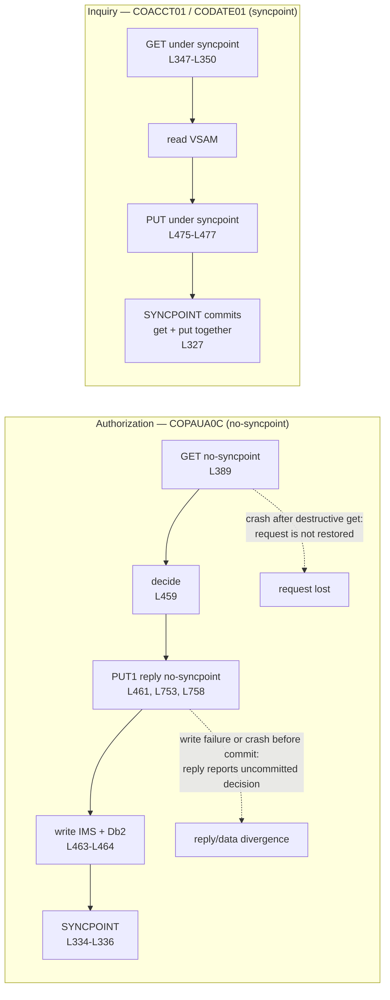

# Messaging Contracts

---

> **Purpose.** This document is the contract specification for the three
> decoupled extensions that currently communicate over IBM MQ. It fixes three
> things that downstream code cannot invent for itself: the mapping from the five
> baseline queues to their target Amazon SQS replacements, the mapping from IBM MQ
> message-descriptor fields to SQS message attributes, and — most importantly —
> the **byte-level wire format** of the authorization request and reply, which is
> a positional, comma-delimited character payload rather than a self-describing
> one. It discharges the messaging portion of **Deliverable 2** of the seven
> numbered deliverables: *"/docs/architecture — target architecture diagram,
> service catalog, and data-mapping (VSAM/Db2/IMS → AWS) tables"*, and it
> underwrites the acceptance criterion that names *"the three MQ extensions"*
> among the candidate business flows.
>
> It is authored fifth among the nine documents in this folder, after
> [`service-catalog.md`](service-catalog.md) and
> [`data-model-and-schema-mapping.md`](data-model-and-schema-mapping.md). Every
> service name and schema name below is taken verbatim from the catalog, which is
> the naming authority, and every persisted-column question is answered by
> citation to the data-model document rather than by restating its tables here.
> This document introduces no variant spelling of either.
>
> **Source of truth.** Five bodies of reference material, all read and none
> modified:
>
> * the **three MQ payload copybooks** of the authorization extension —
>   [`CCPAURQY.cpy`](../../app/app-authorization-ims-db2-mq/cpy/CCPAURQY.cpy) (36
>   lines; the eighteen request fields at L19–L36),
>   [`CCPAURLY.cpy`](../../app/app-authorization-ims-db2-mq/cpy/CCPAURLY.cpy) (24
>   lines; the six reply fields at L19–L24) and
>   [`CCPAUERY.cpy`](../../app/app-authorization-ims-db2-mq/cpy/CCPAUERY.cpy) (40
>   lines; the error-log record at L19–L40);
> * the **two IMS segment copybooks** that establish what the payload becomes once
>   it is persisted —
>   [`CIPAUSMY.cpy`](../../app/app-authorization-ims-db2-mq/cpy/CIPAUSMY.cpy) (31
>   lines, the summary segment) and
>   [`CIPAUDTY.cpy`](../../app/app-authorization-ims-db2-mq/cpy/CIPAUDTY.cpy) (54
>   lines, the detail segment, whose L34–L35 carry the two amounts in packed form);
> * the **authorization consumer and its purge companion** —
>   [`COPAUA0C.cbl`](../../app/app-authorization-ims-db2-mq/cbl/COPAUA0C.cbl) (1026
>   lines), which is the single most-cited file in this document because it
>   contains the parse, the build, the descriptor handling, the syncpoint discipline
>   and every timing literal, together with
>   [`CBPAUP0C.cbl`](../../app/app-authorization-ims-db2-mq/cbl/CBPAUP0C.cbl);
> * the **two inquiry programs** of the VSAM/MQ extension —
>   [`COACCT01.cbl`](../../app/app-vsam-mq/cbl/COACCT01.cbl) (620 lines) and
>   [`CODATE01.cbl`](../../app/app-vsam-mq/cbl/CODATE01.cbl) (524 lines) — which are
>   cited specifically because their messaging discipline **differs** from the
>   authorization consumer's, and the difference is load-bearing;
> * the **IMS and Db2 definitions that establish what the two-phase commit
>   spanned** —
>   [`DBPAUTP0.dbd`](../../app/app-authorization-ims-db2-mq/ims/DBPAUTP0.dbd) (41
>   lines, whose L28 and L36 declare the parent and child segment lengths),
>   [`AUTHFRDS.ddl`](../../app/app-authorization-ims-db2-mq/ddl/AUTHFRDS.ddl) (28
>   lines) and
>   [`XAUTHFRD.ddl`](../../app/app-authorization-ims-db2-mq/ddl/XAUTHFRD.ddl) (4
>   lines).
>
> **Delivers, and who consumes it.** It delivers six things: the queue-to-queue
> mapping with the FIFO grouping and deduplication keys; the
> descriptor-to-attribute mapping; the positional wire format of both payloads,
> field by field, with the arithmetic that distinguishes a field-width sum from a
> message length; the correlation and reply-routing rules; the resolution of the
> one genuine semantic gap between the two transports; and the explicit warning
> that the three extensions do not share a single messaging discipline. Its
> consumers are `authorization-service`, which owns the authorization request and
> reply flow; `account-service`, which owns the account-inquiry flow; and
> `reference-service`, which owns the date-conversion flow — the three services the
> catalog records as queue participants at
> [`service-catalog.md`](service-catalog.md) L892–L894. The shared codec that
> encodes and decodes both payloads is the authored `CsvAuthCodec` in the shared
> kernel, and the authored `sqs` module defines the queue topology.
> `docs/architecture/observability.md` names this document in its own
> dependencies, because the error sink described in the last section is where
> structured failure records land.
>
> **Measured implementation status.** `CsvAuthCodec` and its golden byte vectors,
> the twelve-queue SQS module, the per-service queue-permission output and the
> exact-ARN ECS task-role policy are authored. The environment roots do not yet
> compose those modules, and authorization/account/reference listeners, an outbox
> table, an outbox repository/writer/publisher and the external request producer
> do not exist. Every baseline figure below is therefore derived from cited source,
> while every unimplemented consumer or delivery flow is labelled as a target.
>
> **Caveats.** Five, stated up front rather than buried. First, the SQS module
> validates in isolation, but no environment root wires it and **no message has
> been sent through a provisioned queue**; no throughput, latency or ordering
> figure anywhere in this document is a measurement. Second, the external
> point-of-sale authorizer that *produces* authorization requests is **not supplied
> by the baseline** — only a test stub exists — so the request side of the contract
> is documented from the consumer's parse rather than exercised against a real
> producer. Third, the baseline is reference-only: every line citation below is a
> read, and nothing under [`app/`](../../app) is modified, including the three
> known baseline defects, which must be registered in the contracted
> `docs/architecture/cobol-to-service-traceability.md` and are not among the
> subjects of this document. Fourth, the mainframe MQ path is **preserved intact**
> — the migration adds a path, it does not remove one, so the queue definitions,
> the trigger definitions and the programs that use them all remain exactly as they
> are. Fifth, this document specifies contracts, not capacity: the two bounds it
> derives from the baseline are treated separately — the five-second wait is
> preserved, while the declared 500-message ceiling is enforced exactly rather
> than reproducing the observed 501-message off-by-one.

---

## Three facts a careful reader would otherwise get wrong

These are stated first because each one is counter-intuitive enough that a
reasonable reader will assume the opposite, and because each one silently
corrupts an implementation that gets it wrong. Each is proven at its own section
below.

1. **Two different time units express the same five seconds in one program.**
   [`COPAUA0C.cbl`](../../app/app-authorization-ims-db2-mq/cbl/COPAUA0C.cbl) L750
   sets the reply's expiry to the literal `50`, and MQ expiry is denominated in
   **tenths of a second** — so `50` means 5.0 seconds, not fifty. L242 of the same
   program sets the get's wait interval to the literal `5000`, and that field is
   denominated in **milliseconds** — so `5000` also means 5 seconds. A reader who
   carries either literal across without its unit is wrong by a factor of ten in
   one direction or a hundred in the other.
2. **A field-width sum is not a wire length, and the request receiver overrides
   one copybook width.** The request copybook declarations sum to **153**, but
   the observed ordinal-nine receiver is `PIC X(13)`, so the target codec emits
   **152** data characters plus seventeen commas: **169** characters. The reply
   declarations sum to **57**; the target codec emits the zero-suppressed amount
   plus six commas: **63** characters. The baseline passes a length of 64 because
   its `STRING` pointer advances one position beyond the built payload. These
   figures are given, separately labelled, in
   [Width sums are not wire lengths](#width-sums-are-not-wire-lengths).
3. **The three extensions do not share one messaging discipline.** The
   authorization consumer reads outside syncpoint, sends its reply before its
   database write, and commits later; both inquiry programs read and reply *inside*
   one syncpoint. A single uniform consumer design would therefore be wrong for one
   of the two families — see
   [The three extensions do not share one messaging discipline](#the-three-extensions-do-not-share-one-messaging-discipline).

---

## WHY (non-obvious design decisions)

This section carries the reasoning for the choices this document makes *about
itself*. Every transport and format decision it records is justified at the point
where the decision is stated, under the same four category names, following
[`../CODE_DOCUMENTATION_STANDARD.md`](../CODE_DOCUMENTATION_STANDARD.md) and the
convention already established for the test suite at
[`tests/README.md`](../../tests/README.md) §12.

- Assumptions: this document's dominant category is necessarily `Assumptions`,
  because the payload is declared to the queue manager as **string format** —
  [`COPAUA0C.cbl`](../../app/app-authorization-ims-db2-mq/cbl/COPAUA0C.cbl) L397 on
  the inbound descriptor and L751 on the outbound one — and a string-format payload
  carries no schema, no field names and no type information. There is nothing in
  the message that tells a reader which field is which. **The field order and the
  delimiter therefore are the interface**, in the strictest sense: they are an
  external data-format contract on which both endpoints depend and which neither
  can renegotiate unilaterally. Every field-order and delimiter statement below is
  an assumption bullet about that contract, not a design preference.
- Assumptions: the repository is authoritative and prose is not. Every count,
  width, sum and literal below was measured directly from the files named in the
  header, and where a figure is easy to get wrong it is stated together with the
  measurement that establishes it, in a marked callout at the point of use. Four
  such figures are marked: the two field counts, the reply's emitted length, the
  error record's byte total, and the segment-length reconciliation. A figure that
  cannot be re-derived from a cited file has no standing in a document whose whole
  purpose is byte-level fidelity.
- Refactoring Rationale: the baseline contains one structural flaw in its
  messaging that the target contract deliberately corrects — its request get is
  outside recovery, and its reply is sent before the decision is committed. That is
  recorded here as an **open implementation obligation** rather than passed over,
  because otherwise the specified transactional outbox appears gratuitous. The
  repository does not yet contain that outbox or its consumer/publisher, so this
  document does not claim the gap is closed. **No COBOL is changed**; the baseline
  remains exactly as it is, and the future divergence must be registered in the
  contracted `docs/architecture/cobol-to-service-traceability.md`.
- Trade-offs: this document reproduces the **complete positional field list** for
  both payloads rather than pointing at the copybooks, and it accepts the resulting
  duplication. The reason is specific rather than editorial: the copybooks begin at
  level `05` with no `01` group item, so a reader who opens them alone cannot tell
  what record the fields belong to or in what order they are transmitted, and an
  encoder written from the copybook without the consuming program's `UNSTRING`
  statement beside it will not know that field nine is parsed into a work field one
  byte narrower than its declaration. The duplication is bounded — eighteen fields
  and six — and it is checkable against the cited lines.
- Alternatives Considered: the alternative to writing this document at all was to
  let each of the three consuming services derive the wire format independently
  from the copybooks. That was rejected because the three services are authored
  separately: `authorization-service`, `account-service` and `reference-service`
  would each have had to rediscover the delimiter, the trailing-comma behaviour and
  the two timing units, and any one of them getting it wrong produces a
  wire-incompatibility that no unit test in a single service can detect.

---

## The five baseline queues and six target primary queues

The baseline uses five IBM MQ queues across the two messaging extensions. They
map to **six** primary SQS queues plus six dedicated dead-letter queues. The one
shared baseline inquiry-request queue is deliberately refined into separate
account and date request queues so competing consumers cannot remove each
other's work. Queue names are given in their parameterised `<env>` form; no
account identifier, resource identifier or endpoint appears anywhere in this
document.

| Target queue | Replaces | Type | Key configuration |
|---|---|---|---|
| `carddemo-pauth-request-<env>.fifo` + `-dlq` | the pending-authorization request queue | FIFO | `MessageGroupId` is a purpose-scoped opaque HMAC of the card number, never the number itself; `MessageDeduplicationId` is the same purpose-scoped tokenisation of the transaction identifier; DLQ at `maxReceiveCount` 5 |
| `carddemo-pauth-reply-<env>.fifo` + `-dlq` | the pending-authorization reply queue | FIFO | Short retention, mirroring the original non-persistent reply. The group identity is the same opaque token the request carried, and retention must outlast the whole visibility, receive-count and long-poll budget so a repeatedly failing reply reaches its dead-letter queue before the source can expire it |
| `carddemo-account-inquiry-request-<env>` + `-dlq` | account-detail traffic from `CARDDEMO.REQUEST.QUEUE` | Standard | Consumed only by `account-service` |
| `carddemo-date-inquiry-request-<env>` + `-dlq` | date-conversion traffic from `CARDDEMO.REQUEST.QUEUE` | Standard | Consumed only by `reference-service` |
| `carddemo-inquiry-reply-<env>` + `-dlq` | the two per-flow inquiry reply queues | Standard | Configured shared destination; replies echo the request's correlation attribute |
| `carddemo-error-<env>` + `-dlq` | the error queue | Standard | Terminal error sink |

### The ordering contract ends at quarantine

**The authorization guarantee is per-card FIFO on the source queue, not an
unqualified claim of order across dead-letter handling.** The `MessageGroupId`
is produced by `CsvAuthCodec.AuthRequest.orderGroup(OpaqueIdentifier)`, using
the purpose `carddemo/pauth/order-group`. Equal card numbers therefore map to
one stable 22-character URL-safe token, different purposes cannot be joined by
token equality, and the primary account number never enters SQS metadata.

SQS dead-lettering creates a real semantic boundary: once a poison message
exhausts `maxReceiveCount` and leaves the source queue, later messages in the
same group may proceed. The former statement that two authorizations could
never be observed out of sequence was therefore too broad. The target makes the
following narrower and enforceable commitment:

1. Messages that remain on either authorization source queue are delivered in
   send order within their opaque per-card group.
2. A failed message is preserved on a FIFO dead-letter queue whose
   `redrivePermission` is `byQueue` for exactly one source queue and whose
   retention is fourteen days.
3. Native `StartMessageMoveTask` is explicitly denied on both authorization
   dead-letter queues. That operation cannot select one message group and can
   interleave recovered messages with new traffic, so it is not an admissible
   recovery path for this flow.
4. Runtime task roles have receive/delete/send capabilities only for their
   assigned queues and no message-move capability. Recovery is a reviewed
   operator action: reconcile the failed authorization first, then replay
   messages individually with the original opaque group and logical transaction
   identity. Durable transaction-id idempotency remains the backstop against a
   duplicate business effect.

- Trade-offs: this revision chooses availability for later authorizations over
  blocking every future message for one card indefinitely behind an
  unprocessable payload. What it gives up is uninterrupted order across the
  quarantine boundary, and the loss is stated rather than hidden. The FIFO DLQ,
  exact source admission, long evidence retention, denied bulk redrive and
  controlled replay make that boundary auditable and prevent an automatic
  recovery operation from creating a second, less visible reordering.

The baseline names those five queues in three different places, and the
provenance matters because it shows that not all of them are compiled-in
constants:

| Baseline queue name | Where it appears | How the program obtains it |
|---|---|---|
| `AWS.M2.CARDDEMO.PAUTH.REQUEST` | [`app-authorization-ims-db2-mq/README.md`](../../app/app-authorization-ims-db2-mq/README.md) L278 | Not a literal — arrives in the CICS trigger message; `COPAUA0C.cbl` L233–L236 retrieves it and L238 moves `MQTM-QNAME` into the request queue name |
| `AWS.M2.CARDDEMO.PAUTH.REPLY` | [`app-authorization-ims-db2-mq/README.md`](../../app/app-authorization-ims-db2-mq/README.md) L279 | Not a literal — taken per message from the inbound descriptor's reply-to field, `COPAUA0C.cbl` L413–L414 |
| `CARDDEMO.REQUEST.QUEUE` | [`app-vsam-mq/README.md`](../../app/app-vsam-mq/README.md) L53, defined to CICS at L71 | Not a literal — trigger message, `COACCT01.cbl` L191–L197 and `CODATE01.cbl` L140–L146 |
| `CARDDEMO.RESPONSE.QUEUE` | [`app-vsam-mq/README.md`](../../app/app-vsam-mq/README.md) L54, defined to CICS at L72 | The two inquiry programs each open a **statically named** reply queue instead: `'CARD.DEMO.REPLY.ACCT'` at `COACCT01.cbl` L198 and `'CARD.DEMO.REPLY.DATE'` at `CODATE01.cbl` L147 |
| `CARD.DEMO.ERROR` | `COACCT01.cbl` L294 and `CODATE01.cbl` L243 | A program literal in both inquiry programs |

> **Assumptions: neither authorization endpoint is a compiled-in baseline queue
> name, but inbound routing data is not authority.** The request queue reaches
> `COPAUA0C` in the trigger message — `EXEC CICS RETRIEVE INTO(MQTM)` at L233–L236,
> then `MOVE MQTM-QNAME TO WS-REQUEST-QNAME` at L238 — and the reply queue reaches
> it in the inbound message descriptor at L413–L414. Both are resolved at run time.
> The target consumer reads its request queue from injected configuration and
> treats `replyToQueueUrl` only as a requested route: it must equal an
> environment-owned allowlisted reply URL before any send is attempted. The
> authored topology has one pending-authorization reply queue, so that allowlist
> is currently a singleton. The two inquiry programs are the contrast — they open
> fixed reply queues by literal (L198 and L147), and the target account/date
> consumers likewise send only to the configured shared inquiry-reply queue.

> **Refactoring Rationale: the shared inquiry request queue is split at the
> ownership boundary.** Both inquiry programs are
> triggered from the same request/reply pair described in
> [`app-vsam-mq/README.md`](../../app/app-vsam-mq/README.md) L53–L54, but they
> answer different questions — `COACCT01.cbl` performs an account inquiry and
> `CODATE01.cbl` performs a date conversion — and the catalog assigns them to two
> different owners, `account-service` and `reference-service` respectively
> ([`service-catalog.md`](service-catalog.md) L892–L894). A consumer that assumes
> every message on the inquiry queue is its own will process the other service's
> traffic. Two competing SQS consumers cannot safely “peek and put back” a
> sibling's message, so the authored target routes account inquiries to
> `account_inquiry_request` and date conversions to `date_inquiry_request` before
> either consumer receives them. Each has its own DLQ; the reply and error queues
> remain shared.

- Alternatives Considered: **managed queues rather than a managed IBM MQ broker.**
  A managed broker running IBM MQ would have preserved the wire protocol verbatim
  and required no codec at all, which is a real advantage and the reason it was
  evaluated first. It was rejected on two specific grounds. First, the two
  properties that the baseline actually depends on are both reproducible without a
  broker: request/reply is preserved by carrying an explicit reply address per
  message plus a correlation attribute, exactly as the descriptor already does
  (L413–L414 inbound, L745 echoed outbound), and per-card ordering is supplied by
  FIFO grouping on a keyed opaque token derived from the card number. Second, a
  broker is a stateful component with
  its own version lifecycle, storage sizing, queue-depth monitoring and failover
  behaviour to operate, and none of those obligations buys anything for a workload
  whose entire requirement is "deliver this record to that consumer in card order,
  and route the answer back". The remaining broker-specific feature the baseline
  does use — per-message expiry — is the one genuine gap, and it is resolved
  explicitly in [The expiry gap](#the-expiry-gap) rather than treated as a reason
  to keep a broker.
- Alternatives Considered: **no streaming platform.** Kafka and Kinesis were both
  evaluated and both rejected, and neither is part of the target. The requirement
  here is request/reply with a distinct reply address attached to each individual
  message, which is a point-to-point conversation. A log-based platform models a
  durable partitioned stream consumed by cooperating groups: it would introduce
  partition assignment, consumer-group membership, offset commitment and rebalance
  semantics that the baseline has no analogue for, and it would still not carry a
  per-message reply address, so a side channel would be needed for the one thing
  the conversation actually turns on. Retaining an ordered, replayable log is also
  not a requirement the baseline expresses anywhere — the reply queue is explicitly
  non-persistent (L749) and expires in five seconds (L750), which is the opposite
  of a retained log.

---

## The wire format is the contract

Both authorization payloads are declared to the queue manager as **string
format** — `MOVE MQFMT-STRING TO MQMD-FORMAT` at
[`COPAUA0C.cbl`](../../app/app-authorization-ims-db2-mq/cbl/COPAUA0C.cbl) L397 for
the inbound message and L751 for the outbound one. A string-format payload carries
no schema, no field names and no type markers. Consequently the field order and
the delimiter are not an implementation detail of the payload — **they are the
payload's entire structure**, and they are the one part of this migration where a
single transposed field produces a message that parses without error and means
something different.

### The request — eighteen fields, in this order

From [`CCPAURQY.cpy`](../../app/app-authorization-ims-db2-mq/cpy/CCPAURQY.cpy),
data at L19–L36. The `PICTURE` column is the declared width; the position column is
the field's ordinal on the wire, which is the only thing that identifies it.
Ordinal nine is the documented exception: the copybook declares fourteen
characters, but the consuming program receives only thirteen.

| # | Field | `PICTURE` | Width | Notes |
|---|---|---|---|---|
| 1 | `PA-RQ-AUTH-DATE` | `X(06)` | 6 | |
| 2 | `PA-RQ-AUTH-TIME` | `X(06)` | 6 | |
| 3 | `PA-RQ-CARD-NUM` | `X(16)` | 16 | The FIFO `MessageGroupId` is derived from this field |
| 4 | `PA-RQ-AUTH-TYPE` | `X(04)` | 4 | |
| 5 | `PA-RQ-CARD-EXPIRY-DATE` | `X(04)` | 4 | |
| 6 | `PA-RQ-MESSAGE-TYPE` | `X(06)` | 6 | |
| 7 | `PA-RQ-MESSAGE-SOURCE` | `X(06)` | 6 | |
| 8 | `PA-RQ-PROCESSING-CODE` | `9(06)` | 6 | Unsigned numeric display |
| 9 | `PA-RQ-TRANSACTION-AMT` | `+9(10).99` | 14 declared / **13 received** | Target emission follows `WS-TRANSACTION-AMT-AN PIC X(13)`, not the wider declaration; see [Money on the wire](#money-on-the-wire-is-edited-display-text-not-packed) |
| 10 | `PA-RQ-MERCHANT-CATAGORY-CODE` | `X(04)` | 4 | Misspelled in the baseline; corrected only in the persisted column, per `data-model-and-schema-mapping.md` |
| 11 | `PA-RQ-ACQR-COUNTRY-CODE` | `X(03)` | 3 | |
| 12 | `PA-RQ-POS-ENTRY-MODE` | `9(02)` | 2 | Unsigned numeric display |
| 13 | `PA-RQ-MERCHANT-ID` | `X(15)` | 15 | |
| 14 | `PA-RQ-MERCHANT-NAME` | `X(22)` | 22 | |
| 15 | `PA-RQ-MERCHANT-CITY` | `X(13)` | 13 | |
| 16 | `PA-RQ-MERCHANT-STATE` | `X(02)` | 2 | |
| 17 | `PA-RQ-MERCHANT-ZIP` | `X(09)` | 9 | |
| 18 | `PA-RQ-TRANSACTION-ID` | `X(15)` | 15 | The FIFO `MessageDeduplicationId` is derived from this field |

> **Measured — eighteen fields, and the parse agrees with the declaration.** The
> copybook declares eighteen elementary items at L19–L36 inclusive, and the
> consuming `UNSTRING` at
> [`COPAUA0C.cbl`](../../app/app-authorization-ims-db2-mq/cbl/COPAUA0C.cbl)
> L354–L374 names exactly eighteen receiving fields — seventeen of them the
> `PA-RQ-` items above, plus one work field in ordinal position nine. The count is
> therefore established twice from two independent statements, which is worth having
> because the ordinal positions are the only field identity the wire carries.
> The width is established only on the receiving side: L364 receives ordinal nine
> into `WS-TRANSACTION-AMT-AN`, declared `PIC X(13)` at L63, before
> `FUNCTION NUMVAL` converts it at L376–L377.

### The reply — six fields, in this order

From [`CCPAURLY.cpy`](../../app/app-authorization-ims-db2-mq/cpy/CCPAURLY.cpy),
data at L19–L24.

| # | Field | `PICTURE` | Width | Notes |
|---|---|---|---|---|
| 1 | `PA-RL-CARD-NUM` | `X(16)` | 16 | |
| 2 | `PA-RL-TRANSACTION-ID` | `X(15)` | 15 | Correlates the reply to its request at the business level |
| 3 | `PA-RL-AUTH-ID-CODE` | `X(06)` | 6 | |
| 4 | `PA-RL-AUTH-RESP-CODE` | `X(02)` | 2 | `'00'` is the approved value, per `CIPAUDTY.cpy` L31 |
| 5 | `PA-RL-AUTH-RESP-REASON` | `X(04)` | 4 | |
| 6 | `PA-RL-APPROVED-AMT` | `+9(10).99` | 14 | Declared here, but **emitted through a different edit mask** — see below |

> **Measured — six fields, and the build agrees with the declaration.** The
> copybook declares six elementary items at L19–L24 inclusive, and the `STRING`
> statement that builds the outbound buffer at
> [`COPAUA0C.cbl`](../../app/app-authorization-ims-db2-mq/cbl/COPAUA0C.cbl)
> L722–L727 concatenates exactly six values in the same order.

### Width sums are not wire lengths

This is the arithmetic most likely to be carried across incorrectly, so all three
levels are given separately and each is labelled.

| Quantity | Request | Reply | What it is |
|---|---|---|---|
| Sum of copybook-declared field widths | **153** | **57** | Declaration arithmetic only; request ordinal nine is wider here than its actual receiver |
| Target codec emitted-width sum | **152** | **57** | Seventeen request widths plus the observed 13-character amount; six reply widths with the emitted mask |
| Target codec canonical wire length | **169** | **63** | Request: 152 + 17 interior commas. Reply: 57 + 6 commas, including the trailing comma |
| What the baseline producer emits | **not observable** | **63 built, 64 passed to MQPUT1** | No request producer exists; the reply pointer contributes one trailing pad byte to the passed length |

> **Measured — the emitted reply is longer than the interior-delimiter arithmetic
> predicts, because the `STRING` appends a comma after the last field too.** The
> statement at
> [`COPAUA0C.cbl`](../../app/app-authorization-ims-db2-mq/cbl/COPAUA0C.cbl)
> L722–L731 pairs a `','` literal with **every** one of the six values, including
> the sixth at L727 — not only with the five interior joins — so the built buffer is
> 57 characters of data plus **six** commas, giving **63** characters with a
> **trailing comma**. The length actually handed to the put is one greater again.
> `WS-RESP-LENGTH` is declared `PIC S9(4) VALUE 1` at L46 and is used as the
> `WITH POINTER` cursor at L730, so after the transfer it points one position past
> the last character written, leaving it at **64**; L756 moves that value into the
> put's buffer length and L762 passes it to the call. Because `W02-PUT-BUFFER` is
> `PIC X(200)` at L108, position 64 is a space. **The reply on the wire is therefore
> 64 bytes: six fields, six commas, and one trailing space.** A decoder that
> requires exactly 62 bytes with no trailing delimiter would reject every genuine
> reply the baseline produces.

> **Assumptions: the target codec parses tolerantly, emits the observed request
> intake width and emits the reply buffer the baseline actually builds.** The
> request encoder writes a 13-character amount, giving 152 data characters and a
> 169-character payload; positive values use ten zero-padded integer digits and
> two cents without a sign, while a negative value spends one of those thirteen
> positions on `-`. This is an explicit assumption about the absent producer,
> chosen because emitting the copybook's fourteenth sign position would be
> truncated by the only real consumer. The reply encoder writes the
> fourteen-character `PIC -zzzzzzzzz9.99` rendering and a trailing comma, giving
> 63 characters. The decoder also tolerates the baseline's 64th pad byte. Golden
> vectors pin positive, negative, zero and non-zero-cent values so a symmetric but
> byte-wrong encoder/decoder pair cannot pass by round-tripping itself.

### The delimiter is a literal comma

Proven on both directions of the conversation, so there is no inference involved.

| Evidence | Location | What it establishes |
|---|---|---|
| `UNSTRING W01-GET-BUFFER(1:W01-DATALEN)` / `DELIMITED BY ','` | `COPAUA0C.cbl` L354–L355, closed by `END-UNSTRING` at L374 | The inbound parse splits on a comma |
| `STRING` interleaving each reply value with a `','` literal, `DELIMITED BY SIZE`, `END-STRING` | `COPAUA0C.cbl` L722–L731 | The outbound build joins with a comma |
| `01 W01-GET-BUFFER PIC X(500).` | `COPAUA0C.cbl` L103 | The inbound buffer is a 500-byte character area, so the payload is character data throughout |
| `MOVE MQFMT-STRING TO MQMD-FORMAT` | `COPAUA0C.cbl` L397 (inbound) and L751 (outbound) | Both directions are declared string format to the queue manager |

> **Assumptions: the payload is character data, and no field may contain the
> delimiter.** Because the format is positional and the delimiter is a bare comma
> with no quoting or escaping mechanism anywhere in the parse, any comma appearing
> inside a value — most plausibly in the 22-character merchant name at ordinal 14 or
> the 13-character merchant city at ordinal 15 — would shift every subsequent field
> by one position and be silently mis-parsed rather than rejected. The target
> encoder therefore rejects a value containing the delimiter at the boundary instead
> of emitting a message that its counterpart will misread. This is a constraint the
> baseline format imposes, not one the target adds.

### Money on the wire is edited display text, not packed

The two amounts that cross the wire are declared `PIC +9(10).99` — fourteen
characters comprising an explicit sign, ten integer digit positions, an explicit
decimal point and two decimal digits. The identical two logical amounts are
declared `PIC S9(10)V99 COMP-3` where they are persisted, at
[`CIPAUDTY.cpy`](../../app/app-authorization-ims-db2-mq/cpy/CIPAUDTY.cpy)
L34–L35, and `DECIMAL(12,2)` in the fraud table at
[`AUTHFRDS.ddl`](../../app/app-authorization-ims-db2-mq/ddl/AUTHFRDS.ddl) L12–L13.
So the same value has three representations in the baseline: signed decimal
**text** in transit, packed decimal at rest in the segment, and a fixed-scale
decimal column at rest in the table.

> **Assumptions: the baseline already transports money as signed decimal text, so
> carrying money as a JSON string preserves the baseline's contract rather than
> inventing a convention.** This is the single most useful thing to know about the
> money path, because the target's rule — money is a JSON string, never a JSON
> number — looks at first like a target-side stylistic preference imposed on the
> baseline. It is not. The wire form `+9(10).99` is character data, and the
> persisted forms are exact fixed-point (packed decimal, and a two-scale decimal
> column). At no point does the baseline represent an amount in binary floating
> point. A JSON number, by contrast, is parsed into an IEEE-754 double by most
> clients, and a double cannot represent every two-decimal value exactly — so
> emitting a JSON number would introduce a representation the baseline never had, at
> precisely the boundary a client consumes. Carrying the string is the
> contract-preserving choice, not the conservative one. The full money invariant —
> `NUMERIC(p,2)` in the database, scale-2 `BigDecimal` in the services, `Decimal` in
> the extract-transform-load package — is specified in
> [`data-model-and-schema-mapping.md`](data-model-and-schema-mapping.md) and is not
> restated here.

> **Assumptions: the reply's amount is emitted through a different edit mask than
> the one the copybook declares, and both are fourteen characters wide.** The
> `STRING` at
> [`COPAUA0C.cbl`](../../app/app-authorization-ims-db2-mq/cbl/COPAUA0C.cbl) L727
> concatenates `WS-APPROVED-AMT-DIS`, not `PA-RL-APPROVED-AMT`, having moved the
> computed amount into it at L720. That work field is declared
> `PIC -zzzzzzzzz9.99` at L66: a **floating minus** that prints as a blank when the
> value is non-negative, and **zero suppression** that prints leading zeros as
> spaces. The copybook's declared `+9(10).99` instead prints an explicit `+` or `-`
> and zero-fills. Both occupy fourteen positions, so the length arithmetic above is
> unaffected — but the bytes differ, and a decoder that requires a leading sign
> character or digits in every position will fail on a positive amount, which the
> baseline emits as leading spaces with no sign. This is the concrete reason the
> tolerant-parse rule above is a requirement rather than a defensive nicety.

### The copybooks carry no `01` level, with one exception

> **Assumptions: four of the five copybooks begin at level `05` and have no group
> item, so a codec written against one must be told what record it belongs to.**
> [`CCPAURQY.cpy`](../../app/app-authorization-ims-db2-mq/cpy/CCPAURQY.cpy),
> [`CCPAURLY.cpy`](../../app/app-authorization-ims-db2-mq/cpy/CCPAURLY.cpy),
> [`CIPAUSMY.cpy`](../../app/app-authorization-ims-db2-mq/cpy/CIPAUSMY.cpy) and
> [`CIPAUDTY.cpy`](../../app/app-authorization-ims-db2-mq/cpy/CIPAUDTY.cpy) all
> start their data at level `05` — the including program supplies the enclosing `01`
> group item, which is why the same layout can be copied into a message buffer in
> one program and a segment area in another. The practical consequence is that these
> files do not name the record they describe, so a generated codec cannot infer its
> own top-level type from the copybook alone and must be given it explicitly; the
> layout descriptor in the shared kernel supplies that name.
> [`CCPAUERY.cpy`](../../app/app-authorization-ims-db2-mq/cpy/CCPAUERY.cpy) is the
> **exception** — it declares its own `01 ERROR-LOG-RECORD.` at L19 and is therefore
> self-contained.

### A future JSON envelope may be additive, never a replacement

A JSON envelope carrying the same eighteen and six fields under names may be added
for future consumers that have no reason to speak a positional format. It is **not
authored at this checkpoint**, and `CsvAuthCodec` deliberately imports no JSON
library. If introduced, it must remain additive: it cannot replace the
comma-delimited form, which remains the contract of record for the queues above.

- Trade-offs: offering two encodings costs a discriminator and a second code path
  in the codec, and that cost is accepted for one specific reason: the baseline
  consumer and any external producer built against it can only speak the positional
  form, so removing it would break the compatibility that is the whole point of
  preserving the wire format — while requiring a newly-written consumer to emit
  positional text would propagate a format whose only justification is history. The
  discriminator is the `contentType` attribute described in the next section, so a
  message is never guessed at.

### Reproducing these figures

Every count and sum above is re-derivable from the repository, and the commands
that do it are given so that a reader can check them rather than trust them. They
read the baseline and write nothing.

```bash
# WHAT: count the elementary field declarations in each authorization payload
#       copybook, and print the two counts this document depends on.
# WHY : Assumptions: the ordinal position of a field is its only identity on a
#       string-format wire, so the field COUNT is load-bearing rather than
#       descriptive -- eighteen and six are the two numbers that make the
#       positional contract checkable, and a reader who cannot re-derive them has
#       to take the field tables on faith.
grep -c 'PIC' app/app-authorization-ims-db2-mq/cpy/CCPAURQY.cpy   # expect 18
grep -c 'PIC' app/app-authorization-ims-db2-mq/cpy/CCPAURLY.cpy   # expect 6
```

```bash
# WHAT: show the two statements that together prove the delimiter and the
#       trailing-comma behaviour -- the inbound parse and the outbound build.
# WHY : Assumptions: the delimiter is not documented anywhere in the baseline
#       except in these two statements, so they are the contract's only primary
#       source. Printing the build alongside the parse is what makes the trailing
#       comma visible: the sixth value at L727 carries a comma just as the first
#       five do, which is the single detail that moves the emitted reply from the
#       62 bytes the interior-delimiter arithmetic predicts to the 63 it actually
#       builds.
sed -n '354,355p;722,731p' app/app-authorization-ims-db2-mq/cbl/COPAUA0C.cbl
```

```bash
# WHAT: print the two timing literals and the reply's persistence setting, each
#       with the surrounding line, from the authorization consumer.
# WHY : Assumptions: the two literals are 5000 and 50 and both mean five seconds,
#       because the wait interval is denominated in milliseconds and the message
#       expiry in tenths of a second. Reading them side by side is the fastest way
#       to see that they are not a hundredfold apart in duration, which is the
#       misreading this document exists to prevent.
sed -n '242p;749,750p' app/app-authorization-ims-db2-mq/cbl/COPAUA0C.cbl
```

---

## Message descriptor to message attribute

IBM MQ carries per-message metadata in the message descriptor. SQS carries it in
message attributes plus a small number of native fields. The mapping is
one-for-one except for expiry, which has no native counterpart and is treated
separately in the following section.

| MQ message descriptor field | SQS equivalent | Baseline citation |
|---|---|---|
| correlation identifier | `correlationId` message attribute | `COPAUA0C.cbl` L45, L411–L412, L745 |
| message identifier | `messageId` | `COPAUA0C.cbl` L395 (inbound), L746 (outbound) |
| reply-to queue | `replyToQueueUrl` message attribute | `COPAUA0C.cbl` L413–L414 (captured), L741–L742 (used) |
| string format indicator | `contentType` of `text/csv` | `COPAUA0C.cbl` L397, L751 |
| persistence, set to non-persistent | retry-budget-bounded queue retention plus dead-letter quarantine; `expiresAt` remains the business-expiry control | `COPAUA0C.cbl` L749 |
| expiry | `expiresAt` message attribute — see [The expiry gap](#the-expiry-gap) | `COPAUA0C.cbl` L750 |
| message type, set to reply | inferred from the queue the message is on | `COPAUA0C.cbl` L744 |

The `contentType` of `text/csv` is doing real work rather than decorating the
message: it is the discriminator that lets a consumer distinguish a positional
payload from the additive JSON envelope described above, which is why the format
declaration at L397 and L751 is mapped rather than dropped as transport trivia.

---

## Correlation identity is carried in the descriptor, not reconstructed

The baseline does **not** reconstruct the pairing between a reply and its request
from payload content. It carries the correlation identifier in transport metadata
and echoes it back unchanged. That is established definitively by six statements
in
[`COPAUA0C.cbl`](../../app/app-authorization-ims-db2-mq/cbl/COPAUA0C.cbl), and
there is no ambiguity to resolve:

| Location | Statement | What it establishes |
|---|---|---|
| L45 | `05 WS-SAVE-CORRELID PIC X(24).` | A dedicated 24-byte save area exists solely to hold the inbound correlation identifier across the turn |
| L395–L396 | `MQMI-NONE` into the request message identifier, `MQCI-NONE` into the request correlation identifier | The get **does not filter** — it accepts any available message rather than selecting by identifier |
| L411–L412 | inbound correlation identifier saved into `WS-SAVE-CORRELID` | The identifier is preserved before any processing that could overwrite the descriptor |
| L413–L414 | inbound reply-to queue saved into `WS-REPLY-QNAME` | **The reply destination is dynamic, taken from the request** |
| L745 | `MOVE WS-SAVE-CORRELID TO MQMD-CORRELID OF MQM-MD-REPLY` | The request's correlation identifier is echoed onto the reply **unchanged** |
| L746 | `MQMI-NONE` into the reply's message identifier | The reply gets a fresh message identifier; only the correlation identifier is carried over |
| L747–L748 | spaces into the reply's own reply-to queue and queue-manager fields | The reply is **terminal** — it invites no answer |
| L758 | the put is `MQPUT1`, not `MQPUT` | Open, put and close in one operation per message, with the destination supplied in the call |

> **Assumptions: correlation is echoed, but a reply URL is routing data rather
> than authority.** The target consumer must copy the inbound `correlationId`
> verbatim because the requester is waiting on that opaque value. It may use the
> inbound `replyToQueueUrl` only after exact-match validation against its
> environment-owned allowlist. The authored topology exposes one
> pending-authorization reply queue, so the authorization allowlist is a
> singleton; an arbitrary URL, a queue from another environment and any URL not
> represented by an allowed ARN are rejected before send. This intentionally
> narrows the baseline's unrestricted `MQPUT1` destination to prevent the task
> role becoming a confused deputy.
>
> The two inquiry programs remain the contrast: they pre-open fixed reply queues
> by literal (`COACCT01.cbl` L198 and L261, `CODATE01.cbl` L147 and L210), and
> the target account/reference consumers send only to the configured shared
> inquiry-reply queue. Application validation is still a **target requirement**;
> no listener is authored yet.

The IAM boundary is already authored independently of that future validation.
`infra/modules/sqs/outputs.tf` publishes `service_queue_permissions` as three
closed sets:

| Service | Receives from | Sends to |
|---|---|---|
| `authorization-service` | `pauth_request` | `pauth_reply` |
| `account-service` | `account_inquiry_request` | `inquiry_reply`, `error` |
| `reference-service` | `date_inquiry_request` | `inquiry_reply`, `error` |

`infra/modules/ecs-service` accepts those exact ARNs through
`sqs_receive_queue_arns` and `sqs_send_queue_arns`. Its `AllowExactQueueSend`
statement grants only `sqs:SendMessage`; its consume statement grants receive,
delete, visibility and queue-metadata actions only on the supplied receive ARNs.
There is no wildcard SQS resource and no ARN is assembled from
`replyToQueueUrl`. The environment roots that must pass
`service_queue_permissions` into each service are not yet authored, so the module
boundary is implemented but not yet composed into a deployable stack.

> **Assumptions: the FIFO deduplication identifier is a separate concern from
> correlation, and the two must not be conflated.** The correlation identifier is
> transport metadata whose only job is to match an answer to a question; it is
> opaque, it is chosen by the requester, and the consumer never interprets it. The
> `MessageDeduplicationId` is a target-side idempotency key that tells the queue
> whether it has already accepted this message, and it is derived from the
> **business** transaction identifier at ordinal 18 of the request payload, which
> the baseline itself treats as the transaction's identity. Deriving deduplication
> from the correlation identifier would tie duplicate suppression to a requester's
> arbitrary metadata choice — two genuinely distinct authorizations sent with the
> same correlation value would collapse into one — while deriving correlation from
> the transaction identifier would break any requester that correlates on its own
> value. They are independent fields with independent lifetimes.

The identity context on the reply is set with `MQPMO-DEFAULT-CONTEXT` at L754,
meaning the reply's identity context defaults to the putting application rather
than being passed through from the requester; the target's equivalent is the task
role under which the consumer runs, and that mapping is specified in
[`security-and-identity.md`](security-and-identity.md) rather than here.

---

## The expiry gap

This is the one genuine semantic gap between the two transports, and it is stated
plainly rather than papered over.

| Baseline setting | Location | Literal | Unit | Meaning |
|---|---|---|---|---|
| Reply message expiry | `COPAUA0C.cbl` L750 | `50` | **tenths of a second** | 5.0 seconds |
| Get wait interval | `COPAUA0C.cbl` L242, applied at L393 | `5000` | **milliseconds** | 5 seconds |
| Reply persistence | `COPAUA0C.cbl` L749 | `MQPER-NOT-PERSISTENT` | — | The reply is not written to durable storage |

> **Assumptions: two different time units express the same five seconds in one
> program, and any implementation that reads either literal without its unit will
> be wrong.** MQ denominates message expiry in tenths of a second, so the `50` at
> `COPAUA0C.cbl` L750 is **5.0 seconds** — not fifty seconds and not fifty
> milliseconds. MQ denominates the get wait interval in milliseconds, so the `5000`
> at L242 of that same program is **5 seconds**. The two literals differ by a
> factor of a hundred and mean the same
> duration. The baseline corroborates the millisecond reading in its own words: the
> inquiry programs set the identical wait value under a comment that spells the unit
> out — `*** ADDED 5000 MS (5 SECS) AS THE WAIT INTERVAL FOR GET` at
> [`COACCT01.cbl`](../../app/app-vsam-mq/cbl/COACCT01.cbl) L336, immediately above
> `MOVE 5000 TO MQGMO-WAITINTERVAL` at L337, and the same pairing at
> [`CODATE01.cbl`](../../app/app-vsam-mq/cbl/CODATE01.cbl) L285–L286. The expiry
> literal at L750 carries no such comment, which is precisely why it is the one that
> gets misread.

**SQS has no per-message time-to-live.** Retention is a queue-level attribute; it
cannot be set per message, and there is no native field that expires an individual
message the way the descriptor's expiry field does.

- Trade-offs: the resolution is an **`expiresAt` message attribute that the
  consumer honours**, separated from queue retention, and it accepts a real
  compromise rather than claiming equivalence. What is preserved is the
  observable outcome: a reply that arrives after its window has closed is not acted
  upon. What is **not** preserved is the enforcement point — the baseline's queue
  manager discards an expired message without any application involvement, whereas
  the target's expiry is enforced by the consumer, which means an expired message
  still occupies the queue, still counts against a receive, and still reaches
  application code before being discarded. The consequence accepted is that expiry
  becomes an application responsibility that a buggy or outdated consumer could
  fail to apply. Queue retention instead exceeds
  `visibility_timeout_seconds * (max_receive_count + 1) +
  receive_wait_time_seconds`, so a repeatedly failing reply reaches its
  dead-letter queue before the source can expire it. The default is fifteen
  minutes for the default sixty-second visibility timeout, receive count of five
  and five-second long poll. This added transport durability is evidence
  retention, not permission to act on a stale reply.
- Trade-offs: **the drop is logged, never silent.** When the consumer discards a
  message because `expiresAt` has passed, it emits a log record rather than
  dropping it quietly. The reason is diagnostic rather than tidy: a silently
  discarded reply is indistinguishable from a reply that was never produced, from a
  reply lost in transit, and from a consumer that crashed before handling it — four
  different failures with four different remedies. Logging the discard, with the
  correlation identifier and the elapsed time, is the only thing that separates
  "the system correctly declined a stale message" from "the system lost a message",
  and the cost is one log line per expired message. The record lands in the structured logging described in
  `docs/architecture/observability.md`.

---

## The three extensions do not share one messaging discipline

**This distinction is measured from the queue options and control flow, not inferred
from the target design.** The authorization extension removes a request outside a
unit of recovery and sends its reply before attempting the database write. The two
inquiry programs instead enrol their request get and reply put in the same unit of
recovery. A target consumer abstraction that erased that difference would describe
neither baseline accurately.

| Aspect | Authorization (`COPAUA0C.cbl`) | Inquiry (`COACCT01.cbl`, `CODATE01.cbl`) |
|---|---|---|
| Get options | `MQGMO-NO-SYNCPOINT + MQGMO-WAIT` at L389 | `MQGMO-SYNCPOINT + ... + MQGMO-WAIT` at L347–L350 and L296–L299 |
| Put options | `MQPMO-NO-SYNCPOINT` at L753 | `MQPMO-SYNCPOINT` at L475–L477 / L512–L514 and L379–L381 / L416–L418 |
| Control-flow order | Decide at L459; send the reply at L461; write IMS/Db2 at L463–L464; commit at L334–L336 after `5000-PROCESS-AUTH` returns | Get, read, put, then `SYNCPOINT` at L327 and L276 |
| Put verb | `MQPUT1` at L758 — no pre-opened handle | `MQPUT` at L479 / L516 and L383 / L420 — against a pre-opened handle |
| Reply destination | Per message, from the descriptor (L413–L414) | Configured literal (L198, L147) |
| Net delivery semantic | **Destructive receive with no rollback restoration.** A crash after the get can lose the request; a reply can also escape before the decision is committed | Get, work and reply in **one** unit of recovery; rollback restores the request and suppresses the reply |



Target mapping follows the two disciplines rather than flattening them. The
authorization path uses FIFO queues with a purpose-scoped opaque
`MessageGroupId` and an opaque correlation identity, and closes its reply window
with the outbox described in the next section. The inquiry path uses standard queues with
delete-on-success, which is the direct analogue of a get under syncpoint: the
message becomes visible again if the handler fails, and is deleted only once the
work and the reply have succeeded. Both paths keep a dead-letter queue at
`maxReceiveCount` 5.

- Alternatives Considered: **one consumer abstraction for all three flows was
  evaluated and rejected.** A single shared listener would have been reusable
  across the three services, and that is why it was considered. It was rejected
  because the two flows have different durable success conditions. Inquiry succeeds
  when its reply send succeeds, so request deletion belongs after that send.
  Authorization succeeds when the database decision and reply intent commit, so its
  request deletion belongs after that local transaction and its actual reply send
  belongs in a separately retryable publisher. Holding the authorization database
  transaction open across a queue send was rejected because queue availability
  would then govern the financial commit; copying the baseline's early destructive
  acknowledgement was rejected because it loses requests. The shared kernel
  therefore supplies only the codec and correlation handling, which genuinely are
  common, while each service owns its acknowledgement boundary.

Two further get options appear in **all three** programs and must be carried
across:

> **Assumptions: `MQGMO-CONVERT` moves the character-conversion responsibility from
> the transport to the producer.** All three consumers request queue-manager
> codepage conversion on the get —
> [`COPAUA0C.cbl`](../../app/app-authorization-ims-db2-mq/cbl/COPAUA0C.cbl) L390,
> [`COACCT01.cbl`](../../app/app-vsam-mq/cbl/COACCT01.cbl) L349 and
> [`CODATE01.cbl`](../../app/app-vsam-mq/cbl/CODATE01.cbl) L298 — which means the
> queue manager translates the payload into the receiving program's codepage before
> the application sees it. **SQS has no conversion layer**: message bodies are
> carried as UTF-8 and delivered byte-for-byte as sent. The responsibility does not
> disappear, it relocates — the target producer must emit UTF-8 directly, and no
> component between producer and consumer will correct a payload that is encoded in
> anything else. This matters specifically because the baseline's payload is
> character data end to end, so an encoding mismatch would not fail loudly; it would
> deliver a message whose merchant name and city fields contain replacement
> characters while every numeric field still parses.

> **Assumptions: `MQGMO-FAIL-IF-QUIESCING` maps to graceful listener shutdown on
> `SIGTERM`.** All three consumers set it — `COPAUA0C.cbl` L391, `COACCT01.cbl`
> L348, `CODATE01.cbl` L297 — so a get in progress fails cleanly when the queue
> manager is shutting down instead of hanging or being severed mid-operation. The
> target analogue is a listener that responds to `SIGTERM` by stopping new receives
> and letting in-flight handling finish, so a container replacement does not abandon
> a receive part-way through its transaction. Without it, a task stopped during
> processing would leave the message to reappear after its visibility timeout — which
> is recoverable, but converts an orderly deployment into a redelivery every time,
> and for the FIFO authorization queue a redelivery blocks the affected message
> group until it clears.

---

## The baseline has two loss windows; the target outbox is prospective

- Refactoring Rationale: **the baseline sequence is decide → send reply → write
  database state → commit, not commit → send.** The call order appears directly in
  [`COPAUA0C.cbl`](../../app/app-authorization-ims-db2-mq/cbl/COPAUA0C.cbl):
  `6000-MAKE-DECISION` at L459, `7100-SEND-RESPONSE` at L461, the conditional
  `8000-WRITE-AUTH-TO-DB` at L463–L464, and the caller's `EXEC CICS SYNCPOINT` at
  L334–L336. Both queue operations are outside recovery: the request get uses
  `MQGMO-NO-SYNCPOINT` at L389 and the reply put uses `MQPMO-NO-SYNCPOINT` at
  L753. That creates two independently observable failure windows:
  1. after the destructive get and before successful processing, a crash consumes
     the request with no committed decision and no reply; rollback cannot restore it;
  2. after `MQPUT1` at L758 and before the later database commit, a write failure,
     rollback or crash can leave the requester holding a reply for a decision that
     was never committed.

The target contract is a **transactional outbox plus delete-on-success**. The
authorization handler is to commit the decision and reply-intent row in one local
database transaction, then delete the SQS request. A separately retryable publisher
is to send unpublished rows and mark them published after success. This changes the
observable failure semantics deliberately: a pre-commit crash causes request
redelivery rather than loss, and a post-commit send failure leaves durable reply
intent for retry rather than an untraceable split between queue and database state.
The target row shape is specified in
[`data-model-and-schema-mapping.md`](data-model-and-schema-mapping.md).

**Delivery status:** this is a target contract only. At this checkpoint there is no
`auth_reply_outbox` migration, table, repository, writer, publisher or authorization
request consumer in the repository. The authored artifacts are the SQS topology,
its exact-ARN IAM permission sets and `CsvAuthCodec`; they do not by themselves
close either baseline window. The future implementation must register this
intentional divergence in the contracted
`docs/architecture/cobol-to-service-traceability.md`. No COBOL is changed, and the
reference-only status of [`app/`](../../app) remains absolute.

- Trade-offs: the prospective outbox adds one database write and a publisher, and
  it changes reply delivery from the baseline's lossy sequence to at-least-once
  publication. A requester may therefore receive a duplicate reply after a send
  succeeds but before the publisher records success. That is accepted because the
  reply carries the transaction identifier at ordinal 2, allowing idempotent
  duplicate suppression, whereas neither a consumed request nor an uncommitted
  decision reported as final can be reconstructed reliably.

---

## The target eliminates two-phase commit rather than emulating it

The baseline's authorization work spans **two resource managers**, and the
repository proves it physically rather than by assertion:

| Resource manager | Evidence | What it holds |
|---|---|---|
| IMS DL/I | [`DBPAUTP0.dbd`](../../app/app-authorization-ims-db2-mq/ims/DBPAUTP0.dbd) L18 declares `ACCESS=(HIDAM,VSAM)`; L28 defines the root segment `PAUTSUM0` at `BYTES=100`; L36 defines `PAUTDTL1` with `PARENT=((PAUTSUM0,))` at `BYTES=200` | The pending-authorization summary and, parented beneath it, the pending-authorization detail |
| Db2 | [`AUTHFRDS.ddl`](../../app/app-authorization-ims-db2-mq/ddl/AUTHFRDS.ddl) L1 creates the fraud table, L28 declares `PRIMARY KEY(CARD_NUM,AUTH_TS)`; [`XAUTHFRD.ddl`](../../app/app-authorization-ims-db2-mq/ddl/XAUTHFRD.ddl) indexes it `(CARD_NUM ASC, AUTH_TS DESC)` | The fraud reporting rows |

A single logical authorization that both records a decision and marks fraud
therefore touches a hierarchical database and a relational table, which is why the
baseline needs a two-phase protocol to commit them atomically.

> **Measured — the copybook layouts reconcile exactly to the declared segment
> lengths, which is what makes these two definitions the same data rather than two
> descriptions of it.** Summing the declared widths of
> [`CIPAUSMY.cpy`](../../app/app-authorization-ims-db2-mq/cpy/CIPAUSMY.cpy) —
> including the packed fields at their packed byte lengths and the trailing 34-byte
> `FILLER` — gives exactly **100** bytes, matching `BYTES=100` on the root segment at
> `DBPAUTP0.dbd` L28. Summing
> [`CIPAUDTY.cpy`](../../app/app-authorization-ims-db2-mq/cpy/CIPAUDTY.cpy) the same
> way, including its trailing 17-byte `FILLER`, gives exactly **200**, matching
> `BYTES=200` at L36. The two sequence keys reconcile as well: L30 declares the root
> key as `BYTES=6,TYPE=P`, which is the packed length of `PIC S9(11) COMP-3` at
> `CIPAUSMY.cpy` L19, and L37 declares the child key as `BYTES=8`, which is the
> combined packed length of the two-field `PA-AUTHORIZATION-KEY` group at
> `CIPAUDTY.cpy` L19–L21. The field-by-field derivation is owned by
> [`data-model-and-schema-mapping.md`](data-model-and-schema-mapping.md) and is not
> restated here; the reconciliation is repeated because it is what licenses the claim
> that both segments collapse into one schema without loss.

Under the target persistence contract, the pending-authorization summary, detail
and fraud rows become tables in the single `authorization` schema owned by
`authorization-service`, so **the two-phase commit is to collapse to one local
transaction**. There will then be one resource manager and one commit: a
transaction manager coordinating two participants will have nothing left to
coordinate. This is a designed simplification rather than an approximation — a
single PostgreSQL transaction preserves the baseline's atomicity without a
heuristically-resolved mixed outcome. The schema migration and service transaction
boundary are not authored at this checkpoint.

**Exposing distributed transactions is explicitly out of scope**, and the target
contract does not reintroduce a two-phase protocol. The one place a second
participant would otherwise appear — publishing the reply — is to be isolated by
the prospective outbox described above so the reply queue never becomes a database
transaction participant. No outbox implementation is authored at this checkpoint.
The target schema inventory is specified in
[`data-model-and-schema-mapping.md`](data-model-and-schema-mapping.md); ownership
is recorded in [`service-catalog.md`](service-catalog.md).

---

## Batch discipline corrects the observed 501-message off-by-one

The authorization consumer declares a 500-message limit, but its control flow
processes **501** messages when that many are continuously available. The counter
starts at zero, is incremented after each message at `COPAUA0C.cbl` L332, and is
tested with `>` rather than `>=` at L339. Counts 1 through 500 therefore take the
`ELSE` branch and read another request at L342; only count 501 sets the loop-end
flag. The declaration and the observed behaviour must not be conflated.

| Baseline bound | Location | Target equivalent |
|---|---|---|
| **500 declared; 501 observed** — `05 WS-REQSTS-PROCESS-LIMIT PIC S9(4) COMP VALUE 500.` | declaration at L40; increment at L332; `> WS-REQSTS-PROCESS-LIMIT` test at L339; loop-end flag at L340 | Enforce **exactly 500** handled requests per invocation by checking the bound before the next receive |
| A five-second get-with-wait | `MOVE 5000 TO WS-WAIT-INTERVAL` at L242, applied to the get at L393 | A five-second receive wait |

- Refactoring Rationale: **the target preserves the declared business limit, not
  the baseline's off-by-one implementation.** Enforcing exactly 500 is an
  intentional divergence because the name and literal both state 500, while the
  501st message follows only from the order of increment and comparison. Preserving
  501 would turn an implementation defect into a new contract. The five-second wait
  remains unchanged to isolate that correction from transport tuning. Both values
  are to be configurable so later performance work can change them with measured
  evidence rather than by editing code.

**No throughput, latency or ordering figure in this section is a measurement.**
The declaration, increment, comparison and wait above are quoted from the cited
lines. Nothing here asserts what the target will achieve, because no application
consumer has been run against the provisioned queues.

---

## The error sink

The baseline carries its own structured error contract, and the error queue
carries records in that shape.
[`CCPAUERY.cpy`](../../app/app-authorization-ims-db2-mq/cpy/CCPAUERY.cpy) declares
`01 ERROR-LOG-RECORD.` at L19 — the one payload copybook that supplies its own
group item — with eleven fields at L20–L40.

> **Measured — eleven fields totalling 122 bytes.** Date `X(06)`, time `X(06)`,
> application `X(08)`, program `X(08)`, location `X(04)`, level `X(01)`, subsystem
> `X(01)`, two code fields at `X(09)` each, message `X(50)` and event key `X(20)`
> sum to **122**. The level field at L25 carries **four** condition values at
> L26–L29 — log, informational, warning and critical — and the subsystem field at L30
> carries **six** at L31–L36, distinguishing the application from CICS, IMS, Db2, MQ
> and file-level failures. The 20-byte event key at L40 is what ties a group of
> related records together.

The subsystem enumeration is the reason this record is worth preserving rather
than replacing with a generic log line: it classifies a failure by the component
that produced it, which is exactly the dimension an operator filters on first.
Three of its six values name components that do not exist in the target, so the
enumeration is mapped rather than carried verbatim, and that mapping — together
with the full treatment of log destinations, metrics, traces and alarms — belongs
to [`observability.md`](observability.md), which names this document among its own
dependencies. This section records only the contract and where it lands.

---

## Caveats, boundaries and out-of-scope

**Explicitly out of scope, and none of it is delivered.** Named here so that no
sentence above can be read as a claim to the contrary:

* **Kafka and Kinesis.** Both were evaluated and both were rejected; neither is
  provisioned, and no streaming platform forms any part of this design. The
  reasoning is recorded under
  [the queue mapping](#the-five-baseline-queues-and-six-target-primary-queues).
* **Exposing distributed transactions.** The target contract eliminates the
  two-phase commit and introduces no replacement two-phase protocol, transaction
  coordinator or distributed-commit endpoint.
* **Multi-region and disaster-recovery topology.** Single region, three
  availability zones. No cross-region queue replication and no failover topology.
* **IMS DC and SFTP integration.** Both are listed as future work by the baseline
  itself and neither is migrated.
* **Blue-green and canary deployment**, application-level caching, and read
  replicas — none of which this document's flows depend on.

**Boundaries, stated honestly.**

* The twelve SQS resources are authored as infrastructure-as-code and the module has
  been statically validated; the authorization/account/reference consumers are not
  authored. **No application message has been sent through these queues.** Every
  figure in this document is either quoted from a cited baseline line or arithmetic
  over declared widths; none is an observation of a running messaging flow, and no
  throughput, latency or ordering behaviour has been measured.
* The **external point-of-sale authorizer that produces authorization requests is
  not supplied by the baseline.** Only a test stub exists, and building a real
  producer is not in scope. The practical consequence is asymmetric confidence: the
  reply side of the contract is derived from a `STRING` statement that actually
  emits it, so its exact bytes are known, whereas the request side is derived from
  the `UNSTRING` that consumes it plus the copybook that declares it. The request's
  emitted field widths therefore cannot be observed from this repository, which is
  the specific reason the codec is specified to parse tolerantly rather than to slice
  at fixed offsets.
* **The mainframe MQ path is preserved intact.** The five queue definitions, the
  trigger definitions and all four programs cited throughout this document continue
  to operate exactly as they do today. The migration adds a path, it does not remove
  one, and nothing in this document retires, replaces or deprecates the existing
  messaging arrangement.
* The three known baseline defects are **not** subjects of this document and are
  not fixed in place. They must be registered in the contracted
  `docs/architecture/cobol-to-service-traceability.md`. The two
  intentional messaging divergences specified here — replacing the authorization
  loss windows with delete-on-success plus an outbox, and enforcing exactly 500
  messages rather than the observed 501 — must be registered there when their
  application code is authored. Neither is implemented at this checkpoint.
* Every citation above is a **read**. Nothing under [`app/`](../../app),
  [`tests/`](../../tests) or `scripts/` is modified by this document or by the work
  it specifies.

---

## Related documents

All related documents are present and linked.

| Document | What it covers that this one does not |
|---|---|
| [`service-catalog.md`](service-catalog.md) | The naming authority: which service owns each queue flow, and the responsibilities and dependency edges behind that ownership |
| [`data-model-and-schema-mapping.md`](data-model-and-schema-mapping.md) | Where the payload lands: the `authorization` schema's tables, the packed-to-`NUMERIC` derivation, the outbox row, and the full money invariant |
| [`context-and-container-diagrams.md`](context-and-container-diagrams.md) | Where the queues sit in the current-state and target-state architecture |
| [`batch-orchestration.md`](batch-orchestration.md) | The batch chain, which is scheduled rather than message-driven, and the purge job that bounds pending-authorization retention |
| [`security-and-identity.md`](security-and-identity.md) | Queue encryption, the task roles that grant send and receive, and the identity-context mapping noted at `COPAUA0C.cbl` L754 |
| [`observability.md`](observability.md) | Logs, metrics, traces and alarms, including where the error-sink records land and how the subsystem enumeration is mapped |
| [`cobol-to-service-traceability.md`](cobol-to-service-traceability.md) | The program-by-program matrix and the authoritative register of every documented divergence, including the closed lost-reply window |
| [`design-token-reference.md`](design-token-reference.md) | The presentation-layer mapping from mapsets to screen routes and tokens |
| [`../adr/ADR-004-messaging.md`](../adr/ADR-004-messaging.md) | The decision record for the transport choice, which also records the expiry-gap resolution |
| [`../CODE_DOCUMENTATION_STANDARD.md`](../CODE_DOCUMENTATION_STANDARD.md) | The documentation convention this document follows |
