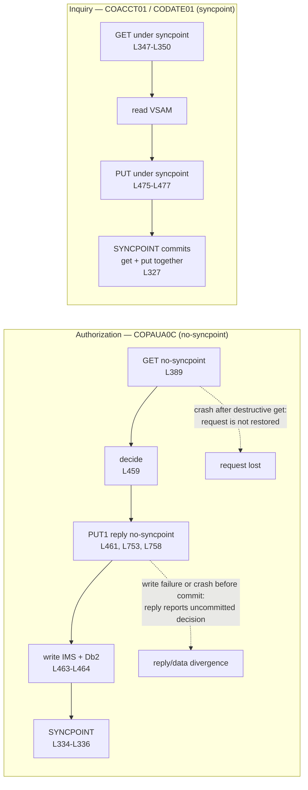

# Messaging Contracts

---

> **Purpose.** This document is the contract specification for the three
> decoupled extensions that currently communicate over IBM MQ. It fixes three
> things that downstream code cannot invent for itself: the mapping from the five
> baseline queues to their target Amazon SQS replacements, the mapping from IBM MQ
> message-descriptor fields to SQS message attributes, and — most importantly —
> the **byte-level wire format** of the authorization request and reply, which is
> a positional, comma-delimited character payload rather than a self-describing
> one. It discharges the messaging portion of **Deliverable 2** of the seven
> numbered deliverables: *"/docs/architecture — target architecture diagram,
> service catalog, and data-mapping (VSAM/Db2/IMS → AWS) tables"*, and it
> underwrites the acceptance criterion that names *"the three MQ extensions"*
> among the candidate business flows.
>
> It is authored fifth among the nine documents in this folder, after
> [`service-catalog.md`](service-catalog.md) and
> [`data-model-and-schema-mapping.md`](data-model-and-schema-mapping.md). Every
> service name and schema name below is taken verbatim from the catalog, which is
> the naming authority, and every persisted-column question is answered by
> citation to the data-model document rather than by restating its tables here.
> This document introduces no variant spelling of either.
>
> **Source of truth.** Five bodies of reference material, all read and none
> modified:
>
> * the **three MQ payload copybooks** of the authorization extension —
>   [`CCPAURQY.cpy`](../../app/app-authorization-ims-db2-mq/cpy/CCPAURQY.cpy) (36
>   lines; the eighteen request fields at L19–L36),
>   [`CCPAURLY.cpy`](../../app/app-authorization-ims-db2-mq/cpy/CCPAURLY.cpy) (24
>   lines; the six reply fields at L19–L24) and
>   [`CCPAUERY.cpy`](../../app/app-authorization-ims-db2-mq/cpy/CCPAUERY.cpy) (40
>   lines; the error-log record at L19–L40);
> * the **two IMS segment copybooks** that establish what the payload becomes once
>   it is persisted —
>   [`CIPAUSMY.cpy`](../../app/app-authorization-ims-db2-mq/cpy/CIPAUSMY.cpy) (31
>   lines, the summary segment) and
>   [`CIPAUDTY.cpy`](../../app/app-authorization-ims-db2-mq/cpy/CIPAUDTY.cpy) (54
>   lines, the detail segment, whose L34–L35 carry the two amounts in packed form);
> * the **authorization consumer and its purge companion** —
>   [`COPAUA0C.cbl`](../../app/app-authorization-ims-db2-mq/cbl/COPAUA0C.cbl) (1026
>   lines), which is the single most-cited file in this document because it
>   contains the parse, the build, the descriptor handling, the syncpoint discipline
>   and every timing literal, together with
>   [`CBPAUP0C.cbl`](../../app/app-authorization-ims-db2-mq/cbl/CBPAUP0C.cbl);
> * the **two inquiry programs** of the VSAM/MQ extension —
>   [`COACCT01.cbl`](../../app/app-vsam-mq/cbl/COACCT01.cbl) (620 lines) and
>   [`CODATE01.cbl`](../../app/app-vsam-mq/cbl/CODATE01.cbl) (524 lines) — which are
>   cited specifically because their messaging discipline **differs** from the
>   authorization consumer's, and the difference is load-bearing;
> * the **IMS and Db2 definitions that establish what the two-phase commit
>   spanned** —
>   [`DBPAUTP0.dbd`](../../app/app-authorization-ims-db2-mq/ims/DBPAUTP0.dbd) (41
>   lines, whose L28 and L36 declare the parent and child segment lengths),
>   [`AUTHFRDS.ddl`](../../app/app-authorization-ims-db2-mq/ddl/AUTHFRDS.ddl) (28
>   lines) and
>   [`XAUTHFRD.ddl`](../../app/app-authorization-ims-db2-mq/ddl/XAUTHFRD.ddl) (4
>   lines).
>
> **Delivers, and who consumes it.** It delivers six things: the queue-to-queue
> mapping with the FIFO grouping and deduplication keys; the
> descriptor-to-attribute mapping; the positional wire format of both payloads,
> field by field, with the arithmetic that distinguishes a field-width sum from a
> message length; the correlation and reply-routing rules; the resolution of the
> one genuine semantic gap between the two transports; and the explicit warning
> that the three extensions do not share a single messaging discipline. Its
> consumers are `authorization-service`, which owns the authorization request and
> reply flow, and `account-service`, which owns the one shared inquiry request queue
> and answers BOTH inquiry flows on it — the account inquiry of `COACCT01` and the
> date-and-time reply of `CODATE01` — by dispatching on the request's own
> four-character function code. Refactoring Rationale: `reference-service` was named
> here as a third consumer owning the date-conversion flow. It consumes no queue: the
> baseline defines one request destination for both programs and a queue admits
> exactly one owning consumer, so the queue half of the date flow is answered where
> the queue's owner lives, while that context keeps the date **evaluation** of
> `CSUTLDTC` on its synchronous route. The shared codec that
> encodes and decodes both payloads is the authored `CsvAuthCodec` in the shared
> kernel, and the authored `sqs` module defines the queue topology.
> `docs/architecture/observability.md` names this document in its own
> dependencies, because the error sink described in the last section is where
> structured failure records land.
>
> **Measured implementation status.** `CsvAuthCodec` and its golden byte vectors,
> the twelve-queue SQS module, the per-service queue-permission output and the
> exact-ARN ECS task-role policy are authored. The environment roots do not yet
> compose those modules, and authorization/account/reference listeners, an outbox
> table, an outbox repository/writer/publisher and the external request producer
> do not exist. Every baseline figure below is therefore derived from cited source,
> while every unimplemented consumer or delivery flow is labelled as a target.
>
> **Caveats.** Five, stated up front rather than buried. First, the SQS module
> validates in isolation, but no environment root wires it and **no message has
> been sent through a provisioned queue**; no throughput, latency or ordering
> figure anywhere in this document is a measurement. Second, the external
> point-of-sale authorizer that *produces* authorization requests is **not supplied
> by the baseline** — only a test stub exists — so the request side of the contract
> is documented from the consumer's parse rather than exercised against a real
> producer. Third, the baseline is reference-only: every line citation below is a
> read, and nothing under [`app/`](../../app) is modified, including the three
> known baseline defects, which must be registered in the contracted
> `docs/architecture/cobol-to-service-traceability.md` and are not among the
> subjects of this document. Fourth, the mainframe MQ path is **preserved intact**
> — the migration adds a path, it does not remove one, so the queue definitions,
> the trigger definitions and the programs that use them all remain exactly as they
> are. Fifth, this document specifies contracts, not capacity: the two bounds it
> derives from the baseline are treated separately — the five-second wait is
> preserved, while the declared 500-message ceiling is enforced exactly rather
> than reproducing the observed 501-message off-by-one.

---

## Three facts a careful reader would otherwise get wrong

These are stated first because each one is counter-intuitive enough that a
reasonable reader will assume the opposite, and because each one silently
corrupts an implementation that gets it wrong. Each is proven at its own section
below.

1. **Two different time units express the same five seconds in one program.**
   [`COPAUA0C.cbl`](../../app/app-authorization-ims-db2-mq/cbl/COPAUA0C.cbl) L750
   sets the reply's expiry to the literal `50`, and MQ expiry is denominated in
   **tenths of a second** — so `50` means 5.0 seconds, not fifty. L242 of the same
   program sets the get's wait interval to the literal `5000`, and that field is
   denominated in **milliseconds** — so `5000` also means 5 seconds. A reader who
   carries either literal across without its unit is wrong by a factor of ten in
   one direction or a hundred in the other.
2. **A field-width sum is not a wire length, and one consumer's receiving item
   is not a width.** The request copybook declarations sum to **153**, so the
   payload is **153** data characters plus seventeen commas: **170** characters.
   The observed ordinal-nine receiver is `PIC X(13)`, which is that consumer's
   working storage and not a property of the wire. The reply declarations sum to
   **57**; the target codec emits the zero-suppressed amount plus six commas:
   **63** characters. The baseline passes a length of 64 because
   its `STRING` pointer advances one position beyond the built payload. These
   figures are given, separately labelled, in
   [Width sums are not wire lengths](#width-sums-are-not-wire-lengths).
3. **The three extensions do not share one messaging discipline.** The
   authorization consumer reads outside syncpoint, sends its reply before its
   database write, and commits later; both inquiry programs read and reply *inside*
   one syncpoint. A single uniform consumer design would therefore be wrong for one
   of the two families — see
   [The three extensions do not share one messaging discipline](#the-three-extensions-do-not-share-one-messaging-discipline).

---

## WHY (non-obvious design decisions)

This section carries the reasoning for the choices this document makes *about
itself*. Every transport and format decision it records is justified at the point
where the decision is stated, under the same four category names, following
[`../CODE_DOCUMENTATION_STANDARD.md`](../CODE_DOCUMENTATION_STANDARD.md) and the
convention already established for the test suite at
[`tests/README.md`](../../tests/README.md) §12.

- Assumptions: this document's dominant category is necessarily `Assumptions`,
  because the payload is declared to the queue manager as **string format** —
  [`COPAUA0C.cbl`](../../app/app-authorization-ims-db2-mq/cbl/COPAUA0C.cbl) L397 on
  the inbound descriptor and L751 on the outbound one — and a string-format payload
  carries no schema, no field names and no type information. There is nothing in
  the message that tells a reader which field is which. **The field order and the
  delimiter therefore are the interface**, in the strictest sense: they are an
  external data-format contract on which both endpoints depend and which neither
  can renegotiate unilaterally. Every field-order and delimiter statement below is
  an assumption bullet about that contract, not a design preference.
- Assumptions: the repository is authoritative and prose is not. Every count,
  width, sum and literal below was measured directly from the files named in the
  header, and where a figure is easy to get wrong it is stated together with the
  measurement that establishes it, in a marked callout at the point of use. Four
  such figures are marked: the two field counts, the reply's emitted length, the
  error record's byte total, and the segment-length reconciliation. A figure that
  cannot be re-derived from a cited file has no standing in a document whose whole
  purpose is byte-level fidelity.
- Refactoring Rationale: the baseline contains one structural flaw in its
  messaging that the target contract deliberately corrects — its request get is
  outside recovery, and its reply is sent before the decision is committed, so a
  reply can be emitted for a decision that never commits. That correction is
  **authored**, not merely specified: `AuthorizationRequestListener` consumes the
  request under a per-message transaction and lets a failure propagate, so the
  message is deleted only on success and redelivered otherwise; `AuthReplyOutbox` is
  the reply-intent row committed with the decision; `OutboxPublisher` sends it
  afterwards; and `auth_reply_outbox` is created by `V1__authorization.sql` and extended
  by `V4__authorization_outbox_send_acceptance.sql` with the accepted-send record that stops
  a reply being sent twice.
  Assumptions: those four artifacts are named individually rather than summarised,
  because a specification note that understates what is landed sends a reader looking
  for absent code and past the code that is there. **No COBOL is changed**; the baseline remains exactly as it
  is, and the divergence is registered in the contracted
  `docs/architecture/cobol-to-service-traceability.md`.

- Trade-offs: this document reproduces the **complete positional field list** for
  both payloads rather than pointing at the copybooks, and it accepts the resulting
  duplication. The reason is specific rather than editorial: the copybooks begin at
  level `05` with no `01` group item, so a reader who opens them alone cannot tell
  what record the fields belong to or in what order they are transmitted, and an
  encoder written from the copybook without the consuming program's `UNSTRING`
  statement beside it will not know that field nine is parsed into a work field one
  byte narrower than its declaration. The duplication is bounded — eighteen fields
  and six — and it is checkable against the cited lines.
- Alternatives Considered: the alternative to writing this document at all was to
  let each consuming service derive the wire format independently from the
  copybooks. That was rejected because the services are authored separately:
  `authorization-service` and `account-service` would each have had to rediscover
  the delimiter, the trailing-comma behaviour and the two timing units, and either
  getting it wrong produces a wire-incompatibility that no unit test in a single
  service can detect. Refactoring Rationale: this named three consuming services;
  the third, `reference-service`, consumes no queue, and the shared layout it once
  transcribed for itself now lives once in the shared kernel — the request half in
  `InquiryRequestCodec` and the date reply half in `DateInquiryReplyCodec` — which is
  the same single-source argument applied one level lower.

---

## The five baseline queues and five target primary queues

The baseline uses five IBM MQ queues across the two messaging extensions. They
map to **five** primary SQS queues plus five dedicated dead-letter queues — ten
in total. Queue names are given in their parameterised `<env>` form; no account
identifier, resource identifier or endpoint appears anywhere in this document.

> ⚠️ Refactoring Rationale: this section described **six** primaries, refining the
> one shared baseline inquiry-request queue into separate account and date request
> queues "so competing consumers cannot remove each other's work". That refinement
> is **withdrawn**. It was a topology change rather than an implementation choice:
> the baseline defines ONE request destination for both inquiry programs —
> `DEFINE QLOCAL('CARDDEMO.REQUEST.QUEUE')` at
> [`app/app-vsam-mq/README.md`](../../app/app-vsam-mq/README.md) L53, aliased to
> CICS as `MQQUEUE(CARDREQ)` at L71 — and §0.4.1.8 of the technical specification
> maps that one name to one target queue. The competing-consumer hazard the split
> was reaching for is real, and splitting the queue is not how the transport
> resolves it: a receive **hides** a message from every other consumer rather than
> delivering a copy to each, so one queue is answerable by exactly one OWNING
> consumer, and that consumer dispatches on content it already decodes. The
> four-character function code is the first field of every request, single-sourced
> by `common-lib`'s `InquiryRequestCodec`. Splitting instead required a producer to
> know which of two addresses to use for a discriminator the payload already
> carries, and it left an external producer holding one address able to reach only
> one of the two flows.

| Target queue | Replaces | Type | Key configuration |
|---|---|---|---|
| `carddemo-pauth-request-<env>.fifo` + `-dlq` | the pending-authorization request queue | FIFO | `MessageGroupId` is the card number itself and `MessageDeduplicationId` is the transaction identifier itself, exactly as §0.4.1.8 freezes them; DLQ at `maxReceiveCount` 5 |
| `carddemo-pauth-reply-<env>.fifo` + `-dlq` | the pending-authorization reply queue | FIFO | Short retention, mirroring the original non-persistent reply. The group identity is the same card number the request carried, and retention must outlast the whole visibility, receive-count and long-poll budget so a repeatedly failing reply reaches its dead-letter queue before the source can expire it |
| `carddemo-inquiry-request-<env>` + `-dlq` | `CARDDEMO.REQUEST.QUEUE`, which feeds **both** inquiry programs | Standard | Owned by `account-service`, its single consumer, which dispatches on the request's four-character function code: `INQA` to the account inquiry of `COACCT01`, `DATE` to the shared date-and-time reply renderer, anything else to `COACCT01`'s invalid-parameters reply |
| `carddemo-inquiry-reply-<env>` + `-dlq` | the two per-flow inquiry reply queues | Standard | Configured shared destination; replies echo the request's correlation attribute |
| `carddemo-error-<env>` + `-dlq` | the error queue | Standard | Terminal error sink |

### The ordering contract ends at quarantine

**The authorization guarantee is per-card FIFO on the source queue, not an
unqualified claim of order across dead-letter handling.** The `MessageGroupId`
is the card number, `PA-RQ-CARD-NUM`, carried through unchanged, and the
`MessageDeduplicationId` is the transaction identifier, `PA-RQ-TRANSACTION-ID`.
§0.4.1.8 states both literally and §0.7.6 repeats the grouping rule, so equal
card numbers map to one group by construction rather than by agreement on a
derivation.

- Refactoring Rationale: both identities were previously purpose-scoped keyed
  tokens — 22-character URL-safe HMACs under `carddemo/pauth/order-group` and
  `carddemo/pauth/deduplication` — so that no primary account number entered SQS
  metadata. That is withdrawn, because the derivation removed the two guarantees
  it sat on. A group identity orders one card's messages only while **every**
  producer on the queue computes the same value for that card, and a
  deduplication identity suppresses a resend only while the **requester** can
  predict it; a value keyed from one consumer's secret satisfies neither, so a
  second producer written to this document would have split one card across two
  groups and a requester's resend would have been accepted as new.
- Trade-offs: the primary account number therefore **does** enter SQS metadata,
  where server-side encryption of the message body does not reach it. The
  consequence is registered as divergence
  `D-AUTHORIZATION-FIFO-IDENTITY-METADATA` in
  [`cobol-to-service-traceability.md`](cobol-to-service-traceability.md) rather
  than left implicit, and three provisioned controls bound it: SSE-KMS under a
  customer-managed key, reachability only through an interface endpoint inside
  the private network, and read access scoped to the task roles of the consumer
  and of the requesting producer. What those controls do not cover is queue
  telemetry and any log line that records a group identity, which is why
  `OutboxMetadataConfidentialityTest` pins the exposure to that **one** metadata
  field and asserts every other attribute is free of the number.

SQS dead-lettering creates a real semantic boundary: once a poison message
exhausts `maxReceiveCount` and leaves the source queue, later messages in the
same group may proceed. The former statement that two authorizations could
never be observed out of sequence was therefore too broad. The target makes the
following narrower and enforceable commitment:

1. Messages that remain on either authorization source queue are delivered in
   send order within their per-card group.
2. A failed message is preserved on a FIFO dead-letter queue whose
   `redrivePermission` is `byQueue` for exactly one source queue and whose
   retention is fourteen days.
3. Native `StartMessageMoveTask` is explicitly denied on both authorization
   dead-letter queues. That operation cannot select one message group and can
   interleave recovered messages with new traffic, so it is not an admissible
   recovery path for this flow.
4. Runtime task roles have receive/delete/send capabilities only for their
   assigned queues and no message-move capability. Recovery is a reviewed
   operator action: reconcile the failed authorization first, then replay
   messages individually with the original group and transaction identity.
   Durable transaction-id idempotency remains the backstop against a duplicate
   business effect.

- Trade-offs: this revision chooses availability for later authorizations over
  blocking every future message for one card indefinitely behind an
  unprocessable payload. What it gives up is uninterrupted order across the
  quarantine boundary, and the loss is stated rather than hidden. The FIFO DLQ,
  exact source admission, long evidence retention, denied bulk redrive and
  controlled replay make that boundary auditable and prevent an automatic
  recovery operation from creating a second, less visible reordering.

The baseline names those five queues in three different places, and the
provenance matters because it shows that not all of them are compiled-in
constants:

| Baseline queue name | Where it appears | How the program obtains it |
|---|---|---|
| `AWS.M2.CARDDEMO.PAUTH.REQUEST` | [`app-authorization-ims-db2-mq/README.md`](../../app/app-authorization-ims-db2-mq/README.md) L278 | Not a literal — arrives in the CICS trigger message; `COPAUA0C.cbl` L233–L236 retrieves it and L238 moves `MQTM-QNAME` into the request queue name |
| `AWS.M2.CARDDEMO.PAUTH.REPLY` | [`app-authorization-ims-db2-mq/README.md`](../../app/app-authorization-ims-db2-mq/README.md) L279 | Not a literal — taken per message from the inbound descriptor's reply-to field, `COPAUA0C.cbl` L413–L414 |
| `CARDDEMO.REQUEST.QUEUE` | [`app-vsam-mq/README.md`](../../app/app-vsam-mq/README.md) L53, defined to CICS at L71 | Not a literal — trigger message, `COACCT01.cbl` L191–L197 and `CODATE01.cbl` L140–L146 |
| `CARDDEMO.RESPONSE.QUEUE` | [`app-vsam-mq/README.md`](../../app/app-vsam-mq/README.md) L54, defined to CICS at L72 | The two inquiry programs each open a **statically named** reply queue instead: `'CARD.DEMO.REPLY.ACCT'` at `COACCT01.cbl` L198 and `'CARD.DEMO.REPLY.DATE'` at `CODATE01.cbl` L147 |
| `CARD.DEMO.ERROR` | `COACCT01.cbl` L294 and `CODATE01.cbl` L243 | A program literal in both inquiry programs |

> Assumptions: **neither authorization endpoint is a compiled-in baseline queue
> name, but inbound routing data is not authority.** The request queue reaches
> `COPAUA0C` in the trigger message — `EXEC CICS RETRIEVE INTO(MQTM)` at L233–L236,
> then `MOVE MQTM-QNAME TO WS-REQUEST-QNAME` at L238 — and the reply queue reaches
> it in the inbound message descriptor at L413–L414. Both are resolved at run time.
> The target consumer reads its request queue from injected configuration and
> treats `replyToQueueUrl` only as a requested route: it must equal an
> environment-owned allowlisted reply URL before any send is attempted. The
> authored topology has one pending-authorization reply queue, so that allowlist
> is currently a singleton. The two inquiry programs are the contrast — they open
> fixed reply queues by literal (L198 and L147), and the target account/date
> consumers likewise send only to the configured shared inquiry-reply queue.

> ⚠️ Refactoring Rationale: **the shared inquiry request queue stays one queue with
> one owner.** Both inquiry programs are triggered from the same request/reply pair
> described in [`app-vsam-mq/README.md`](../../app/app-vsam-mq/README.md) L53–L54,
> and they do answer different questions — `COACCT01.cbl` performs an account
> inquiry and `CODATE01.cbl` a date-and-time reply. The observation that followed
> was correct and its conclusion was not: two competing SQS consumers cannot safely
> "peek and put back" a sibling's message, which is precisely why a queue admits
> exactly **one** owning consumer rather than why it should be split in two. The
> owner is `account-service`, and it dispatches on the four-character function code
> the payload already carries; the DATE answer is a clock reading rendered through
> `common-lib`'s `DateInquiryReplyCodec`, so no cross-context call is on the message
> path. `reference-service` keeps the date **evaluation** of `CSUTLDTC` on its
> synchronous route, which is a different question — the baseline keeps them apart
> too, since a search for `CSUTLDTC` across all 524 lines of `CODATE01.cbl` returns
> zero occurrences. One divergence follows and is registered in
> [`cobol-to-service-traceability.md`](cobol-to-service-traceability.md): a request
> whose function code is neither `INQA` nor `DATE` receives `COACCT01`'s
> invalid-parameters reply, where `CODATE01` — which reads no field of its request —
> would have answered it with the date.

- Alternatives Considered: **managed queues rather than an IBM MQ broker run on
  EC2.** Assumptions: IBM MQ is not an Amazon MQ engine — Amazon MQ offers
  ActiveMQ and RabbitMQ only — so the broker alternative was always a
  self-managed one, as
  [ADR-004](../adr/ADR-004-messaging.md#option-2--self-managed-ibm-mq-on-aws--the-protocol-fidelity-maximum-rejected)
  records. A broker running IBM MQ would have preserved the wire protocol verbatim
  and required no codec at all, which is a real advantage and the reason it was
  evaluated first. It was rejected on two specific grounds. First, the two
  properties that the baseline actually depends on are both reproducible without a
  broker: request/reply is preserved by carrying an explicit reply address per
  message plus a correlation attribute, exactly as the descriptor already does
  (L413–L414 inbound, L745 echoed outbound), and per-card ordering is supplied by
  FIFO grouping on the card number, which §0.4.1.8 fixes as the `MessageGroupId`
  and which is what makes the grouping equal for equal cards across every
  producer. Second, a
  broker is a stateful component with
  its own version lifecycle, storage sizing, queue-depth monitoring and failover
  behaviour to operate, and none of those obligations buys anything for a workload
  whose entire requirement is "deliver this record to that consumer in card order,
  and route the answer back". The remaining broker-specific feature the baseline
  does use — per-message expiry — is the one genuine gap, and it is resolved
  explicitly in [The expiry gap](#the-expiry-gap) rather than treated as a reason
  to keep a broker.
- Alternatives Considered: **no streaming platform.** Kafka and Kinesis were both
  evaluated and both rejected, and neither is part of the target. The requirement
  here is request/reply with a distinct reply address attached to each individual
  message, which is a point-to-point conversation. A log-based platform models a
  durable partitioned stream consumed by cooperating groups: it would introduce
  partition assignment, consumer-group membership, offset commitment and rebalance
  semantics that the baseline has no analogue for, and it would still not carry a
  per-message reply address, so a side channel would be needed for the one thing
  the conversation actually turns on. Retaining an ordered, replayable log is also
  not a requirement the baseline expresses anywhere — the reply queue is explicitly
  non-persistent (L749) and expires in five seconds (L750), which is the opposite
  of a retained log.

---

## The wire format is the contract

Both authorization payloads are declared to the queue manager as **string
format** — `MOVE MQFMT-STRING TO MQMD-FORMAT` at
[`COPAUA0C.cbl`](../../app/app-authorization-ims-db2-mq/cbl/COPAUA0C.cbl) L397 for
the inbound message and L751 for the outbound one. A string-format payload carries
no schema, no field names and no type markers. Consequently the field order and
the delimiter are not an implementation detail of the payload — **they are the
payload's entire structure**, and they are the one part of this migration where a
single transposed field produces a message that parses without error and means
something different.

### The request — eighteen fields, in this order

From [`CCPAURQY.cpy`](../../app/app-authorization-ims-db2-mq/cpy/CCPAURQY.cpy),
data at L19–L36. The `PICTURE` column is the declared width; the position column is
the field's ordinal on the wire, which is the only thing that identifies it.
Ordinal nine is the documented exception: the copybook declares fourteen
characters and the wire carries fourteen, but the one consuming program in the
repository receives them into a thirteen-character item of its own.

| # | Field | `PICTURE` | Width | Notes |
|---|---|---|---|---|
| 1 | `PA-RQ-AUTH-DATE` | `X(06)` | 6 | |
| 2 | `PA-RQ-AUTH-TIME` | `X(06)` | 6 | |
| 3 | `PA-RQ-CARD-NUM` | `X(16)` | 16 | This field **is** the FIFO `MessageGroupId`, per §0.4.1.8 |
| 4 | `PA-RQ-AUTH-TYPE` | `X(04)` | 4 | |
| 5 | `PA-RQ-CARD-EXPIRY-DATE` | `X(04)` | 4 | |
| 6 | `PA-RQ-MESSAGE-TYPE` | `X(06)` | 6 | |
| 7 | `PA-RQ-MESSAGE-SOURCE` | `X(06)` | 6 | |
| 8 | `PA-RQ-PROCESSING-CODE` | `9(06)` | 6 | Unsigned numeric display |
| 9 | `PA-RQ-TRANSACTION-AMT` | `+9(10).99` | **14** declared and emitted / 13 received by `COPAUA0C` | Target emission follows the declaration; the narrower receiver is registered as a reference-side divergence — see [Money on the wire](#money-on-the-wire-is-edited-display-text-not-packed) |
| 10 | `PA-RQ-MERCHANT-CATAGORY-CODE` | `X(04)` | 4 | Misspelled in the baseline; corrected on every target-side surface — the persisted column, the Java component and the additive JSON envelope schema — per `data-model-and-schema-mapping.md`. The correction changes no byte of this wire, which carries no field name at all: what this row fixes is ordinal 10 |
| 11 | `PA-RQ-ACQR-COUNTRY-CODE` | `X(03)` | 3 | |
| 12 | `PA-RQ-POS-ENTRY-MODE` | `9(02)` | 2 | Unsigned numeric display |
| 13 | `PA-RQ-MERCHANT-ID` | `X(15)` | 15 | |
| 14 | `PA-RQ-MERCHANT-NAME` | `X(22)` | 22 | |
| 15 | `PA-RQ-MERCHANT-CITY` | `X(13)` | 13 | |
| 16 | `PA-RQ-MERCHANT-STATE` | `X(02)` | 2 | |
| 17 | `PA-RQ-MERCHANT-ZIP` | `X(09)` | 9 | |
| 18 | `PA-RQ-TRANSACTION-ID` | `X(15)` | 15 | This field **is** the FIFO `MessageDeduplicationId`, per §0.4.1.8 |

> **Measured — eighteen fields, and the parse agrees with the declaration.** The
> copybook declares eighteen elementary items at L19–L36 inclusive, and the
> consuming `UNSTRING` at
> [`COPAUA0C.cbl`](../../app/app-authorization-ims-db2-mq/cbl/COPAUA0C.cbl)
> L354–L374 names exactly eighteen receiving fields — seventeen of them the
> `PA-RQ-` items above, plus one work field in ordinal position nine. The count is
> therefore established twice from two independent statements, which is worth having
> because the ordinal positions are the only field identity the wire carries.
> The width is established only on the receiving side: L364 receives ordinal nine
> into `WS-TRANSACTION-AMT-AN`, declared `PIC X(13)` at L63, before
> `FUNCTION NUMVAL` converts it at L376–L377.

### The reply — six fields, in this order

From [`CCPAURLY.cpy`](../../app/app-authorization-ims-db2-mq/cpy/CCPAURLY.cpy),
data at L19–L24.

| # | Field | `PICTURE` | Width | Notes |
|---|---|---|---|---|
| 1 | `PA-RL-CARD-NUM` | `X(16)` | 16 | |
| 2 | `PA-RL-TRANSACTION-ID` | `X(15)` | 15 | Correlates the reply to its request at the business level |
| 3 | `PA-RL-AUTH-ID-CODE` | `X(06)` | 6 | |
| 4 | `PA-RL-AUTH-RESP-CODE` | `X(02)` | 2 | `'00'` is the approved value, per `CIPAUDTY.cpy` L31 |
| 5 | `PA-RL-AUTH-RESP-REASON` | `X(04)` | 4 | |
| 6 | `PA-RL-APPROVED-AMT` | `+9(10).99` | 14 | Declared here, but **emitted through a different edit mask** — see below |

> **Measured — six fields, and the build agrees with the declaration.** The
> copybook declares six elementary items at L19–L24 inclusive, and the `STRING`
> statement that builds the outbound buffer at
> [`COPAUA0C.cbl`](../../app/app-authorization-ims-db2-mq/cbl/COPAUA0C.cbl)
> L722–L727 concatenates exactly six values in the same order.

### Width sums are not wire lengths

This is the arithmetic most likely to be carried across incorrectly, so all three
levels are given separately and each is labelled.

| Quantity | Request | Reply | What it is |
|---|---|---|---|
| Sum of copybook-declared field widths | **153** | **57** | Declaration arithmetic only, no delimiters |
| Target codec emitted-width sum | **153** | **57** | Eighteen request widths as declared; six reply widths with the emitted mask |
| Target codec canonical wire length | **170** | **63** | Request: 153 + 17 interior commas. Reply: 57 + 6 commas, including the trailing comma |
| What one reference consumer receives — **not a wire length** | **169** | n/a | `COPAUA0C` reads ordinal nine into a 13-character item, so it keeps 169 of the 170 it is sent; accepted on decode, never emitted |
| What the baseline producer emits | **not observable** | **63 built, 64 passed to MQPUT1** | No request producer exists; the reply pointer contributes one trailing pad byte to the passed length |

> **Reconciled — the request wire length is 170, and 169 is one consumer's intake.**
> The two differ by exactly one byte of the money field, so the choice is a data
> decision rather than a counting preference and is settled here in writing rather
> than left to be rediscovered. 170 is reached by emitting ordinal nine at the
> fourteen characters
> [`CCPAURQY.cpy`](../../app/app-authorization-ims-db2-mq/cpy/CCPAURQY.cpy) L27
> declares for `PIC +9(10).99`, and a copybook field's picture is normative for this
> wire. The only consumer in the repository cannot hold fourteen: L63 of
> [`COPAUA0C.cbl`](../../app/app-authorization-ims-db2-mq/cbl/COPAUA0C.cbl)
> declares the receiving field `WS-TRANSACTION-AMT-AN PIC X(13)`, the `UNSTRING`
> hands ordinal nine into that field at L364, and L376–L377 then evaluate
> `FUNCTION NUMVAL` over it. An alphanumeric move into a shorter field drops the
> **last** character, which for this token is the second cents digit — so *that
> consumer* acts on the amount **divided by ten**, with nothing raised anywhere.
> That is a defect in its working storage, not in the payload, and narrowing the
> emission to 13 would make every other consumer wrong in order to protect it while
> leaving it truncating whatever it is sent. `CsvAuthCodec.REQUEST_WIRE_LENGTH` is
> therefore 170 and its `REQUEST_MONEY_WIDTH` is 14. The measurable consequence is
> that the whole declared domain round-trips exactly, positive and negative alike,
> because the sign occupies its own position rather than borrowing a digit's.

> **Tolerant on input, strict on output — and the committed fixtures say so.**
> The paragraph above settles the **emitted** length; it does not make a
> 13-character inbound token unacceptable, and the distinction is worth stating
> because a reader can otherwise take the emitted width as a rule about what may
> arrive. `CsvAuthCodec.parseMoney` accepts the narrower grammar as well, so a
> producer built against that consumer's intermediate is understood rather than
> dead-lettered; the codec always *emits* fourteen, so nothing it produces
> contradicts the layout this repository publishes; and a token narrower still —
> one that lost a cents digit rather than its sign position — is **refused by
> name**, because the parser requires exactly two fraction digits where
> `FUNCTION NUMVAL` would have accepted one. That asymmetry is registered as
> **D-AUTH-AMOUNT-TOLERANT-READ** in
> [`cobol-to-service-traceability.md`](cobol-to-service-traceability.md) §7.4.
>
> Fixtures under `services/authorization-service/src/test/resources/fixtures/`
> make each half executable, and their names say which is which:
> `auth-request-canonical-wire170.csv` and `auth-request-encode-oracle-170.bin`
> hold the canonical **170**-character payload — the second with no terminator at
> all, so it is byte-comparable against encoder output;
> `auth-request-amount-variants.csv` holds three 170-byte payloads spanning the
> negative, maximum and zero amount boundaries; and
> `auth-request-receiver-wire169-decode-only.csv` holds one **169**-byte payload at
> the reference receiver's narrower width. `AuthRequestWireFixtureTest` asserts the
> lengths, the decoded values, the refusal of the truncated form, and that
> re-emitting the narrower payload produces the canonical 170.

> **Measured — the emitted reply is longer than the interior-delimiter arithmetic
> predicts, because the `STRING` appends a comma after the last field too.** The
> statement at
> [`COPAUA0C.cbl`](../../app/app-authorization-ims-db2-mq/cbl/COPAUA0C.cbl)
> L722–L731 pairs a `','` literal with **every** one of the six values, including
> the sixth at L727 — not only with the five interior joins — so the built buffer is
> 57 characters of data plus **six** commas, giving **63** characters with a
> **trailing comma**. The length actually handed to the put is one greater again.
> `WS-RESP-LENGTH` is declared `PIC S9(4) VALUE 1` at L46 and is used as the
> `WITH POINTER` cursor at L730, so after the transfer it points one position past
> the last character written, leaving it at **64**; L756 moves that value into the
> put's buffer length and L762 passes it to the call. Because `W02-PUT-BUFFER` is
> `PIC X(200)` at L108, position 64 is a space. **The reply on the wire is therefore
> 64 bytes: six fields, six commas, and one trailing space.** A decoder that
> requires exactly 62 bytes with no trailing delimiter would reject every genuine
> reply the baseline produces.

> Assumptions: **the target codec parses tolerantly, emits the declared request
> width and emits the reply buffer the baseline actually builds.** The request
> encoder writes a 14-character amount, giving 153 data characters and a
> 170-character payload; the leading position always carries a forced sign, `+` or
> `-`, followed by ten zero-padded integer digits, the point and two cents. This is
> an explicit assumption about the absent producer, chosen because the copybook is
> the only published statement of what that producer would emit. The reply encoder
> writes the
> fourteen-character `PIC -zzzzzzzzz9.99` rendering and a trailing comma, giving
> 63 characters. The decoder also tolerates the baseline's 64th pad byte. Golden
> vectors pin positive, negative, zero and non-zero-cent values so a symmetric but
> byte-wrong encoder/decoder pair cannot pass by round-tripping itself.

### The 500-byte receive buffer is retired as transport, retained as an input shape

A fourth length exists beside the three above and belongs to neither the
declaration nor the wire: the **capacity of the area the baseline reads a message
into**. It is listed here because it is the one quantity a naive port carries
across as though it were a payload length. The eighteen ordinals referred to
below are the ones
[`CCPAURQY.cpy`](../../app/app-authorization-ims-db2-mq/cpy/CCPAURQY.cpy)
declares at L19–L36, whose widths sum to the 153 in the table above.

| Quantity | Value | Location | What it is |
|---|---|---|---|
| Receive buffer capacity | **500** | [`COPAUA0C.cbl`](../../app/app-authorization-ims-db2-mq/cbl/COPAUA0C.cbl) L103, `01 W01-GET-BUFFER PIC X(500).` | Fixed working-storage capacity, unrelated to how many bytes arrived |
| Buffer length passed to the get | **500** | L398, `MOVE LENGTH OF W01-GET-BUFFER TO W01-BUFFLEN` | The capacity, told to the queue manager |
| Bytes actually received | **variable** | L102, `01 W01-DATALEN PIC S9(9) BINARY.` | The declared payload length, returned separately at L406 |
| Bytes the parse reads | **`W01-DATALEN`** | L354, `UNSTRING W01-GET-BUFFER(1:W01-DATALEN)`, `DELIMITED BY ','` at L355, closed by `END-UNSTRING` at L374 | The reference modification bounds the parse to the declared length |
| Pad the parse never sees | **500 − `W01-DATALEN`** | — | Blank, because an alphanumeric working-storage item is space-initialised |

> Assumptions: **the baseline never sees the padding, so the hazard is in a port
> rather than in the COBOL.** The reference modification `(1:W01-DATALEN)` at L354
> restricts the `UNSTRING` source to the first `W01-DATALEN` bytes, which is why the
> declared length and the capacity being different numbers costs the baseline
> nothing. A port that reads the whole frame instead — because a buffer's length is
> the number lying closest to hand — hands the trailing pad to the parse and makes
> the last field's recovered value depend on the capacity of an area that has no
> business influencing it.

> Assumptions: **the pad is blank and not NUL, and that is checkable rather than
> incidental.** An alphanumeric working-storage item is conventionally
> space-initialised, so a partially filled `W01-GET-BUFFER` holds blanks past its
> data, and blanks are also what a padded external producer would emit because this
> wire is character data throughout. Alternatives Considered: a NUL-filled pad, which
> was rejected on two counts — it is not what either the reference buffer or a
> character-format producer would contain, and it would invite the
> null-terminated-read failure mode, which the packed segment fixtures in the same
> directory already cover from a different angle. `CsvAuthCodec` closes that door in
> any case: its decoder refuses **any** ISO control character anywhere in a payload,
> so a NUL-padded frame decoded at its full length would be rejected by name rather
> than silently shortened at the first zero byte.

> Assumptions: **the fixed buffer is retired as a transport mechanism and retained
> only as an accepted input shape.** A queue message body in the target is exactly
> sized: the body length *is* the payload length, there is no capacity to over-read
> and no separate length field to honour, so a padded frame does not arise from the
> transport at all. The tolerance is nonetheless worth having, because an external
> point-of-sale integration written against the mainframe contract would plausibly
> still emit a blank-padded fixed frame — so the target *accepts* that shape without
> *implementing* it. Trade-offs: the tolerance lives in `CsvAuthCodec` and nowhere
> else. No fixed receive buffer may be introduced into the transport layer, which is
> why `AuthorizationRequestListener` hands the exactly-sized body straight to
> `CsvAuthCodec.decodeRequest(String)` and the byte-array entry point
> `decodeRequest(byte[] buffer, int payloadLength)` takes the payload length as a
> **separate argument** rather than measuring the array it was given.

> Alternatives Considered: **right-trimming the pad to find the payload boundary was
> evaluated and rejected; honouring the declared length was chosen.** Right-trimming
> is the obvious reading and it is unsafe, because a trailing blank inside the last
> field is byte-for-byte indistinguishable from a pad byte after it. Five of the
> eighteen request fields carry trailing blanks legitimately in the canonical
> record — ordinal 6 `PA-RQ-MESSAGE-TYPE` (2), ordinal 7 `PA-RQ-MESSAGE-SOURCE` (3),
> ordinal 14 `PA-RQ-MERCHANT-NAME` (9), ordinal 15 `PA-RQ-MERCHANT-CITY` (6) and
> ordinal 17 `PA-RQ-MERCHANT-ZIP` (4) — so the shape is routine rather than
> hypothetical. A right-trim happens to land on the boundary only while ordinal 18
> `PA-RQ-TRANSACTION-ID` fills all fifteen of its characters; the moment it is
> shorter, the trim eats the field's own blanks, and if it were wholly blank the trim
> would continue through the comma at offset 154 and into ordinal 17, producing a
> shorter string with a **wrong comma count** that a lenient parser might split into
> seventeen fields without complaint. Slicing to the declared length is exact, is the
> direct analogue of `(1:W01-DATALEN)`, and cannot be fooled by in-field padding.
> Left-trimming is forbidden outright: ordinal 1 begins at offset 0 with a digit, so
> a leading blank would be data corruption rather than framing.

> Assumptions: **a frame is read as a fixed number of bytes, never as text and never
> as lines, and the reason differs by fixture family — three distinct reasons now
> exist in this directory and only one of them applies here.** The packed segment
> fixtures require it because `0x0A`, `0x0D` and `0x00` occur *inside* their data;
> `auth-request-encode-oracle-170.bin` requires it because the *absence* of a
> terminator is itself the contract it pins; and a padded frame requires it because
> **the payload boundary is not discoverable from the bytes at all** — it can only
> come from a declared length. That last case is the one this section is about, and it
> is why the tolerance is expressed as a length parameter rather than as a scan.
> Trade-offs: declaring a length that spans the whole frame is accepted rather than
> refused, and what that must never do is keep only the first fifteen characters of
> ordinal 18 and discard the rest, which is exactly what an alphanumeric `MOVE` into a
> `PIC X(15)` receiver would do — the same truncation already recorded above for
> ordinal 9's 13-character intermediate. `CsvAuthCodec` instead treats the run of
> blanks as that field's own trailing pad and returns the value whole, so no character
> a producer sent is ever dropped without a named failure.

> `auth-request-buffer500.bin` in
> `services/authorization-service/src/test/resources/fixtures/` makes all of the
> above executable. It is the canonical 170-byte payload at offsets 0–169 followed by
> **330** blank bytes at offsets 170–499, with no terminator anywhere, and its first
> 170 bytes are byte-identical to `auth-request-encode-oracle-170.bin` so the two
> cannot drift apart. Its trailing blanks are **content, not whitespace**: truncating
> the file to 170 bytes would merely duplicate that oracle and would delete the only
> decode-tolerance vector in the family. Like every fixture in this section it is
> **contract-derived** rather than recorded — `COPAUA0C` is a `CO*` CICS program and
> the runner has no CICS runtime, and no request producer exists in the repository to
> observe, so the pad length is derived from the buffer declaration at L103 rather
> than measured off a captured frame.

### The delimiter is a literal comma

Proven on both directions of the conversation, so there is no inference involved.

| Evidence | Location | What it establishes |
|---|---|---|
| `UNSTRING W01-GET-BUFFER(1:W01-DATALEN)` / `DELIMITED BY ','` | `COPAUA0C.cbl` L354–L355, closed by `END-UNSTRING` at L374 | The inbound parse splits on a comma |
| `STRING` interleaving each reply value with a `','` literal, `DELIMITED BY SIZE`, `END-STRING` | `COPAUA0C.cbl` L722–L731 | The outbound build joins with a comma |
| `01 W01-GET-BUFFER PIC X(500).` | `COPAUA0C.cbl` L103 | The inbound buffer is a 500-byte character area, so the payload is character data throughout |
| `MOVE MQFMT-STRING TO MQMD-FORMAT` | `COPAUA0C.cbl` L397 (inbound) and L751 (outbound) | Both directions are declared string format to the queue manager |

> Assumptions: **the payload is character data, and no field may contain the
> delimiter.** Because the format is positional and the delimiter is a bare comma
> with no quoting or escaping mechanism anywhere in the parse, any comma appearing
> inside a value — most plausibly in the 22-character merchant name at ordinal 14 or
> the 13-character merchant city at ordinal 15 — would shift every subsequent field
> by one position and be silently mis-parsed rather than rejected. The target
> encoder therefore rejects a value containing the delimiter at the boundary instead
> of emitting a message that its counterpart will misread. This is a constraint the
> baseline format imposes, not one the target adds.

### Money on the wire is edited display text, not packed

The two amounts that cross the wire are declared `PIC +9(10).99` — fourteen
characters comprising an explicit sign, ten integer digit positions, an explicit
decimal point and two decimal digits. The identical two logical amounts are
declared `PIC S9(10)V99 COMP-3` where they are persisted, at
[`CIPAUDTY.cpy`](../../app/app-authorization-ims-db2-mq/cpy/CIPAUDTY.cpy)
L34–L35, and `DECIMAL(12,2)` in the fraud table at
[`AUTHFRDS.ddl`](../../app/app-authorization-ims-db2-mq/ddl/AUTHFRDS.ddl) L12–L13.
So the same value has three representations in the baseline: signed decimal
**text** in transit, packed decimal at rest in the segment, and a fixed-scale
decimal column at rest in the table.

> Assumptions: **the baseline already transports money as signed decimal text, so
> carrying money as a JSON string preserves the baseline's contract rather than
> inventing a convention.** This is the single most useful thing to know about the
> money path, because the target's rule — money is a JSON string, never a JSON
> number — looks at first like a target-side stylistic preference imposed on the
> baseline. It is not. The wire form `+9(10).99` is character data, and the
> persisted forms are exact fixed-point (packed decimal, and a two-scale decimal
> column). At no point does the baseline represent an amount in binary floating
> point. A JSON number, by contrast, is parsed into an IEEE-754 double by most
> clients, and a double cannot represent every two-decimal value exactly — so
> emitting a JSON number would introduce a representation the baseline never had, at
> precisely the boundary a client consumes. Carrying the string is the
> contract-preserving choice, not the conservative one. The full money invariant —
> `NUMERIC(p,2)` in the database, scale-2 `BigDecimal` in the services, `Decimal` in
> the extract-transform-load package — is specified in
> [`data-model-and-schema-mapping.md`](data-model-and-schema-mapping.md) and is not
> restated here.

> Assumptions: **the reply's amount is emitted through a different edit mask than
> the one the copybook declares, and both are fourteen characters wide.** The
> `STRING` at
> [`COPAUA0C.cbl`](../../app/app-authorization-ims-db2-mq/cbl/COPAUA0C.cbl) L727
> concatenates `WS-APPROVED-AMT-DIS`, not `PA-RL-APPROVED-AMT`, having moved the
> computed amount into it at L720. That work field is declared
> `PIC -zzzzzzzzz9.99` at L66: a **floating minus** that prints as a blank when the
> value is non-negative, and **zero suppression** that prints leading zeros as
> spaces. The copybook's declared `+9(10).99` instead prints an explicit `+` or `-`
> and zero-fills. Both occupy fourteen positions, so the length arithmetic above is
> unaffected — but the bytes differ, and a decoder that requires a leading sign
> character or digits in every position will fail on a positive amount, which the
> baseline emits as leading spaces with no sign. This is the concrete reason the
> tolerant-parse rule above is a requirement rather than a defensive nicety.

### The copybooks carry no `01` level, with one exception

> Assumptions: **four of the five copybooks begin at level `05` and have no group
> item, so a codec written against one must be told what record it belongs to.**
> [`CCPAURQY.cpy`](../../app/app-authorization-ims-db2-mq/cpy/CCPAURQY.cpy),
> [`CCPAURLY.cpy`](../../app/app-authorization-ims-db2-mq/cpy/CCPAURLY.cpy),
> [`CIPAUSMY.cpy`](../../app/app-authorization-ims-db2-mq/cpy/CIPAUSMY.cpy) and
> [`CIPAUDTY.cpy`](../../app/app-authorization-ims-db2-mq/cpy/CIPAUDTY.cpy) all
> start their data at level `05` — the including program supplies the enclosing `01`
> group item, which is why the same layout can be copied into a message buffer in
> one program and a segment area in another. The practical consequence is that these
> files do not name the record they describe, so a generated codec cannot infer its
> own top-level type from the copybook alone and must be given it explicitly; the
> layout descriptor in the shared kernel supplies that name.
> [`CCPAUERY.cpy`](../../app/app-authorization-ims-db2-mq/cpy/CCPAUERY.cpy) is the
> **exception** — it declares its own `01 ERROR-LOG-RECORD.` at L19 and is therefore
> self-contained.

### The comma-delimited form is the only wire format, and any JSON envelope is additive

**No JSON envelope is part of the authorization wire.** The comma-delimited form is
the sole contract of record for the queues above, and `CsvAuthCodec` imports no JSON
library — its only imports are the shared money, masking and error types plus
`java.math`, `java.nio.charset` and two collection types, so there is no encoder
present to reach for by accident.

An envelope carrying the same eighteen and six fields under names is admissible for
a consumer that has no reason to speak a positional format, on one condition: it is
**additive**, and it cannot replace the comma-delimited form.

- Trade-offs: offering two encodings costs a discriminator and a second code path
  in the codec, and that cost is accepted for one specific reason: the baseline
  consumer and any external producer built against it can only speak the positional
  form, so removing it would break the compatibility that is the whole point of
  preserving the wire format — while requiring a newly-written consumer to emit
  positional text would propagate a format whose only justification is history. The
  discriminator is the `contentType` attribute described in the next section, so a
  message is never guessed at.

### Reproducing these figures

Every count and sum above is re-derivable from the repository, and the commands
that do it are given so that a reader can check them rather than trust them. They
read the baseline and write nothing.

```bash
# WHY : Assumptions: the ordinal position of a field is its only identity on a
#       string-format wire, so the field COUNT is load-bearing rather than
#       descriptive -- eighteen and six are the two numbers that make the
#       positional contract checkable, and a reader who cannot re-derive them has
#       to take the field tables on faith.
grep -c 'PIC' app/app-authorization-ims-db2-mq/cpy/CCPAURQY.cpy   # expect 18
grep -c 'PIC' app/app-authorization-ims-db2-mq/cpy/CCPAURLY.cpy   # expect 6
```

```bash
# WHY : Assumptions: the delimiter is not documented anywhere in the baseline
#       except in these two statements, so they are the contract's only primary
#       source. Printing the build alongside the parse is what makes the trailing
#       comma visible: the sixth value at L727 carries a comma just as the first
#       five do, which is the single detail that moves the emitted reply from the
#       62 bytes the interior-delimiter arithmetic predicts to the 63 it actually
#       builds.
sed -n '354,355p;722,731p' app/app-authorization-ims-db2-mq/cbl/COPAUA0C.cbl
```

```bash
# WHY : Assumptions: the two literals are 5000 and 50 and both mean five seconds,
#       because the wait interval is denominated in milliseconds and the message
#       expiry in tenths of a second. Reading them side by side is the fastest way
#       to see that they are not a hundredfold apart in duration, which is the
#       misreading this document exists to prevent.
sed -n '242p;749,750p' app/app-authorization-ims-db2-mq/cbl/COPAUA0C.cbl
```

---

## Message descriptor to message attribute

IBM MQ carries per-message metadata in the message descriptor. SQS carries it in
message attributes plus a small number of native fields. The mapping is
one-for-one except for expiry, which has no native counterpart and is treated
separately in the following section.

| MQ message descriptor field | SQS equivalent | Baseline citation |
|---|---|---|
| correlation identifier | `correlationId` message attribute | `COPAUA0C.cbl` L45, L411–L412, L745 |
| message identifier | `messageId` | `COPAUA0C.cbl` L395 (inbound), L746 (outbound) |
| reply-to queue | `replyToQueueUrl` message attribute | `COPAUA0C.cbl` L413–L414 (captured), L741–L742 (used) |
| string format indicator | `contentType` of `text/csv` | `COPAUA0C.cbl` L397, L751 |
| persistence, set to non-persistent | retry-budget-bounded queue retention plus dead-letter quarantine; `expiresAt` remains the business-expiry control | `COPAUA0C.cbl` L749 |
| expiry | `expiresAt` message attribute — see [The expiry gap](#the-expiry-gap) | `COPAUA0C.cbl` L750 |
| message type, set to reply | inferred from the queue the message is on | `COPAUA0C.cbl` L744 |

The `contentType` of `text/csv` is doing real work rather than decorating the
message: it is the discriminator a consumer would use to distinguish a positional
payload from the additive JSON envelope described above, which is why the format
declaration at L397 and L751 is mapped rather than dropped as transport trivia.

- Refactoring Rationale: "would use" rather than "does use". `AuthReplyOutbox`
  declares exactly one content type — `CONTENT_TYPE_CSV` — and `OutboxPublisher`
  stamps that one value on every reply, while `AuthorizationRequestListener`
  decodes every inbound payload with `CsvAuthCodec.decodeRequest` and branches on
  no content type at all. Stamping the attribute now is what makes the envelope
  addable later without a breaking change, because an existing consumer already
  receives the discriminator it will need; claiming the dispatch exists would send
  a reader looking for a branch that is not there.

### The inquiry replies declare `text/plain`, not `text/csv`

The `text/csv` value above belongs to the **authorization** flow alone, and the
distinction is load-bearing rather than pedantic. That flow really is delimited —
eighteen comma-separated fields on the request and six on the reply — so a
consumer that split the payload on commas would parse it correctly, and a
`contentType` of `text/csv` tells it that it may.

The account-inquiry reply is not delimited. `COACCT01.cbl` declares
`01 REPLY-MESSAGE PIC X(1000).` at L107, blanks it at L391, and fills it with a
single **group move** — `MOVE WS-ACCT-RESPONSE TO REPLY-MESSAGE` at L426 — so the
reply is a fixed-width positional record padded to its declared width. The
program contains no comma literal anywhere, and a consumer that split the payload
on commas would recover one field holding the whole record.
`InquiryMessageListener` therefore stamps `text/plain`.

The **date**-inquiry reply is not delimited either, for the same reason.
`CODATE01.cbl` sets `MQFMT-STRING` on every put, and the reply
`common-lib`'s `DateInquiryReplyCodec` renders is a 46-character positional block
located by offset and framed to the same declared 1000. Refactoring Rationale: both
inquiry replies are now emitted by ONE consumer — `account-service`'s
`InquiryMessageListener`, which owns the single shared request queue and dispatches
on the function code — so `text/plain` is stamped in one place for both, and the two
values cannot drift apart. That is a stronger guarantee than the paragraph below
describes, and the paragraph is kept because the drift it records is why the
attribute is documented at all.

- Assumptions: `text/csv` would be WRONG here even though it is correct on the
  authorization flow, and the two must not be copied from one another. Nothing
  consumes this attribute yet, so a wrong value would be inert and the defect
  invisible — which is exactly why it is worth stating: the attribute exists to be
  the discriminator a future consumer branches on, and a discriminator that names
  the wrong format is worse than an absent one, because the consumer it misleads
  will have had every reason to trust it.
- Refactoring Rationale: the paragraph naming the date consumer was added because
  that consumer still stamped `text/csv` while the account consumer's own
  documentation already asserted, in prose, that "the date-inquiry reply, which is
  positional for the same reason as this one, already declares `text/plain`". Two
  consumers of one wire had drifted apart on the discriminator, and each described
  its own value as the shared one — which is the failure this section exists to
  prevent and had not caught, because the section named only one of the two. That
  class of drift is now structurally impossible on this wire: there is one consumer,
  and the divergence it made possible is recorded here so a future second consumer is
  understood as re-opening it.
- Trade-offs: `text/plain` rather than a bespoke media type such as
  `application/vnd.carddemo.acctinfo+fixed`. A registered-looking vendor type
  would carry more information, at the cost of inventing a name no registry
  holds and that no consumer could resolve. What matters at this boundary is the
  negative claim — *this is not delimited* — and `text/plain` makes it in a value
  every client library already understands. The width and field order remain
  documented by the payload table rather than by the media type.

---

## Correlation identity is carried in the descriptor, not reconstructed

The baseline does **not** reconstruct the pairing between a reply and its request
from payload content. It carries the correlation identifier in transport metadata
and echoes it back unchanged. That is established definitively by six statements
in
[`COPAUA0C.cbl`](../../app/app-authorization-ims-db2-mq/cbl/COPAUA0C.cbl), and
there is no ambiguity to resolve:

| Location | Statement | What it establishes |
|---|---|---|
| L45 | `05 WS-SAVE-CORRELID PIC X(24).` | A dedicated 24-byte save area exists solely to hold the inbound correlation identifier across the turn |
| L395–L396 | `MQMI-NONE` into the request message identifier, `MQCI-NONE` into the request correlation identifier | The get **does not filter** — it accepts any available message rather than selecting by identifier |
| L411–L412 | inbound correlation identifier saved into `WS-SAVE-CORRELID` | The identifier is preserved before any processing that could overwrite the descriptor |
| L413–L414 | inbound reply-to queue saved into `WS-REPLY-QNAME` | **The reply destination is dynamic, taken from the request** |
| L745 | `MOVE WS-SAVE-CORRELID TO MQMD-CORRELID OF MQM-MD-REPLY` | The request's correlation identifier is echoed onto the reply **unchanged** |
| L746 | `MQMI-NONE` into the reply's message identifier | The reply gets a fresh message identifier; only the correlation identifier is carried over |
| L747–L748 | spaces into the reply's own reply-to queue and queue-manager fields | The reply is **terminal** — it invites no answer |
| L758 | the put is `MQPUT1`, not `MQPUT` | Open, put and close in one operation per message, with the destination supplied in the call |

> Assumptions: **correlation is echoed, but a reply URL is routing data rather
> than authority.** The target consumer must copy the inbound `correlationId`
> verbatim because the requester is waiting on that opaque value. It may use the
> inbound `replyToQueueUrl` only after exact-match validation against its
> environment-owned allowlist. The authored topology exposes one
> pending-authorization reply queue, so the authorization allowlist is a
> singleton; an arbitrary URL, a queue from another environment and any URL not
> represented by an allowed ARN are rejected before send. This intentionally
> narrows the baseline's unrestricted `MQPUT1` destination to prevent the task
> role becoming a confused deputy.
>
> The two inquiry programs remain the contrast: they pre-open fixed reply queues
> by literal (`COACCT01.cbl` L198 and L261, `CODATE01.cbl` L147 and L210), and the
> one target inquiry consumer sends only to the configured shared inquiry-reply
> queue.
>
> Assumptions: the one inquiry listener is authored --
> `services/account-service/src/main/java/com/carddemo/account/service/InquiryMessageListener.java`
> -- and it publishes **only** to the queue named by its own configuration, so the
> validation described here is enforced in code rather than required of a future
> one. Refactoring Rationale: a second listener in `reference-service` was named here
> and is withdrawn; the queue it bound is the one shared request queue, which admits a
> single owning consumer. It does not read a destination from the message: it is
> written against the
> baseline's own behaviour, which saves the request's reply-to queue (`COACCT01.cbl` L341) and then
> does not use it, putting instead to the handle opened from the statically assigned
> reply-queue name. Honouring a message-supplied destination would have been both
> unfaithful and a queue-injection vector, since a request could then direct an
> account's balance to a queue of the sender's choosing;
> `InquiryMessageListenerTest.theReplyIgnoresAMessageSuppliedDestination` asserts it
> does not.

### Divergence: an inquiry reply carries no copy of the request's message identifier

Both inquiry programs restore the saved inbound **message** identifier onto the reply
descriptor beside the correlation identifier — `CODATE01.cbl` L373 does
`MOVE SAVE-MSGID TO MQMD-MSGID` immediately before its put at L383, having saved it at
L321, and `COACCT01.cbl` does the same for its own reply. **Neither target listener
re-publishes it.** `DateInquiryMessageListener.publishReply` and
`InquiryMessageListener` each put a closed attribute set on a reply: `contentType`
always, and `correlationId` only when the requester supplied one. There is no
`messageId` attribute and no `replyToQueueUrl` attribute on an inquiry reply.

- Assumptions: this is a property of the target transport rather than an omission. SQS
  assigns a `MessageId` to every message it accepts, so a reply carrying a copy of the
  request's identifier under that name would carry **two** identifiers with one meaning
  and leave a consumer to guess which one it held. The correlation identifier is the
  value a requester actually matches an answer against, and it crosses verbatim — which
  is what preserves the request/reply pairing the baseline descriptor provided.
- Trade-offs: what is surrendered is a requester's ability to match a reply by the
  request's own message identifier, which the baseline permitted and which nothing in
  either reference program relies on. What is kept is one unambiguous identity per
  message plus the requester's own opaque correlation value. A requester that keyed on
  the message identifier rather than the correlation identifier would need to change;
  no baseline consumer does, because the reference programs are the only producers of
  these replies.
- Assumptions: the asymmetry is asserted rather than left to be discovered.
  `DateConversionMessageListenerTest` fixes the reply's attribute set as a **closed**
  key set rather than as a presence check, so an attribute added beside `correlationId`
  fails that case; `InquiryMessageListenerTest` does the same for the account flow.

This document is the register for that divergence. `SqsConfig` in `reference-service`
records the same asymmetry at the point of use and cites this section rather than
restating it, so the two cannot drift into disagreeing.

The IAM boundary is already authored independently of that future validation.
`infra/modules/sqs/outputs.tf` publishes `service_queue_permissions` as closed sets,
one per workload that touches a queue:

| Service | Receives from | Sends to |
|---|---|---|
| `authorization-service` | `pauth_request` | `pauth_reply` |
| `account-service` | `inquiry_request` | `inquiry_reply`, `error` |

Refactoring Rationale: there is no `reference-service` row, and the module publishes
no such member. That context consumes no queue, so a receive grant for it would let a
second identity take messages only the owning consumer can answer, and a send grant
would address a reply it never produces. `infra/modules/sqs` publishes
`service_queue_permissions` with `authorization_service`, `account_service` and
`batch_service` members; both roots fall a workload absent from that map through to an
empty receive-and-send pair, so `infra/modules/ecs-service` creates no queue-boundary
policy for it at all.

`infra/modules/ecs-service` accepts those exact ARNs through
`sqs_receive_queue_arns` and `sqs_send_queue_arns`. Its `AllowExactQueueSend`
statement grants only `sqs:SendMessage`; its consume statement grants receive,
delete, visibility and queue-metadata actions only on the supplied receive ARNs.
There is no wildcard SQS resource and no ARN is assembled from
`replyToQueueUrl`. Both environment roots compose that boundary: each reads
`module.sqs.service_queue_permissions` into a per-workload map and passes its
`receive` and `send` members into the service module's `sqs_receive_queue_arns` and
`sqs_send_queue_arns`, so the grant surface is composed and not merely offered.

Assumptions: both roots compose it through `local.sqs_permissions_by_workload`,
which reads the three entries of that output directly rather than assembling ARNs.
Composing it is NECESSARY rather than tidy, and the reason is the two inquiry
consumers: both of them **send**, so without the grants each would poll its request
queue successfully and then fail every reply with an access-denied error — a failure
that presents as an unanswered requester rather than as a permissions problem, and
which no plan-time check would surface.

A workload absent from that map receives the empty set and therefore no SQS
statement at all. That is deliberate: `batch` and `data-migration` put no message
on any of these queues, so the three workloads that do are named explicitly and
adding a fourth is a visible edit rather than an inherited grant.

> Assumptions: **the FIFO deduplication identifier is a separate concern from
> correlation, and the two must not be conflated.** The correlation identifier is
> transport metadata whose only job is to match an answer to a question; it is
> opaque, it is chosen by the requester, and the consumer never interprets it. The
> `MessageDeduplicationId` is a target-side idempotency key that tells the queue
> whether it has already accepted this message, and it is derived from the
> **business** transaction identifier at ordinal 18 of the request payload, which
> the baseline itself treats as the transaction's identity. Deriving deduplication
> from the correlation identifier would tie duplicate suppression to a requester's
> arbitrary metadata choice — two genuinely distinct authorizations sent with the
> same correlation value would collapse into one — while deriving correlation from
> the transaction identifier would break any requester that correlates on its own
> value. They are independent fields with independent lifetimes.

The identity context on the reply is set with `MQPMO-DEFAULT-CONTEXT` at L754,
meaning the reply's identity context defaults to the putting application rather
than being passed through from the requester; the target's equivalent is the task
role under which the consumer runs, and that mapping is specified in
[`security-and-identity.md`](security-and-identity.md) rather than here.

---

## The expiry gap

This is the one genuine semantic gap between the two transports, and it is stated
plainly rather than papered over.

| Baseline setting | Location | Literal | Unit | Meaning |
|---|---|---|---|---|
| Reply message expiry | `COPAUA0C.cbl` L750 | `50` | **tenths of a second** | 5.0 seconds |
| Get wait interval | `COPAUA0C.cbl` L242, applied at L393 | `5000` | **milliseconds** | 5 seconds |
| Reply persistence | `COPAUA0C.cbl` L749 | `MQPER-NOT-PERSISTENT` | — | The reply is not written to durable storage |

> Assumptions: **two different time units express the same five seconds in one
> program, and any implementation that reads either literal without its unit will
> be wrong.** MQ denominates message expiry in tenths of a second, so the `50` at
> `COPAUA0C.cbl` L750 is **5.0 seconds** — not fifty seconds and not fifty
> milliseconds. MQ denominates the get wait interval in milliseconds, so the `5000`
> at L242 of that same program is **5 seconds**. The two literals differ by a
> factor of a hundred and mean the same
> duration. The baseline corroborates the millisecond reading in its own words: the
> inquiry programs set the identical wait value under a comment that spells the unit
> out — `*** ADDED 5000 MS (5 SECS) AS THE WAIT INTERVAL FOR GET` at
> [`COACCT01.cbl`](../../app/app-vsam-mq/cbl/COACCT01.cbl) L336, immediately above
> `MOVE 5000 TO MQGMO-WAITINTERVAL` at L337, and the same pairing at
> [`CODATE01.cbl`](../../app/app-vsam-mq/cbl/CODATE01.cbl) L285–L286. The expiry
> literal at L750 carries no such comment, which is precisely why it is the one that
> gets misread.

**SQS has no per-message time-to-live.** Retention is a queue-level attribute; it
cannot be set per message, and there is no native field that expires an individual
message the way the descriptor's expiry field does.

- Trade-offs: the resolution is an **`expiresAt` message attribute that the
  consumer honours**, separated from queue retention, and it accepts a real
  compromise rather than claiming equivalence. What is preserved is the
  observable outcome: a reply that arrives after its window has closed is not acted
  upon. What is **not** preserved is the enforcement point — the baseline's queue
  manager discards an expired message without any application involvement, whereas
  the target's expiry is enforced by the consumer, which means an expired message
  still occupies the queue, still counts against a receive, and still reaches
  application code before being discarded. The consequence accepted is that expiry
  becomes an application responsibility that a buggy or outdated consumer could
  fail to apply. Queue retention instead exceeds
  `visibility_timeout_seconds * (max_receive_count + 1) +
  receive_wait_time_seconds`, so a repeatedly failing reply reaches its
  dead-letter queue before the source can expire it. The default is fifteen
  minutes for the default sixty-second visibility timeout, receive count of five
  and five-second long poll. This added transport durability is evidence
  retention, not permission to act on a stale reply.
- Trade-offs: **the drop is logged, never silent.** When the consumer discards a
  message because `expiresAt` has passed, it emits a log record rather than
  dropping it quietly. The reason is diagnostic rather than tidy: a silently
  discarded reply is indistinguishable from a reply that was never produced, from a
  reply lost in transit, and from a consumer that crashed before handling it — four
  different failures with four different remedies. Logging the discard, with the
  correlation identifier and the elapsed time, is the only thing that separates
  "the system correctly declined a stale message" from "the system lost a message",
  and the cost is one log line per expired message. The record lands in the structured logging described in
  `docs/architecture/observability.md`.
- Trade-offs: **an attribute that will not parse is not the same as an absent one, and the two
  consumers answer it differently on purpose.** An absent attribute means the producer states no
  expiry and its request is answered; an attribute that is present but unreadable is refused by
  `AuthorizationRequestListener` and treated as absent by `InquiryMessageListener`. The asymmetry is
  the point: the authorization flow commits a decision and moves an account's counters, so accepting
  an unreadable attribute would let a producer defeat the control by corrupting it, whereas the
  inquiry flow answers read-only questions where honouring a stale request costs a wasted reply and
  refusing a merely oddly-formatted one costs a real answer. Refactoring Rationale: this named three
  consumers, the third being a second inquiry listener in `reference-service`; that listener is
  withdrawn with the per-consumer queue split, so the inquiry side of the asymmetry is now one
  consumer answering both function codes. In every case only the attribute's LENGTH is logged, never its value: it came off the
  wire and did not parse, so nothing bounds what it contains.

---

## The three extensions do not share one messaging discipline

**This distinction is measured from the queue options and control flow, not inferred
from the target design.** The authorization extension removes a request outside a
unit of recovery and sends its reply before attempting the database write. The two
inquiry programs instead enrol their request get and reply put in the same unit of
recovery. A target consumer abstraction that erased that difference would describe
neither baseline accurately.

| Aspect | Authorization (`COPAUA0C.cbl`) | Inquiry (`COACCT01.cbl`, `CODATE01.cbl`) |
|---|---|---|
| Get options | `MQGMO-NO-SYNCPOINT + MQGMO-WAIT` at L389 | `MQGMO-SYNCPOINT + ... + MQGMO-WAIT` at L347–L350 and L296–L299 |
| Put options | `MQPMO-NO-SYNCPOINT` at L753 | `MQPMO-SYNCPOINT` at L475–L477 / L512–L514 and L379–L381 / L416–L418 |
| Control-flow order | Decide at L459; send the reply at L461; write IMS/Db2 at L463–L464; commit at L334–L336 after `5000-PROCESS-AUTH` returns | Get, read, put, then `SYNCPOINT` at L327 and L276 |
| Put verb | `MQPUT1` at L758 — no pre-opened handle | `MQPUT` at L479 / L516 and L383 / L420 — against a pre-opened handle |
| Reply destination | Per message, from the descriptor (L413–L414) | Configured literal (L198, L147) |
| Net delivery semantic | **Destructive receive with no rollback restoration.** A crash after the get can lose the request; a reply can also escape before the decision is committed | Get, work and reply in **one** unit of recovery; rollback restores the request and suppresses the reply |



Target mapping follows the two disciplines rather than flattening them. The
authorization path uses FIFO queues whose `MessageGroupId` is the card number and
whose `MessageDeduplicationId` is the transaction identifier, echoes the
requester's own correlation value unchanged, and closes its reply window with the
outbox described in the next section. The inquiry path uses standard queues with
delete-on-success, which is the direct analogue of a get under syncpoint: the
message becomes visible again if the handler fails, and is deleted only once the
work and the reply have succeeded. Both paths keep a dead-letter queue at
`maxReceiveCount` 5.

Refactoring Rationale:  Delete-on-success is the whole of the inquiry
discipline in one direction only, and this paragraph previously implied it was the
whole of it. A baseline unit of work spanning get, read and put rolls the **put**
back when it fails, so the baseline can neither lose a reply nor send one twice;
delete-on-success reproduces only the first half. The send is committed at the queue
the moment it returns and the acknowledgement is a separate call afterwards, so a
task killed between them leaves the request visible again and the next delivery
sends a **second** reply bearing the same correlation identifier as the first — two
answers to one question, with nothing on the wire to tell them apart. The remedy is
a durable **claim** keyed by the **queue service's own identifier for the
delivery** — stable across every redelivery of one message, unique per accepted
send, and not settable by a producer: the reply is recorded and committed, then
sent, then marked sent, so a redelivery either suppresses its duplicate or re-sends
the **recorded** bytes.

**Both** inquiry consumers carry one, because the argument above is a property of the
target acknowledgement boundary rather than of either exchange's payload:

| Exchange | Table | Migration | Repository |
|---|---|---|---|
| Account inquiry (`COACCT01`) | `account.inquiry_reply_ledger` | [`V2__account_inquiry_reply_ledger.sql`](../../services/account-service/src/main/resources/db/migration/V2__account_inquiry_reply_ledger.sql) | `com.carddemo.account.repository.InquiryReplyLedger` |
| Date inquiry (`CODATE01`) | `reference.inquiry_reply_ledger` | [`V3__reference_inquiry_reply_ledger.sql`](../../services/reference-service/src/main/resources/db/migration/V3__reference_inquiry_reply_ledger.sql) | `com.carddemo.reference.repository.InquiryReplyLedger` |

Refactoring Rationale: this section named the account ledger alone, and the date
exchange was left with delete-on-success only on the ground that "the answer is the
clock, so two answers to one request are the same answer". That has the implication
backwards, and the date exchange is in fact the **worse** of the two. Its reply body
is the system date and time read at the moment of composition
([`CODATE01.cbl`](../../app/app-vsam-mq/cbl/CODATE01.cbl) L343–L353), so a redelivery
does not repeat the answer, it composes a **later** one — two replies bearing one
correlation identifier and disagreeing about the time. Being a function of the clock
is precisely what makes the two differ. The account exchange's duplicate is at least
byte-identical whenever the account has not moved; the date exchange's never is.

- Assumptions: a claim is **not** the outbox the authorization path uses, and the
  difference is the requirement rather than the mechanism. An outbox guarantees a
  reply **exists** for every committed decision, which this exchange does not need
  because its read commits nothing that a missing reply would contradict. A claim
  guarantees a reply is **not sent twice**. Neither substitutes for the other, and
  the section below still describes the outbox as the authorization path's alone.
- Trade-offs: one crash window remains, between the send and the mark, and a task
  dying there causes the redelivery to re-send — so the requester receives two
  **byte-identical** copies rather than two possibly-disagreeing ones, because the
  payload is stored verbatim instead of recomposed from an account that may have
  moved or a clock that has advanced. Closing it entirely would need the queue send
  and the database mark to commit together across two resource managers, which is the
  two-phase commit this migration records as eliminated. Assumptions: `attempts` on
  each ledger row counts sends, so a value above one is the operational signal that
  this window was actually entered — the only residual divergence either exchange
  admits.
- Refactoring Rationale: the claim was keyed on the **producer-supplied** message
  attribute, falling back to the correlation identifier, and that inverted the
  guarantee for a whole class of requester. Neither value is authenticated or
  constrained, and a requester is entitled to reuse one correlation identifier
  across several questions — so a second, genuine inquiry was suppressed as a
  redelivery of the first and the requester received the earlier answer for the
  later question. The broker identifier removes that outcome by construction,
  because a second send is a second identifier whatever the producer labels it
  with. The consumer reads `Sqs_Msa_messageId`, falling back to
  `Sqs_RawMessageId`, and both names are derived from the framework's own
  constants rather than written as literals. The two producer-supplied values
  remain **below** it as explicitly legacy fallbacks, reachable only by a request
  that never passed the broker.
- Assumptions: every identity that reaches either durable row, and every identity
  echoed onto either reply, is **bounded at intake** by the shared queue-identity rule
  in `com.carddemo.common.messaging.MessagingCorrelationId` — non-blank, at most 64
  characters, printable US-ASCII. Assumptions: 64 rather than the baseline's own
  24-**byte** descriptor fields, because the natural text rendering of 24 arbitrary
  bytes is 48 hexadecimal characters, so a 24-character bound would refuse a faithful
  rendering of a value the baseline accepts; the bound is taken instead from the widest
  durable column an echoed identity is stored in, which is where a value that passed
  intake would otherwise fail. An unbounded producer
  value previously reached `request_key VARCHAR(128)` and an outbound message
  attribute unchecked, so the insert or the send raised, the request was
  redelivered, and the requester ended with **no reply** and its request on the
  dead-letter queue. A value failing the rule is now treated as absent for the
  exchange — not keyed on, not echoed, not recorded, with `NULL` stored rather
  than a truncation that is neither the requester's value nor absent — the request
  is still answered, and a controlled protocol diagnostic naming the attribute and
  its **length** goes to the error sink.
- Trade-offs: a request carrying **neither** a broker identifier nor a usable
  identity of its own is answered unguarded, and the consumer logs that it was.
  Keying the claim on a digest of the payload was rejected because it cannot
  distinguish a redelivery of one request from a second, legitimately identical
  request, so it would answer only the first of two genuine inquiries. Treating an
  unidentified request as new is also the baseline's own behaviour, which performs
  no idempotency check of any kind.

- Alternatives Considered: **one consumer abstraction for all three flows was
  evaluated and rejected.** A single shared listener would have been reusable
  across the three services, and that is why it was considered. It was rejected
  because the two flows have different durable success conditions. Inquiry succeeds
  when its reply send succeeds, so request deletion belongs after that send.
  Authorization succeeds when the database decision and reply intent commit, so its
  request deletion belongs after that local transaction and its actual reply send
  belongs in a separately retryable publisher. Holding the authorization database
  transaction open across a queue send was rejected because queue availability
  would then govern the financial commit; copying the baseline's early destructive
  acknowledgement was rejected because it loses requests. The shared kernel
  therefore supplies only the codec and correlation handling, which genuinely are
  common, while each service owns its acknowledgement boundary.

Two further get options appear in **all three** programs and must be carried
across:

> Assumptions: **`MQGMO-CONVERT` moves the character-conversion responsibility from
> the transport to the producer.** All three consumers request queue-manager
> codepage conversion on the get —
> [`COPAUA0C.cbl`](../../app/app-authorization-ims-db2-mq/cbl/COPAUA0C.cbl) L390,
> [`COACCT01.cbl`](../../app/app-vsam-mq/cbl/COACCT01.cbl) L349 and
> [`CODATE01.cbl`](../../app/app-vsam-mq/cbl/CODATE01.cbl) L298 — which means the
> queue manager translates the payload into the receiving program's codepage before
> the application sees it. **SQS has no conversion layer**: message bodies are
> carried as UTF-8 and delivered byte-for-byte as sent. The responsibility does not
> disappear, it relocates — the target producer must emit UTF-8 directly, and no
> component between producer and consumer will correct a payload that is encoded in
> anything else. This matters specifically because the baseline's payload is
> character data end to end, so an encoding mismatch would not fail loudly; it would
> deliver a message whose merchant name and city fields contain replacement
> characters while every numeric field still parses.

> Assumptions: **`MQGMO-FAIL-IF-QUIESCING` maps to graceful listener shutdown on
> `SIGTERM`.** All three consumers set it — `COPAUA0C.cbl` L391, `COACCT01.cbl`
> L348, `CODATE01.cbl` L297 — so a get in progress fails cleanly when the queue
> manager is shutting down instead of hanging or being severed mid-operation. The
> target analogue is a listener that responds to `SIGTERM` by stopping new receives
> and letting in-flight handling finish, so a container replacement does not abandon
> a receive part-way through its transaction. Without it, a task stopped during
> processing would leave the message to reappear after its visibility timeout — which
> is recoverable, but converts an orderly deployment into a redelivery every time,
> and for the FIFO authorization queue a redelivery blocks the affected message
> group until it clears.

---

## The baseline has two loss windows; the target outbox that closes them is authored

- Refactoring Rationale: **the baseline sequence is decide → send reply → write
  database state → commit, not commit → send.** The call order appears directly in
  [`COPAUA0C.cbl`](../../app/app-authorization-ims-db2-mq/cbl/COPAUA0C.cbl):
  `6000-MAKE-DECISION` at L459, `7100-SEND-RESPONSE` at L461, the conditional
  `8000-WRITE-AUTH-TO-DB` at L463–L464, and the caller's `EXEC CICS SYNCPOINT` at
  L334–L336. Both queue operations are outside recovery: the request get uses
  `MQGMO-NO-SYNCPOINT` at L389 and the reply put uses `MQPMO-NO-SYNCPOINT` at
  L753. That creates two independently observable failure windows:
  1. after the destructive get and before successful processing, a crash consumes
     the request with no committed decision and no reply; rollback cannot restore it;
  2. after `MQPUT1` at L758 and before the later database commit, a write failure,
     rollback or crash can leave the requester holding a reply for a decision that
     was never committed.

The target contract is a **transactional outbox plus delete-on-success**. The
authorization handler commits the decision and reply-intent row in one local
database transaction, then deletes the SQS request. A separately retryable publisher
sends unpublished rows and marks them published after success. This changes the
observable failure semantics deliberately: a pre-commit crash causes request
redelivery rather than loss, and a post-commit send failure leaves durable reply
intent for retry rather than an untraceable split between queue and database state.
The row shape is specified in
[`data-model-and-schema-mapping.md`](data-model-and-schema-mapping.md).

**Delivery status: the contract above is authored, and it has not been run.** Each
part of it can be opened:

| Part of the contract | Where it is authored |
|---|---|
| The `auth_reply_outbox` table, its primary key and its two partial unpublished-row indexes | `services/authorization-service/src/main/resources/db/migration/V1__authorization.sql` **L948**, **L1120**, **L1142** and **L1166** |
| The row's accepted-send record — `sent_at`, `send_expires_at`, `broker_message_id`, `broker_sequence_number`, their three check constraints and the partial index over unconfirmed accepted sends | `services/authorization-service/src/main/resources/db/migration/V4__authorization_outbox_send_acceptance.sql` |
| The reply-intent row itself | `authorization/domain/AuthReplyOutbox.java` |
| Its persistence, including the group-head and group-follower claim queries | `authorization/repository/OutboxRepository.java` |
| The request consumer and its per-message transaction boundary | `authorization/service/AuthorizationRequestListener.java` |
| The separately retryable sender, with its retention sweep | `authorization/service/OutboxPublisher.java` |
| The wire encoding both ends use | `common-lib` `codec/CsvAuthCodec.java` |
| The queues, their DLQs and the exact-ARN grants | `infra/modules/sqs`, composed per service in `infra/envs/{dev,prod}/main.tf` |

Assumptions: every row above names an artifact that EXISTS, and the table is stated
that way deliberately — a delivery-status block is the one place a reader consults
before deciding whether to write the code themselves, so an understated one invites a
second, divergent implementation of a contract that already has one. The line
citations in the first row are measured against the file rather than carried forward
from an earlier reading: a citation that lands in the middle of a different column's
comment block is worse than none, because a reader who checks it concludes the
artifact is absent. **What has still not happened is a run** — no application message has been sent through these queues,
so nothing here is a report of observed behaviour. The intentional divergence from the
baseline's lossy sequence is registered in the contracted

`docs/architecture/cobol-to-service-traceability.md`. No COBOL is changed, and the
reference-only status of [`app/`](../../app) remains absolute. What remains
unexercised is stated in [the boundaries section](#caveats-boundaries-and-out-of-scope):
no application message has been sent through these queues.

- Trade-offs: the outbox adds one database write and a publisher, and it changes
  reply delivery from the baseline's send-then-commit sequence — in which a reply can
  be emitted for a decision that never commits — to at-least-once publication of a
  committed decision. That is accepted because the reply carries the transaction
  identifier at ordinal 2, allowing idempotent duplicate suppression, whereas neither a
  consumed request nor an uncommitted decision reported as final can be reconstructed
  reliably.
- Refactoring Rationale: this paragraph said "a requester may therefore receive a
  duplicate reply after a send succeeds but before the publisher records success", and
  the window it described is now narrower than one statement. The publisher records the
  broker's ACCEPTANCE — the send instant, the deadline the message carried, and the
  broker's message identity and sequence number — in its own transaction between the
  send and the publication write, in the four columns
  `V4__authorization_outbox_send_acceptance.sql` adds. A pass that meets a row already
  carrying an acceptance reconciles it, marking it published and logging
  `event=auth.reply.publish-reconciled`, and does **not** send again. What remains is
  the interval between the broker accepting and that one acceptance statement
  committing; a retry landing in it travels under the same deduplication identifier, so
  inside the broker's five-minute deduplication window — which the configured retry
  delay is far inside — the second send is suppressed and the requester keeps the first
  message. The residual window and the reason a wider transaction was rejected are
  recorded on `OutboxPublisher.recordSendAccepted` and asserted by
  `OutboxPublisherTest.anUncommittedAcceptanceLeavesTheReplySendable`.

---

## The target eliminates two-phase commit rather than emulating it

The baseline's authorization work spans **two resource managers**, and the
repository proves it physically rather than by assertion:

| Resource manager | Evidence | What it holds |
|---|---|---|
| IMS DL/I | [`DBPAUTP0.dbd`](../../app/app-authorization-ims-db2-mq/ims/DBPAUTP0.dbd) L18 declares `ACCESS=(HIDAM,VSAM)`; L28 defines the root segment `PAUTSUM0` at `BYTES=100`; L36 defines `PAUTDTL1` with `PARENT=((PAUTSUM0,))` at `BYTES=200` | The pending-authorization summary and, parented beneath it, the pending-authorization detail |
| Db2 | [`AUTHFRDS.ddl`](../../app/app-authorization-ims-db2-mq/ddl/AUTHFRDS.ddl) L1 creates the fraud table, L28 declares `PRIMARY KEY(CARD_NUM,AUTH_TS)`; [`XAUTHFRD.ddl`](../../app/app-authorization-ims-db2-mq/ddl/XAUTHFRD.ddl) indexes it `(CARD_NUM ASC, AUTH_TS DESC)` | The fraud reporting rows |

A single logical authorization that both records a decision and marks fraud
therefore touches a hierarchical database and a relational table, which is why the
baseline needs a two-phase protocol to commit them atomically.

> **Measured — the copybook layouts reconcile exactly to the declared segment
> lengths, which is what makes these two definitions the same data rather than two
> descriptions of it.** Summing the declared widths of
> [`CIPAUSMY.cpy`](../../app/app-authorization-ims-db2-mq/cpy/CIPAUSMY.cpy) —
> including the packed fields at their packed byte lengths and the trailing 34-byte
> `FILLER` — gives exactly **100** bytes, matching `BYTES=100` on the root segment at
> `DBPAUTP0.dbd` L28. Summing
> [`CIPAUDTY.cpy`](../../app/app-authorization-ims-db2-mq/cpy/CIPAUDTY.cpy) the same
> way, including its trailing 17-byte `FILLER`, gives exactly **200**, matching
> `BYTES=200` at L36. The two sequence keys reconcile as well: L30 declares the root
> key as `BYTES=6,TYPE=P`, which is the packed length of `PIC S9(11) COMP-3` at
> `CIPAUSMY.cpy` L19, and L37 declares the child key as `BYTES=8`, which is the
> combined packed length of the two-field `PA-AUTHORIZATION-KEY` group at
> `CIPAUDTY.cpy` L19–L21. The field-by-field derivation is owned by
> [`data-model-and-schema-mapping.md`](data-model-and-schema-mapping.md) and is not
> restated here; the reconciliation is repeated because it is what licenses the claim
> that both segments collapse into one schema without loss.

Under the target persistence contract, the pending-authorization summary, detail
and fraud rows become tables in the single `authorization` schema owned by
`authorization-service`, so **the two-phase commit is to collapse to one local
transaction**. There will then be one resource manager and one commit: a
transaction manager coordinating two participants will have nothing left to
coordinate. This is a designed simplification rather than an approximation — a
single PostgreSQL transaction preserves the baseline's atomicity without a
heuristically-resolved mixed outcome. The schema migration
(`db/migration/V1__authorization.sql`) and the per-message transaction boundary
(`AuthorizationRequestListener.onRequest`, annotated `REQUIRES_NEW`) are both authored,
and so is the fraud write's own boundary: `FraudMarkingService` carries `@Transactional`
over the mark, and `FraudController` publishes the operation that reaches it.

- Assumptions: the paragraph above names the CLASSES that carry each boundary rather
  than counting boundaries, and that is what keeps it checkable — a reader can open
  each file and see the annotation, where a count would have to be trusted.

**Exposing distributed transactions is explicitly out of scope**, and the target
contract does not reintroduce a two-phase protocol. The one place a second
participant would otherwise appear — publishing the reply — is isolated by the
outbox described above, so the reply queue never becomes a database transaction
participant. That isolation is authored rather than pending: `AuthReplyOutbox` is
written inside the decision's transaction and `OutboxPublisher` sends outside it,
which is the whole of the mechanism. The schema inventory is specified in
[`data-model-and-schema-mapping.md`](data-model-and-schema-mapping.md); ownership
is recorded in [`service-catalog.md`](service-catalog.md).

---

## Batch discipline diverges from the observed 501-message bound

The authorization consumer declares a 500-message limit, but its control flow
processes **501** messages when that many are continuously available. The counter
starts at zero, is incremented after each message at `COPAUA0C.cbl` L332, and is
tested with `>` rather than `>=` at L339. Counts 1 through 500 therefore take the
`ELSE` branch and read another request at L342; only count 501 sets the loop-end
flag. The declaration and the observed behaviour must not be conflated.

| Baseline bound | Location | Target equivalent |
|---|---|---|
| **500 declared; 501 observed** — `05 WS-REQSTS-PROCESS-LIMIT PIC S9(4) COMP VALUE 500.` | declaration at L40; increment at L332; `> WS-REQSTS-PROCESS-LIMIT` test at L339; loop-end flag at L340 | **Reproduced — at most 501** admitted requests per processing window AND per physical container run, intake closing before the next receive and staying closed for the whole of the container cycle. `AuthorizationRequestListener.DEFAULT_REQUEST_PROCESS_LIMIT` = 500 plus its published `BASELINE_COMPARISON_OFFSET` = 1; the declared 500 is what `carddemo.messaging.request-process-limit` configures |
| A five-second get-with-wait | `MOVE 5000 TO WS-WAIT-INTERVAL` at L242, applied to the get at L393 | A five-second receive wait — `carddemo.messaging.poll-timeout-seconds`, default 5 |

- Refactoring Rationale: **one PHYSICAL RUN is bounded as well as one window, and it
  previously was not.** The container cannot be stopped from the thread it is
  delivering to, so closing a window is asynchronous; the accounting used to advance
  the generation and reset the count in the same atomic step that fired the close, so
  the next window was already open while the container was still being stopped. Every
  message the container had already dispatched — up to its configured concurrency,
  default ten — was therefore admitted into the new window and handled inside the run
  that was supposed to have ended, so one run could handle 511 requests while every
  window reported 501. A window now stays CLOSED from the admission that fills it
  until the container cycle reports it has finished, and a request arriving inside that
  interval is refused with `AuthorizationRequestListener.WindowClosedException` and
  redelivered into the next window. Trade-offs: each refusal costs one receive against
  the queue's redrive count, for at most the container's concurrency per window and
  only for the duration of one stop-and-start. Blocking those threads instead would
  cost no receive and deadlocks — stopping a container waits for its in-flight
  invocations, and those invocations would be waiting for the stop.

- Alternatives Considered: **enforcing the declared 500 and registering the missing
  message as a divergence.** Rejected, and the register entry `D-AUTH-REQUEST-WINDOW`
  is withdrawn with it: functional parity with observable behaviour is a stated
  constraint of this migration, the observable behaviour is 501 requests per run, and
  a divergence registered against a difference that can simply be removed is a
  difference that should be removed. What made that option attractive was that a
  constant reading 500 would have to be explained as meaning 501, and this design
  answers it instead — the configured value stays at the declared 500 and the `+1`
  lives as a separately named constant beside the citation that derives it, so the two
  numbers stay distinguishable. Trade-offs: the five-second wait is deliberately left
  alone, keeping the admission count isolated from transport tuning; both values are
  configurable so later performance work can change them on measured evidence rather
  than by editing code.

- Assumptions: the row above describes CODE, not an intention.
  `AuthorizationRequestListener` counts every request it takes off the queue and
  closes intake on exactly its admission allowance — the configured quota plus the
  baseline comparison offset — so an unbounded consumer would fail this document
  rather than merely differ from it.

- Assumptions: **closing the window means closing intake, not refusing a message.**
  The bound is enforced by `ContainerCyclingWindowBoundary`, which stops the listener
  container and starts it again, so the request that would have been the 501st of the
  window is never received and remains on the queue until the next window opens — with
  the allowance now at 501, that is the 502nd request of the window.
  Refusing it inside the handler was rejected: throwing would send a legitimate
  request toward the dead-letter queue over a bound that has nothing to do with the
  request, and returning without handling would delete a request nobody answered.

- Refactoring Rationale: **stopping intake is asynchronous, and the accounting now says
  so.** A container cannot be stopped from the thread it is delivering to, so between the
  window filling and the stop taking effect the container keeps handing messages over.
  Those messages are handled — the paragraph above is why refusing them is not an option —
  and the question is only which window's accounting they belong to. They used to be
  charged to the NEXT window, because the generation advanced in the same atomic step that
  fired the boundary. That had two consequences, and the second is the serious one: the next
  window silently began part-spent, so its allowance was not the declared one; and if enough
  arrived before the stop took effect, that window could FILL and fire a second closure while
  the container was still stopping for the first. The consumer now holds an explicit
  **closing** state instead. While it holds, the generation cannot advance, so a second
  closure is impossible, and each extra admission is recorded as **overspill** of the window
  that closed — reported as `event=auth.window.overspill` with that window's generation. The
  generation advances only when the boundary reports intake reopened, through a callback it is
  required to invoke on every path including its own failure paths. `ContainerCyclingWindowBoundary`
  invokes it between the stop and the start, which is the one instant at which no message can
  be in the act of being admitted.

- Trade-offs: the counter is **per task**, so the platform-wide figure is the quota
  times the running task count. That matches the reference system, where the limit
  bounded one running program and the queue could trigger more than one. A shared
  counter would need a coordination round trip on the hot path of every
  authorization to achieve nothing the bound is for.

- Trade-offs: every failure path in the boundary leaves intake **open**. A window
  that failed to reopen would halt every authorization in the system, which is
  strictly worse than a window that ran long, so the stop and the start are guarded
  separately and the start is unconditional. Assumptions: no divergence is registered
  for this bound any longer. The `D-AUTH-REQUEST-WINDOW` entry that once recorded it was
  withdrawn when the observed 501 was reproduced, and the withdrawal itself is recorded
  in the section preamble of
  [`cobol-to-service-traceability.md`](cobol-to-service-traceability.md) so a reader
  following an old citation finds an explanation rather than a missing heading.

**No throughput, latency or ordering figure in this section is a measurement.**
The declaration, increment, comparison and wait above are quoted from the cited
lines. Nothing here asserts what the target will achieve, because no application
consumer has been run against the provisioned queues.

---

## The error sink

The baseline carries its own structured error contract, and the error queue
carries records in that shape.
[`CCPAUERY.cpy`](../../app/app-authorization-ims-db2-mq/cpy/CCPAUERY.cpy) declares
`01 ERROR-LOG-RECORD.` at L19 — the one payload copybook that supplies its own
group item — with eleven fields at L20–L40.

> **Measured — eleven fields totalling 122 bytes.** Date `X(06)`, time `X(06)`,
> application `X(08)`, program `X(08)`, location `X(04)`, level `X(01)`, subsystem
> `X(01)`, two code fields at `X(09)` each, message `X(50)` and event key `X(20)`
> sum to **122**. The level field at L25 carries **four** condition values at
> L26–L29 — log, informational, warning and critical — and the subsystem field at L30
> carries **six** at L31–L36, distinguishing the application from CICS, IMS, Db2, MQ
> and file-level failures. The 20-byte event key at L40 is what ties a group of
> related records together.

The subsystem enumeration is the reason this record is worth preserving rather
than replacing with a generic log line: it classifies a failure by the component
that produced it, which is exactly the dimension an operator filters on first.
Three of its six values name components that do not exist in the target, so the
enumeration is mapped rather than carried verbatim, and that mapping — together
with the full treatment of log destinations, metrics, traces and alarms — belongs
to [`observability.md`](observability.md), which names this document among its own
dependencies. This section records only the contract and where it lands.

---

## Caveats, boundaries and out-of-scope

**Explicitly out of scope, and none of it is delivered.** Named here so that no
sentence above can be read as a claim to the contrary:

* **Kafka and Kinesis.** Both were evaluated and both were rejected; neither is
  provisioned, and no streaming platform forms any part of this design. The
  reasoning is recorded under
  [the queue mapping](#the-five-baseline-queues-and-five-target-primary-queues).
* **Exposing distributed transactions.** The target contract eliminates the
  two-phase commit and introduces no replacement two-phase protocol, transaction
  coordinator or distributed-commit endpoint.
* **Multi-region and disaster-recovery topology.** Single region, three
  availability zones. No cross-region queue replication and no failover topology.
* **IMS DC and SFTP integration.** Both are listed as future work by the baseline
  itself and neither is migrated.
* **Blue-green and canary deployment**, application-level caching, and read
  replicas — none of which this document's flows depend on.

**Boundaries, stated honestly.**

* The ten SQS resources are authored as infrastructure-as-code and the module has been
  statically validated, and **both consumers are now authored**: the authorization
  consumer as `AuthorizationRequestListener` with its bounded processing window,
  `AuthReplyOutbox` and `OutboxPublisher`; and the inquiry consumer as
  `InquiryMessageListener`, which owns the one shared inquiry request queue and answers
  both function codes on it — each behind its own `SqsConfig` and each the **only**
  `@SqsListener` bound to its queue. **One producer is now authored on the terminal error
  sink as well**: `batch-service`'s `BatchErrorPublisher`, called once per failed nightly run
  by `BatchApplication` and wired behind the same property gate as the rest of that module's
  `SqsConfig`, with the matching `sqs:SendMessage` grant supplied by the queue module's
  `batch_service` boundary. **No application message has been sent through
  these queues.** Every
  figure in this document is either quoted from a cited baseline line or arithmetic over
  declared widths; none is an observation of a running messaging flow, and no
  throughput, latency or ordering behaviour has been measured.

  - Refactoring Rationale: the resource count reads TEN where it read twelve, and the
    consumer count TWO where it read three, and both moves have one cause. The per-consumer
    split of the shared inquiry request queue is withdrawn — the baseline defines one request
    destination for both inquiry programs and a queue admits exactly one owning consumer —
    so five primaries with five dead-letter queues replace six with six, and the reference
    context's listener is gone with the queue it bound. Its behaviour is not lost: the
    account consumer dispatches on the request's four-character function code and renders
    the date answer from `common-lib`'s `DateInquiryReplyCodec`, and that context keeps the
    date **evaluation** of `CSUTLDTC` on its synchronous route.
  - Refactoring Rationale: an earlier correction to this bullet recorded a DIFFERENT
    withdrawal in the same module and is kept, because the two are separate facts. The
    reference date flow once carried TWO consumers of its own —
    `DateInquiryMessageListener` and a `DateConversionMessageListener` — declaring
    `@SqsListener` on one queue with different reply widths, different reply routing,
    different content types and different requester-expiry handling, so which contract a
    message met depended on which container polled first. That was corrected to one
    consumer, and the same reasoning applied across modules is what has now taken the
    count to zero there.
  - Refactoring Rationale: the error-sink producer is named here because its absence was
    the sharper half of the same defect this bullet keeps correcting. `batch-service`
    carried an authored queue configuration -- a validated sink address, a media type, two
    bounded source identifiers and a closed three-attribute send shape -- whose only
    callers were its own arithmetic, while the property that gates the class was published
    by no profile and neither environment root and the task role held no queue grant at
    all. So the class was not merely uncalled, it was never selected: a reader of this
    document would have concluded the sink had a producer, and a reader of the code would
    have concluded the producer had a deployment. Both are true now, and the sentence that
    still bounds the claim is the unchanged one immediately after it -- nothing has been
    **run**.
  - Refactoring Rationale: this bullet has now been corrected twice in the same
    direction — first from "all three consumers are unauthored" to "one of three", and
    now to all three — and the pattern is worth naming rather than just fixing. A
    boundaries section is written once and then read many times as though it were still
    current, so each correction it needs is a correction a reader has already been
    misled by. Overstating what is missing is as misleading as understating it: a reader
    would conclude the outbox, the request window and both inquiry flows described above
    were aspirational, and would not look for the code that implements them. What is
    genuinely still outstanding is narrower and unchanged: nothing has been **run**.
  - Refactoring Rationale: the "each the **only** `@SqsListener` bound to its queue"
    clause records a real defect rather than a tidy-up, and the enforcement behind it has
    moved. A nondeterministic wire contract — two consumers on one queue, disagreeing about
    reply width, reply routing, content type and requester expiry — is what this clause
    exists to exclude, and this document listing both consumers as though authoring two were
    a completeness milestone is how it survived review. The check that held it,
    `ReferenceQueueConsumerContractTest`, asserted that exactly ONE listener was bound in
    that module; with the queue owned elsewhere that claim is inverted rather than deleted —
    `ReferenceServiceStructureTest` now fails the build if any member of that module binds a
    queue listener, or if the queue-listener annotation resolves from its classpath at all,
    so re-creating the hazard requires restoring a dependency as well as a class.
* The **external point-of-sale authorizer that produces authorization requests is
  not supplied by the baseline.** Only a test stub exists, and building a real
  producer is not in scope. The practical consequence is asymmetric confidence: the
  reply side of the contract is derived from a `STRING` statement that actually
  emits it, so its exact bytes are known, whereas the request side is derived from
  the `UNSTRING` that consumes it plus the copybook that declares it. The request's
  emitted field widths therefore cannot be observed from this repository, which is
  the specific reason the codec is specified to parse tolerantly rather than to slice
  at fixed offsets.
* **The mainframe MQ path is preserved intact.** The five queue definitions, the
  trigger definitions and all four programs cited throughout this document continue
  to operate exactly as they do today. The migration adds a path, it does not remove
  one, and nothing in this document retires, replaces or deprecates the existing
  messaging arrangement.
* The three known baseline defects that AAP §0.2.2 names are **not** subjects of
  this document and are not fixed in place; they are registered in the contracted
  `docs/architecture/cobol-to-service-traceability.md`. Distinct from those, ONE
  intentional messaging divergence is specified here — replacing the authorization
  loss windows with delete-on-success plus an outbox — and it is **implemented**, by
  `AuthorizationRequestListener` with `AuthReplyOutbox` and `OutboxPublisher`.
  Refactoring Rationale: this bullet reported a SECOND divergence, "enforcing exactly
  500 messages rather than the observed 501", and no such divergence exists. The
  section above withdrew it in favour of reproducing the observed 501, and its
  registration `D-AUTH-REQUEST-WINDOW` was withdrawn with it, so this bullet was
  describing the state of an earlier revision and contradicting the table it follows.
  The window is 501 and is reproduced rather than diverged from.

* Every citation above is a **read**. Nothing under [`app/`](../../app),
  [`tests/`](../../tests) or `scripts/` is modified by this document or by the work
  it specifies.

---

## Related documents

All related documents are present and linked.

| Document | What it covers that this one does not |
|---|---|
| [`service-catalog.md`](service-catalog.md) | The naming authority: which service owns each queue flow, and the responsibilities and dependency edges behind that ownership |
| [`data-model-and-schema-mapping.md`](data-model-and-schema-mapping.md) | Where the payload lands: the `authorization` schema's tables, the packed-to-`NUMERIC` derivation, the outbox row, and the full money invariant |
| [`context-and-container-diagrams.md`](context-and-container-diagrams.md) | Where the queues sit in the current-state and target-state architecture |
| [`batch-orchestration.md`](batch-orchestration.md) | The batch chain, which is scheduled rather than message-driven, and the purge job that bounds pending-authorization retention |
| [`security-and-identity.md`](security-and-identity.md) | Queue encryption, the task roles that grant send and receive, and the identity-context mapping noted at `COPAUA0C.cbl` L754 |
| [`observability.md`](observability.md) | Logs, metrics, traces and alarms, including where the error-sink records land and how the subsystem enumeration is mapped |
| [`cobol-to-service-traceability.md`](cobol-to-service-traceability.md) | The program-by-program matrix and the authoritative register of every documented divergence, including the closed lost-reply window |
| [`design-token-reference.md`](design-token-reference.md) | The presentation-layer mapping from mapsets to screen routes and tokens |
| [`../adr/ADR-004-messaging.md`](../adr/ADR-004-messaging.md) | The decision record for the transport choice, which also records the expiry-gap resolution |
| [`../CODE_DOCUMENTATION_STANDARD.md`](../CODE_DOCUMENTATION_STANDARD.md) | The documentation convention this document follows |
