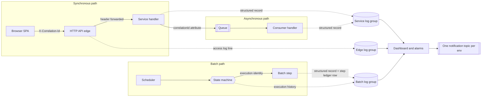

# Observability

---

> **Purpose.** This document specifies the observability contract for the migrated
> CardDemo stack — its log destinations and log record shape, its metric tags and
> metric families, its traces, its alarms and its single notification topic — and it
> derives every one of those from what the COBOL baseline already does. It
> discharges the observability portion of **Deliverable 2** of the seven numbered
> deliverables: *"/docs/architecture — target architecture diagram, service
> catalog, and data-mapping (VSAM/Db2/IMS → AWS) tables"*, and it carries the
> cross-cutting requirement for *"centralized logging, metrics, tracing"*.
>
> **The framing matters more than the inventory, so it is stated first.** This is
> not a document about observability being *added* to a system that had none. The
> baseline already declares a log destination class and a log verbosity on every
> one of its 38 job cards, already routes step and utility output through named
> output definitions, already carries a **122-byte structured error record with
> eleven typed fields, a level, a subsystem classifier and a dedicated 20-byte
> correlation key**, already centralises the emission of that record in a single
> paragraph invoked from fourteen sites in one program, and already expresses
> machine-readable health as a graded numeric code rather than as a boolean. What
> changes is not the content and not the concepts. What changes is
> **addressability** — see
> [The property being replaced is addressability, not content](#the-property-being-replaced-is-addressability-not-content).
>
> **Source of truth.** Six bodies of reference material, all read and none
> modified:
>
> * the **authorization extension's error-log copybook** —
>   [`CCPAUERY.cpy`](../../app/app-authorization-ims-db2-mq/cpy/CCPAUERY.cpy) (40
>   lines; `01 ERROR-LOG-RECORD.` at L19 and its eleven fields at L20–L40), which
>   is the baseline's own structured-logging schema and is the single most
>   load-bearing citation in this document;
> * the **authorization consumer** —
>   [`COPAUA0C.cbl`](../../app/app-authorization-ims-db2-mq/cbl/COPAUA0C.cbl) (1026
>   lines), which contains the centralised emission paragraph `9500-LOG-ERROR` at
>   L983–L1011, its fourteen call sites, the per-site level and subsystem
>   assignments, and the correlation-identifier discipline at L411–L414 and L745;
> * the **message-width copybooks** —
>   [`CSMSG01Y.cpy`](../../app/cpy/CSMSG01Y.cpy) (24 lines; two `PIC X(50)`
>   constants at L18–L21), [`CSMSG02Y.cpy`](../../app/cpy/CSMSG02Y.cpy) (**35
>   lines**; the abend structure at L21–L29) and
>   [`CVCRD01Y.cpy`](../../app/cpy/CVCRD01Y.cpy) (46 lines; the two `PIC X(75)`
>   message fields and their `LOW-VALUES` sentinel at L28–L30);
> * the **batch job output declarations** — the `SYSOUT` and `SYSPRINT` data
>   definitions across the 38 files of [`app/jcl`](../../app/jcl), cited
>   individually in [Where step output lands today](#where-step-output-lands-today),
>   together with the shared procedure
>   [`REPROC.prc`](../../app/proc/REPROC.prc), whose own output definition is at
>   L22;
> * the **fraud table definition** —
>   [`AUTHFRDS.ddl`](../../app/app-authorization-ims-db2-mq/ddl/AUTHFRDS.ddl) (28
>   lines), cited for exactly one reason: its L3 `AUTH_TS TIMESTAMP NOT NULL`
>   contradicts the six-character date convention the same extension logs with,
>   which is a hazard rather than a curiosity;
> * the **existing suite's numeric health rubric** —
>   [`tests/README.md`](../../tests/README.md) §8 (heading L412, table L417–L423)
>   and [`.github/workflows/tests.yml`](../../.github/workflows/tests.yml) L28–L38,
>   which restate the same rubric independently of one another.
>
> **Delivers, and who consumes it.** It delivers eight things: the mapping from the
> baseline's job-log and console model to log groups; the target log record derived
> field by field from `ERROR-LOG-RECORD`, with every re-based value domain
> disclosed rather than presented as a port; the resolution of the three
> message-width regimes on the log side; the correlation-identity contract that
> joins an HTTP request, a queue message and a batch step under one value; the
> three Micrometer common tags; the metric families with, for each one, the
> question it answers and the action it enables; the alarm set with the same
> question-and-action treatment plus the single-topic decision; and the carry-over
> of the graded return-code rubric into batch signalling. Its consumers are the
> shared kernel `common-lib`, which owns the correlation filter and the metric
> tags; the eight bounded contexts named in
> [`service-catalog.md`](service-catalog.md#the-eight-bounded-contexts), each of
> which is to emit into its own log group; the `observability`,
> `step-functions-batch`, `ecs-service` and `api-gateway-http` infrastructure
> modules, which collectively own the target groups, dashboard, alarms and topic; and
> `docs/runbooks/batch-operations.md`, which is where an operator acts on what this
> document specifies.
>
> **Caveats.** Five, stated up front rather than buried, because in an
> observability document the temptation to write as though the telemetry were
> already flowing is unusually strong. First: **every figure here is either quoted
> from a cited baseline line or read from an authored configuration default**, and
> none is a measurement of the target system. Second: **the repository defines no
> service-level objectives and none are invented here** — there is no latency
> target, throughput target, availability percentage, error budget or recovery-time
> objective anywhere in this document, and
> [Honest boundaries: structural properties, not service-level objectives](#honest-boundaries-structural-properties-not-service-level-objectives)
> explains what is committed to instead. Third: the baseline is reference-only —
> every line citation is a read, and nothing under [`app/`](../../app) is modified,
> including the three known baseline defects, which must be registered in the
> contracted `docs/architecture/cobol-to-service-traceability.md`; the baseline keeps
> the behaviour it has, the target implements its own, and neither this document nor
> the work it specifies alters `app/**`. Fourth: **the mainframe job-log path is
> preserved intact** — the job cards, the output definitions and the transient-data
> destination all continue to work exactly as they do; the migration adds a path, it
> does not remove one. Fifth: the existing COBOL suite keeps its own workflow, its
> own reporting and its own aggregate return code, and it remains the
> functional-parity oracle. Sixth: **request metadata is classified rather than
> declared anonymous.** Resolved paths are excluded at both edges. The gateway retains
> only the route template, because a resolved gateway path carries account and customer
> identifiers. No published path carries a PAN any longer -- the card contract addresses
> a card by an opaque per-row selector and takes its one card-number criterion in a
> request body -- and the CloudFront delivery nevertheless omits `cs-uri-stem` along with
> the query string, cookies and the referrer, as defence in depth: the route contract and
> that field list live in different trees and have already moved independently of each
> other, and a field that cannot be redacted after delivery is worth keeping out on the
> strength of that history rather than on the current route shape. Legacy CloudFront
> viewer logging and nginx document-request access logging stay disabled. Both edges
> deliberately retain a client address -- `sourceIp` on the gateway record and `c-ip` on
> the CloudFront record -- which is personal data and therefore makes **both** those
> destinations sensitive even though no resolved identifier is stored in either.

---

## Four facts a careful reader would otherwise get wrong

Each of these is counter-intuitive enough that a reasonable reader will assume the
opposite, and each one changes an implementation decision. Each is proven at its
own section below.

1. **The baseline's structured error record has four declared log levels and its
   one emitting program uses only two of them.**
   [`CCPAUERY.cpy`](../../app/app-authorization-ims-db2-mq/cpy/CCPAUERY.cpy) L25
   declares `ERR-LEVEL` with condition names for log, informational, warning and
   critical at L26–L29. Across all fourteen emission sites in
   [`COPAUA0C.cbl`](../../app/app-authorization-ims-db2-mq/cbl/COPAUA0C.cbl), only
   `ERR-WARNING` and `ERR-CRITICAL` are ever set. A reader who maps the declared
   domain one-for-one onto a target level set inherits two values that carry no
   observed meaning and misses that the target has to *add* a diagnostic level and
   *split* the fatal one. See
   [The level domain is re-based, not carried](#the-level-domain-is-re-based-not-carried).
2. **`ERR-LEVEL` is control flow, not a label.**
   [`COPAUA0C.cbl`](../../app/app-authorization-ims-db2-mq/cbl/COPAUA0C.cbl)
   L1008–L1010 reads `IF ERR-CRITICAL PERFORM 9990-END-ROUTINE` — writing a
   critical record *terminates the program*. Treating the level as presentation
   metadata loses a behaviour, which is why the target's fatal tier is defined by
   what it does rather than by how it renders.
3. **The 75-character message width is not the width anything renders at.** It is
   a shared work-area content limit at
   [`CVCRD01Y.cpy`](../../app/cpy/CVCRD01Y.cpy) L28–L30, and its sentinel is
   `LOW-VALUES` rather than spaces. The widths a screen region actually declares
   are 78 and 80, measured and owned by
   [`design-token-reference.md`](design-token-reference.md#93-the-message-width-regimes).
   This document collapses the **log-side** widths only, and says so explicitly.
4. **A warn-level aggregate return code is the green state of the existing test
   suite, not a regression.** [`tests/README.md`](../../tests/README.md) §8 grades
   4 as warn, and
   [`.github/workflows/tests.yml`](../../.github/workflows/tests.yml) L31–L32 lets
   a run at or below 4 succeed. The cause is named at L34–L35 of that workflow and
   is a property of the immutable baseline. An alarm threshold expressed as
   "non-zero is bad" would disagree with CI about what healthy means. See
   [The graded return code, and why warn is green](#the-graded-return-code-and-why-warn-is-green).

---

## Design decisions

This section carries the reasoning for the choices this document makes *about
itself*. Every observability decision it records is justified at the point where
the decision is stated, under the same four category names, following
[`../CODE_DOCUMENTATION_STANDARD.md`](../CODE_DOCUMENTATION_STANDARD.md) and the
convention already established for the test suite at
[`tests/README.md`](../../tests/README.md) §12 (L544–L549), which requires the same
four justification categories and calls the requirement a hard review gate.

- Assumptions: every metric, log field and alarm below is written as a
  **question it answers and an action it enables**, and any bullet that could not
  be given both was deleted rather than softened. The reason is specific to this
  subject matter. An observability document is where the phrase "for
  performance" or "for visibility" most naturally lands, and both are exactly the
  form the governing rule's fourth forbidden pattern names — a rationale that
  identifies no consequence and therefore justifies nothing. A reader cannot act
  on "we emit request metrics for visibility"; they can act on "this answers
  whether one route is failing, and the action is a roll-back". The shared
  kernel's own `MetricsConfig` already documents its three tags in exactly that
  form, so this is the established convention here rather than one invented for
  this file.
- Refactoring Rationale: this document leads with what the baseline already
  expresses and only then describes the target, which is the reverse of the usual
  ordering for a migration document. The opposite ordering produces a specific,
  checkable error: it presents the correlation identifier, the structured record, the
  level classifier and the subsystem classifier as target inventions, when all four
  are declared in
  [`CCPAUERY.cpy`](../../app/app-authorization-ims-db2-mq/cpy/CCPAUERY.cpy) and
  three of them are populated on every emission path in
  [`COPAUA0C.cbl`](../../app/app-authorization-ims-db2-mq/cbl/COPAUA0C.cbl). A
  reader told that correlation is new has no reason to preserve the baseline's
  semantics for it, and would reasonably choose a different width, a different
  custody model and a different echo rule.
- Trade-offs: where a measured figure in this document differs from a figure a
  reader may have seen in a plan or a summary, **the measured figure is recorded
  and the narrative one is not restated as an alternative**. Two cases arise and
  both are consequential. `9500-LOG-ERROR` is invoked from **fourteen** sites, not
  ten, and the four omitted from the shorter count are the reply, the two
  database-write paths and the shutdown path — precisely the sites whose failures an
  operator most needs to see; a target error handler built from the shorter count
  would instrument the read paths and leave the write and shutdown paths silent. And
  the unstructured response-and-reason emission sites number **24 across nine
  programs**, not five across two: five is the count for two of the nine, so a
  reader who took it for the population would conclude that two programs never
  adopted the structured record when in fact nine did not. The accepted cost is that
  this document and a narrative summary read differently. Each such figure carries
  the command that re-derives it in
  [Reproducing the measurements](#reproducing-the-measurements).
- Alternatives Considered: the alternative to writing this document was to let
  each of the eight bounded contexts decide its own log shape, its own tag set and
  its own correlation header. It was rejected because the whole value of the
  telemetry is cross-service: a correlation identifier is worthless unless every
  service reads and writes the same header name, a metric cannot be grouped unless
  every service labels it with the same three keys, and a dashboard row per service
  requires the service names to agree with the ones the catalog fixes. Eight
  independent decisions produce eight series that cannot be joined, and nothing
  about that looks wrong until the first incident asks a question that spans two
  services.
- Assumptions: no threshold quoted in this document is a target. The alarm
  inputs in `infra/modules/observability/variables.tf` are **detection defaults** —
  the point at which a human is told — and the difference from a service-level
  objective is not pedantic. A detection default can be tuned in either direction
  without any promise being broken, whereas an objective is a commitment that
  something must be measured against. This repository contains the former and not
  the latter, and this document quotes only the former.

---

## The property being replaced is addressability, not content

The baseline's observability model is complete and functioning for its platform.
It is *file-shaped* rather than *stream-shaped*, and it declares three separate
things per job, each of which has a direct target counterpart.

| Baseline declaration | Where | Measured population | What it declares | Target counterpart |
|---|---|---|---|---|
| `MSGCLASS=` on the job card | every job card in [`app/jcl`](../../app/jcl) | **38 of 38** files — 29 use `MSGCLASS=0`, 8 use `MSGCLASS=H`, 1 uses `MSGCLASS=X` | Which output class the job's own log is routed to | The log group a producer writes to |
| `MSGLEVEL=(1,1)` on the job card | 5 job cards, including [`CREASTMT.JCL`](../../app/jcl/CREASTMT.JCL) L1 and [`FTPJCL.JCL`](../../app/jcl/FTPJCL.JCL) L1 | **5 of 38** files | How much of the job's own execution detail is recorded | The log level, and the state machine's `log_level` input |
| `NOTIFY=` on the job card | every job card in [`app/jcl`](../../app/jcl) | **38 of 38** files | Who is told when the job ends | One notification topic per environment |
| `SYSOUT` / `SYSPRINT` output definitions per step | 35 of the 38 files | **80** `SYSPRINT` and **18** `SYSOUT` definitions, **98** in total | Where a step's own output and its utilities' messages land | The container log driver's stream |

> **Measured — the only three files in `app/jcl` that declare neither output
> definition are the three whose mechanism has no target counterpart.** They are
> [`CLOSEFIL.jcl`](../../app/jcl/CLOSEFIL.jcl),
> [`OPENFIL.jcl`](../../app/jcl/OPENFIL.jcl) and
> [`FTPJCL.JCL`](../../app/jcl/FTPJCL.JCL). The first two run the operator
> facility directly — `EXEC PGM=SDSF` at L22 of each — and the third is the
> submission tunnel. Every job that runs a program or a utility declares somewhere
> for its output to go; the three that drive an operator facility or a transfer do
> not. The coincidence is worth recording because it means the output-definition
> population and the set of jobs whose *behaviour* is migrated line up exactly,
> with no job losing an output channel in translation.

### Where step output lands today

These are the specific declarations the target log-stream contract replaces. They are
cited so that a reader can confirm that each migrated step had an output channel
before it had a log group.

| File | Output definitions | Note |
|---|---|---|
| [`POSTTRAN.jcl`](../../app/jcl/POSTTRAN.jcl) | `SYSPRINT` L26, `SYSOUT` L27 | The posting step; its **reject stream is a separate definition** at L34–L38, not part of the log |
| [`INTCALC.jcl`](../../app/jcl/INTCALC.jcl) | `SYSPRINT` L25, `SYSOUT` L26 | The interest step; its business date is injected at L22 rather than read from a clock |
| [`TRANBKP.jcl`](../../app/jcl/TRANBKP.jcl) | `SYSPRINT` L38, `SYSPRINT` L52 | Two utility steps, each with its own definition; L42 and L45 normalise a tolerated code, L51 gates on it |
| [`COMBTRAN.jcl`](../../app/jcl/COMBTRAN.jcl) | `SYSOUT` L32, `SYSPRINT` L42 | The sort step's message channel at L32 sits beside its **data** output at L33–L37 |
| [`TRANREPT.jcl`](../../app/jcl/TRANREPT.jcl) | `SYSOUT` L50, `SYSOUT` L62, `SYSPRINT` L63 | Three definitions across two steps; the 133-column report is a **separate** definition at L76–L80 |
| [`CREASTMT.JCL`](../../app/jcl/CREASTMT.JCL) | `SYSPRINT` L23, L46, L57, L81; `SYSOUT` L47, L82 | Six definitions — the most of any single job in the tree |
| [`PRTCATBL.jcl`](../../app/jcl/PRTCATBL.jcl) | `SYSOUT` L58 | One definition, beside its data output at L59–L63 |
| [`DEFGDGD.jcl`](../../app/jcl/DEFGDGD.jcl) | `SYSPRINT` L25, L37, L48, L60, L71, L83 | Six definitions, one per generation-define step |
| [`REPROC.prc`](../../app/proc/REPROC.prc) | `SYSPRINT` L22 | The **shared procedure** declares its own, under `EXEC PGM=IDCAMS` at L21 |

- Refactoring Rationale: what the target replaces is the **addressability** of
  this output, not its content and not the concepts behind it. A spooled job log is
  retrieved *per job, by an operator, after the fact*. The three properties that
  are missing are specific and each one is a question an operator has to be able to
  ask: the same output cannot be queried across services, because there is one
  spool entry per job and a request that touches four services leaves no single
  place to look; it cannot be correlated across one unit of work, because nothing
  in a `SYSOUT` line ties it to the request or the nightly execution that produced
  it; and it cannot be filtered by field, because a line of prose has no fields.
  The target is to keep the same content — the same step messages, status codes and
  reject counts — while changing how it is addressed: one group per producer, one
  structured record per event, one correlation identifier spanning the whole unit
  of work. Writing that the target logging is "more modern" would
  document none of those three, and would give a reader no way to check whether the
  replacement actually delivers them.
- Assumptions: **the numeric health signal and the human-readable log are two
  distinct channels in the baseline, and the target contract keeps them distinct.** The step
  return code is what the next step's gate reads; the job log is what a person
  reads. The gating semantics themselves belong to
  [`batch-orchestration.md`](batch-orchestration.md#the-condition-code-inversion),
  which covers the inversion in full and is not restated here. The observability
  consequence is the part this document owns: a target step is to publish a numeric
  outcome that drives the state machine's edges *and* write a structured record
  that a person reads. Neither path is implemented yet, and the two must not be
  collapsed into one. Collapsing them —
  emitting only a log line and having the orchestrator parse it — is the failure
  mode this assumption exists to forbid, because a log format change would then
  silently become a control-flow change.
- Trade-offs: the reject stream stays **data**, not telemetry.
  [`POSTTRAN.jcl`](../../app/jcl/POSTTRAN.jcl) L34–L38 declares the rejects as
  their own fixed-length output with its own generation, entirely separate from the
  two log definitions at L26–L27, and the target contract preserves that separation:
  reject records are to land in the ledger schema and an object-store generation,
  while only their *count* becomes a metric. The alternative — routing reject
  records into the log stream because they describe failures — was rejected because
  it would put business data under a log-group retention policy, where it would age
  off on a telemetry schedule rather than a records-retention one, and would make
  the reject stream unqueryable as the table it actually is.

---

## The baseline's own structured-logging schema

[`CCPAUERY.cpy`](../../app/app-authorization-ims-db2-mq/cpy/CCPAUERY.cpy) is 40
lines and declares `01 ERROR-LOG-RECORD.` at **L19**. It is the **only** payload
copybook in the authorization extension that supplies its own group item; the
request and reply copybooks begin at level `05` with no `01`, a difference recorded
at
[`messaging-contracts.md`](messaging-contracts.md#the-copybooks-carry-no-01-level-with-one-exception).
That difference is the tell: this is not a message payload that happens to describe
an error, it is a **record type** with a declared identity.

| Line | Field | Picture | Bytes | Target mapping |
|---|---|---|---|---|
| L20 | `ERR-DATE` | `X(06)` | 6 | Event timestamp — but see [The two-digit-year hazard](#the-two-digit-year-hazard) |
| L21 | `ERR-TIME` | `X(06)` | 6 | Event timestamp |
| L22 | `ERR-APPLICATION` | `X(08)` | 8 | The `service` common tag, and the `service` log field |
| L23 | `ERR-PROGRAM` | `X(08)` | 8 | Logger name. Eight characters is exactly the program-name width the CICS resource definitions use, and the same width the abend record's `ABEND-CULPRIT` declares |
| L24 | `ERR-LOCATION` | `X(04)` | 4 | The failure site — a class-and-method pair in the target |
| L25 | `ERR-LEVEL` | `X(01)` | 1 | Log level, with **four** condition values |
| L26–L29 | `ERR-LEVEL` values | `'L'` log, `'I'` informational, `'W'` warning, `'C'` critical | — | Re-based; see [The level domain is re-based, not carried](#the-level-domain-is-re-based-not-carried) |
| L30 | `ERR-SUBSYSTEM` | `X(01)` | 1 | Structured subsystem tag, with **six** condition values |
| L31–L36 | `ERR-SUBSYSTEM` values | `'A'` application, `'C'` CICS, `'I'` IMS, `'D'` Db2, `'M'` MQ, `'F'` file | — | Dimension retained, domain re-based; see [The subsystem dimension is kept and its domain is re-based](#the-subsystem-dimension-is-kept-and-its-domain-is-re-based) |
| L37 | `ERR-CODE-1` | `X(09)` | 9 | Primary status code |
| L38 | `ERR-CODE-2` | `X(09)` | 9 | Secondary status code |
| L39 | `ERR-MESSAGE` | `X(50)` | 50 | Message text — one of the three widths collapsed on the log side |
| L40 | `ERR-EVENT-KEY` | `X(20)` | 20 | **The baseline's own correlation identifier** |

> **Measured — eleven fields totalling 122 bytes.** The widths sum as
> `6 + 6 + 8 + 8 + 4 + 1 + 1 + 9 + 9 + 50 + 20 = 122`.
> There is no `FILLER` in this record and no group item other
> than the `01` itself, so the field-width sum is also the record length — which is
> what makes the `LENGTH OF ERROR-LOG-RECORD` operand at
> [`COPAUA0C.cbl`](../../app/app-authorization-ims-db2-mq/cbl/COPAUA0C.cbl) L1004
> equal to 122 rather than to something larger. The command that re-derives this is
> in [Reproducing the measurements](#reproducing-the-measurements).

The target contract defines a JSON object with a field per row of that table, plus
the correlation identifier and the three common tags. Four of the mappings are
**decisions rather than identities**, and each is disclosed below rather than
presented as a port.

### The level domain is re-based, not carried

The baseline declares four levels and its one emitting program sets two of them.

| `ERR-LEVEL` | Declared at | Times set in `COPAUA0C.cbl` | Target level | Status of the mapping |
|---|---|---|---|---|
| `'L'` log | L26 | **0** | *(no counterpart)* | Declared, never observed |
| `'I'` informational | L27 | **0** | `INFO` | Declared, never observed; the target name is the obvious one |
| `'W'` warning | L28 | **4** — at L495, L542, L590, L967 | `WARN` | Direct |
| `'C'` critical | L29 | **10** — the remaining ten sites | `ERROR` **or** `FATAL` | **Split.** See below |
| *(none)* | — | — | `DEBUG` | **Added.** No baseline counterpart |

Two changes to the domain, and both need to be legible to someone reading an
archived record:

- Refactoring Rationale: **`DEBUG` is added, and the reason is a specific
  capability the baseline does not have.** The baseline's lowest level is
  informational, and its emission is unconditional — the record is written whenever
  the paragraph is performed. There is no mechanism to raise or lower verbosity for
  a running program, so a level below informational would have no way to be
  suppressed and would simply add volume. The target logging framework is to filter
  by level at runtime, and the authored service configuration already pins specific
  loggers so they *cannot* be lowered — `org.springframework.security` and
  `org.hibernate.orm.jdbc.bind` are both held at `WARN` in
  [`application.yml`](../../services/auth-service/src/main/resources/application.yml)
  for the reason given in
  [Sensitive-data logging contract and current controls](#sensitive-data-logging-contract-and-current-controls).
  A `DEBUG`
  level is therefore useful in the target in a way it could not have been in the
  baseline, and its addition is what makes those pins meaningful controls rather
  than comments.
- Refactoring Rationale: **`'C'` splits into `ERROR` and `FATAL`, and a reader
  mapping an archived `'C'` record needs to know which.** The split exists because
  the baseline's `'C'` carries two distinct meanings at its ten sites, and the
  distinction is visible in the code rather than inferred. Writing a `'C'` record
  ends the program:
  [`COPAUA0C.cbl`](../../app/app-authorization-ims-db2-mq/cbl/COPAUA0C.cbl)
  L1008–L1010 is `IF ERR-CRITICAL PERFORM 9990-END-ROUTINE`. So a `'C'` at the
  queue-open site (L273–L282) or the segment-schedule site (L311–L316) means *this
  process cannot continue* — that is `FATAL`. A `'C'` at the cross-reference,
  account or customer read sites (L502–L512, L550–L560, L598–L608) means *this
  message cannot be processed* — and in a target consumer that is `ERROR` on one
  message, with the consumer itself still running to take the next one. Mapping both
  onto a single level would either declare a per-message failure fatal, which would
  stop a service for one bad message, or declare a start-up failure recoverable,
  which would leave a task retrying a condition that cannot clear. **An archived
  `'C'` therefore maps to `FATAL` where the failure is in acquiring or releasing a
  resource and to `ERROR` where it is in handling one message.**

### The subsystem dimension is kept and its domain is re-based

`ERR-SUBSYSTEM` at L30 classifies a failure by the component that produced it.
Three of its six declared values name platforms the target does not run.

| `ERR-SUBSYSTEM` | Declared at | Times set in `COPAUA0C.cbl` | Target value |
|---|---|---|---|
| `'A'` application | L31 | **3** — L496, L543, L591 | `application` |
| `'C'` CICS | L32 | **4** — L421, L504, L552, L600 | `web` — the platform is retired, the layer is not |
| `'I'` IMS | L33 | **4** — L313, L635, L842, L927 | `persistence` — the platform is retired, the layer is not |
| `'D'` Db2 | L34 | **0** | `persistence` |
| `'M'` MQ | L35 | **3** — L275, L770, L968 | `messaging` — the platform is retired, the layer is not |
| `'F'` file | L36 | **0** | `persistence` |
| *(none)* | — | — | `batch` — added, because the target has a step-orchestrated tier the online consumer had no value for |

- Refactoring Rationale: **the dimension is worth keeping and the values are not,
  and the two halves of that statement have different reasons.** The dimension
  survives because it partitions a failure by the layer that produced it, which is
  the first filter an operator applies: a persistence failure, a transport failure
  and a business-rule failure have three different first responders, and a log field
  that separates them turns one query into a triage step. The values do not survive
  because three of the six name a transaction monitor, a hierarchical database
  manager and a message broker, none of which the target runs — a tag reading
  `CICS` on a container service would be false, and a reader filtering on it would
  get nothing. The re-based domain is `application`, `web`, `persistence`,
  `messaging` and `batch`: five layers, mapped from the baseline's four observed
  values plus one for the tier the target adds.
- Refactoring Rationale: **the target contract derives the subsystem value from
  the adapter that failed rather than setting it by hand, and there is one place in
  the baseline where the hand-set value disagrees with the failing component.** At
  [`COPAUA0C.cbl`](../../app/app-authorization-ims-db2-mq/cbl/COPAUA0C.cbl) L419 the
  location code is `'M003'` — the `M` prefix belongs to the same
  subsystem-letter-plus-ordinal scheme as `M001`, `M004` and `M005`, all three of
  which set the messaging value — while L421 immediately below it sets `ERR-CICS`.
  The paragraph is `3100-READ-REQUEST-MQ` and the failure it reports is a failed
  message get. Two independently hand-set fields describing one failure can
  disagree, and here two do. The future structured logger is therefore to obtain the
  layer tag from the adapter that raised the exception, so the value cannot
  contradict the component that produced it; the accepted cost is that the tag is
  no longer freely choosable at the throw site, which is the point.

### The two code slots are re-based, not dropped

`ERR-CODE-1` (L37) and `ERR-CODE-2` (L38) are nine characters each, and the width
is not arbitrary. `COPAUA0C.cbl` L61 declares `WS-CODE-DISPLAY PIC 9(9)` and every
platform code is moved through that field on its way into the record — the
completion and reason pair at L276–L279, L422–L425 and L771–L774, and the response
and reason pair at L505–L508, L553–L556 and L601–L604. Where a code arrives already
formatted it is moved directly, as the segment-manager status is at L314, L636, L843
and L928.

- Assumptions: **two slots are kept because one failure genuinely produces two
  codes, and the pairing is the diagnostic unit.** The baseline's pattern is
  consistent across all fourteen sites: a completion or response code says *that*
  the operation failed, and a reason code says *why*. The target contract keeps
  both: a persistence error code and the framework exception class that wrapped it
  are two different facts, and collapsing them into one string forces whoever reads the
  record to parse the two back out of prose. The pairing is the baseline's own
  convention rather than an artefact of one program, and the measurement below
  establishes that.
- Trade-offs: the target's two slots are **strings of no fixed width**, and the
  nine-character declaration is not preserved. The width existed because the record
  was a fixed-layout structure written to a fixed-length destination; a JSON field
  has no such constraint, and enforcing nine characters would truncate a Java
  exception class name to the point of uselessness. What *is* preserved is the
  arity: exactly two code fields, so a reader of an archived record and a reader of
  a target record are looking for the same two facts in the same two places.

> **Measured — 24 *unstructured* emission sites across 9 programs under
> [`app/cbl`](../../app/cbl) emit the identical pair.** Every one of them is the
> statement `DISPLAY 'RESP:' WS-RESP-CD 'REAS:' WS-REAS-CD`, and they are
> distributed as [`COBIL00C.cbl`](../../app/cbl/COBIL00C.cbl) 6 (L366, L397, L430,
> L461, L490, L541), [`COTRN02C.cbl`](../../app/cbl/COTRN02C.cbl) 5 (L598, L631,
> L662, L691, L743), [`COTRN00C.cbl`](../../app/cbl/COTRN00C.cbl) 3 (L613, L647,
> L681), [`COUSR00C.cbl`](../../app/cbl/COUSR00C.cbl) 3 (L608, L642, L676),
> [`COUSR02C.cbl`](../../app/cbl/COUSR02C.cbl) 2 (L347, L384),
> [`COUSR03C.cbl`](../../app/cbl/COUSR03C.cbl) 2 (L294, L330), and one each in
> [`COTRN01C.cbl`](../../app/cbl/COTRN01C.cbl) (L290),
> [`COUSR01C.cbl`](../../app/cbl/COUSR01C.cbl) (L268) and
> [`CORPT00C.cbl`](../../app/cbl/CORPT00C.cbl) (L529). The two facts are the same
> two the structured record's slots carry; what differs is that here they have to be
> pattern-matched out from behind a literal prefix rather than read from a named
> field. The command that re-derives 24 and 9 is in
> [Reproducing the measurements](#reproducing-the-measurements).

### The correlation key already exists

`ERR-EVENT-KEY` at **L40** is a dedicated 20-byte field whose only job is to tie
related records together. Its presence is the single most consequential finding in
this document.

- Refactoring Rationale: **the target formalises an existing concept rather than
  inventing one, and what was wrong with the old arrangement is custody rather than
  the concept.** The field is application-managed: it is populated where a
  programmer wrote a `MOVE` into it, and at **eleven of the fourteen** emission
  sites one was written — L428, L499, L511, L546, L559, L594, L607, L638, L777, L845
  and L930. At the other three there is none. Those three are the queue-open path
  (L282), the segment-schedule path (L316) and the queue-close path (L975), and they
  are not an oversight so much as a structural consequence: they run outside the
  scope of any one message, so there is no message identity available to write. The
  effect is that the record carries whatever the field last held, because the
  copybook is included into working storage and nothing clears it between messages.
  The authored filter is designed to move custody from the application to request
  scope by placing the identifier in the logging context. Until each service
  registers it, that custody change is not in effect. Once registered, every record
  emitted while handling a unit of work is to carry the identifier without the
  emitting code naming it, and records outside one are to carry none rather than a
  stale value. The gap being addressed is measurable rather than hypothetical —
  beyond the three sites
  above, the **24** unstructured sites measured in the previous section carry no
  correlation identity at all, and neither does any of the several hundred other
  free-text emission statements in the tree.
- Assumptions: the target's width is **24 characters, not 20**, and the source of
  that number is a different line of the baseline.
  [`COPAUA0C.cbl`](../../app/app-authorization-ims-db2-mq/cbl/COPAUA0C.cbl) L45
  declares `WS-SAVE-CORRELID PIC X(24)`, the save area the inbound transport
  correlation identifier is held in, and the shared kernel's
  [`CorrelationIdFilter`](../../services/common-lib/src/main/java/com/carddemo/common/web/CorrelationIdFilter.java)
  takes its `CORRELATION_ID_MAX_LENGTH` from it. The 20 of `ERR-EVENT-KEY` and the
  24 of `WS-SAVE-CORRELID` are two different fields with two different jobs: the
  first is a log-record grouping key that the program fills from a business value —
  a card number at L428 and L777, a cross-reference card number at L499 and L511, an
  account identifier at L546 and L559, a customer identifier at L594 and L607 — and
  the second is the transport identifier the requester chose. **The target contract
  uses the transport identifier for both**, which is why 24 is the governing width.
  The business values that the baseline put in the grouping key remain available as
  their own log fields, where they can be queried by name instead of by position.

---

## The three message-width regimes, and what collapses

A message in the baseline does not have *a* width. Three different fixed-layout
carriers declare three different sizes for the text they carry. The target contract
collapses two on the log side while preserving the third on the presentation side.

| Width | Fields | Authoritative citation | Carrier | Disposition |
|---|---|---|---|---|
| **50** | `CCDA-MSG-THANK-YOU`, `CCDA-MSG-INVALID-KEY` | [`app/cpy/CSMSG01Y.cpy`](../../app/cpy/CSMSG01Y.cpy) **L18–L21** | Program-local constants moved into a message buffer | **Collapsed** on the log side |
| **50** | `ERR-MESSAGE` | [`CCPAUERY.cpy`](../../app/app-authorization-ims-db2-mq/cpy/CCPAUERY.cpy) **L39** | A field of the 122-byte structured record | **Collapsed** on the log side |
| **50** | `ABEND-REASON` | [`app/cpy/CSMSG02Y.cpy`](../../app/cpy/CSMSG02Y.cpy) **L26–L27** | A field of the abend structure | **Collapsed** on the log side |
| **72** | `ABEND-MSG` | [`app/cpy/CSMSG02Y.cpy`](../../app/cpy/CSMSG02Y.cpy) **L28–L29** | A field of the abend structure | **Collapsed** on the log side |
| **75** | `CCARD-ERROR-MSG`, `CCARD-RETURN-MSG` | [`app/cpy/CVCRD01Y.cpy`](../../app/cpy/CVCRD01Y.cpy) **L28–L30** | The shared work area a message crosses a screen turn in | **Preserved** as a presentation contract, owned elsewhere |

**Two citation corrections apply, and each is stated with the test that settles
it.** Both are external data-contract facts that downstream code depends on, so
they are given here rather than left to be inherited from a summary.

- Assumptions: **the 75-character contract lives in
  [`app/cpy/CVCRD01Y.cpy`](../../app/cpy/CVCRD01Y.cpy) L28–L30, not in
  `CSMSG01Y.cpy`, and its sentinel is `LOW-VALUES` rather than spaces.**
  `CCARD-ERROR-MSG` is at L28 and `CCARD-RETURN-MSG` at L29, both `PIC X(75)`, and
  L30 declares `88 CCARD-RETURN-MSG-OFF VALUE LOW-VALUES`. The one-line test that
  disproves the alternative is that `CSMSG01Y.cpy` declares **no `PIC X(75)` field
  at all** — it is 24 lines long and declares exactly two `PIC X(50)` constants. The
  sentinel matters for the same reason the width does: a field of low values is not
  a field of spaces, so a target that tested for an empty or whitespace-only string
  would treat an explicitly cleared message differently from the baseline, and the
  same copybook's abend fields initialise to `VALUE SPACES`, so one "is it blank"
  helper cannot serve both conventions.
- Assumptions: **the structured abend fields are at
  [`app/cpy/CSMSG02Y.cpy`](../../app/cpy/CSMSG02Y.cpy) L21–L29, not at L45–L53, and
  the decisive test is that the file is only 35 lines long** — any citation placing
  the block beyond line 35 names lines that do not exist. The range L21–L29 spans
  the whole structure from its `01 ABEND-DATA.` at L21 to the last `VALUE` clause at
  L29: `ABEND-CODE` is `X(4)` at L22–L23, `ABEND-CULPRIT` is `X(8)` at L24–L25,
  `ABEND-REASON` is `X(50)` at L26–L27 and `ABEND-MSG` is `X(72)` at L28–L29. The
  eight-character culprit is the same program-name width as `ERR-PROGRAM`, which is
  what lets both records be read as naming the same thing in the same field.

- Trade-offs: **the target log-record contract carries one unbounded message
  string, and the collapse applies to the log record only.** Three fixed widths existed because
  three different fixed-layout carriers had three different field sizes — a
  program-local constant buffer, a 122-byte transient-data record and an abend work
  area — and **none of those three carriers is to survive** into the target: a JSON
  log field has no declared width and no padding. Preserving 50 and 72 as validated
  string lengths was the alternative and was rejected because it buys nothing and
  costs something specific: the message would be truncated at a boundary that no
  longer corresponds to any storage or display constraint, and a truncated exception
  message is the one part of a failure record a reader most needs whole. What is
  preserved is that the message is **one** field rather than being spread over
  several, which is the property that makes it queryable. The 75-character screen
  contract is a different matter entirely and is **not** collapsed: it survives as a
  presentation constraint and is owned by
  [`design-token-reference.md`](design-token-reference.md#93-the-message-width-regimes),
  which also measures the widths the message band actually *renders* at and
  establishes that 75 is a work-area content limit rather than a screen region. That
  distinction is the reason the collapse here is scoped to the log: the log record
  and the message band are two different destinations with two different contracts,
  and only one of them is this document's to change.

---

## The two-digit-year hazard

The authorization extension logs its timestamp as two six-character fields —
`ERR-DATE` at
[`CCPAUERY.cpy`](../../app/app-authorization-ims-db2-mq/cpy/CCPAUERY.cpy) L20 and
`ERR-TIME` at L21 — and the emitting paragraph fills them from a platform format
request that names the two-digit form explicitly.
[`COPAUA0C.cbl`](../../app/app-authorization-ims-db2-mq/cbl/COPAUA0C.cbl) L990–L994
requests `YYMMDD` into `WS-CUR-DATE-X6` and a time into `WS-CUR-TIME-X6`, both
declared `PIC X(06)` at L51 and L52, and L998–L999 move them into the record.

> **The same extension persists a real timestamp.**
> [`AUTHFRDS.ddl`](../../app/app-authorization-ims-db2-mq/ddl/AUTHFRDS.ddl) L3
> declares `AUTH_TS TIMESTAMP NOT NULL`, and L28 makes it half of the table's
> primary key. So the baseline is internally inconsistent on this point by its own
> declarations: the row it *stores* carries a full timestamp, while the record it
> *logs* carries a six-character date that cannot express a century.

- Assumptions: **the target logger is to emit full timestamps with microsecond
  precision, and any path that reads the six-character form must supply the century
  from context rather than from the data.** The assumption this rests on is an external
  data-format contract, not a preference: a `YYMMDD` value is ambiguous by
  construction, and there is no field anywhere in the 122-byte record that resolves
  it. Two consequences follow and both are specific. An ETL or log-ingest path that
  loads archived records has to obtain the century from the dataset it is reading
  rather than from the record — and if it guesses, records sort wrongly against each
  other across a century boundary while looking entirely plausible individually. And
  a target record must not adopt the narrower form for symmetry with the archive,
  because the microsecond-precision form is already the target's timestamp contract
  everywhere else: the shared kernel's
  [`TimestampFormatter`](../../services/common-lib/src/main/java/com/carddemo/common/time/TimestampFormatter.java)
  fixes `TIMESTAMP_LENGTH` at 26 (L210) to match the `PIC X(26)` the transaction
  records declare, and two timestamp conventions in one system would mean every
  comparison had to know which one it was looking at.

---

## `9500-LOG-ERROR`: the baseline already centralises emission

[`COPAUA0C.cbl`](../../app/app-authorization-ims-db2-mq/cbl/COPAUA0C.cbl) contains
one paragraph that formats and writes the structured record, `9500-LOG-ERROR` at
**L983**, and calls it from every path that can fail.

> **Measured — fourteen call sites across twelve paragraphs, not ten.** Every
> `PERFORM 9500-LOG-ERROR` in the program is at **L282, L316, L429, L500, L512,
> L547, L560, L595, L608, L639, L778, L846, L931** and **L975**. A shorter count of
> ten stops at the pending-authorization summary read and omits exactly four sites:
> the reply put at L778, the summary update at L846, the detail insert at L931 and
> the queue close at L975. Those four are the reply path, both database-write paths
> and the shutdown path — the sites whose failures matter most to whoever is on
> call — so the difference between the two counts is not cosmetic. The command that
> re-derives fourteen is in
> [Reproducing the measurements](#reproducing-the-measurements).

| Paragraph | Call site | Location code | Level | Subsystem | What failed |
|---|---|---|---|---|---|
| `1100-OPEN-REQUEST-QUEUE` | L282 | `M001` (L273) | critical (L274) | MQ (L275) | Request queue open |
| `1200-SCHEDULE-PSB` | L316 | `I001` (L311) | critical (L312) | IMS (L313) | Segment schedule |
| `3100-READ-REQUEST-MQ` | L429 | `M003` (L419) | critical (L420) | CICS (L421) | Request message get |
| `5100-READ-XREF-RECORD` | L500 | `A001` (L494) | warning (L495) | application (L496) | Cross-reference not found |
| `5100-READ-XREF-RECORD` | L512 | `C001` (L502) | critical (L503) | CICS (L504) | Cross-reference read failure |
| `5200-READ-ACCT-RECORD` | L547 | `A002` (L541) | warning (L542) | application (L543) | Account not found |
| `5200-READ-ACCT-RECORD` | L560 | `C002` (L550) | critical (L551) | CICS (L552) | Account read failure |
| `5300-READ-CUST-RECORD` | L595 | `A003` (L589) | warning (L590) | application (L591) | Customer not found |
| `5300-READ-CUST-RECORD` | L608 | `C003` (L598) | critical (L599) | CICS (L600) | Customer read failure |
| `5500-READ-AUTH-SUMMRY` | L639 | `I002` (L633) | critical (L634) | IMS (L635) | Summary segment get |
| `7100-SEND-RESPONSE` | L778 | `M004` (L768) | critical (L769) | MQ (L770) | Reply put |
| `8400-UPDATE-SUMMARY` | L846 | `I003` (L840) | critical (L841) | IMS (L842) | Summary segment update |
| `8500-INSERT-AUTH` | L931 | `I004` (L925) | critical (L926) | IMS (L927) | Detail segment insert |
| `9100-CLOSE-REQUEST-QUEUE` | L975 | `M005` (L966) | warning (L967) | MQ (L968) | Request queue close |

What the paragraph itself does, at L983–L1011, is worth reading as a specification
because four of its five actions have a direct target counterpart:

| Line | Statement | Target counterpart |
|---|---|---|
| L986–L988 | Obtain the current absolute time | The logging framework's event timestamp |
| L990–L994 | Format it into the two six-character fields | Superseded — see [The two-digit-year hazard](#the-two-digit-year-hazard) |
| L996–L997 | Stamp the transaction identifier and the program name onto the record | The `service` common tag and the logger name, both applied without the emitting code naming them |
| L1001–L1006 | Write the 122-byte record to the transient-data destination, with the no-condition option | Emit the structured record to the container's log stream, on a path that cannot raise |
| L1008–L1010 | `IF ERR-CRITICAL PERFORM 9990-END-ROUTINE` | The `FATAL` tier: a record at that level accompanies termination rather than merely describing it |

- Refactoring Rationale: **the target is to pair a global exception handler with a
  structured logger, and the baseline already proves the pattern's value by
  invoking it from fourteen sites in one program.** The two designs differ in exactly
  one respect, and it is the one that matters: the baseline
  reaches the emission point by an explicit `PERFORM` written at each site, whereas the target
  is to reach it by exception propagation into a single `@RestControllerAdvice`. What
  was wrong with the old arrangement is therefore not the centralisation — that was
  already right — but the *reachability*: a new error path in the baseline is
  silent until somebody remembers to add the `PERFORM`, and nothing about the
  omission looks wrong, because the surrounding code reads exactly like the paths
  that do log. The target's propagation removes that failure mode by making the
  emission unavoidable rather than remembered. The measurable evidence that the
  failure mode is real is in the same repository: the **24** sites measured in
  [The two code slots are re-based, not dropped](#the-two-code-slots-are-re-based-not-dropped)
  emit the identical response-and-reason pair through an unstructured statement
  instead, spread across **nine** programs that never adopted the record at all.
- Assumptions: **emission must not be able to fail the work it is describing.**
  Both platform calls in the paragraph carry the no-condition option — L986 for the
  time request and L1005 for the write — so a failure to log cannot raise a
  condition and cannot change the program's path. The target must hold the same
  property: the future structured logger is to write to the container's standard
  streams, which the log driver forwards, and a forwarding failure is to remain a
  delivery problem rather than a request failure. This is an assumption rather than
  a preference because the alternative has a name and a consequence: a logger that
  throws turns a handled business rejection into an unhandled server error, so the request the
  operator is trying to diagnose fails *because* it was being diagnosed.

---

## Correlation is carried, not invented

The full treatment of correlation identity is in
[`messaging-contracts.md`](messaging-contracts.md#correlation-identity-is-carried-in-the-descriptor-not-reconstructed),
which tabulates the eight statements that establish it and separates it from the
deduplication key. Only the observability consequence belongs here.

Three facts from that treatment are load-bearing for logging:

* The consumer **saves the inbound correlation identifier** —
  [`COPAUA0C.cbl`](../../app/app-authorization-ims-db2-mq/cbl/COPAUA0C.cbl)
  L411–L412 moves it into the 24-byte save area declared at L45 — and **saves the
  inbound reply destination** separately at L413–L414.
* It **echoes the correlation identifier verbatim** onto the reply at **L745**, and
  mints a fresh message identifier beside it at L746. One field is carried across;
  the adjacent one is originated.
* It **never selects on the identifier**: L395–L396 put the no-identifier constants
  into the descriptor used to read the next request, so the read matches any waiting
  message.

Correlation is therefore carried in **transport metadata**, not reconstructed from
business fields. The authored HTTP analogue is a filter class in the shared kernel
rather than a convention, and it is registered for every service by the kernel's own
auto-configuration — `CardDemoCommonAutoConfiguration.ServletCorrelationConfiguration`
publishes it as a `FilterRegistrationBean` at `CORRELATION_FILTER_ORDER`, so a service
gets the identity handling by depending on the kernel rather than by remembering to
wire a filter.
[`CorrelationIdFilter`](../../services/common-lib/src/main/java/com/carddemo/common/web/CorrelationIdFilter.java)
does five things, each traceable to one of the facts above:

| Behaviour | Where | Baseline lineage |
|---|---|---|
| Accept an inbound identifier when the caller supplied one **that conforms**, and echo it back unchanged | `CORRELATION_ID_HEADER` = `X-Correlation-Id`, L202; read at L485 through `inboundCorrelationId` at L583, adopted at L498, echoed on the response at L891 | L745 — echoed verbatim |
| **Refuse a supplied identifier that does not conform**, with `400 Bad Request` naming the constraint and the observed length, rather than serving the request under an identity the caller never chose | decided at L487, refused by `rejectNonconformingIdentity` at L696 | L411–L412 — the inbound value is saved verbatim into the 24-byte area; the baseline substitutes nothing |
| Adopt the **edge request identifier** when the caller supplied no correlation header and the edge supplied one that conforms, so a request already identified upstream is not given a second identity | `REQUEST_ID_HEADER` = `X-Request-Id`, L275; `fallbackCorrelationId` at L646–L657, bounded at 64 by `REQUEST_ID_MAX_LENGTH`, L304 | no baseline analogue — the edge itself is new, and the gateway's own request identifier is what replaces the region's task number |
| Mint one **only** when neither header supplied a usable value | `generateCorrelationId` at L851, reached from L656 | L746 — originate what was not supplied |
| Place both identities in the logging context, so every line emitted while serving the request carries them | `CORRELATION_ID_MDC_KEY` = `correlationId`, L217, put at L501 and removed at L531; `REQUEST_ID_MDC_KEY` = `requestId`, L286, put at L511 and removed at L539 | L40's `ERR-EVENT-KEY`, with custody moved off the application |
| Bound it to 24 characters over one closed alphabet, which is the constraint the refusal above enforces | `CORRELATION_ID_MAX_LENGTH` = 24, L238; alphabet at `ACCEPTED_PUNCTUATION` = `-_.`, L344, applied by `conformsWithin` at L782 | L45's `WS-SAVE-CORRELID PIC X(24)` |

**The caller-facing consequence is published here because a caller has to build
against it.** A supplied `X-Correlation-Id` must be 1 to 24 characters drawn from one
closed, token-safe alphabet — ASCII letters, digits, and the three punctuation marks
`-`, `_` and `.` — so a value outside that, a 36-character hyphenated UUID being the
common length case and a header carrying a space or a control character being the
malformed case, is refused rather than replaced. Omitting the header entirely is
always valid: the filter then adopts the edge's own `X-Request-Id` when that conforms
within its own 64-character bound, and mints an identifier when it does not. The refusal message names the constraint
and the observed length and never echoes the offending value, so a header carrying
control characters cannot be reflected back into a response.

- Assumptions: **a nonconforming identifier is refused rather than quietly replaced,
  because a replaced identity is a correlation failure that looks like a success.**
  Substituting a generated value returns `200` with a `X-Correlation-Id` the caller
  never sent, so the caller records one identity, every server-side record carries
  another, and the two are never joined — discovered during an incident, when the log
  the identifier existed for has already been written. Widening the contract to admit
  the 36-character form was the alternative and is rejected in
  [`CorrelationIdFilter`](../../services/common-lib/src/main/java/com/carddemo/common/web/CorrelationIdFilter.java)
  itself: the width is the 24 characters of `WS-SAVE-CORRELID` at
  [`COPAUA0C.cbl`](../../app/app-authorization-ims-db2-mq/cbl/COPAUA0C.cbl) L45, the
  same identity round-trips through the queue attribute that field became, and an
  identifier accepted synchronously that the asynchronous path could not carry would
  move the failure to where it is far harder to see. The cost accepted is that a
  caller sending a wrong-shaped header now gets a failed request where it previously
  got a working one; that is the point, because `400` is actionable at the one moment
  the caller can act.

**The target contract joins three transports under one identifier**, and the
diagram below is scoped to that requirement rather than to the architecture, which
is owned by
[`context-and-container-diagrams.md`](context-and-container-diagrams.md).



Under the target contract, the identifier travels the solid edges and telemetry
travels the dotted ones. That is the distinction the diagram exists to make: a log
record is not passed from
one component to the next, but the value that lets three records be joined is.

On the synchronous path the value is to be the HTTP header, captured at the edge as
well as in the service. The authored API Gateway access-log format at
[`infra/modules/api-gateway-http/main.tf`](../../infra/modules/api-gateway-http/main.tf)
L228–L242 reads the same `x-correlation-id` header into its final field, and
`CorrelationIdFilter` in `common-lib` publishes the same identity into the mapped
diagnostic context on the service side, so the two ends of the join name one value.
On the asynchronous path it
is to be a message attribute, mapped from the transport descriptor exactly as
[`messaging-contracts.md`](messaging-contracts.md#message-descriptor-to-message-attribute)
specifies. On the batch path it is to be the execution identity of the state-machine
run, recorded alongside each step in the durable step ledger that
[`batch-orchestration.md`](batch-orchestration.md#the-restart-story-there-is-no-baseline-checkpoint-contract-to-preserve)
describes.

- Assumptions: **the filter lives in the shared kernel because the header name
  and the message-attribute name are cross-service contracts, not per-service
  choices.** The value of a correlation identifier is entirely in its being the
  same value in two places, so two services that spelled the header differently
  would each log a perfectly well-formed identifier and the two would never join.
  Re-implementing the filter per service is the alternative, and it fails the moment
  one implementation trims differently, generates a different width, or reads
  `X-Request-Id` instead — none of which produces an error anywhere, and all of
  which produce a request that cannot be followed across a service boundary. The
  shared-kernel boundary this relies on is fixed by
  [`service-catalog.md`](service-catalog.md#the-eight-bounded-contexts), which
  records `common-lib` as a library dependency of the eight services rather than as
  a ninth service. Runtime registration is NOT each service's responsibility: the
  shared module's own
  `META-INF/spring/org.springframework.boot.autoconfigure.AutoConfiguration.imports`
  entry names `CardDemoCommonAutoConfiguration`, which contributes the filter
  registration, the common-tag meter filter, the money codec module and the single
  error advice to every service that puts the module on its path. Refactoring
  Rationale: this sentence previously left registration to each service, and that
  arrangement was withdrawn deliberately -- a registration a service has to
  remember is one a service can omit, and the symptom of omitting it is a log line
  with no correlation identity rather than an error.
- Assumptions: **the identifier is not a credential and must not be treated as
  one.** It is written to a response header and into log output, both of which are
  read by tooling that is not the caller, so it carries no authority and confers
  none. It is minted unpredictably for a narrower reason — not handing out a means
  to guess other requests' identities — and nothing may route, shard or authorize by
  it. The baseline supports this directly: L395–L396 establish that it never
  selected on the value either.

---

## Logs: groups, format, retention and sensitive-data boundaries

### Log groups

The target contract assigns one group per producer. Names are given in their
parameterised form; **no account identifier, resource identifier, endpoint or
hostname appears in any group name.**

| Producer | Group name | Authoring status | Stream key |
|---|---|---|---|
| Each of the eight bounded contexts | `/aws/ecs/<prefix>-<service>-<env>` | [`infra/modules/ecs-service/main.tf`](../../infra/modules/ecs-service/main.tf) L116, group at L811 | The stream prefix is the service name, L660 |
| The batch task family | `/aws/ecs/<prefix>-<batch-service>-<env>` | The same module, instantiated for the batch task | The same convention |
| The nightly chain's execution history | The state machine's own group | `infra/modules/step-functions-batch` | One stream per execution |
| The edge | `/aws/vendedlogs/apigateway/<prefix>-<env>` | [`infra/modules/api-gateway-http/main.tf`](../../infra/modules/api-gateway-http/main.tf) L179, group at L718 | One access-log line per request |
| A producer with no resource of its own | `<prefix>-<env>/<suffix>` | `infra/modules/observability`, from its `log_group_names` input | As the producer writes it |

- Assumptions: **the group name is composed rather than left to be generated,
  because the task execution policy has to scope its write permission to one group.**
  [`infra/modules/ecs-service/main.tf`](../../infra/modules/ecs-service/main.tf)
  L378–L379 names exactly that group's identifier in the policy, so a service can
  write to its own group and to no other. A generated name would force either a
  wildcard permission — which lets a misconfigured service write outside its own
  retention and encryption policy — or a second apply to discover the name. The
  `/aws/ecs/` prefix files all eight services under one path for a reason an
  operator feels during an incident: a single query across the prefix covers every
  service without enumerating them.
- Trade-offs: **the `log_group_names` input of the observability module defaults
  to empty, so the module creates a group only for a producer that owns none.** The
  ECS, API Gateway and Step Functions modules each author their own groups, and the
  observability module's `aws_cloudwatch_log_group.managed` iterates that input rather
  than a fixed list, which is what keeps one group under exactly one owner. The cost
  is that the group set is decided by the calling root rather than being legible from
  this module alone; the alternative — declaring every group here — would give two
  modules a claim on the same name and make a retention or key change silently
  depend on which one applied last.

### Format

The **application format is structured JSON**, one object per event, with the field
set derived in
[The baseline's own structured-logging schema](#the-baselines-own-structured-logging-schema).
It is **configured, not merely specified**, and in exactly one place:
[`services/common-lib/src/main/resources/carddemo-common-defaults.yml`](../../services/common-lib/src/main/resources/carddemo-common-defaults.yml)
sets `logging.structured.format.console` to `ecs` and binds
`logging.structured.ecs.service.name`, `.environment` and `.version` to
`spring.application.name` and the two `carddemo.*` keys the shared meter filter reads.
All eight services already import that file through `spring.config.import`, so the
encoder reaches every one of them without a per-service edit and without a
`logback-spring.xml` in any module. A rendered record therefore carries `@timestamp`,
a nested `log.level` and `log.logger`, `process.thread.name`, the nested
`service.name`/`service.environment`/`service.version` block, `message`, and every
mapped-diagnostic-context key as a field — `correlationId` and `requestId` from
`CorrelationIdFilter`, plus `traceId` and `spanId` from Micrometer tracing.
`StructuredLoggingDefaultsTest` in `common-lib` asserts all four properties: the
format selection, the three dimensions resolving to the metric tag values, one JSON
object per event, and the correlation key arriving as a field rather than as prose.
The second JSON log format in the stack is the API Gateway access-log object in
`api-gateway-http/main.tf` L245-L259.

- Refactoring Rationale: **this section previously recorded the JSON contract as an
  obligation on whoever configured an encoder later, and that gap is now closed
  rather than restated.** The gap was real and it was invisible: prose lines still
  arrived in the log group and still looked like logging, so nothing failed and no
  dashboard was empty — only a field query was impossible. It is closed in the shared
  defaults file rather than in eight `application.yml` documents for the same reason
  the console pattern and the two metric tag values live there: the field names are a
  cross-service contract, and eight copies of one contract is how two services come
  to spell the same dimension differently with neither one failing.
- Trade-offs: the format is indirected through `CARDDEMO_LOG_CONSOLE_FORMAT`, and
  exporting that variable **empty** switches the structured encoder off and returns
  the console to the bracketed human pattern in the same file. An empty value is what
  the framework treats as "no structured format", so the switch needs no second key
  and the two layouts cannot both claim the console. What this costs is that the
  deployed format is overridable at all; what it buys is a developer reading a
  terminal during startup, and the override is one named variable whose absence is
  the structured default rather than a local edit to a committed file.
- Alternatives Considered: `logstash` and `gelf`, the two other formats the pinned
  framework recognises by identifier. Both were rejected on the same measurable
  ground: ECS declares a service block carrying name, version and environment, which
  are exactly the three common tags
  [Metrics](#metrics-three-common-tags-and-what-each-answers) puts on every meter, so
  one filter expression selects a service's log records and its metric series.
  `logstash` has no service block at all and `gelf` carries only a version, so either
  would have left two of the three dimensions expressible on metrics and not on logs.

- Assumptions: **the format is JSON so that a field can be queried rather than
  pattern-matched out of prose**, and the concrete difference is a query an operator
  either can or cannot write. With a field, "every warning from the account context
  in the last hour whose secondary code is a lock timeout" is three predicates over
  three named keys. With a line of prose, it is a regular expression that has to
  survive every future change to the message wording — and when the wording changes
  the query silently returns nothing rather than failing. The baseline demonstrates
  both halves of this: its 122-byte record is a positional structure whose eleven
  fields *can* be sliced apart, while the **404** free-text `DISPLAY` statements
  across **23** programs in [`app/cbl`](../../app/cbl) cannot be. Of those, **24
  sites across nine programs** carry the response/reason pair behind literal
  prefixes.
- Assumptions: **every future application line is to carry the three common tags from
  [Metrics](#metrics-three-common-tags-and-what-each-answers) and the correlation
  identifier from [Correlation is carried, not invented](#correlation-is-carried-not-invented).**
  Those four keys are what make a log line joinable — to the other lines of the same
  request, to the metric series of the same service, and to the trace of the same
  unit of work. A line missing any of the four is still readable and is no longer
  joinable, which is the failure that is invisible until someone asks a question
  that spans two records.

### Retention

Retention is a **module input**, shorter in development and longer in production.
Both roots pass it from a non-secret environment parameter: `log_retention_days` is
declared in each root's `terraform.tfvars` — 7 in `dev` — and handed to the modules
that own a group.

| Input | Declared in | Default | What it governs |
|---|---|---|---|
| `log_retention_in_days` | [`infra/modules/ecs-service/variables.tf`](../../infra/modules/ecs-service/variables.tf) L1657, applied at `main.tf` L1076 | — | A service's own group |
| `log_retention_days` | `infra/modules/observability/variables.tf` L333 | **30** | The groups that module creates |
| `log_retention_days` | `infra/modules/step-functions-batch/variables.tf` L651 | **30** | The nightly chain's execution history |
| `log_level` | `infra/modules/step-functions-batch/variables.tf` L670 | **`ALL`** | Which execution events are recorded at all |
| `include_execution_data` | `infra/modules/step-functions-batch/variables.tf` L689 | **`true`** | Whether a logged event carries the state's input and output |

- Trade-offs: **retention differs by environment and topology does not.** A short
  development retention costs less to store; a long production retention is what
  makes an incident investigable after the fact. What the two roots may *not* differ
  in is which groups exist, which producers write to them or how they are encrypted,
  because a topology that varies by environment cannot be verified in one and then
  trusted in the other. Both roots pass retention from a non-secret environment
  parameter in their own `terraform.tfvars`, which carries sizing and retention values
  and never a credential. The structural no-secret requirement is in
  [`security-and-identity.md`](security-and-identity.md#no-secrets-in-source-the-controls-and-what-each-one-can-carry).
- Assumptions: **`include_execution_data` is declared with a true default because
  the target payloads are job names, business dates and dataset prefixes rather
  than record data.** That is what makes recording them safe, and it is a property of this chain
  specifically rather than of state machines generally: a chain whose state input
  carried customer records would need the opposite default. What a state received is
  the difference between "the interest step failed" and "the interest step failed for
  the business date that was passed to it", and the second is what a redrive decision
  needs.
- Assumptions: **customer-managed-key coverage is intentionally not universal, and
  the exceptions are enumerated rather than generalised.**
  The `observability` and `step-functions-batch` modules require a CMK for every group
  they create. The `ecs-service` log
  group accepts `log_group_kms_key_arn = null` and documents the service-managed key
  as its expected default. The API access-log group also accepts null in
  non-production, while its resource precondition requires a CMK when
  `environment == "prod"`. Thus production API logs cannot plan without a CMK;
  development API logs and every ECS service log may use CloudWatch Logs'
  service-managed encryption. Both roots compose these modules, so the split above is
  the one a plan will show.
- Assumptions: **the CloudFront access-log destination is the one store in this
  stack whose encryption is SSE-S3 rather than a customer-managed key, and it is a
  service constraint rather than a choice.** CloudFront standard log delivery cannot
  write to an S3 bucket whose default encryption is SSE-KMS, so
  `aws_s3_bucket_server_side_encryption_configuration.logs` in `cloudfront-spa`
  declares `AES256` while the SPA origin bucket beside it uses the supplied CMK. The
  compensating controls on that one bucket are all four public-access-block controls,
  `BucketOwnerEnforced` ownership, a deny on non-TLS requests, versioning, a
  delivery-source-scoped bucket policy and a lifecycle expiry driven by
  `log_retention_days`. Harmonising it up to `aws:kms` stops delivery outright, which
  is why the constraint is recorded on the resource, on the delivery and in the
  [module README](../../infra/modules/cloudfront-spa/README.md) rather than in one
  place a reader might not open. The S3 customer-managed key's own grant to
  `delivery.logs.amazonaws.com` remains scoped to this exact delivery source so the
  ordering precondition can be satisfied and so a future destination that *can* be
  CMK-encrypted needs no key-policy change; it is not exercised by an `AES256`
  destination today, and the [KMS module README](../../infra/modules/kms/README.md)
  says so at the row that publishes it.

### Sensitive-data logging contract and current controls

The **target prohibition** covers full PAN, account and customer identifiers,
card-verification values, national and government identifiers, passwords, tokens,
request/response bodies carrying credentials, and persistence bound values. It is
held by a combination of controls rather than by one: `LogSafeText` and
`CardNumberMasker` in the shared kernel decide what a rendered value may contain,
`ThrowableDigest` decides what a caught failure may contribute to a log line,
`GlobalExceptionHandler` decides what a failure body may carry,
`RethrowingDigestErrorHandler` decides the same for a failed queue delivery, and
per-service serialization tests assert the outcome. The prohibition is a contract every
one of those has to satisfy, and no single one of them establishes it alone.

**No appender configuration exists, and that is what `ThrowableDigest` answers.** This
repository ships no `logback.xml`, `logback-spring.xml` or `log4j2.xml` anywhere, and the
absence is deliberate — three environment profiles record that adding one would take over
the appender chain wholesale — so the chain is Spring Boot's default and no
repository-owned filter sits in it. A logging event that carries a throwable is therefore
rendered in full by that default: the exception's message, then every cause's message.
Those sentences are composed by drivers, parsers and validation libraries rather than by
this project, so any of them can carry a full PAN, a national identifier or a whole
request record. The generic 500 handler is by definition the one that fires for failures
nobody anticipated, so its content was unbounded by construction. It now logs the reduced
representation `ThrowableDigest` composes — the chain of type names and the frames each
link was raised at, with every message dropped — and
`GlobalExceptionHandlerTest.unexpectedFailureAttachesNoThrowableToItsEvent` asserts the
logging event carries no throwable proxy at all, which makes the guarantee structural
rather than dependent on the pattern a deployment happens to configure.

**The same exposure exists on the queue side, and it needed a different mechanism.** The
generic 500 handler is code this repository calls; the queue starter's failure record is not.
`io.awspring.cloud.sqs.listener.sink.AbstractMessageProcessingPipelineSink` logs
`error("Error processing message {}.", id, throwable)` — a trailing throwable argument, so the
facade renders the whole chain including every message — and it does so from inside the
framework whether or not a listener registers an error handler, which means no handler can
suppress it. With no appender configuration there is no filter to install either, so the only
mechanism that reaches it is a declarative level: `carddemo-common-defaults.yml` sets that one
logger to `off`. A suppression with no replacement would make a failed delivery invisible, so
the three queue-consuming contexts — `account-service`, `authorization-service` and
`reference-service` — each publish `RethrowingDigestErrorHandler` as an `ErrorHandler` bean,
which the starter installs on the container factory it builds. It writes the digest, the
broker's own message identifier and the queue name, and then **rethrows**; the rethrow is not
cosmetic, because the starter installs its error-handler stage as a recovery step, so a handler
that returned normally would leave the pipeline result successful and the acknowledgement stage
that runs after it would delete the message instead of letting it be redelivered and
dead-lettered. `MessageSinkSuppressionTest` holds the suppression to that exact logger name and
demonstrates the exposure it withholds; `RethrowingDigestErrorHandlerTest` holds the
replacement to writing no message text and to rethrowing.

Refactoring Rationale: an earlier revision of this section credited the appender
configuration with that redaction, and the handler's own comment named it as the owner.
No such owner existed. This is the same category error the edge-log item below records for
the PAN in a route template: a control was credited with reach over a record it does not
write. Naming a mechanism that does not exist is more expensive than naming none, because
it reads as a control and removes the pressure to build one.

#### What a `toString()` may render

Refactoring Rationale: **this subsection states the rule for diagnostic renderings
explicitly, and it was added because the prohibition above and the code disagreed.**
The prohibition named the values; it did not say what a `toString()` should do
instead, and in that gap ten entity, DTO and projection types each answered the
question for themselves. Several answered it wrongly and argued the answer in their
own Javadoc — one asserted that a running balance "is not itself protected", another
that an account identifier is "not one of the identifiers the migration's disclosure
rules name". Both readings are refuted by the paragraph above, which covers account
identifiers by name and persistence-bound values as a class. A prohibition a
reader has to infer the technique from is one that gets inferred differently in
every file, so the technique is written down here once.

The rule has three parts and they apply to **every** `toString()`, and to any other
method whose declared purpose is to be read by an operator:

1. **A prohibited value is OMITTED, not abbreviated.** No account identifier, no
   customer identifier, no monetary amount, no credit limit or balance, no merchant
   free text, and no card-verification value in any form — not its content, not its
   length, and not a digest of it. Omission rather than abbreviation is the rule
   because abbreviating a protected value is masking, and masking has exactly one
   owner per bounded context, in that context's `mapper` package; a second and
   slightly different rule inside an entity would give one value two renderings and
   make neither authoritative.
2. **A primary account number appears only through `CardNumberMasker`,** and only
   where a rendering has no other way to say which row it describes. That is the one
   sanctioned abbreviation, and it is sanctioned because it is the same function the
   mapping layer applies at the API boundary rather than a second rule.
3. **What remains is identity that discloses nothing:** a transaction identifier, a
   type or category code, a status code, a date, a version counter, a bounded
   response code. A rendering left with none of those omits the member rather than
   substituting something.

Alternatives Considered: **rendering a keyed opaque token in place of the omitted
identifier, using `OpaqueIdentifier` from the shared kernel.** That is the right
control for a queue group identity and for a correlation attribute, where the caller
holds the tokeniser and passes it in — `CsvAuthCodec.correlationKey` is exactly that
shape. It does not reach a `toString()`. The method takes no argument, and the
objects that declare it are JPA entities the persistence provider instantiates and
records the compiler generates, so neither can be handed a collaborator. Reaching
one through static mutable state was the only way to close that gap and is rejected
twice over: a diagnostic method must not depend on start-up ordering, and it must
not throw, whereas a static holder read before configuration does both. Trade-offs:
the cost is that a log line cannot be joined to a specific row by identifier at all,
and it is a real cost. It is paid down by the correlation identifier that
`CorrelationIdFilter` already puts on every request-scoped line and by the
`batch.batch_run` step ledger for batch work, both of which locate an event without
naming a protected value.

Alternatives Considered: **an unkeyed digest of the identifier, so that a token would
need no key material.** Rejected on the shared kernel's own analysis, recorded in
`OpaqueIdentifier`: the inputs are low-entropy — eleven digits for an account,
sixteen for a card — so an adversary who guesses a value can hash it and confirm the
guess, and the space is small enough to enumerate exhaustively. A confirmable token
discloses the value it was supposed to withhold, so it is worse than omission while
looking better.

**Where it is verified.** Each owning module carries a negative-disclosure test that
asserts the forbidden value does not appear in the rendered string — for example
`DiagnosticRenderingTest` in `batch-service`. Assumptions: those tests are per-module
rather than shared, and that is a constraint rather than a preference:
`services/common-lib/pom.xml` narrows its `test-jar` to
`com/carddemo/common/architecture/**`, so no shared test utility outside that package
is visible to a service module, and widening it would change a decision that file
records deliberately.

The controls that **are authored** are narrower and measurable:

1. **Edge access logging records route templates, not resolved paths.**
   `api-gateway-http/main.tf` L245–L259 includes `routeKey`, status, latency and
   correlation fields and omits `$context.path`, request/response bodies,
   authorization headers and claims. It deliberately retains `sourceIp`.
   A source IP can identify a person or household and is treated as sensitive;
   production therefore requires a customer-managed key for this group, while
   development may use service-managed encryption. Replacing business identifiers
   in request paths with opaque aliases was considered and rejected because AAP
   §0.7.1 requires selection context in the path; logging the route template rather
   than the resolved path preserves that API contract without persisting the value.
2. **CloudFront access logging is enabled, as standard logging v2, under a field
   allow-list.** `cloudfront-spa/main.tf` declares
   `aws_cloudwatch_log_delivery_source.cloudfront_access`, its matching
   `aws_cloudwatch_log_delivery_destination` and the `aws_cloudwatch_log_delivery`
   that joins them, all pinned to `us-east-1` because CloudFront's delivery control
   plane is fixed there. The delivery's `record_fields` list is the control: it
   carries `date`, `time`, `x-edge-location`, `sc-bytes`, `c-ip`, `cs-method`,
   `cs(Host)`, `sc-status`, `x-edge-request-id`, `cs-protocol`, `time-taken`,
   `ssl-protocol` and `ssl-cipher`, and it **omits `cs-uri-stem`** along with the
   query string, cookies and the referrer. The justification is no longer that a card
   number travels in the path: `ui/src/routes/cards.ts` declares
   `CARD_DETAIL_ROUTE = '/cards/:cardKey'` and `CARD_EDIT_ROUTE = '/cards/:cardKey/edit'`,
   and `cardKey` is the sealed selector — encrypted under a service-held key, carrying
   no digit of the number it addresses — so a bookmark or hard refresh writes a token
   rather than a primary account number. Two current properties keep the omission
   worth its cost anyway. A selector is a durable, low-cardinality identifier for one
   card: it is deterministic by design, so that a route is bookmarkable and cacheable,
   which means a retained path is a stable per-card key that correlates every request
   against that card across a log store this service does not control. And retaining
   the field would make the omission a per-route judgement rather than a rule — the
   field list is set once for the whole distribution, so admitting it for the paths
   that are safe today admits it for every path added later, including any that
   carries a raw identifier before review notices.

   - Refactoring Rationale: this item justified the omission by saying the routes
     address a card by its sixteen-digit number. That was true of the routes it was
     written against and became false when the selector landed; leaving it would have
     invited a reader to re-admit `cs-uri-stem` on the correct observation that the
     stated risk no longer exists. The control is retained and its justification is
     replaced by the two properties above, which are properties of the selector rather
     than of the number it replaced.
   The retained `c-ip` is a client address and is classified as personal data, so the
   destination bucket is a sensitive store. **That destination's default encryption is
   SSE-S3 (`AES256`), not a customer-managed key**, because CloudFront standard log
   delivery cannot write to a bucket whose default encryption is SSE-KMS; the
   constraint, the compensating controls and the rejected alternatives are recorded on
   the encryption configuration in `cloudfront-spa/main.tf` and summarised in that
   [module's README](../../infra/modules/cloudfront-spa/README.md). The legacy
   distribution `logging_config` block is deliberately absent: it accepts no field
   list, so it could not express this allow-list at all.

   - Refactoring Rationale: this item previously read "CloudFront viewer logging is
     disabled", which described an earlier design and not the committed one. The two
     are not interchangeable — a disabled log has no destination, no retained client
     address and no encryption boundary to classify, so the earlier wording removed
     three facts from the threat model at once rather than merely dating one. Dropping
     the logging to make the old sentence true was the other way to close this and is
     rejected where the resource is declared: it would leave the SPA delivery path
     with no durable edge evidence of a 403 or a TLS negotiation failure, which is the
     only record of a request that never reaches a service.
3. **Load-balancer access logging is mandatory and its format is fixed, so the control is
   on what enters the request line rather than on the log.** `alb/main.tf` enables
   `access_logs` unconditionally — the policy scan gates it at HIGH severity — and an ELB
   access record has no field allow-list: the request line is always written, in full,
   composed by the load balancer itself before any application code runs. Neither
   `LogSafeText`, nor `CardNumberMasker`, nor `GlobalExceptionHandler` can reach it, and a
   previous revision of that resource credited the masker with bounding it, which is the same
   category error recorded twice above. The only available control is therefore that a
   prohibited value never enters a target, and it is now applied to **both** values the
   prohibition names rather than to the primary account number alone.

   **No published operation carries an account or customer identifier in a path or a query
   string** — machine-called or otherwise. Nine moved to reach that, in two rounds. The six
   machine-called ones went first: `listCards` and `listPendingAuthorizations` take their
   account narrowing in a request body at `/api/v1/cards/search` and
   `/api/v1/authorizations/search`; `readAccountContext` and `customerExists` replaced keyed
   `GET`s — and, for the customer probe, a `HEAD` and a `GET` served by one handler — with
   `POST /api/v1/accounts/lookup` and `POST /api/v1/customers/lookup`; `readCustomerRecord`
   replaced a keyed `GET` with `POST /api/v1/customers/record`; and the account-keyed
   cross-reference read and the bill-payment write moved their identifier into the body each
   already carried. The three END-USER account operations followed: `readAccountView` became
   `POST /api/v1/accounts/view`, `updateAccount` became `POST /api/v1/accounts/update`, and
   `listAccountCardCrossReferences` became
   `POST /api/v1/accounts/card-cross-references/search`.

   Refactoring Rationale: this item has now been wrong in both directions and is stated with a
   standing guarantee rather than a count. It first claimed that **no** published operation
   carried either identifier while seven still did, which is the direction a disclosure
   statement must never err in. The correction then scoped the claim to machine-called
   operations and recorded the three end-user ones as accepted residue, defending them as
   migrated SCREENS — `app/cbl/COACTVWC.cbl` and `app/cbl/COACTUPC.cbl`, keyed by the account
   identifier the user types into the map — on the ground that the identifier "is a value the
   caller already holds and just typed" and that the keyed address was "the shape the plan
   publishes for them". Neither half of that survives inspection: a caller already holding a
   value is not a reason to persist it in a durable record the caller cannot reach, the plan
   publishes screens rather than addresses, and the paragraph's own closing sentence conceded
   the point by recording the move as an OPEN item. It is closed here. The three operations
   moved, and the guarantee is no longer a sentence in this document: `account-service`'s
   contract test sweeps every published path template and every declared path or query
   parameter for either identifier and fails the build on a hit, which is the same standing
   guarantee `card-service` already had for a card number.

   Trade-offs: two of the three end-user operations are READS expressed as `POST`, which gives
   up cacheability by method semantics, and the edit gives up idempotence by method semantics.
   Both costs are nominal rather than real. Each read answers with the revision a caller
   submits back as `If-Match`, so a cached body would produce a conflict that did not exist;
   and the edit was never idempotent in effect, because that same precondition refuses a
   repeated submission rather than applying it twice. Alternatives Considered: sealing each
   identifier into an opaque selector and keeping the `GET`, as the card contract does.
   Rejected because a selector must be minted by the service and handed to the caller, and the
   account view is the ENTRY point — the user types the identifier into a filter field, so
   there is no prior response for a token to come from, a selector scheme would still need a
   body-carrying operation to issue one, and it would add a deployment secret to a service
   that needs none.

   What remains in the clear is a transaction identifier and a user identifier, neither of
   which the prohibition enumerates.

   - Refactoring Rationale: this item did not exist, and its absence was the gap. Three edges
     were listed here with an authored control each while the fourth — the one edge whose
     logging is mandatory and whose format cannot be narrowed — was described only in the
     module, where it recorded the account and customer identifiers as an accepted residue.
     A threat model that lists the controls it has and omits the edge it has least control
     over reads as coverage rather than as the exception it was.

4. **The nginx document route has `access_log off`.** Deep-link and refresh paths
   therefore do not enter the container access log. The `/assets/` location logs
   only content-hashed filenames, and `/health` is separately suppressed for
   volume. The error log remains available and is classified as sensitive because
   failure diagnostics can include a URI; this document does not claim it is an
   identifier-free stream.
5. **Framework value logging is held down.** Auth pins both
   `org.springframework.security` and `org.hibernate.orm.jdbc.bind` to `WARN`.
   Card and transaction base profiles pin bind logging to `WARN`; both development
   profiles now do the same even while `org.hibernate.SQL` is `DEBUG`. The
   transaction development health body is `when-authorized`; the card profile
   inherits `never`.

The source-level assertions for the edge controls — the gateway field boundary, the
CloudFront delivery field allow-list, the CloudFront destination's `AES256` default
and the nginx document-route suppression — together with the production-CMK
precondition, are published in
[Reproducing the measurements](#reproducing-the-measurements). The load-balancer
control is asserted differently, and deliberately so: because that record cannot be
narrowed, there is no infrastructure argument to assert. What is asserted instead
lives with the operations — each service's contract test pins the published method
and path of every operation that moved, and the browser client's
contract-agreement test compares its own declarations against the same documents, so
reinstating a keyed target fails a build rather than passing unnoticed.

- Refactoring Rationale: **pinning the statement logger alone was not enough and
  the gap was not obvious.** The logger that emits statement text emits it with the
  values still as placeholders, so it discloses shape rather than data; the bound
  values travel on a **different** logger, and at its lowest level that one prints
  every parameter of every statement — which in the sign-on path means the user
  identifier, the given and family names and the pool subject reference of the row
  being read. An operator raising the parent logger while diagnosing a failing
  sign-on would ship user identity into log aggregation and would have had no line
  in the configuration telling them so. An explicitly pinned child logger cannot be
  raised by a broader parent setting, which is what makes the pin a control rather
  than a comment.
- Trade-offs: the bind and security logger floors are held at `WARN` rather than
  switched off entirely.
  `WARN` still lets a genuine binding or authentication failure be reported, which
  is diagnostically useful and carries no parameter values; off would suppress that
  too. Development may raise statement text and application loggers, but not
  parameter binding.
- Assumptions: **unauthenticated health callers receive aggregate status only.**
  Card development inherits `show-details: never`. Transaction development uses
  `when-authorized`, so an authenticated operator may see contributor detail while
  the unauthenticated load-balancer and container probes receive only status. This
  is narrower than the prior `always` setting and preserves both probe contracts.

---

## Metrics: three common tags, and what each answers

The shared kernel authors the three-tag policy in one Spring configuration class.
[`MetricsConfig`](../../services/common-lib/src/main/java/com/carddemo/common/observability/MetricsConfig.java)
declares the tags and binds each to a property rather than to a literal. **It is
registered, and it reaches every service without any service asking for it.**
`CardDemoCommonAutoConfiguration` in the same module carries
`@Import(MetricsConfig.class)` at L66, and that class is the single entry in
`services/common-lib/src/main/resources/META-INF/spring/org.springframework.boot.autoconfigure.AutoConfiguration.imports`
— so a service that puts the shared kernel on its path receives the meter filter
by auto-configuration. What remains outstanding is execution, not registration:
no service has been deployed, so no registry has yet accepted a meter carrying
these tags.

Alternatives Considered: requiring each service to import the class explicitly.
Rejected, and the auto-configuration file's own header records the same reason — a
registration a service has to remember is one a service can omit, and the omission is
silent, because a meter with no tags still publishes.

| Tag | Constant | Bound from | Question it answers | Action it enables |
|---|---|---|---|---|
| `service` | `SERVICE_TAG`, L206 | `spring.application.name`, L254 | Which deployable produced this measurement | Route the investigation to the one bounded context whose code can change the number, and name the owner in an alarm |
| `environment` | `ENVIRONMENT_TAG`, L213 | `carddemo.environment`, L266 | Was this measured where it matters | Disregard a development spike without disregarding the meter — and reuse one dashboard definition across both roots |
| `version` | `VERSION_TAG`, L220 | `carddemo.version`, L276 | Which build did this | Decide a roll-back from the graph itself instead of correlating a step change by hand against a release record |

- Assumptions: **the tags are contributed at the registry rather than stamped at
  each call site.** A single omission at a single call site publishes a series
  carrying a different key set from every other series in the process — so it cannot
  be joined to them, cannot be grouped with them and cannot be alarmed on alongside
  them, and nothing about it looks wrong until someone asks the question it can no
  longer answer. A registry-level contribution applies the set unconditionally to
  every meter the registry accepts, which removes the possibility of the omission
  instead of relying on review to catch it.
- Trade-offs: **an absent property falls back to `unspecified` rather than to a
  real environment name.** `MetricsConfig` L242 declares that token and the service
  configuration repeats it. A task that starts without its environment or version set
  is therefore counted as its own series and is visible as such, instead of being
  folded silently into development or production and skewing whichever it landed in.
  The cost is a series that means "misconfigured"; the alternative cost is a
  production graph quietly containing development traffic.
- Assumptions: **a fourth tag added in one service would exist for that service
  alone and would not group.** The three keys are a cross-service contract for the
  same reason the correlation header is, so the set is closed here and a
  service-specific dimension belongs on the individual meter rather than in the
  common set.

### The target metric families

Each family below states the question it answers and the action it enables. A family
that could not be given both is not listed.

| Family | Question it answers | Action it enables |
|---|---|---|
| HTTP request rate, error rate and latency distribution, per route | Is one specific endpoint failing or slowing, as against the service as a whole | Scale the service out, or roll back the image the `version` tag names |
| Edge access-log status and integration latency, per route | Is the failure in the service or between the edge and the service | Investigate the integration and the load-balancer target rather than the application |
| Datastore connection-pool saturation, wait time and acquisition failures | Is the pool the constraint, rather than the query or the cluster | Change the pool size, which is a configuration change, instead of tuning a query that is not the problem |
| Query error counts by code | Is one persistence error dominating — a lock timeout, a constraint violation, a serialisation failure | Address the specific contention or constraint, since the three have three different fixes |
| Queue depth and oldest-message age, per queue | Are messages being processed or accumulating | Scale the consumer out, or investigate a stalled consumer |
| Receive count per message | Is one message being retried repeatedly | Identify a poison message before it exhausts its receives |
| **Dead-letter queue depth** | Has any message failed the configured number of receives | Investigate that message; nothing else produces this signal, which is why it is the highest-signal messaging metric — see [Target alarms and notification](#target-alarms-and-notification) |
| Batch step outcome, duration and record counts read, written and rejected | Did the nightly chain complete, and did any step read or reject a different volume than expected | Redrive the failed state, or investigate an input volume anomaly before the next run |
| The durable step ledger's per-step status — **once the ledger is wired; it has no production caller yet** | Which steps of this execution already completed | Redrive without repeating completed work, the ledger being the intended idempotency key. Until it is written by a running job, decide a redrive from the step outcomes in the row above instead — see [`batch-orchestration.md`](batch-orchestration.md#the-restart-story-there-is-no-baseline-checkpoint-contract-to-preserve) |
| **The posting reject count**, specifically | Did posting reject more records than the run should tolerate | Take the warn edge and continue, or stop the chain — the graded decision described in [The graded return code, and why warn is green](#the-graded-return-code-and-why-warn-is-green) |
| Expired-message drops, with the correlation identifier and the elapsed time | Was a stale reply correctly declined, or was a reply lost | Distinguish four failures that otherwise look identical, as [`messaging-contracts.md`](messaging-contracts.md#the-expiry-gap) sets out |
| Business counters: records read, records posted, records rejected | How much work did this run actually do | Compare a run against its predecessors, which is the check that catches a truncated input before its output is trusted |

- Assumptions: **the target business counters formalise counters the COBOL already
  maintains rather than adding new instrumentation.** The batch programs already
  accumulate read, posted and rejected totals and already emit them — the posting
  program alone carries 53 emission statements and the interest program 49. The
  target is to publish the same three quantities as meters instead of as prose. The
  practical difference is that a prose total can be read after a run and a meter can
  be compared across runs, which is what turns a number into a check.
- Assumptions: **the posting reject count belongs in the target metric set because
  the baseline already makes it a graded decision, not merely a fact.**
  [`CBTRN02C.cbl`](../../app/cbl/CBTRN02C.cbl) L229–L230 sets return code 4 when
  rejects exist. `TRANBKP.jcl` L51 is unrelated: it is a job-local gate after that
  job's own delete/redefine sequence. The explicit target status handoff and warn
  edge are owned by
  [`batch-orchestration.md`](batch-orchestration.md#the-state-5-status-handoff-is-explicit);
  what belongs here is that the count has to be a first-class series, because an
  alarm on it is the difference between "some rejects, as every run has" and "this
  run rejected an input file's worth".
- Assumptions: **the target metric surface uses the actuator paths the service
  configuration already fixes** — `metrics` and `prometheus` under `/actuator`,
  alongside `health` and `info`. Moving the base path or renaming the health
  endpoint would break target-group registration and container liveness in the same
  change.
- Assumptions: the collection path is composed end to end.
  `infra/modules/ecs-service` runs an OpenTelemetry collector sidecar whose
  `prometheus` receiver scrapes `/actuator/prometheus` and whose `awsemf` exporter
  publishes the scraped meters to the `CardDemo` namespace;
  `infra/modules/observability` declares `aws_cloudwatch_dashboard.operations` with a
  widget reading that namespace; and both environment roots compose the two modules.
  What endpoint configuration cannot be is evidence that metrics are being
  COLLECTED — that requires a deployment, and this document claims only the
  narrower thing.

---

## Traces

The target tracing contract spans the edge, the eight services and the datastore,
and carries the **trace identifier and correlation identifier together** so that a
log line can be pivoted to its trace and a trace back to its log lines.

The four pieces the contract rests on, and where each lives:

- **Library and bridge.** `services/common-lib/pom.xml` L350 declares
  `spring-boot-starter-opentelemetry`, which supplies the OpenTelemetry SDK, the
  Micrometer tracing bridge and the OTLP exporter to every service that puts the
  shared kernel on its path.
- **Service configuration.** `carddemo-common-defaults.yml` defaults OTLP trace
  export to `false`, so a local run or a test does not attempt to reach a
  collector that is not listening, and the deployed path re-enables it explicitly
  — see the environment mapping below.
- **Collector.** `infra/modules/ecs-service` runs an `aws-otel-collector` sidecar
  (L1427) with an `awsxray` exporter (L227) on its traces pipeline (L244).
- **Producer wiring.** The task definition sets the collector's OTLP endpoint and
  the exporter selection as `OTEL_*` environment variables, and Spring Boot 4.1's
  own `OpenTelemetryEnvironmentVariableEnvironmentPostProcessor` maps those onto
  `management.tracing.export.otlp.enabled` and the OTLP endpoint property, with
  the mapping enabled by default and contributed at highest precedence. So the
  X-Ray pipeline has an application-side producer in ECS.

What is still outstanding is instrumentation of this project's own code — no
custom span is created anywhere — and execution: nothing is deployed, so no trace
has been sampled. The nightly module additionally asserts
`tracing_configuration { enabled = true }` on both of its state machines —
`infra/modules/step-functions-batch/main.tf` L1282 and L1457 — so X-Ray tracing is
enabled on the state machines themselves as well as on the services.

> Refactoring Rationale: this paragraph named a `tracing_enabled` input on that
> module and cited a line in its `variables.tf`. No such input exists: the module
> asserts tracing unconditionally, and the note beside each assertion states why —
> the same reason the execution role's X-Ray statement is unconditional. The
> tracing cost the input would have existed to opt out of is instead argued once, in
> the `Trade-offs` note at `variables.tf` L610: this chain runs once a night and
> records one trace per execution. A documented input that a reader cannot find in
> the module is worse than no input at all, because it invites a `tfvars` entry that
> Terraform will reject.

- Assumptions: **the queue hop is asynchronous, so the producer's span and the
  consumer's span are linked by propagated context on a message attribute rather
  than by a parent-child relationship.** This is an honest limitation rather than a
  design choice: the producer's span ends when the send returns, and the consumer's
  span begins on a different task, possibly minutes later. What joins them is a
  context attribute carried on the message, which is the *same* assumption the
  correlation identifier makes — that the attribute survives the transport. The
  consequence if it does not is specific: the two spans appear as two unrelated
  traces that both look complete, so the gap is invisible rather than reported. The
  attribute mapping is the one specified in
  [`messaging-contracts.md`](messaging-contracts.md#message-descriptor-to-message-attribute).
- Trade-offs: **a sampling policy remains an implementation decision, not an
  authored default.** Full production sampling would multiply trace volume by
  request volume; aggressive head sampling could discard the one failed request an
  operator needs. The implementation must choose and test an explicit policy,
  including how failures are retained, before this document can quote a rate. The
  correlation identifier remains useful independently because it names a unit of
  work even when no trace was selected.
- Assumptions: **the external point-of-sale authorizer is not supplied by the
  baseline**, so a trace cannot extend past the queue into the requester. Only a
  test stub exists. The consequence is that end-to-end tracing across the
  authorization request path is specified here and is not exercisable from this
  repository, which is stated again in
  [Caveats, boundaries and out-of-scope](#caveats-boundaries-and-out-of-scope).

---

## Target alarms and notification

The catalog below states each alarm's condition, the question it answers and the
action it triggers. The threshold column quotes the **authored input default** in
`infra/modules/observability/variables.tf`. A threshold is a detection default and
**not** a target — see
[Honest boundaries: structural properties, not service-level objectives](#honest-boundaries-structural-properties-not-service-level-objectives).

Assumptions: thirteen `aws_cloudwatch_metric_alarm` resources in
`infra/modules/observability/main.tf` back this catalog, and every quoted input has a
consumer among them, which is why each row cites the line that reads it. Three further
alarms are declared OUTSIDE that module, by
`infra/modules/step-functions-batch/main.tf`, and they are listed at the end of this
catalog. Refactoring Rationale: they belong beside the rules and the queue they watch
rather than in the observability module, because their dimensions are that module's own
rule names and its own queue name -- carrying those across a module boundary would mean
the root threading four names in so a second module could alarm on them. They publish
to the same topic through `var.notification_topic_arn`, so the notification surface is
still one topic per environment. The
notification path is authored alongside them: every alarm below sends both its alarm
and its OK transition to the module's SNS topic. What is stated once in the caveats at
the top of this document rather than repeated per row is that **none of this has been
applied**, so no alarm has evaluated a datapoint or fired.

| Alarm | Condition | Authored default | Question it answers | Action it triggers |
|---|---|---|---|---|
| Service unhealthy | Unhealthy target count above zero in the load-balancer target group (`main.tf` L1204) | — | Is this service's task failing its health check | Replace the task, or roll back the image the `version` tag names. The target group is the authority here rather than the service's own log, because a task too broken to log is exactly the case that matters |
| **No healthy target** | Minimum healthy target count below one (`main.tf` L1262) | — | Is this service serving at all | Read the task's stopped reason and log stream, then correct the image, the configuration or the health-check contract. This is the row the one above cannot cover: an empty target group publishes zero and then stops publishing, so **absence is the signal** and this is the module's only alarm treating missing data as breaching |
| Elevated server errors | Server-error responses per service within one evaluation period | `service_error_count_threshold` = **5** (L573) | Is one service failing requests | Investigate that service, then roll back or scale. The alarm watches the load balancer's own count (`main.tf` L1303), so it fires even when the service has stopped logging |
| Edge server errors | Server-error responses returned by the HTTP API within one evaluation period (`main.tf` L1339) | `service_error_count_threshold` = **5** (L573) | Is the failure at the edge or integration boundary rather than in a service | Compare the API access log with the per-service and load-balancer alarms. The same input governs both counts deliberately: one number to tune, and a discrepancy between the two alarms is then attributable to the hop between them rather than to two different sensitivities |
| **Dead-letter depth** | Visible messages in any dead-letter queue (`main.tf` L1384) | `dead_letter_depth_threshold` = **1** (L637) | Has any message failed its configured number of receives | Investigate that message. **This is the highest-signal messaging alarm**: a dead-letter queue is empty in normal operation, so any depth at all means a message has exhausted every retry, and the default is deliberately the smallest value that can be breached |
| Stale replies | Oldest-message age on a reply queue (`main.tf` L1436) | `reply_queue_age_threshold_seconds` = **5** (L675) | Are replies being consumed before they can expire | Investigate the waiting consumer. This is the observable form of the expiry gap in [`messaging-contracts.md`](messaging-contracts.md#the-expiry-gap): the future consumer is to enforce expiry, so an unconsumed reply is the case the queue cannot discard for itself |
| **Stale work** | Oldest-message age on a primary work queue -- the three request queues and the error queue (`main.tf` L1489) | `work_queue_age_threshold_seconds` = **300** (L708) | Is the consumer for this queue still taking work off it | Inspect that consumer's task and log stream, and check whether its service has a healthy target. This row is not covered by the dead-letter row above: a message reaches a dead-letter queue only after its source queue's redrive policy exhausts its receives, and exhausting receives requires a consumer to receive and fail -- so a stopped consumer leaves the dead-letter queue empty and its alarm OK while work piles up on the live queue |
| Batch execution failure | Executions that failed, timed out **or were throttled**, within one evaluation period (`main.tf` L1593, one alarm per metric) | `batch_failure_threshold` = **1** (L655) | Did the nightly chain fail, or refuse to start at all | Redrive from the failed state. This replaces reading a job log for a non-zero condition code. `ExecutionThrottled` is watched because a throttled execution means the chain never ran while the other two metrics both stay at zero — the chain's absence would otherwise be invisible. `ExecutionsAborted` is deliberately NOT watched: an abort is ordinarily deliberate, so alarming on it would page whoever performed the stop |
| Batch catch path entered — **no alarm resource** | Any state routed to its catch handler, including the states whose outcome is warn-level | — | Which state failed, and did the chain continue past it | Read that state's step ledger row and decide between redrive and investigation. No alarm resource exists for this row: the catch transition is not itself a CloudWatch metric, so alarming on it requires either a metric filter over the state-machine log group or an explicit metric published by the failure-notification state |
| Datastore capacity ceiling | Cluster processor utilisation (`main.tf` L1642) and capacity against its configured maximum (`main.tf` L1679) | `database_cpu_threshold_percent` = **80** (L590) | Is the workload pressed against its configured maximum capacity | Raise the maximum capacity. On a serverless cluster this is a scaling signal as much as a saturation one |
| **Cluster connection saturation** | Cluster connection count against the total every configured pool could open at full autoscale (`main.tf` L1734) | `database_connection_threshold` = **derived at the root**, not defaulted | Is the cluster running out of connections before it runs out of capacity | Reduce a service's pool size or bound its maximum task count. This row can breach while both datastore-capacity rows above stay OK, which is exactly the risk [`ADR-003`](../adr/ADR-003-datastore-targets.md#risk--connection-count-grows-with-task-count) names: connection count grows with task count, multiplicatively. The threshold is derived rather than chosen — each environment root multiplies every service's configured pool size by that workload's task ceiling, the autoscaling maximum for a service and one for the batch task, then sums the products — so no number in it originates here |
| Connection-**pool acquisition** failure — **no alarm resource** | Acquisition failures or sustained wait inside a task's own pool | — | Is the pool the constraint rather than the cluster | Change the pool size, which is a service configuration change. No alarm resource exists for this row because the series it needs is an application meter: HikariCP publishes it through Micrometer under the pool name each service sets, so the alarm is authorable only against a namespace those meters actually reach, and the dashboard's application-meter widget is the first consumer of that series. Refactoring Rationale: this row and the one above it were **one row** until the two were separated. They are different saturations reported in different places, and merging them let the application-meter argument — true here — stand as the reason the cluster metric above was also unalarmed, which it never explained |
| **Distribution server errors** | Server-error rate at the CloudFront distribution (`main.tf` L1786) | `cloudfront_5xx_error_rate_threshold_percent` = **5** (L621) | Is the static delivery path failing, as distinct from the API path | Compare the origin bucket's access log before redeploying the built assets. Created only when a distribution identifier is supplied **and** the provider region is us-east-1, because CloudFront publishes distribution metrics to us-east-1 alone; both environment roots pass `module.cloudfront_spa.distribution_id` and both set that region, so both create it. A rate rather than a count because a static application's request volume varies by orders of magnitude across the day |
| Rotation failure — **no alarm instance in either shipped root** | Invocation errors reported by a credential-rotation function (`main.tf` L1533) | — | Did a scheduled rotation fail and leave the secret on its previous version | Inspect that function's log stream and re-run the rotation before a task placement presents a credential the database no longer accepts. This family is iterated over `rotation_lambda_function_names`, and both environment roots leave that input at its empty default because **no credential-rotation function is provisioned anywhere in this package** — `infra/modules/secrets` implements none and neither root supplies one, so the family creates zero alarms as delivered. It is authored so that a root which later brings a function alarms on it by extending a list rather than by editing a module; naming a function that does not exist would instead leave an alarm permanently in `INSUFFICIENT_DATA`. Database-credential replacement is operator-initiated and scripted — see the procedure in [`../runbooks/deploy.md`](../runbooks/deploy.md) |

The three alarms authored by `infra/modules/step-functions-batch/main.tf`, which guard
the release of the online-write quiesce bracket from outside a terminated execution:

| Alarm | Condition | Authored default | Question it answers | Action it triggers |
|---|---|---|---|---|
| **Release delivery failed** | `AWS/Events FailedInvocations` above zero on either bracket-release rule, one alarm per rule | threshold **0**, one 300-second period | Could EventBridge not invoke the resume function | Read the flag and the lease item, and release by hand if both show a bracket still engaged. Missing data is **not** breaching, because a healthy rule publishes this metric only on failure |
| **Release function errors** | `AWS/Lambda Errors` above zero on the resume function | threshold **0**, one 300-second period | Can the bracket be released at all | Read the function's log for the failing edge — an SSM write, a lease claim, or a refused terminality check. A REFUSED release is not an error and does not reach this alarm; it returns successfully with `refused=` naming the fact that was missing |
| **Release dead letters** | `AWS/SQS ApproximateNumberOfMessagesVisible` above zero on the bracket-release dead-letter queue | threshold **0**, one 300-second period | Which execution's bracket was never released | Read the message body for the execution name, confirm its tasks have stopped, then release and purge. Trade-offs: the queue has no consumer, so this stays in ALARM until an operator purges it — an alarm that cleared itself while the message remained would report the problem gone |

Refactoring Rationale: none of these three existed, and their absence was the reason a
failed release was silent. The finalizer rule retried for an hour and then discarded the
event with nothing recording the attempt, so a bracket left engaged by a lost invocation
was discoverable only by an operator noticing that online services were read-only. The
three signals are independent — a delivery that never landed, an invocation that raised,
and a delivery abandoned after every retry — so alarming on one would have left two
silent.

Two configuration inputs govern how quickly any of these speaks:
`alarm_evaluation_periods` defaults to **2** (L520) and `alarm_period_seconds` to
**300** (L536).

- Trade-offs: **an evaluation-period count above one is what distinguishes a
  sustained problem from a single unlucky period**, and the cost is that the
  notification is delayed by that many periods. The two inputs are read together
  because an alarm's detection window is their product. Setting the count to one
  would notify sooner and would also notify on every transient blip, which trains
  the reader to ignore the channel — and an ignored alarm is strictly worse than a
  slower one.
- Alternatives Considered: **all target alarms are to notify one topic per
  environment, rather than a topic per alarm or per service.** Two properties
  decided it, and both are
  operational rather than aesthetic. Subscription policy is configured **once**: who
  is told, and by what means, is a single decision rather than one per alarm, so
  adding an alarm does not require also remembering to subscribe to it — and an
  alarm nobody is subscribed to is indistinguishable from an alarm that never
  fires. And an environment's entire alerting surface can be muted or redirected
  **atomically** during a maintenance window, by changing one subscription, instead
  of by touching every alarm and having to restore them all afterwards. The baseline
  makes the contrast concrete: it declares `NOTIFY=` on **all 38** of its job cards,
  so the notification target is a per-job decision there, and redirecting the whole
  surface would mean editing 38 job cards.
- Assumptions: **no contact detail appears in this repository.** The
  `alarm_email_endpoints` input at L289 defaults to empty, and the reason recorded
  against it is that an address is a person's contact detail and this repository is
  not the place to record one. Future subscriptions are to be supplied at apply
  time. The same discipline covers every resource name in this document: log-group
  names, the
  topic name, the dashboard name and every alarm name are composed from a prefix
  and an environment. That statement is about names only; the gateway event itself
  retains sensitive `sourceIp` as documented above.

### The target dashboard

`infra/modules/observability/variables.tf` L243 declares
`dashboard_service_names`, whose default is the eight canonical service names from
[`service-catalog.md`](service-catalog.md#the-eight-bounded-contexts), **in reading
order rather than alphabetically**: `auth-service`, `account-service`,
`card-service`, `transaction-service`, `reference-service`, `batch-service`,
`authorization-service`, `reporting-service`. `aws_cloudwatch_dashboard.operations`
in the observability module is what consumes it.

- Assumptions: **the order is the order an operator reads the board in, and it
  approximates the order a request travels through the system** — sign-on, then the
  account and card lookups, then the ledger writes, then reference data, then the
  nightly chain, then the asynchronous authorization path, then reporting.
  Alphabetical order would put reporting third and sign-on second, which is neither
  the sequence of a request nor a sequence anyone reads in.
- Assumptions: **each entry is to be used as a metric dimension value**, so it has to
  match the service name exactly as the `service` common tag carries it. A name
  matching no service would render a widget with no datapoint rather than an error,
  which is why the catalog's canonical spellings are the authority and no variant
  is introduced here.
- Trade-offs: the list is an input rather than fixed, because a root may want a
  narrower board — during an incident, or in a development environment where most of
  the eight are idle — and should not need a module edit to get one. The accepted
  cost is that a caller can pass a name matching no service; that shows up on the
  dashboard itself, which is the cheapest place for it to show up.

---

## The graded return code, and why warn is green

The baseline and its test harness already express health as a **graded numeric
code**, and the target contract carries that grading into batch signalling rather
than replacing it with a boolean. The state machine and ledger writer are not
authored; the table below defines their required outcomes.

| Code | Meaning | Target edge |
|---|---|---|
| **0** | Pass — everything succeeded | The state's success edge |
| **4** | Warn or soft reject — a business-rule reject was correctly written, a layer collected no tests, or an optional layer was unavailable | An explicit choice that continues the chain and records the warn |
| **8** | Fail — a test or a required step failed | The state's catch handler, then the notification state, then failure |
| **16** | Fatal — an abend or unrecoverable error | The same catch path; the tier is retained because it distinguishes an abend from a handled failure in the ledger |
| **2** | Usage — a runner was invoked incorrectly; aborts immediately and does not enter aggregation | No batch analogue; a malformed invocation fails before the state runs |

**Two independent citations establish the rubric**, which is what makes it a
contract rather than a convention: [`tests/README.md`](../../tests/README.md) §8
documents it — heading at L412, table at L417–L423, with the aggregation rule "the
worst (highest) code seen" at L415 — and
[`.github/workflows/tests.yml`](../../.github/workflows/tests.yml) restates it
independently at L28–L38, where L29 gives the tiers and L31–L32 makes the gate
explicit: a run at or below 4 lets the job succeed and a run at or above 8 fails it.

> **The existing suite's documented warn-level aggregate return code is the GREEN
> state, and it must not be read as a regression introduced by this migration
> work.** The cause is named in the workflow itself at L34–L35 and in
> [`tests/README.md`](../../tests/README.md) §1.1 at L53–L69: two of the twelve
> batch programs do not compile under the open-source compiler, because each
> declares a record key on its file description that is defined only in working
> storage and not in the file's record. The build attempts them, expects the
> documented failure, and aggregates a soft warn rather than poisoning the result;
> the corresponding integration test is skipped with that exact reason. **No COBOL
> is changed to address this** — the baseline is reference-only, the divergence is
> to be registered in the contracted
> `docs/architecture/cobol-to-service-traceability.md`, and nothing in
> this document or the work it specifies edits either program.

- Assumptions: **the rubric is an existing external contract that continuous
  integration already enforces, so the target's thresholds have to be expressed in
  the same tiers.** This is the sharpest instance of the general assumption in this
  document. If a batch alarm were written as "notify when the exit status is
  non-zero", it would fire on every run that correctly wrote a business reject —
  which is a 4 — while the pipeline beside it treated that same run as passing. Two
  systems would then disagree about what healthy means, and the disagreement would
  present as a stream of alarms nobody could act on. The graded form avoids that by
  construction: the warn tier is a distinct edge with a distinct record, not a
  degenerate case of failure. The state machine's own input reflects it —
  `posting_warn_return_code` in
  `infra/modules/step-functions-batch/variables.tf` L567 defaults to **4**, and its
  recorded reason is that the default is recovered from the baseline rather than
  chosen.
- Refactoring Rationale: **the numeric tier is to be recorded in the durable step
  ledger as well as driving the edge**, and the reason is that the edge is transient
  and the ledger is not. The ledger table exists, but no job writes it. Once a
  future execution has taken its warn edge and continued, the fact
  that a step warned is only recoverable from the execution history; a ledger row
  carrying the tier makes it queryable alongside every other run of the same step, so
  "this step warns most nights" and "this step warned tonight only" are
  distinguishable. The ledger's role as the redrive idempotency key is specified in
  [`batch-orchestration.md`](batch-orchestration.md#the-restart-story-there-is-no-baseline-checkpoint-contract-to-preserve).
- Assumptions: the posting warn tier comes from
  [`CBTRN02C.cbl`](../../app/cbl/CBTRN02C.cbl) L229–L230, which sets return code 4
  when rejects exist. `TRANBKP.jcl` L42/L45/L51 is a separate, job-local
  delete/redefine sequence and is not evidence for posting semantics. The target
  status handoff is specified in
  [`batch-orchestration.md`](batch-orchestration.md#the-state-5-status-handoff-is-explicit);
  the observability consequence is that pass, warn, fail and fatal remain distinct
  values rather than being collapsed to a boolean.

---

## Honest boundaries: structural properties, not service-level objectives

**The repository defines no service-level objectives, and none are invented here.**
There is no latency target, no throughput target, no availability percentage, no
error-budget figure and no recovery-time or recovery-point objective anywhere in
this document. The rule applied throughout is simple and was applied
mechanically: **if a number is not in the repository, it is not in this document.**
The numbers that *are* here are of exactly two kinds — a width, count or literal
quoted from a cited baseline line, and a detection default read from an authored
Terraform input — and neither kind is a commitment about behaviour.

What the architecture contract commits to are **target structural properties**.
Each names its cost, because a property presented without its cost reads as a free
win.

| Target property | Mechanism | Trade-off it carries |
|---|---|---|
| Every online service is **stateless** | Decomposition into client history, signed claims and request parameters — see [`service-catalog.md`](service-catalog.md#why-every-context-is-stateless) | Every request must carry its own identity and selection context, so a request is larger and a client holds navigation state it previously did not |
| Services **scale horizontally** without sticky sessions | Consequence of statelessness | None beyond the above; this is the property statelessness exists to buy |
| Database capacity is **elastic and can scale to zero in development** | Aurora module resource graph, composed by both environment roots | Trade-offs: a paused cluster has resume latency on the first connection, which is why the target production minimum is held above zero |
| Authorization processing is **per-card ordered and duplicate-suppressed** | FIFO queue resources plus `AuthorizationRequestListener` in `authorization-service`; the external producer is not supplied by this repository — specified in [`messaging-contracts.md`](messaging-contracts.md#the-five-baseline-queues-and-six-target-primary-queues) | Trade-offs: ordering is guaranteed only *within* a card, and throughput across cards is what recovers the parallelism that a globally ordered queue would forfeit |
| Batch has **per-state retry, redrive and a durable step ledger** | Ledger DDL and the `BatchRun` entity in `batch-service`, plus the state-machine resources in `infra/modules/step-functions-batch` — see [`batch-orchestration.md`](batch-orchestration.md#per-state-resilience-settings) | Trade-offs: this is an **addition**, not a port. The baseline has no checkpoint contract to preserve, and every redrivable step must be idempotent |
| **Cost discipline is an explicit tie-breaker** | Managed and pay-per-use options preferred; development capacity sized independently of production | Trade-offs: a smaller development environment is not a faithful rehearsal of production capacity, so a capacity problem can only be found in production or in a deliberately sized test |

- Assumptions: **an alarm threshold is not a service-level objective, and
  conflating the two would be the most damaging error a reader could make from this
  document.** A detection default says "tell a person at this point" and can be
  tuned in either direction without any promise being broken. An objective says
  "this must hold" and implies a measurement regime, an error budget and a
  consequence for breaching it. This repository contains the former and not the
  latter. The practical difference: raising `service_error_count_threshold` from five
  is a tuning decision an operator may make on the evidence of a week's alerts, and
  it changes nothing about what the system promises — because it never promised
  anything.
- Trade-offs: **no target figure is offered even where one would be easy to
  assert.** The alternative was to state plausible objectives so the document reads
  as complete. It was rejected because an invented objective is indistinguishable in
  form from a derived one, and a reader has no way to tell which they are looking
  at; the first time such a figure is quoted back as a requirement, the document has
  manufactured a commitment out of a guess. Recording that there are no objectives
  is a smaller, checkable claim, and it leaves the decision with whoever is entitled
  to make it.

---

## Reproducing the measurements

Every measured figure in this document can be re-derived from the repository. The
commands below are read-only, run from the repository root, and modify nothing.

```bash
# WHAT: count the structured error record's fields and sum their declared widths,
#       then print the total, from the copybook's own PICTURE clauses.
# WHY : Assumptions: the record contains no FILLER and no group item below the 01,
#       so the field-width sum IS the record length -- which is what makes the
#       LENGTH OF operand at COPAUA0C.cbl L1004 equal 122 rather than something
#       larger. Summing from the PICTURE clauses rather than quoting 122 is what
#       makes the figure checkable instead of taken on faith.
grep -c '^ *05 ERR-' app/app-authorization-ims-db2-mq/cpy/CCPAUERY.cpy
grep -o 'PIC  *X(\([0-9]*\))' app/app-authorization-ims-db2-mq/cpy/CCPAUERY.cpy \
  | tr -dc '0-9\n' | awk '{t+=$1} END {print "total bytes:", t}'
```

```bash
# WHAT: list every call site of the centralised emission paragraph, with its line
#       number, then count them.
# WHY : Trade-offs: the count is printed rather than asserted because a shorter
#       figure of ten is in circulation and omits four sites -- the reply put, both
#       segment writes and the queue close. Printing the line numbers alongside the
#       count is what lets a reader see WHICH four a smaller figure drops, rather
#       than only that the two figures differ.
grep -n 'PERFORM 9500-LOG-ERROR' \
  app/app-authorization-ims-db2-mq/cbl/COPAUA0C.cbl | sed 's/ *$//'
grep -c 'PERFORM 9500-LOG-ERROR' \
  app/app-authorization-ims-db2-mq/cbl/COPAUA0C.cbl
```

```bash
# WHAT: show which log levels and which subsystem values the emitting program
#       actually sets, with their counts.
# WHY : Assumptions: the DECLARED domain and the USED domain differ, and the
#       difference is the whole basis for re-basing both value sets rather than
#       porting them. Two of the four levels and two of the six subsystem values
#       never appear, so a one-for-one mapping would carry four values that no
#       archived record can contain.
grep -o 'SET  *ERR-[A-Z0-9]*' \
  app/app-authorization-ims-db2-mq/cbl/COPAUA0C.cbl | awk '{print $2}' | sort | uniq -c
```

```bash
# WHAT: count the per-step output declarations across the batch tree, and list the
#       files that declare neither kind.
# WHY : Assumptions: the two ddnames are counted with anchored patterns because
#       'SYSOUT' also appears as the VALUE of each declaration ("DD SYSOUT=*"), so
#       an unanchored count would roughly double the SYSOUT figure by matching each
#       SYSPRINT line as well. The second command is the load-bearing one: the three
#       files it prints are the operator-facility pair and the submission tunnel,
#       which is why no job whose behaviour is migrated loses an output channel.
grep -hc '^//SYSPRINT *DD' app/jcl/* | awk '{t+=$1} END {print "SYSPRINT:", t}'
grep -hc '^//SYSOUT *DD'   app/jcl/* | awk '{t+=$1} END {print "SYSOUT:",   t}'
comm -23 <(ls app/jcl/* | sort) \
         <(grep -l '^//SYSPRINT *DD\|^//SYSOUT *DD' app/jcl/* | sort)
```

```bash
# WHAT: show the three job-card level declarations -- output class, verbosity and
#       notification target -- with their distinct values and populations.
# WHY : Assumptions: these three are what establish that the baseline already
#       declares a log destination, a log level and a notification target PER JOB,
#       which is the evidence for the claim that addressability rather than content
#       is what the target replaces. The NOTIFY population is also the specific
#       reason the target uses one topic per environment: redirecting the baseline's
#       whole alerting surface means editing every job card that appears here.
grep -ho 'MSGCLASS=[A-Z0-9]*' app/jcl/* | sort | uniq -c
grep -l 'MSGLEVEL=(1,1)'      app/jcl/* | wc -l
grep -l 'NOTIFY='             app/jcl/* | wc -l
```

```bash
# WHAT: prove the two citation corrections with the two tests that settle them --
#       the abend file's length, and which copybook declares a 75-byte field.
# WHY : Assumptions: a citation is disproven most cheaply by a property of the file
#       rather than by re-reading it. CSMSG02Y.cpy is 35 lines, so any citation
#       beyond line 35 names lines that do not exist; and the 75-byte declaration
#       appears in exactly one file under app/cpy, which settles the other.
wc -l < app/cpy/CSMSG02Y.cpy
grep -rln 'PIC  *X(75)' app/cpy/
```

```bash
# WHAT: count the unstructured emission statements across every case variant of
#       the reference program suffix, then count response-and-reason sites.
# WHY : Assumptions: the two emission styles COEXIST in the baseline -- one 122-byte
#       structured record and several hundred free-text statements -- and the second
#       figure is what makes the custody argument concrete rather than rhetorical:
#       these sites carry the same two codes the structured record's two slots carry,
#       with nothing tying any of them to a unit of work. The per-program breakdown
#       is printed rather than a bare total because a figure of five is in
#       circulation, and it happens to be the count for two of the nine programs
#       rather than for the population -- which a total alone would not reveal.
#       `find -iname` is load-bearing: a `*.cbl` glob omits CBSTM03A.CBL and its
#       33 DISPLAY statements.
display_programs=0
display_sites=0
while IFS= read -r -d '' file; do
  count=$(grep -c 'DISPLAY' "$file" || true)
  if ((count > 0)); then
    printf '%s:%s\n' "$file" "$count"
    ((display_programs += 1))
    ((display_sites += count))
  fi
done < <(find app/cbl -maxdepth 1 -type f -iname '*.cbl' -print0 | sort -z)
printf '%s programs, %s DISPLAY statements\n' "$display_programs" "$display_sites"

paired_programs=0
paired_sites=0
while IFS= read -r -d '' file; do
  count=$(grep -c "DISPLAY 'RESP:'" "$file" || true)
  if ((count > 0)); then
    printf '%s:%s\n' "$file" "$count"
    ((paired_programs += 1))
    ((paired_sites += count))
  fi
done < <(find app/cbl -maxdepth 1 -type f -iname '*.cbl' -print0 | sort -z)
printf '%s programs, %s RESP/REAS sites\n' "$paired_programs" "$paired_sites"
```

```bash
# WHAT: assert the authored edge-log field boundary at BOTH edges, the CloudFront
#       standard-logging-v2 field allow-list and its AES256 destination, nginx path
#       suppression, the prod CMK gate, the shared structured-logging defaults and
#       the two development-profile value/detail floors.
# WHY : Refactoring Rationale: these are security properties defined by
#       ABSENCE as much as presence. A prose review can see routeKey and miss
#       that path was added two lines later; parsing the exact resource blocks
#       makes a regression fail rather than merely contradict this document.
# WHY : Refactoring Rationale: the CloudFront half of this script used to consist of
#       one assertion -- that the distribution declares no legacy `logging_config`
#       block -- and that single assertion was satisfied by two opposite designs. It
#       passes when viewer logging is genuinely off, and it passes when logging is on
#       through the three standard-logging-v2 resources, which is the design actually
#       committed. So the check could not distinguish the state this document
#       describes from its opposite, and it went on passing while the prose beside it
#       said logging was disabled. The absence assertion is KEPT, because the legacy
#       block really must not reappear -- it accepts no field list, so it could not
#       express the allow-list below -- and the delivery resources, the field list and
#       the destination's encryption default are now asserted positively beside it.
python3 - <<'PY'
from pathlib import Path
import re


def braced_block(text: str, marker: str) -> str:
    """Extract one balanced brace block from configuration source.

    Args:
        text: Complete source text containing the block.
        marker: Unique text immediately before the block's opening brace.

    Returns:
        The opening brace, balanced block content and closing brace.

    Raises:
        ValueError: If the marker or its first opening brace is absent.
        AssertionError: If no closing brace balances the opening brace.
    """
    marker_index = text.index(marker)
    start = text.index("{", marker_index)
    depth = 0
    for index in range(start, len(text)):
        if text[index] == "{":
            depth += 1
        elif text[index] == "}":
            depth -= 1
            if depth == 0:
                return text[start : index + 1]
    raise AssertionError(f"unclosed block after {marker}")


api = Path("infra/modules/api-gateway-http/main.tf").read_text()
access_format = braced_block(api, "access_log_format = jsonencode(")
assert '$context.routeKey' in access_format
assert '$context.identity.sourceIp' in access_format
assert '$context.path' not in access_format
assert "authorization" not in access_format.lower()
assert "request.body" not in access_format.lower()

access_group = braced_block(
    api, 'resource "aws_cloudwatch_log_group" "access"'
)
assert 'var.environment != "prod" || var.access_log_kms_key_arn != null' in access_group

cloudfront = Path("infra/modules/cloudfront-spa/main.tf").read_text()
distribution = braced_block(
    cloudfront, 'resource "aws_cloudfront_distribution" "spa"'
)
assert not re.search(r"(?m)^\s*logging_config\s*\{", distribution)

for logging_v2_resource in (
    'resource "aws_cloudwatch_log_delivery_source" "cloudfront_access"',
    'resource "aws_cloudwatch_log_delivery_destination" "cloudfront_access"',
    'resource "aws_cloudwatch_log_delivery" "cloudfront_access"',
):
    block = braced_block(cloudfront, logging_v2_resource)
    assert re.search(r'(?m)^\s*region\s*=\s*"us-east-1"$', block)

delivery = braced_block(
    cloudfront, 'resource "aws_cloudwatch_log_delivery" "cloudfront_access"'
)
for retained in ("c-ip", "sc-status", "x-edge-request-id", "cs-method", "ssl-protocol"):
    assert re.search(rf'(?m)^\s*"{re.escape(retained)}",$', delivery)
for omitted in ("cs-uri-stem", "cs-uri-query", "cs(Cookie)", "cs(Referer)", "cs(User-Agent)"):
    assert re.search(rf'(?m)^\s*"{re.escape(omitted)}",?$', delivery) is None

log_bucket_encryption = braced_block(
    cloudfront,
    'resource "aws_s3_bucket_server_side_encryption_configuration" "logs"',
)
assert re.search(r'(?m)^\s*sse_algorithm\s*=\s*"AES256"$', log_bucket_encryption)
assert re.search(r'(?m)^\s*sse_algorithm\s*=\s*"aws:kms"', log_bucket_encryption) is None

shared_defaults = Path(
    "services/common-lib/src/main/resources/carddemo-common-defaults.yml"
).read_text()
assert "console: ${CARDDEMO_LOG_CONSOLE_FORMAT:ecs}" in shared_defaults
assert "name: ${spring.application.name:carddemo-unnamed-service}" in shared_defaults
assert "environment: ${carddemo.environment}" in shared_defaults
assert "version: ${carddemo.version}" in shared_defaults

nginx = Path("ui/nginx.conf").read_text()
history = braced_block(nginx, "    location / {")
assert "access_log off;" in history

card_dev = Path(
    "services/card-service/src/main/resources/application-dev.yml"
).read_text()
transaction_dev = Path(
    "services/transaction-service/src/main/resources/application-dev.yml"
).read_text()
card_base = Path(
    "services/card-service/src/main/resources/application.yml"
).read_text()
assert "org.hibernate.orm.jdbc.bind: WARN" in card_dev
assert "org.hibernate.orm.jdbc.bind: WARN" in transaction_dev
assert "show-details: when-authorized" in transaction_dev
assert "show-details: never" in card_base
print("edge/config assertions: PASS")
PY
```

---

## Caveats, boundaries and out-of-scope

### The deployment boundary

`terraform apply` against a live account is an operator action outside this
repository's scope, so every figure in this document is one of exactly two things: a
width, count or literal quoted from a cited baseline line, or a configuration
default read from an authored Terraform input declaration. **Nothing here is a
measurement of the target system**, and no sentence above should be read as
reporting one.

### Explicitly out of scope

Named here so that no sentence above can be read as a claim to the contrary:

* **Multi-region and disaster-recovery observability.** Single region, three
  availability zones. No cross-region log replication, no cross-region alarm
  aggregation, no failover dashboard.
* **Blue-green and canary deployment metrics.** Rolling service deployment only, so
  there is no per-variant metric split, no automated canary analysis and no
  deployment-gating metric.
* **Kafka and Kinesis.** No streaming platform forms any part of this design, so no
  consumer-lag, partition or stream-iterator metric exists.
* **Redis and ElastiCache.** No cache tier, so no hit-rate, eviction or
  cache-latency metric exists.
* **Read replicas and replica-lag monitoring.** Reporting reads go to the writer
  through read-only cross-schema views, so there is no replica and no lag to watch.
* **The Db2 rewards extension, IMS DC and SFTP integration.** All three are listed
  as future work by the baseline itself; none is migrated and none is instrumented.
* **Exposing distributed transactions.** The target design eliminates rather than
  emulates two-phase commit, so its observability contract defines no coordinator
  or in-doubt-transaction metric.

### The external client is not supplied by the baseline

The point-of-sale authorizer that *produces* authorization requests is not part of
this repository — only a test stub exists — so end-to-end tracing and correlation
across that boundary is **documented here and not exercisable from this
repository**. The consequence is asymmetric confidence: the consumer side of the
correlation contract is derived from statements that actually execute, whereas the
producer side is derived from what the consumer reads.

### The existing test suite's observability is untouched

[`tests/`](../../tests) keeps its own runners, its own JUnit reporting, its own
coverage configuration and its own aggregate return code, and
[`.github/workflows/tests.yml`](../../.github/workflows/tests.yml) keeps its own
pipeline. Nothing in this document changes any of them. That suite remains the
functional-parity oracle, and its documented warn-level aggregate result remains its
green state.

### The mainframe job-log path is preserved

Every artifact cited in this document continues to operate exactly as it does. The
38 job cards keep their output class, verbosity and notification declarations; the
98 per-step output declarations keep routing step and utility output where they
route it today; the transient-data destination the structured record is written to
at
[`COPAUA0C.cbl`](../../app/app-authorization-ims-db2-mq/cbl/COPAUA0C.cbl)
L1001–L1006 keeps receiving it. **The migration adds a path, it does not remove
one**, and nothing here retires, replaces or deprecates the existing operational
model — which is a complete and functioning one for the platform it runs on.

### Every citation is a read

Nothing under [`app/`](../../app), [`tests/`](../../tests), `scripts/` or
`samples/` is modified by this document or by the work it specifies. The three known
baseline defects are not subjects of this document: the baseline keeps the behaviour
it has, and each divergence is registered in
`docs/architecture/cobol-to-service-traceability.md`.

---

## Related documents

| Document | What it covers that this one does not |
|---|---|
| [`service-catalog.md`](service-catalog.md) | The naming authority: the eight canonical service names this document's tags and dashboard rows depend on, and the `common-lib` shared-kernel boundary the correlation filter and metric tags live inside |
| [`messaging-contracts.md`](messaging-contracts.md) | The queue-by-queue mapping, the descriptor-to-attribute mapping, the positional wire format, and the full correlation and expiry-gap treatment this document cites rather than restates |
| [`batch-orchestration.md`](batch-orchestration.md) | The condition-code inversion in full, the per-state retry and catch settings, the generation-dataset convention, and the step ledger's role as the redrive idempotency key |
| [`security-and-identity.md`](security-and-identity.md) | The target masking rules, the current log-key exceptions, task-role boundaries and the structural argument for zero secrets in source |
| [`design-token-reference.md`](design-token-reference.md) | The presentation side of the message-width question: the authoritative citations at §9.1 and §9.2, and the measured widths the message band actually renders at |
| [`data-model-and-schema-mapping.md`](data-model-and-schema-mapping.md) | Where the reject stream and the authorization records are persisted, field by field, and the money invariant that keeps a logged amount and a stored amount the same value |
| [`context-and-container-diagrams.md`](context-and-container-diagrams.md) | Where each producer of telemetry sits in the current-state and target-state architecture |
| [`cobol-to-service-traceability.md`](cobol-to-service-traceability.md) | The program-by-program matrix and the authoritative register of every documented divergence, including the three baseline defects behind the warn-level aggregate result |
| [`../runbooks/batch-operations.md`](../runbooks/batch-operations.md) | What an operator does with a batch alarm: the redrive procedure, the quiesce bracket and the exact commands |
| [`../adr/ADR-004-messaging.md`](../adr/ADR-004-messaging.md) | The decision record for the transport, which also records the expiry-gap resolution the stale-reply alarm observes |
| [`tests/README.md`](../../tests/README.md) | The suite's own rubric, markers and known limitations — §8 for the graded return code, §1.1 for the cause of the warn |
| [`../CODE_DOCUMENTATION_STANDARD.md`](../CODE_DOCUMENTATION_STANDARD.md) | The documentation convention this document follows, including the four rationale labels and the `# WHAT:` / `# WHY :` idiom |
