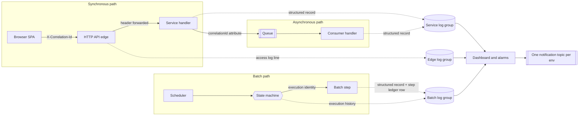

# Observability

---

> **Purpose.** This document specifies how the migrated CardDemo stack is
> observed — its log destinations and log record shape, its metric tags and metric
> families, its traces, its alarms and its single notification topic — and it
> derives every one of those from what the COBOL baseline already does. It
> discharges the observability portion of **Deliverable 2** of the seven numbered
> deliverables: *"/docs/architecture — target architecture diagram, service
> catalog, and data-mapping (VSAM/Db2/IMS → AWS) tables"*, and it carries the
> cross-cutting requirement for *"centralized logging, metrics, tracing"*.
>
> **The framing matters more than the inventory, so it is stated first.** This is
> not a document about observability being *added* to a system that had none. The
> baseline already declares a log destination class and a log verbosity on every
> one of its 38 job cards, already routes step and utility output through named
> output definitions, already carries a **122-byte structured error record with
> eleven typed fields, a level, a subsystem classifier and a dedicated 20-byte
> correlation key**, already centralises the emission of that record in a single
> paragraph invoked from fourteen sites in one program, and already expresses
> machine-readable health as a graded numeric code rather than as a boolean. What
> changes is not the content and not the concepts. What changes is
> **addressability** — see
> [The property being replaced is addressability, not content](#the-property-being-replaced-is-addressability-not-content).
>
> **Source of truth.** Six bodies of reference material, all read and none
> modified:
>
> * the **authorization extension's error-log copybook** —
>   [`CCPAUERY.cpy`](../../app/app-authorization-ims-db2-mq/cpy/CCPAUERY.cpy) (40
>   lines; `01 ERROR-LOG-RECORD.` at L19 and its eleven fields at L20–L40), which
>   is the baseline's own structured-logging schema and is the single most
>   load-bearing citation in this document;
> * the **authorization consumer** —
>   [`COPAUA0C.cbl`](../../app/app-authorization-ims-db2-mq/cbl/COPAUA0C.cbl) (1026
>   lines), which contains the centralised emission paragraph `9500-LOG-ERROR` at
>   L983–L1011, its fourteen call sites, the per-site level and subsystem
>   assignments, and the correlation-identifier discipline at L411–L414 and L745;
> * the **message-width copybooks** —
>   [`CSMSG01Y.cpy`](../../app/cpy/CSMSG01Y.cpy) (24 lines; two `PIC X(50)`
>   constants at L18–L21), [`CSMSG02Y.cpy`](../../app/cpy/CSMSG02Y.cpy) (**35
>   lines**; the abend structure at L21–L29) and
>   [`CVCRD01Y.cpy`](../../app/cpy/CVCRD01Y.cpy) (46 lines; the two `PIC X(75)`
>   message fields and their `LOW-VALUES` sentinel at L28–L30);
> * the **batch job output declarations** — the `SYSOUT` and `SYSPRINT` data
>   definitions across the 38 files of [`app/jcl`](../../app/jcl), cited
>   individually in [Where step output lands today](#where-step-output-lands-today),
>   together with the shared procedure
>   [`REPROC.prc`](../../app/proc/REPROC.prc), whose own output definition is at
>   L22;
> * the **fraud table definition** —
>   [`AUTHFRDS.ddl`](../../app/app-authorization-ims-db2-mq/ddl/AUTHFRDS.ddl) (28
>   lines), cited for exactly one reason: its L3 `AUTH_TS TIMESTAMP NOT NULL`
>   contradicts the six-character date convention the same extension logs with,
>   which is a hazard rather than a curiosity;
> * the **existing suite's numeric health rubric** —
>   [`tests/README.md`](../../tests/README.md) §8 (heading L412, table L417–L423)
>   and [`.github/workflows/tests.yml`](../../.github/workflows/tests.yml) L28–L38,
>   which restate the same rubric independently of one another.
>
> **Delivers, and who consumes it.** It delivers eight things: the mapping from the
> baseline's job-log and console model to log groups; the target log record derived
> field by field from `ERROR-LOG-RECORD`, with every re-based value domain
> disclosed rather than presented as a port; the resolution of the three
> message-width regimes on the log side; the correlation-identity contract that
> joins an HTTP request, a queue message and a batch step under one value; the
> three Micrometer common tags; the metric families with, for each one, the
> question it answers and the action it enables; the alarm set with the same
> question-and-action treatment plus the single-topic decision; and the carry-over
> of the graded return-code rubric into batch signalling. Its consumers are the
> shared kernel `common-lib`, which owns the correlation filter and the metric
> tags; the eight bounded contexts named in
> [`service-catalog.md`](service-catalog.md#the-eight-bounded-contexts), each of
> which emits into its own log group; the `observability`,
> `step-functions-batch`, `ecs-service` and `api-gateway-http` infrastructure
> modules, which provision the groups, the dashboard, the alarms and the topic; and
> `docs/runbooks/batch-operations.md`, which is where an operator acts on what this
> document specifies.
>
> **None of those consumers is complete, and that is stated rather than implied.**
> Two of the four infrastructure modules named above have their input surface
> authored and their resource bodies not yet — `infra/modules/observability` and
> `infra/modules/step-functions-batch` each hold a `variables.tf` and a
> `versions.tf` and no `main.tf` — and both environment roots under `infra/envs`
> are in the same state. `docs/runbooks/batch-operations.md` does not exist. The
> two shared-kernel classes this document depends on **do** exist and are cited by
> line. Every default quoted below is therefore read from an authored input
> declaration, not from a running system.
>
> **Caveats.** Five, stated up front rather than buried, because in an
> observability document the temptation to write as though the telemetry were
> already flowing is unusually strong. First: **no dashboard has rendered, no alarm
> has fired, no trace has been sampled, and no benchmark or load test has been
> run.** Every figure here is either quoted from a cited baseline line or read from
> an authored configuration default; none is a measurement of the target. Second:
> **the repository defines no service-level objectives and none are invented
> here** — there is no latency target, throughput target, availability percentage,
> error budget or recovery-time objective anywhere in this document, and
> [Honest boundaries: structural properties, not service-level objectives](#honest-boundaries-structural-properties-not-service-level-objectives)
> explains what is committed to instead. Third: the baseline is reference-only —
> every line citation is a read, and nothing under [`app/`](../../app) is modified,
> including the three known baseline defects, which are registered in
> `docs/architecture/cobol-to-service-traceability.md` and are not fixed by this
> document or by the work it specifies. Fourth: **the mainframe job-log path is
> preserved intact** — the job cards, the output definitions and the transient-data
> destination all continue to work exactly as they do; the migration adds a path, it
> does not remove one. Fifth: the existing COBOL suite keeps its own workflow, its
> own reporting and its own aggregate return code, and it remains the
> functional-parity oracle.

---

## Four facts a careful reader would otherwise get wrong

Each of these is counter-intuitive enough that a reasonable reader will assume the
opposite, and each one changes an implementation decision. Each is proven at its
own section below.

1. **The baseline's structured error record has four declared log levels and its
   one emitting program uses only two of them.**
   [`CCPAUERY.cpy`](../../app/app-authorization-ims-db2-mq/cpy/CCPAUERY.cpy) L25
   declares `ERR-LEVEL` with condition names for log, informational, warning and
   critical at L26–L29. Across all fourteen emission sites in
   [`COPAUA0C.cbl`](../../app/app-authorization-ims-db2-mq/cbl/COPAUA0C.cbl), only
   `ERR-WARNING` and `ERR-CRITICAL` are ever set. A reader who maps the declared
   domain one-for-one onto a target level set inherits two values that carry no
   observed meaning and misses that the target has to *add* a diagnostic level and
   *split* the fatal one. See
   [The level domain is re-based, not carried](#the-level-domain-is-re-based-not-carried).
2. **`ERR-LEVEL` is control flow, not a label.**
   [`COPAUA0C.cbl`](../../app/app-authorization-ims-db2-mq/cbl/COPAUA0C.cbl)
   L1008–L1010 reads `IF ERR-CRITICAL PERFORM 9990-END-ROUTINE` — writing a
   critical record *terminates the program*. Treating the level as presentation
   metadata loses a behaviour, which is why the target's fatal tier is defined by
   what it does rather than by how it renders.
3. **The 75-character message width is not the width anything renders at.** It is
   a shared work-area content limit at
   [`CVCRD01Y.cpy`](../../app/cpy/CVCRD01Y.cpy) L28–L30, and its sentinel is
   `LOW-VALUES` rather than spaces. The widths a screen region actually declares
   are 78 and 80, measured and owned by
   [`design-token-reference.md`](design-token-reference.md#93-the-message-width-regimes).
   This document collapses the **log-side** widths only, and says so explicitly.
4. **A warn-level aggregate return code is the green state of the existing test
   suite, not a regression.** [`tests/README.md`](../../tests/README.md) §8 grades
   4 as warn, and
   [`.github/workflows/tests.yml`](../../.github/workflows/tests.yml) L31–L32 lets
   a run at or below 4 succeed. The cause is named at L34–L35 of that workflow and
   is a property of the immutable baseline. An alarm threshold expressed as
   "non-zero is bad" would disagree with CI about what healthy means. See
   [The graded return code, and why warn is green](#the-graded-return-code-and-why-warn-is-green).

---

## WHY (non-obvious design decisions)

This section carries the reasoning for the choices this document makes *about
itself*. Every observability decision it records is justified at the point where
the decision is stated, under the same four category names, following
[`../CODE_DOCUMENTATION_STANDARD.md`](../CODE_DOCUMENTATION_STANDARD.md) and the
convention already established for the test suite at
[`tests/README.md`](../../tests/README.md) §12 (L544–L549), which requires the same
four justification categories and calls the requirement a hard review gate.

- Assumptions: every metric, log field and alarm below is written as a
  **question it answers and an action it enables**, and any bullet that could not
  be given both was deleted rather than softened. The reason is specific to this
  subject matter. An observability document is where the phrase "for
  performance" or "for visibility" most naturally lands, and both are exactly the
  form the governing rule's fourth forbidden pattern names — a rationale that
  identifies no consequence and therefore justifies nothing. A reader cannot act
  on "we emit request metrics for visibility"; they can act on "this answers
  whether one route is failing, and the action is a roll-back". The shared
  kernel's own `MetricsConfig` already documents its three tags in exactly that
  form, so this is the established convention here rather than one invented for
  this file.
- Refactoring Rationale: this document leads with what the baseline already
  expresses and only then describes what the target does, which is the reverse of
  the usual ordering for a migration document. The reason is that the opposite
  ordering produces a specific, checkable error: it presents the correlation
  identifier, the structured record, the level classifier and the subsystem
  classifier as target inventions, when all four are declared in
  [`CCPAUERY.cpy`](../../app/app-authorization-ims-db2-mq/cpy/CCPAUERY.cpy) and
  three of them are populated on every emission path in
  [`COPAUA0C.cbl`](../../app/app-authorization-ims-db2-mq/cbl/COPAUA0C.cbl). A
  reader told that correlation is new has no reason to preserve the baseline's
  semantics for it, and would reasonably choose a different width, a different
  custody model and a different echo rule.
- Trade-offs: where a measured figure in this document differs from a figure a
  reader may have seen in a plan or a summary, **the measured figure is recorded
  and the narrative one is not restated as an alternative**. Two cases arise and
  both are consequential. `9500-LOG-ERROR` is invoked from **fourteen** sites, not
  ten, and the four omitted from the shorter count are the reply, the two
  database-write paths and the shutdown path — precisely the sites whose failures an
  operator most needs to see; a target error handler built from the shorter count
  would instrument the read paths and leave the write and shutdown paths silent. And
  the unstructured response-and-reason emission sites number **24 across nine
  programs**, not five across two: five is the count for two of the nine, so a
  reader who took it for the population would conclude that two programs never
  adopted the structured record when in fact nine did not. The accepted cost is that
  this document and a narrative summary read differently. Each such figure carries
  the command that re-derives it in
  [Reproducing the measurements](#reproducing-the-measurements).
- Alternatives Considered: the alternative to writing this document was to let
  each of the eight bounded contexts decide its own log shape, its own tag set and
  its own correlation header. It was rejected because the whole value of the
  telemetry is cross-service: a correlation identifier is worthless unless every
  service reads and writes the same header name, a metric cannot be grouped unless
  every service labels it with the same three keys, and a dashboard row per service
  requires the service names to agree with the ones the catalog fixes. Eight
  independent decisions produce eight series that cannot be joined, and nothing
  about that looks wrong until the first incident asks a question that spans two
  services.
- Assumptions: no threshold quoted in this document is a target. The alarm
  inputs in `infra/modules/observability/variables.tf` are **detection defaults** —
  the point at which a human is told — and the difference from a service-level
  objective is not pedantic. A detection default can be tuned in either direction
  without any promise being broken, whereas an objective is a commitment that
  something must be measured against. This repository contains the former and not
  the latter, and this document quotes only the former.

---

## The property being replaced is addressability, not content

The baseline's observability model is complete and functioning for its platform.
It is *file-shaped* rather than *stream-shaped*, and it declares three separate
things per job, each of which has a direct target counterpart.

| Baseline declaration | Where | Measured population | What it declares | Target counterpart |
|---|---|---|---|---|
| `MSGCLASS=` on the job card | every job card in [`app/jcl`](../../app/jcl) | **38 of 38** files — 29 use `MSGCLASS=0`, 8 use `MSGCLASS=H`, 1 uses `MSGCLASS=X` | Which output class the job's own log is routed to | The log group a producer writes to |
| `MSGLEVEL=(1,1)` on the job card | 5 job cards, including [`CREASTMT.JCL`](../../app/jcl/CREASTMT.JCL) L1 and [`FTPJCL.JCL`](../../app/jcl/FTPJCL.JCL) L1 | **5 of 38** files | How much of the job's own execution detail is recorded | The log level, and the state machine's `log_level` input |
| `NOTIFY=` on the job card | every job card in [`app/jcl`](../../app/jcl) | **38 of 38** files | Who is told when the job ends | One notification topic per environment |
| `SYSOUT` / `SYSPRINT` output definitions per step | 35 of the 38 files | **80** `SYSPRINT` and **18** `SYSOUT` definitions, **98** in total | Where a step's own output and its utilities' messages land | The container log driver's stream |

> **Measured — the only three files in `app/jcl` that declare neither output
> definition are the three whose mechanism has no target counterpart.** They are
> [`CLOSEFIL.jcl`](../../app/jcl/CLOSEFIL.jcl),
> [`OPENFIL.jcl`](../../app/jcl/OPENFIL.jcl) and
> [`FTPJCL.JCL`](../../app/jcl/FTPJCL.JCL). The first two run the operator
> facility directly — `EXEC PGM=SDSF` at L22 of each — and the third is the
> submission tunnel. Every job that runs a program or a utility declares somewhere
> for its output to go; the three that drive an operator facility or a transfer do
> not. The coincidence is worth recording because it means the output-definition
> population and the set of jobs whose *behaviour* is migrated line up exactly,
> with no job losing an output channel in translation.

### Where step output lands today

These are the specific declarations the target's log streams replace. They are
cited so that a reader can confirm that each migrated step had an output channel
before it had a log group.

| File | Output definitions | Note |
|---|---|---|
| [`POSTTRAN.jcl`](../../app/jcl/POSTTRAN.jcl) | `SYSPRINT` L26, `SYSOUT` L27 | The posting step; its **reject stream is a separate definition** at L34–L38, not part of the log |
| [`INTCALC.jcl`](../../app/jcl/INTCALC.jcl) | `SYSPRINT` L25, `SYSOUT` L26 | The interest step; its business date is injected at L22 rather than read from a clock |
| [`TRANBKP.jcl`](../../app/jcl/TRANBKP.jcl) | `SYSPRINT` L38, `SYSPRINT` L52 | Two utility steps, each with its own definition; L42 and L45 normalise a tolerated code, L51 gates on it |
| [`COMBTRAN.jcl`](../../app/jcl/COMBTRAN.jcl) | `SYSOUT` L32, `SYSPRINT` L42 | The sort step's message channel at L32 sits beside its **data** output at L33–L37 |
| [`TRANREPT.jcl`](../../app/jcl/TRANREPT.jcl) | `SYSOUT` L50, `SYSOUT` L62, `SYSPRINT` L63 | Three definitions across two steps; the 133-column report is a **separate** definition at L76–L80 |
| [`CREASTMT.JCL`](../../app/jcl/CREASTMT.JCL) | `SYSPRINT` L23, L46, L57, L81; `SYSOUT` L47, L82 | Six definitions — the most of any single job in the tree |
| [`PRTCATBL.jcl`](../../app/jcl/PRTCATBL.jcl) | `SYSOUT` L58 | One definition, beside its data output at L59–L63 |
| [`DEFGDGD.jcl`](../../app/jcl/DEFGDGD.jcl) | `SYSPRINT` L25, L37, L48, L60, L71, L83 | Six definitions, one per generation-define step |
| [`REPROC.prc`](../../app/proc/REPROC.prc) | `SYSPRINT` L22 | The **shared procedure** declares its own, under `EXEC PGM=IDCAMS` at L21 |

- Refactoring Rationale: what the target replaces is the **addressability** of
  this output, not its content and not the concepts behind it. A spooled job log is
  retrieved *per job, by an operator, after the fact*. The three properties that
  are missing are specific and each one is a question an operator has to be able to
  ask: the same output cannot be queried across services, because there is one
  spool entry per job and a request that touches four services leaves no single
  place to look; it cannot be correlated across one unit of work, because nothing
  in a `SYSOUT` line ties it to the request or the nightly execution that produced
  it; and it cannot be filtered by field, because a line of prose has no fields.
  The target keeps the same content — the same step messages, the same status codes,
  the same reject counts — and changes only how it is addressed: one group per
  producer, one structured record per event, one correlation identifier spanning the
  whole unit of work. Writing that the target's logging is "more modern" would
  document none of those three, and would give a reader no way to check whether the
  replacement actually delivers them.
- Assumptions: **the numeric health signal and the human-readable log are two
  distinct channels in the baseline, and the target keeps them distinct.** The step
  return code is what the next step's gate reads; the job log is what a person
  reads. The gating semantics themselves belong to
  [`batch-orchestration.md`](batch-orchestration.md#the-condition-code-inversion),
  which covers the inversion in full and is not restated here. The observability
  consequence is the part this document owns: a target step publishes a numeric
  outcome that drives the state machine's edges *and* writes a structured record
  that a person reads, and the two are not collapsed into one. Collapsing them —
  emitting only a log line and having the orchestrator parse it — is the failure
  mode this assumption exists to forbid, because a log format change would then
  silently become a control-flow change.
- Trade-offs: the reject stream stays **data**, not telemetry.
  [`POSTTRAN.jcl`](../../app/jcl/POSTTRAN.jcl) L34–L38 declares the rejects as
  their own fixed-length output with its own generation, entirely separate from the
  two log definitions at L26–L27, and the target preserves that separation: reject
  records land in the ledger schema and in an object-store generation, while the
  *count* of them is what becomes a metric. The alternative — routing reject
  records into the log stream because they describe failures — was rejected because
  it would put business data under a log-group retention policy, where it would age
  off on a telemetry schedule rather than a records-retention one, and would make
  the reject stream unqueryable as the table it actually is.

---

## The baseline's own structured-logging schema

[`CCPAUERY.cpy`](../../app/app-authorization-ims-db2-mq/cpy/CCPAUERY.cpy) is 40
lines and declares `01 ERROR-LOG-RECORD.` at **L19**. It is the **only** payload
copybook in the authorization extension that supplies its own group item; the
request and reply copybooks begin at level `05` with no `01`, a difference recorded
at
[`messaging-contracts.md`](messaging-contracts.md#the-copybooks-carry-no-01-level-with-one-exception).
That difference is the tell: this is not a message payload that happens to describe
an error, it is a **record type** with a declared identity.

| Line | Field | Picture | Bytes | Target mapping |
|---|---|---|---|---|
| L20 | `ERR-DATE` | `X(06)` | 6 | Event timestamp — but see [The two-digit-year hazard](#the-two-digit-year-hazard) |
| L21 | `ERR-TIME` | `X(06)` | 6 | Event timestamp |
| L22 | `ERR-APPLICATION` | `X(08)` | 8 | The `service` common tag, and the `service` log field |
| L23 | `ERR-PROGRAM` | `X(08)` | 8 | Logger name. Eight characters is exactly the program-name width the CICS resource definitions use, and the same width the abend record's `ABEND-CULPRIT` declares |
| L24 | `ERR-LOCATION` | `X(04)` | 4 | The failure site — a class-and-method pair in the target |
| L25 | `ERR-LEVEL` | `X(01)` | 1 | Log level, with **four** condition values |
| L26–L29 | `ERR-LEVEL` values | `'L'` log, `'I'` informational, `'W'` warning, `'C'` critical | — | Re-based; see [The level domain is re-based, not carried](#the-level-domain-is-re-based-not-carried) |
| L30 | `ERR-SUBSYSTEM` | `X(01)` | 1 | Structured subsystem tag, with **six** condition values |
| L31–L36 | `ERR-SUBSYSTEM` values | `'A'` application, `'C'` CICS, `'I'` IMS, `'D'` Db2, `'M'` MQ, `'F'` file | — | Dimension retained, domain re-based; see [The subsystem dimension is kept and its domain is re-based](#the-subsystem-dimension-is-kept-and-its-domain-is-re-based) |
| L37 | `ERR-CODE-1` | `X(09)` | 9 | Primary status code |
| L38 | `ERR-CODE-2` | `X(09)` | 9 | Secondary status code |
| L39 | `ERR-MESSAGE` | `X(50)` | 50 | Message text — one of the three widths collapsed on the log side |
| L40 | `ERR-EVENT-KEY` | `X(20)` | 20 | **The baseline's own correlation identifier** |

> **Measured — eleven fields totalling 122 bytes.** The widths sum as
> `6 + 6 + 8 + 8 + 4 + 1 + 1 + 9 + 9 + 50 + 20 = 122`.
> There is no `FILLER` in this record and no group item other
> than the `01` itself, so the field-width sum is also the record length — which is
> what makes the `LENGTH OF ERROR-LOG-RECORD` operand at
> [`COPAUA0C.cbl`](../../app/app-authorization-ims-db2-mq/cbl/COPAUA0C.cbl) L1004
> equal to 122 rather than to something larger. The command that re-derives this is
> in [Reproducing the measurements](#reproducing-the-measurements).

The target log record is a JSON object with a field per row of that table, plus the
correlation identifier and the three common tags. Four of the mappings are
**decisions rather than identities**, and each is disclosed below rather than
presented as a port.

### The level domain is re-based, not carried

The baseline declares four levels and its one emitting program sets two of them.

| `ERR-LEVEL` | Declared at | Times set in `COPAUA0C.cbl` | Target level | Status of the mapping |
|---|---|---|---|---|
| `'L'` log | L26 | **0** | *(no counterpart)* | Declared, never observed |
| `'I'` informational | L27 | **0** | `INFO` | Declared, never observed; the target name is the obvious one |
| `'W'` warning | L28 | **4** — at L495, L542, L590, L967 | `WARN` | Direct |
| `'C'` critical | L29 | **10** — the remaining ten sites | `ERROR` **or** `FATAL` | **Split.** See below |
| *(none)* | — | — | `DEBUG` | **Added.** No baseline counterpart |

Two changes to the domain, and both need to be legible to someone reading an
archived record:

- Refactoring Rationale: **`DEBUG` is added, and the reason is a specific
  capability the baseline does not have.** The baseline's lowest level is
  informational, and its emission is unconditional — the record is written whenever
  the paragraph is performed. There is no mechanism to raise or lower verbosity for
  a running program, so a level below informational would have no way to be
  suppressed and would simply add volume. The target's logging framework filters by
  level at runtime, and the service configuration already pins specific loggers
  precisely so that they *cannot* be lowered — `org.springframework.security` and
  `org.hibernate.orm.jdbc.bind` are both held at `WARN` in
  [`application.yml`](../../services/auth-service/src/main/resources/application.yml)
  for the reason given in [What is never logged](#what-is-never-logged). A `DEBUG`
  level is therefore useful in the target in a way it could not have been in the
  baseline, and its addition is what makes those pins meaningful controls rather
  than comments.
- Refactoring Rationale: **`'C'` splits into `ERROR` and `FATAL`, and a reader
  mapping an archived `'C'` record needs to know which.** The split exists because
  the baseline's `'C'` carries two distinct meanings at its ten sites, and the
  distinction is visible in the code rather than inferred. Writing a `'C'` record
  ends the program:
  [`COPAUA0C.cbl`](../../app/app-authorization-ims-db2-mq/cbl/COPAUA0C.cbl)
  L1008–L1010 is `IF ERR-CRITICAL PERFORM 9990-END-ROUTINE`. So a `'C'` at the
  queue-open site (L273–L282) or the segment-schedule site (L311–L316) means *this
  process cannot continue* — that is `FATAL`. A `'C'` at the cross-reference,
  account or customer read sites (L502–L512, L550–L560, L598–L608) means *this
  message cannot be processed* — and in a target consumer that is `ERROR` on one
  message, with the consumer itself still running to take the next one. Mapping both
  onto a single level would either declare a per-message failure fatal, which would
  stop a service for one bad message, or declare a start-up failure recoverable,
  which would leave a task retrying a condition that cannot clear. **An archived
  `'C'` therefore maps to `FATAL` where the failure is in acquiring or releasing a
  resource and to `ERROR` where it is in handling one message.**

### The subsystem dimension is kept and its domain is re-based

`ERR-SUBSYSTEM` at L30 classifies a failure by the component that produced it.
Three of its six declared values name platforms the target does not run.

| `ERR-SUBSYSTEM` | Declared at | Times set in `COPAUA0C.cbl` | Target value |
|---|---|---|---|
| `'A'` application | L31 | **3** — L496, L543, L591 | `application` |
| `'C'` CICS | L32 | **4** — L421, L504, L552, L600 | `web` — the platform is retired, the layer is not |
| `'I'` IMS | L33 | **4** — L313, L635, L842, L927 | `persistence` — the platform is retired, the layer is not |
| `'D'` Db2 | L34 | **0** | `persistence` |
| `'M'` MQ | L35 | **3** — L275, L770, L968 | `messaging` — the platform is retired, the layer is not |
| `'F'` file | L36 | **0** | `persistence` |
| *(none)* | — | — | `batch` — added, because the target has a step-orchestrated tier the online consumer had no value for |

- Refactoring Rationale: **the dimension is worth keeping and the values are not,
  and the two halves of that statement have different reasons.** The dimension
  survives because it partitions a failure by the layer that produced it, which is
  the first filter an operator applies: a persistence failure, a transport failure
  and a business-rule failure have three different first responders, and a log field
  that separates them turns one query into a triage step. The values do not survive
  because three of the six name a transaction monitor, a hierarchical database
  manager and a message broker, none of which the target runs — a tag reading
  `CICS` on a container service would be false, and a reader filtering on it would
  get nothing. The re-based domain is `application`, `web`, `persistence`,
  `messaging` and `batch`: five layers, mapped from the baseline's four observed
  values plus one for the tier the target adds.
- Refactoring Rationale: **the target derives the subsystem value from the
  adapter that failed rather than setting it by hand, and there is one place in the
  baseline where the hand-set value disagrees with the failing component.** At
  [`COPAUA0C.cbl`](../../app/app-authorization-ims-db2-mq/cbl/COPAUA0C.cbl) L419 the
  location code is `'M003'` — the `M` prefix belongs to the same
  subsystem-letter-plus-ordinal scheme as `M001`, `M004` and `M005`, all three of
  which set the messaging value — while L421 immediately below it sets `ERR-CICS`.
  The paragraph is `3100-READ-REQUEST-MQ` and the failure it reports is a failed
  message get. Two independently hand-set fields describing one failure can
  disagree, and here two do. In the target the layer tag is emitted by the adapter
  that raised the exception, so the value cannot contradict the component that
  produced it; the accepted cost is that the tag is no longer freely choosable at
  the throw site, which is the point.

### The two code slots are re-based, not dropped

`ERR-CODE-1` (L37) and `ERR-CODE-2` (L38) are nine characters each, and the width
is not arbitrary. `COPAUA0C.cbl` L61 declares `WS-CODE-DISPLAY PIC 9(9)` and every
platform code is moved through that field on its way into the record — the
completion and reason pair at L276–L279, L422–L425 and L771–L774, and the response
and reason pair at L505–L508, L553–L556 and L601–L604. Where a code arrives already
formatted it is moved directly, as the segment-manager status is at L314, L636, L843
and L928.

- Assumptions: **two slots are kept because one failure genuinely produces two
  codes, and the pairing is the diagnostic unit.** The baseline's pattern is
  consistent across all fourteen sites: a completion or response code says *that*
  the operation failed, and a reason code says *why*. The target keeps both — a
  persistence error code and the framework exception class that wrapped it are two
  different facts, and collapsing them into one string forces whoever reads the
  record to parse the two back out of prose. The pairing is the baseline's own
  convention rather than an artefact of one program, and the measurement below
  establishes that.
- Trade-offs: the target's two slots are **strings of no fixed width**, and the
  nine-character declaration is not preserved. The width existed because the record
  was a fixed-layout structure written to a fixed-length destination; a JSON field
  has no such constraint, and enforcing nine characters would truncate a Java
  exception class name to the point of uselessness. What *is* preserved is the
  arity: exactly two code fields, so a reader of an archived record and a reader of
  a target record are looking for the same two facts in the same two places.

> **Measured — 24 *unstructured* emission sites across 9 programs under
> [`app/cbl`](../../app/cbl) emit the identical pair.** Every one of them is the
> statement `DISPLAY 'RESP:' WS-RESP-CD 'REAS:' WS-REAS-CD`, and they are
> distributed as [`COBIL00C.cbl`](../../app/cbl/COBIL00C.cbl) 6 (L366, L397, L430,
> L461, L490, L541), [`COTRN02C.cbl`](../../app/cbl/COTRN02C.cbl) 5 (L598, L631,
> L662, L691, L743), [`COTRN00C.cbl`](../../app/cbl/COTRN00C.cbl) 3 (L613, L647,
> L681), [`COUSR00C.cbl`](../../app/cbl/COUSR00C.cbl) 3 (L608, L642, L676),
> [`COUSR02C.cbl`](../../app/cbl/COUSR02C.cbl) 2 (L347, L384),
> [`COUSR03C.cbl`](../../app/cbl/COUSR03C.cbl) 2 (L294, L330), and one each in
> [`COTRN01C.cbl`](../../app/cbl/COTRN01C.cbl) (L290),
> [`COUSR01C.cbl`](../../app/cbl/COUSR01C.cbl) (L268) and
> [`CORPT00C.cbl`](../../app/cbl/CORPT00C.cbl) (L529). The two facts are the same
> two the structured record's slots carry; what differs is that here they have to be
> pattern-matched out from behind a literal prefix rather than read from a named
> field. The command that re-derives 24 and 9 is in
> [Reproducing the measurements](#reproducing-the-measurements).

### The correlation key already exists

`ERR-EVENT-KEY` at **L40** is a dedicated 20-byte field whose only job is to tie
related records together. Its presence is the single most consequential finding in
this document.

- Refactoring Rationale: **the target formalises an existing concept rather than
  inventing one, and what was wrong with the old arrangement is custody rather than
  the concept.** The field is application-managed: it is populated where a
  programmer wrote a `MOVE` into it, and at **eleven of the fourteen** emission
  sites one was written — L428, L499, L511, L546, L559, L594, L607, L638, L777, L845
  and L930. At the other three there is none. Those three are the queue-open path
  (L282), the segment-schedule path (L316) and the queue-close path (L975), and they
  are not an oversight so much as a structural consequence: they run outside the
  scope of any one message, so there is no message identity available to write. The
  effect is that the record carries whatever the field last held, because the
  copybook is included into working storage and nothing clears it between messages.
  The target moves custody from the application to the request scope: the identifier
  is placed in the logging context by a filter, so every record emitted while
  handling a unit of work carries it without the emitting code naming it, and every
  record emitted outside one carries none rather than carrying a stale value. The
  gap being closed is measurable rather than hypothetical — beyond the three sites
  above, the **24** unstructured sites measured in the previous section carry no
  correlation identity at all, and neither does any of the several hundred other
  free-text emission statements in the tree.
- Assumptions: the target's width is **24 characters, not 20**, and the source of
  that number is a different line of the baseline.
  [`COPAUA0C.cbl`](../../app/app-authorization-ims-db2-mq/cbl/COPAUA0C.cbl) L45
  declares `WS-SAVE-CORRELID PIC X(24)`, the save area the inbound transport
  correlation identifier is held in, and the shared kernel's
  [`CorrelationIdFilter`](../../services/common-lib/src/main/java/com/carddemo/common/web/CorrelationIdFilter.java)
  takes its `CORRELATION_ID_MAX_LENGTH` from it. The 20 of `ERR-EVENT-KEY` and the
  24 of `WS-SAVE-CORRELID` are two different fields with two different jobs: the
  first is a log-record grouping key that the program fills from a business value —
  a card number at L428 and L777, a cross-reference card number at L499 and L511, an
  account identifier at L546 and L559, a customer identifier at L594 and L607 — and
  the second is the transport identifier the requester chose. **The target uses the
  transport identifier for both**, which is why 24 is the width that governs; the
  business values that the baseline put in the grouping key remain available as
  their own log fields, where they can be queried by name instead of by position.

---

## The three message-width regimes, and what collapses

A message in the baseline does not have *a* width. Three different fixed-layout
carriers declare three different sizes for the text they carry, and the target
collapses two of them on the log side while the third survives untouched on the
presentation side.

| Width | Fields | Authoritative citation | Carrier | Disposition |
|---|---|---|---|---|
| **50** | `CCDA-MSG-THANK-YOU`, `CCDA-MSG-INVALID-KEY` | [`app/cpy/CSMSG01Y.cpy`](../../app/cpy/CSMSG01Y.cpy) **L18–L21** | Program-local constants moved into a message buffer | **Collapsed** on the log side |
| **50** | `ERR-MESSAGE` | [`CCPAUERY.cpy`](../../app/app-authorization-ims-db2-mq/cpy/CCPAUERY.cpy) **L39** | A field of the 122-byte structured record | **Collapsed** on the log side |
| **50** | `ABEND-REASON` | [`app/cpy/CSMSG02Y.cpy`](../../app/cpy/CSMSG02Y.cpy) **L26–L27** | A field of the abend structure | **Collapsed** on the log side |
| **72** | `ABEND-MSG` | [`app/cpy/CSMSG02Y.cpy`](../../app/cpy/CSMSG02Y.cpy) **L28–L29** | A field of the abend structure | **Collapsed** on the log side |
| **75** | `CCARD-ERROR-MSG`, `CCARD-RETURN-MSG` | [`app/cpy/CVCRD01Y.cpy`](../../app/cpy/CVCRD01Y.cpy) **L28–L30** | The shared work area a message crosses a screen turn in | **Preserved** as a presentation contract, owned elsewhere |

**Two citation corrections apply, and each is stated with the test that settles
it.** Both are external data-contract facts that downstream code depends on, so
they are given here rather than left to be inherited from a summary.

- Assumptions: **the 75-character contract lives in
  [`app/cpy/CVCRD01Y.cpy`](../../app/cpy/CVCRD01Y.cpy) L28–L30, not in
  `CSMSG01Y.cpy`, and its sentinel is `LOW-VALUES` rather than spaces.**
  `CCARD-ERROR-MSG` is at L28 and `CCARD-RETURN-MSG` at L29, both `PIC X(75)`, and
  L30 declares `88 CCARD-RETURN-MSG-OFF VALUE LOW-VALUES`. The one-line test that
  disproves the alternative is that `CSMSG01Y.cpy` declares **no `PIC X(75)` field
  at all** — it is 24 lines long and declares exactly two `PIC X(50)` constants. The
  sentinel matters for the same reason the width does: a field of low values is not
  a field of spaces, so a target that tested for an empty or whitespace-only string
  would treat an explicitly cleared message differently from the baseline, and the
  same copybook's abend fields initialise to `VALUE SPACES`, so one "is it blank"
  helper cannot serve both conventions.
- Assumptions: **the structured abend fields are at
  [`app/cpy/CSMSG02Y.cpy`](../../app/cpy/CSMSG02Y.cpy) L21–L29, not at L45–L53, and
  the decisive test is that the file is only 35 lines long** — any citation placing
  the block beyond line 35 names lines that do not exist. The range L21–L29 spans
  the whole structure from its `01 ABEND-DATA.` at L21 to the last `VALUE` clause at
  L29: `ABEND-CODE` is `X(4)` at L22–L23, `ABEND-CULPRIT` is `X(8)` at L24–L25,
  `ABEND-REASON` is `X(50)` at L26–L27 and `ABEND-MSG` is `X(72)` at L28–L29. The
  eight-character culprit is the same program-name width as `ERR-PROGRAM`, which is
  what lets both records be read as naming the same thing in the same field.

- Trade-offs: **the target log record carries one unbounded message string, and
  the collapse applies to the log record only.** Three fixed widths existed because
  three different fixed-layout carriers had three different field sizes — a
  program-local constant buffer, a 122-byte transient-data record and an abend work
  area — and **none of those three carriers survives** into the target: a JSON log
  field has no declared width and no padding. Preserving 50 and 72 as validated
  string lengths was the alternative and was rejected because it buys nothing and
  costs something specific: the message would be truncated at a boundary that no
  longer corresponds to any storage or display constraint, and a truncated exception
  message is the one part of a failure record a reader most needs whole. What is
  preserved is that the message is **one** field rather than being spread over
  several, which is the property that makes it queryable. The 75-character screen
  contract is a different matter entirely and is **not** collapsed: it survives as a
  presentation constraint and is owned by
  [`design-token-reference.md`](design-token-reference.md#93-the-message-width-regimes),
  which also measures the widths the message band actually *renders* at and
  establishes that 75 is a work-area content limit rather than a screen region. That
  distinction is the reason the collapse here is scoped to the log: the log record
  and the message band are two different destinations with two different contracts,
  and only one of them is this document's to change.

---

## The two-digit-year hazard

The authorization extension logs its timestamp as two six-character fields —
`ERR-DATE` at
[`CCPAUERY.cpy`](../../app/app-authorization-ims-db2-mq/cpy/CCPAUERY.cpy) L20 and
`ERR-TIME` at L21 — and the emitting paragraph fills them from a platform format
request that names the two-digit form explicitly.
[`COPAUA0C.cbl`](../../app/app-authorization-ims-db2-mq/cbl/COPAUA0C.cbl) L990–L994
requests `YYMMDD` into `WS-CUR-DATE-X6` and a time into `WS-CUR-TIME-X6`, both
declared `PIC X(06)` at L51 and L52, and L998–L999 move them into the record.

> **The same extension persists a real timestamp.**
> [`AUTHFRDS.ddl`](../../app/app-authorization-ims-db2-mq/ddl/AUTHFRDS.ddl) L3
> declares `AUTH_TS TIMESTAMP NOT NULL`, and L28 makes it half of the table's
> primary key. So the baseline is internally inconsistent on this point by its own
> declarations: the row it *stores* carries a full timestamp, while the record it
> *logs* carries a six-character date that cannot express a century.

- Assumptions: **the target emits full timestamps with microsecond precision, and
  any path that reads the six-character form must supply the century from context
  rather than from the data.** The assumption this rests on is an external
  data-format contract, not a preference: a `YYMMDD` value is ambiguous by
  construction, and there is no field anywhere in the 122-byte record that resolves
  it. Two consequences follow and both are specific. An ETL or log-ingest path that
  loads archived records has to obtain the century from the dataset it is reading
  rather than from the record — and if it guesses, records sort wrongly against each
  other across a century boundary while looking entirely plausible individually. And
  a target record must not adopt the narrower form for symmetry with the archive,
  because the microsecond-precision form is already the target's timestamp contract
  everywhere else: the shared kernel's
  [`TimestampFormatter`](../../services/common-lib/src/main/java/com/carddemo/common/time/TimestampFormatter.java)
  fixes `TIMESTAMP_LENGTH` at 26 (L210) to match the `PIC X(26)` the transaction
  records declare, and two timestamp conventions in one system would mean every
  comparison had to know which one it was looking at.

---

## `9500-LOG-ERROR`: the baseline already centralises emission

[`COPAUA0C.cbl`](../../app/app-authorization-ims-db2-mq/cbl/COPAUA0C.cbl) contains
one paragraph that formats and writes the structured record, `9500-LOG-ERROR` at
**L983**, and calls it from every path that can fail.

> **Measured — fourteen call sites across twelve paragraphs, not ten.** Every
> `PERFORM 9500-LOG-ERROR` in the program is at **L282, L316, L429, L500, L512,
> L547, L560, L595, L608, L639, L778, L846, L931** and **L975**. A shorter count of
> ten stops at the pending-authorization summary read and omits exactly four sites:
> the reply put at L778, the summary update at L846, the detail insert at L931 and
> the queue close at L975. Those four are the reply path, both database-write paths
> and the shutdown path — the sites whose failures matter most to whoever is on
> call — so the difference between the two counts is not cosmetic. The command that
> re-derives fourteen is in
> [Reproducing the measurements](#reproducing-the-measurements).

| Paragraph | Call site | Location code | Level | Subsystem | What failed |
|---|---|---|---|---|---|
| `1100-OPEN-REQUEST-QUEUE` | L282 | `M001` (L273) | critical (L274) | MQ (L275) | Request queue open |
| `1200-SCHEDULE-PSB` | L316 | `I001` (L311) | critical (L312) | IMS (L313) | Segment schedule |
| `3100-READ-REQUEST-MQ` | L429 | `M003` (L419) | critical (L420) | CICS (L421) | Request message get |
| `5100-READ-XREF-RECORD` | L500 | `A001` (L494) | warning (L495) | application (L496) | Cross-reference not found |
| `5100-READ-XREF-RECORD` | L512 | `C001` (L502) | critical (L503) | CICS (L504) | Cross-reference read failure |
| `5200-READ-ACCT-RECORD` | L547 | `A002` (L541) | warning (L542) | application (L543) | Account not found |
| `5200-READ-ACCT-RECORD` | L560 | `C002` (L550) | critical (L551) | CICS (L552) | Account read failure |
| `5300-READ-CUST-RECORD` | L595 | `A003` (L589) | warning (L590) | application (L591) | Customer not found |
| `5300-READ-CUST-RECORD` | L608 | `C003` (L598) | critical (L599) | CICS (L600) | Customer read failure |
| `5500-READ-AUTH-SUMMRY` | L639 | `I002` (L633) | critical (L634) | IMS (L635) | Summary segment get |
| `7100-SEND-RESPONSE` | L778 | `M004` (L768) | critical (L769) | MQ (L770) | Reply put |
| `8400-UPDATE-SUMMARY` | L846 | `I003` (L840) | critical (L841) | IMS (L842) | Summary segment update |
| `8500-INSERT-AUTH` | L931 | `I004` (L925) | critical (L926) | IMS (L927) | Detail segment insert |
| `9100-CLOSE-REQUEST-QUEUE` | L975 | `M005` (L966) | warning (L967) | MQ (L968) | Request queue close |

What the paragraph itself does, at L983–L1011, is worth reading as a specification
because four of its five actions have a direct target counterpart:

| Line | Statement | Target counterpart |
|---|---|---|
| L986–L988 | Obtain the current absolute time | The logging framework's event timestamp |
| L990–L994 | Format it into the two six-character fields | Superseded — see [The two-digit-year hazard](#the-two-digit-year-hazard) |
| L996–L997 | Stamp the transaction identifier and the program name onto the record | The `service` common tag and the logger name, both applied without the emitting code naming them |
| L1001–L1006 | Write the 122-byte record to the transient-data destination, with the no-condition option | Emit the structured record to the container's log stream, on a path that cannot raise |
| L1008–L1010 | `IF ERR-CRITICAL PERFORM 9990-END-ROUTINE` | The `FATAL` tier: a record at that level accompanies termination rather than merely describing it |

- Refactoring Rationale: **the target pairs a global exception handler with a
  structured logger, and the baseline already proves the pattern's value by
  invoking it from fourteen sites in one program.** The two designs differ in
  exactly one respect, and it is the one that matters: the baseline reaches the
  emission point by an explicit `PERFORM` written at each site, whereas the target
  reaches it by exception propagation into a single `@RestControllerAdvice`. What
  was wrong with the old arrangement is therefore not the centralisation — that was
  already right — but the *reachability*: a new error path in the baseline is
  silent until somebody remembers to add the `PERFORM`, and nothing about the
  omission looks wrong, because the surrounding code reads exactly like the paths
  that do log. Propagation removes that failure mode by making the emission
  unavoidable rather than remembered. The measurable evidence that the failure mode
  is real is in the same repository: the **24** sites measured in
  [The two code slots are re-based, not dropped](#the-two-code-slots-are-re-based-not-dropped)
  emit the identical response-and-reason pair through an unstructured statement
  instead, spread across **nine** programs that never adopted the record at all.
- Assumptions: **emission must not be able to fail the work it is describing.**
  Both platform calls in the paragraph carry the no-condition option — L986 for the
  time request and L1005 for the write — so a failure to log cannot raise a
  condition and cannot change the program's path. The target holds the same
  property: the structured logger writes to the container's standard streams, which
  the log driver forwards, and a forwarding failure is a delivery problem rather
  than a request failure. This is an assumption rather than a preference because
  the alternative has a name and a consequence: a logger that throws turns a
  handled business rejection into an unhandled server error, so the request the
  operator is trying to diagnose fails *because* it was being diagnosed.

---

## Correlation is carried, not invented

The full treatment of correlation identity is in
[`messaging-contracts.md`](messaging-contracts.md#correlation-identity-is-carried-in-the-descriptor-not-reconstructed),
which tabulates the eight statements that establish it and separates it from the
deduplication key. Only the observability consequence belongs here.

Three facts from that treatment are load-bearing for logging:

* The consumer **saves the inbound correlation identifier** —
  [`COPAUA0C.cbl`](../../app/app-authorization-ims-db2-mq/cbl/COPAUA0C.cbl)
  L411–L412 moves it into the 24-byte save area declared at L45 — and **saves the
  inbound reply destination** separately at L413–L414.
* It **echoes the correlation identifier verbatim** onto the reply at **L745**, and
  mints a fresh message identifier beside it at L746. One field is carried across;
  the adjacent one is originated.
* It **never selects on the identifier**: L395–L396 put the no-identifier constants
  into the descriptor used to read the next request, so the read matches any waiting
  message.

Correlation is therefore carried in **transport metadata**, not reconstructed from
business fields — and the target's HTTP analogue is a filter in the shared kernel
rather than a convention.
[`CorrelationIdFilter`](../../services/common-lib/src/main/java/com/carddemo/common/web/CorrelationIdFilter.java)
does four things, each traceable to one of the facts above:

| Behaviour | Where | Baseline lineage |
|---|---|---|
| Accept an inbound identifier if the caller supplied one, and echo it back unchanged | `CORRELATION_ID_HEADER` = `X-Correlation-Id`, L241 | L745 — echoed verbatim |
| Mint one when the caller supplied none, rather than refusing the request | L555 | L746 — originate what was not supplied |
| Place it in the logging context, so every line emitted while serving the request carries it | `CORRELATION_ID_MDC_KEY` = `correlationId`, L256; put at L422, removed at L440 | L40's `ERR-EVENT-KEY`, with custody moved off the application |
| Bound it to 24 characters | `CORRELATION_ID_MAX_LENGTH` = 24, L277 | L45's `WS-SAVE-CORRELID PIC X(24)` |

**One identifier joins three transports**, and the diagram below is scoped to that
claim rather than to the architecture, which is owned by
[`context-and-container-diagrams.md`](context-and-container-diagrams.md).



The identifier travels the solid edges and the telemetry travels the dotted ones,
which is the distinction the diagram exists to make: a log record is not passed from
one component to the next, but the value that lets three records be joined is.

On the synchronous path the value is the HTTP header, captured at the edge as well as
in the service — the API Gateway access log format at
[`infra/modules/api-gateway-http/main.tf`](../../infra/modules/api-gateway-http/main.tf)
L198–L214 emits a JSON line whose last field reads the same
`x-correlation-id` header, so an edge record and a service record for one request
share a value. On the asynchronous path it is a message attribute, mapped from the
transport descriptor exactly as
[`messaging-contracts.md`](messaging-contracts.md#message-descriptor-to-message-attribute)
specifies. On the batch path it is the execution identity of the state-machine run,
recorded alongside each step in the durable step ledger that
[`batch-orchestration.md`](batch-orchestration.md#the-restart-story-there-is-no-baseline-checkpoint-contract-to-preserve)
describes.

- Assumptions: **the filter lives in the shared kernel because the header name
  and the message-attribute name are cross-service contracts, not per-service
  choices.** The value of a correlation identifier is entirely in its being the
  same value in two places, so two services that spelled the header differently
  would each log a perfectly well-formed identifier and the two would never join.
  Re-implementing the filter per service is the alternative, and it fails the moment
  one implementation trims differently, generates a different width, or reads
  `X-Request-Id` instead — none of which produces an error anywhere, and all of
  which produce a request that cannot be followed across a service boundary. The
  shared-kernel boundary this relies on is fixed by
  [`service-catalog.md`](service-catalog.md#the-eight-bounded-contexts), which
  records `common-lib` as a library deployed inside the eight services rather than
  as a ninth service.
- Assumptions: **the identifier is not a credential and must not be treated as
  one.** It is written to a response header and into log output, both of which are
  read by tooling that is not the caller, so it carries no authority and confers
  none. It is minted unpredictably for a narrower reason — not handing out a means
  to guess other requests' identities — and nothing may route, shard or authorize by
  it. The baseline supports this directly: L395–L396 establish that it never
  selected on the value either.

---

## Logs: groups, format, retention and what is never written

### Log groups

One group per producer. Names are given in their parameterised form; **no account
identifier, resource identifier, endpoint or hostname appears anywhere in this
document.**

| Producer | Group name | Created by | Stream key |
|---|---|---|---|
| Each of the eight bounded contexts | `/aws/ecs/<prefix>-<service>-<env>` | [`infra/modules/ecs-service/main.tf`](../../infra/modules/ecs-service/main.tf) L120, group at L398 | The stream prefix is the service name, L660 |
| The batch task family | `/aws/ecs/<prefix>-<batch-service>-<env>` | The same module, instantiated for the batch task | The same convention |
| The nightly chain's execution history | The state machine's own group | `infra/modules/step-functions-batch` | One stream per execution |
| The edge | `/aws/vendedlogs/apigateway/<prefix>-<env>` | [`infra/modules/api-gateway-http/main.tf`](../../infra/modules/api-gateway-http/main.tf) L160, group at L534 | One access-log line per request |
| A producer with no resource of its own | `<prefix>-<env>/<suffix>` | `infra/modules/observability`, from its `log_group_names` input | As the producer writes it |

- Assumptions: **the group name is composed rather than left to be generated,
  because the task execution policy has to scope its write permission to one group.**
  [`infra/modules/ecs-service/main.tf`](../../infra/modules/ecs-service/main.tf)
  L332–L333 names exactly that group's identifier in the policy, so a service can
  write to its own group and to no other. A generated name would force either a
  wildcard permission — which lets a misconfigured service write outside its own
  retention and encryption policy — or a second apply to discover the name. The
  `/aws/ecs/` prefix files all eight services under one path for a reason an
  operator feels during an incident: a single query across the prefix covers every
  service without enumerating them.
- Trade-offs: **the `log_group_names` input of the observability module defaults
  to empty, and the emptiness is the decision.** Every producer in this stack that
  writes logs already owns its group — the eight services through `ecs-service`, the
  nightly chain through `step-functions-batch`, the edge through
  `api-gateway-http` — so creating a duplicate here would leave an empty group that
  still bills and that an operator opening it would reasonably read as the producer
  having gone silent. The input exists for the case that has no Terraform resource of
  its own, where the alternative is worse: an implicitly created group carries the
  service default of unlimited retention and no customer-managed key.

### Format

Structured JSON, one object per event, with the field set derived in
[The baseline's own structured-logging schema](#the-baselines-own-structured-logging-schema).

- Assumptions: **the format is JSON so that a field can be queried rather than
  pattern-matched out of prose**, and the concrete difference is a query an operator
  either can or cannot write. With a field, "every warning from the account context
  in the last hour whose secondary code is a lock timeout" is three predicates over
  three named keys. With a line of prose, it is a regular expression that has to
  survive every future change to the message wording — and when the wording changes
  the query silently returns nothing rather than failing. The baseline demonstrates
  both halves of this: its 122-byte record is a positional structure whose eleven
  fields *can* be sliced apart, while the 371 free-text emission statements across
  22 programs in [`app/cbl`](../../app/cbl) cannot be, which is why five of them
  carry a response and reason code that has to be read out of a literal prefix.
- Assumptions: **every line carries the three common tags from
  [Metrics](#metrics-three-common-tags-and-what-each-answers) and the correlation
  identifier from [Correlation is carried, not invented](#correlation-is-carried-not-invented).**
  Those four keys are what make a log line joinable — to the other lines of the same
  request, to the metric series of the same service, and to the trace of the same
  unit of work. A line missing any of the four is still readable and is no longer
  joinable, which is the failure that is invisible until someone asks a question
  that spans two records.

### Retention

Retention is an **environment parameter**, shorter in development and longer in
production, and it is one of the few things the two environment roots are permitted
to differ in.

| Input | Declared in | Default | What it governs |
|---|---|---|---|
| `log_retention_in_days` | [`infra/modules/ecs-service/variables.tf`](../../infra/modules/ecs-service/variables.tf) L1589, applied at `main.tf` L407 | — | A service's own group |
| `log_retention_days` | `infra/modules/observability/variables.tf` L185 | **30** | The groups that module creates |
| `log_retention_days` | `infra/modules/step-functions-batch/variables.tf` L606 | **30** | The nightly chain's execution history |
| `log_level` | `infra/modules/step-functions-batch/variables.tf` L625 | **`ALL`** | Which execution events are recorded at all |
| `include_execution_data` | `infra/modules/step-functions-batch/variables.tf` L644 | **`true`** | Whether a logged event carries the state's input and output |

- Trade-offs: **retention differs by environment and topology does not.** A short
  development retention costs less to store; a long production retention is what
  makes an incident investigable after the fact. What the two roots may *not* differ
  in is which groups exist, which producers write to them or how they are encrypted,
  because a topology that varies by environment cannot be verified in one and then
  trusted in the other. The retention values live in the environment parameter files,
  which carry **only sizing and retention values and never a secret** — the
  structural reason that holds is in
  [`security-and-identity.md`](security-and-identity.md#zero-secrets-in-source-a-structural-property-not-a-review-outcome).
- Assumptions: **`include_execution_data` defaults on because the payloads in this
  chain are job names, business dates and dataset prefixes rather than record
  data.** That is what makes recording them safe, and it is a property of this chain
  specifically rather than of state machines generally: a chain whose state input
  carried customer records would need the opposite default. What a state received is
  the difference between "the interest step failed" and "the interest step failed for
  the business date that was passed to it", and the second is what a redrive decision
  needs.
- Assumptions: **every group is encrypted with a customer-managed key, and the key
  input is mandatory rather than optional.** Both
  `infra/modules/observability/variables.tf` L164 and
  `infra/modules/step-functions-batch/variables.tf` L675 require it. The reason is
  specific to this baseline: every file resource in the CICS definitions is declared
  with no recovery and no journalling, so encryption at rest is one of the properties
  this migration *adds* rather than preserves — and making the key mandatory is what
  keeps the addition from being silently skippable by a caller who omits it. The key
  hierarchy is specified in
  [`security-and-identity.md`](security-and-identity.md#encryption-at-rest-and-in-transit).

### What is never logged

**Never written to any log stream, at any level, in any environment:** a primary
account number in full; a card verification value; a national identifier; a
government-issued identifier; a password, token or any other credential; and the
bound parameter values of a persistence statement.

The prohibition is enforced at two layers, and it needs both because either alone
leaves a path open.

1. **At the mapper boundary.** The anti-corruption mappers mask the account number
   to its last four digits, never serialise the verification value, and return the
   two identifier fields encrypted and masked. The rules are specified in
   [`security-and-identity.md`](security-and-identity.md#data-exposure-and-masking).
   The consequence for logging is the useful part: **a log line built from a
   response object cannot leak a field the response object does not carry.** That
   makes the masking rule do double duty — it is an exposure control on the API and,
   without any further work, an exposure control on the log.
2. **At the logger configuration.** A framework logger can emit sensitive material
   from *inside* the framework, where no mapper stands between it and the log, so
   two loggers are pinned by name in
   [`application.yml`](../../services/auth-service/src/main/resources/application.yml):
   `org.springframework.security` and `org.hibernate.orm.jdbc.bind`, both held at
   `WARN`.

- Refactoring Rationale: **pinning the statement logger alone was not enough and
  the gap was not obvious.** The logger that emits statement text emits it with the
  values still as placeholders, so it discloses shape rather than data; the bound
  values travel on a **different** logger, and at its lowest level that one prints
  every parameter of every statement — which in the sign-on path means the user
  identifier, the given and family names and the pool subject reference of the row
  being read. An operator raising the parent logger while diagnosing a failing
  sign-on would ship user identity into log aggregation and would have had no line
  in the configuration telling them so. An explicitly pinned child logger cannot be
  raised by a broader parent setting, which is what makes the pin a control rather
  than a comment.
- Trade-offs: the two pins are held at `WARN` rather than switched off entirely.
  `WARN` still lets a genuine binding or authentication failure be reported, which
  is diagnostically useful and carries no parameter values; off would suppress that
  too. The environment profiles may lower other levels for diagnosis and may not
  lower these two.
- Assumptions: **the health endpoint reports aggregate status and no component
  detail.** `management.endpoint.health.show-details` is `never`, and the two probe
  groups are enabled so that the aggregate distinguishes a task that is alive from
  one ready for traffic. Component detail would name the datasource and the schema
  behind it, publishing deployment topology on a path that by design carries no
  credential and is reachable by the load balancer and the container health check
  without one.

---

## Metrics: three common tags, and what each answers

The shared kernel contributes exactly three common tags to every meter, and the set
is closed at three.
[`MetricsConfig`](../../services/common-lib/src/main/java/com/carddemo/common/observability/MetricsConfig.java)
declares them and binds each to a property rather than to a literal.

| Tag | Constant | Bound from | Question it answers | Action it enables |
|---|---|---|---|---|
| `service` | `SERVICE_TAG`, L206 | `spring.application.name`, L254 | Which deployable produced this measurement | Route the investigation to the one bounded context whose code can change the number, and name the owner in an alarm |
| `environment` | `ENVIRONMENT_TAG`, L213 | `carddemo.environment`, L266 | Was this measured where it matters | Disregard a development spike without disregarding the meter — and reuse one dashboard definition across both roots |
| `version` | `VERSION_TAG`, L220 | `carddemo.version`, L276 | Which build did this | Decide a roll-back from the graph itself instead of correlating a step change by hand against a release record |

- Assumptions: **the tags are contributed at the registry rather than stamped at
  each call site.** A single omission at a single call site publishes a series
  carrying a different key set from every other series in the process — so it cannot
  be joined to them, cannot be grouped with them and cannot be alarmed on alongside
  them, and nothing about it looks wrong until someone asks the question it can no
  longer answer. A registry-level contribution applies the set unconditionally to
  every meter the registry accepts, which removes the possibility of the omission
  instead of relying on review to catch it.
- Trade-offs: **an absent property falls back to `unspecified` rather than to a
  real environment name.** `MetricsConfig` L242 declares that token and the service
  configuration repeats it. A task that starts without its environment or version set
  is therefore counted as its own series and is visible as such, instead of being
  folded silently into development or production and skewing whichever it landed in.
  The cost is a series that means "misconfigured"; the alternative cost is a
  production graph quietly containing development traffic.
- Assumptions: **a fourth tag added in one service would exist for that service
  alone and would not group.** The three keys are a cross-service contract for the
  same reason the correlation header is, so the set is closed here and a
  service-specific dimension belongs on the individual meter rather than in the
  common set.

### The metric families

Each family below states the question it answers and the action it enables. A
family that could not be given both is not listed.

| Family | Question it answers | Action it enables |
|---|---|---|
| HTTP request rate, error rate and latency distribution, per route | Is one specific endpoint failing or slowing, as against the service as a whole | Scale the service out, or roll back the image the `version` tag names |
| Edge access-log status and integration latency, per route | Is the failure in the service or between the edge and the service | Investigate the integration and the load-balancer target rather than the application |
| Datastore connection-pool saturation, wait time and acquisition failures | Is the pool the constraint, rather than the query or the cluster | Change the pool size, which is a configuration change, instead of tuning a query that is not the problem |
| Query error counts by code | Is one persistence error dominating — a lock timeout, a constraint violation, a serialisation failure | Address the specific contention or constraint, since the three have three different fixes |
| Queue depth and oldest-message age, per queue | Are messages being processed or accumulating | Scale the consumer out, or investigate a stalled consumer |
| Receive count per message | Is one message being retried repeatedly | Identify a poison message before it exhausts its receives |
| **Dead-letter queue depth** | Has any message failed the configured number of receives | Investigate that message; nothing else produces this signal, which is why it is the highest-signal messaging metric — see [Alarms and notification](#alarms-and-notification) |
| Batch step outcome, duration and record counts read, written and rejected | Did the nightly chain complete, and did any step read or reject a different volume than expected | Redrive the failed state, or investigate an input volume anomaly before the next run |
| The durable step ledger's per-step status | Which steps of this execution already completed | Redrive without repeating completed work, since the ledger is the idempotency key — see [`batch-orchestration.md`](batch-orchestration.md#the-restart-story-there-is-no-baseline-checkpoint-contract-to-preserve) |
| **The posting reject count**, specifically | Did posting reject more records than the run should tolerate | Take the warn edge and continue, or stop the chain — the graded decision described in [The graded return code, and why warn is green](#the-graded-return-code-and-why-warn-is-green) |
| Expired-message drops, with the correlation identifier and the elapsed time | Was a stale reply correctly declined, or was a reply lost | Distinguish four failures that otherwise look identical, as [`messaging-contracts.md`](messaging-contracts.md#the-expiry-gap) sets out |
| Business counters: records read, records posted, records rejected | How much work did this run actually do | Compare a run against its predecessors, which is the check that catches a truncated input before its output is trusted |

- Assumptions: **the business counters formalise counters the COBOL already
  maintains rather than adding new instrumentation.** The batch programs already
  accumulate read, posted and rejected totals and already emit them — the posting
  program alone carries 53 emission statements and the interest program 49. The
  target publishes the same three quantities as meters instead of as prose. The
  practical difference is that a prose total can be read after a run and a meter can
  be compared across runs, which is what turns a number into a check.
- Assumptions: **the posting reject count is a metric because the baseline already
  makes it a graded decision, not merely a fact.** The reject stream is written and
  the step's outcome is set accordingly, and the next step's gate reads that outcome
  — [`TRANBKP.jcl`](../../app/jcl/TRANBKP.jcl) L51 is the gate form that lets a
  warn-level outcome continue. The semantics are owned by
  [`batch-orchestration.md`](batch-orchestration.md#the-condition-code-inversion);
  what belongs here is that the count has to be a first-class series, because an
  alarm on it is the difference between "some rejects, as every run has" and "this
  run rejected an input file's worth".
- Assumptions: **the metric surface is exposed on the actuator paths the service
  configuration already fixes** — `metrics` and `prometheus` under `/actuator`,
  alongside `health` and `info`. Moving the base path or renaming the health
  endpoint would break target-group registration and container liveness in the same
  change, which is exactly the pair of independent signals that tells an operator a
  deployment is progressing.

---

## Traces

Distributed tracing spans the edge, the eight services and the datastore, and the
**trace identifier and the correlation identifier are carried together** so that a
log line can be pivoted to its trace and a trace back to its log lines. Tracing for
the nightly chain is on by default —
`infra/modules/step-functions-batch/variables.tf` L659 — so a run appears as one
trace spanning its task and function invocations rather than as eleven unrelated
ones.

- Assumptions: **the queue hop is asynchronous, so the producer's span and the
  consumer's span are linked by propagated context on a message attribute rather
  than by a parent-child relationship.** This is an honest limitation rather than a
  design choice: the producer's span ends when the send returns, and the consumer's
  span begins on a different task, possibly minutes later. What joins them is a
  context attribute carried on the message, which is the *same* assumption the
  correlation identifier makes — that the attribute survives the transport. The
  consequence if it does not is specific: the two spans appear as two unrelated
  traces that both look complete, so the gap is invisible rather than reported. The
  attribute mapping is the one specified in
  [`messaging-contracts.md`](messaging-contracts.md#message-descriptor-to-message-attribute).
- Trade-offs: **sampling is a configuration parameter, higher in development than
  in production, and errors are always sampled.** Full sampling in production would
  multiply trace volume by request volume, and for steady-state traffic the
  thousandth successful trace of the same route carries no diagnostic information the
  first one did not — so the cost is real and the return is not. Always sampling
  errors is what keeps the reduction from costing anything diagnostically: the traces
  a reader wants are the ones that failed, and those are never dropped. The accepted
  cost is that a successful request an operator is asked about specifically may have
  no trace, which is why the correlation identifier is on the response header — it
  still names the unit of work in the log even when no trace was recorded.
- Assumptions: **the external point-of-sale authorizer is not supplied by the
  baseline**, so a trace cannot extend past the queue into the requester. Only a
  test stub exists. The consequence is that end-to-end tracing across the
  authorization request path is specified here and is not exercisable from this
  repository, which is stated again in
  [Caveats, boundaries and out-of-scope](#caveats-boundaries-and-out-of-scope).

---

## Alarms and notification

Every alarm states its condition, the question it answers and the action it
triggers. The threshold column quotes the **authored default** of the corresponding
input in `infra/modules/observability/variables.tf`; a threshold is a detection
default and **not** a target — see
[Honest boundaries: structural properties, not service-level objectives](#honest-boundaries-structural-properties-not-service-level-objectives).

| Alarm | Condition | Authored default | Question it answers | Action it triggers |
|---|---|---|---|---|
| Service unhealthy | Unhealthy target count in the load-balancer target group, or health-check failure | — | Is this service's task actually serving | Replace the task, or roll back the image the `version` tag names. The target group is the authority here rather than the service's own log, because a task too broken to log is exactly the case that matters |
| Elevated server errors | Server-error responses per service within one evaluation period | `service_error_rate_threshold` = **5** (L375) | Is one service failing requests | Investigate that service, then roll back or scale. This watches the load balancer's own count, so it fires for a service that has stopped logging as readily as for one that has not |
| **Dead-letter depth** | Visible messages in any dead-letter queue | `dead_letter_depth_threshold` = **1** (L406) | Has any message failed its configured number of receives | Investigate that message. **This is the highest-signal messaging alarm**: a dead-letter queue is empty in normal operation, so any depth at all means a message has exhausted every retry, and the default is deliberately the smallest value that can be breached |
| Stale replies | Oldest-message age on a reply queue approaching that queue's retention window | — | Are replies being consumed before they can expire | Investigate the waiting consumer. This is the observable form of the expiry gap in [`messaging-contracts.md`](messaging-contracts.md#the-expiry-gap): the target enforces expiry in the consumer, so an unconsumed reply is the case the queue cannot discard for itself |
| Batch execution failure | Failed nightly-chain executions within one evaluation period | `batch_failure_threshold` = **1** (L424) | Did the nightly chain fail | Redrive from the failed state. This replaces reading a job log for a non-zero condition code |
| Batch catch path entered | Any state routed to its catch handler, including the states whose outcome is warn-level | — | Which state failed, and did the chain continue past it | Read that state's step ledger row and decide between redrive and investigation |
| Datastore capacity ceiling | Cluster utilisation sustained against its configured maximum | `database_cpu_threshold_percent` = **80** (L392) | Is the workload pressed against its configured maximum capacity | Raise the maximum capacity. On a serverless cluster this is a scaling signal as much as a saturation one |
| Connection-pool exhaustion | Acquisition failures or sustained wait on the pool | — | Is the pool the constraint rather than the cluster | Change the pool size, which is a service configuration change |
| Secret or key access failure | Denied access to a secret or a key by a task role | — | Has a rotation or a policy change broken a service's ability to start | Correct the policy or the rotation, before the next task placement fails the same way |

Two configuration inputs govern how quickly any of these speaks:
`alarm_evaluation_periods` defaults to **2** (L336) and `alarm_period_seconds` to
**300** (L352).

- Trade-offs: **an evaluation-period count above one is what distinguishes a
  sustained problem from a single unlucky period**, and the cost is that the
  notification is delayed by that many periods. The two inputs are read together
  because an alarm's detection window is their product. Setting the count to one
  would notify sooner and would also notify on every transient blip, which trains
  the reader to ignore the channel — and an ignored alarm is strictly worse than a
  slower one.
- Alternatives Considered: **all alarms notify one topic per environment, rather
  than a topic per alarm or per service.** Two properties decided it, and both are
  operational rather than aesthetic. Subscription policy is configured **once**: who
  is told, and by what means, is a single decision rather than one per alarm, so
  adding an alarm does not require also remembering to subscribe to it — and an
  alarm nobody is subscribed to is indistinguishable from an alarm that never
  fires. And an environment's entire alerting surface can be muted or redirected
  **atomically** during a maintenance window, by changing one subscription, instead
  of by touching every alarm and having to restore them all afterwards. The baseline
  makes the contrast concrete: it declares `NOTIFY=` on **all 38** of its job cards,
  so the notification target is a per-job decision there, and redirecting the whole
  surface would mean editing 38 job cards.
- Assumptions: **no contact detail appears in this repository.** The
  `alarm_email_endpoints` input at L289 defaults to empty, and the reason recorded
  against it is that an address is a person's contact detail and this repository is
  not the place to record one. Subscriptions are supplied at apply time. The same
  discipline covers every name in this document: log-group names, the topic name,
  the dashboard name and every alarm name are composed from a prefix and an
  environment, so nothing here identifies an account, a resource or a person.

### The dashboard

`infra/modules/observability/variables.tf` L243 declares
`dashboard_service_names`, whose default is the eight canonical service names from
[`service-catalog.md`](service-catalog.md#the-eight-bounded-contexts), **in reading
order rather than alphabetically**: `auth-service`, `account-service`,
`card-service`, `transaction-service`, `reference-service`, `batch-service`,
`authorization-service`, `reporting-service`.

- Assumptions: **the order is the order an operator reads the board in, and it
  approximates the order a request travels through the system** — sign-on, then the
  account and card lookups, then the ledger writes, then reference data, then the
  nightly chain, then the asynchronous authorization path, then reporting.
  Alphabetical order would put reporting third and sign-on second, which is neither
  the sequence of a request nor a sequence anyone reads in.
- Assumptions: **each entry is used as a metric dimension value**, so it has to
  match the service name exactly as the `service` common tag carries it. A name
  matching no service renders a widget with no datapoint rather than an error, which
  is why the catalog's canonical spellings are the authority and no variant is
  introduced here.
- Trade-offs: the list is an input rather than fixed, because a root may want a
  narrower board — during an incident, or in a development environment where most of
  the eight are idle — and should not need a module edit to get one. The accepted
  cost is that a caller can pass a name matching no service; that shows up on the
  dashboard itself, which is the cheapest place for it to show up.

---

## The graded return code, and why warn is green

The baseline and its test harness already express health as a **graded numeric
code**, and the target carries that grading into batch signalling rather than
replacing it with a boolean.

| Code | Meaning | Target edge |
|---|---|---|
| **0** | Pass — everything succeeded | The state's success edge |
| **4** | Warn or soft reject — a business-rule reject was correctly written, a layer collected no tests, or an optional layer was unavailable | An explicit choice that continues the chain and records the warn |
| **8** | Fail — a test or a required step failed | The state's catch handler, then the notification state, then failure |
| **16** | Fatal — an abend or unrecoverable error | The same catch path; the tier is retained because it distinguishes an abend from a handled failure in the ledger |
| **2** | Usage — a runner was invoked incorrectly; aborts immediately and does not enter aggregation | No batch analogue; a malformed invocation fails before the state runs |

**Two independent citations establish the rubric**, which is what makes it a
contract rather than a convention: [`tests/README.md`](../../tests/README.md) §8
documents it — heading at L412, table at L417–L423, with the aggregation rule "the
worst (highest) code seen" at L415 — and
[`.github/workflows/tests.yml`](../../.github/workflows/tests.yml) restates it
independently at L28–L38, where L29 gives the tiers and L31–L32 makes the gate
explicit: a run at or below 4 lets the job succeed and a run at or above 8 fails it.

> **The existing suite's documented warn-level aggregate return code is the GREEN
> state, and it must not be read as a regression introduced by this migration
> work.** The cause is named in the workflow itself at L34–L35 and in
> [`tests/README.md`](../../tests/README.md) §1.1 at L53–L69: two of the twelve
> batch programs do not compile under the open-source compiler, because each
> declares a record key on its file description that is defined only in working
> storage and not in the file's record. The build attempts them, expects the
> documented failure, and aggregates a soft warn rather than poisoning the result;
> the corresponding integration test is skipped with that exact reason. **No COBOL
> is changed to address this** — the baseline is reference-only, the divergence is
> registered in `docs/architecture/cobol-to-service-traceability.md`, and nothing in
> this document or the work it specifies edits either program.

- Assumptions: **the rubric is an existing external contract that continuous
  integration already enforces, so the target's thresholds have to be expressed in
  the same tiers.** This is the sharpest instance of the general assumption in this
  document. If a batch alarm were written as "notify when the exit status is
  non-zero", it would fire on every run that correctly wrote a business reject —
  which is a 4 — while the pipeline beside it treated that same run as passing. Two
  systems would then disagree about what healthy means, and the disagreement would
  present as a stream of alarms nobody could act on. The graded form avoids that by
  construction: the warn tier is a distinct edge with a distinct record, not a
  degenerate case of failure. The state machine's own input reflects it —
  `posting_warn_return_code` in
  `infra/modules/step-functions-batch/variables.tf` L567 defaults to **4**, and its
  recorded reason is that the default is recovered from the baseline rather than
  chosen.
- Refactoring Rationale: **the numeric tier is recorded in the durable step ledger
  as well as driving the edge**, and the reason is that the edge is transient and the
  ledger is not. Once an execution has taken its warn edge and continued, the fact
  that a step warned is only recoverable from the execution history; a ledger row
  carrying the tier makes it queryable alongside every other run of the same step, so
  "this step warns most nights" and "this step warned tonight only" are
  distinguishable. The ledger's role as the redrive idempotency key is specified in
  [`batch-orchestration.md`](batch-orchestration.md#the-restart-story-there-is-no-baseline-checkpoint-contract-to-preserve).
- Assumptions: the baseline itself normalises a tolerated code, and the target's
  warn tier is the equivalent rather than an invention.
  [`TRANBKP.jcl`](../../app/jcl/TRANBKP.jcl) L42 and L45 both read
  `IF MAXCC LE 08 THEN SET MAXCC = 0`, resetting a tolerated utility failure so the
  step reports clean, and L51 gates the following step on a code of four or lower.
  The gating semantics are owned by
  [`batch-orchestration.md`](batch-orchestration.md#the-condition-code-inversion);
  the observability consequence is that "clean" in the baseline is already a
  *decision* about a code rather than the absence of one, so a target that reported
  only pass or fail would lose information the baseline records.

---

## Honest boundaries: structural properties, not service-level objectives

**The repository defines no service-level objectives, and none are invented here.**
There is no latency target, no throughput target, no availability percentage, no
error-budget figure and no recovery-time or recovery-point objective anywhere in
this document. The rule applied throughout is simple and was applied
mechanically: **if a number is not in the repository, it is not in this document.**
The numbers that *are* here are of exactly two kinds — a width, count or literal
quoted from a cited baseline line, and a detection default read from an authored
Terraform input — and neither kind is a commitment about behaviour.

What *is* committed to are **structural properties**. Each is stated with the cost
it carries, because a property presented without its cost reads as a free win and
invites the reader to assume there is no trade to understand.

| Property | Mechanism | Trade-off it carries |
|---|---|---|
| Every online service is **stateless** | The pseudo-conversational session structure decomposes into client history, signed claims and request parameters; no server-side session store exists — see [`service-catalog.md`](service-catalog.md#why-every-context-is-stateless) | Every request must carry its own identity and selection context, so a request is larger and a client holds navigation state it previously did not |
| Services **scale horizontally** without sticky sessions | Follows directly from statelessness | None beyond the above; this is the property statelessness exists to buy |
| Database capacity is **elastic and can scale to zero in development** | Serverless capacity with an auto-pause setting | Trade-offs: a paused cluster has a resume latency on the first connection. That is immaterial for a batch step and is accepted in development, and it is exactly why the production minimum is held above zero — an interactive request must not pay it |
| Authorization processing is **per-card ordered and duplicate-suppressed** | FIFO grouping by card number with the business transaction identifier as the deduplication key — specified in [`messaging-contracts.md`](messaging-contracts.md#the-five-baseline-queues-and-their-target-replacements) | Trade-offs: ordering is guaranteed only *within* a card, and throughput across cards is what recovers the parallelism that a globally ordered queue would forfeit |
| Batch has **per-state retry, redrive and a durable step ledger** | Per-state retry and catch settings, plus the ledger — see [`batch-orchestration.md`](batch-orchestration.md#per-state-resilience-settings) | Trade-offs: this is an **addition**, not a port. The baseline has no checkpoint contract to preserve — its only restart directive is commented out — so this is presented as an improvement rather than as parity, and it carries the cost of a step having to be idempotent to be redrivable |
| **Cost discipline is an explicit tie-breaker** | Managed and pay-per-use options preferred; development capacity sized independently of production | Trade-offs: a smaller development environment is not a faithful rehearsal of production capacity, so a capacity problem can only be found in production or in a deliberately sized test |

- Assumptions: **an alarm threshold is not a service-level objective, and
  conflating the two would be the most damaging error a reader could make from this
  document.** A detection default says "tell a person at this point" and can be
  tuned in either direction without any promise being broken. An objective says
  "this must hold" and implies a measurement regime, an error budget and a
  consequence for breaching it. This repository contains the former and not the
  latter. The practical difference: raising `service_error_rate_threshold` from five
  is a tuning decision an operator may make on the evidence of a week's alerts, and
  it changes nothing about what the system promises — because it never promised
  anything.
- Trade-offs: **no target figure is offered even where one would be easy to
  assert.** The alternative was to state plausible objectives so the document reads
  as complete. It was rejected because an invented objective is indistinguishable in
  form from a derived one, and a reader has no way to tell which they are looking
  at; the first time such a figure is quoted back as a requirement, the document has
  manufactured a commitment out of a guess. Recording that there are no objectives
  is a smaller, checkable claim, and it leaves the decision with whoever is entitled
  to make it.

---

## Reproducing the measurements

Every measured figure in this document can be re-derived from the repository. The
commands below are read-only, run from the repository root, and modify nothing.

```bash
# WHAT: count the structured error record's fields and sum their declared widths,
#       then print the total, from the copybook's own PICTURE clauses.
# WHY : Assumptions: the record contains no FILLER and no group item below the 01,
#       so the field-width sum IS the record length -- which is what makes the
#       LENGTH OF operand at COPAUA0C.cbl L1004 equal 122 rather than something
#       larger. Summing from the PICTURE clauses rather than quoting 122 is what
#       makes the figure checkable instead of taken on faith.
grep -c '^ *05 ERR-' app/app-authorization-ims-db2-mq/cpy/CCPAUERY.cpy
grep -o 'PIC  *X(\([0-9]*\))' app/app-authorization-ims-db2-mq/cpy/CCPAUERY.cpy \
  | tr -dc '0-9\n' | awk '{t+=$1} END {print "total bytes:", t}'
```

```bash
# WHAT: list every call site of the centralised emission paragraph, with its line
#       number, then count them.
# WHY : Trade-offs: the count is printed rather than asserted because a shorter
#       figure of ten is in circulation and omits four sites -- the reply put, both
#       segment writes and the queue close. Printing the line numbers alongside the
#       count is what lets a reader see WHICH four a smaller figure drops, rather
#       than only that the two figures differ.
grep -n 'PERFORM 9500-LOG-ERROR' \
  app/app-authorization-ims-db2-mq/cbl/COPAUA0C.cbl | sed 's/ *$//'
grep -c 'PERFORM 9500-LOG-ERROR' \
  app/app-authorization-ims-db2-mq/cbl/COPAUA0C.cbl
```

```bash
# WHAT: show which log levels and which subsystem values the emitting program
#       actually sets, with their counts.
# WHY : Assumptions: the DECLARED domain and the USED domain differ, and the
#       difference is the whole basis for re-basing both value sets rather than
#       porting them. Two of the four levels and two of the six subsystem values
#       never appear, so a one-for-one mapping would carry four values that no
#       archived record can contain.
grep -o 'SET  *ERR-[A-Z0-9]*' \
  app/app-authorization-ims-db2-mq/cbl/COPAUA0C.cbl | awk '{print $2}' | sort | uniq -c
```

```bash
# WHAT: count the per-step output declarations across the batch tree, and list the
#       files that declare neither kind.
# WHY : Assumptions: the two ddnames are counted with anchored patterns because
#       'SYSOUT' also appears as the VALUE of each declaration ("DD SYSOUT=*"), so
#       an unanchored count would roughly double the SYSOUT figure by matching each
#       SYSPRINT line as well. The second command is the load-bearing one: the three
#       files it prints are the operator-facility pair and the submission tunnel,
#       which is why no job whose behaviour is migrated loses an output channel.
grep -hc '^//SYSPRINT *DD' app/jcl/* | awk '{t+=$1} END {print "SYSPRINT:", t}'
grep -hc '^//SYSOUT *DD'   app/jcl/* | awk '{t+=$1} END {print "SYSOUT:",   t}'
comm -23 <(ls app/jcl/* | sort) \
         <(grep -l '^//SYSPRINT *DD\|^//SYSOUT *DD' app/jcl/* | sort)
```

```bash
# WHAT: show the three job-card level declarations -- output class, verbosity and
#       notification target -- with their distinct values and populations.
# WHY : Assumptions: these three are what establish that the baseline already
#       declares a log destination, a log level and a notification target PER JOB,
#       which is the evidence for the claim that addressability rather than content
#       is what the target replaces. The NOTIFY population is also the specific
#       reason the target uses one topic per environment: redirecting the baseline's
#       whole alerting surface means editing every job card that appears here.
grep -ho 'MSGCLASS=[A-Z0-9]*' app/jcl/* | sort | uniq -c
grep -l 'MSGLEVEL=(1,1)'      app/jcl/* | wc -l
grep -l 'NOTIFY='             app/jcl/* | wc -l
```

```bash
# WHAT: prove the two citation corrections with the two tests that settle them --
#       the abend file's length, and which copybook declares a 75-byte field.
# WHY : Assumptions: a citation is disproven most cheaply by a property of the file
#       rather than by re-reading it. CSMSG02Y.cpy is 35 lines, so any citation
#       beyond line 35 names lines that do not exist; and the 75-byte declaration
#       appears in exactly one file under app/cpy, which settles the other.
wc -l < app/cpy/CSMSG02Y.cpy
grep -rln 'PIC  *X(75)' app/cpy/
```

```bash
# WHAT: count the unstructured emission statements across the reference tree, then
#       count only the sites that emit a response-and-reason pair, per program.
# WHY : Assumptions: the two emission styles COEXIST in the baseline -- one 122-byte
#       structured record and several hundred free-text statements -- and the second
#       figure is what makes the custody argument concrete rather than rhetorical:
#       these sites carry the same two codes the structured record's two slots carry,
#       with nothing tying any of them to a unit of work. The per-program breakdown
#       is printed rather than a bare total because a figure of five is in
#       circulation, and it happens to be the count for two of the nine programs
#       rather than for the population -- which a total alone would not reveal.
grep -c 'DISPLAY' app/cbl/*.cbl \
  | awk -F: '$2>0 {n++; t+=$2} END {print n, "files,", t, "statements"}'
grep -c "DISPLAY 'RESP:'" app/cbl/* | awk -F: '$2>0 {n++; t+=$2; print} END {print n, "programs,", t, "paired sites"}'
```

---

## Caveats, boundaries and out-of-scope

### The deployment boundary

**No dashboard has rendered. No alarm has fired. No trace has been sampled. No
benchmark and no load test has been run.** The log groups, the dashboard, the
alarms and the notification topic are authored as infrastructure-as-code and are
**statically validated only** — formatted, validated, planned and linted. Applying
them to a live account is an operator action outside this scope. Every figure in
this document is therefore one of exactly two things: a width, count or literal
quoted from a cited baseline line, or a configuration default read from an authored
Terraform input declaration. **Nothing here is a measurement of the target system**,
and no sentence above should be read as reporting one.

The authoring state is uneven and is stated rather than glossed. The two
shared-kernel classes this document depends on exist and are cited by line.
`infra/modules/ecs-service`, `infra/modules/api-gateway-http` and
`infra/modules/sqs` have their resource bodies authored. `infra/modules/observability`
and `infra/modules/step-functions-batch` hold a `variables.tf` and a `versions.tf`
and **no `main.tf`**, and both roots under `infra/envs` are in the same state — so
the alarm, dashboard and topic resources those inputs describe are specified and not
yet expressed.

### Explicitly out of scope, and none of it is delivered

Named here so that no sentence above can be read as a claim to the contrary:

* **Multi-region and disaster-recovery observability.** Single region, three
  availability zones. No cross-region log replication, no cross-region alarm
  aggregation, no failover dashboard.
* **Blue-green and canary deployment metrics.** Rolling service deployment only, so
  there is no per-variant metric split, no automated canary analysis and no
  deployment-gating metric.
* **Kafka and Kinesis.** No streaming platform forms any part of this design, so no
  consumer-lag, partition or stream-iterator metric exists.
* **Redis and ElastiCache.** No cache tier, so no hit-rate, eviction or
  cache-latency metric exists.
* **Read replicas and replica-lag monitoring.** Reporting reads go to the writer
  through read-only cross-schema views, so there is no replica and no lag to watch.
* **The Db2 rewards extension, IMS DC and SFTP integration.** All three are listed
  as future work by the baseline itself; none is migrated and none is instrumented.
* **Exposing distributed transactions.** The two-phase commit is eliminated rather
  than emulated, so there is no coordinator to monitor and no in-doubt-transaction
  metric.

### The external client is not supplied by the baseline

The point-of-sale authorizer that *produces* authorization requests is not part of
this repository — only a test stub exists — so end-to-end tracing and correlation
across that boundary is **documented here and not exercisable from this
repository**. The consequence is asymmetric confidence: the consumer side of the
correlation contract is derived from statements that actually execute, whereas the
producer side is derived from what the consumer reads.

### The existing test suite's observability is untouched

[`tests/`](../../tests) keeps its own runners, its own JUnit reporting, its own
coverage configuration and its own aggregate return code, and
[`.github/workflows/tests.yml`](../../.github/workflows/tests.yml) keeps its own
pipeline. Nothing in this document changes any of them. That suite remains the
functional-parity oracle, and its documented warn-level aggregate result remains its
green state.

### The mainframe job-log path is preserved

Every artifact cited in this document continues to operate exactly as it does. The
38 job cards keep their output class, verbosity and notification declarations; the
98 per-step output declarations keep routing step and utility output where they
route it today; the transient-data destination the structured record is written to
at
[`COPAUA0C.cbl`](../../app/app-authorization-ims-db2-mq/cbl/COPAUA0C.cbl)
L1001–L1006 keeps receiving it. **The migration adds a path, it does not remove
one**, and nothing here retires, replaces or deprecates the existing operational
model — which is a complete and functioning one for the platform it runs on.

### Every citation is a read

Nothing under [`app/`](../../app), [`tests/`](../../tests), `scripts/` or
`samples/` is modified by this document or by the work it specifies. The three known
baseline defects are not subjects of this document and are not fixed in place; they
are registered in `docs/architecture/cobol-to-service-traceability.md`, together
with every documented behavioural divergence.

---

## Related documents

**A linked row exists; a code-span row does not exist yet.** Paths appear below —
and everywhere above — as plain code spans rather than links when the file they name
has not been authored, per the Markdown convention in
[`../CODE_DOCUMENTATION_STANDARD.md`](../CODE_DOCUMENTATION_STANDARD.md). Each
becomes a link when the file exists, which lets a reader tell a written document
from a contracted one without clicking.

| Document | What it covers that this one does not |
|---|---|
| [`service-catalog.md`](service-catalog.md) | The naming authority: the eight canonical service names this document's tags and dashboard rows depend on, and the `common-lib` shared-kernel boundary the correlation filter and metric tags live inside |
| [`messaging-contracts.md`](messaging-contracts.md) | The queue-by-queue mapping, the descriptor-to-attribute mapping, the positional wire format, and the full correlation and expiry-gap treatment this document cites rather than restates |
| [`batch-orchestration.md`](batch-orchestration.md) | The condition-code inversion in full, the per-state retry and catch settings, the generation-dataset convention, and the step ledger's role as the redrive idempotency key |
| [`security-and-identity.md`](security-and-identity.md) | The masking rules behind the never-logged list, the four-key encryption hierarchy the log groups use, the task-role boundaries, and the structural argument for zero secrets in source |
| [`design-token-reference.md`](design-token-reference.md) | The presentation side of the message-width question: the authoritative citations at §9.1 and §9.2, and the measured widths the message band actually renders at |
| [`data-model-and-schema-mapping.md`](data-model-and-schema-mapping.md) | Where the reject stream and the authorization records are persisted, field by field, and the money invariant that keeps a logged amount and a stored amount the same value |
| [`context-and-container-diagrams.md`](context-and-container-diagrams.md) | Where each producer of telemetry sits in the current-state and target-state architecture |
| `docs/architecture/cobol-to-service-traceability.md` | The program-by-program matrix and the authoritative register of every documented divergence, including the three baseline defects behind the warn-level aggregate result |
| `docs/runbooks/batch-operations.md` | What an operator does with a batch alarm: the redrive procedure, the quiesce bracket and the exact commands |
| `docs/adr/ADR-004-messaging.md` | The decision record for the transport, which also records the expiry-gap resolution the stale-reply alarm observes |
| [`tests/README.md`](../../tests/README.md) | The suite's own rubric, markers and known limitations — §8 for the graded return code, §1.1 for the cause of the warn |
| [`../CODE_DOCUMENTATION_STANDARD.md`](../CODE_DOCUMENTATION_STANDARD.md) | The documentation convention this document follows, including the four rationale labels and the `# WHAT:` / `# WHY :` idiom |
