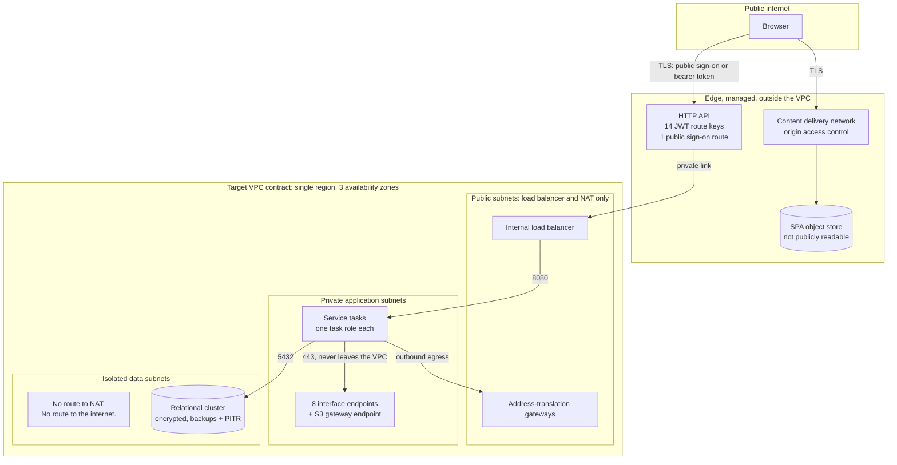

# Security and Identity

---

> **Purpose.** This document maps the CardDemo baseline's security posture onto the
> target's across five concerns: **identity**, the **authorization model**,
> **encryption** at rest and in transit, **data exposure and masking**, and
> **network isolation**. It records the one place in the entire migration where
> **functional parity is explicitly declined** — the plaintext password field — and
> it enumerates the authored controls and remaining delivery work behind *no secrets
> committed to the repository*, without treating ignore rules or absent values as an
> access-control boundary. It discharges the security-and-identity portion of
> **Deliverable 2** of the seven numbered
> deliverables — *"/docs/architecture — target architecture diagram, service
> catalog, and data-mapping (VSAM/Db2/IMS → AWS) tables"* — together with the
> security half of the cross-cutting requirement: *"encryption in transit and at
> rest, least-privilege IAM, no secrets in source"*.
>
> It is the **sixth** of the nine documents in this folder, and it is deliberately
> not the naming authority for anything. Service names, package roots, schema
> ownership and the column-by-column derivations belong to
> [`service-catalog.md`](service-catalog.md) and
> [`data-model-and-schema-mapping.md`](data-model-and-schema-mapping.md); this
> document cites both rather than restating either.
>
> **Source of truth.** Five bodies of baseline reference material, all read and
> none modified:
>
> * the security record [`app/cpy/CSUSR01Y.cpy`](../../app/cpy/CSUSR01Y.cpy) —
>   `01 SEC-USER-DATA` at L17, whose six fields include `SEC-USR-PWD PIC X(08)` at
>   **L21** and `SEC-USR-TYPE PIC X(01)` at L22;
> * the sign-on program [`app/cbl/COSGN00C.cbl`](../../app/cbl/COSGN00C.cbl) — the
>   `READ-USER-SEC-FILE` paragraph declared at L209, whose read-and-evaluate block
>   runs **L211–L256**, comparing at L223 and branching at L230–L240;
> * the shared session structure
>   [`app/cpy/COCOM01Y.cpy`](../../app/cpy/COCOM01Y.cpy) — `01 CARDDEMO-COMMAREA`
>   spanning **L19–L44**, carrying `CDEMO-USER-ID PIC X(08)` at L25 and
>   `CDEMO-USER-TYPE PIC X(01)` at L26 with its `'A'`/`'U'` condition names at
>   L27–L28;
> * the CICS resource definitions [`app/csd/CARDDEMO.CSD`](../../app/csd/CARDDEMO.CSD)
>   — a 505-line file whose **eight** `DEFINE FILE` stanzas occupy **L1–L99**;
> * the Db2 objects of the authorization extension —
>   [`AUTHFRDS.ddl`](../../app/app-authorization-ims-db2-mq/ddl/AUTHFRDS.ddl), the
>   fraud table keyed `PRIMARY KEY(CARD_NUM,AUTH_TS)` at L28, and
>   [`XAUTHFRD.ddl`](../../app/app-authorization-ims-db2-mq/ddl/XAUTHFRD.ddl), its
>   four-line unique index declaring `COPY YES` at **L4**.
>
> Three further baseline files are cited at specific lines where the argument needs
> them: [`app/cpy/CVACT02Y.cpy`](../../app/cpy/CVACT02Y.cpy) L7 for the card
> verification value, [`app/cpy/CVCUS01Y.cpy`](../../app/cpy/CVCUS01Y.cpy) L17–L18
> for the two national identifiers, and
> [`app/app-authorization-ims-db2-mq/cbl/COPAUA0C.cbl`](../../app/app-authorization-ims-db2-mq/cbl/COPAUA0C.cbl)
> L753–L754 for the identity context on the reply. The preserved mainframe security
> path is cited from [`samples/jcl/RACFCMDS.jcl`](../../samples/jcl/RACFCMDS.jcl).
>
> On the target side the source of truth is authored code rather than prose:
> [`role_credentials.py`](../../data-migration/src/carddemo_migration/role_credentials.py),
> the `aurora-postgresql`, `secrets`, `cognito`, `kms`, `ecs-service`, `alb` and
> edge modules under [`infra/modules`](../../infra/modules), the service
> configuration under [`services`](../../services), and the role and grant script
> [`data-migration/sql/V0__schemas_and_roles.sql`](../../data-migration/sql/V0__schemas_and_roles.sql).
> Every target claim below that can be checked against a file is cited to that
> file, so a reader can distinguish what is authored from what is intended.
>
> **Delivers, and who consumes it.** It delivers the baseline-to-target
> identity mapping, the user-type-to-group-to-authority chain, the RACF mapping
> rationale, the IAM and database-role boundaries, the encryption and key
> boundaries, the masking rules, and the network isolation model. Its declared
> consumers are
> [`docs/adr/ADR-008-security-and-identity.md`](../adr/ADR-008-security-and-identity.md),
> which records the
> decision this document describes the shape of; `MIGRATION_README.md` and
> `docs/runbooks/deploy.md`, which reference the credential and identity handling
> rather than re-deriving it; the future `SecurityConfig` class of each online
> service and the authored `JwtRoleConverter` of `common-lib`; and
> [`data-model-and-schema-mapping.md`](data-model-and-schema-mapping.md), which
> defers the cluster-level recoverability replacement to this document at its
> L508–L517.
>
> **Current state.** The ADR, migration guide, deployment runbook, service
> security configuration, JWT converter, and schema-mapping document are present.
> Their paths are links rather than future contracts.
>
> **Caveats, and one of them is load-bearing for every sentence here.** There is
> **no provisioned environment**. The infrastructure is authored and checked only
> to the extent its current state admits, and applying it to a live account is an
> operator action outside this scope. Consequently **no penetration test, security
> audit, compliance assessment or certification has been performed, and none is
> claimed anywhere in this document** — not for any regulatory standard, framework
> or control catalogue. The encryption and identity modules, the network resources,
> both environment compositions, the per-service security configurations and the
> shared card-number masker are authored; the API-boundary architecture rule, the
> response-serialization masking tests, the HTTP controllers and the
> sensitive-field encryption writer are not. Refactoring Rationale: this sentence
> previously listed masking, network resources and environment composition among
> the absences, which had stopped being true; a caveat that understates delivered
> controls misdirects a security reviewer exactly as badly as one that overstates
> them, so every item on both sides of the semicolon is now measured by the
> delivery-boundary block in
> [Reproducing the measurements in this document](#reproducing-the-measurements-in-this-document).
> The full set of boundaries is in
> [Caveats, boundaries and out-of-scope](#caveats-boundaries-and-out-of-scope), and
> reading that section is not optional for interpreting this one.

**Scope of this document is additive and reference-driven.** It never modifies the
COBOL baseline. `app/**` — programs, copybooks, BMS mapsets, JCL, the CICS resource
definitions and the seed data — is cited here by path and line and is read-only, as
are `tests/**`, `scripts/**` and `samples/**`. **`app/**` is untouched by this
migration**, and nothing below should be read as asserting otherwise: where the
baseline does one thing and the target does another, that is a decision taken in
the target and registered as a divergence, never a change made to the baseline.

**Exactly three pre-existing files may be modified by this migration** —
`README.md`, `CONTRIBUTING.md` and [`.gitignore`](../../.gitignore). None of the
three is this document. The ignore file reduces accidental staging of infrastructure
state and saved plans; it is a convenience control, not an access-control boundary,
and `git add -f` can override it.


## Design decisions

This section carries the reasoning for the choices this document makes **about
itself**. Decisions about the security architecture it describes are justified at
the point where each is stated, under the same four category names, spelled as
[`../CODE_DOCUMENTATION_STANDARD.md`](../CODE_DOCUMENTATION_STANDARD.md) L216–L262
fixes them: plural, unparenthesised, colon retained, no emphasis on the label
itself.

- Refactoring Rationale: this is the one document in the folder whose dominant
  category is `Refactoring Rationale` rather than `Assumptions`, and the reason is
  structural rather than stylistic. Every other document in this folder describes a
  target mechanism that *preserves* a baseline contract; this one describes the
  single mechanism that deliberately **does not** — credential handling. Rule 1
  defines that category as documenting *what was wrong with the old approach*, so
  the category the rule supplies is the category the content requires. The
  obligation it creates is stated in the next bullet, because it cuts the other way.
- Assumptions: naming what the baseline does is not the same as claiming it was
  changed, and this document keeps the two strictly apart. The baseline stores and
  compares an eight-character password field exactly as it always has; nothing in
  `app/**` is edited, and the words *fixed*, *corrected*, *patched* and
  *remediated* are therefore never applied to it anywhere below. What changed is
  the **target's** design decision. Stating this once, here, is what lets the rest
  of the document use precise language — "not carried forward", "declined parity" —
  without hedging every sentence.
- Trade-offs: the baseline's security posture is described **factually, with line
  citations, and never editorially**. CardDemo is a demonstration application, and
  its `RECOVERY(NONE)` and `JOURNAL(NO)` file attributes are a straightforward
  consequence of that. Naming the attribute and its line is sufficient to motivate
  the target's choice; characterising it as a deficiency would add nothing a reader
  cannot see and would misrepresent a working system that continues to run. The
  accepted cost is that a reader wanting a security judgement of the baseline will
  not find one here — this document states what each side does, and stops.
- Alternatives Considered: the target claims are cited to the **authored
  infrastructure inputs** rather than to the architecture narrative. Citing the
  narrative would have been shorter and would have let this document assert a
  four-key boundary, a two-role reporting split and a no-password seed path with no
  way for a reader to check any of the three. Citing
  [`kms/variables.tf`](../../infra/modules/kms/variables.tf),
  [`cognito/variables.tf`](../../infra/modules/cognito/variables.tf) and
  [`V0__schemas_and_roles.sql`](../../data-migration/sql/V0__schemas_and_roles.sql)
  means each claim fails visibly if the file changes underneath it.
- Assumptions: no value that is or resembles a credential appears anywhere in this
  document. There is no key identifier, account number, resource name, user pool
  identifier, registry hostname, example password or token — and, specifically, **no
  invented ARN**, because a plausible-looking one is indistinguishable from a real
  one to a scanner and teaches a reader to expect the pattern in prose. Where a
  value would otherwise appear, a placeholder in angle brackets stands in its
  place. Baseline literals that already exist in the reference source — dataset
  names, the `'A'` and `'U'` user-type codes, program and transaction names — are
  not credentials and are cited as written.
- Trade-offs: the database-role boundaries are given at the **granularity the
  script actually implements**, which in two places is narrower than the
  architecture summary. The batch role's write surface on the `account` schema is
  one named table, not the schema; and the reporting tier is two roles, not one.
  Reproducing the coarser summary would have read more consistently with the
  narrative and would have overstated the privilege each tier holds — an error in
  the dangerous direction for a document whose subject is least privilege. The cost
  is that this document and a one-line summary of it will differ, so the citation
  to the script is given every time the distinction matters.


## Identity: the one place parity is explicitly declined

Everywhere else in this migration, a difference in observable behaviour is either
absent or registered as a defect divergence. Identity is the exception: it is a
**deliberate behavioural change in the target**, decided on its merits rather than
inherited, and it is the only one of its kind.

### What the baseline does

The security record declares six fields, and the fourth of them holds the
credential in clear:

| Field | Picture | Line |
|---|---|---|
| `SEC-USR-ID` | `PIC X(08)` | [L18](../../app/cpy/CSUSR01Y.cpy) |
| `SEC-USR-FNAME` | `PIC X(20)` | L19 |
| `SEC-USR-LNAME` | `PIC X(20)` | L20 |
| **`SEC-USR-PWD`** | **`PIC X(08)`** | **L21** |
| `SEC-USR-TYPE` | `PIC X(01)` | L22 |
| `SEC-USR-FILLER` | `PIC X(23)` | L23 |

`SEC-USR-PWD PIC X(08)` is an eight-character alphanumeric field stored in plain
text in the `USRSEC` record. Sign-on reads that record and compares the entered
value against the stored value **directly**: within the `READ-USER-SEC-FILE`
paragraph, [`COSGN00C.cbl`](../../app/cbl/COSGN00C.cbl) issues an `EXEC CICS READ`
of the security dataset into `SEC-USER-DATA` at L211–L219, then evaluates the
response and, on a successful read, tests `IF SEC-USR-PWD = WS-USER-PWD` at
**L223**. There is no hash, no salt and no work factor in that comparison, because
there is nothing stored to compare against but the characters themselves. The whole
read-and-evaluate block runs **L211–L256**, and its three outcomes are the three
verbatim messages at L242, L249 and L254.

That is a factual description of the baseline, cited to its lines. It is not a
finding, and the file it describes is unchanged by this migration.

### What the target does

The password field is **not carried forward at all.**

There is no password column in the `auth` schema — not encrypted, not hashed, not
present. The authored migration
[`V1__auth.sql`](../../services/auth-service/src/main/resources/db/migration/V1__auth.sql)
creates `auth.users` with the fixed-width user identifier, given and family names,
the two-valued user type and a unique `cognito_sub`; it creates no credential
column. [`data-model-and-schema-mapping.md`](data-model-and-schema-mapping.md)
records the same non-carry-forward decision in its `auth` field table.

Credential storage and comparison leave the application, but the sign-on trust
boundary still includes `auth-service`. The browser sends the credential over TLS;
`auth-service` receives it transiently in the sign-on request and passes it to the
managed identity provider for verification. The service never persists the value
and has no code path that compares it with an application-owned record.

Assumptions: the transient value is request-scoped and is not copied into MDC,
structured logs, metrics, traces, exception messages, response objects or
diagnostic renderers. Authentication failures return stable message identifiers
rather than provider exception text. Java cannot guarantee immediate erasure of a
request `String`, so the control is to avoid copies, retain no reference after the
provider call and never expose heap dumps from the authentication task. This is a
memory-lifetime constraint, not a claim that the application never receives the
credential.

Seed identities are created **at provisioning time with generated credentials**,
and this is verifiable rather than asserted: the `seed_users` input at
[`infra/modules/cognito/variables.tf`](../../infra/modules/cognito/variables.tf)
L923 states in its own description that it *"Carries no password: main.tf generates
each initial credential during apply and stores it in Secrets Manager"*, and that
the baseline's own demo identities — defined by
[`app/jcl/DUSRSECJ.jcl`](../../app/jcl/DUSRSECJ.jcl) L35–L44 — are named there by
identifier and user type only. The consequence is the one that matters for the
repository: **at no point does a human type a credential into a file that could be
committed.**

> Refactoring Rationale: **parity is declined here, and declining it is the
> decision — not an omission, and not a change to the baseline.** Reproducing the
> baseline's scheme
> faithfully would mean carrying an eight-character cleartext credential into a
> relational column, where every backup, every exported query result and every
> `SELECT *` would disclose the full set. Preserving observable behaviour is this
> migration's governing constraint everywhere else; here the behaviour whose
> preservation is at stake is *storing and comparing cleartext*, and reproducing it
> in a new datastore would be a choice actively taken rather than a contract
> honoured. So the field is dropped from the model and verification is delegated.
> **The baseline is untouched: `SEC-USR-PWD` is still declared at
> [`CSUSR01Y.cpy`](../../app/cpy/CSUSR01Y.cpy) L21 and still compared at
> [`COSGN00C.cbl`](../../app/cbl/COSGN00C.cbl) L223, and the mainframe sign-on path
> works exactly as it always did.** This is a divergence in the target, registered
> with every other documented divergence in
> `docs/architecture/cobol-to-service-traceability.md`, which is the authoritative
> register for all of them.

Two consequences of the delegation are worth stating because a reader looking for
them in the schema will not find them there. Password policy — length, character
classes and temporary-credential validity — is a property of the user pool and is
configured through its module inputs rather than through application code or a
database constraint. Reset, lockout, expiry and repeated-failure handling are also
provider behaviours. Auth-service still owns the transient hand-off described
above; it does not own the verification rule or a stored verifier.

> Assumptions: **delegating verification makes the identity provider's behaviour an
> external contract this design depends on, and that dependency is real rather than
> nominal.** Four behaviours are assumed of the pool and implemented nowhere in this
> repository: credential verification, password policy enforcement, credential reset,
> and repeated-failure handling. The future auth-service implementation must still
> prove that its request path neither persists nor logs the credential and that it
> discards its reference after the provider call. If the pool were replaced by a
> provider that did not offer one of the four behaviours, the gap would surface as a
> missing control rather than as a database migration failure. The dependency is
> recorded here for exactly that reason: it is the class of assumption that is
> invisible in a schema diff.

### A note on the anonymised clone

[`app/cpy/UNUSED1Y.cpy`](../../app/cpy/UNUSED1Y.cpy) declares `01 UNUSED-DATA` with
six fields whose pictures are `X(08)`, `X(20)`, `X(20)`, `X(08)`, `X(01)` and
`X(23)` — field for field and width for width, the layout of `SEC-USER-DATA`. It is
an anonymised clone of the security record, and it is referenced by no program in
the repository. It **retires with no target at all**: it is one of only two baseline
items in the entire migration that map to nothing, and it is registered as such in
`docs/architecture/cobol-to-service-traceability.md`. It is recorded here because a
reader auditing credential handling will encounter a second structure holding a
password-shaped field and needs to know its disposition; that disposition is
"nothing consumes it, and nothing replaces it".


## The authorization model: user type, group, claim, authority

The baseline expresses authorization with a single character. The target expresses
the same two-valued distinction as a signed group claim converted into framework
authorities. The chain is one-to-one at every link:

| Baseline | Target |
|---|---|
| `SEC-USR-TYPE` value `'A'` ([`CSUSR01Y.cpy`](../../app/cpy/CSUSR01Y.cpy) L22) | group `carddemo-admin` |
| `SEC-USR-TYPE` value `'U'` | group `carddemo-user` |
| the type field **read from the security record** ([`COSGN00C.cbl`](../../app/cbl/COSGN00C.cbl) L227) | the **`cognito:groups` claim** in a validated token |
| conditional branching on the type field (`IF CDEMO-USRTYP-ADMIN`, [`COSGN00C.cbl`](../../app/cbl/COSGN00C.cbl) L230) | **Spring Security authorities**; the shared `JwtRoleConverter` is authored once and registered by each of the seven service `SecurityConfig` classes |

**The domain is closed at two values on both sides, and on the target side that
closure is enforced rather than assumed.** In the baseline it is closed by the two
condition names on the session field — `88 CDEMO-USRTYP-ADMIN VALUE 'A'` and
`88 CDEMO-USRTYP-USER VALUE 'U'` at
[`COCOM01Y.cpy`](../../app/cpy/COCOM01Y.cpy) L27–L28. In the target it is closed by
a validation rule on the `seed_users` input at
[`infra/modules/cognito/variables.tf`](../../infra/modules/cognito/variables.tf)
L945, which rejects any `user_type` that is not exactly `"A"` or `"U"`, cites those
two condition names as its authority, and records that exactly two groups are
created with **no third group and no fallback**. The database agrees: the `auth`
schema constrains `user_type` to the same two values, per
[`data-model-and-schema-mapping.md`](data-model-and-schema-mapping.md).

> Refactoring Rationale: **the client can no longer assert its own privilege
> level, and the mechanism — not the sentiment — is the reason.** The baseline is
> strictly pseudo-conversational: a CICS task ends at every screen turn, so all
> continuity between turns lives in one structure,
> [`app/cpy/COCOM01Y.cpy`](../../app/cpy/COCOM01Y.cpy) **L19–L44**, shared by all
> eighteen online programs. That structure carries `CDEMO-USER-ID PIC X(08)` at L25
> and `CDEMO-USER-TYPE PIC X(01)` at L26, and it is **storage the server hands to
> the terminal and receives back on the next turn**. Sign-on populates the type
> field once, at [`COSGN00C.cbl`](../../app/cbl/COSGN00C.cbl) L227, from the record
> it just read — but every subsequent turn takes the value from the returned
> structure, not from a fresh read of `USRSEC`. The field that decides
> administrative access therefore arrives from the client on every turn after the
> first, so a client that returned a modified structure would present a modified
> user type. In the target the client **cannot assert anything**: the group claim is
> **cryptographically signed by the issuer and validated on every single protected
> request**, and a modified claim fails signature verification before any handler runs. That is
> the specific difference — the value's provenance changes from *echoed back by the
> caller* to *signed by the issuer* — and it is why this mapping is a genuine change
> in the trust model rather than a change of transport.
> [`service-catalog.md`](service-catalog.md) reaches the same conclusion from the
> statelessness direction, in its
> [Why every context is stateless](service-catalog.md#why-every-context-is-stateless)
> section; this document is the one that states the authorization consequence.

### Where the decision is intended to be taken and enforced

The consequence for routing is precise: **administrative routes must be guarded by
the claim, never by a client-supplied field.** The admin-versus-user branch that the
sign-on program performs with `EXEC CICS XCTL` — to `COADM01C` at
[`COSGN00C.cbl`](../../app/cbl/COSGN00C.cbl) L231–L234 when
`CDEMO-USRTYP-ADMIN` holds, and to `COMEN01C` at L236–L239 otherwise — becomes two
separable things in the target, and separating them is the point:

* a **navigation decision** in the browser, taken from the group claim the client
  already holds, which selects the administrative or the general landing route; and
* an **authorization decision** on the server, taken independently from the same
  claim on every request to a protected endpoint.

> Assumptions: **the navigation decision is a convenience and carries no security
> weight, and the design depends on that separation holding.** A client that
> navigated to an administrative route without the administrative group would render
> a screen and then receive an authorization failure from every call that screen
> makes once the service filter chains exist, because each service will re-derive
> authority from the token independently. The
> alternative considered was to let the server drive navigation, mirroring `XCTL`
> more closely; it was rejected because it would reintroduce a server-held notion of
> "where this user is", which is the pseudo-conversational state the migration
> removes. The accepted cost is that an unauthorised route is reachable and empty
> rather than unreachable — a rendering difference, not a privilege difference.

The conversion logic is authored **once**, in
[`JwtRoleConverter.java`](../../services/common-lib/src/main/java/com/carddemo/common/security/JwtRoleConverter.java)
in `common-lib`, and is not copied per service. Its two group values are the fixed
contract names `carddemo-admin` and `carddemo-user`, matching the Cognito module.
Seven services — account, auth, authorization, card, reference, reporting and
transaction, every one but `batch-service`, which publishes no HTTP listener — now have
an authored `SecurityConfig` that imports the converter explicitly and registers it on a
resource-server filter chain, and those chains carry route rules that require the
administrative authority. The shared converter is a building block and the per-service
filter chain is what applies it; both halves are required, and neither on its own
establishes that a given route is authorized. What is still missing is the layer those
rules protect: no `*Controller.java` exists anywhere under `services/*/src/main/java`, so
no handler method is yet reached through a rule.
Refactoring Rationale: this paragraph previously reported that no service had a
`SecurityConfig` at all, which had stopped being true, and the correction has to keep
the two facts apart. A registered filter chain over an unauthored controller is a
delivered authorization mechanism with nothing behind it, which is a different — and
much narrower — gap than an unregistered converter.

> Alternatives Considered: **one converter in the shared kernel, rather than eight
> equivalent ones.** Each service could have mapped `cognito:groups` to authorities
> in its own `SecurityConfig`. That was rejected for a specific failure mode: eight
> independent implementations of the same mapping drift independently, and the drift
> is silent — a service whose converter used a different authority prefix or dropped
> an unrecognised group would disagree with sibling authorization rules. One
> converter makes the mapping a single reviewable artifact and makes an unrecognised
> group's treatment a single decision. The accepted cost is that a change to the
> mapping is a change to the shared kernel, so it rebuilds all eight services. Each
> online service's `SecurityConfig` imports this converter explicitly, because
> component scanning cannot be assumed across module package roots.


## RACF: a mapping, not a port

The baseline's external security manager **has no cloud analogue, and this document
does not pretend that it has one.** The target maps its role to **least-privilege IAM
task roles plus managed user-pool groups**, and **the substitution is documented as
a mapping rather than as a port.** The reusable modules author those building blocks
and both environment roots now compose them, so the mapping exists as code in the
repository; what it has never had is a provisioned account to take effect in.

The reason is structural, not preferential. RACF is a *single* external security
manager that mediates dataset access, transaction access and general resource
access for the whole system through one profile database, and the baseline's own
sample commands show both halves of that in four lines:
[`samples/jcl/RACFCMDS.jcl`](../../samples/jcl/RACFCMDS.jcl) alters a profile in the
CICS-transaction grouping class to admit a transaction at L24, and connects a user
to a group at L29. One manager, one command language, both the resource permission
and the group membership.

The target distributes those same effective boundaries across **three mechanisms that
do not share a policy language, an evaluation point or an administrative surface**:

| Concern | Baseline mechanism | Target mechanism |
|---|---|---|
| Which infrastructure resources a running component may touch | RACF profiles on datasets and resources | **IAM task role** per service, evaluated by the cloud control plane |
| Which application operations a signed-in person may perform | RACF group membership plus transaction-class profiles | **User-pool group claim** → framework authority, evaluated in the service |
| Which rows and columns a component may read or write | Dataset-level profile | **Database role** grants and revokes, evaluated by the database |

> Refactoring Rationale: **a rule-for-rule port was considered and rejected,
> because there is no target service that accepts a RACF profile.** The mapping is
> not lossy through carelessness; it is lossy because the mechanisms are **not
> isomorphic**. A single RACF profile can simultaneously express *which* users may
> reach a resource and *what* they may do to it, evaluated at one point. The target
> reaches the same effective boundary only by composing three independent decisions
> — a task role, a group claim and a database grant — evaluated at three points by
> three engines. There is no transformation that turns one profile into that triple
> mechanically, and any attempt to write one would produce a mapping table that
> looked authoritative while being unverifiable in either direction. **This document
> therefore maps effective privilege boundaries, not rules**: for each thing the
> baseline could do or was prevented from doing, it names the target mechanism that
> preserves the boundary. The accepted cost is that no line-by-line RACF
> correspondence exists to audit against, which is why the target-side boundaries
> below are each cited to the file that implements them instead.

> Assumptions: **RACF is not retired by this migration and is not described as
> superseded.** The mainframe security path continues to exist and to work — the
> sample commands, the CICS resource definitions and the baseline sign-on are all
> unchanged reference material. **The migration adds a path; it does not remove
> one.** The mapping above describes what fills RACF's role *in the target*, on the
> assumption that a component running there cannot reach a mainframe security
> manager at all, which is the same "no manual mainframe dependency" constraint that
> governs every other part of this migration.


## IAM and database-role boundaries

Least privilege is expressed at two independent layers, and a component must clear
both to reach data. The infrastructure layer decides which cloud resources a task
may call; the database layer decides which rows a connection may read or write.
Neither layer trusts the other. The reusable ECS module and the SQL role script
author those two layers, and both `infra/envs/dev` and `infra/envs/prod` instantiate the
ECS cluster and service modules for every workload; what separates this section from a
running service is therefore an apply against an account, not an unwritten composition —
a composed root describes an intended stack and only an applied one describes a running
task.

**Every name below is a placeholder.** No resource identifier, account number or
ARN appears in this document, for the reason given under Design decisions: a
plausible-looking identifier in prose is indistinguishable from a real one and
trains a reader to expect the pattern. Where an identifier would appear, the shape
is written as `<service>-task-role-<env>` and the concrete value is a property of an
apply, not of this document.

### One task role per service

Each instantiation of
[`infra/modules/ecs-service`](../../infra/modules/ecs-service) creates **its own task
role**, intended to be instantiated once for each of the eight services and granted
only what that service needs. No environment root instantiates it yet, so the
following is the authored per-instance policy shape, not a claim about deployed
roles:

| Grant | Scoped to |
|---|---|
| Read one secret | **that service's** database credential entry only |
| Use a queue | only the exact queue ARNs that service produces to or consumes from — authorization, account and reference participate, so for **five of the eight** target services this set is empty |
| Write logs | that service's own log group |
| Read or write objects | that service's own prefix within the dataset bucket, not the bucket |
| Decrypt | the customer-managed key covering the data class it touches, per the four-key split below |

> Trade-offs: **per-service roles rather than one shared task role.** A single role
> covering all eight services would be one artifact to review instead of eight, and
> it would make an added service a no-op change. It was rejected because it collapses
> the blast radius of a compromise from one service to all eight: a container
> escaping in the reporting tier would inherit the authorization tier's queue
> permissions and the batch tier's secret. The accepted cost is real — eight roles
> and eight policy documents to keep correct, and a service that gains a dependency
> needs its role amended before it works — and it is paid deliberately, because a
> permission that has to be added to be used is a permission whose absence is
> visible in a failing deployment rather than invisible in an over-broad grant.

### Database roles, at the granularity the script implements

The role and grant surface is authored in
[`data-migration/sql/V0__schemas_and_roles.sql`](../../data-migration/sql/V0__schemas_and_roles.sql),
and it is that file — not a summary of it — that this section reports. Two tiers
differ from the coarse description, both in the narrower direction.

**The batch tier's cross-schema write surface is one named table, not a schema.**
`batch-service` is the one deliberate departure from database-per-service ownership,
because transaction posting commits three writes as a single unit of work across two
schemas; [`service-catalog.md`](service-catalog.md#the-exception-batch-service-cross-schema-write-grants)
holds that decision and its rejected saga alternative, and
[`data-model-and-schema-mapping.md`](data-model-and-schema-mapping.md) holds the
tables. What belongs here is the **actual privilege**, which is narrower than
"`ledger.*` and `account.*`":

| Schema | Privilege held by the batch role | Line |
|---|---|---|
| `ledger` | `SELECT`, `INSERT`, `UPDATE` on all tables, plus sequence usage | L691–L692 |
| `account` | `SELECT` on all tables; `UPDATE` **revoked** schema-wide, then re-granted on **`account.accounts` alone** | L742, L744, L755 |
| `card` | `SELECT` only | L782 |
| `reference` | `SELECT` only | L791 |

> Assumptions: **the revoke-then-narrow sequence is the mechanism, and reading it
> as redundant would be a mistake.** The script revokes `UPDATE` across the whole
> `account` schema at L742 *before* granting it on one table at L755, and the second
> statement is guarded so it applies only once that table exists. The reason the
> revoke is there at all is that a default-privilege entry or an earlier schema-wide
> grant is **not** superseded by a narrower later grant — the two are additive — so
> the broad form has to be withdrawn explicitly for the narrow one to be the whole
> privilege. A reader auditing least privilege needs to see both statements to
> conclude anything about the resulting surface; either one alone is misleading.

**The reporting tier is two roles, and the service's own role cannot reach a base
table.** The description "a `SELECT`-only role over read-only cross-schema views"
is accurate but incomplete, and the missing half is the part that carries the
isolation:

| Role | Holds | Line |
|---|---|---|
| `carddemo_reporting_owner` — no login, owns the views | `USAGE` and `SELECT` on `ledger`, `account`, `card`, `reference` | L841–L861 |
| `carddemo_reporting` — the role the service actually connects as | `USAGE` and `SELECT` on the `reporting` schema **only**; explicitly **revoked ALL** on `ledger`, `account`, `card` and `reference`; **revoked `CREATE`** on its own schema | L910–L915, L917, L927, L939 |

> Refactoring Rationale: **splitting owner from consumer, rather than letting the
> reporting service hold the base-table grants directly.** The single-role form is
> simpler and was the obvious first shape, and it has a specific defect: a role that
> can select from the base tables can select from them *directly*, so the views stop
> being a boundary and become a convenience. Any column a view was written to
> exclude — an encrypted identifier, a full account number — is then reachable by a
> query that does not use the view, and no grant prevents it. Separating the two
> means the base-table grants live on a role that **cannot log in**, so the only path
> from the reporting service to base-table data is through a view somebody wrote. The
> `reporting` schema holds **no tables of its own**, as
> [`data-model-and-schema-mapping.md`](data-model-and-schema-mapping.md#reporting--reporting-service-a-schema-with-no-tables)
> records. The accepted cost is a second role to provision and a view to add whenever
> reporting needs a new column.

One further hardening statement applies to the cluster rather than to a role:
`REVOKE CREATE ON SCHEMA public FROM PUBLIC` at L594, which removes the default
ability of any connected role to create objects in the public schema.

**How a role acquires the credential it authenticates with.** The script creates every
service role with `LOGIN` and **no password clause**, so nothing it leaves behind can
authenticate — that absence is what lets the file carry no credential material at all.
The credential is supplied by the step that runs immediately after it,
[`credentials.py`](../../data-migration/src/carddemo_migration/credentials.py), invoked as
`python -m carddemo_migration.credentials`. It connects as the cluster master credential
RDS generated, reads the entry `infra/modules/secrets` wrote for each role, and stores
that role's password. The ordering is not optional: the roles must exist before a
credential can be applied to one, and the services must be able to authenticate before
any of them starts.

> Assumptions: **the step derives a SCRAM-SHA-256 verifier locally and applies that,
> never the password.** PostgreSQL accepts no bind parameter in `ALTER ROLE ... PASSWORD`,
> so a password applied directly has to be interpolated into statement text — which is how
> a credential reaches a server log under `log_statement`, a client history file, or an
> error message quoting the failing statement. What crosses the connection instead is a
> salted, iterated hash the server stores verbatim, and a leaked verifier cannot be
> replayed as a password because deriving the client key from the stored key would require
> inverting SHA-256. The password itself never leaves the step's own process.

> Refactoring Rationale: **this replaces a mechanism that was named and did not exist.**
> The script, and the two rotation inputs on `infra/modules/secrets`, previously described
> a Secrets Manager rotation function as what applied each credential for the first time.
> Both of those inputs default to null, no rotation function is in scope in this migration,
> and the rotation functions AWS publishes for PostgreSQL cannot perform a first
> application in any case — single-user rotation authenticates with the credential it is
> replacing, and these roles have none. The consequence was a stack that provisioned
> successfully and could not start a single service. The step above is delivered, and it
> **verifies its own outcome**: it exits non-zero unless every role holds a SCRAM verifier
> *and* completes a real TLS login as that role, so a deployment cannot report success
> while a service still cannot reach its schema. Those two rotation inputs configure
> scheduled rotation and nothing else.

### The batch orchestration's execution role

Two different classes of database credential exist, with one authority for each.
For the cluster **master** credential, the Aurora module configures RDS as the sole
authority because
[`aurora-postgresql/main.tf`](../../infra/modules/aurora-postgresql/main.tf) sets
`manage_master_user_password = true`; the only reference published for it is
`module.aurora.master_user_secret_arn`. The secrets module no longer creates a
second `database_master` secret, and its former master ARN, name and username
outputs are removed. This eliminates the previous failure mode in which two
plausible secret entries existed but only the RDS-managed one could open the
cluster once the module is instantiated.

The eight ordinary service login roles are different: RDS does not manage their
credentials. [`infra/modules/secrets/main.tf`](../../infra/modules/secrets/main.tf)
authors one generated secret per service role, while
[`V0__schemas_and_roles.sql`](../../data-migration/sql/V0__schemas_and_roles.sql)
creates those roles without a password because the roles must exist before a
credential can be applied. The required order is therefore explicit:

1. create the cluster and the eight per-service secret entries;
2. run V0 to create the eight `LOGIN` roles;
3. connect as the RDS master over a verified TLS connection and call
   `carddemo_migration.role_credentials.bootstrap_role_credentials`;
4. let that function derive each SCRAM-SHA-256 verifier client-side, apply all
   eight in one transaction and call `verify_role_credentials`, which **raises**
   if any role still has no stored credential.

Only the verifier crosses the database connection; the plaintext values are read
from the secret store into the bootstrap process, held in memory for the call and
never sent as SQL text. V0's post-create notice names both the bootstrap entry point
and the failing verifier so an operator is not left with a report-only query or a
manual `ALTER ROLE` instruction.

> **Measured delivery status.** The Python bootstrap and its failing verification are
> authored in
> [`role_credentials.py`](../../data-migration/src/carddemo_migration/role_credentials.py).
> Each environment root now composes the *first* half of the ordering: a
> `database_admin` Lambda packaged with `V0__schemas_and_roles.sql`, invoked by
> `aws_lambda_invocation.database_bootstrap`, which the `secrets` module then
> `depends_on` — so V0 runs before any credential is generated. The *second* half is
> still absent: neither root, nor any Fargate task, nor any workflow calls
> `bootstrap_role_credentials` or `verify_role_credentials`, and no Terraform variable
> selects a credential-application mechanism. The eight service roles are therefore
> created without a stored credential, and closing that gap requires a step that runs
> the Python entry point after V0 and before any service starts and treats an
> exception from `verify_role_credentials` as a deployment failure.
>
> Refactoring Rationale: this paragraph previously rested the ordering guarantee on a
> `service_credential_application` input of the `secrets` module, and that input no
> longer exists anywhere in `infra/**` — the design moved to the Lambda invocation
> named above. A guarantee attributed to a deleted variable reads as delivered while
> being unimplementable, which is worse than the plain statement that half the
> ordering is composed and half is not.

### The batch orchestration's execution role for the state machine

The state machine holds an execution role scoped to **the specific task definitions
it launches**, together with the permissions it needs to observe a task to completion
and to pass the task and execution roles to the tasks it starts. It must not receive
a wildcard over task definitions. That role is authored:
[`infra/modules/step-functions-batch/main.tf`](../../infra/modules/step-functions-batch/main.tf)
declares `aws_iam_role.this` alongside two state machines — `aws_sfn_state_machine.daily`
for the nightly chain and `aws_sfn_state_machine.adhoc` for on-demand reports — and their
two encrypted log groups, `aws_cloudwatch_log_group.daily` and
`aws_cloudwatch_log_group.adhoc`; each environment root passes the individual
`ecs_service` task-definition ARNs in rather than a wildcard. The state-by-state contract
belongs to
[`batch-orchestration.md`](batch-orchestration.md).

Refactoring Rationale: this section previously reported that the module held
variables and provider constraints but no resource graph. That is measurably no
longer true, and the direction of the error matters here: understating an IAM
resource as unauthored invites a reviewer to skip the one artifact whose scoping is
the whole point of the section.

### Deployment identity

The deployment workflow authenticates by **short-lived federated role assumption**:
it exchanges a workload identity token for temporary credentials scoped to a
deployment role rather than storing an access key.
[`.github/workflows/deploy.yml`](../../.github/workflows/deploy.yml) is authored and
implements exactly that — it grants `id-token: write`, calls the official
`aws-actions/configure-aws-credentials` action pinned to a commit SHA, and passes a
`role-to-assume` supplied as repository configuration rather than as a secret. The
repository still contains no deployment access key, and that remains a measured
repository state rather than the proof; the proof is the workflow's own token
exchange.

The trust relationship is split across the boundary of this repository and both halves
should be read together. The identity provider is authored here:
[`infra/bootstrap/main.tf`](../../infra/bootstrap/main.tf) declares
`aws_iam_openid_connect_provider.github_actions`, so the federation itself is
infrastructure as code. The deployment ROLE is not — no `aws_iam_role` is declared
anywhere in `infra/bootstrap`, and the workflow reads its ARN from a repository
variable — so the role's trust policy and its permission boundary remain an operator
obligation that this document records rather than a control this tree delivers.


## Encryption at rest and in transit

### The baseline attributes this answers

Every one of the **eight** `DEFINE FILE` stanzas in
[`app/csd/CARDDEMO.CSD`](../../app/csd/CARDDEMO.CSD) carries both `JOURNAL(NO)` and
`RECOVERY(NONE)`. The two attributes appear as a pair in each stanza, and the count
of each across the file is exactly eight:

| Stanza | Line | `JOURNAL(NO)` | `RECOVERY(NONE)` |
|---|---|---|---|
| `ACCTDAT` | L1 | L7 | L9 |
| `CARDAIX` | L13 | L19 | L21 |
| `CARDDAT` | L25 | L31 | L33 |
| `CCXREF` | L37 | L44 | L46 |
| `CUSTDAT` | L50 | L57 | L59 |
| `CXACAIX` | L63 | L70 | L72 |
| `TRANSACT` | L76 | L82 | L84 |
| `USRSEC` | L88 | L94 | L96 |

The eight stanzas occupy **L1–L99** of the 505-line file; the first `DEFINE MAPSET`
stanza begins at L100. `RECOVERY(NONE)` declares that CICS keeps no log of changes
to the file for backout, and `JOURNAL(NO)` that no journal records are written.
Neither attribute concerns encryption, and neither is presented here as a
deficiency: CardDemo is a demonstration application and these are the settings a
demonstration file definition would reasonably carry. They are cited because they
establish what the baseline's file resources do and do not provide, which is what
the target's encryption and backup configuration is measured against rather than
assumed to improve upon.

> Assumptions: **"no recovery anywhere in the baseline" is a reading this document
> explicitly corrects, and the correction matters.** The eight-of-eight count above
> is true of the **VSAM file resources** defined in the base CICS definition. It is
> **not** true of the baseline as a whole, because the Db2 tier of the authorization
> extension does enable image copy:
> [`XAUTHFRD.ddl`](../../app/app-authorization-ims-db2-mq/ddl/XAUTHFRD.ddl) declares
> its unique index over `(CARD_NUM ASC, AUTH_TS DESC)` with **`COPY YES`** at
> **L4** — an attribute that makes the index eligible for image copy, and therefore
> recoverable rather than only rebuildable. Stating the VSAM figure without this
> reconciliation would overstate the contrast by generalising a measurement of one
> storage tier to a system that has two. The `COPY YES` attribute has no PostgreSQL
> index-level equivalent, so it cannot be carried across as written;
> [`data-model-and-schema-mapping.md`](data-model-and-schema-mapping.md) records it
> at its L508–L517 as a **dropped attribute with a named replacement** and delegates
> the replacement to this document. The replacement is configured immediately below
> at the cluster level: **encrypted automated backups and point-in-time recovery on
> the relational cluster**. The Aurora module authors those settings and both
> environment roots instantiate the cluster, so the guarantee is a composed
> configuration; whether it is a deployed property depends on an apply, which is an
> operator action outside this repository's scope. It is not an index option, which is
> why it is named in both documents rather than beside the index definition.

### At rest: four keys, one per data class

The KMS module authors **four customer-managed keys with rotation enabled**, one each
for the **relational cluster**, the **object store**, the **secret store** and the
**queues**. No environment root instantiates the module, so none is provisioned by
this repository state. The intended split is nevertheless concrete in the reusable
module: its input surface declares four independent key-user lists —
[`infra/modules/kms/variables.tf`](../../infra/modules/kms/variables.tf) L349, L363,
L392 and L406 — alongside `enable_key_rotation` at L171 and a deletion window at
L216, so each key's set of authorised principals is configured separately from the
other three.

> Trade-offs: **four keys rather than one, and the reason is the shape of a key
> policy rather than a preference for more keys.** A single key covering all four
> data classes is cheaper, simpler to provision and simpler to grant. It was
> rejected because a key policy is the unit at which access to encrypted data is
> granted and revoked: with one key, every principal that can decrypt anything can
> decrypt everything, and a policy amendment made to admit a new consumer of one
> data class silently widens access to the other three. With four, a policy change
> or a key compromise is **scoped to one data class** — the queue key does not open
> the database, and the object-store key does not open the secret store. The
> accepted costs are named rather than glossed: four keys carry four times the
> monthly key charge and four rotation schedules to observe, and a component that
> legitimately spans two data classes must be granted use of both keys explicitly,
> which is an extra step at provisioning time and a failure that surfaces as an
> access-denied error rather than as a silent success.

The Aurora module additionally configures **encrypted automated backups and
point-in-time recovery**, which is the replacement named in the reconciliation
above. As with the KMS module, this is an authored resource graph rather than a
deployed cluster: both environment roots instantiate it, so what stands between the
configuration and a running cluster is an apply against an account.

### In transit: target contract and measured wiring

Encryption in transit is an end-to-end contract, and every hop of it is now authored
and composed in both environment roots. Enumerating the required mechanism beside the
artifact that carries it is still the point of the table: it keeps a setting in one
layer from being read as proof about the next, and it keeps "authored" from being read
as "provisioned".

| Hop | Required mechanism | Measured wiring |
|---|---|---|
| Browser → content delivery network / HTTP API edge | Edge-managed TLS; plaintext viewer requests redirect to HTTPS | `cloudfront-spa` sets `viewer_protocol_policy = "redirect-to-https"`; the HTTP API carries a Cognito `jwt_configuration`. Both roots instantiate both modules |
| Edge → internal load balancer over the private link | API integration `tls_config` verifies the server name; ALB exposes one HTTPS listener with an ACM certificate | `api-gateway-http` declares `aws_apigatewayv2_vpc_link` plus `tls_config.server_name_to_verify`; `alb` declares one HTTPS listener with `certificate_arn` and `ssl_policy`. Each root passes `alb_listener_arn` and `integration_tls_server_name` across the boundary |
| Load balancer → online service task | Target group and health check use HTTPS; the task terminates TLS on port `8080` | `ecs-service` fixes `target_protocol = "HTTPS"` for both the target group and its health check; task-side `server.ssl` is configured in all seven HTTP services. `batch-service` has none by design — it publishes no HTTP listener |
| Service task → relational cluster | Aurora refuses plaintext; every JDBC client uses `sslmode=verify-full` and an explicit trust root | The Aurora cluster parameter group sets `rds.force_ssl = "1"`; all **eight** service configurations set `sslmode: verify-full` together with `sslrootcert` as Hikari data-source properties |
| Service task → managed AWS API | HTTPS through an interface or gateway endpoint inside the VPC | `network` declares `aws_vpc_endpoint.interface` for the interface set and `aws_vpc_endpoint.s3` for the gateway endpoint, and both roots instantiate the module |

The load-balancer-to-task row is fail-closed by construction: because the target group
and its health check both speak HTTPS, a task serving cleartext would never become
healthy, so the two halves cannot be enabled independently. The delivery path for the
material that makes a task speak HTTPS is composed across three files, and each half is
worth naming because removing any one of them would break the hop silently. Each online
service's `application.yml` reads its PEM pair from `${CARDDEMO_SERVER_TLS_CERTIFICATE}`
and `${CARDDEMO_SERVER_TLS_PRIVATE_KEY}` under `server.ssl`;
[`infra/modules/ecs-service/main.tf`](../../infra/modules/ecs-service/main.tf) lists both
names in its per-service `required_secret_environment_names`, so a task definition
missing either one fails validation rather than starting without TLS; and each
environment root binds those two names to the Secrets Manager entries the `secrets`
module owns, through a `tls_secret_sources` local that is merged into every online
workload's `secret_arns`. The material therefore reaches the task as a secret reference
rather than as an environment variable, and neither property carries a fallback, so an
absent certificate stops startup instead of silently serving cleartext.

Two boundaries survive the correction and are the honest remainder. First, **nothing
here is provisioned** — every statement in the table is a measurement of authored
Terraform and authored service configuration, not of a running system, and the
deployment boundary in
[Caveats, boundaries and out-of-scope](#caveats-boundaries-and-out-of-scope) governs
it. Second, the **default trust anchor is private**: when a root is applied without
`alb_certificate_arn`, `service_tls_certificate` and `service_tls_private_key`, it
generates a `tls_self_signed_cert` for the internal service name and imports it into
ACM, so the verified server name holds but the chain is self-signed. An operator
supplying a real ACM certificate and matching PEM pair overrides all three.

Refactoring Rationale: this section previously reported that no root composed the
edge modules, that `account-service` and `authorization-service` had no
`application.yml` at all, and that `reporting-service` lacked verified JDBC client
properties. All three had stopped being true, and the JDBC row was wrong for a
subtler reason worth recording: the property is written as the Hikari data-source
**key** `sslmode: verify-full`, not as a `sslmode=verify-full` query parameter on the
JDBC URL, so a search for the query form finds nothing in a tree where all eight
services set it. A status table that understates delivered encryption is not the safe
direction of error — it invites re-implementing a control that exists and diverging
from it.


## Data exposure and masking

Five data elements carry disclosure rules. The rules are stated here as the target
contract; the column types that back them are derived in
[`data-model-and-schema-mapping.md`](data-model-and-schema-mapping.md) and are cited
rather than restated.

| Data element | Baseline declaration | Target disclosure contract |
|---|---|---|
| Primary account number | `CARD-NUM PIC X(16)`, [`CVACT02Y.cpy`](../../app/cpy/CVACT02Y.cpy) L5 | Masked to the **last four digits** in every response **except** the administrative card-detail endpoint |
| Card verification value | `CARD-CVV-CD PIC 9(03)`, [`CVACT02Y.cpy`](../../app/cpy/CVACT02Y.cpy) L7 | **Never returned by any endpoint**; stored encrypted as binary (`cvv_encrypted BYTEA`) |
| National identifier | `CUST-SSN PIC 9(09)`, [`CVCUS01Y.cpy`](../../app/cpy/CVCUS01Y.cpy) L17 | Stored encrypted (`ssn_encrypted BYTEA`); returned **masked** |
| Government-issued identifier | `CUST-GOVT-ISSUED-ID PIC X(20)`, [`CVCUS01Y.cpy`](../../app/cpy/CVCUS01Y.cpy) L18 | Stored encrypted (`govt_issued_id_encrypted BYTEA`); returned **masked** |
| Password | `SEC-USR-PWD PIC X(08)`, [`CSUSR01Y.cpy`](../../app/cpy/CSUSR01Y.cpy) L21 | **Does not exist in the target data model** — see [Identity](#identity-the-one-place-parity-is-explicitly-declined) |

The card verification value is the strictest of the five. The card DDL reserves a
`BYTEA` column named `cvv_encrypted` rather than a three-digit integer, so the schema
can hold ciphertext without coercion. No class under `services/*/src/main/java`
references that column, or `ssn_encrypted`, or `govt_issued_id_encrypted`, so no
writer or encryption mapper is authored; the column name and type do not by themselves
encrypt anything. The absence is measurable rather than assumed: the only JPA attribute
converters authored anywhere in the tree are the two `MoneyAmountConverter` declarations
in `reporting-service`, on `ReportTransactionView` and `StatementTransactionView`, and
both convert money rather than ciphertext. The target writer must encrypt before
persistence so that a
`SELECT *` exposes ciphertext rather than the original three digits.

> **Required enforcement: the boundary must constrain API → persistence
> dependencies, not the unrelated reverse direction.** A rule that prevents a
> `domain` package from importing a web type does **not** stop a controller from
> importing and returning an entity. The enforceable target contract is that classes
> in `..api..` or `..controller..` may not depend on `..domain..`,
> `..repository..` or a JPA entity type; they may return only response DTOs produced
> by a mapper or service boundary. That is the dependency direction which closes the
> direct-entity serialization path.
>
> The architecture rule is necessary and insufficient on its own, because a mapper
> can still copy the wrong field. Response-serialization tests must use the
> production object mapper and prove all four disclosure outcomes: ordinary card
> responses contain only the masked last four digits; the administrative card-detail
> response may contain the full account number but never a CVV property or value;
> customer responses contain neither the raw national identifier nor the raw
> government-issued identifier; and every masked representation survives JSON
> serialization without exposing the source value. Controller/security tests must
> separately prove that the full-number endpoint requires the administrative
> authority.
>
> **Measured delivery status,** stated as two lists because the gap is now specific
> rather than total. **Authored:** the shared masker
> [`CardNumberMasker.java`](../../services/common-lib/src/main/java/com/carddemo/common/security/CardNumberMasker.java)
> renders a number at its own width with only the last four digits surviving, and it
> is the single implementation every masking site delegates to; `CardNumberMaskerTest`
> covers it directly, and `GlobalExceptionHandlerPathMaskingTest` and
> `DiagnosticRenderingTest` cover two of the sites that call it. Seven services carry
> a `SecurityConfig` whose filter chain registers `JwtRoleConverter` and whose route
> rules require the administrative authority.
> [`LayeringRulesTest.java`](../../services/common-lib/src/test/java/com/carddemo/common/architecture/LayeringRulesTest.java)
> **is** an executable ArchUnit rule class: eight tests, executed nine times in a full
> reactor build — once in each of the eight service modules through the
> `architecture-rules` execution declared in
> [`services/pom.xml`](../../services/pom.xml), and once more in `common-lib` itself
> through that module's own test run, which is the only pass that checks the shared
> kernel. Four of the eight are the boundaries themselves — a domain type may not reach
> a framework or infrastructure type, no context may reach another context's domain
> package, no money value may be declared as a binary floating-point type, and a
> security chain must render its refusals — and the other four are anti-vacuity guards
> that fail if the imported graph is empty, if the ownership contract stops being
> exactly nine fixed roots, if a prohibition list no longer matches the constructs it
> names, or if the money rule stops rejecting a planted violation. The reactor carries
> 82 test classes in total. **Not authored:** no `*Controller.java` exists anywhere under
> `services/*/src/main/java`, so there is no HTTP response to mask yet; `card-service`'s
> `mapper` package holds only a `package-info.java` and `account-service` has no `mapper`
> package at all, so neither has a response mapper; `LayeringRulesTest` holds no
> `..api..` → `..domain..` or `..repository..` rule, so the specific boundary this
> section requires is the one ArchUnit rule that is missing; no test serializes a card or
> customer response through the production object mapper to prove the four disclosure
> outcomes; and no class under `services/*/src/main/java` writes `cvv_encrypted`,
> `ssn_encrypted` or `govt_issued_id_encrypted`. The table above therefore remains the
> required disclosure contract rather than a claim that masking is enforced end to end —
> but the reason is now the missing controller and boundary rule, not a missing masker.
>
> Refactoring Rationale: the previous wording called `LayeringRulesTest` "package
> prose" and reported the authored Java tests as covering only the authorization CSV
> codec and timestamp formatting. Both were measurably false, and in a security
> document the cost of understating a control is concrete: a reader who believes no
> masker exists writes a second one, and two renderings of one masked value are worse
> than either alone. Assumptions: the two counts above are re-measured rather than
> carried forward — eight `@Test` methods in that one class, and 82 classes matching the
> two runner suffixes across `services/*/src/test/java` — because a count of tests is the
> first sentence in a security document to go stale and the last one a reader checks.
> [`data-model-and-schema-mapping.md`](data-model-and-schema-mapping.md) records the
> same account-number rule at the schema-to-API boundary.

> Trade-offs: **the target administrative card-detail endpoint is a deliberate,
> single-point exemption.** Masking the account number on that endpoint too would
> make the rule uniform and unarguable, and it would also make the administrative
> screen unable to display the record it exists to display. The exemption is
> therefore accepted in the contract and must be bounded three ways: it is one
> endpoint, it requires the administrative group claim, and it does **not** extend to
> the card verification value. The alternative of a general "unmask" parameter on
> ordinary endpoints was rejected because a parameter that widens disclosure is
> reachable from any caller that guesses it, whereas a separate endpoint can carry
> its own authorization rule. Two of the three bounds are now authored:
> `card-service`'s `SecurityConfig` declares `ADMIN_CARD_PATH_PATTERN` as
> `/api/v1/admin/cards/*` and binds it to the administrative authority alone, and the
> contract's `AdminCardDetail` schema — returned by `getAdminCardDetail` on
> `/api/v1/admin/cards/{cardNumber}` — extends `CardDetail` with the full number and no
> card verification value. The third — that a handler actually returns that schema — has
> nothing behind it yet, because no controller is authored, so the exemption is a bounded
> rule guarding an unimplemented route rather than a measured control over live data.
> Refactoring Rationale: an intermediate revision of this paragraph spelled the
> administrative route as an `/unmasked` suffix inside the card subtree, and the
> `SecurityConfig` records why that spelling was withdrawn: under it the administrative
> path was also matched by `CARD_SUBTREE_PATH_PATTERN`, so one route answered to two
> rules. The prefix form is the one in the tree, and citing the withdrawn form would send
> a reader looking for a pattern no class declares.


## Network isolation

The target topology is **single-region and three-availability-zone**, with three
subnet tiers, and it is authored:
[`infra/modules/network/main.tf`](../../infra/modules/network/main.tf) declares
`aws_subnet.public`, `aws_subnet.private_app` and `aws_subnet.isolated_data`,
`aws_nat_gateway.this` for address-translation egress, `aws_vpc_endpoint.interface`
over the eight-service default set (`ecr.api`, `ecr.dkr`, `logs`, `secretsmanager`,
`kms`, `sqs`, `states`, `ssm`), `aws_vpc_endpoint.s3` for the object-store gateway
endpoint, and the three security groups `alb`, `app` and `data`. Both environment
roots instantiate the module. What remains true is only the deployment boundary: these
are declared resources, not provisioned ones.

Refactoring Rationale: this paragraph previously stated that the module contained no
`main.tf` and that neither root composed one, and cited the variables file's header as
the whole of the contract. Both halves are measurably false now, and the citation
pointed a reader at an input surface instead of at the resource graph that answers the
question.



### The target three tiers

* **Public subnets** will carry **only** the internal load balancer and the
  address-translation gateways. No service task and no database runs here.
* **Private application subnets** will carry the container tasks. They reach the internet
  for outbound needs through the address-translation gateways, and they reach managed
  AWS APIs without doing so, through the endpoints below.
* **Isolated data subnets** will carry the relational cluster and **have no internet route
  at all** — no address-translation route, no gateway route, nothing.

> Refactoring Rationale: **an isolated data tier with no route, rather than a
> private tier restricted by security groups.** A tier whose subnets have a route to
> the address-translation gateways and whose exposure is limited only by security
> groups is one rule-set edit away from having outbound reachability, and that edit
> is a small, plausible-looking diff. Removing the **route** removes the capability
> rather than restricting its use: with no route in the table, **an application-tier
> compromise cannot exfiltrate data directly from the data tier over the internet
> regardless of how the security groups are configured**, because there is no path
> for a packet to take. This is the strongest blast-radius control available at the
> network layer once implemented, and it is strong precisely because it does not
> depend on a rule remaining correct. The accepted cost is operational and real:
> anything the data
> tier would otherwise fetch from the internet — an extension downloaded on demand,
> an outbound webhook — is simply not possible, so any such need has to be met from
> inside the network or not at all.

### Target endpoints: AWS API traffic stays inside the network

Eight **interface endpoints** are provisioned from a fixed, validated inventory rather
than from a free-form caller list: the `interface_endpoint_services` input exists, but
its validation admits only the architecture's exact eight services, so a root may
neither shorten nor extend the set. The all-or-none endpoint contract and the reason
for it are recorded at
[`infra/modules/network/variables.tf`](../../infra/modules/network/variables.tf)
L327–L384:

| Endpoint | Why it exists |
|---|---|
| `ecr.api` | Authorises an image pull |
| `ecr.dkr` | Transfers the image layers — omitting either one leaves a task unable to start |
| `logs` | Container and state-machine logging |
| `secretsmanager` | How a service reads the generated database credential that is deliberately absent from this repository |
| `kms` | Required transitively by all of the above, each of which reads or writes ciphertext under a customer-managed key |
| `sqs` | The authorization and inquiry queues |
| `states` | How the reporting service starts an on-demand execution and how a batch task reports back |
| `ssm` | The parameters that replace the JCL `DD` statements, including the read-only flag the batch window sets |

Object storage is reached through a **gateway endpoint** instead, created
unconditionally rather than configured. The same fixed-topology rationale at
[`infra/modules/network/variables.tf`](../../infra/modules/network/variables.tf)
L327–L384 records why: a gateway endpoint is a route-table entry rather than a network
interface, so it cannot be expressed as an entry in the interface set, and adding `s3`
to that set would build a second, billed path to a service that already has a free
one.

Both resources are declared in
[`infra/modules/network/main.tf`](../../infra/modules/network/main.tf) —
`aws_vpc_endpoint.interface` over the eight-service set and `aws_vpc_endpoint.s3` for
the gateway — and both environment roots instantiate the module, so the intended
consequence that **service-to-AWS-API traffic does not leave the private network** is
expressed in the resource graph rather than only in the input surface. It becomes an
observed property, rather than a declared one, only after an apply.

### Target security groups

The target contract calls for three groups, each admitting exactly one direction on
one port:

| Direction | Port |
|---|---|
| Load balancer → application task | the application container port, `8080` |
| Application task → relational cluster | the database port, `5432` |
| Application task → interface endpoint | `443` |

Those three port values are the ones the design fixes, and two of them are shared
inputs so that no second module has to repeat a literal: the application container
port is declared at
[`infra/modules/network/variables.tf`](../../infra/modules/network/variables.tf)
L385–L406 with the default `8080`, and the database port at L407–L427 with the default
`5432`. The network module republishes both, and the environment roots pass them into
`ecs-service` and `aurora-postgresql`, so the security-group rule and the listener it
admits traffic to are supplied from one place. The endpoint flow remains fixed at
`443`; nothing outside this module has to agree on that service-owned listener, so
there is deliberately no third shared port input. No other port is opened or

### The edge

At the edge, an **HTTP API with a user-pool JWT authorizer** fronts the internal
load balancer through a **private link**, so the load balancer is never
internet-facing. Fifteen versioned route keys under `/api/v1` are created from
`route_keys`; every one has `authorization_type = "JWT"` and requires the configured
access-token scope. The only exceptions are the three separately modelled pre-token
operations -- `POST /api/v1/auth/signon`, `POST /api/v1/auth/challenge` and
`POST /api/v1/auth/refresh` -- whose explicit `authorization_type = "NONE"` lets a
caller reach the server-side Cognito exchange before a usable token exists.

> Assumptions: **the exception is exact rather than categorical.** The public-route
> input accepts only those three exact method-and-path keys, is disjoint from the
> protected route table, and creates no route when the input is empty. A general
> unauthenticated `/auth` subtree was considered and rejected because token issuance
> needs an enumerated set of entry points, not a family of endpoints whose exposure
> could widen through an environment value. The set actually created is published as
> the module's `public_route_keys` output, so the exposure is auditable from a plan
> rather than from this paragraph.
>
> Trade-offs: **those three routes are deliberately reachable without an identity, so
> they have a tighter token-bucket allowance than authenticated traffic.** Their route
> override defaults to a burst of **20** and a sustained rate of **10 requests per
> second**, while the stage defaults used by the protected routes are **200** and
> **100** respectively. The module validates that the public limits are positive and
> no greater than the stage defaults, so an environment may tighten the exception but
> cannot make an anonymous route more permissive than the protected surface. Per-route
> detailed metrics are forced on for them regardless of the environment's own metric
> setting, because a spike in anonymous sign-on attempts has no other per-route signal.

The single-page application is served from an **object-store origin behind a content
delivery network with an origin access control**, which means the origin bucket is
**not publicly readable**: it accepts requests from the distribution and not from
arbitrary callers, so there is no direct, unauthenticated path to the origin bucket.

### Region and availability-zone scope

> Trade-offs: **single-region, three-availability-zone is the target; multi-region
> topology is out of scope.** Once implemented, three availability zones inside one
> region tolerate the loss of a zone. A second region was considered and is **not
> in the contract**: it would roughly double the provisioned surface — a second VPC, a
> second cluster, a second set of keys, a second set of endpoints — and it would
> introduce cross-region replication semantics, replication lag as an observable
> behaviour, and a failover decision procedure, none of which the baseline expresses
> and none of which functional parity requires. For a demonstration migration that
> cost buys resilience against a class of failure the baseline has no answer to
> either. **Disaster-recovery topology is therefore out of scope.** The Aurora module
> authors cluster-level backup and point-in-time-recovery settings, which are a
> different guarantee and are not a substitute for a multi-region posture. Both roots
> now declare the single-region, three-zone topology; neither has been applied, and
> neither declares a recovery topology.


## No secrets in source: the controls and what each one can carry

*No secrets committed to the repository* is one of the migration's stated
non-negotiable constraints. The tracked tree currently contains no credential value,
but the stronger claim that this is guaranteed structurally would be premature. All
four controls below are now authored — including the environment composition, the OIDC
deployment workflow and a repository secret scan — and what is still missing is not a
control but an apply: none of them has run against an account, so each is a reviewed
mechanism rather than an observed outcome. Each is therefore stated with the exposure it
does **not** cover, because a control credited with more than it does is worse than one
credited with less.

Refactoring Rationale: this paragraph previously named environment composition,
deployment OIDC and a secret-scanning workflow as the absences. All three exist,
and leaving them listed as missing would have understated the delivered posture while
leaving the one real gap — that nothing has been applied — unstated.

**Control 1 — source configuration contains references, not operator-supplied
credentials.** The Aurora master password is generated inside RDS and only its
managed secret ARN is exposed. Per-service database credentials and seed-user
passwords are generated by Terraform resources and written to Secrets Manager; the
input objects carry identifiers and user types, not passwords. This prevents a human
from typing those values into a committed variable file. It does **not** keep the
generated per-service and seed values out of Terraform state:
`random_password.result` is state-bearing, and saved plans may contain resolved
sensitive values. State and plan storage therefore remain secret-bearing operational
artifacts even though source files do not.

**Control 2 — authored application configuration uses unresolved references.** The
service YAML files name environment variables or secret references rather than
values, and [`ui/.env.example`](../../ui/.env.example) assigns no value to any
declared variable. Each environment root now carries a `terraform.tfvars` alongside
its `main.tf`, and those files hold sizing, retention, scheduling, notification and
protection values only — a region, a name prefix, an environment name, an address range,
resource tags, the Aurora engine and parameter-group family, Aurora capacity, auto-pause,
backup-retention and window settings, task CPU, memory and desired count, log retention,
a price class, a batch cron expression, the deletion-protection and final-snapshot flags,
the secret recovery window and the alarm notification addresses. That narrowness is
itself the control: a value file admitting only those may hold sizing and has nowhere to
put a secret. No credential, key, certificate or password appears in either file: the
certificate and private-key inputs the roots accept default to Terraform-generated
material and are otherwise supplied at apply time, never from a committed value.

**Control 3 — deployment uses short-lived workload identity.** OIDC role assumption
is the required deployment posture, because it removes a long-lived access key from
workflow configuration.
[`.github/workflows/deploy.yml`](../../.github/workflows/deploy.yml) implements it: it
grants `id-token: write` — the scope that lets the job mint an OIDC token at all — and
exchanges it through the official `aws-actions/configure-aws-credentials` action pinned
to a commit SHA, whose `role-to-assume` and `aws-region` both read repository VARIABLES
rather than secrets. The evidence is therefore the mechanism itself and no longer only
the absence of a committed deployment credential: no access key is configured anywhere
in the workflow, because none can be used.

**Control 4 — ignore patterns and deterministic cleanup reduce accidental staging.**
[`.gitignore`](../../.gitignore) matches `*.tfstate`, `*.tfstate.*`,
`*.tfplan`, `*.tfplan.*`, `.env` and `.env.*`, while preserving example environment
files. The reviewed plan command in [`infra/README.md`](../../infra/README.md) writes
`infra/envs/${CARDDEMO_ENV}/${CARDDEMO_ENV}.tfplan` and removes it with an `EXIT`
trap. Both controls are conveniences, not access controls: `git add -f` can override
the ignore file, an interrupted process can outlive an intended workflow, and a
remote state backend still has to enforce encryption and access policy.

> Trade-offs: **generated credentials remove source-file handling but move trust to
> state and process memory.** The service-role bootstrap necessarily reads all eight
> plaintext values into one process long enough to derive their SCRAM verifiers, and
> Terraform necessarily records the `random_password` results it manages. The design
> bounds those exposures rather than denying them: the bootstrap never logs or
> returns a credential and sends only verifiers to PostgreSQL; state and plans are
> treated as secrets; the ordinary plan path is ignored and cleaned; and the future
> remote backend and deployment role must be least-privileged. The detection control
> now exists as well: [`infra-ci.yml`](../../.github/workflows/infra-ci.yml) downloads
> a pinned `gitleaks` release, verifies its archive against a recorded SHA-256 digest
> and scans the tree. Its own trigger filters are deliberately wider than `infra/**` —
> they name every migration-owned tree and the workflow directory itself — so the scan
> cannot be bypassed by committing a credential outside the infrastructure tree, and the
> immutable parity-oracle paths are the one deliberate exclusion. That is a detection
> control rather than a prevention one, which is exactly why it sits beside the bounds
> above rather than replacing them.

### One identity-context detail carried over from the messaging analysis

The baseline's authorization reply is published with **default identity context**:
[`COPAUA0C.cbl`](../../app/app-authorization-ims-db2-mq/cbl/COPAUA0C.cbl) L753–L754
sets the put options to no-syncpoint combined with `MQPMO-DEFAULT-CONTEXT`, which
means the identity context on the reply **defaults to the putting application**
rather than being propagated from the requester or set explicitly. It is recorded
here because it is an identity property rather than a wire-format one; the ordering,
deduplication, correlation and expiry semantics of that exchange, and the
prospective transactional-outbox treatment of the reply, belong to
[`messaging-contracts.md`](messaging-contracts.md).


## Reproducing the measurements in this document

Every counted claim above is reproducible from the repository. The commands below
produce the figures this document asserts, so a reader can check them rather than
trust them. They read only; none modifies anything. Run each from the repository
root.

```bash
# WHAT: count the file stanzas of the base CICS definition and, independently, the
#       two attributes this document reports on each of them.
# WHY : Assumptions: the three counts are three independent measurements of the same
#       population, so their agreement at 8 is a cross-check rather than a
#       restatement. Reporting only the attribute counts would leave "on every
#       stanza" unproven -- eight occurrences spread over seven stanzas would give
#       the same two totals and a different fact.
grep -c 'DEFINE FILE'    app/csd/CARDDEMO.CSD
grep -c 'RECOVERY(NONE)' app/csd/CARDDEMO.CSD
grep -c 'JOURNAL(NO)'    app/csd/CARDDEMO.CSD
```

```bash
# WHAT: show the plaintext credential field with its line number, and the direct
#       comparison in the sign-on program.
# WHY : Assumptions: the -n flag is what makes the output a citation rather than a
#       match. This document's central claim is located at a specific line, so a
#       bare grep that proved the field exists somewhere would not support the
#       sentence that cites L21.
grep -n 'SEC-USR-PWD' app/cpy/CSUSR01Y.cpy
grep -n 'SEC-USR-PWD = WS-USER-PWD' app/cbl/COSGN00C.cbl
```

```bash
# WHAT: show the Db2 index attribute that reconciles the "no recovery anywhere"
#       reading, and the two condition names that close the user-type domain.
# WHY : Trade-offs: these two are checked together because each one corrects a
#       generalisation the other invites. The first shows the baseline is not
#       uniform across its storage tiers; the second shows the two-value domain is
#       declared in the baseline rather than chosen by the target.
grep -n 'COPY YES' app/app-authorization-ims-db2-mq/ddl/XAUTHFRD.ddl
grep -n "VALUE 'A'\|VALUE 'U'" app/cpy/COCOM01Y.cpy
```

```bash
# WHAT: list every grant and every revoke that shapes the batch and reporting
#       privilege surfaces.
# WHY : Assumptions: the revokes have to be listed beside the grants, because a
#       narrower later grant does not supersede a broader earlier one -- the two are
#       additive. Listing grants alone would report a privilege surface wider than
#       the one the script actually leaves in place, which is the error this
#       document's role tables exist to avoid.
grep -n 'TO carddemo_batch\|FROM carddemo_batch' \
    data-migration/sql/V0__schemas_and_roles.sql
grep -n 'TO carddemo_reporting\|FROM carddemo_reporting' \
    data-migration/sql/V0__schemas_and_roles.sql
```

```bash
# WHAT: show that the seed-user input declares no password attribute, and that the
#       example environment file assigns no value to any variable.
# WHY : Trade-offs: the second command is written to print what it finds rather than
#       to assert a negative, so a variable that ever acquired a value would appear
#       in its output. A command that merely reported "no secrets found" would pass
#       identically on a file that had been emptied by mistake.
grep -n 'Carries no password' infra/modules/cognito/variables.tf
grep -nE '^[A-Z_]+=.+' ui/.env.example || echo 'no variable carries a value'
```

```bash
# WHAT: prove the service-role bootstrap is an executable, failing mechanism and
#       prove that only the RDS-managed master-secret reference remains.
# WHY : Refactoring Rationale: prose once named a rotation/bootstrap bridge that
#       did not exist and advertised a second master secret that could not open the
#       cluster. Positive checks for the Python entry points plus negative checks
#       for the deleted resources distinguish the corrected state from another
#       comment-only promise.
grep -n '^def bootstrap_role_credentials\|^def verify_role_credentials' \
    data-migration/src/carddemo_migration/role_credentials.py
grep -n 'bootstrap_role_credentials\|verify_role_credentials' \
    data-migration/sql/V0__schemas_and_roles.sql
! grep -R 'resource ".*" "database_master"\|output "database_master_' \
    infra/modules/secrets
grep -n 'output "master_user_secret_arn"' \
    infra/modules/aurora-postgresql/outputs.tf
```

```bash
# WHAT: measure the delivery boundaries that qualify the TLS, masking, queue and
#       deployment statements in this document.
# WHY : Assumptions: checking absences is as important as checking present files, and
#       both directions have to be pinned to an exact set rather than to "at least
#       one". An earlier version of this block asserted only absences -- no
#       SecurityConfig, no mapper, no ArchUnit rule, no network resource graph, one
#       workflow -- and every one of those absences was later filled without the
#       document noticing, so the block that existed to prevent stale status became
#       the staleness. Equality against a named set fails in BOTH directions: it
#       fails when a control disappears and, just as importantly, when one is added,
#       which is the failure that forces this section to be re-read.
# WHY : Trade-offs: this is deliberately more brittle than a threshold check. A
#       maintainer who adds the eighth SecurityConfig or the first controller gets an
#       AssertionError naming what changed, and must update this section rather than
#       silently diverge from it. The accepted cost is edits to this block on
#       legitimate change; the rejected alternative -- assertions loose enough never
#       to fail -- is what produced the stale status this replaces.
python3 - <<'PY'
from pathlib import Path
import re

root = Path(".")
services = root / "services"

# Present: the identity and masking controls this document claims are delivered.
assert {path.parts[1] for path in services.glob("*/src/main/java/**/SecurityConfig.java")} == {
    "account-service",
    "auth-service",
    "authorization-service",
    "card-service",
    "reference-service",
    "reporting-service",
    "transaction-service",
}, "seven services carry a SecurityConfig; batch-service publishes no HTTP listener"
assert all(
    "JwtRoleConverter" in path.read_text(encoding="utf-8")
    for path in services.glob("*/src/main/java/**/SecurityConfig.java")
), "every filter chain registers the shared converter rather than its own mapping"
masker = services / "common-lib/src/main/java/com/carddemo/common/security/CardNumberMasker.java"
masker_test = services / "common-lib/src/test/java/com/carddemo/common/security/CardNumberMaskerTest.java"
assert masker.is_file() and masker_test.is_file()

# Present: the ArchUnit rule class is executable, and it holds five rules.
layering = services / "common-lib/src/test/java/com/carddemo/common/architecture/LayeringRulesTest.java"
layering_source = layering.read_text(encoding="utf-8")
assert len(re.findall(r"(?m)^\s*@Test\b", layering_source)) == 5

# Absent: the API layer, the API-to-persistence rule, and the encryption writer.
assert not list(services.glob("*/src/main/java/**/*Controller.java"))
assert not list(services.glob("*/src/main/java/**/CognitoIdentityService.java"))
assert "..api.." not in layering_source, "no API-to-persistence rule is authored yet"
assert not [
    path
    for path in services.glob("*/src/main/java/**/*.java")
    if re.search(r"cvv_encrypted|ssn_encrypted|govt_issued_id_encrypted", path.read_text(encoding="utf-8"))
]

# Absent: a response-serialization masking test. Pinned to the exact set of tests
# that touch the object mapper, so adding a card or customer one fails here.
assert {
    path.name
    for path in services.glob("*/src/test/java/**/*Test.java")
    if "ObjectMapper" in path.read_text(encoding="utf-8")
} == {
    "BatchErrorEventTest.java",
    "MoneyModuleTest.java",
    "MoneyTest.java",
    "ReportingDtoMapperTest.java",
}

# Transport: the task-side listener, and the JDBC client properties.
service_configs = {
    path.parts[1]: path.read_text(encoding="utf-8")
    for path in services.glob("*/src/main/resources/application.yml")
}
assert len(service_configs) == 8
assert {name for name, text in service_configs.items() if "\n  ssl:\n" in text} == {
    "account-service",
    "auth-service",
    "authorization-service",
    "card-service",
    "reference-service",
    "reporting-service",
    "transaction-service",
}
assert all(
    "sslmode: verify-full" in text and "sslrootcert:" in text
    for text in service_configs.values()
), "the property is a Hikari data-source KEY, not a sslmode=verify-full URL parameter"
assert all(
    (services / name / "src/main/resources" / profile).is_file()
    for name in service_configs
    for profile in ("application-dev.yml", "application-prod.yml")
)

auth_config = service_configs["auth-service"]
assert "org.springframework.security: WARN" in auth_config
assert "org.hibernate.orm.jdbc.bind: WARN" in auth_config
assert "USER_PASSWORD_AUTH" in auth_config

# Infrastructure: every module has a resource graph and both roots compose it.
modules = sorted(path.name for path in (root / "infra/modules").iterdir() if path.is_dir())
assert len(modules) == 16
assert all((root / "infra/modules" / module / "main.tf").is_file() for module in modules)
for environment in ("dev", "prod"):
    directory = root / "infra/envs" / environment
    assert (directory / "main.tf").is_file()
    assert (directory / "terraform.tfvars").is_file()
    assert len(re.findall(r"(?m)^module ", (directory / "main.tf").read_text(encoding="utf-8"))) == 16
assert not any(
    "service_credential_application" in path.read_text(encoding="utf-8")
    for path in (root / "infra").rglob("*.tf")
), "the credential-application input was replaced by aws_lambda_invocation.database_bootstrap"
assert all(
    'resource "aws_lambda_invocation" "database_bootstrap"'
    in (root / "infra/envs" / environment / "main.tf").read_text(encoding="utf-8")
    for environment in ("dev", "prod")
), "each root runs V0 before the secrets module generates any service credential"

# Workflows: the OIDC deploy path and the secret scan both exist.
assert sorted(path.name for path in (root / ".github/workflows").glob("*.yml")) == [
    "deploy.yml",
    "infra-ci.yml",
    "services-ci.yml",
    "tests.yml",
    "ui-ci.yml",
]
deploy = (root / ".github/workflows/deploy.yml").read_text(encoding="utf-8")
assert "id-token: write" in deploy and "configure-aws-credentials" in deploy
assert "gitleaks" in (root / ".github/workflows/infra-ci.yml").read_text(encoding="utf-8")

sqs_outputs = (root / "infra/modules/sqs/outputs.tf").read_text(encoding="utf-8")
for participant in ("authorization_service", "account_service", "reference_service"):
    assert f"{participant} = {{" in sqs_outputs

print("delivery-boundary assertions: PASS")
PY
```

```bash
# WHAT: show the ignored saved-plan suffix and the deterministic cleanup applied
#       by the documented plan/apply command.
# WHY : Trade-offs: an ignore pattern reduces accidental staging but is bypassable,
#       while an EXIT trap reduces artifact lifetime but is not a secret store. The
#       two checks prove the layered convenience controls without calling either one
#       an access-control boundary.
grep -n '^\*\.tfplan\|^\*\.tfplan\.\*' .gitignore
grep -n 'plan_file=.*\.tfplan\|trap cleanup_plan EXIT' infra/README.md
```


## Caveats, boundaries and out-of-scope

### The deployment boundary

**No live environment exists.** The infrastructure described above is **authored and
statically validated only**, and applying it to an account is an **operator action
outside this scope**. Three things follow, and all three are stated rather than left
to be inferred:

* **No penetration test, security audit, compliance assessment or certification has
  been performed on this design or on any deployment of it, and none is claimed.**
  This document does not assert that any regulatory standard, control framework or
  certification scheme is met, satisfied or aligned with — not in whole and not in
  part. A reader needing such an assurance should treat its absence here as
  deliberate.
* **The masking, encryption and isolation rules are design commitments**, expressed
  in schema definitions, mapper code and infrastructure code, and verified by unit
  and architecture tests to the extent those rules are testable in isolation. They
  are **not** verified by an external assessment, and a passing test suite is
  evidence that the code implements the stated rule, not evidence that the rule is
  sufficient.
* **"Statically validated" has a measurable state.** All modules and both
  environment roots have resource graphs. Formatting, backend-free initialized
  validation, recursive lint, documentation drift, graph-cycle, and policy
  checks pass; a live-account apply and external security assessment remain
  outside scope. [`service-catalog.md`](service-catalog.md#the-deployment-boundary)
  records that state check by check.

### Explicitly out of scope

The following are **not delivered** by this migration and appear nowhere in this
document as delivered. Each is listed so that its absence is a recorded decision
rather than an apparent omission:

* **Multi-region topology and disaster recovery** — single-region,
  three-availability-zone only, for the reason given under
  [Region and availability-zone scope](#region-and-availability-zone-scope).
* **Blue-green and canary deployment** — rolling deployment only. No traffic-shifting
  or dual-environment security posture is described.
* **Exposing distributed transactions** — the two-phase commit the authorization
  extension performs across its two datastores collapses into a single local
  transaction because both sides land in one schema; no distributed transaction is
  exposed, and none is offered as an interface.
* **SFTP integration, IMS DC, and the Db2 rewards extension** — listed as future work
  by the baseline itself and not brought into this migration, so no authentication,
  key management or transport security is designed for any of them.
* **Streaming platforms, application-level caching and read replicas** — no Kafka, no
  Kinesis, no Redis or managed cache tier, no read replica. Each would add a
  data-bearing component with its own encryption, access-control and network posture,
  and none is required for parity.

### The external client is not supplied by the baseline

The authorization **request producer** — the point-of-sale or authorizer client that
would submit an authorization request — **is not supplied by the baseline**. Only a
test stub exists for it, under `tests/**`, which is reference material. Building that
client is not requested, and consequently **its authentication, credential
management and transport security are out of scope**: this document describes how the
target authenticates and authorizes the consumers it owns, and makes no claim about
how an external producer would be identified.

### The mainframe security path is preserved

The baseline is reference material for this document and a working system in its own
right. Nothing under `app/**` is modified. The baseline's own sign-on program, its
`USRSEC` security file and its CICS resource definitions remain exactly as they are
and remain runnable, and the RACF sample commands under
[`samples/jcl/RACFCMDS.jcl`](../../samples/jcl/RACFCMDS.jcl) are untouched reference
material alongside the rest of `samples/**`. The existing test suite continues to run
unchanged as the functional-parity oracle. **The migration adds a path; it does not
remove one.**

### One divergence, registered elsewhere

This document names exactly one intentional behavioural change — the credential
handling in [Identity](#identity-the-one-place-parity-is-explicitly-declined). It is
recorded in the authoritative register of documented divergences,
`docs/architecture/cobol-to-service-traceability.md`, together with every other
divergence in the migration and with the disposition of the two baseline items that
retire with no target. Where a baseline behaviour is not reproduced, that register is
the place the decision is accounted for; **`app/**` is untouched by this migration,
and every difference is a decision recorded in the target.**


## Related documents

All related documents are present and linked.

| Document | What it covers that this one does not |
|---|---|
| [`service-catalog.md`](service-catalog.md) | The eight bounded contexts, their owned data, dependency edges, and the target package boundaries that masking still needs an executable rule to enforce |
| [`data-model-and-schema-mapping.md`](data-model-and-schema-mapping.md) | The column-by-column derivation behind every encrypted and masked field, and the `auth` schema's non-carry-forward row |
| [`design-token-reference.md`](design-token-reference.md) | The presentation layer, including the screen that renders the sign-on form |
| [`context-and-container-diagrams.md`](context-and-container-diagrams.md) | The current-state and target-state architecture diagrams in full |
| [`batch-orchestration.md`](batch-orchestration.md) | The state-by-state batch chain the execution role is scoped to, and the read-only flag the window sets |
| [`messaging-contracts.md`](messaging-contracts.md) | Queue mapping, wire format, correlation, ordering, deduplication and the message-expiry gap |
| [`observability.md`](observability.md) | Logs, metrics, traces and alarms, including what is deliberately not logged |
| [`cobol-to-service-traceability.md`](cobol-to-service-traceability.md) | The program-by-program matrix and the authoritative register of documented divergences |
| [`../adr/ADR-008-security-and-identity.md`](../adr/ADR-008-security-and-identity.md) | The decision record for the posture this document describes the shape of, with its options, cost implications and risks |
| [`../CODE_DOCUMENTATION_STANDARD.md`](../CODE_DOCUMENTATION_STANDARD.md) | The documentation convention this document follows, including the four category labels and the `# WHAT:` / `# WHY :` idiom |
| [`tests/README.md`](../../tests/README.md) | The in-repository precedent for this convention, at its §12, and the business rules the parity oracle asserts |
