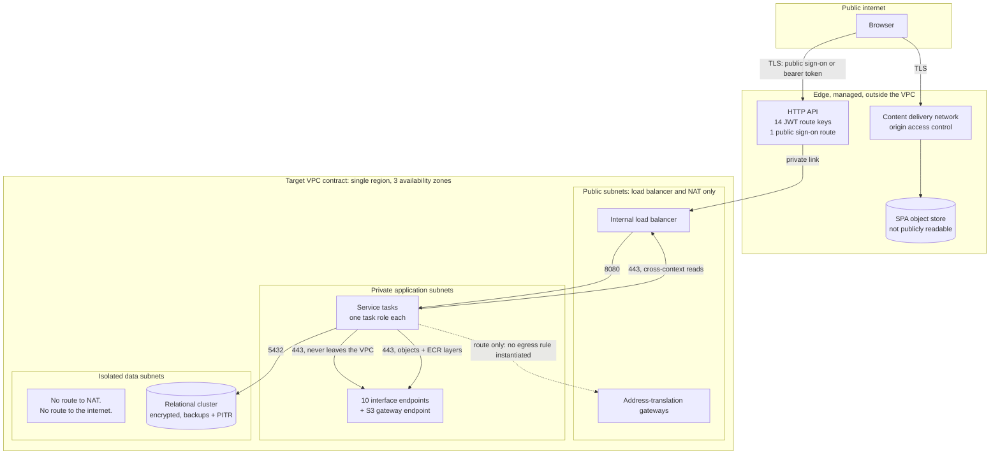

# Security and Identity

---

> **Purpose.** This document maps the CardDemo baseline's security posture onto the
> target's across five concerns: **identity**, the **authorization model**,
> **encryption** at rest and in transit, **data exposure and masking**, and
> **network isolation**. It records the one place in the entire migration where
> **functional parity is explicitly declined** — the plaintext password field — and
> it enumerates the authored controls and remaining delivery work behind *no secrets
> committed to the repository*, without treating ignore rules or absent values as an
> access-control boundary. It discharges the security-and-identity portion of
> **Deliverable 2** of the seven numbered
> deliverables — *"/docs/architecture — target architecture diagram, service
> catalog, and data-mapping (VSAM/Db2/IMS → AWS) tables"* — together with the
> security half of the cross-cutting requirement: *"encryption in transit and at
> rest, least-privilege IAM, no secrets in source"*.
>
> It is the **sixth** of the nine documents in this folder, and it is deliberately
> not the naming authority for anything. Service names, package roots, schema
> ownership and the column-by-column derivations belong to
> [`service-catalog.md`](service-catalog.md) and
> [`data-model-and-schema-mapping.md`](data-model-and-schema-mapping.md); this
> document cites both rather than restating either.
>
> **Source of truth.** Five bodies of baseline reference material, all read and
> none modified:
>
> * the security record [`app/cpy/CSUSR01Y.cpy`](../../app/cpy/CSUSR01Y.cpy) —
>   `01 SEC-USER-DATA` at L17, whose six fields include `SEC-USR-PWD PIC X(08)` at
>   **L21** and `SEC-USR-TYPE PIC X(01)` at L22;
> * the sign-on program [`app/cbl/COSGN00C.cbl`](../../app/cbl/COSGN00C.cbl) — the
>   `READ-USER-SEC-FILE` paragraph declared at L209, whose read-and-evaluate block
>   runs **L211–L256**, comparing at L223 and branching at L230–L240;
> * the shared session structure
>   [`app/cpy/COCOM01Y.cpy`](../../app/cpy/COCOM01Y.cpy) — `01 CARDDEMO-COMMAREA`
>   spanning **L19–L44**, carrying `CDEMO-USER-ID PIC X(08)` at L25 and
>   `CDEMO-USER-TYPE PIC X(01)` at L26 with its `'A'`/`'U'` condition names at
>   L27–L28;
> * the CICS resource definitions [`app/csd/CARDDEMO.CSD`](../../app/csd/CARDDEMO.CSD)
>   — a 505-line file whose **eight** `DEFINE FILE` stanzas occupy **L1–L99**;
> * the Db2 objects of the authorization extension —
>   [`AUTHFRDS.ddl`](../../app/app-authorization-ims-db2-mq/ddl/AUTHFRDS.ddl), the
>   fraud table keyed `PRIMARY KEY(CARD_NUM,AUTH_TS)` at L28, and
>   [`XAUTHFRD.ddl`](../../app/app-authorization-ims-db2-mq/ddl/XAUTHFRD.ddl), its
>   four-line unique index declaring `COPY YES` at **L4**.
>
> Three further baseline files are cited at specific lines where the argument needs
> them: [`app/cpy/CVACT02Y.cpy`](../../app/cpy/CVACT02Y.cpy) L7 for the card
> verification value, [`app/cpy/CVCUS01Y.cpy`](../../app/cpy/CVCUS01Y.cpy) L17–L18
> for the two national identifiers, and
> [`app/app-authorization-ims-db2-mq/cbl/COPAUA0C.cbl`](../../app/app-authorization-ims-db2-mq/cbl/COPAUA0C.cbl)
> L753–L754 for the identity context on the reply. The preserved mainframe security
> path is cited from [`samples/jcl/RACFCMDS.jcl`](../../samples/jcl/RACFCMDS.jcl).
>
> On the target side the source of truth is authored code rather than prose:
> [`role_credentials.py`](../../data-migration/src/carddemo_migration/role_credentials.py),
> the `aurora-postgresql`, `secrets`, `cognito`, `kms`, `ecs-service`, `alb` and
> edge modules under [`infra/modules`](../../infra/modules), the service
> configuration under [`services`](../../services), and the role and grant script
> [`data-migration/sql/V0__schemas_and_roles.sql`](../../data-migration/sql/V0__schemas_and_roles.sql).
> Every target claim below that can be checked against a file is cited to that
> file, so a reader can distinguish what is authored from what is intended.
>
> **Delivers, and who consumes it.** It delivers the baseline-to-target
> identity mapping, the user-type-to-group-to-authority chain, the RACF mapping
> rationale, the IAM and database-role boundaries, the encryption and key
> boundaries, the masking rules, and the network isolation model. Its declared
> consumers are
> [`docs/adr/ADR-008-security-and-identity.md`](../adr/ADR-008-security-and-identity.md),
> which records the
> decision this document describes the shape of; `MIGRATION_README.md` and
> `docs/runbooks/deploy.md`, which reference the credential and identity handling
> rather than re-deriving it; the authored `SecurityConfig` class of each of the
> seven services with an HTTP listener, together with the authored
> `JwtRoleConverter` of `common-lib`; and
> [`data-model-and-schema-mapping.md`](data-model-and-schema-mapping.md), which
> defers the cluster-level recoverability replacement to this document at its
> L508–L517.
>
> **Caveats, and one of them is load-bearing for every sentence here.** Applying
> this infrastructure to a live account is an operator action outside this scope, so
> **no penetration test, security audit, compliance assessment or certification has
> been performed, and none is claimed anywhere in this document** — not for any
> regulatory standard, framework or control catalogue. Which controls are expressed
> in code and which are not is MEASURED rather than remembered, by the
> delivery-boundary block in
> [Reproducing the measurements in this document](#reproducing-the-measurements-in-this-document),
> because a caveat that understates delivered controls misdirects a security
> reviewer exactly as badly as one that overstates them. The full set of boundaries
> is in
> [Caveats, boundaries and out-of-scope](#caveats-boundaries-and-out-of-scope), and
> reading that section is not optional for interpreting this one.

**Scope of this document is additive and reference-driven.** It never modifies the
COBOL baseline. `app/**` — programs, copybooks, BMS mapsets, JCL, the CICS resource
definitions and the seed data — is cited here by path and line and is read-only, as
are `tests/**`, `scripts/**` and `samples/**`. **`app/**` is untouched by this
migration**, and nothing below should be read as asserting otherwise: where the
baseline does one thing and the target does another, that is a decision taken in
the target and registered as a divergence, never a change made to the baseline.

**Exactly three pre-existing files may be modified by this migration** —
`README.md`, `CONTRIBUTING.md` and [`.gitignore`](../../.gitignore). None of the
three is this document. The ignore file reduces accidental staging of infrastructure
state and saved plans; it is a convenience control, not an access-control boundary,
and `git add -f` can override it.


## Design decisions

This section carries the reasoning for the choices this document makes **about
itself**. Decisions about the security architecture it describes are justified at
the point where each is stated, under the same four category names, spelled as
[`../CODE_DOCUMENTATION_STANDARD.md`](../CODE_DOCUMENTATION_STANDARD.md) L216–L262
fixes them: plural, unparenthesised, colon retained, no emphasis on the label
itself.

- Refactoring Rationale: this is the one document in the folder whose dominant
  category is `Refactoring Rationale` rather than `Assumptions`, and the reason is
  structural rather than stylistic. Every other document in this folder describes a
  target mechanism that *preserves* a baseline contract; this one describes the
  single mechanism that deliberately **does not** — credential handling. Rule 1
  defines that category as documenting *what was wrong with the old approach*, so
  the category the rule supplies is the category the content requires. The
  obligation it creates is stated in the next bullet, because it cuts the other way.
- Assumptions: naming what the baseline does is not the same as claiming it was
  changed, and this document keeps the two strictly apart. The baseline stores and
  compares an eight-character password field exactly as it always has; nothing in
  `app/**` is edited, and the words *fixed*, *corrected*, *patched* and
  *remediated* are therefore never applied to it anywhere below. What changed is
  the **target's** design decision. Stating this once, here, is what lets the rest
  of the document use precise language — "not carried forward", "declined parity" —
  without hedging every sentence.
- Trade-offs: the baseline's security posture is described **factually, with line
  citations, and never editorially**. CardDemo is a demonstration application, and
  its `RECOVERY(NONE)` and `JOURNAL(NO)` file attributes are a straightforward
  consequence of that. Naming the attribute and its line is sufficient to motivate
  the target's choice; characterising it as a deficiency would add nothing a reader
  cannot see and would misrepresent a working system that continues to run. The
  accepted cost is that a reader wanting a security judgement of the baseline will
  not find one here — this document states what each side does, and stops.
- Alternatives Considered: the target claims are cited to the **authored
  infrastructure inputs** rather than to the architecture narrative. Citing the
  narrative would have been shorter and would have let this document assert a
  four-key boundary, a two-role reporting split and a no-password seed path with no
  way for a reader to check any of the three. Citing
  [`kms/variables.tf`](../../infra/modules/kms/variables.tf),
  [`cognito/variables.tf`](../../infra/modules/cognito/variables.tf) and
  [`V0__schemas_and_roles.sql`](../../data-migration/sql/V0__schemas_and_roles.sql)
  means each claim fails visibly if the file changes underneath it.
- Assumptions: no value that is or resembles a credential appears anywhere in this
  document. There is no key identifier, account number, resource name, user pool
  identifier, registry hostname, example password or token — and, specifically, **no
  invented ARN**, because a plausible-looking one is indistinguishable from a real
  one to a scanner and teaches a reader to expect the pattern in prose. Where a
  value would otherwise appear, a placeholder in angle brackets stands in its
  place. Baseline literals that already exist in the reference source — dataset
  names, the `'A'` and `'U'` user-type codes, program and transaction names — are
  not credentials and are cited as written.
- Trade-offs: the database-role boundaries are given at the **granularity the
  script actually implements**, which in two places is narrower than the
  architecture summary. The batch role's write surface on the `account` schema is
  one named table, not the schema; and the reporting tier is two roles, not one.
  Reproducing the coarser summary would have read more consistently with the
  narrative and would have overstated the privilege each tier holds — an error in
  the dangerous direction for a document whose subject is least privilege. The cost
  is that this document and a one-line summary of it will differ, so the citation
  to the script is given every time the distinction matters.


## Identity: the one place parity is explicitly declined

Everywhere else in this migration, a difference in observable behaviour is either
absent or registered as a defect divergence. Identity is the exception: it is a
**deliberate behavioural change in the target**, decided on its merits rather than
inherited, and it is the only one of its kind.

### What the baseline does

The security record declares six fields, and the fourth of them holds the
credential in clear:

| Field | Picture | Line |
|---|---|---|
| `SEC-USR-ID` | `PIC X(08)` | [L18](../../app/cpy/CSUSR01Y.cpy) |
| `SEC-USR-FNAME` | `PIC X(20)` | L19 |
| `SEC-USR-LNAME` | `PIC X(20)` | L20 |
| **`SEC-USR-PWD`** | **`PIC X(08)`** | **L21** |
| `SEC-USR-TYPE` | `PIC X(01)` | L22 |
| `SEC-USR-FILLER` | `PIC X(23)` | L23 |

`SEC-USR-PWD PIC X(08)` is an eight-character alphanumeric field stored in plain
text in the `USRSEC` record. Sign-on reads that record and compares the entered
value against the stored value **directly**: within the `READ-USER-SEC-FILE`
paragraph, [`COSGN00C.cbl`](../../app/cbl/COSGN00C.cbl) issues an `EXEC CICS READ`
of the security dataset into `SEC-USER-DATA` at L211–L219, then evaluates the
response and, on a successful read, tests `IF SEC-USR-PWD = WS-USER-PWD` at
**L223**. There is no hash, no salt and no work factor in that comparison, because
there is nothing stored to compare against but the characters themselves. The whole
read-and-evaluate block runs **L211–L256**, and its three outcomes are the three
verbatim messages at L242, L249 and L254.

That is a factual description of the baseline, cited to its lines. It is not a
finding, and the file it describes is unchanged by this migration.

### What the target does

The password field is **not carried forward at all.**

There is no password column in the `auth` schema — not encrypted, not hashed, not
present. The authored migration
[`V1__auth.sql`](../../services/auth-service/src/main/resources/db/migration/V1__auth.sql)
creates `auth.users` with the fixed-width user identifier, given and family names,
the two-valued user type and a unique `cognito_sub`; it creates no credential
column. [`data-model-and-schema-mapping.md`](data-model-and-schema-mapping.md)
records the same non-carry-forward decision in its `auth` field table.

Credential storage and comparison leave the application, but the sign-on trust
boundary still includes `auth-service`. The browser sends the credential over TLS;
`auth-service` receives it transiently in the sign-on request and passes it to the
managed identity provider for verification. The service never persists the value
and has no code path that compares it with an application-owned record.

Assumptions: the transient value is request-scoped and is not copied into MDC,
structured logs, metrics, traces, exception messages, response objects or
diagnostic renderers. Authentication failures return stable message identifiers
rather than provider exception text. Java cannot guarantee immediate erasure of a
request `String`, so the control is to avoid copies, retain no reference after the
provider call and never expose heap dumps from the authentication task. This is a
memory-lifetime constraint, not a claim that the application never receives the
credential.

Seed identities are created **at provisioning time with generated credentials**,
and this is verifiable rather than asserted: the `seed_users` input at
[`infra/modules/cognito/variables.tf`](../../infra/modules/cognito/variables.tf)
is declared at L891 and its L892 description states that it *"Carries no password:
main.tf generates each initial credential during apply and stores it in Secrets
Manager"*, and that
the baseline's own demo identities — defined by
[`app/jcl/DUSRSECJ.jcl`](../../app/jcl/DUSRSECJ.jcl) L35–L44 — are named there by
identifier and user type only. The consequence is the one that matters for the
repository: **at no point does a human type a credential into a file that could be
committed.**

> Refactoring Rationale: **parity is declined here, and declining it is the
> decision — not an omission, and not a change to the baseline.** Reproducing the
> baseline's scheme
> faithfully would mean carrying an eight-character cleartext credential into a
> relational column, where every backup, every exported query result and every
> `SELECT *` would disclose the full set. Preserving observable behaviour is this
> migration's governing constraint everywhere else; here the behaviour whose
> preservation is at stake is *storing and comparing cleartext*, and reproducing it
> in a new datastore would be a choice actively taken rather than a contract
> honoured. So the field is dropped from the model and verification is delegated.
> **The baseline is untouched: `SEC-USR-PWD` is still declared at
> [`CSUSR01Y.cpy`](../../app/cpy/CSUSR01Y.cpy) L21 and still compared at
> [`COSGN00C.cbl`](../../app/cbl/COSGN00C.cbl) L223, and the mainframe sign-on path
> works exactly as it always did.** This is a divergence in the target, registered
> with every other documented divergence in
> `docs/architecture/cobol-to-service-traceability.md`, which is the authoritative
> register for all of them.

Two consequences of the delegation are worth stating because a reader looking for
them in the schema will not find them there. Password policy — length, character
classes and temporary-credential validity — is a property of the user pool and is
configured through its module inputs rather than through application code or a
database constraint. Reset, lockout, expiry and repeated-failure handling are also
provider behaviours. Auth-service still owns the transient hand-off described
above; it does not own the verification rule or a stored verifier.

> Assumptions: **delegating verification makes the identity provider's behaviour an
> external contract this design depends on, and that dependency is real rather than
> nominal.** Four behaviours are assumed of the pool and implemented nowhere in this
> repository: credential verification, password policy enforcement, credential reset,
> and repeated-failure handling. The authored auth-service implementation —
> `CognitoIdentityService` behind `AuthController` — must still be held to proving
> that its request path neither persists nor logs the credential and that it
> discards its reference after the provider call; `CognitoIdentityServiceTest` and
> `AuthControllerTest` assert the redaction half of that, and the "neither persists"
> half rests on there being no password column in the `auth` schema to persist into.
> If the pool were replaced by a
> provider that did not offer one of the four behaviours, the gap would surface as a
> missing control rather than as a database migration failure. The dependency is
> recorded here for exactly that reason: it is the class of assumption that is
> invisible in a schema diff.

### Identities created at run time, and the one-time credential they carry

Seed identities are one of two populations. The other is created while the system is
running, by `POST /api/v1/auth/users`, and its credential handover is a different
mechanism that has to be stated separately — because for that population there is no
`terraform apply` in progress, and the operator performing the create is a browser
session rather than a Terraform run.

`CognitoUserProvisioningService.provision` generates a policy-compliant one-time
credential, supplies it to the pool as the created account's temporary password, and
publishes it to a per-user Secrets Manager entry encrypted with the customer-managed
key. The 201 response then carries **both** the credential, in
`CreatedUserResponse.oneTimeCredential`, and the name of that entry, in
`credentialSecretName`. The credential is what the administrator hands over; the entry is
how an administrator whose response was lost — a closed tab, a connection dropped after
the commit — recovers it, under the store's own audit trail. Neither substitutes for the
other, which is why both are carried. The account lands in the provider's force-change
state, so the credential buys one sign-on and no more: presenting it yields the
`NEW_PASSWORD_REQUIRED` challenge that `POST /api/v1/auth/challenge` answers, and the
pool issues tokens only once a permanent credential has replaced it. The whole
journey — create, present, be challenged, answer, receive tokens — is asserted end to
end by `FirstSignOnHandoverTest`, over one substituted pool shared by both halves.

Four controls, and not the absence of a credential, are what make this defensible.
It is **single-use**, by the force-change state above. It is **never persisted**:
there is no password column in the `auth` schema to persist it into, which is the same
fact the delegation argument below rests on. It is **never logged**: both
`ProvisionedIdentity` and `CreatedUserResponse` override their generated `toString`
so that a record rendered into a diagnostic line cannot carry it, and
`FirstSignOnHandoverTest` asserts that no line emitted anywhere during the journey
contains it — an assertion verified to fail when a leak is deliberately introduced. And
it is **never cached**: `UserController.createUser` marks the response
`Cache-Control: no-store`, the published contract declares that header required, and the
one client that renders the value — `ui/src/screens/userAdd/index.tsx` — holds it in
component state alone, writes it to no storage, URL or route parameter, and clears it on
dismissal or unmount.

> ⚠️ Refactoring Rationale: an earlier revision created these accounts with delivery
> suppressed, **no supplied temporary password**, and answered with the read
> projection — so the pool minted a credential internally, sent it nowhere, and the
> operation returned nothing carrying it. The reasoning recorded at the time was that
> the credential would reach its owner through the provider's own administrative
> reset, whose generated values the infrastructure writes to Secrets Manager. That
> premise holds only for the seed population: `seed_user_bootstrap.py` runs inside
> `terraform apply` and reaches only the identities the `seed_users` input names, the
> pool declares no email or phone attribute over which a reset message could be
> delivered, and no reset operation exists anywhere in the reactor. The consequence
> was that creating a user produced an account nobody could ever sign on to. The
> credential is now created here and handed back once, which is why this subsection
> exists at all.

> ⚠️ Refactoring Rationale: the fix for that was itself corrected, and this paragraph
> records the second correction because it failed in the same place for a different
> reason. The first fix generated the credential, published it to a per-user Secrets
> Manager entry, and returned that entry's **name** alone — on the reasoning that a
> credential must never travel in a response body, and that the value would reach its
> owner through a store with an audit trail and a rotation story. That reasoning was
> sound about the transport and wrong about the outcome. Reading the entry needs
> `secretsmanager:GetSecretValue` and a grant on the customer-managed key; the task
> role holds both and the administrator's browser session holds neither. So the one
> principal obliged to hand the credential over was the one principal who could not
> obtain it, and creating a user again produced an account nobody could sign on to.
> The credential is therefore returned in the response, and the managed-secret entry
> is kept beside it rather than replaced by it.

> Alternatives Considered: keeping the locator-only response and granting the browser
> client the secret-store read action so it could collect the value itself. Rejected as
> a strictly **larger** disclosure than one value in one response: that grant outlives
> the handover, spans every entry its policy admits, and is exercisable by anything
> holding the session, where the response is delivered once to the caller that asked
> for it. Alternatives Considered: returning the value and dropping the per-user
> managed-secret entry, which would remove a stored copy and one secret per user.
> Rejected because a response is delivered once: an operator who lost it would then
> have no recovery and no audit trail, and the remaining option would be to delete the
> account and create another.
> Trade-offs: the credential travels in a response body, which a client may hold
> in memory for as long as the calling view lives, and a proxy configured to log
> bodies would capture it. That is the accepted cost of the four controls above, and
> what it buys is that onboarding needs no privileged read — the operation is
> completable by the principal the contract already authorises to perform it.

### A note on the anonymised clone

[`app/cpy/UNUSED1Y.cpy`](../../app/cpy/UNUSED1Y.cpy) declares `01 UNUSED-DATA` with
six fields whose pictures are `X(08)`, `X(20)`, `X(20)`, `X(08)`, `X(01)` and
`X(23)` — field for field and width for width, the layout of `SEC-USER-DATA`. It is
an anonymised clone of the security record, and it is referenced by no program in
the repository. It **retires with no target at all**: it is one of only two baseline
items in the entire migration that map to nothing, and it is registered as such in
`docs/architecture/cobol-to-service-traceability.md`. It is recorded here because a
reader auditing credential handling will encounter a second structure holding a
password-shaped field and needs to know its disposition; that disposition is
"nothing consumes it, and nothing replaces it".


## The authorization model: user type, group, claim, authority

The baseline expresses authorization with a single character. The target expresses
the same two-valued distinction as a signed group claim converted into framework
authorities. The chain is one-to-one at every link:

| Baseline | Target |
|---|---|
| `SEC-USR-TYPE` value `'A'` ([`CSUSR01Y.cpy`](../../app/cpy/CSUSR01Y.cpy) L22) | group `carddemo-admin` |
| `SEC-USR-TYPE` value `'U'` | group `carddemo-user` |
| the type field **read from the security record** ([`COSGN00C.cbl`](../../app/cbl/COSGN00C.cbl) L227) | the **`cognito:groups` claim** in a validated token |
| conditional branching on the type field (`IF CDEMO-USRTYP-ADMIN`, [`COSGN00C.cbl`](../../app/cbl/COSGN00C.cbl) L230) | **Spring Security authorities**; the shared `JwtRoleConverter` is authored once and registered by each of the seven service `SecurityConfig` classes |

**The domain is closed at two values on both sides, and on the target side that
closure is enforced rather than assumed.** In the baseline it is closed by the two
condition names on the session field — `88 CDEMO-USRTYP-ADMIN VALUE 'A'` and
`88 CDEMO-USRTYP-USER VALUE 'U'` at
[`COCOM01Y.cpy`](../../app/cpy/COCOM01Y.cpy) L27–L28. In the target it is closed by
a validation rule on the `seed_users` input at
[`infra/modules/cognito/variables.tf`](../../infra/modules/cognito/variables.tf)
L945, which rejects any `user_type` that is not exactly `"A"` or `"U"`, cites those
two condition names as its authority, and records that exactly two groups are
created with **no third group and no fallback**. The database agrees: the `auth`
schema constrains `user_type` to the same two values, per
[`data-model-and-schema-mapping.md`](data-model-and-schema-mapping.md).

> Refactoring Rationale: **the client can no longer assert its own privilege
> level, and the mechanism — not the sentiment — is the reason.** The baseline is
> strictly pseudo-conversational: a CICS task ends at every screen turn, so all
> continuity between turns lives in one structure,
> [`app/cpy/COCOM01Y.cpy`](../../app/cpy/COCOM01Y.cpy) **L19–L44**, shared by all
> eighteen online programs. That structure carries `CDEMO-USER-ID PIC X(08)` at L25
> and `CDEMO-USER-TYPE PIC X(01)` at L26, and it is **storage the server hands to
> the terminal and receives back on the next turn**. Sign-on populates the type
> field once, at [`COSGN00C.cbl`](../../app/cbl/COSGN00C.cbl) L227, from the record
> it just read — but every subsequent turn takes the value from the returned
> structure, not from a fresh read of `USRSEC`. The field that decides
> administrative access therefore arrives from the client on every turn after the
> first, so a client that returned a modified structure would present a modified
> user type. In the target the client **cannot assert anything**: the group claim is
> **cryptographically signed by the issuer and validated on every single protected
> request**, and a modified claim fails signature verification before any handler runs. That is
> the specific difference — the value's provenance changes from *echoed back by the
> caller* to *signed by the issuer* — and it is why this mapping is a genuine change
> in the trust model rather than a change of transport.
> [`service-catalog.md`](service-catalog.md) reaches the same conclusion from the
> statelessness direction, in its
> [Why every context is stateless](service-catalog.md#why-every-context-is-stateless)
> section; this document is the one that states the authorization consequence.

### Where the decision is intended to be taken and enforced

The consequence for routing is precise: **administrative routes must be guarded by
the claim, never by a client-supplied field.** The admin-versus-user branch that the
sign-on program performs with `EXEC CICS XCTL` — to `COADM01C` at
[`COSGN00C.cbl`](../../app/cbl/COSGN00C.cbl) L231–L234 when
`CDEMO-USRTYP-ADMIN` holds, and to `COMEN01C` at L236–L239 otherwise — becomes two
separable things in the target, and separating them is the point:

* a **navigation decision** in the browser, taken from the group claim the client
  already holds, which selects the administrative or the general landing route; and
* an **authorization decision** on the server, taken independently from the same
  claim on every request to a protected endpoint.

> Assumptions: **the navigation decision is a convenience and carries no security
> weight, and the design depends on that separation holding.** A client that
> navigated to an administrative route without the administrative group would render
> a screen and then receive an authorization failure from every call that screen
> makes, because the filter chains exist in all seven services with an HTTP
> listener and each re-derives authority from the token independently. The
> alternative considered was to let the server drive navigation, mirroring `XCTL`
> more closely; it was rejected because it would reintroduce a server-held notion of
> "where this user is", which is the pseudo-conversational state the migration
> removes. The accepted cost is that an unauthorised route is reachable and empty
> rather than unreachable — a rendering difference, not a privilege difference.

The conversion logic is authored **once**, in
[`JwtRoleConverter.java`](../../services/common-lib/src/main/java/com/carddemo/common/security/JwtRoleConverter.java)
in `common-lib`, and is not copied per service. Its two group values are the fixed
contract names `carddemo-admin` and `carddemo-user`, matching the Cognito module.
Seven services — account, auth, authorization, card, reference, reporting and
transaction, every one but `batch-service`, which publishes no HTTP listener — now have
an authored `SecurityConfig` that imports the converter explicitly and registers it on a
resource-server filter chain, and those chains carry route rules that require the
administrative authority. The shared converter is a building block and the per-service
filter chain is what applies it; both halves are required, and neither on its own
establishes that a given route is authorized. The layer those rules protect is now
authored in every service but one: **sixteen** `*Controller.java` exist under
`services/*/src/main/java` — three in `account-service`, one in `auth-service`, two in
`authorization-service`, six in `reference-service`, two in `reporting-service` and two
in `transaction-service` — so a handler method is reached through a rule on those
routes. `card-service` is the sole exception: it has an authored `SecurityConfig` whose
route rules guard no handler at all, because its `api` package holds only its charter.

Refactoring Rationale: this paragraph previously put the figure at five controllers in
two services and described "every other route rule" as guarding an unauthored handler.
Both halves are now wrong by a wide margin, and the direction of the error mattered: a
reader would have taken the authorization model for a mechanism with almost nothing
behind it. The exception is narrowed to the one service it actually applies to rather
than left as a blanket qualifier.

Trade-offs: what is authored and what is *asserted* are still two different figures, and
the smaller one is stated rather than glossed. Seven of the sixteen handlers have a
`*ControllerTest` that exercises the handler through the web layer — one in
`auth-service`, two in `authorization-service`, two in `reporting-service` and two in
`transaction-service`. The other nine — three in `account-service` and six in
`reference-service` — are covered only by their module's contract or routing test, which
binds the published path set rather than driving a request through the filter chain. So
for those nine the route rules in this section are delivered and reviewed but not
exercised by a test, and that is the accurate boundary a reader should hold this section
to.

Assumptions: a registered filter chain over an unauthored handler is a delivered
authorization mechanism with nothing behind it, which is a materially narrower gap
than an unregistered converter. The two are kept apart throughout this section because
conflating them either overstates a control or invites re-implementing one that exists.

> Alternatives Considered: **one converter in the shared kernel, rather than eight
> equivalent ones.** Each service could have mapped `cognito:groups` to authorities
> in its own `SecurityConfig`. That was rejected for a specific failure mode: eight
> independent implementations of the same mapping drift independently, and the drift
> is silent — a service whose converter used a different authority prefix or dropped
> an unrecognised group would disagree with sibling authorization rules. One
> converter makes the mapping a single reviewable artifact and makes an unrecognised
> group's treatment a single decision. The accepted cost is that a change to the
> mapping is a change to the shared kernel, so it rebuilds all eight services. Each
> online service's `SecurityConfig` imports this converter explicitly, because
> component scanning cannot be assumed across module package roots.

### Machine identity: the calls this platform makes on its own behalf

Every authorization rule above answers the question *which signed-on user may do this*.
One class of call cannot be answered that way at all. The pending-authorization consumer
decides an authorization while handling a queue message, and to decide it it reads three
records the **account** context owns — the card cross-reference, the account master and
the customer master, which
[`COPAUA0C.cbl`](../../app/app-authorization-ims-db2-mq/cbl/COPAUA0C.cbl) reads at its
paragraphs `5100-READ-XREF-RECORD`, `5200-READ-ACCT-RECORD` and
`5300-READ-CUST-RECORD`. A queue message carries a card number, an amount and a merchant.
It carries **no user**, so there is no token to present and none to forward.

The seam is therefore authenticated by a credential that identifies the **workload**:

| Concern | Mechanism |
|---|---|
| Wire form | `InternalServiceToken` in the shared kernel: a JWT signed with `HS256`, carrying issuer `carddemo-internal`, the calling service as subject, the callee as audience, a `scope` claim naming ONE family of operations, an expiry, and a `kid` header repeating the subject. The `kid` is load-bearing rather than decorative: it is how the verifier selects WHICH key to check the signature against, and therefore how a subject becomes a property the signature proves rather than a claim the holder writes |
| Header | the ordinary `Authorization: Bearer` header, because the credential **is** a JWT — the callee's resource-server decoder is the thing that verifies it, so no separate header and no separate filter are involved |
| Minting | `InternalIdentityConfig` in `authorization-service` supplies its minter with subject `carddemo-authorization-service`, and `InternalIdentityConfig` in `transaction-service` supplies its own with subject `carddemo-transaction-service`; each signs with ITS OWN key. Both services' `RestAccountContextClient` mints a FRESH token per request rather than reusing one, so a token is never presented near its expiry, and each selects the scope from the request path so a token carries only the family the call needs. Refactoring Rationale: this row named only `authorization-service` while `transaction-service` was minting through an identically-shaped config of its own — reading the row alone, an operator rotating key material would have found one holder and missed the other |
| Checking | `InternalApiSecurityConfig` in `account-service`. It holds BOTH callers' keys as a `JWKSet` of two `OctetSequenceKey`s, each labelled with its caller's subject as `kid`, and decodes through a `DefaultJWTProcessor` whose `JWSVerificationKeySelector` picks the key the `kid` names — so a signature is only ever checked against the key belonging to the subject the token claims. Validators then run in one delegating chain: the framework default set, issuer pinned to `InternalServiceToken.ISSUER`, `InternalServiceToken.AUDIENCE_ACCOUNT_CONTEXT` required among the audiences, `InternalServiceToken::isKnownSubject`, `subjectMatchesSigningKey()` and `scopePermittedForSubject()`. Refactoring Rationale: this row described `NimbusJwtDecoder.withSecretKey` and ONE key. That shape could not validate a subject in any meaningful sense — with one shared key either caller could sign a token bearing the other's subject, so a subject check would only have confirmed a string the caller chose |
| Authority granted | one authority PER OPERATION FAMILY, each its scope under the framework's `SCOPE_` prefix: `CARD_XREF_READ_AUTHORITY` = `SCOPE_internal:account-context.card-xref.read`, `ACCOUNT_READ_AUTHORITY` = `SCOPE_internal:account-context.account.read`, and `CUSTOMER_READ_AUTHORITY` = `SCOPE_internal:account-context.customer.read`. None is either group authority, so no user token reaches an internal path and no machine token reaches a business route; and because each matcher group requires its own, a token scoped to one family is refused on the others rather than admitted by a single blanket rule. The chain ends `.anyRequest().denyAll()`, so an address added to the matcher without an authorization rule is refused rather than defaulted open. Refactoring Rationale: this row named a single `INTERNAL_READ_AUTHORITY` of `SCOPE_internal:account-context.read`, which the chain required on `anyRequest()`. That granted every holder every internal address, including the customer records carrying a national identifier and a government-issued identifier that neither caller reads today |
| Paths | a separately-ordered chain at `@Order(10)` whose `securityMatcher` names EXACT method-and-path pairs — **seven** matcher calls over seven addresses, composed in four groups by `InternalApiSecurityConfig.cardXrefPaths()`, `accountPaths()`, `customerPaths()` and `customerMasterPaths()`, the first three unioned by `decisionReadPaths()` and that in turn unioned with the fourth by `internalPaths()` — a two-level union because the fourth group demands a different authority from the other three. Cross-reference (3): `POST /api/v1/card-xrefs/lookup`, `POST /api/v1/card-xrefs/lookup-by-account`, `POST /api/v1/card-xrefs/search-by-account`. Account (1): `POST /api/v1/accounts/lookup`. Customer decision (1): `POST /api/v1/customers/lookup`. Customer master (2): `GET /api/v1/customers`, `POST /api/v1/customers/record`. The surface is isolated without the chain capturing the whole `/api/v1/accounts/**` subtree a person also reads. Refactoring Rationale: this row has been corrected twice and the second correction is the substantive one. It first named three endpoints as an exact set and then six pairs enumerated by one method, both short. It then named eight pairs over six addresses of which **four were keyed addresses this context no longer publishes** — `GET /api/v1/accounts/{accountId}`, `GET /api/v1/customers/{customerId}/record`, and the customer probe counted twice for its `GET` and its `HEAD`. All four moved their identifier into a request body, the probe's two methods collapsing into one `POST`, which is what takes the count from eight matcher calls to seven and splits the customer group in two: a decision address the authorization context may reach and two whole-record addresses gated behind an authority nothing currently mints. The row states the count, the grouping and every pair — grouped, because the grouping IS the authorization boundary rather than a presentational convenience |
| Callers admitted | exactly two — `authorization-service` and `transaction-service` — and the admission is enforced three ways rather than one: `InternalServiceToken` refuses to construct a minter for a subject outside its closed two-entry table, the verifier holds a key for each of those two subjects and no others, and `isKnownSubject` refuses a token whose subject is not one of them. Their entitlements DIFFER: authorization-service may carry all three scopes, transaction-service the cross-reference and account scopes only — it never reads a customer record, so it cannot ask for one. `InternalServiceToken`'s permitted-scope table holds that split and `mint()` refuses a scope the subject may not carry, so an over-scoped token cannot be produced rather than merely being rejected on arrival. Refactoring Rationale: this row read "exactly one" caller, was corrected to two, and was still incomplete — it described the two as interchangeable holders of one key, which is precisely the property that let either impersonate the other |
| Lifetime | 60 seconds from `InternalIdentityConfig.DEFAULT_LIFETIME`, bounded absolutely at 5 minutes by `InternalServiceToken.MAX_LIFETIME`; a longer lifetime is refused at minting rather than truncated |
| Key material | **two** Secrets Manager entries created by each environment root, `<name-prefix>/<env>/internal-identity/authorization-signing-key` and `.../transaction-signing-key`, independently generated and each at least `InternalServiceToken.MIN_KEY_LENGTH` bytes. Each is injected into exactly TWO task definitions — its one minting caller and the verifying callee: `CARDDEMO_INTERNAL_IDENTITY_AUTHORIZATION_SIGNING_KEY` into `authorization` and `account`, and `CARDDEMO_INTERNAL_IDENTITY_TRANSACTION_SIGNING_KEY` into `transaction` and `account`. `account-service` therefore holds both and neither caller holds the other's. `infra/modules/ecs-service` asserts each membership as its own biconditional, so a third workload receiving either key and a listed workload missing it both fail the plan. Refactoring Rationale: this row described ONE entry injected into three task definitions. That is what made the two callers mutually impersonating, and it is what this correction records: with shared bytes, splitting scopes or checking subjects buys nothing, because the holder of the key writes both |
| Routing | the two internal subtrees are forwarded on the **internal** load balancer only; `infra/modules/api-gateway-http` publishes no edge route key for either, so neither is reachable from the public edge |
| Name resolution | a private Route 53 zone in each environment root resolving the internal service name to the load balancer inside the VPC, which is what lets the client verify the listener certificate it already covers |

> Refactoring Rationale: **all four halves of this were missing, and each failed
> differently.** The client presented no credential of any kind, so a call would have
> been refused before reaching a handler; `account-service`'s chain required a group
> authority on every route, so even a credential would not have authorized it; the load
> balancer forwarded only the account subtree, so every internal address outside it was
> answered 404 by the load balancer itself; and no DNS record resolved the name the
> base URL would have used, which neither environment root published either. The
> composite symptom was an unavailable dependency, which is the least informative of the
> four causes and the one an operator would have investigated first.
>
> Alternatives Considered: **forwarding the end user's token.** Rejected twice over, and
> the review that found this gap forbids it by name. There is no user token in a queue
> message to forward; and if there were, letting a cardholder's session authorize a
> cross-context read of master records would grant that session an authority the
> disclosure contract above gives it nowhere else.
>
> Alternatives Considered: **an OAuth 2.0 client-credentials access token**, which is
> the standard answer and would have reused `CognitoAccessTokenValidator` unchanged.
> Rejected because the shipped stack cannot issue one: that grant is served only by a
> user-pool hosted domain, and [`infra/modules/cognito`](../../infra/modules/cognito)
> creates none — its `domain_prefix` input defaults to null, neither environment root
> supplies it, and that module records two independent reasons for not creating one
> unconditionally.
>
> Alternatives Considered: **mutual TLS between tasks.** Rejected on a measured ground:
> each task now mints its own listener key pair and self-signed certificate at startup,
> with no shared authority anywhere, so a peer certificate has no trust anchor to be
> verified against.
>
> Alternatives Considered: **a managed-key message authentication code**, with the
> minting task granted `kms:GenerateMac` and the answering task `kms:VerifyMac` on one
> key. This is the stronger posture in general — no key material in either task, neither
> capability implying the other, and a CloudTrail entry per credential — and it was
> rejected here on two measured grounds. First, it buys nothing against this topology:
> there is **one** audience and its verifier is the service that owns the records, so a
> compromise of that verifier already grants everything a forged credential could obtain
> from it. Second, it would have required a **fifth** key in
> [`infra/modules/kms`](../../infra/modules/kms), whose `enable_key_rotation` input
> accepts only `true` on the stated ground that automatic rotation is an architecture
> invariant — and a message-authentication key cannot rotate automatically at all, so the
> key would have had to be carved out of an invariant that module declines to make
> optional. This ground is now **stronger** than when it was written, not weaker: it said
> "a sixth key" because that module then declared five, and the frozen four-key allocation
> it has since been reconciled to leaves even less room for one — a fifth key would have
> to be argued against the design's own count as well as against the rotation invariant. Assumptions: the first ground holds only while there is one audience. A
> second audience added under this same key would make a compromise of either verifier
> the ability to mint for the other, and the managed-key split would then have to be
> revisited — or a key issued per audience.
>
> Trade-offs: a symmetric key means the **verifier can mint**. The consequence is bounded
> and stated rather than left implicit: the only audience is the account context itself,
> so the capability a compromise of that context gains from holding the keys is a
> capability it already has by being that context. What a key buys is that no **third**
> party can mint with it, which is why each of the two entries is readable by exactly two
> task roles — its one calling context and the account context that verifies — and why
> [`infra/modules/ecs-service`](../../infra/modules/ecs-service) requires each name of the
> workloads that hold it and admits it for no other.
>
> Refactoring Rationale: this paragraph argued the bound for **one** key held by three
> task roles, and that argument was materially weaker than it read. With one key the two
> *callers* could also mint as each other, so the bound was not "no fourth party" but "no
> party outside the three" — and the two inside it were not distinguishable. Splitting the
> key per caller narrows the claim to something the verifier can actually check: a
> signature only verifies under the key labelled with the subject the token asserts, so a
> caller cannot present itself as the other. The residual "the verifier can mint" is
> unchanged and remains bounded by there being one audience.
>
> Alternatives Considered: **a hand-written wire form with an application-verified
> message authentication code** — a version marker, an encoded payload and an HMAC over
> the payload together with the audience, the HTTP method and the request path, checked by
> a servlet filter ahead of the resource server. It binds a credential to the exact
> request that carries it, which the token above does not, and it was still rejected. The
> verification would be application code on the authentication path, where a signed JWT is
> verified by the framework's own audited decoder and validators; and the replay window the
> path binding closes is closed differently here, because the chain admits the token on
> **exact method-and-path pairs and nowhere else**, every one of them a read. Choosing the
> hand-written form would have traded audited verification for a binding whose benefit this
> topology already obtains structurally.
>
> Assumptions: a **separately-ordered** chain is what makes the exact-address matcher
> workable. A single chain would have had to admit either credential on
> `/api/v1/accounts/**`, because a person and the posting decision read the same record —
> and an either-or rule on a subtree is the weaker statement, since it also admits the
> machine token on every future route added beneath it. Two chains state the narrower rule
> directly: the machine token is accepted on named addresses only, and the user chain is left
> exactly as strict as it was. Refactoring Rationale: both sentences above counted those
> addresses, and the count rose when the customer scan and the customer record read were
> matched on that chain. What carries the argument is that the matcher is exact and the
> addresses are enumerated in one place, so the counts are dropped rather than restated in
> two more places that would have to move together.

## RACF: a mapping, not a port

The baseline's external security manager **has no cloud analogue, and this document
does not pretend that it has one.** The target maps its role to **least-privilege IAM
task roles plus managed user-pool groups**, and **the substitution is documented as
a mapping rather than as a port.** The reusable modules author those building blocks
and both environment roots now compose them, so the mapping exists as code in the
repository; what it has never had is a provisioned account to take effect in.

The reason is structural, not preferential. RACF is a *single* external security
manager that mediates dataset access, transaction access and general resource
access for the whole system through one profile database, and the baseline's own
sample commands show both halves of that in four lines:
[`samples/jcl/RACFCMDS.jcl`](../../samples/jcl/RACFCMDS.jcl) alters a profile in the
CICS-transaction grouping class to admit a transaction at L24, and connects a user
to a group at L29. One manager, one command language, both the resource permission
and the group membership.

The target distributes those same effective boundaries across **three mechanisms that
do not share a policy language, an evaluation point or an administrative surface**:

| Concern | Baseline mechanism | Target mechanism |
|---|---|---|
| Which infrastructure resources a running component may touch | RACF profiles on datasets and resources | **IAM task role** per service, evaluated by the cloud control plane |
| Which application operations a signed-in person may perform | RACF group membership plus transaction-class profiles | **User-pool group claim** → framework authority, evaluated in the service |
| Which rows and columns a component may read or write | Dataset-level profile | **Database role** grants and revokes, evaluated by the database |

> Refactoring Rationale: **a rule-for-rule port was considered and rejected,
> because there is no target service that accepts a RACF profile.** The mapping is
> not lossy through carelessness; it is lossy because the mechanisms are **not
> isomorphic**. A single RACF profile can simultaneously express *which* users may
> reach a resource and *what* they may do to it, evaluated at one point. The target
> reaches the same effective boundary only by composing three independent decisions
> — a task role, a group claim and a database grant — evaluated at three points by
> three engines. There is no transformation that turns one profile into that triple
> mechanically, and any attempt to write one would produce a mapping table that
> looked authoritative while being unverifiable in either direction. **This document
> therefore maps effective privilege boundaries, not rules**: for each thing the
> baseline could do or was prevented from doing, it names the target mechanism that
> preserves the boundary. The accepted cost is that no line-by-line RACF
> correspondence exists to audit against, which is why the target-side boundaries
> below are each cited to the file that implements them instead.

> Assumptions: **RACF is not retired by this migration and is not described as
> superseded.** The mainframe security path continues to exist and to work — the
> sample commands, the CICS resource definitions and the baseline sign-on are all
> unchanged reference material. **The migration adds a path; it does not remove
> one.** The mapping above describes what fills RACF's role *in the target*, on the
> assumption that a component running there cannot reach a mainframe security
> manager at all, which is the same "no manual mainframe dependency" constraint that
> governs every other part of this migration.


## IAM and database-role boundaries

Least privilege is expressed at two independent layers, and a component must clear
both to reach data. The infrastructure layer decides which cloud resources a task
may call; the database layer decides which rows a connection may read or write.
Neither layer trusts the other. The reusable ECS module and the SQL role script
author those two layers, and both `infra/envs/dev` and `infra/envs/prod` instantiate the
ECS cluster and service modules for every workload; what separates this section from a
running service is therefore an apply against an account, not an unwritten composition —
a composed root describes an intended stack and only an applied one describes a running
task.

**Every name below is a placeholder.** No resource identifier, account number or
ARN appears in this document, for the reason given under Design decisions: a
plausible-looking identifier in prose is indistinguishable from a real one and
trains a reader to expect the pattern. Where an identifier would appear, the shape
is written as `<service>-task-role-<env>` and the concrete value is a property of an
apply, not of this document.

### One task role per service

Each instantiation of
[`infra/modules/ecs-service`](../../infra/modules/ecs-service) creates **its own task
role**, intended to be instantiated once for each of the eight services and granted
only what that service needs. No environment root instantiates it yet, so the
following is the authored per-instance policy shape, not a claim about deployed
roles:

| Grant | Scoped to |
|---|---|
| Read one secret | **that service's** database credential entry only |
| Use a queue | only the exact queue ARNs that service produces to or consumes from — authorization, account and reference participate, so for **five of the eight** target services this set is empty |
| Write logs | that service's own log group |
| Read or write objects | that service's own prefix within the dataset bucket, not the bucket |
| Decrypt | the customer-managed key covering the data class it touches, per the four-key split below |

> Trade-offs: **per-service roles rather than one shared task role.** A single role
> covering all eight services would be one artifact to review instead of eight, and
> it would make an added service a no-op change. It was rejected because it collapses
> the blast radius of a compromise from one service to all eight: a container
> escaping in the reporting tier would inherit the authorization tier's queue
> permissions and the batch tier's secret. The accepted cost is real — eight roles
> and eight policy documents to keep correct, and a service that gains a dependency
> needs its role amended before it works — and it is paid deliberately, because a
> permission that has to be added to be used is a permission whose absence is
> visible in a failing deployment rather than invisible in an over-broad grant.

### Database roles, at the granularity the script implements

The role and grant surface is authored in
[`data-migration/sql/V0__schemas_and_roles.sql`](../../data-migration/sql/V0__schemas_and_roles.sql),
and it is that file — not a summary of it — that this section reports. Three
things differ from the coarse description, all in the narrower direction.

**Every schema is owned by a role that cannot log in.** The script creates
**four tiers** of role, not one:

| Tier | Count | `LOGIN` | Holds |
|---|---|---|---|
| `carddemo_<context>_owner` | 8 | **no** | owns the schema and every object a migration creates in it, so it alone may `ALTER` or `DROP` them |
| `carddemo_<context>_migrator` | 7 | yes | member of its owner `WITH INHERIT FALSE`; holds nothing until it issues `SET ROLE`, which each service's `spring.flyway.init-sqls` does |
| `carddemo_<context>` | 8 | yes | `USAGE` on its schema, `SELECT`/`INSERT`/`UPDATE` on its tables, `USAGE`/`SELECT` on its sequences, `CREATE` explicitly **revoked** |
| `carddemo_verifier` | 1 | yes | `USAGE` and `SELECT` on the five **loaded** schemas — `auth`, `account`, `card`, `ledger`, `reference` — and nothing else: no write privilege of any kind, no `CREATE`, no sequence privilege, no ownership, and `default_transaction_read_only = on` set on the role |

> Assumptions: **the fourth tier exists because a post-load verification must not be able
> to alter what it certifies.** The three per-dataset passes
> ([`row_counts`](../../data-migration/src/carddemo_migration/verify/row_counts.py),
> [`checksum`](../../data-migration/src/carddemo_migration/verify/checksum.py) and
> [`money_parity`](../../data-migration/src/carddemo_migration/verify/money_parity.py))
> each read loaded rows back and compare them against the extract they came from, and each
> used to obtain that read by connecting as the bounded context's own runtime role — the
> same credential the load step immediately before them writes with, holding `SELECT`,
> `INSERT` and `UPDATE` on exactly the rows being certified. A verifier able to write what
> it verifies certifies nothing, because a defect in it could repair the evidence a reader
> is relying on it to judge; the authority is real whether or not it is used
> ([CWE-250](https://cwe.mitre.org/data/definitions/250.html)).
>
> Alternatives Considered: **reusing `carddemo_reporting`, which is already read-only.**
> Rejected on a property of the passes rather than on preference. Reporting holds `SELECT`
> on **masked aggregate views only** — the row immediately below this table records that its
> base-table access is explicitly revoked — so a primary account number reads back as its
> last four digits. The checksum pass compares a source record against the row it became
> field by field, so a masked read would differ from the extract on every card and
> cross-reference row and report a correct load as a defect. Widening reporting to the base
> tables was the other way to close that, and it would undo the masking boundary for every
> reporting query — a far larger exposure than one dedicated read-only identity.
>
> Trade-offs: **a sixteenth credential, and an identity that can read every migrated record
> in the clear.** That is the price of being able to prove a field was loaded correctly, and
> it is bounded rather than unbounded: the role cannot write, cannot create, cannot advance
> a sequence and owns nothing; the session it runs in is read-only and
> [`verify/session.py`](../../data-migration/src/carddemo_migration/verify/session.py) reads
> `transaction_read_only` back **from the server** before any pass runs rather than assuming
> the role default took effect; and no pass renders a field value into its report, so a value
> read under this authority does not reach a log. The role reaches only the five schemas the
> ETL loads: `batch` and `authorization` hold nothing it loads, and `reporting` publishes a
> presentation of records rather than records.

> Refactoring Rationale: **only `reporting` used to have a `NOLOGIN` owner, and the
> other seven schemas were owned by the very role their service connected as.** That
> arrangement gave each long-lived runtime credential implicit `CREATE` on its schema
> and ownership of every table Flyway created in it — so the one credential every
> request ran under could also `ALTER` or `DROP` the data it served, and `DELETE` and
> `TRUNCATE` came with ownership rather than being granted. The `reporting` split was
> already the right shape; it is now applied to all eight contexts. The DDL a startup
> migration legitimately needs arrives through a **second** credential, injected as
> `SPRING_FLYWAY_USER`/`SPRING_FLYWAY_PASSWORD`, whose authority is inert until it
> assumes the owner explicitly.
>
> Assumptions: **`WITH INHERIT FALSE` is what makes the migration role safe to ship
> inside a serving task.** Membership alone would give the migrator its owner's
> privileges on every statement; with inheritance off, a session that authenticates as
> the migrator and does not `SET ROLE` can read and write nothing. Verified against a
> live PostgreSQL 17.10: a migrator session without `SET ROLE` is refused with
> `permission denied for table`, and a runtime session is refused
> `permission denied to set role`.
>
> Assumptions: **the `SET ROLE` is not cosmetic — the grants depend on it.** Every
> `ALTER DEFAULT PRIVILEGES FOR ROLE carddemo_<context>_owner` clause in the script is
> keyed on the **creating** role, so a migration that created tables as the migrator
> would leave all fourteen of them inert and the runtime role would receive no grant on
> the tables it must read. Verified end to end against the same instance:
> `batch-service` migrated as `carddemo_batch_migrator` and all eight resulting
> tables — including Flyway's own `flyway_schema_history` — are owned by
> `carddemo_batch_owner`, after which the runtime role could `SELECT`, `INSERT` and
> `UPDATE` but was refused `DELETE`, `TRUNCATE`, `ALTER`, `DROP` and `SET ROLE`.
>
> Trade-offs: **sixteen credentials instead of eight**, one per login role, and a
> service that forgets its migration credential fails at startup on an unresolved
> placeholder. Both are accepted: the extra entries are what let one
> `GetSecretValue` grant per identity stay expressible, and a startup failure naming
> the missing variable is a better outcome than migrating as the wrong identity and
> succeeding. The sixteenth is `carddemo_verifier`, the read-only identity a post-load
> verification authenticates as; it is described with the verification tier below.

**Two tiers write outside their own schema, and each surface is one named table rather
than a schema.** `batch-service` and `transaction-service` are the two deliberate
departures from database-per-service ownership: nightly posting commits three writes as
a single unit of work across two schemas, and the bill-payment screen commits two.
[`service-catalog.md`](service-catalog.md#the-exception-batch-service-cross-schema-write-grants) holds
both decisions and their rejected saga alternative, and
[`data-model-and-schema-mapping.md`](data-model-and-schema-mapping.md) holds the
tables. What belongs here is the **actual privilege**, which in both cases is narrower
than a schema:

| Schema | Privilege held by the batch role | Line |
|---|---|---|
| `ledger` | `SELECT`, `INSERT`, `UPDATE` on all tables, plus sequence usage | L1115–L1116 |
| `account` | `SELECT` on all tables; `UPDATE` **revoked** schema-wide, then re-granted on **`account.accounts` alone** | L1168, L1166, L1179 |
| `card` | `SELECT` only | L1206 |
| `reference` | `SELECT` only | L1215 |

> Refactoring Rationale: **every line reference in the table above was corrected.** The
> four rows previously cited L1064–L1065, L1115/L1117/L1128, L1155 and L1164, and each of
> those pointed at a *comment* rather than at the statement it claimed — the offsets had
> drifted as the file's reasoning grew. A citation that resolves to the wrong line is worse
> than none, because a reader who follows it and finds prose concludes the statement is
> absent. They are re-read from the file rather than adjusted by an offset.

| Schema | Privilege held by the ledger role | Line |
|---|---|---|
| `account` | `USAGE` on the schema, and `SELECT` plus `UPDATE` on **`account.accounts` alone** — no `INSERT`, no `DELETE`, no `TRUNCATE`, and no default privilege of any kind | L1288, L1318 |

> Assumptions: **the ledger role's grant needs no revoke-then-narrow pair, and its
> absence is deliberate.** Section 4b declares no `ALTER DEFAULT PRIVILEGES` for this role
> at all, so nothing broad was ever conveyed and nothing has to be withdrawn. A default
> privilege cannot name a table, so the only available form would have granted `SELECT`
> and `UPDATE` on every table the account owner creates — including `account.customers`,
> which carries the encrypted national identifier, the encrypted government-issued
> identifier and the address. The batch role's block had to be repaired from exactly that
> shape; this one is authored narrow from the outset.
>
> Assumptions: **the reduction also advances the row's version column**, and that is a
> security property rather than a convenience. `account.accounts.version` is mapped
> `@Version` by the owning context, so a balance changed without advancing it would be
> invisible to that context's concurrency check, and an account-update submission holding
> the pre-payment image would commit over the payment and report success.

> Assumptions: **the revoke-then-narrow sequence is the mechanism for the batch role, and
> reading it as redundant would be a mistake.** The script revokes `UPDATE` across the whole
> `account` schema at L1166 *before* granting it on one table at L1179, and the second
> statement is guarded so it applies only once that table exists. The reason the
> revoke is there at all is that a default-privilege entry or an earlier schema-wide
> grant is **not** superseded by a narrower later grant — the two are additive — so
> the broad form has to be withdrawn explicitly for the narrow one to be the whole
> privilege. A reader auditing least privilege needs to see both statements to
> conclude anything about the resulting surface; either one alone is misleading.

**The ledger tier reaches one column of one table in the `account` schema.** A second,
smaller cross-schema write surface exists, and it is the bill-payment unit of work:
`carddemo_ledger` holds `USAGE` on `account` plus `SELECT` and `UPDATE` on
`account.accounts` and nothing else, from §4b of
[`V0__schemas_and_roles.sql`](../../data-migration/sql/V0__schemas_and_roles.sql). The
decision and its rejected alternatives are in
[`service-catalog.md`](service-catalog.md#the-second-exception-transaction-service-on-accountaccounts).

| Schema | Privilege held by the ledger role | Note |
|---|---|---|
| `ledger` | full ownership, as the schema it owns | — |
| `account` | `USAGE` on the schema; `SELECT`, `UPDATE` on **`account.accounts` alone** | guarded so it applies only once the table exists; no `INSERT`, no `DELETE`, no other table |

> Assumptions: **this grant is smaller than the batch one and must not be read as the
> same privilege.** The batch role reaches every table in `account` for `SELECT`; the
> ledger role reaches one. Neither can `INSERT` or `DELETE` there. What the ledger role's
> `UPDATE` is used for is a single relative statement that reduces `curr_bal` and advances
> `version` in the same row, so a concurrent edit through `account-service` fails its own
> optimistic check rather than losing the payment — the privilege and the concurrency
> control are the same statement.

**The reporting tier's owner reaches four other schemas, and the service's own role
cannot reach a base table.** The description "a `SELECT`-only role over read-only
cross-schema views" is accurate but incomplete, and the missing half is the part that
carries the isolation:

| Role | Holds | Line |
|---|---|---|
| `carddemo_reporting_owner` — no login, owns the views | `USAGE` and `SELECT` on `ledger`, `account`, `card`, `reference` | L1385–L1405 |
| `carddemo_reporting` — the role the service actually connects as | `USAGE` and `SELECT` on the `reporting` schema **only**; explicitly **revoked ALL** on `ledger`, `account`, `card` and `reference`; **revoked `CREATE`** on its own schema | L1464, L1486, L1462, L1474 |

> Refactoring Rationale: **splitting owner from consumer, rather than letting the
> reporting service hold the base-table grants directly.** This is the same split the
> other seven contexts now use, and reporting is where it was first applied. The
> single-role form is
> simpler and was the obvious first shape, and it has a specific defect: a role that
> can select from the base tables can select from them *directly*, so the views stop
> being a boundary and become a convenience. Any column a view was written to
> exclude — an encrypted identifier, a full account number — is then reachable by a
> query that does not use the view, and no grant prevents it. Separating the two
> means the base-table grants live on a role that **cannot log in**, so the only path
> from the reporting service to base-table data is through a view somebody wrote.
> `reporting` is also the one context with **no migration role**, because
> reporting-service ships no Flyway migration — its views are created by
> [`V1__reporting_views.sql`](../../data-migration/sql/V1__reporting_views.sql) under
> the bootstrap principal, and V0 accordingly creates seven
> `carddemo_<context>_migrator` roles rather than eight. The service role can read **no
> table at all**: the `reporting` schema holds exactly one, `card_grouping_key`, which
> the same script grants to the owner and revokes from `carddemo_reporting`, as
> [`data-model-and-schema-mapping.md`](data-model-and-schema-mapping.md#reporting--reporting-service-a-schema-it-can-only-read)
> records. The accepted cost is a second role to provision and a view to add whenever
> reporting needs a new column.

One further hardening statement applies to the cluster rather than to a role:
`REVOKE CREATE ON SCHEMA public FROM PUBLIC` at L953, which removes the default
ability of any connected role to create objects in the public schema.

**How a role acquires the credential it authenticates with.** The script creates every
one of the sixteen login roles with `LOGIN` and **no password clause**, so nothing it
leaves behind can authenticate — that absence is what lets the file carry no credential
material at all. The eight owner roles get no password clause either, and for them the
absence is permanent rather than transitional: they are `NOLOGIN`, so
`infra/modules/secrets` deliberately creates no entry for them and there is no
credential whose loss could hand an attacker DDL authority.
The credential is supplied by the step that runs immediately after it,
[`credentials.py`](../../data-migration/src/carddemo_migration/credentials.py), invoked as
`python -m carddemo_migration.credentials`. It connects as the cluster master credential
RDS generated, reads the entry `infra/modules/secrets` wrote for each role, and stores
that role's password. The ordering is not optional: the roles must exist before a
credential can be applied to one, and the services must be able to authenticate before
any of them starts.

> Assumptions: **the step derives a SCRAM-SHA-256 verifier locally and applies that,
> never the password.** PostgreSQL accepts no bind parameter in `ALTER ROLE ... PASSWORD`,
> so a password applied directly has to be interpolated into statement text — which is how
> a credential reaches a server log under `log_statement`, a client history file, or an
> error message quoting the failing statement. What crosses the connection instead is a
> salted, iterated hash the server stores verbatim, and a leaked verifier cannot be
> replayed as a password because deriving the client key from the stored key would require
> inverting SHA-256. The password itself never leaves the step's own process.

> Assumptions: **first application of a credential is this step's job and cannot be a
> rotation function's.** The two rotation inputs on `infra/modules/secrets` default to
> null, no rotation function is in scope in this migration, and the rotation functions
> AWS publishes for PostgreSQL cannot perform a first application in any case —
> single-user rotation authenticates with the credential it is replacing, and these
> roles have none, so a stack that relied on one would provision successfully and start
> no service. The step above **verifies its own outcome**: it exits non-zero unless
> every role holds a SCRAM verifier *and* completes a real TLS login as that role, so a
> deployment cannot report success while a service still cannot reach its schema. Those
> two rotation inputs configure scheduled rotation and nothing else.

### The batch orchestration's execution role

Two different classes of database credential exist, with one authority for each.
For the cluster **master** credential, the Aurora module configures RDS as the sole
authority because
[`aurora-postgresql/main.tf`](../../infra/modules/aurora-postgresql/main.tf) sets
`manage_master_user_password = true`; the only reference published for it is
`module.aurora.master_user_secret_arn`. The secrets module declares no second
`database_master` secret and publishes no master ARN, name or username, so there is
exactly one secret entry that can open the cluster rather than two plausible ones of
which only the RDS-managed entry works.

The sixteen ordinary service login roles are different: RDS does not manage their
credentials. [`infra/modules/secrets/main.tf`](../../infra/modules/secrets/main.tf)
authors one generated secret per login role — eight runtime, seven migration and one
read-only verification —
while [`V0__schemas_and_roles.sql`](../../data-migration/sql/V0__schemas_and_roles.sql)
creates those roles without a password because the roles must exist before a
credential can be applied. The required order is therefore explicit:

1. create the cluster and the sixteen per-role secret entries;
2. publish each stored credential to the bootstrap session as a **bound-parameter**
   session setting named `carddemo.credential.<role>`;
3. run V0, whose final section applies each one with `ALTER ROLE` inside a `DO`
   block and **fails closed** — rolling the whole transaction back — if any login
   role would be left unable to authenticate;
4. only then create the ECS services, so no task starts against a database in
   which its role does not yet exist.

Only the verifier crosses the database connection; the plaintext values are read
from the secret store into the bootstrap process, held in memory for the call and
never sent as SQL text. V0's post-create notice names both the bootstrap entry point
and the failing verifier so an operator is not left with a report-only query or a
manual `ALTER ROLE` instruction.

> **Measured delivery status.** All four steps are now composed by each environment
> root. `module.secrets` creates the sixteen entries first; the `database_admin` Lambda
> ([`infra/lambda/database_admin.py`](../../infra/lambda/database_admin.py)) is packaged
> with `V0__schemas_and_roles.sql` and receives the role-to-secret-name mapping
> projected from that module's output as `DB_CREDENTIAL_SECRETS`;
> `aws_lambda_invocation.database_bootstrap` `depends_on` the module and invokes the
> function, which opens one Data API transaction, publishes each credential with
> `SELECT set_config(:setting_name, :setting_value, false)`, and only then sends V0's
> statements on that same session; and `module.ecs_service` `depends_on` the invocation.
> Verified against the roots' own dependency graph: the invocation reaches all four
> `module.secrets` resources, **no** `module.secrets` resource reaches the invocation,
> all twenty `module.ecs_service` nodes reach it, and the graph holds no cycle.
>
> A second, independent applicator remains available for operator use rather than for
> provisioning:
> [`role_credentials.py`](../../data-migration/src/carddemo_migration/role_credentials.py)
> derives each SCRAM-SHA-256 verifier client-side and calls `verify_role_credentials`,
> which raises if any role still has no stored credential. It is what
> [`docs/runbooks/deploy.md`](../runbooks/deploy.md) invokes to re-apply a replaced
> credential, and it works from the same sixteen-role inventory.
>
> Refactoring Rationale: two successive statements here were wrong, and both are
> withdrawn. The first rested the ordering guarantee on a
> `service_credential_application` input of the `secrets` module that no longer exists
> anywhere in `infra/**`. The second — added when the design moved to the Lambda —
> described the composed ordering accurately and the ordering itself was **inverted**:
> the invocation ran BEFORE the module that creates the credentials, and `module.secrets`
> carried `depends_on = [aws_lambda_invocation.database_bootstrap]` to enforce exactly
> that. Because V0 refuses to commit without a value for every login role, a fresh apply
> could not succeed at all: the bootstrap rolled back before any secret existed to read.
> The edge is inverted, the Lambda now reads the entries and publishes them, and the
> services are ordered after both.
>
> Assumptions: the credential value is a **bound parameter** at every hop, never
> statement text. PostgreSQL accepts no bind parameter in `ALTER ROLE ... PASSWORD`,
> which is why V0 builds that statement as dynamic SQL inside a `DO` block from a
> session setting rather than from a value the caller interpolated — and why the setting
> itself is delivered through the Data API's `parameters` array. Neither the Lambda's log
> line nor its response carries a role name or a credential; both report counts only,
> because `aws_lambda_invocation` stores the response in Terraform state.
>
> Trade-offs: the bootstrap function holds `secretsmanager:GetSecretValue` on all
> sixteen entries at once, which is more than any service task holds. That concentration
> is inherent to a step whose job is applying every credential, and it is bounded: the
> grant is enumerated from `module.secrets`' output rather than written as a prefix
> wildcard — which would additionally have reached the Cognito seed-user entries under
> the same prefix — the function holds no other permission, and it is invoked only by
> Terraform.

### The batch orchestration's execution roles, one per state machine

Each state machine holds **its own** execution role, scoped to the specific task
definitions **that machine** launches, together with the permissions it needs to
observe a task to completion and to pass the task and execution roles to the tasks it
starts. No role receives a wildcard over task definitions. Those roles are authored:
[`infra/modules/step-functions-batch/main.tf`](../../infra/modules/step-functions-batch/main.tf)
declares `aws_iam_role.this` for_each over `local.machines` alongside four state
machines — `aws_sfn_state_machine.daily` for the nightly chain, `.adhoc` for on-demand
reports, `.dataset_roundtrip` for the operator-invoked export/import pair and
`.authorization_extract` for the segment extracts — and their four encrypted log
groups; each environment root passes the individual `ecs_service` task-definition ARNs
in rather than a wildcard, and passes `pass_role_arns` keyed by machine.

All four also carry a **permissions boundary**, and that is a second control rather than
a restatement of the first. The per-machine scoping above narrows what each role's own
inline document grants; the boundary caps what any future edit to that document can
grant, because a boundary is evaluated in addition to every identity policy — a
statement it does not permit is denied even where an inline policy allows it. It matters
most here: each of these roles holds `iam:PassRole` over the task roles, which is a
privilege-escalation primitive, since a role that can pass any role can act as any role.
The module takes the boundary as a required `permissions_boundary_arn` input and asserts
in a `lifecycle` precondition that the ARN names the deploying account — a boundary ARN
from another account is accepted by IAM and then bounds nothing, because the policy it
names does not resolve.

⚠️ Refactoring Rationale: these four roles carried **no** boundary, and neither did the
VPC flow-log role, the scheduler invocation role, or this root's SPA-publication and
three Lambda roles — ten effective role instances per environment — while both
environment roots described their `permissions_boundary_arn` as applying to "every role
this deployment creates". Only `modules/ecs-service` attached one. The description was
not narrowed to match; the roles were bounded to match the description, because a
documented ceiling that is not attached is worse than an absent one — an auditor reading
that variable would record the control as present. The inventory is now checkable rather
than asserted: **every** `aws_iam_role` block under `infra/` carries a
`permissions_boundary` argument.

Refactoring Rationale: this was ONE role shared by all four machines, and the sharing
was the finding. The union grant let a machine that runs one task definition start all
four, pass all eight task and execution roles and invoke the three operational Lambda
functions — so the operator-invoked report and extract machines carried the privileges
needed to reopen the online-write bracket or run a posting container, neither of which
appears anywhere in their own definitions. Only the daily role now carries
`lambda:InvokeFunction`, and only it carries `ecs:ListTasks`. Each trust document names
one exact state-machine ARN under `aws:SourceArn` where a same-prefix wildcard stood
before, so a machine cannot assume a sibling's role.

Assumptions: `ecs:StopTask` is scoped by RESOURCE to `task/<cluster>/*` while
`ecs:DescribeTasks` keeps its `ecs:cluster` condition, and the two are separate
statements for that reason. AWS's service authorization reference lists the task
resource type for both, and a task ARN embeds the cluster name, so scoping the stop by
resource expresses the same restriction where the service enforces it rather than
relying on a condition key shared with a read. The state-by-state contract belongs to
[`batch-orchestration.md`](batch-orchestration.md).

### Deployment identity

The deployment workflow authenticates by **short-lived federated role assumption**:
it exchanges a workload identity token for temporary credentials scoped to a
deployment role rather than storing an access key.
[`.github/workflows/deploy.yml`](../../.github/workflows/deploy.yml) implements
exactly that — it grants `id-token: write`, calls the official
`aws-actions/configure-aws-credentials` action pinned to a commit SHA, and passes a
`role-to-assume` supplied as repository configuration rather than as a secret. The
repository contains no deployment access key, but that is a measured repository state
rather than the proof; the proof is the workflow's own token exchange.

The trust relationship is split across the boundary of this repository and both halves
should be read together. The identity provider is authored here:
[`infra/bootstrap/main.tf`](../../infra/bootstrap/main.tf) declares
`aws_iam_openid_connect_provider.github_actions`, so the federation itself is
infrastructure as code. The deployment ROLE is not — no `aws_iam_role` is declared
anywhere in `infra/bootstrap`, and the workflow reads its ARN from a repository
variable — so the role's trust policy and its permission boundary remain an operator
obligation that this document records rather than a control this tree delivers.


## Encryption at rest and in transit

### The baseline attributes this answers

Every one of the **eight** `DEFINE FILE` stanzas in
[`app/csd/CARDDEMO.CSD`](../../app/csd/CARDDEMO.CSD) carries both `JOURNAL(NO)` and
`RECOVERY(NONE)`. The two attributes appear as a pair in each stanza, and the count
of each across the file is exactly eight:

| Stanza | Line | `JOURNAL(NO)` | `RECOVERY(NONE)` |
|---|---|---|---|
| `ACCTDAT` | L1 | L7 | L9 |
| `CARDAIX` | L13 | L19 | L21 |
| `CARDDAT` | L25 | L31 | L33 |
| `CCXREF` | L37 | L44 | L46 |
| `CUSTDAT` | L50 | L57 | L59 |
| `CXACAIX` | L63 | L70 | L72 |
| `TRANSACT` | L76 | L82 | L84 |
| `USRSEC` | L88 | L94 | L96 |

The eight stanzas occupy **L1–L99** of the 505-line file; the first `DEFINE MAPSET`
stanza begins at L100. `RECOVERY(NONE)` declares that CICS keeps no log of changes
to the file for backout, and `JOURNAL(NO)` that no journal records are written.
Neither attribute concerns encryption, and neither is presented here as a
deficiency: CardDemo is a demonstration application and these are the settings a
demonstration file definition would reasonably carry. They are cited because they
establish what the baseline's file resources do and do not provide, which is what
the target's encryption and backup configuration is measured against rather than
assumed to improve upon.

> Assumptions: **"no recovery anywhere in the baseline" is a reading this document
> explicitly corrects, and the correction matters.** The eight-of-eight count above
> is true of the **VSAM file resources** defined in the base CICS definition. It is
> **not** true of the baseline as a whole, because the Db2 tier of the authorization
> extension does enable image copy:
> [`XAUTHFRD.ddl`](../../app/app-authorization-ims-db2-mq/ddl/XAUTHFRD.ddl) declares
> its unique index over `(CARD_NUM ASC, AUTH_TS DESC)` with **`COPY YES`** at
> **L4** — an attribute that makes the index eligible for image copy, and therefore
> recoverable rather than only rebuildable. Stating the VSAM figure without this
> reconciliation would overstate the contrast by generalising a measurement of one
> storage tier to a system that has two. The `COPY YES` attribute has no PostgreSQL
> index-level equivalent, so it cannot be carried across as written;
> [`data-model-and-schema-mapping.md`](data-model-and-schema-mapping.md) records it
> at its L508–L517 as a **dropped attribute with a named replacement** and delegates
> the replacement to this document. The replacement is configured immediately below
> at the cluster level: **encrypted automated backups and point-in-time recovery on
> the relational cluster**. The Aurora module authors those settings and both
> environment roots instantiate the cluster, so the guarantee is a composed
> configuration; whether it is a deployed property depends on an apply, which is an
> operator action outside this repository's scope. It is not an index option, which is
> why it is named in both documents rather than beside the index definition.

### At rest: four keys, one per data class

The KMS module authors **four customer-managed keys with rotation enabled**, one each
for the **relational cluster**, the **object store**, the **secret store** and the
**queues**. Both environment roots instantiate the module, so both provision all
four. The split is concrete in the module's input surface, which declares
**five** independent principal lists —
[`infra/modules/kms/variables.tf`](../../infra/modules/kms/variables.tf) L409, L423,
L452, L466 and L510 — alongside `enable_key_rotation` at L225 and a deletion window
at L270, so each key's set of authorised principals is configured separately from
the others.

Refactoring Rationale: five lists against four keys is not a discrepancy. Four of
them are the storage-level grant for one key each; the fifth,
`application_envelope_user_role_arns`, is the grant for the values the application
enciphers **itself** — the card verification value and the two customer
identifiers — and it attaches a **second statement to the Aurora key** rather than
provisioning a key of its own. An earlier revision of
[ADR-008](../adr/ADR-008-security-and-identity.md) did adopt a fifth key for those
envelopes; it was withdrawn, because a `kms:ViaService` condition sits on a
statement rather than on a key, so the requirement that drove it is met by a second
statement. Assumptions: Aurora is the right domain for them because every value
they protect is a column in that cluster. This paragraph also previously stated
that no environment root instantiated the module and cited line numbers that have
since moved; both are corrected above and re-measured against the file.

> Trade-offs: **four keys rather than one, and the reason is the shape of a key
> policy rather than a preference for more keys.** A single key covering all four
> data classes is cheaper, simpler to provision and simpler to grant. It was
> rejected because a key policy is the unit at which access to encrypted data is
> granted and revoked: with one key, every principal that can decrypt anything can
> decrypt everything, and a policy amendment made to admit a new consumer of one
> data class silently widens access to the other three. With four, a policy change
> or a key compromise is **scoped to one data class** — the queue key does not open
> the database, and the object-store key does not open the secret store. The
> accepted costs are named rather than glossed: four keys carry four times the
> monthly key charge and four rotation schedules to observe, and a component that
> legitimately spans two data classes must be granted use of both keys explicitly,
> which is an extra step at provisioning time and a failure that surfaces as an
> access-denied error rather than as a silent success.

The Aurora module additionally configures **encrypted automated backups and
point-in-time recovery**, which is the replacement named in the reconciliation
above. As with the KMS module, this is an authored resource graph rather than a
deployed cluster: both environment roots instantiate it, so what stands between the
configuration and a running cluster is an apply against an account.

### In transit: target contract and measured wiring

Encryption in transit is an end-to-end contract, and every hop of it is now authored
and composed in both environment roots. Enumerating the required mechanism beside the
artifact that carries it is still the point of the table: it keeps a setting in one
layer from being read as proof about the next, and it keeps "authored" from being read
as "provisioned".

| Hop | Required mechanism | Measured wiring |
|---|---|---|
| Browser → content delivery network / HTTP API edge | Edge-managed TLS; plaintext viewer requests redirect to HTTPS | `cloudfront-spa` sets `viewer_protocol_policy = "redirect-to-https"`; the HTTP API carries a Cognito `jwt_configuration`. Both roots instantiate both modules |
| Edge → internal load balancer over the private link | API integration `tls_config` verifies the server name; ALB exposes one HTTPS listener with an ACM certificate | `api-gateway-http` declares `aws_apigatewayv2_vpc_link` plus `tls_config.server_name_to_verify`; `alb` declares one HTTPS listener with `certificate_arn` and `ssl_policy`. Each root passes `alb_listener_arn` and `integration_tls_server_name` across the boundary |
| Load balancer → online service task | Target group and health check use HTTPS; the task terminates TLS on port `8080` | `ecs-service` fixes `target_protocol = "HTTPS"` for both the target group and its health check; task-side `server.ssl` is configured in all seven HTTP services. `batch-service` has none by design — it publishes no HTTP listener |
| Service task → relational cluster | Aurora refuses plaintext; every JDBC client uses `sslmode=verify-full` and an explicit trust root that the image actually carries | The Aurora cluster parameter group sets `rds.force_ssl = "1"`; all **eight** service configurations set `sslmode: verify-full` together with `sslrootcert` as Hikari data-source properties, and each of the eight images installs the anchor those properties name — `config/docker/install-rds-trust-anchor.sh` fetches the AWS-published bundle in the build stage against a pinned SHA-256 and the runtime stage copies it to `/etc/ssl/certs/carddemo-rds-ca-bundle.pem` |
| Service task → managed AWS API | HTTPS through an interface or gateway endpoint inside the VPC | `network` declares `aws_vpc_endpoint.interface` for the interface set and `aws_vpc_endpoint.s3` for the gateway endpoint, and both roots instantiate the module |

The load-balancer-to-task row is fail-closed by construction: because the target group
and its health check both speak HTTPS, a task serving cleartext would never become
healthy, so the two halves cannot be enabled independently.

**Refactoring Rationale: the database row's "Measured wiring" column measured only the
client half, and the other half was missing.** All eight configurations did name an
explicit `sslrootcert`, both environment roots did pass the same literal, and
`ecs-service` did refuse to render a task definition without it — while no image created
the file. The gap was invisible to every gate the repository had, because each one
measured a different layer and each layer was internally correct: the reactor compiled,
the eight images built, `terraform plan` succeeded, and the first observer of the defect
would have been a task in a deployed environment failing to open a path. Two gates in
`.github/workflows/services-ci.yml` now close it from both directions — one asserts that
the eight `application.yml` files, the eight Dockerfiles and both roots name the SAME
path and that the two pinned bundle digests in the repository agree, and the other runs
each built image and asserts the file is present, is a PEM bundle, matches the pinned
digest, and is readable by the image's own unprivileged user. Assumptions: the ETL image
pins the bundle separately at `/etc/ssl/certs/aws-rds-global-bundle.pem`, because it is
built with `data-migration/` as its context and cannot reach the shared installer; the
digest-agreement assertion is what keeps one rotation from producing two different
anchors in one commit.

**The listener material is minted by each task, and this paragraph previously described
the opposite.** It stated that the delivery path was composed across three files — each
service's `application.yml` reading a PEM pair from `${CARDDEMO_SERVER_TLS_CERTIFICATE}`
and `${CARDDEMO_SERVER_TLS_PRIVATE_KEY}`, `ecs-service` requiring both names, and each
environment root binding them to Secrets Manager entries through a `tls_secret_sources`
local — and concluded that the material "reaches the task as a secret reference rather
than as an environment variable". Every one of those mechanisms is now **deleted**,
because the arrangement had a defect the description obscured: the pair was generated by
a managed `tls_private_key` resource in each root, so **one** RSA private key was
persisted in Terraform state, imported into ACM, copied into two Secrets Manager entries
and injected into **all seven** online services. Anyone who could read an environment's
state file held every service's listener key.

What is delivered now is one mechanism instead of three, and it holds a strictly stronger
property. `config/docker/generate-listener-material.sh` is the entry point of all seven
online images. Before the JVM starts it draws a fresh RSA-2048 key and a self-signed leaf
with `keytool`, writes them mode `0600` into a PKCS#12 keystore on the task's own
`writable_mount_paths` volume — a Fargate ephemeral volume that is encrypted at rest and
destroyed with the task — exports the keystore location, its one-time password and its
alias, and then `exec`s the JVM so the JVM is still PID 1. Each service's `server.ssl`
reads that keystore, and `key-store-password` carries **no** fallback, so an absent
password stops context startup before the port opens. The result is per-task material with
no shared key, nothing in Terraform state, nothing in Secrets Manager, nothing in a task
definition, nothing in an image layer, and no operator input.

Three alternatives were measured against the pinned providers and runtimes before this one
was chosen, and each was rejected on evidence rather than preference: an `ephemeral`
`tls_private_key` written through the `secret_string_wo` and `private_key_wo` write-only
arguments (all three mechanisms exist, but `terraform validate` refuses to let an
ephemeral value reach `tls_self_signed_cert.private_key_pem`, which "must be persisted to
state" — so the key could be kept out of state only by giving up the certificate); a
Lambda that mints and imports the pair (the `python:3.13` Lambda runtime carries neither
`cryptography` nor an `openssl` or `keytool` binary, so a certificate could only be built
by hand-writing RSA and DER code); and an AWS Private CA so that ACM generates and holds
the key (a recurring monthly charge for one internal listener, and unnecessary once the
tasks certify themselves).

The certificate at the hop that *is* verified — the one API Gateway checks against
`server_name_to_verify` — is unaffected. That one sits on the load balancer's own listener
and is the operator-supplied ACM ARN in `alb_certificate_arn`, delivered as a `TF_VAR_*`
value exactly as `cloudfront_acm_certificate_arn` already is for the SPA edge. An
Application Load Balancer does not validate the certificate a target in an HTTPS target
group presents, which is why a per-task self-signed leaf is accepted there — the same
property the previous shared self-signed leaf already relied on.

Two boundaries survive the correction and are the honest remainder. First, **nothing
here is provisioned** — every statement in the table is a measurement of authored
Terraform and authored service configuration, not of a running system, and the
deployment boundary in
[Caveats, boundaries and out-of-scope](#caveats-boundaries-and-out-of-scope) governs
it. Second, the **task-side trust anchor is deliberately private**: each task presents
the self-signed leaf it minted for itself, which the load balancer accepts because it
does not validate target certificates. The chain at that hop is therefore
unauthenticated by design and its confidentiality, not its authentication, is what the
hop provides; the peer's identity is established instead by the security group, which
admits traffic to the application container port from the load-balancer group and from
no other source. Assumptions: "and from no other source" is the precise claim, and it is
narrower than the one this sentence used to make. The application group admits nothing
else **on the container port**; it does carry five further flows, every one of them
egress, enumerated in
[Target security groups](#target-security-groups). Stating it as "on `8080` and nothing
else" read as though the group had a single rule, which would make the flow table below
look like a contradiction rather than a completion.

Refactoring Rationale: this paragraph previously described a *fallback*: "when a root is
applied without `alb_certificate_arn`, `service_tls_certificate` and
`service_tls_private_key`, it generates a `tls_self_signed_cert` for the internal service
name and imports it into ACM". That was wrong twice over. `service_tls_certificate` and
`service_tls_private_key` had already been removed as root inputs, and
`alb_certificate_arn` is declared `nullable = false` with no default, so a root **cannot**
be applied without it — the fallback path could never be taken, and the certificate it
described was generated on every apply and then used by nothing while its private key sat
in state. The whole chain is deleted; the load-balancer listener certificate is
operator-supplied, always.

Assumptions: client-side TLS enforcement is written as the Hikari data-source **key**
`sslmode: verify-full`, not as a `sslmode=verify-full` query parameter on the JDBC URL.
Searching for the query form therefore finds nothing in a tree where every service sets
it, which is exactly how a delivered encryption control gets re-implemented and
diverged from.


## Data exposure and masking

Five data elements carry disclosure rules. The rules are stated here as the target
contract; the column types that back them are derived in
[`data-model-and-schema-mapping.md`](data-model-and-schema-mapping.md) and are cited
rather than restated.

| Data element | Baseline declaration | Target disclosure contract |
|---|---|---|
| Primary account number | `CARD-NUM PIC X(16)`, [`CVACT02Y.cpy`](../../app/cpy/CVACT02Y.cpy) L5 | Masked to the **last four digits** in every response **except** the administrative card-detail endpoint |
| Card verification value | `CARD-CVV-CD PIC 9(03)`, [`CVACT02Y.cpy`](../../app/cpy/CVACT02Y.cpy) L7 | **Never returned by any endpoint**; stored as an envelope in binary (`cvv_encrypted BYTEA`) — one data key per value from the application-data customer-managed key, enciphered locally under an authenticated cipher |
| National identifier | `CUST-SSN PIC 9(09)`, [`CVCUS01Y.cpy`](../../app/cpy/CVCUS01Y.cpy) L17 | Stored encrypted (`ssn_encrypted BYTEA`); returned **masked** |
| Government-issued identifier | `CUST-GOVT-ISSUED-ID PIC X(20)`, [`CVCUS01Y.cpy`](../../app/cpy/CVCUS01Y.cpy) L18 | Stored encrypted (`govt_issued_id_encrypted BYTEA`); returned **masked** |
| Password | `SEC-USR-PWD PIC X(08)`, [`CSUSR01Y.cpy`](../../app/cpy/CSUSR01Y.cpy) L21 | **Does not exist in the target data model**, and is **never decoded on the way in** — see [Identity](#identity-the-one-place-parity-is-explicitly-declined) |

The password row deserves one sentence more than the table gives it, because "does
not exist in the target data model" describes the destination and says nothing about
the path. The eight bytes are still in the source extract, and the migration reads
that extract. So the field is marked **suppressed** on its own field descriptor in
[`layouts.py`](../../data-migration/src/carddemo_migration/copybook/layouts.py): its
span is declared, so the two fields after it keep their offsets and the record's
geometry check still holds, and it is withheld from every decoded record and every
rendered diagnostic the migration produces. It is the only suppressed field in the
whole layout registry, and a test asserts that count so a second one cannot be added
without the assertion being revisited.

Assumptions: the marker sits on the descriptor rather than in a reader because the
package holds **two** implementations of the reader contract — twelve hand-written
per-record modules and one built from the layout — and the judgement has to be one
fact that both read. It was previously declared inside the hand-written module only,
where the layout-driven reader could not see it; that reader is the one the
command-line load path builds, so the covered implementation withheld the credential
and the used one published it.

The card verification value is the strictest of the five, and it is the one of the
three encrypted columns whose writer is now authored. The card DDL reserves a
`BYTEA` column named `cvv_encrypted` rather than a three-digit integer, so the schema
can hold ciphertext without coercion — but a column name and type do not by themselves
encrypt anything, which is why the boundary rather than the column is what this
section holds to account.

That boundary is three classes and exactly one of each:

- [`EncryptedCvv.java`](../../services/card-service/src/main/java/com/carddemo/card/domain/EncryptedCvv.java)
  is an immutable value carrying a **self-describing envelope** — a four-byte marker,
  a format version, the length-prefixed enciphered data key, the initialisation
  vector and the ciphertext-with-tag. Its minimum framed length is far above three
  bytes, so a plaintext verification value is not merely rejected, it is
  **inexpressible** as an instance.
- [`EncryptedCvvConverter.java`](../../services/card-service/src/main/java/com/carddemo/card/domain/EncryptedCvvConverter.java)
  is the single persistence boundary, validating the envelope shape in **both**
  directions so that neither a write nor a read can carry an unframed byte array
  across it.
- [`CardVerificationValueCipher.java`](../../services/card-service/src/main/java/com/carddemo/card/service/CardVerificationValueCipher.java)
  obtains one data key per value from the **Aurora** customer-managed key,
  enciphers locally under AES/GCM, and zeroes both the key material and the
  plaintext afterwards. The encryption context is `carddemo:purpose=card-cvv` and
  deliberately does **not** name the card, because an encryption context is recorded
  verbatim in the key-service audit trail.

`Card.cvvEncrypted` is declared as `EncryptedCvv` with that converter, and `Card`
exposes no `byte[]` constructor parameter or setter at all — asserted by reflection
in `EncryptedCvvPersistenceBoundaryTest`, so the guarantee is a test rather than a
convention. The key itself is provisioned as `aws_kms_key.aurora` in
[`infra/modules/kms/main.tf`](../../infra/modules/kms/main.tf), which carries an
`AllowEnvelopeEncryptionByApplicationRoles` statement alongside its RDS statement,
and each environment root grants the card task role exactly `kms:GenerateDataKey*`
and `kms:Decrypt` on that one key under that one encryption-context value —
`kms:Encrypt` is withheld deliberately, since envelope encryption never calls it and
a role holding it could use the key as a general-purpose oracle. Refactoring
Rationale: this named `aws_kms_key.application`, a **fifth** key that has been
withdrawn — the frozen design allocates four customer-managed keys by data domain
and this ciphertext lives in Aurora columns, so the grant moved to the Aurora key
rather than the count being kept.

`ssn_encrypted` and `govt_issued_id_encrypted` **do** have a writer, and it is a
different shape from the card path rather than a copy of it.
[`CustomerIdentifierCipher.java`](../../services/account-service/src/main/java/com/carddemo/account/service/CustomerIdentifierCipher.java)
draws one data key per identifier from the same Aurora key under
`carddemo:purpose=customer-identifier`, and
[`CustomerMapper.java`](../../services/account-service/src/main/java/com/carddemo/account/mapper/CustomerMapper.java)
calls it from `nationalIdentifierUpdate` and `governmentIdentifierUpdate`, so the
plaintext is enciphered in the mapper before it reaches the entity and a `SELECT *`
exposes ciphertext. The card path uses a JPA `AttributeConverter`
(`EncryptedCvvConverter`); the customer path deliberately does not, because each of
its two columns carries a three-way submission intent — preserve, clear or replace —
that a converter has no way to express, so the decision is made in the mapper where
the submitted request is still visible.

The **authorisation** for that writer was the gap, not the writer. The account task
role carried no KMS grant at all while the alias was already published to it as
`CARDDEMO_SECURITY_CUSTOMER_IDENTIFIER_KEY_ID`, so every write of either identifier
would have been refused with an AccessDenied on `GenerateDataKey` — a failed account
update rather than a visible configuration error. Both environment roots now carry an
`EnvelopeEncryptCustomerIdentifiers` statement on that role, conditioned on
`carddemo:purpose = customer-identifier`, and the path from statement to task is
complete: the policy document feeds `local.task_role_policy_json["account"]`, which
`ecs-service` attaches as `aws_iam_role_policy.task` to `aws_iam_role.task`, which the
task definition names as its `task_role_arn`.

The **migration task is the third holder of that grant**, and it was the last to get
one. [`protected_columns.py`](../../data-migration/src/carddemo_migration/loaders/protected_columns.py)
seals all three columns for the initial load, under the same two encryption contexts
and the same envelope framing the two services read — so the ETL is the component that
writes the ciphertext the services later open. Both environment roots carry an
`EnvelopeEncryptMigratedProtectedColumns` statement on the migration task role,
conditioned on `carddemo:purpose` matching **both** `card-cvv` and
`customer-identifier`, because that one task legitimately writes both projections. It
holds `kms:GenerateDataKey*` and deliberately **not** `kms:Decrypt`, which is the one
place this grant is narrower than the two service grants above: that module publishes
no decipher member at all — a migration writes protected columns and never reads them
back — so a decrypt grant would widen what a compromised migration task can do with
nothing using it. The agreement between the module's encryption context and the
policy's condition is asserted rather than assumed:
[`test_config_name_contract.py`](../../data-migration/tests/test_config_name_contract.py)
reads both roots and compares the condition's value set against the module's own
published purpose constants, so a rename on either side fails a test instead of
producing an access denial on the first sealed record.

Refactoring Rationale: this paragraph asserted the columns had "**no** writer yet" and
supported it by enumerating the JPA attribute converters in the tree. The enumeration
was the flaw: it assumed field encryption must arrive as a converter, so a writer
implemented in a mapper was invisible to it, and the conclusion held only for as long
as nobody chose the other shape. The claim is now made against the calling code rather
than against a mechanism it was expected to use.

Refactoring Rationale: this passage previously stated that no class references any
of the three columns and that the only converters in the tree convert money. Both
halves became false when the card verification value acquired its writer, and the
correction is deliberately narrow: the two customer identifiers are still
unimplemented, so the passage now separates the column that has a boundary from the
two that do not, rather than replacing one blanket claim with the opposite blanket
claim.

> **Required enforcement: the boundary must constrain API → persistence
> dependencies, not the unrelated reverse direction.** A rule that prevents a
> `domain` package from importing a web type does **not** stop a controller from
> importing and returning an entity. The enforceable target contract is that classes
> in `..api..` or `..controller..` may not depend on `..domain..`,
> `..repository..` or a JPA entity type; they may return only response DTOs produced
> by a mapper or service boundary. That is the dependency direction which closes the
> direct-entity serialization path.
>
> The architecture rule is necessary and insufficient on its own, because a mapper
> can still copy the wrong field. Response-serialization tests must use the
> production object mapper and prove all four disclosure outcomes: ordinary card
> responses contain only the masked last four digits; the administrative card-detail
> response may contain the full account number but never a CVV property or value;
> customer responses contain neither the raw national identifier nor the raw
> government-issued identifier; and every masked representation survives JSON
> serialization without exposing the source value. Controller/security tests must
> separately prove that the full-number endpoint requires the administrative
> authority.
>
> **Measured delivery status,** stated as two lists because the gap is now specific
> rather than total. **Authored:** the shared masker
> [`CardNumberMasker.java`](../../services/common-lib/src/main/java/com/carddemo/common/security/CardNumberMasker.java)
> renders a number at its own width with only the last four digits surviving, and it
> is the single implementation every masking site delegates to; `CardNumberMaskerTest`
> covers it directly, and `GlobalExceptionHandlerPathMaskingTest` and
> `DiagnosticRenderingTest` cover two of the sites that call it. Seven services carry
> a `SecurityConfig` whose filter chain registers `JwtRoleConverter` and whose route
> rules require the administrative authority.
> [`LayeringRulesTest.java`](../../services/common-lib/src/test/java/com/carddemo/common/architecture/LayeringRulesTest.java)
> **is** an executable ArchUnit rule class: nine tests, executed nine times in a full
> reactor build — once in each of the eight service modules through the
> `architecture-rules` execution declared in
> [`services/pom.xml`](../../services/pom.xml), and once more in `common-lib` itself
> through that module's own test run, which is the only pass that checks the shared
> kernel. Five of the nine are the boundaries themselves — a domain type may not reach
> a framework or infrastructure type, no context may reach another context's domain
> package, no money value may be declared as a binary floating-point type, a security
> chain must render its refusals, and no class may reach for an external retry library
> the framework's own resilience support replaces — and the other four are anti-vacuity
> guards
> that fail if the imported graph is empty, if the ownership contract stops being
> exactly nine fixed roots, if a prohibition list no longer matches the constructs it
> names, or if the money rule stops rejecting a planted violation. **Not authored:**
> `LayeringRulesTest` holds no `..api..` → `..domain..` or `..repository..` rule, so the
> specific boundary this section requires is the one ArchUnit rule that is missing; and
> no test serializes a *customer* response through the production object mapper, so one
> of the two response shapes carrying personal data is still unproven at the
> serialization boundary. The table above therefore remains the required disclosure
> contract rather than a claim that masking is enforced end to end — but the reason is
> now the missing boundary rule and `card-service`'s absent routes, not a missing
> masker.
>
> Refactoring Rationale: a reactor-wide test-class total stood in this paragraph and is
> removed rather than updated. It was already wrong, and it was wrong in a way that
> could not be caught by reading this document — the figure grows with every checkpoint
> while the sentence around it stays plausible. Nothing in this section's argument
> depends on the total; what the argument needs is the five rule families and the four
> anti-vacuity guards named above, each of which is checkable in one named file.
>
> Three items have moved off this list since the previous revision, and each is asserted
> positively in the reproduction block rather than described here. `ssn_encrypted` and
> `govt_issued_id_encrypted` are written, by exactly one entity — `account-service`'s
> `Customer` — so the cipher boundary for them is as single as the card verification
> value's. A card response IS serialized through the production object mapper by
> `card-service`'s `CardDetailRenderingTest`, which asserts the body keeps the number
> masked and that the redacted rendering does not merge two distinct shapes. And
> `account-service` now has a `mapper` package holding `AccountContextMapper` and
> `AccountInquiryReplyMapper`, and `card-service`'s holds `CardMapper`, which applies
> `CardNumberMasker.mask` on the row it builds and declares no card-verification member
> at all. Refactoring Rationale: this sentence recorded that `card-service`'s mapper
> package held only its charter, so the card response mapper was the unauthored half of
> that pair. `CardMapper` has since landed, and the correction matters because the
> sentence was cited as evidence that masking could not be enforced on a card response —
> it now can be, and is, by a class that derives the masked shape from the masker's own
> constants rather than from a literal.
>
> `cvv_encrypted` has moved from this list to the authored one: `card-service` declares
> `EncryptedCvv`, `EncryptedCvvConverter` and `CardVerificationValueCipher`, `Card`
> carries the value type behind `@Convert`, and the Aurora key's application-envelope
> grant and the card
> task role's two-action grant are both provisioned. What is still absent for that
> column is only the caller: `card-service` publishes no controller, so no request
> path reaches the entity and nothing invokes the cipher yet. Its response mapper is no
> longer part of that gap — `CardMapper` is authored — and the mapper is in any case not
> where the cipher would be invoked, since the converter sits on the entity attribute
> and the mapper never names the value at all.
>
> The masked-rendering contract acquired a second enforcement point as well:
> [`MaskedCardNumber.java`](../../services/common-lib/src/main/java/com/carddemo/common/security/MaskedCardNumber.java)
> derives the masked SHAPE from `CardNumberMasker`'s own constants and is applied as a
> `@Pattern` on every masked response member and as a guard in every masked response
> type's constructor, so a full sixteen-digit number no longer satisfies a
> width-only check.
>
> Refactoring Rationale: the previous wording called `LayeringRulesTest` "package
> prose" and reported the authored Java tests as covering only the authorization CSV
> codec and timestamp formatting. Both were measurably false, and in a security
> document the cost of understating a control is concrete: a reader who believes no
> masker exists writes a second one, and two renderings of one masked value are worse
> than either alone. Assumptions: the two counts above are re-measured rather than
> carried forward — nine `@Test` methods in that one class, and 166 classes matching the
> two runner suffixes across `services/*/src/test/java` — because a count of tests is the
> first sentence in a security document to go stale and the last one a reader checks.
> Both numbers were lower at every earlier revision of this paragraph, and each revision
> re-ran the two commands in the reproduction section rather than adding its own new files
> to the previous figure, which is the only way either sentence stays true after a batch
> of work adds tests in several modules at once.
> [`data-model-and-schema-mapping.md`](data-model-and-schema-mapping.md) records the
> same account-number rule at the schema-to-API boundary.

> Trade-offs: **the target administrative card-detail endpoint is a deliberate,
> single-point exemption.** Masking the account number on that endpoint too would
> make the rule uniform and unarguable, and it would also make the administrative
> screen unable to display the record it exists to display. The exemption is
> therefore accepted in the contract and must be bounded three ways: it is one
> endpoint, it requires the administrative group claim, and it does **not** extend to
> the card verification value. The alternative of a general "unmask" parameter on
> ordinary endpoints was rejected because a parameter that widens disclosure is
> reachable from any caller that guesses it, whereas a separate endpoint can carry
> its own authorization rule. Two of the three bounds are now authored:
> `card-service`'s `SecurityConfig` declares `ADMIN_CARD_PATH_PATTERN` as
> `/api/v1/admin/cards/*` and binds it to the administrative authority alone, and the
> contract's `AdminCardDetail` schema — returned by `getAdminCardDetail` on
> `/api/v1/admin/cards/{cardKey}` — extends `CardDetail` with the full number and no
> card verification value. The third — that a handler actually returns that schema — has
> nothing behind it yet, because `card-service` publishes no controller, so the exemption
> is a bounded rule guarding an unimplemented route rather than a measured control over
> live data.
> Alternatives Considered: spelling the administrative route as an `/unmasked` suffix
> inside the card subtree. Rejected because `CARD_SUBTREE_PATH_PATTERN` would also match
> it, so one route would answer to two authorization rules. The prefix form gives the
> exemption a pattern of its own, which is what lets it carry its own rule.


## Network isolation

The target topology is **single-region and three-availability-zone**, with three
subnet tiers, and it is authored:
[`infra/modules/network/main.tf`](../../infra/modules/network/main.tf) declares
`aws_subnet.public`, `aws_subnet.private_app` and `aws_subnet.isolated_data`,
`aws_nat_gateway.this` for address-translation egress, `aws_vpc_endpoint.interface`
over the eight-service set AAP §0.4.1.9 states (`ecr.api`, `ecr.dkr`, `logs`,
`secretsmanager`, `kms`, `sqs`, `states`, `ssm`), `aws_vpc_endpoint.s3` for the object-store gateway
endpoint, and the **four** security groups `alb`, `app`, `data` and `vpc_endpoints`.
Both environment roots instantiate the module. What remains true is only the
deployment boundary: these are declared resources, not provisioned ones.

Refactoring Rationale: this sentence named **three** groups and omitted
`vpc_endpoints`, which is the group attached to the interface endpoint ENIs and is
therefore the other end of the application tier's `443` flow — so an inventory that
left it out described a flow with only one side. The distinction to keep is between
what the module CREATES and what it PUBLISHES: four groups are created, and three are
exported as outputs, because the endpoint group has no consumer outside the module
that owns the endpoints. `infra/modules/network/README.md` states that split in the
same words.



### The target three tiers

* **Public subnets** will carry **only** the internal load balancer and the
  address-translation gateways. No service task and no database runs here.
* **Private application subnets** will carry the container tasks. They reach every
  managed AWS API they use without leaving the VPC, through the ten endpoints below,
  and there is no residue: Cognito identity and X-Ray are in that set. Assumptions:
  the set is validated as an exact set rather than a minimum, so no service can be
  added to or dropped from it without a reviewed change to the module — and because
  the application group's egress is enumerated, dropping one does not move that
  service's traffic onto the gateways, it drops the call at the group. Refactoring
  Rationale: this bullet said the tasks reach "the two that do not — Cognito and
  X-Ray — through the address-translation gateways", and called those two "the whole
  of the residue". Both were endpointed after exactly that gap was found, so the
  residue is empty; describing it as a standing two-service exception told a reader
  the tier holds an internet-bound rule it does not have.
* **Isolated data subnets** will carry the relational cluster and **have no internet route
  at all** — no address-translation route, no gateway route, nothing.

> Refactoring Rationale: **an isolated data tier with no route, rather than a
> private tier restricted by security groups.** A tier whose subnets have a route to
> the address-translation gateways and whose exposure is limited only by security
> groups is one rule-set edit away from having outbound reachability, and that edit
> is a small, plausible-looking diff. Removing the **route** removes the capability
> rather than restricting its use: with no route in the table, **an application-tier
> compromise cannot exfiltrate data directly from the data tier over the internet
> regardless of how the security groups are configured**, because there is no path
> for a packet to take. This is the strongest blast-radius control available at the
> network layer once implemented, and it is strong precisely because it does not
> depend on a rule remaining correct. The accepted cost is operational and real:
> anything the data
> tier would otherwise fetch from the internet — an extension downloaded on demand,
> an outbound webhook — is simply not possible, so any such need has to be met from
> inside the network or not at all.

### Target endpoints: AWS API traffic stays inside the network

Ten **interface endpoints** are provisioned from a fixed, validated inventory rather
than from a free-form caller list: the `interface_endpoint_services` input exists, but
its validation admits only the architecture's exact ten services, so a root may
neither shorten nor extend the set. The all-or-none endpoint contract and the reason
for it are recorded at
[`infra/modules/network/variables.tf`](../../infra/modules/network/variables.tf)
L300–L355:

| Endpoint | Why it exists |
|---|---|
| `ecr.api` | Authorises an image pull |
| `ecr.dkr` | Transfers the image layers — omitting either one leaves a task unable to start |
| `logs` | Container and state-machine logging |
| `secretsmanager` | How a service reads the generated database credential that is deliberately absent from this repository |
| `kms` | Required transitively by all of the above, each of which reads or writes ciphertext under a customer-managed key |
| `sqs` | The authorization and inquiry queues |
| `states` | How the reporting service starts an on-demand execution and how a batch task reports back |
| `ssm` | The parameters that replace the JCL `DD` statements, including the read-only flag the batch window sets |

Refactoring Rationale: this table briefly carried two further rows, `xray` and
`cognito-idp`, and both are **withdrawn** along with the endpoints themselves. AAP
§0.4.1.9 states the endpoint set exactly, and the eight above are it, so a ninth or
tenth entry is a topology change against a frozen number rather than the correction
of an omission. `xray` had one consumer, the per-task telemetry collector sidecar,
and that sidecar is withdrawn from `infra/modules/ecs-service` — it is not in the
AAP either, and it was forcing both this endpoint and an eleventh ECR repository
against the ten of AAP §0.4.1.6. `cognito-idp` is withdrawn for a second and
independent reason: it did not work. `infra/modules/network` attaches ONE shared
endpoint policy to every endpoint in the set and that policy is scoped to principals
in this account, while the identity calls on this path are unauthenticated by
construction — discovery, the JSON web key set, and the sign-on, challenge-response
and refresh operations a client performs before it holds any credential. They arrive
with no principal for the condition to satisfy and are implicitly denied, so the
endpoint replaced a working public path with a silently failing private one whose
symptom is every sign-on refused. Giving it its own action-scoped policy was
considered and declined on the count rather than the mechanism.

How in-task issuer resolution is served instead: `infra/modules/network` exposes
`identity_provider_egress_cidrs`, an **opt-in, empty-by-default** egress rule to a
reviewed exact destination set on 443. With the default, no such rule exists and no
destination outside the VPC is reachable from the application tier; token validation
then rests on the API Gateway Cognito JWT authorizer AAP §0.4.1.9 places at the edge,
which reaches the provider natively because it is not in the VPC.

Object storage is reached through a **gateway endpoint** instead, created
unconditionally rather than configured. The same fixed-topology rationale at
[`infra/modules/network/variables.tf`](../../infra/modules/network/variables.tf)
L300–L355 records why: a gateway endpoint is a route-table entry rather than a network
interface, so it cannot be expressed as an entry in the interface set, and adding `s3`
to that set would build a second, billed path to a service that already has a free
one.

Both resources are declared in
[`infra/modules/network/main.tf`](../../infra/modules/network/main.tf) —
`aws_vpc_endpoint.interface` over the eight-service set and `aws_vpc_endpoint.s3` for
the gateway — and both environment roots instantiate the module, so the intended
consequence that **service-to-AWS-API traffic does not leave the private network** is
expressed in the resource graph rather than only in the input surface. It becomes an
observed property, rather than a declared one, only after an apply.

### Target security groups

The target contract calls for **three PUBLISHED groups** — `alb`, `app` and `data` —
and that count is frozen (AAP section 0.5.1.12): they are the three a sibling module
may attach to. The network module creates one more for its own use, `vpc_endpoints`,
which it attaches to the eight interface-endpoint ENIs and deliberately does not
publish, as [Network isolation](#network-isolation) and
[`infra/modules/network/README.md`](../../infra/modules/network/README.md) both record.
Nothing outside the module creates a group at all — the API Gateway VPC Link carries
the published `alb` group. The groups admit **five** flows by default and one further opt-in flow, each one a
separately named rule resource so a plan diff shows which single flow changed:

| # | Direction | Port | Destination form |
|---|---|---|---|
| 1 | Load balancer → application task | the application container port, `8080` | group reference |
| 2 | Application task → relational cluster | the database port, `5432` | group reference |
| 3 | Application task → interface endpoint ENI | `443` | group reference to `vpc_endpoints` |
| 4 | Application task → S3 gateway endpoint | `443` | the endpoint's own prefix list |
| 5 | Application task → internal load balancer listener | `443` | group reference |
| 6 | Application task → identity-provider key set | `443` | **opt-in**: created only for a reviewed CIDR set, and the set is empty by default |

Refactoring Rationale: row 6 read "CIDR list, the one unbounded destination" and was
row 5, because `identity_provider_egress_cidrs` defaulted to `0.0.0.0/0`. With NAT in
front of the private application subnets that gave every task an outbound TLS path to
any address on the internet — the reachability a server-side request forgery needs to
be useful and the reachability exfiltration needs to be possible — and it was defended
on the port, the direction and the tier, none of which bounds *where* the traffic
goes. The default is now the empty set, so by default this rule does not exist, five
flows are created rather than six, and **no destination outside the VPC is reachable
from the application tier**. Any destination supplied has to be a reviewed exact set:
`0.0.0.0/0` is refused by name, anything broader than a `/12` is refused by prefix
length, and so is the VPC's own CIDR.

Every destination in that table is inside the VPC. **No rule is keyed by a CIDR
block**, and the only two that are not group references name an AWS-managed prefix
list, because a gateway endpoint places no network interface and so has no group to
reference.

`api-gateway-http` adds one further pair, a self-referencing `443` rule on the `alb`
group for the VPC Link. It is authored there because the network module already
publishes `alb_security_group_id` to it, and referencing back would close a cycle.

> Refactoring Rationale: this section stated three groups "each admitting exactly one
> direction on one port", and **neither half held**. The implementation created five
> functional groups — a fourth here for the endpoint ENIs and a fifth in
> `api-gateway-http` for the VPC Link — so the stated count described the design and
> not the delivery. And three flows were not enough to run the system: the S3
> prefix-list flow, the identity flow and the task-to-listener flow were all absent,
> and each absence was disabling rather than cosmetic. Without the prefix-list flow a
> task could not **start**, because an ECR image pull resolves its manifest through the
> `ecr.api` and `ecr.dkr` endpoints and then fetches its layers from S3. Without a path
> to the identity provider every authenticated request failed token validation — which
> is now served by the `cognito-idp` interface endpoint through flow 3 rather than by an
> open CIDR rule, and that substitution is why flow 7 exists as a declaration with
> nothing in it. Without the task-to-listener flow every cross-context read failed to
> connect, because both the authorization and transaction contexts address the account
> context at `https://<internal-domain>` — this listener. All three presented as an
> unavailable dependency, the least informative symptom available. The missing flows
> were declared and the group inventory restated as what it is — four created here,
> three of them published — so the count and the flow list now describe the same
> artifact.
>
> Refactoring Rationale: this paragraph's own conclusion once read "the groups were
> folded to three", and no fold ever happened: `vpc_endpoints` is a fourth group and it
> carries the endpoint ENIs. Its companion claim of a fifth group in
> `api-gateway-http` overstated matters as well — that module adds a self-referencing
> rule to the published `alb` group rather than a group of its own, exactly as the
> paragraph directly above this one states.
>
> Trade-offs: flow 3 costs one more group to reason about than the alternative would,
> and that is the trade worth making. Reusing the application group for the endpoint
> ENIs turns flow 3 into a **self** reference, which permits task-to-task `443` as a
> side effect of permitting task-to-endpoint `443`; naming `vpc_endpoints` as the peer
> permits exactly the one direction the callers need and nothing beside it.
> Refactoring Rationale: this paragraph previously described flow 3 *as* that self
> reference and cited a `variables.tf` validation refusing `443` for
> `app_container_port` as the bound that made it safe. Both are withdrawn: the ENIs now
> carry their own group, so there is no self reference to bound, and the 443-specific
> validation went with the premise it rested on — the surviving validation already
> refuses every port below 1024. Flow 5 is the
> one unbounded egress at its default; it is a separate, named rule with a single
> documented reason and a per-environment variable that narrows it, rather than a
> blanket `443` allowance that would carry every future dependency silently.

Two of the port values are shared inputs so that no second module has to repeat a
literal: the application container port and the database port are both declared in
[`infra/modules/network/variables.tf`](../../infra/modules/network/variables.tf) with
the defaults `8080` and `5432`. The network module republishes both, and the
environment roots pass them into `ecs-service` and `aurora-postgresql`, so the
security-group rule and the listener it admits traffic to are supplied from one place.
The four `443` flows are fixed at that port; nothing outside the module has to agree on
a service-owned TLS listener, so there is deliberately no shared port input for them.
No other port is opened or

### The edge

At the edge, an **HTTP API with a user-pool JWT authorizer** fronts the internal
load balancer through a **private link**, so the load balancer is never
internet-facing. Fifteen versioned route keys under `/api/v1` are created from
`route_keys`; every one has `authorization_type = "JWT"` and requires the configured
access-token scope. The only exceptions are the four separately modelled session
operations -- `POST /api/v1/auth/signon`, `POST /api/v1/auth/challenge`,
`POST /api/v1/auth/refresh` and `POST /api/v1/auth/signout` -- whose explicit
`authorization_type = "NONE"` lets a caller reach the server-side Cognito exchange
without a usable token. Three of them ISSUE one and cannot require one to get one;
the fourth REVOKES one, and requiring a live access token to revoke a refresh token
would refuse the revocation in exactly the case that most needs it — an abandoned
session whose one-hour access token has expired while its thirty-day refresh token
has weeks of life left. Its authority is possession of the refresh token, which is
the only credential the pool's own revocation operation accepts.

> Assumptions: **the exception is exact rather than categorical.** The public-route
> input accepts only those four exact method-and-path keys, is disjoint from the
> protected route table, and creates no route when the input is empty. A general
> unauthenticated `/auth` subtree was considered and rejected because token issuance
> needs an enumerated set of entry points, not a family of endpoints whose exposure
> could widen through an environment value. The set actually created is published as
> the module's `public_route_keys` output, so the exposure is auditable from a plan
> rather than from this paragraph.
>
> Trade-offs: **those three routes are deliberately reachable without an identity, so
> they have a tighter token-bucket allowance than authenticated traffic.** Their route
> override defaults to a burst of **20** and a sustained rate of **10 requests per
> second**, while the stage defaults used by the protected routes are **200** and
> **100** respectively. The module validates that the public limits are positive and
> no greater than the stage defaults, so an environment may tighten the exception but
> cannot make an anonymous route more permissive than the protected surface. Per-route
> detailed metrics are forced on for them regardless of the environment's own metric
> setting, because a spike in anonymous sign-on attempts has no other per-route signal.

> Refactoring Rationale: **a token bucket bounds how OFTEN a caller may call, not how
> many bytes one call may carry, and for a while nothing bounded the second.** The
> review found no body-size control anywhere — not at the edge, not in a container
> setting, and not as a field constraint — while two documents asserted that an
> oversized body was refused by "the transport's own request-size limit". No such limit
> existed: the servlet container's post-size setting bounds
> `application/x-www-form-urlencoded` data, which no service in this system accepts, so
> a JSON body reached the deserialiser at whatever length the caller chose. The exposure
> was worst on exactly the three routes above, because they are the ones reachable
> without an identity.
>
> There are now **two ordered controls**, and each answers a different question.
> `com.carddemo.common.web.RequestBodySizeFilter` is contributed by the shared kernel's
> auto-configuration to **every path in every service**, ahead of the security filter
> chain: it refuses a body above its configured ceiling — **65 536 bytes** by default,
> an order of magnitude above the largest published request body, the 128-field account
> update — with **413** and the same problem shape every other refusal carries, before
> the body is parsed and before a token signature is verified. A request that declares
> no length is counted rather than trusted, and never buffered beyond the ceiling plus
> one byte. Beneath it, individual fields carry their own maxima where a field can be
> large: the renewal token declared none at all and now declares **8 192** characters,
> deliberately several times the largest token the pool has been observed to issue,
> because refusing a legitimately issued one locks a caller out until it signs on again
> with a credential it may no longer hold.
>
> Trade-offs: **the ceiling is a filter rather than a container or edge setting**, which
> looks like the less platform-native choice. It is the only one available: no servlet
> container knob bounds a JSON body, and the HTTP API's own payload maximum is a fixed
> 10 MB that cannot be lowered — three orders of magnitude above anything this system
> publishes, so it bounds nothing useful. Expressing the ceiling once in the shared
> kernel also means a service cannot be deployed without it, whereas a per-service
> configuration value is one a service can omit.

The single-page application is served from an **object-store origin behind a content
delivery network with an origin access control**, which means the origin bucket is
**not publicly readable**: it accepts requests from the distribution and not from
arbitrary callers, so there is no direct, unauthenticated path to the origin bucket.

### Region and availability-zone scope

> Trade-offs: **single-region, three-availability-zone is the target; multi-region
> topology is out of scope.** Once implemented, three availability zones inside one
> region tolerate the loss of a zone. A second region was considered and is **not
> in the contract**: it would roughly double the provisioned surface — a second VPC, a
> second cluster, a second set of keys, a second set of endpoints — and it would
> introduce cross-region replication semantics, replication lag as an observable
> behaviour, and a failover decision procedure, none of which the baseline expresses
> and none of which functional parity requires. For a demonstration migration that
> cost buys resilience against a class of failure the baseline has no answer to
> either. **Disaster-recovery topology is therefore out of scope.** The Aurora module
> authors cluster-level backup and point-in-time-recovery settings, which are a
> different guarantee and are not a substitute for a multi-region posture. Both roots
> now declare the single-region, three-zone topology; neither has been applied, and
> neither declares a recovery topology.


## No secrets in source: the controls and what each one can carry

*No secrets committed to the repository* is one of the migration's stated
non-negotiable constraints. The tracked tree currently contains no credential value,
but the stronger claim that this is guaranteed structurally would be premature. All
four controls below are now authored — including the environment composition, the OIDC
deployment workflow and a repository secret scan — and what is still missing is not a
control but an apply: none of them has run against an account, so each is a reviewed
mechanism rather than an observed outcome. Each is therefore stated with the exposure it
does **not** cover, because a control credited with more than it does is worse than one
credited with less.

Assumptions: the gap is an APPLY, not a control. Listing an existing mechanism as
missing understates the delivered posture and, worse, leaves the one real gap unstated,
so each control below is credited with exactly what it covers and no more.

**Control 1 — source configuration contains references, not operator-supplied
credentials.** The Aurora master password is generated inside RDS and only its
managed secret ARN is exposed. Per-service database credentials and seed-user
passwords are generated by Terraform resources and written to Secrets Manager; the
input objects carry identifiers and user types, not passwords. This prevents a human
from typing those values into a committed variable file.

State and plan storage nonetheless remain secret-bearing operational artifacts, and
which value makes them so has to be named precisely, because the generated credentials
are **not** it. The per-service credentials come from an `ephemeral "random_password"`
written through `secret_string_wo`, so Terraform records a version number and never the
value; the Aurora master credential is created and held by RDS; and the seed-user
passwords are produced by an apply-time bootstrap that writes them straight into Secrets
Manager. The value that IS state-bearing is the internal HTTPS key: each root declares
`tls_private_key.internal_service` as a managed resource, so its `private_key_pem` is
recorded — and recorded three times over, on that resource, on
`aws_acm_certificate.internal_service.private_key`, and on
`aws_secretsmanager_secret_version.internal_tls_private_key.secret_string`, which is a
plain `secret_string` because a version whose value Terraform cannot read cannot be
reconciled against the certificate it must match. Marking an attribute sensitive redacts
CLI output and does nothing to state. A committed state file or saved plan from either
root therefore discloses the key terminating TLS on the internal load balancer, which is
what makes the ignore rules and the encrypted remote backend a control rather than
hygiene.

Refactoring Rationale: this paragraph previously said "`random_password.result` is
state-bearing", naming the one family of generated credentials that is not. That
resource is declared with the `ephemeral` block type and consumed through a write-only
argument, precisely so its result never lands in state. Naming it as the exposure both
overstated the risk on the credentials and left the actual state-bearing secret — the
generated TLS private key — unnamed, so a reader auditing state for the disclosure this
paragraph warned about would have looked for the wrong value and found nothing.

**Control 2 — authored application configuration uses unresolved references.** The
service YAML files name environment variables or secret references rather than
values, and [`ui/.env.example`](../../ui/.env.example) assigns no value to any
declared variable. Each environment root now carries a `terraform.tfvars` alongside
its `main.tf`, and those files hold sizing, retention, scheduling, notification and
protection values only — a region, a name prefix, an environment name, an address range,
resource tags, the Aurora engine and parameter-group family, Aurora capacity, auto-pause,
backup-retention and window settings, task CPU, memory and desired count, log retention,
a price class, a batch cron expression, the deletion-protection and final-snapshot flags,
the secret recovery window and the alarm notification addresses. That narrowness is
itself the control: a value file admitting only those may hold sizing and has nowhere to
put a secret. No credential, key, certificate or password appears in either file, and
after the removal of the two PEM inputs there is no longer any input through which one
could: the only certificate-related inputs a root still accepts are
`alb_certificate_arn`, which is an ARN rather than key material, and
`internal_service_domain_name`, which is a DNS name. The PEM pair itself is generated by
the root, so there is no apply-time secret input to supply and none to omit.

**Control 3 — deployment uses short-lived workload identity.** OIDC role assumption
is the required deployment posture, because it removes a long-lived access key from
workflow configuration.
[`.github/workflows/deploy.yml`](../../.github/workflows/deploy.yml) implements it: it
grants `id-token: write` — the scope that lets the job mint an OIDC token at all — and
exchanges it through the official `aws-actions/configure-aws-credentials` action pinned
to a commit SHA, whose `role-to-assume` and `aws-region` both read repository VARIABLES
rather than secrets. The evidence is therefore the mechanism itself rather than only the absence of a
committed deployment credential: no access key is configured anywhere in the
workflow, because none can be used.

**Control 4 — ignore patterns and deterministic cleanup reduce accidental staging.**
[`.gitignore`](../../.gitignore) matches `*.tfstate`, `*.tfstate.*`,
`*.tfplan`, `*.tfplan.*`, `.env` and `.env.*`, while preserving example environment
files. The reviewed plan command in [`infra/README.md`](../../infra/README.md) writes
`infra/envs/${CARDDEMO_ENV}/${CARDDEMO_ENV}.tfplan` and removes it with an `EXIT`
trap. Both controls are conveniences, not access controls: `git add -f` can override
the ignore file, an interrupted process can outlive an intended workflow, and a
remote state backend still has to enforce encryption and access policy.

> Trade-offs: **generated credentials remove source-file handling but move trust to
> state and process memory.** The service-role bootstrap necessarily reads all eight
> plaintext values into one process long enough to derive their SCRAM verifiers, and
> Terraform necessarily records the `random_password` results it manages. The design
> bounds those exposures rather than denying them: the bootstrap never logs or
> returns a credential and sends only verifiers to PostgreSQL; state and plans are
> treated as secrets; the ordinary plan path is ignored and cleaned; and the future
> remote backend and deployment role must be least-privileged. The detection control
> now exists as well: [`infra-ci.yml`](../../.github/workflows/infra-ci.yml) downloads
> a pinned `gitleaks` release, verifies its archive against a recorded SHA-256 digest
> and scans the tree. Its own trigger filters are deliberately wider than `infra/**` —
> they name every migration-owned tree and the workflow directory itself — so the scan
> cannot be bypassed by committing a credential outside the infrastructure tree, and the
> immutable parity-oracle paths are the one deliberate exclusion. That is a detection
> control rather than a prevention one, which is exactly why it sits beside the bounds
> above rather than replacing them.

### One identity-context detail carried over from the messaging analysis

The baseline's authorization reply is published with **default identity context**:
[`COPAUA0C.cbl`](../../app/app-authorization-ims-db2-mq/cbl/COPAUA0C.cbl) L753–L754
sets the put options to no-syncpoint combined with `MQPMO-DEFAULT-CONTEXT`, which
means the identity context on the reply **defaults to the putting application**
rather than being propagated from the requester or set explicitly. It is recorded
here because it is an identity property rather than a wire-format one; the ordering,
deduplication, correlation and expiry semantics of that exchange, and the
prospective transactional-outbox treatment of the reply, belong to
[`messaging-contracts.md`](messaging-contracts.md).


## Reproducing the measurements in this document

Every counted claim above is reproducible from the repository. The commands below
produce the figures this document asserts, so a reader can check them rather than
trust them. They read only; none modifies anything. Run each from the repository
root.

```bash
# WHAT: count the file stanzas of the base CICS definition and, independently, the
#       two attributes this document reports on each of them.
# WHY : Assumptions: the three counts are three independent measurements of the same
#       population, so their agreement at 8 is a cross-check rather than a
#       restatement. Reporting only the attribute counts would leave "on every
#       stanza" unproven -- eight occurrences spread over seven stanzas would give
#       the same two totals and a different fact.
grep -c 'DEFINE FILE'    app/csd/CARDDEMO.CSD
grep -c 'RECOVERY(NONE)' app/csd/CARDDEMO.CSD
grep -c 'JOURNAL(NO)'    app/csd/CARDDEMO.CSD
```

```bash
# WHAT: show the plaintext credential field with its line number, and the direct
#       comparison in the sign-on program.
# WHY : Assumptions: the -n flag is what makes the output a citation rather than a
#       match. This document's central claim is located at a specific line, so a
#       bare grep that proved the field exists somewhere would not support the
#       sentence that cites L21.
grep -n 'SEC-USR-PWD' app/cpy/CSUSR01Y.cpy
grep -n 'SEC-USR-PWD = WS-USER-PWD' app/cbl/COSGN00C.cbl
```

```bash
# WHAT: show the Db2 index attribute that reconciles the "no recovery anywhere"
#       reading, and the two condition names that close the user-type domain.
# WHY : Trade-offs: these two are checked together because each one corrects a
#       generalisation the other invites. The first shows the baseline is not
#       uniform across its storage tiers; the second shows the two-value domain is
#       declared in the baseline rather than chosen by the target.
grep -n 'COPY YES' app/app-authorization-ims-db2-mq/ddl/XAUTHFRD.ddl
grep -n "VALUE 'A'\|VALUE 'U'" app/cpy/COCOM01Y.cpy
```

```bash
# WHAT: list every grant and every revoke that shapes the batch and reporting
#       privilege surfaces.
# WHY : Assumptions: the revokes have to be listed beside the grants, because a
#       narrower later grant does not supersede a broader earlier one -- the two are
#       additive. Listing grants alone would report a privilege surface wider than
#       the one the script actually leaves in place, which is the error this
#       document's role tables exist to avoid.
grep -n 'TO carddemo_batch\|FROM carddemo_batch' \
    data-migration/sql/V0__schemas_and_roles.sql
grep -n 'TO carddemo_reporting\|FROM carddemo_reporting' \
    data-migration/sql/V0__schemas_and_roles.sql
```

```bash
# WHAT: show that the seed-user input declares no password attribute, and that the
#       example environment file assigns no value to any variable.
# WHY : Trade-offs: the second command is written to print what it finds rather than
#       to assert a negative, so a variable that ever acquired a value would appear
#       in its output. A command that merely reported "no secrets found" would pass
#       identically on a file that had been emptied by mistake.
grep -n 'Carries no password' infra/modules/cognito/variables.tf
grep -nE '^[A-Z_]+=.+' ui/.env.example || echo 'no variable carries a value'
```

```bash
# WHAT: prove the service-role bootstrap is an executable, failing mechanism and
#       prove that only the RDS-managed master-secret reference remains.
# WHY : Refactoring Rationale: prose once named a rotation/bootstrap bridge that
#       did not exist and advertised a second master secret that could not open the
#       cluster. Positive checks for the Python entry points plus negative checks
#       for the deleted resources distinguish the corrected state from another
#       comment-only promise.
grep -n '^def bootstrap_role_credentials\|^def verify_role_credentials' \
    data-migration/src/carddemo_migration/role_credentials.py
grep -n 'bootstrap_role_credentials\|verify_role_credentials' \
    data-migration/sql/V0__schemas_and_roles.sql
! grep -R 'resource ".*" "database_master"\|output "database_master_' \
    infra/modules/secrets
grep -n 'output "master_user_secret_arn"' \
    infra/modules/aurora-postgresql/outputs.tf
```

```bash
# WHAT: measure the delivery boundaries that qualify the TLS, masking, queue and
#       deployment statements in this document.
# WHY : Assumptions: checking absences is as important as checking present files, and
#       both directions have to be pinned to an exact set rather than to "at least
#       one". An earlier version of this block asserted only absences -- no
#       SecurityConfig, no mapper, no ArchUnit rule, no network resource graph, one
#       workflow -- and every one of those absences was later filled without the
#       document noticing, so the block that existed to prevent stale status became
#       the staleness. Equality against a named set fails in BOTH directions: it
#       fails when a control disappears and, just as importantly, when one is added,
#       which is the failure that forces this section to be re-read.
# WHY : Trade-offs: this is deliberately more brittle than a threshold check. A
#       maintainer who adds the eighth SecurityConfig or the first controller gets an
#       AssertionError naming what changed, and must update this section rather than
#       silently diverge from it. The accepted cost is edits to this block on
#       legitimate change; the rejected alternative -- assertions loose enough never
#       to fail -- is what produced the stale status this replaces.
python3 - <<'PY'
from pathlib import Path
import re

root = Path(".")
services = root / "services"

# Present: the identity and masking controls this document claims are delivered.
assert {path.parts[1] for path in services.glob("*/src/main/java/**/SecurityConfig.java")} == {
    "account-service",
    "auth-service",
    "authorization-service",
    "card-service",
    "reference-service",
    "reporting-service",
    "transaction-service",
}, "seven services carry a SecurityConfig; batch-service publishes no HTTP listener"
assert all(
    "JwtRoleConverter" in path.read_text(encoding="utf-8")
    for path in services.glob("*/src/main/java/**/SecurityConfig.java")
), "every filter chain registers the shared converter rather than its own mapping"
masker = services / "common-lib/src/main/java/com/carddemo/common/security/CardNumberMasker.java"
masker_test = services / "common-lib/src/test/java/com/carddemo/common/security/CardNumberMaskerTest.java"
assert masker.is_file() and masker_test.is_file()

# Present: the ArchUnit rule class is executable, it holds five rules, and each rule
# is guarded. Both totals are asserted because they move independently: a new rule
# raises both, a new guard raises only the first.
layering = services / "common-lib/src/test/java/com/carddemo/common/architecture/LayeringRulesTest.java"
layering_source = layering.read_text(encoding="utf-8")
assert len(re.findall(r"(?m)^\s*@Test\b", layering_source)) == 9
assert len(re.findall(r'@DisplayName\("A\d+:', layering_source)) == 5

# Present: the API layer, measured as an EXACT set rather than asserted absent. The
# absence assertion this replaces was filled without the document noticing, which is the
# staleness the block header warns about; equality fails in both directions instead.
assert {
    path.parts[1] + "/" + path.name
    for path in services.glob("*/src/main/java/**/*Controller.java")
} == {
    "account-service/AccountController.java",
    "account-service/CardXrefController.java",
    "account-service/CustomerController.java",
    "auth-service/AuthController.java",
    "auth-service/UserController.java",
    "authorization-service/FraudController.java",
    "authorization-service/PendingAuthController.java",
    "card-service/CardController.java",
    "reference-service/AddressLookupController.java",
    "reference-service/DateConversionController.java",
    "reference-service/DisclosureGroupController.java",
    "reference-service/ReferenceMaintenanceController.java",
    "reference-service/TransactionCategoryController.java",
    "reference-service/TransactionTypeController.java",
    "reporting-service/ReportController.java",
    "reporting-service/StatementController.java",
    "transaction-service/BillPaymentController.java",
    "transaction-service/TransactionController.java",
}, "eighteen handler classes across all seven request-serving services"
# Every internal address named by the machine-identity table is served by one of the three
# account-context controllers, so that seam serves a response rather than only carrying
# a credential to a 404. The set grew from five to fifteen to eighteen as the reference,
# reporting, transaction, auth and card handlers landed, and it is re-stated in full
# rather than relaxed to a count: a count would go on passing if one service's handler
# were replaced by another's. Every service that publishes a contract and a filter chain
# now has handlers behind them; batch-service publishes neither and serves no request.
assert {
    path.parts[1] + "/" + path.name
    for path in services.glob("*/src/main/java/**/Cognito*.java")
} == {
    "auth-service/CognitoIdentityConfig.java",
    "auth-service/CognitoIdentityService.java",
    "auth-service/CognitoUserProvisioningService.java",
    "common-lib/CognitoAccessTokenValidator.java",
}, "provisioning and the sign-on exchange are authored; no service compares a password"

# Absent: the API-to-persistence layering rule.
assert "..api.." not in layering_source, "no API-to-persistence rule is authored yet"
# Assumptions: matched on the COLUMN MAPPING and not on a bare occurrence of the column
# name, for the same reason the card verification value below is. Refactoring Rationale:
# this assertion did match a bare occurrence and pinned the result to Customer.java, and
# it began failing when the account-update mapper landed -- that mapper passes each column
# name to the cipher as a PURPOSE label, which binds the ciphertext to the column it is
# destined for and is not a mapping of it. Matching the name alone conflated the two, so
# the assertion reported a second writer where there is one.
assert {
    path.name
    for path in services.glob("*/src/main/java/**/*.java")
    if 'name = "ssn_encrypted"' in path.read_text(encoding="utf-8")
    or 'name = "govt_issued_id_encrypted"' in path.read_text(encoding="utf-8")
} == {"Customer.java"}, (
    "both encrypted identifier columns are mapped by exactly one entity, so the cipher"
    " boundary is single for them as it is for the card verification value"
)
# And the cipher PURPOSE labels for those two columns are named by exactly one class,
# which is the other half of the same boundary: one mapper decides what gets encrypted
# for which column, and one entity decides where the ciphertext lands.
assert {
    path.name
    for path in services.glob("*/src/main/java/**/*.java")
    if path.name != "package-info.java"
    and re.search(r'encrypt\([^;]*"(?:ssn|govt_issued_id)_encrypted"',
                  path.read_text(encoding="utf-8"), re.S)
} == {"CustomerMapper.java"}

# The card verification value is written encrypted by exactly one mapped attribute too.
# Asserted the same way so each fails in both directions -- once if a second writer of
# either column appears, and once if a column stops being written at all.
# Assumptions: matched on the COLUMN MAPPING, not on the column name, because the
# value type, its converter and the cipher all NAME the column in their charters while
# only the entity maps it -- and it is the single mapping that makes the write single.
assert {
    path.name
    for path in services.glob("*/src/main/java/**/*.java")
    if 'name = "cvv_encrypted"' in path.read_text(encoding="utf-8")
} == {"Card.java"}

# Present: a card response-serialization test, which this block previously asserted
# absent. Still pinned to the exact set of tests that touch the object mapper, so a
# customer one appearing -- or this one disappearing -- fails here either way.
assert {
    path.name
    for path in services.glob("*/src/test/java/**/*Test.java")
    if "ObjectMapper" in path.read_text(encoding="utf-8")
} == {
    "BatchErrorEventTest.java",
    "BillPaymentMapperTest.java",
    "CardDetailRenderingTest.java",
    "CardMapperTest.java",
    "MoneyModuleTest.java",
    "MoneyTest.java",
    "OpenApiDocumentTest.java",
    "ReportingDtoMapperTest.java",
    "TransactionMapperTest.java",
}, "CardDetailRenderingTest asserts the serialised card body keeps the number masked"
# Refactoring Rationale: BillPaymentMapperTest, CardMapperTest and OpenApiDocumentTest
# were absent from this set and had already landed, so this assertion was failing on the
# tree it describes -- which made the WHOLE block unable to reach the checks below it,
# including the internal-chain checks. It is corrected rather than relaxed to a count or
# a subset test, because the both-directions property stated above is the point: a
# customer serialization test appearing must fail here just as one disappearing does.
# Refactoring Rationale: TransactionMapperTest joined this set when the transaction
# mapper's own serialisation cases landed, and it belongs here for the same reason the
# card one does -- it renders a body through the mapper and asserts what the rendering
# may contain. The set is stated in full rather than as a count so that a test leaving
# it fails here as loudly as one joining it.

# Transport: the task-side listener, and the JDBC client properties.
service_configs = {
    path.parts[1]: path.read_text(encoding="utf-8")
    for path in services.glob("*/src/main/resources/application.yml")
}
assert len(service_configs) == 8
assert {name for name, text in service_configs.items() if "\n  ssl:\n" in text} == {
    "account-service",
    "auth-service",
    "authorization-service",
    "card-service",
    "reference-service",
    "reporting-service",
    "transaction-service",
}
assert all(
    "sslmode: verify-full" in text and "sslrootcert:" in text
    for text in service_configs.values()
), "the property is a Hikari data-source KEY, not a sslmode=verify-full URL parameter"
assert all(
    (services / name / "src/main/resources" / profile).is_file()
    for name in service_configs
    for profile in ("application-dev.yml", "application-prod.yml")
)

auth_config = service_configs["auth-service"]
assert "org.springframework.security: WARN" in auth_config
assert "org.hibernate.orm.jdbc.bind: WARN" in auth_config
assert "USER_PASSWORD_AUTH" in auth_config

# Machine identity: the four halves of the internal-lookup seam. Asserted together
# because each one alone is inert -- a credential nothing accepts, a rule nothing
# satisfies, a route to nothing, or a name resolving to nothing -- and the omission of
# any one of them presents to an operator as the same unavailable dependency.
token = services / "common-lib/src/main/java/com/carddemo/common/security/InternalServiceToken.java"
minters = {
    "carddemo-authorization-service": services
    / "authorization-service/src/main/java/com/carddemo/authorization/config/InternalIdentityConfig.java",
    "carddemo-transaction-service": services
    / "transaction-service/src/main/java/com/carddemo/transaction/config/InternalIdentityConfig.java",
}
verifier = services / "account-service/src/main/java/com/carddemo/account/config/InternalApiSecurityConfig.java"
clients = [
    services / "authorization-service/src/main/java/com/carddemo/authorization/service/RestAccountContextClient.java",
    services / "transaction-service/src/main/java/com/carddemo/transaction/service/RestAccountContextClient.java",
]
assert all(path.is_file() for path in [token, verifier, *minters.values(), *clients])
token_text = token.read_text(encoding="utf-8")
assert 'ISSUER = "carddemo-internal"' in token_text
assert 'AUDIENCE_ACCOUNT_CONTEXT = "carddemo-account-service"' in token_text
assert "MAX_LIFETIME = Duration.ofMinutes(5)" in token_text
assert all(
    "setBearerAuth" in path.read_text(encoding="utf-8") for path in clients
), "the credential IS a JWT, so it travels on Authorization and the resource server verifies it"

# The two callers are distinct identities, not two holders of one identity.
assert 'SUBJECT_AUTHORIZATION_SERVICE = "carddemo-authorization-service"' in token_text
assert 'SUBJECT_TRANSACTION_SERVICE = "carddemo-transaction-service"' in token_text
assert 'KEY_ID_HEADER = "kid"' in token_text and ".keyID(this.subject)" in token_text, (
    "the subject labels the signing key, which is what makes it verifiable rather than merely asserted"
)
# Three scopes, one per operation family, and a table saying which caller may carry which.
for scope in (
    'SCOPE_CARD_XREF_READ = "internal:account-context.card-xref.read"',
    'SCOPE_ACCOUNT_READ = "internal:account-context.account.read"',
    'SCOPE_CUSTOMER_READ = "internal:account-context.customer.read"',
):
    assert scope in token_text
assert "SCOPE_ACCOUNT_CONTEXT_READ" not in token_text, (
    "the single blanket scope is withdrawn, not merely supplemented"
)
assert "PERMITTED_SCOPES" in token_text and "permits(this.subject, scope)" in token_text, (
    "an over-scoped token is refused at MINTING, so it cannot be produced and then rejected on arrival"
)
# Each caller mints under its OWN subject and reads its OWN key property. Asserting the pair together
# is the point: a minter naming one caller's subject while reading the other's key would sign a token
# the verifier resolves to the wrong identity, which no single-sided assertion would catch.
for subject, path in minters.items():
    minter_text = path.read_text(encoding="utf-8")
    caller = "authorization" if subject.endswith("authorization-service") else "transaction"
    assert f'InternalServiceToken.SUBJECT_{caller.upper()}_SERVICE' in minter_text
    assert f'"${{carddemo.internal-identity.{caller}-signing-key}}"' in minter_text
    other = "transaction" if caller == "authorization" else "authorization"
    assert f"internal-identity.{other}-signing-key" not in minter_text, (
        "neither caller may read the key the other signs with"
    )

internal_chain = verifier.read_text(encoding="utf-8")
assert "CHAIN_ORDER = 10" in internal_chain and "@Order(CHAIN_ORDER)" in internal_chain, (
    "a separately-ordered chain is what lets the matcher name exact addresses at all"
)
# One authority per operation family, each its scope under the framework's prefix.
for declaration in (
    'CARD_XREF_READ_AUTHORITY =\n            AUTHORITY_PREFIX + InternalServiceToken.SCOPE_CARD_XREF_READ',
    'ACCOUNT_READ_AUTHORITY =\n            AUTHORITY_PREFIX + InternalServiceToken.SCOPE_ACCOUNT_READ',
    'CUSTOMER_READ_AUTHORITY =\n            AUTHORITY_PREFIX + InternalServiceToken.SCOPE_CUSTOMER_READ',
):
    assert declaration in internal_chain
assert "INTERNAL_READ_AUTHORITY" not in internal_chain, (
    "the blanket authority the chain required on anyRequest() is gone, not shadowed"
)
assert ".anyRequest().denyAll()" in internal_chain.replace("\n", "").replace(" ", ""), (
    "an address added to the matcher without an authorisation rule must be refused, not defaulted open"
)
assert internal_chain.count("matchers.matcher(") == 8, (
    "eight exact method-and-path pairs over six addresses -- three cross-reference POSTs, one account "
    "GET, and four customer matchers -- composed in three groups because the grouping IS the "
    "authorisation boundary; a subtree pattern would admit future routes too"
)
# This assertion read == 3, then == 6, and was short both times. The first reading missed that the
# customer probe is claimed on GET and on HEAD from one handler and that the customer scan and record
# read are matched here at all; the second missed that the cross-reference group carries THREE POST
# addresses, not one. Counting matcher CALLS is what the expression measures, so the stated number and
# the measured thing agree -- and the three group methods are now named so a future route moves one list.
assert "NimbusJwtDecoder" in internal_chain and "withSecretKey" not in internal_chain, (
    "one shared secret key cannot express two identities; the decoder selects a key by the kid the "
    "token carries, so a signature is checked against the key belonging to the claimed subject"
)
for construct in (
    "OctetSequenceKey",
    "ImmutableJWKSet",
    "JWSVerificationKeySelector",
    "DefaultJWTProcessor",
    "subjectMatchesSigningKey()",
    "scopePermittedForSubject()",
    "InternalServiceToken::isKnownSubject",
):
    assert construct in internal_chain
# The user chain must NOT have been loosened to admit the machine token anywhere.
account_chain = (
    services / "account-service/src/main/java/com/carddemo/account/config/SecurityConfig.java"
).read_text(encoding="utf-8")
assert "Workload" not in account_chain, "the withdrawn mechanism leaves nothing behind in the user chain"
assert "denyAll()" in account_chain, (
    "the two internal-only subtrees are refused by the user chain rather than admitted either-or"
)
assert not any(
    "Workload" in path.name
    for path in services.rglob("*.java")
), "no Workload* type survives anywhere under services/"
ecs_service = (root / "infra/modules/ecs-service/main.tf").read_text(encoding="utf-8")
assert "CARDDEMO_INTERNAL_IDENTITY_AUTHORIZATION_SIGNING_KEY" in ecs_service
assert "CARDDEMO_INTERNAL_IDENTITY_TRANSACTION_SIGNING_KEY" in ecs_service
assert "CARDDEMO_INTERNAL_IDENTITY_SIGNING_KEY" not in ecs_service, (
    "the undifferentiated name is withdrawn; admitting it alongside the two per-caller names would let "
    "one key be injected into every caller again without failing any assertion"
)
assert "CARDDEMO_SECURITY_WORKLOAD_CREDENTIAL_KEY" not in ecs_service
for environment in ("dev", "prod"):
    environment_root = (root / "infra/envs" / environment / "main.tf").read_text(encoding="utf-8")
    # Two keys, two gates. Each names the ONE minting caller and the one verifying callee, so a caller
    # never holds the key the other signs with -- which is the whole reason a subject check has force.
    assert 'contains(["authorization", "account"], service) ?' \
        ' local.internal_identity_authorization_secret_sources' in environment_root, (
        "exactly two task roles may read the authorization key, so no third party can mint or verify it"
    )
    assert 'contains(["transaction", "account"], service) ?' \
        ' local.internal_identity_transaction_secret_sources' in environment_root, (
        "exactly two task roles may read the transaction key, so no third party can mint or verify it"
    )
    for secret in ("internal-identity/authorization-signing-key", "internal-identity/transaction-signing-key"):
        assert secret in environment_root
    assert 'resource "aws_route53_record" "internal_service"' in environment_root, (
        "the base URL the client resolves has to resolve to the internal load balancer"
    )

# Infrastructure: every module has a resource graph and both roots compose it.
modules = sorted(path.name for path in (root / "infra/modules").iterdir() if path.is_dir())
assert len(modules) == 16
assert all((root / "infra/modules" / module / "main.tf").is_file() for module in modules)
for environment in ("dev", "prod"):
    directory = root / "infra/envs" / environment
    assert (directory / "main.tf").is_file()
    assert (directory / "terraform.tfvars").is_file()
    assert len(re.findall(r"(?m)^module ", (directory / "main.tf").read_text(encoding="utf-8"))) == 16
assert not any(
    "service_credential_application" in path.read_text(encoding="utf-8")
    for path in (root / "infra").rglob("*.tf")
), "the credential-application input was replaced by aws_lambda_invocation.database_bootstrap"
assert all(
    'resource "aws_lambda_invocation" "database_bootstrap"'
    in (root / "infra/envs" / environment / "main.tf").read_text(encoding="utf-8")
    for environment in ("dev", "prod")
), "each root runs V0 before the secrets module generates any service credential"

# Workflows: the OIDC deploy path and the secret scan both exist.
assert sorted(path.name for path in (root / ".github/workflows").glob("*.yml")) == [
    "deploy.yml",
    "infra-ci.yml",
    "services-ci.yml",
    "tests.yml",
    "ui-ci.yml",
]
deploy = (root / ".github/workflows/deploy.yml").read_text(encoding="utf-8")
assert "id-token: write" in deploy and "configure-aws-credentials" in deploy
assert "gitleaks" in (root / ".github/workflows/infra-ci.yml").read_text(encoding="utf-8")

sqs_outputs = (root / "infra/modules/sqs/outputs.tf").read_text(encoding="utf-8")
for participant in ("authorization_service", "account_service", "reference_service"):
    assert f"{participant} = {{" in sqs_outputs

print("delivery-boundary assertions: PASS")
PY
```

```bash
# WHAT: show the ignored saved-plan suffix and the deterministic cleanup applied
#       by the documented plan/apply command.
# WHY : Trade-offs: an ignore pattern reduces accidental staging but is bypassable,
#       while an EXIT trap reduces artifact lifetime but is not a secret store. The
#       two checks prove the layered convenience controls without calling either one
#       an access-control boundary.
grep -n '^\*\.tfplan\|^\*\.tfplan\.\*' .gitignore
grep -n 'plan_file=.*\.tfplan\|trap cleanup_plan EXIT' infra/README.md
```


## Caveats, boundaries and out-of-scope

### The deployment boundary

Applying this infrastructure to an account is an **operator action outside this
scope**, and two things follow that are stated rather than left to be inferred:

* **No penetration test, security audit, compliance assessment or certification has
  been performed on this design or on any deployment of it, and none is claimed.**
  This document does not assert that any regulatory standard, control framework or
  certification scheme is met, satisfied or aligned with — not in whole and not in
  part. A reader needing such an assurance should treat its absence here as
  deliberate.
* **The masking, encryption and isolation rules are design commitments**, expressed
  in schema definitions, mapper code and infrastructure code, and verified by unit
  and architecture tests to the extent those rules are testable in isolation. They
  are **not** verified by an external assessment, and a passing test suite is
  evidence that the code implements the stated rule, not evidence that the rule is
  sufficient. The static gates that do run — formatting, backend-free initialized
  validation, recursive lint, documentation drift, graph-cycle and policy checks —
  are recorded check by check in
  [`service-catalog.md`](service-catalog.md#the-deployment-boundary).

### Explicitly out of scope

The following are **not delivered** by this migration and appear nowhere in this
document as delivered. Each is listed so that its absence is a recorded decision
rather than an apparent omission:

* **Multi-region topology and disaster recovery** — single-region,
  three-availability-zone only, for the reason given under
  [Region and availability-zone scope](#region-and-availability-zone-scope).
* **Blue-green and canary deployment** — rolling deployment only. No traffic-shifting
  or dual-environment security posture is described.
* **Exposing distributed transactions** — the two-phase commit the authorization
  extension performs across its two datastores collapses into a single local
  transaction because both sides land in one schema; no distributed transaction is
  exposed, and none is offered as an interface.
* **SFTP integration, IMS DC, and the Db2 rewards extension** — listed as future work
  by the baseline itself and not brought into this migration, so no authentication,
  key management or transport security is designed for any of them.
* **Streaming platforms, application-level caching and read replicas** — no Kafka, no
  Kinesis, no Redis or managed cache tier, no read replica. Each would add a
  data-bearing component with its own encryption, access-control and network posture,
  and none is required for parity.

### The external client is not supplied by the baseline

The authorization **request producer** — the point-of-sale or authorizer client that
would submit an authorization request — **is not supplied by the baseline**. Only a
test stub exists for it, under `tests/**`, which is reference material. Building that
client is not requested, and consequently **its authentication, credential
management and transport security are out of scope**: this document describes how the
target authenticates and authorizes the consumers it owns, and makes no claim about
how an external producer would be identified.

### The mainframe security path is preserved

The baseline is reference material for this document and a working system in its own
right. Nothing under `app/**` is modified. The baseline's own sign-on program, its
`USRSEC` security file and its CICS resource definitions remain exactly as they are
and remain runnable, and the RACF sample commands under
[`samples/jcl/RACFCMDS.jcl`](../../samples/jcl/RACFCMDS.jcl) are untouched reference
material alongside the rest of `samples/**`. The existing test suite continues to run
unchanged as the functional-parity oracle. **The migration adds a path; it does not
remove one.**

### One divergence, registered elsewhere

This document names exactly one intentional behavioural change — the credential
handling in [Identity](#identity-the-one-place-parity-is-explicitly-declined). It is
recorded in the authoritative register of documented divergences,
`docs/architecture/cobol-to-service-traceability.md`, together with every other
divergence in the migration and with the disposition of the two baseline items that
retire with no target. Where a baseline behaviour is not reproduced, that register is
the place the decision is accounted for; **`app/**` is untouched by this migration,
and every difference is a decision recorded in the target.**


## Related documents

All related documents are present and linked.

| Document | What it covers that this one does not |
|---|---|
| [`service-catalog.md`](service-catalog.md) | The eight bounded contexts, their owned data, dependency edges, and the target package boundaries that masking still needs an executable rule to enforce |
| [`data-model-and-schema-mapping.md`](data-model-and-schema-mapping.md) | The column-by-column derivation behind every encrypted and masked field, and the `auth` schema's non-carry-forward row |
| [`design-token-reference.md`](design-token-reference.md) | The presentation layer, including the screen that renders the sign-on form |
| [`context-and-container-diagrams.md`](context-and-container-diagrams.md) | The current-state and target-state architecture diagrams in full |
| [`batch-orchestration.md`](batch-orchestration.md) | The state-by-state batch chain the execution role is scoped to, and the read-only flag the window sets |
| [`messaging-contracts.md`](messaging-contracts.md) | Queue mapping, wire format, correlation, ordering, deduplication and the message-expiry gap |
| [`observability.md`](observability.md) | Logs, metrics, traces and alarms, including what is deliberately not logged |
| [`cobol-to-service-traceability.md`](cobol-to-service-traceability.md) | The program-by-program matrix and the authoritative register of documented divergences |
| [`../adr/ADR-008-security-and-identity.md`](../adr/ADR-008-security-and-identity.md) | The decision record for the posture this document describes the shape of, with its options, cost implications and risks |
| [`../CODE_DOCUMENTATION_STANDARD.md`](../CODE_DOCUMENTATION_STANDARD.md) | The documentation convention this document follows, including the four category labels and the `# WHAT:` / `# WHY :` idiom |
| [`tests/README.md`](../../tests/README.md) | The in-repository precedent for this convention, at its §12, and the business rules the parity oracle asserts |
