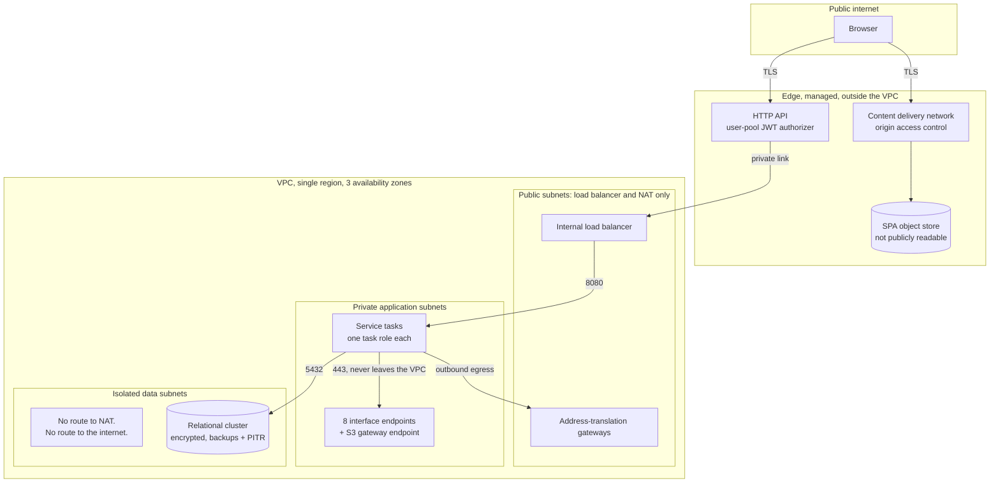

# Security and Identity

---

> **Purpose.** This document maps the CardDemo baseline's security posture onto the
> target's across five concerns: **identity**, the **authorization model**,
> **encryption** at rest and in transit, **data exposure and masking**, and
> **network isolation**. It records the one place in the entire migration where
> **functional parity is explicitly declined** — the plaintext password field — and
> it enumerates the mechanisms that make *no secrets committed to the repository* a
> structural property of the design rather than an outcome of review. It discharges
> the security-and-identity portion of **Deliverable 2** of the seven numbered
> deliverables — *"/docs/architecture — target architecture diagram, service
> catalog, and data-mapping (VSAM/Db2/IMS → AWS) tables"* — together with the
> security half of the cross-cutting requirement: *"encryption in transit and at
> rest, least-privilege IAM, no secrets in source"*.
>
> It is the **sixth** of the nine documents in this folder, and it is deliberately
> not the naming authority for anything. Service names, package roots, schema
> ownership and the column-by-column derivations belong to
> [`service-catalog.md`](service-catalog.md) and
> [`data-model-and-schema-mapping.md`](data-model-and-schema-mapping.md); this
> document cites both rather than restating either.
>
> **Source of truth.** Five bodies of baseline reference material, all read and
> none modified:
>
> * the security record [`app/cpy/CSUSR01Y.cpy`](../../app/cpy/CSUSR01Y.cpy) —
>   `01 SEC-USER-DATA` at L17, whose six fields include `SEC-USR-PWD PIC X(08)` at
>   **L21** and `SEC-USR-TYPE PIC X(01)` at L22;
> * the sign-on program [`app/cbl/COSGN00C.cbl`](../../app/cbl/COSGN00C.cbl) — the
>   `READ-USER-SEC-FILE` paragraph declared at L209, whose read-and-evaluate block
>   runs **L211–L256**, comparing at L223 and branching at L230–L240;
> * the shared session structure
>   [`app/cpy/COCOM01Y.cpy`](../../app/cpy/COCOM01Y.cpy) — `01 CARDDEMO-COMMAREA`
>   spanning **L19–L44**, carrying `CDEMO-USER-ID PIC X(08)` at L25 and
>   `CDEMO-USER-TYPE PIC X(01)` at L26 with its `'A'`/`'U'` condition names at
>   L27–L28;
> * the CICS resource definitions [`app/csd/CARDDEMO.CSD`](../../app/csd/CARDDEMO.CSD)
>   — a 505-line file whose **eight** `DEFINE FILE` stanzas occupy **L1–L99**;
> * the Db2 objects of the authorization extension —
>   [`AUTHFRDS.ddl`](../../app/app-authorization-ims-db2-mq/ddl/AUTHFRDS.ddl), the
>   fraud table keyed `PRIMARY KEY(CARD_NUM,AUTH_TS)` at L28, and
>   [`XAUTHFRD.ddl`](../../app/app-authorization-ims-db2-mq/ddl/XAUTHFRD.ddl), its
>   four-line unique index declaring `COPY YES` at **L4**.
>
> Three further baseline files are cited at specific lines where the argument needs
> them: [`app/cpy/CVACT02Y.cpy`](../../app/cpy/CVACT02Y.cpy) L7 for the card
> verification value, [`app/cpy/CVCUS01Y.cpy`](../../app/cpy/CVCUS01Y.cpy) L17–L18
> for the two national identifiers, and
> [`app/app-authorization-ims-db2-mq/cbl/COPAUA0C.cbl`](../../app/app-authorization-ims-db2-mq/cbl/COPAUA0C.cbl)
> L753–L754 for the identity context on the reply. The preserved mainframe security
> path is cited from [`samples/jcl/RACFCMDS.jcl`](../../samples/jcl/RACFCMDS.jcl).
>
> On the target side the source of truth is the authored input surface itself, not
> prose about it: [`infra/modules/kms/variables.tf`](../../infra/modules/kms/variables.tf),
> [`infra/modules/network/variables.tf`](../../infra/modules/network/variables.tf),
> [`infra/modules/cognito/variables.tf`](../../infra/modules/cognito/variables.tf)
> and the role and grant script
> [`data-migration/sql/V0__schemas_and_roles.sql`](../../data-migration/sql/V0__schemas_and_roles.sql).
> Every target claim below that can be checked against a file is cited to that
> file, so a reader can distinguish what is authored from what is intended.
>
> **Delivers, and who will consume it.** It delivers the baseline-to-target
> identity mapping, the user-type-to-group-to-authority chain, the RACF mapping
> rationale, the IAM and database-role boundaries, the encryption and key
> boundaries, the masking rules, and the network isolation model. Its declared
> consumers are `docs/adr/ADR-008-security-and-identity.md`, which records the
> decision this document describes the shape of; `MIGRATION_README.md` and
> `docs/runbooks/deploy.md`, which reference the credential and identity handling
> rather than re-deriving it; the `SecurityConfig` class of each of the eight
> services and the `JwtRoleConverter` of `common-lib`, which implement the
> authority conversion established here; and
> [`data-model-and-schema-mapping.md`](data-model-and-schema-mapping.md), which
> defers the cluster-level recoverability replacement to this document at its
> L508–L517.
>
> **None of those consumers has landed yet, and that is stated rather than
> implied.** A path naming a document that does not exist appears below as a plain
> code span rather than as a link, per the Markdown convention in
> [`../CODE_DOCUMENTATION_STANDARD.md`](../CODE_DOCUMENTATION_STANDARD.md)
> L791–L798; each becomes a link when the file it names exists. A reader can
> therefore tell a written document from a contracted one without clicking.
>
> **Caveats, and one of them is load-bearing for every sentence here.** There is
> **no provisioned environment**. The infrastructure is authored and checked only
> to the extent its current state admits, and applying it to a live account is an
> operator action outside this scope. Consequently **no penetration test, security
> audit, compliance assessment or certification has been performed, and none is
> claimed anywhere in this document** — not for any regulatory standard, framework
> or control catalogue. The masking, encryption and isolation rules below are
> **design commitments expressed in schema, mapper and infrastructure code**,
> verified by unit and architecture tests where they are testable. The full set of
> boundaries is in
> [Caveats, boundaries and out-of-scope](#caveats-boundaries-and-out-of-scope), and
> reading that section is not optional for interpreting this one.

**Scope of this document is additive and reference-driven.** It never modifies the
COBOL baseline. `app/**` — programs, copybooks, BMS mapsets, JCL, the CICS resource
definitions and the seed data — is cited here by path and line and is read-only, as
are `tests/**`, `scripts/**` and `samples/**`. **No baseline defect is corrected in
COBOL by this migration**, and nothing below should be read as asserting that one
was: where the target behaves differently, the difference is a decision taken in
the target and recorded as such.

**Exactly three pre-existing files may be modified by this migration** —
`README.md`, `CONTRIBUTING.md` and [`.gitignore`](../../.gitignore). None of the
three is this document, and the one that carries security weight — the ignore file,
which keeps infrastructure state out of version control — is referenced here as an
existing artifact rather than described as this document's work.


## WHY (non-obvious design decisions)

This section carries the reasoning for the choices this document makes **about
itself**. Decisions about the security architecture it describes are justified at
the point where each is stated, under the same four category names, spelled as
[`../CODE_DOCUMENTATION_STANDARD.md`](../CODE_DOCUMENTATION_STANDARD.md) L216–L262
fixes them: plural, unparenthesised, colon retained, no emphasis on the label
itself.

- Refactoring Rationale: this is the one document in the folder whose dominant
  category is `Refactoring Rationale` rather than `Assumptions`, and the reason is
  structural rather than stylistic. Every other document in this folder describes a
  target mechanism that *preserves* a baseline contract; this one describes the
  single mechanism that deliberately **does not** — credential handling. Rule 1
  defines that category as documenting *what was wrong with the old approach*, so
  the category the rule supplies is the category the content requires. The
  obligation it creates is stated in the next bullet, because it cuts the other way.
- Assumptions: naming what the baseline does is not the same as claiming it was
  changed, and this document keeps the two strictly apart. The baseline stores and
  compares an eight-character password field exactly as it always has; nothing in
  `app/**` is edited, and the words *fixed*, *corrected*, *patched* and
  *remediated* are therefore never applied to it anywhere below. What changed is
  the **target's** design decision. Stating this once, here, is what lets the rest
  of the document use precise language — "not carried forward", "declined parity" —
  without hedging every sentence.
- Trade-offs: the baseline's security posture is described **factually, with line
  citations, and never editorially**. CardDemo is a demonstration application, and
  its `RECOVERY(NONE)` and `JOURNAL(NO)` file attributes are a straightforward
  consequence of that. Naming the attribute and its line is sufficient to motivate
  the target's choice; characterising it as a deficiency would add nothing a reader
  cannot see and would misrepresent a working system that continues to run. The
  accepted cost is that a reader wanting a security judgement of the baseline will
  not find one here — this document states what each side does, and stops.
- Alternatives Considered: the target claims are cited to the **authored
  infrastructure inputs** rather than to the architecture narrative. Citing the
  narrative would have been shorter and would have let this document assert a
  four-key boundary, a two-role reporting split and a no-password seed path with no
  way for a reader to check any of the three. Citing
  [`kms/variables.tf`](../../infra/modules/kms/variables.tf),
  [`cognito/variables.tf`](../../infra/modules/cognito/variables.tf) and
  [`V0__schemas_and_roles.sql`](../../data-migration/sql/V0__schemas_and_roles.sql)
  means each claim fails visibly if the file changes underneath it.
- Assumptions: no value that is or resembles a credential appears anywhere in this
  document. There is no key identifier, account number, resource name, user pool
  identifier, registry hostname, example password or token — and, specifically, **no
  invented ARN**, because a plausible-looking one is indistinguishable from a real
  one to a scanner and teaches a reader to expect the pattern in prose. Where a
  value would otherwise appear, a placeholder in angle brackets stands in its
  place. Baseline literals that already exist in the reference source — dataset
  names, the `'A'` and `'U'` user-type codes, program and transaction names — are
  not credentials and are cited as written.
- Trade-offs: the database-role boundaries are given at the **granularity the
  script actually implements**, which in two places is narrower than the
  architecture summary. The batch role's write surface on the `account` schema is
  one named table, not the schema; and the reporting tier is two roles, not one.
  Reproducing the coarser summary would have read more consistently with the
  narrative and would have overstated the privilege each tier holds — an error in
  the dangerous direction for a document whose subject is least privilege. The cost
  is that this document and a one-line summary of it will differ, so the citation
  to the script is given every time the distinction matters.


## Identity: the one place parity is explicitly declined

Everywhere else in this migration, a difference in observable behaviour is either
absent or registered as a defect divergence. Identity is the exception: it is a
**deliberate behavioural change in the target**, decided on its merits rather than
inherited, and it is the only one of its kind.

### What the baseline does

The security record declares six fields, and the fourth of them holds the
credential in clear:

| Field | Picture | Line |
|---|---|---|
| `SEC-USR-ID` | `PIC X(08)` | [L18](../../app/cpy/CSUSR01Y.cpy) |
| `SEC-USR-FNAME` | `PIC X(20)` | L19 |
| `SEC-USR-LNAME` | `PIC X(20)` | L20 |
| **`SEC-USR-PWD`** | **`PIC X(08)`** | **L21** |
| `SEC-USR-TYPE` | `PIC X(01)` | L22 |
| `SEC-USR-FILLER` | `PIC X(23)` | L23 |

`SEC-USR-PWD PIC X(08)` is an eight-character alphanumeric field stored in plain
text in the `USRSEC` record. Sign-on reads that record and compares the entered
value against the stored value **directly**: within the `READ-USER-SEC-FILE`
paragraph, [`COSGN00C.cbl`](../../app/cbl/COSGN00C.cbl) issues an `EXEC CICS READ`
of the security dataset into `SEC-USER-DATA` at L211–L219, then evaluates the
response and, on a successful read, tests `IF SEC-USR-PWD = WS-USER-PWD` at
**L223**. There is no hash, no salt and no work factor in that comparison, because
there is nothing stored to compare against but the characters themselves. The whole
read-and-evaluate block runs **L211–L256**, and its three outcomes are the three
verbatim messages at L242, L249 and L254.

That is a factual description of the baseline, cited to its lines. It is not a
finding, and the file it describes is unchanged by this migration.

### What the target does

The password field is **not carried forward at all.**

There is no password column in the `auth` schema — not encrypted, not hashed, not
present. [`data-model-and-schema-mapping.md`](data-model-and-schema-mapping.md)
records the non-carry-forward as a **schema decision** in its `auth` field table at
L960, where `SEC-USR-PWD (L21)` maps to *not carried forward* with no target column
and no target type, and it carries the accompanying rationale at L969–L974. What
`auth.users` keeps instead is a **subject reference**: a `cognito_sub UUID UNIQUE`
column, added at L963 of that table with no baseline source, which is the only link
between a row in the user table and an identity in the managed user pool.

Credential handling therefore leaves the application entirely. Verification is
performed by the managed identity provider; the services never see a password, and
no service has a code path that could compare one. Seed identities are created **at
provisioning time with generated credentials**, and this is verifiable rather than
asserted: the `seed_users` input at
[`infra/modules/cognito/variables.tf`](../../infra/modules/cognito/variables.tf)
L923 states in its own description that it *"Carries no password: main.tf generates
each initial credential during apply and stores it in Secrets Manager"*, and that
the baseline's own demo identities — defined by
[`app/jcl/DUSRSECJ.jcl`](../../app/jcl/DUSRSECJ.jcl) L35–L44 — are named there by
identifier and user type only. The consequence is the one that matters for the
repository: **at no point does a human type a credential into a file that could be
committed.**

> **Refactoring Rationale: parity is declined here, and declining it is the
> decision — not an omission and not a repair.** Reproducing the baseline's scheme
> faithfully would mean carrying an eight-character cleartext credential into a
> relational column, where every backup, every exported query result and every
> `SELECT *` would disclose the full set. Preserving observable behaviour is this
> migration's governing constraint everywhere else; here the behaviour whose
> preservation is at stake is *storing and comparing cleartext*, and reproducing it
> in a new datastore would be a choice actively taken rather than a contract
> honoured. So the field is dropped from the model and verification is delegated.
> **The baseline is untouched: `SEC-USR-PWD` is still declared at
> [`CSUSR01Y.cpy`](../../app/cpy/CSUSR01Y.cpy) L21 and still compared at
> [`COSGN00C.cbl`](../../app/cbl/COSGN00C.cbl) L223, and the mainframe sign-on path
> works exactly as it always did.** This is a divergence in the target, registered
> with every other documented divergence in
> `docs/architecture/cobol-to-service-traceability.md`, which is the authoritative
> register for all of them.

Two consequences of the delegation are worth stating because a reader looking for
them in the schema will not find them there. Password policy — length, character
classes, temporary-credential validity — is a property of the user pool and is
configured through its module inputs rather than through application code or a
database constraint. And because the services hold no credential, there is no
application-side reset, lockout or expiry path to implement; those are pool
behaviours. Neither is a gap in the data model; both are consequences of the field
not existing in it.

> **Assumptions: delegating verification makes the identity provider's behaviour an
> external contract this design depends on, and that dependency is real rather than
> nominal.** Four behaviours are assumed of the pool and implemented nowhere in this
> repository: credential verification, password policy enforcement, credential reset,
> and repeated-failure handling. If the pool were replaced by a provider that did not
> offer one of them, the gap would not surface as a compilation or test failure in any
> service — there is no code path to break, because the absent behaviour was never
> application code. It would surface as a missing control. The dependency is recorded
> here for exactly that reason: it is the class of assumption that is invisible in a
> diff.

### A note on the anonymised clone

[`app/cpy/UNUSED1Y.cpy`](../../app/cpy/UNUSED1Y.cpy) declares `01 UNUSED-DATA` with
six fields whose pictures are `X(08)`, `X(20)`, `X(20)`, `X(08)`, `X(01)` and
`X(23)` — field for field and width for width, the layout of `SEC-USER-DATA`. It is
an anonymised clone of the security record, and it is referenced by no program in
the repository. It **retires with no target at all**: it is one of only two baseline
items in the entire migration that map to nothing, and it is registered as such in
`docs/architecture/cobol-to-service-traceability.md`. It is recorded here because a
reader auditing credential handling will encounter a second structure holding a
password-shaped field and needs to know its disposition; that disposition is
"nothing consumes it, and nothing replaces it".


## The authorization model: user type, group, claim, authority

The baseline expresses authorization with a single character. The target expresses
the same two-valued distinction as a signed group claim converted into framework
authorities. The chain is one-to-one at every link:

| Baseline | Target |
|---|---|
| `SEC-USR-TYPE` value `'A'` ([`CSUSR01Y.cpy`](../../app/cpy/CSUSR01Y.cpy) L22) | group `carddemo-admin` |
| `SEC-USR-TYPE` value `'U'` | group `carddemo-user` |
| the type field **read from the security record** ([`COSGN00C.cbl`](../../app/cbl/COSGN00C.cbl) L227) | the **`cognito:groups` claim** in a validated token |
| conditional branching on the type field (`IF CDEMO-USRTYP-ADMIN`, [`COSGN00C.cbl`](../../app/cbl/COSGN00C.cbl) L230) | **Spring Security authorities**, converted **once** in the shared kernel by `JwtRoleConverter` |

**The domain is closed at two values on both sides, and on the target side that
closure is enforced rather than assumed.** In the baseline it is closed by the two
condition names on the session field — `88 CDEMO-USRTYP-ADMIN VALUE 'A'` and
`88 CDEMO-USRTYP-USER VALUE 'U'` at
[`COCOM01Y.cpy`](../../app/cpy/COCOM01Y.cpy) L27–L28. In the target it is closed by
a validation rule on the `seed_users` input at
[`infra/modules/cognito/variables.tf`](../../infra/modules/cognito/variables.tf)
L943, which rejects any `user_type` that is not exactly `"A"` or `"U"`, cites those
two condition names as its authority, and records that exactly two groups are
created with **no third group and no fallback**. The database agrees: the `auth`
schema constrains `user_type` to the same two values, per
[`data-model-and-schema-mapping.md`](data-model-and-schema-mapping.md).

> **Refactoring Rationale: the client can no longer assert its own privilege
> level, and the mechanism — not the sentiment — is the reason.** The baseline is
> strictly pseudo-conversational: a CICS task ends at every screen turn, so all
> continuity between turns lives in one structure,
> [`app/cpy/COCOM01Y.cpy`](../../app/cpy/COCOM01Y.cpy) **L19–L44**, shared by all
> eighteen online programs. That structure carries `CDEMO-USER-ID PIC X(08)` at L25
> and `CDEMO-USER-TYPE PIC X(01)` at L26, and it is **storage the server hands to
> the terminal and receives back on the next turn**. Sign-on populates the type
> field once, at [`COSGN00C.cbl`](../../app/cbl/COSGN00C.cbl) L227, from the record
> it just read — but every subsequent turn takes the value from the returned
> structure, not from a fresh read of `USRSEC`. The field that decides
> administrative access therefore arrives from the client on every turn after the
> first, so a client that returned a modified structure would present a modified
> user type. In the target the client **cannot assert anything**: the group claim is
> **cryptographically signed by the issuer and validated on every single request**,
> and a modified claim fails signature verification before any handler runs. That is
> the specific difference — the value's provenance changes from *echoed back by the
> caller* to *signed by the issuer* — and it is why this mapping is a genuine change
> in the trust model rather than a change of transport.
> [`service-catalog.md`](service-catalog.md) reaches the same conclusion from the
> statelessness direction, in its
> [Why every context is stateless](service-catalog.md#why-every-context-is-stateless)
> section; this document is the one that states the authorization consequence.

### Where the decision is taken, and where it is enforced

The consequence for routing is precise: **administrative routes are guarded by the
claim, never by a client-supplied field.** The admin-versus-user branch that the
sign-on program performs with `EXEC CICS XCTL` — to `COADM01C` at
[`COSGN00C.cbl`](../../app/cbl/COSGN00C.cbl) L231–L234 when
`CDEMO-USRTYP-ADMIN` holds, and to `COMEN01C` at L236–L239 otherwise — becomes two
separable things in the target, and separating them is the point:

* a **navigation decision** in the browser, taken from the group claim the client
  already holds, which selects the administrative or the general landing route; and
* an **authorization decision** on the server, taken independently from the same
  claim on every request to a protected endpoint.

> **Assumptions: the navigation decision is a convenience and carries no security
> weight, and the design depends on that separation holding.** A client that
> navigated to an administrative route without the administrative group would render
> a screen and then receive an authorization failure from every call that screen
> makes, because each service re-derives authority from the token independently. The
> alternative considered was to let the server drive navigation, mirroring `XCTL`
> more closely; it was rejected because it would reintroduce a server-held notion of
> "where this user is", which is the pseudo-conversational state the migration
> removes. The accepted cost is that an unauthorised route is reachable and empty
> rather than unreachable — a rendering difference, not a privilege difference.

The conversion from claim to authority happens **once**, in `JwtRoleConverter` in
`common-lib`, and not per service.

> **Alternatives Considered: one converter in the shared kernel, rather than eight
> equivalent ones.** Each service could have mapped `cognito:groups` to authorities
> in its own `SecurityConfig`. That was rejected for a specific failure mode: eight
> independent implementations of the same mapping drift independently, and the drift
> is silent — a service whose converter used a different authority prefix or dropped
> an unrecognised group would fail *open* on an endpoint whose rule expected the
> other spelling, and nothing about that service's own tests would notice. One
> converter makes the mapping a single reviewable artifact and makes an unrecognised
> group's treatment a single decision. The accepted cost is that a change to the
> mapping is a change to the shared kernel, so it rebuilds all eight services.


## RACF: a mapping, not a port

The baseline's external security manager **has no cloud analogue, and this document
does not pretend that it has one.** Its role is filled by **least-privilege IAM task
roles plus managed user-pool groups**, and **the substitution is documented as a
mapping rather than as a port.**

The reason is structural, not preferential. RACF is a *single* external security
manager that mediates dataset access, transaction access and general resource
access for the whole system through one profile database, and the baseline's own
sample commands show both halves of that in four lines:
[`samples/jcl/RACFCMDS.jcl`](../../samples/jcl/RACFCMDS.jcl) alters a profile in the
CICS-transaction grouping class to admit a transaction at L24, and connects a user
to a group at L29. One manager, one command language, both the resource permission
and the group membership.

The target distributes those same effective boundaries across **two mechanisms that
do not share a policy language, an evaluation point or an administrative surface**:

| Concern | Baseline mechanism | Target mechanism |
|---|---|---|
| Which infrastructure resources a running component may touch | RACF profiles on datasets and resources | **IAM task role** per service, evaluated by the cloud control plane |
| Which application operations a signed-in person may perform | RACF group membership plus transaction-class profiles | **User-pool group claim** → framework authority, evaluated in the service |
| Which rows and columns a component may read or write | Dataset-level profile | **Database role** grants and revokes, evaluated by the database |

> **Refactoring Rationale: a rule-for-rule port was considered and rejected,
> because there is no target service that accepts a RACF profile.** The mapping is
> not lossy through carelessness; it is lossy because the mechanisms are **not
> isomorphic**. A single RACF profile can simultaneously express *which* users may
> reach a resource and *what* they may do to it, evaluated at one point. The target
> reaches the same effective boundary only by composing three independent decisions
> — a task role, a group claim and a database grant — evaluated at three points by
> three engines. There is no transformation that turns one profile into that triple
> mechanically, and any attempt to write one would produce a mapping table that
> looked authoritative while being unverifiable in either direction. **This document
> therefore maps effective privilege boundaries, not rules**: for each thing the
> baseline could do or was prevented from doing, it names the target mechanism that
> preserves the boundary. The accepted cost is that no line-by-line RACF
> correspondence exists to audit against, which is why the target-side boundaries
> below are each cited to the file that implements them instead.

> **Assumptions: RACF is not retired by this migration and is not described as
> superseded.** The mainframe security path continues to exist and to work — the
> sample commands, the CICS resource definitions and the baseline sign-on are all
> unchanged reference material. **The migration adds a path; it does not remove
> one.** The mapping above describes what fills RACF's role *in the target*, on the
> assumption that a component running there cannot reach a mainframe security
> manager at all, which is the same "no manual mainframe dependency" constraint that
> governs every other part of this migration.


## IAM and database-role boundaries

Least privilege is expressed at two independent layers, and a component must clear
both to reach data. The infrastructure layer decides which cloud resources a task
may call; the database layer decides which rows a connection may read or write.
Neither layer trusts the other.

**Every name below is a placeholder.** No resource identifier, account number or
ARN appears in this document, for the reason given in the WHY section: a
plausible-looking identifier in prose is indistinguishable from a real one and
trains a reader to expect the pattern. Where an identifier would appear, the shape
is written as `<service>-task-role-<env>` and the concrete value is a property of an
apply, not of this document.

### One task role per service

Each of the eight services runs under **its own task role**, granted only what that
service needs and nothing that a sibling needs:

| Grant | Scoped to |
|---|---|
| Read one secret | **that service's** database credential entry only |
| Use a queue | only the queues that service produces to or consumes from — which for six of the eight services is **none at all** |
| Write logs | that service's own log group |
| Read or write objects | that service's own prefix within the dataset bucket, not the bucket |
| Decrypt | the customer-managed key covering the data class it touches, per the four-key split below |

> **Trade-offs: per-service roles rather than one shared task role.** A single role
> covering all eight services would be one artifact to review instead of eight, and
> it would make an added service a no-op change. It was rejected because it collapses
> the blast radius of a compromise from one service to all eight: a container
> escaping in the reporting tier would inherit the authorization tier's queue
> permissions and the batch tier's secret. The accepted cost is real — eight roles
> and eight policy documents to keep correct, and a service that gains a dependency
> needs its role amended before it works — and it is paid deliberately, because a
> permission that has to be added to be used is a permission whose absence is
> visible in a failing deployment rather than invisible in an over-broad grant.

### Database roles, at the granularity the script implements

The role and grant surface is authored in
[`data-migration/sql/V0__schemas_and_roles.sql`](../../data-migration/sql/V0__schemas_and_roles.sql),
and it is that file — not a summary of it — that this section reports. Two tiers
differ from the coarse description, both in the narrower direction.

**The batch tier's cross-schema write surface is one named table, not a schema.**
`batch-service` is the one deliberate departure from database-per-service ownership,
because transaction posting commits three writes as a single unit of work across two
schemas; [`service-catalog.md`](service-catalog.md#the-exception-batch-service-cross-schema-write-grants)
holds that decision and its rejected saga alternative, and
[`data-model-and-schema-mapping.md`](data-model-and-schema-mapping.md) holds the
tables. What belongs here is the **actual privilege**, which is narrower than
"`ledger.*` and `account.*`":

| Schema | Privilege held by the batch role | Line |
|---|---|---|
| `ledger` | `SELECT`, `INSERT`, `UPDATE` on all tables, plus sequence usage | L666–L667 |
| `account` | `SELECT` on all tables; `UPDATE` **revoked** schema-wide, then re-granted on **`account.accounts` alone** | L717, L719, L730 |
| `card` | `SELECT` only | L757 |
| `reference` | `SELECT` only | L766 |

> **Assumptions: the revoke-then-narrow sequence is the mechanism, and reading it
> as redundant would be a mistake.** The script revokes `UPDATE` across the whole
> `account` schema at L717 *before* granting it on one table at L730, and the second
> statement is guarded so it applies only once that table exists. The reason the
> revoke is there at all is that a default-privilege entry or an earlier schema-wide
> grant is **not** superseded by a narrower later grant — the two are additive — so
> the broad form has to be withdrawn explicitly for the narrow one to be the whole
> privilege. A reader auditing least privilege needs to see both statements to
> conclude anything about the resulting surface; either one alone is misleading.

**The reporting tier is two roles, and the service's own role cannot reach a base
table.** The description "a `SELECT`-only role over read-only cross-schema views"
is accurate but incomplete, and the missing half is the part that carries the
isolation:

| Role | Holds | Line |
|---|---|---|
| `carddemo_reporting_owner` — no login, owns the views | `USAGE` and `SELECT` on `ledger`, `account`, `card`, `reference` | L816–L836 |
| `carddemo_reporting` — the role the service actually connects as | `USAGE` and `SELECT` on the `reporting` schema **only**; explicitly **revoked ALL** on `ledger`, `account`, `card` and `reference`; **revoked `CREATE`** on its own schema | L885–L890, L892, L902, L914 |

> **Refactoring Rationale: splitting owner from consumer, rather than letting the
> reporting service hold the base-table grants directly.** The single-role form is
> simpler and was the obvious first shape, and it has a specific defect: a role that
> can select from the base tables can select from them *directly*, so the views stop
> being a boundary and become a convenience. Any column a view was written to
> exclude — an encrypted identifier, a full account number — is then reachable by a
> query that does not use the view, and no grant prevents it. Separating the two
> means the base-table grants live on a role that **cannot log in**, so the only path
> from the reporting service to base-table data is through a view somebody wrote. The
> `reporting` schema holds **no tables of its own**, as
> [`data-model-and-schema-mapping.md`](data-model-and-schema-mapping.md#reporting--reporting-service-a-schema-with-no-tables)
> records. The accepted cost is a second role to provision and a view to add whenever
> reporting needs a new column.

One further hardening statement applies to the cluster rather than to a role:
`REVOKE CREATE ON SCHEMA public FROM PUBLIC` at L569, which removes the default
ability of any connected role to create objects in the public schema.

### The batch orchestration's execution role

The state machine that runs the nightly chain holds an execution role scoped to
**the specific task definitions it launches**, together with the permissions it
needs to observe a task to completion and to pass the task and execution roles to
the tasks it starts. It is not granted a wildcard over task definitions, so a task
definition that is not part of the chain cannot be launched through it. The
state-by-state composition of that chain, and which state runs which task, belong to
`docs/architecture/batch-orchestration.md`.

### Deployment identity

Deployment authenticates by **short-lived federated role assumption**. The pipeline
exchanges a workload identity token for temporary credentials scoped to a
deployment role; **no stored access key exists**, in the repository or in the
pipeline's configuration. This is the third of the four structural mechanisms in
[Zero secrets in source](#zero-secrets-in-source-a-structural-property-not-a-review-outcome),
and it is what makes the "no long-lived credential anywhere" claim checkable: there
is no secret to rotate because there is no secret.


## Encryption at rest and in transit

### The baseline attributes this answers

Every one of the **eight** `DEFINE FILE` stanzas in
[`app/csd/CARDDEMO.CSD`](../../app/csd/CARDDEMO.CSD) carries both `JOURNAL(NO)` and
`RECOVERY(NONE)`. The two attributes appear as a pair in each stanza, and the count
of each across the file is exactly eight:

| Stanza | Line | `JOURNAL(NO)` | `RECOVERY(NONE)` |
|---|---|---|---|
| `ACCTDAT` | L1 | L7 | L9 |
| `CARDAIX` | L13 | L19 | L21 |
| `CARDDAT` | L25 | L31 | L33 |
| `CCXREF` | L37 | L44 | L46 |
| `CUSTDAT` | L50 | L57 | L59 |
| `CXACAIX` | L63 | L70 | L72 |
| `TRANSACT` | L76 | L82 | L84 |
| `USRSEC` | L88 | L94 | L96 |

The eight stanzas occupy **L1–L99** of the 505-line file; the first `DEFINE MAPSET`
stanza begins at L100. `RECOVERY(NONE)` declares that CICS keeps no log of changes
to the file for backout, and `JOURNAL(NO)` that no journal records are written.
Neither attribute concerns encryption, and neither is presented here as a
deficiency: CardDemo is a demonstration application and these are the settings a
demonstration file definition would reasonably carry. They are cited because they
establish what the baseline's file resources do and do not provide, which is what
the target's encryption and backup configuration is measured against rather than
assumed to improve upon.

> **Assumptions: "no recovery anywhere in the baseline" is a reading this document
> explicitly corrects, and the correction matters.** The eight-of-eight count above
> is true of the **VSAM file resources** defined in the base CICS definition. It is
> **not** true of the baseline as a whole, because the Db2 tier of the authorization
> extension does enable image copy:
> [`XAUTHFRD.ddl`](../../app/app-authorization-ims-db2-mq/ddl/XAUTHFRD.ddl) declares
> its unique index over `(CARD_NUM ASC, AUTH_TS DESC)` with **`COPY YES`** at
> **L4** — an attribute that makes the index eligible for image copy, and therefore
> recoverable rather than only rebuildable. Stating the VSAM figure without this
> reconciliation would overstate the contrast by generalising a measurement of one
> storage tier to a system that has two. The `COPY YES` attribute has no PostgreSQL
> index-level equivalent, so it cannot be carried across as written;
> [`data-model-and-schema-mapping.md`](data-model-and-schema-mapping.md) records it
> at its L508–L517 as a **dropped attribute with a named replacement** and delegates
> the replacement to this document. The replacement is stated immediately below, at
> the cluster level where it actually lives: **encrypted automated backups and
> point-in-time recovery on the relational cluster**, which is where a
> recoverability guarantee for this data now comes from. It is not an index option,
> so a reader looking for it near the index definition would not find it — which is
> precisely why it is named in both documents rather than in neither.

### At rest: four keys, one per data class

The target provisions **four customer-managed keys with rotation enabled**, one each
for the **relational cluster**, the **object store**, the **secret store** and the
**queues**. The split is not notional: the key module's input surface declares four
independent key-user lists —
[`infra/modules/kms/variables.tf`](../../infra/modules/kms/variables.tf) L276, L282,
L288 and L294 — alongside `enable_key_rotation` at L169 and a deletion window at
L205, so each key's set of authorised principals is configured separately from the
other three.

> **Trade-offs: four keys rather than one, and the reason is the shape of a key
> policy rather than a preference for more keys.** A single key covering all four
> data classes is cheaper, simpler to provision and simpler to grant. It was
> rejected because a key policy is the unit at which access to encrypted data is
> granted and revoked: with one key, every principal that can decrypt anything can
> decrypt everything, and a policy amendment made to admit a new consumer of one
> data class silently widens access to the other three. With four, a policy change
> or a key compromise is **scoped to one data class** — the queue key does not open
> the database, and the object-store key does not open the secret store. The
> accepted costs are named rather than glossed: four keys carry four times the
> monthly key charge and four rotation schedules to observe, and a component that
> legitimately spans two data classes must be granted use of both keys explicitly,
> which is an extra step at provisioning time and a failure that surfaces as an
> access-denied error rather than as a silent success.

The relational cluster additionally carries **encrypted automated backups and
point-in-time recovery**, which is the replacement named in the reconciliation
above.

### In transit: every hop

Encryption in transit is end to end, and "end to end" is enumerated rather than
asserted, because the useful question is whether any hop is exempt. None is:

| Hop | Terminates at |
|---|---|
| Browser → content delivery network / HTTP API edge | The edge, over TLS |
| Edge → internal load balancer, over a private link | The load balancer's HTTPS listener |
| Load balancer → service task | The service, on the application container port |
| Service task → relational cluster | The cluster, on the database port |
| Service task → AWS service APIs | An interface or gateway endpoint inside the network |

The last row is the one that is easy to miss and is covered in
[Network isolation](#network-isolation) below: traffic from a task to a managed AWS
API does not leave the private network at all, so it is neither exposed on the
public internet nor dependent on egress through address translation.


## Data exposure and masking

Five data elements carry disclosure rules. The rules are stated here as behaviour;
the column types that back them are derived in
[`data-model-and-schema-mapping.md`](data-model-and-schema-mapping.md) and are cited
rather than restated.

| Data element | Baseline declaration | Rule in the target |
|---|---|---|
| Primary account number | `CARD-NUM PIC X(16)`, [`CVACT02Y.cpy`](../../app/cpy/CVACT02Y.cpy) L5 | Masked to the **last four digits** in every response **except** the administrative card-detail endpoint |
| Card verification value | `CARD-CVV-CD PIC 9(03)`, [`CVACT02Y.cpy`](../../app/cpy/CVACT02Y.cpy) L7 | **Never returned by any endpoint**; stored encrypted as binary (`cvv_encrypted BYTEA`) |
| National identifier | `CUST-SSN PIC 9(09)`, [`CVCUS01Y.cpy`](../../app/cpy/CVCUS01Y.cpy) L17 | Stored encrypted (`ssn_encrypted BYTEA`); returned **masked** |
| Government-issued identifier | `CUST-GOVT-ISSUED-ID PIC X(20)`, [`CVCUS01Y.cpy`](../../app/cpy/CVCUS01Y.cpy) L18 | Stored encrypted (`govt_issued_id_encrypted BYTEA`); returned **masked** |
| Password | `SEC-USR-PWD PIC X(08)`, [`CSUSR01Y.cpy`](../../app/cpy/CSUSR01Y.cpy) L21 | **Does not exist in the target data model** — see [Identity](#identity-the-one-place-parity-is-explicitly-declined) |

The card verification value is the strictest of the five, and the reason it is
stored as ciphertext bytes rather than as the three-digit number it looks like is
recorded at [`data-model-and-schema-mapping.md`](data-model-and-schema-mapping.md)
L313: it is a value that is written and never read back, so storing it as an integer
would make it legible in every query result and in every log of one, whereas
ciphertext means a `SELECT *` cannot disclose it.

> **Assumptions: masking is applied in the mapper layer, and the whole guarantee
> rests on that being the only place it can happen.** The mapper is the
> anti-corruption boundary between the copybook-shaped record and the API
> representation, and it is the **single place in the design where copybook
> representation concerns are permitted to appear** — fixed widths, sign overpunch,
> packed decimal, dropped `FILLER`, the three field-spelling corrections made in the
> target column names, and masking. Putting the rule there rather than in each controller means a field
> **cannot escape masking by being serialised from somewhere else**: there is no
> second path from a domain entity to a response body, because a controller does not
> see the entity. The layer boundary that guarantees this is not a convention — it is
> asserted by the architecture test described in
> [`service-catalog.md`](service-catalog.md#package-boundaries), which fails the
> build on a `domain` package importing a web type, so a controller that tried to
> return an entity directly would not compile past the test.
> [`data-model-and-schema-mapping.md`](data-model-and-schema-mapping.md) L1113–L1114
> records the account-number rule at the same layer.

> **Trade-offs: the administrative card-detail endpoint is a deliberate,
> single-point exemption.** Masking the account number on that endpoint too would
> make the rule uniform and unarguable, and it would also make the administrative
> screen unable to display the record it exists to display. The exemption is
> therefore accepted, and it is bounded three ways rather than left open: it is one
> endpoint, it requires the administrative group claim, and it does **not** extend to
> the card verification value, which stays unreturnable on that endpoint as on every
> other. The alternative of a general "unmask" parameter on the ordinary endpoints
> was rejected because a parameter that widens disclosure is reachable from any
> caller that guesses it, whereas a separate endpoint is a distinct route with its
> own authorization rule.


## Network isolation

The topology is **single-region and three-availability-zone**, with three subnet
tiers. The tiers, the address-translation egress, the eight interface endpoints, the
object-store gateway endpoint and the three security groups are declared in the
network module's own header at
[`infra/modules/network/variables.tf`](../../infra/modules/network/variables.tf)
L4–L11.



### The three tiers

* **Public subnets** carry **only** the internal load balancer and the
  address-translation gateways. No service task and no database runs here.
* **Private application subnets** carry the container tasks. They reach the internet
  for outbound needs through the address-translation gateways, and they reach managed
  AWS APIs without doing so, through the endpoints below.
* **Isolated data subnets** carry the relational cluster and **have no internet route
  at all** — no address-translation route, no gateway route, nothing.

> **Refactoring Rationale: an isolated data tier with no route, rather than a
> private tier restricted by security groups.** A tier whose subnets have a route to
> the address-translation gateways and whose exposure is limited only by security
> groups is one rule-set edit away from having outbound reachability, and that edit
> is a small, plausible-looking diff. Removing the **route** removes the capability
> rather than restricting its use: with no route in the table, **an application-tier
> compromise cannot exfiltrate data directly from the data tier over the internet
> regardless of how the security groups are configured**, because there is no path
> for a packet to take. This is the strongest blast-radius control available at the
> network layer, and it is strong precisely because it does not depend on a rule
> remaining correct. The accepted cost is operational and real: anything the data
> tier would otherwise fetch from the internet — an extension downloaded on demand,
> an outbound webhook — is simply not possible, so any such need has to be met from
> inside the network or not at all.

### Endpoints: AWS API traffic never leaves the network

Eight **interface endpoints** are provisioned, and the module's input surface names
the specific consumer of each at
[`infra/modules/network/variables.tf`](../../infra/modules/network/variables.tf)
L186–L215 so that none is decorative:

| Endpoint | Why it exists |
|---|---|
| `ecr.api` | Authorises an image pull |
| `ecr.dkr` | Transfers the image layers — omitting either one leaves a task unable to start |
| `logs` | Container and state-machine logging |
| `secretsmanager` | How a service reads the generated database credential that is deliberately absent from this repository |
| `kms` | Required transitively by all of the above, each of which reads or writes ciphertext under a customer-managed key |
| `sqs` | The authorization and inquiry queues |
| `states` | How the reporting service starts an on-demand execution and how a batch task reports back |
| `ssm` | The parameters that replace the JCL `DD` statements, including the read-only flag the batch window sets |

Object storage is reached through a **gateway endpoint** instead, created
unconditionally rather than configured. The reason is mechanical and is recorded at
that variable: a gateway endpoint is a route-table entry rather than a network
interface, so it cannot be expressed as an entry in the interface list, and adding
`s3` to that list would build a second, billed path to a service that already has a
free one.

The consequence is the one that matters for isolation: **service-to-AWS-API traffic
never leaves the private network.** It is not merely encrypted on a public path —
there is no public path.

### Security groups

Three groups, each admitting exactly one direction on one port:

| Direction | Port |
|---|---|
| Load balancer → application task | the application container port, `8080` |
| Application task → relational cluster | the database port, `5432` |
| Application task → interface endpoint | `443` |

Those three port values are the ones the design fixes — the container port is the
declared default at
[`infra/modules/network/variables.tf`](../../infra/modules/network/variables.tf)
L249 and the database port is declared at L265 — and no other port is opened or
implied anywhere in this document.

### The edge

At the edge, an **HTTP API with a user-pool JWT authorizer** fronts the internal
load balancer through a **private link**, so the load balancer is never
internet-facing and an unauthenticated request is rejected at the edge rather than
inside a service. The single-page application is served from an **object-store origin
behind a content delivery network with an origin access control**, which means the
origin bucket is **not publicly readable**: it accepts requests from the
distribution and not from arbitrary callers, so there is no second, unauthenticated
route to the application's static assets.

### Region and availability-zone scope

> **Trade-offs: single-region, three-availability-zone, and multi-region topology is
> out of scope.** Three availability zones inside one region is the topology, and it
> tolerates the loss of a zone. A second region was considered and is **not
> delivered**: it would roughly double the provisioned surface — a second VPC, a
> second cluster, a second set of keys, a second set of endpoints — and it would
> introduce cross-region replication semantics, replication lag as an observable
> behaviour, and a failover decision procedure, none of which the baseline expresses
> and none of which functional parity requires. For a demonstration migration that
> cost buys resilience against a class of failure the baseline has no answer to
> either. **Disaster-recovery topology is therefore out of scope and is not described
> anywhere in this document as delivered**; the recoverability that *is* provided is
> the cluster-level backup and point-in-time recovery named above, which is a
> different guarantee and is not a substitute for a multi-region posture.


## Zero secrets in source: a structural property, not a review outcome

*No secrets committed to the repository* is one of the migration's stated
non-negotiable constraints. It is met by **four mechanisms that between them leave no
step at which a credential could enter version control**, rather than by a review
habit or a scanning pass.

> **Refactoring Rationale: the constraint is discharged by removing the
> opportunity, not by inspecting the result.** A convention — "do not commit
> secrets" — plus a scanner is the alternative, and it fails in a specific way: it is
> a detection control, so it depends on the pattern being recognised, on the scan
> running before the push, and on nobody having a legitimate-looking reason to add an
> exception. Each of the four mechanisms below instead removes a **step** at which a
> secret could be written down. The distinction is testable: with a detection control
> the honest claim is "no secret was found", whereas with these four the claim is "no
> file in this repository is ever the place a credential lives", and that is a claim
> about the design rather than about the last scan.

**Mechanism 1 — credentials are generated at provisioning time, directly into the
managed secret store.** Database credentials and seed-user passwords are produced
during an apply by the random-value provider and written straight to the secret
store; a service then reads its own entry at startup through the `secretsmanager`
interface endpoint. **There is no step at which a human types a credential into a
file.** This is verifiable in the authored input surface rather than only asserted:
the `seed_users` variable at
[`infra/modules/cognito/variables.tf`](../../infra/modules/cognito/variables.tf)
L923 states that it *"Carries no password"* and that each initial credential is
generated during apply and stored in the secret store, and its own type declares
only an identifier and a user type per entry — there is no password attribute to
populate. The baseline's ten demo identities are referenced there by their line range
in [`app/jcl/DUSRSECJ.jcl`](../../app/jcl/DUSRSECJ.jcl) L35–L44 and are re-created by
identifier and type, **not** by carrying anything across from that record.

**Mechanism 2 — environment parameter files carry only sizing and retention
values.** Each environment root's variable file holds capacity units, task counts and
sizes, log retention days, content-delivery price class and protection flags — the
values that legitimately differ between a development and a production environment.
**No secret value appears in any of them.** This is what keeps the two environment
roots identical in topology and different only in scale, and it is also what makes
the files safe to read in a pull request: there is nothing in them to redact.

**Mechanism 3 — deployment authenticates by short-lived federated role
assumption.** The pipeline exchanges a workload identity token for temporary
credentials; **no long-lived credential exists anywhere in the repository or in the
pipeline configuration.** There is no access key to store, so there is none to leak
and none to rotate.

**Mechanism 4 — the ignore file makes state and local environment files
uncommittable.** Infrastructure state is the highest-value target in this repository
because it embeds the resolved value of every attribute an apply set — which for this
stack includes generated database and seed-user credentials — and a saved plan file
embeds the same set. [`.gitignore`](../../.gitignore) excludes state files, saved
plan files and their rendered forms, along with local environment files, so **state
and local environment files cannot be committed even accidentally.**

> **Assumptions: the ignore file is referenced here, not authored here.** It is one
> of the exactly three pre-existing files this migration modifies, it is another
> agent's work within the same plan, and it already carries its own rationale at each
> pattern — including why the state and plan patterns are written as explicit pairs
> rather than as a single trailing-wildcard glob. This document depends on those
> patterns being present and does not restate or duplicate them; a reader verifying
> mechanism 4 should read the file, which is why it is linked rather than quoted.

**The example environment file lists variable names with no values.** The
single-page application's [`ui/.env.example`](../../ui/.env.example) documents each
variable a deployment must supply — the API base URL, the correlation-identifier
header name and the request timeout — and assigns **nothing** to any of them. Every
declaration is a bare `NAME=`, so the file communicates the required configuration
surface without ever being a place a value could sit.

### One identity-context detail carried over from the messaging analysis

The baseline's authorization reply is published with **default identity context**:
[`COPAUA0C.cbl`](../../app/app-authorization-ims-db2-mq/cbl/COPAUA0C.cbl) L753–L754
sets the put options to no-syncpoint combined with `MQPMO-DEFAULT-CONTEXT`, which
means the identity context on the reply **defaults to the putting application**
rather than being propagated from the requester or set explicitly. It is recorded
here because it is an identity property rather than a wire-format one; the ordering,
deduplication, correlation and expiry semantics of that exchange, and the
transactional-outbox treatment of the reply, belong to
`docs/architecture/messaging-contracts.md`.


## Reproducing the measurements in this document

Every counted claim above is reproducible from the repository. The commands below
produce the figures this document asserts, so a reader can check them rather than
trust them. They read only; none modifies anything. Run each from the repository
root.

```bash
# WHAT: count the file stanzas of the base CICS definition and, independently, the
#       two attributes this document reports on each of them.
# WHY : Assumptions: the three counts are three independent measurements of the same
#       population, so their agreement at 8 is a cross-check rather than a
#       restatement. Reporting only the attribute counts would leave "on every
#       stanza" unproven -- eight occurrences spread over seven stanzas would give
#       the same two totals and a different fact.
grep -c 'DEFINE FILE'    app/csd/CARDDEMO.CSD
grep -c 'RECOVERY(NONE)' app/csd/CARDDEMO.CSD
grep -c 'JOURNAL(NO)'    app/csd/CARDDEMO.CSD
```

```bash
# WHAT: show the plaintext credential field with its line number, and the direct
#       comparison in the sign-on program.
# WHY : Assumptions: the -n flag is what makes the output a citation rather than a
#       match. This document's central claim is located at a specific line, so a
#       bare grep that proved the field exists somewhere would not support the
#       sentence that cites L21.
grep -n 'SEC-USR-PWD' app/cpy/CSUSR01Y.cpy
grep -n 'SEC-USR-PWD = WS-USER-PWD' app/cbl/COSGN00C.cbl
```

```bash
# WHAT: show the Db2 index attribute that reconciles the "no recovery anywhere"
#       reading, and the two condition names that close the user-type domain.
# WHY : Trade-offs: these two are checked together because each one corrects a
#       generalisation the other invites. The first shows the baseline is not
#       uniform across its storage tiers; the second shows the two-value domain is
#       declared in the baseline rather than chosen by the target.
grep -n 'COPY YES' app/app-authorization-ims-db2-mq/ddl/XAUTHFRD.ddl
grep -n "VALUE 'A'\|VALUE 'U'" app/cpy/COCOM01Y.cpy
```

```bash
# WHAT: list every grant and every revoke that shapes the batch and reporting
#       privilege surfaces.
# WHY : Assumptions: the revokes have to be listed beside the grants, because a
#       narrower later grant does not supersede a broader earlier one -- the two are
#       additive. Listing grants alone would report a privilege surface wider than
#       the one the script actually leaves in place, which is the error this
#       document's role tables exist to avoid.
grep -n 'TO carddemo_batch\|FROM carddemo_batch' \
    data-migration/sql/V0__schemas_and_roles.sql
grep -n 'TO carddemo_reporting\|FROM carddemo_reporting' \
    data-migration/sql/V0__schemas_and_roles.sql
```

```bash
# WHAT: show that the seed-user input declares no password attribute, and that the
#       example environment file assigns no value to any variable.
# WHY : Trade-offs: the second command is written to print what it finds rather than
#       to assert a negative, so a variable that ever acquired a value would appear
#       in its output. A command that merely reported "no secrets found" would pass
#       identically on a file that had been emptied by mistake.
grep -n 'Carries no password' infra/modules/cognito/variables.tf
grep -nE '^[A-Z_]+=.+' ui/.env.example || echo 'no variable carries a value'
```


## Caveats, boundaries and out-of-scope

### The deployment boundary

**No live environment exists.** The infrastructure described above is **authored and
statically validated only**, and applying it to an account is an **operator action
outside this scope**. Three things follow, and all three are stated rather than left
to be inferred:

* **No penetration test, security audit, compliance assessment or certification has
  been performed on this design or on any deployment of it, and none is claimed.**
  This document does not assert that any regulatory standard, control framework or
  certification scheme is met, satisfied or aligned with — not in whole and not in
  part. A reader needing such an assurance should treat its absence here as
  deliberate.
* **The masking, encryption and isolation rules are design commitments**, expressed
  in schema definitions, mapper code and infrastructure code, and verified by unit
  and architecture tests to the extent those rules are testable in isolation. They
  are **not** verified by an external assessment, and a passing test suite is
  evidence that the code implements the stated rule, not evidence that the rule is
  sufficient.
* **"Statically validated" has a measurable state, and it is not uniform across the
  tree.** The infrastructure is at a foundation state in which provider constraints
  and input surfaces are authored and parse, format and description checks pass,
  while the checks that require a resource graph or credentials are not yet runnable.
  [`service-catalog.md`](service-catalog.md#the-deployment-boundary) records that
  state check by check, and this document neither repeats nor improves on it.

### Explicitly out of scope

The following are **not delivered** by this migration and appear nowhere in this
document as delivered. Each is listed so that its absence is a recorded decision
rather than an apparent omission:

* **Multi-region topology and disaster recovery** — single-region,
  three-availability-zone only, for the reason given under
  [Region and availability-zone scope](#region-and-availability-zone-scope).
* **Blue-green and canary deployment** — rolling deployment only. No traffic-shifting
  or dual-environment security posture is described.
* **Exposing distributed transactions** — the two-phase commit the authorization
  extension performs across its two datastores collapses into a single local
  transaction because both sides land in one schema; no distributed transaction is
  exposed, and none is offered as an interface.
* **SFTP integration, IMS DC, and the Db2 rewards extension** — listed as future work
  by the baseline itself and not brought into this migration, so no authentication,
  key management or transport security is designed for any of them.
* **Streaming platforms, application-level caching and read replicas** — no Kafka, no
  Kinesis, no Redis or managed cache tier, no read replica. Each would add a
  data-bearing component with its own encryption, access-control and network posture,
  and none is required for parity.

### The external client is not supplied by the baseline

The authorization **request producer** — the point-of-sale or authorizer client that
would submit an authorization request — **is not supplied by the baseline**. Only a
test stub exists for it, under `tests/**`, which is reference material. Building that
client is not requested, and consequently **its authentication, credential
management and transport security are out of scope**: this document describes how the
target authenticates and authorizes the consumers it owns, and makes no claim about
how an external producer would be identified.

### The mainframe security path is preserved

The baseline is reference material for this document and a working system in its own
right. Nothing under `app/**` is modified. The baseline's own sign-on program, its
`USRSEC` security file and its CICS resource definitions remain exactly as they are
and remain runnable, and the RACF sample commands under
[`samples/jcl/RACFCMDS.jcl`](../../samples/jcl/RACFCMDS.jcl) are untouched reference
material alongside the rest of `samples/**`. The existing test suite continues to run
unchanged as the functional-parity oracle. **The migration adds a path; it does not
remove one.**

### One divergence, registered elsewhere

This document names exactly one intentional behavioural change — the credential
handling in [Identity](#identity-the-one-place-parity-is-explicitly-declined). It is
recorded in the authoritative register of documented divergences,
`docs/architecture/cobol-to-service-traceability.md`, together with every other
divergence in the migration and with the disposition of the two baseline items that
retire with no target. Where a baseline behaviour is not reproduced, that register is
the place the decision is accounted for; **no baseline defect is corrected in COBOL
by this migration.**


## Related documents

**A linked row exists; a code-span row does not exist yet.** Per the Markdown
convention in
[`../CODE_DOCUMENTATION_STANDARD.md`](../CODE_DOCUMENTATION_STANDARD.md) L791–L798,
a path naming a document that has not been authored appears as a plain code span, and
becomes a link when the file exists. The distinction is mechanical: it lets a reader
tell a written document from a contracted one without clicking.

| Document | What it covers that this one does not |
|---|---|
| [`service-catalog.md`](service-catalog.md) | The eight bounded contexts, their owned data, the dependency edges, and the layer boundaries the masking guarantee relies on |
| [`data-model-and-schema-mapping.md`](data-model-and-schema-mapping.md) | The column-by-column derivation behind every encrypted and masked field, and the `auth` schema's non-carry-forward row |
| [`design-token-reference.md`](design-token-reference.md) | The presentation layer, including the screen that renders the sign-on form |
| `docs/architecture/context-and-container-diagrams.md` | The current-state and target-state architecture diagrams in full |
| `docs/architecture/batch-orchestration.md` | The state-by-state batch chain the execution role is scoped to, and the read-only flag the window sets |
| `docs/architecture/messaging-contracts.md` | Queue mapping, wire format, correlation, ordering, deduplication and the message-expiry gap |
| `docs/architecture/observability.md` | Logs, metrics, traces and alarms, including what is deliberately not logged |
| `docs/architecture/cobol-to-service-traceability.md` | The program-by-program matrix and the authoritative register of documented divergences |
| `docs/adr/ADR-008-security-and-identity.md` | The decision record for the posture this document describes the shape of, with its options, cost implications and risks |
| [`../CODE_DOCUMENTATION_STANDARD.md`](../CODE_DOCUMENTATION_STANDARD.md) | The documentation convention this document follows, including the four category labels and the `# WHAT:` / `# WHY :` idiom |
| [`tests/README.md`](../../tests/README.md) | The in-repository precedent for this convention, at its §12, and the business rules the parity oracle asserts |

