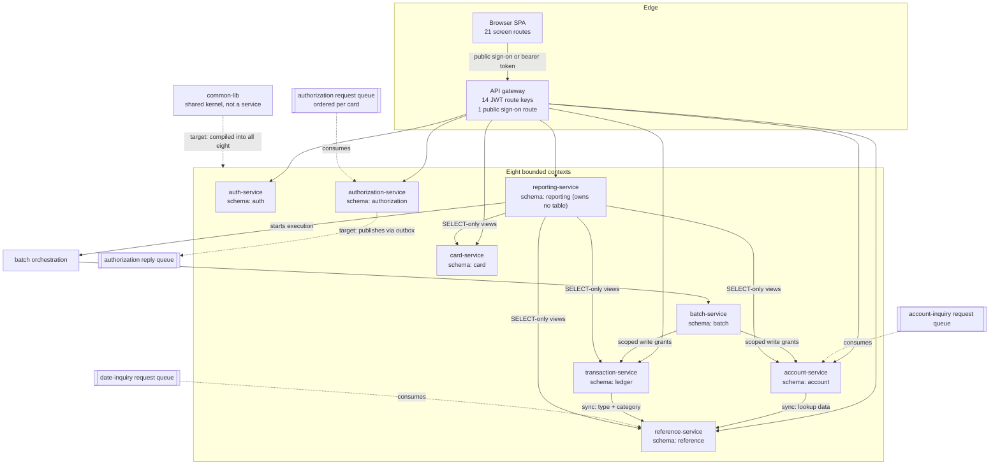

# Service Catalog

---

> **Purpose.** This document is the authoritative catalog of the **eight target
> bounded contexts** of the CardDemo migration — each one's responsibilities, the
> data it owns, and its synchronous and asynchronous dependencies. It also
> reconciles the baseline component inventory, because the repository counts its
> own components in four different ways and those four figures do not agree by
> construction. It discharges the "service catalog" half of **Deliverable 2** of
> the seven numbered deliverables: *"/docs/architecture — target architecture
> diagram, service catalog, and data-mapping (VSAM/Db2/IMS → AWS) tables"*.
>
> This document is the **naming authority** for the migration. Every sibling
> architecture document is expected to use the service names and population figures
> fixed here. The Maven module directories already use those names; the planned
> per-module READMEs do not yet exist. A variant service name or a conflated count
> introduced here propagates outward, so each figure below was measured directly
> from the repository rather than carried over from prose.
>
> **Source of truth.** Four bodies of reference material, all read and none
> modified:
>
> * the root [`README.md`](../../README.md) component tables — `#### Online
>   Components` (heading L267, header row L269, data rows L271–L294) and
>   `#### Batch Components` (heading L296, header row L298, data rows L300–L326),
>   in a 398-line file;
> * the four CICS resource definitions — [`app/csd/CARDDEMO.CSD`](../../app/csd/CARDDEMO.CSD)
>   (505 lines), [`CRDDEMO2.csd`](../../app/app-authorization-ims-db2-mq/csd/CRDDEMO2.csd)
>   (78 lines), [`CRDDEMOD.csd`](../../app/app-transaction-type-db2/csd/CRDDEMOD.csd)
>   (59 lines) and [`CRDDEMOM.csd`](../../app/app-vsam-mq/csd/CRDDEMOM.csd)
>   (41 lines);
> * the **44** migration-scope COBOL programs — 31 under `app/cbl` plus 13 across
>   the three extension trees — together with the 30 copybooks in `app/cpy` and
>   the 17 BMS mapsets in `app/bms`;
> * the shared session structure [`app/cpy/COCOM01Y.cpy`](../../app/cpy/COCOM01Y.cpy)
>   L19–L44, which is why the target services hold no session state.
>
> **Delivers, and who consumes it.** It delivers the canonical service names,
> the owned-data assignment per context, the dependency edges between contexts, and
> the component reconciliation. Its consumers are the root
> [`README.md`](../../README.md) and
> [`MIGRATION_README.md`](../../MIGRATION_README.md), which link this file by exactly the path
> `docs/architecture/service-catalog.md`; the eight sibling documents in this
> folder, which cite these service names; and the nine Maven module READMEs. The
> path spelling is part of the contract — the root README's own validation gate
> matches that string literally, so a single character of drift breaks it.
>
> **Current state.** The migration guide, all sibling architecture documents,
> and all nine Maven module READMEs are present. Paths that name those artifacts
> are links rather than future contracts.
>
> **Caveats.** Three, stated up front rather than buried. First, this is a catalog
> of a **target design**, not a report on a running system. The current Terraform
> tree passes formatting and validates in all 19 directories, but five directories
> still lack a resource graph and recursive TFLint reports the measured 86-warning
> baseline described under [The deployment boundary](#the-deployment-boundary).
> Applying it to a live account is outside this scope, so nothing here asserts that
> a provisioned environment exists or that any figure was measured on one. Second, a substantial
> list of technologies is deliberately **out of scope** and is named as such in
> [Caveats, boundaries and out-of-scope](#caveats-boundaries-and-out-of-scope) —
> none of it is described anywhere in this document as delivered. Third, the
> baseline is preserved: the mainframe path keeps working exactly as it does, and
> this catalog describes an additional path beside it.

**Scope of this document is additive and reference-driven.** It never modifies the
COBOL baseline. `app/**` — programs, copybooks, BMS mapsets, symbolic maps, JCL,
the CICS resource definitions, control cards, procedures, assembler, macros, the
catalog listing, the scheduler definitions and the seed data — is cited here by
path and line, and is read-only. The same reference status applies to `tests/**`,
`scripts/**` and `samples/**`.

**Exactly three pre-existing files may be modified by this migration**, and naming
them is what makes the additive claim above checkable rather than asserted. They are
`README.md`, `CONTRIBUTING.md` and `.gitignore`; there is no fourth, and every other
artifact of the migration is a new file in a new tree. The current `.gitignore`
contains the migration's build-output, Terraform-state, plan-file and environment
patterns. The root `README.md` and `CONTRIBUTING.md` migration updates have not been
authored, which is why the root README consumer described in the header remains a
contract rather than an existing reference.


## WHY (non-obvious design decisions)

This section carries the reasoning for the choices made *by this document about
itself*. Decisions about the architecture it catalogs are justified at the point
where each is stated, under the same four category names.

- Assumptions: the repository is authoritative and prose is not. Every count
  in [Baseline component inventory](#baseline-component-inventory-four-distinct-populations)
  was produced by measuring the files named in the header, and the measurement
  method is stated alongside each figure so a reader can repeat it. Where a
  narrative figure and a measured figure could differ, the measured one is
  recorded and the narrative one is not restated.
- Trade-offs: this document reports **four separate component populations**
  instead of one headline number. One number would be shorter to read and would
  be wrong for three of the four questions a reader actually asks — how many
  transactions the base region defines, how many the whole repository defines,
  how many the README documents, and how many screens exist. The four figures
  disagree for structural reasons, so the accepted cost is a longer inventory
  section in exchange for every figure being answerable and checkable.
- Alternatives Considered: the sibling documents could each have restated the
  service names and counts locally. That was rejected because nine independent
  copies of the same figure drift independently and there is then no authority to
  resolve the disagreement. Instead this document fixes them once and the siblings
  cite it — which is why the naming section below is explicit about canonical
  spellings rather than leaving them to be inferred.
- Alternatives Considered:  the architecture is **eight** bounded contexts. A
  nine-context decomposition, one per candidate boundary supplied as a starting
  point, is the alternative and is rejected: two of the candidates are alternate
  transports over data another context already owns, so standing them up
  separately would split ownership of a single table across two deployables —
  precisely the failure a bounded context exists to prevent. All nine candidate
  responsibilities are assigned to a target context; implementation delivery is
  measured separately below rather than inferred from that assignment.
  [Nine candidate boundaries, eight bounded contexts](#nine-candidate-boundaries-eight-bounded-contexts)
  carries the mapping context by context.
- Assumptions:  the documentation convention this file follows is the one
  already established in the repository, not a new one. The in-repository
  precedent is [`tests/README.md`](../../tests/README.md) §12 (L544–L549), which
  requires every test, fixture builder, helper, mock and runner routine to carry
  purpose, parameters, returns and exceptions, and requires its inline comments to
  justify decisions under one of four named categories, calling that a hard review
  gate. The forward-looking polyglot authority is
  [`docs/CODE_DOCUMENTATION_STANDARD.md`](../CODE_DOCUMENTATION_STANDARD.md),
  whose *Markdown and documentation* section binds every document under `docs/**`
  to open with a header stating its purpose and source of truth, to carry
  reasoning for each non-obvious assertion under the four category names spelled
  exactly as in the rule, and to use the `# WHAT:` / `# WHY :` idiom in fenced
  command blocks. Both obligations are discharged above and throughout.


## Baseline component inventory: four distinct populations

The repository counts its own components four different ways, and the four
figures are all correct about different questions. They are separated here, each
with the file and the counting method behind it, so that no figure below can be
mistaken for another. **No single number in this document is "the" transaction
count**, because no single number answers all four questions.

### Population 1 — the documented inventory (root `README.md` component tables)

The root README carries the authoritative *documented* inventory, and it spans
the base application together with all three optional extension modules.

| Table | Heading | Header row | Data rows | Count |
|---|---|---|---|---|
| `#### Online Components` | L267 | L269 | L271–L294 | **24 data rows** |
| `#### Batch Components` | L296 | L298 | L300–L326 | **27 data rows** |

The online table's six columns are Transaction, BMS Map, Program, Function,
Optional Module and Notes; the `Optional Module` column is what makes this
population wider than the base CICS region, because it tags the rows contributed
by the extensions. The 24 documented online transaction identifiers, in table
order, are `CC00`, `CM00`, `CAVW`, `CAUP`, `CCLI`, `CCDL`, `CCUP`, `CT00`,
`CT01`, `CT02`, `CR00`, `CB00`, `CPVS`, `CPVD`, `CP00`, `CA00`, `CU00`, `CU01`,
`CU02`, `CU03`, `CTTU`, `CTLI`, `CDRD`, `CDRA`.

### Population 2 — the base CICS region (`app/csd/CARDDEMO.CSD`)

The base resource definition is 505 lines and describes only the base
application. It defines no extension resources at all.

| Resource stanza | Count | Notes |
|---|---|---|
| `DEFINE FILE` | **8** | The VSAM datasets exposed to CICS. Two of the eight are alternate-index *paths* rather than base clusters: `CARDAIX` (L13) and `CXACAIX` (L63). All eight carry `RECOVERY(NONE)` and `JOURNAL(NO)` |
| `DEFINE TRANSACTION` | **18** | Each names an initial program |
| `DEFINE PROGRAM` | **18** | One of them has no source file — see `COCRDSEC` below |
| `DEFINE MAPSET` | **17** | First at L100, `DEFINE MAPSET(COACTUP) GROUP(CARDDEMO)`; last at L169, `COUSR03` |
| `DEFINE LIBRARY` | **2** | `CARDDLIB` L489 `STATUS(ENABLED)` and `COM2DOLL` L494 `STATUS(DISABLED)`, both naming `DSNAME01(AWS.M2.CARDDEMO.LOADLIB)` at L491 and L496 |
| `DEFINE TDQUEUE` | **1** | `TDQUEUE(JOBS)` L499, `DESCRIPTION(SUBMIT JOBS FROM CICS)` L500, `DDNAME(INREADER)` L501, 80-byte fixed records L502–L503 — the ad-hoc JCL submission tunnel |

The 18 base transaction-to-program pairs are `CAUP`→`COACTUPC`,
`CAVW`→`COACTVWC`, `CA00`→`COADM01C`, `CB00`→`COBIL00C`, `CCDL`→`COCRDSLC`,
`CCLI`→`COCRDLIC`, `CCUP`→`COCRDUPC`, `CC00`→`COSGN00C`, `CDV1`→`COCRDSEC`,
`CM00`→`COMEN01C`, `CR00`→`CORPT00C`, `CT00`→`COTRN00C`, `CT01`→`COTRN01C`,
`CT02`→`COTRN02C`, `CU00`→`COUSR00C`, `CU01`→`COUSR01C`, `CU02`→`COUSR02C`,
`CU03`→`COUSR03C`.

### Population 3 — the whole repository (all four resource definitions)

Summing all four CSD files gives a third figure, larger than the base region and
matching the README's breadth.

| Resource definition | Lines | `TRANSACTION` | `PROGRAM` | `MAPSET` | Transaction identifiers |
|---|---|---|---|---|---|
| `app/csd/CARDDEMO.CSD` | 505 | 18 | 18 | 17 | the 18 listed above |
| `app/app-authorization-ims-db2-mq/csd/CRDDEMO2.csd` | 78 † | 3 | 4 | 2 | `CPVD`, `CPVS`, `CP00` |
| `app/app-transaction-type-db2/csd/CRDDEMOD.csd` | 59 † | 2 | 2 | 2 | `CTLI`, `CTTU` |
| `app/app-vsam-mq/csd/CRDDEMOM.csd` | 41 | 2 | 2 | **0** | `CDRA`, `CDRD` |
| **Repository-wide** | — | **25** | **26** | **21** | — |

Assumptions: **the counting convention for the Lines column, and why two rows carry
a dagger.** Every figure in that column is a **newline count**, as reported by
`wc -l`. Two of the four files — the two marked † — have **no terminal newline**, so
each holds one further *logical* line that a newline count does not see:
`CRDDEMO2.csd` is 78 newlines and **79** logical lines, and `CRDDEMOD.csd` is 59
newlines and **60** logical lines. `CARDDEMO.CSD` (505) and `CRDDEMOM.csd` (41) both
end with a newline, so for those two the conventions agree. The convention is stated
rather than the figures silently switched because the newline count is what the
repeatable command reports, and a reader re-measuring with `wc -l` must land on the
same number this table shows. **Nothing else in this document depends on the
difference:** the resource counts in the remaining columns are parsed from `DEFINE`
stanzas, not derived from line totals, so they are identical under either
convention.

The extension transaction-to-program pairs are `CPVD`→`COPAUS1C`,
`CPVS`→`COPAUS0C`, `CP00`→`COPAUA0C`; `CTLI`→`COTRTLIC`, `CTTU`→`COTRTUPC`; and
`CDRA`→`COACCT01`, `CDRD`→`CODATE01`.

**`CRDDEMOM.csd` declares zero mapsets.** This is recorded explicitly because it
is the one row of that table a reader is likely to assume is a measurement error.
It is not: the VSAM/message-queue extension is a request-reply pair of programs
with no terminal presentation at all, so it contributes two transactions and no
screen. The README's own online table agrees — its `CDRD` and `CDRA` rows have an
empty `BMS Map` column.

### Population 4 — the presentation layer

The fourth population is the screen inventory, and it is corroborated from four
independent directions that agree exactly.

| Measurement | Base application | Repository-wide |
|---|---|---|
| `.bms` mapset source files | **17** in `app/bms` | **21** (17 base + 2 authorization + 2 transaction-type + 0 VSAM/MQ) |
| `DEFINE MAPSET` stanzas | **17** in the base CSD | **21** across all four CSDs |
| `DFHMDF` field definitions | **902** across `app/bms` | 1166 |
| Symbolic-map copybooks in `app/cpy-bms` | **17**, one per base mapset | — |

Terminal geometry is uniform: all 17 base mapsets declare `SIZE=(24,80)`, with no
exception, which is what fixes the fixed 24×80 character grid as a property of the
whole presentation layer rather than of individual screens. The 21 mapsets become
the 21 screen routes of the replacement single-page application; that mapping is
the subject of [`design-token-reference.md`](design-token-reference.md), not of
this document.

### Reproducing these figures

Every figure above is measured, so every figure is re-measurable. Run from the
repository root; all four commands are read-only.

```bash
# WHAT: count the data rows of the two root-README component tables, skipping
#       each table's heading, header and separator rows.
# WHY : Assumptions: the data rows of each table run contiguously from the line
#       given until the first non-pipe line, so the count terminates on the blank
#       line that ends the table rather than on a fixed row count. The awk body
#       uses if/else rather than two pattern rules because splitting the record
#       mutates it, and a second rule matching on "no leading pipe" would then
#       fire on the row just split and stop after one row.
awk 'NR>=271 { if (/^\|/) n++; else { print n; exit } }' README.md   # -> 24 online
awk 'NR>=300 { if (/^\|/) n++; else { print n; exit } }' README.md   # -> 27 batch

# WHAT: count the resource stanzas of the base CICS definition, then of all four.
# WHY : Assumptions: the two scopes are counted with the same pattern against
#       different file sets, which is what makes Population 2 and Population 3
#       comparable rather than two unrelated measurements.
grep -c 'DEFINE TRANSACTION(' app/csd/CARDDEMO.CSD                   # -> 18
grep -c 'DEFINE MAPSET('      app/csd/CARDDEMO.CSD                   # -> 17
cat app/csd/CARDDEMO.CSD app/app-*/csd/*.csd | grep -c 'DEFINE TRANSACTION('  # -> 25
cat app/csd/CARDDEMO.CSD app/app-*/csd/*.csd | grep -c 'DEFINE MAPSET('       # -> 21

# WHAT: count the base presentation layer -- mapset source files and screen fields.
# WHY : Assumptions: the mapset file count and the base CSD's MAPSET stanza count
#       are independent measurements of the same population, so their agreement at
#       17 is a cross-check rather than a restatement.
ls app/bms/*.bms | wc -l                                             # -> 17
cat app/bms/*.bms | grep -c 'DFHMDF'                                 # -> 902

# WHAT: partition the documented online transaction identifiers against the base
#       CICS definition's, three ways.
# WHY : Trade-offs: comparing the two as sets rather than as counts is what makes
#       the discrepancy attributable to one named identifier instead of leaving a
#       bare difference of one to be explained in prose.
readme_ids() {
  awk 'NR>=271 { if (/^\|/) { split($0, a, "|"); gsub(/ /, "", a[2]); print a[2] }
                 else exit }' README.md | sort -u
}
csd_ids() { grep -o 'DEFINE TRANSACTION([A-Z0-9]*)' "$1" | sed 's/.*(\(.*\))/\1/' | sort -u; }
comm -12 <(readme_ids) <(csd_ids app/csd/CARDDEMO.CSD) | wc -l        # -> 17 in both
comm -13 <(readme_ids) <(csd_ids app/csd/CARDDEMO.CSD)               # -> CDV1
comm -23 <(readme_ids) <(csd_ids app/csd/CARDDEMO.CSD)               # -> the 7 extension ids

# WHAT: show that the fraud-marking program is absent from both populations, and
#       that a case-sensitive glob undercounts the authorization tree.
# WHY : Assumptions: three of the eight source files in that tree use an uppercase
#       .CBL suffix, so the two listings below differ by exactly those three. The
#       second command is included precisely because it returns the WRONG figure.
grep -c 'COPAUS2C' README.md                                         # -> 0
grep -rn 'DEFINE PROGRAM(COPAUS2C)' app/                             # -> CRDDEMO2.csd:32
ls app/app-authorization-ims-db2-mq/cbl/      | wc -l                # -> 8  (correct)
ls app/app-authorization-ims-db2-mq/cbl/*.cbl | wc -l                # -> 5  (undercount)
```


## Reconciling the populations

The four populations differ for two structural reasons: the README documents the
base application *and* the extensions while the base CSD documents only the base
application, and the base CSD contains one entry with no implementation. Both
reasons resolve into arithmetic a reader can check.

### Online transactions: two identities

Comparing the 24 README online transaction identifiers against the 18 base-CSD
identifiers as sets partitions them three ways:

| Partition | Count | Identifiers |
|---|---|---|
| In **both** the README table and the base CSD | **17** | `CA00`, `CAUP`, `CAVW`, `CB00`, `CC00`, `CCDL`, `CCLI`, `CCUP`, `CM00`, `CR00`, `CT00`, `CT01`, `CT02`, `CU00`, `CU01`, `CU02`, `CU03` |
| Base-CSD **only** | **1** | `CDV1` → `PROGRAM(COCRDSEC)` |
| README **only** | **7** | `CDRA`, `CDRD`, `CP00`, `CPVD`, `CPVS`, `CTLI`, `CTTU` — set-identical to the union of the three extension CSDs |

The two identities follow directly, and both are stated because each answers a
different question:

* **18 + 7 = 25** — the 18 base-CSD transactions plus the 7 contributed by the
  three extension CSDs give the repository-wide CSD transaction count.
* **17 + 7 = 24** — the 17 transactions the README and the base CSD agree on, plus
  the same 7 extension transactions, give the README's online row count.

The 7 in both identities is the same set. The difference between the two
left-hand terms is `CDV1`, and that single entry is the whole discrepancy.

### The one dangling entry: `CDV1` → `COCRDSEC`

`DEFINE PROGRAM(COCRDSEC)` sits at `app/csd/CARDDEMO.CSD` L211 with
`DESCRIPTION(CREDIT CARD SEARCH)` at L212, and `DEFINE TRANSACTION(CDV1)` at L388
names it as its initial program at L390. Three independent signals show it has no
implementation behind it, plus one corroborating absence:

1. **No source file.** No `COCRDSEC` COBOL member exists anywhere in the
   repository.
2. **Absent from the documented inventory.** `CDV1` is not among the README's 24
   online rows.
3. **Self-described as a developer entry point.** The transaction's own
   `DESCRIPTION` at L389 reads `DEVELOPER TRANSACTION - 1`, which is a scratch
   entry rather than a business function.
4. *Corroborating, not independent:* there is no `DEFINE MAPSET(COCRDSEC)` either
   — consistent with the three signals above, but a consequence of the same
   absence rather than a fourth piece of evidence.

`COCRDSEC` therefore has **no target service**. It is documented here as a
dangling resource definition and is registered as such in
`docs/architecture/cobol-to-service-traceability.md`.

> Assumptions: resource-definition provenance operands carry no signal here.
> The `CHANGEAGENT` operand looks like it might distinguish this entry, and it
> does not. Measured across `app/csd/CARDDEMO.CSD`, `CSDAPI` appears in 6 of 8
> `FILE` stanzas, 1 of 2 `LIBRARY`, 16 of 17 `MAPSET`, 14 of 18 `PROGRAM`, the
> single `TDQUEUE`, and 16 of 18 `TRANSACTION` stanzas, with `CSDBATCH` carrying
> the remainder. The `COCRDSEC` *program* stanza carries `CSDAPI` at L218 —
> shared with 13 other program stanzas. So `CHANGEAGENT` is not a discriminator
> at the whole-file scope or within program stanzas, and it is deliberately not
> used as evidence above. Any future claim that cites it must be qualified to the
> stanza type being discussed.

### `COPAUS2C`: present in neither population

One real program appears in **neither** Population 1 nor Population 3 as a
transaction, and it is the reason a count of the authorization extension tree
comes out one short:

* it does **not** appear anywhere in the root `README.md`, so it is absent from
  the 24 documented online rows;
* it has **no `DEFINE TRANSACTION`** in any of the four resource definitions;
* its only resource definition is `DEFINE PROGRAM(COPAUS2C)` at
  `app/app-authorization-ims-db2-mq/csd/CRDDEMO2.csd` **L32**.

It is nonetheless a real, implemented program — `app/app-authorization-ims-db2-mq/cbl/COPAUS2C.cbl`
declares its function at L5 as **"Mark Authorization Message Fraud"**, and carries
the fraud action domain as condition names at L81–L82 (`'F'` to report, `'R'` to
remove). Its program stanza names `TRANSID(CPVD)`, but `TRANSACTION(CPVD)` names
`COPAUS1C` as *its* initial program, so `COPAUS2C` is reached by transfer of
control from the authorization detail screen rather than by a transaction of its
own. That is precisely why it has a program definition and no transaction
definition.

**The consequence: the authorization extension tree contains eight programs, not
seven.** `COPAUS2C` is the eighth, and it is migrated into
`authorization-service` alongside the other seven. A second, purely mechanical
trap reinforces the same undercount — three of those eight source files use an
uppercase `.CBL` suffix (`DBUNLDGS.CBL`, `PAUDBLOD.CBL`, `PAUDBUNL.CBL`) while
five use lowercase `.cbl`, so a case-sensitive `*.cbl` listing returns five rather
than eight.

### Batch jobs: the README table and `app/jcl` measure different sets

Population 1's 27 batch rows sit against 38 members in `app/jcl`, and the
difference is **two-sided** rather than a subtraction. Matching the two by name
partitions them as follows:

| Partition | Count | Detail |
|---|---|---|
| README batch row **with** a same-named `app/jcl` member | **23** | the base-application batch chain |
| README batch row with **no** `app/jcl` member | **4** | `CBPAUP0J`, `CREADB21`, `MNTTRDB2`, `TRANEXTR` — their JCL lives in the extension trees, and all four carry an `Optional Module` tag in the README table |
| `app/jcl` member with **no** README batch row | **15** | `CBADMCDJ`, `CBEXPORT`, `CBIMPORT`, `DALYREJS`, `DEFCUST`, `FTPJCL`, `INTRDRJ1`, `INTRDRJ2`, `PRTCATBL`, `READACCT`, `READCARD`, `READCUST`, `READXREF`, `REPTFILE`, `TXT2PDF1` |

Two further identities, on the same pattern as the online ones:

* **23 + 15 = 38** — the members of `app/jcl`.
* **23 + 4 = 27** — the README's batch rows.

Neither delta is an error. The 4 README-only rows are extension jobs:
`CBPAUP0J` under `app/app-authorization-ims-db2-mq/jcl`, and `CREADB21`,
`MNTTRDB2` and `TRANEXTR` under `app/app-transaction-type-db2/jcl` — the
`Optional Module` tag on each row is the discriminator. The 15 `app/jcl`-only
members are not "batch components" in the README's sense: they are three
dataset-definition jobs, four read-and-browse utilities, three submission and
internal-reader jobs, one resource-definition deployment job, the two
export/import drivers, one report-print job and one text-to-PDF utility.
Repository-wide the JCL accounting closes as 38 in `app/jcl` + 8 across the
extension trees (5 authorization, 3 transaction-type, 0 VSAM/MQ) + 9 under
`samples/**` = **55**. The job-to-orchestration mapping for the migrated members
is the subject of [`batch-orchestration.md`](batch-orchestration.md).

### Program coverage: all 44 accounted for

The 44 migration-scope programs are 31 under `app/cbl` plus 13 across the three
extension trees. Every one is accounted for:

| Group | Count | Disposition |
|---|---|---|
| `app/cbl` programs assigned to one of the eight services | **28** | see the catalog below |
| `COADM01C`, `COMEN01C` | **2** | Menu programs. Realised entirely as the `/admin` and `/menu` routes of the single-page application, with no server-side owner |
| `COBSWAIT` | **1** | The wait-step utility. Retired: its function is a state transition in the batch orchestration |
| Authorization extension tree | **8** | → `authorization-service` |
| VSAM/message-queue extension tree | **2** | `COACCT01` → `account-service`; `CODATE01` → `reference-service` |
| Transaction-type extension tree | **3** | `COTRTLIC`, `COTRTUPC`, `COBTUPDT` → `reference-service` |
| **Total** | **44** | 28 + 2 + 1 = 31 under `app/cbl`; + 8 + 2 + 3 = 44 |

> Refactoring Rationale: why the two menu programs have no service owner.
> `COADM01C` and `COMEN01C` do nothing but present an option list and dispatch to
> the chosen program, and the dispatch target travelled in the shared session
> structure. That structure is eliminated: navigation moves to client-side
> routing, and the administrator-versus-user split that decided which menu to
> present — `CDEMO-USER-TYPE` with its `'A'` and `'U'` condition names at
> [`app/cpy/COCOM01Y.cpy`](../../app/cpy/COCOM01Y.cpy) L26–L28 — becomes a signed
> group claim on the request. Assigning these two programs to a service would
> have required a server-side endpoint whose only output is a static list of
> routes the client already knows, and a "next program" field on the server is
> exactly the state being removed. They are therefore migrated as routes, not as
> endpoints, and this is recorded as coverage rather than omission.

### A note on prefix counts

`app/cbl` holds 31 programs, which by filename prefix are 12 `CB*`, 18 `CO*` and
`CSUTLDTC`. The prefix is not a reliable guide to whether a program is online:
`COBSWAIT` is `CO*`-prefixed but contains **zero** `EXEC CICS` verbs and is
listed by the README under Batch Components as the program behind the `WAITSTEP`
job. The other 17 `CO*` programs each contain between 5 and 18 `EXEC CICS` verbs.
All 12 `CB*` programs contain zero, which is the property that lets them run
standalone under an open-source compiler and is the basis of the existing test
suite's automation. So the functional split of the 18 `CO*` programs is **17
online plus one batch utility**, and the base CSD's 18 program definitions
include one (`COCRDSEC`) with no source — which is why "18" appears in three
places meaning three slightly different things.


## Nine candidate boundaries, eight bounded contexts

Nine candidate service boundaries were supplied as a starting point, with the
explicit note that they may be refined. The target is **eight** bounded contexts.
The refinement is recorded here in full, because the packaging differs from the
candidate list and the difference must not read as a dropped requirement.

| Candidate boundary | Disposition | Target context |
|---|---|---|
| Auth/User service — sign-on plus user CRUD; owns `USRSEC` | adopted | `auth-service` |
| Account service — owns `ACCTDAT`, `CUSTDAT`, `CCXREF` | adopted | `account-service` |
| Card service — owns `CARDDAT`, `CARDAIX` | adopted | `card-service` |
| Transaction service — list/view/add plus bill pay; owns `TRANSACT` | adopted | `transaction-service` |
| Reporting service | adopted | `reporting-service` |
| Batch/Posting service | adopted | `batch-service` |
| Pending Authorization — from the IMS/Db2/message-queue extension | adopted | `authorization-service` |
| **Account Inquiry** — from the VSAM/message-queue extension | **folded** | → `account-service` |
| **Transaction-Type Ref** — from the Db2 extension | **folded** | → `reference-service` (added) |

> Refactoring Rationale: why two candidates were folded rather than stood up.
> The candidate decomposition would have split ownership of a single table across
> two deployables, and the reason for changing it is stated in the migration plan
> verbatim: *"standing them up as separate services would have split ownership of
> a single table across two deployables, which is the failure mode bounded
> contexts exist to prevent."* Concretely, **Account Inquiry** (`COACCT01`, from
> `app/app-vsam-mq`) is an alternate *transport* — a message-queue request-reply
> pair — over account data that `account-service` already owns; standing it up
> separately would give two deployables write-relevant ownership of the same
> account tables. **Transaction-Type Ref** (`COTRTLIC`, `COTRTUPC`, `COBTUPDT`,
> from `app/app-transaction-type-db2`) is reference data in the same position.
> Each is folded into the context that already owns its data, and the alternate
> transport is preserved as an additional inbound adapter on that context rather
> than as a separate service.

**`reference-service` is added** as the eighth context. It owns the seeded lookup
data — transaction types and categories, disclosure groups, and the phone
area-code, state and state/ZIP-prefix tables drawn from the lookup copybook — that
address validation in `account-service` reads. Without it, that seeded reference
data would have had to live inside whichever context happened to read it first,
which reproduces the same split-ownership problem the folding above avoids.

**All nine candidate responsibilities are assigned; they are not all implemented.**
The target packaging maps nine candidates to eight deployables, with the two folded
responsibilities specified as adapters inside the contexts that own the underlying
tables. Nothing from the candidate list is dropped from the design. In the current
source tree, however, only `batch-service` and `reporting-service` contain
non-`package-info.java` main-source Java; the other six service modules do not yet
contain their controllers, services, repositories or adapters. Of those two,
`reporting-service` is complete against its own charter: both controllers, all three
services, all five read-only repository roles, all seven view projections and the
published contract are authored, and its four operations are asserted against the
handlers that serve them.


## The eight bounded contexts

The names in the first column are **canonical**. They are the names used by every
sibling document in this folder, by the Maven module directories and by the Java
package roots. They are also the names the planned per-service READMEs must use;
none of those README files is authored yet.

| Service | Maven module | Java package root | Owned schema | Source COBOL programs |
|---|---|---|---|---|
| `auth-service` | `services/auth-service` | `com.carddemo.auth` | `auth` | `COSGN00C`, `COUSR00C`, `COUSR01C`, `COUSR02C`, `COUSR03C` |
| `account-service` | `services/account-service` | `com.carddemo.account` | `account` | `COACTVWC`, `COACTUPC`, `CBACT01C`, `CBACT03C`, `CBCUS01C`, `COACCT01` |
| `card-service` | `services/card-service` | `com.carddemo.card` | `card` | `COCRDLIC`, `COCRDSLC`, `COCRDUPC`, `CBACT02C` |
| `transaction-service` | `services/transaction-service` | `com.carddemo.transaction` | `ledger` | `COTRN00C`, `COTRN01C`, `COTRN02C`, `COBIL00C` |
| `reference-service` | `services/reference-service` | `com.carddemo.reference` | `reference` | `COTRTLIC`, `COTRTUPC`, `COBTUPDT`, `CODATE01`, `CSUTLDTC` |
| `batch-service` | `services/batch-service` | `com.carddemo.batch` | `batch`, plus scoped cross-schema grants | `CBTRN01C`, `CBTRN02C`, `CBACT04C`, `CBEXPORT`, `CBIMPORT` |
| `authorization-service` | `services/authorization-service` | `com.carddemo.authorization` | `authorization` | `COPAUS0C`, `COPAUS1C`, `COPAUS2C`, `COPAUA0C`, `CBPAUP0C`, `PAUDBLOD`, `PAUDBUNL`, `DBUNLDGS` |
| `reporting-service` | `services/reporting-service` | `com.carddemo.reporting` | `reporting` — **this service owns no table**, and reads seven cross-schema views; the schema itself holds exactly one table the service may not read (see below) | `CORPT00C`, `CBTRN03C`, `CBSTM03A`, `CBSTM03B` |

**Nine Maven modules, eight bounded contexts.** A ninth module, `common-lib`
(package root `com.carddemo.common`), sits alongside the eight. It is the **shared
kernel** and it is **not** a bounded context: it owns no schema, exposes no
endpoint and is intended to be compiled into the other eight rather than deployed
as a service. It currently contains the authored shared Java utilities and codecs.
It carries the concerns that must have exactly one implementation across
the whole system — fixed-point money, the fixed-width, zoned-decimal, packed-decimal
and delimited codecs, the error and field-validation model, the keyset page
envelope, the correlation filter, the timestamp formatter and the date-edit
validator. The distinction matters when counting: a build produces nine modules
and the target topology contains eight services; no environment currently deploys
that topology.

> Alternatives Considered: a shared kernel versus duplicating the codecs.
> The alternative was to let each service carry its own copy of the money type and
> the record codecs. It was rejected because those types encode the baseline's wire
> and storage contracts — sign overpunch, packed-decimal nibbles, exact
> scale-2 arithmetic — and two copies of a sign-overpunch decoder that drift by one
> edge case produce two different balances from the same bytes, silently. In the
> baseline every program resolves these layouts through one copybook include path;
> `common-lib` is the direct analogue of that single path, which is why it exists
> as a module rather than as a convention.

### `auth-service`

| Aspect | Detail |
|---|---|
| Responsibilities | Sign-on and the four user-administration functions: list, add, update and delete |
| Source programs | `COSGN00C` (sign-on), `COUSR00C` (list), `COUSR01C` (add), `COUSR02C` (update), `COUSR03C` (delete) |
| Owned schema | `auth` |
| Owned tables | `users` |
| Baseline data | The `USRSEC` VSAM dataset, `DEFINE FILE(USRSEC)` at `app/csd/CARDDEMO.CSD` L88 |
| Synchronous dependencies | None on other contexts. It validates against the managed identity provider, and every other context depends on the tokens it issues rather than calling it |
| Asynchronous dependencies | None |

The user-type domain is constrained to `'A'` and `'U'`, carried across from the
condition names in the session structure at
[`app/cpy/COCOM01Y.cpy`](../../app/cpy/COCOM01Y.cpy) L27–L28, and mapped to the two
groups whose claim drives authorization everywhere else.

> Refactoring Rationale: the password field is not carried forward. The
> baseline user record stores an eight-character password in plain text and sign-on
> compares it directly. The target `users` table has **no password column at all**;
> credential handling moves to the managed identity provider, and the table keeps
> only a subject reference. This is the one place where parity is deliberately
> declined rather than preserved, and it is registered as a documented divergence
> in `docs/architecture/cobol-to-service-traceability.md`. The
> alternative — porting the plaintext comparison so that behaviour matched
> byte-for-byte — was rejected because it would carry a credential-storage defect
> into a new system in order to reproduce it faithfully. Details are in
> [`security-and-identity.md`](security-and-identity.md).

### `account-service`

| Aspect | Detail |
|---|---|
| Responsibilities | Account view and update, customer read, and card cross-reference lookup including the by-account access path. Also serves account inquiry over the message-queue equivalent |
| Source programs | `COACTVWC` (view), `COACTUPC` (update), `CBACT01C` (account read), `CBACT03C` (cross-reference read), `CBCUS01C` (customer read), `COACCT01` (inquiry, from `app/app-vsam-mq`) |
| Owned schema | `account` |
| Owned tables | `accounts`, `customers`, `card_xref` |
| Baseline data | `ACCTDAT` L1, `CUSTDAT` L50, `CCXREF` L37 and the `CXACAIX` alternate-index path L63, all in `app/csd/CARDDEMO.CSD` |
| Synchronous dependencies | `reference-service`, for the seeded phone area-code, state and state/ZIP-prefix lookups that address validation reads |
| Target asynchronous dependencies | Consume the dedicated account-inquiry request queue and publish to the shared inquiry reply queue — see [`messaging-contracts.md`](messaging-contracts.md) |

The `CXACAIX` alternate-index path becomes a secondary index on the account-identifier
column of `card_xref`, preserving it as a real access path rather than as a
derived query. Update carries an optimistic-concurrency version column, because
the baseline already implements a before-image comparison across the
pseudo-conversational gap; a version conflict surfaces as HTTP 409 rather than as
a lost update.

### `card-service`

| Aspect | Detail |
|---|---|
| Responsibilities | Card list with paging, card detail, and card update |
| Source programs | `COCRDLIC` (list), `COCRDSLC` (detail), `COCRDUPC` (update), `CBACT02C` (card read) |
| Owned schema | `card` |
| Owned tables | `cards` |
| Baseline data | `CARDDAT` L25 and the `CARDAIX` alternate-index path L13, in `app/csd/CARDDEMO.CSD` |
| Synchronous dependencies | None required for its own reads and writes |
| Asynchronous dependencies | None |

The `CARDAIX` path becomes a secondary index on the account-identifier column of
`cards`, so cards-by-account remains an indexed access path. The target API contract
requires primary account numbers to be masked to the last four digits except on the
administrative detail endpoint, and requires the card verification value never to
be returned. No card controller, mapper or response-serialization test is authored
yet, so those exposure controls remain delivery requirements rather than verified
runtime behaviour.

> Alternatives Considered: the card list pages by key, not by offset. This is
> the clearest instance of a browse becoming keyset pagination, so the choice is
> recorded at the context that exhibits it most plainly. Offset pagination was the
> alternative and was rejected: under concurrent inserts an offset window skips and
> repeats rows, which is observable behaviour the baseline's browse does not have.
> Keyset paging is also not a new abstraction here — the baseline already carries a
> first-key, last-key and next-page-exists triple in its session structure, so the
> page envelope transcribes state the baseline already maintains. The accepted cost
> is that a caller cannot jump to an arbitrary page number, which the 3270 browse
> could not do either.

### `transaction-service`

| Aspect | Detail |
|---|---|
| Responsibilities | Transaction list with paging, transaction detail, transaction add, and bill payment |
| Source programs | `COTRN00C` (list), `COTRN01C` (detail), `COTRN02C` (add), `COBIL00C` (bill payment) |
| Owned schema | `ledger` |
| Owned tables | `transactions`, `daily_transactions`, `transaction_rejects`, `transaction_category_balances` |
| Baseline data | `TRANSACT` L76 in `app/csd/CARDDEMO.CSD`, plus the batch alternate-index path over the transaction file |
| Synchronous dependencies | `reference-service`, for transaction-type and category validation |
| Asynchronous dependencies | None |

`transaction_rejects` preserves the baseline reject-record contract as a raw
fixed-width column plus a reason code and reason description, so the reject stream
remains byte-comparable against the golden masters. The batch alternate index over
the transaction file becomes a non-unique secondary index on the processing
timestamp, and a second index carries the by-card access path.

### `reference-service`

| Aspect | Detail |
|---|---|
| Responsibilities | Transaction-type and transaction-category maintenance, disclosure-group rate lookup, date conversion and validation, and the seeded lookup reference data |
| Source programs | `COTRTLIC` (list/update/delete) and `COTRTUPC` (add/edit) from `app/app-transaction-type-db2`; `COBTUPDT` (batch reference update) from the same tree; `CODATE01` (date inquiry) from `app/app-vsam-mq`; `CSUTLDTC` (date edit) from `app/cbl` |
| Owned schema | `reference` |
| Owned tables | `transaction_types`, `transaction_categories`, `disclosure_groups`, `us_phone_area_codes`, `us_states`, `us_state_zip_prefixes` |
| Baseline data | The transaction-type, transaction-category and disclosure-group datasets, and the lookup copybook's code lists |
| Synchronous dependencies | None |
| Target asynchronous dependencies | Consume the dedicated date-inquiry request queue and publish to the shared inquiry reply queue — see [`messaging-contracts.md`](messaging-contracts.md) |

Two constraints on this context's data are load-bearing for parity elsewhere and
so are recorded here. `transaction_categories` carries a foreign key to
`transaction_types` with restrict-on-delete, which preserves the referential
behaviour the baseline extension already asserts — a delete blocked by dependent
categories surfaces as HTTP 409 rather than as a database error. And
`disclosure_groups` **must** be seeded with the `'DEFAULT'` group row, because the
interest calculation falls back to that group when an account's disclosure-group
key is not found; without the row the fallback path has nothing to read and a
documented business rule fails silently.

### `batch-service`

| Aspect | Detail |
|---|---|
| Responsibilities | The batch chain: daily-transaction preflight, transaction posting, interest calculation, backup and combine, and the export/import round-trip |
| Source programs | `CBTRN01C` (preflight), `CBTRN02C` (posting), `CBACT04C` (interest), `CBEXPORT` and `CBIMPORT` (round-trip) |
| Owned schema | `batch` — the durable step ledger plus the job-repository tables |
| Owned tables | `batch_run`, plus the batch framework's own job-repository tables |
| Synchronous dependencies | None. Jobs are argument-driven and receive their parameters, including the business date, from the orchestrator |
| Asynchronous dependencies | None. It is invoked by the orchestrator rather than by a queue |
| Cross-schema access | **Scoped write grants on `ledger.*` and `account.*` only** — see below |

The business date is a job parameter rather than a clock read, preserving the
baseline's injected-date behaviour and with it the reproducibility that
golden-master comparison depends on. `batch_run` gives each step an idempotency
key, so a resumed step that already completed is a no-op; the baseline has no
checkpoint contract at all — its only restart directive is commented out — so this
is documented as an addition rather than as a port. The state-by-state mapping
lives in [`batch-orchestration.md`](batch-orchestration.md).

### `authorization-service`

| Aspect | Detail |
|---|---|
| Responsibilities | Pending-authorization summary and detail, fraud marking, authorization request processing, expiry/purge, and the segment load and unload utilities |
| Source programs | `COPAUS0C` (summary), `COPAUS1C` (detail), `COPAUS2C` (fraud marking), `COPAUA0C` (request processing), `CBPAUP0C` (purge), `PAUDBLOD`, `PAUDBUNL`, `DBUNLDGS` (load and unload) — all eight from `app/app-authorization-ims-db2-mq` |
| Owned schema | `authorization` |
| Target tables | `pending_auth_summary`, `pending_auth_detail`, `auth_fraud`, `auth_reply_outbox` — four, of which the first three derive from baseline stores and the fourth has no baseline counterpart |
| Baseline data | The two IMS segment layouts plus the Db2 fraud table |
| Synchronous dependencies | None |
| Asynchronous dependencies | Consumes the authorization request queue in order per opaque card group until the explicit dead-letter quarantine boundary; publishes replies through a transactional outbox — see `docs/architecture/messaging-contracts.md` |

This is the only target context that consolidates two different baseline
datastores. The pending-authorization segments and the fraud table are designed as
three of the schema's four tables in **one** schema, eliminating rather than
emulating the baseline's two-phase commit. The fourth target table,
`auth_reply_outbox`, is net-new and makes the planned local transaction sufficient;
its columns are specified in
[`data-model-and-schema-mapping.md`](data-model-and-schema-mapping.md).

**Measured implementation status:** `authorization-service` currently has neither
a Flyway migration nor non-`package-info.java` main-source Java. None of the four
tables, the listener, the transactional writer, the publisher or the purge logic is
therefore delivered by that module yet.

> Alternatives Considered: **one schema rather than two, for data that arrived
> from two stores.** Keeping the pending-authorization data and the fraud data in
> separate schemas — mirroring the baseline's split across a hierarchical store and
> a relational one — was the alternative, and it was rejected. That split exists in
> the baseline because the two stores are different products, not because the data
> has two owners: one context reads and writes all of it, and marking an
> authorization as fraudulent is a single business action across both. Preserving
> the split would have required a distributed transaction to keep that one action
> atomic, and exposing distributed transactions is out of scope for this migration.
> Consolidating into one schema removes the need for one instead of finding a way to
> satisfy it. The accepted cost is that the two baseline layouts no longer map
> one-to-one onto storage boundaries, which is why the field-by-field derivation is
> recorded in
> [`data-model-and-schema-mapping.md`](data-model-and-schema-mapping.md).

> Trade-offs: the target reply is to be published from an outbox, not inline. The
> baseline consumer uses `MQPMO-NO-SYNCPOINT` and publishes the reply before its
> database write and later CICS syncpoint. A reply can therefore escape even when
> the database work subsequently fails; the two systems do not share one atomic
> commit. The target contract writes the reply as an outbox row inside the same
> transaction as the authorization decision and publishes from the outbox
> afterwards. The accepted design cost is one extra table and a publishing step, in
> exchange for aligning a visible reply with a committed decision. Publishing inline
> was the alternative and reproduces the original inconsistency.

**The outbox is a target table in this schema, not an implementation detail.** It is
named `auth_reply_outbox` and is assigned to this context like the other three, but
the module migration that creates it has not been authored. Its specified shape
follows from the two jobs it has to do. It carries the reply exactly as the wire
format states it, the
six-field CSV, so that draining a row is a send and never a re-derivation. It
carries the two identities the FIFO reply queue needs as purpose-scoped opaque
tokens derived from the card and transaction tuple, so per-card ordering and
duplicate suppression survive a retry without PAN or raw transaction metadata. And it
carries its publication state as a nullable `published_at`, so that the drain query
is a partial index scan over unpublished rows rather than a full scan with a status
filter. Retention is bounded: a published row is removed by the same purge job that
expires pending authorizations, which is the migrated `CBPAUP0C`. The column list,
the indexes and the retention rule are specified field by field in
[`data-model-and-schema-mapping.md`](data-model-and-schema-mapping.md), and the
queue attributes the two identity columns feed are in
[`messaging-contracts.md`](messaging-contracts.md).

### `reporting-service`

| Aspect | Detail |
|---|---|
| Responsibilities | Transaction reports and statement generation, plus on-demand report submission |
| Source programs | `CORPT00C` (report request), `CBTRN03C` (transaction report), `CBSTM03A` and `CBSTM03B` (statements) |
| Owned schema | `reporting` — dedicated to this context, owned in the database by the non-login `carddemo_reporting_owner` role rather than by this context's own login role, and holding exactly one table this context's login may not read |
| Owned tables | **None owned by this service** — it authors no data-definition script and no migration. `data-migration/sql/V1__reporting_views.sql` authors the read-only cross-schema views AND the one table in the schema, `reporting.card_grouping_key`, which it assigns to `carddemo_reporting_owner` and revokes from `carddemo_reporting` |
| Target synchronous dependencies | Read-only access to `ledger`, `account`, `card` and `reference` through those views. When the migration is applied, `carddemo_reporting` receives `USAGE` on `reporting` plus `SELECT` on its views and no base-table grant |
| Target asynchronous dependencies | None. On-demand submission is designed to start an orchestration execution, replacing the baseline's transient-data-queue submission tunnel (`DEFINE TDQUEUE(JOBS)` with `DDNAME(INREADER)`, `app/csd/CARDDEMO.CSD` L499–L501) |

**`reporting-service` owns no table, and the `reporting` schema is not empty of
tables.** Those are three separate claims and all three are true, so they are stated
separately here rather than compressed into one sentence that would be false whichever
way a reader took it. (1) The SERVICE owns none: it authors no data-definition script,
no migration artifact and no `db/migration` directory, and one appearing under that
module would be a defect. (2) The SCHEMA holds exactly one table,
`reporting.card_grouping_key`, created by `data-migration/sql/V1__reporting_views.sql`,
which holds the secret that keeps the per-card statement grouping token
non-invertible. (3) The service CANNOT READ that table: the same script assigns it to
`carddemo_reporting_owner` and revokes it from `carddemo_reporting`, so the login this
service authenticates as reaches the views and nothing else. The ownership authority is
[`data-model-and-schema-mapping.md`](data-model-and-schema-mapping.md), which this
section cites rather than restating.

Refactoring Rationale: an earlier revision of this paragraph asserted the unqualified
"owns no tables" and separately recorded that only four Java projections existed and
that the controller, repositories, services and orchestration submitter remained
unauthored. Both statements have since become false and are replaced rather than
softened. The unqualified form reads as "the schema is empty", which would make the
revoke that withholds `card_grouping_key` look like dead code; and all seven
projections, five read-only repository roles, three services, both controllers and the
orchestration client are now authored, with the four published operations settled by
`services/reporting-service/src/main/resources/openapi/reporting-api.yaml` and held to
the handlers by `ReportingApiContractTest`.

**The eighth schema exists, and it is deliberately not owned by the reporting
login.** The distinction is worth stating exactly, because "this service owns no
table", "there is no reporting schema" and "the reporting schema holds no table" are
three different claims and only the first is true. `reporting` is created by
[`data-migration/sql/V0__schemas_and_roles.sql`](../../data-migration/sql/V0__schemas_and_roles.sql)
as the eighth of eight schemas, and it is the one schema whose owner is not the
login role named after it: it is owned by `carddemo_reporting_owner`, a role created
`NOLOGIN` and reachable only by a principal already holding membership in it.
That asymmetry is the security property rather than an inconsistency. A schema's
owner holds `CREATE` in it unconditionally, so owning `reporting` with
`carddemo_reporting` would let the role a reporting process authenticates as
create, replace or drop the very views that are meant to be its only reach into
other contexts' data — which would make the context read-only by convention in
code rather than in the database.

The views themselves are created by one named artifact,
`data-migration/sql/V1__reporting_views.sql`, applied **after** every per-service
`V1__*.sql` has created the tables those views read; a view cannot be created over
a table that does not yet exist, and V0 runs before any table exists anywhere. That
artifact connects as the bootstrap principal and issues `SET ROLE carddemo_reporting_owner`
before each `CREATE VIEW`, which is what makes `carddemo_reporting_owner` the views' owner —
and it is why the views resolve their own reads: a view executes with its owner's
privileges, so `carddemo_reporting_owner` holds `SELECT` on the four source schemas while
`carddemo_reporting` holds none. V0's default privileges then grant `SELECT` on each
new view to `carddemo_reporting` automatically, so the view artifact issues no
`GRANT` and cannot get one wrong. `reporting-service` itself authors no
data-definition statement at all and has no `db/migration` directory; one appearing
under that module would be a defect. A view missing at run time is a defect to
report against `V1__reporting_views.sql`, never something for a service to create
for itself.

**Measured artifact status:** V1 is authored and has been executed successfully
against a disposable PostgreSQL validation database. It is not evidence of a
deployed environment, and the repository-wide migration sequence still requires the
absent account and card source-table migrations before the view artifact can run.

> Trade-offs: **read-only views on the writer rather than a separate reporting
> store.** The alternatives were a read replica or a dedicated reporting datastore
> fed by replication. Both were rejected for the same two specific reasons: each
> adds a standing cost for a workload the baseline satisfies with direct file
> reads, and each introduces replica-lag semantics — a report that legitimately
> disagrees with the ledger it was generated from — which is a new observable
> behaviour the baseline does not have and which golden-master comparison would
> flag. Read replicas are out of scope for this migration on exactly that basis.
> The accepted cost is that reporting reads contend with transactional reads on
> the same writer, bounded by the `SELECT`-only grant and by reports being
> generated as orchestrated jobs rather than as interactive queries.


## Owned data, and the one deliberate exception

The target ownership model is schema-per-service, with **eight schemas for eight
contexts**. Six contexts own a schema and the tables designed for it; one owns a
schema, its tables and narrowly-scoped write grants outside it; and one owns a schema
in which IT owns no table -- the schema nonetheless holds exactly one,
`reporting.card_grouping_key`, owned by a non-login role and revoked from the reporting
login, as the reporting entry above sets out. The table states that target contract,
not which service migrations are already authored.

| Schema | Owning context | Written by | Read by |
|---|---|---|---|
| `auth` | `auth-service` | `auth-service` | `auth-service` |
| `account` | `account-service` | `account-service`, **and `batch-service` under scoped grants** | `account-service`, `reporting-service` (views) |
| `card` | `card-service` | `card-service` | `card-service`, `reporting-service` (views) |
| `ledger` | `transaction-service` | `transaction-service`, **and `batch-service` under scoped grants** | `transaction-service`, `reporting-service` (views) |
| `reference` | `reference-service` | `reference-service` | `reference-service`, `account-service`, `transaction-service`, `reporting-service` (views) |
| `batch` | `batch-service` | `batch-service` | `batch-service` |
| `authorization` | `authorization-service` | `authorization-service` | `authorization-service` |
| `reporting` | `reporting-service` | nothing — **no table, no write path** | `reporting-service`, `SELECT`-only, through the views held here |

### The exception: `batch-service` cross-schema write grants

`batch-service` runs against the single database cluster using a dedicated
database role that holds **narrowly-scoped cross-schema write grants on
`ledger.*` and `account.*` only**. It is the one deliberate departure from
database-per-service purity in the whole design, and it exists for one specific
reason.

> Trade-offs: **a scoped grant, rather than a saga, for the posting unit of
> work.** Transaction posting commits **three** writes as a single unit of work:
> the transaction itself, the transaction-category balance, and the account. Those
> three rows live in two schemas, so preserving one atomic commit requires that
> one role be able to write both. The alternative considered was a
> **transactional-outbox-plus-compensating-reversal (saga)** design, and it was
> **rejected**: it replaces one atomic commit with a sequence of separately
> committed steps plus compensating reversals, which introduces **observable
> intermediate states that do not exist in the baseline** — a posted transaction
> with an unposted category balance, for instance, or an updated account whose
> transaction has not yet landed. The existing golden-master suite compares posted
> records, the reject stream, the updated masters and the return code, so it would
> observe those intermediate states and correctly report them as a parity failure.
> The accepted cost of the scoped grant is that one deployable holds write
> authority in two schemas it does not own; that cost is bounded by granting only
> `ledger.*` and `account.*`, to one role, used by one service whose jobs are
> invoked by the orchestrator rather than exposed as endpoints. The saga's cost
> would have been a behavioural divergence in the most heavily asserted business
> rule in the system, which is not a cost this migration is willing to accept.

Two properties keep the exception narrow and checkable: the grant enumerates two
schemas rather than being cluster-wide, and `batch-service` exposes no endpoint
that would let a caller reach those schemas through it. The per-column derivation
of every table named above is in
[`data-model-and-schema-mapping.md`](data-model-and-schema-mapping.md).


## Cross-service dependency rules

### Synchronous

There are few target synchronous hops by design: `account-service` and
`transaction-service` are to read reference data from `reference-service`, and
nothing else calls across a context boundary in the request path. The target
contract keeps every such hop inside the private network behind an internal load
balancer and requires explicit connect and read timeouts. Those clients have not
been authored yet, so the timeout rule is a delivery requirement, not a measured
runtime property.

> Alternatives Considered: no circuit breaker is fitted. A circuit breaker
> was considered and is **deliberately omitted from the target design**. The only
> planned synchronous service-to-service hops are in-network, behind an internal
> load balancer, with bounded timeouts, and the load balancer removes unhealthy
> targets from rotation on its own. Adding a breaker on top of that introduces a
> new state — open, half-open — with its own thresholds to tune and its own
> failure mode, in which a breaker trips on a transient error and rejects requests
> that the timeout would have served correctly. It would therefore add a failure
> mode without removing one. The target durable retry tier instead sits where
> redelivery is meaningful: queue redelivery with a dead-letter queue for
> asynchronous work, and per-state retry with backoff in the batch orchestration.

### Asynchronous

| Context | Consumes | Publishes |
|---|---|---|
| `authorization-service` | target: authorization request queue, in order per card | target: authorization reply queue via a transactional outbox |
| `account-service` | target: dedicated account-inquiry request queue | target: inquiry reply queue |
| `reference-service` | target: dedicated date-inquiry request queue | target: inquiry reply queue |

The wire contracts — field order, delimiter, correlation identity, reply routing,
ordering and deduplication guarantees, and the resolution of the message-expiry
gap — are specified in [`messaging-contracts.md`](messaging-contracts.md) and are
deliberately **not** duplicated here. This catalog records only which context
consumes and publishes what.

### Package boundaries

The target package rule forbids cross-service imports of another context's
`domain` package.

> Trade-offs: the prohibition is intended to be a test, not only a convention.
> The required ArchUnit test has not been authored yet. The target is a build-failing
> architecture rule because the alternative — documenting the boundary and relying
> on review to catch violations — was rejected: an unenforced convention
> decays: the first import that crosses a boundary is invisible in a diff that
> looks otherwise reasonable, and by the time the coupling is noticed it is load-bearing.
> The accepted cost is that the boundary cannot be crossed even temporarily
> without either changing the rule deliberately or introducing a shared type in
> `common-lib`, which is the friction the rule is for. The planned test must also
> assert the other two invariants that must not decay: no infrastructure or web
> types inside a `domain` package, and no binary floating-point type anywhere in
> the money path.

### Dependency graph



### Why every context is stateless

No context holds session state, and that is a consequence of one specific
transformation rather than a general aspiration. The baseline is strictly
pseudo-conversational: a task ends at every screen turn, so all continuity between
turns lives in one structure shared by all eighteen online programs,
[`app/cpy/COCOM01Y.cpy`](../../app/cpy/COCOM01Y.cpy) L19–L44. That single structure
decomposes into four different target mechanisms, none of them server-side state:

| Session-structure fields | Baseline role | Target mechanism |
|---|---|---|
| `CDEMO-FROM-TRANID` L21, `CDEMO-FROM-PROGRAM` L22, `CDEMO-TO-TRANID` L23, `CDEMO-TO-PROGRAM` L24, `CDEMO-LAST-MAP` L43, `CDEMO-LAST-MAPSET` L44 | Where the user came from and goes next | Client-side router history. **No server-side "next program" field exists at all** |
| `CDEMO-USER-ID` L25, `CDEMO-USER-TYPE` L26 with `'A'`/`'U'` at L27–L28 | Who the user is and what they may do | Signed token claims, validated per protected request |
| `CDEMO-CUST-ID` L33, `CDEMO-ACCT-ID` L38, `CDEMO-ACCT-STATUS` L39, `CDEMO-CARD-NUM` L41 | What record is selected | Request path and query parameters |
| `CDEMO-PGM-CONTEXT` L29 with `CDEMO-PGM-ENTER` and `CDEMO-PGM-REENTER` at L30–L31 | First entry versus re-entry | **Eliminated.** A stateless handler returning a field-error array has no turn to remember |

> Refactoring Rationale: **moving identity out of the passed structure is a
> correctness fix, not a transport change.** In the baseline the session structure
> is storage the client receives and echoes back, so the user-type field that
> decides administrative access arrives from the client. In the target the client
> cannot assert its own privileges: the group claim is signed and validated on
> every protected request. Statelessness then falls out for free — with no session
> store and no sticky sessions, a context runs as several interchangeable instances
> behind a load balancer.


## Caveats, boundaries and out-of-scope

### The deployment boundary

The infrastructure for this architecture is **authored and statically
validated**. Applying it to a live account is an
**operator action outside this scope**. Consequently **no claim is made anywhere in
this document that a provisioned environment exists**, and no figure in it was
measured on a running system, load-tested or benchmarked. Every count here comes from
the repository; every architectural statement describes a target design. The exact
commands for provisioning and teardown belong to
[`docs/runbooks/deploy.md`](../runbooks/deploy.md) and
[`docs/runbooks/teardown.md`](../runbooks/teardown.md).

Assumptions: **"statically validated" is a measurable claim.** All sixteen
modules, both environment roots, and the bootstrap root have implementation
files. The module/environment READMEs and bootstrap README carry generated
contracts. The measured checks are:

| Check | Current state |
|---|---|
| `terraform fmt -check -recursive infra/` | **passes** |
| every `variable` carries a `type` and a `description` | **passes** |
| provider constraints consistent across every directory | **passes** |
| initialized `terraform validate` with backend disabled | **passes** for bootstrap, dev, and prod |
| backend-free plan graph | **renders without a dependency cycle** for both environments |
| recursive `tflint` | **passes** |
| `terraform-docs --output-check` | **passes** for nineteen documented Terraform directories |
| explicit material-security Checkov baseline | **passes with only named, bounded exceptions; the complete soft scan remains visible** |

No row asserts a live-account apply.

### Explicitly out of scope

The following are **not delivered** by this migration and appear nowhere in this
document as delivered. Each is listed so that its absence is a recorded decision
rather than an apparent omission:

* **Multi-region topology and disaster recovery** — the design is single-region,
  three-availability-zone only.
* **Blue-green and canary deployment** — rolling deployment only.
* **Streaming platforms** — no Kafka and no Kinesis. The messaging requirement
  the baseline expresses is request-reply, which queues satisfy.
* **Application-level caching** — no Redis and no managed cache tier. The baseline
  has no cache tier and none is required for parity.
* **Read replicas** — reporting reads go to the writer through `SELECT`-only
  cross-schema views, for the reasons given under `reporting-service`.
* **The Db2 rewards extension, IMS DC, SFTP integration, and exposing distributed
  transactions** — these are listed as future work by the baseline itself and are
  not brought into this migration.

### Two baseline items with no target

`COBSWAIT` is retired: its function — waiting for a given time between steps — is
a state transition in the batch orchestration rather than a program. `COCRDSEC` has
no target because it has no implementation to migrate, as established in
[Reconciling the populations](#reconciling-the-populations). Both are registered in
`docs/architecture/cobol-to-service-traceability.md`.

### Behavioural divergences are registered, not resolved here

Where a target implementation deliberately behaves differently from the baseline —
and there are such cases, including the credential handling noted under
`auth-service` — the divergence is recorded in
`docs/architecture/cobol-to-service-traceability.md`, which is
the register for all of them. This catalog names the ones that affect service
boundaries or owned data and defers the complete list to that document.

### The baseline is preserved

The COBOL baseline is reference material for this catalog and a working system in
its own right. Nothing under `app/**` is modified, no baseline defect is corrected
in COBOL, the existing test suite continues to run unchanged as the functional-parity
oracle, and the existing mainframe deployment path is left exactly as it is.
**The migration adds a path; it does not remove one.**


## Related documents

All related architecture documents are present and linked.

| Document | What it covers that this one does not |
|---|---|
| [`context-and-container-diagrams.md`](context-and-container-diagrams.md) | The current-state and target-state architecture diagrams |
| [`data-model-and-schema-mapping.md`](data-model-and-schema-mapping.md) | Field-by-field derivation of every table named here, from copybook to column |
| [`batch-orchestration.md`](batch-orchestration.md) | The job-to-state mapping, condition-code semantics and generation-dataset handling |
| [`messaging-contracts.md`](messaging-contracts.md) | Queue mapping, wire format, correlation, ordering and deduplication |
| [`security-and-identity.md`](security-and-identity.md) | Identity mapping, authorization model, encryption and network isolation |
| [`observability.md`](observability.md) | Logs, metrics, traces and alarms |
| [`design-token-reference.md`](design-token-reference.md) | The presentation-layer mapping from the 21 mapsets to screen routes and tokens |
| [`cobol-to-service-traceability.md`](cobol-to-service-traceability.md) | The authoritative program-by-program matrix and the register of documented divergences |
| [`../CODE_DOCUMENTATION_STANDARD.md`](../CODE_DOCUMENTATION_STANDARD.md) | The documentation convention this document follows |
