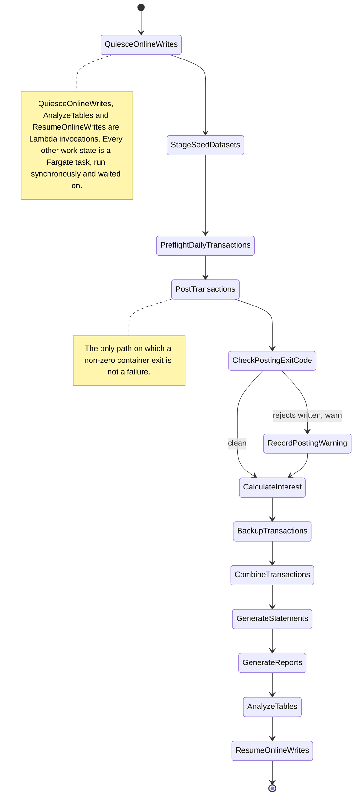

# Batch Operations Runbook

## Document contract

**Purpose**: Operate the migrated CardDemo batch estate — start the nightly chain and follow it,
read a condition code correctly, restart a failed run without double-posting, release the
online-write bracket, reach back through the dataset generations, work the messaging dead-letter
queues, and verify functional parity against the immutable COBOL baseline. This runbook owns the
run-and-validate half of the migration: `MIGRATION_README.md` links here for the depth it
deliberately does not duplicate, and the three sibling runbooks link here for the parity procedure.

**Source of truth**: `infra/modules/step-functions-batch/` for the workflow graphs,
`infra/modules/eventbridge-scheduler/` for the schedule, `infra/modules/s3-datasets/` for the
generation prefixes and `infra/modules/sqs/` for the queues; `services/batch-service/` and
`services/reporting-service/` for the jobs those graphs invoke;
[batch-orchestration.md](../architecture/batch-orchestration.md) for the long-form job-to-state
argument and [messaging-contracts.md](../architecture/messaging-contracts.md) for the wire formats.
The mainframe assets under `app/**` are the behavioural specification and are cited throughout by
path and line; they are read, never written. `scripts/run_tests.sh` outranks this prose wherever the
two could disagree, on the rule `tests/README.md` L3-L6 states: *"if a script and this README ever
disagree, the script is authoritative."*

| Parameter | Kind | Description |
|:---|:---|:---|
| `<env>` | enum | `dev` or `prod`; selects the environment root whose Terraform outputs every command below resolves. |
| `<aws-region>` | AWS Region code | Region the environment is provisioned in, configured by the root and by the short-lived operator identity. |
| `<state-machine-arn>` | Step Functions ARN | One of the four workflow ARNs. Always resolved from the environment's `batch_orchestration` output at the point of use; never written into this document. |
| `<execution-arn>` | Step Functions ARN | A specific execution, returned by `start-execution` or found with `list-executions`. |
| `<execution-name>` | execution name | Name you choose for one execution. Unique on the daily and report machines so a run is identifiable afterwards; deliberately deterministic on the dataset round trip, for the reason given in that section. |
| `<business-date>` | ISO date | The business date the run posts and accrues against, as `YYYY-MM-DD`. Supplied as execution input, never read from a clock. |
| `<queue-url>` | SQS queue URL | A primary queue or its dead-letter queue. Resolved from the environment's `messaging` output; never pasted back into this file. |
| `<dataset-bucket>` | S3 bucket name | The versioned dataset bucket. Read from the environment's `datasets` output at the point of use. |
| `<flag-parameter>` | Parameter Store name | The online-write read-only flag the quiesce bracket sets and clears. |
| `<lease-table>` | DynamoDB table name | The table holding the online-write bracket lease, which records ownership and expiry. |
| `<log-group-name>` | CloudWatch log group name | A workflow, task or Lambda log group. Resolve the set from the environment's `observability` output. |

**Expected outcome / success signal**: An execution of the nightly chain reaches
`ResumeOnlineWrites` and reports `SUCCEEDED`; the online-write flag reads enabled again; each
generation-writing state has published a new `gen=` prefix; and the parity suite returns its
documented condition code. Batch condition codes follow the mainframe convention the existing suite
already uses, and the two that are most often misread are called out here rather than left to the
failure table:

| RC | Meaning |
|:---|:---|
| **0** | Pass — every stage or state succeeded. |
| **2** | Usage error — a runner was invoked incorrectly. **Deliberately never aggregated**, so a command-line mistake cannot masquerade as a warn. |
| **4** | Warn / soft reject — a business-rule reject was correctly written, or an optional layer was unavailable. **This is the current green state of the parity suite**, for the reason given in [Verifying parity against the COBOL baseline](#verifying-parity-against-the-cobol-baseline). |
| **8** | Fail — a test, a required build step or a state failed. |
| **16** | Fatal — an abend or unrecoverable error. |

**Failure modes and handling**: A state that fails is caught, notified and routed to a terminating
state; a state that times out at the execution ceiling terminates the execution without entering any
further state, which is why the online-write bracket has three independent release paths. Do not
answer a failed chain by starting a fresh execution from the beginning — redrive it, for the
double-posting reason given in [Restart after a failure](#restart-after-a-failure). Do not read an
aggregate `4` from the parity suite as a regression. Do not bulk-redrive a FIFO dead-letter queue.
The [Failure handling](#failure-handling) table below pairs each symptom with its response.

---

## Scope and the deployment boundary

This runbook provides operator commands. It is **not** evidence that a live AWS environment exists.
No `terraform apply` has been performed against an account by this repository, no execution of any
of the four state machines has been run, and no throughput, latency or elapsed-time figure has been
measured or is claimed anywhere below. Read every command as the procedure an operator would follow,
not as a record of one already performed.

What the siblings own, so that nothing here is a second copy of it:

| Concern | Owner |
|:---|:---|
| Provisioning the state machines, the schedule, the queues and the dataset bucket | [deploy.md](deploy.md) |
| Destroying them, and the infrastructure half of roll-back | [teardown.md](teardown.md) |
| The initial data load, the eleven record-length contracts, the two decoding constraints | [data-migration.md](data-migration.md) |
| Operating the chain, its condition codes, its restart, its generations, its queues, and the parity oracle | this document |

One deliberate overlap. State 2 of the nightly chain, `StageSeedDatasets`, invokes the same ETL
loaders that [data-migration.md](data-migration.md) documents. It is described here as a *state in
the chain* and there as a *loader*; the loaders, their record lengths and their decoding rules are
not restated here.

---

## The nightly chain at a glance

One Step Functions state machine, `carddemo-daily-batch`, carries eleven work states. The module
composes its name as `<name-prefix>-<env>-daily-batch`, so the deployed name in the development
environment is `carddemo-dev-daily-batch`; the specification fixes the stem
[`infra/modules/step-functions-batch/main.tf` L241].



Thirteen boxes are drawn but only **eleven of them are work states**: `CheckPostingExitCode` and
`RecordPostingWarning` are the control states of the posting warn branch, and they are shown because
that branch is the one an operator has to reason about. Every other work state is followed by an
equivalent exit-code `Choice` whose only reachable rule is the clean one, and every state's failure
edge is its own `Catch`; both are elided here and described in
[How the chain runs](#how-the-chain-runs). The three Lambda states are named in the note rather than
numbered, because a position counted off the rendered diagram would not match the eleven-state
numbering used in the table below.

The baseline chain this maps from is the flat job list in the root README's **Running Batch Jobs**
section, introduced with the sentence *"Execute the following JCLs in sequence to run the full batch
process:"*. That list, not a diagram, is the whole of the baseline's stated contract:

| Baseline job (README purpose text) | Target state |
|:---|:---|
| `CLOSEFIL` — Closes files opened by CICS | 1. `QuiesceOnlineWrites` |
| `ACCTFILE`, `CARDFILE`, `XREFFILE`, `CUSTFILE`, `TRANBKP` (Creates Transaction database), `TRANEXTR` (optional module, Db2: Transaction Type Mgmt), `TRANCATG`, `TRANTYPE`, `DISCGRP`, `TCATBALF`, `DUSRSECJ` | 2. `StageSeedDatasets`, a `Map` with one branch per registered seed master |
| *(no JCL driver — see [Two honest notes](#two-honest-notes))* | 3. `PreflightDailyTransactions` |
| `POSTTRAN` — Core transaction processing job | 4. `PostTransactions` |
| `INTCALC` — Run interest calculations | 5. `CalculateInterest` |
| `TRANBKP` — Backup Transaction database | 6. `BackupTransactions` |
| `COMBTRAN` — Combine system transactions with daily ones | 7. `CombineTransactions` |
| `CREASTMT` — Produce transaction statement | 8. `GenerateStatements` |
| *(absent from the sequence — on demand; see [On-demand and operator-invoked workflows](#on-demand-and-operator-invoked-workflows))* | 9. `GenerateReports` |
| `TRANIDX` — Define alternate index on transaction file | 10. `AnalyzeTables` |
| `OPENFIL` — Makes files available to CICS | 11. `ResumeOnlineWrites` |
| `WAITSTEP` — Defines a step to wait job for given time | No state. The wait is expressed by the graph's own ordering |
| `CBPAUP0J` — Purge expired authorizations (optional module, IMS-DB2-MQ: Pending Authorizations) | `authorization-service` purge job, outside the nightly chain |

The eleven names are a contract rather than a tally. They are asserted as a list in the module
itself [`infra/modules/step-functions-batch/main.tf` L319-L336], so a twelfth work state would be a
change to the specified topology rather than an addition to an open one.

**Note**: the README's job list is cited here by section name and by the verbatim purpose text of
each row, not by line number. `README.md` is itself modified by this migration, so any line number
written here would be stale the moment a paragraph is added above that section. Every citation to
`app/**` below *is* by line, because those files are reference-only and never change.

---

## How the chain runs

The chain is started on a schedule and every work state is bounded, retried and caught.

- **Scheduled invocation.** EventBridge Scheduler starts one execution of the daily machine on a
  cron expression. `infra/modules/eventbridge-scheduler` accepts only the six-field
  `cron(minutes hours day-of-month month day-of-week year)` form — the `rate(...)` and `at(...)`
  forms are rejected outright — and its default is `cron(0 0 * * ? *)` interpreted in the time zone
  the root supplies. The expression and the time zone are configuration; neither is a prediction of
  how long a run takes, and this runbook makes no such prediction anywhere.
- **Each work state is a Fargate task run synchronously.** The state uses the `ecs:runTask.sync`
  integration, so the state does not complete until the task does. Per-step arguments arrive as
  **container overrides** — the direct replacement for a JCL `EXEC PGM=` plus its `PARM=` — and
  every `DD DSN=` becomes either a connection parameter resolved from Parameter Store or an `s3://`
  URI supplied the same way.
- **Every timed state carries a `TimeoutSeconds`, a `Retry` with exponential backoff, and a
  `Catch`.** The catch routes to a notification state and then to a terminating state, so no failure
  path is silent. Twelve states are timed: the eleven work states plus `VerifyMigration`, which is
  not a twelfth work state — it runs inside the `StageSeedDatasets` branch.
- **`StageSeedDatasets` is the one work state that is not a task.** It is a `Parallel` wrapping one
  branch, and it carries a `Catch` but no `TimeoutSeconds` and no `Retry`. The States Language
  defines no `TimeoutSeconds` for a `Parallel`, so the ceiling is applied inside the branch at the
  `Map` and at each of its tasks; the retry sits lower still, on the per-dataset task, so a
  transient fault replays the one dataset that faulted rather than every registered master.
- **Three states are Lambda invocations, not tasks.** `QuiesceOnlineWrites`, `AnalyzeTables` and
  `ResumeOnlineWrites` are each a single short control action — write a flag, refresh planner
  statistics, clear a flag — rather than a data-processing pass over records.

Alternatives Considered: running the *data* states on Lambda as well, which would have removed
Fargate from the design entirely. It is ruled out by a hard platform limit rather than a preference:
a Lambda invocation cannot exceed fifteen minutes, and a posting, interest, statement or report pass
over the transaction master has no such bound. The three control states are on Lambda precisely
because they are the three that provably do fit inside it, so the split is drawn where the limit
falls and not by taste.

Trade-offs: each machine also carries a top-level ceiling, and that ceiling is deliberately not
catchable. An execution it terminates ends as `TIMED_OUT` without entering any further state, so no
`Catch`, no notification and no in-graph cleanup runs. The compensation is accepted rather than
denied: it is exactly why the online-write bracket is released from outside the graph as well, and
why the bracket has three release paths instead of one.

---

## The baseline chain this replaces, and why distinct named states

Three properties of the baseline job list are worth stating, because together they are why eleven
named states is a correction rather than a reshuffle of the same work.

**`TRANBKP` appears twice in one sequence, doing two entirely different jobs.** The README's list
carries it once with the purpose *"Creates Transaction database"* and again, later, with the purpose
*"Backup Transaction database"*. One jobname, two duties, distinguishable only by position in a flat
list — and the deck itself does both, unloading the master to a new generation at
`app/jcl/TRANBKP.jcl` L23-L33 and then deleting and redefining the cluster at L37-L67.

Refactoring Rationale: this is the concrete defect that distinct named states remove. In the
target the two duties are `StageSeedDatasets` and `BackupTransactions` — different states, different
task definitions, different container overrides, different log streams — so an operator reading an
execution history can tell which of the two ran without counting positions in a list, and a redrive
can resume at one without re-entering the other. The overload is not documented away; it is made
unrepresentable.

**The list carries no condition codes, no restart guidance and no failure semantics.** "Execute in
sequence" is the entire contract. Everything an operator needs in order to know what happens when
step four ends non-zero is absent from it, which is what the per-state `Retry`, `Catch` and
`TimeoutSeconds` supply, and what the [warn tier](#condition-codes-and-the-warn-tier) makes
explicit.

**`TRANREPT` and `PRTCATBL` are absent from the sequence entirely.** Reports are therefore not part
of the nightly contract in the baseline — they are submitted when wanted. That is why the target has
a second, smaller report state machine rather than only the nightly `GenerateReports` state, and why
the two are documented separately below.

One baseline job maps to no state, and it is the one whose absence from a list of eleven would
otherwise read as an omission. `app/jcl/WAITSTEP.jcl` L22 runs `PGM=COBSWAIT`, a step whose only
purpose is to make a job wait for the step before it. An edge between two states already is exactly
that, so the wait is **expressed by the state transition itself** rather than removed — the deck
remains present and operable, and nothing it did is lost.

---

## Manual invocation

### Resolve the workflow identifiers

```bash
# WHAT: read the four deployed workflow ARNs out of the environment's Terraform output.
# WHY : Assumptions: the environment root publishes ONE output per module, and for this module it
#       is the composite `batch_orchestration` object, so each ARN is selected as a member of that
#       object rather than read as a root output of its own. An earlier revision of this block used
#       `output -raw daily_batch_state_machine_arn`, which does not exist and failed with
#       'Output "daily_batch_state_machine_arn" not found' -- a step that cannot be followed rather
#       than one that is merely imprecise.
# WHY : Assumptions: the ARNs are resolved per environment and never transcribed into this file. An
#       ARN names one account, one Region and one partition, so a copied value is right in exactly
#       one place and silently wrong everywhere else.
ENVIRONMENT=dev
```

```bash
# WHAT: capture the composite output once, so the four selections below share one read.
ORCHESTRATION="$(terraform -chdir="infra/envs/${ENVIRONMENT}" output -json batch_orchestration)"
```

```bash
# WHAT: select the daily, ad-hoc report, dataset round-trip and authorization-extract ARNs.
DAILY_ARN="$(printf '%s' "$ORCHESTRATION" | jq -r '.daily_state_machine_arn')"
ADHOC_ARN="$(printf '%s' "$ORCHESTRATION" | jq -r '.adhoc_report_state_machine_arn')"
DATASET_ARN="$(printf '%s' "$ORCHESTRATION" | jq -r '.dataset_roundtrip_state_machine_arn')"
AUTHZ_EXTRACT_ARN="$(printf '%s' "$ORCHESTRATION" | jq -r '.authorization_extract_state_machine_arn')"
```

### Start the nightly chain

```bash
# WHAT: start one named execution of the daily chain for an explicit business date.
# WHY : Assumptions: the execution NAME is unique per run, because it is the handle every later
#       command in this runbook uses -- describe, history, redrive and the log-group correlation all
#       key on it. A reused name is refused by a STANDARD machine, and a generated-but-unrecorded
#       name means finding the run again costs a list-executions scan.
# WHY : Assumptions: the input carries the business date and nothing else. Record data and
#       credentials never enter an execution payload, which is what lets execution-data logging stay
#       on; see the observability document.
BUSINESS_DATE=2022-07-18
```

```bash
# WHAT: derive a unique execution name from the business date plus a run-time discriminator.
EXECUTION_NAME="manual-${BUSINESS_DATE}-$(date -u +%H%M%S)"
```

```bash
# WHAT: submit the execution.
# WHY : Alternatives Considered: letting the service generate the name by omitting --name. Rejected
#       because the generated name is a UUID that appears only in the command's response, so an
#       operator who loses that response has to identify their own run among the schedule's by
#       start time -- exactly the identification problem this runbook needs solved before a failure.
aws stepfunctions start-execution \
  --state-machine-arn "$DAILY_ARN" \
  --name "$EXECUTION_NAME" \
  --input "{\"businessDate\":\"${BUSINESS_DATE}\"}"
```

### Follow an execution

```bash
# WHAT: read the terminal status, the input and the sanitized cause of an execution.
# WHY : Assumptions: the failed state name and the cause are sufficient to choose between retry,
#       redrive and data repair, so nothing here requests or prints a container's environment.
EXECUTION_ARN="<execution-arn>"
aws stepfunctions describe-execution --execution-arn "$EXECUTION_ARN"
```

```bash
# WHAT: name the states an execution entered, most recent first.
# WHY : Assumptions: --reverse-order is used so the terminal states arrive first, which is what
#       makes the failed state readable without paging a long history. The projection keeps only
#       state-entry events, because a full history of one nightly run is dominated by task
#       scheduling events that say nothing about which state ended it.
aws stepfunctions get-execution-history \
  --execution-arn "$EXECUTION_ARN" \
  --reverse-order \
  --max-items 50 \
  --query 'events[?stateEnteredEventDetails!=null].stateEnteredEventDetails.name' \
  --output text
```

```bash
# WHAT: list the failed executions of the daily machine, to find a run whose ARN is not to hand.
# WHY : Assumptions: a scheduled chain produces one execution per fire, so filtering by status is
#       what separates the run that needs attention from a history of successful ones.
aws stepfunctions list-executions \
  --state-machine-arn "$DAILY_ARN" \
  --status-filter FAILED \
  --max-items 10
```

Correlate the execution with its task, Lambda, queue and database evidence through the workflow log
group and the observability dashboard; both are published by `infra/modules/observability` and
resolved from the environment's output rather than named here.

---


## The business date is a parameter, never a wall-clock read

The baseline injects the business date on the step. `app/jcl/INTCALC.jcl` L22 reads:

```text
//STEP15 EXEC PGM=CBACT04C,PARM='2022071800'
```

The target injects it the same way, as execution input named `businessDate` in `YYYY-MM-DD` form,
which the graph turns into a job parameter in the container overrides — `--job=calculate-interest`
alongside `--business-date=<business-date>`. A `scheduledTime` ISO timestamp is accepted as a
fallback and reduced to its date part; an execution satisfying neither form is refused rather than
defaulted.

Assumptions: the external contract this preserves is that **a rerun must reproduce the original
result exactly**. That holds only while the date is injected. The existing suite already depends on
the same property and says so: `tests/README.md` §11 records that business dates are injected via
`PARM-DATE` rather than read from the wall clock, and that non-deterministic processing timestamps
are normalised before golden comparison, *so reruns produce identical output*. A parity comparison is
meaningful for exactly that reason.

Alternatives Considered: reading the current date inside the job, which is the obvious
implementation and needs no input contract at all. It is rejected because a rerun of the previous
night's chain would then post and accrue against today — which is not a rerun of anything, it is a
second, differently-dated run wearing the same name. The failure is also invisible: the job succeeds,
the totals differ, and nothing in the output says why.

Assumptions: the date is not a Terraform variable either. Freezing one date into the
infrastructure would make every scheduled fire post against it, so the contract is asserted at run
time on the execution input instead.

---

## The quiesce and resume bracket

States 1 and 11 replace `app/jcl/CLOSEFIL.jcl` and `app/jcl/OPENFIL.jcl`. Both baseline decks drive
`PGM=SDSF` — `//CLCIFIL EXEC PGM=SDSF` at `app/jcl/CLOSEFIL.jcl` L22 and `//OPCIFIL EXEC PGM=SDSF`
at `app/jcl/OPENFIL.jcl` L22 — and issue five operator commands each over the same five files, at
L26-L30 of both decks:

```text
 /F CICSAWSA,'CEMT SET FIL(TRANSACT ) CLO'
 /F CICSAWSA,'CEMT SET FIL(CCXREF ) CLO'
 /F CICSAWSA,'CEMT SET FIL(ACCTDAT ) CLO'
 /F CICSAWSA,'CEMT SET FIL(CXACAIX ) CLO'
 /F CICSAWSA,'CEMT SET FIL(USRSEC ) CLO'
```

**The behaviour is preserved; the SDSF mechanism is not.** SDSF has no cloud analogue, so the
*mechanism* is documented as retired while the capability it carried — bracketing the write window
so online writes cannot interleave with it — is preserved by a read-only flag in Parameter Store
that every online service reads. Retiring a mechanism is not retiring the path it belonged to: the
baseline decks remain present and operable, as
[The mainframe path is unaffected](#the-mainframe-path-is-unaffected) states.

### Read, set and clear the flag

```bash
# WHAT: read the boolean every online service actually reads before admitting a write.
# WHY : Assumptions: this parameter, and not the lease item below, is what decides whether online
#       writes are working right now. The two answer different questions and only one of them is
#       observed by the services, which is why a stuck bracket is diagnosed against both.
FLAG_PARAMETER="/carddemo/<env>/batch/online-writes-enabled"
aws ssm get-parameter --name "$FLAG_PARAMETER" --query 'Parameter.Value' --output text
```

`true` means online writes are admitted. `false` means they are refused, and **while the flag reads
`false` the application is read-only**. That is the operator-facing consequence of the bracket and
the reason a failed chain is not simply left alone.

Assumptions: the bracket assumes every path out of the chain eventually reaches state 11 or is
released by one of the two out-of-graph paths below. A run that ends without any of the three
reaching the flag leaves the application read-only until an operator acts, so the flag is checked on
every failed run rather than only on a reported outage.

### Releasing it: three paths, and what each one proves

The bracket is released by whichever of three paths gets there first, and they differ in how much
they can prove before releasing. Reading them in this order is the fastest route to a diagnosis.

| Path | Fires when | Proves before releasing |
|:---|:---|:---|
| The two in-graph resume states | The execution reaches `ResumeOnlineWrites` on success, or `ResumeOnlineWritesOnFailure` on a caught failure | That it owns the lease. Its tasks were already confirmed stopped by the graph's own cancellation states |
| The batch finalizer rule | The daily execution ends `TIMED_OUT`, `ABORTED` or `FAILED` | That it names the terminating execution as the owner, **and** that no task carrying the chain's `startedBy` marker is short of `STOPPED` |
| The bracket reconciler rule | Every reconcile interval, fifteen minutes by default | That it derives the owner from the lease, **and** that the owning execution is no longer `RUNNING`, **and** that the tasks are terminal |

Trade-offs: the release logic is expressed three times over and the three must stay consistent.
That cost is accepted because no single one covers every way an execution can end — the top-level
ceiling terminates an execution without entering any further state, so a single in-graph release is
provably unreachable in the terminated case.

Assumptions: the finalizer *refusing* is a normal outcome after an aborted run, not a fault. A
task started by a synchronous run-task state outlives the state that started it, so at the instant an
execution is aborted its container is usually still draining, and a release granted then would
re-enable online writes underneath a posting container that is still writing. The reconciler picks the
bracket up on its next cycle once the tasks have stopped, so the release is late rather than unsafe.

### An execution that stopped at `OnlineWriteLeaseUnavailable`

This is not a data failure and needs no redrive. It means the execution asked for the bracket and
another execution already held it, so it stopped before staging or posting anything — and,
deliberately, without touching the other execution's lease.

Assumptions: the schedule starts one execution per fire, so the normal cause is that the
*previous* run is still going. The action is to find that execution, not to rerun this one.

```bash
# WHAT: read the lease item to find which execution holds the bracket, and until when.
# WHY : Assumptions: ownership and expiry live ONLY in this item; the Parameter Store flag is a
#       derived boolean carrying neither. The item key is composed from the flag parameter path
#       because that is how the handler composes it, so the two are spelled the same way here.
LEASE_TABLE="<lease-table>"
aws dynamodb get-item \
  --table-name "$LEASE_TABLE" \
  --consistent-read \
  --key "{\"LeaseName\":{\"S\":\"online-write-gate:${FLAG_PARAMETER}\"}}"
```

Compare `expiresAt` with the current epoch second.

- **In the future** — an execution legitimately holds the window. Let it finish, or abort it so the
  finalizer releases the bracket. Trade-offs: do not delete the item by hand while `expiresAt` is
  still in the future; doing so would hand the bracket to a second execution while the first is still
  writing. An expired lease needs no action of its own, because the acquisition condition admits one.
- **In the past** — read the flag as well, because an expired lease says nothing about the flag.
  Nothing observes an expiry and nothing writes the flag on one, so an expired lease beside a flag
  still reading `false` means online writes are refused now and will stay refused until a later run
  completes its own release. Reading only the lease is what turns a lost release into an outage
  nobody is looking for.

A `releaseClaimedAt` attribute on the item distinguishes the two ways a live lease can be live.
Without it, the owner is still running the chain. With it, the owner has already reached a release
state and is between proving its ownership and writing the flag. Assumptions: an item still
carrying `releaseClaimedAt` well after `expiresAt` has passed means a release that never completed,
and the diagnosis moves to the resume function's log group rather than to the state machine.

```bash
# WHAT: read why the most recent reconcile cycle did or did not release the bracket.
# WHY : Assumptions: every cycle logs one line whether or not it releases, so the reason is a
#       recorded fact rather than an inference from silence. A `reconciled=false` with a refusal
#       reason is the normal idle answer when no lease is held, and the same field names the exact
#       fact that was missing when a bracket is genuinely stuck.
aws logs filter-log-events \
  --log-group-name "<log-group-name>" \
  --filter-pattern "event=online_write_gate_updated" \
  --max-items 20 \
  --query 'events[].message' \
  --output text
```

The refusal reasons a stuck bracket produces, and what each one means:

| Refusal reason | Meaning | Action |
|:---|:---|:---|
| `no lease is held` | Nothing is stranded | None. This is the idle answer |
| `lease has not expired and records no owning execution to verify` | A hand-run acquisition, still inside its window | Wait for expiry, or release deliberately by invoking the resume function with the owner named |
| `owning execution is still RUNNING` | A legitimately long run | None. Let it finish |
| `N batch task(s) are still desired-RUNNING` | Tasks abandoned by a terminated execution are still writing | Confirm they are the chain's, then let them finish or stop them. The next cycle releases |
| `N batch task(s) have not reached STOPPED` | A stop was issued and the container has not exited | Wait out the container stop timeout |
| `batch task terminality cannot be confirmed without ...` | The resume function is missing its cluster or `startedBy` configuration | Re-apply the environment root. The release is withheld until it can be justified |
| `owning execution status could not be read (...)` | `states:DescribeExecution` was denied or failed | Confirm the reconcile policy is attached to the online-write Lambda role |

A daily execution that failed **and** could not prove the bracket released ends in a distinct error
name from one that merely failed. The two are two different jobs for an operator: the first says the
online write path is still closed and should be acted on now, the second says the run did not
complete.

```bash
# WHAT: read the undeliverable release invocations the event bus could not hand over.
# WHY : Assumptions: this dead-letter queue has NO consumer by design, so a message stays until an
#       operator purges it and its depth alarm stays in ALARM until they do. An alarm that cleared
#       itself while the message remained would report the problem gone. Each body is one bracket
#       release that never happened, and it names the execution.
QUEUE_URL="<queue-url>"
aws sqs receive-message \
  --queue-url "$QUEUE_URL" \
  --max-number-of-messages 10 \
  --visibility-timeout 0 \
  --query 'Messages[].Body' \
  --output text
```

```bash
# WHAT: purge that queue once the bracket is released and the cause understood, so the depth alarm
#       clears.
# WHY : Alternatives Considered: writing the flag by hand instead of redriving the held release.
#       Rejected because the held message carries the terminating execution's name and the release
#       condition is checked against it; a hand-written flag opens the window without that ownership
#       check, which is the check that stops a release re-enabling writes inside another
#       execution's live window.
aws sqs purge-queue --queue-url "$QUEUE_URL"
```

Three alarms publish to the same notification topic the chain's own failures use, and between them
they cover every way the out-of-execution release can fail: the two rules' failed invocations, the
resume function's errors, and this queue's depth. Their names are published in the environment's
`batch_orchestration` output rather than written here.

---


## Condition codes and the warn tier

This is the most error-prone semantic in the whole batch migration, so it gets its own section.

**A JCL `COND` is a skip predicate. A Step Functions `Choice` is a run predicate. The sense
inverts.** Copying a condition across instead of inverting it produces a chain that plans and applies
cleanly and is wrong only at run time. Worse, one keyword carries three unrelated forms:

| Baseline form | What it actually means | Where it occurs | Target |
|:---|:---|:---|:---|
| `COND=(0,NE)` | Skip when zero is not equal to the prior return code — that is, **run only when every predecessor ended cleanly** | `app/jcl/DEFGDGD.jcl` L36, L47, L59, L82 and `app/jcl/CREASTMT.JCL` L56, L66, L79 | The **default success edge**: the clean rule of the exit-code `Choice` after each work state. Any other outcome is taken by the state's `Catch` |
| `COND=(4,LT)` | Skip when four is less than the return code — that is, **run only when the code is four or lower** | `app/jcl/TRANBKP.jcl` L51 | **No state.** See below |
| `INCLUDE COND=(...)` | **Record selection**, not a step gate | `app/jcl/TRANREPT.jcl` L47-L48 and `app/proc/TRANREPT.prc` L45-L46 | One SQL `WHERE` clause in `reporting-service`. **Never a `Choice`** |

The third row is the trap. `INCLUDE COND` sits inside a DFSORT step and selects *records* by an
inclusive processing-date range; it has nothing to do with step gating despite sharing the keyword.
Modelling it as a `Choice` would gate a whole state on a predicate that was only ever meant to filter
rows. The same predicate appears twice, in the job and in the procedure, and both become the one
`WHERE`.

The second row is the one that looks like it should become the warn tier and does not.
`COND=(4,LT)` at `app/jcl/TRANBKP.jcl` L51 gates that job's **own** `STEP10` re-`DEFINE` of the
transaction cluster, after its own `STEP05R` unload at L23-L33 and its own `STEP05` `DELETE` at
L37-L45. A JCL `COND` reads earlier steps of the *same* job, and posting runs in a different job
entirely — `app/jcl/POSTTRAN.jcl` — so this gate cannot observe `CBTRN02C` at all. It therefore
retires together with the delete-and-redefine mechanism it guarded: state 6 is an export to a new
generation rather than a drop and rebuild, so no state gates on it.

### The warn tier is preserved, not hardened

The posting warn tier has its own source, and it is the COBOL, not that gate.
`app/cbl/CBTRN02C.cbl` L229-L230 reads:

```text
           IF WS-REJECT-COUNT > 0
              MOVE 4 TO RETURN-CODE
```

Each rejected record is written to the `DALYREJS` stream — allocated new by `app/jcl/POSTTRAN.jcl`
L34 with `DCB=(RECFM=F,LRECL=430,BLKSIZE=0)` at L36 into `DSN=AWS.M2.CARDDEMO.DALYREJS(+1)` at L38 —
and one reject is enough to set the code. `tests/README.md` §13 classifies that as warn.

In the target, `PostTransactions` is the only state whose non-zero container exit is not a failure.
An ordered catcher for the task-failure error precedes the general one and routes to a classifier,
which recognises the posting return code and takes a warn edge that records
`POSTING_REJECTS_PRESENT` and continues to `CalculateInterest`.

Trade-offs: turning the warn tier into a hard failure would have been simpler to express and is
deliberately not done, because it changes observable behaviour. A reject is an ordinary business
outcome — a card absent from the cross-reference is reason 100, not an incident — and failing the
chain on one would skip the interest, backup, combine, statement and report work the baseline
performs unconditionally, as well as breaking the four committed reject golden masters. The accepted
cost is real and is the reason for the next command: **a run can complete "successfully" with
rejects present**, so the reject stream is inspected on every run rather than only on a failure.

```bash
# WHAT: list the reject-stream generations the posting runs have published, newest prefix last.
# WHY : Assumptions: the reject stream is a generation family of its own -- `dalyrejs`, the tenth
#       and the one most easily missed, because the baseline defines it in a job named for the
#       dataset rather than in either DEFGDG* deck. A run that warned published one here, so this
#       listing is what turns "the chain succeeded" into "the chain succeeded and wrote N rejects".
# WHY : Assumptions: the bucket name is resolved from the environment's own output rather than typed,
#       for the same reason the workflow ARNs are: a bucket name is per-environment, and a
#       transcribed one either does not exist or belongs to the wrong environment.
DATASET_BUCKET="$(terraform -chdir="infra/envs/${ENVIRONMENT}" output -json datasets | jq -r '.bucket_name')"
aws s3 ls --recursive "s3://${DATASET_BUCKET}/ledger/dalyrejs/"
```

```bash
# WHAT: fetch one reject generation to standard output for reading.
# WHY : Assumptions: each record is the 430-byte image the baseline contract fixes, carrying the
#       original record together with a reason code and its verbatim description, so the file is
#       read as fixed-width text and not parsed as CSV or JSON.
aws s3 cp "s3://${DATASET_BUCKET}/ledger/dalyrejs/dt=<business-date>/gen=<generation>/dalyrejs.dat" -
```

The four documented reject reasons, with their message text preserved verbatim from the COBOL:

| Reason | Condition | Message text | Source |
|:---|:---|:---|:---|
| **100** | Card number not found in the cross-reference | `INVALID CARD NUMBER FOUND` | `app/cbl/CBTRN02C.cbl` L385-L387 |
| **101** | Account record not found | `ACCOUNT RECORD NOT FOUND` | `app/cbl/CBTRN02C.cbl` L397-L399 |
| **102** | Transaction would exceed the credit limit | `OVERLIMIT TRANSACTION` | `app/cbl/CBTRN02C.cbl` L407-L413 |
| **103** | Transaction received after account expiration | `TRANSACTION RECEIVED AFTER ACCT EXPIRATION` | `app/cbl/CBTRN02C.cbl` L414-L420 |

Two boundaries decide the last two, and both are inclusive in the direction that **posts**:

- **Over-limit is inclusive.** The test is `IF ACCT-CREDIT-LIMIT >= WS-TEMP-BAL` and only the `ELSE`
  rejects, so a balance landing exactly on the credit limit **posts**; one cent beyond it rejects
  with 102.
- **Expiration is equal-date-posts.** The test is
  `IF ACCT-EXPIRAION-DATE >= DALYTRAN-ORIG-TS (1:10)`, so a transaction dated exactly on the
  expiration date **posts**; one day past rejects with 103.

Both are asserted verbatim by the existing suite (`tests/README.md` §13), which is why they are
stated here in the direction the code tests rather than paraphrased as "at or over the limit".

---

## Restart after a failure

Restart comes from **two mechanisms working together**, and either alone is insufficient.

1. **Redrive resumes the execution from its failed state.** Completed states are not re-entered and
   the original input is preserved, so the business date cannot drift between the first attempt and
   the resumption.
2. **The `batch.batch_run` ledger makes a re-entered step a no-op.** It is unique on
   `(run_id, step_name)`, so a step that already recorded a completed outcome replays that outcome
   instead of running its body again. This is what makes restart *safe* even where a state is
   re-entered.

```bash
# WHAT: resume a redrive-eligible failed execution from the state that failed.
# WHY : Trade-offs: redrive preserves the original input and the original execution history, which
#       is what keeps the business date and the audit trail intact -- but it also preserves a BAD
#       input. Validate the business date and the failed-state evidence before running this, because
#       redriving a run that failed on its input will fail again at the same state.
aws stepfunctions redrive-execution --execution-arn "$EXECUTION_ARN"
```

```bash
# WHAT: read the durable step ledger for one run, to see which steps a resumption will skip.
# WHY : Assumptions: the ledger is the idempotency key, so this is the query that predicts what a
#       redrive will actually do. A step present with a completed status is a no-op on resumption;
#       one absent or recorded as started-not-finished is the step that will run.
psql -c "SELECT run_id, step_name, status, started_at, finished_at, return_code FROM batch.batch_run WHERE run_id = '<execution-name>' ORDER BY started_at;"
```

Alternatives Considered: answering a failure by starting a fresh execution of the whole chain
from the beginning. Rejected because the chain posts transactions and accrues interest, and neither
is idempotent by nature — each is made idempotent only by the ledger. A naive full re-run of a chain
that had already posted would present the same daily feed to posting a second time, and the observable
result is double-posted transactions and double-accrued interest against the same business date.
Redrive plus the ledger reaches the same "finish the night's work" outcome without that exposure.

**Interaction with the quiesce bracket.** A chain that failed mid-window has left the read-only flag
set, so the application is read-only until the bracket is released. **Prefer redriving**: a redriven
execution continues forward and reaches `ResumeOnlineWrites`, which releases the bracket with the
ownership check intact. Clear the flag by hand only when the run will not be resumed at all — and
then read [The quiesce and resume bracket](#the-quiesce-and-resume-bracket) first, because a
hand-written flag skips the ownership check that stops a release re-enabling writes inside another
execution's live window. The two out-of-graph release paths exist precisely so that the common case
needs no hand-written flag.

---

## Two honest notes

Both of these are places where an unwary reader would assume a preserved contract where there is
none. They are stated plainly rather than glossed.

### Note one: there is no baseline checkpoint contract to preserve

The restart capability described above is an **improvement**, not a port. The baseline has no batch
restart mechanism to carry across:

- The only `RESTART=` anywhere in `app/jcl` is **commented out**. `app/jcl/DEFGDGD.jcl` L2 reads
  `//*  RESTART=STEP30` — a hint in a comment, not a directive.
- There is **no `CHKPT=` directive anywhere in the JCL tier**.

Refactoring Rationale: what was wrong with the old approach is specific. Restarting a failed job
was a manual, per-operator act of editing the deck — uncommenting or writing a `RESTART=` naming the
step to resume from, then resubmitting — so the restart point was whatever an operator typed under
time pressure, it was not recorded anywhere the next person could read, and nothing prevented
resuming at a step whose predecessor had not in fact completed. Redrive plus a durable ledger
replaces a convention with a contract: the resume point is derived from the recorded failure rather
than chosen, and the ledger, not the operator, decides whether a step's body runs.

### Note two: `CBTRN01C` has no JCL driver in the baseline

State 3, `PreflightDailyTransactions`, re-expresses `CBTRN01C` — a program no deck in `app/jcl`
invokes. In the baseline it is driven only by the integration test.

It is migrated regardless, and the reason is worth stating: the program's validation behaviour is
part of the baseline's business rules whether or not a deck happened to invoke it. Dropping it
because no JCL named it would silently narrow the migrated system, and the narrowing would be
invisible — there is no failing job to notice, only validation that no longer happens. Its presence
as a named state is also what makes the omission legible: an operator reading the chain can see the
pre-posting pass, which no reading of the baseline job list would reveal.

---


## On-demand and operator-invoked workflows

Three of the four state machines are started on request rather than on the schedule. The report
machine is started by `reporting-service` or by an operator; the dataset round trip and the
authorization extract are operator-invoked only.

### On-demand reports, and what they replace

Reports are absent from the baseline's nightly sequence, so the baseline submits them on request —
and the mechanism it uses is worth naming because it has no cloud analogue. The online report
program writes a JCL deck to the `JOBS` transient data queue, which the CICS resource definition
declares at `app/csd/CARDDEMO.CSD` L499-L505 — `DESCRIPTION(SUBMIT JOBS FROM CICS)` at L500, with
`DDNAME(INREADER)` at L501 pointing it at the internal reader — and the deck is then submitted as a
job. In the target, `reporting-service` calls `StartExecution` on a second, smaller state machine
instead.

The report contract itself is fixed, and an operator validating output needs it. The transaction
report is **133-column fixed-width** output — `app/jcl/TRANREPT.jcl` L78 allocates it with
`DCB=(LRECL=133,RECFM=FB,BLKSIZE=0)` — and its money columns carry the exact edit masks declared in
`app/cpy/CVTRA07Y.cpy`: `PIC -ZZZ,ZZZ,ZZZ.ZZ` for a transaction amount at L30, and
`PIC +ZZZ,ZZZ,ZZZ.ZZ` for the page, account and grand totals at L54, L60 and L66. The record
selection that decides *which* transactions appear is the `INCLUDE COND` predicate at
`app/jcl/TRANREPT.jcl` L47-L48, whose bounds are supplied as sort symbols at L43-L44 — and it becomes
a SQL `WHERE`, never a `Choice`, for the reason given in
[Condition codes and the warn tier](#condition-codes-and-the-warn-tier).

The category-balance report (`app/jcl/PRTCATBL.jcl`) is the other on-demand output. Its DFSORT step
at L43 declares the field map at L47-L50 — `TRANCAT-ACCT-ID,1,11,ZD`, `TRANCAT-TYPE-CD,12,2,CH`,
`TRANCAT-CD,14,4,ZD` and `TRAN-CAT-BAL,18,11,ZD` — and its sort and format contract at L52-L56 is
`SORT FIELDS=(TRANCAT-ACCT-ID,A,TRANCAT-TYPE-CD,A,TRANCAT-CD,A)` with
`TRAN-CAT-BAL,EDIT=(TTTTTTTTT.TT)`. The `SORT FIELDS` clause becomes an `ORDER BY` on the same three
columns in that order; the edit mask is the money-formatting contract for the balance column.

The report machine's input carries **three** members, not two: `startDate`, `endDate` and
`reportType`. The graph's first state checks all three as one rule set, so a range with no type is
refused exactly as a type with no range is. `reportType` selects one of three on-demand report kinds
— `monthly`, `yearly` or `custom` — compared trimmed and lower-cased, and it decides both the report
generated and the object key written. `daily` is deliberately **not** in that set: it is the nightly
chain's own report and is not requestable here.

```bash
# WHAT: start the report workflow for an inclusive date range and one on-demand report kind.
# WHY : Assumptions: report selection is a RECORD predicate rather than a batch-step gate, so all
#       three values travel as workflow input and reach reporting-service as job arguments; none of
#       them gates a state.
# WHY : Assumptions: the type is validated in the shell against the same three tokens the job
#       accepts. The graph checks only that `reportType` is PRESENT, so an unrecognised value passes
#       the graph, starts a Fargate task and is refused inside it -- which costs a task start-up to
#       learn what this guard answers for nothing.
# WHY : Trade-offs: the range is not checked for ORDER, here or in the graph. A start date after its
#       end date satisfies both and is refused by the job, deliberately: the job must validate the
#       pair anyway for an operator who invokes the image directly, and two implementations of one
#       rule is how the two drift apart.
# WHY : Trade-offs: the guard WRAPS the call rather than preceding it with an exit. This block is
#       pasted into an interactive shell, where exiting would close the terminal along with the ARNs
#       resolved earlier; wrapping refuses the start without costing the session.
START_DATE=2022-07-01
END_DATE=2022-07-31
REPORT_TYPE=monthly
case "$REPORT_TYPE" in
  monthly|yearly|custom)
    aws stepfunctions start-execution \
      --state-machine-arn "$ADHOC_ARN" \
      --name "report-${REPORT_TYPE}-${START_DATE}-${END_DATE}-$(date -u +%H%M%S)" \
      --input "{\"startDate\":\"${START_DATE}\",\"endDate\":\"${END_DATE}\",\"reportType\":\"${REPORT_TYPE}\"}"
    ;;
  *)
    printf 'FAIL reportType must be monthly, yearly or custom; got "%s" -- nothing started\n' \
      "$REPORT_TYPE" >&2
    ;;
esac
```

The graph turns those three into the task's argument vector — `--job=generate-report` with
`--start-date=`, `--end-date=` and `--report-type=` — so what the shell validated is exactly what the
job receives. **Note**: the ad-hoc token is `generate-report`, singular. The nightly chain's states 8
and 9 use `generate-statements` and `generate-reports`, the second of them plural. The three are
distinct jobs and the difference is not a typo.

A refused request and a failed report task both end at the same terminal state, so
`describe-execution` reports the same status and the same error name for two problems with different
remedies. The history is what separates them: an invalid-request state in the history means the
*input* was refused, so fix the input and start a new execution; its absence, with the report state
present, means the task ran and its own log group is the place to read. Both present is impossible,
because the two sit on opposite edges of the first `Choice`.

### The dataset export and import round trip

The export and import pair is operator-invoked, not scheduled — exactly as the baseline pair is.
`app/jcl/CBEXPORT.jcl` and `app/jcl/CBIMPORT.jcl` are standalone job cards named in neither
`app/scheduler/CardDemo.ca7` nor `app/scheduler/CardDemo.controlm`, which between them drive the
scheduled work. One execution runs `--job=export` and then, only if that task exited zero,
`--job=import` over the object the export wrote.

```bash
# WHAT: run one export and import round trip for an injected business date.
# WHY : Assumptions: the execution NAME is derived from the business date and carries NO timestamp,
#       which is the opposite of the nightly and report commands above and is deliberate. The name
#       becomes the run identifier inside both tasks, and the step ledger keys on
#       (run_id, step_name), so a deterministic name is what makes a re-invocation idempotent: the
#       ledger finds the step already recorded and replays its outcome instead of running the body
#       again. A STANDARD machine also refuses a duplicate execution name, so a repeat is normally
#       refused before it starts.
# WHY : Trade-offs: because the name is deterministic, a genuine RERUN of the same business date --
#       after correcting a cause -- has to be asked for explicitly by appending a suffix such as
#       -r2. That friction is intended: without it, a re-run of the import would append a second
#       copy of every record to all six artefacts, and the artefacts carry no marker that would let
#       a consumer notice.
BUSINESS_DATE=2022-07-18
aws stepfunctions start-execution \
  --state-machine-arn "$DATASET_ARN" \
  --name "dataset-roundtrip-${BUSINESS_DATE}" \
  --input "{\"businessDate\":\"${BUSINESS_DATE}\"}"
```

A malformed or absent `businessDate` is refused by the graph before any task starts, so the operator
sees the refusal immediately rather than paying a task start-up to be told the same thing. The graph
checks the `YYYY-MM-DD` shape; the calendar check is the job's, so an impossible date of the right
shape passes the graph and is refused by the task.

The artefacts one execution produces, all under the dataset bucket:

| Object | Written by | Contents |
|:---|:---|:---|
| `export/<yyyymmdd00>/export.dat` | `--job=export` | All five record types — customer `C`, account `A`, cross-reference `X`, transaction `T`, card `D` — at 500 bytes each |
| `import/<yyyymmdd00>/customer.dat` | `--job=import` | Customer records separated out of the export |
| `import/<yyyymmdd00>/account.dat` | `--job=import` | Account records |
| `import/<yyyymmdd00>/card_xref.dat` | `--job=import` | Cross-reference records |
| `import/<yyyymmdd00>/transaction.dat` | `--job=import` | Transaction records |
| `import/<yyyymmdd00>/card.dat` | `--job=import` | Card records |
| `import/<yyyymmdd00>/error.dat` | `--job=import` | One 132-byte diagnostic record per unrecognised or truncated image |

Every one of the six import artefacts is written even when it is empty, because the reference
allocates its outputs `DISP=(NEW,CATLG,DELETE)` and a consumer distinguishing "no records of this
type" from "the import did not run" needs the empty artefact to exist.

**Three fields in the export are deliberately redacted, and this is not a defect to report**: the
national identifier at `app/cpy/CVEXPORT.cpy` L36 is written as zero, the government-issued
identifier at L37 as blanks, and the card verification value at L96 as an encoded zero. All three are
stored enciphered under keys the batch task role holds no decrypt right for, and acquiring that right
in order to write them in clear into an object-store extract is refused rather than unimplemented.
The divergence is registered in
[cobol-to-service-traceability.md](../architecture/cobol-to-service-traceability.md).

**Note**: the reference pair behind these two tokens does not compile under the open-source compiler,
which is why the parity suite's green state is a warn. That is a property of the immutable baseline
and is **not** fixed in COBOL; see
[Verifying parity against the COBOL baseline](#verifying-parity-against-the-cobol-baseline).

### Export or load the pending-authorization segments

The segment export and the extract load are operator-invoked for the same reason: the reference
unload runs on request and appears in neither scheduler definition. One state machine serves both
directions and a `mode` field in the input selects which.

**The two directions are alternatives and are never chained.** That is the one way this machine
differs from the dataset round trip, and it is deliberate: verifying an export by loading it back
would write into the live `authorization` schema, and because the purge job deletes expired rows, a
load run after a purge would **resurrect exactly the rows the purge removed**. A verification that
can undo a retention decision is worse than none, so the load is a separate, explicitly-requested
mode.

```bash
# WHAT: export every pending-authorization summary and its authorizations to two flat extracts.
# WHY : Assumptions: the execution NAME carries a timestamp, which is the opposite of the dataset
#       round trip above and is deliberate. That machine derives a deterministic name because its
#       jobs are ledger-idempotent and a repeat must replay rather than re-run. This machine's
#       export has no ledger and writes to keys that CONTAIN the execution name, so two exports of
#       one business date are two different sets of objects rather than one overwritten set -- and a
#       unique name is what keeps an earlier export readable after a later one has run.
# WHY : Assumptions: no destination is passed. The graph composes both keys from the bucket, the
#       business date and the execution name, so an export cannot be aimed at an unrelated key and
#       two concurrent exports cannot collide.
RUN_NAME="authz-unload-${BUSINESS_DATE}-$(date -u +%Y%m%dT%H%M%SZ)"
aws stepfunctions start-execution \
  --state-machine-arn "$AUTHZ_EXTRACT_ARN" \
  --name "$RUN_NAME" \
  --input "{\"mode\":\"unload\",\"businessDate\":\"${BUSINESS_DATE}\"}"
```

The two objects one export writes, under the dataset bucket:

| Object | Contents |
|:---|:---|
| `authorization/extract/dt=<business-date>/run=<execution-name>/roots.dat` | One 100-byte summary image per pending-authorization summary row |
| `authorization/extract/dt=<business-date>/run=<execution-name>/children.dat` | One authorization record per pending-authorization detail row, 206 bytes in the default `prefixed` form and 200 in `sequential` |

```bash
# WHAT: read back where the export put its two objects.
# WHY : Assumptions: the destinations are recovered from the run rather than reconstructed by hand,
#       because the run name is part of the key and a transcription error would name an object that
#       does not exist. The record counts come from the task's own log line, which reports the roots
#       written, the children written and the roots skipped, and names no account or customer.
DATASET_BUCKET="$(terraform -chdir="infra/envs/${ENVIRONMENT}" output -json datasets | jq -r '.bucket_name')"
aws s3 ls --recursive \
  "s3://${DATASET_BUCKET}/authorization/extract/dt=${BUSINESS_DATE}/run=${RUN_NAME}/"
```

**Neither object appears unless the export completed.** Both are staged and published only after the
walk returns, so a run that failed part-way leaves no object at either key rather than a complete
roots file beside a truncated children file — a pair a consumer could not tell from a correct one,
because a child record is attributed to its parent by a key only the roots file explains. A non-zero
skipped count is not necessarily an error either: a summary row carrying no account identifier cannot
be exported, and the export reports the count rather than failing.

The default record form is `prefixed`, the transcription of the reference unload whose child record
carries its packed parent key ahead of the segment. It is the form the load reads back, which is why
it is the default. The `sequential` form is a bare 200-byte segment with no prefix, attributable to
an account only by the interleaved order of the two files.

```bash
# WHAT: export in the sequential form instead of the default prefixed one.
# WHY : Trade-offs: an extract in this form CANNOT be loaded back by the load mode, because a child
#       record in it carries nothing that attributes it to a parent. Ask for it only when the
#       consumer reads the two files in step, which is what the reference program's own consumer
#       does.
aws stepfunctions start-execution \
  --state-machine-arn "$AUTHZ_EXTRACT_ARN" \
  --name "authz-unload-seq-${BUSINESS_DATE}-$(date -u +%Y%m%dT%H%M%SZ)" \
  --input "{\"mode\":\"unload\",\"businessDate\":\"${BUSINESS_DATE}\",\"extractForm\":\"sequential\"}"
```

```bash
# WHAT: load two prefixed-form extracts into the authorization schema.
# WHY : Assumptions: BOTH sources are named by the operator rather than derived, because the extract
#       being loaded was not necessarily produced by this machine -- the reference programs' own
#       output is a legitimate input and carries no run identifier a graph could reconstruct.
# WHY : Refactoring Rationale: this note said either source might be an s3:// location OR a
#       filesystem path inside the container. Both are now refused unless they sit under the
#       deployment's own authorization extract prefix, the same space the unload mode computes its
#       destinations in. The locations were previously checked for presence only and then forwarded
#       verbatim into a container argument, written into the execution log at every transition and
#       copied into the failure notification -- so the machine's public API accepted, and
#       republished, any string at all, including another account's bucket and a container-local
#       path. To load an extract the reference programs produced, copy it under that prefix first:
#       one object-store copy, and both directions then address one location space.
# WHY : Assumptions: the load is IDEMPOTENT on the rows it inserts -- it reports a row it finds as
#       already present -- but it is NOT a no-op against a schema a purge has run on, because a row
#       the purge deleted is absent and will be inserted again. Confirm the extract's date against
#       the retention window before running this.
aws stepfunctions start-execution \
  --state-machine-arn "$AUTHZ_EXTRACT_ARN" \
  --name "authz-load-$(date -u +%Y%m%dT%H%M%SZ)" \
  --input "$(jq -nc \
      --arg roots "s3://${DATASET_BUCKET}/authorization/extract/dt=${BUSINESS_DATE}/run=${RUN_NAME}/roots.dat" \
      --arg children "s3://${DATASET_BUCKET}/authorization/extract/dt=${BUSINESS_DATE}/run=${RUN_NAME}/children.dat" \
      '{mode:"load", rootExtract:$roots, childExtract:$children}')"
```

An input naming no `mode`, a `mode` whose own arguments are absent, or a load whose sources fall
outside that prefix is refused before any task starts, and the refusal names the accepted shapes.
Inspect and redrive an execution of this machine exactly as for the others above.

---


## Finding a generation in object storage

Generation datasets map to object storage by one convention:

```text
s3://<dataset-bucket>/<domain>/<dataset>/dt=YYYY-MM-DD/gen=NNNN/
```

A relative generation reference in the baseline becomes a position in that space: `(+1)` allocates a
new `gen=` prefix and `(0)` addresses the current one. The relative form pervades the decks —
`app/jcl/COMBTRAN.jcl` L24, L26, L37 and L44; `app/jcl/INTCALC.jcl` L41; `app/jcl/POSTTRAN.jcl` L38;
`app/jcl/TRANBKP.jcl` L33; and `app/jcl/TRANREPT.jcl` L33, L55 and L80 — and
`app/jcl/PRTCATBL.jcl` L39 shows the `(+1)` form concretely on
`DSN=AWS.M2.CARDDEMO.TCATBALF.BKUP(+1)`.

**There are ten generation-dataset families, not six.** Six is the count a reader gets from
`app/jcl/DEFGDGB.jcl` alone, and provisioning six would silently leave four families with no
retention policy at all:

| Generation base | Defined at | Domain |
|:---|:---|:---|
| `TRANSACT.BKUP` | `app/jcl/DEFGDGB.jcl` L25 | `ledger` |
| `TRANSACT.DALY` | `app/jcl/DEFGDGB.jcl` L31 | `ledger` |
| `TRANREPT` | `app/jcl/DEFGDGB.jcl` L37 | `reporting` |
| `TCATBALF.BKUP` | `app/jcl/DEFGDGB.jcl` L43 | `ledger` |
| `SYSTRAN` | `app/jcl/DEFGDGB.jcl` L49 | `ledger` |
| `TRANSACT.COMBINED` | `app/jcl/DEFGDGB.jcl` L55 | `ledger` |
| `TRANTYPE.BKUP` | `app/jcl/DEFGDGD.jcl` L28 | `reference` |
| `TRANCATG.PS.BKUP` | `app/jcl/DEFGDGD.jcl` L51 | `reference` |
| `DISCGRP.BKUP` | `app/jcl/DEFGDGD.jcl` L74 | `reference` |
| `DALYREJS` | `app/jcl/DALYREJS.jcl` L25 | `ledger` |

Every one of the ten is declared `LIMIT(5)` with `SCRATCH`. The tenth is the one most easily missed,
because the baseline defines it in a job named for the reject dataset itself rather than in either
`DEFGDG*` deck.

**Ten counts distinct bases, not declarations.** The baseline holds **eleven** `DEFINE
GENERATIONDATAGROUP` statements: the ten above, plus `app/jcl/REPTFILE.jcl` L25-L28, which redefines
the *same* `TRANREPT` base at `LIMIT(10)` and with no `SCRATCH`. The base names are still ten;
`TRANREPT` simply has two competing definitions. The `LIMIT(5) SCRATCH` declaration is the one
applied, and the conflict is recorded rather than silently resolved — see
`infra/modules/s3-datasets/variables.tf` and
[ADR-005](../adr/ADR-005-batch-orchestration.md).

```bash
# WHAT: list the generations that exist under one family's prefix.
# WHY : Assumptions: the prefix carries the dt= and gen= segments and a listing is therefore ordered
#       lexically by date then generation, which is why this is the query that answers "how far back
#       can I reach" rather than a metadata call.
aws s3 ls "s3://${DATASET_BUCKET}/ledger/transact-bkup/"
```

```bash
# WHAT: fetch one specific generation of one family to a local path.
# WHY : Assumptions: a generation is addressed by its dt= and gen= pair rather than by a relative
#       offset. There is no (0) or (-1) here: the relative form was resolved by the catalog on the
#       mainframe, and in object storage the caller names the absolute prefix, which is what makes
#       the reference reproducible in a runbook.
aws s3 cp \
  "s3://${DATASET_BUCKET}/ledger/transact-bkup/dt=<business-date>/gen=<generation>/transact-bkup.dat" \
  ./transact-bkup.dat
```

Assumptions: an operator can reach back **exactly five** generations of a family and no further,
because the retention keeps five and the baseline's `LIMIT(5) SCRATCH` kept five. **A request for a
sixth-oldest generation finds nothing, and that is the retention policy working rather than a
fault.** Two distinct mechanisms carry that number and conflating them causes real confusion: the
staging writer keeps the newest five *logical* `dt=`/`gen=` generation prefixes per family, which is
the `LIMIT(5)` analogue; bucket versioning with a lifecycle rule separately keeps five *noncurrent
versions of any one object key*, which is repeat-write recovery. Distinct `gen=` prefixes are not
noncurrent versions of each other.

**Note**: idempotency in the target is uniform, which the baseline's own generation-defining decks
are not. `app/jcl/DEFGDGB.jcl` guards each `DEFINE` with `IF LASTCC=12 THEN SET MAXCC=0` at L29, L35,
L41, L47, L53 and L59, so a re-run is harmless; the equivalent block at `app/jcl/DALYREJS.jcl`
L21-L28 has no guard at all and fails on re-run. The four-device treatment of idempotency belongs to
[data-migration.md](data-migration.md) and [deploy.md](deploy.md).

---

## Messaging: queues, dead-letter queues and redrive

Five target queues replace the five IBM MQ queues, and each primary queue has a dead-letter queue:

| Target queue | Replaces | Type |
|:---|:---|:---|
| `carddemo-pauth-request-<env>.fifo` plus `-dlq.fifo` | `AWS.M2.CARDDEMO.PAUTH.REQUEST` | FIFO |
| `carddemo-pauth-reply-<env>.fifo` plus `-dlq.fifo` | `AWS.M2.CARDDEMO.PAUTH.REPLY` | FIFO |
| `carddemo-inquiry-request-<env>` plus `-dlq` | `CARDDEMO.REQUEST.QUEUE` | Standard |
| `carddemo-inquiry-reply-<env>` plus `-dlq` | `CARDDEMO.RESPONSE.QUEUE` | Standard |
| `carddemo-error-<env>` | `CARD.DEMO.ERROR` | Standard |

**FIFO ordering is per group, not per queue.** The authorization queues set the message group
identifier to the card number and the deduplication identifier to the transaction identifier, so
ordering is preserved for one card's messages while throughput still parallelises across cards, and a
resend of the same transaction is accepted once within the deduplication window. This is worth one
sentence because an operator seeing a FIFO queue will otherwise assume a single-threaded bottleneck
and go looking for a throughput problem that does not exist.

**Every primary queue redirects to its dead-letter queue after five receives.** A message reaches a
dead-letter queue having been received `maxReceiveCount` times, not having been received once and
failed.

```bash
# WHAT: read how many messages are waiting on a dead-letter queue.
# WHY : Assumptions: depth is read before any message is, because the answer changes the response: a
#       depth of one is a poison message to read individually, while a rising depth is a consumer or
#       dependency fault to fix before any replay is attempted.
QUEUE_URL="<queue-url>"
aws sqs get-queue-attributes \
  --queue-url "$QUEUE_URL" \
  --attribute-names ApproximateNumberOfMessagesVisible
```

```bash
# WHAT: read a dead-letter message without consuming it.
# WHY : Assumptions: a zero visibility timeout returns the message to the queue immediately, so
#       inspection does not start a receive-count clock on a queue whose whole purpose is to hold
#       evidence. The body is CSV, not JSON -- see the wire contract below.
aws sqs receive-message \
  --queue-url "$QUEUE_URL" \
  --max-number-of-messages 1 \
  --visibility-timeout 0 \
  --message-attribute-names All
```

```bash
# WHAT: redrive a STANDARD dead-letter queue back to its source once the cause is fixed.
# WHY : Assumptions: this is the standard-queue path only. Do NOT use it on either authorization
#       FIFO dead-letter queue: a bulk move replays messages without regard to their group, so a
#       later authorization for one card can overtake the failed earlier one and the per-card
#       ordering contract -- the whole reason those queues are FIFO -- is lost silently.
aws sqs start-message-move-task --source-arn "<queue-arn>"
```

**Poison messages on the FIFO queues are quarantined and replayed one at a time.** Review one
message, preserve its group identifier, correct the cause, then replay that single message. That
maintains the per-group order contract and stops a later authorization overtaking the failed one.

**Note**: the group identifier is not opaque. It is the **card number**, fixed as such by the
messaging design, so the value to preserve on a replay is the value the message already carries and
nothing is recomputed. The practical consequence matters more than the mechanism: the value is a
primary account number, so a transcript of this procedure is a transcript containing cardholder data
and must be handled as one. The exposure is registered as a divergence in
[cobol-to-service-traceability.md](../architecture/cobol-to-service-traceability.md).

**The wire format is the contract.** The authorization request is an **eighteen-field CSV** record and
the reply a **six-field CSV** record; with a string-format payload the field order and the delimiter
*are* the interface. An operator reading a dead-letter message is reading CSV, not JSON. A JSON
envelope exists **additively**, for new consumers, and never as a replacement. Field-by-field detail
is in [messaging-contracts.md](../architecture/messaging-contracts.md).

**One genuine semantic gap, stated as a gap rather than a port.** The baseline sets a five-second
message expiry, and SQS has **no per-message time-to-live** — there is nothing to configure that
reproduces it. The resolution is an `expiresAt` message attribute that the consumer honours by
**dropping the message and emitting a log record**, backed by short retention on the reply queues.
The operator-visible behaviour is therefore that a stale message *vanishes with a log line rather
than being delivered*, and a message that disappeared without reaching its consumer's business logic
is expected rather than lost. The decision is recorded in [ADR-004](../adr/ADR-004-messaging.md).

Assumptions: the baseline's batch discipline is preserved rather than quietly changed. Its
five-hundred-message processing limit becomes a bounded long-poll loop, and its five-second
get-with-wait becomes a receive wait of five seconds, so the throughput characteristics of the
consumer do not shift as a side effect of the transport change.

**Kafka and Kinesis are out of scope.** This is the section where an operator would look for them, so
it is said here as well as in [Out of scope](#out-of-scope): the requirement these queues satisfy is
request and reply, which SQS covers, and no streaming platform is provisioned or planned.

### There is no messaging HMAC key to rotate

This runbook previously carried an attended rotation procedure for a messaging HMAC key, and **there
is no such secret any more**. The procedure is recorded as withdrawn rather than simply deleted,
because a runbook step naming a secret nobody provisions sends an operator to a console page showing
nothing, at the one moment they are least able to tell an error from a gap.

Refactoring Rationale: the whole chain was withdrawn at once — the Secrets Manager entry, its
generator in both environment roots, the container secret, the task-role read grant, the module
condition requiring it, the configuration property and the single bean that property keyed. The bean
had no injection point. Once the message group identity was fixed as the card number and the
deduplication identity as the transaction identifier — because a group identity orders one card's
messages only while every producer computes it identically, and a deduplication identity suppresses a
resend only while the requester can predict it — nothing in the authorization context derived
anything through that key. The reason it survived earlier revisions is the part worth keeping: its
original hazard, that rotating mid-flight would split one card's messages across two group
identifiers, stopped existing when the group identity became the literal card number, and each
subsequent revision narrowed the procedure without withdrawing it. Removing one link at a time could
not break the loop; removing all of them at once could.

**What an operator does instead**: nothing — there is no rotation to perform here. The rotations that
remain live are documented in [deploy.md](deploy.md). Assumptions: an environment applied before
this change has its entry removed by the next apply of that root, subject to the root's recovery
window, and the next task-definition revision stops injecting the variable. No service reads it in
either state, so the order those two happen in does not matter and no quiesce bracket is needed.

---

## Staging the seed datasets

State 2, `StageSeedDatasets`, is a `Parallel` wrapping a `Map` with one branch per registered seed
master — eleven by default — each branch a synchronous run-task on the **data-migration** image. Ten
of the eleven stage, load and verify; `transactions` stages a generation only, because the ledger's
transaction table must stay empty until posting fills it. A verification pass runs inside the same
branch rather than beside the eleven work states.

That is the whole of what this runbook says about it. The loaders themselves, the eleven
record-length contracts, the two decoding constraints and the three verification passes belong to
[data-migration.md](data-migration.md), and are not restated here.

The ETL is invoked through its own command-line entry point, of the form
`python -m carddemo_migration.cli <subcommand>`. The subcommand vocabulary is owned by
`data-migration/src/carddemo_migration/cli.py` and `data-migration/README.md`; read the verbs there
rather than from this document, which deliberately names none of them.

---


## Verifying parity against the COBOL baseline

The existing COBOL suite is the parity oracle, and this runbook owns the procedure. The three
sibling runbooks each give it a paragraph and link here.

### Running the oracle

Run it from the repository root, in a **fresh shell** — not one that has been used for the ETL.

```bash
# WHAT: activate the repository-root virtual environment the COBOL suite runs in.
# WHY : Assumptions: this is the REPOSITORY-ROOT environment and it is a different one from the
#       ETL's. The separation is forced by measurement rather than preferred: the suite's
#       requirements and the ETL's pin two different versions of the same cryptography
#       distribution, both under --require-hashes, which admits exactly one version per
#       environment. Installing either closure over the other moves a pin the parity oracle depends
#       on.
source .venv/bin/activate
```

```bash
# WHAT: install the pinned, hash-verified test dependencies.
# WHY : Assumptions: the pins are hash-verified because the suite's golden comparisons are
#       byte-deterministic. A floating dependency can change a formatted figure and turn a correct
#       migration into an apparent parity failure -- a false negative that costs a day to
#       attribute.
pip install --require-hashes -r tests/requirements-test.txt
```

```bash
# WHAT: run the whole suite and return one aggregated condition code.
# WHY : Assumptions: the runner sources scripts/test_env.sh internally, so no prior sourcing is
#       needed -- and sourcing it by hand into a different shell would not reach the runner anyway.
#       That file exports the ASSIGN-name bindings the compiled programs resolve their files
#       through, so a run without them fails at file OPEN rather than at a comparison.
bash scripts/run_tests.sh
```

The runner executes **six stages in order** — `build`, `unit`, `integration`, `e2e`, an optional
coverage combine, and an optional `audit` — and aggregates the **worst** condition code seen, so CI
receives one deterministic status. The last two are opt-in, through `--coverage` and `--audit`
respectively.

The rubric is the one in the [document contract](#document-contract) above: **0** pass, **2** usage
error, **4** warn, **8** fail, **16** fatal. Two properties of it decide how a result is read:

- **`2` is deliberately never aggregated**, so a command-line mistake cannot masquerade as a warn.
- **`4` is the current green state.** It comes from the pre-existing compile defect in the immutable
  baseline export and import pair, which no compiler flag can fix and which the reference-only
  policy forbids editing. `scripts/run_tests.sh` L210 puts it in the repository's own words: the
  outcome is *"a WARN (rc=4) -- honestly non-green"*. The Java implementation supplies correct
  behaviour and the divergence is registered in
  [cobol-to-service-traceability.md](../architecture/cobol-to-service-traceability.md), but **no
  COBOL is edited**, and an aggregate `4` must not be reported as a regression introduced by this
  migration.

Two further baseline defects are relevant to the states this runbook operates, and both are handled
the same way — corrected in the Java, registered as divergences, and **not** repaired in COBOL. The
statement generator has two independent unchecked tables, overflowing past 512 transactions for one
card and past 51 distinct cards; the migrated statement job has no fixed arity, so it has no
equivalent threshold. And the interest program omits its final-account flush; the migrated interest
job does not. In each case the COBOL is left exactly as it is.

### The optional AWS layer, and why an escalation flag exists

The LocalStack-backed layer degrades to a warn when the emulator is unreachable, unless
`--with-localstack` or its explicit synonym `--require-localstack` is passed, which escalates an
unreachable emulator to a hard failure.

```bash
# WHAT: run the suite with the AWS emulation layer REQUIRED rather than optional.
# WHY : Refactoring Rationale: without this flag a bare selection of the AWS-marked tests with no
#       emulator running "used to exit 0 with all three AWS tests merely SKIPPED -- a misleading
#       'green' that proved nothing", as tests/README.md section 6 records. The flag exists so that
#       an operator who intends to exercise that layer cannot be told it passed when it never ran.
#       Left off, the layer is genuinely optional and a soft warn is the honest answer.
bash scripts/run_tests.sh --with-localstack
```

### The reference build, and the two flags that matter

The reference programs are compiled as `cobc -fixed -fsign=EBCDIC --std=ibm-strict -I app/cpy`.
Neither flag is incidental:

- **`--std=ibm-strict`** is required because the 1985 standard rejects the packed-decimal money
  fields these financial programs use.
- **`-fsign=EBCDIC`** is required because the default sign convention misreads the zoned-decimal
  sign overpunch and **silently corrupts negative balances** — a wrong answer that looks like a
  right one.

Both are recorded at `tests/README.md` §5.2. The fixed-point discussion in depth belongs to
[data-migration.md](data-migration.md).

### The parity method

Run the COBOL pipeline to produce the golden outputs; run the equivalent migrated job over the
migrated data; compare after the **same timestamp normalisation** the suite applies. Four things are
compared:

1. the reject stream,
2. the posted transaction records,
3. the updated masters, and
4. the return code.

Where the target differs *intentionally*, the difference is registered in
[cobol-to-service-traceability.md](../architecture/cobol-to-service-traceability.md) rather than
absorbed silently. An unregistered difference is a parity failure, not a variation.

**`scripts/run_tests.sh` is authoritative over this prose.** `tests/README.md` L3-L6 settles it:
*"if a script and this README ever disagree, the script is authoritative."* The same applies to this
document — where a behaviour is described here and the script does something else, the script is
right and this text is the defect.

The repository also carries convenience runners for individual flows — `scripts/run_full_batch.sh`,
`scripts/run_posting.sh` and `scripts/run_interest_calc.sh` — which an operator may invoke directly
when only one flow is in question. They are reference-only, like everything under `scripts/**`: run
them, do not modify them.

---

## Failure handling

| Symptom | Most likely cause | Operator response |
|:---|:---|:---|
| A state timed out | The task ran longer than that state's ceiling, or stalled on a dependency | Read the state's task log group, confirm the container overrides carried the arguments the state intended, then **redrive** rather than starting a fresh chain |
| The execution ended `TIMED_OUT` with no notification | The top-level ceiling terminated it, and that ceiling is not catchable, so no `Catch` and no in-graph cleanup ran | Expected behaviour. Check the online-write flag, then rely on the finalizer or reconciler release path |
| The chain failed and the application is read-only | The read-only flag is still set because the bracket was not released | Follow [The quiesce and resume bracket](#the-quiesce-and-resume-bracket); prefer redriving over writing the flag by hand |
| The execution stopped at `OnlineWriteLeaseUnavailable` | Another execution holds the bracket, usually the previous run still going | Not a data failure and needs no redrive. Read the lease item to find the holder |
| Posting completed and rejects were written | The warn tier working as designed | Inspect the reject stream generation and reconcile the reason codes; a warn is not a failure |
| The whole chain failed on an ordinary business reject | The posting task-failure catcher is not classifying the return code | A regression, not a business outcome. Read the posting state's caught error before rerunning |
| A message keeps reappearing on a primary queue | The consumer is failing it repeatedly and it has not yet reached `maxReceiveCount` | Read the consumer's log group; the message reaches its dead-letter queue after five receives |
| A message vanished without being processed | Its `expiresAt` attribute had passed and the consumer dropped it | Expected. Confirm from the consumer's log record; there is no per-message time-to-live to tune |
| A generation is missing | It has aged out beyond the five the retention keeps | Confirm it is within the five-generation reach. Beyond that, absence is the retention policy working |
| A generation family has no lifecycle rule at all | Fewer than ten families were provisioned | An infrastructure defect. See [deploy.md](deploy.md); all ten are asserted by the module |
| The parity suite returns `4` | The immutable baseline export and import compile defect | The current green state. Do **not** report it as a regression |
| The parity suite returns `8` or `16` | A genuine failure or an abend | Read the stage that reported it. The stage names are `build`, `unit`, `integration`, `e2e` and `audit` |
| The parity suite returns `2` | A runner was invoked with bad arguments | Fix the invocation. This code is never aggregated, so nothing else in the result is meaningful |
| The parity suite passes but the AWS layer was skipped | The emulator was unreachable and the layer is optional by default | Re-run with `--with-localstack` if that layer needs to be proven |

---

## Out of scope

An operator will not find any of the following in this package, and none of it is provisioned or
planned:

- **Kafka and Kinesis.** The messaging requirement is request and reply, which SQS satisfies; no
  streaming platform is present.
- **Read replicas.** Reporting reads go to the writer through read-only cross-schema views, which is
  why a replica and its lag semantics are absent.
- Multi-region topology and disaster-recovery failover; the deployment is single-region,
  three-availability-zone.
- Blue-green and canary deployment; service rollout is rolling.
- Redis and ElastiCache, or any application-level cache tier.
- The Db2 rewards extension, IMS DC and SFTP integration, all of which the baseline itself lists as
  future work.
- Exposed distributed transactions. The one genuinely multi-entity unit of work stays a single
  atomic commit, for the reason below.

Alternatives Considered: this is the one an operator may most expect to find as a saga.
Posting commits the transaction, the category balance and the account together —
`app/jcl/POSTTRAN.jcl` runs it as a single step at L23 with nine data definitions at L24-L42. A saga
would replace one atomic commit with a sequence of committed steps plus compensating reversals, which
would make partial-posting states — a posted transaction with an unposted balance — observable where
the baseline has none. The golden masters would correctly flag that as a parity failure, so the single
commit is kept and no distributed transaction is exposed.

Also out of scope: **executing a real deployment**. The infrastructure is authored and statically
validated only, as [Scope and the deployment boundary](#scope-and-the-deployment-boundary) states.

---

## The mainframe path is unaffected

The migration **adds a path; it does not remove one.** The thirty-eight JCL jobs under `app/jcl/`
remain present and fully operable, and the root README's batch instructions remain valid exactly as
written — an operator can still execute that sequence against a z/OS environment. `app/**`,
`samples/**`, `scripts/**` and `tests/**` are reference-only here: this runbook cites them by path
and line and instructs an operator to *run* the suite, and nothing in it modifies any of them.

Two things are described above as retired, and both are **mechanisms rather than paths**, so neither
statement reaches the baseline itself. The SDSF operator-command mechanism has no cloud analogue, so
the read-only flag carries its behaviour instead — while `app/jcl/CLOSEFIL.jcl` and
`app/jcl/OPENFIL.jcl` continue to work where SDSF exists. And `IDCAMS BLDINDEX` retires because
PostgreSQL maintains an index inside the same transaction as the write that affects it.

Refactoring Rationale: taking the second of those, which is the clearer, `app/jcl/TRANIDX.jcl`
builds the alternate index as a separate post-load step — `DEFINE ALTERNATEINDEX` at L25 with
`KEYS(26 304)` at L27, `DEFINE PATH` at L42, then `BLDINDEX` at L52 — which means the index is stale
between the load and the build, and the build has to be scheduled. The target has no such window and
therefore no such step. The distinction that is easy to get wrong: **the index is not dropped, only
its imperative rebuild is.** The equivalent index is declared permanently in the transaction
service's own schema migration, over the same columns those offsets address. What survives as state
10 is the other half of that job's intent — refreshing the planner statistics a night of bulk posting
has just invalidated, which the `AnalyzeTables` Lambda does with `VACUUM ANALYZE`, falling back to
`ANALYZE` alone where a transaction block is in force.

---

## Related documents

- [Deploy](deploy.md)
- [Teardown](teardown.md)
- [Data migration](data-migration.md)
- [Batch orchestration](../architecture/batch-orchestration.md)
- [Messaging contracts](../architecture/messaging-contracts.md)
- [COBOL-to-service traceability](../architecture/cobol-to-service-traceability.md)
- [ADR-004 Messaging](../adr/ADR-004-messaging.md)
- [ADR-005 Batch orchestration](../adr/ADR-005-batch-orchestration.md)
- [Code documentation standard](../CODE_DOCUMENTATION_STANDARD.md)
- [Migration guide](../../MIGRATION_README.md)
- [Repository overview](../../README.md)
