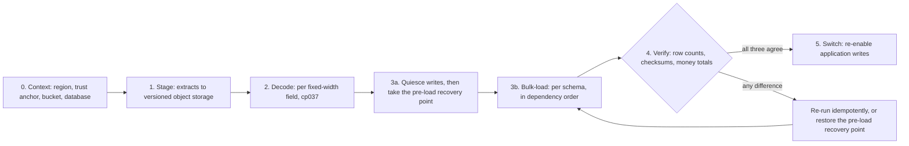

# Data Migration Runbook

## Document contract

**Purpose**: Move the CardDemo record data from the exported mainframe flat files into the Aurora
PostgreSQL schemas, in the order stage, decode, bulk-load, verify, and only then switch traffic. This
runbook owns the data half of the cutover: the two decoding constraints, the eleven record-length
contracts, the three mandatory verification passes, idempotent re-loading, and the pre-load recovery
point that a roll-back returns to.

**Source of truth**: The copybooks under `app/cpy/**` are the normative record layouts. The
`IDCAMS` load jobs under `app/jcl/**` are the normative key and record-size contracts. The
implementation is `data-migration/src/carddemo_migration/**` and `data-migration/sql/**`;
`data-migration/README.md` and `data-migration/src/carddemo_migration/cli.py` are the authority for
command names and options. Field-by-field column mapping lives in
[data-model-and-schema-mapping.md](../architecture/data-model-and-schema-mapping.md), and every
intentional behavioural divergence is registered in
[cobol-to-service-traceability.md](../architecture/cobol-to-service-traceability.md). The mainframe
assets under `app/**` are reference-only and are read, never written.

| Parameter | Kind | Description |
|:---|:---|:---|
| `<env>` | enum | `dev` or `prod`; selects the environment root whose outputs every command below resolves. |
| `<aws-region>` | AWS Region code | Region the environment is provisioned in. The ETL **refuses to run** without `AWS_REGION` or `AWS_DEFAULT_REGION` rather than defaulting, so it is established in Step 0. |
| `<dataset-bucket>` | S3 bucket name | Versioned dataset bucket. Read from the environment's Terraform output at the point of use; never written into this document. |
| `<dataset>` | seed-dataset token | One of the eleven registered tokens — lower-case with underscores, for example `accounts` — that `stage-dataset`, `refresh-dataset`, `load-dataset` and the three per-dataset verification passes take. Not the MVS dataset name and not the layout name. |
| `<layout>` | record-layout name | One of the upper-case copybook layout names `list-datasets` prints, for example `ACCOUNT`. `decode-record` and `verify-money-total-report --extract` are keyed by this vocabulary. |
| `<encoding>` | enum | `ascii` or `ebcdic`; declares which of the two shipped forms of an extract is being read. Never sniffed: derived from the seed registry for a registered token, and required for any other layout. |
| `<generation>` | generation ordinal | The `gen=NNNN` component of a staged object's prefix. The staging writer keeps the newest **five** logical generations of a family and permanently scratches the rest; a sixth is not recoverable. |
| `<business-date>` | ISO date | Any date a load or a downstream job needs, supplied as a parameter rather than read from the clock. `stage-dataset` and `refresh-dataset` **require** `--business-date` as `YYYY-MM-DD` and refuse any other spelling at parse time. |
| `<db-secret-id>` | Secrets Manager secret id | Entry holding a database credential, named `carddemo/<env>/aurora/<role>` for each of the sixteen login roles. Resolve at run time; never paste a resolved value into a file or a command history. |
| `<parameter-prefix>` | Parameter Store prefix | Prefix beneath which the environment publishes its non-secret connection parameters. |
| `<trust-anchor-path>` | local file path | Certificate bundle used to verify the database server, because every service pins `sslmode=verify-full`. |
| `<snapshot-id>` | database snapshot identifier | The pre-load recovery point taken before the first load of an environment. |
| `<manifest-path>` | local file path | Verification manifest declaring which datasets a cutover loaded and where their bytes are. Each entry's `source` is a **filesystem** path — absolute, or resolved against the manifest file's own directory. An `s3://` URI is not accepted here; the registry form of the gate covers staged objects. |
| `<state-machine-arn>` | Step Functions ARN | The nightly chain that invokes these same loaders. Placeholder only; [batch-operations.md](batch-operations.md) owns it. |
| `<sql-root>` | local directory path | Location of the `sql` tree. Omitted in a source checkout or an editable install, where it resolves from the installed package; `.` in the container image, whose working directory holds the copied tree. |

**No secret identifier is a parameter of this runbook.** A `<db-secret-id>` row stood in the table
above and no command in this document consumed it, which is worse than a stray row: a credential
placeholder invites an operator to resolve a secret identifier and paste it into a shell for a
command that never asked for one. The loaders take no secret argument. They derive each per-role
entry's name from the published convention, so the credential is selected by
`CARDDEMO_ENVIRONMENT` and `CARDDEMO_PARAMETER_PREFIX` and never named here -- see
`data-migration/README.md` for the derivation and the one exception, the cluster master credential,
which is supplied to [deploy.md](deploy.md)'s credential applicator rather than to anything in this
document.

**Expected outcome / success signal**: Every staged object matches the record-length contract; every
decode produces clean text with no replacement characters; every load reads the row count the source
file implies and reports it alongside the rows the target gained, which on a re-run is none; and all
three verification passes exit zero for every loaded dataset. A load is "verified" only when row
counts, record checksums and exact money totals all agree. Any non-zero exit is the gate: the switch
does not happen.

**Failure modes and handling**: Stop before loading when a file's size is not an exact multiple of
its record length, when decoded output contains replacement characters, or when the source form of an
extract cannot be established. Stop before switching when any verification pass reports a difference,
when the `DEFAULT` disclosure-group set-equality check reports a missing or unexpected combination, or
when no pre-load recovery point exists and is `available`. Use the failure table near the end of this
document. Roll-back is owned here: creating the recovery point is Step 3 and restoring it, together
with the Terraform reconciliation that follows a restore, is the roll-back section below.
[teardown.md](teardown.md) owns destroying the stack and producing a `prod` final snapshot, which
restores by the same procedure.

---

## Scope, prerequisites and the deployment boundary

This runbook supplies operator commands. It is **not** evidence that a live AWS environment exists,
that any load has been performed, or that any throughput was measured. Executing these commands
against a real account, and the cost that incurs, remains an operator action outside this scope. No
figure in this document is a benchmark; the byte counts are file sizes measured in the checkout.

This procedure **assumes [deploy.md](deploy.md) Steps 1-3 have completed**: the remote-state backend
exists, the container images are published, and the environment is provisioned so that the Aurora
cluster and the versioned dataset bucket are both present. Provisioning them is not re-owned here.
Applying each owning service's Flyway migration is [deploy.md](deploy.md) Step 4, and seeding
reference data is [deploy.md](deploy.md) Step 5; this document verifies the result of both and
re-owns neither. Destroying infrastructure, and the infrastructure half of roll-back, belong to
[teardown.md](teardown.md). The nightly batch chain and the `StageSeedDatasets` state that invokes
these same loaders belong to [batch-operations.md](batch-operations.md).

**The ETL runs in its own virtual environment, and that is a constraint rather than a preference.**
The repository-root `.venv` is the COBOL parity oracle's environment, built from
`tests/requirements-test.txt`. It holds neither `ruff` nor `psycopg`, and it cannot be made to hold
them: that manifest pins `cryptography==49.0.0` while `data-migration/requirements.txt` pins
`cryptography==50.0.0`, and `--require-hashes` admits exactly one version of a distribution per
environment. The oracle's pins may not move, because it is the behavioural oracle this migration is
verified against, so the ETL gets a second environment rather than the oracle getting a different
closure. Every ETL command in this runbook is therefore written against
`data-migration/.venv/bin/python`, and the parity suite at the end of this document is the one place
the root `.venv` is used.

```bash
# WHAT: create the ETL's own hash-locked environment and install the package into it.
# WHY : Assumptions: --without-pip followed by get-pip.py, because a plain
#       `python3 -m venv data-migration/.venv` fails on an image whose Python ships no
#       ensurepip and reports it as a non-zero ensurepip status rather than as a
#       missing module. Where ensurepip is present the plain form works and the two
#       bootstrap lines are redundant, which is the only cost of the portable sequence.
# WHY : Assumptions: `./data-migration` carries an explicit leading `./`, because the
#       bare token `data-migration` is a legal package-index name and pip would resolve
#       an unrelated project from the index instead of this directory.
#       --no-build-isolation reuses the hash-locked build backend just installed rather
#       than resolving an unpinned one, and --no-deps keeps the runtime closure exactly
#       as the manifests fixed it.
# WHY : Trade-offs: the environment lives inside data-migration/ rather than at the
#       repository root, so `.gitignore`'s `.venv/` rule already covers it and it cannot
#       be committed. The cost is one more directory to remove when reclaiming space.
python3 -m venv data-migration/.venv --without-pip
curl -fsSL https://bootstrap.pypa.io/get-pip.py -o /tmp/get-pip.py
data-migration/.venv/bin/python /tmp/get-pip.py
data-migration/.venv/bin/pip install --require-hashes -r data-migration/requirements-dev.txt
data-migration/.venv/bin/pip install --require-hashes -r data-migration/requirements-build.txt
data-migration/.venv/bin/pip install --no-build-isolation --no-deps ./data-migration
```

Validate the package before using it against any database.

The ETL runs in an environment **of its own**, and it must not share the repository `.venv`. That
environment belongs to the COBOL parity suite: `tests/requirements-test.txt` pins
`cryptography==49.0.0` while `data-migration/requirements.txt` pins `cryptography==50.0.0`, and both
are installed under `--require-hashes`, so one interpreter cannot satisfy both. Installing this
closure into that environment replaces a pin the parity oracle depends on — and the oracle is what
every money assertion in this runbook is ultimately checked against.

```bash
# WHAT: create the ETL's OWN environment, install its hash-locked development closure,
#       install the package itself, and run the Python gates.
# WHY : Assumptions: the development manifest pins every transitive dependency with a
#       hash, so the codecs that decode money here behave identically to the ones the
#       tests validated. An unpinned install can substitute a different decimal or
#       encoding library and change a rounded cent without failing anything.
# WHY : Assumptions: the environment is `data-migration/.venv` and NOT the repository-root
#       `.venv` the COBOL parity suite uses. The two hash-locked closures are mutually
#       exclusive by measurement, not by preference: `tests/requirements-test.txt` pins
#       `cryptography==49.0.0` and `data-migration/requirements.txt` pins
#       `cryptography==50.0.0`, and `--require-hashes` admits exactly one version of a
#       distribution per environment. Installing the ETL over the oracle's environment
#       therefore either fails the install or silently moves a pin the parity oracle is
#       required to hold, which is the one thing this migration may not do.
# WHY : Assumptions: the package must be INSTALLED before pytest can import it, because
#       this is a src-layout distribution and pyproject.toml sets no import path.
#       `--no-build-isolation` reuses the hash-locked backend and `--no-deps` leaves the
#       runtime closure exactly as the manifest above fixed it.
python3 -m venv data-migration/.venv
source data-migration/.venv/bin/activate
python -m pip install --require-hashes -r data-migration/requirements-dev.txt
python -m pip install --require-hashes -r data-migration/requirements-build.txt
python -m pip install --no-build-isolation --no-deps -e ./data-migration
ruff check data-migration
python -m compileall -q data-migration/src
python -m pytest -v --tb=short data-migration/tests

# WHY : Assumptions: `--without-pip` is required rather than preferred. The interpreter on the
#       reviewed image ships without the `ensurepip` payload, so a plain `python3 -m venv` aborts
#       with "Command '... -m ensurepip ...' returned non-zero exit status 1" and leaves an unusable
#       directory behind.
# WHY : Assumptions: the build closure is installed BEFORE the package, and the package install
#       carries `--no-build-isolation --no-deps`. That is what makes the build use the PEP 517
#       backend just pinned by digest instead of fetching one, and what stops the install
#       re-resolving the closure the two hash-locked manifests already fixed.
# WHY : Assumptions: installing the package is not optional. It is src-layout and
#       `data-migration/pyproject.toml` deliberately puts no source directory on pytest's import
#       path, so without this step `import carddemo_migration` raises ModuleNotFoundError, the test
#       run collects nothing, and no `carddemo-migrate` entry point exists -- which is exactly the
#       state this block previously left behind before invoking the CLI two commands later.
# WHY : Trade-offs: `.venv` is gitignored at any depth, so this directory cannot be committed. It is
#       inside `data-migration/` rather than in a temporary directory so this runbook,
#       [deploy.md](deploy.md) and the top-level guide all name one path.
python3 -m venv data-migration/.venv --without-pip
curl -sSf https://bootstrap.pypa.io/get-pip.py | data-migration/.venv/bin/python -
data-migration/.venv/bin/python -m pip install --require-hashes -r data-migration/requirements-dev.txt
data-migration/.venv/bin/python -m pip install --require-hashes -r data-migration/requirements-build.txt
data-migration/.venv/bin/python -m pip install --no-build-isolation --no-deps ./data-migration
```

```bash
# WHAT: run the Python gates from the environment just built.
# WHY : Assumptions: `ruff` comes from this environment and is not expected on PATH. It is a pinned
#       entry in the development closure above, so invoking it by path is what ties the lint result
#       to the version the closure fixed.
data-migration/.venv/bin/ruff check data-migration
data-migration/.venv/bin/python -m compileall -q data-migration/src
data-migration/.venv/bin/python -m pytest -v --tb=short data-migration/tests
```

```bash
# WHAT: print the entry point's own subcommand list and exit-status contract.
# WHY : Assumptions: this CLI is the authority for its own verbs, so an operator
#       reconciles a command in this runbook against --help rather than against prose.
#       Every verb named below is registered by
#       data-migration/src/carddemo_migration/cli.py and documented in
#       data-migration/README.md.
# WHY : Assumptions: both forms below are the same program. The console script is what the wheel
#       installed, and the module form is the usage string the CLI prints for itself; either proves
#       the install above succeeded, and a failure here means it did not.
data-migration/.venv/bin/carddemo-migrate --help
data-migration/.venv/bin/python -m carddemo_migration.cli --help
```

```bash
# WHAT: put the ETL environment's interpreter and console scripts first on PATH for this session.
# WHY : Assumptions: every later command in this runbook is written as
#       `python -m carddemo_migration.cli <subcommand>`, and this one line is what makes that
#       `python` the ETL environment's rather than the ambient one. Run it once per shell, after the
#       install above. Without it those commands resolve the system interpreter, which has no
#       `carddemo_migration` installed and reports ModuleNotFoundError -- a message that reads as a
#       broken package rather than as the wrong interpreter.
# WHY : Alternatives Considered: `source data-migration/.venv/bin/activate`, which the venv does
#       write and which works identically here -- it prepends the same directory and additionally
#       sets `VIRTUAL_ENV`, a prompt prefix and a `deactivate` function. Either is fine; this form is
#       written because it states the one property the commands below actually rely on, and because
#       an operator who prefers the prompt marker can substitute `activate` without changing
#       anything else in this runbook. Both must be sourced, not executed.
# WHY : Trade-offs: this shadows any ambient `python`, `ruff` and `pytest` for the rest of the
#       session, which is intended here and is why the COBOL parity suite is run from a DIFFERENT
#       shell -- see the parity-oracle note near the end of this document.
export PATH="$PWD/data-migration/.venv/bin:$PATH"
python -m carddemo_migration.cli list-datasets
```

**Note**: the generic entry-point form is `python -m carddemo_migration.cli <subcommand>`, which is
the usage string the CLI prints for itself; `carddemo-migrate <subcommand>` is the same program
through the console script the wheel installed. Inside the container image the entry point is already
`python -m carddemo_migration.cli`, so a container override supplies only the subcommand and its
arguments. The image is built from `data-migration/Dockerfile` on `python:3.13.14-slim-trixie`.

```bash
# WHAT: build the ETL image.
# WHY : Assumptions: the interpreter is pinned to the same version the existing COBOL
#       test suite runs on, so zoned-decimal and packed-decimal behaviour is identical
#       between this ETL and the harness that validates its output. A different minor
#       version could round or normalise differently and make a parity difference look
#       like a load defect.
docker build -t carddemo-data-migration:local data-migration
```

---

## The cutover sequence

Cutover is **prepare, read, verify, then switch** — never a big-bang swap. One movement establishes
the environment and the recovery point, four produce the data, and a gate stands between the last of
them and the switch.



Verification sits **before** the switch for a reason worth stating plainly: a load that has not been
verified is not evidence that the data is correct. Switching first turns verification into a
post-mortem — it would still find the defect, but only after the application had served it. Placing
the gate first is the entire point of the procedure, and it is why the three passes are mandatory
rather than advisory.

The recovery point sits **before** the first load for the mirror-image reason. Its whole value is
that it represents the pre-cutover state, and the first `COPY` into a schema is the moment that state
stops existing anywhere else. Taken afterwards it captures the very data a roll-back exists to
discard, so it is a prerequisite of Step 1 and a stated precondition of Step 5, not a closing
formality.

---

## The source datasets

Twenty-two extracts ship in the repository under `app/data/**`. They are reference-only inputs: the
ETL reads them and never writes them.

Nine are in `app/data/ASCII/`, and their sizes carry line terminators, which is why each exceeds an
exact multiple of its record length by a small amount:

| File | Bytes |
|:---|---:|
| `acctdata.txt` | 15050 |
| `carddata.txt` | 7550 |
| `cardxref.txt` | 1850 |
| `custdata.txt` | 25050 |
| `dailytran.txt` | 105300 |
| `discgrp.txt` | 2601 |
| `tcatbal.txt` | 2599 |
| `trancatg.txt` | 1116 |
| `trantype.txt` | 433 |

Thirteen are in `app/data/EBCDIC/`, named `AWS.M2.CARDDEMO.<name>.PS`, and they are unterminated
fixed-length records:

| File | Bytes |
|:---|---:|
| `ACCDATA` | 15000 |
| `ACCTDATA` | 15000 |
| `CARDDATA` | 7500 |
| `CARDXREF` | 2500 |
| `CUSTDATA` | 25000 |
| `DALYTRAN` | 105000 |
| `DALYTRAN.PS.INIT` | 350 |
| `DISCGRP` | 2550 |
| `EXPORT.DATA` | 250000 |
| `TCATBALF` | 2500 |
| `TRANCATG` | 1080 |
| `TRANTYPE` | 420 |
| `USRSEC` | 800 |

Because the EBCDIC extracts carry no terminators, their sizes factor exactly into record count times
record length. That gives an operator a pre-load sanity check that needs no tooling at all:

```text
# WHAT: the record-count arithmetic for each unterminated EBCDIC extract.
# WHY : Assumptions: an unterminated fixed-length file has no delimiter, so its size
#       MUST be an exact multiple of its record length. Any remainder means the file is
#       not the shape the reader expects, and the arithmetic below is the cheapest
#       possible way to find that out before a database is involved.
USRSEC         800 = 10  x 80
ACCTDATA     15000 = 50  x 300
CARDDATA      7500 = 50  x 150
CUSTDATA     25000 = 50  x 500
CARDXREF      2500 = 50  x 50
DALYTRAN    105000 = 300 x 350
DISCGRP       2550 = 51  x 50
TCATBALF      2500 = 50  x 50
TRANCATG      1080 = 18  x 60
TRANTYPE       420 = 7   x 60
EXPORT.DATA 250000 = 500 x 500
```

Two details trip operators up, so both are called out.

- **`DISCGRP` holds 51 records, where the other masters hold 50.** Among them are the mandatory
  `'DEFAULT'` disclosure-group rows. The disclosure-group key is a triple of group identifier,
  transaction type and transaction category, so `DEFAULT` is not a single row: the shipped extract
  carries **seventeen** of them, at record ordinals 18 through 34, one per type-and-category
  combination the reference data uses. Interest calculation falls back to that group when a specific
  group lookup misses, so their presence is verified explicitly in Step 4.
- **`EXPORT.DATA` is a different animal from the base masters.** It is the 500-byte export record,
  and its money fields are packed decimal rather than zoned. It is not one of the eleven seed loads;
  the export and import round trip belongs to [batch-operations.md](batch-operations.md).

**Note**: `usrsec` **exists only in EBCDIC form**. There is no `usrsec.txt` in `app/data/ASCII/`, so
it is the one dataset for which the EBCDIC path is not optional. Note also that a populated
transaction master is not among the twenty-two — the repository ships the daily feed and the masters,
which is why the `TRAN` load in Step 3 is conditional on a cutover supplying a real extract.

---

## The record-length contract

Every reader offset depends on the table below. Confirm a file is the shape the loader expects
**before** loading it.

| MVS dataset | ETL layout token | Copybook | Record length (bytes) | Key length |
|:---|:---|:---|---:|---:|
| `USRSEC` | `SECUSER` | `CSUSR01Y` | 80 | 8 |
| `ACCTDATA` | `ACCOUNT` | `CVACT01Y` | 300 | 11 |
| `CARDDATA` | `CARD` | `CVACT02Y` | 150 | 16 |
| `CUSTDATA` | `CUSTOMER` | `CVCUS01Y` | 500 | 9 |
| `CARDXREF` | `XREF` | `CVACT03Y` | 50 | 16 |
| `DALYTRAN` | `DALYTRAN` | `CVTRA06Y` | 350 | 16 |
| `TRANSACT` | `TRAN` | `CVTRA05Y` | 350 | 16 |
| `DISCGRP` | `DISGROUP` | `CVTRA02Y` | 50 | 16 |
| `TRANCATG` | `TRANCAT` | `CVTRA04Y` | 60 | 6 |
| `TRANTYPE` | `TRANTYPE` | `CVTRA03Y` | 60 | 2 |
| `TCATBALF` | `TCATBAL` | `CVTRA01Y` | 50 | 17 |

These eleven values are corroborated five independent ways, which is why they are stated as a
contract rather than as a configuration: the copybook field widths sum to them, the unterminated
EBCDIC file sizes factor by them, the `RECORDSIZE(...)` clauses in the `IDCAMS` load jobs declare
them, the dataset table in the root [README.md](../../README.md) publishes them, and the package
prints them from its own layout catalogue. Every key length above equals the first operand of the
corresponding `KEYS(...)` clause in the baseline job listed later in this document.

```bash
# WHAT: print the layout catalogue the readers actually use -- identifier, copybook,
#       record length, key length and provenance -- for every registered layout.
# WHY : Assumptions: this reads the package's own catalogue rather than this table, so
#       it is the check that matters if the two ever disagree. It also distinguishes the
#       eleven BASE_MASTER seed layouts from the DERIVED records the batch jobs produce,
#       which are not cutover inputs and must not be loaded here.
# WHY : Assumptions: this verb needs no database and no environment, so it is the one ETL
#       command that runs before Step 0 -- which is why it is the first place to reconcile a
#       layout identifier against the package rather than against prose.
data-migration/.venv/bin/python -m carddemo_migration.cli list-datasets
```

**A file whose size is not an exact multiple of its record length is malformed, and the loader must
refuse it rather than load it.**

Assumptions: these are fixed-length records with no delimiter, so there is no resynchronisation
point after a framing error. The first wrong offset shifts every field of every subsequent record,
and because the shifted bytes are still valid characters the result is a table full of plausible
values rather than an error. Refusing the file is the only point at which the defect is cheap to
find.

The copybooks under `app/cpy` are the **single normative source** for field offsets, lengths, decimal
scale and sign semantics. The ETL layout descriptors are derived from them. An operator diagnosing a
field-level discrepancy reads the copybook, not the loader.

---

## Constraint one: EBCDIC is decoded per fixed-width field, never per record

**This is the single most likely implementation mistake in the entire migration, and it produces data
that looks almost right.** It deserves to be read before any load is attempted.

The existing test suite deliberately treats the thirteen `app/data/EBCDIC/*.PS` extracts as **opaque
binary** and never transcodes them. Its own helpers warn that routing binary EBCDIC through a UTF-8
write mangles it into replacement characters, at `tests/helpers/localstack_setup.py` L729, L741 and
L1048. The ETL follows the same discipline and decodes at **exactly one place**:
`data-migration/src/carddemo_migration/copybook/ebcdic_codec.py`, which opens the file in **binary
mode** and decodes **each fixed-width field individually** using the cp037 family registered by the
`ebcdic` package.

```text
# WHAT: the shape of the decision, stated once so it is not rediscovered per reader.
# WHY : Assumptions: a record is NOT text. Alongside its character fields it carries
#       zoned-decimal sign overpunch bytes, packed-decimal nibbles and embedded low
#       values. The fixed-width field layout IS the data format, and it is the only
#       thing that says which spans are text at all.
# WHY : Alternatives Considered: whole-record bytes.decode("cp037") was the obvious
#       approach and is rejected. Applied to a whole record it either raises on the
#       non-text bytes or, far worse, silently substitutes U+FFFD for them. A
#       replacement character in a money field is a wrong number, not a visible error,
#       and it survives every check that does not compare money exactly.
open(path, "rb")                    -> bytes, never str
bytes[offset : offset + length]     -> one field, per the copybook
field.decode("cp037")               -> only for spans the layout calls text
```

Two consequences follow for an operator.

- **Spot-check a text field after decoding.** Clean output contains no `U+FFFD` replacement
  characters anywhere. A single replacement character means the decode was applied at record
  granularity instead of field granularity, and the load must not proceed.
- **`usrsec` has no ASCII twin**, so the EBCDIC path is mandatory for it. Its password span is read
  as bytes and discarded rather than decoded, because the target schema declares no column for it.

The equivalent hazard in the other direction is worth one line: nine datasets ship in both
encodings, so the form being read must be **established**, never sniffed. An all-ASCII EBCDIC
extract sniffs as text and decodes to plausible wrong values, which is why nothing in this package
infers a seed form from the bytes.

Assumptions: the form is established two different ways, and the difference matters when reading a
command. `verify-money-total-report` declares `--encoding` outright required. `load-dataset` and the
three per-dataset verification verbs instead leave `--source` and `--encoding` optional and fill
**each one only when the operator omitted it**, from the seed registry — whose extracts are all the
EBCDIC form. So for a registered dataset the correct command names neither, and a layout the registry
does not carry is refused unless both are given. What is never available is a guess.

---

## Constraint two: money is exact fixed point, and the base masters use zoned decimal

The base master money fields are **zoned decimal with sign overpunch** — not packed. For example
`ACCT-CURR-BAL PIC S9(10)V99` at `app/cpy/CVACT01Y.cpy` L7. Packed decimal appears in the export
record and in the authorization segments, and it is decoded at the ETL edge; packed bytes are never
persisted.

The repository documents the consequence in its own words. `tests/README.md` §5.2 records that the
reference build uses `cobc -fixed -fsign=EBCDIC --std=ibm-strict -I app/cpy`, and that
*"`-fsign=EBCDIC` is REQUIRED — the default `-fsign=ASCII` misreads the zoned-decimal sign overpunch
and silently corrupts negative balances."*

The word **silently** is the whole point. A sign-convention error does not raise. It produces
plausible numbers with the wrong sign, in a table whose row count is perfect and whose text fields
are all correct. This is precisely why the money-total parity pass in Step 4 is not optional: it is
the only check that catches a sign error at all.

Assumptions: the sign of a zoned-decimal field lives in the overpunch of its final byte, and the
decimal point does not exist in the stored bytes at all. Both facts are properties of the source data
format that the decoder depends on, and neither is recoverable from the digits alone.

The target invariant holds at every hop:

| Hop | Representation | Forbidden |
|:---|:---|:---|
| PostgreSQL column | `NUMERIC(p,2)` | any binary floating-point type |
| Java service | `BigDecimal`, scale 2, `RoundingMode.HALF_UP` | `float`, `double` |
| Python ETL | `Decimal` | `float` |
| JSON on the wire | a **string** | a JSON number |

Money is transported as a JSON string for a concrete reason rather than a stylistic one: a JSON
**number** is parsed into an IEEE-754 double by most clients, which destroys exactness at the last
boundary before a human reads the figure. Carrying the digits as a string moves the parse decision to
the consumer instead of making it silently on the consumer's behalf.

Two offset hazards come straight from the baseline and are easy to reproduce as defects.

- **The implied decimal point.** `app/jcl/PRTCATBL.jcl` declares its fields to DFSORT as `ZD` at
  L43-L50 — `TRANCAT-ACCT-ID,1,11,ZD`, `TRANCAT-TYPE-CD,12,2,CH`, `TRANCAT-CD,14,4,ZD`,
  `TRAN-CAT-BAL,18,11,ZD` — and then formats the money field with an explicit edit mask,
  `TRAN-CAT-BAL,EDIT=(TTTTTTTTT.TT)` at L56. That mask is the only place the decimal point becomes
  visible: the stored bytes carry none, and the scale lives in the `PICTURE` clause. An ETL that
  treats the digits as an integer is wrong by a factor of one hundred.
- **One-based against zero-based.** Offsets in JCL and DFSORT are **one-based**; Python byte slices
  are **zero-based**. Carrying a declared offset across unadjusted shifts every field by one byte,
  which for a zoned field moves the sign overpunch out of the span entirely.

```bash
# WHAT: decode a single record through the layout contract and print its fields, before
#       any table is written.
# WHY : Assumptions: this exercises the real codec on the real bytes, so it settles the
#       encoding, the framing and the decimal scale in one step. Reading the first
#       record of an extract is the cheapest proof that the three agree.
# WHY : Alternatives Considered: proving the layout by loading and then inspecting the
#       table was rejected. It reaches the same conclusion after a write, so a wrong
#       answer has to be undone with a privilege the loader roles deliberately lack.
# WHY : Assumptions: the display code page defaults to cp037, so an EBCDIC extract needs
#       no flag. `--code-page` overrides it, and `--record` selects a ONE-BASED ordinal --
#       the same one-based convention the JCL uses, and the opposite of a Python slice.
data-migration/.venv/bin/python -m carddemo_migration.cli decode-record --dataset ACCOUNT \
  --source app/data/EBCDIC/AWS.M2.CARDDEMO.ACCTDATA.PS
```

The three reference records — the disclosure group, the transaction type and the transaction
category — are printed in **full**, interest rate included, so `DIS-INT-RATE` is where the decimal
scale is read directly: record 18 of the `DISCGRP` extract decodes to `15.00`, two digits from the
right, and a value of `1500` would be the implied-decimal defect. On every identity-bearing master
the money spans print as `<withheld>` and the identifier spans as a keyed tag, because the package's
diagnostic disclosure policy admits a field only when it is a date, a closed-domain code, a count or
the trailing pad. That is deliberate and registered as `D-ETL-CORPUS-DIAGNOSTIC-DISCLOSURE` in
[cobol-to-service-traceability.md](../architecture/cobol-to-service-traceability.md); it is why the
sign and the scale of a **balance** column are certified by the money-total pass in Step 4 rather
than by reading a decoded record.

---


## Step 0 - Establish the runtime context

Nothing below this section can run until this one has. The ETL takes **no endpoint and no credential
as an argument** — `cli.py` resolves every one of them from Parameter Store and Secrets Manager when
a command runs — and the raw `psql` invocations in Steps 3, 4 and the index-statistics step need a
libpq context of their own. Establish both once, here, and every later command inherits them.

Assumptions: this section sets **locators, names and modes only**. The one value that is ever read is
a database password, and it is read into a shell variable through a pipe that no terminal and no
history file sees. Nothing here prints a credential, and nothing here writes one to disk.

### 0.1 Region, profile and identity

```bash
# WHAT: select the account, Region and environment every later command resolves against,
#       then prove which principal is being used.
# WHY : Assumptions: the Region is REQUIRED rather than defaulted, and the ETL enforces
#       that itself -- with neither AWS_REGION nor AWS_DEFAULT_REGION set it exits 16 with
#       "the environment names no region ... S3 would otherwise silently default to
#       us-east-1 and stage to the wrong region". A default would stage an extract into a
#       bucket in another Region and report success.
# WHY : Assumptions: CARDDEMO_ENVIRONMENT has NO default for the same class of reason, and
#       it is the more dangerous of the two. A wrong Region fails to resolve; a wrong
#       environment resolves successfully against the wrong deployment, which for a
#       data-migration tool is the worst available outcome -- it succeeds, in the wrong
#       place.
# WHY : Trade-offs: the caller identity is printed. The account number and role name are
#       not secrets and they are the one piece of evidence that distinguishes "authorised
#       for dev" from "authorised for prod" before a load begins.
export AWS_PROFILE="<aws-profile>"
export AWS_REGION="<aws-region>"
export CARDDEMO_ENVIRONMENT="dev"
export CARDDEMO_PARAMETER_PREFIX="/carddemo"
aws sts get-caller-identity
```

### 0.2 The trust anchor `verify-full` needs

```bash
# WHAT: fetch the AWS-published Aurora certificate bundle, verify it byte for byte before
#       trusting it, and lock down the permissions the package checks.
# WHY : Assumptions: `verify-full` checks the chain AND the host name, so it needs a trust
#       anchor. The anchor is the AWS bundle rather than the operating system's store,
#       which trusts every publicly trusted authority and would therefore accept a
#       certificate any one of them issued for this endpoint's name.
# WHY : Assumptions: the expected digest is the value `data-migration/Dockerfile` pins for
#       the same bundle, so a checkout and the image trust identical bytes. AWS republishes
#       the bundle when an authority is rotated; on that day this check fails, the
#       Dockerfile's pin fails with it, and both are refreshed together.
# WHY : Assumptions: the mode and the directory are set deliberately, because the package
#       validates both and refuses rather than warns. It rejects a symbolic link, a file
#       writable by group or other, and any parent directory writable by group or other
#       without the sticky bit -- on the reasoning that whoever can replace the anchor
#       decides which authority the endpoint is verified against, which makes every other
#       check decorative.
TRUST_ANCHOR="${HOME}/.carddemo/aws-rds-global-bundle.pem"
mkdir -p -m 0700 "$(dirname "$TRUST_ANCHOR")"
curl -fsS -o "$TRUST_ANCHOR" \
  https://truststore.pki.rds.amazonaws.com/global/global-bundle.pem
chmod 0600 "$TRUST_ANCHOR"
printf '%s  %s\n' \
  e5bb2084ccf45087bda1c9bffdea0eb15ee67f0b91646106e466714f9de3c7e3 \
  "$TRUST_ANCHOR" | sha256sum --check
```

```bash
# WHAT: point the ETL at that anchor in a non-production environment ONLY, and leave the
#       production anchor to the container image.
# WHY : ⚠️ Assumptions: the override is REFUSED in production, and the refusal is by design
#       rather than a configuration gap. `config.py` admits `CARDDEMO_DB_SSL_ROOT_CERT` only
#       when `CARDDEMO_ENVIRONMENT` is one of `dev`, `test` or `local` -- a closed set, so an
#       unset or unrecognised name is refused too -- because in production the bundle is a
#       deliverable of the image at a path the image fixes, and an override could only come
#       from a variable a caller set. Exporting it unconditionally makes every production
#       command exit 16 on a configuration error.
# WHY : Assumptions: production ETL commands therefore run INSIDE the container image, where
#       `/etc/ssl/certs/aws-rds-global-bundle.pem` exists and no override is needed.
# WHY : Assumptions: `PGSSLROOTCERT` is set either way. It is libpq's own variable and is
#       read only by the psql sessions in Steps 3 and 4, so pointing it at a locally fetched
#       bundle is not the override the package refuses -- an operator running psql against
#       production still needs the anchor on the machine psql runs on.
case "$CARDDEMO_ENVIRONMENT" in
  dev|test|local) export CARDDEMO_DB_SSL_ROOT_CERT="$TRUST_ANCHOR" ;;
  *)              unset CARDDEMO_DB_SSL_ROOT_CERT ;;
esac
```

### 0.3 The dataset bucket, the extract prefix and the staging root

```bash
# WHAT: resolve the dataset bucket, the extract prefix and the staging root from the
#       environment root's own outputs.
# WHY : Assumptions: the bucket is published inside the aggregate `datasets` output
#       rather than as a scalar root output, so it is read with `output -json` and a
#       key selection. Reading the output instead of restating a default is what keeps a
#       tfvars override from making this runbook silently wrong.
# WHY : Assumptions: `CARDDEMO_DATASET_STAGING_ROOT` is where `stage-dataset` and the
#       registry form of `verify-all` look for each dataset's registered source object, and
#       the name is joined DIRECTLY to the root -- `seed_datasets.extract_location` appends
#       `AWS.M2.CARDDEMO.<name>.PS` to it with no intervening segment. So the root is the
#       extract prefix itself and the extracts must sit FLAT beneath it. Leaving the
#       variable unset makes both verbs refuse rather than guess, which is the correct
#       failure but a needless one.
DATASET_BUCKET="$(terraform -chdir="infra/envs/${CARDDEMO_ENVIRONMENT}" output -json datasets | jq -r '.bucket_name')"
EXTRACT_URI="$(terraform -chdir="infra/envs/${CARDDEMO_ENVIRONMENT}" output -json datasets | jq -r '.source_extract_uri')"
export CARDDEMO_DATASET_STAGING_ROOT="$EXTRACT_URI"
```

### 0.4 The PostgreSQL context, at two privilege levels

```bash
# WHAT: read the writer endpoint, port and database name the ETL itself resolves, and pin
#       the transport mode and its trust anchor for every psql session below.
# WHY : Assumptions: these are exactly the three parameters `config.py` reads --
#       <prefix>/<environment>/aurora/{host,port,database} -- so a psql session and an ETL
#       command provably address one cluster. Reading a Terraform output instead would work
#       only where the state file is reachable and would not prove the parameters the ETL
#       depends on exist at all.
# WHY : Assumptions: `verify-full` is pinned here rather than left to libpq, whose
#       compiled-in default for an unspecified sslmode is `prefer` -- and `prefer`
#       negotiates TLS when the server offers it and connects in CLEARTEXT when it does
#       not, reporting nothing. The service credential and every account, customer, card
#       and transaction row the load reads would cross the wire in the clear on a cluster
#       that had lost its enforced-TLS setting.
PARAMETER_ROOT="${CARDDEMO_PARAMETER_PREFIX}/${CARDDEMO_ENVIRONMENT}/aurora"
export PGHOST="$(aws ssm get-parameter --name "${PARAMETER_ROOT}/host" --query 'Parameter.Value' --output text)"
export PGPORT="$(aws ssm get-parameter --name "${PARAMETER_ROOT}/port" --query 'Parameter.Value' --output text)"
export PGDATABASE="$(aws ssm get-parameter --name "${PARAMETER_ROOT}/database" --query 'Parameter.Value' --output text)"
export PGSSLMODE="verify-full"
export PGSSLROOTCERT="$TRUST_ANCHOR"
export PGCONNECT_TIMEOUT=10
```

```bash
# WHAT: define the one function that loads a role's credential into the session without
#       the value reaching a terminal, a log or a history file.
# WHY : Trade-offs: the credential travels through a process substitution into `read`
#       rather than through an argv value or a command substitution the shell would echo.
#       An argv value is readable from the process table for as long as the call runs and
#       is retained by the history file; `set +o xtrace` is issued because a traced shell
#       would print the expansion and defeat the whole arrangement.
# WHY : Alternatives Considered: writing a `.pgpass` file was rejected -- it moves the
#       credential from a process to the filesystem, where it outlives the session and has
#       to be removed by a step an operator can forget.
# WHY : Assumptions: the secret document carries `username` and `password` members and
#       neither value contains a newline. Both are properties of the entries
#       `infra/modules/secrets` generates and of the RDS-managed master entry, and the
#       two-line read depends on the second one.
# WHY : Assumptions: the emptiness guard exists because of how libpq fails without it. An
#       unresolvable secret, a denied `GetSecretValue` or a document missing a member leaves
#       both variables EMPTY, and psql then falls back to prompting -- so a scripted cutover
#       hangs on an invisible prompt instead of failing with the reason. The guard reports
#       the secret's NAME, which is a locator, and never what was read.
# WHY : Assumptions: the caller's tracing state is saved and restored on EVERY exit path,
#       including the refusal. Leaving tracing off would silently disable it for the rest of
#       the session, and turning it unconditionally on would enable it in a shell that never
#       asked -- the same restore discipline [deploy.md](deploy.md) uses.
carddemo_pg_login() {
  local xtrace_was_enabled=0
  case "$-" in *x*) xtrace_was_enabled=1 ;; esac
  set +o xtrace
  { read -r PGUSER; read -r PGPASSWORD; } < <(
    aws secretsmanager get-secret-value --secret-id "$1" \
      --query 'SecretString' --output text |
      python3 -c 'import json,sys; d=json.load(sys.stdin); print(d["username"]); print(d["password"])'
  )
  if [ -z "$PGUSER" ] || [ -z "$PGPASSWORD" ]; then
    printf 'could not read a username and password from secret %s\n' "$1" >&2
    unset PGUSER PGPASSWORD
    if [ "$xtrace_was_enabled" = 1 ]; then set -o xtrace; fi
    return 1
  fi
  export PGUSER PGPASSWORD
  psql --set ON_ERROR_STOP=on -tAc "SELECT current_user, ssl FROM pg_stat_ssl WHERE pid = pg_backend_pid();"
  if [ "$xtrace_was_enabled" = 1 ]; then set -o xtrace; fi
}
```

Only the two `psql` levels below are an operator's choice. Every `carddemo_migration.cli` command
resolves its own login from `carddemo/<env>/aurora/<role>` and asserts the live session really is that
role before doing anything, so there is nothing to select beyond `CARDDEMO_ENVIRONMENT` and the prefix
— and nothing an operator can get wrong.

| Command | Login | Why that one |
|:---|:---|:---|
| `V0__schemas_and_roles.sql`, `VACUUM ANALYZE` | the cluster's RDS-managed master entry, named by `CARDDEMO_DB_MASTER_SECRET` | Creating roles and granting privileges is administrative, and no other login in this stack holds `CREATEROLE`. `infra/modules/aurora-postgresql` manages the master password, so RDS names the entry and the environment root publishes its ARN as `master_user_secret_arn` |
| The `DEFAULT` disclosure-group check, and any other hand-written read-back | `carddemo/<env>/aurora/carddemo_verifier` | The verifier holds `USAGE` and `SELECT` on the five loaded schemas and no write privilege anywhere, and its session is read-only at the server — so a statement that slipped past review is refused by the transaction it runs in. `carddemo_reporting` cannot serve a base-table read: its SELECT is on the masked cross-schema views, not on `ledger`, `account`, `card` or `reference` |

For reference, these are the identities the package selects for itself, and the distinctions are
deliberate rather than incidental:

| ETL command | Authenticates as | Why |
|:---|:---|:---|
| `load-dataset` | the target schema's own login role, `carddemo_<context>` | It has to write, so it gets the least authority that can: `USAGE` plus named DML on that schema. None of these roles owns its schema, so a load cannot alter a table's shape |
| `verify-row-counts`, `verify-checksum`, `verify-money-parity` | the same `carddemo_<context>` role | These are **diagnostics**. They share the load's credential, which is exactly why they are not the gate |
| `verify-all` | `carddemo_verifier` | The gate. Its role and the server's read-only setting are both certified before it reads, so it cannot repair the evidence it is judging |
| `verify-row-count-report`, `verify-money-total-report` | `carddemo_reporting` | These read the masked cross-schema aggregate views, which is the only surface that role has SELECT on |
| `apply-credentials`, `reconcile-sequences` | resolved per role by the package | Administrative reconciliation of the credentials and the identifier allocator |

```bash
# WHAT: name the administrative entry and open an administrative session.
# WHY : Assumptions: this is a LOCATOR, not a credential -- an ARN or a name, either of
#       which GetSecretValue resolves -- so it is safe in a task definition, a runbook and
#       a shell history, and reading what it names still requires an IAM grant the variable
#       confers nothing towards.
export CARDDEMO_DB_MASTER_SECRET="$(terraform -chdir="infra/envs/${CARDDEMO_ENVIRONMENT}" output -json database | jq -r '.master_user_secret_arn')"
carddemo_pg_login "$CARDDEMO_DB_MASTER_SECRET"
```

The single row that comes back is the check: `current_user` is the administrative user and `ssl` is
`t`. A `f` there means the session is not encrypted and the context is wrong; stop rather than load.

---


## Step 0 - Resolve the environment and take the pre-load recovery point

Nothing in Steps 1 to 5 supplies an endpoint, a credential or a trust anchor on a command line. The
ETL resolves its non-secret coordinates from Parameter Store and its per-role credential from Secrets
Manager, and it reads the rest from named environment variables — so **this step is what makes every
later command runnable**, and every value it exports is resolved from the deployment rather than
written into this document.

Run the whole of Step 0 in **one shell session**, and keep using that session for Steps 1 to 5. The
exports below live in the process environment and nowhere else.

### Step 0a - Resolve the deployment's own coordinates

```bash
# WHAT: read the source-extract URI, the staging root, the cluster identifier and the
#       master-credential locator from the environment root's outputs.
# WHY : Assumptions: each value is published inside an aggregate output object rather than
#       as a scalar root output, so it is read with `output -json` and a key selection.
#       Reading the output instead of restating a documented default is what keeps a
#       tfvars override from making this runbook silently wrong.
# WHY : Assumptions: CARDDEMO_DATASET_STAGING_ROOT is read from `batch_orchestration`
#       rather than composed here from the bucket and the prefix. That output publishes
#       the RESOLVED root -- the exact value the nightly chain passes to its staging and
#       verification tasks, override included -- so taking it from there is what makes an
#       operator command and the scheduled chain read the same bytes. Composing it locally
#       would reproduce the composed default and miss an override.
# WHY : Assumptions: these four reads require nothing but state-read access. Terraform is
#       being used as the deployment record here, not as a provisioner; no `apply` is
#       implied by this step and none should be run from it.
# WHY : Assumptions: the bucket NAME is deliberately not among them. Nothing here needs it --
#       the sync in Step 1 targets the fully-qualified extract URI, and every ETL verb
#       resolves the bucket for itself from <prefix>/<environment>/datasets/bucket -- and a
#       value resolved into a shell and never used is a value a later reader has to check
#       for a use that is not there.
ENVIRONMENT=dev
EXTRACT_URI="$(terraform -chdir="infra/envs/${ENVIRONMENT}" output -json datasets | jq -r '.source_extract_uri')"
CLUSTER_IDENTIFIER="$(terraform -chdir="infra/envs/${ENVIRONMENT}" output -json database | jq -r '.cluster_identifier')"
DB_MASTER_SECRET="$(terraform -chdir="infra/envs/${ENVIRONMENT}" output -json database | jq -r '.master_user_secret_arn')"
export CARDDEMO_DATASET_STAGING_ROOT="$(terraform -chdir="infra/envs/${ENVIRONMENT}" output -json batch_orchestration | jq -r '.dataset_staging_root')"
```

### Step 0b - Name the deployment the ETL resolves against

```bash
# WHAT: name the deployment, the namespace it resolves under, and the secret the credential
#       repair reads.
# WHY : Assumptions: CARDDEMO_ENVIRONMENT has NO default, deliberately, and that asymmetry
#       is the reason it is the first of the three stated here. It selects whose parameters and whose
#       credentials every command reads, so a default would turn a forgotten variable into
#       the one failure that is silent -- a command intended for one deployment succeeding
#       against another. An unset variable costs one restart.
# WHY : Assumptions: CARDDEMO_PARAMETER_PREFIX does have a default, `/carddemo`, and is
#       exported anyway. A wrong prefix resolves nothing and fails naming the path it
#       looked for, so it is safe to default and cheap to state; both environment roots
#       compose it as "/" plus their `name_prefix`, which is `carddemo` in each.
# WHY : Assumptions: the two together are what compose every parameter this stack reads --
#       <prefix>/<environment>/aurora/host, /port and /database, and
#       <prefix>/<environment>/datasets/bucket. A resolution failure names that exact path,
#       which is how a misconfigured prefix is told apart from a missing parameter.
# WHY : Assumptions: CARDDEMO_DB_MASTER_SECRET carries the ARN resolved in Step 0a and is a
#       LOCATOR rather than a credential -- the same distinction the parameter prefix draws
#       -- so it is safe in an environment block, in this runbook and in a shell history,
#       and reading what it names still requires an IAM grant the variable confers nothing
#       towards. It is exported here because `apply-credentials` is the one verb that reads
#       it, and that verb is the documented repair for a rejected per-role login.
export CARDDEMO_ENVIRONMENT="${ENVIRONMENT}"
export CARDDEMO_PARAMETER_PREFIX="/carddemo"
export CARDDEMO_DB_MASTER_SECRET="${DB_MASTER_SECRET}"
```

**`CARDDEMO_DB_SSL_MODE` is deliberately left unset.** The resolver fixes the transport mode at
`verify-full` on its own, and treats that variable purely as a refusal surface: unset or blank means
the required mode, the required mode spelled in any case is accepted, and every other value — including
`require` and `verify-ca`, both of which encrypt — is rejected with a message naming the mode it will
not connect under. Exporting it can therefore only restate what is already fixed or stop the command,
so it is left alone.

Three further variables are **not** exported here, and each omission is a decision rather than a gap.

- **`CARDDEMO_MASK_HMAC_KEY` is optional.** It keys the redaction tag that stands in for a sensitive
  field in printed output and in a decode refusal's message; it protects no stored value. Unset, the
  tags are derived from a process-scoped key, which gives comparability within one command and not
  across two. Set it only when tags have to be compared between runs, and then only from Secrets
  Manager — the resolver refuses a value that is blank, is not canonical base64, decodes to fewer
  than 32 bytes, or decodes to a single repeated byte.
- **The keys the protected columns are enciphered under are resolved from Parameter Store, not from
  the environment.** The customer-identifier and card-verification-value envelopes take their key
  identifiers from `<prefix>/<environment>/account/CARDDEMO_SECURITY_CUSTOMER_IDENTIFIER_KEY_ID` and
  `<prefix>/<environment>/card/CARDDEMO_SECURITY_CVV_KEY_ID` — the same two parameters the owning
  services read, published as aliases so a rotation needs no reader revised. That is exactly why the
  environment name matters so much at the Step 5 gate: getting it wrong writes well-formed envelopes
  under another deployment's key, which every verification pass accepts and no service can decipher.
- **`CARDDEMO_DB_ALTERNATE_USERS` is for a rotation only.** It names a per-role login exception, and
  a cutover against a freshly applied environment needs none.

### Step 0c - Establish the TLS trust anchor

Every database connection this procedure opens is refused unless the server's certificate verifies:
`carddemo_migration.config` fixes the transport mode at `verify-full`, which is the only libpq mode
that checks both the chain and the host name, and `verify-full` is only as strong as the anchor it
verifies against.

```bash
# WHAT: fetch the AWS RDS global certificate bundle, prove it is the exact bundle this
#       repository pins, and export it as the trust anchor for the ETL and for psql.
# WHY : Assumptions: the expected digest is EXTRACTED from data-migration/Dockerfile
#       rather than written here. That file already pins the bundle for the image build,
#       and a second copy of a 64-character digest in a runbook is a copy that goes stale
#       on the day AWS rotates an authority -- at which point the two would disagree and
#       the operator would have no way to tell which was current.
# WHY : Assumptions: a trust anchor fetched over an unauthenticated channel anchors
#       nothing, which is why the digest check is a gate rather than a courtesy. `--check`
#       exits non-zero on a mismatch, so a rotated bundle stops this step instead of
#       silently becoming the thing every later connection trusts.
# WHY : Assumptions: mode 0644 and a path under $HOME are both required rather than tidy.
#       The resolver refuses an anchor that is a symbolic link, that is writable by group
#       or others, or that sits in a world-writable directory without the sticky bit,
#       because any of those means an identity other than the owner could substitute what
#       verify-full trusts. The path must also be absolute, so a relative one is rejected
#       rather than resolved against whatever directory the process started in.
curl -fsSL https://truststore.pki.rds.amazonaws.com/global/global-bundle.pem \
  -o "${HOME}/aws-rds-global-bundle.pem"
chmod 0644 "${HOME}/aws-rds-global-bundle.pem"
EXPECTED_DIGEST="$(grep -o 'EXPECTED = "[0-9a-f]\{64\}"' data-migration/Dockerfile | cut -d'"' -f2)"
echo "${EXPECTED_DIGEST}  ${HOME}/aws-rds-global-bundle.pem" | sha256sum --check
export CARDDEMO_DB_SSL_ROOT_CERT="${HOME}/aws-rds-global-bundle.pem"
```

**In `prod` the override above is refused, and that is deliberate.** `CARDDEMO_DB_SSL_ROOT_CERT` may
only override the pinned image path in `dev`, `test` and `local`; under any other environment name
the resolver rejects it and names the environments in which an override is admitted. So for `prod`
either run these commands inside the ETL image, where the verified bundle already sits at
`/etc/ssl/certs/aws-rds-global-bundle.pem`, or install the digest-checked bundle at that same path as
root and leave the variable **unset**.

Trade-offs: the set of environments admitting an override is closed rather than derived by excluding
`prod`, so a name nobody listed — `production`, `prod-dr`, a typo — gets no override rights. The cost
is that a genuinely new non-production environment needs its name added in
`data-migration/src/carddemo_migration/config.py`; the benefit is that the failure mode of a
mistyped environment name is a refusal rather than a weakened anchor.

### Step 0d - Resolve the database credential for the `psql` steps

Four commands in this procedure are plain SQL rather than ETL verbs — the connectivity proof at the
end of this step, the schema and role bootstrap in Step 3, the `DEFAULT` disclosure-group assertion in
Step 4, and the planner-statistics refresh near the end. All four connect as the cluster's master
user, which is the one identity that can create schemas and roles, and all four take their connection
entirely from the `PG*` variables exported here.

```bash
# WHAT: resolve the master credential into the process environment and nothing else, and
#       point libpq at the same endpoint and the same anchor the ETL resolved.
# WHY : Assumptions: the credential is resolved at run time into a shell variable by
#       command substitution. It is never echoed, never redirected to a file and never
#       written as a command-line argument, so it reaches no shell history, no process
#       listing and no repository. `--query SecretString --output text` keeps the outer
#       envelope out of jq, and jq selects the two members RDS writes into the document.
# WHY : Alternatives Considered: a ~/.pgpass file was rejected. It would persist the
#       credential on disk for the convenience of not re-resolving it, which is the exact
#       trade this migration declines everywhere else -- and the secret is rotatable, so a
#       stale copy on disk also becomes a wrong copy.
# WHY : Assumptions: PGSSLMODE is verify-full for psql too, matching what the ETL fixes for
#       itself. A psql session at a weaker mode would prove the endpoint reachable without
#       proving it is the endpoint, and it is the same cluster either way -- so the weaker
#       proof would be the one an operator remembered.
DB_SECRET_JSON="$(aws secretsmanager get-secret-value --secret-id "${DB_MASTER_SECRET}" \
  --query SecretString --output text)"
export PGUSER="$(printf '%s' "${DB_SECRET_JSON}" | jq -r '.username')"
export PGPASSWORD="$(printf '%s' "${DB_SECRET_JSON}" | jq -r '.password')"
unset DB_SECRET_JSON
export PGHOST="$(terraform -chdir="infra/envs/${ENVIRONMENT}" output -json database | jq -r '.writer_endpoint')"
export PGPORT="$(terraform -chdir="infra/envs/${ENVIRONMENT}" output -json database | jq -r '.port')"
export PGDATABASE="$(terraform -chdir="infra/envs/${ENVIRONMENT}" output -json database | jq -r '.database_name')"
export PGSSLMODE="verify-full"
export PGSSLROOTCERT="${CARDDEMO_DB_SSL_ROOT_CERT:-/etc/ssl/certs/aws-rds-global-bundle.pem}"
```

```bash
# WHAT: prove the closure before anything is staged or loaded.
# WHY : Assumptions: this is a read-only statement that can only succeed if the endpoint,
#       the port, the database name, the credential and the trust anchor are ALL correct,
#       which is why it is one command rather than five checks. It writes nothing, so it is
#       safe to repeat.
# WHY : Assumptions: the ETL resolves the same three coordinates from Parameter Store
#       rather than from these PG* variables, so this proves the cluster and the anchor but
#       not the parameter namespace. The first ETL command in Step 1 is what proves that,
#       and it fails naming the exact parameter path it could not read -- for example
#       "the parameter /carddemo/dev/datasets/bucket could not be read" -- which is the
#       message to read as "wrong prefix or wrong environment", never as "wrong password".
psql --set ON_ERROR_STOP=on -c "SELECT current_user, current_database(), version();"
```

**If a per-role login fails later**, the repair is `apply-credentials`, which rebinds every service
role's stored credential and then proves each role can log in. It is idempotent per role. The
environment `apply` already ran it once, through the database bootstrap invocation that also applies
`V0__schemas_and_roles.sql`, so a failure here means a credential was re-issued after that apply
rather than that a step was skipped.

### Step 0e - Take the pre-load recovery point, and approve it

**This is a prerequisite of Step 1, not a closing formality.** A snapshot taken after the first load
captures the loaded data rather than the state a roll-back returns to.

```bash
# WHAT: take the pre-load cluster snapshot, wait for it to become usable, and print what
#       was taken.
# WHY : Assumptions: the identifier carries the environment and a UTC timestamp, so two
#       cutovers of one environment cannot collide on a name and the snapshot an operator
#       approves is identifiable months later. It starts with a letter and contains only
#       letters, digits and hyphens, which is what RDS accepts.
# WHY : Assumptions: the `wait` is not optional. `create-db-cluster-snapshot` returns as
#       soon as the request is accepted, with status `creating`, so proceeding on its exit
#       status alone would begin loading against a recovery point that does not yet exist.
#       The waiter polls until the snapshot is `available` and exits non-zero if it never
#       becomes so.
# WHY : Assumptions: the describe is what an operator records and approves, and it prints
#       the source cluster as well as the snapshot -- because the one mistake this gate
#       cannot otherwise catch is a correctly-taken snapshot of the wrong cluster.
export SNAPSHOT_ID="carddemo-${ENVIRONMENT}-preload-$(date -u +%Y%m%d%H%M%S)"
aws rds create-db-cluster-snapshot \
  --db-cluster-identifier "${CLUSTER_IDENTIFIER}" \
  --db-cluster-snapshot-identifier "${SNAPSHOT_ID}"
aws rds wait db-cluster-snapshot-available --db-cluster-snapshot-identifier "${SNAPSHOT_ID}"
aws rds describe-db-cluster-snapshots \
  --db-cluster-snapshot-identifier "${SNAPSHOT_ID}" \
  --query 'DBClusterSnapshots[0].[DBClusterSnapshotIdentifier,DBClusterIdentifier,Status,SnapshotCreateTime]' \
  --output table
```

Do not begin Step 1 until all four of the following hold. This is the approval, and it is recorded
rather than assumed.

- **`Status` reads `available`.** Any other value means there is no recovery point yet.
- **`DBClusterIdentifier` is the cluster this cutover will load**, and it is the cluster named by the
  same environment root whose outputs Step 0a read.
- **`SnapshotCreateTime` precedes the first load.** It does, if this step has not been moved.
- **A named operator has recorded `SNAPSHOT_ID` as the roll-back target for this cutover**, outside
  this shell session, because the variable does not survive it.

Restoring the snapshot is the infrastructure half of the operation and belongs to
[teardown.md](teardown.md). This document owns the requirement that the point exists, is available,
and is approved **before** any bytes are staged or loaded.

---

## Step 1 - Stage the flat files to object storage

Staging copies the extract bytes into the versioned dataset bucket without transcoding them. The
bucket name and the extract prefix come from Step 0.3; neither is written into this document.

```bash
# WHAT: resolve the dataset bucket and the extract prefix from the environment root's
#       own outputs, and refuse to go on unless both are present and shaped as claimed.
# WHY : Assumptions: the bucket is published inside the aggregate `datasets` output
#       rather than as a scalar root output, so it is read with `output -json` and a
#       key selection. Reading the output instead of restating a default is what keeps a
#       tfvars override from making this runbook silently wrong.
# WHY : Alternatives Considered: `jq -r`, which is what these two reads used. Rejected
#       because it prints the literal string `null` and exits zero for a member that is
#       absent or renamed, so a renamed output leaves `DATASET_BUCKET=null` and the sync
#       below addresses `s3://null/migration/source/` -- a plausible-looking URI that
#       either creates nothing or writes the extracts somewhere nobody looks for them.
#       `-er` fails at the read instead.
# WHY : Assumptions: emptiness is not the only failure worth catching, so the shape is
#       checked too: a bucket NAME must not carry a scheme or a slash, and an extract URI
#       must be an `s3://` URI. A value that is present but of the wrong kind -- the two
#       reads transposed, most likely -- passes an emptiness test and then composes a
#       target that is wrong rather than invalid, which is the failure mode this gate
#       exists for.
# WHY : Trade-offs: a rejected value is UNSET rather than merely reported. The reporting
#       alone would leave `null` in the variable for the next command in the operator's
#       scroll-back to interpolate, which is the whole defect; unsetting makes the S3
#       commands below compose an obviously invalid target instead of a plausible one, so
#       the refusal survives an operator who reads past it.
ENVIRONMENT=dev
DATASET_BUCKET="$(terraform -chdir="infra/envs/${ENVIRONMENT}" output -json datasets | jq -er '.bucket_name')"
EXTRACT_URI="$(terraform -chdir="infra/envs/${ENVIRONMENT}" output -json datasets | jq -er '.source_extract_uri')"
case "${DATASET_BUCKET}" in
  ''|null|*/*|*:*)
    printf 'STOP: DATASET_BUCKET did not resolve to a bucket name.\n' >&2
    unset DATASET_BUCKET EXTRACT_URI ;;
  *)
    case "${EXTRACT_URI}" in
      s3://?*) printf 'Resolved -- bucket: %s extract: %s\n' "$DATASET_BUCKET" "$EXTRACT_URI" ;;
      *)
        printf 'STOP: EXTRACT_URI did not resolve to an s3:// URI.\n' >&2
        unset DATASET_BUCKET EXTRACT_URI ;;
    esac ;;
esac
```

Every S3 command below reads those two variables, so none of them runs until this block has printed
the `Resolved --` line: a refusal both reports and unsets, which leaves the commands that follow with
nothing to interpolate. Read the two values on that line before continuing -- the check establishes
that they are present and of the right kind, not that they name the environment you intended.

```bash
# WHAT: copy the reference extracts into the bucket's source-extract prefix.

# WHAT: copy the thirteen EBCDIC extracts FLAT into the bucket's source-extract prefix.
# WHY : Assumptions: the copy is byte-preserving. EBCDIC sign bytes and packed nibbles
#       must stay opaque until a field-aware decoder consumes them, so any text-mode
#       conversion at this hop corrupts them before the decoder ever sees them.
# WHY : Assumptions: the source directory is `app/data/EBCDIC/` and the destination is the
#       extract prefix itself, so each `AWS.M2.CARDDEMO.<name>.PS` object sits directly
#       beneath it. That is the layout `seed_datasets.extract_location` requires: it joins a
#       descriptor's registered source-object NAME to the root and inserts no directory
#       segment, so an extra level -- syncing `app/data/` and letting the subdirectory
#       survive -- resolves nothing and every load reports a missing object.
# WHY : Alternatives Considered: syncing the ASCII tree here as well was rejected. The
#       registry names an EBCDIC `.PS` object for all eleven datasets and asserts that
#       naming at import, so an ASCII twin in this prefix is a file nothing resolves --
#       and Step 3 records why the twins are not the cutover input.
aws s3 sync app/data/EBCDIC/ "$EXTRACT_URI" --no-follow-symlinks

```

The bucket name and the extract prefix are both read from the environment's Terraform output; neither
is written into this document.

```bash
# WHAT: resolve the dataset bucket, the source-extract prefix and that prefix's
#       fully-qualified URI from the environment root's own outputs.
# WHY : Assumptions: all three are published inside the aggregate `datasets` output
#       rather than as scalar root outputs, so the whole object is read with
#       `output -json` and each member selected out of it. Reading the output instead
#       of restating a default is what keeps a tfvars override from making this runbook
#       silently wrong, and reading it ONCE keeps three members that have to agree from
#       being taken from three separate reads of state.
# WHY : Refactoring Rationale: `jq -er`, not `jq -r`. With `-r` alone a renamed or
#       absent member yields the four characters `null` and exits 0, so the capture
#       SUCCEEDS and the next command addresses `s3://null/...` -- a destination that is
#       syntactically valid, is not the bucket, and reports nothing wrong until a load
#       goes looking for bytes nobody staged. `-e` exits non-zero on a null or missing
#       member, the `&&` chain stops at the first one, and the failure branch clears all
#       three names, because `-e` still PRINTS `null` and a variable left holding it
#       would be the same defect one command later.
# WHY : Alternatives Considered: writing the four captures as `A && B || C`. Rejected on
#       a tool reading rather than on taste: `A && B || C` is not if-then-else, so C runs
#       when B fails as well as when A does -- which is what is wanted here, and is
#       indistinguishable from the mistake that idiom usually is. Negating the group says
#       the same thing unambiguously and leaves no note for a reader to adjudicate.
# WHY : Trade-offs: refusal is signalled with `false` rather than `exit`, here and in the
#       guard below, so the block leaves a non-zero `$?` for a wrapper that checks one
#       without closing the shell of an operator who pasted it.
# WHY : Refactoring Rationale: `<env>` is VALIDATED here rather than assigned a literal. This block
#       read `ENVIRONMENT=dev`, which hard-coded one environment into a procedure whose parameter
#       contract is `dev` or `prod` -- so a prod cutover could follow the document exactly and
#       resolve dev's outputs. Only the two names that have an environment root are accepted, and
#       every later expansion uses `${ENVIRONMENT:?...}` so a rejected value fails naming itself
#       instead of expanding to nothing and addressing `infra/envs/`.
ENVIRONMENT="<env>"
case "$ENVIRONMENT" in
  dev | prod) ;;
  *) echo "refusing <env>='${ENVIRONMENT}': only dev and prod have an environment root" >&2
     unset ENVIRONMENT ;;
esac
if ! { DATASETS_JSON="$(terraform -chdir="infra/envs/${ENVIRONMENT:?set <env> to dev or prod}" output -json datasets)" &&
       DATASET_BUCKET="$(jq -er '.bucket_name' <<<"${DATASETS_JSON}")" &&
       EXTRACT_PREFIX="$(jq -er '.source_extract_prefix' <<<"${DATASETS_JSON}")" &&
       EXTRACT_URI="$(jq -er '.source_extract_uri' <<<"${DATASETS_JSON}")"; }; then
  unset DATASET_BUCKET EXTRACT_PREFIX EXTRACT_URI
  printf 'the datasets output did not publish bucket_name, source_extract_prefix and source_extract_uri; resolve that before staging\n' >&2
  false
fi
```

The three shell names above are local to this document. Export the names the package itself
reads before running any ETL command.

```bash
# WHAT: export the environment variables carddemo_migration reads for itself.
# WHY : Refactoring Rationale: this step set only the local shell names above, and the
#       package reads none of them. `CARDDEMO_ENVIRONMENT` is read by
#       `data-migration/src/carddemo_migration/config.py` and
#       `CARDDEMO_DATASET_STAGING_ROOT` by `seed_datasets.py` -- the latter by
#       `stage-dataset`, by `decode-record` and by the `verify-all` gate -- so every
#       command below resolved nothing until they were exported under those exact names.
# WHY : Assumptions: `CARDDEMO_ENVIRONMENT` deliberately has no default, and that is the
#       reason it must be exported rather than relied upon. It selects which deployment's
#       parameters and credentials every command resolves, so a default would make the most
#       dangerous possible mistake -- a command intended for one environment quietly loading
#       another's data -- into the behaviour that happens when the variable is forgotten.
#       Failing with the name of the unset variable costs one restart; loading production
#       data into the wrong cluster is not recoverable by restarting.
# WHY : Assumptions: the staging root is set from the SAME `EXTRACT_URI` the sync below
#       writes to, out of one resolution, so the location the extracts are delivered to and
#       the location the registry reads them from cannot disagree. It is likewise not
#       defaulted, and it accepts either a directory path or an `s3://` prefix.
# WHY : Trade-offs: `CARDDEMO_PARAMETER_PREFIX` is exported even though `/carddemo` is its
#       default, which is the opposite of the decision above and deliberately so. A wrong
#       prefix resolves nothing and fails immediately naming the path it looked for, whereas
#       a wrong environment resolves successfully against the wrong deployment; only the
#       second failure is silent, so only the second is denied a default. Naming the prefix
#       here is what makes an isolated review deployment a one-value change.
export CARDDEMO_ENVIRONMENT="${ENVIRONMENT:?set <env> to dev or prod}"
export CARDDEMO_DATASET_STAGING_ROOT="${EXTRACT_URI:?resolve the datasets output first}"
export CARDDEMO_PARAMETER_PREFIX="<parameter-prefix>"
```

Staging one dataset takes **two required arguments and no others**: `--dataset`, spelled as one of
the eleven seed tokens, and `--business-date`, which supplies the `dt=` segment of the generation
prefix. The domain, the source extract, the record geometry and the retention limit all come from the
registry, and the generation number is reserved rather than passed.

```bash
# WHAT: point database TLS verification at its trust anchor when running outside the image.
# WHY : Assumptions: the transport mode is a CONSTANT in `config.py`, fixed at
#       `verify-full`, and is not a setting an operator supplies -- it is the only mode that
#       checks both the certificate chain and the endpoint name. The only thing left to
#       supply is where the trust anchor is, and it must be an absolute path to a regular
#       file that is not a symbolic link and not group- or other-writable.
# WHY : Assumptions: the pinned default is the AWS Aurora bundle at
#       `/etc/ssl/certs/aws-rds-global-bundle.pem`, which `data-migration/Dockerfile` places
#       in the image. A command run from a source checkout needs the override because the
#       bundle sits elsewhere; a command run in the image needs nothing.
# WHY : Trade-offs: the override is accepted only when `CARDDEMO_ENVIRONMENT` is `dev`,
#       `test` or `local`, and is REFUSED under `prod` with the pinned path named. In
#       production the bundle is a deliverable of the same image that fixes its path, so a
#       production override could only come from a variable a caller set -- which is the
#       shape this restriction removes. On a prod cutover leave the variable unset.
case "$CARDDEMO_ENVIRONMENT" in
  dev | test | local) export CARDDEMO_DB_SSL_ROOT_CERT="<trust-anchor-path>" ;;
  *) unset CARDDEMO_DB_SSL_ROOT_CERT ;;
esac
```
```bash
# WHAT: confirm the resolved values describe one location that names the EBCDIC extract
#       form, then copy those extracts into it.
# WHY : Refactoring Rationale: the destination is the RESOLVED URI. It was a restated
#       `s3://${DATASET_BUCKET}/migration/source/` -- the module's own default prefix
#       written out by hand, and one segment short of it -- so an environment whose
#       tfvars set `source_extract_prefix` to anything else staged the bytes one prefix
#       away from the only place anything reads, while this document appeared to have
#       read the configured value. The listing below and the loaders both address
#       `${EXTRACT_URI}`, so the copy has to address it too.
# WHY : Assumptions: the copy is byte-preserving. EBCDIC sign bytes and packed nibbles
#       must stay opaque until a field-aware decoder consumes them, so any text-mode
#       conversion at this hop corrupts them before the decoder ever sees them.
# WHY : Assumptions: `app/data/EBCDIC/` is synced INTO the prefix, rather than
#       `app/data/` into the prefix's parent. The loaders compose one key per dataset by
#       joining the prefix to a BARE registered file name -- `extract_source_key` in
#       data-migration/src/carddemo_migration/loaders/s3_stage.py -- so every
#       `AWS.M2.CARDDEMO.*` object has to sit FLAT beneath the prefix. The parent form
#       landed them one directory deeper and resolved only while the prefix's last
#       segment happened to be spelled like the local subdirectory, which is an
#       assumption about a tfvars value rather than a property of the copy.
# WHY : Assumptions: the prefix is therefore CHECKED for that segment rather than
#       assumed to carry it, and the check is what stops the step. The prefix is the one
#       place a deployment states which extract form it expects, and the seed registry
#       decodes exactly one -- cp037, objects named `AWS.M2.CARDDEMO.*`, enforced in
#       data-migration/src/carddemo_migration/seed_datasets.py -- so a prefix naming
#       anything else is a disagreement between the deployment and the ETL. Stopping
#       before a byte is written costs one tfvars read; discovering it after a load does
#       not.
# WHY : Trade-offs: the nine ASCII twins are no longer copied to the bucket. Nothing
#       reads them from it, because every seed descriptor names an EBCDIC object, and a
#       sibling prefix such as `migration/source/ASCII/` matches no prefix-filtered
#       lifecycle rule in the s3-datasets module, so every superseded version of them
#       would be kept indefinitely. They stay local, which is where Step 2 reads them.
# WHY : Assumptions: the `.gitkeep` placeholder is excluded. It is the zero-byte file that keeps
#       the directory in version control, no descriptor names it, and leaving it out is what makes
#       the listing below an exact inventory of the extracts rather than one object longer. The
#       pattern carries a leading `*` because an s3 filter's `*` matches path separators too, so it
#       holds whether the filter is evaluated against the relative name or the full source path.
if [ "${EXTRACT_URI}" != "s3://${DATASET_BUCKET}/${EXTRACT_PREFIX}" ]; then
  printf 'the datasets output no longer composes source_extract_uri from bucket_name and source_extract_prefix; reconcile the three before staging\n' >&2
  false
elif [ "${EXTRACT_PREFIX%EBCDIC/}" = "${EXTRACT_PREFIX}" ]; then
  printf 'the resolved prefix %s does not name the EBCDIC extract form the seed registry decodes; align source_extract_prefix in infra/envs/%s/terraform.tfvars, or stage the form that prefix names\n' "${EXTRACT_PREFIX}" "${ENVIRONMENT}" >&2
  false
else
  aws s3 sync app/data/EBCDIC/ "${EXTRACT_URI}" --exclude "*.gitkeep" --no-follow-symlinks
fi
```

```bash
# WHAT: stage each of the eleven registered seed datasets into the generation prefix the
#       loaders and the nightly chain both read.
# WHY : Assumptions: `--dataset` here takes a SEED-DATASET TOKEN -- lower-case with
#       underscores, exactly as `seed_datasets.py` registers it -- and not a layout name.
#       The two vocabularies are disjoint and deliberately so: staging moves a named
#       dataset's extract, while decoding interprets a record against a named layout, and
#       `--help` on each subcommand states which of the two it wants. A layout name such as
#       `ACCOUNT` is not a token and is refused.
# WHY : Assumptions: `--business-date` is REQUIRED and is validated as an ISO calendar date
#       at parse time -- `18/07/2022` is rejected with a usage error before anything is
#       reserved. It supplies the `dt=` segment, so the same date must be used for every
#       dataset of one cutover or the generations of that cutover are filed under two days.
# WHY : Assumptions: staging records the object's length and digest, so a later load can
#       prove it is reading the bytes that were staged rather than merely a file with the
#       right name. That is the property that makes a redriven step safe.
# WHY : Refactoring Rationale: `--business-date` is MANDATORY on this verb and was absent,
#       so the command exited with the usage status before staging anything at all. And
#       `--dataset` takes a SEED-DATASET TOKEN here, not a layout name: `accounts` is the
#       token whose layout is `ACCOUNT`. The eleven tokens, in the registry's own load order,
#       are `accounts`, `cards`, `customers`, `card_xref`, `transactions`,
#       `daily_transactions`, `disclosure_groups`, `transaction_types`,
#       `transaction_categories`, `transaction_category_balances` and `users`.
# WHY : Assumptions: the two vocabularies are deliberate and each is authoritative for its
#       own job -- staging moves a named dataset's extract, decoding interprets a record
#       against a named layout -- so `decode-record` takes layout names where this takes
#       tokens. `--source`, `--generation`, `--domain` and `--object-name` are withdrawn from
#       this verb, and only `--dataset-segment` and `--retain` survive as optional.
# WHY : Assumptions: the date is the CUTOVER business date, reviewed before use and supplied
#       as a parameter in the ten-character ISO form. It is deliberately injected rather than
#       read from the wall clock -- the same value the batch chain is driven with -- so a
#       re-run on a later day stages into the same `dt=` segment instead of opening a second
#       one, and the compact `yyyyMMdd00` baseline spelling is refused at parse time.
# WHY : Trade-offs: the date is held in one shell name rather than typed on each staging
#       line. Eleven datasets are staged into one `dt=` segment, and eleven separately typed
#       dates are eleven chances for one of them to differ -- which would split a single
#       cutover across two date segments and leave a later `(0)` reference resolving into the
#       wrong one. `--business-date` is typed as a strict ISO calendar date, so a malformed
#       value is refused by argparse's usage message before a generation is reserved.
BUSINESS_DATE="<business-date>"
python -m carddemo_migration.cli stage-dataset --dataset accounts --business-date "$BUSINESS_DATE"
```

Staged objects land under the convention below. **Two retention layers act on that bucket, and they
are not interchangeable.** Confusing them sends an operator hunting for a generation in the layer
that never held it.

| Layer | Enforced by | What it keeps | Baseline analogue |
|:---|:---|:---|:---|
| Logical generations | The staging writer, `data-migration/src/carddemo_migration/loaders/s3_stage.py` | The newest **five** `dt=`/`gen=` prefixes per family; every object version and delete marker beneath the prefixes that roll off is **permanently deleted** | `LIMIT(5) SCRATCH` on the ten generation bases |
| Object versions of one key | The bucket's noncurrent-version lifecycle rule, `noncurrent_version_retention` in `infra/modules/s3-datasets` | Five noncurrent versions of a **single** key, which is what protects a re-synced corrected extract | `LIMIT(5)` for repeated writes of one dataset |

Assumptions: bucket lifecycle configuration cannot express the generation count, which is why the
writer enforces it instead. `gen=0001/` and `gen=0002/` are separate **keys** rather than revisions
of one key, and Terraform's `newer_noncurrent_versions` counts versions of one key — so nothing in a
bucket configuration can keep "the newest five generations". The two layers share one configured
number so they stay under one configuration authority, and that shared number is not a claim that
they are one mechanism. [batch-orchestration.md](../architecture/batch-orchestration.md) states the
same split for the batch chain.

```text
# WHAT: the generation prefix convention.
# WHY : Refactoring Rationale: this attributed the five-generation reach to the bucket's
#       noncurrent-version lifecycle rule, which cannot reach it for the reason stated
#       above. The reach is enforced by the staging writer, which orders prefixes on
#       business date then generation number and permanently deletes every object version
#       and delete marker beneath the ones that roll off. Mis-attributing it sends an
#       operator to a lifecycle configuration that is holding nothing back for them.
# WHY : Assumptions: an operator can therefore reach back exactly FIVE logical generations
#       and no further, and staging a sixth scratches the oldest complete prefix. That is a
#       real limit on how far a roll-back can reach through staged data rather than a
#       configuration detail -- and because the scratch is a permanent delete of every
#       version, versioning does not soften it.
s3://<dataset-bucket>/<domain>/<dataset>/dt=YYYY-MM-DD/gen=NNNN/
```

**Two independent retention mechanisms apply to that prefix, and conflating them is the mistake
worth naming.** The `LIMIT(5) SCRATCH` analogue is the first of the two; the second is ordinary
object-version hygiene and is not a generation contract at all.

| Mechanism | What it counts | What enforces it | What it is the analogue of |
|:---|:---|:---|:---|
| Logical generation retention | Distinct `gen=NNNN` prefixes within one family, kept newest-five **by number** | The staging writer itself, on every `stage-dataset` and `refresh-dataset` run: the newest five are preserved and the rest are permanently scratched. `--retain` may raise the figure and `_retention_count` refuses anything below five at parse time | The baseline's `LIMIT(5) SCRATCH` on all ten generation-dataset bases — `app/jcl/DEFGDGB.jcl` L26, L32, L38, L44, L50, L56; `app/jcl/DEFGDGD.jcl` L29, L52, L75; `app/jcl/DALYREJS.jcl` L26 |
| Noncurrent object-version retention | Revisions of **one** object key, keeping the current object plus five noncurrent ones | An S3 lifecycle rule per family, `newer_noncurrent_versions`, on the versioned bucket | Nothing in the baseline. It bounds recovery from a **repeat write to the same key** and cannot express generation retention at all |

Assumptions: the second mechanism cannot substitute for the first, and `infra/modules/s3-datasets`
records why at the rule itself: `newer_noncurrent_versions` counts versions of one key and cannot
compare `gen=0001/...` with `gen=0002/...`, because those are two keys and each is current. A
reader who takes "five noncurrent versions" to mean "five generations" will reach for a generation
the bucket never held under that key and conclude the retention is broken. Reaching back through
generations is therefore bounded by the **writer's** sweep — five, and a sixth is not recoverable
from this bucket — while the version rule bounds only how far a re-staged object can be rewound.

Resolving which generation a given run wrote, and reaching an earlier one, is the generation-lookup
procedure in [batch-operations.md](batch-operations.md), which owns it.

```bash
# WHAT: list what is actually under the extract prefix.
# WHY : Assumptions: the loaders compose one key per dataset by joining the layout's
#       registered source-object name to this prefix, so the extracts must sit flat
#       beneath it under those exact names. Listing is how a naming mismatch is found
#       before a load reports a missing object.
aws s3 ls "$EXTRACT_URI"
```

---

## Step 2 - Decode

Decoding is not a separate pass over the data; it is what the readers do as they load. This step
exists so the decode is **proven on one record before eleven files are committed to a database**.

```bash
# WHAT: decode one record of each unterminated extract that will be loaded.
# WHY : Assumptions: this command reads one local file and touches no database, object
#       store or credential, so it is safe to run before any boundary is crossed. It is
#       the cheapest proof that the encoding, the framing and the decimal scale agree.
# WHY : Assumptions: every value is printed as a string, deliberately, so that inspecting
#       a decode cannot itself re-read a monetary amount as a floating-point number.
python -m carddemo_migration.cli decode-record --dataset SECUSER --source app/data/EBCDIC/AWS.M2.CARDDEMO.USRSEC.PS
python -m carddemo_migration.cli decode-record --dataset TRANTYPE --source app/data/EBCDIC/AWS.M2.CARDDEMO.TRANTYPE.PS
python -m carddemo_migration.cli decode-record --dataset DISGROUP --source app/data/EBCDIC/AWS.M2.CARDDEMO.DISCGRP.PS
```

The credential span of the user record decodes to a withheld marker rather than to its bytes, because
the target schema declares no column for it. That is the intended reach, not a shortfall.

This command frames strictly by record length, which makes it a direct test of the contract above. It
therefore **refuses the line-terminated ASCII twins**, and the refusal is worth seeing once because it
is the framing gate doing its job:

```bash
# WHAT: attempt the same decode against the line-terminated ASCII form.
# WHY : Assumptions: the ASCII twins carry line terminators, so their sizes do NOT factor
#       by the record length -- trantype.txt is 433 bytes against a 60-byte record, leaving
#       13 over. The command reports the remainder and exits 8 rather than mis-framing, and
#       the loader's ASCII path is what reads that form. Seeing the refusal here is how an
#       operator learns to tell a terminated file apart from a corrupt one.
data-migration/.venv/bin/python -m carddemo_migration.cli decode-record --dataset TRANTYPE \
  --source app/data/ASCII/trantype.txt
```

What to look for, in order:

- **No `U+FFFD` replacement characters in any text field.** Their presence means the decode reached
  the record rather than the field, per Constraint one. Stop.
- **The decimal point sits two digits from the right on `DIS-INT-RATE`.** The three pure reference
  records are the ones printed in full, so the disclosure group is where the decimal scale is read
  directly: `15.00`, not `1500`. A value inflated by exactly one hundred is the implied-decimal
  defect from Constraint two, and it would be present in every money field of every record.
- **Field boundaries are clean.** A description field ending in a digit, a two-character type code
  carrying a letter that belongs to the next field, or a `FILLER` span that is not uniform padding
  is the signature of a one-byte offset shift.
- **Dates read as dates.** `ACCT-OPEN-DATE`, `ACCT-EXPIRAION-DATE` and `ACCT-REISSUE-DATE` decode to
  `YYYY-MM-DD`. A shifted offset shows here before it shows anywhere else, because a date is the one
  disclosed span with an internally checkable shape.
- **Money and identifiers on the identity-bearing masters read `<withheld>` and a keyed tag.** That
  is the disclosure policy working, not a decode failure. Assumptions: the sign of a balance column
  therefore **cannot** be inspected here, and it is not meant to be — verification pass 3 in Step 4
  totals those columns from the same bytes and compares them against the database, which is the only
  check that catches a systematically mis-read sign at all. Do not treat a clean decode as evidence
  about money.

---

## Step 3 - Bulk-load per schema, in dependency order

### The eight schemas

`data-migration/sql/V0__schemas_and_roles.sql` bootstraps eight schemas and the service roles behind
them.

| Schema | Owns |
|:---|:---|
| `auth` | user identity rows; deliberately **no** password column |
| `account` | accounts, customers, card cross-reference |
| `card` | cards |
| `ledger` | transactions, daily transactions, rejects, category balances |
| `reference` | transaction types and categories, disclosure groups, lookup data |
| `batch` | the durable step ledger and the job repository |
| `authorization` | pending-authorization summary and detail, fraud rows |
| `reporting` | **no tables at all** — read-only cross-schema views under a `SELECT`-only role |

**`V0` is not applied from this runbook, and it must not be applied by hand.** The Terraform apply in
[deploy.md](deploy.md) Step 3 invokes the database-admin Lambda, which resolves every role credential
from Secrets Manager, binds each one as a Data API **parameter** named `carddemo.credential.<role>`,
and executes the file inside one transaction. `V0` reads each password out of that session setting
rather than taking it as literal text, so a bare `psql -f data-migration/sql/V0__schemas_and_roles.sql`
fails on the first role it cannot resolve — and had it not, sixteen passwords would be in the shell
history. Reaching this runbook with the schemas absent means the apply did not complete; return to
[deploy.md](deploy.md) Step 4b, which owns both the verification and the re-invocation.

```bash
# WHAT: apply the schema and role bootstrap on the administrative session, then give every
#       login role the credential it authenticates with.
# WHY : Assumptions: this runs on the administrative login established in Step 0.4, because
#       V0 creates roles and grants privileges and no other login in this stack holds
#       CREATEROLE. Running it as a service role fails part-way through with a permission
#       error naming a role rather than a privilege.
# WHY : Assumptions: ON_ERROR_STOP is set so a partially applied security model cannot be
#       mistaken for a successful boundary. Without it psql continues past a failed GRANT
#       and exits zero, leaving a role with privileges nobody granted deliberately.
# WHY : Assumptions: V0 is idempotent by construction, so re-running it is part of the
#       documented sequence rather than a workaround. It must be re-run once the per-service
#       Flyway migrations have created their tables: the batch role's UPDATE on
#       account.accounts is granted BY NAME inside a to_regclass guard, so on a first run
#       that grant is reported as outstanding in a NOTICE instead of being applied.
# WHY : Assumptions: `apply-credentials` follows immediately and takes no options. V0
#       creates all sixteen login roles with NO password, so until it has run every role
#       exists and none can authenticate -- and a per-role invocation is exactly what leaves
#       a deployment half applied.
carddemo_pg_login "$CARDDEMO_DB_MASTER_SECRET"
psql --set ON_ERROR_STOP=on -f data-migration/sql/V0__schemas_and_roles.sql
python -m carddemo_migration.cli apply-credentials
```

The batch role holds **narrowly scoped** cross-schema grants and nothing wider: `USAGE` on `ledger`,
`account`, `reference` and `card`; `SELECT`, `INSERT` and `UPDATE` on the `ledger` tables and their
sequences; schema-wide `SELECT` on `account` with `UPDATE` on the single named table
`account.accounts`; and `SELECT` alone on `reference` and on `card`. The reason for the write half is
a single unit of work: transaction posting commits the transaction, the category balance and the
account together, as `app/cbl/CBTRN02C.cbl` does, and the grant is what keeps that one ACID commit.

```bash
# WHAT: confirm the bootstrap ran before staging anything, without needing a path into the VPC.
# WHY : Assumptions: this is a read against the Data API, which is a public AWS endpoint
#       (`enable_http_endpoint` is true on the cluster), so it works from the same shell that runs
#       the loaders and needs no in-VPC reach of its own.
# WHY : Assumptions: eight is asserted rather than printed. A partially applied bootstrap leaves
#       some schemas present, and a stage-then-load over that fails midway with a missing-relation
#       error that reads as a defect in the loader.
# WHY : Assumptions: only the secret HANDLE is used, never its value -- the Data API resolves the
#       credential itself, so no password reaches this shell.
database="$(terraform -chdir="infra/envs/<env>" output -json database)"
aws rds-data execute-statement \
  --resource-arn "$(jq -er '.cluster_arn' <<<"$database")" \
  --secret-arn "$(jq -er '.master_user_secret_arn' <<<"$database")" \
  --database "$(jq -er '.database_name' <<<"$database")" \
  --sql "SELECT count(*) FROM information_schema.schemata WHERE schema_name IN ('auth','account','card','ledger','reference','batch','authorization','reporting')" \
  --query 'records[0][0].longValue' --output text
```

The three operator SQL files that follow `V0` — `V1__reporting_views.sql`,
`V2__runtime_delete_grants.sql` and `V3__verification_surfaces.sql` — are applied in
[deploy.md](deploy.md) Step 4d, **after** every owning service's Flyway chain has created the tables
they name and **before** the first load here. They are not re-owned in this document, and the reason
matters for the loads below: `V2` grants the deletes a re-load path needs and `V3` creates the
aggregate-only relations the verification passes read, so a load run before them fails on privileges
or on a missing relation rather than on the data.

The batch role holds **narrowly scoped** cross-schema write grants on the `ledger` and `account`
objects and nothing wider. The reason is a single unit of work: transaction posting commits the
transaction, the category balance and the account together, as `app/cbl/CBTRN02C.cbl` does, and the
grant is what keeps that one ACID commit.

Alternatives Considered: a saga with compensating reversals was evaluated and rejected. It would
replace one atomic commit with a sequence of committed steps, which makes states such as a posted
transaction with an unposted balance **observable** — states the baseline never exposes. The golden
masters would correctly flag those as parity failures, so the scoped grant is both the lower-risk and
the more faithful choice. Do not replace it with schema-wide privileges.

**Note**: the `authorization` schema consolidates data the baseline split across IMS DL/I segments
and Db2 tables joined by two-phase commit. In the target these live in one PostgreSQL schema and
**two-phase commit is eliminated rather than emulated**. Its packed-decimal money is decoded at the
ETL edge.

### Quiesce online writes before loading

```bash
# WHAT: close the online write path for the duration of the load and verification, and
#       prove no batch execution already holds the bracket before doing so.
# WHY : Assumptions: the flag is written DIRECTLY here rather than through the batch
#       bracket, because a data cutover is not a batch execution and has no lease to
#       acquire. That is safe only while no execution holds one, which is why the lease item
#       is read first. `batch-operations.md` records the hazard from the other direction: a
#       hand-written flag skips the ownership check, so writing it while an execution holds
#       a live bracket would let a release re-enable writes inside this load's window.
# WHY : Assumptions: the gate FAILS CLOSED and enables writes only for a value that trims
#       and case-folds to exactly `true`, so `false` is not a magic word -- any other value
#       also refuses. `false` is written because it is the value the quiesce Lambda writes
#       and the value the reconciler compares against.
# WHY : Assumptions: quiescing matters even on a first cutover where no service is yet
#       serving traffic, because it is what makes Step 5's gate item -- "before enabling
#       application writes" -- a true statement rather than an aspiration. On a re-load into
#       a live environment it is what stops application writes interleaving with a bulk load
#       and racing the verification passes that are about to certify it.
# WHY : Assumptions: the lease check REFUSES rather than advises, and it refuses on the
#       presence of ANY item rather than on an unexpired one. Expiry is not the safety
#       property: `infra/lambda/online_write_flag.py` enforces a lease through condition
#       expressions and treats the table's own time-to-live as opportunistic clean-up only,
#       so an item can outlive its `expiresAt` by up to 48 hours; and its watchdog releases
#       a bracket only once the owning execution is proved TERMINAL, which is a stronger
#       fact than expiry and neither implies the other. An expired lease whose execution is
#       still RUNNING is exactly the case a past `expiresAt` would have waved through.
# WHY : Alternatives Considered: reproducing the watchdog's decision here -- read the
#       owner's execution ARN, describe it, then check for residual batch tasks. Rejected:
#       a data cutover has no standing to adjudicate another owner's bracket, and a
#       three-call approximation of that logic in a runbook is one that will drift from it.
#       Any item at all sends the operator to the document that owns the release.
# WHY : Assumptions: the key is `online-write-gate:` followed by the parameter's full name,
#       which is how the function composes it, and the table's partition key is `LeaseName`.
FLAG_PARAMETER="/carddemo/${CARDDEMO_ENVIRONMENT}/batch/online-writes-enabled"
LEASE_TABLE="carddemo-${CARDDEMO_ENVIRONMENT}-online-write-lease"
LEASE_ITEM="$(aws dynamodb get-item --table-name "$LEASE_TABLE" --consistent-read \
  --key "{\"LeaseName\":{\"S\":\"online-write-gate:${FLAG_PARAMETER}\"}}" \
  --query 'Item' --output json)"
if [ "$LEASE_ITEM" != "null" ]; then
  printf 'REFUSING: a write bracket is held. Lease item:\n%s\n' "$LEASE_ITEM" >&2
  printf 'Resolve it through docs/runbooks/batch-operations.md before loading.\n' >&2
  return 1 2>/dev/null || exit 1
fi
aws ssm put-parameter --name "$FLAG_PARAMETER" --type String --value false --overwrite \
  --query 'Version' --output text

# WHAT: load the seed datasets smallest-reference-first, one command per dataset.
# WHY : Assumptions: `reference.transaction_categories` carries a foreign key to
#       `reference.transaction_types` with ON DELETE RESTRICT, and `account.card_xref` is
#       what every later lookup joins through. A load that violates declared referential
#       integrity FAILS at the constraint rather than silently producing orphans, which is
#       the desired behaviour -- so the order is what decides whether a failure names the
#       missing row or merely the constraint that noticed.
# WHY : Assumptions: one command per line, never chained. An operator has to be able to
#       see which load failed, and a chained one-liner hides that.
# WHY : Refactoring Rationale: `--encoding` is OMITTED from every one of these ten, where
#       seven of them carried `--encoding ascii` with no `--source`. That pairing is a
#       silent-corruption path, not merely a redundant flag. `_with_registered_extract_defaults`
#       fills each of `--source` and `--encoding` from the seed registry ONLY WHEN THE
#       OPERATOR OMITTED IT, and the registered extract of every one of these datasets is the
#       EBCDIC `AWS.M2.CARDDEMO.*.PS` object. So an explicit `ascii` with no source pointed
#       the ASCII decoder at EBCDIC bytes -- either a rejection, or plausible-looking wrong
#       money. Omitting the flag is what makes the registry resolve BOTH halves consistently,
#       and it is why the flag must not be reintroduced without a matching `--source`.
# WHY : Assumptions: the ASCII twins are not the cutover input at all. `SEED_SOURCE_ENCODING`
#       states `ebcdic` once for the whole registry, `_validate_registry` asserts every
#       descriptor names an `AWS.M2.CARDDEMO.` object -- the ASCII forms are lower-case
#       `*.txt` names and would be refused there -- and `infra/modules/s3-datasets` records
#       them as a developer convenience rather than the cutover input. A load that genuinely
#       needs one must carry an explicit `--source` path beside its `--encoding ascii`.
# WHY : Assumptions: `--dataset` accepts EITHER a seed token or a layout name here, unlike
#       `stage-dataset`, so the layout names below are correct as written -- the parser
#       normalises both spellings to the layout name and the two vocabularies are asserted
#       disjoint at import, tokens being lower-case and layout names upper-case.
# WHY : Assumptions: SECUSER names the EBCDIC form because that is its only form -- there is
#       no `usrsec.txt`. Its password span is read as bytes and discarded -- `auth.users`
#       declares no column for it -- so no credential is loaded from it.
python -m carddemo_migration.cli load-dataset --dataset TRANTYPE
python -m carddemo_migration.cli load-dataset --dataset TRANCAT
python -m carddemo_migration.cli load-dataset --dataset DISGROUP
python -m carddemo_migration.cli load-dataset --dataset SECUSER
python -m carddemo_migration.cli load-dataset --dataset CUSTOMER
python -m carddemo_migration.cli load-dataset --dataset ACCOUNT
python -m carddemo_migration.cli load-dataset --dataset XREF
python -m carddemo_migration.cli load-dataset --dataset CARD
python -m carddemo_migration.cli load-dataset --dataset TCATBAL
python -m carddemo_migration.cli load-dataset --dataset DALYTRAN
```

The refusal is the point: proceed **only** when the `get-item` returns no item, which is the one
state in which no owner exists to write the flag underneath. An item — expired or not — means
[batch-operations.md](batch-operations.md) owns the next action, and this cutover waits.

```bash
# WHAT: prove the services are actually refusing writes before loading over them.
# WHY : Assumptions: the parameter write is not the proof. Each service caches its read of
#       the flag for `carddemo.online-writes.cache-period`, which defaults to PT5S, so for
#       up to five seconds after the write a service still admits writes from its cached
#       value -- and a bulk load that begins inside that window races exactly the traffic
#       the quiesce was meant to exclude.
# WHY : Assumptions: the wait is 10 seconds against a 5-second default, and the probe is
#       what converts the wait from a hope into a fact. Raise it if an environment has
#       overridden the period upward.
# WHY : Assumptions: the expected shape is HTTP 503 with an RFC-9457 problem body whose
#       `code` is `CARDDEMO-0503`. The code is the assertion, not the status: a 503 alone
#       is also what a cold task or an unhealthy target returns, and only the code
#       distinguishes "writes are closed" from "this service is unwell".
# WHY : Trade-offs: the probe writes nothing on success -- it expects to be refused -- so it
#       is safe to run against a live environment. It is deliberately a WRITE verb, because
#       the gate admits reads throughout and a GET would pass whether writes were open or
#       closed.
# WHY : Assumptions: a bearer token is still obtainable while writes are closed, and that is
#       by design rather than luck. `AuthController` carries `@OnlineWriteGateExempt` at
#       class level precisely so sign-on keeps working through a quiesce -- reads stay
#       available and nobody can read without signing on first -- so `ACCESS_TOKEN` is
#       acquired exactly as [deploy.md](deploy.md)'s sign-on flow acquires it.
# WHY : Assumptions: `/api/v1/billpay` is chosen because it carries NO exemption, so it is
#       gated by method alone. Several read endpoints spell themselves POST and carry
#       `@OnlineWriteGateExempt`; probing one of those would return 200 during a correct
#       quiesce and be read as a failed one.
# WHY : Assumptions: the empty body is deliberate and does not weaken the probe. The gate is
#       an interceptor, so it refuses in `preHandle` -- before argument resolution and
#       before bean validation -- which is why a 400 here is evidence the gate let the
#       request through rather than evidence of a malformed probe.
# WHY : Assumptions: on a first cutover, before any service is deployed, this probe has
#       nothing to answer it and is skipped. Note the skip in the cutover record -- the flag
#       write above is then the whole of the evidence, which is sufficient only because
#       there is no writer to exclude.
# WHY : Assumptions: the token is REQUIRED and its absence is a refusal rather than a probe.
#       An empty `Authorization` header is rejected by the API's JWT authorizer at the edge
#       with 401, which never reaches the write gate at all -- so an unset variable would
#       produce a status that proves nothing while looking like a result.
# WHY : Assumptions: the caller's tracing state is read into `xtrace_was_enabled` and
#       restored only if it was on, matching [deploy.md](deploy.md). A bare `set -o xtrace`
#       at the end would turn tracing ON in a shell that never asked for it, and the next
#       command an operator ran would echo whatever it carried.
if [ -z "${ACCESS_TOKEN:-}" ]; then
  printf 'ACCESS_TOKEN is not set -- acquire it with the sign-on flow in deploy.md first\n' >&2
else
  API_BASE_URL="$(terraform -chdir="infra/envs/${CARDDEMO_ENVIRONMENT}" output -json api_gateway | jq -r '.api_endpoint_url')"
  sleep 10
  xtrace_was_enabled=0
  case "$-" in *x*) xtrace_was_enabled=1 ;; esac
  set +o xtrace
  curl -sS -o quiesce-probe.json -w 'billpay http=%{http_code} (expect 503)\n' \
    -X POST "${API_BASE_URL}/api/v1/billpay" \
    -H 'Content-Type: application/json' \
    -H "Authorization: Bearer $ACCESS_TOKEN" \
    --data '{}'
  if [ "$xtrace_was_enabled" = 1 ]; then set -o xtrace; fi
  jq -r '.code' quiesce-probe.json
  rm -f quiesce-probe.json
fi
```

Expect `503` from the first command and exactly `CARDDEMO-0503` from the second. A `200`, a `201`
or a `400` all mean the write path is still open — either the wait was shorter than the environment's
configured cache period, or the parameter write did not land — and the load must not begin. A `401`
means the probe never reached the gate and is not evidence either way: refresh the token through
[deploy.md](deploy.md)'s sign-on flow, which exports `ACCESS_TOKEN` from `signon.json`, and probe
again. A `503` with any other `code`, or with no body, is a service-health problem rather than a
quiesced gate, and is diagnosed before loading rather than read as success.

### The pre-load recovery point, taken before the first load

```bash
# WHAT: take the cluster snapshot a data roll-back returns to, BEFORE the first load.
# WHY : Assumptions: the ordering is the whole value of this snapshot, which is why it sits
#       here rather than beside the roll-back procedure it serves. Taken after a load it no
#       longer represents the pre-cutover state, and the pre-cutover state is the only state
#       a data roll-back has any reason to return to -- so a snapshot taken later is not a
#       later copy of this one, it is a different and useless thing.
# WHY : Assumptions: it is taken AFTER V0 and the per-service migrations and BEFORE the
#       first load, so restoring it returns an empty, correctly-structured database rather
#       than one with no schemas at all. A restore therefore needs no re-bootstrap of the
#       privilege graph and no re-issue of role credentials: the restored roles carry the
#       schemas, grants and passwords they held at this instant.
# WHY : Trade-offs: the identifier carries the environment and the business date rather than
#       a timestamp, so an operator naming it in a restore does not have to look it up. The
#       cost is that two cutovers of one environment on one business date collide, and the
#       collision is a refusal rather than an overwrite, which is the safe direction.
CLUSTER_IDENTIFIER="$(terraform -chdir="infra/envs/${CARDDEMO_ENVIRONMENT}" output -json database | jq -r '.cluster_identifier')"
SNAPSHOT_ID="carddemo-${CARDDEMO_ENVIRONMENT}-preload-${BUSINESS_DATE}"
aws rds create-db-cluster-snapshot \
  --db-cluster-identifier "$CLUSTER_IDENTIFIER" \
  --db-cluster-snapshot-identifier "$SNAPSHOT_ID"
aws rds wait db-cluster-snapshot-available \
  --db-cluster-snapshot-identifier "$SNAPSHOT_ID"
```

The `wait` is part of the step, not a convenience: a snapshot that is still `creating` is not a
recovery point, and the gate in Step 5 requires one that exists and is `available`. Restoring it is
the roll-back procedure later in this document.

### Load order

Referenced tables load before referencing ones. `reference` first, then `auth`, then `account`, then
`card`, then `ledger`.

```bash
# WHAT: load the eleven seed datasets in dependency order, one command per dataset, with the
#       extract and the seed form derived from the registry.
# WHY : Assumptions: `--dataset` takes the same SEED-DATASET TOKEN `stage-dataset` takes, and
#       `--source` and `--encoding` are DELIBERATELY OMITTED. For a registered token both are
#       derived after parsing by `_with_registered_extract_defaults`, from the seed registry
#       and the deployment's extract location, which is also how the Step Functions branch
#       invokes the load -- a branch iterating a token has no authority to compose a path or
#       a seed form. Passing them by hand is the one way to make the operator path and the
#       orchestrated path read two different files.
# WHY : ⚠️ Refactoring Rationale: these commands FORCED `--encoding ascii` on seven of the
#       ten datasets while naming no `--source`, and that combination is a data-integrity
#       defect rather than a stylistic one. With no `--source` the resolver returns the
#       REGISTERED extract, and every registered source object is an EBCDIC
#       `AWS.M2.CARDDEMO.<name>.PS` file -- `_validate_registry` asserts that naming at
#       import. So the declared form and the delivered bytes disagreed: the reader either
#       refused the file, or read mainframe-character-set bytes as text and produced a table
#       full of plausible values that are wrong. Neither a row count nor a checksum over the
#       decoded text necessarily flags it.
# WHY : Alternatives Considered: keeping the ASCII form and supplying an explicit `--source`
#       for each of the seven. Rejected on two measured grounds. The text twins carry line
#       terminators, so their sizes do not factor by the record length and the framing
#       contract in Step 2 does not hold for them; and the two shipped conversions of the
#       dual-form datasets differ at two values, one of which is the disclosure-group
#       interest rate that decides interest. The registry names the EBCDIC extract for all
#       eleven and `refresh-dataset` defaults to `ebcdic` for the same reason: the twins are
#       a developer convenience, not the cutover input. One discipline for all eleven also
#       removes the case that has no twin at all -- `users` ships only in EBCDIC form.
# WHY : Assumptions: one command per line, never chained. An operator has to be able to
#       see which load failed, and a chained one-liner hides that.
# WHY : Assumptions: `reference.transaction_categories` carries a foreign key to
#       `reference.transaction_types` with ON DELETE RESTRICT -- the only cross-table
#       constraint among the loaded seeds -- so `transaction_types` must precede
#       `transaction_categories`. A load that violates declared referential integrity FAILS
#       at the constraint rather than silently producing orphans, which is the desired
#       behaviour, so the order decides whether a failure names the missing row or merely
#       the constraint that noticed.
# WHY : Assumptions: `users` loads the security extract whose password span is read as bytes
#       and discarded -- `auth.users` declares no column for it -- so no credential is
#       loaded from it.
python -m carddemo_migration.cli load-dataset --dataset transaction_types
python -m carddemo_migration.cli load-dataset --dataset transaction_categories
python -m carddemo_migration.cli load-dataset --dataset disclosure_groups
python -m carddemo_migration.cli load-dataset --dataset users
python -m carddemo_migration.cli load-dataset --dataset customers
python -m carddemo_migration.cli load-dataset --dataset accounts
python -m carddemo_migration.cli load-dataset --dataset card_xref
python -m carddemo_migration.cli load-dataset --dataset cards
python -m carddemo_migration.cli load-dataset --dataset transaction_category_balances
python -m carddemo_migration.cli load-dataset --dataset daily_transactions
```

**Note**: the ASCII twins remain readable, and reading one is an explicit act. It requires **both**
`--encoding ascii` and a `--source` naming the `app/data/ASCII/*.txt` file, because the override
without the path resolves the EBCDIC extract and the two disagree. Where a dataset ships in both
forms the two conversions are not byte-equal: `data-migration/README.md` records that the nine
dual-form datasets agree field for field at every value except two, one of which is the
disclosure-group interest rate. Load and verify from the **same** form — the loaded table and the
extract a verification pass totals must be one file, or the difference the pass reports is the
difference between the two twins.

The eleventh token, `transactions`, is loaded only on a cutover that supplies a real transaction
master, because the repository ships no populated one: the registry maps that token to
`DALYTRAN.PS.INIT`, the 350-byte initializer `app/jcl/TRANFILE.jcl:70` REPROs the `TRANSACT` cluster
from, rather than to a `TRANSACT` extract that does not exist.

```bash
# WHAT: load the transaction master, ONLY when a cutover supplies an extract for it.
# WHY : Assumptions: this is the ONE load that names both options, and naming them is not a
#       relaxation of the discipline above but the reason for it. Omitting them here would
#       derive the REGISTERED source -- the empty-shaped initializer -- and quietly load
#       that instead of the master the cutover supplied. `--source` may be a filesystem
#       path or an `s3://` URI; `_reader_and_records` resolves either, so a staged object is
#       named directly rather than downloaded first.
# WHY : Assumptions: `ledger.transactions` has a second writer -- the posting job inserts
#       into it -- so this load merges on `transaction_id` rather than failing on the
#       primary key. That is what lets a redriven staging step re-enter without
#       duplicating rows.
# WHY : Assumptions: this is the ONE load that names `--encoding`, and it is correct here for
#       the reason the ten above omit it: the extract is the cutover's own transaction master
#       rather than the registered seed, so `--source` names it explicitly and the form has to
#       be declared alongside. `TRAN` does resolve in the registry -- to the 350-byte
#       `DALYTRAN.PS.INIT` the baseline itself nominates at `app/jcl/TRANFILE.jcl` L70 --
#       which is exactly why an explicit source is given rather than allowed to default.
python -m carddemo_migration.cli load-dataset --dataset TRAN --source "<extract-location>" --encoding ebcdic
```

```bash
# WHAT: load one dataset from the ASCII twin, which is the only case that states a form.
# WHY : Assumptions: the two options are stated TOGETHER because either alone is wrong --
#       the path without the form reads text bytes with the mainframe reader, and the form
#       without the path reads mainframe bytes with the text reader. A load written this
#       way is a deliberate departure from the registered form, so verify money totals
#       against the same file it read and not against the .PS extract.
# WHY : Assumptions: the nine dual-form datasets agree field for field at every value but
#       two, one of which is the disclosure-group interest rate. Load and verify from the
#       SAME form, always.
data-migration/.venv/bin/python -m carddemo_migration.cli load-dataset --dataset ACCOUNT \
  --encoding ascii --source app/data/ASCII/acctdata.txt
```

```bash
# WHAT: bring the reporting per-card identity relation level with the loaded card
#       cross-reference.
# WHY : Assumptions: this is REQUIRED after the cross-reference load and before any
#       statement or report run, for the same reason the allocator step is required after
#       the transaction load. `reporting.card_identity` carries one row per card and is what
#       makes a per-card statement read an indexed one; it is created and backfilled by
#       sql/V1__reporting_views.sql, which on a cutover runs against an empty cross-reference
#       and therefore backfills nothing.
# WHY : Trade-offs: the cost of omitting this step is the one failure in this runbook that
#       reports NOTHING. A card absent from the identity relation is absent from
#       reporting.v_card_xref, so the statement run produces no document for that cardholder
#       and no error either -- the run completes, with a lower statement count nobody is
#       comparing against. Every other step in this runbook fails loudly.
# WHY : Assumptions: the step is idempotent and is a delta insert plus a delta delete, so a
#       repeat run writes nothing. It is called unconditionally rather than guarded on the
#       two cardinalities agreeing, because a card withdrawn and another issued between two
#       extracts leaves the counts identical while both rows are wrong.
# WHY : Assumptions: this step authenticates as the CLUSTER MASTER, unlike every other
#       command here. `reporting` is the one schema with no `carddemo_<context>_migrator`
#       login -- reporting-service ships no Flyway migration, so its objects are applied by
#       the bootstrap principal -- and the reconciliation reaches the owning role by
#       SET ROLE from that principal. The alternative, making the read-only reporting role a
#       member of its owner, would give the identity that reads reports the authority to read
#       every whole card number.
python -m carddemo_migration.cli refresh-card-identity
```

---

## Step 4 - Verify, three ways

Verification is a first-class step, not a formality. A load that "succeeded" without a money-total
check is not evidence of anything.

| Check | Module | What it catches that the others do not |
|:---|:---|:---|
| **Row counts per dataset** | `verify/row_counts.py` with `sql/verify/row_counts.sql` | Truncated input, a skipped file, a partially committed load, a load that ran twice |
| **Record checksums** | `verify/checksum.py` | Field-level corruption in rows that are all present and correctly counted |
| **Money-total parity against the source** | `verify/money_parity.py` with `sql/verify/money_totals.sql` | Sign-convention errors, implied-decimal scale errors, and packed-against-zoned confusion — **none of which change the row count, and none of which a checksum over decoded text will necessarily flag** |

The gate has two forms and they are **not interchangeable**, because they resolve their extracts
differently:

| Form | Invocation | Where it reads extracts from | Use it for |
|:---|:---|:---|:---|
| Registry | `verify-all` | Each registered dataset's source object beneath `CARDDEMO_DATASET_STAGING_ROOT`, which may be an `s3://` prefix | **The seed cutover.** Coverage is the eleven registered tokens by construction, and it reads the same staged objects Step 3 loaded |
| Manifest | `verify-all --manifest <path>` | Each entry's `source`, as a **filesystem path** — absolute, or resolved against the manifest file's own directory | A **local delivery tree**: an extract set mounted or delivered out of band, or a cutover that supplies a real transaction master alongside the seeds |

Assumptions: a manifest `source` naming an `s3://` URI is a silent defect rather than an error.
`_manifest_entries` builds a `Path` from the string and joins it to the manifest's directory when it
is not absolute — and `s3://bucket/key` is *not* an absolute path, so it becomes
`<manifest-dir>/s3:/bucket/key`, which does not exist. Use the **registry** form to verify staged
objects; the manifest form is for extracts on a filesystem.

```bash
# WHAT: run all three passes over every REGISTERED dataset, in fixed order, as one gate.
# WHY : Assumptions: with no `--manifest` the gate enumerates the seed registry itself and
#       resolves each dataset's extract beneath `CARDDEMO_DATASET_STAGING_ROOT`, which Step
#       0.3 set. So the coverage is the same eleven tokens Step 1 staged and Step 3 loaded,
#       by construction rather than by an operator keeping two lists in step.
# WHY : Trade-offs: three passes cost more cutover work than one, and that cost buys the
#       only evidence that the data is correct rather than merely present. Row counts
#       alone certify a table that is full of the wrong numbers.
# WHY : Alternatives Considered: a shell loop over the three individual verbs was
#       rejected on two grounds. With a loop, "verified" comes to mean whatever the loop
#       happened to contain, and a `set -e` that stops mid-group leaves a subset verified
#       with no record of which subset. The stronger ground is the IDENTITY: this command
#       opens its session on `carddemo_verifier` and certifies both the role and the
#       server's read-only setting before reading anything, whereas each per-dataset verb
#       connects as the bounded context's own service role -- the same writable credential
#       the load just used. A verifier able to write what it verifies certifies nothing.
# WHY : Assumptions: a non-zero exit is the gate, not the log output. Each pass exits
#       non-zero on a difference and prints the comparison, so the first disagreement
#       stops the run with the evidence on standard output.
python -m carddemo_migration.cli verify-all
```

```bash
# WHAT: author the manifest the explicit form consumes, over a delivery tree on a
#       filesystem, and run the gate against it.
# WHY : Assumptions: the schema is exact and the parser enforces it -- a JSON OBJECT whose
#       `datasets` member is a non-empty array, each entry carrying EXACTLY the three keys
#       `dataset`, `source` and `encoding`, each a non-empty string. A missing key, a
#       fourth key, an empty value, an unknown dataset or an unknown encoding is refused
#       with a usage status, so a malformed manifest stops before a single table is read
#       rather than silently narrowing the coverage.
# WHY : Assumptions: it is GENERATED from the seed registry rather than typed. A
#       hand-written manifest is the one artifact that can make this gate certify less than
#       the cutover loaded while still exiting zero -- omit an entry and the dataset is
#       simply not covered, with no diagnostic. `list-datasets` cannot serve as the input:
#       it emits LAYOUT descriptors keyed by layout name, with no token and no source
#       object, and it includes the derived layouts the pipeline produces and nothing ships.
# WHY : Assumptions: each `source` is written as an ABSOLUTE filesystem path, resolved here
#       rather than left relative, because a relative source is resolved against the
#       manifest file's own directory -- and this manifest is written outside the delivery
#       tree it describes.
# WHY : Trade-offs: the encoding comes from `SEED_SOURCE_ENCODING`, so it is `ebcdic` for
#       every entry, matching the form the extracts ship in. It is stated per entry because
#       that is the parser's contract -- a manifest mixing forms is legal, which is the
#       whole point of the explicit form.
# WHY : Trade-offs: an entry is emitted only where the file EXISTS, so a partial delivery
#       produces a manifest that covers what arrived instead of one that fails on the first
#       absentee. The coverage is printed for that reason: a short count is the signal that
#       the delivery, not the gate, is incomplete.
DELIVERY_ROOT="$(cd app/data/EBCDIC && pwd)"
MANIFEST_PATH="${HOME}/.carddemo/verify-${CARDDEMO_ENVIRONMENT}-${BUSINESS_DATE}.json"
mkdir -p "$(dirname "$MANIFEST_PATH")"
DELIVERY_ROOT="$DELIVERY_ROOT" python3 -c 'import json, os, pathlib, sys
from carddemo_migration import seed_datasets

root = pathlib.Path(os.environ["DELIVERY_ROOT"]).resolve()
entries = [
    {
        "dataset": descriptor.token,
        "source": str(root / descriptor.source_object),
        "encoding": seed_datasets.SEED_SOURCE_ENCODING,
    }
    for descriptor in map(seed_datasets.seed_dataset, seed_datasets.seed_dataset_tokens())
    if (root / descriptor.source_object).is_file()
]
json.dump({"datasets": entries}, sys.stdout, indent=2)
sys.stdout.write("\n")
print(f"manifest covers {len(entries)} dataset(s)", file=sys.stderr)' > "$MANIFEST_PATH"
python -m carddemo_migration.cli verify-all --manifest "$MANIFEST_PATH"
```

Alternatives Considered for accepting row counts alone: this repository already has the precedent
that settles it. `tests/README.md` §6 records that a bare marker-selected run with no emulator
*"used to exit 0 with all three AWS tests merely SKIPPED -- a misleading 'green' that proved
nothing."* That is the identical failure shape — a check that passes without having checked anything
— and it is why "it exited zero" is treated here as insufficient on its own.

Narrow to one dataset when the gate fails and the question is which one:

```bash
# WHAT: the three passes for a single dataset, for diagnosing a gate failure.
# WHY : Assumptions: these are DIAGNOSTICS, not the gate, and the reason is the identity
#       rather than the coverage: each opens its session through the same `_connect_for`
#       the load used, so it authenticates as the bounded context's own service role -- the
#       one holding INSERT and UPDATE on the rows it is reading. Use them to find out which
#       dataset the gate stopped on; do not substitute a run of these for the gate.
# WHY : Assumptions: `--dataset` takes the seed token, exactly as the load did, so the
#       source and seed form derive identically and the pass reads the file the load read.
#       The layout-name spelling -- `ACCOUNT` -- also resolves, because the registry knows
#       that name too; the token is used here so one vocabulary runs through Steps 1, 3
#       and 4.
python -m carddemo_migration.cli verify-row-counts --dataset accounts
python -m carddemo_migration.cli verify-checksum --dataset accounts
python -m carddemo_migration.cli verify-money-parity --dataset accounts
```

The registry form of the gate already executes both whole-migration queries. Run them individually
only to read a report in full, or when the gate stopped at pass 1 and the money columns have not been
reached yet.

```bash
# WHAT: the whole-migration row-count and money-total reports, reduced to an exit status.
# WHY : Assumptions: these read only the aggregate views, as `carddemo_reporting`, and each
#       proves its live session really is that role before running anything. A pass that
#       cannot alter its own subject is the property being bought -- and it is a different
#       identity again from the gate's `carddemo_verifier`, because these read the masked
#       cross-schema views the reporting role is the only one granted SELECT on.
# WHY : Alternatives Considered: running the same SQL with psql was rejected for an
#       orchestrated step. psql exits 0 for a report full of mismatches, so a state
#       machine branching on it would treat a failed verification as a success. These
#       commands exit non-zero when any line did not verify.
# WHY : Assumptions: `--sql-root` is required in the container image and must be omitted
#       in a source checkout, because the sql tree ships beside the installed package
#       rather than inside it. Passing the wrong one fails closed and names the path.
# WHY : Refactoring Rationale: the money report named ONE extract and no encoding, so it
#       could not run and therefore could not certify the migration. `--encoding` is
#       declared required on this verb, and `--extract` is a repeatable option whose help
#       states the contract this fix satisfies: every money column whose layout ships a
#       committed extract must be covered or the run is REFUSED, which today is ACCOUNT,
#       DALYTRAN, TCATBAL and DISGROUP. `ledger.transactions` ships none, because the
#       posting job fills it, which is why the set is four rather than five.
# WHY : Assumptions: the four paths are the committed EBCDIC extracts, which is the form
#       the loads above read, so `--encoding ebcdic` is the common declaration for all four
#       and the report totals the same bytes the database was loaded from. Totalling one form
#       against a database loaded from the other is the documented small-fixed-difference
#       failure in the table near the end of this document.
# WHY : Assumptions: the third field of `LAYOUT=PATH[=ENCODING]` is the per-extract override,
#       for the case where a single extract's form differs from the common one. It is not
#       needed here because all four are the same form, and naming it needlessly would let
#       one extract's declaration drift from the load it is checking.
python -m carddemo_migration.cli verify-row-count-report
python -m carddemo_migration.cli verify-money-total-report \
  --encoding ebcdic \
  --extract "ACCOUNT=app/data/EBCDIC/AWS.M2.CARDDEMO.ACCTDATA.PS" \
  --extract "DALYTRAN=app/data/EBCDIC/AWS.M2.CARDDEMO.DALYTRAN.PS" \
  --extract "TCATBAL=app/data/EBCDIC/AWS.M2.CARDDEMO.TCATBALF.PS" \
  --extract "DISGROUP=app/data/EBCDIC/AWS.M2.CARDDEMO.DISCGRP.PS"
```

### The mandatory `DEFAULT` disclosure-group rows

The disclosure-group key is a **triple** — `(acct_group_id, tran_type_cd, tran_cat_cd)` — so `DEFAULT`
is a *set* of rows rather than one row, and the check is set equality rather than a count. The shipped
`DISCGRP` extract carries **seventeen** `DEFAULT` combinations, at record ordinals 18 through 34.

```bash
# WHAT: assert the loaded DEFAULT combinations are exactly the seventeen the extract ships,
#       reporting any that are missing and any that are unexpected.
# WHY : Assumptions: interest calculation falls back to the DEFAULT group when an account's
#       own group lookup misses, per `app/cbl/CBACT04C.cbl` L415-L441. A MISSING combination
#       makes the fallback resolve to nothing for that type and category pair, and interest
#       accrual is then wrong for every account routed to it -- and no row-count or checksum
#       pass notices, because an absent row is the defect itself rather than a difference
#       between two present values.
# WHY : ⚠️ Refactoring Rationale: this query read `WHERE group_id = 'DEFAULT'`, and there is
#       no `group_id` column. The key column is `acct_group_id`, from `ACCT-GROUP-ID` in
#       `app/cpy/CVTRA02Y.cpy`; `group_id` and `group_cd` are both absent, so the statement
#       aborted with an undefined-column error and the mandatory-fallback check was never
#       actually performed on any cutover that followed this document.
# WHY : Alternatives Considered: `SELECT count(*)` and comparing against seventeen. Rejected:
#       a count of seventeen is also produced by sixteen correct rows plus one wrong one, and
#       the wrong one is precisely the combination whose accounts would silently accrue no
#       interest. The two EXCEPT arms name the offending combinations instead of implying
#       that some exist.
# WHY : Assumptions: the expected set is written out rather than derived from the extract in
#       SQL, because the database cannot read the extract. It is derived FROM the extract in
#       the decode below, which is the authority if the two ever disagree.
psql --set ON_ERROR_STOP=on -c "
WITH expected(tran_type_cd, tran_cat_cd) AS (VALUES
    ('01','0001'),('01','0002'),('01','0003'),('01','0004'),
    ('02','0001'),('02','0002'),('02','0003'),
    ('03','0001'),('03','0002'),('03','0003'),
    ('04','0001'),('04','0002'),('04','0003'),
    ('05','0001'),
    ('06','0001'),('06','0002'),
    ('07','0001')
),
loaded(tran_type_cd, tran_cat_cd) AS (
    SELECT trim(tran_type_cd), trim(tran_cat_cd)
      FROM reference.disclosure_groups
     WHERE trim(acct_group_id) = 'DEFAULT'
)
SELECT 'missing' AS verdict, tran_type_cd, tran_cat_cd FROM (SELECT * FROM expected EXCEPT SELECT * FROM loaded) m
UNION ALL
SELECT 'unexpected', tran_type_cd, tran_cat_cd FROM (SELECT * FROM loaded EXCEPT SELECT * FROM expected) u;"
```

Expect **no rows at all**. Any `missing` row is a fallback combination the interest job will not find;
any `unexpected` row means the loaded set is not the shipped set and the extract and the table have
diverged. Seeding this data is [deploy.md](deploy.md) Step 5; this step verifies the result and does
not re-own the seeding.

**An absent `DEFAULT` group is fatal, never a silently wrong rate**, and the distinction decides how
an operator reads a later failure. `app/cbl/CBACT04C.cbl` re-reads the disclosure-group file with the
literal `'DEFAULT'` substituted when an account's own group key misses, and its
`1200-A-GET-DEFAULT-INT-RATE` paragraph at L443-L459 accepts only file status `'00'` — on anything
else it displays `ERROR READING DEFAULT DISCLOSURE GROUP` and performs `9999-ABEND-PROGRAM`. The
migrated `InterestCalculationService` documents the same condition as FATAL and raises rather than
returning zero. So the symptom of a missing row is an interest run that **stops**, not a set of
accounts quietly accruing nothing — which is why this assertion belongs before the switch rather than
in a report read afterwards.

```bash
# WHAT: read the DEFAULT combinations straight out of the source extract, for comparison.
# WHY : Assumptions: the extract is the baseline the loaded table is judged against, so the
#       expected set above is derived from the bytes rather than asserted by this document.
#       If the two disagree, the extract wins and the load is what is wrong.
# WHY : Assumptions: the DEFAULT rows are contiguous at ordinals 18-34 of the fixed 50-byte
#       record, so the loop reads exactly that span rather than the whole file. `--record` is
#       ONE-based, matching the ordinals quoted above.
for ordinal in $(seq 18 34); do
  python -m carddemo_migration.cli decode-record \
    --dataset DISGROUP \
    --source app/data/EBCDIC/AWS.M2.CARDDEMO.DISCGRP.PS \
    --record "$ordinal"
done
```

---

## Step 5 - Switch

The switch happens **only on a zero exit from the aggregate verification in Step 4**. That ordering is
the point of this entire procedure: before the switch a difference is a load to re-run, and after it a
difference is an incident.

```bash
# WHAT: define the gate as a command that FAILS unless the aggregate verification passed and
#       an approved recovery point exists, then require it to succeed before the switch.
# WHY : Assumptions: the gate is the EXIT STATUS captured in Step 4, not a recollection of
#       the output, and it is re-read here rather than re-run. Re-running it would take a
#       second, later reading of the same evidence and hide the case where something changed
#       between the two -- the point of a gate is that the decision is taken on one fact.
# WHY : Assumptions: SNAPSHOT_ID is checked as well, because a verified load with no
#       recovery point is not a switchable state. Both variables are set in this same shell
#       session -- Step 0e and Step 4 -- so an empty one means the session is not the
#       session that did the work, which is itself a reason to stop.
# WHY : Refactoring Rationale: this is a function returning non-zero rather than an if/else
#       that prints. A printed refusal is advice, and advice at a gate is the failure mode
#       this whole procedure is arranged against: the next command runs regardless, so the
#       switch would proceed on an operator's reading of a message. Returning a status makes
#       the refusal composable, which is what the `&&` below relies on.
# WHY : Alternatives Considered: `exit 1` was rejected, and so was `set -e`. Both end the
#       shell, and this shell holds every export Step 0 resolved -- the staging root, the
#       trust anchor, the credential and SNAPSHOT_ID itself. Ending it at the exact moment
#       an operator needs to diagnose a failure would discard the context needed to diagnose
#       it and force Step 0 to be re-run to recover a variable that is only recorded on
#       paper. A function's return status fails closed without that cost.
# WHY : Trade-offs: it refuses on an UNSET variable rather than treating absence as success,
#       so a fragment pasted into a fresh shell stops instead of switching. The cost is that
#       an operator resuming after a lost session must re-establish Step 0 and re-run Step 4,
#       which is the correct cost -- neither fact is knowable from a shell that did not
#       produce it.
carddemo_switch_gate() {
  if [ "${VERIFY_STATUS:-1}" -ne 0 ]; then
    echo "REFUSED: verification exit ${VERIFY_STATUS:-unset}; re-run Step 4 and do not switch" >&2
    return 1
  fi
  if [ -z "${SNAPSHOT_ID:-}" ]; then
    echo "REFUSED: no approved pre-load recovery point in this session; see Step 0e" >&2
    return 1
  fi
  echo "gate passed: verification exit 0, recovery point ${SNAPSHOT_ID}"
  return 0
}
carddemo_switch_gate && echo "Step 5 may proceed: enable writes per batch-operations.md"
```

**Chain the switch itself off that gate.** Whatever command enables writes is written as
`carddemo_switch_gate && <the switch command>`, so the switch is unreachable while the gate returns
non-zero. Substituting an operator's reading of the gate's output for its exit status reintroduces
exactly the judgement call the gate exists to remove.

Confirm all of the following before enabling application writes.

- **All three passes exit zero** for every dataset the cutover loaded, and the coverage was the
  registered set or a manifest that declared every one of them. A pass that was not run is not a pass.
- **The two whole-migration reports exit zero**, covering the tables no single dataset load touches,
  with all four required extracts supplied to the money report.
- **All seventeen `DEFAULT` disclosure-group combinations are present**, with the set-equality check
  returning no `missing` and no `unexpected` rows.
- **A pre-load recovery point exists and is `available`**, taken before the first load in Step 3 and
  approved as the roll-back target.
- **The environment whose parameters the load resolved is the environment the application will run
  in.** Protected columns are enciphered under the key the owning service resolves at run time, so a
  load performed against a different environment's key produces rows that count, digest and total
  cleanly and then fail to decrypt in the application later.

Assumptions: that last condition is a gate item rather than a check because no verification pass can
catch it. The row counts agree, the money totals agree and the ciphertext is well formed either way;
the authentication failure is deferred to first read. It is therefore confirmed by an operator at the
gate or not at all.

```bash
# WHAT: re-open the online write path, wait past the services' cached read of it, and prove
#       the value the services will actually see.
# WHY : ⚠️ Refactoring Rationale: this step delegated the switch entirely -- "enabling writes
#       is the online-write lease that batch-operations.md owns" -- and that document owns
#       the BATCH bracket, which acquires a lease around a nightly execution. A data cutover
#       has no execution and no lease, so there was no command an operator could follow and
#       the cutover's final action was undefined. It is stated here, and it is the exact
#       inverse of the quiesce in Step 3.
# WHY : Assumptions: the lease check REFUSES on the presence of any item, exactly as the
#       quiesce in Step 3 does and for the same reason -- opening the write path underneath
#       another owner's bracket is the failure this check exists to prevent, and expiry does
#       not establish that no owner exists.
# WHY : Assumptions: `true` is written as a String, matching the type Terraform created the
#       parameter with. A type change on an existing parameter is refused by the service,
#       and the gate compares the trimmed, case-folded text.
# WHY : Assumptions: the sleep is longer than the gate's cache period, which defaults to
#       PT5S -- five seconds -- so a read taken immediately after the write can legitimately
#       still report the previous value from a service's cache. Verifying inside that window
#       is how a successful switch gets misread as a failed one.
FLAG_PARAMETER="/carddemo/${CARDDEMO_ENVIRONMENT}/batch/online-writes-enabled"
LEASE_TABLE="carddemo-${CARDDEMO_ENVIRONMENT}-online-write-lease"
LEASE_ITEM="$(aws dynamodb get-item --table-name "$LEASE_TABLE" --consistent-read \
  --key "{\"LeaseName\":{\"S\":\"online-write-gate:${FLAG_PARAMETER}\"}}" \
  --query 'Item' --output json)"
if [ "$LEASE_ITEM" != "null" ]; then
  printf 'REFUSING: a write bracket is held. Lease item:\n%s\n' "$LEASE_ITEM" >&2
  printf 'Resolve it through docs/runbooks/batch-operations.md before switching.\n' >&2
  return 1 2>/dev/null || exit 1
fi
aws ssm put-parameter --name "$FLAG_PARAMETER" --type String --value true --overwrite \
  --query 'Version' --output text
sleep 10
aws ssm get-parameter --name "$FLAG_PARAMETER" --query 'Parameter.Value' --output text
```

The final read must print exactly `true`. Any other value — including `True`, `1` or an empty string —
leaves the gate refusing writes, because it fails closed and admits only a value that trims and
case-folds to `true`. While it is refusing, a write request returns **HTTP 503** carrying an
RFC-9457 problem body whose `code` is **`CARDDEMO-0503`**, which is the symptom to expect if the
switch is skipped or mistyped.

```bash
# WHAT: prove the services now ADMIT writes, without writing anything.
# WHY : Assumptions: the parameter reading `true` proves the value was stored, not that any
#       service has re-read it. This is the same probe Step 3 used to prove the quiesce, run
#       for the opposite verdict, so the switch is established by the same evidence that
#       established its inverse rather than by a different and weaker one.
# WHY : Assumptions: the expected status is 400, and that is the whole trick -- the empty
#       body fails `@Valid` on `BillPaymentRequest`, whose account identifier is `@NotBlank`.
#       A 400 therefore proves the gate ADMITTED the request and the handler's own
#       validation refused it, so the write path is open and NOTHING was written. A probe
#       that expected 200 would have had to commit a payment to prove the same thing.
# WHY : Assumptions: a 503 with `CARDDEMO-0503` here means at least one task is still serving
#       its cached `false`; wait one further cache period and repeat before investigating.
# WHY : Assumptions: `API_BASE_URL` and `ACCESS_TOKEN` carry over from the Step 3 probe within
#       one session; both are re-derived here because a cutover that took a recovery detour
#       between the two probes will not still hold them, and a token in particular expires.
# WHY : Assumptions: tracing is suppressed around the token and restored only if the caller
#       had it on, the same discipline as Step 3 and as [deploy.md](deploy.md).
if [ -z "${ACCESS_TOKEN:-}" ]; then
  printf 'ACCESS_TOKEN is not set -- acquire it with the sign-on flow in deploy.md first\n' >&2
else
  API_BASE_URL="$(terraform -chdir="infra/envs/${CARDDEMO_ENVIRONMENT}" output -json api_gateway | jq -r '.api_endpoint_url')"
  xtrace_was_enabled=0
  case "$-" in *x*) xtrace_was_enabled=1 ;; esac
  set +o xtrace
  curl -sS -o switch-probe.json -w 'billpay http=%{http_code} (expect 400)\n' \
    -X POST "${API_BASE_URL}/api/v1/billpay" \
    -H 'Content-Type: application/json' \
    -H "Authorization: Bearer $ACCESS_TOKEN" \
    --data '{}'
  if [ "$xtrace_was_enabled" = 1 ]; then set -o xtrace; fi
  jq -r '.code' switch-probe.json
  rm -f switch-probe.json
fi
```

Expect `400` and a `code` that is **not** `CARDDEMO-0503` — the validation code for a missing
account identifier. That pair is the switch's proof: the gate is open and no row was written to
establish it. A `401` means the token expired during the cutover and the probe never reached the
gate; refresh it and repeat, because the switch is not established until this probe answers.

Rolling the services out is [deploy.md](deploy.md) Step 6, and the nightly bracket that takes this
same flag under a lease is [batch-operations.md](batch-operations.md).

---


## The baseline load jobs this replaces

The `IDCAMS` jobs below are the baseline load steps, and they are the source of the key and
record-size contracts stated earlier. Every value here was read from the JCL itself.

| Baseline job | Key | Record size | Alternate index |
|:---|:---|:---|:---|
| `ACCTFILE.jcl` | `KEYS(11 0)` | `RECORDSIZE(300 300)` | — |
| `CARDFILE.jcl` | `KEYS(16 0)` | `RECORDSIZE(150 150)` | `KEYS(11 16)` to `CARDAIX` |
| `XREFFILE.jcl` | `KEYS(16 0)` | `RECORDSIZE(50 50)` | `KEYS(11,25)` to `CXACAIX` |
| `CUSTFILE.jcl` | `KEYS(9 0)` | `RECORDSIZE(500 500)` | — |
| `DISCGRP.jcl` | `KEYS(16 0)` | `RECORDSIZE(50 50)` | — |
| `TCATBALF.jcl` | `KEYS(17 0)` | `RECORDSIZE(50 50)` | — |
| `TRANTYPE.jcl` | `KEYS(2 0)` | `RECORDSIZE(60 60)` | — |
| `TRANCATG.jcl` | `KEYS(6 0)` | `RECORDSIZE(60 60)` | — |
| `DUSRSECJ.jcl` | `KEYS(8,0)` | `RECORDSIZE(80,80)` | — |
| `TRANFILE.jcl` | `KEYS(16 0)` | `RECORDSIZE(350 350)` | `KEYS(26 304)` to `TRANSACT.VSAM.AIX` |

Two transformations apply.

- **`IDCAMS REPRO` becomes an ETL load step.** `app/jcl/ACCTFILE.jcl` shows the form at L61:
  `REPRO INFILE(ACCTDATA) OUTFILE(ACCTVSAM)`. The `load-dataset` command in Step 3 is its
  equivalent, reading the same extract and writing the schema that owns the record.
- **`IDCAMS BLDINDEX` is retired**, because PostgreSQL maintains indexes transactionally. It appears
  in exactly the three jobs that define an alternate index, and it has no counterpart in this
  procedure.

Refactoring Rationale: in the baseline, an index over a bulk-loaded cluster had to be rebuilt by a
separate job step after the load, and that step could fail on its own, leaving a populated cluster
with an unusable access path. In the target the equivalent index is maintained by the same
transaction that inserts the row, so the step is not merely automated away — it is unnecessary, and
there is no window in which the data is loaded but the access path is not.

The three alternate indexes survive as real secondary indexes, so every browse and lookup path the
baseline offered still exists:

| Baseline alternate index | Target index |
|:---|:---|
| `CARDAIX` (cards by account) | `idx_cards_account_id` |
| `CXACAIX` (cross-reference by account) | `idx_card_xref_account_id` |
| `TRANSACT.VSAM.AIX` (batch path) | `idx_transactions_proc_ts` |

```bash
# WHAT: update planner statistics after the bulk loads.
# WHY : Assumptions: the indexes are already populated by the loading transactions, so
#       this analyses rather than builds. It is the counterpart of the baseline's index
#       step only in placement, not in function -- skipping it costs query plans, not
#       correctness.
psql --set ON_ERROR_STOP=on -c "VACUUM ANALYZE;"
```

---

## Re-running a load, and roll-back

Three recovery paths exist and they are genuinely different operations. Choose by deciding which
question is being answered.

### 1. Re-run the load

Every load stages its rows into a session-temporary table and then merges them into the target, so a
re-run converges rather than duplicating and **no load is refused for finding its target already
populated**. The printed line carries two counts, and on a re-run they differ — that difference is
the whole signal.

```text
# WHAT: the line `load-dataset` prints, on a first load and on a re-run of the same load.
# WHY : Assumptions: the "already present" clause is rendered ONLY when that count is
#       non-zero, so its absence on a first load is the ordinary shape of the line and not a
#       number that was suppressed. Reading "0 inserted" as a failure is the misreading this
#       line exists to prevent -- the rows were already in the table, which is a restart
#       converging rather than a load that did nothing it was asked to do.
loaded ACCOUNT into account.accounts: 50 row(s) read, 50 inserted
loaded ACCOUNT into account.accounts: 50 row(s) read, 0 inserted, 50 already present
```

The first line is a first load of the fifty-record account master; the second is the same command
re-run against the loaded table. **Both exit zero.** Rows read with none inserted means every staged
row was already present — an earlier attempt, or the owning service's own seed migration, got there
first — so it is a success to read as "already loaded" and never as "loaded now". Verify it rather
than loading it again.

Assumptions: ten of the eleven targets merge by conflicting on the unique key their own table
declares, and `ledger.daily_transactions` merges by comparing the whole copied row instead. The
reason is in that table's DDL rather than in the copybook:
`services/transaction-service/src/main/resources/db/migration/V1__ledger.sql` keys it on
`pk_daily_transactions(ingest_seq)`, a generated identity column no extract supplies, and leaves
`transaction_id` deliberately non-unique because the sequential feed `app/cbl/CBTRN02C.cbl` reads may
carry one identifier twice. Merging on that identifier instead would discard the second occurrence on
the *first* load; there is no unique index for a conflict clause to name at all, so without the
whole-row comparison a re-run would simply COPY the feed in a second time and double it.

```bash
# WHAT: re-run one dataset's whole cutover after an interruption, then re-run the gate.
# WHY : Assumptions: a commit can be ambiguous -- committed on the server, unacknowledged
#       to the client -- so a retry is the normal case rather than an operator error. That
#       is why convergence is by construction rather than something the operator arranges.
# WHY : Alternatives Considered: truncate-and-reload was rejected. No role this package
#       uses holds DELETE or TRUNCATE, deliberately, so a destructive reload would require
#       granting a standing privilege that also permits erasing a verified load by
#       accident. Re-running and re-verifying reaches the same state without it.
# WHY : Assumptions: the re-run names no `--encoding`, exactly as the first load did not, so
#       the registry resolves the same source and the same seed form both times. A re-run
#       that redeclared the form would be free to redeclare it differently from the load it
#       is repeating, which is the one way a converging load can converge on wrong values.
python -m carddemo_migration.cli load-dataset --dataset ACCOUNT
python -m carddemo_migration.cli verify-all --manifest "<manifest-path>"
```

Refactoring Rationale: the baseline achieved re-runnability by hand, per job, inconsistently — four
different behaviours across the load decks, one of which was "fails".

| Baseline device | Where | Behaviour on re-run |
|:---|:---|:---|
| `IF LASTCC=12 THEN SET MAXCC=0` | `app/jcl/DEFGDGB.jcl` L29, L35, L41, L47, L53, L59 | Tolerates the existing definition |
| `IEFBR14` delete-if-exists with `DISP=(MOD,DELETE)` | `app/jcl/PRTCATBL.jcl` L21-L25 | Deletes first, then recreates |
| A comment instructing the operator to uncomment a `DELETE` | `app/jcl/CBADMCDJ.jcl` L38 and L42 | Requires **editing the deck** by hand |
| No guard at all | `app/jcl/DALYREJS.jcl` L21-L28 | **Fails** on re-run |

Uniform, by-construction idempotency replaces all four. The point is not that the baseline was
careless — each deck solved its own case — but that a property implemented four ways cannot be relied
on generically, and an operator had to know which of the four applied before re-running anything.

### 2. Restore the pre-load recovery point

Creating the recovery point is **Step 3**, before the first load. This section is the restore, and it
is the path taken when a load cannot be converged by re-running it — a load that wrote wrong values
rather than too few rows, for instance, which no re-run repairs because the ETL roles deliberately
hold no `DELETE` or `TRUNCATE`.

Refactoring Rationale: this section previously held the snapshot **creation** command and deferred the
restore to [teardown.md](teardown.md). Two things were wrong with that. The creation command sat after
load, verification and switch, so at the point the document told an operator to take the recovery
point there was no longer anything to recover *to*; and no document actually carried the restore, so
the roll-back this procedure gates on was not executable anywhere. Creation moved to its correct
position and the restore is stated here.

Assumptions: a snapshot restore **cannot overwrite an existing cluster**, so the restore is always a
new cluster and the damaged one has to move out of the way first. That is why this is a genuinely
bigger operation than re-running a load, and why re-running is the first path to try.

⚠️ Assumptions: **the restored cluster must carry the ORIGINAL identifier**, which is why the damaged
one is renamed rather than left in place. `infra/modules/aurora-postgresql` sets
`cluster_identifier = "${var.name_prefix}-aurora"` and the writer's identifier to
`"${var.name_prefix}-aurora-writer"`, both from configuration; and for the AWS provider those
identifiers *are* the resources' state IDs. Restoring under any other name and then importing it
would leave state holding one identifier while configuration declares another — and
`cluster_identifier` forces a new resource, so the very next plan would propose **destroying the
restored cluster and creating an empty one**. Restoring onto the original name means state and
configuration continue to agree and no import or `state rm` is needed at all.

```bash
# WHAT: capture the damaged cluster's own settings before touching it, so the restore
#       reproduces them instead of guessing.
# WHY : Assumptions: these are read from the LIVE cluster rather than restated as literals or
#       re-derived from tfvars, because the live values are what Terraform's own state was
#       last reconciled against. A restore that invents a capacity range turns a roll-back
#       into a roll-back plus an unreviewed resize, and the plan at the end would then carry
#       a capacity diff that hides whatever else it carries.
# WHY : Assumptions: `restore-db-cluster-from-snapshot` does NOT inherit the serverless
#       capacity range, the subnet group, the security groups or the cluster parameter group
#       from the snapshot, so each is supplied explicitly below. It DOES inherit the
#       snapshot's encryption key, which is why no `--kms-key-id` is passed -- naming one
#       would re-encrypt under a key the module did not choose.
# WHY : Assumptions: `SecretKmsKey` is captured for the same reason and is the one value in
#       this set that is easy to lose silently. The module declares
#       `master_user_secret_kms_key_id = var.secrets_kms_key_arn`, so the managed master
#       secret is held under a CUSTOMER-MANAGED key; re-enabling management below without
#       naming that key would put the restored cluster's secret under the AWS-managed
#       `aws/secretsmanager` key instead, which still works, still rotates, and is a
#       different key from the one the module chose -- a divergence that surfaces as a plan
#       diff long after the recovery, if it surfaces at all.
CLUSTER_IDENTIFIER="$(terraform -chdir="infra/envs/${CARDDEMO_ENVIRONMENT}" output -json database | jq -r '.cluster_identifier')"
WRITER_IDENTIFIER="${CLUSTER_IDENTIFIER}-writer"
CLUSTER_SETTINGS="$(aws rds describe-db-clusters --db-cluster-identifier "$CLUSTER_IDENTIFIER" \
  --query 'DBClusters[0].{Capacity:ServerlessV2ScalingConfiguration,ParameterGroup:DBClusterParameterGroup,SubnetGroup:DBSubnetGroup,SecurityGroups:VpcSecurityGroups[].VpcSecurityGroupId,Retention:BackupRetentionPeriod,Protection:DeletionProtection,SecretKmsKey:MasterUserSecret.KmsKeyId}' \
  --output json)"
printf '%s\n' "$CLUSTER_SETTINGS"
SCALING="MinCapacity=$(jq -r '.Capacity.MinCapacity' <<<"$CLUSTER_SETTINGS"),MaxCapacity=$(jq -r '.Capacity.MaxCapacity' <<<"$CLUSTER_SETTINGS")"
```

Read that output before continuing. If `Protection` is `true` the damaged cluster cannot be deleted
until it is cleared, which is deliberate and is handled at the end of this procedure rather than up
front — the damaged cluster is the only other copy of the data until the restore is confirmed.

```bash
# WHAT: move the damaged cluster and its writer aside, freeing both original identifiers.
# WHY : Assumptions: the writer is renamed FIRST. The two identifiers are independent, but
#       the new writer created below needs the original writer name, and that name is not
#       free until this call completes.
# WHY : Assumptions: `--apply-immediately` is required on both. Without it RDS defers the
#       rename to the next maintenance window, so the identifier an operator is waiting for
#       does not become free and the restore below fails on a name collision -- with an
#       error that names the collision rather than the deferral that caused it.
# WHY : Trade-offs: renaming rather than deleting. The damaged cluster is kept until the
#       restore is verified, because a snapshot restore that comes up wrong with the source
#       already deleted leaves nothing to go back to. The cost is two clusters billed for
#       the duration, which is the cheaper side of that trade by a wide margin.
DAMAGED_SUFFIX="damaged-${BUSINESS_DATE}"
aws rds modify-db-instance \
  --db-instance-identifier "$WRITER_IDENTIFIER" \
  --new-db-instance-identifier "${WRITER_IDENTIFIER}-${DAMAGED_SUFFIX}" \
  --apply-immediately
aws rds wait db-instance-available --db-instance-identifier "${WRITER_IDENTIFIER}-${DAMAGED_SUFFIX}"
aws rds modify-db-cluster \
  --db-cluster-identifier "$CLUSTER_IDENTIFIER" \
  --new-db-cluster-identifier "${CLUSTER_IDENTIFIER}-${DAMAGED_SUFFIX}" \
  --apply-immediately
aws rds wait db-cluster-available --db-cluster-identifier "${CLUSTER_IDENTIFIER}-${DAMAGED_SUFFIX}"
```

```bash
# WHAT: restore the pre-load snapshot onto the ORIGINAL cluster identifier and give it a
#       writer under the original writer identifier.
# WHY : Assumptions: the writer instance is created as a SEPARATE call, because
#       restore-db-cluster-from-snapshot restores the cluster only. A serverless cluster with
#       no instance accepts no connections at all, so a restore that stops at the cluster
#       looks like a failed restore rather than an incomplete one.
# WHY : Assumptions: `db.serverless` is the instance class, matching the module's own writer.
#       A provisioned class would come up and serve traffic, and the plan at the end would
#       then propose replacing the instance -- a correct proposal for a wrong restore.
# WHY : Assumptions: the managed master password is re-enabled explicitly, under the key
#       captured above. The restore API accepts no `ManageMasterUserPassword` option at all,
#       so the restored cluster carries the snapshot's master credential with no managed
#       secret attached, while the module declares `manage_master_user_password = true`. Left
#       alone, Terraform would propose enabling it -- which is the right end state reached by
#       the wrong route, because the plan is the artifact being read for surprises.
# WHY : Assumptions: `--master-user-secret-kms-key-id` is passed rather than omitted. Omitting
#       it is accepted and encrypts the new secret under the AWS-managed
#       `aws/secretsmanager` key, which is NOT the key the module names -- so the secret
#       would be readable by the cluster and by Terraform and still be wrong, which is the
#       hardest kind of divergence to notice.
aws rds restore-db-cluster-from-snapshot \
  --db-cluster-identifier "$CLUSTER_IDENTIFIER" \
  --snapshot-identifier "$SNAPSHOT_ID" \
  --engine aurora-postgresql \
  --serverless-v2-scaling-configuration "$SCALING" \
  --db-cluster-parameter-group-name "$(jq -r '.ParameterGroup' <<<"$CLUSTER_SETTINGS")" \
  --db-subnet-group-name "$(jq -r '.SubnetGroup' <<<"$CLUSTER_SETTINGS")" \
  --vpc-security-group-ids $(jq -r '.SecurityGroups[]' <<<"$CLUSTER_SETTINGS") \
  --backup-retention-period "$(jq -r '.Retention' <<<"$CLUSTER_SETTINGS")"
aws rds wait db-cluster-available --db-cluster-identifier "$CLUSTER_IDENTIFIER"
aws rds create-db-instance \
  --db-instance-identifier "$WRITER_IDENTIFIER" \
  --db-cluster-identifier "$CLUSTER_IDENTIFIER" \
  --db-instance-class db.serverless \
  --engine aurora-postgresql
aws rds wait db-instance-available --db-instance-identifier "$WRITER_IDENTIFIER"
aws rds modify-db-cluster \
  --db-cluster-identifier "$CLUSTER_IDENTIFIER" \
  --manage-master-user-password \
  --master-user-secret-kms-key-id "$(jq -r '.SecretKmsKey' <<<"$CLUSTER_SETTINGS")" \
  --apply-immediately
aws rds wait db-cluster-available --db-cluster-identifier "$CLUSTER_IDENTIFIER"
```

#### Reconciling Terraform after a restore

Assumptions: this reconciliation is **mandatory but is a plan-and-apply, not state surgery**. Because
the restored cluster and writer carry the identifiers configuration declares, Terraform's existing
state entries already address them and a refresh reads the restored objects. What the plan then
reports is whatever the restore did not reproduce — tags most commonly, and the attributes RDS
defaults rather than inherits — which an ordinary apply corrects in place.

```bash
# WHAT: read what Terraform proposes, and require it to be free of replacements before
#       applying it.
# WHY : Assumptions: the plan is READ, not applied blind, and the thing being read for is a
#       REPLACEMENT. An in-place update of tags, retention, protection or the managed-secret
#       association is the expected shape of this plan. A proposed destroy-and-create of
#       `module.aurora.aws_rds_cluster.this` means the restored cluster does not carry the
#       configured identifier after all, and applying it would discard the restore -- so it
#       is a stop, not a diff to accept.
# WHY : Assumptions: `-detailed-exitcode` makes the check mechanical: 0 is no changes, 2 is
#       changes to review, and 1 is an error. Reading a human summary for the word "replaced"
#       is the step most likely to be skipped at the end of a long recovery.
# WHY : Trade-offs: `grep -c` on the saved plan is a coarse check and it is deliberately
#       coarse -- it errs toward stopping. Any match is read by a human before anything is
#       applied.
# WHY : Assumptions: both non-zero statuses here are EXPECTED, and both are captured rather
#       than allowed to terminate the shell. `-detailed-exitcode` returns 2 for "changes
#       present", which is the normal outcome of this plan; and `grep -c` returns 1 when the
#       count is zero, which is the outcome being hoped for. Written without the `||`, an
#       operator running this under `set -e` -- as a recovery script should -- would abort at
#       the success case and read the abort as the restore having failed.
PLAN_STATUS=0
terraform -chdir="infra/envs/${CARDDEMO_ENVIRONMENT}" plan -detailed-exitcode -out=restore.tfplan \
  || PLAN_STATUS=$?
printf 'plan exit=%s  (0 = no changes, 2 = changes to review, 1 = plan failed)\n' "$PLAN_STATUS"
if [ "$PLAN_STATUS" -eq 1 ]; then
  printf 'the plan itself failed -- stop here and resolve that before applying anything\n' >&2
else
  REPLACEMENTS="$(terraform -chdir="infra/envs/${CARDDEMO_ENVIRONMENT}" show -no-color restore.tfplan \
    | grep -cE 'must be replaced|forces replacement|will be destroyed' || true)"
  printf 'replacement or destroy lines in the saved plan: %s  (must be 0)\n' "$REPLACEMENTS"
fi
```

That replacement count must print `0`. On `0`, apply the saved plan, then re-plan and require
`-detailed-exitcode` to report `0` — no changes — before continuing. Then re-run the cutover from the
load order in Step 3, because the restored database is at the pre-load point and holds no loaded rows.

⚠️ Assumptions: **re-run Step 0.4 rather than trusting the connection variables already exported into
the shell.** The `<prefix>/<env>/aurora/host` parameter is published by Terraform from
`module.aurora.writer_endpoint` — the restored cluster's own endpoint attribute — so the apply above
makes that parameter correct by construction whatever the restore did to the endpoint. Restoring onto
the original identifier is what keeps the value stable in practice, because that output is
`aws_rds_cluster.this.endpoint` — the CLUSTER endpoint, composed from the cluster identifier within
one account and region, and not the instance's own address; but the parameter is the locator
of record, re-reading it costs one command, and a stale exported `PGHOST` aims the re-run at the
cluster that was just renamed aside. Step 0.4 also re-reads the master-secret locator, which is the
one locator a restore genuinely moves.

Assumptions: role credentials need no re-issue. The snapshot was taken after `apply-credentials`, so
the restored roles carry the passwords they held then. Re-running `apply-credentials` is safe and is
the reconciliation to reach for only if a secret was rotated after the snapshot was taken, in which
case the stored secret and the restored role would otherwise disagree.

```bash
# WHAT: delete the renamed damaged cluster, once and only once the restore is verified.
# WHY : Assumptions: this is a SEPARATE, deliberate step at the end rather than part of the
#       restore, because until the restore has been verified the damaged cluster is the only
#       other copy of the data. Deleting it early converts a recoverable bad restore into an
#       unrecoverable one.
# WHY : Assumptions: deletion protection is cleared first where the environment sets it --
#       `prod` does -- because RDS refuses the delete outright while it is on. It is cleared
#       on the RENAMED cluster only, so the restored one keeps the protection the module
#       gives it.
# WHY : Assumptions: `--skip-final-snapshot` is correct HERE and nowhere else. The pre-load
#       snapshot this cluster was restored FROM still exists and is the recovery point; a
#       final snapshot of the damaged state would preserve exactly the data the roll-back was
#       performed to discard.
aws rds modify-db-cluster \
  --db-cluster-identifier "${CLUSTER_IDENTIFIER}-${DAMAGED_SUFFIX}" \
  --no-deletion-protection --apply-immediately
aws rds delete-db-instance \
  --db-instance-identifier "${WRITER_IDENTIFIER}-${DAMAGED_SUFFIX}" \
  --skip-final-snapshot
aws rds wait db-instance-deleted --db-instance-identifier "${WRITER_IDENTIFIER}-${DAMAGED_SUFFIX}"
aws rds delete-db-cluster \
  --db-cluster-identifier "${CLUSTER_IDENTIFIER}-${DAMAGED_SUFFIX}" \
  --skip-final-snapshot
```

Assumptions: the durable improvement here is a `snapshot_identifier` input on the Aurora module, which
would let a restore be expressed as an apply rather than as the rename-restore-reconcile sequence
above. That is an infrastructure change and out of scope for this runbook, which documents the
procedure against the module as it stands.

A `prod` teardown's **final snapshot** is a roll-back asset of the same shape and restores by the same
procedure; [teardown.md](teardown.md) owns how that snapshot is produced.

Creation is **asynchronous**: the call above returns as soon as the request is accepted, with the
snapshot still `creating`. Wait for it, then assert its status, before any load runs and before any
traffic is switched.

```bash
# WHAT: block until the snapshot reaches available, then read its status back explicitly.
# WHY : Refactoring Rationale: this step ended at the create call and the procedure then
#       treated the recovery point as ready. It is not: create-db-cluster-snapshot returns on
#       acceptance, so a still-creating or failed snapshot read as an approved roll-back
#       target -- and a cutover that loads against that belief has no restore point at the one
#       moment it needs one.
# WHY : Assumptions: the waiter polls describe-db-cluster-snapshots every 30 seconds until
#       DBClusterSnapshots[].Status is `available`, and gives up with return code 255 after 60
#       failed checks. The Aurora user guide nominates it for exactly this purpose, so the
#       wait is a documented contract rather than a sleep an operator has to size.
# WHY : Assumptions: the describe is run AFTER the waiter rather than instead of it, because
#       a waiter that timed out and a snapshot that failed are different states and only the
#       describe distinguishes them. The waiter's own non-zero exit says "not available yet or
#       not available at all"; the status string says which, and which one it is decides
#       whether to keep waiting or to take the snapshot again.
# WHY : Trade-offs: the status is read as a bare string with `--output text` rather than as
#       JSON. It is compared by an operator's eye at a gate, and a quoted one-field JSON
#       document invites a copy that carries the quotes into the next command.
aws rds wait db-cluster-snapshot-available \
  --db-cluster-snapshot-identifier "<snapshot-id>"
aws rds describe-db-cluster-snapshots \
  --db-cluster-snapshot-identifier "<snapshot-id>" \
  --query 'DBClusterSnapshots[0].Status' \
  --output text
```

**The gate is the literal string `available`.** Any other value — `creating`, `failed`, or a waiter
that exited non-zero — means no approved recovery point exists, and the load does not start.

Restoring it is the infrastructure half of the operation and belongs to
[teardown.md](teardown.md); this document owns only the requirement that the point exists **before**
the first load, is `available`, and is approved before the switch. A `prod` teardown's **final
snapshot** is also a roll-back asset, and [teardown.md](teardown.md) covers that too.

### 3. Return to the mainframe path

Assumptions: `app/data/**` is reference-only. The ETL reads the extracts and never writes them, so
the nine ASCII and thirteen EBCDIC datasets remain byte-identical and available for **any number of
re-runs**. This property exists *because* the baseline is never modified — it is a consequence of the
migration being additive, not a feature that was added. Reverting to the mainframe path therefore
requires no un-migration at all: the programs, the data and the jobs are still exactly where they
were.

---

## Verifying parity against the COBOL baseline

The existing COBOL suite is the parity oracle. Run it from the repository root, in a **fresh shell** —
not the one the ETL commands above ran in.

```bash
# WHAT: run the three-layer COBOL suite and aggregate one return code.
# WHY : Assumptions: a fresh shell, because this environment and the ETL's are mutually exclusive:
#       tests/requirements-test.txt pins cryptography==49.0.0 and data-migration/requirements.txt
#       pins 50.0.0, both under --require-hashes. `activate` below prepends, so it would take
#       precedence over the ETL PATH prepend and this suite would still be correct -- but the
#       install would then be the only difference between two shells that look identical, which is
#       the kind of state that gets diagnosed twice. Starting fresh removes the question.
# WHY : Assumptions: the runner sources scripts/test_env.sh internally, so no prior
#       sourcing is needed -- and sourcing it by hand into a different shell would not
#       reach the runner anyway.
# WHY : Assumptions: the pins are hash-verified because the suite's golden comparisons are
#       byte-deterministic. A floating dependency can change a formatted figure and turn a
#       correct migration into an apparent parity failure.
# WHY : Assumptions: this is the REPOSITORY-ROOT `.venv`, and it is a different environment
#       from the `data-migration/.venv` the ETL uses. The separation is forced by
#       measurement rather than preferred: `tests/requirements-test.txt` pins
#       `cryptography==49.0.0` and `data-migration/requirements.txt` pins
#       `cryptography==50.0.0`, and `--require-hashes` admits exactly one version of a
#       distribution per environment. Installing either closure over the other's environment
#       moves a pin the parity oracle depends on, so do not activate one and run the other.
source .venv/bin/activate
pip install --require-hashes -r tests/requirements-test.txt
bash scripts/run_tests.sh
```

The return code follows the mainframe condition-code convention:

| RC | Meaning |
|:---|:---|
| **0** | Pass |
| **2** | Usage error — a runner was invoked incorrectly. Deliberately never aggregated, so a command-line mistake cannot masquerade as a warn |
| **4** | Warn / soft reject |
| **8** | Fail |
| **16** | Fatal — an abend or unrecoverable error |

**The warn-level 4 is the current green state.** It is caused by a pre-existing compile defect in the
immutable baseline export and import pair, which no compiler flag can fix and which the reference-only
policy forbids editing; `scripts/run_tests.sh` L210 calls the result *"honestly non-green"*. The Java
implementation supplies correct behaviour and the divergence is registered in
[cobol-to-service-traceability.md](../architecture/cobol-to-service-traceability.md), but **no COBOL
is edited**, and an aggregate 4 must not be read as a regression introduced by this migration.

Where this document and a script disagree, `tests/README.md` L3-L6 settles it: *"if a script and this
README ever disagree, the script is authoritative."* The same applies here — `scripts/run_tests.sh`
and `data-migration/src/carddemo_migration/cli.py` outrank this prose.

Two suite facts bear directly on data verification. The suite's own flat-to-indexed loader
(`tests/helpers/load_indexed.sh` and `vsam_loader.py`) is explicitly an `IDCAMS REPRO` analogue — the
same operation this ETL performs, which is why its fixture widths match the record lengths in the
contract above. And the suite normalises processing timestamps before golden comparison and injects
business dates as parameters rather than reading the wall clock, so reruns produce identical output.
The same discipline applies here: any date a load needs is a parameter, never a clock read.

Detailed parity operation, including running the migrated batch chain against loaded data, belongs to
[batch-operations.md](batch-operations.md).

---

## Failure handling

| Symptom | Most likely cause | Operator response |
|:---|:---|:---|
| File size is not an exact multiple of its record length | Malformed or truncated input | Do **not** load. There is no resynchronisation point in an unterminated fixed-length file, so the first bad offset corrupts every record after it. Obtain the extract again |
| Replacement characters in decoded output | The decode was applied per record instead of per field | Stop before loading. See Constraint one; the decoder must open in binary mode and decode each field span individually |
| Row counts match but money totals disagree | Sign convention, or implied-decimal scale | Suspect the zoned-decimal overpunch or the missing decimal point, not the row loader. A row count cannot see either. See Constraint two |
| Money totals differ by a small fixed amount on one dataset | The database was loaded from one encoding and totalled against the other | Total against the form the load actually read; the two shipped conversions of some datasets differ at a small number of values |
| Every decoded value is positive | The sign convention was misread | Re-check the decode before re-loading. The baseline documents that the wrong convention corrupts negative balances silently |
| A money value is inflated by exactly one hundred | Digits treated as an integer | The scale lives in the `PICTURE` clause, not in the bytes. See the implied-decimal note in Constraint two |
| Foreign-key violation on load | The load order was wrong | Load referenced tables first: `reference`, then `auth`, then `account`, then `card`, then `ledger`. See Step 3 |
| A load was interrupted part-way | Ambiguous commit or a cancelled step | Re-run it — the loads are idempotent — then re-run the three-way gate to confirm. Do not truncate |
| `N row(s) read, 0 inserted, N already present` with a zero exit | The table already held every staged row | This is a success meaning "already loaded" — an earlier load or the owning service's seed migration got there first. Verify rather than re-load. See Re-running a load |
| `staged row(s) ... carry a key the table already holds against different content` | The extract in hand disagrees with the loaded rows | Nothing was loaded and the transaction rolled back. This is **not** "already loaded": establish which side is authoritative first. The loader only inserts rows the table lacks and never overwrites one, so it cannot resolve the disagreement |
| Interest accrual wrong after cutover | One or more `DEFAULT` disclosure-group combinations are missing | Run the set-equality check in Step 4, which names each missing type-and-category pair. All seventeen must be present: the fallback has nothing to resolve to for a pair that is absent, and a count alone cannot tell sixteen right rows plus one wrong one from seventeen right ones |
| Credentials rejected | Wrong secret id or Parameter Store path | Resolve the credential from Secrets Manager and the connection parameters from Parameter Store. Never substitute a hard-coded value |
| Database connection refused on TLS | Missing or untrusted certificate bundle | Supply the trust anchor; every service pins `sslmode=verify-full`, so an untrusted server is refused by design |
| A verification pass reports an unsourced table | The table has no seed extract | Expected for the transaction master, which ships no populated extract. It reads as unsourced, not as a mismatch |
| A needed generation is not in the bucket | More than five generations of that family have elapsed | The staging writer keeps the newest five `gen=NNNN` prefixes and permanently scratches the rest, so a sixth is not recoverable — and the bucket's noncurrent-version rule does not extend that reach, because it bounds revisions of one key rather than distinct generations. Re-stage from `app/data/**`, which is unchanged. See the two-mechanism table in Step 1 |

---

## Out of scope

An operator looking for any of the following will not find it here, because it is outside the
migration's scope rather than missing from this document.

- **Read replicas.** There are none, and none is promoted or demoted during a cutover. Reporting reads
  go to the writer through read-only cross-schema views under a `SELECT`-only role. A data-migration
  reader is the most likely person to go looking for a replica, which is why it is named first.
- **Multi-region topology and disaster-recovery failover.** The design is single-region across three
  availability zones, so there is no failover to perform or reverse.
- **Blue-green and canary deployment.** Service roll-out is a rolling deployment; there is no traffic
  split to shift as part of a data cutover.
- **Streaming platforms.** No Kafka and no Kinesis. The messaging requirement is request and reply.
- **Application-level caching.** No Redis and no ElastiCache, so there is no cache to warm or
  invalidate after a load.
- **The Db2 rewards extension, IMS DC, and SFTP integration.** These are listed as future work by the
  baseline itself and have no target here.
- **Exposing distributed transactions.** The one place the baseline used two-phase commit is
  consolidated into a single schema and a single local transaction, so there is no distributed
  transaction to enlist in.
- **The export and import round trip.** `EXPORT.DATA` is not one of the eleven seed loads; that round
  trip belongs to [batch-operations.md](batch-operations.md).

---

## The mainframe path is unaffected

The migration **adds** a path; it does not remove one. Nothing in this procedure writes to `app/**`.

- `app/data/ASCII/**` and `app/data/EBCDIC/**` are inputs, read byte-for-byte and never modified. That
  is what keeps them available for an unlimited number of re-runs.
- The `IDCAMS` load jobs in `app/jcl/**` are untouched and remain fully operable. They and the ETL
  read the same extracts and populate different destinations, so running one does not disturb the
  other.
- The copybooks in `app/cpy/**` remain the single normative source of every layout, which is precisely
  why they are read rather than copied.
- `tests/**` and `scripts/**` are likewise reference-only, and the COBOL suite continues to run
  exactly as it does today. That is what qualifies it to serve as the parity oracle.

---

## Related documents

- [Deploy](deploy.md) — provisioning, image publication, Flyway migrations, reference seeding, service roll-out
- [Teardown](teardown.md) — destroying an environment, and the infrastructure half of roll-back
- [Batch operations](batch-operations.md) — the nightly chain, generation lookup, and the export/import round trip
- [Code documentation standard](../CODE_DOCUMENTATION_STANDARD.md) — the `# WHAT:` / `# WHY :` idiom this runbook is written to
- [Data model and schema mapping](../architecture/data-model-and-schema-mapping.md) — field-by-field copybook-to-column mapping
- [COBOL-to-service traceability](../architecture/cobol-to-service-traceability.md) — the register of intentional behavioural divergences
- [Migration README](../../MIGRATION_README.md) — build, deploy, run, migrate, validate, roll back
- [Repository README](../../README.md) — the mainframe application overview and its dataset inventory
