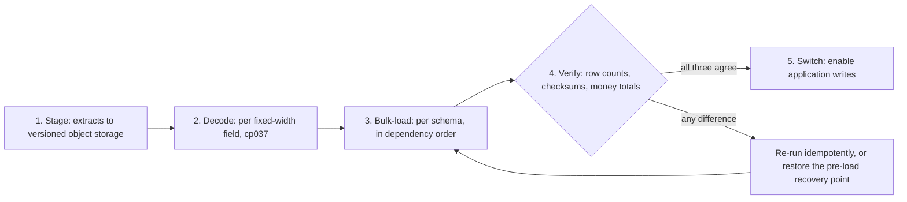

# Data Migration Runbook

## Document contract

**Purpose**: Move the CardDemo record data from the exported mainframe flat files into the Aurora
PostgreSQL schemas, in the order stage, decode, bulk-load, verify, and only then switch traffic. This
runbook owns the data half of the cutover: the two decoding constraints, the eleven record-length
contracts, the three mandatory verification passes, idempotent re-loading, and the pre-load recovery
point that a roll-back returns to.

**Source of truth**: The copybooks under `app/cpy/**` are the normative record layouts. The
`IDCAMS` load jobs under `app/jcl/**` are the normative key and record-size contracts. The
implementation is `data-migration/src/carddemo_migration/**` and `data-migration/sql/**`;
`data-migration/README.md` and `data-migration/src/carddemo_migration/cli.py` are the authority for
command names and options. Field-by-field column mapping lives in
[data-model-and-schema-mapping.md](../architecture/data-model-and-schema-mapping.md), and every
intentional behavioural divergence is registered in
[cobol-to-service-traceability.md](../architecture/cobol-to-service-traceability.md). The mainframe
assets under `app/**` are reference-only and are read, never written.

| Parameter | Kind | Description |
|:---|:---|:---|
| `<env>` | enum | `dev` or `prod`; selects the environment root whose outputs every command below resolves. |
| `<dataset-bucket>` | S3 bucket name | Versioned dataset bucket. Read from the environment's Terraform output at the point of use; never written into this document. |
| `<dataset>` | ETL layout token | One of the eleven seed layouts in the record-length contract below, for example `ACCOUNT`. Not the MVS dataset name. |
| `<encoding>` | enum | `ascii` or `ebcdic`; declares which of the two shipped forms of an extract is being read. Required, never sniffed. |
| `<generation>` | generation ordinal | The `gen=NNNN` component of a staged object's prefix. Five are retained; a sixth is not recoverable. |
| `<business-date>` | ISO date | Any date a load or a downstream job needs, supplied as a parameter rather than read from the clock. |
| `<db-secret-id>` | Secrets Manager secret id | Entry holding a database credential. Resolve at run time; never paste a resolved value into a file or a command history. |
| `<parameter-prefix>` | Parameter Store prefix | Prefix beneath which the environment publishes its non-secret connection parameters. |
| `<trust-anchor-path>` | local file path | Certificate bundle used to verify the database server, because every service pins `sslmode=verify-full`. |
| `<snapshot-id>` | database snapshot identifier | The pre-load recovery point taken before the first load of an environment. |
| `<manifest-path>` | local file path | Verification manifest declaring which datasets a cutover loaded and where their bytes are. |
| `<state-machine-arn>` | Step Functions ARN | The nightly chain that invokes these same loaders. Placeholder only; [batch-operations.md](batch-operations.md) owns it. |
| `<sql-root>` | local directory path | Location of the `sql` tree. Required in the container image, omitted in a source checkout. |

**Expected outcome / success signal**: Every staged object matches the record-length contract; every
decode produces clean text with no replacement characters; every load reports the row count the
source file implies; and all three verification passes exit zero for every loaded dataset. A load is
"verified" only when row counts, record checksums and exact money totals all agree. Any non-zero
exit is the gate: the switch does not happen.

**Failure modes and handling**: Stop before loading when a file's size is not an exact multiple of
its record length, when decoded output contains replacement characters, or when the source form of an
extract cannot be established. Stop before switching when any verification pass reports a difference,
when the `DEFAULT` disclosure-group row is absent, or when no pre-load recovery point exists. Use the
failure table near the end of this document, and [teardown.md](teardown.md) for the infrastructure
half of roll-back.

---

## Scope, prerequisites and the deployment boundary

This runbook supplies operator commands. It is **not** evidence that a live AWS environment exists,
that any load has been performed, or that any throughput was measured. Executing these commands
against a real account, and the cost that incurs, remains an operator action outside this scope. No
figure in this document is a benchmark; the byte counts are file sizes measured in the checkout.

This procedure **assumes [deploy.md](deploy.md) Steps 1-3 have completed**: the remote-state backend
exists, the container images are published, and the environment is provisioned so that the Aurora
cluster and the versioned dataset bucket are both present. Provisioning them is not re-owned here.
Applying each owning service's Flyway migration is [deploy.md](deploy.md) Step 4, and seeding
reference data is [deploy.md](deploy.md) Step 5; this document verifies the result of both and
re-owns neither. Destroying infrastructure, and the infrastructure half of roll-back, belong to
[teardown.md](teardown.md). The nightly batch chain and the `StageSeedDatasets` state that invokes
these same loaders belong to [batch-operations.md](batch-operations.md).

Validate the package before using it against any database.

```bash
# WHAT: install the hash-locked development closure and run the Python gates.
# WHY : Assumptions: the development manifest pins every transitive dependency with a
#       hash, so the codecs that decode money here behave identically to the ones the
#       tests validated. An unpinned install can substitute a different decimal or
#       encoding library and change a rounded cent without failing anything.
source .venv/bin/activate
python -m pip install --require-hashes -r data-migration/requirements-dev.txt
ruff check data-migration
python -m compileall -q data-migration/src
python -m pytest -v --tb=short data-migration/tests
```

```bash
# WHAT: print the entry point's own subcommand list and exit-status contract.
# WHY : Assumptions: this CLI is the authority for its own verbs, so an operator
#       reconciles a command in this runbook against --help rather than against prose.
#       Every verb named below is registered by
#       data-migration/src/carddemo_migration/cli.py and documented in
#       data-migration/README.md.
python -m carddemo_migration.cli --help
```

**Note**: the generic entry-point form is `python -m carddemo_migration.cli <subcommand>`, which is
the usage string the CLI prints for itself. The container image is built from
`data-migration/Dockerfile` on `python:3.13.14-slim-trixie`.

```bash
# WHAT: build the ETL image.
# WHY : Assumptions: the interpreter is pinned to the same version the existing COBOL
#       test suite runs on, so zoned-decimal and packed-decimal behaviour is identical
#       between this ETL and the harness that validates its output. A different minor
#       version could round or normalise differently and make a parity difference look
#       like a load defect.
docker build -t carddemo-data-migration:local data-migration
```

---

## The cutover sequence

Cutover is **read, then verify, then switch** — never a big-bang swap. Four movements produce the
data, and a gate stands between the last of them and the switch.



Verification sits **before** the switch for a reason worth stating plainly: a load that has not been
verified is not evidence that the data is correct. Switching first turns verification into a
post-mortem — it would still find the defect, but only after the application had served it. Placing
the gate first is the entire point of the procedure, and it is why the three passes are mandatory
rather than advisory.

---

## The source datasets

Twenty-two extracts ship in the repository under `app/data/**`. They are reference-only inputs: the
ETL reads them and never writes them.

Nine are in `app/data/ASCII/`, and their sizes carry line terminators, which is why each exceeds an
exact multiple of its record length by a small amount:

| File | Bytes |
|:---|---:|
| `acctdata.txt` | 15050 |
| `carddata.txt` | 7550 |
| `cardxref.txt` | 1850 |
| `custdata.txt` | 25050 |
| `dailytran.txt` | 105300 |
| `discgrp.txt` | 2601 |
| `tcatbal.txt` | 2599 |
| `trancatg.txt` | 1116 |
| `trantype.txt` | 433 |

Thirteen are in `app/data/EBCDIC/`, named `AWS.M2.CARDDEMO.<name>.PS`, and they are unterminated
fixed-length records:

| File | Bytes |
|:---|---:|
| `ACCDATA` | 15000 |
| `ACCTDATA` | 15000 |
| `CARDDATA` | 7500 |
| `CARDXREF` | 2500 |
| `CUSTDATA` | 25000 |
| `DALYTRAN` | 105000 |
| `DALYTRAN.PS.INIT` | 350 |
| `DISCGRP` | 2550 |
| `EXPORT.DATA` | 250000 |
| `TCATBALF` | 2500 |
| `TRANCATG` | 1080 |
| `TRANTYPE` | 420 |
| `USRSEC` | 800 |

Because the EBCDIC extracts carry no terminators, their sizes factor exactly into record count times
record length. That gives an operator a pre-load sanity check that needs no tooling at all:

```text
# WHAT: the record-count arithmetic for each unterminated EBCDIC extract.
# WHY : Assumptions: an unterminated fixed-length file has no delimiter, so its size
#       MUST be an exact multiple of its record length. Any remainder means the file is
#       not the shape the reader expects, and the arithmetic below is the cheapest
#       possible way to find that out before a database is involved.
USRSEC         800 = 10  x 80
ACCTDATA     15000 = 50  x 300
CARDDATA      7500 = 50  x 150
CUSTDATA     25000 = 50  x 500
CARDXREF      2500 = 50  x 50
DALYTRAN    105000 = 300 x 350
DISCGRP       2550 = 51  x 50
TCATBALF      2500 = 50  x 50
TRANCATG      1080 = 18  x 60
TRANTYPE       420 = 7   x 60
EXPORT.DATA 250000 = 500 x 500
```

Two details trip operators up, so both are called out.

- **`DISCGRP` holds 51 records, where the other masters hold 50.** Among them are the mandatory
  `'DEFAULT'` disclosure-group rows. The disclosure-group key is a triple of group identifier,
  transaction type and transaction category, so `DEFAULT` is not a single row: the shipped extract
  carries **seventeen** of them, at record ordinals 18 through 34, one per type-and-category
  combination the reference data uses. Interest calculation falls back to that group when a specific
  group lookup misses, so their presence is verified explicitly in Step 4.
- **`EXPORT.DATA` is a different animal from the base masters.** It is the 500-byte export record,
  and its money fields are packed decimal rather than zoned. It is not one of the eleven seed loads;
  the export and import round trip belongs to [batch-operations.md](batch-operations.md).

**Note**: `usrsec` **exists only in EBCDIC form**. There is no `usrsec.txt` in `app/data/ASCII/`, so
it is the one dataset for which the EBCDIC path is not optional. Note also that a populated
transaction master is not among the twenty-two — the repository ships the daily feed and the masters,
which is why the `TRAN` load in Step 3 is conditional on a cutover supplying a real extract.

---

## The record-length contract

Every reader offset depends on the table below. Confirm a file is the shape the loader expects
**before** loading it.

| MVS dataset | ETL layout token | Copybook | Record length (bytes) | Key length |
|:---|:---|:---|---:|---:|
| `USRSEC` | `SECUSER` | `CSUSR01Y` | 80 | 8 |
| `ACCTDATA` | `ACCOUNT` | `CVACT01Y` | 300 | 11 |
| `CARDDATA` | `CARD` | `CVACT02Y` | 150 | 16 |
| `CUSTDATA` | `CUSTOMER` | `CVCUS01Y` | 500 | 9 |
| `CARDXREF` | `XREF` | `CVACT03Y` | 50 | 16 |
| `DALYTRAN` | `DALYTRAN` | `CVTRA06Y` | 350 | 16 |
| `TRANSACT` | `TRAN` | `CVTRA05Y` | 350 | 16 |
| `DISCGRP` | `DISGROUP` | `CVTRA02Y` | 50 | 16 |
| `TRANCATG` | `TRANCAT` | `CVTRA04Y` | 60 | 6 |
| `TRANTYPE` | `TRANTYPE` | `CVTRA03Y` | 60 | 2 |
| `TCATBALF` | `TCATBAL` | `CVTRA01Y` | 50 | 17 |

These eleven values are corroborated five independent ways, which is why they are stated as a
contract rather than as a configuration: the copybook field widths sum to them, the unterminated
EBCDIC file sizes factor by them, the `RECORDSIZE(...)` clauses in the `IDCAMS` load jobs declare
them, the dataset table in the root [README.md](../../README.md) publishes them, and the package
prints them from its own layout catalogue. Every key length above equals the first operand of the
corresponding `KEYS(...)` clause in the baseline job listed later in this document.

```bash
# WHAT: print the layout catalogue the readers actually use -- identifier, copybook,
#       record length, key length and provenance -- for every registered layout.
# WHY : Assumptions: this reads the package's own catalogue rather than this table, so
#       it is the check that matters if the two ever disagree. It also distinguishes the
#       eleven BASE_MASTER seed layouts from the DERIVED records the batch jobs produce,
#       which are not cutover inputs and must not be loaded here.
python -m carddemo_migration.cli list-datasets
```

**A file whose size is not an exact multiple of its record length is malformed, and the loader must
refuse it rather than load it.**

Assumptions: these are fixed-length records with no delimiter, so there is no resynchronisation
point after a framing error. The first wrong offset shifts every field of every subsequent record,
and because the shifted bytes are still valid characters the result is a table full of plausible
values rather than an error. Refusing the file is the only point at which the defect is cheap to
find.

The copybooks under `app/cpy` are the **single normative source** for field offsets, lengths, decimal
scale and sign semantics. The ETL layout descriptors are derived from them. An operator diagnosing a
field-level discrepancy reads the copybook, not the loader.

---

## Constraint one: EBCDIC is decoded per fixed-width field, never per record

**This is the single most likely implementation mistake in the entire migration, and it produces data
that looks almost right.** It deserves to be read before any load is attempted.

The existing test suite deliberately treats the thirteen `app/data/EBCDIC/*.PS` extracts as **opaque
binary** and never transcodes them. Its own helpers warn that routing binary EBCDIC through a UTF-8
write mangles it into replacement characters, at `tests/helpers/localstack_setup.py` L729, L741 and
L1048. The ETL follows the same discipline and decodes at **exactly one place**:
`data-migration/src/carddemo_migration/copybook/ebcdic_codec.py`, which opens the file in **binary
mode** and decodes **each fixed-width field individually** using the cp037 family registered by the
`ebcdic` package.

```text
# WHAT: the shape of the decision, stated once so it is not rediscovered per reader.
# WHY : Assumptions: a record is NOT text. Alongside its character fields it carries
#       zoned-decimal sign overpunch bytes, packed-decimal nibbles and embedded low
#       values. The fixed-width field layout IS the data format, and it is the only
#       thing that says which spans are text at all.
# WHY : Alternatives Considered: whole-record bytes.decode("cp037") was the obvious
#       approach and is rejected. Applied to a whole record it either raises on the
#       non-text bytes or, far worse, silently substitutes U+FFFD for them. A
#       replacement character in a money field is a wrong number, not a visible error,
#       and it survives every check that does not compare money exactly.
open(path, "rb")                    -> bytes, never str
bytes[offset : offset + length]     -> one field, per the copybook
field.decode("cp037")               -> only for spans the layout calls text
```

Two consequences follow for an operator.

- **Spot-check a text field after decoding.** Clean output contains no `U+FFFD` replacement
  characters anywhere. A single replacement character means the decode was applied at record
  granularity instead of field granularity, and the load must not proceed.
- **`usrsec` has no ASCII twin**, so the EBCDIC path is mandatory for it. Its password span is read
  as bytes and discarded rather than decoded, because the target schema declares no column for it.

The equivalent hazard in the other direction is worth one line: nine datasets ship in both
encodings, so the form being read must be **declared**, never sniffed. An all-ASCII EBCDIC extract
sniffs as text and decodes to plausible wrong values, which is why `--encoding` is a required
argument rather than a defaulted one.

---

## Constraint two: money is exact fixed point, and the base masters use zoned decimal

The base master money fields are **zoned decimal with sign overpunch** — not packed. For example
`ACCT-CURR-BAL PIC S9(10)V99` at `app/cpy/CVACT01Y.cpy` L7. Packed decimal appears in the export
record and in the authorization segments, and it is decoded at the ETL edge; packed bytes are never
persisted.

The repository documents the consequence in its own words. `tests/README.md` §5.2 records that the
reference build uses `cobc -fixed -fsign=EBCDIC --std=ibm-strict -I app/cpy`, and that
*"`-fsign=EBCDIC` is REQUIRED — the default `-fsign=ASCII` misreads the zoned-decimal sign overpunch
and silently corrupts negative balances."*

The word **silently** is the whole point. A sign-convention error does not raise. It produces
plausible numbers with the wrong sign, in a table whose row count is perfect and whose text fields
are all correct. This is precisely why the money-total parity pass in Step 4 is not optional: it is
the only check that catches a sign error at all.

Assumptions: the sign of a zoned-decimal field lives in the overpunch of its final byte, and the
decimal point does not exist in the stored bytes at all. Both facts are properties of the source data
format that the decoder depends on, and neither is recoverable from the digits alone.

The target invariant holds at every hop:

| Hop | Representation | Forbidden |
|:---|:---|:---|
| PostgreSQL column | `NUMERIC(p,2)` | any binary floating-point type |
| Java service | `BigDecimal`, scale 2, `RoundingMode.HALF_UP` | `float`, `double` |
| Python ETL | `Decimal` | `float` |
| JSON on the wire | a **string** | a JSON number |

Money is transported as a JSON string for a concrete reason rather than a stylistic one: a JSON
**number** is parsed into an IEEE-754 double by most clients, which destroys exactness at the last
boundary before a human reads the figure. Carrying the digits as a string moves the parse decision to
the consumer instead of making it silently on the consumer's behalf.

Two offset hazards come straight from the baseline and are easy to reproduce as defects.

- **The implied decimal point.** `app/jcl/PRTCATBL.jcl` declares its fields to DFSORT as `ZD` at
  L43-L50 — `TRANCAT-ACCT-ID,1,11,ZD`, `TRANCAT-TYPE-CD,12,2,CH`, `TRANCAT-CD,14,4,ZD`,
  `TRAN-CAT-BAL,18,11,ZD` — and then formats the money field with an explicit edit mask,
  `TRAN-CAT-BAL,EDIT=(TTTTTTTTT.TT)` at L56. That mask is the only place the decimal point becomes
  visible: the stored bytes carry none, and the scale lives in the `PICTURE` clause. An ETL that
  treats the digits as an integer is wrong by a factor of one hundred.
- **One-based against zero-based.** Offsets in JCL and DFSORT are **one-based**; Python byte slices
  are **zero-based**. Carrying a declared offset across unadjusted shifts every field by one byte,
  which for a zoned field moves the sign overpunch out of the span entirely.

```bash
# WHAT: decode a single record through the layout contract and print its fields, before
#       any table is written.
# WHY : Assumptions: this exercises the real codec on the real bytes, so it settles the
#       encoding, the framing and the decimal scale in one step. Reading the first
#       record of an extract is the cheapest proof that the three agree.
# WHY : Alternatives Considered: proving the layout by loading and then inspecting the
#       table was rejected. It reaches the same conclusion after a write, so a wrong
#       answer has to be undone with a privilege the loader roles deliberately lack.
# WHY : Assumptions: the display code page defaults to cp037, so an EBCDIC extract needs
#       no flag. `--code-page` overrides it, and `--record` selects a ONE-BASED ordinal --
#       the same one-based convention the JCL uses, and the opposite of a Python slice.
python -m carddemo_migration.cli decode-record --dataset ACCOUNT --source app/data/EBCDIC/AWS.M2.CARDDEMO.ACCTDATA.PS
```

Inspect the decoded money fields for a sign that survived and a decimal point in the expected place.
A balance that should be negative and is not is the signature of the wrong sign convention.

---


## Step 1 - Stage the flat files to object storage

Staging copies the extract bytes into the versioned dataset bucket without transcoding them. The
bucket name is read from the environment's Terraform output; it is never written into this document.

```bash
# WHAT: resolve the dataset bucket and the extract prefix from the environment root's
#       own outputs.
# WHY : Assumptions: the bucket is published inside the aggregate `datasets` output
#       rather than as a scalar root output, so it is read with `output -json` and a
#       key selection. Reading the output instead of restating a default is what keeps a
#       tfvars override from making this runbook silently wrong.
ENVIRONMENT=dev
DATASET_BUCKET="$(terraform -chdir="infra/envs/${ENVIRONMENT}" output -json datasets | jq -r '.bucket_name')"
EXTRACT_URI="$(terraform -chdir="infra/envs/${ENVIRONMENT}" output -json datasets | jq -r '.source_extract_uri')"
```

```bash
# WHAT: copy the reference extracts into the bucket's source-extract prefix.
# WHY : Assumptions: the copy is byte-preserving. EBCDIC sign bytes and packed nibbles
#       must stay opaque until a field-aware decoder consumes them, so any text-mode
#       conversion at this hop corrupts them before the decoder ever sees them.
# WHY : Assumptions: syncing the parent directory preserves the subdirectory name, so
#       app/data/EBCDIC/ lands beneath the extract prefix under the exact file names the
#       layout catalogue records. Syncing each child separately would flatten that
#       correspondence and the loaders would resolve nothing.
aws s3 sync app/data/ "s3://${DATASET_BUCKET}/migration/source/" --no-follow-symlinks
```

```bash
# WHAT: stage one dataset into the generation prefix the loaders and the nightly chain
#       both read.
# WHY : Assumptions: staging records the object's length and digest, so a later load can
#       prove it is reading the bytes that were staged rather than merely a file with the
#       right name. That is the property that makes a redriven step safe.
python -m carddemo_migration.cli stage-dataset --dataset ACCOUNT
```

Staged objects land under the convention below. The bucket is versioned, with a lifecycle rule
retaining **five noncurrent versions** — the direct analogue of the baseline's `LIMIT(5) SCRATCH` on
its generation-dataset bases.

```text
# WHAT: the generation prefix convention.
# WHY : Assumptions: retention is five noncurrent versions, so an operator can reach back
#       exactly FIVE generations and no further. A sixth is not recoverable from this
#       bucket, which is a real limit on how far a roll-back can reach through staged
#       data rather than a configuration detail.
s3://<dataset-bucket>/<domain>/<dataset>/dt=YYYY-MM-DD/gen=NNNN/
```

Resolving which generation a given run wrote, and reaching an earlier one, is the generation-lookup
procedure in [batch-operations.md](batch-operations.md), which owns it.

```bash
# WHAT: list what is actually under the extract prefix.
# WHY : Assumptions: the loaders compose one key per dataset by joining the layout's
#       registered source-object name to this prefix, so the extracts must sit flat
#       beneath it under those exact names. Listing is how a naming mismatch is found
#       before a load reports a missing object.
aws s3 ls "$EXTRACT_URI"
```

---

## Step 2 - Decode

Decoding is not a separate pass over the data; it is what the readers do as they load. This step
exists so the decode is **proven on one record before eleven files are committed to a database**.

```bash
# WHAT: decode one record of each unterminated extract that will be loaded.
# WHY : Assumptions: this command reads one local file and touches no database, object
#       store or credential, so it is safe to run before any boundary is crossed. It is
#       the cheapest proof that the encoding, the framing and the decimal scale agree.
# WHY : Assumptions: every value is printed as a string, deliberately, so that inspecting
#       a decode cannot itself re-read a monetary amount as a floating-point number.
python -m carddemo_migration.cli decode-record --dataset SECUSER --source app/data/EBCDIC/AWS.M2.CARDDEMO.USRSEC.PS
python -m carddemo_migration.cli decode-record --dataset TRANTYPE --source app/data/EBCDIC/AWS.M2.CARDDEMO.TRANTYPE.PS
```

The credential span of the user record decodes to a withheld marker rather than to its bytes, because
the target schema declares no column for it. That is the intended reach, not a shortfall.

This command frames strictly by record length, which makes it a direct test of the contract above. It
therefore **refuses the line-terminated ASCII twins**, and the refusal is worth seeing once because it
is the framing gate doing its job:

```bash
# WHAT: attempt the same decode against the line-terminated ASCII form.
# WHY : Assumptions: the ASCII twins carry line terminators, so their sizes do NOT factor
#       by the record length -- trantype.txt is 433 bytes against a 60-byte record, leaving
#       13 over. The command reports the remainder and exits 8 rather than mis-framing, and
#       the loader's ASCII path is what reads that form. Seeing the refusal here is how an
#       operator learns to tell a terminated file apart from a corrupt one.
python -m carddemo_migration.cli decode-record --dataset TRANTYPE --source app/data/ASCII/trantype.txt
```

What to look for, in order:

- **No `U+FFFD` replacement characters in any text field.** Their presence means the decode reached
  the record rather than the field, per Constraint one. Stop.
- **Signs survived.** A field whose source value is negative decodes negative. If every value is
  positive, suspect the sign convention before suspecting the data.
- **The decimal point sits two digits from the right** on every money field. A value inflated by
  exactly one hundred is the implied-decimal defect from Constraint two.
- **Field boundaries are clean.** A name field ending in a digit, or an identifier with a trailing
  letter, is the signature of a one-byte offset shift.

---

## Step 3 - Bulk-load per schema, in dependency order

### The eight schemas

`data-migration/sql/V0__schemas_and_roles.sql` bootstraps eight schemas and the service roles behind
them.

| Schema | Owns |
|:---|:---|
| `auth` | user identity rows; deliberately **no** password column |
| `account` | accounts, customers, card cross-reference |
| `card` | cards |
| `ledger` | transactions, daily transactions, rejects, category balances |
| `reference` | transaction types and categories, disclosure groups, lookup data |
| `batch` | the durable step ledger and the job repository |
| `authorization` | pending-authorization summary and detail, fraud rows |
| `reporting` | **no tables at all** — read-only cross-schema views under a `SELECT`-only role |

```bash
# WHAT: apply the schema and role bootstrap.
# WHY : Assumptions: ON_ERROR_STOP is set so a partially applied security model cannot be
#       mistaken for a successful boundary. Without it psql continues past a failed GRANT
#       and exits zero, leaving a role with privileges nobody granted deliberately.
# WHY : Assumptions: V0 is idempotent by construction, so re-running it is part of the
#       documented sequence rather than a workaround.
psql --set ON_ERROR_STOP=on -f data-migration/sql/V0__schemas_and_roles.sql
```

The batch role holds **narrowly scoped** cross-schema write grants on the `ledger` and `account`
objects and nothing wider. The reason is a single unit of work: transaction posting commits the
transaction, the category balance and the account together, as `app/cbl/CBTRN02C.cbl` does, and the
grant is what keeps that one ACID commit.

Alternatives Considered: a saga with compensating reversals was evaluated and rejected. It would
replace one atomic commit with a sequence of committed steps, which makes states such as a posted
transaction with an unposted balance **observable** — states the baseline never exposes. The golden
masters would correctly flag those as parity failures, so the scoped grant is both the lower-risk and
the more faithful choice. Do not replace it with schema-wide privileges.

**Note**: the `authorization` schema consolidates data the baseline split across IMS DL/I segments
and Db2 tables joined by two-phase commit. In the target these live in one PostgreSQL schema and
**two-phase commit is eliminated rather than emulated**. Its packed-decimal money is decoded at the
ETL edge.

### Load order

Referenced tables load before referencing ones. `reference` first, then `account`, then `card`, then
`ledger`.

```bash
# WHAT: load the seed datasets smallest-reference-first, one command per dataset.
# WHY : Assumptions: `reference.transaction_categories` carries a foreign key to
#       `reference.transaction_types` with ON DELETE RESTRICT, and `account.card_xref` is
#       what every later lookup joins through. A load that violates declared referential
#       integrity FAILS at the constraint rather than silently producing orphans, which is
#       the desired behaviour -- so the order is what decides whether a failure names the
#       missing row or merely the constraint that noticed.
# WHY : Assumptions: one command per line, never chained. An operator has to be able to
#       see which load failed, and a chained one-liner hides that.
# WHY : Assumptions: SECUSER names the EBCDIC tree because that is its only form. Its
#       password span is read as bytes and discarded -- `auth.users` declares no column
#       for it -- so no credential is loaded from it.
python -m carddemo_migration.cli load-dataset --dataset TRANTYPE --encoding ascii
python -m carddemo_migration.cli load-dataset --dataset TRANCAT --encoding ascii
python -m carddemo_migration.cli load-dataset --dataset DISGROUP --encoding ebcdic
python -m carddemo_migration.cli load-dataset --dataset SECUSER --encoding ebcdic
python -m carddemo_migration.cli load-dataset --dataset CUSTOMER --encoding ascii
python -m carddemo_migration.cli load-dataset --dataset ACCOUNT --encoding ebcdic
python -m carddemo_migration.cli load-dataset --dataset XREF --encoding ascii
python -m carddemo_migration.cli load-dataset --dataset CARD --encoding ascii
python -m carddemo_migration.cli load-dataset --dataset TCATBAL --encoding ascii
python -m carddemo_migration.cli load-dataset --dataset DALYTRAN --encoding ascii
```

**Note**: where a dataset ships in both encodings the two conversions are not always byte-equal.
`data-migration/README.md` records that the nine dual-form datasets agree field for field at every
value except two, one of which is the disclosure-group interest rate that decides interest. Load and
verify from the **same** form, and prefer the form the package treats as authoritative for that
dataset.

The eleventh layout, `TRAN`, is loaded only on a cutover that supplies a real transaction master,
because the repository ships no populated one.

```bash
# WHAT: load the transaction master, ONLY when a cutover supplies an extract for it.
# WHY : Assumptions: `ledger.transactions` has a second writer -- the posting job inserts
#       into it -- so this load merges on `transaction_id` rather than failing on the
#       primary key. That is what lets a redriven staging step re-enter without
#       duplicating rows.
python -m carddemo_migration.cli load-dataset --dataset TRAN --source "<extract-location>" --encoding ebcdic
```

```bash
# WHAT: advance the transaction-identifier allocator past every identifier the loaded
#       master already holds.
# WHY : Assumptions: the allocator is positioned by its own migration from the maximum
#       identifier present, and on a cutover that migration runs BEFORE this load, against
#       an empty table. Without this step the first interactive transaction add allocates
#       an identifier the table already holds and fails on the primary key -- and so does
#       the next, for as many allocations as the loaded range is wide.
# WHY : Assumptions: the step only ever ADVANCES the allocator, so it is safe to re-run.
#       A rewind would make the service reissue identifiers it has already stored.
python -m carddemo_migration.cli reconcile-sequences
```

---

## Step 4 - Verify, three ways

Verification is a first-class step, not a formality. A load that "succeeded" without a money-total
check is not evidence of anything.

| Check | Module | What it catches that the others do not |
|:---|:---|:---|
| **Row counts per dataset** | `verify/row_counts.py` with `sql/verify/row_counts.sql` | Truncated input, a skipped file, a partially committed load, a load that ran twice |
| **Record checksums** | `verify/checksum.py` | Field-level corruption in rows that are all present and correctly counted |
| **Money-total parity against the source** | `verify/money_parity.py` with `sql/verify/money_totals.sql` | Sign-convention errors, implied-decimal scale errors, and packed-against-zoned confusion — **none of which change the row count, and none of which a checksum over decoded text will necessarily flag** |

```bash
# WHAT: run all three passes over every manifested dataset, in fixed order, as one gate.
# WHY : Trade-offs: three passes cost more cutover work than one, and that cost buys the
#       only evidence that the data is correct rather than merely present. Row counts
#       alone certify a table that is full of the wrong numbers.
# WHY : Alternatives Considered: a shell loop over the three individual verbs was
#       rejected. With a loop, "verified" comes to mean whatever the loop happened to
#       contain, and a `set -e` that stops mid-group leaves a subset verified with no
#       record of which subset. The aggregate command has no option that skips a pass, so
#       a zero exit means every covered dataset was verified three ways.
# WHY : Assumptions: a non-zero exit is the gate, not the log output. Each pass exits
#       non-zero on a difference and prints the comparison, so the first disagreement
#       stops the run with the evidence on standard output.
python -m carddemo_migration.cli verify-all --manifest "<manifest-path>"
```

Alternatives Considered for accepting row counts alone: this repository already has the precedent
that settles it. `tests/README.md` §6 records that a bare marker-selected run with no emulator
*"used to exit 0 with all three AWS tests merely SKIPPED -- a misleading 'green' that proved
nothing."* That is the identical failure shape — a check that passes without having checked anything
— and it is why "it exited zero" is treated here as insufficient on its own.

Narrow to one dataset when the gate fails and the question is which one:

```bash
# WHAT: the three passes for a single dataset, for diagnosing a gate failure.
# WHY : Assumptions: these claim nothing beyond the dataset named, which is why they exist
#       alongside the aggregate gate rather than instead of it.
python -m carddemo_migration.cli verify-row-counts --dataset ACCOUNT
python -m carddemo_migration.cli verify-checksum --dataset ACCOUNT
python -m carddemo_migration.cli verify-money-parity --dataset ACCOUNT
```

Run the two whole-migration reports last, because they are the only pass that reports a table no
single dataset was named for.

```bash
# WHAT: the whole-migration row-count and money-total reports, reduced to an exit status.
# WHY : Assumptions: these read only the aggregate views, as the read-only reporting role,
#       and each proves its session really is that role before running anything. A pass
#       that cannot alter its own subject is the property being bought.
# WHY : Alternatives Considered: running the same SQL with psql was rejected for an
#       orchestrated step. psql exits 0 for a report full of mismatches, so a state
#       machine branching on it would treat a failed verification as a success. These
#       commands exit non-zero when any line did not verify.
# WHY : Assumptions: `--sql-root` is required in the container image and must be omitted
#       in a source checkout, because the sql tree ships beside the installed package
#       rather than inside it. Passing the wrong one fails closed and names the path.
python -m carddemo_migration.cli verify-row-count-report
python -m carddemo_migration.cli verify-money-total-report --extract "ACCOUNT=app/data/EBCDIC/AWS.M2.CARDDEMO.ACCTDATA.PS"
```

### The mandatory `DEFAULT` disclosure-group rows

```bash
# WHAT: count the DEFAULT disclosure-group rows in the reference schema.
# WHY : Assumptions: interest calculation falls back to the DEFAULT group when a specific
#       group lookup misses. With the group absent the fallback resolves to nothing and
#       interest accrual is wrong for every account whose own group is missing -- and no
#       row-count or checksum pass notices, because an absent row is the defect itself.
psql --set ON_ERROR_STOP=on -c "SELECT count(*) FROM reference.disclosure_groups WHERE group_id = 'DEFAULT';"
```

Expect a **non-zero** count. Because the disclosure-group key is a triple of group identifier,
transaction type and transaction category, `DEFAULT` is a set of rows rather than one row: the shipped
`DISCGRP` extract carries seventeen, so a load from that seed should report seventeen. Do not assert
exactly one. Seeding this data is [deploy.md](deploy.md) Step 5; this step verifies the result and
does not re-own the seeding.

```bash
# WHAT: read the DEFAULT rows straight out of the source extract, for comparison.
# WHY : Assumptions: the extract is the baseline the loaded table is judged against, so the
#       expected count is derived from the bytes rather than from this document. If the two
#       disagree, the extract wins and the load is what is wrong.
python -m carddemo_migration.cli decode-record --dataset DISGROUP --source app/data/EBCDIC/AWS.M2.CARDDEMO.DISCGRP.PS --record 18
```

---

## Step 5 - Switch

The switch happens **only after all three verification passes have agreed for every loaded dataset**.
That ordering is the point of this entire procedure: before the switch a difference is a load to
re-run, and after it a difference is an incident.

Confirm all of the following before enabling application writes.

- **All three passes exit zero** for every dataset the cutover loaded, and the manifest declared every
  one of them. A pass that was not run is not a pass.
- **The two whole-migration reports exit zero**, covering the tables no single dataset load touches.
- **The `DEFAULT` disclosure-group row exists.**
- **A pre-load recovery point exists and is approved as the roll-back target**, per the next section.
- **The environment whose parameters the load resolved is the environment the application will run
  in.** Protected columns are enciphered under the key the owning service resolves at run time, so a
  load performed against a different environment's key produces rows that count, digest and total
  cleanly and then fail to decrypt in the application later.

Assumptions: that last condition is a gate item rather than a check because no verification pass can
catch it. The row counts agree, the money totals agree and the ciphertext is well formed either way;
the authentication failure is deferred to first read. It is therefore confirmed by an operator at the
gate or not at all.

Enabling writes is the online-write lease that [batch-operations.md](batch-operations.md) owns, and
rolling the services out is [deploy.md](deploy.md) Step 6.

---


## The baseline load jobs this replaces

The `IDCAMS` jobs below are the baseline load steps, and they are the source of the key and
record-size contracts stated earlier. Every value here was read from the JCL itself.

| Baseline job | Key | Record size | Alternate index |
|:---|:---|:---|:---|
| `ACCTFILE.jcl` | `KEYS(11 0)` | `RECORDSIZE(300 300)` | — |
| `CARDFILE.jcl` | `KEYS(16 0)` | `RECORDSIZE(150 150)` | `KEYS(11 16)` to `CARDAIX` |
| `XREFFILE.jcl` | `KEYS(16 0)` | `RECORDSIZE(50 50)` | `KEYS(11,25)` to `CXACAIX` |
| `CUSTFILE.jcl` | `KEYS(9 0)` | `RECORDSIZE(500 500)` | — |
| `DISCGRP.jcl` | `KEYS(16 0)` | `RECORDSIZE(50 50)` | — |
| `TCATBALF.jcl` | `KEYS(17 0)` | `RECORDSIZE(50 50)` | — |
| `TRANTYPE.jcl` | `KEYS(2 0)` | `RECORDSIZE(60 60)` | — |
| `TRANCATG.jcl` | `KEYS(6 0)` | `RECORDSIZE(60 60)` | — |
| `DUSRSECJ.jcl` | `KEYS(8,0)` | `RECORDSIZE(80,80)` | — |
| `TRANFILE.jcl` | `KEYS(16 0)` | `RECORDSIZE(350 350)` | `KEYS(26 304)` to `TRANSACT.VSAM.AIX` |

Two transformations apply.

- **`IDCAMS REPRO` becomes an ETL load step.** `app/jcl/ACCTFILE.jcl` shows the form at L61:
  `REPRO INFILE(ACCTDATA) OUTFILE(ACCTVSAM)`. The `load-dataset` command in Step 3 is its
  equivalent, reading the same extract and writing the schema that owns the record.
- **`IDCAMS BLDINDEX` is retired**, because PostgreSQL maintains indexes transactionally. It appears
  in exactly the three jobs that define an alternate index, and it has no counterpart in this
  procedure.

Refactoring Rationale: in the baseline, an index over a bulk-loaded cluster had to be rebuilt by a
separate job step after the load, and that step could fail on its own, leaving a populated cluster
with an unusable access path. In the target the equivalent index is maintained by the same
transaction that inserts the row, so the step is not merely automated away — it is unnecessary, and
there is no window in which the data is loaded but the access path is not.

The three alternate indexes survive as real secondary indexes, so every browse and lookup path the
baseline offered still exists:

| Baseline alternate index | Target index |
|:---|:---|
| `CARDAIX` (cards by account) | `idx_cards_account_id` |
| `CXACAIX` (cross-reference by account) | `idx_card_xref_account_id` |
| `TRANSACT.VSAM.AIX` (batch path) | `idx_transactions_proc_ts` |

```bash
# WHAT: update planner statistics after the bulk loads.
# WHY : Assumptions: the indexes are already populated by the loading transactions, so
#       this analyses rather than builds. It is the counterpart of the baseline's index
#       step only in placement, not in function -- skipping it costs query plans, not
#       correctness.
psql --set ON_ERROR_STOP=on -c "VACUUM ANALYZE;"
```

---

## Re-running a load, and roll-back

Three recovery paths exist and they are genuinely different operations. Choose by deciding which
question is being answered.

### 1. Re-run the load

Each load is keyed, so a re-run converges rather than duplicating. A single-writer table that is
already populated is **declined** with the count already present and a zero exit, which is a success
to read as "already loaded" and never as "loaded now". The one multi-writer table merges on its
identifier instead.

```bash
# WHAT: re-run a load after an interruption, then re-run the gate.
# WHY : Assumptions: a commit can be ambiguous -- committed on the server, unacknowledged
#       to the client -- so a retry is the normal case rather than an operator error. That
#       is why convergence is by construction rather than something the operator arranges.
# WHY : Alternatives Considered: truncate-and-reload was rejected. No role this package
#       uses holds DELETE or TRUNCATE, deliberately, so a destructive reload would require
#       granting a standing privilege that also permits erasing a verified load by
#       accident. Re-running and re-verifying reaches the same state without it.
python -m carddemo_migration.cli load-dataset --dataset ACCOUNT --encoding ebcdic
python -m carddemo_migration.cli verify-all --manifest "<manifest-path>"
```

Refactoring Rationale: the baseline achieved re-runnability by hand, per job, inconsistently — four
different behaviours across the load decks, one of which was "fails".

| Baseline device | Where | Behaviour on re-run |
|:---|:---|:---|
| `IF LASTCC=12 THEN SET MAXCC=0` | `app/jcl/DEFGDGB.jcl` L29, L35, L41, L47, L53, L59 | Tolerates the existing definition |
| `IEFBR14` delete-if-exists with `DISP=(MOD,DELETE)` | `app/jcl/PRTCATBL.jcl` L21-L25 | Deletes first, then recreates |
| A comment instructing the operator to uncomment a `DELETE` | `app/jcl/CBADMCDJ.jcl` L38 and L42 | Requires **editing the deck** by hand |
| No guard at all | `app/jcl/DALYREJS.jcl` L21-L28 | **Fails** on re-run |

Uniform, by-construction idempotency replaces all four. The point is not that the baseline was
careless — each deck solved its own case — but that a property implemented four ways cannot be relied
on generically, and an operator had to know which of the four applied before re-running anything.

### 2. Restore the pre-load recovery point

```bash
# WHAT: take the recovery point BEFORE the first load of an environment.
# WHY : Assumptions: taken after a load, a snapshot no longer represents the pre-cutover
#       state, which is the only state a data roll-back has any reason to return to. The
#       ordering is the whole value of the snapshot; a later one is not a substitute.
aws rds create-db-cluster-snapshot \
  --db-cluster-identifier "<cluster-identifier>" \
  --db-cluster-snapshot-identifier "<snapshot-id>"
```

Restoring it is the infrastructure half of the operation and belongs to
[teardown.md](teardown.md); this document owns only the requirement that the point exists and is
approved before the switch. A `prod` teardown's **final snapshot** is also a roll-back asset, and
[teardown.md](teardown.md) covers that too.

### 3. Return to the mainframe path

Assumptions: `app/data/**` is reference-only. The ETL reads the extracts and never writes them, so
the nine ASCII and thirteen EBCDIC datasets remain byte-identical and available for **any number of
re-runs**. This property exists *because* the baseline is never modified — it is a consequence of the
migration being additive, not a feature that was added. Reverting to the mainframe path therefore
requires no un-migration at all: the programs, the data and the jobs are still exactly where they
were.

---

## Verifying parity against the COBOL baseline

The existing COBOL suite is the parity oracle. Run it from the repository root.

```bash
# WHAT: run the three-layer COBOL suite and aggregate one return code.
# WHY : Assumptions: the runner sources scripts/test_env.sh internally, so no prior
#       sourcing is needed -- and sourcing it by hand into a different shell would not
#       reach the runner anyway.
# WHY : Assumptions: the pins are hash-verified because the suite's golden comparisons are
#       byte-deterministic. A floating dependency can change a formatted figure and turn a
#       correct migration into an apparent parity failure.
source .venv/bin/activate
pip install --require-hashes -r tests/requirements-test.txt
bash scripts/run_tests.sh
```

The return code follows the mainframe condition-code convention:

| RC | Meaning |
|:---|:---|
| **0** | Pass |
| **2** | Usage error — a runner was invoked incorrectly. Deliberately never aggregated, so a command-line mistake cannot masquerade as a warn |
| **4** | Warn / soft reject |
| **8** | Fail |
| **16** | Fatal — an abend or unrecoverable error |

**The warn-level 4 is the current green state.** It is caused by a pre-existing compile defect in the
immutable baseline export and import pair, which no compiler flag can fix and which the reference-only
policy forbids editing; `scripts/run_tests.sh` L210 calls the result *"honestly non-green"*. The Java
implementation supplies correct behaviour and the divergence is registered in
[cobol-to-service-traceability.md](../architecture/cobol-to-service-traceability.md), but **no COBOL
is edited**, and an aggregate 4 must not be read as a regression introduced by this migration.

Where this document and a script disagree, `tests/README.md` L3-L6 settles it: *"if a script and this
README ever disagree, the script is authoritative."* The same applies here — `scripts/run_tests.sh`
and `data-migration/src/carddemo_migration/cli.py` outrank this prose.

Two suite facts bear directly on data verification. The suite's own flat-to-indexed loader
(`tests/helpers/load_indexed.sh` and `vsam_loader.py`) is explicitly an `IDCAMS REPRO` analogue — the
same operation this ETL performs, which is why its fixture widths match the record lengths in the
contract above. And the suite normalises processing timestamps before golden comparison and injects
business dates as parameters rather than reading the wall clock, so reruns produce identical output.
The same discipline applies here: any date a load needs is a parameter, never a clock read.

Detailed parity operation, including running the migrated batch chain against loaded data, belongs to
[batch-operations.md](batch-operations.md).

---

## Failure handling

| Symptom | Most likely cause | Operator response |
|:---|:---|:---|
| File size is not an exact multiple of its record length | Malformed or truncated input | Do **not** load. There is no resynchronisation point in an unterminated fixed-length file, so the first bad offset corrupts every record after it. Obtain the extract again |
| Replacement characters in decoded output | The decode was applied per record instead of per field | Stop before loading. See Constraint one; the decoder must open in binary mode and decode each field span individually |
| Row counts match but money totals disagree | Sign convention, or implied-decimal scale | Suspect the zoned-decimal overpunch or the missing decimal point, not the row loader. A row count cannot see either. See Constraint two |
| Money totals differ by a small fixed amount on one dataset | The database was loaded from one encoding and totalled against the other | Total against the form the load actually read; the two shipped conversions of some datasets differ at a small number of values |
| Every decoded value is positive | The sign convention was misread | Re-check the decode before re-loading. The baseline documents that the wrong convention corrupts negative balances silently |
| A money value is inflated by exactly one hundred | Digits treated as an integer | The scale lives in the `PICTURE` clause, not in the bytes. See the implied-decimal note in Constraint two |
| Foreign-key violation on load | The load order was wrong | Load referenced tables first: `reference`, then `account`, then `card`, then `ledger`. See Step 3 |
| A load was interrupted part-way | Ambiguous commit or a cancelled step | Re-run it — the loads are idempotent — then re-run the three-way gate to confirm. Do not truncate |
| `declined` printed with a row count | The table was already loaded | This is a success meaning "already loaded". Verify rather than re-load |
| Interest accrual wrong after cutover | The `DEFAULT` disclosure-group row is missing | Confirm the row exists per Step 4; the fallback has nothing to resolve to without it |
| Credentials rejected | Wrong secret id or Parameter Store path | Resolve the credential from Secrets Manager and the connection parameters from Parameter Store. Never substitute a hard-coded value |
| Database connection refused on TLS | Missing or untrusted certificate bundle | Supply the trust anchor; every service pins `sslmode=verify-full`, so an untrusted server is refused by design |
| A verification pass reports an unsourced table | The table has no seed extract | Expected for the transaction master, which ships no populated extract. It reads as unsourced, not as a mismatch |
| A needed generation is not in the bucket | More than five generations have elapsed | Five noncurrent versions are retained and a sixth is not recoverable. Re-stage from `app/data/**`, which is unchanged |

---

## Out of scope

An operator looking for any of the following will not find it here, because it is outside the
migration's scope rather than missing from this document.

- **Read replicas.** There are none, and none is promoted or demoted during a cutover. Reporting reads
  go to the writer through read-only cross-schema views under a `SELECT`-only role. A data-migration
  reader is the most likely person to go looking for a replica, which is why it is named first.
- **Multi-region topology and disaster-recovery failover.** The design is single-region across three
  availability zones, so there is no failover to perform or reverse.
- **Blue-green and canary deployment.** Service roll-out is a rolling deployment; there is no traffic
  split to shift as part of a data cutover.
- **Streaming platforms.** No Kafka and no Kinesis. The messaging requirement is request and reply.
- **Application-level caching.** No Redis and no ElastiCache, so there is no cache to warm or
  invalidate after a load.
- **The Db2 rewards extension, IMS DC, and SFTP integration.** These are listed as future work by the
  baseline itself and have no target here.
- **Exposing distributed transactions.** The one place the baseline used two-phase commit is
  consolidated into a single schema and a single local transaction, so there is no distributed
  transaction to enlist in.
- **The export and import round trip.** `EXPORT.DATA` is not one of the eleven seed loads; that round
  trip belongs to [batch-operations.md](batch-operations.md).

---

## The mainframe path is unaffected

The migration **adds** a path; it does not remove one. Nothing in this procedure writes to `app/**`.

- `app/data/ASCII/**` and `app/data/EBCDIC/**` are inputs, read byte-for-byte and never modified. That
  is what keeps them available for an unlimited number of re-runs.
- The `IDCAMS` load jobs in `app/jcl/**` are untouched and remain fully operable. They and the ETL
  read the same extracts and populate different destinations, so running one does not disturb the
  other.
- The copybooks in `app/cpy/**` remain the single normative source of every layout, which is precisely
  why they are read rather than copied.
- `tests/**` and `scripts/**` are likewise reference-only, and the COBOL suite continues to run
  exactly as it does today. That is what qualifies it to serve as the parity oracle.

---

## Related documents

- [Deploy](deploy.md) — provisioning, image publication, Flyway migrations, reference seeding, service roll-out
- [Teardown](teardown.md) — destroying an environment, and the infrastructure half of roll-back
- [Batch operations](batch-operations.md) — the nightly chain, generation lookup, and the export/import round trip
- [Code documentation standard](../CODE_DOCUMENTATION_STANDARD.md) — the `# WHAT:` / `# WHY :` idiom this runbook is written to
- [Data model and schema mapping](../architecture/data-model-and-schema-mapping.md) — field-by-field copybook-to-column mapping
- [COBOL-to-service traceability](../architecture/cobol-to-service-traceability.md) — the register of intentional behavioural divergences
- [Migration README](../../MIGRATION_README.md) — build, deploy, run, migrate, validate, roll back
- [Repository README](../../README.md) — the mainframe application overview and its dataset inventory
