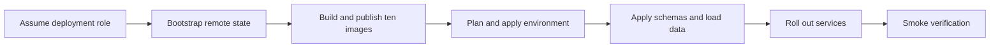

# CardDemo AWS deployment runbook

## Document contract

**Purpose**: Provision one CardDemo environment from the committed Terraform, publish the ten
container images, migrate its database, roll out the services, rotate the confidential Cognito app
client when required, and verify the candidate business flows.

**Source of truth**: The environment roots under `infra/envs/`, the module inputs and outputs under
`infra/modules/`, the service manifests under `services/`, and the AAP deployment and security
requirements. The mainframe assets under `app/**` remain reference-only.

| Parameter | Kind | Description |
|:---|:---|:---|
| `<env>` | enum | `dev` or `prod`; selects the corresponding environment root. |
| `<aws-region>` | AWS region | Region configured by the environment root and the short-lived deployment identity. |
| `<deploy-role-arn>` | IAM role reference | Federated deployment role; never commit its resolved value. |
| `<account-registry>` | ECR registry hostname | Resolved at run time from the target account, never written into this document. |
| `<commit-sha>` | immutable image tag | Source revision used for all ten images in one release. |
| `<planfile>` | local file path | Saved Terraform plan reviewed before apply; never commit it. |
| `<next-rotation-revision>` | positive integer | Monotonic Cognito app-client-secret rotation trigger. |
| `<regional-alb-certificate-arn>` | ACM certificate ARN | REGIONAL certificate presented by the internal ALB HTTPS listener, covering `<internal-service-name>`. Required; no default exists. |
| `<internal-service-name>` | bare DNS hostname | The name that certificate covers and that the API Gateway private integration verifies. Required; no default exists. |
| `<us-east-1-spa-certificate-arn>` | ACM certificate ARN | Certificate for the SPA distribution, which CloudFront reads only from `us-east-1`. Required; no default exists. |

**Expected outcome / success signal**: Terraform exits zero after applying the reviewed saved plan;
all long-running ECS services reach a stable state; health checks report `UP`; Flyway reports no
pending migration; and every smoke flow below returns its expected success or documented business
reject.

**Failure modes and handling**: Stop before apply when the plan contains an unexplained destroy,
when the remote-state backend is absent, when image digests do not match the intended commit, or
when a credential would be written to a tracked file. Do not edit an applied Flyway migration.
Use the failure table below and [teardown.md](teardown.md) for lock recovery and protected teardown.

---

## Scope and deployment boundary

This runbook provides operator commands; it is not evidence that a live AWS environment has been
provisioned. A real `terraform apply` and the cost it incurs remain operator actions. The migration
adds an AWS path and leaves the existing z/OS and AWS Mainframe Modernization paths intact.

---

## Prerequisites

- Terraform 1.15.8.
- AWS provider 6.x locked by each environment root and the random provider 3.9.x.
- AWS CLI with the Cognito `add-user-pool-client-secret`,
  `list-user-pool-client-secrets`, and `delete-user-pool-client-secret` operations.
- Maven 3.9.16 on Java 21, Node.js compatible with `ui/package.json`, Python 3.13, Docker, and `jq`.
- A clean checkout and a short-lived federated AWS session. Do not create access keys for this
  procedure.

```bash
# WHAT: verifies that the deployment tools resolve before any state or registry operation.
# WHY : Assumptions: a missing or wrong-major tool is discovered before an apply can partially
#       change shared infrastructure.
terraform version
aws --version
mvn --version
node --version
python --version
docker version
```

---

## Deployment path



---

## Step 0 - Obtain short-lived credentials

Use the organization's federated or SSO process to assume `<deploy-role-arn>`, then export only the
temporary values it returns.

```bash
# WHAT: confirms the current shell is using the intended short-lived deployment identity.
# WHY : Assumptions: every later command inherits this identity; checking it once prevents a plan
#       from being created against a different account or role than the reviewer expects.
aws sts get-caller-identity --query Arn --output text
```

Do not paste the returned account identifier or credentials into a file, issue, or review comment.

---

## Step 1 - Bootstrap the remote-state backend

Run this once per AWS account before either environment root performs a backend-enabled `init`.

```bash
# WHAT: initialises the bootstrap root without a remote backend.
# WHY : Assumptions: the S3 state bucket and DynamoDB lock table do not exist yet, so asking this
#       root to use them would create a circular prerequisite.
terraform -chdir=infra/bootstrap init -backend=false -input=false
```

```bash
# WHAT: creates a reviewable bootstrap plan.
# WHY : Alternatives Considered: applying directly was rejected because the state bucket, lock
#       table and KMS policy are account-wide controls whose exact names and deletion settings must
#       be reviewed before creation.
terraform -chdir=infra/bootstrap plan -out="<planfile>"
```

```bash
# WHAT: applies the exact bootstrap plan that was reviewed.
# WHY : Assumptions: a saved plan keeps the reviewed graph and the applied graph identical; a
#       second implicit plan could incorporate an unreviewed file or provider change.
terraform -chdir=infra/bootstrap apply "<planfile>"
```

The bootstrap root is intentionally outside the normal deployment workflow. Running it from a
workflow that already needs the backend would be circular.

---

## Step 2 - Build and publish the ten images

The eight service images are `auth-service`, `account-service`, `card-service`,
`transaction-service`, `reference-service`, `batch-service`, `authorization-service`, and
`reporting-service`. The other two are `ui` and `data-migration`. `common-lib` is a Maven library,
not an image.

```bash
# WHAT: builds all nine Maven modules and runs the Java validation and test gates.
# WHY : Assumptions: Checkstyle is bound to Maven validate and common-lib is a dependency of the
#       services, so building only one image can miss a shared-kernel failure.
mvn -B -f services/pom.xml clean verify
```

```bash
# WHAT: installs the locked UI dependency graph and produces the production bundle.
# WHY : Alternatives Considered: npm install was rejected because it may resolve versions outside
#       package-lock.json; npm ci refuses lock drift and makes the built bundle reproducible.
npm --prefix ui ci
npm --prefix ui run build
```

```bash
# WHAT: validates and tests the Python migration package before its image is built.
# WHY : Assumptions: the ETL is the boundary that decodes fixed-width and packed data, so syntax
#       success without its codec and loader tests is not sufficient evidence.
./.venv/bin/ruff check data-migration
./.venv/bin/python -m pytest data-migration/tests
```

```bash
# WHAT: authenticates Docker to the target ECR registry without placing the password in argv.
# WHY : Alternatives Considered: passing the password as a command argument was rejected because
#       process listings and shell history retain it; password-stdin confines it to the pipe.
aws ecr get-login-password --region "<aws-region>" | docker login --username AWS --password-stdin "<account-registry>"
```

Build each Dockerfile and tag it with `<commit-sha>`. Never publish only `latest`: a mutable-only tag
prevents an ECS task definition from identifying the exact bytes required for rollback. The ECR
module enables scan-on-push, so inspect each repository's scan result after push.

---

## Step 3 - Provision the environment

Backend-enabled `init` is required for a real apply. The `-backend=false` form used in CI validates
syntax only and must not precede a production apply.

**Export the deployment-specific inputs first.** Each environment root declares several variables
non-nullable with no default, so `plan` cannot run until they are set. They are absent from
`terraform.tfvars` deliberately: an ARN and a hostname belong to a deployment, not to the
repository, and none of them is a secret.

```bash
# WHAT: supplies the inputs no committed variable file can carry.
# WHY : Assumptions: the ALB certificate is REGIONAL and the SPA certificate must be issued in
#       us-east-1, because CloudFront reads a viewer certificate only from that region. Two
#       certificates are needed rather than one for that reason alone, and passing a regional ARN
#       to the distribution -- or a us-east-1 ARN to a load balancer in another region -- fails at
#       apply after other resources have already been created.
# WHY : Assumptions: no listener PRIVATE KEY appears here or anywhere else in this runbook. Each
#       online task mints its own key pair and self-signed certificate at startup
#       (config/docker/generate-listener-material.sh), so the only certificate an operator supplies
#       is the load balancer's own -- the one hop whose peer actually verifies it.
export TF_VAR_alb_certificate_arn="<regional-alb-certificate-arn>"
export TF_VAR_internal_service_domain_name="<internal-service-name>"
export TF_VAR_cloudfront_acm_certificate_arn="<us-east-1-spa-certificate-arn>"
export TF_VAR_cloudfront_aliases='["<spa-hostname>"]'
export TF_VAR_cloudfront_api_connect_src_origins='["https://<api-hostname>"]'
export TF_VAR_image_tag="<commit-sha>"
export TF_VAR_github_repository="<owner>/<repo>"
export TF_VAR_github_oidc_provider_arn="<oidc-provider-arn>"
# WHY : Assumptions: these last two were absent from this block although both are declared with
#       no default, so following it exactly still left `plan` refusing to run. Both name an
#       account-scoped resource this package does not create: the permissions boundary is the
#       organisation's own IAM guardrail, and the mask key is the HMAC material the card and
#       reporting services derive their masking from. Neither is a secret VALUE -- both are ARNs
#       of things that hold one -- which is why they belong here rather than in Secrets Manager
#       lookups, and why they are absent from terraform.tfvars.
export TF_VAR_permissions_boundary_arn="<iam-permissions-boundary-arn>"
export TF_VAR_mask_hmac_secret_arn="<mask-hmac-secret-arn>"
```

**The automated path takes the same ten values from protected GitHub environment variables.**
`.github/workflows/deploy.yml` writes them into an untracked `deployment.auto.tfvars.json` that it
deletes at the end, and `.github/workflows/infra-ci.yml` passes them as `TF_VAR_` for its review
plan. Two of the ten are read from the run context instead of being set by an operator, so an
environment needs the twelve variables below plus the four `CARDDEMO_TF_STATE_*` backend values.

| GitHub environment variable | Terraform variable | Notes |
|---|---|---|
| `CARDDEMO_ALB_CERTIFICATE_ARN` | `alb_certificate_arn` | Regional ACM ARN covering `internal_service_domain_name` |
| `CARDDEMO_INTERNAL_SERVICE_DOMAIN_NAME` | `internal_service_domain_name` | Bare DNS name the ALB certificate covers |
| `CARDDEMO_CLOUDFRONT_ACM_CERTIFICATE_ARN` | `cloudfront_acm_certificate_arn` | Must be issued in **us-east-1** |
| `CARDDEMO_CLOUDFRONT_ALIASES_JSON` | `cloudfront_aliases` | JSON list, e.g. `["app.example.com"]`; must be non-empty |
| `CARDDEMO_GITHUB_OIDC_PROVIDER_ARN` | `github_oidc_provider_arn` | Output of `infra/bootstrap`, created once per account |
| `CARDDEMO_PERMISSIONS_BOUNDARY_ARN` | `permissions_boundary_arn` | Organisation IAM guardrail |
| `CARDDEMO_MASK_HMAC_SECRET_ARN` | `mask_hmac_secret_arn` | ARN of the masking HMAC secret. The secret's **value** is the operator's to create and must be canonical standard base64 of at least 32 random bytes -- see the note below |
| `CARDDEMO_IMAGE_DIGESTS_JSON` | `image_digests` | Has a default; supplied so a review plan reflects the deployed images |
| `CARDDEMO_AWS_REGION` | *(not a variable)* | Region for the ECR login and image push |
| `CARDDEMO_DEPLOY_ROLE_ARN` | *(not a variable)* | Role the workflow assumes by OIDC |
| *(run context `github.sha`)* | `image_tag` | Not operator-set, so it cannot disagree with the commit being deployed |
| *(run context `github.repository`)* | `github_repository` | Not operator-set, so the publication role cannot be granted to another repository |

`cloudfront_api_connect_src_origins` is the tenth required variable and is deliberately **not** an
environment variable. The API endpoint does not exist until the apply creates it, so `deploy.yml`
supplies an empty list -- which yields `connect-src 'self'` and permits nothing -- and narrows it to
the real origin after the apply, before the SPA is published.

### The masking secret's value has a format the ETL enforces

`mask_hmac_secret_arn` names a secret this configuration neither creates nor rotates, so its
**value** is created out of band. That value is the HMAC key the extract-transform-load image
derives every redaction tag with, and the image now **refuses to run** rather than accept weak
material: it requires canonical standard base64 decoding to at least 32 bytes -- the HMAC-SHA-256
output size -- and refuses a passphrase, the URL-safe alphabet, a non-canonical spelling, anything
shorter, and material that is a single repeated byte. Create the value with:

```bash
aws secretsmanager create-secret \
  --name "carddemo/<env>/mask-hmac" \
  --secret-string "$(python3 -c 'import base64,secrets; print(base64.b64encode(secrets.token_bytes(32)).decode())')"
```

WHY : Assumptions: the refusal is stated here rather than only in the ETL's own README because the
failure surfaces during a batch run, long after the apply that wired the ARN succeeded -- an apply
cannot validate a secret's contents, and the operator who creates the secret is the one who needs
the rule. WHY : Trade-offs: rotating the value re-derives every tag, so a verification pass that
compares a rendering produced before rotation against one produced after reports differences that
are not differences in the data; rotate between load campaigns, not during one.
`data-migration/README.md` §5.7.1 carries the full rule set.

WHY : Refactoring Rationale: this table exists because none of these names was documented anywhere,
while the workflows required them. Worse, the workflows had been written against an OLDER variable
vocabulary and were supplying six names -- `route53_zone_id`, `spa_domain_name`,
`alb_tls_server_name`, `service_tls_domain_name`, `batch_glue_function_arns` and `release_version`
-- that neither root declares, while supplying nothing for seven that both roots require. Terraform
discards an undeclared variable silently, so the wiring looked complete and set almost nothing. This
runbook's manual block above already used the correct vocabulary, which is what the workflows were
brought into line with; `infra-ci.yml` now carries a closure check that compares the workflows, this
runbook and `variables.tf` against each other so the three cannot drift apart again.

```bash
# WHAT: initialises the selected environment against the bootstrapped remote state.
# WHY : Assumptions: the S3 backend and lock table from Step 1 must already exist; otherwise this
#       command fails before a plan can be written.
terraform -chdir="infra/envs/<env>" init -input=false -lockfile=readonly
```

```bash
# WHAT: writes the proposed environment change to a saved plan.
# WHY : Trade-offs: a saved plan adds one local artifact and becomes stale if configuration changes,
#       but it guarantees that the reviewed change is the one apply executes. Re-plan after any
#       source, variable, state, or provider change.
terraform -chdir="infra/envs/<env>" plan -out="<planfile>"
```

Review every create, update, replacement, and destroy. The baseline CICS deployment deck required
manual delete edits and contains duplicate or stale definitions; the saved Terraform plan is the
cloud control that makes comparable drift visible before execution.

```bash
# WHAT: applies the reviewed environment plan without re-planning or auto-approving.
# WHY : Refactoring Rationale: declarative apply converges the resource graph without editing a
#       deployment deck between runs, while the saved-plan boundary prevents an unreviewed graph
#       from replacing the reviewed one.
terraform -chdir="infra/envs/<env>" apply "<planfile>"
```

---

## Step 4 - Apply database schemas and migrate data

`data-migration/sql/V0__schemas_and_roles.sql` creates the eight service schemas and the **three
tiers of role** behind them: eight `NOLOGIN` `carddemo_<context>_owner` roles that own each schema
and everything a migration creates in it, seven `carddemo_<context>_migrator` logins that are
members of those owners `WITH INHERIT FALSE`, and eight runtime logins holding `USAGE` plus
`SELECT`, `INSERT` and `UPDATE` with `CREATE` explicitly revoked. `DELETE` is **not** among the
schema-wide grants and is not withheld by oversight: three published operations do delete rows, and
each is granted one table at a time by `data-migration/sql/V2__runtime_delete_grants.sql`, applied
after the Flyway step below. Owning services then apply their
Flyway migrations **under the migration credential**, injected as `SPRING_FLYWAY_USER` and
`SPRING_FLYWAY_PASSWORD` from that context's `<role>_migrator` secret; each service's
`spring.flyway.init-sqls` issues `SET ROLE carddemo_<context>_owner` first, which is what makes the
resulting tables belong to the `NOLOGIN` owner rather than to any credential a task holds.
`reporting-service` owns no source tables, ships no migration and therefore has no migration role;
it reads only the masked security-barrier views granted to its read-only role.

> A service that receives the runtime credential but not the migration credential fails at startup
> on an unresolved `SPRING_FLYWAY_USER` placeholder — deliberately, because the alternative is
> migrating as the runtime role, which the bootstrap SQL leaves without `CREATE`. Both environment
> roots project the pair for all seven migrating workloads, and `infra/modules/ecs-service`
> requires it of each of them, so an omission fails at plan time.

The batch role's cross-schema grants are deliberately limited to the account and ledger objects
needed to preserve the posting unit of work as one database transaction. Do not replace those grants
with schema-wide privileges.

Once every owning service has completed its Flyway migration, apply the table-specific delete
grants. This file is separate from `V0` for a structural reason rather than a stylistic one: `V0`
runs before a single table exists, so the only privilege forms available to it are
`GRANT ... ON ALL TABLES IN SCHEMA` and `ALTER DEFAULT PRIVILEGES`, and neither can name one table.
Three tables need `DELETE` and the other twenty-plus in the same two schemas must not have it, so the
grant has to be expressed where the tables are already there to be named.

```bash
# WHAT: grant DELETE on exactly the three tables whose published operations remove rows --
#       reference.transaction_types, reference.transaction_categories and
#       "authorization".auth_reply_outbox -- then prove no other table acquired it.
# WHY : Trade-offs: withholding these three grants does not make the system safer, it makes two
#       shipped capabilities fail at runtime -- the reference-service delete routes, and
#       OutboxPublisher.purgePublished()'s hourly retention sweep over a table whose every row
#       carries a PAN. The narrower risk of naming three tables is preferred to the broader risk of
#       an unbounded table of card-bearing rows.
psql -v ON_ERROR_STOP=1 -f data-migration/sql/V2__runtime_delete_grants.sql
psql -v ON_ERROR_STOP=1 -f data-migration/sql/verify/runtime_delete_grants.sql
```

> The `ON DELETE RESTRICT` constraint on `reference.transaction_categories` is unaffected by the
> grant and is what still refuses a delete of a referenced transaction type — the privilege decides
> whether the role may *attempt* the delete, the constraint decides whether a *row* may go, and
> `reference-service` turns the resulting foreign-key violation into its contracted `409`. Verified
> against PostgreSQL 17.10: with the grant in place the attempt returns SQLSTATE `23503`, not
> `42501`, so the two outcomes stay distinguishable to the service.

Follow [data-migration.md](data-migration.md) for copybook decoding, staged data, row-count checks,
checksums, and money-total parity.

---

## Step 5 - Seed reference data

Apply `reference-service`'s versioned seed migration. Verify that the `DEFAULT` disclosure-group row
exists: the interest job falls back to it when a specific group lookup misses, and without that row
the fallback cannot produce the required rate. Also verify the transaction-category foreign key is
`ON DELETE RESTRICT`; the service translates that constraint into a conflict response rather than
exposing a database error.

---

## Step 6 - Roll out services and verify health

The deployment model is rolling ECS service replacement. Blue-green and canary deployment are out
of scope.

```bash
# WHAT: waits for one service to reach a stable desired-task state after its task definition changes.
# WHY : Assumptions: Terraform finishing proves the control plane accepted the update; this wait
#       proves replacement tasks passed container and load-balancer health checks.
aws ecs wait services-stable --region "<aws-region>" --cluster "<cluster-name>" --services "<service-name>"
```

If stability fails, inspect the service's CloudWatch log group, the task's stopped reason, the image
digest, and the Parameter Store and Secrets Manager references before retrying.

### Rotate the Cognito app-client secret

The Cognito module uses a custom API bridge because AWS provider 6.57.1 does not model multiple app
client secrets. It adds a new active secret to the existing client, updates the KMS-encrypted
Secrets Manager value, and leaves the previously current secret active during rollout. The next
rotation removes that predecessor before adding another, so the client never has more than two
active secrets.

Increment `app_client_secret_rotation_revision` in the selected environment's non-secret
configuration and review the resulting replacement of only
`terraform_data.app_client_secret_rotation`.

```bash
# WHAT: plans one explicit app-client-secret rotation without changing the Cognito client id.
# WHY : Assumptions: the monotonic revision is a non-secret operator trigger; changing it is the
#       reviewable event that invokes AddUserPoolClientSecret during apply.
terraform -chdir="infra/envs/<env>" plan -var="cognito_app_client_secret_rotation_revision=<next-rotation-revision>" -out="<planfile>"
```

```bash
# WHAT: applies the reviewed rotation and updates the Secrets Manager current version.
# WHY : Trade-offs: the previously current secret remains active until the next rotation so running
#       auth-service tasks keep authenticating while replacement tasks load the new value.
terraform -chdir="infra/envs/<env>" apply "<planfile>"
```

```bash
# WHAT: restarts auth-service so every task resolves the new current secret.
# WHY : Assumptions: the service reads the secret during startup; without a rollout, long-running
#       tasks continue using the still-valid predecessor and the rotation is not fully adopted.
aws ecs update-service --region "<aws-region>" --cluster "<cluster-name>" --service "<auth-service-name>" --force-new-deployment
```

```bash
# WHAT: lists only app-client secret identifiers and creation dates after rotation.
# WHY : Assumptions: querying no ClientSecretValue proves the two-secret overlap without copying a
#       credential into terminal output or an operator log.
aws cognito-idp list-user-pool-client-secrets --region "<aws-region>" --user-pool-id "<user-pool-id>" --client-id "<app-client-id>" --query "ClientSecrets[].{id:ClientSecretId,created:ClientSecretCreateDate}"
```

The deployment role needs only the scoped Cognito add/list/delete client-secret actions and
Secrets Manager get/put permissions for the app-client secret, plus KMS use through Secrets Manager.
Do not grant wildcard secret access.

### Rotate a service database credential (operator-managed)

**No rotation schedule ships.** `infra/modules/secrets` creates one Secrets Manager entry per
service database role and generates each initial value at apply time, but it implements no rotation
function, and neither environment root supplies one through `rotation_lambda_arn` — so
`aws_secretsmanager_secret_rotation` is created with zero instances and **a stored database
credential is static until an operator replaces it**. The only rotation this package provisions
automatically is KMS *key* rotation, in `infra/modules/kms`.

Replacement itself is delivered and scripted, so no operator ever types a credential: the value is
changed inside Secrets Manager, and `carddemo_migration.credentials` reads it back, derives the
role's SCRAM-SHA-256 verifier **locally**, issues the `ALTER ROLE` that stores the verifier, and
then logs in as every role to prove the stored verifier matches what each service will read. What is
operator-managed is the *decision to run it* and the interval between runs.

Rotate one role at a time, and complete the whole sequence for that role before starting another.

```bash
# WHAT: replaces the stored value for one role's credential with a freshly generated one.
# WHY : Assumptions: --generate-random-password has Secrets Manager produce the value so it never
#       exists in argv, in shell history or in a file; --output text with a null query keeps the
#       new version identifier out of the transcript as well. The role name IS the secret name,
#       matching V0__schemas_and_roles.sql character for character.
aws secretsmanager put-secret-value --region "<aws-region>" --secret-id "<role-name>" \
  --secret-string "$(aws secretsmanager get-random-password --region "<aws-region>" \
  --exclude-punctuation --password-length 32 --query RandomPassword --output text \
  | python3 -c 'import json,sys; print(json.dumps({"engine":"aurora-postgresql","username":"<role-name>","password":sys.stdin.read().strip(),"masteruser":"<master-username>"}))')" \
  --query "null" --output text
```

```bash
# WHAT: applies the replaced value to the PostgreSQL role and verifies every role can still log in.
# WHY : Trade-offs: the applicator deliberately takes no --role option, so it re-applies EVERY
#       role's current stored value rather than only the one just replaced. That is the safer
#       shape: a per-role invocation is what leaves a deployment half applied, and re-applying an
#       unchanged value is a no-op that additionally re-proves the other roles still authenticate.
CARDDEMO_ENVIRONMENT="<env>" \
CARDDEMO_PARAMETER_PREFIX="<parameter-prefix>" \
CARDDEMO_DB_MASTER_SECRET="<master-secret-arn>" \
CARDDEMO_DB_SSL_MODE="verify-full" \
CARDDEMO_DB_SSL_ROOT_CERT="<trust-anchor-path>" \
python -m carddemo_migration.credentials
```

```bash
# WHAT: restarts the one service that authenticates with the replaced role.
# WHY : Assumptions: a task resolves its credential from Secrets Manager at startup, so a running
#       task keeps using the value it already holds -- which the database no longer accepts once
#       the ALTER ROLE above has been applied. Rolling the service is what completes the rotation,
#       and it is why the sequence is performed one role at a time.
aws ecs update-service --region "<aws-region>" --cluster "<cluster-name>" --service "<service-name>" --force-new-deployment
```

Exit codes follow the return-code rubric in `tests/README.md` section 8: **0** applied and verified,
**2** usage, **8** a role could not be applied or verified, **16** the environment could not be
reached. A non-zero code means the credential in Secrets Manager and the verifier in PostgreSQL may
disagree for that role — re-run the applicator, which is idempotent, before rolling any service.

The identity running the applicator needs `secretsmanager:GetSecretValue` on the per-role entries
and the master secret, `kms:Decrypt` through Secrets Manager on the secrets CMK, and the ability to
connect to the cluster as the master role. It needs no write access to any secret. Do not grant
wildcard secret access, and do not grant the applicator identity to a service task role — a task
reads exactly one entry, its own.

**If a schedule is wanted.** Supply a rotation function's ARN and an interval to
`infra/modules/secrets` through `rotation_lambda_arn` and `rotation_automatically_after_days`, and
name that function in `infra/modules/observability`'s `rotation_lambda_function_names` so its
invocation errors alarm. Both inputs are a pass-through hook and default to null; nothing in this
package provides the function. Note the constraint recorded in `V0__schemas_and_roles.sql`: the
rotation functions AWS publishes for PostgreSQL authenticate with the credential they are replacing,
so they cannot perform a first application against a freshly created role, and a function used here
must escalate through the master identity instead.

### Replace the internal-identity signing key (operator-managed, and NOT a rolling change)

The selected environment root — not `infra/modules/secrets`, which composes database credentials
only — creates one further entry, `<name-prefix>/<env>/internal-identity/signing-key`, with
`<name-prefix>` being that root's `name_prefix` variable. It holds the symmetric key of the
machine-to-machine bearer token the pending-authorization consumer presents to the account context
on the three internal lookups described in
[security-and-identity.md](../architecture/security-and-identity.md): `authorization-service` signs
with it and `account-service` verifies against it. It stores a **bare string** rather than a JSON
document, it is written through the write-only argument so the value never reaches state, and it is
injected as `CARDDEMO_INTERNAL_IDENTITY_SIGNING_KEY` into exactly **two** task definitions —
`account` and `authorization`. No rotation function ships for it, so it is static until an operator
replaces it; the resource carries a recorded `checkov` suppression stating that reason rather than
leaving the omission unexplained.

> **This replacement has a refusal window, and the window is unavoidable with one stored value.**
> Each consuming task reads the value once at startup, and the verifier is built with exactly
> **one** key — `NimbusJwtDecoder.withSecretKey` takes a single key and holds no predecessor the way
> the Cognito app-client rotation above does. So from
> the moment the first of the two tasks is rolled until the second finishes, the minter and the
> verifier hold different keys and **every internal account-context lookup is refused 401**. The
> practical consequence is that pending-authorization decisions stop for the duration; queue
> messages are not lost, because a refused decision leaves the message to be redelivered and the
> request queue's dead-letter threshold is five receives, so a window shorter than five
> redeliveries drains rather than discards.
>
> Trade-offs: the alternative — teaching the verifier to accept a current and a previous key, as
> the app-client rotation does — was not built, because it doubles the number of keys that can
> mint an accepted token for the entire interval between replacements, and the seam has exactly
> one caller whose interruption is recoverable by redelivery. Perform this inside the batch
> quiesce bracket, or during a period with no authorization traffic, rather than adding a second
> simultaneously-valid key.

Advance `secret_string_wo_version` in a reviewed diff if the value should be regenerated by
Terraform. To replace it without an apply, do all three steps as one sequence and do not stop
between them:

```bash
# WHAT: replaces the stored key with freshly generated bytes.
# WHY : Assumptions: --exclude-punctuation matches the generator the module uses (special = false),
#       and the 32-character floor matches the 32-BYTE minimum both consuming services enforce at
#       startup -- a shorter value makes both fail to start rather than fail to authenticate.
#       --query null keeps the new version identifier out of the transcript.
aws secretsmanager put-secret-value --region "<aws-region>" \
  --secret-id "<name-prefix>/<env>/internal-identity/signing-key" \
  --secret-string "$(aws secretsmanager get-random-password --region "<aws-region>" \
  --exclude-punctuation --password-length 32 --query RandomPassword --output text)" \
  --query "null" --output text
```

```bash
# WHAT: rolls BOTH consuming services, together rather than one after the other.
# WHY : Trade-offs: issued as two calls in immediate succession because ECS has no primitive for
#       replacing two services atomically. Ordering does not remove the window -- rolling the
#       minter first produces new credentials the old verifier refuses, and rolling the verifier
#       first produces a verifier that refuses the old credentials -- so the objective is to
#       SHORTEN the window, not to sequence it away.
aws ecs update-service --region "<aws-region>" --cluster "<cluster-name>" --service "<authorization-service-name>" --force-new-deployment
aws ecs update-service --region "<aws-region>" --cluster "<cluster-name>" --service "<account-service-name>" --force-new-deployment
```

```bash
# WHAT: confirms both deployments reached a steady state before the window is declared closed.
# WHY : Assumptions: PRIMARY reaching COMPLETED on both is the observable end of the mismatch;
#       treating the update-service calls above as the end would declare success while the old
#       tasks are still draining and still refusing.
aws ecs describe-services --region "<aws-region>" --cluster "<cluster-name>" \
  --services "<authorization-service-name>" "<account-service-name>" \
  --query "services[].deployments[?status=='PRIMARY'].[serviceName:@.id,rolloutState]" --output table
```

The identity performing this needs `secretsmanager:PutSecretValue` on that one entry,
`kms:GenerateDataKey` and `kms:Decrypt` through Secrets Manager on the secrets CMK, and
`ecs:UpdateService` and `ecs:DescribeServices` on the two services. It needs no access to any
database credential entry, and no task role should ever be granted it — a task reads this entry
and never writes it.

---

## Step 7 - Smoke-verify candidate business flows

Retrieve a generated seed credential only through Secrets Manager and never paste it into this
document or a shared log.

| Flow | Verification |
|:---|:---|
| Sign-on | Authenticate through `POST /auth/signon`; complete `POST /auth/challenge` when the temporary credential requires a change. |
| Account view/update | Read one account, update an allowed field, and verify a stale version returns conflict. |
| Card list/update | List cards narrowed by account, then resolve one card through `POST /api/v1/cards/lookup` and address detail/update by the opaque `cardKey` that lookup and every list row return. No primary account number appears in a request line or a query string on any card route, so none can reach an access log, a referrer header or a browser history; the administrative full-number read sits on its own `/api/v1/admin/cards/{cardKey}` path and returns the number in the response body only. |
| Transaction add/list | Add a fixed-point amount and verify the list returns the same decimal string. |
| Bill pay | Submit one payment and verify the account and ledger effects commit together. |
| Posting batch | Start the Step Functions execution and verify posted, rejected, and return-code outcomes. |
| Pending authorization | Publish a request and verify ordered request/reply and fraud-mark behavior. |
| Account inquiry | Publish a request and verify the correlated standard-queue reply. |
| Transaction-type reference | Read and update reference data; verify referenced types cannot be deleted. |

Use [batch-operations.md](batch-operations.md) for batch execution and parity-oracle detail.

---

## Environment parameterisation

| Concern | dev | prod |
|:---|:---|:---|
| Aurora capacity | May scale to zero with auto-pause configured. | Minimum remains above zero. |
| ECS sizing | Smaller task size and desired count. | Production task size and redundant desired count. |
| Log retention | Shorter. | Longer. |
| CloudFront price class | Restricted. | Full configured class. |
| Protection | Destructive iteration permitted. | Deletion protection and final snapshot required. |

**Trade-offs**: Keeping topology identical means a dev validation exercises the same network and
service graph as prod. It does not prove prod capacity behavior, and scale-to-zero resume behavior
is a dev-only characteristic.

---

## Idempotency

**Refactoring Rationale**: Baseline jobs used several separate rerun devices: condition-code
normalization, delete-if-exists preambles, and manual uncommented deletes, while some definitions
had no rerun guard. Terraform plan/apply provides one convergence model for all resources; rerunning
the same configuration produces no duplicate definition and requires no source edit.

---

## No secrets by construction

Database credentials, seed-user temporary passwords, and rotated Cognito app-client secrets are
generated or returned during apply and written to Secrets Manager. Tracked `terraform.tfvars` files
contain non-secret sizing and retention only. `ui/.env.example` documents names without values, and
state and local environment files are excluded from commits.

**Refactoring Rationale**: The baseline published seed credentials with its deployment material.
Generate-at-apply plus managed retrieval makes the no-committed-secret constraint structural rather
than dependent on a reviewer noticing a credential-shaped string.

---

## Concurrency and the state lock

Allow one apply per environment. The DynamoDB state lock is the cloud analogue of exclusive
read-write access to the shared CICS definition store. Queue another deployment instead of
canceling an active apply: interruption can leave both partial resources and an abandoned lock.
See [teardown.md](teardown.md) for the reviewed force-unlock procedure.

---

## Failure handling

| Failure | Operator response |
|:---|:---|
| Environment `init` reports a missing backend | Stop and complete Step 1; do not switch to local state. |
| Plan shows unexplained destroys or replacements | Stop, inspect state and configuration, and produce a new plan after correction. |
| Apply is interrupted | Inspect the environment and lock; follow `teardown.md` before force-unlocking. |
| Service fails health checks | Inspect stopped reason, logs, image digest, and runtime parameter/secret references. |
| Flyway checksum mismatch | Do not edit an applied migration; add a new versioned migration. |
| Cognito rotation sees an unexpected secret count | Stop; reconcile active secret identifiers and the current managed secret before retrying. |
| Prod destroy is blocked | Treat the protection as intentional and follow the explicit teardown procedure. |

---

## Out of scope

An operator will not find multi-region disaster recovery, blue-green or canary deployment, Kafka,
Kinesis, Redis, ElastiCache, read replicas, the Db2 rewards roadmap item, IMS DC, SFTP integration,
or exposed distributed transactions in this package. They are outside this migration's scope.

---

## Mainframe path remains available

`app/**`, `samples/**`, `scripts/**`, and `tests/**` remain reference-only and operable. This AWS
deployment adds a path; it does not remove or rewrite the existing one. The untouched path is also
why rollback does not require an un-migration of the baseline.

---

## Related documents

- [Teardown](teardown.md)
- [Data migration](data-migration.md)
- [Batch operations](batch-operations.md)
- [Security and identity](../architecture/security-and-identity.md)
- [Code documentation standard](../CODE_DOCUMENTATION_STANDARD.md)
- [Migration guide](../../MIGRATION_README.md)
- [Repository overview](../../README.md)
