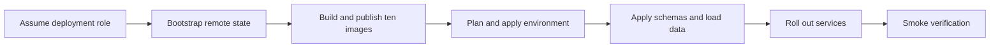

# CardDemo AWS deployment runbook

## Document contract

**Purpose**: Provision one CardDemo environment from the committed Terraform, publish the ten
container images, migrate its database, roll out the services, rotate the confidential Cognito app
client when required, and verify the candidate business flows.

**Source of truth**: The environment roots under `infra/envs/`, the module inputs and outputs under
`infra/modules/`, the service manifests under `services/`, and the AAP deployment and security
requirements. The mainframe assets under `app/**` remain reference-only.

| Parameter | Kind | Description |
|:---|:---|:---|
| `<env>` | enum | `dev` or `prod`; selects the corresponding environment root. |
| `<aws-region>` | AWS region | Region configured by the environment root and the short-lived deployment identity. |
| `<deploy-role-arn>` | IAM role reference | Federated deployment role; never commit its resolved value. |
| `<account-registry>` | ECR registry hostname | Resolved at run time from the target account, never written into this document. |
| `<commit-sha>` | immutable image tag | Source revision used for all ten images in one release. |
| `<planfile>` | local file path | Saved Terraform plan reviewed before apply; never commit it. |
| `<next-rotation-revision>` | positive integer | Monotonic Cognito app-client-secret rotation trigger. |
| `<regional-alb-certificate-arn>` | ACM certificate ARN | REGIONAL certificate presented by the internal ALB HTTPS listener, covering `<internal-service-name>`. Required; no default exists. |
| `<internal-service-name>` | bare DNS hostname | The name that certificate covers and that the API Gateway private integration verifies. Required; no default exists. |
| `<us-east-1-spa-certificate-arn>` | ACM certificate ARN | Certificate for the SPA distribution, which CloudFront reads only from `us-east-1`. Required; no default exists. |
| `<spa-hostname>` | bare DNS hostname | Alias the SPA distribution answers on; must be covered by the certificate above. |
| `<api-hostname>` | bare DNS hostname | Host of the deployed API, used to narrow the SPA's permitted request origin after the apply. |
| `<oidc-provider-arn>` | IAM provider ARN | The account's GitHub OIDC provider, published by `infra/bootstrap`. |
| `<iam-permissions-boundary-arn>` | IAM policy ARN | The organisation's own IAM guardrail. This package does not create it. |
| `<owner>`/`<repo>` | repository slug | Owner and name of the repository the publication role is granted to. |
| `<oncall-address>` | email address | Alarm recipient. At least one is required in both environments. |
| `<mask-hmac-secret-arn>` | Secrets Manager ARN | Entry holding the masking HMAC key. Its ARN is an input; its value is created out of band. |
| `<mask-hmac-cmk-arn>` | KMS key ARN | Customer-managed key encrypting the masking secret. Must share the secret's account and Region. |
| `<name-prefix>` | name prefix | The selected root's `name_prefix` variable, which prefixes the Secrets Manager entry names below. |
| `<cluster-name>` | ECS cluster name | Read from the environment's Terraform output at the point of use. |
| `<service-name>` | ECS service name | The service being rolled. Substitute each consumer in turn where a step names several. |
| `<auth-service-name>`, `<account-service-name>`, `<minting-service-name>` | ECS service names | The specific services a rotation step must roll; named separately because rolling the wrong one widens an outage. |
| `<user-pool-id>`, `<app-client-id>` | Cognito identifiers | Read from the environment's Terraform output; neither is a secret. |
| `<app-client-secret-arn>` | Secrets Manager ARN | Entry holding the Cognito app-client secret payload. Never print its value. |
| `<seed-user-secret-name>` | Secrets Manager name | Entry holding one seed user's generated initial password. Resolve it from the `credential_secret_name_prefix` output; do not paste a resolved name back into this file. |
| `<secret-name>` | Secrets Manager name fragment | The single key being replaced in a rotation step, substituted into the entry name. |
| `<role-name>` | database role name | The PostgreSQL role whose credential is being replaced. The role name is also its secret name. |
| `<master-username>`, `<master-secret-arn>` | database master identity | The cluster master role and the Secrets Manager entry holding its credential. |
| `<parameter-prefix>` | Parameter Store prefix | Prefix beneath which the environment's runtime configuration is published. |
| `<trust-anchor-path>` | local file path | Certificate bundle used to verify the database server, because every service pins `sslmode=verify-full`. |
| `<planfile>` | local file path | Saved plan; listed once above and reused by every `plan`/`apply` pair. |

Three further tokens are **naming patterns rather than operator inputs**, and are shown as
placeholders only so the shape of a generated name is visible: `<context>` in
`carddemo_<context>_owner` and `carddemo_<context>_migrator`, `<role>` in `<role>_migrator`, and
`<module>` in `python -m carddemo_migration.<module>`. Do not attempt to supply a value for these --
substitute the bounded context or module you are acting on.

**Expected outcome / success signal**: Terraform exits zero after applying the reviewed saved plan;
all long-running ECS services reach a stable state; health checks report `UP`; Flyway reports no
pending migration; and every smoke flow below returns its expected success or documented business
reject.

**Failure modes and handling**: Stop before apply when the plan contains an unexplained destroy,
when the remote-state backend is absent, when image digests do not match the intended commit, or
when a credential would be written to a tracked file. Do not edit an applied Flyway migration.
Use the failure table below and [teardown.md](teardown.md) for lock recovery and protected teardown.

---

## Scope and deployment boundary

This runbook provides operator commands; it is not evidence that a live AWS environment has been
provisioned. A real `terraform apply` and the cost it incurs remain operator actions. The migration
adds an AWS path and leaves the existing z/OS and AWS Mainframe Modernization paths intact.

Assumptions: the infrastructure in this repository is **authored and statically validated only**.
`terraform fmt -check`, a credential-free `init -backend=false`, `validate`, `tflint` and the policy
and generated-document checks run as build gates in
[`infra-ci.yml`](../../.github/workflows/infra-ci.yml); none of them contacts an AWS account. Static
success is therefore evidence about the configuration and **not** evidence that any environment
exists, that any resource has been created, or that any capacity, latency or throughput figure has
been measured. No load test and no benchmark has been run. Read every command below as the procedure
an operator would follow, not as a record of one already performed.

There are exactly three Terraform roots, and every command in this runbook addresses one of them:

| Root | Applied | Holds |
|:---|:---|:---|
| `infra/bootstrap` | Once per AWS account, out of band | The remote-state backend: a versioned, encrypted S3 bucket and a DynamoDB lock table |
| `infra/envs/dev` | Per change to the development environment | The development environment root, sized down independently of production |
| `infra/envs/prod` | Per change to the production environment | The production environment root |

Each root composes the same sixteen reusable modules under `infra/modules/`: `network`, `kms`,
`secrets`, `ecr`, `aurora-postgresql`, `ecs-cluster`, `ecs-service`, `alb`, `api-gateway-http`,
`cognito`, `sqs`, `step-functions-batch`, `eventbridge-scheduler`, `s3-datasets`, `cloudfront-spa`
and `observability`. Because both environment roots call the same modules, the topology they
provision is identical and only the sizing and retention inputs differ.

---

## Prerequisites

- **Terraform 1.15.8.** Every root declares `required_version = ">= 1.15.0"`; 1.15.8 is the version
  this configuration is validated on.
- **Providers**: `hashicorp/aws` constrained `~> 6.56` and `hashicorp/random` constrained `~> 3.9` --
  the only two providers any root declares, matching AAP §0.6.1.4. The tracked
  `.terraform.lock.hcl` in each root resolves those constraints to **aws 6.57.1** and
  **random 3.9.0**. Verify the lock file; never rewrite it as a way of moving a version.
- **AWS CLI** with the Cognito `add-user-pool-client-secret`,
  `list-user-pool-client-secrets`, and `delete-user-pool-client-secret` operations.
- **Maven 3.9.16 on Java 21**, Node.js compatible with `ui/package.json`, Python 3.13, Docker, and `jq`.
- A clean checkout and a short-lived federated AWS session. Do not create access keys for this
  procedure.

The image builds pin these base images. They are listed because a wrong tag here fails a build
outright rather than degrading a deployment, and one of them is easy to get wrong in a way the
Dockerfile itself gives no hint of:

| Stage | Pinned base image |
|:---|:---|
| Java build | `maven:3.9.16-amazoncorretto-21-al2023` |
| Java runtime (eight services) | `public.ecr.aws/amazoncorretto/amazoncorretto:21.0.12-al2023-headless` |
| UI build | `node:22.23.1-alpine` |
| UI runtime | `nginx:1.30.4-alpine` |
| ETL | `python:3.13.14-slim-trixie` |

Assumptions: the Corretto publisher ships **no Alpine variant** of the Java runtime image -- that
repository publishes only `-al2` and `-al2023` tags, and 21.0.12 is the highest 21.x -- so an
intuitive `21-alpine` tag is not a smaller alternative. It resolves to nothing and fails every
service image build. Trade-offs: `nginx` is held on the **stable** branch rather than mainline 1.31.x
because a static asset server needs no mainline feature and stable receives a longer patch window.

```bash
# WHAT: verifies that the deployment tools resolve before any state or registry operation.
# WHY : Assumptions: a missing or wrong-major tool is discovered before an apply can partially
#       change shared infrastructure.
terraform version
aws --version
mvn --version
node --version
python --version
docker version
```

Static validation is a separate path from the deploy path below, and confusing the two wastes an
apply. The credential-free form initialises without a backend and can therefore only check syntax:

```bash
# WHAT: checks formatting and validates each root without contacting AWS.
# WHY : Assumptions: -backend=false initialises WITHOUT the remote state, so this form needs no
#       credentials -- and for the same reason it cannot plan or apply. An operator who runs this
#       and then tries to apply is working against an uninitialised backend. Use the
#       backend-enabled init in Step 3 for a real deployment.
terraform fmt -check -recursive infra/
terraform -chdir=infra/envs/dev init -backend=false -lockfile=readonly
terraform -chdir=infra/envs/dev validate
```

These same checks, plus `tflint --config infra/.tflint.hcl`, a policy scan and a `terraform-docs`
drift check, are owned by [`infra-ci.yml`](../../.github/workflows/infra-ci.yml) and run on every
pull request. They are repeated here only so an operator can reproduce a CI failure locally.

**Note**: if you install Terraform through the `hashicorp/setup-terraform` action rather than
directly, set `terraform_wrapper: false`. Assumptions: that action installs a wrapper which rewrites
exit codes, and `terraform plan -detailed-exitcode` is three-valued -- 0 no changes, 1 error, 2
changes present. Under the wrapper a "changes present" result can be read as success, which silently
defeats any check built on that exit code.

---

## Deployment path



---

## Step 0 - Obtain short-lived credentials

Use the organization's federated or SSO process to assume `<deploy-role-arn>`, then export only the
temporary values it returns.

```bash
# WHAT: confirms the current shell is using the intended short-lived deployment identity.
# WHY : Assumptions: every later command inherits this identity; checking it once prevents a plan
#       from being created against a different account or role than the reviewer expects.
aws sts get-caller-identity --query Arn --output text
```

Do not paste the returned account identifier or credentials into a file, issue, or review comment.

---

## Step 1 - Bootstrap the remote-state backend

Run this once per AWS account before either environment root performs a backend-enabled `init`.

```bash
# WHAT: initialises the bootstrap root without a remote backend.
# WHY : Assumptions: the S3 state bucket and DynamoDB lock table do not exist yet, so asking this
#       root to use them would create a circular prerequisite.
terraform -chdir=infra/bootstrap init -backend=false -input=false
```

```bash
# WHAT: creates a reviewable bootstrap plan.
# WHY : Alternatives Considered: applying directly was rejected because the state bucket, lock
#       table and KMS policy are account-wide controls whose exact names and deletion settings must
#       be reviewed before creation.
terraform -chdir=infra/bootstrap plan -out="<planfile>"
```

```bash
# WHAT: applies the exact bootstrap plan that was reviewed.
# WHY : Assumptions: a saved plan keeps the reviewed graph and the applied graph identical; a
#       second implicit plan could incorporate an unreviewed file or provider change.
terraform -chdir=infra/bootstrap apply "<planfile>"
```

The bootstrap root is intentionally outside the normal deployment workflow. Running it from a
workflow that already needs the backend would be circular.

---

## Step 2 - Build and publish the ten images

The eight service images are `auth-service`, `account-service`, `card-service`,
`transaction-service`, `reference-service`, `batch-service`, `authorization-service`, and
`reporting-service`. The other two are `ui` and `data-migration`. `common-lib` is a Maven library,
not an image.

```bash
# WHAT: builds all nine Maven modules and runs the Java validation and test gates.
# WHY : Assumptions: Checkstyle is bound to Maven validate and common-lib is a dependency of the
#       services, so building only one image can miss a shared-kernel failure.
mvn -B -f services/pom.xml clean verify
```

```bash
# WHAT: installs the locked UI dependency graph, then type-checks, lints, tests and bundles the SPA.
# WHY : Alternatives Considered: npm install was rejected because it may resolve versions outside
#       package-lock.json; npm ci refuses lock drift and makes the built bundle reproducible.
# WHY : Assumptions: these four script names are the ones ui/package.json actually declares. Script
#       names are owned by that manifest, not by this runbook -- confirm them there rather than
#       guessing, because npm reports a missing script as an error that reads like a build failure.
npm --prefix ui ci
npm --prefix ui run typecheck
npm --prefix ui run lint
npm --prefix ui run test
npm --prefix ui run build
```

```bash
# WHAT: validates and tests the Python migration package before its image is built.
# WHY : Assumptions: the ETL is the boundary that decodes fixed-width and packed data, so syntax
#       success without its codec and loader tests is not sufficient evidence.
./.venv/bin/ruff check data-migration
./.venv/bin/python -m pytest data-migration/tests
```

**Note**: the ETL is invoked as `python -m carddemo_migration.<module>`. The available modules and
their arguments are owned by `data-migration/src/carddemo_migration/cli.py` and documented in
`data-migration/README.md`; confirm a verb there rather than assuming one. Loading and verifying the
data is a separate procedure with its own ordering and checks -- follow
[data-migration.md](data-migration.md) for it rather than driving the ETL from this runbook.

```bash
# WHAT: authenticates Docker to the target ECR registry without placing the password in argv.
# WHY : Alternatives Considered: passing the password as a command argument was rejected because
#       process listings and shell history retain it; password-stdin confines it to the pipe.
aws ecr get-login-password --region "<aws-region>" | docker login --username AWS --password-stdin "<account-registry>"
```

Build each Dockerfile and tag it with `<commit-sha>`. Never publish only `latest`: a mutable-only tag
prevents an ECS task definition from identifying the exact bytes required for rollback. The ECR
module enables scan-on-push, so inspect each repository's scan result after push.

### Step 2b - Supply the identity-provider egress destinations, if in-task issuer resolution is needed

Refactoring Rationale: this step used to mirror a pinned AWS Distro for OpenTelemetry collector image
into an eleventh ECR repository. Both the mirror and that repository are withdrawn, because
`infra/modules/ecs-service` no longer composes a collector sidecar -- the collector is not in the
frozen AAP, and it was forcing an eleventh repository against the ten of AAP §0.4.1.6 and a ninth
interface endpoint against the eight of AAP §0.4.1.9. Nothing needs mirroring before an apply now;
every image this deployment runs is built by the Step 2 commands above.

What does need a deliberate decision at this point is one security-group flow. `infra/modules/network`
ships `identity_provider_egress_cidrs` as the **empty set**, so by default the application tier
reaches only Aurora, the eight interface endpoints, the S3 gateway prefix list and the internal load
balancer -- nothing outside the VPC. With no destinations supplied, a task cannot resolve a public
Cognito issuer, and because each service builds its JWT decoder at context refresh that is a start-up
dependency; such a deployment relies on the API Gateway Cognito JWT authorizer at the edge, which
reaches the provider natively because it is not in the VPC.

If this environment also wants in-task issuer resolution, derive the reviewed destinations for its
Region from AWS's own published address ranges and set them in the environment's `terraform.tfvars`.
The input refuses `0.0.0.0/0` by name, refuses anything broader than a `/12`, and refuses the VPC's
own CIDR.

```bash
# WHAT: prints the AWS-published IPv4 ranges for one Region, which is the reviewed source for the
#       identity-provider egress destinations.
# WHY : Assumptions: the value is derived from the provider's own published list rather than guessed
#       or copied from a blog, and it is recorded in tfvars so the destinations a deployment used are
#       visible in review rather than buried in a shared default.
# WHY : Trade-offs: a security group admits far fewer rules than a Region's full range list holds, so
#       aggregate to the smallest set of prefixes that covers the endpoint and stay at /12 or
#       narrower. Where that is not achievable, prefer leaving the set empty and relying on the edge
#       authorizer over widening the rule.
region="<aws-region>"
curl -fsSL https://ip-ranges.amazonaws.com/ip-ranges.json |
  jq -r --arg region "$region" \
    '.prefixes[] | select(.region == $region and .service == "AMAZON") | .ip_prefix'
```

---

### Step 2c - Build the operational Lambda packages

The three archives the environment roots deploy as Lambda functions are **build output**, not
tracked files. Build them before any `terraform validate`, `plan` or `apply` in this runbook.

```bash
# WHAT: assembles dist/online-write-flag.zip, dist/database-admin.zip and
#       dist/dataset-generation-retention.zip from the reviewed sources beside them.
# WHY : Refactoring Rationale: these were built INSIDE Terraform by `archive` provider data
#       sources. That provider is not in the frozen dependency inventory (AAP §0.6.1.4 names the
#       Terraform CLI, `hashicorp/aws` and `hashicorp/random`), and an in-file comment recording
#       the divergence does not amend the plan, so packaging moved here. The builder uses only the
#       Python standard library, so this step adds no dependency to the prerequisites above.
# WHY : Assumptions: the archives are byte-deterministic -- member timestamps and modes are pinned
#       -- so rebuilding produces an identical `source_code_hash` and a plan shows no function
#       change unless a handler actually changed. That is why they can safely be gitignored rather
#       than committed, and why a plan produced on a runner matches one produced here.
# WHY : Assumptions: skipping this step does not produce a subtly wrong deployment. Both
#       `validate` and `plan` evaluate `filebase64sha256` over each archive, so a missing package
#       fails immediately and names the path it could not read.
python3 infra/lambda/build_packages.py

# WHAT: proves the built archives match the sources, writing nothing.
# WHY : Assumptions: use this before quoting a plan as evidence -- it compares bytes rather than
#       timestamps, so it answers exactly "was this plan produced from these handlers".
python3 infra/lambda/build_packages.py --check
```

---

## Step 3 - Provision the environment

Backend-enabled `init` is required for a real apply. The `-backend=false` form used in CI validates
syntax only and must not precede a production apply.

**Export the deployment-specific inputs first.** Each environment root declares several variables
non-nullable with no default, so `plan` cannot run until they are set. They are absent from
`terraform.tfvars` deliberately: an ARN and a hostname belong to a deployment, not to the
repository, and none of them is a secret.

```bash
# WHAT: supplies the inputs no committed variable file can carry.
# WHY : Assumptions: the ALB certificate is REGIONAL and the SPA certificate must be issued in
#       us-east-1, because CloudFront reads a viewer certificate only from that region. Two
#       certificates are needed rather than one for that reason alone, and passing a regional ARN
#       to the distribution -- or a us-east-1 ARN to a load balancer in another region -- fails at
#       apply after other resources have already been created.
# WHY : Assumptions: no listener PRIVATE KEY appears here or anywhere else in this runbook. Each
#       online task mints its own key pair and self-signed certificate at startup
#       (config/docker/generate-listener-material.sh), so the only certificate an operator supplies
#       is the load balancer's own -- the one hop whose peer actually verifies it.
export TF_VAR_alb_certificate_arn="<regional-alb-certificate-arn>"
export TF_VAR_internal_service_domain_name="<internal-service-name>"
export TF_VAR_cloudfront_acm_certificate_arn="<us-east-1-spa-certificate-arn>"
export TF_VAR_cloudfront_aliases='["<spa-hostname>"]'
export TF_VAR_cloudfront_api_connect_src_origins='["https://<api-hostname>"]'
export TF_VAR_image_tag="<commit-sha>"
export TF_VAR_github_repository="<owner>/<repo>"
export TF_VAR_github_oidc_provider_arn="<oidc-provider-arn>"
# WHY : Assumptions: these last two were absent from this block although both are declared with
#       no default, so following it exactly still left `plan` refusing to run. Both name an
#       account-scoped resource this package does not create: the permissions boundary is the
#       organisation's own IAM guardrail, and the mask key is the HMAC material the card and
#       reporting services derive their masking from. Neither is a secret VALUE -- both are ARNs
#       of things that hold one -- which is why they belong here rather than in Secrets Manager
#       lookups, and why they are absent from terraform.tfvars.
export TF_VAR_permissions_boundary_arn="<iam-permissions-boundary-arn>"
export TF_VAR_mask_hmac_secret_arn="<mask-hmac-secret-arn>"
export TF_VAR_mask_hmac_secret_kms_key_arn="<mask-hmac-cmk-arn>"
# WHY : Assumptions: at least one alarm recipient is REQUIRED, in both environments, and it is
#       supplied here rather than in terraform.tfvars because an on-call or team address is
#       personal data this repository does not carry. Both roots declare the input with no
#       default and refuse an empty list, so omitting it stops `plan` -- which is deliberate:
#       previously both tfvars files set it to `[]`, and the environment then provisioned a
#       notification topic, thirteen alarms and every alarm action pointing at it with ZERO
#       SUBSCRIBERS. Every alarm fired correctly into nothing, and because the dashboards,
#       alarms and topic all existed the gap was invisible until an incident was missed.
#       Trade-offs: an email subscription is not live until the recipient CONFIRMS it, so this
#       export provisions the target but does not by itself complete delivery. The
#       confirmation step follows the apply and is listed with the post-apply checks below.
export TF_VAR_alarm_email_endpoints='["<oncall-address>"]'
```

**Both environment roots declare exactly twelve variables with no default**, and those twelve are
what the export block above supplies: `alarm_email_endpoints`, `alb_certificate_arn`,
`cloudfront_acm_certificate_arn`, `cloudfront_aliases`, `cloudfront_api_connect_src_origins`,
`github_oidc_provider_arn`, `github_repository`, `image_tag`, `internal_service_domain_name`,
`mask_hmac_secret_arn`, `mask_hmac_secret_kms_key_arn` and `permissions_boundary_arn`. `plan` refuses
to run until every one of them is set.

**The automated path supplies the same twelve values.**
[`deploy.yml`](../../.github/workflows/deploy.yml) composes them into an untracked
`deployment.auto.tfvars.json` that it deletes at the end of the run, and
[`infra-ci.yml`](../../.github/workflows/infra-ci.yml) passes them as `TF_VAR_` for its review plan.
Ten arrive from protected GitHub environment variables; two are taken from the run itself so they
cannot disagree with the commit being deployed. A configured environment therefore needs the twelve
`CARDDEMO_*` variables below plus the four `CARDDEMO_TF_STATE_*` backend values.

| GitHub environment variable | Terraform variable | Notes |
|:---|:---|:---|
| `CARDDEMO_ALB_CERTIFICATE_ARN` | `alb_certificate_arn` | Regional ACM ARN covering `internal_service_domain_name` |
| `CARDDEMO_INTERNAL_SERVICE_DOMAIN_NAME` | `internal_service_domain_name` | Bare DNS name the ALB certificate covers |
| `CARDDEMO_CLOUDFRONT_ACM_CERTIFICATE_ARN` | `cloudfront_acm_certificate_arn` | Must be issued in **us-east-1** |
| `CARDDEMO_CLOUDFRONT_ALIASES_JSON` | `cloudfront_aliases` | JSON list, e.g. `["app.example.com"]`; must be non-empty |
| `CARDDEMO_GITHUB_OIDC_PROVIDER_ARN` | `github_oidc_provider_arn` | Output of `infra/bootstrap`, created once per account |
| `CARDDEMO_PERMISSIONS_BOUNDARY_ARN` | `permissions_boundary_arn` | Organisation IAM guardrail |
| `CARDDEMO_MASK_HMAC_SECRET_ARN` | `mask_hmac_secret_arn` | ARN of the masking HMAC secret. The secret's **value** is the operator's to create and must be canonical standard base64 of at least 32 random bytes -- see the note below |
| `CARDDEMO_MASK_HMAC_SECRET_KMS_KEY_ARN` | `mask_hmac_secret_kms_key_arn` | ARN of the customer-managed KMS key that encrypts the secret above. Must be in the same account and Region as the secret, which the root validates by comparing the two ARNs. The AWS-managed `alias/aws/secretsmanager` key is **not** accepted -- it cannot be granted to one principal |
| `CARDDEMO_ALARM_EMAIL_ENDPOINTS_JSON` | `alarm_email_endpoints` | JSON list of alarm recipients; both roots refuse an empty list, so a topic can never be provisioned with no subscriber |
| `CARDDEMO_IMAGE_DIGESTS_JSON` | `image_digests` | Has a default. `infra-ci.yml` passes it so a review plan reflects the deployed images; `deploy.yml` instead computes real digests from the images it just pushed and patches them in after the push |
| `CARDDEMO_AWS_REGION` | *(not a variable)* | Region for the ECR login and image push |
| `CARDDEMO_DEPLOY_ROLE_ARN` | *(not a variable)* | Role the workflow assumes by OIDC |
| *(workflow input, defaulting to `github.sha`)* | `image_tag` | An operator may pin an explicit tag for a redeploy; left empty it resolves to the commit being deployed, so it cannot silently disagree with it |
| *(run context `github.repository`)* | `github_repository` | Not operator-set, so the publication role cannot be granted to another repository |

`cloudfront_api_connect_src_origins` is the twelfth of those required variables and is deliberately
**not** an environment variable. The API endpoint does not exist until the apply creates it, so
`deploy.yml` supplies an empty list -- which yields `connect-src 'self'` and permits nothing -- and
narrows it to the real origin after the apply, before the SPA is published.

### The registry actions the deployment role needs

`CARDDEMO_DEPLOY_ROLE_ARN` names a role this package does not create, so its policy is the
operator's. Assumptions: beyond the Terraform permissions the apply itself needs, the workflow
calls four registry action families directly and fails at the calling step without them:

| Action | Which step needs it | Why |
|:---|:---|:---|
| `ecr:GetAuthorizationToken` | image push | The `docker login` that precedes every push |
| `ecr:BatchCheckLayerAvailability`, `ecr:InitiateLayerUpload`, `ecr:UploadLayerPart`, `ecr:CompleteLayerUpload`, `ecr:PutImage` | image push | Writing the ten built images |
| `ecr:DescribeImages` | image push | Reading back each pushed digest |
| `ecr:DescribeImageScanFindings` | vulnerability gate | Reading the scan result the gate refuses a deployment on |

Trade-offs: the last one is the newest and the easiest to omit, because nothing else in the run
uses it. Without it the gate step fails with an access denial rather than passing quietly, which
is the intended direction -- a gate that cannot read its evidence must not report a pass.

### The masking secret's value has a format the ETL enforces

`mask_hmac_secret_arn` names a secret this configuration neither creates nor rotates, so its
**value** is created out of band. That value is the HMAC key the extract-transform-load image
derives every redaction tag with, and the image now **refuses to run** rather than accept weak
material: it requires canonical standard base64 decoding to at least 32 bytes -- the HMAC-SHA-256
output size -- and refuses a passphrase, the URL-safe alphabet, a non-canonical spelling, anything
shorter, and material that is a single repeated byte. Create the value with:

```bash
# WHAT: generates 32 random bytes, encodes them as canonical standard base64, and stores the result
#       as the first version of the masking secret under a named customer-managed key.
# WHY : Trade-offs: the value travels on STDIN via --secret-string fileb:///dev/stdin rather than as
#       an argv value. An argv value is readable from the process table by any local process for as
#       long as the call runs, and it is retained by the shell's history file and echoed by `set -x`;
#       a transcript of this runbook would then contain the live key. The pipeline keeps it in memory
#       between two processes instead. `set +o xtrace` is issued explicitly because a traced shell
#       would defeat the pipeline by echoing the command's expansion.
# WHY : Refactoring Rationale: --kms-key-id was absent here, and omitting it is not neutral --
#       Secrets Manager then encrypts under the account's AWS-managed aws/secretsmanager key, whose
#       policy admits any principal in the account holding the matching Secrets Manager permission.
#       The decrypt the data-migration task performs therefore succeeded through a key policy far
#       wider than the one task that needs it, and the root could neither name nor grant the key
#       actually in use. The key is now a required input (mask_hmac_secret_kms_key_arn), the task
#       role is granted kms:Decrypt on exactly it through Secrets Manager, and the root refuses a
#       key in a different account or Region from the secret.
# WHY : Assumptions: --query null keeps the new version identifier out of the transcript, for the
#       same reason the value itself is kept out of it.
set +o xtrace
python3 -c 'import base64,secrets; print(base64.b64encode(secrets.token_bytes(32)).decode())' \
  | tr -d '\n' \
  | aws secretsmanager create-secret \
  --name "carddemo/<env>/mask-hmac" \
  --kms-key-id "<mask-hmac-cmk-arn>" \
  --secret-string fileb:///dev/stdin \
  --query "null" --output text
```

Create the key first, with a policy admitting this account, and pass the same ARN to both the
command above and the `mask_hmac_secret_kms_key_arn` variable.

Assumptions: an EXISTING secret created without that flag is not repaired by supplying the variable
-- the ciphertext is already sealed under the managed key, and the grant this root writes names a
different one, so the task fails to decrypt. Re-key it, then store the value again so the version
the task reads is one sealed under the new key.

```bash
# WHAT: re-points an existing masking secret at the customer-managed key.
# WHY : Assumptions: this re-encrypts SUBSEQUENT versions only, so it must be followed by storing
#       the value again with the create/put pipeline above. Running it alone leaves the version the
#       task actually reads sealed under the previous key, which fails to decrypt while the console
#       shows the intended key -- the most misleading of the available half-states.
aws secretsmanager update-secret --secret-id "carddemo/<env>/mask-hmac" --kms-key-id "<mask-hmac-cmk-arn>"
```

Assumptions: the format refusal is stated here rather than only in the ETL's own README because the
failure surfaces during a batch run, long after the apply that wired the ARN succeeded -- an apply
cannot validate a secret's contents, and the operator who creates the secret is the one who needs
the rule. Trade-offs: rotating the value re-derives every tag, so a verification pass that compares
a rendering produced before rotation against one produced after reports differences that are not
differences in the data; rotate between load campaigns, not during one.
`data-migration/README.md` §5.7.1 carries the full rule set.

Refactoring Rationale: this table exists because none of these names was documented anywhere,
while the workflows required them. Worse, the workflows had been written against an OLDER variable
vocabulary and were supplying six names -- `route53_zone_id`, `spa_domain_name`,
`alb_tls_server_name`, `service_tls_domain_name`, `batch_glue_function_arns` and `release_version`
-- that neither root declares, while supplying nothing for seven that both roots require. Terraform
discards an undeclared variable silently, so the wiring looked complete and set almost nothing. This
runbook's manual block above already used the correct vocabulary, which is what the workflows were
brought into line with; `infra-ci.yml` now carries a closure check that compares the workflows, this
runbook and `variables.tf` against each other so the three cannot drift apart again.

```bash
# WHAT: initialises the selected environment against the bootstrapped remote state.
# WHY : Assumptions: the S3 backend and lock table from Step 1 must already exist; otherwise this
#       command fails before a plan can be written.
terraform -chdir="infra/envs/<env>" init -input=false -lockfile=readonly
```

```bash
# WHAT: writes the proposed environment change to a saved plan.
# WHY : Trade-offs: a saved plan adds one local artifact and becomes stale if configuration changes,
#       but it guarantees that the reviewed change is the one apply executes. Re-plan after any
#       source, variable, state, or provider change.
terraform -chdir="infra/envs/<env>" plan -out="<planfile>"
```

Review every create, update, replacement, and destroy. The baseline CICS deployment deck required
manual delete edits and contains duplicate or stale definitions; the saved Terraform plan is the
cloud control that makes comparable drift visible before execution.

```bash
# WHAT: applies the reviewed environment plan without re-planning or auto-approving.
# WHY : Refactoring Rationale: declarative apply converges the resource graph without editing a
#       deployment deck between runs, while the saved-plan boundary prevents an unreviewed graph
#       from replacing the reviewed one.
terraform -chdir="infra/envs/<env>" apply "<planfile>"
```

---

## Step 4 - Apply database schemas and migrate data

`data-migration/sql/V0__schemas_and_roles.sql` creates the eight service schemas and the **three
tiers of role** behind them: eight `NOLOGIN` `carddemo_<context>_owner` roles that own each schema
and everything a migration creates in it, seven `carddemo_<context>_migrator` logins that are
members of those owners `WITH INHERIT FALSE`, and eight runtime logins holding `USAGE` plus
`SELECT`, `INSERT` and `UPDATE` with `CREATE` explicitly revoked. `DELETE` is **not** among the
schema-wide grants and is not withheld by oversight: three published operations do delete rows, and
each is granted one table at a time by `data-migration/sql/V2__runtime_delete_grants.sql`, applied
after the Flyway step below. Owning services then apply their
Flyway migrations **under the migration credential**, injected as `SPRING_FLYWAY_USER` and
`SPRING_FLYWAY_PASSWORD` from that context's `<role>_migrator` secret; each service's
`spring.flyway.init-sqls` issues `SET ROLE carddemo_<context>_owner` first, which is what makes the
resulting tables belong to the `NOLOGIN` owner rather than to any credential a task holds.
`reporting-service` owns no source tables, ships no migration and therefore has no migration role;
it reads only the masked security-barrier views granted to its read-only role.

> A service that receives the runtime credential but not the migration credential fails at startup
> on an unresolved `SPRING_FLYWAY_USER` placeholder — deliberately, because the alternative is
> migrating as the runtime role, which the bootstrap SQL leaves without `CREATE`. Both environment
> roots project the pair for all seven migrating workloads, and `infra/modules/ecs-service`
> requires it of each of them, so an omission fails at plan time.

The batch role's cross-schema grants are deliberately limited to the account and ledger objects
needed to preserve the posting unit of work as one database transaction. Do not replace those grants
with schema-wide privileges.

Once every owning service has completed its Flyway migration, apply the table-specific delete
grants. This file is separate from `V0` for a structural reason rather than a stylistic one: `V0`
runs before a single table exists, so the only privilege forms available to it are
`GRANT ... ON ALL TABLES IN SCHEMA` and `ALTER DEFAULT PRIVILEGES`, and neither can name one table.
Three tables need `DELETE` and the other twenty-plus in the same two schemas must not have it, so the
grant has to be expressed where the tables are already there to be named.

```bash
# WHAT: grant DELETE on exactly the three tables whose published operations remove rows --
#       reference.transaction_types, reference.transaction_categories and
#       "authorization".auth_reply_outbox -- then prove no other table acquired it.
# WHY : Trade-offs: withholding these three grants does not make the system safer, it makes two
#       shipped capabilities fail at runtime -- the reference-service delete routes, and
#       OutboxPublisher.purgePublished()'s hourly retention sweep over a table whose every row
#       carries a PAN. The narrower risk of naming three tables is preferred to the broader risk of
#       an unbounded table of card-bearing rows.
psql -v ON_ERROR_STOP=1 -f data-migration/sql/V2__runtime_delete_grants.sql
psql -v ON_ERROR_STOP=1 -f data-migration/sql/verify/runtime_delete_grants.sql
```

> The `ON DELETE RESTRICT` constraint on `reference.transaction_categories` is unaffected by the
> grant and is what still refuses a delete of a referenced transaction type — the privilege decides
> whether the role may *attempt* the delete, the constraint decides whether a *row* may go, and
> `reference-service` turns the resulting foreign-key violation into its contracted `409`. Verified
> against PostgreSQL 17.10: with the grant in place the attempt returns SQLSTATE `23503`, not
> `42501`, so the two outcomes stay distinguishable to the service.

Follow [data-migration.md](data-migration.md) for copybook decoding, staged data, row-count checks,
checksums, and money-total parity.

---

## Step 5 - Seed reference data

`reference-service`'s `V2__seed_reference.sql` carries the reference data every other context reads:
the transaction types and categories, the disclosure groups, and the 490 lookup codes -- phone area
codes, states and state/ZIP prefixes -- drawn from the allow-lists in `app/cpy/CSLKPCDY.cpy`. It runs
as part of that service's Flyway chain in Step 4, so this step is verification rather than a separate
apply.

**Verify the `'DEFAULT'` disclosure-group row exists.** This is the one row whose absence is not
self-announcing. Interest accrual looks up a specific disclosure group and, when that lookup misses,
falls back to the group named `DEFAULT` -- the behaviour the baseline reaches on VSAM status 23 in
`app/cbl/CBACT04C.cbl`. With the row missing there is nothing for the fallback to resolve to, so the
job does not fail loudly; it accrues interest at the wrong rate for exactly those accounts whose own
group is absent. The seeded row is what makes the fallback path produce a rate at all.

```bash
# WHAT: confirms the DEFAULT disclosure-group row is present and reports the seeded reference counts.
# WHY : Assumptions: the fallback is only exercised by accounts whose specific group is missing, so
#       a smoke test over well-formed accounts never touches it. A missing DEFAULT row therefore
#       survives every functional check and surfaces as wrong money in a later accrual, which is why
#       it is asserted here by row existence rather than inferred from a passing job.
psql -v ON_ERROR_STOP=1 -c "SELECT 1 FROM reference.disclosure_groups WHERE group_cd = 'DEFAULT'"
psql -v ON_ERROR_STOP=1 -c "SELECT count(*) FROM reference.transaction_types"
psql -v ON_ERROR_STOP=1 -c "SELECT count(*) FROM reference.transaction_categories"
```

Also verify the transaction-category foreign key is still `ON DELETE RESTRICT`. That constraint
preserves the baseline `XTRNTYCAT` relationship, and `reference-service` translates the resulting
foreign-key violation into a `409` conflict rather than exposing a database error. `RESTRICT` and
`CASCADE` differ here in a way no test over unreferenced rows would reveal: under `CASCADE`, deleting
a transaction type would silently delete every category beneath it.

---

## Step 6 - Roll out services and verify health

The deployment model is rolling ECS service replacement. Blue-green and canary deployment are out
of scope.

```bash
# WHAT: waits for one service to reach a stable desired-task state after its task definition changes.
# WHY : Assumptions: Terraform finishing proves the control plane accepted the update; this wait
#       proves replacement tasks passed container and load-balancer health checks.
aws ecs wait services-stable --region "<aws-region>" --cluster "<cluster-name>" --services "<service-name>"
```

If stability fails, inspect the service's CloudWatch log group, the task's stopped reason, the image
digest, and the Parameter Store and Secrets Manager references before retrying.

### Publish the SPA

The browser client is served from the S3 origin behind CloudFront, **not** from the `ui` container
image, so rolling the services above does not publish it. Both values this needs come from the
`spa_publication` root output, whose keys are `spa_bucket_name` and `spa_distribution_id`.

```bash
# WHAT: reads the publication target from the root output and uploads the built bundle to it.
# WHY : Assumptions: the values are read from `spa_publication` rather than from a top-level
#       spa_bucket_name or cloudfront_distribution_id output, because neither of those exists --
#       the aggregate carries them, and it spells the second one spa_distribution_id. jq -e is
#       used so a missing key exits non-zero instead of yielding an empty string that would
#       publish to `s3:///`.
publication="$(terraform -chdir="infra/envs/<env>" output -json spa_publication)"
bucket="$(jq -er '.spa_bucket_name' <<<"$publication")"
distribution="$(jq -er '.spa_distribution_id' <<<"$publication")"
aws s3 sync ui/dist "s3://${bucket}/" --delete
```

The SPA reads its endpoint from a `config.json` written into `ui/dist` before the sync, so one
publication step covers the bundle and its runtime configuration.

```bash
# WHAT: re-uploads only the runtime configuration document with an explicit no-cache directive.
# WHY : Trade-offs: this is the one object rewritten in place on every deployment -- every other
#       asset is content-hashed and therefore safely cacheable indefinitely. Left cacheable, a
#       newly published bundle would be handed the PREVIOUS deployment's endpoint by an edge cache,
#       which presents as a working page talking to the wrong environment rather than as a failure.
aws s3 cp ui/dist/config.json "s3://${bucket}/config.json" --cache-control "no-cache, no-store, must-revalidate"
```

```bash
# WHAT: invalidates the entry document and the SPA route fallback only.
# WHY : Trade-offs: a wildcard invalidation of /* would also evict every content-hashed asset,
#       which costs a full cache refill for no benefit -- a hashed filename cannot be stale. Paying
#       for two paths keeps the rest of the distribution warm.
aws cloudfront create-invalidation --distribution-id "${distribution}" --paths "/index.html" "/config.json"
```

**Note**: the API origin the SPA is permitted to call is set from `cloudfront_api_connect_src_origins`,
which starts as an empty list because the API endpoint does not exist until the apply creates it. Narrow
it to the real origin and re-apply before publishing, or the content-security policy will permit
nothing and every request from the page will be refused by the browser rather than by the service.

### Rotate the Cognito app-client secret

The Cognito module uses a custom API bridge because AWS provider 6.57.1 does not model multiple app
client secrets. It adds a new active secret to the existing client, updates the KMS-encrypted
Secrets Manager value, and leaves the previously current secret active during rollout. The next
rotation removes that predecessor before adding another, so the client never has more than two
active secrets.

Increment `app_client_secret_rotation_revision` in the selected environment's non-secret
configuration and review the resulting replacement of only
`terraform_data.app_client_secret_rotation`.

```bash
# WHAT: plans one explicit app-client-secret rotation without changing the Cognito client id.
# WHY : Assumptions: the monotonic revision is a non-secret operator trigger; changing it is the
#       reviewable event that invokes AddUserPoolClientSecret during apply.
terraform -chdir="infra/envs/<env>" plan -var="cognito_app_client_secret_rotation_revision=<next-rotation-revision>" -out="<planfile>"
```

```bash
# WHAT: applies the reviewed rotation and updates the Secrets Manager current version.
# WHY : Trade-offs: the previously current secret remains active until the next rotation so running
#       auth-service tasks keep authenticating while replacement tasks load the new value.
terraform -chdir="infra/envs/<env>" apply "<planfile>"
```

```bash
# WHAT: restarts auth-service so every task resolves the new current secret.
# WHY : Assumptions: the service reads the secret during startup; without a rollout, long-running
#       tasks continue using the still-valid predecessor and the rotation is not fully adopted.
aws ecs update-service --region "<aws-region>" --cluster "<cluster-name>" --service "<auth-service-name>" --force-new-deployment
```

```bash
# WHAT: lists only app-client secret identifiers and creation dates after rotation.
# WHY : Assumptions: querying no ClientSecretValue proves the two-secret overlap without copying a
#       credential into terminal output or an operator log.
aws cognito-idp list-user-pool-client-secrets --region "<aws-region>" --user-pool-id "<user-pool-id>" --client-id "<app-client-id>" --query "ClientSecrets[].{id:ClientSecretId,created:ClientSecretCreateDate}"
```

The deployment role needs only the scoped Cognito add/list/delete client-secret actions and
Secrets Manager get/put permissions for the app-client secret, plus KMS use through Secrets Manager.
Do not grant wildcard secret access.

### If the rotation refuses: two active secrets, neither identified

The bridge **fails closed** when the client has two active secrets and the stored payload identifies
neither of them, printing the client id, the secret ARN and this remedy. It does not guess. Either of
the two unidentified secrets may be the credential running tasks are authenticating with, and
deleting that one takes the deployment down until every task is redeployed — so an apply that cannot
tell them apart stops instead of choosing.

This state is not reachable through the module's own lifecycle: a first apply finds one secret and
mints the second, and every rotation after that finds two of which one is recorded. It arises from an
out-of-band change to the client, or from a managed payload written before `client_secret_id` was
recorded in it. Resolve it by hand, then re-apply:

```bash
# WHAT: lists the identifiers and creation dates of the active secrets, and the stored payload's own
#       recorded identifier, so the two can be compared.
# WHY : Assumptions: no ClientSecretValue is queried and none is printed. Cognito returns a secret's
#       value only from the call that creates it, so the value in Secrets Manager cannot be matched
#       against a descriptor -- the recorded identifier is the only link between them, which is why
#       restoring it is the fix rather than a workaround.
aws cognito-idp list-user-pool-client-secrets --region "<aws-region>" --user-pool-id "<user-pool-id>" --client-id "<app-client-id>" --query "ClientSecrets[].{id:ClientSecretId,created:ClientSecretCreateDate}"
aws secretsmanager get-secret-value --region "<aws-region>" --secret-id "<app-client-secret-arn>" --query "SecretString" --output text | python3 -c 'import json,sys; print(json.load(sys.stdin).get("client_secret_id", "<absent>"))'
```

Then take exactly one of the two actions below.

* **The stored value is the one in use, and its identifier is simply absent.** Confirm which
  descriptor it is — the deployment's last recorded rotation time is the usual evidence — and add
  that identifier to the payload as `client_secret_id`, preserving `client_id` and `client_secret`
  unchanged. The next apply then recognises it and prunes the other.
* **The stored value is not in use, or you cannot establish which descriptor it is.** Delete the
  secret you have positively established is unused with
  `aws cognito-idp delete-user-pool-client-secret`, leaving one active. The next apply finds a free
  slot, mints into it and records the new identifier.

Do not delete a secret you have not established is unused. If neither action can be taken with
confidence, force a fresh deployment of `auth-service` first: every task then loads the value
currently in Secrets Manager, which makes that value demonstrably the one in use.

### Rotate a service database credential (operator-managed)

**No rotation schedule ships.** `infra/modules/secrets` creates one Secrets Manager entry per
service database role and generates each initial value at apply time, but it implements no rotation
function, and neither environment root supplies one through `rotation_lambda_arn` — so
`aws_secretsmanager_secret_rotation` is created with zero instances and **a stored database
credential is static until an operator replaces it**. The only rotation this package provisions
automatically is KMS *key* rotation, in `infra/modules/kms`.

Replacement itself is delivered and scripted, so no operator ever types a credential: the value is
changed inside Secrets Manager, and `carddemo_migration.credentials` reads it back, derives the
role's SCRAM-SHA-256 verifier **locally**, issues the `ALTER ROLE` that stores the verifier, and
then logs in as every role to prove the stored verifier matches what each service will read. What is
operator-managed is the *decision to run it* and the interval between runs.

Rotate one role at a time, and complete the whole sequence for that role before starting another.

```bash
# WHAT: replaces the stored value for one role's credential with a freshly generated one.
# WHY : Refactoring Rationale: this block claimed the generated value "never exists in argv, in
#       shell history or in a file" while placing it in argv itself -- the composed JSON document,
#       password included, was the expansion of --secret-string "$(...)". The claim was the right
#       requirement and the command did not meet it. The document now reaches the call on STDIN via
#       --secret-string fileb:///dev/stdin, so the requirement the comment states is the one the
#       command implements.
# WHY : Trade-offs: an argv value is readable from the process table by any local process for as
#       long as the call runs, is retained by the shell's history file, and is echoed by `set -x`.
#       `set +o xtrace` is issued explicitly because a traced shell would defeat the pipeline by
#       echoing the expansion the pipeline exists to avoid.
# WHY : Assumptions: get-random-password still has Secrets Manager produce the material, so the
#       password is never generated locally; --query null keeps the new version identifier out of
#       the transcript. The role name IS the secret name, matching V0__schemas_and_roles.sql
#       character for character.
set +o xtrace
aws secretsmanager get-random-password --region "<aws-region>" \
  --exclude-punctuation --password-length 32 --query RandomPassword --output text \
  | python3 -c 'import json,sys; print(json.dumps({"engine":"aurora-postgresql","username":"<role-name>","password":sys.stdin.read().strip(),"masteruser":"<master-username>"}))' \
  | aws secretsmanager put-secret-value --region "<aws-region>" --secret-id "<role-name>" \
  --secret-string fileb:///dev/stdin \
  --query "null" --output text
```

```bash
# WHAT: applies the replaced value to the PostgreSQL role and verifies every role can still log in.
# WHY : Trade-offs: the applicator deliberately takes no --role option, so it re-applies EVERY
#       role's current stored value rather than only the one just replaced. That is the safer
#       shape: a per-role invocation is what leaves a deployment half applied, and re-applying an
#       unchanged value is a no-op that additionally re-proves the other roles still authenticate.
CARDDEMO_ENVIRONMENT="<env>" \
CARDDEMO_PARAMETER_PREFIX="<parameter-prefix>" \
CARDDEMO_DB_MASTER_SECRET="<master-secret-arn>" \
CARDDEMO_DB_SSL_MODE="verify-full" \
CARDDEMO_DB_SSL_ROOT_CERT="<trust-anchor-path>" \
python -m carddemo_migration.credentials
```

```bash
# WHAT: restarts the one service that authenticates with the replaced role.
# WHY : Assumptions: a task resolves its credential from Secrets Manager at startup, so a running
#       task keeps using the value it already holds -- which the database no longer accepts once
#       the ALTER ROLE above has been applied. Rolling the service is what completes the rotation,
#       and it is why the sequence is performed one role at a time.
aws ecs update-service --region "<aws-region>" --cluster "<cluster-name>" --service "<service-name>" --force-new-deployment
```

Exit codes follow the return-code rubric in `tests/README.md` section 8: **0** applied and verified,
**2** usage, **8** a role could not be applied or verified, **16** the environment could not be
reached. A non-zero code means the credential in Secrets Manager and the verifier in PostgreSQL may
disagree for that role — re-run the applicator, which is idempotent, before rolling any service.

The identity running the applicator needs `secretsmanager:GetSecretValue` on the per-role entries
and the master secret, `kms:Decrypt` through Secrets Manager on the secrets CMK, and the ability to
connect to the cluster as the master role. It needs no write access to any secret. Do not grant
wildcard secret access, and do not grant the applicator identity to a service task role — a task
reads exactly one entry, its own.

**If a schedule is wanted.** Supply a rotation function's ARN and an interval to
`infra/modules/secrets` through `rotation_lambda_arn` and `rotation_automatically_after_days`, and
name that function in `infra/modules/observability`'s `rotation_lambda_function_names` so its
invocation errors alarm. Both inputs are a pass-through hook and default to null; nothing in this
package provides the function. Note the constraint recorded in `V0__schemas_and_roles.sql`: the
rotation functions AWS publishes for PostgreSQL authenticate with the credential they are replacing,
so they cannot perform a first application against a freshly created role, and a function used here
must escalate through the master identity instead.

### Replace an internal-identity signing key (operator-managed, and NOT a rolling change)

The selected environment root — not `infra/modules/secrets`, which composes database credentials
only — creates **two** further entries, `<name-prefix>/<env>/internal-identity/authorization-signing-key`
and `<name-prefix>/<env>/internal-identity/transaction-signing-key`, with `<name-prefix>` being that
root's `name_prefix` variable. Each holds the symmetric key of the machine-to-machine bearer token
one calling context presents to the account context on the internal reads described in
[security-and-identity.md](../architecture/security-and-identity.md): `authorization-service` signs
with the first, `transaction-service` signs with the second, and `account-service` verifies against
both because it holds both. Each stores a **bare string** rather than a JSON document, each is
written through the write-only argument so the value never reaches state, and each is injected into
exactly **two** task definitions — the authorization key as
`CARDDEMO_INTERNAL_IDENTITY_AUTHORIZATION_SIGNING_KEY` into `authorization` and `account`, the
transaction key as `CARDDEMO_INTERNAL_IDENTITY_TRANSACTION_SIGNING_KEY` into `transaction` and
`account`. No rotation function ships for either, so each is static until an operator replaces it;
each resource carries a recorded `checkov` suppression stating that reason rather than leaving the
omission unexplained.

> Refactoring Rationale: this section described **one** entry injected into two task definitions and
> a verifier built with a single key. Both were wrong, and in the same direction. The key was in fact
> injected into three task definitions, which made the two calling contexts interchangeable — with
> shared bytes, the subject a token asserts is a value its holder writes rather than a property the
> verifier can check, so either caller could mint as the other. The keys are now per caller and the
> verifier selects between them by the `kid` the token carries. The operational consequence for this
> procedure is a narrower blast radius, described next.

> **This replacement has a refusal window, and the window is unavoidable with one stored value per
> caller — but it is now confined to ONE caller.** Each consuming task reads its value once at
> startup, and the verifier holds exactly one key per subject, with no predecessor the way the
> Cognito app-client rotation above does. So from the moment the first of that key's two tasks is
> rolled until the second finishes, that caller's minter and the verifier disagree and **that
> caller's internal account-context reads are refused 401**. The other caller is unaffected, because
> its key is a different entry and neither task holding it is rolled.
>
> Replacing the **authorization** key stops pending-authorization decisions for the duration; queue
> messages are not lost, because a refused decision leaves the message to be redelivered and the
> request queue's dead-letter threshold is five receives, so a window shorter than five
> redeliveries drains rather than discards. Replacing the **transaction** key refuses the internal
> reads that back the transaction context's account lookups for the duration; those are
> request-driven rather than queue-driven, so they surface to a caller instead of draining, which is
> the reason to do this outside a traffic window rather than to rely on redelivery.
>
> Trade-offs: the alternative — teaching the verifier to accept a current and a previous key per
> subject, as the app-client rotation does — was not built, because it doubles the number of keys
> that can mint an accepted token for the entire interval between replacements, and each key's
> interruption is confined to one caller. Perform this inside the batch quiesce bracket, or during a
> period with no traffic for the affected caller, rather than adding a second simultaneously-valid
> key.

Advance that entry's `secret_string_wo_version` in a reviewed diff if the value should be regenerated
by Terraform. To replace one without an apply, do all three steps as one sequence and do not stop
between them. Substitute the one key you are replacing for `<secret-name>`, and its own two services
below — `authorization` and `account`, or `transaction` and `account`.

```bash
# WHAT: replaces the stored key with freshly generated bytes, without the value ever appearing in a
#       command line.
# WHY : Trade-offs: the value travels on STDIN via --secret-string fileb:///dev/stdin rather than as
#       an argv value. An argv value is readable by any process that can list the process table for
#       as long as the call runs, and it is recorded by the shell's own history and by `set -x`; a
#       transcript of this runbook would then contain the live key. The pipeline keeps it in memory
#       between two processes instead.
# WHY : Assumptions: --exclude-punctuation matches the generator the roots use (special = false),
#       and the 32-character floor matches the 32-BYTE minimum both consuming services enforce at
#       startup -- a shorter value makes both fail to start rather than fail to authenticate.
#       --query null keeps the new version identifier out of the transcript.
set +o xtrace   # a traced shell would echo the value this pipeline is written to hide
aws secretsmanager get-random-password --region "<aws-region>" \
  --exclude-punctuation --password-length 32 --query RandomPassword --output text \
  | tr -d '\n' \
  | aws secretsmanager put-secret-value --region "<aws-region>" \
  --secret-id "<name-prefix>/<env>/internal-identity/<secret-name>" \
  --secret-string fileb:///dev/stdin \
  --query "null" --output text
```

```bash
# WHAT: rolls that key's TWO consuming services, together rather than one after the other.
# WHY : Trade-offs: issued as two calls in immediate succession because ECS has no primitive for
#       replacing two services atomically. Ordering does not remove the window -- rolling the
#       minter first produces new credentials the old verifier refuses, and rolling the verifier
#       first produces a verifier that refuses the old credentials -- so the objective is to
#       SHORTEN the window, not to sequence it away.
# WHY : Assumptions: only the replaced key's minter is rolled. Rolling the OTHER caller too would
#       widen the outage to a service whose key did not change, which is the property the per-caller
#       split exists to provide.
aws ecs update-service --region "<aws-region>" --cluster "<cluster-name>" --service "<minting-service-name>" --force-new-deployment
aws ecs update-service --region "<aws-region>" --cluster "<cluster-name>" --service "<account-service-name>" --force-new-deployment
```

```bash
# WHAT: confirms both deployments reached a steady state before the window is declared closed.
# WHY : Assumptions: PRIMARY reaching COMPLETED on both is the observable end of the mismatch;
#       treating the update-service calls above as the end would declare success while the old
#       tasks are still draining and still refusing.
aws ecs describe-services --region "<aws-region>" --cluster "<cluster-name>" \
  --services "<minting-service-name>" "<account-service-name>" \
  --query "services[].deployments[?status=='PRIMARY'].[serviceName:@.id,rolloutState]" --output table
```

The identity performing this needs `secretsmanager:PutSecretValue` on that one entry,
`kms:GenerateDataKey` and `kms:Decrypt` through Secrets Manager on the secrets CMK, and
`ecs:UpdateService` and `ecs:DescribeServices` on the two services. It needs no access to any
database credential entry, no access to the other caller's key entry, and no task role should ever
be granted it — a task reads its own entry and never writes it.

---

### Rotate a sealed-token key: the pagination cursor and the card selector (operator-managed)

Two secrets in each environment root hold keys that seal a token a **client** may still be
holding: `<name-prefix>/<env>/pagination/cursor-signing-key`, read by
`com.carddemo.common.web.CursorToken`, and `<name-prefix>/<env>/security/card-selector-signing-key`,
read by the card context's selector sealer. Both carry a recorded `checkov` suppression for
`CKV2_AWS_57` stating that rotation is an **attended** procedure documented here. This section is
that procedure.

> Refactoring Rationale: both suppressions cited "an attended procedure … documented in
> `docs/runbooks/deploy.md`" while no such procedure existed in this file. A suppression whose
> justification points at a missing document is indistinguishable from an unjustified one: the
> reviewer who accepts it is accepting a promise, and the operator who needs it finds nothing. The
> two are documented together because their justifications differ only in what a stale token costs,
> and writing one and not the other would leave the same defect behind under a different name.

**They differ in blast radius, and the difference decides when you may run each.**

| Key | What a token names | Cost of invalidating every outstanding token |
|:---|:---|:---|
| `pagination/cursor-signing-key` | a position in **one** browse, and it is *meant* to expire | an operator mid-browse gets a refused cursor and re-lists. Costs a re-listing, never data |
| `security/card-selector-signing-key` | a card row's **stable address**, which a client may hold for as long as a list stays on screen | every single-card route reached from an already-rendered list stops resolving until the list is refreshed |

So the cursor key may be rotated in any low-traffic window, while the selector key should be rotated
inside the batch quiesce bracket or at a time with no interactive traffic — because the failure it
produces looks to a user like a card that has disappeared rather than like a page that needs
reloading.

**Neither rotation is a rolling change, and neither has a dual-key grace period.** Each consuming
task reads its value once at start-up and the sealer holds exactly one key, with no predecessor.
Teaching either to accept a current and a previous key was considered and not built: it would double
the number of keys that can open a token for the whole interval between rotations, and the failure it
avoids is a refused token that costs a retry rather than data.

Substitute the key you are rotating for `<secret-name>` below, and its own consuming services for
`<service-name>` — the **five** services that bind the cursor key are `account`, `transaction`,
`reference`, `reporting` and `authorization`; the selector key is bound by `card` alone.

```bash
# WHAT: replaces the stored key with freshly generated bytes, without the value ever appearing in a
#       command line.
# WHY : Trade-offs: the value travels on STDIN via --secret-string fileb:///dev/stdin. An argv value
#       is readable from the process table by any local process for as long as the call runs, is
#       retained by the shell's history file, and is echoed by `set -x`; a transcript of this runbook
#       would then contain the live key. `set +o xtrace` is issued explicitly for that last reason.
# WHY : Assumptions: --exclude-punctuation matches the generator both roots use (special = false),
#       and 32 characters matches the 32-BYTE floor the sealers enforce at start-up -- a shorter
#       value makes every consumer fail to start rather than fail to open a token, which is the
#       safer of the two failures but is still a failure to avoid. --query null keeps the new
#       version identifier out of the transcript.
set +o xtrace
aws secretsmanager get-random-password --region "<aws-region>" \
  --exclude-punctuation --password-length 32 --query RandomPassword --output text \
  | tr -d '\n' \
  | aws secretsmanager put-secret-value --region "<aws-region>" \
  --secret-id "<name-prefix>/<env>/<secret-name>" \
  --secret-string fileb:///dev/stdin \
  --query "null" --output text
```

```bash
# WHAT: rolls every service that binds the rotated key.
# WHY : Assumptions: ALL of that key's consumers are rolled, and rolling only some is the one
#       mistake this step exists to prevent. Two tasks holding different cursor keys will refuse
#       each other's tokens, so a partially rolled fleet produces a browse that works or fails
#       depending on which task answers -- an intermittent fault, which is materially harder to
#       diagnose than the clean refusal a complete roll produces.
# WHY : Trade-offs: issued as separate calls because ECS has no primitive for replacing several
#       services atomically. Ordering does not remove the window, so the objective is to shorten it.
for service in "<service-name>" ; do
  aws ecs update-service --region "<aws-region>" --cluster "<cluster-name>" \
    --service "$service" --force-new-deployment
done
```

```bash
# WHAT: confirms every rolled deployment reached a steady state before the rotation is declared done.
# WHY : Assumptions: PRIMARY reaching COMPLETED is the observable end of the mixed-key interval;
#       treating the update-service calls as the end would declare success while old tasks are still
#       draining and still sealing tokens under the previous key.
aws ecs describe-services --region "<aws-region>" --cluster "<cluster-name>" \
  --services "<service-name>" \
  --query "services[].deployments[?status=='PRIMARY'].[serviceName:@.id,rolloutState]" --output table
```

Advance that secret's `secret_string_wo_version` in a reviewed diff instead if the value should be
regenerated by Terraform. The identity performing the manual form needs
`secretsmanager:PutSecretValue` on that one entry, `kms:GenerateDataKey` and `kms:Decrypt` through
Secrets Manager on the secrets CMK, and `ecs:UpdateService` and `ecs:DescribeServices` on that key's
consumers. No task role should ever hold `PutSecretValue`: a task reads these entries and never
writes them.

---

## Step 7 - Smoke-verify candidate business flows

Retrieve a generated seed credential only through Secrets Manager and never paste it into this
document or a shared log. Seed users are created by the apply with generated initial passwords
written beneath the name prefix the `credential_secret_name_prefix` output publishes, so no
credential is ever typed, committed, or chosen by an operator.

```bash
# WHAT: reads one seed user's generated initial password for the sign-on smoke check.
# WHY : Refactoring Rationale: the baseline published its demo sign-on credentials in its own
#       deployment documentation, so anyone with the document had the credentials and rotating
#       them meant editing prose. Nothing here carries a credential: the value is generated at
#       apply time into Secrets Manager and read back by name at the moment it is needed, which
#       is why this runbook can be public and the deployment still not be.
# WHY : Assumptions: the secret id below is a PLACEHOLDER. Resolve the real name from the
#       credential_secret_name_prefix output rather than pasting a resolved value back into this
#       file -- a resolved name is an inventory of which accounts exist.
aws secretsmanager get-secret-value --region "<aws-region>" --secret-id "<seed-user-secret-name>" --query "SecretString" --output text
```

The first sign-on with a generated password is expected to require a change; the challenge step in
the table below is that exchange, not a failure.

| Flow | Verification |
|:---|:---|
| Sign-on | Authenticate through `POST /auth/signon`; complete `POST /auth/challenge` when the temporary credential requires a change. |
| Sign-out | Revoke the held grant through `POST /auth/signout`, then verify the same refresh token is refused by `POST /auth/refresh`. A sign-out that only cleared the browser would leave that renewal succeeding for the token's full thirty-day life, so the second call is the one that proves the first. |
| Account view/update | Read one account, update an allowed field, and verify a stale version returns conflict. |
| Card list/update | List cards narrowed by account, then resolve one card through `POST /api/v1/cards/lookup` and address detail/update by the opaque `cardKey` that lookup and every list row return. No primary account number appears in a request line or a query string on any card route, so none can reach an access log, a referrer header or a browser history; the administrative full-number read sits on its own `/api/v1/admin/cards/{cardKey}` path and returns the number in the response body only. |
| Transaction add/list | Add a fixed-point amount and verify the list returns the same decimal string. |
| Bill pay | Submit one payment and verify the account and ledger effects commit together. |
| Posting batch | Start the Step Functions execution and verify posted, rejected, and return-code outcomes. |
| Pending authorization | Publish a request and verify ordered request/reply and fraud-mark behavior. |
| Account inquiry | Publish a request and verify the correlated standard-queue reply. |
| Transaction-type reference | Read and update reference data; verify referenced types cannot be deleted. |

Use [batch-operations.md](batch-operations.md) for batch execution and parity-oracle detail.

### Reading the parity oracle's result

The COBOL suite in `tests/**` is the behavioural oracle this migration is verified against, and it
remains reference-only -- neither its sources nor its pinned dependencies are modified. It runs from
the repository root through `scripts/run_tests.sh`, which sources `scripts/test_env.sh` itself and
executes six stages: `build`, `unit`, `integration`, `e2e`, an optional coverage combine, and
`audit`. It aggregates a worst-case condition code across them:

| Code | Meaning |
|:---|:---|
| 0 | Pass. |
| 2 | Usage error. Deliberately never aggregated, so a mistyped invocation cannot masquerade as a warn. |
| 4 | Warn or soft reject. |
| 8 | Fail. |
| 16 | Fatal or abend. |

**A warn-level aggregate of 4 is the current green state, and it is not a regression introduced by
this migration.** It is produced by the pre-existing `CBEXPORT`/`CBIMPORT` compile defect in the
immutable baseline, which `scripts/run_tests.sh` L210 describes in the repository's own words as "a
WARN (rc=4) -- honestly non-green". The COBOL is not edited to remove it; the migrated Java
implements the correct behaviour and the divergence is registered in
[cobol-to-service-traceability.md](../architecture/cobol-to-service-traceability.md). Treat 8 or 16
as a real failure and 4 as the expected baseline.

`tests/README.md` L3-L6 states that where a script and that README disagree, **the script is
authoritative**. The same precedence applies to this section: it describes the runner's behaviour,
and `scripts/run_tests.sh` decides it.

---

## Environment parameterisation

| Concern | dev | prod |
|:---|:---|:---|
| Aurora capacity | May scale to zero with auto-pause configured. | Minimum remains above zero. |
| ECS sizing | Smaller task size and desired count. | Production task size and redundant desired count. |
| Log retention | Shorter. | Longer. |
| CloudFront price class | Restricted. | Full configured class. |
| Protection | Destructive iteration permitted. | Deletion protection and final snapshot required. |

Trade-offs: keeping topology identical means a dev validation exercises the same network and
service graph as prod. It does not prove prod capacity behavior, and scale-to-zero resume behavior
is a dev-only characteristic.

---

## Idempotency

Re-running `plan` and `apply` against an unchanged configuration converges: it creates no duplicate
resource, requires no edit to any file, and reports no change. That property is uniform across all
sixteen modules because it comes from the execution model rather than from anything written per
resource.

Refactoring Rationale: the baseline achieved re-runnability by hand, per job, through three different
ad-hoc devices -- and in one job, not at all. The table below is the specific defect this uniformity
replaces, not a general claim of superiority:

| Device | Where | Effect on a re-run |
|:---|:---|:---|
| `IF LASTCC=12 THEN SET MAXCC=0` | `app/jcl/DEFGDGB.jcl` L29, L35, L41, L47, L53, L59 | Swallows the already-exists condition code, restated once per DEFINE |
| `IEFBR14` with `DISP=(MOD,DELETE)` | `app/jcl/PRTCATBL.jcl` L21-L25 | A delete-if-exists preamble step ahead of the real work |
| A manual "uncomment the DELETE" instruction | `app/jcl/CBADMCDJ.jcl` L38 and L42 | Requires the operator to **edit the deck** before re-running it |
| No guard at all | `app/jcl/DALYREJS.jcl` L21-L28 | Re-running when the generation group already exists returns a non-zero condition code and the job **fails** |

Three consequences follow, and each is a concrete cost rather than an aesthetic one. The guard had to
be written again at every new DEFINE, so a missed one failed only on the second run. The guarded and
unguarded jobs are indistinguishable by inspection, so an operator could not tell which decks were
safe to resubmit. And the deck that needs a manual edit cannot be re-run from an unmodified checkout
at all -- the artifact that was reviewed is not the artifact that runs.

The baseline reference material is untouched. These citations exist so the improvement is measurable
against something specific; no file under `app/**` is edited by this migration.

---

## No secrets by construction

Database credentials, seed-user temporary passwords, and rotated Cognito app-client secrets are
generated or returned during apply and written to Secrets Manager. Tracked `terraform.tfvars` files
contain non-secret sizing and retention only. `ui/.env.example` documents names without values, and
state and local environment files are excluded from commits.

Refactoring Rationale: the baseline published seed credentials with its deployment material.
Generate-at-apply plus managed retrieval makes the no-committed-secret constraint structural rather
than dependent on a reviewer noticing a credential-shaped string.

---

## Concurrency and the state lock

Allow one apply per environment. The DynamoDB state lock is the cloud analogue of exclusive
read-write access to the shared CICS definition store. Queue another deployment instead of
canceling an active apply: interruption can leave both partial resources and an abandoned lock.
See [teardown.md](teardown.md) for the reviewed force-unlock procedure.

---

## Failure handling

| Failure | Operator response |
|:---|:---|
| Environment `init` reports a missing backend | Stop and complete Step 1; do not switch to local state. |
| Plan shows unexplained destroys or replacements | Stop, inspect state and configuration, and produce a new plan after correction. |
| Apply is interrupted | Inspect the environment and lock; follow `teardown.md` before force-unlocking. |
| Service fails health checks | Inspect stopped reason, logs, image digest, and runtime parameter/secret references. |
| Flyway checksum mismatch | Do not edit an applied migration; add a new versioned migration. |
| Cognito rotation sees an unexpected secret count | Stop; reconcile active secret identifiers and the current managed secret before retrying. |
| Prod destroy is blocked | Treat the protection as intentional and follow the explicit teardown procedure. |

---

## Out of scope

An operator will not find multi-region disaster recovery, blue-green or canary deployment, Kafka,
Kinesis, Redis, ElastiCache, read replicas, the Db2 rewards roadmap item, IMS DC, SFTP integration,
or exposed distributed transactions in this package. They are outside this migration's scope.

---

## Mainframe path remains available

`app/**`, `samples/**`, `scripts/**`, and `tests/**` remain reference-only and operable. This AWS
deployment adds a path; it does not remove or rewrite the existing one. The untouched path is also
why rollback does not require an un-migration of the baseline.

---

## Related documents

- [Teardown](teardown.md)
- [Data migration](data-migration.md)
- [Batch operations](batch-operations.md)
- [Security and identity](../architecture/security-and-identity.md)
- [Code documentation standard](../CODE_DOCUMENTATION_STANDARD.md)
- [Migration guide](../../MIGRATION_README.md)
- [Repository overview](../../README.md)
