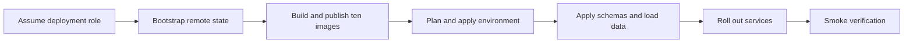

# CardDemo AWS deployment runbook

## Document contract

**Purpose**: Provision one CardDemo environment from the committed Terraform, publish the ten
container images, migrate its database, roll out the services, rotate the confidential Cognito app
client when required, and verify the candidate business flows.

**Source of truth**: The environment roots under `infra/envs/`, the module inputs and outputs under
`infra/modules/`, the service manifests under `services/`, and the AAP deployment and security
requirements. The mainframe assets under `app/**` remain reference-only.

| Parameter | Kind | Description |
|:---|:---|:---|
| `<env>` | enum | `dev` or `prod`; selects the corresponding environment root. |
| `<aws-region>` | AWS region | Region configured by the environment root and the short-lived deployment identity. |
| `<deploy-role-arn>` | IAM role reference | Federated deployment role; never commit its resolved value. |
| `<account-registry>` | ECR registry hostname | Resolved at run time from the target account, never written into this document. |
| `<commit-sha>` | immutable image tag | Source revision used for all ten images in one release. |
| `<planfile>` | local file path | Saved Terraform plan reviewed before apply; never commit it. |
| `<next-rotation-revision>` | positive integer | Monotonic Cognito app-client-secret rotation trigger. |

**Expected outcome / success signal**: Terraform exits zero after applying the reviewed saved plan;
all long-running ECS services reach a stable state; health checks report `UP`; Flyway reports no
pending migration; and every smoke flow below returns its expected success or documented business
reject.

**Failure modes and handling**: Stop before apply when the plan contains an unexplained destroy,
when the remote-state backend is absent, when image digests do not match the intended commit, or
when a credential would be written to a tracked file. Do not edit an applied Flyway migration.
Use the failure table below and [teardown.md](teardown.md) for lock recovery and protected teardown.

---

## Scope and deployment boundary

This runbook provides operator commands; it is not evidence that a live AWS environment has been
provisioned. A real `terraform apply` and the cost it incurs remain operator actions. The migration
adds an AWS path and leaves the existing z/OS and AWS Mainframe Modernization paths intact.

---

## Prerequisites

- Terraform 1.15.8.
- AWS provider 6.x locked by each environment root and the random provider 3.9.x.
- AWS CLI with the Cognito `add-user-pool-client-secret`,
  `list-user-pool-client-secrets`, and `delete-user-pool-client-secret` operations.
- Maven 3.9.16 on Java 21, Node.js compatible with `ui/package.json`, Python 3.13, Docker, and `jq`.
- A clean checkout and a short-lived federated AWS session. Do not create access keys for this
  procedure.

```bash
# WHAT: verifies that the deployment tools resolve before any state or registry operation.
# WHY : Assumptions: a missing or wrong-major tool is discovered before an apply can partially
#       change shared infrastructure.
terraform version
aws --version
mvn --version
node --version
python --version
docker version
```

---

## Deployment path



---

## Step 0 - Obtain short-lived credentials

Use the organization's federated or SSO process to assume `<deploy-role-arn>`, then export only the
temporary values it returns.

```bash
# WHAT: confirms the current shell is using the intended short-lived deployment identity.
# WHY : Assumptions: every later command inherits this identity; checking it once prevents a plan
#       from being created against a different account or role than the reviewer expects.
aws sts get-caller-identity --query Arn --output text
```

Do not paste the returned account identifier or credentials into a file, issue, or review comment.

---

## Step 1 - Bootstrap the remote-state backend

Run this once per AWS account before either environment root performs a backend-enabled `init`.

```bash
# WHAT: initialises the bootstrap root without a remote backend.
# WHY : Assumptions: the S3 state bucket and DynamoDB lock table do not exist yet, so asking this
#       root to use them would create a circular prerequisite.
terraform -chdir=infra/bootstrap init -backend=false -input=false
```

```bash
# WHAT: creates a reviewable bootstrap plan.
# WHY : Alternatives Considered: applying directly was rejected because the state bucket, lock
#       table and KMS policy are account-wide controls whose exact names and deletion settings must
#       be reviewed before creation.
terraform -chdir=infra/bootstrap plan -out="<planfile>"
```

```bash
# WHAT: applies the exact bootstrap plan that was reviewed.
# WHY : Assumptions: a saved plan keeps the reviewed graph and the applied graph identical; a
#       second implicit plan could incorporate an unreviewed file or provider change.
terraform -chdir=infra/bootstrap apply "<planfile>"
```

The bootstrap root is intentionally outside the normal deployment workflow. Running it from a
workflow that already needs the backend would be circular.

---

## Step 2 - Build and publish the ten images

The eight service images are `auth-service`, `account-service`, `card-service`,
`transaction-service`, `reference-service`, `batch-service`, `authorization-service`, and
`reporting-service`. The other two are `ui` and `data-migration`. `common-lib` is a Maven library,
not an image.

```bash
# WHAT: builds all nine Maven modules and runs the Java validation and test gates.
# WHY : Assumptions: Checkstyle is bound to Maven validate and common-lib is a dependency of the
#       services, so building only one image can miss a shared-kernel failure.
mvn -B -f services/pom.xml clean verify
```

```bash
# WHAT: installs the locked UI dependency graph and produces the production bundle.
# WHY : Alternatives Considered: npm install was rejected because it may resolve versions outside
#       package-lock.json; npm ci refuses lock drift and makes the built bundle reproducible.
npm --prefix ui ci
npm --prefix ui run build
```

```bash
# WHAT: validates and tests the Python migration package before its image is built.
# WHY : Assumptions: the ETL is the boundary that decodes fixed-width and packed data, so syntax
#       success without its codec and loader tests is not sufficient evidence.
./.venv/bin/ruff check data-migration
./.venv/bin/python -m pytest data-migration/tests
```

```bash
# WHAT: authenticates Docker to the target ECR registry without placing the password in argv.
# WHY : Alternatives Considered: passing the password as a command argument was rejected because
#       process listings and shell history retain it; password-stdin confines it to the pipe.
aws ecr get-login-password --region "<aws-region>" | docker login --username AWS --password-stdin "<account-registry>"
```

Build each Dockerfile and tag it with `<commit-sha>`. Never publish only `latest`: a mutable-only tag
prevents an ECS task definition from identifying the exact bytes required for rollback. The ECR
module enables scan-on-push, so inspect each repository's scan result after push.

---

## Step 3 - Provision the environment

Backend-enabled `init` is required for a real apply. The `-backend=false` form used in CI validates
syntax only and must not precede a production apply.

```bash
# WHAT: initialises the selected environment against the bootstrapped remote state.
# WHY : Assumptions: the S3 backend and lock table from Step 1 must already exist; otherwise this
#       command fails before a plan can be written.
terraform -chdir="infra/envs/<env>" init -input=false -lockfile=readonly
```

```bash
# WHAT: writes the proposed environment change to a saved plan.
# WHY : Trade-offs: a saved plan adds one local artifact and becomes stale if configuration changes,
#       but it guarantees that the reviewed change is the one apply executes. Re-plan after any
#       source, variable, state, or provider change.
terraform -chdir="infra/envs/<env>" plan -out="<planfile>"
```

Review every create, update, replacement, and destroy. The baseline CICS deployment deck required
manual delete edits and contains duplicate or stale definitions; the saved Terraform plan is the
cloud control that makes comparable drift visible before execution.

```bash
# WHAT: applies the reviewed environment plan without re-planning or auto-approving.
# WHY : Refactoring Rationale: declarative apply converges the resource graph without editing a
#       deployment deck between runs, while the saved-plan boundary prevents an unreviewed graph
#       from replacing the reviewed one.
terraform -chdir="infra/envs/<env>" apply "<planfile>"
```

---

## Step 4 - Apply database schemas and migrate data

`data-migration/sql/V0__schemas_and_roles.sql` creates the service schemas and roles. Owning services
then apply their Flyway migrations. `reporting-service` owns no source tables and reads only the
masked security-barrier views granted to its read-only role.

The batch role's cross-schema grants are deliberately limited to the account and ledger objects
needed to preserve the posting unit of work as one database transaction. Do not replace those grants
with schema-wide privileges.

Follow [data-migration.md](data-migration.md) for copybook decoding, staged data, row-count checks,
checksums, and money-total parity.

---

## Step 5 - Seed reference data

Apply `reference-service`'s versioned seed migration. Verify that the `DEFAULT` disclosure-group row
exists: the interest job falls back to it when a specific group lookup misses, and without that row
the fallback cannot produce the required rate. Also verify the transaction-category foreign key is
`ON DELETE RESTRICT`; the service translates that constraint into a conflict response rather than
exposing a database error.

---

## Step 6 - Roll out services and verify health

The deployment model is rolling ECS service replacement. Blue-green and canary deployment are out
of scope.

```bash
# WHAT: waits for one service to reach a stable desired-task state after its task definition changes.
# WHY : Assumptions: Terraform finishing proves the control plane accepted the update; this wait
#       proves replacement tasks passed container and load-balancer health checks.
aws ecs wait services-stable --region "<aws-region>" --cluster "<cluster-name>" --services "<service-name>"
```

If stability fails, inspect the service's CloudWatch log group, the task's stopped reason, the image
digest, and the Parameter Store and Secrets Manager references before retrying.

### Rotate the Cognito app-client secret

The Cognito module uses a custom API bridge because AWS provider 6.57.1 does not model multiple app
client secrets. It adds a new active secret to the existing client, updates the KMS-encrypted
Secrets Manager value, and leaves the previously current secret active during rollout. The next
rotation removes that predecessor before adding another, so the client never has more than two
active secrets.

Increment `app_client_secret_rotation_revision` in the selected environment's non-secret
configuration and review the resulting replacement of only
`terraform_data.app_client_secret_rotation`.

```bash
# WHAT: plans one explicit app-client-secret rotation without changing the Cognito client id.
# WHY : Assumptions: the monotonic revision is a non-secret operator trigger; changing it is the
#       reviewable event that invokes AddUserPoolClientSecret during apply.
terraform -chdir="infra/envs/<env>" plan -var="cognito_app_client_secret_rotation_revision=<next-rotation-revision>" -out="<planfile>"
```

```bash
# WHAT: applies the reviewed rotation and updates the Secrets Manager current version.
# WHY : Trade-offs: the previously current secret remains active until the next rotation so running
#       auth-service tasks keep authenticating while replacement tasks load the new value.
terraform -chdir="infra/envs/<env>" apply "<planfile>"
```

```bash
# WHAT: restarts auth-service so every task resolves the new current secret.
# WHY : Assumptions: the service reads the secret during startup; without a rollout, long-running
#       tasks continue using the still-valid predecessor and the rotation is not fully adopted.
aws ecs update-service --region "<aws-region>" --cluster "<cluster-name>" --service "<auth-service-name>" --force-new-deployment
```

```bash
# WHAT: lists only app-client secret identifiers and creation dates after rotation.
# WHY : Assumptions: querying no ClientSecretValue proves the two-secret overlap without copying a
#       credential into terminal output or an operator log.
aws cognito-idp list-user-pool-client-secrets --region "<aws-region>" --user-pool-id "<user-pool-id>" --client-id "<app-client-id>" --query "ClientSecrets[].{id:ClientSecretId,created:ClientSecretCreateDate}"
```

The deployment role needs only the scoped Cognito add/list/delete client-secret actions and
Secrets Manager get/put permissions for the app-client secret, plus KMS use through Secrets Manager.
Do not grant wildcard secret access.

---

## Step 7 - Smoke-verify candidate business flows

Retrieve a generated seed credential only through Secrets Manager and never paste it into this
document or a shared log.

| Flow | Verification |
|:---|:---|
| Sign-on | Authenticate through `POST /auth/signon`; complete `POST /auth/challenge` when the temporary credential requires a change. |
| Account view/update | Read one account, update an allowed field, and verify a stale version returns conflict. |
| Card list/update | List cards and address detail/update by opaque card identifier, never by PAN in the browser URL. |
| Transaction add/list | Add a fixed-point amount and verify the list returns the same decimal string. |
| Bill pay | Submit one payment and verify the account and ledger effects commit together. |
| Posting batch | Start the Step Functions execution and verify posted, rejected, and return-code outcomes. |
| Pending authorization | Publish a request and verify ordered request/reply and fraud-mark behavior. |
| Account inquiry | Publish a request and verify the correlated standard-queue reply. |
| Transaction-type reference | Read and update reference data; verify referenced types cannot be deleted. |

Use [batch-operations.md](batch-operations.md) for batch execution and parity-oracle detail.

---

## Environment parameterisation

| Concern | dev | prod |
|:---|:---|:---|
| Aurora capacity | May scale to zero with auto-pause configured. | Minimum remains above zero. |
| ECS sizing | Smaller task size and desired count. | Production task size and redundant desired count. |
| Log retention | Shorter. | Longer. |
| CloudFront price class | Restricted. | Full configured class. |
| Protection | Destructive iteration permitted. | Deletion protection and final snapshot required. |

**Trade-offs**: Keeping topology identical means a dev validation exercises the same network and
service graph as prod. It does not prove prod capacity behavior, and scale-to-zero resume behavior
is a dev-only characteristic.

---

## Idempotency

**Refactoring Rationale**: Baseline jobs used several separate rerun devices: condition-code
normalization, delete-if-exists preambles, and manual uncommented deletes, while some definitions
had no rerun guard. Terraform plan/apply provides one convergence model for all resources; rerunning
the same configuration produces no duplicate definition and requires no source edit.

---

## No secrets by construction

Database credentials, seed-user temporary passwords, and rotated Cognito app-client secrets are
generated or returned during apply and written to Secrets Manager. Tracked `terraform.tfvars` files
contain non-secret sizing and retention only. `ui/.env.example` documents names without values, and
state and local environment files are excluded from commits.

**Refactoring Rationale**: The baseline published seed credentials with its deployment material.
Generate-at-apply plus managed retrieval makes the no-committed-secret constraint structural rather
than dependent on a reviewer noticing a credential-shaped string.

---

## Concurrency and the state lock

Allow one apply per environment. The DynamoDB state lock is the cloud analogue of exclusive
read-write access to the shared CICS definition store. Queue another deployment instead of
canceling an active apply: interruption can leave both partial resources and an abandoned lock.
See [teardown.md](teardown.md) for the reviewed force-unlock procedure.

---

## Failure handling

| Failure | Operator response |
|:---|:---|
| Environment `init` reports a missing backend | Stop and complete Step 1; do not switch to local state. |
| Plan shows unexplained destroys or replacements | Stop, inspect state and configuration, and produce a new plan after correction. |
| Apply is interrupted | Inspect the environment and lock; follow `teardown.md` before force-unlocking. |
| Service fails health checks | Inspect stopped reason, logs, image digest, and runtime parameter/secret references. |
| Flyway checksum mismatch | Do not edit an applied migration; add a new versioned migration. |
| Cognito rotation sees an unexpected secret count | Stop; reconcile active secret identifiers and the current managed secret before retrying. |
| Prod destroy is blocked | Treat the protection as intentional and follow the explicit teardown procedure. |

---

## Out of scope

An operator will not find multi-region disaster recovery, blue-green or canary deployment, Kafka,
Kinesis, Redis, ElastiCache, read replicas, the Db2 rewards roadmap item, IMS DC, SFTP integration,
or exposed distributed transactions in this package. They are outside this migration's scope.

---

## Mainframe path remains available

`app/**`, `samples/**`, `scripts/**`, and `tests/**` remain reference-only and operable. This AWS
deployment adds a path; it does not remove or rewrite the existing one. The untouched path is also
why rollback does not require an un-migration of the baseline.

---

## Related documents

- [Teardown](teardown.md)
- [Data migration](data-migration.md)
- [Batch operations](batch-operations.md)
- [Code documentation standard](../CODE_DOCUMENTATION_STANDARD.md)
- [Migration guide](../../MIGRATION_README.md)
- [Repository overview](../../README.md)
