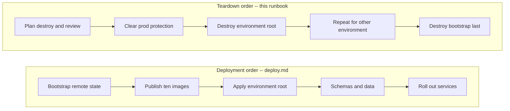

# CardDemo AWS teardown runbook

## Document contract

**Purpose**: Remove one CardDemo environment, and optionally the account-wide remote-state backend,
in the exact reverse of the order [deploy.md](deploy.md) creates them; dispose of the artifacts a
`destroy` deliberately leaves behind; recover an abandoned state lock; and roll back either to a
previously reviewed image or to the mainframe path.

**Source of truth**: [deploy.md](deploy.md), whose step order this document inverts; the three
Terraform roots `infra/bootstrap`, `infra/envs/dev` and `infra/envs/prod`; the protection and
retention inputs in each root's `variables.tf` and `terraform.tfvars`; the bootstrap teardown paths
in [`infra/bootstrap/README.md`](../../infra/bootstrap/README.md); and the AAP teardown and
roll-back requirements. The mainframe assets under `app/**` remain reference-only and are cited
here, never modified.

| Parameter | Kind | Description |
|:---|:---|:---|
| `<env>` | enum | `dev` or `prod`; selects the corresponding environment root. The two roots are independent, so one may be destroyed while the other stays up. |
| `<aws-region>` | AWS region | Region configured by the root being destroyed and by the short-lived operator identity. |
| `<planfile>` | local file path | Saved destroy plan, reviewed before it is applied. Name it with a `.tfplan` suffix so `.gitignore` L326-L327 excludes it; a bare `tfplan` is trackable. Never commit it. |
| `<lock-id>` | Terraform lock identifier | Read from the `Lock Info` block the failing command prints. Never guessed and never reused from a previous incident. |
| `<state-bucket>` | S3 bucket name | The bootstrap remote-state bucket. Resolve it from `terraform -chdir=infra/bootstrap output -raw state_bucket_name`. |
| `<final-snapshot-id>` | DB snapshot identifier | The Aurora final snapshot a protected teardown produces. Read it from the destroy output or from the cluster's snapshot list; it carries a generated suffix and is never a fixed name. |
| `<repository-name>` | ECR repository name | One of the ten repositories. Resolve the set from the environment's `registry` output. |
| `<log-group-name>` | CloudWatch log group name | A retained log group. Resolve the set from the environment's `observability` output. |
| `<secret-name>` | Secrets Manager name | An entry left in its recovery window. Resolve names from the `service_credentials` output; never paste a resolved name back into this file. |
| `<commit-sha>` | immutable image tag | The revision to roll forward or back to. Never `latest`; both roots reject that value outright. |
| `<image-digest>` | `sha256:` digest | The immutable digest production deploys by, since the ECS service module refuses a mutable tag there. |
| `<cluster-name>` | ECS cluster name | Read from the environment's `ecs_cluster` output at the point of use. |
| `<service-name>` | ECS service name | The service being rolled. Substitute each consumer in turn where a step names several. |

Four further values are **resolved at run time rather than supplied**, so they appear in the commands
below as the shell variables `SPA_BUCKET`, `DATASET_BUCKET`, `AUDIT_BUCKET` and `TRAIL_ARN` rather
than as placeholders. Each is read from a Terraform output at the point of use. Do not substitute a
value for these by hand: a bucket name typed from memory is the one input in this runbook whose being
wrong is both easy and unrecoverable, because it directs a purge at the wrong bucket.

**Expected outcome / success signal**: Every `terraform` command exits **0**. After Step 3,
`terraform state list` for the environment root prints nothing and a fresh `plan` reports no
changes, which together are the only evidence that the root manages nothing rather than that a
command merely finished. After Step 5, the same two checks hold for `infra/bootstrap`. A non-zero
exit is a stop, not a retry: read the message, find it in [Failure handling](#failure-handling), and
resolve the named cause before issuing another command. One exit is deliberately **not** a
failure -- a `prod` destroy refused while the protection flags are set is those flags working, and
Step 2 is the reviewed way past it.

**Failure modes and handling**: Stop before applying any destroy plan when the plan removes a
resource you did not expect, when it was produced against a different account or Region than the
reviewer read, or when the environment still serves traffic. Stop and consult
[data-migration.md](data-migration.md) before destroying a database whose contents have not been
dispositioned -- this document owns the infrastructure half of roll-back and that document owns the
data half. Never force-unlock a lock you have not confirmed is orphaned, and never destroy
`infra/bootstrap` while any environment root still holds state in it. The full table is in
[Failure handling](#failure-handling).

---

## Scope and teardown boundary

This runbook provides operator commands; it is **not** evidence that any live AWS environment
exists, and **no teardown described here has been performed**. A real `terraform destroy`, and the
cost it stops incurring, remain operator actions outside this scope.

Assumptions: the infrastructure in this repository is **authored and statically validated only**.
`terraform fmt -check`, a credential-free `init -backend=false`, `validate`, `tflint` and the policy
and generated-document checks run as build gates in
[`infra-ci.yml`](../../.github/workflows/infra-ci.yml); none of them contacts an AWS account, and
`apply` and `destroy` are absent from every workflow by design --
[`deploy.yml`](../../.github/workflows/deploy.yml) contains no destroy operation at all, because
teardown is an operator action carried by this document rather than a pipeline step. Static success
is therefore evidence about the configuration and not evidence that any resource has been created,
destroyed, or measured. Read every command below as the procedure an operator would follow, not as a
record of one already performed.

There are exactly three Terraform roots, and every command in this runbook addresses one of them:

| Root | Destroyed | Holds |
|:---|:---|:---|
| `infra/envs/dev` | First, per environment being removed | The development environment root, sized down independently of production |
| `infra/envs/prod` | First, per environment being removed | The production environment root, and the only root provisioned with protection flags set |
| `infra/bootstrap` | **Last**, and only on account decommission | The remote-state backend: a versioned, encrypted S3 bucket and a DynamoDB lock table, plus the versioned audit bucket and trail that record access to them |

---

## Teardown is the reverse of deployment

Teardown runs [deploy.md](deploy.md)'s steps backwards. The order is not a convention and not a
matter of taste -- it is forced by where Terraform keeps the information a destroy needs.



Assumptions: `terraform destroy` does not discover resources from the AWS API -- it reads the
**existing state** to learn what it manages, then removes those objects. Each environment root
keeps that state remotely: `infra/envs/dev/backend.tf` and `infra/envs/prod/backend.tf` each declare
a `backend "s3"` pointing at the bucket and lock table that `infra/bootstrap` provisions. Destroying
the bootstrap first therefore deletes the state every remaining destroy depends on, and the outcome
is the worst one available: the environment's load balancer, database, queues, distribution and
tasks all continue to exist and continue to bill, with no Terraform record naming them. Recovering
from that means identifying every orphaned resource by hand and deleting it by hand. Destroying the
environments first costs nothing but sequence.

`infra/bootstrap` is itself the exception that proves the rule: it keeps **local** state and
declares no `backend "s3"` stanza at all, because a root whose job is to create the backend cannot
also require it. That is what makes it destroyable last rather than undestroyable.

The mainframe path expressed the same dependency. The baseline install job ran `DFHCSDUP` with
`PARM='CSD(READWRITE),PAGESIZE(60),NOCOMPAT'` [app/jcl/CBADMCDJ.jcl L27-L28], taking exclusive
read-write access to the shared CICS definition store it reached through a shared dataset DD
[app/jcl/CBADMCDJ.jcl L30]. Remove that shared store and every definition in it becomes
unmanageable, while the resources it described carry on running. The remote-state bucket occupies
exactly that position here.

---

## Prerequisites

- **Terraform 1.15.8.** Every root declares `required_version = ">= 1.15.0"`; 1.15.8 is the version
  this configuration is validated on.
- **Providers**: `hashicorp/aws` constrained `~> 6.56` and `hashicorp/random` constrained `~> 3.9`,
  the only two providers any root declares. Each root's tracked `.terraform.lock.hcl` resolves those
  constraints. Verify the lock file; never rewrite it as a way of moving a version.
- **AWS CLI** and **`jq`**, for the residue disposal in
  [What destroy does not remove](#what-destroy-does-not-remove) and for reading bucket names out of
  Terraform outputs.
- A clean checkout of the revision that provisioned the environment, and a short-lived federated AWS
  session. Do not create access keys for this procedure.
- Written disposition for the environment's data and evidence before Step 1. This runbook removes
  infrastructure; deciding what may be lost is a separate approval that
  [data-migration.md](data-migration.md) covers.

```bash
# WHAT: confirms the current shell is using the intended short-lived identity, and that Terraform
#       resolves, before any destroy plan is produced.
# WHY : Assumptions: every later command inherits this identity. A destroy plan produced against the
#       wrong account is not merely useless -- it reads as a plausible list of resources to remove,
#       and an operator who approves it has approved the wrong environment.
aws sts get-caller-identity --query Arn --output text
```

```bash
# WHAT: reports the Terraform and provider versions the roots will run under.
# WHY : Assumptions: a destroy is executed by the same binary and providers that produced the state.
#       A provider older than the constraint can fail to represent a resource it did not know about,
#       which surfaces mid-destroy with part of the environment already gone.
terraform version
```

Do not paste the returned account identifier or any credential into a file, issue, or review
comment.

**Note**: the credential-free form used for static validation cannot destroy anything.
`terraform -chdir=infra/envs/dev init -backend=false -lockfile=readonly` initialises **without** the
remote state, which is exactly why it needs no credentials -- and for the same reason it can neither
plan a destroy nor apply one. Every command in the steps below requires the backend-enabled `init`
shown in Step 1.

---

## Step 1 - Confirm what you are about to destroy

Initialise the selected environment against the backend that still holds its state, then produce a
saved destroy plan and read it.

```bash
# WHAT: initialises the selected environment root against the bootstrapped remote state.
# WHY : Assumptions: the S3 backend and DynamoDB lock table must still exist. This is the first
#       command that proves the bootstrap has not already been destroyed out of order -- if it
#       fails naming a missing bucket, stop and read the orphaned-state reasoning above rather
#       than switching this root to local state, which would abandon the real state permanently.
terraform -chdir="infra/envs/<env>" init -input=false -lockfile=readonly
```

```bash
# WHAT: writes the proposed removal to a saved plan instead of executing it.
# WHY : Trade-offs: a saved destroy plan costs one local artifact and goes stale the moment
#       configuration, variables, state or providers change, but it makes the graph that was
#       reviewed and the graph that executes the same object. Re-plan after any such change,
#       and after the bucket purges in Step 5, rather than applying a plan produced before them.
terraform -chdir="infra/envs/<env>" plan -destroy -out="<planfile>"
```

```bash
# WHAT: renders the saved destroy plan for review as text.
# WHY : Alternatives Considered: `terraform destroy` with an interactive prompt, and
#       `terraform destroy -auto-approve`, were both rejected. The prompt asks for the word `yes`
#       against a list that has already scrolled past, which is a confirmation and not a review;
#       `-auto-approve` leaves no artifact anyone can inspect afterwards to establish what was
#       removed and on whose approval. Rendering a saved plan produces exactly that artifact.
terraform -chdir="infra/envs/<env>" show "<planfile>"
```

Read the rendered plan for three things specifically, because each has a different remedy:

- **A resource you did not expect to lose.** Stop. Confirm the plan was produced against the
  intended account and Region, and that the checkout matches the revision that provisioned the
  environment.
- **A count that disagrees with the environment you think you are in.** A `dev` plan and a `prod`
  plan remove the same *shapes* of resource, because both roots call the same sixteen modules; the
  counts and names are what distinguish them.
- **Data-bearing resources.** The database cluster, the dataset bucket, the SPA bucket and the
  audit and log buckets are the resources whose removal is not reversible by re-applying. Confirm
  their disposition is approved before Step 3.

Reviewing a rendered plan is the control the baseline lacked, and the same deck shows why it
matters. `app/jcl/CBADMCDJ.jcl` defines `MAPSET(COSGN00M)` twice in byte-identical stanzas at L50-L51
and again at L53-L54; it defines four further mapsets twice over at L56-L63 and L65-L72, differing
only in description text; and it names programs in `PROGRAM` stanzas at L148 and L150-L157 that do
not exist in `app/cbl` at all. None of that is visible from reading the deck's intent -- it is
visible from diffing what a run would actually do against what exists. A saved plan is that diff, in
either direction.

---

## Step 2 - Clear the production protection flags (prod only)

Skip this step entirely for `dev`. Its `terraform.tfvars` already sets `deletion_protection = false`
and `skip_final_snapshot = true`, so Step 1's plan applies directly.

For `prod`, a destroy **will fail**. `infra/envs/prod/terraform.tfvars` L127-L128 sets
`deletion_protection = true` and `skip_final_snapshot = false`, and the Aurora module states the
consequence in the repository's own words: `deletion_protection` still true when a destroy is
attempted means "RDS refuses the deletion; this is the intended behaviour in prod and the reason dev
sets the flag to false" [`infra/modules/aurora-postgresql/main.tf` L139-L141]. **That refusal is the
flag doing its job. It is not an error to route around.**

One variable governs more than the cluster, which is the part worth knowing before you flip it.
`deletion_protection` is read through the same `!var.deletion_protection` expression by six
independent destroy blockers:

| Blocker | Where | Effect while `deletion_protection = true` |
|:---|:---|:---|
| Aurora cluster deletion protection | `infra/modules/aurora-postgresql/main.tf` L739 | RDS refuses to delete the cluster |
| SPA origin bucket and its log bucket | `infra/envs/prod/main.tf` L652 | `force_destroy` is false, so a populated bucket refuses deletion |
| Versioned dataset bucket | `infra/envs/prod/main.tf` L2460 | `force_destroy` is false |
| Shared access-log bucket | `infra/envs/prod/main.tf` L5071 | `access_log_bucket_force_destroy` is false |
| ECR repositories | `infra/envs/prod/main.tf` L883 | `force_delete` is false, so repositories holding images refuse deletion |
| Internal ALB | `infra/envs/prod/main.tf` L4724 | The module receives `enable_deletion_protection`, which leaves `force_destroy` false on its log destination |

Clearing protection is therefore a deliberate, separate, two-step gesture: change the flags in one
reviewed apply, then destroy in a second.

```bash
# WHAT: plans the removal of production protection as a change in its own right, leaving every
#       other resource untouched.
# WHY : Trade-offs: protection is chosen over convenience, and this extra reviewed apply is the
#       whole price of that choice. The benefit is exact: no single mistyped command can destroy
#       production, because the command that would destroy it cannot succeed until a different,
#       separately reviewed change has been applied first. Editing the flags and destroying in one
#       motion was rejected for removing precisely that property.
# WHY : Assumptions: one variable releases all six blockers in the table above, so this plan is
#       larger than the two flags suggest -- it also flips `force_destroy` on four buckets and
#       `force_delete` on the ECR repositories. Read it as the removal of the environment's data
#       protection in full, which is what it is.
terraform -chdir=infra/envs/prod plan -out="<planfile>" -var 'deletion_protection=false'
```

```bash
# WHAT: applies the reviewed protection change, and nothing else.
# WHY : Alternatives Considered: setting the flags in `infra/envs/prod/terraform.tfvars` and
#       committing that edit was rejected. The tracked file is the description of a protected
#       production environment, and leaving it holding `false` after a teardown means the next
#       apply silently rebuilds prod unprotected. A `-var` override is scoped to the one
#       invocation and leaves no residue in the repository.
terraform -chdir=infra/envs/prod apply "<planfile>"
```

Decide the final snapshot deliberately, because it is the one roll-back asset a destroy produces.

- **Leaving `skip_final_snapshot = false`** takes a final snapshot before the cluster is deleted.
  The snapshot **survives the destroy** and is listed in
  [What destroy does not remove](#what-destroy-does-not-remove). Its identifier carries a generated
  suffix rather than a fixed name, so a later create-destroy cycle cannot collide with a name a
  previous teardown left behind [`infra/modules/aurora-postgresql/main.tf` L142-L147, L251].
- **Overriding it to `true`** deletes the cluster with no snapshot. Choose this only where the data
  has already been dispositioned under [data-migration.md](data-migration.md), because there is no
  second chance.

```bash
# WHAT: plans the destroy of production with protection cleared and no final snapshot taken.
# WHY : Trade-offs: this discards the only automatic recovery point the teardown would otherwise
#       produce, in exchange for not retaining a snapshot that keeps billing and keeps a copy of
#       card-bearing rows alive. Omit the second override to keep the snapshot; there is no third
#       option, and the choice cannot be revisited after the apply.
terraform -chdir=infra/envs/prod plan -destroy -out="<planfile>" -var 'deletion_protection=false' -var 'skip_final_snapshot=true'
```

**Note**: pass the same `-var` overrides to `plan -destroy` that you passed to the protection apply.
Terraform re-evaluates variables on every invocation, so a destroy plan produced without them
describes a still-protected environment and will refuse the cluster again at apply time.

---

## Step 3 - Destroy the environment root

Apply the plan that was reviewed in Step 1 -- or, for `prod`, the plan produced after Step 2 cleared
protection.

```bash
# WHAT: applies the reviewed destroy plan, without re-planning and without auto-approval.
# WHY : Assumptions: applying a saved plan means Terraform executes the reviewed graph rather than
#       recomputing one at apply time. Re-running `plan -destroy` here instead would silently pick
#       up anything that changed since the review, which for a destroy means it could remove a
#       resource nobody read. Terraform refuses a stale plan outright, which is the behaviour that
#       makes this safe rather than merely conventional.
terraform -chdir="infra/envs/<env>" apply "<planfile>"
```

A clean completion prints a `Destroy complete!` summary with a resource count and exits **0**. That
is necessary but not sufficient -- it says the run finished, not that the root manages nothing. Two
checks establish the latter, and both are cheap:

```bash
# WHAT: lists the resources the root still tracks; an empty result is the success condition.
# WHY : Assumptions: this reads state rather than the AWS API, so it answers exactly the question
#       teardown is about -- whether anything remains under Terraform's management. A partial
#       destroy leaves entries here even after a run that reported no error, which is the state an
#       interrupted apply produces.
terraform -chdir="infra/envs/<env>" state list
```

```bash
# WHAT: confirms a fresh plan proposes nothing, using the three-valued exit code.
# WHY : Assumptions: -detailed-exitcode returns 0 for no changes, 1 for an error and 2 for changes
#       present, so 0 here is a positive assertion that nothing is left to reconcile. A plain
#       `plan` exits 0 whether or not it found changes, and would report success either way.
terraform -chdir="infra/envs/<env>" plan -detailed-exitcode
```

**Note**: if you installed Terraform through the `hashicorp/setup-terraform` action rather than
directly, set `terraform_wrapper: false`. Assumptions: that action installs a wrapper which rewrites
exit codes, so the `2` that means "changes present" can be read as success -- which defeats the
check above at exactly the moment it matters.

Then confirm by inspection that the resource classes an operator most expects to be gone are gone:
the ECS services and their tasks, the internal load balancer and its listener, the API, the Aurora
cluster, the queues and their dead-letter queues, the state machines and the schedule, and the
CloudFront distribution. Anything still present that the plan claimed to remove belongs in
[Failure handling](#failure-handling), not in a second `apply`.

---

## Step 4 - Repeat for the other environment

If both environments are being removed, run Steps 1 through 3 again with `<env>` set to the other
value. Nothing is shared between them at the Terraform level: each root has its own state object,
its own lock, its own variables file and its own resources, so destroying one has no effect on the
other and the order between them does not matter.

That independence is the reason a partial teardown is a legitimate end state. Removing `dev` while
`prod` stays up is a normal cost measure and needs no special handling -- and critically, it does
**not** license Step 5, because `prod` still keeps its state in the bootstrap backend.

```bash
# WHAT: lists the state objects still present in the remote-state bucket, across every environment.
# WHY : Assumptions: this is the check that decides whether Step 5 is permissible at all. A key
#       still listed here belongs to a root that still manages resources, so destroying the
#       bootstrap would orphan them. Resolve the bucket name from the bootstrap output rather than
#       typing it, because a wrong bucket name returns an empty listing that reads like consent.
aws s3api list-objects-v2 --bucket "<state-bucket>" --query 'Contents[].Key' --output text
```

---

## Step 5 - Destroy the bootstrap last, and only on account decommission

**The strong default is not to run this step.** Destroy `infra/bootstrap` only when the AWS account
no longer needs any CardDemo environment at all. If the account may host CardDemo again, leave the
bootstrap in place: it holds a state bucket, an audit bucket, a lock table and a KMS key, which
together cost very little, and it is the thing every future `terraform init` depends on.

Alternatives Considered: destroying the bootstrap alongside the last environment, to leave the
account visibly empty. Rejected because the two costs are not comparable. Retaining the backend
costs a small amount of storage and a handful of requests; reconstructing it costs the state history
and the audit trail, which are the only records of what was previously provisioned and who reached
it. A redeployment into an account whose bootstrap was kept is an `init` away; one into an account
whose bootstrap was destroyed starts from nothing.

If the account is genuinely being decommissioned, the obstacle is that both bootstrap buckets are
**versioned**, and a versioned bucket cannot be deleted while any object version or delete marker
remains in it.

```bash
# WHAT: stops audit delivery before either bucket is emptied, resolving the trail and Region from
#       the bootstrap outputs rather than from a pasted identifier.
# WHY : Assumptions: an active trail keeps writing objects into the audit bucket, so purging it
#       first produces a bucket that refills between the purge and the destroy and then refuses
#       deletion for a reason that looks like the purge having failed. If AWS delivers an
#       already-buffered object after this call, run the purge again before the destroy.
AUDIT_BUCKET="$(terraform -chdir=infra/bootstrap output -raw state_audit_bucket_name)"
BOOTSTRAP_REGION="$(terraform -chdir=infra/bootstrap output -raw aws_region)"
TRAIL_ARN="$(terraform -chdir=infra/bootstrap output -raw state_object_access_trail_arn)"
aws cloudtrail stop-logging --region "$BOOTSTRAP_REGION" --name "$TRAIL_ARN"
printf 'Purge this bucket next: %s\n' "$AUDIT_BUCKET"
```

Two purge routes exist, and [`infra/bootstrap/README.md`](../../infra/bootstrap/README.md) carries
both in full. The choice is only about which bucket Terraform empties and which one you empty:

- **Terraform purges the state bucket.** `state_bucket_force_destroy` defaults to `false` and exists
  for exactly this case. Pass `-var 'state_bucket_force_destroy=true'`, apply that change, then
  destroy. The variable governs **only** the state bucket -- the audit bucket is separately
  versioned with `force_destroy = false` [`infra/bootstrap/main.tf` L442] and must still be emptied
  explicitly.
- **You purge both with the AWS CLI.** Use the version-aware loop that runbook defines, then destroy
  with the protective default still in force.

```bash
# WHAT: authorises Terraform to empty the versioned state bucket during the destroy, as an explicit
#       reviewed change rather than a default.
# WHY : Trade-offs: this permanently discards every retained version of every state file, and that
#       history is the only record of what this account previously provisioned -- there is no
#       recovery window and no copy elsewhere. It is accepted here only because the account is being
#       decommissioned, which is why the behaviour requires an explicit variable rather than
#       shipping as a permissive default.
# WHY : Alternatives Considered: `aws s3 rm --recursive` was rejected as the purge mechanism. It
#       removes current objects only and leaves noncurrent versions and delete markers behind, so
#       the bucket still refuses deletion while appearing empty in a console listing.
terraform -chdir=infra/bootstrap plan -out="<planfile>" -var 'state_bucket_force_destroy=true'
```

```bash
# WHAT: applies the reviewed force-destroy authorisation.
# WHY : Assumptions: this only changes the bucket's deletion behaviour; it removes nothing by
#       itself. The destroy below is what acts on it, which is why the two are separate reviewable
#       events rather than one.
terraform -chdir=infra/bootstrap apply "<planfile>"
```

```bash
# WHAT: produces and reviews the bootstrap destroy plan with the same override in force.
# WHY : Assumptions: the override must be repeated, because Terraform re-evaluates variables on
#       every invocation and a plan produced without it describes a protected bucket that will
#       refuse deletion at apply time.
terraform -chdir=infra/bootstrap plan -destroy -out="<planfile>" -var 'state_bucket_force_destroy=true'
```

```bash
# WHAT: applies the reviewed bootstrap destroy.
# WHY : Assumptions: this is the last destroy in the sequence and the point after which no
#       Terraform state exists for this account. Every environment root must already be empty --
#       Step 4's object listing is the check, and running this while any state key remains is the
#       orphaning failure the ordering rule exists to prevent.
terraform -chdir=infra/bootstrap apply "<planfile>"
```

There is deliberately no `lifecycle { prevent_destroy = true }` on the bootstrap buckets or lock
table, and no DynamoDB deletion protection. Alternatives Considered: either control was rejected
because it would make this documented procedure stop at a refusal no variable can waive, leaving the
root half-removed and the rest to be finished by hand. The versioned-bucket purge is already the
deliberate, data-loss-specific barrier, and `state_bucket_force_destroy` makes waiving it explicit
and visible in a diff.

The same reasoning applies to the environment roots. No KMS key carries `prevent_destroy` either;
the recovery mechanism is `deletion_window_in_days`, so a destroyed key spends that window pending
deletion and can be cancelled within it. That is a recovery window rather than a block, which is
what lets a destroy complete cleanly instead of halting on a guarded resource
[`infra/modules/kms/main.tf` L419-L427].

---

## What destroy does not remove

An operator expecting an empty, zero-cost account after Step 3 will be surprised. The general form is
short: **`destroy` removes what the root manages.** Anything a managed resource produced as a durable
artifact, anything protected by a recovery window, and anything belonging to a different root, needs
an explicit step.

Assumptions: each item below survives for a specific structural reason rather than because the
destroy was incomplete. Check this table before concluding that a resource left behind is a bug.

| Residue | Why it survives | Operator action |
|:---|:---|:---|
| Aurora final snapshot | Produced *because* `skip_final_snapshot = false` required it. A snapshot is deliberately not a dependency of the cluster, so deleting the cluster does not delete it. | Retain it as the roll-back asset it is, then delete `<final-snapshot-id>` explicitly once it is no longer needed. |
| Manual or retained DB snapshots | Not managed by the environment root at all; a manual snapshot is created outside Terraform. | Delete explicitly. |
| KMS keys inside their deletion window | `deletion_window_in_days` schedules deletion rather than performing it, so the key remains, and remains cancellable, for the window's duration [`infra/modules/kms/main.tf` L419-L427]. | Nothing, normally -- the window expires on its own. Cancel the deletion only to recover a key you still need. |
| Secrets Manager entries inside their recovery window | `recovery_window_in_days` schedules deletion. A non-zero window also **leaves the entry's name reserved**, so a destroy-then-apply collides on a name that no longer appears to exist [`infra/modules/cognito/main.tf` L93-L95]. | Wait out the window before redeploying, or force deletion for `<secret-name>` understanding that it is irreversible. |
| CloudWatch log groups | Retention is a parameter that ages entries out; it is not a deletion trigger, and a group inside its window is intact. | Delete `<log-group-name>` explicitly if the logs are no longer needed for audit. |
| Container images in ECR | Images are release artifacts rather than environment state, and the registry may be the source for more than one environment. In a protected environment the repositories are retained outright, because `force_delete` tracks `deletion_protection`. | Delete images, or `<repository-name>`, explicitly -- and only after confirming no other environment deploys from them. |
| Bucket contents, in the other direction | Once `deletion_protection` is false, `force_destroy` is true on the SPA, dataset, access-log and ALB log buckets, so the destroy deletes them **with their contents, including every noncurrent version**. This is the one row where the surprise is loss rather than survival. | Export anything that must be kept **before** Step 3. There is no recovery afterwards. |
| Terraform state objects | The state bucket belongs to `infra/bootstrap`, not to the environment root, so no environment destroy can remove them. | Removed only by Step 5, and only on account decommission. |

Because the last two rows pull in opposite directions, resolve them in that order: export first, then
destroy. The export reads the bucket names from Terraform outputs rather than from a guess.

```bash
# WHAT: resolves the SPA and dataset bucket names from the environment's outputs and prints them for
#       review before anything is copied out of them or destroyed.
# WHY : Refactoring Rationale: an earlier form of this lookup read root-level outputs named
#       `spa_bucket_name` and `dataset_bucket_name`. Neither exists. Both names live inside module
#       output OBJECTS the root republishes -- `spa` and `datasets` -- so the earlier reads
#       returned "Output ... not found", left both variables empty, and produced a review prompt
#       naming two unnamed buckets immediately before a destroy.
# WHY : Alternatives Considered: `jq -r` was rejected in favour of `jq -er`, because `-r` yields an
#       empty string for a missing key and exits zero, so a renamed output would produce
#       `s3://` paths that look like a configuration error only after the copy has run.
SPA_BUCKET="$(terraform -chdir="infra/envs/<env>" output -json spa | jq -er '.spa_bucket_name')"
DATASET_BUCKET="$(terraform -chdir="infra/envs/<env>" output -json datasets | jq -er '.bucket_name')"
printf 'Review before export and destroy: %s %s\n' "$SPA_BUCKET" "$DATASET_BUCKET"
```

```bash
# WHAT: counts every object version and delete marker in the dataset bucket, so the volume about to
#       be destroyed is known before it is destroyed.
# WHY : Assumptions: the bucket is versioned with a five-noncurrent-version retention rule, the
#       analogue of the baseline's GDG `LIMIT(5) SCRATCH` [app/jcl/DEFGDGB.jcl L25-L27]. A current-
#       object listing therefore understates what is present by up to a factor of six, and the
#       generation history is exactly what a dataset bucket exists to hold.
# WHY : Alternatives Considered: counting with a --query multiselect was rejected. Both keys are
#       ABSENT rather than empty when nothing matches, so a length() over either one errors on an
#       already-empty bucket -- the case where a clear answer matters most. The // [] defaults make
#       an empty bucket report zero instead of failing.
aws s3api list-object-versions --bucket "$DATASET_BUCKET" --output json | jq '{versions: (.Versions // [] | length), deleteMarkers: (.DeleteMarkers // [] | length)}'
```

Use the organisation's approved export procedure to copy out what must be kept.
[`infra/bootstrap/README.md`](../../infra/bootstrap/README.md) defines a version-aware purge function
for the cases where a bucket must be emptied by hand rather than by Terraform -- a protected
environment being destroyed without clearing protection, or a bucket that state no longer tracks.

---

## Environment parameterisation

The two environments differ only in sizing, retention and protection. Both roots call the same
sixteen modules, so the topology they provision -- and therefore the shape of what a destroy
removes -- is identical.

| Concern | dev | prod |
|:---|:---|:---|
| Aurora capacity | May scale to zero with auto-pause configured. | Minimum remains above zero. |
| ECS sizing | Smaller task size and desired count. | Production task size and redundant desired count. |
| Log retention | Shorter. | Longer. |
| CloudFront price class | Restricted. | Full configured class. |
| Protection | Destructive iteration permitted. | Deletion protection and final snapshot required. |

**The Protection row is the only one that changes this procedure**, and it is why `dev` teardown is
one step and `prod` teardown is two. Every other row changes what a resource costs or how long it
keeps data, not whether it can be removed.

Aurora capacity is worth one clarification, because the range is easy to misread as a protection
control. Capacity runs from 0 to 256 Aurora Capacity Units in half-unit increments; when the minimum
is zero the auto-pause setting is **mandatory** and the maximum must be at least one. `dev` sets a
minimum of zero and `prod` holds it above zero. A paused cluster is still a cluster: it is destroyed
by exactly the same plan, and pausing is not a substitute for teardown.

---

## Concurrency, interrupted operations and the state lock

Allow one operation per environment at a time. The DynamoDB state lock is the cloud analogue of the
exclusive read-write access the baseline install job took on the shared CICS definition store
[app/jcl/CBADMCDJ.jcl L27-L28].

**Queue an operation rather than cancelling one that is running.** Cancelling a half-applied
`apply` -- including the apply of a destroy plan -- can leave the environment partially provisioned
*and* abandon the lock, which blocks every subsequent operation until an operator clears it. Waiting
costs time; interrupting costs a reconciliation.

The symptom is unambiguous: the command stops and prints a `Lock Info` block naming the lock ID, the
state path, the operation, the owner, and when the lock was acquired. Read all five before doing
anything. When the named operation is genuinely still running, **wait**.

```bash
# WHAT: releases one state lock whose owning operation has been confirmed to have ended.
# WHY : Assumptions: the lock id is taken verbatim from the `Lock Info` block the failing command
#       printed, and the operator has established that no plan or apply is still writing this
#       state. Force-unlocking a lock a live apply genuinely holds lets two operations write the
#       same state concurrently, which corrupts it -- turning a visible stall into an invisible
#       divergence between state and reality.
terraform -chdir="infra/envs/<env>" force-unlock "<lock-id>"
```

Alternatives Considered: a time-to-live on the lock table, so abandoned items expire by themselves.
Rejected because a TTL cannot distinguish an orphaned item from a legitimately long operation, and
expiring a live lock converts a stall an operator can see into a concurrent-write hazard nobody can.

```bash
# WHAT: reports what the root still manages after a force-unlock, without changing anything.
# WHY : Assumptions: an interrupted run may have created or destroyed resources that state does not
#       record, so plan before apply -- never the other way round. `plan` is read-only against AWS
#       and is the only way to see the divergence; an `apply` here would act on a graph computed
#       from state that is known to be incomplete.
terraform -chdir="infra/envs/<env>" plan
```

Reconcile whatever the plan reveals before resuming the teardown. Then return to Step 1 and produce a
fresh destroy plan: the plan saved before the interruption describes a graph that no longer exists.

---

## Roll-back and roll-forward

Three paths exist, and they are genuinely different operations. Choosing the wrong one is the common
mistake, so decide which question you are answering first.

### Roll forward to a newer release

Re-apply the environment root with the new revision and let ECS replace tasks. The deployment model
is **rolling ECS service replacement**; blue-green and canary deployment are out of scope, so there
is no traffic-shifting step to configure or reverse.

```bash
# WHAT: plans the environment at a new image revision, then applies the reviewed plan.
# WHY : Assumptions: the revision is supplied as a variable rather than baked into a tracked file,
#       so the deployed release is visible in the plan a reviewer reads. Both roots reject the value
#       `latest` outright, which is what makes the deployed revision recoverable from state at all.
terraform -chdir="infra/envs/<env>" plan -out="<planfile>" -var 'image_tag=<commit-sha>'
terraform -chdir="infra/envs/<env>" apply "<planfile>"
```

```bash
# WHAT: waits for one service to reach a stable desired-task state after its task definition changes.
# WHY : Assumptions: Terraform finishing proves the control plane accepted the update; this wait
#       proves replacement tasks passed container and load-balancer health checks. Declaring the
#       roll-out complete at the apply would report success while the previous tasks are still
#       serving.
aws ecs wait services-stable --region "<aws-region>" --cluster "<cluster-name>" --services "<service-name>"
```

### Roll back to a previously reviewed image

Re-apply with the earlier revision. This is the same mechanism as rolling forward, pointed backwards,
and it works for one specific reason.

```bash
# WHAT: returns the environment to a known-good release by re-applying its earlier revision.
# WHY : Assumptions: every image is tagged with the commit SHA and never only with a moving tag --
#       both roots reject `latest` by validation, and in production the ECS service module refuses a
#       mutable tag entirely and requires an immutable `sha256:` digest. That is what makes a
#       known-good release identifiable after the fact: under a mutable tag the task definition
#       would name a tag whose contents had since been repointed, so there would be nothing
#       specific to roll back to.
terraform -chdir="infra/envs/<env>" plan -out="<planfile>" -var 'image_tag=<commit-sha>'
```

```bash
# WHAT: rolls production back by immutable digest rather than by tag.
# WHY : Assumptions: production deploys by digest because the service module refuses a mutable tag
#       there, so the digest map is the production roll-back input. A digest names one specific
#       image build and cannot be repointed, which is the property a roll-back target needs.
terraform -chdir=infra/envs/prod plan -out="<planfile>" -var 'image_digests={"<service-name>"="<image-digest>"}'
```

Application roll-back moves code. It does not move schema, and the two must not be mixed in one
motion -- see [data-migration.md](data-migration.md), which owns the data half of roll-back: the
idempotent re-load, the pre-load recovery point, and the cutover gate that requires an approved
roll-back snapshot before traffic moves.

### Roll back to the mainframe path

Covered in the next section, because it is the one path that requires no infrastructure at all.

**What roll-back does not mean here.** There is no multi-region failover and no disaster-recovery
topology to fail over to -- the design is single-region across three availability zones. There are no
read replicas to promote. Neither is a gap in this runbook; both are outside the migration's scope,
listed in [Out of scope](#out-of-scope).

---

## Rolling back to the mainframe path

This is the cheapest roll-back available, and it is a **property of how the migration was built**
rather than a procedure it provides or a piece of good fortune. The migration is purely additive: it
wrote new trees beside the baseline and changed nothing inside it. Reverting to the mainframe path
therefore requires no un-migration, because nothing was migrated away.

Assumptions: this rests entirely on `app/**` being untouched, and that is verifiable rather than
asserted. Under `app/**` the 44 COBOL programs, 62 copybooks, 21 BMS mapsets, 46 JCL jobs -- 38 of
them in `app/jcl` -- the four CICS resource-definition files and all 22 seed data files, 9 ASCII and
13 EBCDIC, stand exactly as they did. `samples/**` is unchanged, including its M2 archives and its
compile and security samples. `scripts/**` and `tests/**` are unchanged, and
[`tests.yml`](../../.github/workflows/tests.yml) still runs the COBOL suite exactly as it did.
**Exactly three pre-existing files were modified anywhere in this migration** -- `README.md`,
`CONTRIBUTING.md` and `.gitignore` -- and none of the three is executable by the mainframe path.

So the roll-back is: stop using the AWS path, optionally destroy it using Steps 1 through 4, and
resume the mainframe path, which never stopped working. The migration adds a path; it does not remove
one. Both remain available, and the AWS deployment paths under `samples/**` are equally intact.

For how to operate the mainframe path, use the material that already documents it rather than a
restatement here: the root [README.md](../../README.md) carries the installation and transaction
inventory, and `app/jcl` carries the job inventory itself -- including the CICS resource install
deck [app/jcl/CBADMCDJ.jcl], the generation-group definitions [app/jcl/DEFGDGB.jcl,
app/jcl/DALYREJS.jcl], and the backup and report jobs [app/jcl/TRANBKP.jcl, app/jcl/PRTCATBL.jcl].

**Note**: running the baseline is expected; **editing it is not**. Nothing in this roll-back requires
a change to any file under `app/**`, and the reference trees remain reference-only in both
directions. Where the baseline's own re-run behaviour needs an operator to alter a deck -- the
install job's instruction to uncomment a delete command before rerunning [app/jcl/CBADMCDJ.jcl L38,
L42] -- that is the baseline's documented mainframe procedure, and it is cited here to locate it, not
performed against this checkout.

---

## What teardown does not touch

Nothing in this procedure alters `app/**`, `samples/**`, `scripts/**` or `tests/**`. That is not a
policy this runbook enforces by care; it follows from what `terraform destroy` does. Destroy removes
cloud resources recorded in a Terraform state file, and none of those four trees is a cloud resource
or appears in any state file. A destroy of every root in this repository leaves all four
byte-identical.

The corollary is the one that matters operationally: **a completed teardown does not reduce this
repository's contents.** The migration's own artifacts -- `services/**`, `ui/**`,
`data-migration/**`, `infra/**`, `docs/**` -- are equally untouched by a destroy. Teardown removes a
deployment, not a codebase, so a destroyed environment can be provisioned again from the same
checkout by following [deploy.md](deploy.md).

---

## The parity oracle after teardown

The COBOL suite in `tests/**` is the behavioural oracle this migration is verified against, and it is
entirely local: its unit, integration and end-to-end layers need no AWS resource, so it keeps working
after the cloud stack is destroyed. That is a useful confirmation to run once a teardown is complete,
because it demonstrates the baseline path is intact rather than merely asserting it.

```bash
# WHAT: installs the pinned test dependencies into the repository virtual environment and runs all
#       three suite layers from the repository root.
# WHY : Assumptions: the pins are exact and hash-verified, which is what keeps the golden-master
#       comparisons byte-deterministic; a floating dependency would let a comparison drift. A
#       virtual environment is required rather than preferred, because a modern system Python is
#       PEP 668 externally-managed and refuses a direct install.
source .venv/bin/activate
pip install --require-hashes -r tests/requirements-test.txt
bash scripts/run_tests.sh
```

The runner aggregates a worst-case condition code across its stages:

| Code | Meaning |
|:---|:---|
| 0 | Pass. |
| 2 | Usage error. Deliberately never aggregated, so a mistyped invocation cannot masquerade as a warn. |
| 4 | Warn or soft reject. |
| 8 | Fail. |
| 16 | Fatal or abend. |

**A warn-level aggregate of 4 is the current green state, and it is not a regression introduced by
this migration or by a teardown.** It comes from the pre-existing `CBEXPORT`/`CBIMPORT` compile defect
in the immutable baseline, which `scripts/run_tests.sh` L210 describes in the repository's own words
as "a WARN (rc=4) -- honestly non-green". The COBOL is not edited to remove it; the migrated Java
implements the correct behaviour and the divergence is registered in
[cobol-to-service-traceability.md](../architecture/cobol-to-service-traceability.md). Treat 8 or 16
as a real failure and 4 as the expected baseline.

The optional LocalStack layer degrades to a warn when the emulator is unreachable, which is the
correct behaviour after a teardown. Passing `--with-localstack` or `--require-localstack` escalates
that to a hard failure, so do not pass either flag when you are deliberately verifying a
post-teardown state.

`tests/README.md` L3-L6 states that where a script and that README disagree, **the script is
authoritative**. The same precedence applies here: this section describes the runner's behaviour, and
`scripts/run_tests.sh` decides it. Full parity operation is covered in
[batch-operations.md](batch-operations.md) rather than duplicated here.

---

## Failure handling

| Failure | Operator response |
|:---|:---|
| `destroy` on `prod` is refused on the database cluster | The protection flags are set and working. Do not route around it -- follow [Step 2](#step-2---clear-the-production-protection-flags-prod-only) to clear protection as a separate reviewed apply, then re-plan the destroy with the same overrides. |
| `destroy` fails on a non-empty versioned bucket | `force_destroy` is false, which for a protected environment is `deletion_protection` still being true. Either clear protection through Step 2, or purge the bucket's versions and delete markers explicitly using the version-aware purge -- understanding from the residue table exactly what that discards. |
| `init` fails naming a missing state bucket | The bootstrap was destroyed out of order, or the backend values name a different account or Region. Stop. Do **not** switch the root to local state: that abandons the real state and orphans every resource it recorded. Re-read [Teardown is the reverse of deployment](#teardown-is-the-reverse-of-deployment). |
| An operation stops with a `Lock Info` block | Read the owner and acquisition values. Wait while the named operation is running. Force-unlock only after confirming none is, using the lock id from that block, then `plan` before any `apply`. See [Concurrency, interrupted operations and the state lock](#concurrency-interrupted-operations-and-the-state-lock). |
| `destroy` reports success but resources remain | Check [What destroy does not remove](#what-destroy-does-not-remove) before assuming a defect. Final snapshots, keys and secrets in their windows, log groups, and ECR images all survive by design, and state objects belong to a different root. |
| `terraform state list` is non-empty after a clean destroy | The run was interrupted, or a provider could not delete a resource and left it tracked. Re-plan and read the result; do not apply a plan saved before the interruption. |
| A resource refuses deletion because another root depends on it | Destroy in the documented order: environments first, bootstrap last. A dependency reaching across roots is the signal that the order was inverted. |
| Applying a saved plan is refused as stale | Configuration, variables, state or providers changed after the plan was produced. This refusal is the saved-plan discipline working. Produce a fresh `plan -destroy`, review it again, and apply that. |
| A redeployment collides on a secret name that appears not to exist | The name is still reserved by a non-zero secret recovery window. Wait out the window, or force deletion of the entry, accepting that it is irreversible. |

---

## Out of scope

An operator will not find multi-region disaster recovery, blue-green or canary deployment, Kafka,
Kinesis, Redis, ElastiCache, read replicas, the Db2 rewards roadmap item, IMS DC, SFTP integration,
or exposed distributed transactions in this package. They are outside this migration's scope, so
there is no failover to reverse, no traffic-shifting deployment to roll back, no streaming platform
or cache tier to drain, and no replica to promote or demote during a teardown.

Two further boundaries belong here because an operator may reasonably look for them in a teardown
document. Executing `terraform destroy` against a live AWS account is an operator action outside this
scope, as is any cost it stops incurring; this runbook supplies the commands and the ordering, not a
record of a performed teardown. And the data half of roll-back -- the idempotent re-load, the
pre-load recovery point, and the cutover gate -- belongs to [data-migration.md](data-migration.md)
rather than to this document.

---

## Related documents

- [Deploy](deploy.md)
- [Data migration](data-migration.md)
- [Batch operations](batch-operations.md)
- [Bootstrap root, including both version-aware purge paths](../../infra/bootstrap/README.md)
- [Infrastructure overview](../../infra/README.md)
- [Traceability and divergences](../architecture/cobol-to-service-traceability.md)
- [Code documentation standard](../CODE_DOCUMENTATION_STANDARD.md)
- [Migration guide](../../MIGRATION_README.md)
- [Repository overview](../../README.md)
