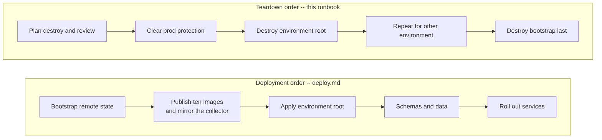

# CardDemo AWS teardown runbook

## Document contract

**Purpose**: Remove one CardDemo environment, and optionally the account-wide remote-state backend,
in the exact reverse of the order [deploy.md](deploy.md) creates them; dispose of the artifacts a
`destroy` deliberately leaves behind; recover an abandoned state lock; and roll back either to a
previously reviewed image or to the mainframe path.

**Source of truth**: [deploy.md](deploy.md), whose step order this document inverts; the three
Terraform roots `infra/bootstrap`, `infra/envs/dev` and `infra/envs/prod`; the protection and
retention inputs in each root's `variables.tf` and `terraform.tfvars`; the bootstrap teardown paths
in [`infra/bootstrap/README.md`](../../infra/bootstrap/README.md); and the AAP teardown and
roll-back requirements. The mainframe assets under `app/**` remain reference-only and are cited
here, never modified.

| Parameter | Kind | Description |
|:---|:---|:---|
| `<env>` | enum | `dev` or `prod`; selects the corresponding environment root. The two roots are independent, so one may be destroyed while the other stays up. |
| `<aws-region>` | AWS region | Region configured by the root being destroyed and by the short-lived operator identity. |
| `<planfile>` | local file path | Saved destroy plan, reviewed before it is applied. Name it with a `.tfplan` suffix so `.gitignore` L326-L327 excludes it; a bare `tfplan` is trackable. Never commit it. |
| `<lock-id>` | Terraform lock identifier | Read from the `Lock Info` block the failing command prints. Never guessed and never reused from a previous incident. |
| `<authorised-account-id>` | AWS account id | The account the teardown approval names. Supplied in the shell at the point of use so a command can compare it against the identity and the bucket owner it is about to act on; never written into this file. |
| `<final-snapshot-id>` | DB snapshot identifier | The Aurora final snapshot a protected teardown produces. Read it from the destroy output or from the cluster's snapshot list; it carries a generated suffix and is never a fixed name. |
| `<recovery-snapshot-id>` | DB snapshot identifier | Name you choose for the manual cluster snapshot taken as the pre-destroy recovery point in [Step 2b](#step-2b---preserve-a-decryptable-recovery-point). |
| `<retained-snapshot-id>` | DB snapshot identifier | Name you choose for the copy of that snapshot encrypted under `<retained-key-arn>`. |
| `<retained-key-arn>` | KMS key ARN | A customer-managed key **no root in this repository manages**, so nothing in this teardown can schedule it for deletion. It is what makes a retained snapshot restorable after the environment's own key is gone. |
| `<repository-name>` | ECR repository name | One of the ten repositories. Resolve the set from the environment's `registry` output. |

| `<final-snapshot-id>` | DB snapshot identifier | The Aurora final snapshot a protected teardown produces. Read it from the destroy output or from the cluster's snapshot list; it carries a generated suffix and is never a fixed name. |
| `<repository-name>` | ECR repository name | One of the eleven repositories -- the ten this repository builds plus the `aws-otel-collector` mirror. Resolve the set from the environment's `registry` output. |
| `<log-group-name>` | CloudWatch log group name | A retained log group. Resolve the set from the environment's `observability` output. |
| `<secret-name>` | Secrets Manager name | An entry left in its recovery window. Resolve names from the `service_credentials` output; never paste a resolved name back into this file. |
| `<commit-sha>` | immutable image tag | The revision to roll forward or back to. Never `latest`; both roots reject that value outright. |
| `<image-digest>` | `sha256:` digest | The immutable digest production deploys by, since the ECS service module refuses a mutable tag there. |
| `<artifact-name>` | ECR artifact name | The key an `image_digests` entry is held under: one of the nine names `infra/envs/prod/variables.tf` L1246-L1261 admits. It is the repository name, **not** the ECS service name -- the modules compose that as `<prefix>-<service>-<environment>` [`infra/modules/ecs-service/main.tf` L80]. |
| `<digest-map>` | local file path | The retained **complete** `image-digests.json` from the deployment being rolled back *from*. `.github/workflows/deploy.yml` L355 writes it under `deploy-reports/` and L590-L596 uploads that directory as the run's audit artifact, so the map that was deployed is recoverable after the fact; L601-L607 deletes the runner-local copy. |
| `<cluster-name>` | ECS cluster name | Read from the environment's `ecs_cluster` output at the point of use. |
| `<service-name>` | ECS service name | The service being rolled. Substitute each consumer in turn where a step names several. |

Further values are **resolved at run time rather than supplied**, so they appear in the commands
below as shell variables rather than as placeholders. Each is read from a Terraform output at the
point of use: `SPA_BUCKET`, `DATASET_BUCKET`, `AUDIT_BUCKET` and `TRAIL_ARN` from the root that owns
them, and the four backend values `STATE_BUCKET`, `STATE_REGION`, `STATE_LOCK_TABLE` and
`STATE_KMS_KEY_ARN` from `infra/bootstrap`. Do not substitute a value for these by hand: a bucket
name typed from memory is the one input in this runbook whose being wrong is both easy and
unrecoverable, because it directs a purge at the wrong bucket -- or, for the state bucket, a destroy
plan at another account's state.

**Expected outcome / success signal**: Every `terraform` command exits **0**. After Step 3,
`terraform state list` for the environment root prints nothing and a fresh `plan -destroy` reports
that no objects need to be destroyed, which together are the only evidence that the root manages
nothing rather than that a command merely finished. A *normal* `plan` is not that evidence and never
was -- against empty state it proposes building the stack again -- which is why Step 3 uses the
destroy form. After Step 5, the same two checks hold for `infra/bootstrap`. A non-zero exit is a
stop, not a retry: read the message, find it in [Failure handling](#failure-handling), and resolve
the named cause before issuing another command. One exit is deliberately **not** a failure -- a
`prod` destroy refused while the protection flags are set is those flags working, and Step 2 is the
reviewed way past it.

**Failure modes and handling**: Stop before applying any destroy plan when the plan removes a
resource you did not expect, when it was produced against a different account or Region than the
reviewer read, or when the environment still serves traffic. Stop and consult
[data-migration.md](data-migration.md) before destroying a database whose contents have not been
dispositioned -- this document owns the infrastructure half of roll-back and that document owns the
data half. Never force-unlock a lock you have not confirmed is orphaned, and never destroy
`infra/bootstrap` while any environment root still manages a resource -- Step 4 gates that on each
root's `terraform state list` being empty, not on the state bucket being empty, which it will not
be. The full table is in [Failure handling](#failure-handling).

---

## Scope and teardown boundary

This runbook provides operator commands; it is **not** evidence that any live AWS environment
exists, and **no teardown described here has been performed**. A real `terraform destroy`, and the
cost it stops incurring, remain operator actions outside this scope.

Assumptions: the infrastructure in this repository is **authored and statically validated only**.
`terraform fmt -check`, a credential-free `init -backend=false`, `validate`, `tflint` and the policy
and generated-document checks run as build gates in
[`infra-ci.yml`](../../.github/workflows/infra-ci.yml); none of them contacts an AWS account, and
`apply` and `destroy` are absent from every workflow by design --
[`deploy.yml`](../../.github/workflows/deploy.yml) contains no destroy operation at all, because
teardown is an operator action carried by this document rather than a pipeline step. Static success
is therefore evidence about the configuration and not evidence that any resource has been created,
destroyed, or measured. Read every command below as the procedure an operator would follow, not as a
record of one already performed.

There are exactly three Terraform roots, and every command in this runbook addresses one of them:

| Root | Destroyed | Holds |
|:---|:---|:---|
| `infra/envs/dev` | First, per environment being removed | The development environment root, sized down independently of production |
| `infra/envs/prod` | First, per environment being removed | The production environment root, and the only root provisioned with protection flags set |
| `infra/bootstrap` | **Last**, and only on account decommission | The remote-state backend: a versioned, encrypted S3 bucket and a DynamoDB lock table, plus the versioned audit bucket and trail that record access to them |

---

## Teardown is the reverse of deployment

Teardown runs [deploy.md](deploy.md)'s steps backwards. The order is not a convention and not a
matter of taste -- it is forced by where Terraform keeps the information a destroy needs.



Assumptions: `terraform destroy` does not discover resources from the AWS API -- it reads the
**existing state** to learn what it manages, then removes those objects. Each environment root
keeps that state remotely: `infra/envs/dev/backend.tf` and `infra/envs/prod/backend.tf` each declare
a `backend "s3"` pointing at the bucket and lock table that `infra/bootstrap` provisions. Destroying
the bootstrap first therefore deletes the state every remaining destroy depends on, and the outcome
is the worst one available: the environment's load balancer, database, queues, distribution and
tasks all continue to exist and continue to bill, with no Terraform record naming them. Recovering
from that means identifying every orphaned resource by hand and deleting it by hand. Destroying the
environments first costs nothing but sequence.

`infra/bootstrap` is itself the exception that proves the rule: it keeps **local** state and
declares no `backend "s3"` stanza at all, because a root whose job is to create the backend cannot
also require it. That is what makes it destroyable last rather than undestroyable.

The mainframe path expressed the same dependency. The baseline install job ran `DFHCSDUP` with
`PARM='CSD(READWRITE),PAGESIZE(60),NOCOMPAT'` [app/jcl/CBADMCDJ.jcl L27-L28], taking exclusive
read-write access to the shared CICS definition store it reached through a shared dataset DD
[app/jcl/CBADMCDJ.jcl L30]. Remove that shared store and every definition in it becomes
unmanageable, while the resources it described carry on running. The remote-state bucket occupies
exactly that position here.

---

## Prerequisites

- **Terraform 1.15.8.** Every root declares `required_version = ">= 1.15.0"`; 1.15.8 is the version
  this configuration is validated on.
- **Providers**: `hashicorp/aws` constrained `~> 6.56` and `hashicorp/random` constrained `~> 3.9`,
  the only two providers any root declares. Each root's tracked `.terraform.lock.hcl` resolves those
  constraints. Verify the lock file; never rewrite it as a way of moving a version.
- **AWS CLI** and **`jq`**, for the residue disposal in
  [What destroy does not remove](#what-destroy-does-not-remove), for the snapshot and key operations
  in [Step 2b](#step-2b---preserve-a-decryptable-recovery-point), and for resolving the backend
  values and bucket names out of Terraform outputs rather than typing them.
- **A retained KMS key** (`<retained-key-arn>`) if any recovery point is to survive this teardown.
  Assumptions: it has to exist *before* Step 3, because the copy that binds a snapshot to it can
  only be taken while the environment's own key is still usable. Creating it afterwards is too late,
  which is why it is a prerequisite rather than a step.
- A clean checkout of the revision that provisioned the environment, and a short-lived federated AWS
  session. Do not create access keys for this procedure.
- The `infra/bootstrap` root's local state on this machine. Step 1 reads the four partial-backend
  values out of its outputs, and that state is gitignored rather than committed
  [`infra/bootstrap/README.md`](../../infra/bootstrap/README.md).
- Written disposition for the environment's data and evidence before Step 1. This runbook removes
  infrastructure; deciding what may be lost is a separate approval that
  [data-migration.md](data-migration.md) covers.
- The deployment record for the environment being destroyed -- the `deploy-reports/` bundle the
  deployment run published, or the same values held as protected environment variables. It carries
  the twelve inputs each root requires and, for `prod`, the digest map.
  [Step 1a](#step-1a---resolve-the-inputs-a-destroy-plan-requires) resolves every one of them and
  gives a read-only fallback for each where the record has been lost.

```bash
# WHAT: confirms the current shell is using the intended short-lived identity, and that Terraform
#       resolves, before any destroy plan is produced.
# WHY : Assumptions: every later command inherits this identity. A destroy plan produced against the
#       wrong account is not merely useless -- it reads as a plausible list of resources to remove,
#       and an operator who approves it has approved the wrong environment.
aws sts get-caller-identity --query Arn --output text
```

```bash
# WHAT: reports the Terraform and provider versions the roots will run under.
# WHY : Assumptions: a destroy is executed by the same binary and providers that produced the state.
#       A provider older than the constraint can fail to represent a resource it did not know about,
#       which surfaces mid-destroy with part of the environment already gone.
terraform version
```

Do not paste the returned account identifier or any credential into a file, issue, or review
comment.

**Note**: the credential-free form used for static validation cannot destroy anything.
`terraform -chdir=infra/envs/dev init -backend=false -lockfile=readonly` initialises **without** the
remote state, which is exactly why it needs no credentials -- and for the same reason it can neither
plan a destroy nor apply one. Every command in the steps below requires the backend-enabled `init`
shown in Step 1.

---

## Step 0 - Resolve the four backend values and the twelve root inputs

A clean checkout cannot reach the state it is about to destroy, and cannot even produce a destroy
plan, until both of these are supplied. Neither is inherited from a previous session, so this step
runs first in **every** shell that runs anything below it — including the recovery paths near the end
of this document.

`infra/envs/<env>/backend.tf` is a **partial** backend: it commits only `key` and `encrypt`, because
the bucket name, the lock table and the customer-managed key ARN all embed the account identifier and
the Region is a deployment property. The four missing values exist only in `infra/bootstrap`.

```bash
# WHAT: reads the four partial-backend values out of the bootstrap root and exports them.
# WHY : Assumptions: this is resolved here rather than cross-referenced to deploy.md, because a
#       teardown is frequently run by someone who did not perform the deployment, and the very first
#       backend-enabled command below fails without it. A runbook that delegates its own precondition
#       to another document is a circle when the other document is not open.
# WHY : Assumptions: the values are READ rather than typed, because three of the four identify the
#       account. A typed bucket initialises this root against ANOTHER environment's state, which
#       succeeds -- and then plans a destroy of resources this root never created. That is the single
#       most damaging mistake available in this document, and reading the values removes it.
# WHY : Assumptions: `output -raw` is used because each of the four is a bare string, and it exits
#       non-zero on a name the root does not publish rather than printing `null` into a
#       `-backend-config` value. `infra/bootstrap/outputs.tf` publishes exactly these four plus
#       `state_audit_bucket_name` and `state_object_access_trail_arn`, which the backend does not take.
export CARDDEMO_TF_STATE_BUCKET="$(terraform -chdir=infra/bootstrap output -raw state_bucket_name)"
export CARDDEMO_TF_STATE_REGION="$(terraform -chdir=infra/bootstrap output -raw aws_region)"
export CARDDEMO_TF_STATE_LOCK_TABLE="$(terraform -chdir=infra/bootstrap output -raw state_lock_table_name)"
export CARDDEMO_TF_STATE_KMS_KEY_ID="$(terraform -chdir=infra/bootstrap output -raw state_kms_key_arn)"
```

The block above needs the bootstrap root's state, and `infra/bootstrap` declares **no** backend — it
creates the bucket a backend would have to find, so its state is local. A teardown run on a different
machine from the deployment therefore has no bootstrap state to read, and `output` fails with
`No state file was found`. That is the common case for a decommission, so it has a first-class answer
rather than a workaround: all four values are deterministic, so they can be discovered from AWS
itself.

```bash
# WHAT: discovers the same four values from AWS when the bootstrap root's local state is unavailable.
# WHY : Assumptions: use this form ONLY when the block above failed with a missing state file. When
#       both work they agree, and preferring the outputs keeps one source of truth; this exists
#       because a decommission is frequently the one run that does not have that source.
# WHY : Assumptions: the names are composed from the same expressions `infra/bootstrap/main.tf` uses
#       -- the bucket from `"${var.name_prefix}-tfstate-${account_id}-${var.aws_region}"` (L152), the
#       lock table from `"${var.name_prefix}-tfstate-lock"` (L156) and the key from the alias
#       `"alias/${var.name_prefix}-terraform-state"` (L216) -- so this is a re-derivation of a
#       documented composition rather than a guess.
# WHY : Assumptions: the prefix is a VARIABLE here, not three literals. `name_prefix` defaults to
#       `carddemo` (`infra/bootstrap/variables.tf`), so the default below matches an unmodified
#       deployment; set it once if the deployment overrode it, rather than editing three commands and
#       getting two of them right.
# WHY : Assumptions: BOTH bucket and table names are wrapped in `coalesce(...)` at L150 and L156, so a
#       deployment that set `state_bucket_name` or `lock_table_name` explicitly does not follow the
#       prefix at all. In that case take the literal names from that root's tfvars -- no derivation
#       from a prefix can recover a name the prefix did not produce.
# WHY : Assumptions: the KMS key is resolved through its ALIAS rather than by a stored ARN, because
#       the alias is fixed by configuration while the key id is generated. `describe-key` is what
#       turns the stable name into the ARN the backend takes.
# WHY : Trade-offs: each of the three lookups is a read that CONFIRMS the resource exists, so a
#       missing bucket, table or key is reported here by name instead of inside a failing `init`.
export CARDDEMO_TF_STATE_REGION="<aws-region>"
name_prefix="carddemo"
account="$(aws sts get-caller-identity --query Account --output text)"
state_bucket="${name_prefix}-tfstate-${account}-${CARDDEMO_TF_STATE_REGION}"
aws s3api head-bucket --bucket "$state_bucket" \
  && export CARDDEMO_TF_STATE_BUCKET="$state_bucket"
export CARDDEMO_TF_STATE_LOCK_TABLE="$(aws dynamodb describe-table \
  --region "$CARDDEMO_TF_STATE_REGION" --table-name "${name_prefix}-tfstate-lock" \
  --query 'Table.TableName' --output text)"
export CARDDEMO_TF_STATE_KMS_KEY_ID="$(aws kms describe-key \
  --region "$CARDDEMO_TF_STATE_REGION" --key-id "alias/${name_prefix}-terraform-state" \
  --query 'KeyMetadata.Arn' --output text)"
printf 'bucket=%s\nregion=%s\nlock_table=%s\nkms_key=%s\n' \
  "${CARDDEMO_TF_STATE_BUCKET:-<UNRESOLVED>}" "$CARDDEMO_TF_STATE_REGION" \
  "$CARDDEMO_TF_STATE_LOCK_TABLE" "$CARDDEMO_TF_STATE_KMS_KEY_ID"
```

Assumptions: `dynamodb_table` is the argument name Terraform 1.15.8's S3 backend takes for the lock
table, and it emits a deprecation warning in favour of S3-native `use_lockfile` locking. That warning
is **expected output** of every `init` in this document, not a misconfiguration;
`infra/envs/<env>/backend.tf` records why the argument is kept.

**Both environment roots also declare twelve variables non-nullable with no default**, and Terraform
evaluates variables for a `plan -destroy` exactly as it does for a create plan. Without all twelve,
`plan -destroy` refuses to run and nothing below it can start. None of them is a secret and none
affects what is destroyed — they are supplied only so the configuration can be evaluated.

```bash
# WHAT: supplies the twelve inputs the roots declare with no default, so a destroy plan can evaluate.
# WHY : Assumptions: the VALUES do not have to be the ones the environment was created with. A
#       destroy plan reads state to decide what to remove, so these only have to be well formed
#       enough to satisfy each variable's own validation. That is why the two list inputs are given
#       as empty and single-entry literals rather than reconstructed from the deployment.
# WHY : Trade-offs: an operator who still has the deployment shell should reuse its exports instead,
#       because a value that differs from the deployment's is one more difference for a reviewer to
#       account for when reading the rendered plan. This block exists for the clean-checkout case,
#       which is the one that otherwise cannot start.
export TF_VAR_alb_certificate_arn="<regional-alb-certificate-arn>"
export TF_VAR_internal_service_domain_name="<internal-service-name>"
export TF_VAR_cloudfront_acm_certificate_arn="<us-east-1-spa-certificate-arn>"
export TF_VAR_cloudfront_aliases='["<spa-hostname>"]'
export TF_VAR_cloudfront_api_connect_src_origins='[]'
export TF_VAR_image_tag="<commit-sha>"
export TF_VAR_github_repository="<owner>/<repo>"
export TF_VAR_github_oidc_provider_arn="<oidc-provider-arn>"
export TF_VAR_permissions_boundary_arn="<iam-permissions-boundary-arn>"
export TF_VAR_mask_hmac_secret_arn="<mask-hmac-secret-arn>"
export TF_VAR_mask_hmac_secret_kms_key_arn="<mask-hmac-cmk-arn>"
export TF_VAR_alarm_email_endpoints='["<oncall-address>"]'
```

---

## Step 1 - Confirm what you are about to destroy

Resolve the inputs the root requires, initialise it against the backend that still holds its state,
then produce a saved destroy plan and read it.

### Step 1a - Resolve the inputs a destroy plan requires

**A destroy needs the same inputs an apply needs.** Each environment root declares thirty-six
variables, and **twelve of them have no default**, so `plan -destroy` produces no plan at all until
every one is set: it stops with `No value for required variable` where `-input=false` is in force,
and otherwise prompts for each missing value in turn. The twelve are identical in both roots -- `alb_certificate_arn`, `internal_service_domain_name`, `cloudfront_acm_certificate_arn`,
`cloudfront_aliases`, `cloudfront_api_connect_src_origins`, `image_tag`, `github_repository`,
`github_oidc_provider_arn`, `alarm_email_endpoints`, `permissions_boundary_arn`,
`mask_hmac_secret_arn` and `mask_hmac_secret_kms_key_arn` [`infra/envs/dev/variables.tf`,
`infra/envs/prod/variables.tf`] -- and they are the same twelve [deploy.md](deploy.md) exports for the
apply. Neither root reads them from `terraform.tfvars`: an ARN, a hostname and an on-call address
belong to a deployment rather than to the repository, which is why they are supplied here.

Assumptions: what these twelve say does not change what a destroy removes. A destroy plan is computed
from **state**, so it proposes deleting exactly the resources the state records, whatever value each
variable holds. They are resolved from the deployment record for two other reasons: a value must
satisfy its variable's validation before any plan exists, and the plan a reviewer approves should
describe the environment as it was deployed rather than a plausible substitute. Where the record has
been lost, the second column below reads each value back from the environment itself, read-only.

| Terraform variable | Where the value comes from |
|:---|:---|
| `image_tag` | `deployment.txt` in the deployment record. In `dev` it is also readable off the environment itself, as the `CARDDEMO_VERSION` variable on any task definition and as the tag in that definition's image reference. In `prod` it is **not**: both resolve to the digest whenever the artifact has one, and in `prod` every artifact does [`infra/envs/prod/main.tf` L3495-L3499]. Where the record is lost, map a deployed digest back to its tag -- `aws ecr describe-images --repository-name "<repository-name>" --image-ids "imageDigest=<digest>" --query 'imageDetails[0].imageTags' --output text` -- which is exact because both environments hold repository tags `IMMUTABLE` [`infra/modules/ecr/variables.tf` L539]. |
| `github_repository` | The `owner/name` slug of this repository; `git remote get-url origin` names it. It becomes a subject condition in the SPA publication role's trust policy, so it is not cosmetic. |
| `github_oidc_provider_arn` | The account-scoped provider `infra/bootstrap` creates. Read it back with `aws iam list-open-id-connect-providers` and take the entry ending `token.actions.githubusercontent.com`, or from bootstrap's own state with `terraform -chdir=infra/bootstrap state show aws_iam_openid_connect_provider.github_actions`. |
| `alb_certificate_arn` | The regional ACM certificate the internal listener presents: `aws elbv2 describe-listeners --listener-arns "$(terraform -chdir="infra/envs/<env>" output -json load_balancer \| jq -er '.https_listener_arn')" --query 'Listeners[0].Certificates[0].CertificateArn' --output text`. |
| `internal_service_domain_name` | The `https_server_name` entry of the same `load_balancer` output object. |
| `cloudfront_acm_certificate_arn` | `aws cloudfront get-distribution-config --id "<distribution-id>"`, field `ViewerCertificate.ACMCertificateArn`. The distribution identifier is the `distribution_id` entry of the `spa` output. Issued in **us-east-1**, so it is never the same ARN as the ALB certificate. |
| `cloudfront_aliases` | `Aliases.Items` from that same distribution configuration, as a JSON list. |
| `cloudfront_api_connect_src_origins` | Scheme and host of the API the SPA was built against -- the `api_endpoint_url` entry of the `api_gateway` output with any stage path segment removed, because the variable's own validation rejects a path. |
| `alarm_email_endpoints` | `aws sns list-subscriptions-by-topic --topic-arn "$(terraform -chdir="infra/envs/<env>" output -json observability \| jq -er '.notification_topic_arn')"`. Personal data: keep it in the shell and out of every file, issue and review comment. |
| `permissions_boundary_arn` | The organisation's IAM guardrail, not created by this configuration. Read it off any role the deployment created: `aws iam get-role --role-name "<task-role-name>" --query 'Role.PermissionsBoundary.PermissionsBoundaryArn' --output text`, taking the name from the `ecs_workloads` output. |
| `mask_hmac_secret_arn` | The operator-supplied masking secret, not created here. It reaches the deployed `data-migration` task definition as a container secret, so `aws ecs describe-task-definition` names its ARN under `containerDefinitions[].secrets[].valueFrom`. Only the ARN is ever handled; the secret **value** is never read by this procedure. |
| `mask_hmac_secret_kms_key_arn` | The customer-managed key encrypting that secret: `aws secretsmanager describe-secret --secret-id "<mask-hmac-secret-arn>" --query KmsKeyId --output text`. The root validates that it names the same account and Region as the secret. |

```bash
# WHAT: resolves the four values the environment root's partial backend requires from the bootstrap
#       root that publishes them, refuses to go on unless all four resolved, and only then
#       initialises the selected environment root with them supplied explicitly.
# WHY : Assumptions: the S3 backend and DynamoDB lock table must still exist. This is the first
#       command that proves the bootstrap has not already been destroyed out of order -- if it
#       fails naming a missing bucket, stop and read the orphaned-state reasoning above rather
#       than switching this root to local state, which would abandon the real state permanently.
# WHY : Assumptions: `infra/envs/<env>/backend.tf` declares only `key` and `encrypt`, because a
#       backend block cannot read a variable or a module output. `bucket`, `region`,
#       `dynamodb_table` and `kms_key_id` therefore have to arrive on the command line, and
#       `infra/bootstrap` publishes exactly those four -- `state_bucket_name`, `aws_region`,
#       `state_lock_table_name` and `state_kms_key_arn`. They are read from that root rather than
#       typed because this one command decides which account's state every later step in this
#       runbook acts on, and a state-bucket name typed from memory is wrong in a way nothing
#       downstream announces.
# WHY : Alternatives Considered: the bare `init -input=false -lockfile=readonly` this step used to
#       carry, supplying none of the four. Rejected in both of its outcomes. Against a clean
#       checkout it has nothing to read and stops, which only wastes the step; against a checkout
#       that still holds a `.terraform` directory from an earlier session it initialises from that
#       cached backend metadata instead, and the destroy plan below is then computed from whichever
#       bucket, Region and account that session used. That silent success is the worse of the two:
#       an outright failure stops an operator, whereas a plan against another environment's state
#       reads as a plausible list of resources to remove and can be approved. Supplying all four
#       makes a disagreement with cached metadata a refusal Terraform reports before it plans.
# WHY : Alternatives Considered: `jq -r` was rejected for `jq -er`. `-r` prints the string `null` and
#       exits zero for a member that is absent or renamed, so a renamed bootstrap output would be
#       passed on as `-backend-config=bucket=null` and fail later naming a bucket nobody chose. The
#       emptiness test below is what makes an unresolved value stop the procedure here instead.
BOOTSTRAP_OUTPUTS="$(terraform -chdir=infra/bootstrap output -json)"
STATE_BUCKET="$(printf '%s' "$BOOTSTRAP_OUTPUTS" | jq -er '.state_bucket_name.value')"
STATE_REGION="$(printf '%s' "$BOOTSTRAP_OUTPUTS" | jq -er '.aws_region.value')"
STATE_LOCK_TABLE="$(printf '%s' "$BOOTSTRAP_OUTPUTS" | jq -er '.state_lock_table_name.value')"
STATE_KMS_KEY_ARN="$(printf '%s' "$BOOTSTRAP_OUTPUTS" | jq -er '.state_kms_key_arn.value')"
if [ -z "$STATE_BUCKET" ] || [ "$STATE_BUCKET" = null ] ||
  [ -z "$STATE_REGION" ] || [ "$STATE_REGION" = null ] ||
  [ -z "$STATE_LOCK_TABLE" ] || [ "$STATE_LOCK_TABLE" = null ] ||
  [ -z "$STATE_KMS_KEY_ARN" ] || [ "$STATE_KMS_KEY_ARN" = null ]; then
  printf 'STOP: a bootstrap backend value did not resolve. Do not initialise.\n' >&2
else
  terraform -chdir="infra/envs/<env>" init -input=false -lockfile=readonly \
    -backend-config="bucket=$STATE_BUCKET" \
    -backend-config="region=$STATE_REGION" \
    -backend-config="dynamodb_table=$STATE_LOCK_TABLE" \
    -backend-config="kms_key_id=$STATE_KMS_KEY_ARN"
fi
```

No later step depends on those four variables surviving in the shell.
[Step 4](#step-4---repeat-for-the-other-environment) re-resolves the state bucket from the same
bootstrap output rather than trusting a variable set earlier, so its gate holds whether it runs in
this session or a later one -- a resolved value that is stale is exactly as wrong as a typed one, and
a re-read costs nothing. The same four-argument form, and the reason the backend is partial at all,
are documented beside each root in
[`infra/envs/prod/README.md`](../../infra/envs/prod/README.md) and
[`infra/envs/dev/README.md`](../../infra/envs/dev/README.md); the automated path supplies the same
four in [`deploy.yml`](../../.github/workflows/deploy.yml).

**Note**: if `infra/envs/<env>/.terraform` exists from a session you cannot account for, remove it
before initialising -- `rm -rf "infra/envs/<env>/.terraform"`. Assumptions: that directory is a
cache holding provider binaries and the backend configuration of whichever session wrote it, not
state; the state itself is the remote object, and `-lockfile=readonly` keeps the tracked provider
lock authoritative when the providers are re-installed. Removing it is what makes the four arguments
above the only source of the backend configuration rather than a confirmation of a cached one.

```bash
# WHAT: supplies the twelve non-defaulted root inputs a destroy plan still has to evaluate.
# WHY : Assumptions: `plan -destroy` is a plan. Terraform evaluates every root variable before it
#       decides what to remove, so a root that declares twelve variables with no default refuses to
#       produce a destroy plan until all twelve have values -- the same refusal a deploy plan gives,
#       for the same reason, and not something the -destroy flag exempts.
# WHY : Assumptions: the values below are LITERAL and are meant to be pasted unedited, apart from
#       AWS_REGION which the previous block already exported. They are not descriptive placeholders:
#       a destroy plan enforces every variable's `validation` block exactly as a deploy plan does, so
#       an angle-bracket stand-in such as <oidc-provider-arn> fails on TEN of these twelve inputs
#       before Terraform reaches the removal graph -- shape-checked ARNs, an owner/name repository
#       pair, an email address and a bare DNS hostname are each rejected by their own regex. Only
#       image_tag and the empty origin list survived that form, which is why the earlier text looked
#       plausible: the first line of the block validated and the failure arrived ten lines later.
# WHY : Assumptions: the CONTENT of a well-formed value is genuinely irrelevant to a destroy, which
#       is what makes a fabricated account id admissible. Several modules compare a supplied ARN's
#       account field against the caller's -- ecs-service, network, step-functions-batch and
#       eventbridge-scheduler on permissions_boundary_arn, cloudfront-spa on acm_certificate_arn --
#       but each of those is a resource `lifecycle.precondition`, and Terraform does not evaluate
#       preconditions for resources it is destroying. Verified on Terraform 1.15.8: a violated
#       precondition fails an ordinary plan ("Resource precondition failed") and does not fail
#       `plan -destroy`, which still reports its removals. Variable validation is the only gate that
#       applies here, and it is shape-only.
# WHY : Assumptions: 000000000000 and the all-zero UUID are deliberately impossible identifiers --
#       AWS issues neither -- and `.invalid` is reserved by RFC 2606 and can never resolve. A
#       plausible-looking ARN pasted into a deploy would provision against a certificate belonging
#       to someone else; these cannot, which is the property wanted in a value whose only job is to
#       satisfy a regex.
# WHY : Assumptions: the two mask inputs must agree, because the root cross-checks that the KMS key
#       and the secret name the same Region and account. Both therefore interpolate AWS_REGION and
#       carry the same account field; editing one without the other fails validation.
# WHY : Assumptions: the CloudFront certificate Region is the one field that must stay `us-east-1`
#       literally, in both the root and the cloudfront-spa module, because CloudFront accepts
#       certificates from no other Region. The ALB certificate and the mask ARNs take the
#       deployment's Region instead.
# WHY : Alternatives Considered: recovering the environment's real values from the deploy shell or
#       the release record. That is preferable when they are still to hand -- if deploy.md Step 2's
#       exports are still set in this shell, they already satisfy this block and it can be skipped
#       -- but it must not be a prerequisite for deleting an environment, because the common reason
#       for a teardown is that nobody has the original inputs any more.
# WHY : Alternatives Considered: adding a defaults-only tfvars file for teardown. Rejected because
#       it would be a committed file whose only purpose is to weaken a deliberate guard, and a
#       future deploy that picked it up would provision against placeholder certificates.
: "${AWS_REGION:?export AWS_REGION in the block above before these exports}"

export TF_VAR_image_tag="teardown"
export TF_VAR_github_repository="carddemo/teardown-placeholder"
export TF_VAR_github_oidc_provider_arn="arn:aws:iam::000000000000:oidc-provider/token.actions.githubusercontent.com"
export TF_VAR_permissions_boundary_arn="arn:aws:iam::000000000000:policy/teardown-placeholder"
export TF_VAR_mask_hmac_secret_arn="arn:aws:secretsmanager:${AWS_REGION}:000000000000:secret:teardown-placeholder-AAAAAA"
export TF_VAR_mask_hmac_secret_kms_key_arn="arn:aws:kms:${AWS_REGION}:000000000000:key/00000000-0000-0000-0000-000000000000"
export TF_VAR_alb_certificate_arn="arn:aws:acm:${AWS_REGION}:000000000000:certificate/00000000-0000-0000-0000-000000000000"
export TF_VAR_internal_service_domain_name="teardown.invalid"
export TF_VAR_cloudfront_acm_certificate_arn="arn:aws:acm:us-east-1:000000000000:certificate/00000000-0000-0000-0000-000000000000"
export TF_VAR_cloudfront_aliases='["teardown.invalid"]'
export TF_VAR_cloudfront_api_connect_src_origins='[]'
export TF_VAR_alarm_email_endpoints='["teardown@example.invalid"]'
```

Assumptions: a partition other than `aws` -- GovCloud or China -- needs no change to the values
above, because every ARN validation accepts any partition label. Substitute the real partition only
if a local convention requires it.

```bash
# WHAT: exports the twelve inputs both roots require, so plan, apply and every verification
#       command in this runbook see the same values.
# WHY : Alternatives Considered: passing the twelve as `-var` flags on each command, and writing
#       them into `terraform.tfvars`. The flags were rejected because every later command in this
#       document would have to repeat all twelve and a plan produced with one of them omitted or
#       mistyped describes a different environment than the apply that follows it. The tracked
#       tfvars file was rejected outright: it is the description of the environment's SIZING and
#       retention, and an account-identifying ARN or an on-call address does not belong in source
#       control. An environment variable is scoped to this shell and leaves no residue.
# WHY : Assumptions: the placeholder values below are the ones resolved in the table above. Three
#       of the twelve are list-typed, so their values are written as JSON: Terraform parses a
#       TF_VAR_ value for a non-string variable as an expression, and a JSON array and object are
#       both valid in that syntax.
export TF_VAR_alb_certificate_arn="<regional-alb-certificate-arn>"
export TF_VAR_internal_service_domain_name="<internal-service-name>"
export TF_VAR_cloudfront_acm_certificate_arn="<us-east-1-spa-certificate-arn>"
export TF_VAR_cloudfront_aliases='["<spa-hostname>"]'
export TF_VAR_cloudfront_api_connect_src_origins='["https://<api-hostname>"]'
export TF_VAR_image_tag="<commit-sha>"
export TF_VAR_github_repository="<owner>/<repo>"
export TF_VAR_github_oidc_provider_arn="<oidc-provider-arn>"
export TF_VAR_alarm_email_endpoints='["<oncall-address>"]'
export TF_VAR_permissions_boundary_arn="<iam-permissions-boundary-arn>"
export TF_VAR_mask_hmac_secret_arn="<mask-hmac-secret-arn>"
export TF_VAR_mask_hmac_secret_kms_key_arn="<mask-hmac-cmk-arn>"
```

```bash
# WHAT: names every required input that is still unset or empty, and exits non-zero if any is,
#       before a plan is attempted.
# WHY : Trade-offs: Terraform reports every missing required variable itself, in one pass, so this
#       block is not there to find them faster. It is there because none of the plan commands in
#       this runbook passes `-input=false`: with a value missing, Terraform PROMPTS -- measured as
#       one `Enter a value:` prompt per variable. That is the failure this prevents in both of its
#       forms. Unattended, the command stalls at a prompt rather than failing; attended, it accepts
#       whatever is typed, so the plan under review was configured from values that exist nowhere
#       except that terminal.
# WHY : Assumptions: an EMPTY export is checked as well as an absent one, because Terraform treats
#       `TF_VAR_x=""` as a supplied value. It then fails inside the variable's own validation with
#       a message about the ARN or hostname FORMAT -- measured -- which reads as a wrong value
#       rather than as a missing export and sends an operator looking in the wrong place.
missing=()
for name in \
  TF_VAR_alb_certificate_arn TF_VAR_internal_service_domain_name \
  TF_VAR_cloudfront_acm_certificate_arn TF_VAR_cloudfront_aliases \
  TF_VAR_cloudfront_api_connect_src_origins TF_VAR_image_tag \
  TF_VAR_github_repository TF_VAR_github_oidc_provider_arn \
  TF_VAR_alarm_email_endpoints TF_VAR_permissions_boundary_arn \
  TF_VAR_mask_hmac_secret_arn TF_VAR_mask_hmac_secret_kms_key_arn
do
  test -n "${!name:-}" || missing+=("$name")
done
if [ "${#missing[@]}" -gt 0 ]; then
  printf 'unset or empty: %s\n' "${missing[*]}" >&2
  exit 1
fi
printf 'all twelve required inputs are set\n'
```

**For `prod`, one more input is mandatory: the complete image-digest map.** `image_digests` has a
default of `{}`, so it is not a required variable -- but production deploys by digest, and
[`infra/modules/ecs-service/variables.tf`](../../infra/modules/ecs-service/variables.tf) refuses any
image reference that is not one: `var.environment != "prod" || can(regex("@sha256:[a-f0-9]{64}$",
var.image_uri))`. The root composes each workload's reference as "the digest if this artifact has one,
otherwise `image_tag`", so an artifact missing from the map falls back to a mutable tag and that
validation rejects it. **A module variable validation is evaluated when the plan is produced, not when
it is applied**, so an incomplete map means no `prod` destroy plan exists at all -- measured on
Terraform 1.15.8 against a `plan -destroy` carrying the identical condition.

The map needs **nine** entries, and nine is not a typo for ten. The registry holds ten repositories,
but only nine of them run as an ECS task: the eight services plus `data-migration`
[`infra/envs/prod/main.tf` L341-L366]. `ui` is deliberately not an admissible key -- the browser
bundle is published to the SPA bucket and its image runs no task, so a digest for it would configure
nothing -- and the root's own validation says so, accepting exactly those nine names
[`infra/envs/prod/variables.tf` L1234-L1272]. The deployment workflow builds all ten images and
records digests for the same nine, skipping `ui` for that reason
[`.github/workflows/deploy.yml`](../../.github/workflows/deploy.yml).

```bash
# WHAT: loads the nine-entry digest map from the deployment record, proves it is complete and
#       well-formed, and exports it for the prod plan.
# WHY : Assumptions: `image-digests.json` in the deployment record is already keyed exactly as the
#       variable expects, so it is loaded rather than retyped. The gate is here because a
#       truncated or hand-edited record fails in a misleading place otherwise -- Terraform would
#       report a mutable-tag violation naming ONE service, when the real fault is a missing key.
# WHY : Alternatives Considered: passing the map as `-var 'image_digests={...}'` on each command.
#       Rejected for a nine-entry map on the same grounds as the twelve exports above: it must be
#       repeated identically on the plan and on anything re-planned after it, and a JSON object in
#       a TF_VAR_ value is accepted directly, so nothing is gained by inlining it.
DIGEST_MAP="$(jq -c . "<deployment-record>/image-digests.json")"
jq -e '
  (keys | sort) == ([
    "account-service", "auth-service", "authorization-service", "batch-service",
    "card-service", "data-migration", "reference-service", "reporting-service",
    "transaction-service"
  ] | sort)
  and (all(.[]; test("^sha256:[a-f0-9]{64}$")))
' <<<"$DIGEST_MAP" > /dev/null || {
  printf 'digest map is not the complete nine-entry set of sha256 digests\n' >&2
  exit 1
}
export TF_VAR_image_digests="$DIGEST_MAP"
```

For `dev` the map is optional and normally omitted: that root iterates by pushing over a tag, and the
same module validation admits a mutable tag anywhere `environment` is not `prod`.

### Step 1b - Produce and read the saved destroy plan

```bash
# WHAT: writes the proposed removal to a saved plan instead of executing it.
# WHY : Trade-offs: a saved destroy plan costs one local artifact and goes stale the moment
#       configuration, variables, state or providers change, but it makes the graph that was
#       reviewed and the graph that executes the same object. Re-plan after any such change,
#       and after the bucket purges in Step 5, rather than applying a plan produced before them.
terraform -chdir="infra/envs/<env>" plan -destroy -out="<planfile>"
```

```bash
# WHAT: renders the saved destroy plan for review as text.
# WHY : Alternatives Considered: `terraform destroy` with an interactive prompt, and
#       `terraform destroy -auto-approve`, were both rejected. The prompt asks for the word `yes`
#       against a list that has already scrolled past, which is a confirmation and not a review;
#       `-auto-approve` leaves no artifact anyone can inspect afterwards to establish what was
#       removed and on whose approval. Rendering a saved plan produces exactly that artifact.
terraform -chdir="infra/envs/<env>" show "<planfile>"
```

Read the rendered plan for three things specifically, because each has a different remedy:

- **A resource you did not expect to lose.** Stop. Confirm the plan was produced against the
  intended account and Region, and that the checkout matches the revision that provisioned the
  environment.
- **A count that disagrees with the environment you think you are in.** A `dev` plan and a `prod`
  plan remove the same *shapes* of resource, because both roots call the same sixteen modules; the
  counts and names are what distinguish them.
- **Data-bearing resources.** The database cluster, the dataset bucket, the SPA bucket and the
  audit and log buckets are the resources whose removal is not reversible by re-applying. Confirm
  their disposition is approved before Step 3.

Reviewing a rendered plan is the control the baseline lacked, and the same deck shows why it
matters. `app/jcl/CBADMCDJ.jcl` defines `MAPSET(COSGN00M)` twice in byte-identical stanzas at L50-L51
and again at L53-L54; it defines four further mapsets twice over at L56-L63 and L65-L72, differing
only in description text; and it names programs in `PROGRAM` stanzas at L148 and L150-L157 that do
not exist in `app/cbl` at all. None of that is visible from reading the deck's intent -- it is
visible from diffing what a run would actually do against what exists. A saved plan is that diff, in
either direction.

---

## Step 2 - Clear the production protection flags (prod only)

Skip the protection clearing entirely for `dev`. Its `terraform.tfvars` already sets
`deletion_protection = false` and `skip_final_snapshot = true`, so Step 1's plan applies directly.
**[Step 2b](#step-2b---preserve-a-decryptable-recovery-point) is not part of that skip**: it turns on
whether a snapshot is being relied on rather than on which environment this is, and a `dev` cluster
from which somebody took a manual snapshot has exactly the same key dependency as a `prod` one.

For `prod`, a destroy **will fail**. `infra/envs/prod/terraform.tfvars` L127-L128 sets
`deletion_protection = true` and `skip_final_snapshot = false`, and the Aurora module states the
consequence in the repository's own words: `deletion_protection` still true when a destroy is
attempted means "RDS refuses the deletion; this is the intended behaviour in prod and the reason dev
sets the flag to false" [`infra/modules/aurora-postgresql/main.tf` L139-L141]. **That refusal is the
flag doing its job. It is not an error to route around.**

One variable governs more than the cluster, which is the part worth knowing before you flip it.
`deletion_protection` is read through the same `!var.deletion_protection` expression by six
independent destroy blockers:

| Blocker | Where | Effect while `deletion_protection = true` |
|:---|:---|:---|
| Aurora cluster deletion protection | `infra/modules/aurora-postgresql/main.tf` L739 | RDS refuses to delete the cluster |
| SPA origin bucket and its log bucket | `infra/envs/prod/main.tf` L652 | `force_destroy` is false, so a populated bucket refuses deletion |
| Versioned dataset bucket | `infra/envs/prod/main.tf` L2460 | `force_destroy` is false |
| Shared access-log bucket | `infra/envs/prod/main.tf` L5071 | `access_log_bucket_force_destroy` is false |
| ECR repositories | `infra/envs/prod/main.tf` L883 | `force_delete` is false, so repositories holding images refuse deletion |
| Internal ALB | `infra/envs/prod/main.tf` L4724 | The module receives `enable_deletion_protection`, which leaves `force_destroy` false on its log destination |

Clearing protection is therefore a deliberate, separate, two-step gesture: change the flags in one
reviewed apply, then destroy in a second.

```bash
# WHAT: plans the removal of production protection as a change in its own right, leaving every
#       other resource untouched.
# WHY : Trade-offs: protection is chosen over convenience, and this extra reviewed apply is the
#       whole price of that choice. The benefit is exact: no single mistyped command can destroy
#       production, because the command that would destroy it cannot succeed until a different,
#       separately reviewed change has been applied first. Editing the flags and destroying in one
#       motion was rejected for removing precisely that property.
# WHY : Assumptions: one variable releases all six blockers in the table above, so this plan is
#       larger than the two flags suggest -- it also flips `force_destroy` on four buckets and
#       `force_delete` on the ECR repositories. Read it as the removal of the environment's data
#       protection in full, which is what it is.
terraform -chdir=infra/envs/prod plan -out="<planfile>" -var 'deletion_protection=false'
```

```bash
# WHAT: applies the reviewed protection change, and nothing else.
# WHY : Alternatives Considered: setting the flags in `infra/envs/prod/terraform.tfvars` and
#       committing that edit was rejected. The tracked file is the description of a protected
#       production environment, and leaving it holding `false` after a teardown means the next
#       apply silently rebuilds prod unprotected. A `-var` override is scoped to the one
#       invocation and leaves no residue in the repository.
terraform -chdir=infra/envs/prod apply "<planfile>"
```

Decide the final snapshot deliberately, because it is the only automatic recovery point a destroy
produces -- and it is a roll-back asset only on the condition
[Step 2b](#step-2b---preserve-a-decryptable-recovery-point) states, because the same destroy removes
the key that encrypts it.

- **Leaving `skip_final_snapshot = false`** takes a final snapshot before the cluster is deleted.
  The snapshot **survives the destroy** and is listed in
  [What destroy does not remove](#what-destroy-does-not-remove). Its identifier carries a generated
  suffix rather than a fixed name, so a later create-destroy cycle cannot collide with a name a
  previous teardown left behind [`infra/modules/aurora-postgresql/main.tf` L142-L147, L251]. Surviving
  is not the same as being restorable: the snapshot is encrypted under the environment's own Aurora
  customer-managed key [`infra/envs/prod/main.tf` L893], which this destroy also removes, so
  [Step 2b](#step-2b---preserve-a-decryptable-recovery-point) is not optional if you intend to rely
  on it.
- **Overriding it to `true`** deletes the cluster with no snapshot. Choose this only where the data
  has already been dispositioned under [data-migration.md](data-migration.md), because there is no
  second chance.

```bash
# WHAT: plans the destroy of production with protection cleared and no final snapshot taken.
# WHY : Trade-offs: this discards the only automatic recovery point the teardown would otherwise
#       produce, in exchange for not retaining a snapshot that keeps billing and keeps a copy of
#       card-bearing rows alive. Omit the second override to keep the snapshot; there is no third
#       option, and the choice cannot be revisited after the apply.
terraform -chdir=infra/envs/prod plan -destroy -out="<planfile>" -var 'deletion_protection=false' -var 'skip_final_snapshot=true'
```

**Note**: pass the same `-var` overrides to `plan -destroy` that you passed to the protection apply.
Terraform re-evaluates variables on every invocation, so a destroy plan produced without them
describes a still-protected environment and will refuse the cluster again at apply time. The same
re-evaluation is why every command in this step needs
[Step 1a](#step-1a---resolve-the-inputs-a-destroy-plan-requires)'s twelve exports and the `prod`
digest map still present in the shell: these are ordinary plans and applies against the production
root, and an override on the command line does not excuse a variable that has no value.

### Step 2b - Preserve a decryptable recovery point

Run this whenever a snapshot is meant to survive the teardown as something you could restore from --
which is the default for `prod`, and is true for `dev` only if you took a snapshot by hand. Skip it
only where the data has already been dispositioned under
[data-migration.md](data-migration.md) and no recovery point is wanted at all.

**The ordering rule: a snapshot is a recovery asset only while the key that encrypts it is usable,
so the key's disposition is settled before the destroy, never after.** The Aurora cluster and its
snapshots are encrypted under the environment's own customer-managed key
[`infra/envs/prod/main.tf` L893], no key carries `prevent_destroy`, and the destroy in Step 3 removes
that key -- which schedules its deletion rather than performing it, for
`deletion_window_in_days`, 30 in `prod` and 7 in `dev` [`infra/envs/prod/main.tf` L689]. Two
consequences follow, and the second is the one that catches operators out:

- **When the window expires, the retained snapshot is permanently unreadable.** Nothing about the
  snapshot changes; it simply has no key. There is no recovery from that state at all, which makes
  this the only step in this runbook whose omission destroys data after the destroy has finished
  successfully.
- **A key inside its deletion window is already unusable.** A scheduled-for-deletion key is not
  merely on a clock -- it is unavailable for cryptographic operations for the whole window, so the
  snapshot is unrestorable from the moment Step 3 completes until the deletion is cancelled. Treat
  the window as time to act in, not as protection.

Capture the two identifiers before Step 3, because the environment root's state is empty afterwards
and there is then nothing to read them from.

```bash
# WHAT: records the Aurora key ARN and the cluster identifier while state still names them, and
#       refuses to publish either unless both resolved.
# WHY : Assumptions: `terraform output` reads state, and Step 3 empties it. Reading these after the
#       destroy is not a slower path to the same answer -- it returns nothing, and an operator then
#       has to identify the right key among the account's keys by hand, at the one moment where
#       picking the wrong one is unrecoverable.
# WHY : Alternatives Considered: `jq -r` with no test, which is how a `null` reaches an argument.
#       Both reads use `-er` and both values are tested, because these two feed a `kms` call and an
#       `rds` call: an unresolved key id is refused by the API, but an unresolved cluster identifier
#       would ask for a snapshot of nothing while reading like a naming slip. A rejected pair is
#       unset rather than merely reported, so the commands below have nothing to interpolate.
ENV_KEY_ARN="$(terraform -chdir="infra/envs/<env>" output -json encryption | jq -er '.aurora_key_arn')"
CLUSTER_ID="$(terraform -chdir="infra/envs/<env>" output -json database | jq -er '.cluster_identifier')"
if [ -z "$ENV_KEY_ARN" ] || [ "$ENV_KEY_ARN" = null ] ||
  [ -z "$CLUSTER_ID" ] || [ "$CLUSTER_ID" = null ]; then
  printf 'STOP: the Aurora key ARN or the cluster identifier did not resolve.\n' >&2
  unset ENV_KEY_ARN CLUSTER_ID
else
  printf 'Recovery inputs -- key: %s cluster: %s\n' "$ENV_KEY_ARN" "$CLUSTER_ID"
fi
```

Then take **one** of the two paths below. They are not interchangeable: Path A leaves a recovery
asset that this teardown cannot reach, Path B leaves one that depends on a key you have undertaken
to keep.

#### Path A - copy the recovery point under a separately retained key (preferred)

```bash
# WHAT: takes a manual cluster snapshot now, while the environment key is still usable.
# WHY : Assumptions: this is taken BEFORE the destroy deliberately. The final snapshot the destroy
#       produces cannot be copied before the destroy exists to produce it, and by the time it does
#       exist its key is already inside its deletion window and cannot decrypt -- so a procedure
#       built on copying the final snapshot has to cancel a key deletion first. Taking the recovery
#       point here removes that interval entirely rather than shortening it.
aws rds create-db-cluster-snapshot --region "<aws-region>" \
  --db-cluster-identifier "$CLUSTER_ID" \
  --db-cluster-snapshot-identifier "<recovery-snapshot-id>" \
  --query 'DBClusterSnapshot.[DBClusterSnapshotIdentifier,Status,KmsKeyId]' --output text
```

```bash
# WHAT: reports the snapshot's status; re-run it until it prints `available`.
# WHY : Alternatives Considered: proceeding straight to the copy was rejected. A snapshot that has
#       not finished is not a valid copy source, so the copy is refused on the snapshot's state --
#       a refusal an operator reads as a problem with the copy rather than as a matter of timing.
# WHY : Alternatives Considered: a CLI waiter would remove the polling. Rejected in favour of the
#       describe form because this same command is the evidence the next step needs -- it prints the
#       status and the key together -- and a waiter prints neither.
aws rds describe-db-cluster-snapshots --region "<aws-region>" \
  --db-cluster-snapshot-identifier "<recovery-snapshot-id>" \
  --query 'DBClusterSnapshots[].[DBClusterSnapshotIdentifier,Status,KmsKeyId]' --output text
```

```bash
# WHAT: copies that snapshot into one encrypted under a key no root in this repository manages.
# WHY : Assumptions: the copy is what makes the recovery point an asset, and the reason is the key
#       rather than the duplication. The source snapshot's readability is tied to the environment's
#       key, which this teardown deletes; the copy's is tied to `<retained-key-arn>`, which no root
#       here can schedule for deletion, so the copy stays restorable after the environment and its
#       key are gone. A copy under the SAME key would be two snapshots with one point of failure.
# WHY : Assumptions: the copy's bytes are encrypted under the target key, so the operation reads the
#       source under the environment key and writes under the retained one. The caller therefore
#       needs both at once -- decrypt on the environment key, and encrypt plus data-key generation
#       on the retained key. Run it while the environment key is still enabled; after Step 3 it is
#       not, and no permission grant substitutes for that.
aws rds copy-db-cluster-snapshot --region "<aws-region>" \
  --source-db-cluster-snapshot-identifier "<recovery-snapshot-id>" \
  --target-db-cluster-snapshot-identifier "<retained-snapshot-id>" \
  --kms-key-id "<retained-key-arn>" \
  --query 'DBClusterSnapshot.[DBClusterSnapshotIdentifier,Status,KmsKeyId]' --output text
```

Verify the copy before Step 3, then treat `<recovery-snapshot-id>` as disposable and
`<retained-snapshot-id>` as the recovery asset.

#### Path B - retain the environment key until the snapshot is disposed of

Choose this when no retained key exists to copy into. It keeps the same snapshot and accepts a
different cost: the environment's key outlives the environment, so it becomes an item somebody has to
close deliberately rather than one that expires. **The decision belongs here and the command belongs
immediately after Step 3** -- there is no scheduled deletion to cancel until the destroy has
scheduled it, which is precisely why choosing this path is a commitment made in advance rather than
an option retained.

```bash
# WHAT: cancels the scheduled deletion of the environment's Aurora key and re-enables it, so the
#       snapshot Step 3 left behind can be read again.
# WHY : Assumptions: both calls are required. Cancelling a scheduled deletion returns the key to a
#       DISABLED state rather than to service, and a disabled key refuses cryptographic operations
#       exactly as a pending-deletion one does -- so stopping after the cancel leaves a restore
#       failing while the console shows a key that is no longer scheduled for deletion.
# WHY : Trade-offs: run this immediately after Step 3, not at leisure. The window is the whole of
#       the time available, and the snapshot is unrestorable for every hour of it that passes before
#       the cancel.
aws kms cancel-key-deletion --region "<aws-region>" --key-id "$ENV_KEY_ARN" \
  --query 'KeyId' --output text
aws kms enable-key --region "<aws-region>" --key-id "$ENV_KEY_ARN"
```

Having done that, Path B has one of two endings and both are deliberate. Either copy
`<final-snapshot-id>` under `<retained-key-arn>` using Path A's `copy-db-cluster-snapshot` command
with the final snapshot as the source -- which converts Path B into Path A and frees the environment
key -- or record the environment key as an open item and dispose of it only once the snapshot itself
has been deleted. Do not leave that ending implicit: a key with no environment, no recorded owner and
no recorded reason to exist is the one nobody dares delete and nobody can justify keeping.

```bash
# WHAT: deletes the retained snapshot and then re-schedules the environment key it depended on,
#       closing Path B in the order that leaves nothing unreadable.
# WHY : Assumptions: the order is snapshot first, key second. Reversing it re-creates the exact
#       defect this step exists to prevent -- a snapshot still listed, and no key to read it with --
#       and the reversal is not visible in either command's output, only in the next restore attempt.
# WHY : Trade-offs: the window is passed explicitly rather than defaulted, so the review record shows
#       how long the key remains cancellable. Seven is the floor the module's own validation
#       accepts [`infra/modules/kms/variables.tf` L274-L281]; choose longer where the disposal is
#       being made under time pressure.
aws rds delete-db-cluster-snapshot --region "<aws-region>" \
  --db-cluster-snapshot-identifier "<final-snapshot-id>" \
  --query 'DBClusterSnapshot.DBClusterSnapshotIdentifier' --output text
aws kms schedule-key-deletion --region "<aws-region>" --key-id "$ENV_KEY_ARN" \
  --pending-window-in-days 7 --query '[KeyId,DeletionDate]' --output text
```

#### Verification - the recovery asset's key is usable and is the one it names

Run this against whichever snapshot you are relying on, and read all three assertions. This is the
step that distinguishes a retained snapshot from a recovery point.

```bash
# WHAT: reads the snapshot's status, resolves the key it is actually encrypted under, and reports
#       that key's state alongside the key it was meant to be.
# WHY : Assumptions: the snapshot's own KmsKeyId is the authority for which key it needs -- not the
#       ARN that was passed to the copy, and not the environment's key, either of which an operator
#       can believe is in use while the snapshot names the other.
# WHY : Alternatives Considered: comparing the snapshot's KmsKeyId to `<retained-key-arn>` as
#       strings was rejected. A key can be named by id, ARN or alias, so two spellings of the same
#       key compare unequal and two keys can compare equal by alias. Resolving both through
#       describe-key and comparing the canonical ARNs it returns compares the keys themselves.
SNAPSHOT_STATUS="$(aws rds describe-db-cluster-snapshots --region "<aws-region>" \
  --db-cluster-snapshot-identifier "<retained-snapshot-id>" \
  --query 'DBClusterSnapshots[0].Status' --output text)"
SNAPSHOT_KEY="$(aws rds describe-db-cluster-snapshots --region "<aws-region>" \
  --db-cluster-snapshot-identifier "<retained-snapshot-id>" \
  --query 'DBClusterSnapshots[0].KmsKeyId' --output text)"
SNAPSHOT_KEY_ARN="$(aws kms describe-key --region "<aws-region>" --key-id "$SNAPSHOT_KEY" \
  --query 'KeyMetadata.Arn' --output text)"
SNAPSHOT_KEY_STATE="$(aws kms describe-key --region "<aws-region>" --key-id "$SNAPSHOT_KEY" \
  --query 'KeyMetadata.KeyState' --output text)"
RETAINED_KEY_ARN="$(aws kms describe-key --region "<aws-region>" --key-id "<retained-key-arn>" \
  --query 'KeyMetadata.Arn' --output text)"
printf 'snapshot: %s\nsnapshot key: %s (%s)\nintended key: %s\n' \
  "$SNAPSHOT_STATUS" "$SNAPSHOT_KEY_ARN" "$SNAPSHOT_KEY_STATE" "$RETAINED_KEY_ARN"
```

```bash
# WHAT: turns those three readings into one pass-or-stop answer.
# WHY : Assumptions: `Enabled` is asserted rather than "not PendingDeletion", because a key that has
#       been disabled -- by a cancelled deletion that was never re-enabled, most likely -- is as
#       unusable for a restore as one awaiting deletion, and only one of the two looks alarming.
# WHY : Trade-offs: this refuses rather than warns, and it asserts all three readings rather than the
#       key alone. A recovery point nobody has proved decryptable is indistinguishable from one that
#       is not, and the moment to find that out is before the key it depends on is gone rather than
#       during an incident.
if [ "$SNAPSHOT_STATUS" = available ] && [ "$SNAPSHOT_KEY_STATE" = Enabled ] &&
  [ "$SNAPSHOT_KEY_ARN" = "$RETAINED_KEY_ARN" ]; then
  printf 'RECOVERY ASSET VERIFIED: available snapshot, enabled retained key, keys match.\n'
else
  printf 'STOP: the retained snapshot is not an available snapshot under an enabled retained key.\n' >&2
fi
```

Under Path B, run the same verification with `$ENV_KEY_ARN` in place of `<retained-key-arn>` and
`<final-snapshot-id>` in place of `<retained-snapshot-id>` -- and understand what a pass then means:
the recovery point is readable, and it stays readable only for as long as somebody keeps a key that
the environment it belonged to no longer exists to justify.

---

## Step 3 - Destroy the environment root

Apply the plan that was reviewed in Step 1 -- or, for `prod`, the plan produced after Step 2 cleared
protection.

**This is the step that lets a key reach deletion**, so it is also the last point at which
[Step 2b](#step-2b---preserve-a-decryptable-recovery-point) can still be satisfied cheaply. Confirm
either that a recovery point has been verified under a retained key, or that no recovery point is
wanted, before applying.

```bash
# WHAT: applies the reviewed destroy plan, without re-planning and without auto-approval.
# WHY : Assumptions: applying a saved plan means Terraform executes the reviewed graph rather than
#       recomputing one at apply time. Re-running `plan -destroy` here instead would silently pick
#       up anything that changed since the review, which for a destroy means it could remove a
#       resource nobody read. Terraform refuses a stale plan outright, which is the behaviour that
#       makes this safe rather than merely conventional.
terraform -chdir="infra/envs/<env>" apply "<planfile>"
```

A clean completion prints a `Destroy complete!` summary with a resource count and exits **0**. That
is necessary but not sufficient -- it says the run finished, not that the root manages nothing. Three
checks establish the latter, and all three are cheap.

**A fresh ordinary `plan` is not one of them, and must not be used.** After a successful destroy the
state is empty, so an ordinary plan compares the configuration against nothing and proposes
**creating the entire stack**, returning `2` under `-detailed-exitcode`. That `2` is the correct
answer to the question an ordinary plan asks -- "what would it take to reach the configured state?"
-- and the wrong question for a teardown. The check below asks the teardown question instead, by
planning in destroy mode: against empty state there is nothing to remove, so `0` means removal is
complete.

```bash
# WHAT: asserts the root tracks no resource at all; a non-empty listing fails the check.
# WHY : Assumptions: this reads state rather than the AWS API, so it answers exactly the question
#       teardown is about -- whether anything remains under Terraform's management. A partial
#       destroy leaves entries here even after a run that reported no error, which is the state an
#       interrupted apply produces.
# WHY : Refactoring Rationale: the listing is now COUNTED and asserted, where it was printed. A
#       teardown transcript that ends in a list of nine surviving addresses and a zero exit status
#       is indistinguishable, at a glance, from one that ends in nothing.
remaining="$(terraform -chdir="infra/envs/<env>" state list | grep -c . || true)"
printf 'managed resources remaining: %s\n' "$remaining"
if [ "$remaining" -ne 0 ]; then
  terraform -chdir="infra/envs/<env>" state list >&2
  echo 'teardown incomplete: the addresses above are still managed' >&2
  exit 1
fi
```

```bash
# WHAT: confirms a fresh DESTROY plan finds nothing left to remove, using the three-valued exit
#       code.
# WHY : Refactoring Rationale: this check was a NORMAL `plan -detailed-exitcode`, asserting that 0
#       proved nothing was left. It cannot, and it inverted its own meaning. -detailed-exitcode
#       returns 0 for no changes, 1 for an error and 2 for changes present -- but a normal plan
#       compares state against the CONFIGURATION, and against empty state the configuration
#       proposes RECREATING the whole declared stack, so after a clean destroy it returns 2 every
#       time. The documented success test therefore failed on exactly the runs it was meant to
#       pass, and passing it would have meant the destroy had not worked. `plan -destroy` asks the
#       question a teardown is about -- what is there left to remove -- and against empty state the
#       answer is `No changes. No objects need to be destroyed.`, which is a genuine 0.
# WHY : Assumptions: `terraform state list` above remains the authoritative check; this adds that a
#       fresh evaluation of the configuration and its variables against the remote state also finds
#       nothing to destroy, rather than repeating the same read. A 2 here means the root still
#       tracks something the destroy did not remove: take it to
#       [Failure handling](#failure-handling) rather than applying anything.
terraform -chdir="infra/envs/<env>" plan -destroy -detailed-exitcode
```

**Note**: if you installed Terraform through the `hashicorp/setup-terraform` action rather than
directly, set `terraform_wrapper: false`. Assumptions: that action installs a wrapper which rewrites
exit codes, so the `2` that means "changes present" can be read as success -- which defeats the
check above at exactly the moment it matters. The wrapper is why the check has to be the RIGHT one:
a wrapper that hides a 2 and a check that produces a spurious 2 are the two halves of the same
missed failure.

```bash
# WHAT: inspects AWS directly for the resource classes an operator most expects to be gone, and
#       fails if any of them is still present.
# WHY : Assumptions: state and plan both answer "does Terraform still manage this?". They cannot
#       answer "does this still exist?", which is the different question a resource removed from
#       state by a `state rm`, or created outside the module, would fail. Reading the API closes
#       that gap, and it is the only check here that would notice an orphan.
# WHY : Alternatives Considered: one describe call per service, each filtered by a name prefix.
#       Rejected because the roots compose names per module -- carddemo-cluster-dev,
#       carddemo-auth-service-dev, carddemo-aurora, /aws/ecs/carddemo-<service>-<env> -- so a single
#       prefix does not match them all, and eleven hand-written filters are eleven chances to write
#       one that silently matches nothing and reports zero. Every taggable resource in both roots
#       instead carries Project, Environment and ManagedBy through the provider's default_tags
#       block in versions.tf, so ONE tag query covers every class including any this list forgot.
# WHY : Assumptions: the tag values are the ones terraform.tfvars sets -- Project=carddemo and
#       Environment=dev or prod. If `tags` was overridden, use the overridden values.
# WHY : Assumptions: the Environment filter is what keeps the BOOTSTRAP out of this result without
#       an explicit exclusion. infra/bootstrap tags its state bucket, audit bucket, lock table and
#       state key Project=carddemo, Component=tfstate-backend, ManagedBy=terraform -- and no
#       Environment key at all -- so a filter requiring Environment=<env> cannot match them. Drop
#       that filter and the check starts reporting the state backend it is standing on as residue.
# WHY : Assumptions: three classes legitimately SURVIVE a destroy and are therefore excluded from
#       the failure condition rather than from the output: the Aurora final snapshot (prod, which
#       inherits the cluster's tags through copy_tags_to_snapshot), Secrets Manager secrets inside
#       their thirty-day recovery window, and KMS keys inside their deletion window -- seven days in
#       dev, thirty in prod. Failing on those would make a correct prod teardown unverifiable.
#       "What destroy does not remove" inventories all three and how to read them.
# WHY : Trade-offs: the tagging API is regional and eventually consistent, so a resource deleted
#       seconds earlier can still be listed. Re-run once before treating a single surviving ARN as a
#       finding; a repeated result is real.
residue_all="$(aws resourcegroupstaggingapi get-resources --region "$AWS_REGION" \
  --tag-filters "Key=Project,Values=carddemo" "Key=Environment,Values=<env>" \
  --query 'ResourceTagMappingList[].ResourceARN' --output json)"

printf 'tagged resources still present:\n'
jq -r '.[]' <<<"$residue_all"

# WHY : Assumptions: the three exclusions are matched on the ARN's service and resource-type
#       segments rather than on a name, because that is the part a naming change cannot move.
residue_unexpected="$(jq -r '
  .[]
  | select(test(":rds:.*:cluster-snapshot:") | not)
  | select(test("^arn:[^:]*:secretsmanager:") | not)
  | select(test("^arn:[^:]*:kms:") | not)
' <<<"$residue_all")"

if [ -n "$residue_unexpected" ]; then
  echo 'teardown incomplete: the resources below survived the destroy and are not in a retention window' >&2
  printf '%s\n' "$residue_unexpected" >&2
  exit 1
fi
echo 'no unexpected AWS residue'
```

Anything still present that the plan claimed to remove belongs in
[Failure handling](#failure-handling), not in a second `apply`.

---

## Step 4 - Repeat for the other environment

If both environments are being removed, run Steps 1 through 3 again with `<env>` set to the other
value. Nothing is shared between them at the Terraform level: each root has its own state object,
its own lock, its own variables file and its own resources, so destroying one has no effect on the
other and the order between them does not matter.

That independence is the reason a partial teardown is a legitimate end state. Removing `dev` while
`prod` stays up is a normal cost measure and needs no special handling -- and critically, it does
**not** license Step 5, because `prod` still manages resources whose only record is the state it
keeps in the bootstrap backend.

### The gate on Step 5 - both environment roots manage nothing

Step 5 is permissible only when **both** environment roots manage nothing, whether or not both were
destroyed in this session. The check is per root, and it is a resource inventory rather than an object
listing.

Refactoring Rationale: this gate listed the keys in the state bucket and treated any key as a
blocker. That proves nothing in either direction. A **successful** destroy does not delete the state
object -- Terraform writes a new version of it recording zero resources, keeping the lineage and
bumping the serial -- so the key is present after a complete teardown exactly as it is present after
an abandoned one. Measured on Terraform 1.15.8: after `Destroy complete!`, the state file remained,
holding an empty resource array. A gate that cannot distinguish its pass case from its fail case is
not a gate, and this one failed toward permitting the irreversible step.

```bash
# WHAT: resolves the state bucket from the bootstrap output, refuses to list unless the session is
#       in the account this teardown was approved for, and then lists the state objects still
#       present across every environment.
# WHY : Assumptions: this is the check that decides whether Step 5 is permissible at all. A key
#       still listed here belongs to a root that still manages resources, so destroying the
#       bootstrap would orphan them. The listing therefore has to be able to say "nothing remains",
#       and an empty listing produced for any other reason is indistinguishable from consent.
# WHY : Alternatives Considered: a typed `<state-bucket>` value, which is what this step used to
#       carry. Rejected because it made the gate depend on the input most likely to be wrong: a
#       mistyped-but-existing bucket lists empty and reads as permission to destroy the backend,
#       and a bucket in the wrong account does the same. Resolving the name from the bootstrap
#       output removes the typing, and the two checks below remove the two ways a listing can be
#       empty without meaning it -- the identity check settles the account, and
#       --expected-bucket-owner makes the request itself refuse a bucket owned elsewhere rather
#       than answering for it.
# WHY : Assumptions: `<authorised-account-id>` is compared rather than printed for an operator to
#       read. Two twelve-digit numbers shown side by side get agreed with; a comparison that has to
#       hold before the listing runs cannot be. Note which way it fails: a mistyped authorisation,
#       or one left unsubstituted, stops the step rather than widening it, which is the direction a
#       value gating a backend destroy has to fail in.
AUTHORISED_ACCOUNT="<authorised-account-id>"
CALLER_ACCOUNT="$(aws sts get-caller-identity --query Account --output text)"
STATE_BUCKET="$(terraform -chdir=infra/bootstrap output -json | jq -er '.state_bucket_name.value')"
if [ -z "$STATE_BUCKET" ] || [ "$STATE_BUCKET" = null ]; then
  printf 'STOP: the state bucket did not resolve from the bootstrap output.\n' >&2
elif [ "$CALLER_ACCOUNT" != "$AUTHORISED_ACCOUNT" ]; then
  printf 'STOP: session account does not match the authorised account.\n' >&2
else
  aws s3api list-objects-v2 --bucket "$STATE_BUCKET" \
    --expected-bucket-owner "$AUTHORISED_ACCOUNT" \
    --query 'Contents[].Key' --output text
fi
```

An empty result is permission to proceed **only** because the two refusals above have already ruled
out the other ways of producing one. Read it as "this bucket, in this account, holds no state
object", and if any key is listed, stop: that key names a root that still manages resources.

The listing above proves which state objects still EXIST. What decides Step 5 is what each one
still manages, which is a property of its contents rather than of its key:

```bash
# WHAT: reads the CONTENTS of every state object in the remote-state bucket and reports how many
#       resources each one still manages.
# WHY : Refactoring Rationale: this block used to list the state KEYS and treat any key's presence
#       as proof that a root still manages resources. That is wrong in the one direction that
#       matters: `terraform destroy` empties a state, it does not delete the object, so after both
#       environments are fully torn down BOTH keys are still listed. The check therefore blocked
#       Step 5 permanently -- exactly at the point where Step 5 has become correct -- and the only
#       way past it was to ignore it. Counting `.resources` inside each object answers the question
#       the step actually asks.
# WHY : Assumptions: the two keys are fixed by the roots' own backend blocks --
#       carddemo/dev/terraform.tfstate and carddemo/prod/terraform.tfstate -- so they are read by
#       name rather than discovered. A third key in this bucket is not this project's and is
#       reported for an operator to explain, never silently counted or ignored.
# WHY : Assumptions: the bucket comes from the bootstrap output rather than being typed, because a
#       wrong bucket name returns an empty listing that reads exactly like consent.
# WHY : Alternatives Considered: `terraform state list` per root, which is the same measurement from
#       the other side. Rejected here because it needs each root initialised against the backend,
#       and this check exists precisely to be runnable when deciding whether that backend may be
#       destroyed.
bootstrap="$(terraform -chdir=infra/bootstrap output -json)"
state_bucket="$(jq -er '.state_bucket_name.value' <<<"$bootstrap")"
bootstrap_region="$(jq -er '.aws_region.value' <<<"$bootstrap")"

printf 'objects present in %s:\n' "$state_bucket"
aws s3api list-objects-v2 --region "$bootstrap_region" --bucket "$state_bucket" \
  --query 'Contents[].Key' --output text

managed=0
for key in carddemo/dev/terraform.tfstate carddemo/prod/terraform.tfstate; do
  if ! aws s3api head-object --region "$bootstrap_region" --bucket "$state_bucket" --key "$key" > /dev/null 2>&1; then
    printf '%-40s absent\n' "$key"
    continue
  fi
  aws s3api get-object --region "$bootstrap_region" --bucket "$state_bucket" --key "$key" state.json > /dev/null
  count="$(jq -r '(.resources // []) | length' state.json)"
  printf '%-40s managed_resources=%s\n' "$key" "$count"
  if [ "$count" -ne 0 ]; then managed=$((managed + 1)); fi
  rm -f state.json
done

if [ "$managed" -ne 0 ]; then
  printf 'Step 5 is NOT permitted: %s state object(s) still manage resources\n' "$managed" >&2
  exit 1
fi
echo 'every state object is empty; Step 5 is permitted if the account is being decommissioned'
```

> An **empty state object is not residue and does not block Step 5.** It is a zero-resource JSON
> document with a serial number and a lineage, and its only remaining value is the lineage -- which
> is why Step 5 keeps the bootstrap by default rather than deleting it. What blocks Step 5 is a state
> object with a non-zero `resources` count, which is what the block above measures.

---

## Step 5 - Destroy the bootstrap last, and only on account decommission

**The strong default is not to run this step.** Destroy `infra/bootstrap` only when the AWS account
no longer needs any CardDemo environment at all. If the account may host CardDemo again, leave the
bootstrap in place: it holds a state bucket, an audit bucket, a lock table and a KMS key, which
together cost very little, and it is the thing every future `terraform init` depends on.

Alternatives Considered: destroying the bootstrap alongside the last environment, to leave the
account visibly empty. Rejected because the two costs are not comparable. Retaining the backend
costs a small amount of storage and a handful of requests; reconstructing it costs the state history
and the audit trail, which are the only records of what was previously provisioned and who reached
it. A redeployment into an account whose bootstrap was kept is an `init` away; one into an account
whose bootstrap was destroyed starts from nothing.

If the account is genuinely being decommissioned, run
[the gate at the end of Step 4](#the-gate-on-step-5---both-environment-roots-manage-nothing) first and
confirm it passed. The obstacle that remains is that both bootstrap buckets are **versioned**, and a
versioned bucket cannot be deleted while any object version or delete marker remains in it. **Neither
bucket may be left to the destroy.** `state_bucket_force_destroy` waives the refusal for the state
bucket only; the audit bucket is separately versioned with `force_destroy = false`
[`infra/bootstrap/main.tf` L442], so a destroy attempted with it still populated fails **part-way**,
after other bootstrap resources are already gone, and the remainder is then finished by hand.

### The version-aware purge

Both routes below need the same purge, so it is defined once. Paste these two functions into the
shell you are working in before running either route.
[`infra/bootstrap/README.md`](../../infra/bootstrap/README.md) carries the same procedure for a reader
working in that root; the definitions here are so that this document is executable on its own rather
than by cross-reference.

```bash
# WHAT: deletes every object version and every delete marker in one bucket, a thousand at a time,
#       returning 0 once a listing comes back empty and non-zero on the first delete error or on
#       reaching the batch bound.
# WHY : Alternatives Considered: `aws s3 rm --recursive`, which is the command most operators reach
#       for and is rejected. It removes CURRENT objects only, leaving noncurrent versions and
#       delete markers in place, so the bucket then refuses deletion while a console listing shows
#       it empty -- a refusal that reads as an AWS fault rather than as an unfinished purge.
# WHY : Assumptions: `delete-objects` accepts at most one thousand keys per request, which is why
#       the listing is bounded to the same number and the whole thing loops. The two projections
#       are read with `//` defaults because both keys are ABSENT rather than empty when nothing
#       matches, so an unguarded `.Versions[]` errors on the bucket that is already empty.
# WHY : Assumptions: the delete response is checked for a per-key `Errors` array rather than only
#       for the command's exit status. `delete-objects` reports a partial failure -- one key denied
#       by a policy, say -- inside a successful response, so an unchecked call can loop forever on
#       the keys it cannot remove.
# WHY : Trade-offs: the number of delete batches is bounded, which means a bucket larger than the
#       bound needs a second invocation rather than being emptied in one. That is preferred to an
#       unbounded loop: the error check above catches every refusal S3 REPORTS, and the bound is
#       what covers a refusal it does not -- a delete that returns success while the version
#       survives leaves the listing unchanged, and an unbounded loop would then spin against the
#       API until an operator noticed. The default covers a million versions, so reaching it is
#       itself the diagnostic.
purge_versioned_bucket() {
  local bucket="$1" passes="${2:-1000}" pass=0 batch count response failures
  while [ "$pass" -lt "$passes" ]; do
    pass=$((pass + 1))
    batch="$(
      aws s3api list-object-versions --bucket "$bucket" --max-items 1000 --output json |
        jq -c '{
          Objects: ([(.Versions // []), (.DeleteMarkers // [])] | add |
            map({Key: .Key, VersionId: .VersionId})),
          Quiet: true
        }'
    )"
    count="$(jq -r '.Objects | length' <<<"$batch")"
    if [ "$count" -eq 0 ]; then
      printf '%s: purge pass complete\n' "$bucket"
      return 0
    fi
    response="$(aws s3api delete-objects --bucket "$bucket" --delete "$batch" --output json)"
    test -n "$response" || response='{}'
    failures="$(jq -r '.Errors // [] | length' <<<"$response")"
    if [ "$failures" -ne 0 ]; then
      jq -r '.Errors' <<<"$response" >&2
      return 1
    fi
    printf '%s: removed %s version(s) and delete marker(s)\n' "$bucket" "$count"
  done
  printf '%s: still not empty after %s delete batches; investigate before retrying\n' \
    "$bucket" "$passes" >&2
  return 1
}
```

```bash
# WHAT: holds a bucket at empty for a settling window -- re-counting it every interval, purging
#       again and RESTARTING the window whenever anything arrives -- and returns success only after
#       the required number of CONSECUTIVE empty checks.
# WHY : Assumptions: stopping a trail stops new delivery but does not flush what is already in
#       flight, and CloudTrail's own contract is delivery within roughly fifteen minutes of the
#       event. So the purge is necessary and not sufficient: the bucket can refill between the
#       purge and the destroy, and the destroy then fails on a non-empty bucket for a reason that
#       looks exactly like the purge having failed. Sixteen consecutive empty checks a minute apart
#       cover that fifteen-minute window with a minute of margin.
# WHY : Refactoring Rationale: an earlier form of this function returned on the FIRST empty count,
#       which is the bug it was written to prevent. A bucket purged at T+0 and read at T+1 reads
#       empty whether or not an object is still buffered for T+9, so that form permitted the
#       destroy on the strength of a reading taken before the evidence existed -- and the destroy
#       then failed part-way through the backend. Emptiness here is a property of an INTERVAL, not
#       of an instant, which is why the streak resets on any arrival rather than the arrival merely
#       being purged and forgotten.
# WHY : Trade-offs: this costs the settling window in wall-clock time -- about sixteen minutes at
#       the defaults -- on every run, including the account that had nothing buffered. That is
#       accepted: this is the last irreversible step of a decommission, the alternative is a
#       part-destroyed backend finished by hand, and all three bounds are arguments so a bucket
#       with no trail behind it can be confirmed in one check (see the state bucket below).
# WHY : Assumptions: the total number of checks is bounded as well as the streak. A bucket that
#       keeps refilling -- a second trail, a replication rule, another operator -- would otherwise
#       loop here indefinitely; the bound turns that into a reported refusal naming the bucket.
confirm_bucket_empty() {
  local bucket="$1" required="${2:-16}" interval="${3:-60}" limit="${4:-60}"
  local check=0 streak=0 remaining
  while [ "$check" -lt "$limit" ]; do
    sleep "$interval"
    check=$((check + 1))
    remaining="$(
      aws s3api list-object-versions --bucket "$bucket" --output json |
        jq '[(.Versions // []), (.DeleteMarkers // [])] | add | length'
    )"
    if [ "$remaining" -eq 0 ]; then
      streak=$((streak + 1))
      printf '%s: empty on check %s of %s (%s of %s consecutive)\n' \
        "$bucket" "$check" "$limit" "$streak" "$required"
      test "$streak" -lt "$required" || {
        printf '%s: held empty for %s consecutive checks; safe to destroy\n' "$bucket" "$required"
        return 0
      }
      continue
    fi
    printf '%s: %s object(s) delivered after the purge; purging again and restarting the window\n' \
      "$bucket" "$remaining"
    purge_versioned_bucket "$bucket" || return 1
    streak=0
  done
  printf '%s: did not hold empty for %s consecutive checks within %s; do not destroy the bootstrap yet\n' \
    "$bucket" "$required" "$limit" >&2
  return 1
}
```

```bash
# WHAT: stops audit delivery before either bucket is emptied, resolving the trail and Region from
#       the bootstrap outputs rather than from a pasted identifier.
# WHY : Assumptions: an active trail keeps writing objects into the audit bucket, so purging it
#       first produces a bucket that refills between the purge and the destroy and then refuses
#       deletion for a reason that looks like the purge having failed. Stopping the trail is what
#       makes the confirmation above terminate; `confirm_bucket_empty` handles what is already in
#       flight.
AUDIT_BUCKET="$(terraform -chdir=infra/bootstrap output -raw state_audit_bucket_name)"
STATE_BUCKET="$(terraform -chdir=infra/bootstrap output -raw state_bucket_name)"
BOOTSTRAP_REGION="$(terraform -chdir=infra/bootstrap output -raw aws_region)"
TRAIL_ARN="$(terraform -chdir=infra/bootstrap output -raw state_object_access_trail_arn)"
aws cloudtrail stop-logging --region "$BOOTSTRAP_REGION" --name "$TRAIL_ARN"
printf 'Audit bucket to purge: %s\nState bucket: %s\n' "$AUDIT_BUCKET" "$STATE_BUCKET"
```

```bash
# WHAT: counts the object versions and delete markers in the remote-state bucket, so the volume this
#       decommission is about to discard is known before it is discarded.
# WHY : Assumptions: this enumerates PURGE MATERIAL and nothing else. A state object here is not
#       evidence that a root still manages resources -- Step 4's empty `state list` per root is that
#       evidence, and it has already been taken -- so read this count as the size of the history
#       being destroyed, which for an account decommission is the one number worth seeing before it
#       goes. It is also the count that decides whether a purge route is needed at all: a versioned
#       bucket with any version or delete marker in it refuses deletion.
# WHY : Alternatives Considered: `list-objects-v2`, the listing this runbook previously ran in
#       Step 4. It fails here for a second reason beyond failing there as a gate: it reports
#       CURRENT objects only, so on a versioned bucket it understates precisely what blocks
#       deletion -- the noncurrent versions and the delete markers, which are the contents it does
#       not show at all. The `// []` defaults are required for the same reason they are in the
#       dataset-bucket count below: both keys are ABSENT rather than empty when nothing matches, so
#       a `length` over either one errors on an already-empty bucket.
TF_STATE_BUCKET="$(terraform -chdir=infra/bootstrap output -raw state_bucket_name)"
aws s3api list-object-versions --bucket "$TF_STATE_BUCKET" --output json | jq '{versions: (.Versions // [] | length), deleteMarkers: (.DeleteMarkers // [] | length)}'
```

Two purge routes exist, and [`infra/bootstrap/README.md`](../../infra/bootstrap/README.md) carries
both in full. The choice is only about which bucket Terraform empties and which one you empty:

### Route A - Terraform empties the state bucket, you empty the audit bucket

```bash
# WHAT: empties the audit bucket and holds it at empty through the settling window, before any
#       Terraform command runs. Expect this to take about sixteen minutes and to print a running
#       count of consecutive empty checks; that wait is the check, not an overhead on it.
# WHY : Assumptions: this is the step whose absence makes the whole route fail. The audit bucket is
#       the one versioned bucket no variable in this root governs, so leaving it populated stops
#       the destroy after part of the backend is already gone. The defaults apply unchanged here:
#       this is the bucket the stopped trail may still deliver into, so it is the bucket the
#       settling window exists for.
purge_versioned_bucket "$AUDIT_BUCKET"
confirm_bucket_empty "$AUDIT_BUCKET"
```

```bash
# WHAT: authorises Terraform to empty the versioned state bucket during the destroy, as an explicit
#       reviewed change rather than a default.
# WHY : Trade-offs: this permanently discards every retained version of every state file, and that
#       history is the only record of what this account previously provisioned -- there is no
#       recovery window and no copy elsewhere. It is accepted here only because the account is being
#       decommissioned, which is why the behaviour requires an explicit variable rather than
#       shipping as a permissive default.
terraform -chdir=infra/bootstrap plan -out="<planfile>" -var 'state_bucket_force_destroy=true'
```

```bash
# WHAT: applies the reviewed force-destroy authorisation.
# WHY : Assumptions: this only changes the bucket's deletion behaviour; it removes nothing by
#       itself. The destroy below is what acts on it, which is why the two are separate reviewable
#       events rather than one.
terraform -chdir=infra/bootstrap apply "<planfile>"
```

```bash
# WHAT: produces and reviews the bootstrap destroy plan with the same override in force.
# WHY : Assumptions: the override must be repeated, because Terraform re-evaluates variables on
#       every invocation and a plan produced without it describes a protected bucket that will
#       refuse deletion at apply time.
terraform -chdir=infra/bootstrap plan -destroy -out="<planfile>" -var 'state_bucket_force_destroy=true'
```

```bash
# WHAT: applies the reviewed bootstrap destroy.
# WHY : Assumptions: this is the last destroy in the sequence and the point after which no
#       Terraform state exists for this account. Every environment root must already manage
#       nothing -- Step 4's empty `terraform state list` per root is the check, and running this
#       while any root still manages a resource is the orphaning failure the ordering rule exists
#       to prevent. A state OBJECT still in the bucket is not that signal and never was: it is the
#       purge material this destroy removes.
terraform -chdir=infra/bootstrap apply "<planfile>"
```

There is deliberately no `lifecycle { prevent_destroy = true }` on the bootstrap buckets or lock
table, and no DynamoDB deletion protection. Alternatives Considered: either control was rejected
because it would make this documented procedure stop at a refusal no variable can waive, leaving the
root half-removed and the rest to be finished by hand. The versioned-bucket purge is already the
deliberate, data-loss-specific barrier, and `state_bucket_force_destroy` makes waiving it explicit
and visible in a diff.

The same reasoning applies to the environment roots. No KMS key carries `prevent_destroy` either;
the recovery mechanism is `deletion_window_in_days`, so a destroyed key spends that window pending
deletion and can be cancelled within it. That is a recovery window rather than a block, which is
what lets a destroy complete cleanly instead of halting on a guarded resource
[`infra/modules/kms/main.tf` L419-L427]. It is a window to act inside rather than a grace period to
wait out: the key cannot be used while it is in it, so anything encrypted under it -- the Aurora
snapshot above, first of all -- is unreadable until the deletion is cancelled and the key re-enabled.
[Step 2b](#step-2b---preserve-a-decryptable-recovery-point) is where that is settled.

---

## What destroy does not remove

An operator expecting an empty, zero-cost account after Step 3 will be surprised. The general form is
short: **`destroy` removes what the root manages.** Anything a managed resource produced as a durable
artifact, anything protected by a recovery window, and anything belonging to a different root, needs
an explicit step.

Assumptions: three genuinely different things get conflated into the word "residue", and they have
three different operator actions. Read the category first, then the row.

- **(A) Terraform-managed, and therefore gone.** Anything the root manages is in the destroy graph
  and is deleted. Finding one of these still present is a finding, and Step 3's residue inspection
  fails on it.
- **(B) Survives by design, inside a window or as a durable artifact.** Removal was requested and
  scheduled, or the artifact was created deliberately so that the destroy would not take it. These
  are excluded from Step 3's failure condition on purpose.
- **(C) Intentionally retained, or never managed by this root at all.** Removal was never requested.

Refactoring Rationale: this section previously placed CloudWatch log groups and ECR repositories in
category (B) and told the operator to delete them by hand. Both are wrong. Every log group in both
roots is an `aws_cloudwatch_log_group` resource with no `skip_destroy`, so `terraform destroy` deletes
it; and every ECR repository is an `aws_ecr_repository` resource, so destroy deletes it too. The
consequence of the old text was not merely inaccurate reading -- an operator following it would have
deleted log groups and repositories a second time, by hand, and in `prod` would have deleted the
release artifacts of a live environment while chasing residue that was never there.

**(A) Terraform-managed -- must be gone after Step 3**

| Resource class | Note |
|:---|:---|
| CloudWatch log groups | `aws_cloudwatch_log_group` in `ecs-service`, `api-gateway-http`, `network` flow logs, `observability`, all four `step-functions-batch` groups and the ECS-Exec group in each root. None sets `skip_destroy`, so destroy deletes the group and its stream contents. `retention_in_days` ages entries out while the group lives; it has nothing to do with deletion. |
| ECR repositories and their images | `force_delete = !var.deletion_protection`. In `dev` that is `true`, so destroy deletes each repository **with every image in it**. In `prod` it is `false`, so destroy **FAILS** on a repository that still holds images rather than leaving it behind -- a deliberate refusal, and the reason Step 2 clears protection before a prod destroy. Export or re-tag any image another environment deploys from before then. |
| SPA, dataset, access-log and ALB-log buckets | Once `deletion_protection` is false, `force_destroy` is true, so destroy deletes them **with their contents, including every noncurrent version**. This is the one row where the surprise is loss rather than survival: export first, as below. There is no recovery afterwards. |
| ECS cluster and services, ALB and listeners, HTTP API, Aurora cluster and writer, SQS queues and DLQs, state machines, the schedule, the Cognito pool, the CloudFront distribution | Ordinary managed resources with no retention behaviour. Step 3's tag query fails if any is still present. |

**(B) Survives by design**

| Residue | Why it survives | Operator action |
|:---|:---|:---|
| Aurora final snapshot | Produced *because* `skip_final_snapshot = false` required it. A snapshot is deliberately not a dependency of the cluster, so deleting the cluster does not delete it. **It does not survive as a roll-back asset on its own**: it is encrypted under the environment's Aurora key, which the same destroy schedules for deletion, so it is unreadable while that key is pending deletion and permanently unreadable once the window expires. | It is a recovery asset only under the ordering rule in [Step 2b](#step-2b---preserve-a-decryptable-recovery-point) -- a copy under a retained key, or the environment key kept and re-enabled -- and only once that step's verification passes. Then delete `<final-snapshot-id>` explicitly when it is no longer needed. |
| Manual or retained DB snapshots | Not managed by the environment root at all; a manual snapshot is created outside Terraform. | Delete explicitly. A manual snapshot taken from this cluster carries the same key dependency as the row above, so dispose of it and its key in the order [Step 2b](#step-2b---preserve-a-decryptable-recovery-point) sets out. |
| KMS keys inside their deletion window | `deletion_window_in_days` schedules deletion rather than performing it, so the key remains, and remains cancellable, for the window's duration [`infra/modules/kms/main.tf` L419-L427]. A key in that window is **unusable**, not merely scheduled. | Nothing, *unless a retained snapshot depends on it* -- for the Aurora key that is the normal case, and letting the window expire is what makes the snapshot unreadable. Cancel and re-enable it per [Step 2b](#step-2b---preserve-a-decryptable-recovery-point), or confirm the snapshot has already been copied under a retained key, before treating the window as harmless. |
| Secrets Manager entries inside their recovery window | `recovery_window_in_days` schedules deletion. A non-zero window also **leaves the entry's name reserved**, so a destroy-then-apply collides on a name that no longer appears to exist [`infra/modules/cognito/main.tf` L93-L95]. | Wait out the window before redeploying, or force deletion for `<secret-name>` understanding that it is irreversible. |
| CloudWatch log groups | Retention is a parameter that ages entries out; it is not a deletion trigger, and a group inside its window is intact. | Delete `<log-group-name>` explicitly if the logs are no longer needed for audit. |
| Container images in ECR | Images are release artifacts rather than environment state, and the registry may be the source for more than one environment. In a protected environment the repositories are retained outright, because `force_delete` tracks `deletion_protection`. | Delete images, or `<repository-name>`, explicitly -- and only after confirming no other environment deploys from them. |
| Bucket contents, in the other direction | Once `deletion_protection` is false, `force_destroy` is true on the SPA, dataset, access-log and ALB log buckets, so the destroy deletes them **with their contents, including every noncurrent version**. This is the one row where the surprise is loss rather than survival. | Export anything that must be kept **before** Step 3. There is no recovery afterwards. |
| Terraform state objects | The state bucket belongs to `infra/bootstrap`, not to the environment root, so no environment destroy can remove them. | Removed only by Step 5, and only on account decommission. |

**(C) Intentionally retained, or not this root's**

| Residue | Why it is here | Operator action |
|:---|:---|:---|
| Terraform state objects, the state and audit buckets, the lock table and the state KMS key | They belong to `infra/bootstrap`, not to an environment root, so no environment destroy can remove them. A state object left behind after a destroy is **empty**, not residue. | Removed only by Step 5, and only on account decommission. |
| Manual or retained DB snapshots | Created outside Terraform, so no plan ever proposed removing them. | Delete explicitly when no longer needed. |
| Container images pushed to another account's registry, and anything created by hand in the VPC | Never managed by this root. | The operator's own inventory; nothing in this runbook removes them. |

Categories (A) and (B) pull in opposite directions on data, so resolve them in that order: export
first, then destroy. The export reads the bucket names from Terraform outputs rather than from a
guess.

```bash
# WHAT: resolves the SPA and dataset bucket names from the environment's outputs and prints them for
#       review before anything is copied out of them or destroyed.
# WHY : Refactoring Rationale: an earlier form of this lookup read root-level outputs named
#       `spa_bucket_name` and `dataset_bucket_name`. Neither exists. Both names live inside module
#       output OBJECTS the root republishes -- `spa` and `datasets` -- so the earlier reads
#       returned "Output ... not found", left both variables empty, and produced a review prompt
#       naming two unnamed buckets immediately before a destroy.
# WHY : Alternatives Considered: `jq -r` was rejected in favour of `jq -er`, because `-r` yields an
#       empty string for a missing key and exits zero, so a renamed output would produce
#       `s3://` paths that look like a configuration error only after the copy has run.
SPA_BUCKET="$(terraform -chdir="infra/envs/<env>" output -json spa | jq -er '.spa_bucket_name')"
DATASET_BUCKET="$(terraform -chdir="infra/envs/<env>" output -json datasets | jq -er '.bucket_name')"
printf 'Review before export and destroy: %s %s\n' "$SPA_BUCKET" "$DATASET_BUCKET"
```

```bash
# WHAT: counts every object version and delete marker in the dataset bucket, so the volume about to
#       be destroyed is known before it is destroyed.
# WHY : Assumptions: TWO retention layers act on this bucket and only one of them is the bucket's.
#       The staging writer keeps the newest five logical `dt=`/`gen=` prefixes per family -- that is
#       the analogue of the baseline's GDG `LIMIT(5) SCRATCH` [app/jcl/DEFGDGB.jcl L25-L27] -- while
#       the bucket's own noncurrent-version lifecycle keeps five revisions of a SINGLE key. The
#       second is not the first and cannot be: `gen=0001/` and `gen=0002/` are separate keys rather
#       than revisions of one, and a lifecycle rule counts versions of one key, so no bucket
#       configuration can express a generation count. It is the VERSION layer that makes a
#       current-object listing understate what is present by up to a factor of six, which is why
#       this count reads versions and delete markers rather than current objects.
#       [data-migration.md](data-migration.md) states the same split at the point of staging.
# WHY : Alternatives Considered: counting with a --query multiselect was rejected. Both keys are
#       ABSENT rather than empty when nothing matches, so a length() over either one errors on an
#       already-empty bucket -- the case where a clear answer matters most. The // [] defaults make
#       an empty bucket report zero instead of failing.
aws s3api list-object-versions --bucket "$DATASET_BUCKET" --output json | jq '{versions: (.Versions // [] | length), deleteMarkers: (.DeleteMarkers // [] | length)}'
```

Use the organisation's approved export procedure to copy out what must be kept.
[The version-aware purge](#the-version-aware-purge) is defined for the bootstrap buckets, and the
same two functions empty any versioned bucket that has to be cleared by hand rather than by
Terraform -- a protected environment being destroyed without clearing protection, or a bucket that
state no longer tracks. Confirm those on one check rather than the settling window --
`confirm_bucket_empty "$DATASET_BUCKET" 1 5` -- because no trail delivers into an environment bucket,
so there is nothing in flight to wait for. Keep the confirmation itself even so: a purge that reports
success and a bucket that is actually empty are two different claims, and only the second one lets a
destroy through.

---

## Environment parameterisation

The two environments differ only in sizing, retention and protection. Both roots call the same
sixteen modules, so the topology they provision -- and therefore the shape of what a destroy
removes -- is identical.

| Concern | dev | prod |
|:---|:---|:---|
| Aurora capacity | May scale to zero with auto-pause configured. | Minimum remains above zero. |
| ECS sizing | Smaller task size and desired count. | Production task size and redundant desired count. |
| Log retention | Shorter. | Longer. |
| CloudFront price class | Restricted. | Full configured class. |
| Protection | Destructive iteration permitted. | Deletion protection and final snapshot required. |

**The Protection row is the only one that changes this procedure**, and it is why `dev` teardown is
one step and `prod` teardown is two. Every other row changes what a resource costs or how long it
keeps data, not whether it can be removed.

Aurora capacity is worth one clarification, because the range is easy to misread as a protection
control. Capacity runs from 0 to 256 Aurora Capacity Units in half-unit increments; when the minimum
is zero the auto-pause setting is **mandatory** and the maximum must be at least one. `dev` sets a
minimum of zero and `prod` holds it above zero. A paused cluster is still a cluster: it is destroyed
by exactly the same plan, and pausing is not a substitute for teardown.

---

## Concurrency, interrupted operations and the state lock

Allow one operation per environment at a time. The DynamoDB state lock is the cloud analogue of the
exclusive read-write access the baseline install job took on the shared CICS definition store
[app/jcl/CBADMCDJ.jcl L27-L28].

**Queue an operation rather than cancelling one that is running.** Cancelling a half-applied
`apply` -- including the apply of a destroy plan -- can leave the environment partially provisioned
*and* abandon the lock, which blocks every subsequent operation until an operator clears it. Waiting
costs time; interrupting costs a reconciliation.

The symptom is unambiguous: the command stops and prints a `Lock Info` block naming the lock ID, the
state path, the operation, the owner, and when the lock was acquired. Read all five before doing
anything. When the named operation is genuinely still running, **wait**.

A lock incident is usually handled in a **new** shell, opened after the one that stalled. Run Step 0
and the Step 1 `init` in it before either command below: `force-unlock` and `plan` both address the
remote state, so both fail on an uninitialised backend — and that failure reads as a second incident
rather than as a missing precondition.

```bash
# WHAT: releases one state lock whose owning operation has been confirmed to have ended.
# WHY : Assumptions: the lock id is taken verbatim from the `Lock Info` block the failing command
#       printed, and the operator has established that no plan or apply is still writing this
#       state. Force-unlocking a lock a live apply genuinely holds lets two operations write the
#       same state concurrently, which corrupts it -- turning a visible stall into an invisible
#       divergence between state and reality.
terraform -chdir="infra/envs/<env>" force-unlock "<lock-id>"
```

Alternatives Considered: a time-to-live on the lock table, so abandoned items expire by themselves.
Rejected because a TTL cannot distinguish an orphaned item from a legitimately long operation, and
expiring a live lock converts a stall an operator can see into a concurrent-write hazard nobody can.

```bash
# WHAT: reports what the root still manages after a force-unlock, without changing anything.
# WHY : Assumptions: an interrupted run may have created or destroyed resources that state does not
#       record, so plan before apply -- never the other way round. `plan` is read-only against AWS
#       and is the only way to see the divergence; an `apply` here would act on a graph computed
#       from state that is known to be incomplete.
terraform -chdir="infra/envs/<env>" plan
```

Reconcile whatever the plan reveals before resuming the teardown. Then return to Step 1 and produce a
fresh destroy plan: the plan saved before the interruption describes a graph that no longer exists.

---

## Roll-back and roll-forward

Four paths exist, and they are genuinely different operations. Choosing the wrong one is the common
mistake, so decide which question you are answering first.

| The question you are answering | The path |
|:---|:---|
| The new release is fine; I want the next one. | [Roll forward to a newer release](#roll-forward-to-a-newer-release) |
| The code is wrong. The data is fine. | [Roll back to a previously reviewed image](#roll-back-to-a-previously-reviewed-image) |
| The data is wrong. Moving the code back will not fix it. | [Roll back the data to a snapshot](#roll-back-the-data-to-a-snapshot) |
| The AWS path is not what we want to run at all. | [Roll back to the mainframe path](#roll-back-to-the-mainframe-path) |

Assumptions: the second and third are separate rows because **application roll-back moves code and
does not move schema or data**, and mixing the two in one motion is how a recoverable incident becomes
an unrecoverable one. A release that posted wrong money is not repaired by redeploying the previous
image: the rows it wrote are still there, and the previous image reads them just as happily. Decide
which of the two is wrong, do that one, verify it, and only then consider the other.

All three change or read the environment's state, so every one of them needs Step 0 and the Step 1
`init` in whatever shell it is run from. A roll-back is by definition run under pressure, which is
exactly when a shell is fresh and an uninitialised backend costs the most to diagnose.

### Roll forward to a newer release

Re-apply the environment root with the new revision and let ECS replace tasks. The deployment model
is **rolling ECS service replacement**; blue-green and canary deployment are out of scope, so there
is no traffic-shifting step to configure or reverse.

```bash
# WHAT: plans the environment at a new image revision, then applies the reviewed plan.
# WHY : Assumptions: the revision is supplied as a variable rather than baked into a tracked file,
#       so the deployed release is visible in the plan a reviewer reads. Both roots reject the value
#       `latest` outright, which is what makes the deployed revision recoverable from state at all.
terraform -chdir="infra/envs/<env>" plan -out="<planfile>" -var 'image_tag=<commit-sha>'
terraform -chdir="infra/envs/<env>" apply "<planfile>"
```

```bash
# WHAT: waits for one service to reach a stable desired-task state after its task definition changes.
# WHY : Assumptions: Terraform finishing proves the control plane accepted the update; this wait
#       proves replacement tasks passed container and load-balancer health checks. Declaring the
#       roll-out complete at the apply would report success while the previous tasks are still
#       serving.
aws ecs wait services-stable --region "<aws-region>" --cluster "<cluster-name>" --services "<service-name>"
```

### Roll back to a previously reviewed image

Re-apply with the earlier revision. This is the same mechanism as rolling forward, pointed backwards,
and it works for one specific reason: every image is tagged with the commit SHA and never only with a
moving tag -- both roots reject `latest` by validation, and in production the ECS service module
refuses a mutable tag entirely and requires an immutable `sha256:` digest. That is what makes a
known-good release identifiable after the fact. Under a mutable tag the task definition would name a
tag whose contents had since been repointed, so there would be nothing specific to roll back to.

A roll-back is **plan, review, apply, then verify**. A plan alone changes nothing: it is the review
artifact, and stopping at it leaves the bad release serving. Both routes below therefore end at a
verified deployment -- a running, health-checked task set for the seven service-backed workloads, and
the revision the batch state machine will start for the other two -- and both need the twelve exports
from [Step 1a](#step-1a---resolve-the-inputs-a-destroy-plan-requires) in the shell. These are
ordinary plans against the environment root, and they refuse to run without them exactly as a destroy
plan does.

**For `dev`, the input is the tag.** That root deploys by tag on purpose, so pointing it at the
earlier commit is the whole operation.

```bash
# WHAT: returns a DEV environment to a known-good release by planning its earlier revision and
#       applying that same reviewed plan.
# WHY : Refactoring Rationale: the apply was missing. This block used to end at `plan -out`, which
#       writes a file and changes nothing -- so a runbook section titled "roll back" left the bad
#       release serving and the operator holding a plan. A saved plan is the review artifact, not
#       the action; the two commands belong together and are given together.
# WHY : Assumptions: every image is tagged with the commit SHA and never only with a moving tag --
#       both roots reject `latest` by validation, and in production the ECS service module refuses a
#       mutable tag entirely and requires an immutable `sha256:` digest. That is what makes a
#       known-good release identifiable after the fact: under a mutable tag the task definition
#       would name a tag whose contents had since been repointed, so there would be nothing
#       specific to roll back to.
# WHY : Assumptions: the twelve non-defaulted root inputs must be exported first, exactly as Step 1
#       and deploy.md Step 2 require. A plan is a plan whichever direction it points.
terraform -chdir=infra/envs/dev plan -out="<planfile>" -var 'image_tag=<known-good-commit-sha>'
terraform -chdir=infra/envs/dev show "<planfile>"
terraform -chdir=infra/envs/dev apply "<planfile>"
```

Production rolls back by **immutable digest**, and the digest map has to be **complete**.

```bash
# WHAT: writes the complete nine-entry production digest map for the known-good release, reviews the
#       resulting plan, and applies that same plan.
# WHY : Refactoring Rationale: this block used to pass a ONE-ENTRY map --
#       -var 'image_digests={"<service-name>"="<image-digest>"}' -- and that map cannot deploy. Any
#       workload absent from it falls back to image_tag, and in prod the ecs-service module's own
#       validation refuses a mutable tag outright ("production image_uri values must end in an
#       immutable @sha256:..."), so the plan fails on the other eight artifacts before it proposes
#       anything. The documented production roll-back therefore could not run at all. All nine keys
#       are required together: the eight services and data-migration.
# WHY : Assumptions: `ui` is NOT a key and must not be added. The root's own validation rejects it,
#       because the SPA is published to S3 and CloudFront rather than run as a task -- it has no
#       task definition to carry a digest. Rolling the SPA back is a re-publish of the earlier
#       build's objects, not a Terraform input.
# WHY : Assumptions: the values are the digests deploy.md Step 2 read back from ECR for the
#       known-good commit. If that release's image-digests.json was kept, use it directly; the
#       lookup below re-derives the same nine from the registry when it was not.
# WHY : Alternatives Considered: a nine-entry -var on the command line. Rejected because it is one
#       unquoted brace away from a silent partial map, and because deployment.auto.tfvars.json is
#       the file both deploy.md and deploy.yml already use for exactly this input -- one mechanism
#       for the production digest map rather than two that can disagree.
rollback_tag="<known-good-commit-sha>"

for artifact in auth-service account-service card-service transaction-service reference-service \
                batch-service authorization-service reporting-service data-migration; do
  digest="$(aws ecr describe-images --region "$AWS_REGION" \
    --repository-name "carddemo-prod/${artifact}" \
    --image-ids "imageTag=${rollback_tag}" \
    --query 'imageDetails[0].imageDigest' --output text)"
  printf '%s\t%s\n' "$artifact" "$digest"
done > rollback-digests.tsv

jq -n --rawfile tsv rollback-digests.tsv '
  { image_digests:
      ( $tsv | split("\n") | map(select(length > 0) | split("\t") | {key: .[0], value: .[1]}) | from_entries ) }' \
  > infra/envs/prod/deployment.auto.tfvars.json

# WHY : Assumptions: the map is asserted to hold exactly nine well-formed digests BEFORE the plan,
#       because a missing tag makes describe-images print the string "None" and the root's own
#       regex would then reject the whole map with an error that names the pattern rather than the
#       artifact. Failing here names the artifact.
jq -e '(.image_digests | length) == 9
       and ([.image_digests[] | test("^sha256:[a-f0-9]{64}$")] | all)' \
  infra/envs/prod/deployment.auto.tfvars.json > /dev/null \
  || { echo 'digest map is incomplete or malformed; do not plan against it' >&2; exit 1; }

terraform -chdir=infra/envs/prod plan -out="<planfile>" -var "image_tag=${rollback_tag}"
terraform -chdir=infra/envs/prod show "<planfile>"
terraform -chdir=infra/envs/prod apply "<planfile>"
```

Production is the case that needs one more step, because there the roll-back input is a **map** and
the whole map is replaced on every invocation.

```bash
# WHAT: waits for every rolled-back online service to reach a stable desired-task state.
# WHY : Assumptions: the apply returning proves the control plane accepted new task-definition
#       revisions; it does not prove the replacement tasks passed their container and target-group
#       health checks. Without this wait a roll-back reports success while the bad release is still
#       serving every request.
# WHY : Assumptions: the cluster and service names are READ FROM TERRAFORM, not composed here.
#       infra/modules/ecs-service builds each service name from name_prefix and environment, and the
#       nine `ecs_workloads` keys are the SHORT names -- auth, account, card, transaction, reference,
#       authorization, reporting, plus batch and data-migration -- while the nine `image_digests`
#       keys are the ECR ARTIFACT names. Composing a service name from an artifact name yields a
#       service that does not exist, and the waiter then fails on a name rather than on a rollout.
# WHY : Assumptions: the selection is on a non-null target_group_arn, which is what distinguishes the
#       seven online services from `batch` and `data-migration`. Those two run as scheduled tasks
#       with no ECS service, so `wait services-stable` has nothing to wait for on them; their
#       roll-back takes effect at their next execution.
# WHY : Trade-offs: the waiter polls for up to roughly ten minutes and then fails. A timeout here is
#       a signal, not a flake -- read the service's stopped reason before re-running it.
cluster="$(terraform -chdir=infra/envs/prod output -json ecs_cluster | jq -er '.cluster_name')"
workloads="$(terraform -chdir=infra/envs/prod output -json ecs_workloads)"
services="$(jq -r '[.[] | select(.target_group_arn != null) | .service_name] | join(" ")' <<<"$workloads")"
printf 'cluster=%s\nservices=%s\n' "$cluster" "$services"

aws ecs wait services-stable --region "$AWS_REGION" --cluster "$cluster" --services $services

# WHAT: merges the one replacement digest into the retained COMPLETE nine-artifact map, refuses
#       anything that is not still nine artifacts, and prints the result for review.
# WHY : Refactoring Rationale: this step passed a one-entry map --
#       `-var 'image_digests={"<service-name>"="<image-digest>"}'` -- and it could not do what the
#       text around it advertised. Terraform's `-var` ASSIGNS the variable; there is no merge form
#       and no per-key override, so a one-entry map REPLACES the map rather than amending it. Every
#       other production workload would lose its digest and fall back to `image_tag`, which
#       `infra/modules/ecs-service` refuses in production, so the advertised single-service
#       roll-back could not reach a plan at all -- let alone a reviewed one.
# WHY : Assumptions: the retained map is the input, not a value composed by hand.
#       `.github/workflows/deploy.yml` L339-L359 accumulates every pushed digest, writes the
#       complete map to `deploy-reports/image-digests.json` and patches the same object into the
#       root's `deployment.auto.tfvars.json`; L590-L596 uploads that directory as the run's audit
#       artifact and L601-L607 deletes the runner-local copy, so `<digest-map>` is the audit
#       artifact of the deployment being rolled back from.
# WHY : Assumptions: `infra/envs/prod/variables.tf` L1246-L1261 admits exactly nine keys --
#       `auth-service`, `account-service`, `card-service`, `transaction-service`,
#       `reference-service`, `batch-service`, `authorization-service`, `reporting-service` and
#       `data-migration` -- and L1239-L1244 requires every value to match `^sha256:[a-f0-9]{64}$`.
#       `ui` is absent by design rather than by omission: the browser bundle is published to S3 and
#       its image runs no ECS task, so a digest for it would configure nothing.
# WHY : Trade-offs: the nine-key assertion is carried here rather than left to Terraform, because
#       neither of that variable's validations is a completeness check -- one restricts the keys and
#       the other the value format, so an eight-entry map satisfies both and still drops one
#       workload onto a tag that production refuses. Failing on the count names the problem while it
#       is still a local file rather than a refused plan.
ROLLBACK_DIGESTS="$(jq -ec --arg artifact '<artifact-name>' --arg digest '<image-digest>' '.[$artifact] = $digest | if (keys | length) == 9 then . else error("image_digests must carry all nine artifacts") end' "<digest-map>")"
printf 'Review the complete map before planning: %s\n' "$ROLLBACK_DIGESTS"
```

```bash
# WHAT: rolls production back by immutable digest rather than by tag, passing the complete reviewed
#       map.
# WHY : Assumptions: production deploys by digest because the service module refuses a mutable tag
#       there, so the digest map is the production roll-back input. A digest names one specific
#       image build and cannot be repointed, which is the property a roll-back target needs.
# WHY : Assumptions: the compact JSON the merge produced is a valid HCL object expression, because
#       HCL's object constructor accepts `:` as well as `=` between a key and its value. That is
#       what lets the reviewed map reach Terraform as the one word `jq` emitted, instead of being
#       retyped in another syntax -- which is the step at which a 64-character digest gets corrupted.
terraform -chdir=infra/envs/prod plan -out="<planfile>" -var "image_digests=$ROLLBACK_DIGESTS"
```

Application roll-back moves code. It does not move schema or data, and the two must not be mixed in
one motion -- see [Roll back the data to a snapshot](#roll-back-the-data-to-a-snapshot) below, and
[data-migration.md](data-migration.md), which owns the ETL half of roll-back: the idempotent re-load,
the pre-load recovery point, and the cutover gate that requires an approved roll-back snapshot before
traffic moves.

### Roll back the data to a snapshot

Use this when the **data** is wrong -- a batch posted against the wrong business date, a re-load
loaded the wrong extract, a migration wrote rows that cannot be corrected forward. Redeploying an
earlier image does not repair rows, so this is a separate operation with a separate procedure.

Assumptions: the restore lands on the **same identifiers the module manages** -- `carddemo-aurora`
and `carddemo-aurora-writer`, composed from `name_prefix` in
[`infra/modules/aurora-postgresql/main.tf`](../../infra/modules/aurora-postgresql/main.tf). That is
deliberate and it is what makes the reconciliation in step 7 a refresh rather than a rebuild:
Terraform's state already holds those two addresses at those two identifiers, so a same-identifier
restore is a resource it can re-read. Restoring under a new name would leave the stack managing a
cluster nobody is using.

Assumptions: the module declares **no `snapshot_identifier` input**, so Terraform cannot perform the
restore. This is the one procedure in this runbook where the AWS CLI creates a resource Terraform
manages, and steps 7 and 8 exist precisely to close that gap rather than leave it open.

Assumptions: if the environment was fully destroyed rather than merely spoiled, provision it first
with [deploy.md](deploy.md) and then run this procedure against the newly created empty cluster. The
sequence below is the same either way; only the starting state differs.

**1. Close the write path.** Writes must stop before the cluster is replaced underneath them.

```bash
# WHAT: refuses to proceed while a batch bracket is held, then closes the online write path.
# WHY : Assumptions: this is the same lease-checked direct parameter write that
#       data-migration.md performs for a cutover, and for the same reason: a restore is not a batch
#       execution, so it holds no lease and must not write the flag underneath an owner that does.
#       An item -- expired or not -- means batch-operations.md owns the next action and this
#       restore waits.
# WHY : Alternatives Considered: invoking the quiesce Lambda. Rejected because its payload requires
#       an `executionName` to take a lease, and inventing one for an operator restore would create
#       a bracket owned by an execution that does not exist -- which nothing would ever release.
# WHY : Assumptions: the gate FAILS CLOSED and admits writes only for a value that trims and
#       case-folds to exactly `true`, so writing `false` is the same instruction the quiesce Lambda
#       issues rather than a magic word of this runbook's own.
export CARDDEMO_ENV="<env>"                      # dev | prod
FLAG_PARAMETER="/carddemo/${CARDDEMO_ENV}/batch/online-writes-enabled"
LEASE_TABLE="carddemo-${CARDDEMO_ENV}-online-write-lease"

LEASE_ITEM="$(aws dynamodb get-item --region "$AWS_REGION" --table-name "$LEASE_TABLE" --consistent-read \
  --key "{\"LeaseName\":{\"S\":\"online-write-gate:${FLAG_PARAMETER}\"}}" \
  --query 'Item' --output json)"
if [ "$LEASE_ITEM" != "null" ]; then
  printf 'REFUSING: a write bracket is held. Lease item:\n%s\n' "$LEASE_ITEM" >&2
  printf 'Resolve it through docs/runbooks/batch-operations.md before restoring.\n' >&2
  exit 1
fi

aws ssm put-parameter --region "$AWS_REGION" --name "$FLAG_PARAMETER" \
  --type String --value false --overwrite --query 'Version' --output text
sleep 10
aws ssm get-parameter --region "$AWS_REGION" --name "$FLAG_PARAMETER" \
  --query 'Parameter.Value' --output text
```

The final read must print exactly `false`. Prove the services are refusing writes with the
`CARDDEMO-0503` probe in [data-migration.md](data-migration.md) before continuing; the parameter
being stored is not the same fact as every service having re-read it.

**2. Capture the live configuration, then choose the snapshot.** The restore has to reproduce the
attributes that force replacement, and the live cluster is the only authoritative source for them.

```bash
# WHAT: saves the current cluster's full description, and derives from it every restore argument the
#       snapshot itself does not carry.
# WHY : Assumptions: this runs BEFORE the delete in step 4 and its output is kept. Subnet group,
#       security groups, parameter group, port, capacity range, auto-pause threshold, backup window
#       and log exports all live on the cluster, not in the snapshot, and after the delete there is
#       nowhere left to read them from except tfvars archaeology.
# WHY : Assumptions: these are exactly the arguments whose divergence Terraform treats as forcing
#       replacement -- db_subnet_group_name, engine, engine_mode, port, storage_encrypted and
#       kms_key_id. Reproducing them from the live cluster is what makes step 8's plan show no
#       replacement; guessing one wrong makes step 8 propose destroying the cluster just restored.
# WHY : Assumptions: the cluster identifier is READ from the root output rather than typed, and the
#       writer identifier is derived from it by appending `-writer`. The module composes the two as
#       "${name_prefix}-aurora" and "${name_prefix}-aurora-writer", so that suffix relationship is
#       exact rather than a convention -- and reading the first from Terraform means an overridden
#       name_prefix does not silently point this whole procedure at a cluster in another deployment.
CLUSTER_ID="$(terraform -chdir="infra/envs/<env>" output -json database | jq -er '.cluster_identifier')"
WRITER_ID="${CLUSTER_ID}-writer"
printf 'cluster=%s writer=%s\n' "$CLUSTER_ID" "$WRITER_ID"

# WHY : Assumptions: the WRITER is captured separately, because its performance-insights settings and
#       maintenance window live on the instance and not on the cluster -- and step 6 has to reproduce
#       them to avoid step 8 proposing a replacement of the instance it just created.
aws rds describe-db-clusters --region "$AWS_REGION" --db-cluster-identifier "$CLUSTER_ID" \
  --query 'DBClusters[0]' > cluster-before.json
aws rds describe-db-instances --region "$AWS_REGION" --db-instance-identifier "$WRITER_ID" \
  --query 'DBInstances[0]' > writer-before.json

jq -r '{
  engine: .Engine, engineMode: .EngineMode, engineVersion: .EngineVersion,
  port: .Port, subnetGroup: .DBSubnetGroup,
  parameterGroup: .DBClusterParameterGroup,
  securityGroups: [.VpcSecurityGroups[] | select(.Status=="active") | .VpcSecurityGroupId],
  kmsKeyId: .KmsKeyId,
  scaling: .ServerlessV2ScalingConfiguration,
  backupRetentionPeriod: .BackupRetentionPeriod,
  preferredBackupWindow: .PreferredBackupWindow,
  preferredMaintenanceWindow: .PreferredMaintenanceWindow,
  logExports: (.EnabledCloudwatchLogsExports // []),
  copyTagsToSnapshot: .CopyTagsToSnapshot,
  deletionProtection: .DeletionProtection,
  masterSecretArn: .MasterUserSecret.SecretArn
}' cluster-before.json

jq -r '{
  instanceClass: .DBInstanceClass,
  performanceInsightsEnabled: .PerformanceInsightsEnabled,
  performanceInsightsKmsKeyId: .PerformanceInsightsKMSKeyId,
  performanceInsightsRetentionPeriod: .PerformanceInsightsRetentionPeriod,
  preferredMaintenanceWindow: .PreferredMaintenanceWindow,
  publiclyAccessible: .PubliclyAccessible,
  autoMinorVersionUpgrade: .AutoMinorVersionUpgrade
}' writer-before.json
```

```bash
# WHAT: lists the restorable snapshots for this cluster, newest first, and fixes the chosen one.
# WHY : Assumptions: the final snapshot's identifier is NOT predictable. The module composes it as
#       <name_prefix>-aurora-final-<16 hex> from a terraform_data suffix, so it has to be
#       discovered rather than constructed. Automated system snapshots are listed alongside it and
#       are equally valid restore sources.
# WHY : Assumptions: the chosen snapshot must be `available`. A snapshot still `creating` restores
#       into a cluster that never becomes available, and the failure surfaces minutes later at the
#       wait in step 5 rather than here.
aws rds describe-db-cluster-snapshots --region "$AWS_REGION" \
  --db-cluster-identifier "$CLUSTER_ID" \
  --query 'reverse(sort_by(DBClusterSnapshots, &SnapshotCreateTime))[].{id:DBClusterSnapshotIdentifier,type:SnapshotType,created:SnapshotCreateTime,status:Status,kms:KmsKeyId}' \
  --output table

RESTORE_SNAPSHOT="<chosen-snapshot-identifier>"
test "$(aws rds describe-db-cluster-snapshots --region "$AWS_REGION" \
  --db-cluster-snapshot-identifier "$RESTORE_SNAPSHOT" \
  --query 'DBClusterSnapshots[0].Status' --output text)" = available
```

**3. Take a safety snapshot of the state you are about to discard.** The data being rolled back is
still evidence.

```bash
# WHAT: snapshots the current, wrong-data cluster before deleting it.
# WHY : Assumptions: rolling back destroys the rows that caused the incident, and those rows are the
#       only record of what went wrong. This snapshot is how the investigation survives the recovery.
# WHY : Trade-offs: it costs storage and adds minutes to the outage. Both are accepted -- a restore
#       is already the slowest recovery in this runbook, and an unexplained incident is more
#       expensive than either.
SAFETY_SNAPSHOT="${CLUSTER_ID}-pre-restore-$(date -u +%Y%m%dT%H%M%SZ)"
aws rds create-db-cluster-snapshot --region "$AWS_REGION" \
  --db-cluster-identifier "$CLUSTER_ID" \
  --db-cluster-snapshot-identifier "$SAFETY_SNAPSHOT" \
  --query 'DBClusterSnapshot.{id:DBClusterSnapshotIdentifier,status:Status}'
aws rds wait db-cluster-snapshot-available --region "$AWS_REGION" \
  --db-cluster-snapshot-identifier "$SAFETY_SNAPSHOT"
```

**4. Remove the existing cluster, writer first.** The identifier has to be free before the restore
can claim it.

```bash
# WHAT: clears deletion protection, deletes the writer instance, then deletes the cluster without a
#       second final snapshot.
# WHY : Assumptions: RDS refuses to delete a cluster while it holds instances, so the writer goes
#       first. It is recreated in step 6 under the same identifier the module manages.
# WHY : Assumptions: deletion protection is true in prod and blocks the delete, so it is cleared
#       here explicitly. Step 8's plan restores it to the configured value.
# WHY : Assumptions: --skip-final-snapshot is correct HERE and only here, because step 3 has already
#       taken the snapshot that a final snapshot would duplicate. Omitting it would demand a second
#       identifier and add several minutes to the outage for a copy of a snapshot that exists.
# WHY : Assumptions: --no-delete-automated-backups is NOT passed, so the automated backup retention
#       period survives the delete. Those backups are additional restore sources, and discarding
#       them mid-incident removes the fallback if the chosen snapshot turns out to be wrong too.
aws rds modify-db-cluster --region "$AWS_REGION" --db-cluster-identifier "$CLUSTER_ID" \
  --no-deletion-protection --apply-immediately --query 'DBCluster.DeletionProtection'

aws rds delete-db-instance --region "$AWS_REGION" --db-instance-identifier "$WRITER_ID" \
  --skip-final-snapshot --query 'DBInstance.DBInstanceStatus'
aws rds wait db-instance-deleted --region "$AWS_REGION" --db-instance-identifier "$WRITER_ID"

aws rds delete-db-cluster --region "$AWS_REGION" --db-cluster-identifier "$CLUSTER_ID" \
  --skip-final-snapshot --query 'DBCluster.Status'
aws rds wait db-cluster-deleted --region "$AWS_REGION" --db-cluster-identifier "$CLUSTER_ID"
```

**5. Restore the cluster from the snapshot, under the managed identifier.**

```bash
# WHAT: restores the chosen snapshot into a cluster carrying the identifier and configuration the
#       module manages.
# WHY : Assumptions: every argument is read from cluster-before.json rather than typed, so the
#       restored cluster differs from the deleted one only in its contents. This is what step 8's
#       "no replacement proposed" assertion depends on.
# WHY : Assumptions: --engine-mode provisioned with a serverless-v2 scaling configuration is the
#       Aurora Serverless v2 shape, not a legacy serverless cluster. Omitting the scaling block
#       restores a provisioned cluster whose writer cannot be a db.serverless instance in step 6.
# WHY : Assumptions: RestoreDBClusterFromSnapshot accepts NEITHER ManageMasterUserPassword NOR
#       EnableHttpEndpoint -- neither is a member of that API's input -- so both are set by the
#       modify call in the second block of this step. Master username and storage encryption come
#       from the snapshot and cannot be set here at all.
# WHY : Assumptions: --kms-key-id is passed as the module's own data key, which is the key the
#       snapshot is already encrypted under, so this is an assertion rather than a re-encryption.
#       Passing a different key would silently re-encrypt and leave Terraform's kms_key_id wrong.
# WHY : Assumptions: --enable-cloudwatch-logs-exports is given as JSON rather than as space-
#       separated words, because the module's input is a list that MAY be empty. The word form
#       leaves the flag present with no value in that case and the CLI rejects the whole command;
#       `[]` is accepted.
# WHY : Assumptions: --vpc-security-group-ids is deliberately UNQUOTED so one word per group is
#       passed. The cluster always has at least the data-tier group, so the expansion is never
#       empty; quoting it would pass several identifiers as a single malformed one.
before="$(cat cluster-before.json)"

aws rds restore-db-cluster-from-snapshot --region "$AWS_REGION" \
  --db-cluster-identifier "$CLUSTER_ID" \
  --snapshot-identifier "$RESTORE_SNAPSHOT" \
  --engine "$(jq -er '.Engine' <<<"$before")" \
  --engine-mode "$(jq -er '.EngineMode' <<<"$before")" \
  --engine-version "$(jq -er '.EngineVersion' <<<"$before")" \
  --port "$(jq -er '.Port' <<<"$before")" \
  --db-subnet-group-name "$(jq -er '.DBSubnetGroup' <<<"$before")" \
  --db-cluster-parameter-group-name "$(jq -er '.DBClusterParameterGroup' <<<"$before")" \
  --vpc-security-group-ids $(jq -r '.VpcSecurityGroups[] | select(.Status=="active") | .VpcSecurityGroupId' <<<"$before") \
  --kms-key-id "$(jq -er '.KmsKeyId' <<<"$before")" \
  --serverless-v2-scaling-configuration "$(jq -c '{MinCapacity: .ServerlessV2ScalingConfiguration.MinCapacity, MaxCapacity: .ServerlessV2ScalingConfiguration.MaxCapacity, SecondsUntilAutoPause: .ServerlessV2ScalingConfiguration.SecondsUntilAutoPause}' <<<"$before")" \
  --backup-retention-period "$(jq -er '.BackupRetentionPeriod' <<<"$before")" \
  --preferred-backup-window "$(jq -er '.PreferredBackupWindow' <<<"$before")" \
  --enable-cloudwatch-logs-exports "$(jq -c '.EnabledCloudwatchLogsExports // []' <<<"$before")" \
  --copy-tags-to-snapshot \
  --tags "Key=Project,Value=carddemo" "Key=Environment,Value=${CARDDEMO_ENV}" "Key=ManagedBy,Value=terraform" \
  --query 'DBCluster.{id:DBClusterIdentifier,status:Status}'

aws rds wait db-cluster-available --region "$AWS_REGION" --db-cluster-identifier "$CLUSTER_ID"
```

```bash
# WHAT: sets the three cluster attributes the restore API cannot take, and restores the maintenance
#       window.
# WHY : Assumptions: ManageMasterUserPassword is the one that matters. Without it the restored
#       cluster has no RDS-managed master secret at all, so the database_admin Lambda -- which
#       reads DB_MASTER_SECRET_ARN -- cannot connect, and step 9's credential re-application has no
#       route into the database.
# WHY : Assumptions: the master secret ARN CHANGES. It is a new secret for a new cluster, which is
#       why step 8's plan legitimately proposes updating the Lambda's environment and the IAM
#       policies that name it. Those are in-place updates and are expected.
# WHY : Assumptions: the http endpoint is the RDS Data API, enabled in both roots. Leaving it off
#       would make step 8 propose an update rather than a replacement, so this is correctness of
#       the restore rather than a prerequisite of it -- but a plan with fewer differences is a plan
#       an operator can actually read at 3am.
# WHY : Assumptions: the secrets key is READ FROM THE ROOT rather than typed. It is the module's
#       secrets_kms_key_arn, and the module carries a precondition requiring it to share partition,
#       region and account with the data key -- so a hand-typed ARN from the wrong environment
#       produces a cluster the next plan refuses.
before="$(cat cluster-before.json)"
secrets_cmk_arn="$(terraform -chdir="infra/envs/<env>" output -json encryption | jq -er '.secrets_key_arn')"

aws rds modify-db-cluster --region "$AWS_REGION" --db-cluster-identifier "$CLUSTER_ID" \
  --manage-master-user-password \
  --master-user-secret-kms-key-id "$secrets_cmk_arn" \
  --enable-http-endpoint \
  --preferred-maintenance-window "$(jq -er '.PreferredMaintenanceWindow' <<<"$before")" \
  --apply-immediately \
  --query 'DBCluster.{status:Status,secret:MasterUserSecret.SecretStatus}'

aws rds wait db-cluster-available --region "$AWS_REGION" --db-cluster-identifier "$CLUSTER_ID"
```

**6. Recreate the writer instance under its managed identifier.**

```bash
# WHAT: creates the serverless writer the restored cluster needs, with the identifier and settings
#       the module declares.
# WHY : Assumptions: a restored Aurora cluster has NO instances. Until this runs the cluster is
#       available but has no writer endpoint that accepts a connection, and every service reports
#       a connection failure that looks like a network fault.
# WHY : Assumptions: db.serverless, publicly-accessible false and auto-minor-version-upgrade false
#       are the module's declared values, so any other choice makes step 8 propose replacing the
#       instance -- which would discard the writer that was just created.
# WHY : Assumptions: performance insights is reproduced from writer-before.json rather than assumed,
#       because the module makes it an input and the two environments differ. It is passed as an
#       ARRAY so the three related flags travel together or not at all -- a string of flags expanded
#       unquoted would split a KMS ARN on nothing today and on whitespace the day one contains it.
# WHY : Assumptions: the boolean is read with `jq -r`, NOT `jq -er`, and this is the one place in
#       these runbooks where -e is wrong. jq's -e exits 1 when the last output is `false` or `null`,
#       so on an environment that correctly has performance insights DISABLED the -e form would
#       report a failure for a perfectly valid value. Everywhere else -e guards against an absent
#       field; here the absent case falls into the disabled branch, which step 8 would surface as an
#       in-place update rather than acting on a wrong value.
before="$(cat cluster-before.json)"
writer_before="$(cat writer-before.json)"

pi_args=(--no-enable-performance-insights)
if [ "$(jq -r '.PerformanceInsightsEnabled' <<<"$writer_before")" = true ]; then
  pi_args=(--enable-performance-insights
           --performance-insights-kms-key-id "$(jq -er '.PerformanceInsightsKMSKeyId' <<<"$writer_before")"
           --performance-insights-retention-period "$(jq -er '.PerformanceInsightsRetentionPeriod' <<<"$writer_before")")
fi

aws rds create-db-instance --region "$AWS_REGION" \
  --db-instance-identifier "$WRITER_ID" \
  --db-cluster-identifier "$CLUSTER_ID" \
  --engine "$(jq -er '.Engine' <<<"$before")" \
  --db-instance-class db.serverless \
  --db-subnet-group-name "$(jq -er '.DBSubnetGroup' <<<"$before")" \
  --no-publicly-accessible \
  --no-auto-minor-version-upgrade \
  --promotion-tier 0 \
  --preferred-maintenance-window "$(jq -er '.PreferredMaintenanceWindow' <<<"$writer_before")" \
  "${pi_args[@]}" \
  --tags "Key=Project,Value=carddemo" "Key=Environment,Value=${CARDDEMO_ENV}" "Key=ManagedBy,Value=terraform" \
  --query 'DBInstance.{id:DBInstanceIdentifier,status:DBInstanceStatus}'

aws rds wait db-instance-available --region "$AWS_REGION" --db-instance-identifier "$WRITER_ID"
```

**7. Reconcile Terraform state with what now exists.** Until this runs, state describes the deleted
cluster.

```bash
# WHAT: re-reads the live cluster and writer into state without proposing any change.
# WHY : Assumptions: -refresh-only is sufficient BECAUSE the identifiers were preserved. Terraform
#       keys aws_rds_cluster on the cluster identifier and aws_rds_cluster_instance on the instance
#       identifier, and both are composed from name_prefix in the module -- so the two addresses
#       state already holds resolve to the resources just created. What is stale is their
#       attributes: cluster_resource_id, the endpoints, the master secret ARN.
# WHY : Assumptions: this must run AFTER the restore, never between the delete and the restore. A
#       refresh taken while the cluster is absent records both resources as gone and DROPS them from
#       state, at which point step 8 proposes creating a cluster from scratch -- over the top of the
#       restored one, by the same identifier, and it fails on the name collision after having
#       already changed other resources.
terraform -chdir="infra/envs/<env>" apply -refresh-only
```

```bash
# WHAT: recovers the state entries when a refresh has already dropped them.
# WHY : Assumptions: run this ONLY if `terraform state list` no longer shows the two addresses --
#       the case the WHY above describes. Import is not the normal path: it is the repair for a
#       refresh taken at the wrong moment.
# WHY : Assumptions: both resources import by identifier -- the cluster by its cluster identifier
#       and the instance by its instance identifier -- which is why preserving the identifiers in
#       steps 5 and 6 keeps this recovery available at all.
terraform -chdir="infra/envs/<env>" state list | grep -E 'module\.aurora\.aws_rds_cluster(_instance)?\.this' || {
  terraform -chdir="infra/envs/<env>" import module.aurora.aws_rds_cluster.this "$CLUSTER_ID"
  terraform -chdir="infra/envs/<env>" import module.aurora.aws_rds_cluster_instance.this "$WRITER_ID"
}
```

**8. Prove the stack manages the restored cluster, and apply the reconciling plan.** This is the gate:
do not restore traffic before it passes.

```bash
# WHAT: plans the environment and REFUSES if the plan proposes replacing or destroying the restored
#       cluster or its writer.
# WHY : Assumptions: a plan that proposes replacing either one means an attribute of the restore
#       diverged from the module's declaration -- a wrong subnet group, port, engine mode or KMS key
#       -- and applying it would destroy the data this whole procedure exists to recover. That is
#       why this is an assertion and not a review prompt.
# WHY : Assumptions: in-place updates ARE expected and are not failures: the SSM connection
#       parameters carry the cluster's endpoint, and the database_admin Lambda's environment and
#       IAM policies carry the master secret ARN, all four of which changed. Only replacement and
#       destruction of the two Aurora addresses are refused.
# WHY : Assumptions: the JSON plan is read rather than the human output, because "must be replaced"
#       appears in prose Terraform also prints for unrelated resources, and an eyeballed diff at
#       3am is exactly where a replacement gets missed.
terraform -chdir="infra/envs/<env>" plan -out=restore.tfplan
terraform -chdir="infra/envs/<env>" show -json restore.tfplan > restore-plan.json

jq -e '
  [ .resource_changes[]
    | select(.address == "module.aurora.aws_rds_cluster.this"
          or .address == "module.aurora.aws_rds_cluster_instance.this")
    | select(.change.actions | index("delete"))
  ] | length == 0' restore-plan.json > /dev/null \
  || { echo 'REFUSING: the plan would replace or destroy the restored cluster. Do not apply it.' >&2
       jq -r '.resource_changes[] | select(.address | startswith("module.aurora")) | "\(.address): \(.change.actions | join(","))"' restore-plan.json >&2
       exit 1; }

terraform -chdir="infra/envs/<env>" show restore.tfplan
terraform -chdir="infra/envs/<env>" apply restore.tfplan
```

**9. Re-apply the service credentials into the restored database.** The restored roles carry the
snapshot's passwords, not the current ones.

```bash
# WHAT: re-runs the bootstrap invocation so every service role's password in the restored database
#       matches the credential Secrets Manager currently holds.
# WHY : Assumptions: this step is MANDATORY and is the one most easily skipped, because nothing
#       fails until a task tries to log in. The bootstrap applies each role's credential with
#       ALTER ROLE from Secrets Manager; a snapshot taken before a credential rotation therefore
#       restores roles whose passwords no longer match the secrets the tasks read, and every
#       service fails authentication against a database that is otherwise perfectly healthy.
# WHY : Assumptions: -replace is required rather than a plain apply. aws_lambda_invocation re-runs
#       only when one of its triggers changes, and every trigger here -- the function hash, the V0
#       file hash, the cluster ARN, the credential inventory and revision -- is UNCHANGED by a
#       restore: the cluster ARN is composed from the identifier this procedure deliberately
#       preserved. So Terraform would correctly propose nothing, and the passwords would stay wrong.
# WHY : Alternatives Considered: invoking the database_admin Lambda directly with
#       {"action":"bootstrap"}. It does the same work, and was rejected as the documented form only
#       because it leaves aws_lambda_invocation's recorded result describing an invocation that is
#       no longer the last one; -replace keeps state truthful for the same effect.
# WHY : Assumptions: V0__schemas_and_roles.sql is idempotent -- it creates schemas and roles
#       conditionally and applies credentials by ALTER ROLE -- so re-running it against a database
#       that already has them changes only the passwords.
terraform -chdir="infra/envs/<env>" plan -out=credentials.tfplan \
  -replace=aws_lambda_invocation.database_bootstrap
terraform -chdir="infra/envs/<env>" show credentials.tfplan
terraform -chdir="infra/envs/<env>" apply credentials.tfplan
```

**10. Verify the data before restoring traffic.** Establish the connection context from
[deploy.md](deploy.md) Step 4 -- the port forward, the `PG*` variables and `sslmode=verify-full` --
and run the verification the restore is supposed to have delivered.

```bash
# WHAT: confirms the restored database holds the expected reference contract and the money totals of
#       the snapshot rather than of the incident.
# WHY : Assumptions: the row counts and money totals are the assertion, and they are compared against
#       the pre-incident figures rather than against the source files, because a snapshot restore is
#       expected to reproduce a KNOWN EARLIER STATE and not the original extract.
# WHY : Assumptions: the disclosure-group fallback set is checked because a partial restore that
#       lost it passes every functional check and then surfaces as wrong money in the next accrual.
#       deploy.md Step 4 carries the exact seventeen-combination assertion; run that block here.
psql -v ON_ERROR_STOP=1 -c "SELECT current_database(), version();"
psql -v ON_ERROR_STOP=1 -c "SELECT 'accounts' AS t, count(*) FROM account.accounts
                            UNION ALL SELECT 'cards', count(*) FROM card.cards
                            UNION ALL SELECT 'transactions', count(*) FROM ledger.transactions;"
psql -v ON_ERROR_STOP=1 -c "SELECT sum(current_balance) AS account_balance_total FROM account.accounts;"
```

Then run the actuator health assertion and the smoke flows from [deploy.md](deploy.md) Step 7. A
service that cannot reach the restored database reports `DOWN` on its own health endpoint, which is
the cheapest way to catch a missed step 9.

**11. Re-open the write path, under the same discipline that closed it.**

```bash
# WHAT: re-opens online writes and proves the value the services will actually see.
# WHY : Assumptions: the lease check is repeated for the same reason it ran in step 1 -- opening the
#       write path underneath another owner's bracket is the failure it prevents, and a bracket
#       could have been taken during the restore.
# WHY : Assumptions: the sleep is longer than the gate's cache period, which defaults to PT5S, so a
#       read taken immediately after the write can legitimately still report the previous value from
#       a service's cache. Verifying inside that window is how a successful switch is misread.
LEASE_ITEM="$(aws dynamodb get-item --region "$AWS_REGION" --table-name "$LEASE_TABLE" --consistent-read \
  --key "{\"LeaseName\":{\"S\":\"online-write-gate:${FLAG_PARAMETER}\"}}" \
  --query 'Item' --output json)"
if [ "$LEASE_ITEM" != "null" ]; then
  printf 'REFUSING: a write bracket is held; do not re-open writes.\n%s\n' "$LEASE_ITEM" >&2
  exit 1
fi

aws ssm put-parameter --region "$AWS_REGION" --name "$FLAG_PARAMETER" \
  --type String --value true --overwrite --query 'Version' --output text
sleep 10
test "$(aws ssm get-parameter --region "$AWS_REGION" --name "$FLAG_PARAMETER" \
  --query 'Parameter.Value' --output text)" = true
```

**Note**: keep `$SAFETY_SNAPSHOT` until the incident is explained, then delete it explicitly with
`aws rds delete-db-cluster-snapshot`. It is the only remaining copy of the data this procedure
discarded.

### Roll back to the mainframe path

Covered in the next section, because it is the one path that requires no infrastructure at all.

**What roll-back does not mean here.** There is no multi-region failover and no disaster-recovery
topology to fail over to -- the design is single-region across three availability zones. There are no
read replicas to promote. Neither is a gap in this runbook; both are outside the migration's scope,
listed in [Out of scope](#out-of-scope).

---

## Rolling back to the mainframe path

This is the cheapest roll-back available, and it is a **property of how the migration was built**
rather than a procedure it provides or a piece of good fortune. The migration is purely additive: it
wrote new trees beside the baseline and changed nothing inside it. Reverting to the mainframe path
therefore requires no un-migration, because nothing was migrated away.

Assumptions: this rests entirely on `app/**` being untouched, and that is verifiable rather than
asserted. Under `app/**` the 44 COBOL programs, 62 copybooks, 21 BMS mapsets, 46 JCL jobs -- 38 of
them in `app/jcl` -- the four CICS resource-definition files and all 22 seed data files, 9 ASCII and
13 EBCDIC, stand exactly as they did. `samples/**` is unchanged, including its M2 archives and its
compile and security samples. `scripts/**` and `tests/**` are unchanged, and
[`tests.yml`](../../.github/workflows/tests.yml) still runs the COBOL suite exactly as it did.
**Exactly three pre-existing files were modified anywhere in this migration** -- `README.md`,
`CONTRIBUTING.md` and `.gitignore` -- and none of the three is executable by the mainframe path.

So the roll-back is: stop using the AWS path, optionally destroy it using Steps 1 through 4, and
resume the mainframe path, which never stopped working. The migration adds a path; it does not remove
one. Both remain available, and the AWS deployment paths under `samples/**` are equally intact.

For how to operate the mainframe path, use the material that already documents it rather than a
restatement here: the root [README.md](../../README.md) carries the installation and transaction
inventory, and `app/jcl` carries the job inventory itself -- including the CICS resource install
deck [app/jcl/CBADMCDJ.jcl], the generation-group definitions [app/jcl/DEFGDGB.jcl,
app/jcl/DALYREJS.jcl], and the backup and report jobs [app/jcl/TRANBKP.jcl, app/jcl/PRTCATBL.jcl].

**Note**: running the baseline is expected; **editing it is not**. Nothing in this roll-back requires
a change to any file under `app/**`, and the reference trees remain reference-only in both
directions. Where the baseline's own re-run behaviour needs an operator to alter a deck -- the
install job's instruction to uncomment a delete command before rerunning [app/jcl/CBADMCDJ.jcl L38,
L42] -- that is the baseline's documented mainframe procedure, and it is cited here to locate it, not
performed against this checkout.

---

## What teardown does not touch

Nothing in this procedure alters `app/**`, `samples/**`, `scripts/**` or `tests/**`. That is not a
policy this runbook enforces by care; it follows from what `terraform destroy` does. Destroy removes
cloud resources recorded in a Terraform state file, and none of those four trees is a cloud resource
or appears in any state file. A destroy of every root in this repository leaves all four
byte-identical.

The corollary is the one that matters operationally: **a completed teardown does not reduce this
repository's contents.** The migration's own artifacts -- `services/**`, `ui/**`,
`data-migration/**`, `infra/**`, `docs/**` -- are equally untouched by a destroy. Teardown removes a
deployment, not a codebase, so a destroyed environment can be provisioned again from the same
checkout by following [deploy.md](deploy.md).

---

## The parity oracle after teardown

The COBOL suite in `tests/**` is the behavioural oracle this migration is verified against, and it is
entirely local: its unit, integration and end-to-end layers need no AWS resource, so it keeps working
after the cloud stack is destroyed. That is a useful confirmation to run once a teardown is complete,
because it demonstrates the baseline path is intact rather than merely asserting it.

```bash
# WHAT: creates the repository virtual environment if it is absent, installs the pinned test
#       dependencies into it, and runs all three suite layers from the repository root.
# WHY : Assumptions: the pins are exact and hash-verified, which is what keeps the golden-master
#       comparisons byte-deterministic; a floating dependency would let a comparison drift. A
#       virtual environment is required rather than preferred, because a modern system Python is
#       PEP 668 externally-managed and refuses a direct install.
# WHY : Refactoring Rationale: the first two lines were absent, so this block began by activating an
#       environment a clean checkout does not have -- `source .venv/bin/activate` on a fresh clone
#       fails with "No such file or directory" and the install that follows never runs. They are
#       written in the `--without-pip` form because plain `python3 -m venv .venv` fails outright on
#       an image whose apt pip seed was removed, and `tests/README.md` §3 records the same two lines
#       for the same reason; on an image that ships `ensurepip` they are equivalent to the one
#       command. [deploy.md](deploy.md) Step 2a creates the same environment for the ETL gates, so
#       running this after a deployment finds it already present and reinstalls the same artifacts.
# WHY : Assumptions: the environment is ACTIVATED here rather than invoked by path, unlike the ETL
#       gates in deploy.md. `scripts/run_tests.sh` resolves `python3` from PATH, so the interpreter
#       has to be on it; that script is reference-only and is authoritative over this runbook where
#       the two disagree.
python3 -m venv .venv --without-pip
curl -fsSL https://bootstrap.pypa.io/get-pip.py | ./.venv/bin/python
source .venv/bin/activate
pip install --require-hashes -r tests/requirements-test.txt
bash scripts/run_tests.sh
```

The runner aggregates a worst-case condition code across its stages:

| Code | Meaning |
|:---|:---|
| 0 | Pass. |
| 2 | Usage error. Deliberately never aggregated, so a mistyped invocation cannot masquerade as a warn. |
| 4 | Warn or soft reject. |
| 8 | Fail. |
| 16 | Fatal or abend. |

**A warn-level aggregate of 4 is the current green state, and it is not a regression introduced by
this migration or by a teardown.** It comes from the pre-existing `CBEXPORT`/`CBIMPORT` compile defect
in the immutable baseline, which `scripts/run_tests.sh` L210 describes in the repository's own words
as "a WARN (rc=4) -- honestly non-green". The COBOL is not edited to remove it; the migrated Java
implements the correct behaviour and the divergence is registered in
[cobol-to-service-traceability.md](../architecture/cobol-to-service-traceability.md). Treat 8 or 16
as a real failure and 4 as the expected baseline.

The optional LocalStack layer degrades to a warn when the emulator is unreachable, which is the
correct behaviour after a teardown. Passing `--with-localstack` or `--require-localstack` escalates
that to a hard failure, so do not pass either flag when you are deliberately verifying a
post-teardown state.

`tests/README.md` L3-L6 states that where a script and that README disagree, **the script is
authoritative**. The same precedence applies here: this section describes the runner's behaviour, and
`scripts/run_tests.sh` decides it. Full parity operation is covered in
[batch-operations.md](batch-operations.md) rather than duplicated here.

---

## Failure handling

| Failure | Operator response |
|:---|:---|
| `plan -destroy` stops with `No value for required variable`, or prompts with `Enter a value:` | One of the twelve inputs each root requires is unset. A destroy resolves variables exactly as an apply does. Run [Step 1a](#step-1a---resolve-the-inputs-a-destroy-plan-requires), including its preflight check, which names every unset **or empty** input before a plan is attempted -- and so prevents the prompt, which an unattended run stalls on and an attended one answers from memory. |
| A `prod` plan is refused naming `production image_uri values must end in an immutable @sha256:` | The digest map is incomplete, so at least one workload fell back to `image_tag` and the ECS service module rejected it. The message names one service; the fault is usually every missing key. Rebuild the complete nine-entry map as in [Step 1a](#step-1a---resolve-the-inputs-a-destroy-plan-requires). |
| `destroy` on `prod` is refused on the database cluster | The protection flags are set and working. Do not route around it -- follow [Step 2](#step-2---clear-the-production-protection-flags-prod-only) to clear protection as a separate reviewed apply, then re-plan the destroy with the same overrides. |
| `destroy` fails on a non-empty versioned bucket | `force_destroy` is false, which for a protected environment is `deletion_protection` still being true. Either clear protection through Step 2, or purge the bucket's versions and delete markers explicitly using [the version-aware purge](#the-version-aware-purge) -- understanding from the residue table exactly what that discards. |
| `init` fails naming a missing state bucket | The bootstrap was destroyed out of order, or the backend values name a different account or Region. Stop. Do **not** switch the root to local state: that abandons the real state and orphans every resource it recorded. Re-read [Teardown is the reverse of deployment](#teardown-is-the-reverse-of-deployment). |
| `init` reports that the backend configuration has changed | The four values resolved in [Step 1](#step-1---confirm-what-you-are-about-to-destroy) disagree with a cached `.terraform` directory. This refusal is the explicit arguments working. Establish which is right before reconfiguring anything: remove the cache and re-init if the bootstrap outputs are authoritative, and stop if the cache names a bucket you did not expect, because the plan you were about to produce would have described another environment. |
| A restore from the retained snapshot is refused, or the key it names is pending deletion | The environment's Aurora key reached its deletion window with the snapshot still depending on it. Cancel the deletion and re-enable the key immediately, then satisfy [Step 2b](#step-2b---preserve-a-decryptable-recovery-point) properly by copying the snapshot under a retained key. Once the window has expired there is no recovery: the snapshot exists and cannot be read. |

| `init` stops at `Missing Required Value: The attribute "bucket" is required by the backend` | One of the four partial-backend values was not passed. Resolve all four from the `infra/bootstrap` outputs as [Step 1](#step-1---confirm-what-you-are-about-to-destroy) shows; do not drop `-input=false` so that Terraform prompts for the missing one instead, because the answer then comes from memory. |
| An operation stops with a `Lock Info` block | Read the owner and acquisition values. Wait while the named operation is running. Force-unlock only after confirming none is, using the lock id from that block, then `plan` before any `apply`. See [Concurrency, interrupted operations and the state lock](#concurrency-interrupted-operations-and-the-state-lock). |
| `destroy` reports success but resources remain | Check [What destroy does not remove](#what-destroy-does-not-remove) before assuming a defect. Final snapshots, keys and secrets in their windows, log groups, and ECR images all survive by design, and state objects belong to a different root. |
| `terraform state list` is non-empty after a clean destroy | The run was interrupted, or a provider could not delete a resource and left it tracked. Re-plan and read the result; do not apply a plan saved before the interruption. |
| `plan -destroy -detailed-exitcode` returns 2 after a destroy that reported success | The root still tracks objects to remove; read `terraform state list` for their names and treat it as the row above. A *normal* `plan` returning 2 at this point is expected and means nothing, which is why Step 3 does not use one. |
| A resource refuses deletion because another root depends on it | Destroy in the documented order: environments first, bootstrap last. A dependency reaching across roots is the signal that the order was inverted. |
| Applying a saved plan is refused as stale | Configuration, variables, state or providers changed after the plan was produced. This refusal is the saved-plan discipline working. Produce a fresh `plan -destroy`, review it again, and apply that. |
| A redeployment collides on a secret name that appears not to exist | The name is still reserved by a non-zero secret recovery window. Wait out the window, or force deletion of the entry, accepting that it is irreversible. |

---

## Out of scope

An operator will not find multi-region disaster recovery, blue-green or canary deployment, Kafka,
Kinesis, Redis, ElastiCache, read replicas, the Db2 rewards roadmap item, IMS DC, SFTP integration,
or exposed distributed transactions in this package. They are outside this migration's scope, so
there is no failover to reverse, no traffic-shifting deployment to roll back, no streaming platform
or cache tier to drain, and no replica to promote or demote during a teardown.

Two further boundaries belong here because an operator may reasonably look for them in a teardown
document. Executing `terraform destroy` against a live AWS account is an operator action outside this
scope, as is any cost it stops incurring; this runbook supplies the commands and the ordering, not a
record of a performed teardown. And the data half of roll-back -- the idempotent re-load, the
pre-load recovery point, and the cutover gate -- belongs to [data-migration.md](data-migration.md)
rather than to this document.

---

## Related documents

- [Deploy](deploy.md)
- [Data migration](data-migration.md)
- [Batch operations](batch-operations.md)
- [Bootstrap root, including both version-aware purge paths](../../infra/bootstrap/README.md)
- [Infrastructure overview](../../infra/README.md)
- [Traceability and divergences](../architecture/cobol-to-service-traceability.md)
- [Code documentation standard](../CODE_DOCUMENTATION_STANDARD.md)
- [Migration guide](../../MIGRATION_README.md)
- [Repository overview](../../README.md)
