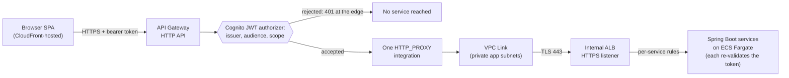

# api-gateway-http

Terraform module provisioning the public edge of the migrated CardDemo system:
the single internet-facing entry point through which a browser reaches the
services that replace the CICS online transactions.

**Source of truth.** The shape of this module is fixed by the migration's
infrastructure catalogue, which specifies it as an HTTP API, a Cognito JWT
authorizer and a VPC Link, and by two of the migration's recorded decisions —
D6 (API and user interface) and D8 (security and identity). The behaviour it
fronts is specified by the COBOL baseline under `app/**`, which this document
cites by path and line and never modifies.

> Where this README and this module's `.tf` files disagree, **the `.tf` files
> are authoritative.** The README is corrected to match the code, never the
> other way round. Everything inside the terraform-docs markers near the end of
> this file is generated from those files and drift-checked in CI, so the two
> halves cannot diverge silently; the hand-written prose above it carries the
> reasoning no generator can produce.

**Why this file exists.** HCL has no docstring construct, so the project's
explainability rule is discharged for Terraform in two halves: a file-header
comment block, a `description` on every variable and output and a why-comment on
each non-obvious argument make up the in-code half, and this README makes up the
prose half, under the category names
[`docs/CODE_DOCUMENTATION_STANDARD.md`](../../../docs/CODE_DOCUMENTATION_STANDARD.md)
fixes.

---

## 1. What this module provisions

Ten resources that only make sense as a set, in the order they appear in
[`main.tf`](main.tf):

1. `aws_apigatewayv2_api.this` — the HTTP API, which also carries the
   cross-origin contract a browser preflights against.
2. `aws_apigatewayv2_authorizer.jwt` — the Cognito JWT authorizer, which takes
   the caller's bearer token from the `Authorization` header and validates it
   against the pool issuer and the accepted audience.
3. `aws_vpc_security_group_egress_rule.vpc_link_to_alb_https` — the link's only
   egress: TCP 443 within the load balancer's group, which the link shares.
4. `aws_vpc_security_group_ingress_rule.alb_from_vpc_link_https` — the matching
   ingress on that group, admitting that one group and nothing else.

   Refactoring Rationale: this module used to create a dedicated
   `aws_security_group.vpc_link` as well, described here as "created here rather
   than shared with the application tasks". It is withdrawn. With the network
   module's own group for the interface-endpoint ENIs, the delivered topology
   carried **five** functional security groups against a design that freezes the
   count at three (AAP section 0.5.1.12), and this module's group was one of the
   two that broke it. The link now attaches to `var.alb_security_group_id`, so
   the flow it needs is a self reference on that group. The property the old
   comment was defending — that no link can be pointed at a group whose matching
   destination rule is absent — is preserved, because both halves are still
   declared here and the link is now attached to the very group carrying them.
   Trade-offs: the link's ENIs inherit the ALB group's egress to the
   application tier on the container port. They forward only to the configured
   private integration, so that inherited permission reaches nothing they
   initiate; the compensating control is that both roles of the group are named
   in the network module's README flow table rather than left to be inferred.
5. `aws_apigatewayv2_vpc_link.this` — the private path into the application
   subnets.
6. `aws_apigatewayv2_integration.alb` — one `HTTP_PROXY` integration onto the
   internal listener, reached over TLS.
7. `aws_apigatewayv2_route.service` — the authorizer-guarded routes, one
   instance per published route key.
8. `aws_apigatewayv2_route.public` — the closed set of routes that must answer
   before a token exists (§1.1).
9. `aws_cloudwatch_log_group.access` — the destination for the stage's access
    log.
10. `aws_apigatewayv2_stage.this` — the single stage, which binds access
    logging and the throttle limits to everything above.

Refactoring Rationale: this heading said eleven while the list below it — and
[`main.tf`](main.tf) — carried ten. The count was correct before the withdrawal
recorded under item 4 removed `aws_security_group.vpc_link`, and the enumeration
was updated at the time while the number above it was not. The two now agree, and
the generated Resources table below — which terraform-docs derives from the HCL
rather than from this prose — is the third place to check them against; it lists
the same ten.

The request path, end to end:



Seven of the eight migrated services are published here — auth, accounts,
cards, transactions, reference, authorizations and reports. Two of those seven
own a second top-level path segment, because their own OpenAPI contract
publishes one: `card-service` serves its administrative card-detail read at
`/api/v1/admin/cards/{cardKey}` beside the card subtree at `/api/v1/cards`,
and `transaction-service` serves its single bill-payment operation at
`/api/v1/billpay` beside `/api/v1/transactions`. Assumptions: a route key is
required for every segment a contract publishes, not for every service — an
operation a contract publishes at a segment absent from the authorized route
list is answered by this API's own 404 with no integration attempted, so the
service appears not to implement it while running perfectly. Auth-service is
deliberately *not* one of the two: its five user-administration operations are a
subtree of its own prefix, at `/api/v1/auth/users` and
`/api/v1/auth/users/{userId}`, so the greedy `ANY /api/v1/auth/{proxy+}` key
already reaches every one of them and no second segment is needed.
Refactoring Rationale: this paragraph previously named auth-service as one of
the two and placed user administration at a top-level `/api/v1/users`. Both
halves were wrong, and the pairing made the error self-consistent enough to
survive a reading: `services/auth-service/src/main/resources/openapi/auth-api.yaml`
publishes those operations beneath `/api/v1/auth`, `SecurityConfig` gates them
at `/api/v1/auth/users` and `/api/v1/auth/users/**`, and the `/api/v1/users`
pair this text described was withdrawn from the authorized route list precisely
because it named an address no contract publishes (see the withdrawal note in
`variables.tf`). The second-segment owner is card-service, which acquired
`/api/v1/admin/cards` in the same correction. `batch-service` is
deliberately absent because it has no load-balancer target to route to; it is
reached only by the batch orchestrator's synchronous run-task call.
Assumptions: that absence is enforced rather than merely intended — the
authorized route list carries a validation rejecting any `/batch` route
outright, and the public route list admits no path prefix other than `/auth`.

### 1.1 How the authorizer guarantee is enforced

Every route built from the authorized route list carries the JWT authorizer and
a required scope. That is not left to an author's care: the resource declares a
`lifecycle` postcondition asserting that its own `authorization_type` resolved
to `JWT` and that an authorizer id is attached, so an edit that detached the
authorizer fails the apply with a message naming the offending route key and
redirecting the author to the public route list.

Exactly four route keys are published without the authorizer. Three of them are
the operations that issue or renew a token — sign-on, challenge and refresh —
and the fourth REVOKES one: sign-out asks the pool to invalidate the refresh
token a session renews from, and possession of that token is the only authority
a caller could present for revoking it, so demanding a live access token as well
would refuse the revocation exactly when the session it ends has been abandoned
rather than closed. That set is closed by two input validations. The first
admits only those four exact method-and-path literals, refusing `ANY` and every
greedy matcher. The second requires the public and authorized lists to be
disjoint, because an HTTP API accepts each route key once and a key in both
lists would otherwise publish one path twice with conflicting protection.

Alternatives Considered: attaching the authorizer to sign-on as well, so that
"every route is authorized" would hold with no exception at all. It deadlocks
the surface — sign-on is the operation that mints the token every other route
requires, so demanding a token to reach it means no caller can ever obtain one.
Trade-offs: those four routes are the residual exposure this design accepts,
and it is narrowed rather than waved away — a closed literal allow-list,
restricted to `POST` on exact paths, each given a per-route throttle an order of
magnitude tighter than the authorized default, and each forced to emit its own
metrics so abuse is visible per route.

---

## 2. Why an HTTP API with a JWT authorizer at the edge

Two recorded decisions meet in this module.

### 2.1 Decision D6 — REST/JSON, over an HTTP API

Alternatives Considered: gRPC was evaluated for the service surface and not
chosen. REST/JSON is directly consumable by a browser SPA and by the existing
external integrations, whereas gRPC would require a proxy for browser traffic
with no offsetting gain — the migration would take on a translation hop and
still be speaking JSON to the browser on the far side of it.

Alternatives Considered: within API Gateway, a REST API (the v1 product) was
evaluated against an HTTP API (v2) and not chosen. An HTTP API has a native JWT
authorizer, so validating a Cognito access token requires no Lambda authorizer
function to write, deploy, grant permissions to and pay for on every request;
and its per-request charge is lower. The v1 capabilities that account for its
price — request and response transformation, per-method models and validators,
and WAF association at the stage — are ones this edge does not use: each
service owns its own request validation, and the only mapping performed here is
a single header stamp (§8.1).

Recorded in [ADR-006](../../../docs/adr/ADR-006-api-and-ui.md).

### 2.2 Decision D8 — authenticate at the edge

Authenticating at the edge means the services validate an already-signed token
instead of each implementing its own sign-on.

Refactoring Rationale: this replaces a specific mechanism, and the mechanism is
the whole point. The baseline online programs are pseudo-conversational — the
task ends at every screen turn, so continuity between turns travels in a
communication area that the terminal echoes back on the next turn, including
the user type that decides whether the administrative menu is reachable.
Because that area is storage the client returns, a client could in principle
assert its own user type. In the target the client cannot assert anything: the
group claim sits inside a token signed by the user pool, the authorizer
verifies that signature against the issuer and audience before the request
leaves the edge, and a caller who edits the claim invalidates the signature.

Assumptions: the required scope does work that the issuer and audience checks
do not. A user pool mints both access tokens and identity tokens, signed by the
same issuer for the same audience, so issuer and audience alone admit either
one. Only an access token carries a `scope` claim, so requiring the pool's
interactive sign-in scope rejects the identity token — which describes who the
user is and is not an authorization credential.

The edge authorizer does not replace per-service validation. Each service is
also an OAuth2 resource server and validates the same token independently.
Assumptions: the threat that makes the duplication worth its cost is a caller
already inside the VPC reaching the internal load balancer directly, which
bypasses the edge entirely; without the second check, that caller would be
unauthenticated against every service.

### 2.3 Why the VPC Link exists

The load balancer is internal and publishes no public listener, and a VPC Link
is the only way an HTTP API reaches it.

Alternatives Considered: giving the load balancer a public listener and
pointing the API at it, or letting the browser call it directly. Both are
rejected on the same concrete ground — a publicly reachable listener exposes
the service tier and lets a caller reach the services without passing the
authorizer, which is exactly the property §2.2 exists to establish.
Assumptions: the link places its network interfaces in the private application
subnets, alongside the tasks they serve, so the hop never traverses a public
subnet; and reachability is narrowed to a single group pair, because the link
attaches to the load balancer's own group (`var.alb_security_group_id`) and this
module declares both halves of the one flow it needs — a 443 egress rule and the
matching ingress rule on that group — rather than widening the application task
group.

Refactoring Rationale: this paragraph said the module "creates a dedicated
security group whose only egress is 443". That group was withdrawn for the reason
recorded under item 4 of §1 — it took the delivered topology to five functional
security groups against the three AAP §0.5.1.12 freezes — and the `vpc_id` input
it needed went with it, which is why the input table above no longer lists one.
The narrowing property the sentence was defending is unchanged: the link's
reachable destination is still exactly one group pair on one port.

Recorded in [ADR-008](../../../docs/adr/ADR-008-security-and-identity.md).

### 2.4 One integration, an exact origin list, and a `$default` stage

Alternatives Considered: one integration per service, so each bounded context
had its own target. Rejected as duplication with no added control — the
internal load balancer already performs per-service dispatch from its own
listener rules, so a second copy of that routing table here would have to be
kept in step with it, and a disagreement between the two would present as a
request arriving at the wrong service. One integration keeps the dispatch
decision in exactly one place.

Alternatives Considered: a wildcard cross-origin allow-list. Rejected because a
wildcard would let any site a signed-in user happens to visit issue
cross-origin calls to this API from their browser. The allow-list therefore
holds exact origins supplied by the caller — in practice the distribution
serving the SPA — and the module validates their shape rather than accepting a
free-form string.

Assumptions: the stage is named `$default`, the reserved name for a stage that
serves requests with no stage path segment, which keeps the published base URL
free of a stage prefix so the endpoint the SPA is configured with is the
endpoint clients call. Trade-offs: a single stage means environment separation
comes from deploying the whole module twice rather than from two stages on one
API. That is consistent with `dev` and `prod` being separate Terraform roots,
and it avoids one API whose two stages would share an authorizer, a throttle
budget and a log group.

---

## 3. The identity contract it enforces

The authorizer validates tokens minted by the user pool the `cognito` module
creates. The mapping from the baseline's own authorization model is direct:

| Baseline | Target |
|---|---|
| `SEC-USR-TYPE` value `'A'`, declared `PIC X(01)` at [`app/cpy/CSUSR01Y.cpy:L22`](../../../app/cpy/CSUSR01Y.cpy) | Cognito group `carddemo-admin` |
| `SEC-USR-TYPE` value `'U'`, the same field | Cognito group `carddemo-user` |
| The online program's own test of that field | The `cognito:groups` claim, converted to Spring Security authorities by `common-lib`'s `JwtRoleConverter` |

Administrative routes are guarded by the claim, never by a client-supplied
field. Assumptions: the claim is trustworthy precisely because it is inside the
signed token the authorizer has already verified, which is the substitution
§2.2 describes.

Assumptions: one baseline field is deliberately not carried forward. The user
record declares an eight-character password at
[`app/cpy/CSUSR01Y.cpy:L21`](../../../app/cpy/CSUSR01Y.cpy). The target keeps
only a subject reference to the pool and no password column at all, so this
edge never handles a credential of its own. That decision belongs to
[ADR-008](../../../docs/adr/ADR-008-security-and-identity.md) and is not
re-argued here.

---

## 4. Baseline lineage

This module is net-new — the transformation plan records no source file for it,
because the baseline expresses its public surface in a CICS resource definition
rather than in program code. The nearest analogue is nonetheless exact.
[`app/csd/CARDDEMO.CSD`](../../../app/csd/CARDDEMO.CSD) defines eighteen
`DEFINE TRANSACTION(<id>) … PROGRAM(<name>)` pairs between L306 and L480, from
`CAUP` → `COACTUPC` (L306 and L308) through `CU03` → `COUSR03C` (L479–L480),
and that set of pairs was the region's dispatch surface — the role the route
table plays here. Among them, L378–L379 defines `TRANSACTION(CC00)` with
`PROGRAM(COSGN00C)`, the sign-on transaction reached with no prior identity,
which is the position the JWT authorizer and the pre-token sign-on route occupy
in the target. Each of those eighteen stanzas also carries
`RESSEC(NO) CMDSEC(NO)` — for example at L314 and at L486 — so resource- and
command-level security were both switched off in that region. These are
checkable facts about a working system that keeps running: the migration adds a
path, it does not remove one, and `app/**` is cited by path and line and never
edited.

---

## 5. Usage

This is a **module, not a root.** It is never applied directly. An environment
root calls it, and it is validated transitively when that root is initialised
and validated.

```hcl
# WHAT: call the edge module from an environment root, wiring every
#       cross-module value from the sibling module that produces it.
# WHY : Assumptions: (1) every value below is a reference rather than a literal, so no
#       account-specific identifier — issuer, client id, listener, subnets or
#       groups — is ever written into this tree; (2) the two throttle inputs
#       and the retention input are left at their defaults here because they
#       are the levers on which dev and prod are allowed to differ, so a root
#       passes them only where it needs a value other than the default.
module "api_gateway" {
  source = "../../modules/api-gateway-http"

  name_prefix                 = var.name_prefix
  environment                 = var.environment
  cognito_issuer_uri          = module.cognito.issuer_uri
  cognito_app_client_ids      = [module.cognito.user_pool_client_id]
  route_authorization_scopes  = module.cognito.interactive_route_authorization_scopes
  alb_listener_arn            = module.alb.https_listener_arn
  private_app_subnet_ids      = module.network.private_app_subnet_ids
  alb_security_group_id       = module.network.alb_security_group_id
  spa_cors_allow_origins      = [local.spa_origin]
  log_retention_days          = var.log_retention_days
  access_log_kms_key_arn      = module.kms.s3_key_arn
  integration_tls_server_name = local.internal_service_dns_name
}
```

Refactoring Rationale: this example passed `vpc_id = module.network.vpc_id`, and
the module declares no such variable — it went out with the security group
described under item 4 of §1, so a root that copied this block verbatim would have
failed `terraform validate` with "An argument named vpc_id is not expected here".
The block above is now the exact argument set both environment roots pass, which
is the only version of a usage example that is worth having.

Three things this folder deliberately does not contain:

- **No `provider` block.** Provider configuration — region, credentials,
  `default_tags` — belongs to the calling root. Assumptions: a provider block
  inside a shared module would fight the caller's own configuration and would
  stop the module being instantiated against an aliased provider, so a second
  instance elsewhere could not be expressed at all.
- **No `backend` block.** State belongs to the calling root, which points at
  the remote-state backend that `infra/bootstrap` provisions. A module has no
  state of its own to configure.
- **No `terraform.tfvars`.** Values belong to `infra/envs/dev` and
  `infra/envs/prod`. That is what keeps this folder a pure function of its
  inputs and keeps the two environments differing only in the parameters they
  pass.

Trade-offs: the first of those has a consequence for tagging that is easy to
miss. Because there is no provider block here there is no provider
`default_tags` to inherit, so `tags` is the only tag channel available and is
merged onto each taggable resource individually. Four of the ten resources
accept tags — the API, the VPC Link, the log group and the stage. The two
security-group rules, the authorizer, the integration and both route resources
expose no `tags` argument at all, so their absence from the tag set is the
provider's shape rather than an omission here.

Refactoring Rationale: this sentence read "five of the eleven … the API, the
dedicated security group, the VPC Link, the log group and the stage", and the
dedicated security group is the resource withdrawn under item 4 of §1. Both
figures and the member list were counted from `main.tf` again rather than
decremented, because a stale total and a stale member are two different errors
and correcting one by arithmetic leaves the other.

### 5.1 Where the operator commands live

There is no `terraform apply` to run in this directory, and none is documented
here. The deploy sequence — bootstrap the remote state once, then initialise,
plan to a saved file, and apply that saved file for one environment root — and
the teardown sequence, which runs in reverse with the bootstrap removed last,
live in [`infra/README.md`](../../README.md),
[`docs/runbooks/deploy.md`](../../../docs/runbooks/deploy.md) and
[`docs/runbooks/teardown.md`](../../../docs/runbooks/teardown.md).
Assumptions: those documents hold the single copy on purpose. Repeating an
apply sequence in nineteen module READMEs would create nineteen copies to keep
in step, and the first one to fall behind would be the one an operator happened
to open.

---

## 6. Inputs it consumes, and where each comes from

Every cross-module value arrives as a variable, supplied by the environment
root. The generated Inputs table below the marker is the exhaustive contract —
each name, type, default and whether it is required. This section records
provenance instead: which sibling produces a value, and what it controls.

| Input | Produced by | What it controls |
|---|---|---|
| `cognito_issuer_uri` | `cognito` | The issuer whose signature the authorizer validates a token against |
| `cognito_app_client_ids` | `cognito` | The accepted audience; a token minted for another client is rejected |
| `route_authorization_scopes` | `cognito` | The scope every authorized route requires, which is what rejects an identity token |
| `alb_listener_arn` | `alb` | The private integration's target — the internal HTTPS listener |
| `private_app_subnet_ids` | `network` | Where the VPC Link places its network interfaces |
| `alb_security_group_id` | `network` | The group the VPC Link attaches to, which this module's egress rule targets and whose matching ingress rule it owns |
| `spa_cors_allow_origins` | `cloudfront-spa` | The exact browser origins permitted to call this API |
| `access_log_kms_key_arn` | `kms` | The customer-managed key encrypting the access-log group |
| `integration_tls_server_name` | the environment root | The name verified against the certificate the internal listener presents |
| `log_retention_days`, the four throttle limits, `detailed_metrics_enabled` | the environment root | The narrow set of levers on which `dev` and `prod` differ |
| `name_prefix`, `environment`, `tags` | the environment root | Naming and tagging of every resource this module creates |
| `route_keys`, `public_route_keys`, the CORS method, header, expose and max-age inputs, `integration_timeout_milliseconds`, `stage_name` | defaults in this module | The published surface and the edge's protocol behaviour; a root may override without editing the module |

Alternatives Considered: resolving these by `data` lookup, or calling the
sibling modules from here. Both are rejected. A lookup would couple this folder
to another module's internal resource names, so a rename next door would break
this module, and it would make the folder unplannable without live credentials
because a lookup has to reach the account. Nesting the sibling calls here would
make this module own resources it does not create, and would stop it being
reusable against infrastructure it did not build.

Trade-offs: passing everything in makes the argument list long and moves the
wiring out to the root. Accepted for two returns — the whole dependency graph
is readable in one file rather than inferred across sixteen modules, and this
module stays usable against a pre-existing user pool or load balancer.

---

## 7. What it publishes

Five outputs, each described in [`outputs.tf`](outputs.tf) and tabulated below
the marker. They fall into three groups:

- **The address.** `api_endpoint_url` is the base HTTPS URL, read from the
  stage's `invoke_url` so it already carries any stage path segment. It is the
  only address the browser SPA is configured with.
- **Identifiers for work done elsewhere.** `api_id`, `stage_name`,
  `authorizer_id` and `vpc_link_id` name this module's resources so dashboards,
  alarms, metric dimensions and any additional rule can reference them without
  rediscovering them.
  Assumptions: `stage_name` is read back from the created stage rather than
  echoed from the input that asked for it, so the published value is the value
  that exists.
- **Nothing else.** Refactoring Rationale: four further outputs stood here and
  were withdrawn — `vpc_link_security_group_id`, `access_log_group_name`,
  `access_log_group_arn` and `public_route_keys` — returning this module to the
  five its contract admits. A repository-wide search confirmed that neither
  environment root and no sibling module referenced any of them, which is the only
  condition under which removing from a one-way contract is safe. Trade-offs: the
  withdrawn `public_route_keys` reported the unauthenticated surface as a list read
  back from the routes actually created, which an input validation cannot match for
  auditability. The exposure is nonetheless bounded at its source instead:
  `var.public_route_keys` admits the four exact `/api/v1/auth` method-and-path
  keys it allows and nothing else, so no plan can widen it. The VPC Link
  security group's single egress rule and the access-log group's retention and
  encryption are both declared in `main.tf`, where they can be read directly.

Module outputs are the only source of runtime endpoints and identifiers in this
migration: **no service hard-codes an endpoint.** The environment root writes
this endpoint to Parameter Store, and the SPA reads it through its documented
environment variables — which is what allows `ui/.env.example` to list a
variable name with no value beside it.

Assumptions: none of the five is marked `sensitive`, and that is deliberate
rather than overlooked. None is a credential; the endpoint is public by
construction, since being callable from a browser is its entire purpose; and an
operator has to be able to read these with `terraform output` to configure a
SPA build. Marking them sensitive would redact them from plan output and from
`terraform output` while protecting nothing.

---

## 8. Validation gates

This module is covered by the gating checks in
[`.github/workflows/infra-ci.yml`](../../../.github/workflows/infra-ci.yml).
None of them tolerates a failure: that workflow contains no `|| true`, no
`continue-on-error` and no ignored exit code.

| Gate | Mechanism |
|---|---|
| Formatting | `terraform fmt -check -recursive` over the package — reports drift and rewrites nothing |
| Syntax and schema | the **calling root's** `terraform init -backend=false` then `terraform validate`; this module is validated transitively, never in isolation |
| Lint | `tflint` against [`../../.tflint.hcl`](../../.tflint.hcl), which fails any variable or output carrying no `description` |
| Documentation drift | `terraform-docs` in check-only mode against [`../../.terraform-docs.yml`](../../.terraform-docs.yml) — a stale generated region fails the build and is never silently rewritten |
| Committed secrets | a scan across migration-owned source |
| Bounded policy exceptions | a step asserting that each declared policy-scan exception is still present, together with the conditions that justified it |
| Policy scan | Checkov, version-pinned, across the whole `infra/` tree against an explicit material-security baseline |

### 8.1 How the policy properties are satisfied

Assumptions: the properties the scan looks for on this directory are satisfied
structurally rather than by suppression — each is an unconditional argument on
a resource, so dropping one requires deleting a visible line.

- **Access logging.** The stage's `access_log_settings` writes to the log group
  this module owns. The format is thirteen named fields: the request and
  extended request identifiers, request time, route key, method, protocol,
  status, response length and latency, the integration's status, latency and
  error message, and the caller's source IP.
- **The correlation seam.** The integration stamps `x-request-id` with the
  edge's own request identifier on the way to the load balancer, and the access
  log records that same identifier. That is what lets an edge log line join to
  the service log lines for one request, which each service's
  `CorrelationIdFilter` then carries into its own logs.
- **What the log deliberately omits.** No `Authorization` header, no token, no
  claim, and no request or response body. Assumptions: this group records every
  request crossing the internet boundary and already retains the caller's
  source IP, so adding a credential or a payload would turn a traffic log into
  a store of secrets and personal data.
- **Throttling.** The stage's `default_route_settings` sets a burst depth and a
  steady rate from inputs, because those are `dev`/`prod` levers, and each
  public route additionally receives a tighter per-route override (§1.1).
- **TLS on both hops.** The client-facing endpoint is HTTPS-only, and the
  integration verifies a server name against the certificate the internal
  listener presents, so neither leg is plaintext.
- **Encryption of the log group.** A customer-managed key is optional in `dev`
  and required in `prod`, enforced by a `lifecycle` precondition on the log
  group rather than by convention. Assumptions: a customer-managed key is what
  makes reading that request history a separately revocable `kms:Decrypt`
  grant, instead of an ambient consequence of holding CloudWatch Logs read
  access.

### 8.2 The one declared exception

One scanned property is not met by every route here, and it is declared rather
than silenced: the check that every route carries an authorizer. The four
unauthenticated routes of §1.1 cannot carry one, so [`main.tf`](main.tf) holds a
single scoped `checkov:skip` for that one check, on that one resource, with its
justification written on the same line.

Assumptions: that skip is not a way to quiet the scanner. Its presence, and the
conditions that make it acceptable — that the public routes come from a
`for_each` over the validated input, and that their authorization type is the
explicit `NONE` — are themselves asserted by the workflow's bounded-exception
step, so removing the justification, widening the exception to a second check,
or moving it to another resource each fail the build. It is the only
policy-scan suppression in this module, and there is no `tflint-ignore`
anywhere in it.

---

## 9. Cost shape

Pricing dimensions and drivers only. No figures are quoted here, and none
should be inferred:

- **The HTTP API is charged per request,** with no charge for an idle API, so
  cost tracks use. That suits a workload whose online traffic follows office
  hours and falls away outside them.
- **The VPC Link is charged per hour for as long as it exists,** independently
  of traffic. It is the one component here with a floor, and that floor is the
  price of keeping the load balancer private (§2.3).
- **The access-log group is charged for ingestion and for storage.** That is
  why retention is an input rather than a constant, and it is one of the narrow
  set of levers on which the two environments are allowed to differ.
- **Per-route metrics are billed per metric.** Trade-offs: detailed metrics are
  on by default and forced on for the public routes, which multiplies the
  metric count by the number of route keys. Accepted, because per-route latency
  and error rates are what make an edge problem attributable to one bounded
  context, and the pre-token routes are the ones whose abuse most needs to be
  visible.

---

## 10. Scope boundary

Deliberately not in this module, each with its reason:

| Not here | Why |
|---|---|
| Custom domain, ACM certificate, Route 53 record | The infrastructure catalogue specifies an HTTP API, a Cognito JWT authorizer and a VPC Link for this module and nothing further; the endpoint it publishes is the address clients use |
| WAF association, usage plan, API key | Not in that specification. A usage plan and API keys also address a different problem — metering named third-party consumers — from the one this edge has, where callers are browser sessions identified by token |
| Lambda authorizer | The native JWT authorizer covers the requirement with no function to write, deploy, permission and pay for (§2.1) |
| Account-level CloudWatch Logs role for API Gateway | That setting is account-wide, and this module may be instantiated more than once in one account, so setting it here would mean two instances contending over a single account-level value. It belongs to the environment root or the `observability` module |
| Blue-green and canary deployment | Out of scope for the migration as a whole; service deployment is rolling only |
| Multi-region and disaster-recovery topology | Out of scope; single region, three availability zones |

The COBOL baseline under `app/**`, the existing test suite under `tests/**`,
`scripts/**` and `samples/**` are reference-only and unmodified. This document
cites the baseline by path and line and changes nothing in it.

---

<!-- BEGIN_TF_DOCS -->
### Requirements

| Name | Version |
|------|---------|
| <a name="requirement_terraform"></a> [terraform](#requirement\_terraform) | >= 1.15.0 |
| <a name="requirement_aws"></a> [aws](#requirement\_aws) | ~> 6.56 |

### Providers

| Name | Version |
|------|---------|
| <a name="provider_aws"></a> [aws](#provider\_aws) | 6.57.1 |

### Resources

| Name | Type |
|------|------|
| [aws_apigatewayv2_api.this](https://registry.terraform.io/providers/hashicorp/aws/latest/docs/resources/apigatewayv2_api) | resource |
| [aws_apigatewayv2_authorizer.jwt](https://registry.terraform.io/providers/hashicorp/aws/latest/docs/resources/apigatewayv2_authorizer) | resource |
| [aws_apigatewayv2_integration.alb](https://registry.terraform.io/providers/hashicorp/aws/latest/docs/resources/apigatewayv2_integration) | resource |
| [aws_apigatewayv2_route.public](https://registry.terraform.io/providers/hashicorp/aws/latest/docs/resources/apigatewayv2_route) | resource |
| [aws_apigatewayv2_route.service](https://registry.terraform.io/providers/hashicorp/aws/latest/docs/resources/apigatewayv2_route) | resource |
| [aws_apigatewayv2_stage.this](https://registry.terraform.io/providers/hashicorp/aws/latest/docs/resources/apigatewayv2_stage) | resource |
| [aws_apigatewayv2_vpc_link.this](https://registry.terraform.io/providers/hashicorp/aws/latest/docs/resources/apigatewayv2_vpc_link) | resource |
| [aws_cloudwatch_log_group.access](https://registry.terraform.io/providers/hashicorp/aws/latest/docs/resources/cloudwatch_log_group) | resource |
| [aws_vpc_security_group_egress_rule.vpc_link_to_alb_https](https://registry.terraform.io/providers/hashicorp/aws/latest/docs/resources/vpc_security_group_egress_rule) | resource |
| [aws_vpc_security_group_ingress_rule.alb_from_vpc_link_https](https://registry.terraform.io/providers/hashicorp/aws/latest/docs/resources/vpc_security_group_ingress_rule) | resource |

### Inputs

| Name | Description | Type | Default | Required |
|------|-------------|------|---------|:--------:|
| <a name="input_alb_listener_arn"></a> [alb\_listener\_arn](#input\_alb\_listener\_arn) | ARN of the internal ALB's HTTPS listener, produced by the `alb` module. Becomes the private integration's `integration_uri`, so it is the one destination every authenticated request is forwarded to across the VPC Link. Shaped `arn:<partition>:elasticloadbalancing:<region>:<aws-account-id>:listener/app/<lb-name>/<lb-id>/<listener-id>`. | `string` | n/a | yes |
| <a name="input_alb_security_group_id"></a> [alb\_security\_group\_id](#input\_alb\_security\_group\_id) | Security group attached to the internal ALB, supplied by the network module. This module attaches the VPC Link to this same group and adds only the self-referencing TCP 443 rule pair the private integration needs, so the topology keeps the three security groups the design freezes rather than adding a fourth for the link. | `string` | n/a | yes |
| <a name="input_cognito_app_client_ids"></a> [cognito\_app\_client\_ids](#input\_cognito\_app\_client\_ids) | Cognito app client ids whose tokens this API accepts, produced by the `cognito` module. Becomes the JWT authorizer's `jwt_configuration.audience`, so a token whose audience claim falls outside this set is rejected at the edge before any integration runs. | `list(string)` | n/a | yes |
| <a name="input_cognito_issuer_uri"></a> [cognito\_issuer\_uri](#input\_cognito\_issuer\_uri) | OpenID Connect issuer URI of the Cognito user pool, produced by the `cognito` module and passed through by the environment root. Becomes the JWT authorizer's `jwt_configuration.issuer`, so it is what every request's token is validated against. Shaped `https://<cognito-issuer>/<user-pool-id>`. | `string` | n/a | yes |
| <a name="input_environment"></a> [environment](#input\_environment) | Deployment environment this instance of the module belongs to, `dev` or `prod`. Composed into every resource name alongside `name_prefix`, and the axis along which the environment roots vary sizing and retention. | `string` | n/a | yes |
| <a name="input_integration_tls_server_name"></a> [integration\_tls\_server\_name](#input\_integration\_tls\_server\_name) | Server name the private integration verifies against the certificate the internal ALB listener presents. REQUIRED with no default: main.tf always emits the integration's tls\_config from it, so every hop from this edge to the load balancer is TLS with the server identity checked. | `string` | n/a | yes |
| <a name="input_private_app_subnet_ids"></a> [private\_app\_subnet\_ids](#input\_private\_app\_subnet\_ids) | Ids of the private application subnets the VPC Link places its network interfaces in, produced by the `network` module. They determine which availability zones the edge can reach the internal ALB from. | `list(string)` | n/a | yes |
| <a name="input_spa_cors_allow_origins"></a> [spa\_cors\_allow\_origins](#input\_spa\_cors\_allow\_origins) | Exact origins permitted to call this API from a browser: the distribution serving the SPA, produced by the `cloudfront-spa` module. Becomes `cors_configuration.allow_origins`, so an origin outside this list fails the browser's preflight. Shaped `https://<distribution-domain>`. | `list(string)` | n/a | yes |
| <a name="input_access_log_kms_key_arn"></a> [access\_log\_kms\_key\_arn](#input\_access\_log\_kms\_key\_arn) | ARN of the customer-managed KMS key encrypting the stage's access-log group, produced by the `kms` module. Null selects the CloudWatch Logs service-managed key instead. | `string` | `null` | no |
| <a name="input_cors_allow_headers"></a> [cors\_allow\_headers](#input\_cors\_allow\_headers) | Request headers a browser may send cross-origin. Becomes `cors_configuration.allow_headers`; every header the SPA sets on an authenticated JSON request has to appear here or the browser withholds the request after the preflight. | `list(string)` | <pre>[<br/>  "authorization",<br/>  "content-type",<br/>  "idempotency-key",<br/>  "if-match",<br/>  "x-correlation-id"<br/>]</pre> | no |
| <a name="input_cors_allow_methods"></a> [cors\_allow\_methods](#input\_cors\_allow\_methods) | HTTP methods advertised to the browser in the preflight response. Becomes `cors_configuration.allow_methods`; the default is the set the migrated services' contracts expose, plus OPTIONS for the preflight exchange itself. | `list(string)` | <pre>[<br/>  "GET",<br/>  "POST",<br/>  "PUT",<br/>  "DELETE",<br/>  "OPTIONS"<br/>]</pre> | no |
| <a name="input_cors_expose_headers"></a> [cors\_expose\_headers](#input\_cors\_expose\_headers) | Response headers a browser is permitted to READ cross-origin. Becomes `cors_configuration.expose_headers`. Defaults to the correlation identifier common-lib's CorrelationIdFilter writes on every response, the entity tag the account view returns as an update precondition, and the location header a report submission returns; without an entry here a header is present on the wire and unreadable from script. | `list(string)` | <pre>[<br/>  "etag",<br/>  "location",<br/>  "x-correlation-id"<br/>]</pre> | no |
| <a name="input_cors_max_age_seconds"></a> [cors\_max\_age\_seconds](#input\_cors\_max\_age\_seconds) | Upper bound, in seconds, on how long a browser may cache this API's preflight response. Becomes `cors_configuration.max_age`. | `number` | `300` | no |
| <a name="input_detailed_metrics_enabled"></a> [detailed\_metrics\_enabled](#input\_detailed\_metrics\_enabled) | Whether the stage emits per-route CloudWatch metrics -- count, latency and 4XX/5XX broken out by route key -- in addition to the API-wide aggregates it emits regardless. | `bool` | `true` | no |
| <a name="input_integration_timeout_milliseconds"></a> [integration\_timeout\_milliseconds](#input\_integration\_timeout\_milliseconds) | Upper bound, in milliseconds, the private integration waits for the internal ALB to respond before the edge abandons the request and returns a gateway timeout. Applied to every integration this module creates. | `number` | `29000` | no |
| <a name="input_log_retention_days"></a> [log\_retention\_days](#input\_log\_retention\_days) | Retention applied to the stage's access-log group in CloudWatch Logs. One of the narrow set of values on which the dev and prod roots deliberately differ; 0 retains log events indefinitely. | `number` | `30` | no |
| <a name="input_name_prefix"></a> [name\_prefix](#input\_name\_prefix) | Leading token of every name this module composes, as `<name_prefix>-<environment>-<resource>`: the HTTP API, the VPC Link, the stage and the access-log group. Supplied by the environment root so a second independent copy of the stack can stand up in one account without colliding on a name. | `string` | `"carddemo"` | no |
| <a name="input_public_route_keys"></a> [public\_route\_keys](#input\_public\_route\_keys) | Route keys created WITHOUT the JWT authorizer, for paths a caller must reach when it holds no usable access token. Defaults to the FOUR token-lifecycle operations of auth-service -- POST /api/v1/auth/signon, POST /api/v1/auth/challenge, POST /api/v1/auth/refresh and POST /api/v1/auth/signout -- because a caller cannot present the token the first three exist to issue or renew, and the fourth is authorised by the very refresh token it revokes. All four are contracted as public operations in services/auth-service/src/main/resources/openapi/auth-api.yaml -- each declares an empty security requirement and x-required-authority none -- and the same four are the chain's open list in that service's SecurityConfig, which its contract test asserts equals the contract's own public set. The three lists are therefore the same four keys in all three places, and a route published here that is not open in both of the others would be reachable at the edge and refused by the service. The validation below admits those four keys and nothing else. Set to an empty list to publish no unauthenticated route. Every other route on this API comes from var.route\_keys and carries the authorizer. | `list(string)` | <pre>[<br/>  "POST /api/v1/auth/signon",<br/>  "POST /api/v1/auth/challenge",<br/>  "POST /api/v1/auth/refresh",<br/>  "POST /api/v1/auth/signout"<br/>]</pre> | no |
| <a name="input_public_route_throttling_burst_limit"></a> [public\_route\_throttling\_burst\_limit](#input\_public\_route\_throttling\_burst\_limit) | Token-bucket depth for the unauthenticated routes in public\_route\_keys, applied as a per-route override on the stage. Deliberately far below throttling\_burst\_limit because an anonymous route is reachable without any credential. | `number` | `20` | no |
| <a name="input_public_route_throttling_rate_limit"></a> [public\_route\_throttling\_rate\_limit](#input\_public\_route\_throttling\_rate\_limit) | Steady-state requests per second sustained on the unauthenticated routes in public\_route\_keys, applied as a per-route override on the stage. Deliberately far below throttling\_rate\_limit for the same reason as its burst counterpart. | `number` | `10` | no |
| <a name="input_route_authorization_scopes"></a> [route\_authorization\_scopes](#input\_route\_authorization\_scopes) | Scopes every route requires in the token's scope claim, applied by main.tf to each route's authorization\_scopes. Defaults to the Cognito user pool's built-in aws.cognito.signin.user.admin scope, which is the scope an interactively signed-in access token carries and which an identity token carries not at all, so the requirement rejects the wrong token kind at the edge. | `list(string)` | <pre>[<br/>  "aws.cognito.signin.user.admin"<br/>]</pre> | no |
| <a name="input_route_keys"></a> [route\_keys](#input\_route\_keys) | HTTP API route keys to create, each attached to the JWT authorizer AND given var.route\_authorization\_scopes by main.tf. Every key is versioned under the published `/api/v1` path prefix. The default exposes the SEVEN online bounded contexts, most as a matched pair of keys -- the bare collection prefix and the greedy subtree beneath it -- under path segments matching the SPA's API client modules. One context publishes a SECOND top-level segment because its own OpenAPI contract does: transaction-service serves its single bill-payment operation at `/api/v1/billpay`, which is consequently a bare key with no greedy sibling. card-service is the one context with a THIRD key beneath its own prefix rather than a pair: `/api/v1/cards/lookup` is a static sibling of the `{cardKey}` variable key, and it exists because that contract takes its one card-number input in a request body instead of in a target. auth-service needs no second segment -- it serves sign-on, the challenge and renewal exchanges and all five user-administration operations beneath `/api/v1/auth`, which the greedy auth key already covers. batch-service is deliberately absent: it has no ALB target to route to. An environment root may extend the list without editing the module. reporting-service publishes NO second top-level segment: its statement operations are declared at `/api/v1/reports/statements` and `/api/v1/reports/statements/transactions` by its own OpenAPI contract, so the greedy reports key already covers them and a separate `/api/v1/statements` key would forward a prefix no service answers. | `list(string)` | <pre>[<br/>  "ANY /api/v1/auth",<br/>  "ANY /api/v1/auth/{proxy+}",<br/>  "ANY /api/v1/accounts",<br/>  "ANY /api/v1/accounts/{proxy+}",<br/>  "ANY /api/v1/cards",<br/>  "ANY /api/v1/cards/lookup",<br/>  "ANY /api/v1/cards/{cardKey}",<br/>  "ANY /api/v1/admin/cards",<br/>  "ANY /api/v1/admin/cards/{cardKey}",<br/>  "ANY /api/v1/transactions",<br/>  "ANY /api/v1/transactions/{proxy+}",<br/>  "ANY /api/v1/billpay",<br/>  "ANY /api/v1/reference",<br/>  "ANY /api/v1/reference/{proxy+}",<br/>  "ANY /api/v1/authorizations",<br/>  "ANY /api/v1/authorizations/{proxy+}",<br/>  "ANY /api/v1/reports",<br/>  "ANY /api/v1/reports/{proxy+}"<br/>]</pre> | no |
| <a name="input_stage_name"></a> [stage\_name](#input\_stage\_name) | Name of the single stage this module creates. `$default` is the reserved name for a stage that serves requests with no stage segment in the path. | `string` | `"$default"` | no |
| <a name="input_tags"></a> [tags](#input\_tags) | Tags merged onto every taggable resource this module creates -- the HTTP API, the stage, the VPC Link and the access-log group. Supplied by the environment root, which owns the tagging scheme. | `map(string)` | `{}` | no |
| <a name="input_throttling_burst_limit"></a> [throttling\_burst\_limit](#input\_throttling\_burst\_limit) | Token-bucket depth applied by default to every route on the stage: how many requests above the steady rate the edge absorbs before it starts rejecting. Shields the seven online services behind it from one client's spike. | `number` | `200` | no |
| <a name="input_throttling_rate_limit"></a> [throttling\_rate\_limit](#input\_throttling\_rate\_limit) | Steady-state request rate, in requests per second, the stage sustains by default on every route. Applied together with throttling\_burst\_limit as the rate at which the bucket refills. | `number` | `100` | no |

### Outputs

| Name | Description |
|------|-------------|
| <a name="output_api_endpoint_url"></a> [api\_endpoint\_url](#output\_api\_endpoint\_url) | Base HTTPS URL of this API, read from the stage's `invoke_url` so it already carries any stage path segment. The front door for every published CardDemo service and the only address the browser SPA is given: the environment root writes it to Parameter Store, and the SPA reads it from there as `VITE_API_BASE_URL`. Shaped `<api-id>.execute-api.<region>.amazonaws.com` for the reserved `$default` stage, where both bracketed parts are placeholders. |
| <a name="output_api_id"></a> [api\_id](#output\_api\_id) | Provider-assigned identifier of the HTTP API, from `aws_apigatewayv2_api.this.id`. An opaque short string and not an address -- `api_endpoint_url` above is what a client calls. Consumed wherever the API must be NAMED rather than reached: associating a resource this module does not create, scoping an IAM condition to this one API, or locating it in the console. |
| <a name="output_authorizer_id"></a> [authorizer\_id](#output\_authorizer\_id) | Identifier of the Cognito JWT authorizer, from `aws_apigatewayv2_authorizer.jwt.id`. Names the check that validates a caller's bearer token against the pool issuer and the accepted audience at the edge, before a request reaches any integration. Consumed by a caller attaching this same authorizer to a route created outside this module, so that route is validated identically. |
| <a name="output_stage_name"></a> [stage\_name](#output\_stage\_name) | Name of the stage that was created, read back from `aws_apigatewayv2_stage.this.name` rather than echoed from the input that asked for it. Consumed to address the stage in a CloudWatch metric dimension or a stage-scoped API call; when it is the reserved `$default` it contributes no path segment, which is why the endpoint above needs no rewriting. |
| <a name="output_vpc_link_id"></a> [vpc\_link\_id](#output\_vpc\_link\_id) | Identifier of the VPC Link, from `aws_apigatewayv2_vpc_link.this.id`. Names the private path this API takes into the application subnets to reach the internal load balancer, which is what keeps every service off the public internet. Consumed by a caller adding a further private integration that should reuse this link rather than provision a second one. |
<!-- END_TF_DOCS -->

---

## References

| Document | What it covers |
|---|---|
| [`infra/README.md`](../../README.md) | The infra package guide: directory layout, module index, version constraints, static validation, and the exact deploy and teardown command sequences |
| [`infra/.tflint.hcl`](../../.tflint.hcl) | The HCL lint gate — the mechanical half of the documentation obligation |
| [`infra/.terraform-docs.yml`](../../.terraform-docs.yml) | The generated-documentation gate, including the marker contract this file honours |
| [`docs/adr/ADR-006-api-and-ui.md`](../../../docs/adr/ADR-006-api-and-ui.md) | Decision D6 — API style and user interface |
| [`docs/adr/ADR-008-security-and-identity.md`](../../../docs/adr/ADR-008-security-and-identity.md) | Decision D8 — networking, security and identity |
| [`docs/architecture/security-and-identity.md`](../../../docs/architecture/security-and-identity.md) | The full network and identity inventory |
| [`docs/runbooks/deploy.md`](../../../docs/runbooks/deploy.md) | Exact operator deploy commands |
| [`docs/runbooks/teardown.md`](../../../docs/runbooks/teardown.md) | Exact operator teardown commands |
| [`docs/CODE_DOCUMENTATION_STANDARD.md`](../../../docs/CODE_DOCUMENTATION_STANDARD.md) | The documentation convention this file follows, including the four rationale labels |
| [`MIGRATION_README.md`](../../../MIGRATION_README.md) | Top-level build, deploy, run, migrate data, validate and roll back guide |
