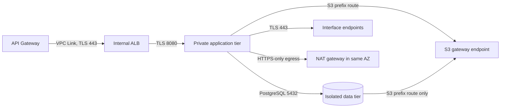

# Network module

This reusable Terraform module provisions the CardDemo VPC boundary defined by
AAP sections 0.4.1.6, 0.4.1.9, and 0.5.1.12: three availability zones, public,
private-application, and isolated-data subnet tiers, per-zone NAT egress, eight
interface endpoints, an S3 gateway endpoint, security groups, and encrypted VPC
flow logs. The security rationale is fixed by AAP decision D8 and expanded in
the existing
[security architecture](../../../docs/architecture/security-and-identity.md);
the Terraform module convention is fixed by AAP decision D9.

This README is the prose half of Rule 1 Explainability and is required by AAP
section 0.2.1.6. The mechanical half is enforced by
[TFLint](../../.tflint.hcl) and the
[terraform-docs configuration](../../.terraform-docs.yml). The four Terraform
files are the executable source of truth. `app/csd/CARDDEMO.CSD` is read-only
lineage; the migration adds this network path beside the existing mainframe
path and does not modify it.

## Topology

| Tier | Internet route | Occupants | Output |
|---|---|---|---|
| Public | Default route to the internet gateway | Internal ALB nodes and one NAT gateway per zone | `public_subnet_ids` |
| Private application | Default route to that zone's NAT gateway | ECS tasks, API Gateway VPC Link interfaces, interface endpoint ENIs | `private_app_subnet_ids` |
| Isolated data | None | Aurora PostgreSQL | `isolated_data_subnet_ids` |

The load balancer is internal even though it is placed in public subnets:
`internal = true` in the ALB module withholds public addresses and a public DNS
name. Public subnets describe routing, not direct reachability of every resource
inside them.



### Private AWS service paths

| Endpoint | Consumer |
|---|---|
| `ecr.api` | Authorises container-image pulls |
| `ecr.dkr` | Transfers container-image layers |
| `logs` | Delivers container and workflow logs |
| `secretsmanager` | Retrieves generated service credentials |
| `kms` | Performs envelope-encryption operations |
| `sqs` | Carries authorization, inquiry, and error messages |
| `states` | Starts workflows from reporting and supports orchestration calls |
| `ssm` | Reads runtime configuration and the batch read-only flag |
| S3 gateway | Routes dataset and statement object traffic through route-table prefix entries, with no endpoint ENI or hourly interface-endpoint charge |

Assumptions: the endpoint set is identical in dev and prod. Removing one
does not produce a cleanly degraded topology; it silently sends that service's
traffic through NAT. `interface_endpoint_services` is therefore validated
against the exact eight-entry set rather than treated as an environment lever.

## Module boundary and usage

This directory is a module, not a root. It declares no provider block, backend,
or call to a sibling module. `infra/envs/dev` and `infra/envs/prod` inherit the
root provider's Region and default tags and call this module with
`source = "../../modules/network"`.

```hcl
module "network" {
  source = "../../modules/network"

  name_prefix                = var.name_prefix
  environment                = var.environment
  vpc_cidr                   = var.vpc_cidr
  flow_log_retention_days    = var.log_retention_days
  flow_log_kms_key_arn       = module.kms.s3_key_arn
  interface_endpoint_services = [
    "ecr.api",
    "ecr.dkr",
    "logs",
    "secretsmanager",
    "kms",
    "sqs",
    "states",
    "ssm",
  ]
  tags = var.tags
}

module "service" {
  source = "../../modules/ecs-service"

  vpc_id                  = module.network.vpc_id
  private_app_subnet_ids  = module.network.private_app_subnet_ids
  security_group_ids      = [module.network.app_security_group_id]
  container_port          = module.network.app_container_port
  # Other service inputs omitted from this focused wiring example.
}

module "database" {
  source = "../../modules/aurora-postgresql"

  subnet_ids         = module.network.isolated_data_subnet_ids
  security_group_ids = [module.network.data_security_group_id]
  port               = module.network.database_port
  # Other database inputs omitted from this focused wiring example.
}
```

Refactoring Rationale: the two ports are module outputs even though they
begin as inputs. The environment root passes those outputs into the service and
database modules, making the security-group rule and the listener it admits one
contract rather than three repeated literals.

## Consumer contract

Renaming or removing an output is a breaking change for the consumers below.

| Output | Consumers |
|---|---|
| `vpc_id` | ALB, API Gateway, Aurora, observability |
| `vpc_cidr_block` | ALB, API Gateway, Aurora |
| `availability_zones` | Aurora and environment-root inventory |
| `public_subnet_ids` | ALB |
| `private_app_subnet_ids` | ECS services, API Gateway VPC Link, batch tasks |
| `isolated_data_subnet_ids` | Aurora |
| `alb_security_group_id` | ALB and API Gateway VPC Link |
| `app_security_group_id` | ECS services and Step Functions Fargate tasks |
| `data_security_group_id` | Aurora |
| `public_route_table_id` | Environment-root inventory |
| `private_app_route_table_ids` | Environment roots and S3 dataset wiring |
| `isolated_data_route_table_ids` | Environment-root inventory |
| `nat_gateway_ids` | Observability and environment-root inventory |
| `nat_gateway_public_ips` | Operator allow-list inventory |
| `interface_vpc_endpoint_ids` | Observability and environment-root inventory |
| `s3_gateway_endpoint_id` | S3 datasets and batch orchestration |
| `app_container_port` | Every ECS service module call |
| `database_port` | Aurora module call |

The module does not publish its endpoint security group, flow-log IAM role, or
internet gateway. No sibling attaches to those resources; publishing them would
create a second owner for an internal boundary.

## Deliberate decisions

1. **Isolated data has no default route.** Alternatives Considered: placing
   Aurora in the private-application tier. Rejected because no route is a
   routing fact that survives a security-group or credential mistake.
   Trade-offs: direct operator egress and package access from the data tier
   are unavailable.
2. **One NAT gateway is created per zone.** Alternatives Considered: one
   shared gateway to reduce the largest fixed network cost. Rejected because a
   zone loss would remove egress from every zone, and a differently shaped dev
   network would not validate prod.
3. **Four security groups are created and three are published.** `alb`, `app`
   and `data` are published for the sibling modules that attach to them;
   `vpc_endpoints` is attached by this module alone to the interface-endpoint
   ENIs and is therefore internal. An interface endpoint must carry a group, so
   the application-to-endpoint flow has to terminate somewhere. Alternatives
   Considered: reusing the application group, which needs a self-referencing 443
   rule that would also permit task-to-task TLS; or reusing the ALB group, which
   needs an application-to-ALB 443 rule that would let every task reach the edge
   listener group. Both widen a flow beyond the three this topology allows.
   Trade-offs: one more group to reason about, accepted in exchange for a rule
   set in which each permitted flow has exactly one source and one destination.
4. **The application group's egress is enumerated, not implicit.** Only the two
   named destinations are reachable — Aurora on `database_port` and the endpoint
   group on 443. An earlier revision also carried an egress rule to `0.0.0.0/0`
   on 443, which was a fourth flow beyond the three this topology allows; it was
   removed. Trade-offs: any future outbound dependency has to arrive as a named
   rule visible in a plan diff rather than being absorbed by an allow-all
   default. There is no `0.0.0.0/0` ingress rule on any group. The edge-to-ALB
   rule is not authored here either: the VPC Link carries its own group, which
   `api-gateway-http` creates and uses to open this module's ALB group, so
   declaring it here would close a cycle between the two modules.
5. **No subnet auto-assigns a public address.** The NAT gateways allocate their
   own Elastic IPs and the ALB is internal. Enabling auto-assignment would only
   create an unintended public-address path.
6. **S3 uses a gateway endpoint.** Trade-offs: it is a route-table prefix
   entry rather than an ENI with a security group and carries no interface
   endpoint hourly charge. Associating isolated route tables does not create an
   internet path because the route can reach S3 only.
7. **Subnet CIDRs are derived.** Alternatives Considered: three explicit
   lists of CIDRs. Nine hand-maintained blocks can overlap or drift from zone
   order; one `cidrsubnet` arithmetic cannot.
8. **VPC flow logs are owned here.** Their lifecycle follows the VPC, while the
   observability module owns dashboards, alarms, and application log groups.
   `traffic_type = "ALL"` is fixed because accepted-only and rejected-only logs
   each omit half the audit trail.

At the defaults, `10.0.0.0/16` plus four new prefix bits yields sixteen `/20`
blocks. Three zones consume nine: netnums `0..2` public, `3..5` private
application, and `6..8` isolated data. Changing `vpc_cidr` or `subnet_newbits`
after apply replaces every subnet and cascades into the resources placed in
them.

Dev and prod differ here only in `flow_log_retention_days`. Zone count, tier
layout, NAT count, endpoint set, security-group flows, and shared ports are
identical. This implements the AAP constraint that environments differ in
sizing and retention, never topology.

## Validation

All commands below are gating and have no tolerated non-zero return code.

```bash
# WHAT: verify canonical HCL formatting without rewriting committed files.
# WHY : CI checks rather than fixes, so formatting drift is a review failure.
terraform fmt -check -recursive infra/

# WHAT: initialise and validate the module without a backend.
# WHY : provider-schema validation catches invalid arguments before a root plan.
terraform -chdir=infra/modules/network init -backend=false
terraform -chdir=infra/modules/network validate

# WHAT: enforce documented, typed, used declarations and AWS-specific rules.
# WHY : a declared-but-unused contract or an invalid resource argument fails CI.
tflint --chdir=infra/modules/network --config="$(pwd)/infra/.tflint.hcl"

# WHAT: verify the generated reference below still matches the HCL.
# WHY : variable, resource, or output drift makes this README incorrect.
terraform-docs --config infra/.terraform-docs.yml \
  --output-check infra/modules/network
```

The module is authored and statically validated; applying it to a live AWS
account is an operator action outside this scope. It has not been benchmarked or
penetration-tested. The top-level [infrastructure guide](../../README.md)
defines the static-validation and operator boundary; the
[security architecture](../../../docs/architecture/security-and-identity.md)
defines the wider network boundary.

## Generated reference

<!-- BEGIN_TF_DOCS -->
### Requirements

| Name | Version |
|------|---------|
| <a name="requirement_terraform"></a> [terraform](#requirement\_terraform) | >= 1.15.0 |
| <a name="requirement_aws"></a> [aws](#requirement\_aws) | ~> 6.56 |

### Providers

| Name | Version |
|------|---------|
| <a name="provider_aws"></a> [aws](#provider\_aws) | 6.57.1 |

### Resources

| Name | Type |
|------|------|
| [aws_cloudwatch_log_group.flow_logs](https://registry.terraform.io/providers/hashicorp/aws/latest/docs/resources/cloudwatch_log_group) | resource |
| [aws_default_security_group.this](https://registry.terraform.io/providers/hashicorp/aws/latest/docs/resources/default_security_group) | resource |
| [aws_eip.nat](https://registry.terraform.io/providers/hashicorp/aws/latest/docs/resources/eip) | resource |
| [aws_flow_log.this](https://registry.terraform.io/providers/hashicorp/aws/latest/docs/resources/flow_log) | resource |
| [aws_iam_role.flow_logs](https://registry.terraform.io/providers/hashicorp/aws/latest/docs/resources/iam_role) | resource |
| [aws_iam_role_policy.flow_logs](https://registry.terraform.io/providers/hashicorp/aws/latest/docs/resources/iam_role_policy) | resource |
| [aws_internet_gateway.this](https://registry.terraform.io/providers/hashicorp/aws/latest/docs/resources/internet_gateway) | resource |
| [aws_nat_gateway.this](https://registry.terraform.io/providers/hashicorp/aws/latest/docs/resources/nat_gateway) | resource |
| [aws_route.private_app_internet](https://registry.terraform.io/providers/hashicorp/aws/latest/docs/resources/route) | resource |
| [aws_route.public_internet](https://registry.terraform.io/providers/hashicorp/aws/latest/docs/resources/route) | resource |
| [aws_route_table.isolated_data](https://registry.terraform.io/providers/hashicorp/aws/latest/docs/resources/route_table) | resource |
| [aws_route_table.private_app](https://registry.terraform.io/providers/hashicorp/aws/latest/docs/resources/route_table) | resource |
| [aws_route_table.public](https://registry.terraform.io/providers/hashicorp/aws/latest/docs/resources/route_table) | resource |
| [aws_route_table_association.isolated_data](https://registry.terraform.io/providers/hashicorp/aws/latest/docs/resources/route_table_association) | resource |
| [aws_route_table_association.private_app](https://registry.terraform.io/providers/hashicorp/aws/latest/docs/resources/route_table_association) | resource |
| [aws_route_table_association.public](https://registry.terraform.io/providers/hashicorp/aws/latest/docs/resources/route_table_association) | resource |
| [aws_security_group.alb](https://registry.terraform.io/providers/hashicorp/aws/latest/docs/resources/security_group) | resource |
| [aws_security_group.app](https://registry.terraform.io/providers/hashicorp/aws/latest/docs/resources/security_group) | resource |
| [aws_security_group.data](https://registry.terraform.io/providers/hashicorp/aws/latest/docs/resources/security_group) | resource |
| [aws_security_group.vpc_endpoints](https://registry.terraform.io/providers/hashicorp/aws/latest/docs/resources/security_group) | resource |
| [aws_subnet.isolated_data](https://registry.terraform.io/providers/hashicorp/aws/latest/docs/resources/subnet) | resource |
| [aws_subnet.private_app](https://registry.terraform.io/providers/hashicorp/aws/latest/docs/resources/subnet) | resource |
| [aws_subnet.public](https://registry.terraform.io/providers/hashicorp/aws/latest/docs/resources/subnet) | resource |
| [aws_vpc.this](https://registry.terraform.io/providers/hashicorp/aws/latest/docs/resources/vpc) | resource |
| [aws_vpc_endpoint.interface](https://registry.terraform.io/providers/hashicorp/aws/latest/docs/resources/vpc_endpoint) | resource |
| [aws_vpc_endpoint.s3](https://registry.terraform.io/providers/hashicorp/aws/latest/docs/resources/vpc_endpoint) | resource |
| [aws_vpc_endpoint_route_table_association.isolated_data](https://registry.terraform.io/providers/hashicorp/aws/latest/docs/resources/vpc_endpoint_route_table_association) | resource |
| [aws_vpc_endpoint_route_table_association.private_app](https://registry.terraform.io/providers/hashicorp/aws/latest/docs/resources/vpc_endpoint_route_table_association) | resource |
| [aws_vpc_security_group_egress_rule.alb_to_app](https://registry.terraform.io/providers/hashicorp/aws/latest/docs/resources/vpc_security_group_egress_rule) | resource |
| [aws_vpc_security_group_egress_rule.app_to_data](https://registry.terraform.io/providers/hashicorp/aws/latest/docs/resources/vpc_security_group_egress_rule) | resource |
| [aws_vpc_security_group_egress_rule.app_to_endpoints](https://registry.terraform.io/providers/hashicorp/aws/latest/docs/resources/vpc_security_group_egress_rule) | resource |
| [aws_vpc_security_group_ingress_rule.alb_to_app](https://registry.terraform.io/providers/hashicorp/aws/latest/docs/resources/vpc_security_group_ingress_rule) | resource |
| [aws_vpc_security_group_ingress_rule.app_to_data](https://registry.terraform.io/providers/hashicorp/aws/latest/docs/resources/vpc_security_group_ingress_rule) | resource |
| [aws_vpc_security_group_ingress_rule.app_to_endpoints](https://registry.terraform.io/providers/hashicorp/aws/latest/docs/resources/vpc_security_group_ingress_rule) | resource |
| [aws_availability_zones.available](https://registry.terraform.io/providers/hashicorp/aws/latest/docs/data-sources/availability_zones) | data source |
| [aws_iam_policy_document.flow_logs](https://registry.terraform.io/providers/hashicorp/aws/latest/docs/data-sources/iam_policy_document) | data source |
| [aws_iam_policy_document.flow_logs_assume_role](https://registry.terraform.io/providers/hashicorp/aws/latest/docs/data-sources/iam_policy_document) | data source |
| [aws_region.current](https://registry.terraform.io/providers/hashicorp/aws/latest/docs/data-sources/region) | data source |

### Inputs

| Name | Description | Type | Default | Required |
|------|-------------|------|---------|:--------:|
| <a name="input_environment"></a> [environment](#input\_environment) | Trailing component of the Name tag on the VPC, every subnet, every route table, every gateway, every endpoint and every security group, so one environment's network is distinguishable from another's in the same account. Required -- there is no default. Lowercase letters, digits and hyphens only, no leading or trailing hyphen, at most 16 characters. | `string` | n/a | yes |
| <a name="input_app_container_port"></a> [app\_container\_port](#input\_app\_container\_port) | TCP port admitted from the load-balancer security group to the application security group and republished for the calling root to pass into every ecs-service container and target group. The default 8080 matches the Spring Boot listeners; using the output rather than repeating the number keeps the rule and the listener aligned. | `number` | `8080` | no |
| <a name="input_az_count"></a> [az\_count](#input\_az\_count) | Number of availability zones the network spans, and therefore the number of subnets created in each of the three tiers and the number of NAT gateways. The only supported value is 3, the topology shared by dev and prod. | `number` | `3` | no |
| <a name="input_database_port"></a> [database\_port](#input\_database\_port) | TCP port admitted from the application security group to the isolated-data security group and republished for the calling root to pass into aurora-postgresql. The default 5432 matches PostgreSQL; the accepted range is the range Aurora PostgreSQL supports. | `number` | `5432` | no |
| <a name="input_flow_log_kms_key_arn"></a> [flow\_log\_kms\_key\_arn](#input\_flow\_log\_kms\_key\_arn) | ARN of a customer-managed KMS key with which to encrypt the CloudWatch Logs group receiving this VPC's flow logs. Null leaves that group on the CloudWatch Logs service-default encryption, which is what allows this module to be planned and applied without the kms module; both environment roots pass a real key, so null is the composability default rather than the intended production setting. | `string` | `null` | no |
| <a name="input_flow_log_retention_days"></a> [flow\_log\_retention\_days](#input\_flow\_log\_retention\_days) | Days the CloudWatch Logs group receiving this VPC's flow logs retains events before they age off, or 0 to retain them indefinitely. This is the one value in this module the dev and prod roots are expected to set differently, and it is the direct analogue of how long a mainframe job log was kept before it aged off the spool. | `number` | `30` | no |
| <a name="input_interface_endpoint_services"></a> [interface\_endpoint\_services](#input\_interface\_endpoint\_services) | Exact set of short AWS service names given private interface endpoints in every environment: ecr.api and ecr.dkr for image pulls, logs for delivery, secretsmanager for credentials, kms for envelope operations, sqs for messaging, states for workflow calls and ssm for configuration. main.tf expands each short name into its Region-qualified service name; S3 is excluded because it uses the separate gateway endpoint. | `set(string)` | <pre>[<br/>  "ecr.api",<br/>  "ecr.dkr",<br/>  "logs",<br/>  "secretsmanager",<br/>  "kms",<br/>  "sqs",<br/>  "states",<br/>  "ssm"<br/>]</pre> | no |
| <a name="input_name_prefix"></a> [name\_prefix](#input\_name\_prefix) | Leading component of the Name tag on every resource this module creates, ahead of the tier and the environment, giving the whole network one greppable identity shared with the rest of the stack. Lowercase letters, digits and hyphens only, no leading or trailing hyphen, at most 32 characters. | `string` | `"carddemo"` | no |
| <a name="input_subnet_newbits"></a> [subnet\_newbits](#input\_subnet\_newbits) | Number of bits cidrsubnet adds to the vpc\_cidr prefix when carving each subnet, which fixes every subnet's size: at the default /16 and 4 additional bits each subnet is a /20. It must admit at least `3 * az_count` distinct subnets, because the three tiers are taken from consecutive netnum ranges of the one block rather than from separate per-tier address lists. | `number` | `4` | no |
| <a name="input_tags"></a> [tags](#input\_tags) | Additional tags merged onto every taggable resource this module creates, on top of the provider-level default\_tags the calling root sets and underneath the per-resource Name tag this module composes. Network-specific tags belong here; tags common to the whole stack belong on the root's provider block, so that every module receives them without being passed them. | `map(string)` | `{}` | no |
| <a name="input_vpc_cidr"></a> [vpc\_cidr](#input\_vpc\_cidr) | IPv4 address space the VPC occupies, and the only addressing value this module takes. main.tf subdivides it into `3 * az_count` equally sized subnets -- one public, one private-application and one isolated-data subnet per availability zone -- each `subnet_newbits` bits longer than this prefix, so the block must be large enough to accommodate them all. Changing it after apply forces replacement of the VPC and of every subnet in it. | `string` | `"10.0.0.0/16"` | no |

### Outputs

| Name | Description |
|------|-------------|
| <a name="output_alb_security_group_id"></a> [alb\_security\_group\_id](#output\_alb\_security\_group\_id) | Identifier (string) of the internal load balancer's security group, attached by alb and given its 443 ingress by api-gateway-http from the VPC Link's own group. The only flow this module grants it is egress to the application group on app\_container\_port, so the load balancer can forward requests and health checks and can reach nothing else. |
| <a name="output_app_container_port"></a> [app\_container\_port](#output\_app\_container\_port) | TCP port (number) this module admits from the load-balancer group to the application group. Both environment roots pass it to ecs-service as its container and target-group port, so the rule and the listener cannot drift apart. |
| <a name="output_app_security_group_id"></a> [app\_security\_group\_id](#output\_app\_security\_group\_id) | Identifier (string) of the application-tier security group, attached by ecs-service to its task ENIs and by step-functions-batch to its Fargate task network configuration. Its permitted flows are exactly three: ingress from the load-balancer group on app\_container\_port, egress to the data group on database\_port, and egress to the interface-endpoint group on 443. Egress is enumerated rather than left as a new group's implicit allow-all, so a further outbound dependency has to arrive as a named rule visible in a plan diff. |
| <a name="output_availability_zones"></a> [availability\_zones](#output\_availability\_zones) | Ordered list of the availability-zone names this module actually used, after az\_count is clamped to the zones the account can place a subnet in. Its consumer is the environment root, for zone-aware sizing and for confirming the span a deployment really got rather than the span it asked for; no sibling module reads it today. Every subnet-id list below is ordered to match it. |
| <a name="output_data_security_group_id"></a> [data\_security\_group\_id](#output\_data\_security\_group\_id) | Identifier (string) of the isolated-data security group, attached by aurora-postgresql to its cluster. It grants exactly one flow: ingress from the application-tier group on database\_port. It admits no CIDR range, so a host that is not a member of the application group cannot open a database session even from inside the VPC. |
| <a name="output_database_port"></a> [database\_port](#output\_database\_port) | TCP port (number) this module admits from the application group to the isolated-data group. Both environment roots pass it to aurora-postgresql as its cluster port, so the rule and the engine cannot drift apart. |
| <a name="output_flow_log_group_arn"></a> [flow\_log\_group\_arn](#output\_flow\_log\_group\_arn) | ARN (string) of the flow-log CloudWatch log group with the trailing stream wildcard removed, for an IAM policy granting read access to VPC flow records without granting it over every log group in the account. Its consumer is the environment root; no sibling module reads it today. It is published because a group ARN cannot be derived from the group name without the account identifier and the Region, and this module hands its consumers neither. |
| <a name="output_flow_log_group_name"></a> [flow\_log\_group\_name](#output\_flow\_log\_group\_name) | Exact name (string) of the CloudWatch log group receiving this VPC's flow records. Both environment roots pass it to observability as its required vpc\_flow\_log\_group\_name input, which points that module's Logs Insights widgets at the group this module created rather than at a name reassembled from a prefix and an environment. |
| <a name="output_flow_log_id"></a> [flow\_log\_id](#output\_flow\_log\_id) | Identifier (string) of the flow-log resource itself, as distinct from the log group it delivers into. Its consumer is the environment root; no sibling module reads it today. It is published so an operator can tell the delivery configuration apart from its destination when records stop arriving while the log group still exists - a state the group name alone cannot distinguish, because the group looks healthy either way. |
| <a name="output_interface_vpc_endpoint_ids"></a> [interface\_vpc\_endpoint\_ids](#output\_interface\_vpc\_endpoint\_ids) | Map from short AWS service name to that service's interface VPC endpoint identifier, keyed exactly as var.interface\_endpoint\_services is written: ecr.api, ecr.dkr, logs, secretsmanager, kms, sqs, states and ssm. Its consumer is the environment root, which needs a specific endpoint's identity to attach a metric or an endpoint policy to it; no sibling module reads it today. Each endpoint places an ENI in the private application subnets, which is how a task reaches these services without egressing the VPC. |
| <a name="output_isolated_data_route_table_ids"></a> [isolated\_data\_route\_table\_ids](#output\_isolated\_data\_route\_table\_ids) | Map from availability-zone name to that zone's isolated-data route-table identifier. These tables carry no default route of any kind, and that absence - not a security-group rule a later edit could widen - is the mechanism that keeps the data tier off the internet. The S3 gateway endpoint is associated with them, so S3 is the only non-local destination they can reach. Consumed by the environment roots. |
| <a name="output_isolated_data_subnet_ids"></a> [isolated\_data\_subnet\_ids](#output\_isolated\_data\_subnet\_ids) | Ordered list of the isolated data subnet identifiers, one per availability zone, forming the DB subnet group read by aurora-postgresql. These subnets have no route to the internet at all - their route tables carry no default route, no NAT and no gateway - which is what makes them the correct home for the database and the wrong home for anything needing egress. |
| <a name="output_nat_gateway_ids"></a> [nat\_gateway\_ids](#output\_nat\_gateway\_ids) | Map from availability-zone name to the NAT gateway serving that zone's private application subnet. Its consumer is the environment root, which has the gateway identity an alarm on a per-gateway metric needs - a failed-connection count, for instance. The zone key is what lets such an alarm name the zone it describes instead of an opaque identifier. No sibling module reads it today; observability takes only the flow-log group name from this module. |
| <a name="output_nat_gateway_public_ips"></a> [nat\_gateway\_public\_ips](#output\_nat\_gateway\_public\_ips) | Map from availability-zone name to the Elastic IP address attached to that zone's NAT gateway. Its consumer is the environment root, which hands the set to any operator or downstream system that has to allow-list CardDemo's egress. All az\_count entries are required, because egress can leave from any zone. |
| <a name="output_private_app_route_table_ids"></a> [private\_app\_route\_table\_ids](#output\_private\_app\_route\_table\_ids) | Map from availability-zone name to that zone's private-application route-table identifier. There is one table per zone rather than one shared table because each carries a default route to that zone's own NAT gateway, keeping egress zone-local so losing a zone cannot strand the others. Its consumer is the environment root, which needs these if it ever adds a route of its own - a prefix-list route for a further managed service, for instance; no sibling module reads them today. |
| <a name="output_private_app_subnet_ids"></a> [private\_app\_subnet\_ids](#output\_private\_app\_subnet\_ids) | Ordered list of the private application subnet identifiers, one per availability zone, and the most widely consumed output here. Read by ecs-service for task placement, by step-functions-batch for its Fargate task network configuration, by api-gateway-http for its VPC Link, and by alb - the load balancer is internal, so it belongs in this tier rather than in the public one. The tier also holds the interface VPC endpoint ENIs, which is how a task reaches ECR, CloudWatch Logs, Secrets Manager, KMS, SQS, Step Functions and SSM without its traffic leaving the VPC. |
| <a name="output_public_route_table_id"></a> [public\_route\_table\_id](#output\_public\_route\_table\_id) | Identifier (string) of the one route table shared by every public subnet, whose default route targets the internet gateway. Its only consumer is the environment root, which needs it if it ever adds a further public route; no sibling module reads it. |
| <a name="output_public_subnet_ids"></a> [public\_subnet\_ids](#output\_public\_subnet\_ids) | Ordered list of the public subnet identifiers, one per availability zone. This tier is reserved for the two kinds of thing that need a route to the internet gateway: the zone-local NAT gateways this module creates, which are its only current occupants, and an internet-facing load balancer. No module consumes this output today, because the load balancer in this deployment is internal and both roots therefore place it in the private-application subnets; the environment root is its only consumer. Nothing holding application state or record data belongs here. |
| <a name="output_s3_gateway_endpoint_id"></a> [s3\_gateway\_endpoint\_id](#output\_s3\_gateway\_endpoint\_id) | Identifier (string) of the S3 gateway endpoint. Its consumer is the environment root, which needs it to name the private path to S3 in a bucket policy that restricts access to this VPC's endpoint; no sibling module reads it today. Being a gateway rather than an interface endpoint, it is associated with route tables instead of subnets, places no ENI and carries no security group - so which tiers can reach S3 is decided by route-table association, not by a security-group rule. |
| <a name="output_vpc_cidr_block"></a> [vpc\_cidr\_block](#output\_vpc\_cidr\_block) | IPv4 CIDR block (string) AWS assigned to this VPC. Its consumer is the environment root, which needs it whenever a rule or policy has to be scoped to the whole network rather than to a peer security group; no sibling module reads it today, because every tier-to-tier flow this topology allows is expressed group-to-group instead. Publishing it means no consumer is ever handed var.vpc\_cidr a second time. |
| <a name="output_vpc_id"></a> [vpc\_id](#output\_vpc\_id) | Identifier (string) of the VPC that owns every subnet, route table, security group and endpoint this module creates. Read by api-gateway-http for its VPC Link and by ecs-service for its target groups, and required by any further module that creates a VPC-scoped resource. |
<!-- END_TF_DOCS -->
