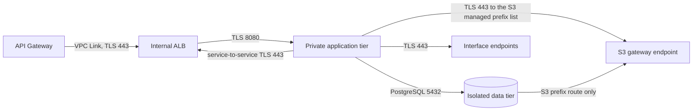

# Network module

This reusable Terraform module provisions the CardDemo VPC boundary defined by
AAP sections 0.4.1.6, 0.4.1.9, and 0.5.1.12: three availability zones, public,
private-application, and isolated-data subnet tiers, per-zone NAT egress, eight
interface endpoints, an S3 gateway endpoint, security groups, and encrypted VPC
flow logs. The security rationale is fixed by AAP decision D8 and expanded in
the existing
[security architecture](../../../docs/architecture/security-and-identity.md);
the Terraform module convention is fixed by AAP decision D9.

This README is the prose half of Rule 1 Explainability and is required by AAP
section 0.2.1.6. The mechanical half is enforced by
[TFLint](../../.tflint.hcl) and the
[terraform-docs configuration](../../.terraform-docs.yml). The four Terraform
files are the executable source of truth. `app/csd/CARDDEMO.CSD` is read-only
lineage; the migration adds this network path beside the existing mainframe
path and does not modify it.

## Topology

| Tier | Internet route | Occupants | Output |
|---|---|---|---|
| Public | Default route to the internet gateway | Internal ALB nodes and one NAT gateway per zone | `public_subnet_ids` |
| Private application | Default route to that zone's NAT gateway | ECS tasks, API Gateway VPC Link interfaces, interface endpoint ENIs | `private_app_subnet_ids` |
| Isolated data | None | Aurora PostgreSQL | `isolated_data_subnet_ids` |

The load balancer is internal even though it is placed in public subnets:
`internal = true` in the ALB module withholds public addresses and a public DNS
name. Public subnets describe routing, not direct reachability of every resource
inside them.



The application security group's egress is **enumerated, not allow-all**: exactly
three destinations are permitted — the internal ALB listener on 443 for
service-to-service calls, Aurora on 5432, and 443 to the interface-endpoint ENIs
and to the S3 managed prefix list. There is no `0.0.0.0/0` rule, so a task
reaches a NAT gateway for nothing: the route exists for future need but no
security-group rule admits general egress. A new outbound dependency therefore
has to arrive as a named rule visible in a plan diff.

### Private AWS service paths

| Endpoint | Consumer |
|---|---|
| `ecr.api` | Authorises container-image pulls |
| `ecr.dkr` | Serves the Docker Registry API half of an image pull. The layers themselves come from S3 and travel over the gateway endpoint, which is why the application group needs an egress rule to that endpoint's prefix list as well as to this one |
| `logs` | Delivers container and workflow logs |
| `secretsmanager` | Retrieves generated service credentials |
| `kms` | Performs envelope-encryption operations |
| `sqs` | Carries authorization, inquiry, and error messages |
| `states` | Starts workflows from reporting and supports orchestration calls |
| `ssm` | Reads runtime configuration and the batch read-only flag |
| `xray` | Exports the telemetry sidecar's trace segments |
| `cognito-idp` | Resolves the identity-provider issuer and its signing keys, and carries auth-service's administrative pool calls |
| S3 gateway | Routes dataset and statement object traffic through route-table prefix entries, with no endpoint ENI or hourly interface-endpoint charge |

Assumptions: the endpoint set is identical in dev and prod. Removing one
does not produce a cleanly degraded topology; because the application group's
egress is enumerated rather than allow-all, that service's traffic is **dropped at
the group** rather than quietly rerouted through NAT.
`interface_endpoint_services` is therefore validated against the exact ten-entry
set rather than treated as an environment lever.

## Module boundary and usage

This directory is a module, not a root. It declares no provider block, backend,
or call to a sibling module. `infra/envs/dev` and `infra/envs/prod` inherit the
root provider's Region and default tags and call this module with
`source = "../../modules/network"`.

```hcl
module "network" {
  source = "../../modules/network"

  name_prefix                = var.name_prefix
  environment                = var.environment
  vpc_cidr                   = var.vpc_cidr
  flow_log_retention_days    = var.log_retention_days
  flow_log_kms_key_arn       = module.kms.s3_key_arn
  interface_endpoint_services = [
    "ecr.api",
    "ecr.dkr",
    "logs",
    "secretsmanager",
    "kms",
    "sqs",
    "states",
    "ssm",
    "xray",
    "cognito-idp",
  ]
  tags = var.tags
}

module "service" {
  source = "../../modules/ecs-service"

  vpc_id                  = module.network.vpc_id
  private_app_subnet_ids  = module.network.private_app_subnet_ids
  security_group_ids      = [module.network.app_security_group_id]
  container_port          = module.network.app_container_port
  # Other service inputs omitted from this focused wiring example.
}

module "database" {
  source = "../../modules/aurora-postgresql"

  subnet_ids         = module.network.isolated_data_subnet_ids
  security_group_ids = [module.network.data_security_group_id]
  port               = module.network.database_port
  # Other database inputs omitted from this focused wiring example.
}
```

Refactoring Rationale: the two ports are module outputs even though they
begin as inputs. The environment root passes those outputs into the service and
database modules, making the security-group rule and the listener it admits one
contract rather than three repeated literals.

## Consumer contract

Renaming or removing an output is a breaking change. This table is measured
against `infra/envs/*/main.tf` and `infra/envs/*/outputs.tf` rather than
asserted, and it distinguishes the **two** ways an output is consumed, because
conflating them is what let an earlier version of this table name consumers that
did not exist.

The Consumers column below is **measured**, not intended: each entry names the
`module` blocks in `infra/envs/*/main.tf` that actually reference the output. An
output with no reader says so.

| Output | Consumers (measured) |
|---|---|
| `vpc_id` | `api_gateway`, `ecs_service` |
| `private_app_subnet_ids` | `alb`, `api_gateway`, `ecs_service`, `step_functions` |
| `isolated_data_subnet_ids` | `aurora` |
| `alb_security_group_id` | `alb`, `api_gateway` |
| `app_security_group_id` | `ecs_service`, `step_functions` |
| `data_security_group_id` | `aurora` |
| `app_container_port` | `ecs_service` |
| `database_port` | `aurora` |
| `flow_log_group_name` | `observability` |
| `vpc_cidr_block` | none today |
| `availability_zones` | none today |
| `public_subnet_ids` | none today |
| `nat_gateway_ids` | none today |
| `nat_gateway_public_ips` | none today |
| `interface_vpc_endpoint_ids` | none today |
| `s3_gateway_endpoint_id` | none today |

Refactoring Rationale: this table previously listed eighteen rows and named a
consumer for every one, including three route-table outputs and several values
nothing reads. Both halves were wrong. The three route-table outputs --
`public_route_table_id`, `private_app_route_table_ids` and
`isolated_data_route_table_ids` -- together with `flow_log_group_arn` and
`flow_log_id`, have been **withdrawn** from the module, taking the contract from
twenty-one published outputs to the sixteen it is specified at; `outputs.tf`
carries a comment at each position recording the measurement. Of the sixteen that
remain, seven have no reader yet, and the table now says so rather than
attributing them to a root that does not reference them. A row claiming a
consumer it does not have is worse than an honest none-today, because the next
reader preserves it as load-bearing.

Assumptions: the seven readerless outputs are kept rather than withdrawn too.
They are part of the specified contract, each answers a question an operator or a
later root will ask -- the address space a rule must be scoped to, the zones a
deployment really got, the gateway addresses an external allow-list needs -- and
each is derived from a resource this module already creates, so keeping them
costs nothing at apply time. Renaming or removing any of the sixteen is still a
breaking change for the consumers named above.

The module does not publish its endpoint security group, flow-log IAM role,
route tables, or internet gateway. No sibling attaches to those resources;
publishing them would create a second owner for an internal boundary.

## Deliberate decisions

1. **Isolated data has no default route.** Alternatives Considered: placing
   Aurora in the private-application tier. Rejected because no route is a
   routing fact that survives a security-group or credential mistake.
   Trade-offs: direct operator egress and package access from the data tier
   are unavailable.
2. **One NAT gateway is created per zone.** Alternatives Considered: one
   shared gateway to reduce the largest fixed network cost. Rejected because a
   zone loss would remove egress from every zone, and a differently shaped dev
   network would not validate prod.
3. **Four security groups are created and three are published.** `alb`, `app`
   and `data` are published for the sibling modules that attach to them;
   `vpc_endpoints` is attached by this module alone to the interface-endpoint
   ENIs and is therefore internal. An interface endpoint must carry a group, so
   the application-to-endpoint flow has to terminate somewhere. Alternatives
   Considered: reusing the application group, which needs a self-referencing 443
   rule that would also permit task-to-task TLS; or reusing the ALB group, which
   needs an application-to-ALB 443 rule that would let every task reach the edge
   listener group. Both widen a flow beyond the three this topology allows.
   Trade-offs: one more group to reason about, accepted in exchange for a rule
   set in which each permitted flow has exactly one source and one destination.
4. **The application group's egress is enumerated, not implicit.** Four named
   destinations are reachable and nothing else: Aurora on `database_port`, the
   interface-endpoint group on 443, the S3 gateway endpoint's managed prefix list
   on 443, and `identity_provider_egress_cidrs` on 443.

   Refactoring Rationale: the last two were **missing**, and their absence broke
   two required paths rather than merely tightening them. The S3 gateway endpoint
   was provisioned and both the private-application and isolated-data route
   tables were associated with it, but a gateway endpoint places no ENI and
   therefore carries no security group to reference — S3 traffic is matched
   against the destination addresses in a managed prefix list, and a group whose
   only egress referenced the endpoint group matched none of them, so every
   object-storage call was dropped at the ENI before the route table was
   consulted. Separately, every service is an OAuth2 resource server that
   resolves its Cognito issuer and fetches the JWK set during context refresh, so
   with no egress rule for the identity provider the tasks did not degrade — they
   failed their health checks and never entered service.

   Assumptions: the Cognito flow leaves through NAT, and that is the specified
   topology's own design rather than a concession. The private-application route
   tables already carry a default route to the zone-local NAT gateway, and the
   endpoint set is fixed at eight named services with Cognito not among them, so
   a ninth interface endpoint is not the answer. Trade-offs: that rule's default
   destination is open, which is why it is an input rather than a literal — it is
   TLS-only, it names its purpose in its description so it is identifiable in a
   plan diff and in a flow log, and an environment that has determined its
   provider's ranges can narrow it without editing this module. Deriving the
   destination from AWS's published ranges was rejected on a hard limit: the
   regional ranges run to hundreds of CIDRs and a security group admits far
   fewer, so the apply would fail on quota. Any further outbound dependency still
   has to arrive as a named rule visible in a plan diff rather than being
   absorbed by an allow-all default. There is no `0.0.0.0/0` ingress rule on any
   group. The edge-to-ALB
   rule is not authored here either: the VPC Link carries its own group, which
   `api-gateway-http` creates and uses to open this module's ALB group, so
   declaring it here would close a cycle between the two modules.
5. **No subnet auto-assigns a public address.** The NAT gateways allocate their
   own Elastic IPs and the ALB is internal. Enabling auto-assignment would only
   create an unintended public-address path.
6. **S3 uses a gateway endpoint.** Trade-offs: it is a route-table prefix
   entry rather than an ENI with a security group and carries no interface
   endpoint hourly charge. Associating isolated route tables does not create an
   internet path because the route can reach S3 only. Assumptions: having no
   security group of its own does not mean it needs no rule — the application
   group's egress is enumerated, so the tasks carry their own egress rule toward
   the endpoint's managed prefix list. The route and the rule are two separate
   permissions and object storage needs both; a plan-time postcondition on the
   endpoint refuses a configuration in which the prefix list does not resolve,
   because the rule would then have no destination.
7. **Subnet CIDRs are derived.** Alternatives Considered: three explicit
   lists of CIDRs. Nine hand-maintained blocks can overlap or drift from zone
   order; one `cidrsubnet` arithmetic cannot.
10. **VPC flow logs are owned here.** Their lifecycle follows the VPC, while the
   observability module owns dashboards, alarms, and application log groups.
   `traffic_type = "ALL"` is fixed because accepted-only and rejected-only logs
   each omit half the audit trail.

At the defaults, `10.0.0.0/16` plus four new prefix bits yields sixteen `/20`
blocks. Three zones consume nine: netnums `0..2` public, `3..5` private
application, and `6..8` isolated data. Changing `vpc_cidr` or `subnet_newbits`
after apply replaces every subnet and cascades into the resources placed in
them.

Dev and prod differ here only in `flow_log_retention_days`. Zone count, tier
layout, NAT count, endpoint set, security-group flows, and shared ports are
identical. This implements the AAP constraint that environments differ in
sizing and retention, never topology.

`identity_provider_egress_cidrs` is the one input an environment *may*
legitimately differ on without differing in topology: it narrows a destination
set, not a flow. Neither root sets it today, so both take the open default and
remain identical; an environment whose egress traverses a proxy that resolves the
issuer's addresses should set it there rather than here. The input is a set rather
than a list so that reordering cannot churn a plan, and `main.tf` keys one rule per
entry so that narrowing the set removes rules individually.

## Validation

All commands below are gating and have no tolerated non-zero return code.

```bash
# WHAT: verify canonical HCL formatting without rewriting committed files.
# WHY : CI checks rather than fixes, so formatting drift is a review failure.
terraform fmt -check -recursive infra/

# WHAT: initialise and validate the module without a backend.
# WHY : provider-schema validation catches invalid arguments before a root plan.
terraform -chdir=infra/modules/network init -backend=false
terraform -chdir=infra/modules/network validate

# WHAT: enforce documented, typed, used declarations and AWS-specific rules.
# WHY : a declared-but-unused contract or an invalid resource argument fails CI.
tflint --chdir=infra/modules/network --config="$(pwd)/infra/.tflint.hcl"

# WHAT: verify the generated reference below still matches the HCL.
# WHY : variable, resource, or output drift makes this README incorrect.
terraform-docs --config infra/.terraform-docs.yml \
  --output-check infra/modules/network
```

The module is authored and statically validated; applying it to a live AWS
account is an operator action outside this scope. It has not been benchmarked or
penetration-tested. The top-level [infrastructure guide](../../README.md)
defines the static-validation and operator boundary; the
[security architecture](../../../docs/architecture/security-and-identity.md)
defines the wider network boundary.

## Generated reference

<!-- BEGIN_TF_DOCS -->
### Requirements

| Name | Version |
|------|---------|
| <a name="requirement_terraform"></a> [terraform](#requirement\_terraform) | >= 1.15.0 |
| <a name="requirement_aws"></a> [aws](#requirement\_aws) | ~> 6.56 |

### Providers

| Name | Version |
|------|---------|
| <a name="provider_aws"></a> [aws](#provider\_aws) | 6.57.1 |

### Resources

| Name | Type |
|------|------|
| [aws_cloudwatch_log_group.flow_logs](https://registry.terraform.io/providers/hashicorp/aws/latest/docs/resources/cloudwatch_log_group) | resource |
| [aws_default_security_group.this](https://registry.terraform.io/providers/hashicorp/aws/latest/docs/resources/default_security_group) | resource |
| [aws_eip.nat](https://registry.terraform.io/providers/hashicorp/aws/latest/docs/resources/eip) | resource |
| [aws_flow_log.this](https://registry.terraform.io/providers/hashicorp/aws/latest/docs/resources/flow_log) | resource |
| [aws_iam_role.flow_logs](https://registry.terraform.io/providers/hashicorp/aws/latest/docs/resources/iam_role) | resource |
| [aws_iam_role_policy.flow_logs](https://registry.terraform.io/providers/hashicorp/aws/latest/docs/resources/iam_role_policy) | resource |
| [aws_internet_gateway.this](https://registry.terraform.io/providers/hashicorp/aws/latest/docs/resources/internet_gateway) | resource |
| [aws_nat_gateway.this](https://registry.terraform.io/providers/hashicorp/aws/latest/docs/resources/nat_gateway) | resource |
| [aws_route.private_app_internet](https://registry.terraform.io/providers/hashicorp/aws/latest/docs/resources/route) | resource |
| [aws_route.public_internet](https://registry.terraform.io/providers/hashicorp/aws/latest/docs/resources/route) | resource |
| [aws_route_table.isolated_data](https://registry.terraform.io/providers/hashicorp/aws/latest/docs/resources/route_table) | resource |
| [aws_route_table.private_app](https://registry.terraform.io/providers/hashicorp/aws/latest/docs/resources/route_table) | resource |
| [aws_route_table.public](https://registry.terraform.io/providers/hashicorp/aws/latest/docs/resources/route_table) | resource |
| [aws_route_table_association.isolated_data](https://registry.terraform.io/providers/hashicorp/aws/latest/docs/resources/route_table_association) | resource |
| [aws_route_table_association.private_app](https://registry.terraform.io/providers/hashicorp/aws/latest/docs/resources/route_table_association) | resource |
| [aws_route_table_association.public](https://registry.terraform.io/providers/hashicorp/aws/latest/docs/resources/route_table_association) | resource |
| [aws_security_group.alb](https://registry.terraform.io/providers/hashicorp/aws/latest/docs/resources/security_group) | resource |
| [aws_security_group.app](https://registry.terraform.io/providers/hashicorp/aws/latest/docs/resources/security_group) | resource |
| [aws_security_group.data](https://registry.terraform.io/providers/hashicorp/aws/latest/docs/resources/security_group) | resource |
| [aws_security_group.vpc_endpoints](https://registry.terraform.io/providers/hashicorp/aws/latest/docs/resources/security_group) | resource |
| [aws_subnet.isolated_data](https://registry.terraform.io/providers/hashicorp/aws/latest/docs/resources/subnet) | resource |
| [aws_subnet.private_app](https://registry.terraform.io/providers/hashicorp/aws/latest/docs/resources/subnet) | resource |
| [aws_subnet.public](https://registry.terraform.io/providers/hashicorp/aws/latest/docs/resources/subnet) | resource |
| [aws_vpc.this](https://registry.terraform.io/providers/hashicorp/aws/latest/docs/resources/vpc) | resource |
| [aws_vpc_endpoint.interface](https://registry.terraform.io/providers/hashicorp/aws/latest/docs/resources/vpc_endpoint) | resource |
| [aws_vpc_endpoint.s3](https://registry.terraform.io/providers/hashicorp/aws/latest/docs/resources/vpc_endpoint) | resource |
| [aws_vpc_endpoint_route_table_association.isolated_data](https://registry.terraform.io/providers/hashicorp/aws/latest/docs/resources/vpc_endpoint_route_table_association) | resource |
| [aws_vpc_endpoint_route_table_association.private_app](https://registry.terraform.io/providers/hashicorp/aws/latest/docs/resources/vpc_endpoint_route_table_association) | resource |
| [aws_vpc_security_group_egress_rule.alb_to_app](https://registry.terraform.io/providers/hashicorp/aws/latest/docs/resources/vpc_security_group_egress_rule) | resource |
| [aws_vpc_security_group_egress_rule.app_to_alb](https://registry.terraform.io/providers/hashicorp/aws/latest/docs/resources/vpc_security_group_egress_rule) | resource |
| [aws_vpc_security_group_egress_rule.app_to_alb_https](https://registry.terraform.io/providers/hashicorp/aws/latest/docs/resources/vpc_security_group_egress_rule) | resource |
| [aws_vpc_security_group_egress_rule.app_to_data](https://registry.terraform.io/providers/hashicorp/aws/latest/docs/resources/vpc_security_group_egress_rule) | resource |
| [aws_vpc_security_group_egress_rule.app_to_endpoints](https://registry.terraform.io/providers/hashicorp/aws/latest/docs/resources/vpc_security_group_egress_rule) | resource |
| [aws_vpc_security_group_egress_rule.app_to_identity_provider](https://registry.terraform.io/providers/hashicorp/aws/latest/docs/resources/vpc_security_group_egress_rule) | resource |
| [aws_vpc_security_group_egress_rule.app_to_s3_gateway](https://registry.terraform.io/providers/hashicorp/aws/latest/docs/resources/vpc_security_group_egress_rule) | resource |
| [aws_vpc_security_group_egress_rule.data_to_s3_gateway](https://registry.terraform.io/providers/hashicorp/aws/latest/docs/resources/vpc_security_group_egress_rule) | resource |
| [aws_vpc_security_group_ingress_rule.alb_to_app](https://registry.terraform.io/providers/hashicorp/aws/latest/docs/resources/vpc_security_group_ingress_rule) | resource |
| [aws_vpc_security_group_ingress_rule.app_to_alb](https://registry.terraform.io/providers/hashicorp/aws/latest/docs/resources/vpc_security_group_ingress_rule) | resource |
| [aws_vpc_security_group_ingress_rule.app_to_alb_https](https://registry.terraform.io/providers/hashicorp/aws/latest/docs/resources/vpc_security_group_ingress_rule) | resource |
| [aws_vpc_security_group_ingress_rule.app_to_data](https://registry.terraform.io/providers/hashicorp/aws/latest/docs/resources/vpc_security_group_ingress_rule) | resource |
| [aws_vpc_security_group_ingress_rule.app_to_endpoints](https://registry.terraform.io/providers/hashicorp/aws/latest/docs/resources/vpc_security_group_ingress_rule) | resource |
| [aws_availability_zones.available](https://registry.terraform.io/providers/hashicorp/aws/latest/docs/data-sources/availability_zones) | data source |
| [aws_caller_identity.current](https://registry.terraform.io/providers/hashicorp/aws/latest/docs/data-sources/caller_identity) | data source |
| [aws_ec2_managed_prefix_list.s3](https://registry.terraform.io/providers/hashicorp/aws/latest/docs/data-sources/ec2_managed_prefix_list) | data source |
| [aws_iam_policy_document.flow_logs](https://registry.terraform.io/providers/hashicorp/aws/latest/docs/data-sources/iam_policy_document) | data source |
| [aws_iam_policy_document.flow_logs_assume_role](https://registry.terraform.io/providers/hashicorp/aws/latest/docs/data-sources/iam_policy_document) | data source |
| [aws_iam_policy_document.interface_endpoint](https://registry.terraform.io/providers/hashicorp/aws/latest/docs/data-sources/iam_policy_document) | data source |
| [aws_partition.current](https://registry.terraform.io/providers/hashicorp/aws/latest/docs/data-sources/partition) | data source |
| [aws_region.current](https://registry.terraform.io/providers/hashicorp/aws/latest/docs/data-sources/region) | data source |

### Inputs

| Name | Description | Type | Default | Required |
|------|-------------|------|---------|:--------:|
| <a name="input_environment"></a> [environment](#input\_environment) | Trailing component of the Name tag on the VPC, every subnet, every route table, every gateway, every endpoint and every security group, so one environment's network is distinguishable from another's in the same account. Required -- there is no default. Lowercase letters, digits and hyphens only, no leading or trailing hyphen, at most 16 characters. | `string` | n/a | yes |
| <a name="input_allow_service_managed_flow_log_encryption"></a> [allow\_service\_managed\_flow\_log\_encryption](#input\_allow\_service\_managed\_flow\_log\_encryption) | Whether this module may create the VPC flow-log group on CloudWatch Logs service-default encryption instead of a customer-managed key. False, the default, makes flow\_log\_kms\_key\_arn required. True is reserved for planning this module in isolation without the kms module and is not a supported setting for the dev or prod roots. | `bool` | `false` | no |
| <a name="input_app_container_port"></a> [app\_container\_port](#input\_app\_container\_port) | TCP port admitted from the load-balancer security group to the application security group and republished for the calling root to pass into every ecs-service container and target group. The default 8080 matches the Spring Boot listeners; using the output rather than repeating the number keeps the rule and the listener aligned. | `number` | `8080` | no |
| <a name="input_az_count"></a> [az\_count](#input\_az\_count) | Number of availability zones the network spans, and therefore the number of subnets created in each of the three tiers and the number of NAT gateways. The only supported value is 3, the topology shared by dev and prod. | `number` | `3` | no |
| <a name="input_database_port"></a> [database\_port](#input\_database\_port) | TCP port admitted from the application security group to the isolated-data security group and republished for the calling root to pass into aurora-postgresql. The default 5432 matches PostgreSQL; the accepted range is the range Aurora PostgreSQL supports. | `number` | `5432` | no |
| <a name="input_flow_log_kms_key_arn"></a> [flow\_log\_kms\_key\_arn](#input\_flow\_log\_kms\_key\_arn) | ARN of a customer-managed KMS key with which to encrypt the CloudWatch Logs group receiving this VPC's flow logs. Required unless allow\_service\_managed\_flow\_log\_encryption is explicitly set true, which is the opt-out reserved for planning this module in isolation without the kms module. Both environment roots pass the key the kms module produces. | `string` | `null` | no |
| <a name="input_flow_log_retention_days"></a> [flow\_log\_retention\_days](#input\_flow\_log\_retention\_days) | Days the CloudWatch Logs group receiving this VPC's flow logs retains events before they age off, or 0 to retain them indefinitely. This is the one value in this module the dev and prod roots are expected to set differently, and it is the direct analogue of how long a mainframe job log was kept before it aged off the spool. | `number` | `30` | no |
| <a name="input_identity_provider_egress_cidrs"></a> [identity\_provider\_egress\_cidrs](#input\_identity\_provider\_egress\_cidrs) | Destination CIDR blocks the application security group may reach on TCP 443 for Cognito identity-provider calls: the JWK set every service fetches at start-up and the user-pool admin API auth-service calls. One egress rule is created per entry. The default permits any destination because the provider is a public regional endpoint whose addresses AWS may change; an environment that has determined the exact ranges may narrow this set without editing the module. | `set(string)` | <pre>[<br/>  "0.0.0.0/0"<br/>]</pre> | no |
| <a name="input_interface_endpoint_services"></a> [interface\_endpoint\_services](#input\_interface\_endpoint\_services) | Exact set of short AWS service names given private interface endpoints in every environment: ecr.api and ecr.dkr for image pulls, logs for delivery, secretsmanager for credentials, kms for envelope operations, sqs for messaging, states for workflow calls, ssm for configuration, xray for the telemetry sidecar's trace export and cognito-idp for identity-provider issuer, signing-key and administrative calls. main.tf expands each short name into its Region-qualified service name; S3 is excluded because it uses the separate gateway endpoint. | `set(string)` | <pre>[<br/>  "ecr.api",<br/>  "ecr.dkr",<br/>  "logs",<br/>  "secretsmanager",<br/>  "kms",<br/>  "sqs",<br/>  "states",<br/>  "ssm",<br/>  "xray",<br/>  "cognito-idp"<br/>]</pre> | no |
| <a name="input_name_prefix"></a> [name\_prefix](#input\_name\_prefix) | Leading component of the Name tag on every resource this module creates, ahead of the tier and the environment, giving the whole network one greppable identity shared with the rest of the stack. Lowercase letters, digits and hyphens only, no leading or trailing hyphen, at most 32 characters. | `string` | `"carddemo"` | no |
| <a name="input_subnet_newbits"></a> [subnet\_newbits](#input\_subnet\_newbits) | Number of bits cidrsubnet adds to the vpc\_cidr prefix when carving each subnet, which fixes every subnet's size: at the default /16 and 4 additional bits each subnet is a /20. It must admit at least `3 * az_count` distinct subnets, because the three tiers are taken from consecutive netnum ranges of the one block rather than from separate per-tier address lists. | `number` | `4` | no |
| <a name="input_tags"></a> [tags](#input\_tags) | Additional tags merged onto every taggable resource this module creates, on top of the provider-level default\_tags the calling root sets and underneath the per-resource Name tag this module composes. Network-specific tags belong here; tags common to the whole stack belong on the root's provider block, so that every module receives them without being passed them. | `map(string)` | `{}` | no |
| <a name="input_vpc_cidr"></a> [vpc\_cidr](#input\_vpc\_cidr) | IPv4 address space the VPC occupies, and the only addressing value this module takes. main.tf subdivides it into `3 * az_count` equally sized subnets -- one public, one private-application and one isolated-data subnet per availability zone -- each `subnet_newbits` bits longer than this prefix, so the block must be large enough to accommodate them all. Changing it after apply forces replacement of the VPC and of every subnet in it. | `string` | `"10.0.0.0/16"` | no |

### Outputs

| Name | Description |
|------|-------------|
| <a name="output_alb_security_group_id"></a> [alb\_security\_group\_id](#output\_alb\_security\_group\_id) | Identifier (string) of the internal load balancer's security group, attached by alb. api-gateway-http adds its 443 ingress from the VPC Link's own group for edge traffic. This module grants it two flows: egress to the application group on app\_container\_port, so the balancer can forward requests and health checks, and 443 ingress from the application group, which is how one migrated context calls another over the internal listener. It can reach nothing else. |
| <a name="output_app_container_port"></a> [app\_container\_port](#output\_app\_container\_port) | TCP port (number) this module admits from the load-balancer group to the application group. Both environment roots pass it to ecs-service as its container and target-group port, so the rule and the listener cannot drift apart. |
| <a name="output_app_security_group_id"></a> [app\_security\_group\_id](#output\_app\_security\_group\_id) | Identifier (string) of the application-tier security group, attached by ecs-service to its task ENIs and by step-functions-batch to its Fargate task network configuration. Its permitted flows are exactly five, each a separately named rule: ingress from the load-balancer group on app\_container\_port; egress to the data group on database\_port; egress to the interface-endpoint group on 443 for the eight private AWS service endpoints; egress on 443 to the S3 gateway endpoint's managed prefix list, which needs a prefix-list rule because a gateway endpoint places no ENI and so has no group to reference; and egress on 443 to identity\_provider\_egress\_cidrs for the Cognito JWK set every service fetches at start-up, which has no interface endpoint in the specified eight-service set. Egress is enumerated rather than left as a new group's implicit allow-all, so a further outbound dependency has to arrive as a named rule visible in a plan diff. |
| <a name="output_availability_zones"></a> [availability\_zones](#output\_availability\_zones) | Ordered list of the availability-zone names this module actually used, after az\_count is clamped to the zones the account can place a subnet in. No consumer reads it today - neither a sibling module nor either environment root - and it is published for zone-aware sizing and for confirming the span a deployment really got rather than the span it asked for. Every subnet-id list below is ordered to match it. |
| <a name="output_data_security_group_id"></a> [data\_security\_group\_id](#output\_data\_security\_group\_id) | Identifier (string) of the isolated-data security group, attached by aurora-postgresql to its cluster. It grants exactly one flow: ingress from the application-tier group on database\_port. It admits no CIDR range, so a host that is not a member of the application group cannot open a database session even from inside the VPC. |
| <a name="output_database_port"></a> [database\_port](#output\_database\_port) | TCP port (number) this module admits from the application group to the isolated-data group. Both environment roots pass it to aurora-postgresql as its cluster port, so the rule and the engine cannot drift apart. |
| <a name="output_flow_log_group_name"></a> [flow\_log\_group\_name](#output\_flow\_log\_group\_name) | Exact name (string) of the CloudWatch log group receiving this VPC's flow records. Both environment roots pass it to observability as its required vpc\_flow\_log\_group\_name input, which points that module's Logs Insights widgets at the group this module created rather than at a name reassembled from a prefix and an environment. |
| <a name="output_interface_vpc_endpoint_ids"></a> [interface\_vpc\_endpoint\_ids](#output\_interface\_vpc\_endpoint\_ids) | Map from short AWS service name to that service's interface VPC endpoint identifier, keyed exactly as var.interface\_endpoint\_services is written: ecr.api, ecr.dkr, logs, secretsmanager, kms, sqs, states, ssm, xray and cognito-idp. Its consumer is the environment root, which needs a specific endpoint's identity to attach a metric or an endpoint policy to it; no sibling module reads it today. Each endpoint places an ENI in the private application subnets, which is how a task reaches these services without egressing the VPC. |
| <a name="output_isolated_data_subnet_ids"></a> [isolated\_data\_subnet\_ids](#output\_isolated\_data\_subnet\_ids) | Ordered list of the isolated data subnet identifiers, one per availability zone, forming the DB subnet group read by aurora-postgresql. These subnets have no route to the internet at all - their route tables carry no default route, no NAT and no gateway - which is what makes them the correct home for the database and the wrong home for anything needing egress. |
| <a name="output_nat_gateway_ids"></a> [nat\_gateway\_ids](#output\_nat\_gateway\_ids) | Map from availability-zone name to the NAT gateway serving that zone's private application subnet. No consumer reads it today - neither a sibling module nor either environment root; observability takes only the flow-log group name from this module. It is published because an alarm on a per-gateway metric - a failed-connection count, for instance - needs the gateway identity, and the zone key is what lets such an alarm name the zone it describes instead of an opaque identifier. |
| <a name="output_nat_gateway_public_ips"></a> [nat\_gateway\_public\_ips](#output\_nat\_gateway\_public\_ips) | Map from availability-zone name to the Elastic IP address attached to that zone's NAT gateway. No consumer reads it today - neither a sibling module nor either environment root - and it is published so an operator or downstream system that has to allow-list CardDemo's egress can be handed the set. All az\_count entries are present, because egress can leave from any zone. |
| <a name="output_private_app_subnet_ids"></a> [private\_app\_subnet\_ids](#output\_private\_app\_subnet\_ids) | Ordered list of the private application subnet identifiers, one per availability zone, and the most widely consumed output here. Read by ecs-service for task placement, by step-functions-batch for its Fargate task network configuration, and by api-gateway-http for its VPC Link. NOT read by alb: per AAP 0.4.1.9 the load balancer belongs to the public tier, and the roots place it there. The tier also holds the interface VPC endpoint ENIs, which is how a task reaches ECR, CloudWatch Logs, Secrets Manager, KMS, SQS, Step Functions and SSM without its traffic leaving the VPC. |
| <a name="output_public_subnet_ids"></a> [public\_subnet\_ids](#output\_public\_subnet\_ids) | Ordered list of the public subnet identifiers, one per availability zone. This tier is reserved for the two kinds of thing that need a route to the internet gateway: the zone-local NAT gateways this module creates, which are its only current occupants, and an internet-facing load balancer. No consumer reads it today - neither a sibling module nor either environment root - because the load balancer in this deployment is INTERNAL and both roots therefore place it in the private-application subnets, leaving the NAT gateways this module creates as this tier's only occupants. Nothing holding application state or record data belongs here. |
| <a name="output_s3_gateway_endpoint_id"></a> [s3\_gateway\_endpoint\_id](#output\_s3\_gateway\_endpoint\_id) | Identifier (string) of the S3 gateway endpoint. No consumer reads it today - neither a sibling module nor either environment root - and it is published because naming the private path to S3 in a bucket policy that restricts access to this VPC's endpoint needs it. Being a gateway rather than an interface endpoint, it is associated with route tables instead of subnets, places no ENI and carries no security group - so which tiers can reach S3 is decided by route-table association, not by a security-group rule. |
| <a name="output_vpc_cidr_block"></a> [vpc\_cidr\_block](#output\_vpc\_cidr\_block) | IPv4 CIDR block (string) AWS assigned to this VPC. No consumer reads it today - neither a sibling module nor either environment root - because every tier-to-tier flow this topology allows is expressed group-to-group instead. It is published for a rule or policy that has to be scoped to the whole network rather than to a peer security group. Publishing it means no consumer is ever handed var.vpc\_cidr a second time. |
| <a name="output_vpc_id"></a> [vpc\_id](#output\_vpc\_id) | Identifier (string) of the VPC that owns every subnet, route table, security group and endpoint this module creates. Read by api-gateway-http for its VPC Link and by ecs-service for its target groups, and required by any further module that creates a VPC-scoped resource. |
<!-- END_TF_DOCS -->

### Correction: the load balancer's subnet tier

Refactoring Rationale: an earlier revision of the consumer table above credited
`public_subnet_ids` to nothing and credited `private_app_subnet_ids` to `alb`,
recording that the load balancer "in fact takes `private_app_subnet_ids` because
the load balancer is internal". That was an accurate description of the code as it
then stood and an inaccurate description of the design. AAP §0.4.1.9 places the
load balancer in the **public** tier — "public subnets carrying only the load
balancer and NAT gateways" — so the code was aligned to the frozen topology and
this table now credits `public_subnet_ids` to `alb`.

Assumptions: public placement and an internal scheme are not in tension. The `alb`
module sets `internal = true`, which withholds public addresses and the
internet-routable name whatever the route table attached to the selected subnets
says, so the tier decides where the load balancer's network interfaces live and
not whether the internet can reach it. Reading the two together as a contradiction
is the expected mistake, which is why the reconciliation is recorded at
`infra/modules/alb/variables.tf` beside the input as well as here.
