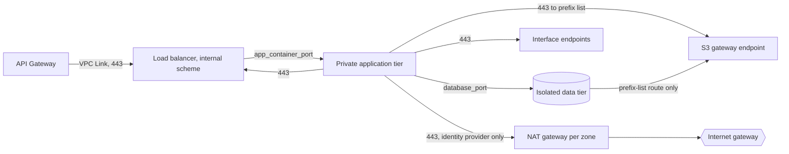

# Network module

This reusable Terraform module provisions the VPC boundary that carries the
migrated CardDemo workload: three availability zones; public,
private-application and isolated-data subnet tiers; per-zone NAT egress; ten
interface VPC endpoints and one S3 gateway endpoint; four security groups; and
an encrypted VPC flow log. It is the network floor every other module in this
package is placed on.

Source of truth, in the order a disagreement should be resolved. The module's
responsibility is fixed by AAP sections 0.4.1.6, 0.4.1.9 and 0.5.1.12. The
security design is decision D8, recorded in
[ADR-008](../../../docs/adr/ADR-008-security-and-identity.md) and expanded in
the [security architecture](../../../docs/architecture/security-and-identity.md);
the choice of Terraform and of module reuse from one source of truth is decision
D9, recorded in [ADR-009](../../../docs/adr/ADR-009-iac-tool.md). Where this
document and the four `.tf` files beside it disagree, **the `.tf` files win** —
they are what runs, and the reference tables at the end of this document are
generated from them. `app/csd/CARDDEMO.CSD` is read-only lineage, cited by line
and never edited: this tree adds a network path beside the existing mainframe
path rather than removing one.

This README exists because of a rule, not because of a migration requirement.
AAP section 0.2.1.6 lists a `README.md` in every `infra/modules/*` directory
among its rule-mandated files and opens that list by saying none of them would
be in scope from the migration requirements alone. HCL has no docstring
construct, so the documentation obligation is split in two: the mechanical half
is enforced by [TFLint](../../.tflint.hcl), which fails any variable or output
with no description, and by the
[terraform-docs configuration](../../.terraform-docs.yml), which lifts those
descriptions into this file and then gates them against drift. This document is
the prose half — the reasoning a generated table cannot hold. The convention it
follows is
[the code documentation standard](../../../docs/CODE_DOCUMENTATION_STANDARD.md).

## Topology

| Tier | Route to the internet | Occupants | Published output |
|---|---|---|---|
| Public | Default route to the internet gateway | The load balancer's interfaces and one NAT gateway per zone, and nothing else | `public_subnet_ids` |
| Private application | Default route to that zone's NAT gateway | ECS tasks, Fargate batch tasks, the API Gateway VPC Link, the interface endpoint ENIs | `private_app_subnet_ids` |
| Isolated data | None at all | Aurora PostgreSQL | `isolated_data_subnet_ids` |

The load balancer sits in the public tier and is still not reachable from the
internet, and reading those two facts as a contradiction is the expected
mistake. AAP section 0.4.1.9 places the load balancer in the public tier —
public subnets carrying only the load balancer and NAT gateways — and both
environment roots pass it `public_subnet_ids`. The `alb` module then sets
`internal = true`, which withholds public addresses and an internet-routable
name whatever the route table on the selected subnets says. Assumptions: a
subnet tier decides where a network interface lives; the load balancer's scheme
decides whether the internet can address it. The same reconciliation is recorded
beside the input at `infra/modules/alb/variables.tf`, because the two halves are
read in either order.



Every arrow above is either a named rule or a route in `main.tf`, and there is no
arrow out of the isolated data tier except to the S3 gateway endpoint.

The NAT arrow is narrower than it looks, and it is the one place a reader is
likely to assume more than the configuration grants. The private-application
route tables do carry a default route to the zone-local NAT gateway, but the
application security group's egress is enumerated, so the only traffic that can
actually take that route is TLS 443 to `identity_provider_egress_cidrs` — the
issuer metadata and signing keys every service fetches at start-up, and the
administrative user-pool calls. Everything else a task needs reaches its service
through an endpoint without leaving the VPC. General outbound access is not
available to a task merely because a default route exists; see entries 4 and 5.

## Private AWS service paths

Ten interface endpoints are created, one per entry in
`interface_endpoint_services`, each placing an ENI in the private application
subnets so that a task reaches the service without its traffic leaving the VPC.
The column that matters is the second one: it records which part of the migrated
stack would stop working if the endpoint were removed.

| Endpoint | What depends on it |
|---|---|
| `ecr.api` | Authorises a container image pull at task start-up |
| `ecr.dkr` | Serves the registry API half of that pull. The layers themselves come from object storage over the gateway endpoint, which is why the application group needs egress to that prefix list as well as to this endpoint |
| `logs` | Delivers container and batch log events |
| `secretsmanager` | Retrieves the generated database and service credentials at start-up |
| `kms` | Performs the envelope-decryption calls behind those credentials |
| `sqs` | Carries the authorization, inquiry and error queue traffic |
| `states` | Starts a batch or report execution from the reporting service |
| `ssm` | Reads runtime parameters, including the batch read-only flag |
| `xray` | Exports trace segments from the telemetry sidecar |
| `cognito-idp` | Resolves the identity-provider issuer and its signing keys, and carries the administrative user-pool calls |
| S3 gateway endpoint | Carries dataset, statement and report object traffic. It is a route-table entry pointing at a service prefix list rather than an ENI, so it places no interface, carries no security group and incurs no hourly endpoint charge |

Assumptions: the endpoint set is identical in both environments and is validated
against exactly this list rather than treated as an environment lever. Removing
an entry does not degrade gracefully. Because the application group's egress is
enumerated rather than allow-all, that service's traffic is dropped at the group
instead of quietly falling back through NAT — which is the better failure, but
only if a reader knows to expect it.

## Module boundary and usage

This directory is a module, not a Terraform root, and several absences follow
from that single fact rather than from oversight.

- **It is never applied directly.** `infra/envs/dev/main.tf` and
  `infra/envs/prod/main.tf` call it with `source = "../../modules/network"`.
- **It declares no `provider` block body, no `backend` and no call to a sibling
  module.** The AWS region and the common `default_tags` are configured once in
  the calling root and inherited from there, which is what lets one root fix
  them for its whole module graph.
- **It is validated transitively.** The infra CI workflow runs
  `terraform -chdir=infra/envs/<env> init -backend=false` and then `validate`,
  and this module is initialised as part of that root's graph.
- **Isolation caveat.** A module that references an undeclared variable behaves
  differently when planned on its own than when planned through a root, so every
  name `main.tf` and `outputs.tf` reference is declared in `variables.tf`. That
  is also what makes the standalone `validate` in the commands below meaningful.

The call below is what both environment roots actually pass, reproduced rather
than idealised. Seven inputs are supplied and the remaining six take their
defaults; no value here is account-specific, and the encryption key arrives as a
reference to the sibling `kms` module's output rather than as a literal.

```hcl
module "network" {
  source = "../../modules/network"

  name_prefix             = var.name_prefix
  environment             = var.environment
  vpc_cidr                = var.vpc_cidr
  app_container_port      = 8080
  database_port           = 5432
  flow_log_retention_days = var.log_retention_days
  flow_log_kms_key_arn    = module.kms.s3_key_arn
}
```

Consumers then read the outputs. Two calls show the pattern; the argument names
on the left belong to the consuming module, and only the network wiring is
shown.

```hcl
module "aurora" {
  source = "../../modules/aurora-postgresql"

  isolated_subnet_ids = module.network.isolated_data_subnet_ids
  security_group_ids  = [module.network.data_security_group_id]
  port                = module.network.database_port
}

module "ecs_service" {
  source = "../../modules/ecs-service"

  vpc_id                 = module.network.vpc_id
  private_app_subnet_ids = module.network.private_app_subnet_ids
  security_group_ids     = [module.network.app_security_group_id]
  container_port         = module.network.app_container_port
}
```

Refactoring Rationale: `app_container_port` and `database_port` are republished
as outputs even though they arrive as inputs, which looks redundant until the
alternative is written out. The root would otherwise repeat each port number in
three places — the security-group rule here, the container and target group in
`ecs-service`, and the cluster port in `aurora-postgresql` — where a change to
one is a rule that no longer admits the listener it was written for. Passing the
output makes the rule and the thing it admits one value.

## Consumer contract

Renaming or removing any of the sixteen published outputs is a breaking change
for the consumers named below.

The Consumers column is **measured, not intended**: each entry names the `module`
blocks in `infra/envs/*/main.tf` that actually reference the output. Both roots
reference the same set, so one column serves both. An output nothing reads says
so, because a row claiming a consumer it does not have is worse than an honest
none — the next reader preserves the false row as load-bearing.

| Output | Consumers (measured) |
|---|---|
| `vpc_id` | `ecs_service`, and the root's own private hosted zone for the internal service name |
| `public_subnet_ids` | `alb` |
| `private_app_subnet_ids` | `ecs_service`, `api_gateway`, `step_functions` |
| `isolated_data_subnet_ids` | `aurora` |
| `alb_security_group_id` | `alb`, `api_gateway` |
| `app_security_group_id` | `ecs_service`, `step_functions` |
| `data_security_group_id` | `aurora` |
| `app_container_port` | `ecs_service` |
| `database_port` | `aurora` |
| `s3_gateway_endpoint_id` | `s3_datasets` |
| `flow_log_group_name` | `observability` |
| `vpc_cidr_block` | none today |
| `availability_zones` | none today |
| `nat_gateway_ids` | none today |
| `nat_gateway_public_ips` | none today |
| `interface_vpc_endpoint_ids` | none today |

Two rows are worth reading twice, because both were previously recorded the
other way round. `alb` reads `public_subnet_ids`, not `private_app_subnet_ids` —
see the reconciliation in [Topology](#topology). And `api_gateway` takes
`private_app_subnet_ids` for its VPC Link and `alb_security_group_id` for its
listener rule, but does not take `vpc_id`.

Assumptions: the five readerless outputs are kept rather than withdrawn. Each
answers a question an operator or a later root will ask — the address space a
future rule must be scoped to, the zones a deployment actually received after
`az_count` was clamped, the egress addresses an external allow-list needs, the
endpoint identities a policy or metric attaches to — and each is derived from a
resource this module already creates, so keeping them costs nothing at apply
time.

The module deliberately does not publish four things it creates:

- **the `vpc_endpoints` security group id**, because no sibling attaches to it
  and publishing it would invite a future caller to attach something and thereby
  hand that thing the application tier's 443 path;
- **the flow-log IAM role ARN**, because its only consumer is the flow log in
  this module;
- **the route table ids**, because tier reachability is decided here and a second
  owner adding a route elsewhere is exactly the change entry 1 below exists to
  prevent; and
- **the internet gateway id**, for the same reason.

Refactoring Rationale: this contract was previously published as twenty-one
outputs, including three route-table ids and two further flow-log values, and
the table named a consumer for every one of them. Both halves were wrong in the
same direction — the module published internal boundaries, and the document
attributed them to roots that never referenced them. The five were withdrawn to
reach the sixteen specified, and the remaining table was re-measured against the
roots rather than re-asserted.

## Deliberate decisions

The `.tf` files carry each of these as an inline comment beside the argument it
governs. They are restated here as prose so that a reader can find them without
reading HCL, and so that a later change has to argue with the reasoning rather
than merely overwrite the value.

1. **The isolated-data route tables carry no default route.** `main.tf` creates
   a route table per zone for this tier and associates the subnets to it, then
   declares no `aws_route` for it at all — the absence is the control.
   Alternatives Considered: a two-tier design with the database in the
   private-application subnets. Rejected because a task in a subnet that has an
   egress route and a task in a subnet that has none are materially different
   exposures. With no next hop toward the internet, an outbound attempt from the
   data tier does not fail an authorization check, it fails to route; ADR-008
   states the property as isolation being a routing fact rather than a policy
   statement, and the distinction is that a rule, a key policy and an IAM policy
   all have to be authored correctly whereas a missing route does not.
   Trade-offs: there is no direct operator path into the data tier and no
   package or update egress from it. Access arrives through the application tier
   or a controlled session mechanism.

2. **One NAT gateway per availability zone, with no input to collapse them.**
   Alternatives Considered: a single shared gateway, billing one gateway-hour
   and one address-hour instead of three of each. Rejected on two independent
   grounds. Availability: with one gateway, egress from the two zones that do
   not hold it becomes a cross-zone path, and losing the zone that holds it
   removes egress from all three. Fidelity: AAP section 0.4.1.6 confines
   environment difference to sizing and retention and never topology, and
   ADR-008 records that a dev environment with a different network shape would
   not validate the prod one. Trade-offs: three gateway-hours and three
   address-hours are accepted in exchange for per-zone egress independence.
   Note what this entry does **not** claim. An earlier reading called the NAT
   tier the largest fixed cost in the network, and ADR-008 has since retracted
   that as false. On the unit counts it records, the interface-endpoint fleet
   bills per endpoint per availability zone and carries the larger fixed hourly
   term; the NAT tier is the smaller of the two line items. Only charge shapes
   are repeated here, because a ranking of two rates goes stale in a way a
   structural count does not.

3. **Four security groups are created and three are published.** `alb`, `app`
   and `data` are published because sibling modules attach to them.
   `vpc_endpoints` is attached by this module alone, to the interface-endpoint
   ENIs, and is therefore internal. An interface endpoint must carry a group, so
   the application-to-endpoint flow has to terminate somewhere.
   Alternatives Considered: reusing the application group, which needs a
   self-referencing 443 ingress rule that would also permit task-to-task traffic
   on 443 — widening the very radius the isolated tier exists to narrow; or
   reusing the load-balancer group, which would collapse two genuinely different
   flows onto one rule, because an application-to-load-balancer 443 rule already
   exists for the three synchronous context-to-context calls and folding the
   endpoint ENIs into that group would make the same rule also grant every task
   the ten private service endpoints, so withdrawing either permission would
   withdraw both.
   Refactoring Rationale: the load-balancer half of this comparison used to
   read that such a rule "would let every task reach the edge listener group", as
   though the rule did not exist. It does exist and the system requires it, so
   the premise was false; the conclusion is unchanged and now rests on keeping
   the two flows separately withdrawable.
   Trade-offs: one more group to reason about, accepted in exchange for a rule
   set in which each permitted flow has exactly one source and one destination.

4. **Every tier-to-tier rule references a peer security group rather than a CIDR
   block.** Alternatives Considered: CIDR-based rules scoped to the VPC or to a
   subnet range. Rejected because a CIDR rule admits anything that happens to
   hold an in-range address, whereas a group reference admits only the specific
   attached role, and it stays correct when a subnet is resized or the network
   gains a zone. `data_security_group_id` is the clearest case: its single
   ingress rule names the application group, so a host inside the VPC that is
   not a member of that group cannot open a database session at all. There is no
   `0.0.0.0/0` ingress rule on any group in this module; the public tier's
   reachability is a route-table property, not a rule.
   The one deliberate exception is a single egress rule.
   `identity_provider_egress_cidrs` is a CIDR set because its destination is a
   public regional endpoint that has no interface endpoint in the set and so has
   no group to reference. Assumptions: the rule is TLS-only, one rule is keyed
   per entry so that narrowing the set removes rules individually, and it names
   its purpose in its description so it is identifiable in a plan diff and in a
   flow log. Deriving the destination from the provider's published address
   ranges was rejected on a hard limit rather than on preference — the regional
   range lists run to hundreds of entries and a security group admits far fewer,
   so the apply would fail on quota.

5. **The application group's egress is enumerated, not implicit.** Four
   destinations are reachable and nothing else: the data group on
   `database_port`, the endpoint group on 443, the S3 gateway endpoint's managed
   prefix list on 443, and `identity_provider_egress_cidrs` on 443.
   Alternatives Considered: leaving a new group's implicit allow-all in place,
   which is less configuration. Rejected because it would make every one of
   those four dependencies invisible and absorb the fifth silently.
   Trade-offs: a new outbound dependency now has to arrive as a named rule that
   appears in a plan diff, which is more work per dependency. This is also what
   makes the note under [Private AWS service paths](#private-aws-service-paths)
   true: with egress enumerated, dropping a service from the endpoint set drops
   its traffic at the group rather than rerouting it through NAT.

6. **No subnet auto-assigns a public address, including the public tier.**
   `map_public_ip_on_launch = false` on all three tiers. The public tier is
   public because its route table carries a default route to the internet
   gateway, not because things launched in it receive addresses: each NAT gateway
   takes an Elastic IP this module allocates, and the load balancer's interfaces
   are created by `alb` under an internal scheme. Alternatives Considered:
   leaving auto-assignment enabled on the public tier, which is the more common
   arrangement elsewhere. Rejected because nothing in this topology that is
   launched there needs it, so the setting would create only the possibility of
   an unintended public address on some later resource — and it is what lets the
   no-public-address-by-default policy condition pass on all three subnets by
   construction rather than by a suppression.

7. **Object storage uses a gateway endpoint, not an interface endpoint.**
   ADR-008 records that a gateway endpoint carries no hourly charge, which is why
   object storage takes this form and is deliberately absent from the interface
   set. The mechanical difference is that a gateway endpoint is a route-table
   entry pointing at a service prefix list, where an interface endpoint is an ENI
   with a security group.
   This does not contradict entry 1, and the two are easy to read as though it
   did. The isolated-data route tables **are** associated with the gateway
   endpoint, and that association adds a route to one service's prefix list and
   nothing else. A prefix-list route has no path to an arbitrary internet
   address, so the data tier reaches object storage while its default route
   remains absent — the tier is still unable to route anywhere else.
   Assumptions: carrying no security group does not mean the endpoint needs no
   rule. Because the application group's egress is enumerated, tasks carry their
   own egress rule toward the endpoint's prefix list; the route and the rule are
   two separate permissions and an object-storage call needs both. A plan-time
   postcondition refuses a configuration in which the prefix list does not
   resolve, because the rule would then have no destination.

8. **Rules are separate `aws_vpc_security_group_ingress_rule` and
   `aws_vpc_security_group_egress_rule` resources, never inline `ingress` and
   `egress` blocks.** Alternatives Considered: inline blocks, which are more
   compact. Rejected for three independent reasons. A plan diff on a separate
   resource names the one rule that changed, where an inline set is replaced
   wholesale and shows the reader nothing about which entry moved. The two forms
   conflict if both are used on one group, so committing to one up front removes
   that failure mode rather than documenting it. And each rule resource carries
   its own `description`, which is what lets the per-rule description policy
   condition pass across all seventeen group and rule resources without a single
   exemption.

9. **VPC flow logs are owned by this module, not by `observability`.** The
   boundary is drawn at "lifecycle follows the VPC": the log group is created and
   destroyed with the VPC, and a flow log cannot outlive the VPC it describes.
   `observability` owns application log groups, dashboards, alarms and the
   notification topic, and reads `flow_log_group_name` from here rather than
   reassembling the name from a prefix and an environment.
   Assumptions: there is no baseline network or data audit trail to carry
   forward, so flow logging is something this path adds rather than something it
   preserves. Each of the eight `DEFINE FILE` stanzas in `app/csd/CARDDEMO.CSD`
   records `JOURNAL(NO)` (L7) and `RECOVERY(NONE)` (L9). That is a property of a
   deliberately instructive sample configuration, noted here only so that a
   reader does not look for a predecessor to preserve.

10. **`traffic_type` is fixed at `ALL` rather than exposed as an input.**
    Alternatives Considered: parameterising it so an environment could narrow the
    record. Rejected because each narrower setting discards half of it — an
    accepted-only log cannot show what was blocked and a rejected-only log cannot
    show what succeeded — and there is no baseline behaviour to narrow toward. An
    input here would offer only a way to make the log less useful.

11. **`flow_log_kms_key_arn` defaults to `null`, and
    `allow_service_managed_flow_log_encryption` is what makes that default
    safe.** Alternatives Considered: declaring the key ARN required. Rejected
    because it would create a hard dependency on the sibling `kms` module and
    leave this module un-plannable on its own. The `null` default is not a silent
    downgrade: the opt-out flag defaults to `false`, so omitting the key without
    explicitly setting that flag is an error rather than an unencrypted log
    group. Both environment roots pass the customer-managed key — the call in
    [Module boundary and usage](#module-boundary-and-usage) shows it arriving
    from `module.kms` — so the encrypted path is the one that ships, and the
    log-group-encryption policy condition is satisfied at the root rather than
    suppressed here.

12. **`environment` has no default and no closed list of permitted values.** It
    is the only required input, and both halves of that are deliberate.
    Alternatives Considered: giving it a default of `dev`, and constraining it to
    a `["dev", "prod"]` allow-list. The default was rejected because this value
    names every resource the module creates, so the safe failure mode is a
    missing-required-variable error at plan time rather than a network that
    applies cleanly under another environment's name. The allow-list was rejected
    because nothing in the module behaves differently according to the name — it
    is a tag component, not a switch — so a closed list would buy no safety and
    would make the module unusable for a third environment without editing it.
    Assumptions: its validation therefore constrains the shape a tag component
    must have, lowercase alphanumerics and hyphens within a length bound, rather
    than the vocabulary it may draw on.

13. **Subnet CIDRs are derived from one block rather than enumerated per tier.**
    Alternatives Considered: three hand-written per-tier CIDR lists. Rejected
    because nine hand-maintained blocks have to be kept mutually non-overlapping
    and consistent with `az_count` by hand, whereas three consecutive netnum
    ranges taken from one `cidrsubnet` derivation cannot overlap by
    construction. Trade-offs: a caller gives up control over exact subnet
    placement and receives two sizing levers instead. Accepted, and it is the
    same derivation that makes `az_count` a single lever rather than an edit in
    three separate lists.

## Addressing, and what forces replacement

The generated Inputs table below gives each input's type, default and
description. What it cannot show is the arithmetic that relates three of them,
so it is worked through once here.

`vpc_cidr` and `subnet_newbits` together fix every subnet's size, and `az_count`
fixes how many are cut. At the defaults — `10.0.0.0/16` with four additional
prefix bits — the block divides into sixteen `/20` subnets, of which three zones
consume nine. The three tiers are taken from consecutive netnum ranges of that
one division, which is what makes overlap impossible rather than merely unlikely:

| Tier | Netnum range | At the defaults |
|---|---|---|
| Public | `0` to `az_count - 1` | 0, 1, 2 |
| Private application | `az_count` to `2 * az_count - 1` | 3, 4, 5 |
| Isolated data | `2 * az_count` to `3 * az_count - 1` | 6, 7, 8 |

Seven `/20` blocks are left unused, which is deliberate headroom for a later
tier rather than an accounting error. `subnet_newbits` is validated to admit at
least `3 * az_count` distinct subnets, so a combination that cannot be cut is
refused at plan time instead of failing partway through an apply.

Assumptions: `az_count` is the number of zones requested, and the module clamps
it to the number the account can actually place a subnet in before slicing. The
`availability_zones` output reports the span a deployment actually received, and
every subnet-id list is ordered to match it, which is why a consumer should read
that output rather than assume the requested count.

**Changing `vpc_cidr` or `subnet_newbits` after an apply forces replacement of
the VPC and of every subnet in it, and that cascades into everything placed
inside them** — the database cluster, the tasks, the endpoints and the load
balancer. Neither input is a value to adjust on a running environment; sizing
the address space is a decision taken before the first apply.

## What differs between dev and prod

**Exactly one input differs: `flow_log_retention_days`.** The two roots' calls to
this module are otherwise byte-identical, and the difference reaches the module
through each environment's `log_retention_days` variable. Everything structural
is the same in both: three zones, three tiers, three NAT gateways, the same ten
interface endpoints, the same S3 gateway endpoint, the same four security groups
and the same enumerated flows, the same ports.

That identity is the point, and it is worth saying plainly for an operator
wondering why dev is not cheaper here.
Trade-offs: identical topology means the dev environment pays the network floor —
three NAT gateways, three addresses and the full endpoint fleet — for a workload
that would run on less. ADR-008 accepts that cost deliberately and gives the
reason directly: a dev environment with a different network shape would not
validate the prod one. A cheaper dev network would be a different network, and
would stop being a rehearsal for the one that matters. Alternatives Considered:
exposing a single-NAT or reduced-endpoint switch for non-production, which is the
usual way this cost is trimmed. Rejected because the first defect it would hide
is a routing or endpoint-reachability defect — precisely the class of problem a
pre-production environment exists to surface.

`identity_provider_egress_cidrs` is the one input an environment *may*
legitimately differ on without differing in topology, because it narrows a
destination set rather than adding or removing a flow. Neither root sets it
today, so both take the open default and remain identical. An environment whose
egress traverses a proxy that resolves the issuer's addresses should narrow it
there rather than here.

## Policy-scan posture

The module is clean under the infra CI policy gate **by construction, not by
suppression**. It contains no `checkov:skip` annotation and no
`tflint-ignore` directive of any kind, and the scan reports zero skipped checks
for this directory — which is the measurement that distinguishes the two, since a
suppressed check also reports as not-failed.

Each condition below is satisfied by a decision recorded above rather than by an
exemption:

| Condition | What satisfies it |
|---|---|
| Flow logging is enabled on the VPC | The flow log, log group, role and policy owned by this module — entry 9 |
| The VPC's default security group restricts all traffic | The default group is adopted with empty ingress and egress rather than left unmanaged |
| No subnet assigns a public address by default | `map_public_ip_on_launch = false` on all three tiers — entry 6 |
| Every security group and rule carries a description | One `description` per separate rule resource — entry 8 |
| No security group admits ingress from an open CIDR | Every ingress rule names a peer group; there is no open ingress rule — entry 4 |
| Every Elastic IP is attached | Each allocated address is attached to that zone's NAT gateway — entry 2 |
| No IAM policy grants unconstrained write access | The flow-log policy's write actions are scoped to this module's own log-group ARN |
| The log group is encrypted with a customer-managed key | Resolved at the root, which passes the `kms` module's key — entry 11 |

Alternatives Considered: satisfying the gate by suppressing findings instead —
annotating each one and recording the exemption. Rejected for this module because
every condition above is reachable by configuration, so a suppression would trade
a real control for a passing report. The distinction is not cosmetic: a
suppression records that someone decided a finding was acceptable, whereas a pass
records that the configuration does not produce it. Sibling modules in this
package do carry a small number of bounded exceptions, each guarded by its own
assertion in the workflow, so the mechanism exists and is deliberately unused
here.

If a check is ever suppressed in this module, the check identifier and the reason
belong in the register above, next to the decision that made the suppression
necessary — not in a comment that only the scanner reads.

## Validation

Every command below is gating. None has a tolerated non-zero return code, and
none of them writes to the tree — a failure is fixed by a human and committed,
not repaired by the pipeline.

```bash
# WHAT: check this module's HCL against canonical formatting without rewriting
#       a byte of it.
# WHY : Trade-offs: `-check` reports and exits non-zero, whereas a bare
#       `terraform fmt` rewrites in place -- which in CI would let a formatting
#       regression pass as green because the command repaired the tree and then
#       succeeded.
terraform fmt -check -recursive infra/

# WHAT: parse and type-check this module's configuration with no backend and no
#       credentials.
# WHY : Assumptions: `validate` refuses to run in an uninitialised directory, so
#       `init` must precede it, and `-backend=false` is what lets it run offline
#       -- a module has no backend of its own to configure. The GATING path runs
#       this against each environment root, where this module is initialised as
#       part of that root's graph.
terraform -chdir=infra/modules/network init -backend=false
terraform -chdir=infra/modules/network validate

# WHAT: enforce documented, typed and used declarations plus the AWS-specific
#       ruleset.
# WHY : Assumptions: the ruleset plugin is pinned in infra/.tflint.hcl, so
#       `--init` installs that exact version; an undocumented variable or output
#       fails here, which is the mechanical half this README is the prose half
#       of.
tflint --init --config="$(pwd)/infra/.tflint.hcl"
tflint --chdir=infra/modules/network --config="$(pwd)/infra/.tflint.hcl"

# WHAT: verify the generated reference below still matches the HCL beside it.
# WHY : Trade-offs: check-only writes nothing, so a stale table fails the build
#       instead of being silently rewritten. Regenerate by dropping
#       `--output-check`, then read the diff before committing -- that read is
#       the review value an auto-commit would discard.
terraform-docs --config infra/.terraform-docs.yml \
  --output-check infra/modules/network

# WHAT: scan this module against the curated policy baseline the infra workflow
#       gates on, where material_checks_csv is the explicit check list that
#       workflow builds.
# WHY : Assumptions: the gate names its checks explicitly because the ruleset
#       carries no severities, so a severity filter would select nothing and
#       produce a gate that cannot fail. `--skip-path` keeps a downloaded
#       provider out of the scan. Read the skipped count, not just the failed
#       count: a suppressed check also reports as not-failed, so only zero
#       skipped shows the directory is clean by construction.
checkov -d infra/modules/network --framework terraform \
  --check "$material_checks_csv" --skip-path '\.terraform' --compact
```

## Deployment boundary

Stated plainly, because softening it would misrepresent what has been done: this
module is **authored and statically validated** — formatting check, backend-free
initialise and validate, lint, documentation-drift check and policy scan. Running
`terraform apply` against a live AWS account is an operator action outside this
scope. **This module has not been provisioned, has not carried live traffic, has
not been benchmarked and has not been penetration-tested.** No claim here rests
on runtime evidence.

Assumptions: static validation establishes that the configuration is
syntactically valid, internally consistent, type-correct against the provider
schema, and free of the policy conditions the gate names. It establishes nothing
about behaviour under load, nothing about actual latency between tiers, and
nothing about whether an account's quotas or zone availability will accept the
plan. Reading the green gates above as evidence of a working network is the
mistake this paragraph exists to prevent — they are evidence of a well-formed
description of one.

Two topology items are out of scope and are not delivered by this module, named
so that their absence is not mistaken for an omission: multi-region and
disaster-recovery topology, because the target is deliberately single-region
across three availability zones; and blue-green or canary deployment, because
services roll in place.

The operator commands for provisioning and removing an environment live in
[the deploy runbook](../../../docs/runbooks/deploy.md) and
[the teardown runbook](../../../docs/runbooks/teardown.md), and are not
reproduced here.

## Related documents

| Document | What to read it for |
|---|---|
| [`infra/README.md`](../../README.md) | The package overview, the module catalogue and the static-validation boundary |
| [`infra/.tflint.hcl`](../../.tflint.hcl) | The lint rules that make a missing description a build failure |
| [`infra/.terraform-docs.yml`](../../.terraform-docs.yml) | The generator and drift gate behind the reference tables below |
| [ADR-008](../../../docs/adr/ADR-008-security-and-identity.md) | Decision D8: the isolated tier, the identity model and the cost shapes cited above |
| [ADR-009](../../../docs/adr/ADR-009-iac-tool.md) | Decision D9: Terraform, and module reuse from one source of truth |
| [Security and identity architecture](../../../docs/architecture/security-and-identity.md) | The full network inventory, which this README deliberately does not duplicate |
| [Code documentation standard](../../../docs/CODE_DOCUMENTATION_STANDARD.md) | The convention this document is written to, including the four rationale labels |

## Generated reference

Everything between the two markers below is generated from the four `.tf` files
in this directory and is checked for drift on every build. Do not edit it by
hand — regenerate it with the command in [Validation](#validation) instead.

<!-- BEGIN_TF_DOCS -->
### Requirements

| Name | Version |
|------|---------|
| <a name="requirement_terraform"></a> [terraform](#requirement\_terraform) | >= 1.15.0 |
| <a name="requirement_aws"></a> [aws](#requirement\_aws) | ~> 6.56 |

### Providers

| Name | Version |
|------|---------|
| <a name="provider_aws"></a> [aws](#provider\_aws) | 6.57.1 |

### Resources

| Name | Type |
|------|------|
| [aws_cloudwatch_log_group.flow_logs](https://registry.terraform.io/providers/hashicorp/aws/latest/docs/resources/cloudwatch_log_group) | resource |
| [aws_default_security_group.this](https://registry.terraform.io/providers/hashicorp/aws/latest/docs/resources/default_security_group) | resource |
| [aws_eip.nat](https://registry.terraform.io/providers/hashicorp/aws/latest/docs/resources/eip) | resource |
| [aws_flow_log.this](https://registry.terraform.io/providers/hashicorp/aws/latest/docs/resources/flow_log) | resource |
| [aws_iam_role.flow_logs](https://registry.terraform.io/providers/hashicorp/aws/latest/docs/resources/iam_role) | resource |
| [aws_iam_role_policy.flow_logs](https://registry.terraform.io/providers/hashicorp/aws/latest/docs/resources/iam_role_policy) | resource |
| [aws_internet_gateway.this](https://registry.terraform.io/providers/hashicorp/aws/latest/docs/resources/internet_gateway) | resource |
| [aws_nat_gateway.this](https://registry.terraform.io/providers/hashicorp/aws/latest/docs/resources/nat_gateway) | resource |
| [aws_route.private_app_internet](https://registry.terraform.io/providers/hashicorp/aws/latest/docs/resources/route) | resource |
| [aws_route.public_internet](https://registry.terraform.io/providers/hashicorp/aws/latest/docs/resources/route) | resource |
| [aws_route_table.isolated_data](https://registry.terraform.io/providers/hashicorp/aws/latest/docs/resources/route_table) | resource |
| [aws_route_table.private_app](https://registry.terraform.io/providers/hashicorp/aws/latest/docs/resources/route_table) | resource |
| [aws_route_table.public](https://registry.terraform.io/providers/hashicorp/aws/latest/docs/resources/route_table) | resource |
| [aws_route_table_association.isolated_data](https://registry.terraform.io/providers/hashicorp/aws/latest/docs/resources/route_table_association) | resource |
| [aws_route_table_association.private_app](https://registry.terraform.io/providers/hashicorp/aws/latest/docs/resources/route_table_association) | resource |
| [aws_route_table_association.public](https://registry.terraform.io/providers/hashicorp/aws/latest/docs/resources/route_table_association) | resource |
| [aws_security_group.alb](https://registry.terraform.io/providers/hashicorp/aws/latest/docs/resources/security_group) | resource |
| [aws_security_group.app](https://registry.terraform.io/providers/hashicorp/aws/latest/docs/resources/security_group) | resource |
| [aws_security_group.data](https://registry.terraform.io/providers/hashicorp/aws/latest/docs/resources/security_group) | resource |
| [aws_security_group.vpc_endpoints](https://registry.terraform.io/providers/hashicorp/aws/latest/docs/resources/security_group) | resource |
| [aws_subnet.isolated_data](https://registry.terraform.io/providers/hashicorp/aws/latest/docs/resources/subnet) | resource |
| [aws_subnet.private_app](https://registry.terraform.io/providers/hashicorp/aws/latest/docs/resources/subnet) | resource |
| [aws_subnet.public](https://registry.terraform.io/providers/hashicorp/aws/latest/docs/resources/subnet) | resource |
| [aws_vpc.this](https://registry.terraform.io/providers/hashicorp/aws/latest/docs/resources/vpc) | resource |
| [aws_vpc_endpoint.interface](https://registry.terraform.io/providers/hashicorp/aws/latest/docs/resources/vpc_endpoint) | resource |
| [aws_vpc_endpoint.s3](https://registry.terraform.io/providers/hashicorp/aws/latest/docs/resources/vpc_endpoint) | resource |
| [aws_vpc_endpoint_route_table_association.isolated_data](https://registry.terraform.io/providers/hashicorp/aws/latest/docs/resources/vpc_endpoint_route_table_association) | resource |
| [aws_vpc_endpoint_route_table_association.private_app](https://registry.terraform.io/providers/hashicorp/aws/latest/docs/resources/vpc_endpoint_route_table_association) | resource |
| [aws_vpc_security_group_egress_rule.alb_to_app](https://registry.terraform.io/providers/hashicorp/aws/latest/docs/resources/vpc_security_group_egress_rule) | resource |
| [aws_vpc_security_group_egress_rule.app_to_alb](https://registry.terraform.io/providers/hashicorp/aws/latest/docs/resources/vpc_security_group_egress_rule) | resource |
| [aws_vpc_security_group_egress_rule.app_to_data](https://registry.terraform.io/providers/hashicorp/aws/latest/docs/resources/vpc_security_group_egress_rule) | resource |
| [aws_vpc_security_group_egress_rule.app_to_endpoints](https://registry.terraform.io/providers/hashicorp/aws/latest/docs/resources/vpc_security_group_egress_rule) | resource |
| [aws_vpc_security_group_egress_rule.app_to_identity_provider](https://registry.terraform.io/providers/hashicorp/aws/latest/docs/resources/vpc_security_group_egress_rule) | resource |
| [aws_vpc_security_group_egress_rule.app_to_s3_gateway](https://registry.terraform.io/providers/hashicorp/aws/latest/docs/resources/vpc_security_group_egress_rule) | resource |
| [aws_vpc_security_group_egress_rule.data_to_s3_gateway](https://registry.terraform.io/providers/hashicorp/aws/latest/docs/resources/vpc_security_group_egress_rule) | resource |
| [aws_vpc_security_group_ingress_rule.alb_to_app](https://registry.terraform.io/providers/hashicorp/aws/latest/docs/resources/vpc_security_group_ingress_rule) | resource |
| [aws_vpc_security_group_ingress_rule.app_to_alb](https://registry.terraform.io/providers/hashicorp/aws/latest/docs/resources/vpc_security_group_ingress_rule) | resource |
| [aws_vpc_security_group_ingress_rule.app_to_data](https://registry.terraform.io/providers/hashicorp/aws/latest/docs/resources/vpc_security_group_ingress_rule) | resource |
| [aws_vpc_security_group_ingress_rule.app_to_endpoints](https://registry.terraform.io/providers/hashicorp/aws/latest/docs/resources/vpc_security_group_ingress_rule) | resource |
| [aws_availability_zones.available](https://registry.terraform.io/providers/hashicorp/aws/latest/docs/data-sources/availability_zones) | data source |
| [aws_caller_identity.current](https://registry.terraform.io/providers/hashicorp/aws/latest/docs/data-sources/caller_identity) | data source |
| [aws_ec2_managed_prefix_list.s3](https://registry.terraform.io/providers/hashicorp/aws/latest/docs/data-sources/ec2_managed_prefix_list) | data source |
| [aws_iam_policy_document.flow_logs](https://registry.terraform.io/providers/hashicorp/aws/latest/docs/data-sources/iam_policy_document) | data source |
| [aws_iam_policy_document.flow_logs_assume_role](https://registry.terraform.io/providers/hashicorp/aws/latest/docs/data-sources/iam_policy_document) | data source |
| [aws_iam_policy_document.interface_endpoint](https://registry.terraform.io/providers/hashicorp/aws/latest/docs/data-sources/iam_policy_document) | data source |
| [aws_partition.current](https://registry.terraform.io/providers/hashicorp/aws/latest/docs/data-sources/partition) | data source |
| [aws_region.current](https://registry.terraform.io/providers/hashicorp/aws/latest/docs/data-sources/region) | data source |

### Inputs

| Name | Description | Type | Default | Required |
|------|-------------|------|---------|:--------:|
| <a name="input_environment"></a> [environment](#input\_environment) | Trailing component of the Name tag on the VPC, every subnet, every route table, every gateway, every endpoint and every security group, so one environment's network is distinguishable from another's in the same account. Required -- there is no default. Lowercase letters, digits and hyphens only, no leading or trailing hyphen, at most 16 characters. | `string` | n/a | yes |
| <a name="input_allow_service_managed_flow_log_encryption"></a> [allow\_service\_managed\_flow\_log\_encryption](#input\_allow\_service\_managed\_flow\_log\_encryption) | Whether this module may create the VPC flow-log group on CloudWatch Logs service-default encryption instead of a customer-managed key. False, the default, makes flow\_log\_kms\_key\_arn required. True is reserved for planning this module in isolation without the kms module and is not a supported setting for the dev or prod roots. | `bool` | `false` | no |
| <a name="input_app_container_port"></a> [app\_container\_port](#input\_app\_container\_port) | TCP port admitted from the load-balancer security group to the application security group and republished for the calling root to pass into every ecs-service container and target group. The default 8080 matches the Spring Boot listeners; using the output rather than repeating the number keeps the rule and the listener aligned. | `number` | `8080` | no |
| <a name="input_az_count"></a> [az\_count](#input\_az\_count) | Number of availability zones the network spans, and therefore the number of subnets created in each of the three tiers and the number of NAT gateways. The only supported value is 3, the topology shared by dev and prod. | `number` | `3` | no |
| <a name="input_database_port"></a> [database\_port](#input\_database\_port) | TCP port admitted from the application security group to the isolated-data security group and republished for the calling root to pass into aurora-postgresql. The default 5432 matches PostgreSQL; the accepted range is the range Aurora PostgreSQL supports. | `number` | `5432` | no |
| <a name="input_flow_log_kms_key_arn"></a> [flow\_log\_kms\_key\_arn](#input\_flow\_log\_kms\_key\_arn) | ARN of a customer-managed KMS key with which to encrypt the CloudWatch Logs group receiving this VPC's flow logs. Required unless allow\_service\_managed\_flow\_log\_encryption is explicitly set true, which is the opt-out reserved for planning this module in isolation without the kms module. Both environment roots pass the key the kms module produces. | `string` | `null` | no |
| <a name="input_flow_log_retention_days"></a> [flow\_log\_retention\_days](#input\_flow\_log\_retention\_days) | Days the CloudWatch Logs group receiving this VPC's flow logs retains events before they age off, or 0 to retain them indefinitely. This is the one value in this module the dev and prod roots are expected to set differently, and it is the direct analogue of how long a mainframe job log was kept before it aged off the spool. | `number` | `30` | no |
| <a name="input_identity_provider_egress_cidrs"></a> [identity\_provider\_egress\_cidrs](#input\_identity\_provider\_egress\_cidrs) | Destination CIDR blocks the application security group may reach on TCP 443 for Cognito identity-provider calls: the JWK set every service fetches at start-up and the user-pool admin API auth-service calls. One egress rule is created per entry. The default permits any destination because the provider is a public regional endpoint whose addresses AWS may change; an environment that has determined the exact ranges may narrow this set without editing the module. | `set(string)` | <pre>[<br/>  "0.0.0.0/0"<br/>]</pre> | no |
| <a name="input_interface_endpoint_services"></a> [interface\_endpoint\_services](#input\_interface\_endpoint\_services) | Exact set of short AWS service names given private interface endpoints in every environment: ecr.api and ecr.dkr for image pulls, logs for delivery, secretsmanager for credentials, kms for envelope operations, sqs for messaging, states for workflow calls, ssm for configuration, xray for the telemetry sidecar's trace export and cognito-idp for identity-provider issuer, signing-key and administrative calls. main.tf expands each short name into its Region-qualified service name; S3 is excluded because it uses the separate gateway endpoint. | `set(string)` | <pre>[<br/>  "ecr.api",<br/>  "ecr.dkr",<br/>  "logs",<br/>  "secretsmanager",<br/>  "kms",<br/>  "sqs",<br/>  "states",<br/>  "ssm",<br/>  "xray",<br/>  "cognito-idp"<br/>]</pre> | no |
| <a name="input_name_prefix"></a> [name\_prefix](#input\_name\_prefix) | Leading component of the Name tag on every resource this module creates, ahead of the tier and the environment, giving the whole network one greppable identity shared with the rest of the stack. Lowercase letters, digits and hyphens only, no leading or trailing hyphen, at most 32 characters. | `string` | `"carddemo"` | no |
| <a name="input_subnet_newbits"></a> [subnet\_newbits](#input\_subnet\_newbits) | Number of bits cidrsubnet adds to the vpc\_cidr prefix when carving each subnet, which fixes every subnet's size: at the default /16 and 4 additional bits each subnet is a /20. It must admit at least `3 * az_count` distinct subnets, because the three tiers are taken from consecutive netnum ranges of the one block rather than from separate per-tier address lists. | `number` | `4` | no |
| <a name="input_tags"></a> [tags](#input\_tags) | Additional tags merged onto every taggable resource this module creates, on top of the provider-level default\_tags the calling root sets and underneath the per-resource Name tag this module composes. Network-specific tags belong here; tags common to the whole stack belong on the root's provider block, so that every module receives them without being passed them. | `map(string)` | `{}` | no |
| <a name="input_vpc_cidr"></a> [vpc\_cidr](#input\_vpc\_cidr) | IPv4 address space the VPC occupies, and the only addressing value this module takes. main.tf subdivides it into `3 * az_count` equally sized subnets -- one public, one private-application and one isolated-data subnet per availability zone -- each `subnet_newbits` bits longer than this prefix, so the block must be large enough to accommodate them all. Changing it after apply forces replacement of the VPC and of every subnet in it. | `string` | `"10.0.0.0/16"` | no |

### Outputs

| Name | Description |
|------|-------------|
| <a name="output_alb_security_group_id"></a> [alb\_security\_group\_id](#output\_alb\_security\_group\_id) | Identifier (string) of the internal load balancer's security group, attached by alb. api-gateway-http adds its 443 ingress from the VPC Link's own group for edge traffic. This module grants it two flows: egress to the application group on app\_container\_port, so the balancer can forward requests and health checks, and 443 ingress from the application group, which is how one migrated context calls another over the internal listener. It can reach nothing else. |
| <a name="output_app_container_port"></a> [app\_container\_port](#output\_app\_container\_port) | TCP port (number) this module admits from the load-balancer group to the application group. Both environment roots pass it to ecs-service as its container and target-group port, so the rule and the listener cannot drift apart. |
| <a name="output_app_security_group_id"></a> [app\_security\_group\_id](#output\_app\_security\_group\_id) | Identifier (string) of the application-tier security group, attached by ecs-service to its task ENIs and by step-functions-batch to its Fargate task network configuration. Its permitted flows are exactly five, each a separately named rule: ingress from the load-balancer group on app\_container\_port; egress to the data group on database\_port; egress to the interface-endpoint group on 443 for the eight private AWS service endpoints; egress on 443 to the S3 gateway endpoint's managed prefix list, which needs a prefix-list rule because a gateway endpoint places no ENI and so has no group to reference; and egress on 443 to identity\_provider\_egress\_cidrs for the Cognito JWK set every service fetches at start-up, which has no interface endpoint in the specified eight-service set. Egress is enumerated rather than left as a new group's implicit allow-all, so a further outbound dependency has to arrive as a named rule visible in a plan diff. |
| <a name="output_availability_zones"></a> [availability\_zones](#output\_availability\_zones) | Ordered list of the availability-zone names this module actually used, after az\_count is clamped to the zones the account can place a subnet in. No consumer reads it today - neither a sibling module nor either environment root - and it is published for zone-aware sizing and for confirming the span a deployment really got rather than the span it asked for. Every subnet-id list below is ordered to match it. |
| <a name="output_data_security_group_id"></a> [data\_security\_group\_id](#output\_data\_security\_group\_id) | Identifier (string) of the isolated-data security group, attached by aurora-postgresql to its cluster. It grants exactly one flow: ingress from the application-tier group on database\_port. It admits no CIDR range, so a host that is not a member of the application group cannot open a database session even from inside the VPC. |
| <a name="output_database_port"></a> [database\_port](#output\_database\_port) | TCP port (number) this module admits from the application group to the isolated-data group. Both environment roots pass it to aurora-postgresql as its cluster port, so the rule and the engine cannot drift apart. |
| <a name="output_flow_log_group_name"></a> [flow\_log\_group\_name](#output\_flow\_log\_group\_name) | Exact name (string) of the CloudWatch log group receiving this VPC's flow records. Both environment roots pass it to observability as its required vpc\_flow\_log\_group\_name input, which points that module's Logs Insights widgets at the group this module created rather than at a name reassembled from a prefix and an environment. |
| <a name="output_interface_vpc_endpoint_ids"></a> [interface\_vpc\_endpoint\_ids](#output\_interface\_vpc\_endpoint\_ids) | Map from short AWS service name to that service's interface VPC endpoint identifier, keyed exactly as var.interface\_endpoint\_services is written: ecr.api, ecr.dkr, logs, secretsmanager, kms, sqs, states, ssm, xray and cognito-idp. Its consumer is the environment root, which needs a specific endpoint's identity to attach a metric or an endpoint policy to it; no sibling module reads it today. Each endpoint places an ENI in the private application subnets, which is how a task reaches these services without egressing the VPC. |
| <a name="output_isolated_data_subnet_ids"></a> [isolated\_data\_subnet\_ids](#output\_isolated\_data\_subnet\_ids) | Ordered list of the isolated data subnet identifiers, one per availability zone, forming the DB subnet group read by aurora-postgresql. These subnets have no route to the internet at all - their route tables carry no default route, no NAT and no gateway - which is what makes them the correct home for the database and the wrong home for anything needing egress. |
| <a name="output_nat_gateway_ids"></a> [nat\_gateway\_ids](#output\_nat\_gateway\_ids) | Map from availability-zone name to the NAT gateway serving that zone's private application subnet. No consumer reads it today - neither a sibling module nor either environment root; observability takes only the flow-log group name from this module. It is published because an alarm on a per-gateway metric - a failed-connection count, for instance - needs the gateway identity, and the zone key is what lets such an alarm name the zone it describes instead of an opaque identifier. |
| <a name="output_nat_gateway_public_ips"></a> [nat\_gateway\_public\_ips](#output\_nat\_gateway\_public\_ips) | Map from availability-zone name to the Elastic IP address attached to that zone's NAT gateway. No consumer reads it today - neither a sibling module nor either environment root - and it is published so an operator or downstream system that has to allow-list CardDemo's egress can be handed the set. All az\_count entries are present, because egress can leave from any zone. |
| <a name="output_private_app_subnet_ids"></a> [private\_app\_subnet\_ids](#output\_private\_app\_subnet\_ids) | Ordered list of the private application subnet identifiers, one per availability zone, and the most widely consumed output here. Read by ecs-service for task placement, by step-functions-batch for its Fargate task network configuration, and by api-gateway-http for its VPC Link. NOT read by alb: per AAP 0.4.1.9 the load balancer belongs to the public tier, and the roots place it there. The tier also holds the interface VPC endpoint ENIs, which is how a task reaches ECR, CloudWatch Logs, Secrets Manager, KMS, SQS, Step Functions and SSM without its traffic leaving the VPC. |
| <a name="output_public_subnet_ids"></a> [public\_subnet\_ids](#output\_public\_subnet\_ids) | Ordered list of the public subnet identifiers, one per availability zone. This tier is reserved for the two kinds of thing that need a route to the internet gateway: the zone-local NAT gateways this module creates, which are its only current occupants, and an internet-facing load balancer. No consumer reads it today - neither a sibling module nor either environment root - because the load balancer in this deployment is INTERNAL and both roots therefore place it in the private-application subnets, leaving the NAT gateways this module creates as this tier's only occupants. Nothing holding application state or record data belongs here. |
| <a name="output_s3_gateway_endpoint_id"></a> [s3\_gateway\_endpoint\_id](#output\_s3\_gateway\_endpoint\_id) | Identifier (string) of the S3 gateway endpoint. No consumer reads it today - neither a sibling module nor either environment root - and it is published because naming the private path to S3 in a bucket policy that restricts access to this VPC's endpoint needs it. Being a gateway rather than an interface endpoint, it is associated with route tables instead of subnets, places no ENI and carries no security group - so which tiers can reach S3 is decided by route-table association, not by a security-group rule. |
| <a name="output_vpc_cidr_block"></a> [vpc\_cidr\_block](#output\_vpc\_cidr\_block) | IPv4 CIDR block (string) AWS assigned to this VPC. No consumer reads it today - neither a sibling module nor either environment root - because every tier-to-tier flow this topology allows is expressed group-to-group instead. It is published for a rule or policy that has to be scoped to the whole network rather than to a peer security group. Publishing it means no consumer is ever handed var.vpc\_cidr a second time. |
| <a name="output_vpc_id"></a> [vpc\_id](#output\_vpc\_id) | Identifier (string) of the VPC that owns every subnet, route table, security group and endpoint this module creates. Read by api-gateway-http for its VPC Link and by ecs-service for its target groups, and required by any further module that creates a VPC-scoped resource. |
<!-- END_TF_DOCS -->
