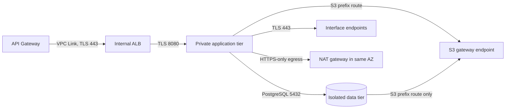

# Network module

This reusable Terraform module provisions the CardDemo VPC boundary defined by
AAP sections 0.4.1.6, 0.4.1.9, and 0.5.1.12: three availability zones, public,
private-application, and isolated-data subnet tiers, per-zone NAT egress, eight
interface endpoints, an S3 gateway endpoint, security groups, and encrypted VPC
flow logs. The security rationale is fixed by AAP decision D8 and expanded in
the existing
[security architecture](../../../docs/architecture/security-and-identity.md);
the Terraform module convention is fixed by AAP decision D9.

This README is the prose half of Rule 1 Explainability and is required by AAP
section 0.2.1.6. The mechanical half is enforced by
[TFLint](../../.tflint.hcl) and the
[terraform-docs configuration](../../.terraform-docs.yml). The four Terraform
files are the executable source of truth. `app/csd/CARDDEMO.CSD` is read-only
lineage; the migration adds this network path beside the existing mainframe
path and does not modify it.

## Topology

| Tier | Internet route | Occupants | Output |
|---|---|---|---|
| Public | Default route to the internet gateway | Internal ALB nodes and one NAT gateway per zone | `public_subnet_ids` |
| Private application | Default route to that zone's NAT gateway | ECS tasks, API Gateway VPC Link interfaces, interface endpoint ENIs | `private_app_subnet_ids` |
| Isolated data | None | Aurora PostgreSQL | `isolated_data_subnet_ids` |

The load balancer is internal even though it is placed in public subnets:
`internal = true` in the ALB module withholds public addresses and a public DNS
name. Public subnets describe routing, not direct reachability of every resource
inside them.



### Private AWS service paths

| Endpoint | Consumer |
|---|---|
| `ecr.api` | Authorises container-image pulls |
| `ecr.dkr` | Transfers container-image layers |
| `logs` | Delivers container and workflow logs |
| `secretsmanager` | Retrieves generated service credentials |
| `kms` | Performs envelope-encryption operations |
| `sqs` | Carries authorization, inquiry, and error messages |
| `states` | Starts workflows from reporting and supports orchestration calls |
| `ssm` | Reads runtime configuration and the batch read-only flag |
| S3 gateway | Routes dataset and statement object traffic through route-table prefix entries, with no endpoint ENI or hourly interface-endpoint charge |

**Assumptions:** the endpoint set is identical in dev and prod. Removing one
does not produce a cleanly degraded topology; it silently sends that service's
traffic through NAT. `interface_endpoint_services` is therefore validated
against the exact eight-entry set rather than treated as an environment lever.

## Module boundary and usage

This directory is a module, not a root. It declares no provider block, backend,
or call to a sibling module. `infra/envs/dev` and `infra/envs/prod` inherit the
root provider's Region and default tags and call this module with
`source = "../../modules/network"`.

```hcl
module "network" {
  source = "../../modules/network"

  name_prefix                = var.name_prefix
  environment                = var.environment
  vpc_cidr                   = var.vpc_cidr
  flow_log_retention_days    = var.log_retention_days
  flow_log_kms_key_arn       = module.kms.s3_key_arn
  interface_endpoint_services = [
    "ecr.api",
    "ecr.dkr",
    "logs",
    "secretsmanager",
    "kms",
    "sqs",
    "states",
    "ssm",
  ]
  tags = var.tags
}

module "service" {
  source = "../../modules/ecs-service"

  vpc_id                  = module.network.vpc_id
  private_app_subnet_ids  = module.network.private_app_subnet_ids
  security_group_ids      = [module.network.app_security_group_id]
  container_port          = module.network.app_container_port
  # Other service inputs omitted from this focused wiring example.
}

module "database" {
  source = "../../modules/aurora-postgresql"

  subnet_ids         = module.network.isolated_data_subnet_ids
  security_group_ids = [module.network.data_security_group_id]
  port               = module.network.database_port
  # Other database inputs omitted from this focused wiring example.
}
```

**Refactoring Rationale:** the two ports are module outputs even though they
begin as inputs. The environment root passes those outputs into the service and
database modules, making the security-group rule and the listener it admits one
contract rather than three repeated literals.

## Consumer contract

Renaming or removing an output is a breaking change for the consumers below.

| Output | Consumers |
|---|---|
| `vpc_id` | ALB, API Gateway, Aurora, observability |
| `vpc_cidr_block` | ALB, API Gateway, Aurora |
| `availability_zones` | Aurora and environment-root inventory |
| `public_subnet_ids` | ALB |
| `private_app_subnet_ids` | ECS services, API Gateway VPC Link, batch tasks |
| `isolated_data_subnet_ids` | Aurora |
| `alb_security_group_id` | ALB and API Gateway VPC Link |
| `app_security_group_id` | ECS services and Step Functions Fargate tasks |
| `data_security_group_id` | Aurora |
| `public_route_table_id` | Environment-root inventory |
| `private_app_route_table_ids` | Environment roots and S3 dataset wiring |
| `isolated_data_route_table_ids` | Environment-root inventory |
| `nat_gateway_ids` | Observability and environment-root inventory |
| `nat_gateway_public_ips` | Operator allow-list inventory |
| `interface_vpc_endpoint_ids` | Observability and environment-root inventory |
| `s3_gateway_endpoint_id` | S3 datasets and batch orchestration |
| `app_container_port` | Every ECS service module call |
| `database_port` | Aurora module call |

The module does not publish its endpoint security group, flow-log IAM role, or
internet gateway. No sibling attaches to those resources; publishing them would
create a second owner for an internal boundary.

## Deliberate decisions

1. **Isolated data has no default route.** **Alternatives Considered:** placing
   Aurora in the private-application tier. Rejected because no route is a
   routing fact that survives a security-group or credential mistake.
   **Trade-offs:** direct operator egress and package access from the data tier
   are unavailable.
2. **One NAT gateway is created per zone.** **Alternatives Considered:** one
   shared gateway to reduce the largest fixed network cost. Rejected because a
   zone loss would remove egress from every zone, and a differently shaped dev
   network would not validate prod.
3. **Exactly three security groups are created.** The managed-boundary group is
   attached to the VPC Link, ALB, and interface endpoint ENIs; separate rules
   distinguish self-referenced listener TLS, application-to-endpoint TLS, and
   ALB-to-application forwarding. **Alternatives Considered:** attaching
   endpoint ENIs to the application group. Rejected because a self-referenced
   443 rule would also permit task-to-task TLS.
4. **The ALB group is also the VPC Link group.** **Assumptions:** its
   self-referenced 443 rule is edge-to-listener only; a separate rule carries
   listener-to-application traffic on `app_container_port`. Reusing that
   managed-boundary identity also keeps the topology at the AAP's three groups
   without attaching the broader application identity to the edge.
5. **No subnet auto-assigns a public address.** The NAT gateways allocate their
   own Elastic IPs and the ALB is internal. Enabling auto-assignment would only
   create an unintended public-address path.
6. **S3 uses a gateway endpoint.** **Trade-offs:** it is a route-table prefix
   entry rather than an ENI with a security group and carries no interface
   endpoint hourly charge. Associating isolated route tables does not create an
   internet path because the route can reach S3 only.
7. **Subnet CIDRs are derived.** **Alternatives Considered:** three explicit
   lists of CIDRs. Nine hand-maintained blocks can overlap or drift from zone
   order; one `cidrsubnet` arithmetic cannot.
8. **VPC flow logs are owned here.** Their lifecycle follows the VPC, while the
   observability module owns dashboards, alarms, and application log groups.
   `traffic_type = "ALL"` is fixed because accepted-only and rejected-only logs
   each omit half the audit trail.

At the defaults, `10.0.0.0/16` plus four new prefix bits yields sixteen `/20`
blocks. Three zones consume nine: netnums `0..2` public, `3..5` private
application, and `6..8` isolated data. Changing `vpc_cidr` or `subnet_newbits`
after apply replaces every subnet and cascades into the resources placed in
them.

Dev and prod differ here only in `flow_log_retention_days`. Zone count, tier
layout, NAT count, endpoint set, security-group flows, and shared ports are
identical. This implements the AAP constraint that environments differ in
sizing and retention, never topology.

## Validation

All commands below are gating and have no tolerated non-zero return code.

```bash
# WHAT: verify canonical HCL formatting without rewriting committed files.
# WHY : CI checks rather than fixes, so formatting drift is a review failure.
terraform fmt -check -recursive infra/

# WHAT: initialise and validate the module without a backend.
# WHY : provider-schema validation catches invalid arguments before a root plan.
terraform -chdir=infra/modules/network init -backend=false
terraform -chdir=infra/modules/network validate

# WHAT: enforce documented, typed, used declarations and AWS-specific rules.
# WHY : a declared-but-unused contract or an invalid resource argument fails CI.
tflint --chdir=infra/modules/network --config="$(pwd)/infra/.tflint.hcl"

# WHAT: verify the generated reference below still matches the HCL.
# WHY : variable, resource, or output drift makes this README incorrect.
terraform-docs --config infra/.terraform-docs.yml \
  --output-check infra/modules/network
```

The module is authored and statically validated; applying it to a live AWS
account is an operator action outside this scope. It has not been benchmarked or
penetration-tested. The top-level [infrastructure guide](../../README.md)
defines the static-validation and operator boundary; the
[security architecture](../../../docs/architecture/security-and-identity.md)
defines the wider network boundary.

## Generated reference

<!-- BEGIN_TF_DOCS -->
### Requirements

| Name | Version |
|------|---------|
| <a name="requirement_terraform"></a> [terraform](#requirement\_terraform) | >= 1.15.0 |
| <a name="requirement_aws"></a> [aws](#requirement\_aws) | ~> 6.56 |

### Providers

| Name | Version |
|------|---------|
| <a name="provider_aws"></a> [aws](#provider\_aws) | 6.57.1 |

### Resources

| Name | Type |
|------|------|
| [aws_cloudwatch_log_group.flow_logs](https://registry.terraform.io/providers/hashicorp/aws/latest/docs/resources/cloudwatch_log_group) | resource |
| [aws_default_security_group.this](https://registry.terraform.io/providers/hashicorp/aws/latest/docs/resources/default_security_group) | resource |
| [aws_eip.nat](https://registry.terraform.io/providers/hashicorp/aws/latest/docs/resources/eip) | resource |
| [aws_flow_log.this](https://registry.terraform.io/providers/hashicorp/aws/latest/docs/resources/flow_log) | resource |
| [aws_iam_role.flow_logs](https://registry.terraform.io/providers/hashicorp/aws/latest/docs/resources/iam_role) | resource |
| [aws_iam_role_policy.flow_logs](https://registry.terraform.io/providers/hashicorp/aws/latest/docs/resources/iam_role_policy) | resource |
| [aws_internet_gateway.this](https://registry.terraform.io/providers/hashicorp/aws/latest/docs/resources/internet_gateway) | resource |
| [aws_nat_gateway.this](https://registry.terraform.io/providers/hashicorp/aws/latest/docs/resources/nat_gateway) | resource |
| [aws_route.private_app_internet](https://registry.terraform.io/providers/hashicorp/aws/latest/docs/resources/route) | resource |
| [aws_route.public_internet](https://registry.terraform.io/providers/hashicorp/aws/latest/docs/resources/route) | resource |
| [aws_route_table.isolated_data](https://registry.terraform.io/providers/hashicorp/aws/latest/docs/resources/route_table) | resource |
| [aws_route_table.private_app](https://registry.terraform.io/providers/hashicorp/aws/latest/docs/resources/route_table) | resource |
| [aws_route_table.public](https://registry.terraform.io/providers/hashicorp/aws/latest/docs/resources/route_table) | resource |
| [aws_route_table_association.isolated_data](https://registry.terraform.io/providers/hashicorp/aws/latest/docs/resources/route_table_association) | resource |
| [aws_route_table_association.private_app](https://registry.terraform.io/providers/hashicorp/aws/latest/docs/resources/route_table_association) | resource |
| [aws_route_table_association.public](https://registry.terraform.io/providers/hashicorp/aws/latest/docs/resources/route_table_association) | resource |
| [aws_security_group.alb](https://registry.terraform.io/providers/hashicorp/aws/latest/docs/resources/security_group) | resource |
| [aws_security_group.app](https://registry.terraform.io/providers/hashicorp/aws/latest/docs/resources/security_group) | resource |
| [aws_security_group.data](https://registry.terraform.io/providers/hashicorp/aws/latest/docs/resources/security_group) | resource |
| [aws_subnet.isolated_data](https://registry.terraform.io/providers/hashicorp/aws/latest/docs/resources/subnet) | resource |
| [aws_subnet.private_app](https://registry.terraform.io/providers/hashicorp/aws/latest/docs/resources/subnet) | resource |
| [aws_subnet.public](https://registry.terraform.io/providers/hashicorp/aws/latest/docs/resources/subnet) | resource |
| [aws_vpc.this](https://registry.terraform.io/providers/hashicorp/aws/latest/docs/resources/vpc) | resource |
| [aws_vpc_endpoint.interface](https://registry.terraform.io/providers/hashicorp/aws/latest/docs/resources/vpc_endpoint) | resource |
| [aws_vpc_endpoint.s3](https://registry.terraform.io/providers/hashicorp/aws/latest/docs/resources/vpc_endpoint) | resource |
| [aws_vpc_security_group_egress_rule.alb_to_app](https://registry.terraform.io/providers/hashicorp/aws/latest/docs/resources/vpc_security_group_egress_rule) | resource |
| [aws_vpc_security_group_egress_rule.app_https](https://registry.terraform.io/providers/hashicorp/aws/latest/docs/resources/vpc_security_group_egress_rule) | resource |
| [aws_vpc_security_group_egress_rule.app_to_data](https://registry.terraform.io/providers/hashicorp/aws/latest/docs/resources/vpc_security_group_egress_rule) | resource |
| [aws_vpc_security_group_egress_rule.app_to_endpoints](https://registry.terraform.io/providers/hashicorp/aws/latest/docs/resources/vpc_security_group_egress_rule) | resource |
| [aws_vpc_security_group_ingress_rule.alb_to_app](https://registry.terraform.io/providers/hashicorp/aws/latest/docs/resources/vpc_security_group_ingress_rule) | resource |
| [aws_vpc_security_group_ingress_rule.app_to_data](https://registry.terraform.io/providers/hashicorp/aws/latest/docs/resources/vpc_security_group_ingress_rule) | resource |
| [aws_vpc_security_group_ingress_rule.app_to_endpoints](https://registry.terraform.io/providers/hashicorp/aws/latest/docs/resources/vpc_security_group_ingress_rule) | resource |
| [aws_availability_zones.available](https://registry.terraform.io/providers/hashicorp/aws/latest/docs/data-sources/availability_zones) | data source |
| [aws_region.current](https://registry.terraform.io/providers/hashicorp/aws/latest/docs/data-sources/region) | data source |

### Inputs

| Name | Description | Type | Default | Required |
|------|-------------|------|---------|:--------:|
| <a name="input_environment"></a> [environment](#input\_environment) | Trailing component of the Name tag on the VPC, every subnet, every route table, every gateway, every endpoint and every security group, so one environment's network is distinguishable from another's in the same account. Required -- there is no default. Lowercase letters, digits and hyphens only, no leading or trailing hyphen, at most 16 characters. | `string` | n/a | yes |
| <a name="input_app_container_port"></a> [app\_container\_port](#input\_app\_container\_port) | TCP port admitted from the load-balancer security group to the application security group and republished for the calling root to pass into every ecs-service container and target group. The default 8080 matches the Spring Boot listeners; using the output rather than repeating the number keeps the rule and the listener aligned. | `number` | `8080` | no |
| <a name="input_az_count"></a> [az\_count](#input\_az\_count) | Number of availability zones the network spans, and therefore the number of subnets created in each of the three tiers and the number of NAT gateways. The only supported value is 3, the topology shared by dev and prod. | `number` | `3` | no |
| <a name="input_database_port"></a> [database\_port](#input\_database\_port) | TCP port admitted from the application security group to the isolated-data security group and republished for the calling root to pass into aurora-postgresql. The default 5432 matches PostgreSQL; the accepted range is the range Aurora PostgreSQL supports. | `number` | `5432` | no |
| <a name="input_flow_log_kms_key_arn"></a> [flow\_log\_kms\_key\_arn](#input\_flow\_log\_kms\_key\_arn) | ARN of a customer-managed KMS key with which to encrypt the CloudWatch Logs group receiving this VPC's flow logs. Null leaves that group on the CloudWatch Logs service-default encryption, which is what allows this module to be planned and applied without the kms module; both environment roots pass a real key, so null is the composability default rather than the intended production setting. | `string` | `null` | no |
| <a name="input_flow_log_retention_days"></a> [flow\_log\_retention\_days](#input\_flow\_log\_retention\_days) | Days the CloudWatch Logs group receiving this VPC's flow logs retains events before they age off, or 0 to retain them indefinitely. This is the one value in this module the dev and prod roots are expected to set differently, and it is the direct analogue of how long a mainframe job log was kept before it aged off the spool. | `number` | `30` | no |
| <a name="input_interface_endpoint_services"></a> [interface\_endpoint\_services](#input\_interface\_endpoint\_services) | Exact set of short AWS service names given private interface endpoints in every environment: ecr.api and ecr.dkr for image pulls, logs for delivery, secretsmanager for credentials, kms for envelope operations, sqs for messaging, states for workflow calls and ssm for configuration. main.tf expands each short name into its Region-qualified service name; S3 is excluded because it uses the separate gateway endpoint. | `set(string)` | <pre>[<br/>  "ecr.api",<br/>  "ecr.dkr",<br/>  "logs",<br/>  "secretsmanager",<br/>  "kms",<br/>  "sqs",<br/>  "states",<br/>  "ssm"<br/>]</pre> | no |
| <a name="input_name_prefix"></a> [name\_prefix](#input\_name\_prefix) | Leading component of the Name tag on every resource this module creates, ahead of the tier and the environment, giving the whole network one greppable identity shared with the rest of the stack. Lowercase letters, digits and hyphens only, no leading or trailing hyphen, at most 32 characters. | `string` | `"carddemo"` | no |
| <a name="input_subnet_newbits"></a> [subnet\_newbits](#input\_subnet\_newbits) | Number of bits cidrsubnet adds to the vpc\_cidr prefix when carving each subnet, which fixes every subnet's size: at the default /16 and 4 additional bits each subnet is a /20. It must admit at least `3 * az_count` distinct subnets, because the three tiers are taken from consecutive netnum ranges of the one block rather than from separate per-tier address lists. | `number` | `4` | no |
| <a name="input_tags"></a> [tags](#input\_tags) | Additional tags merged onto every taggable resource this module creates, on top of the provider-level default\_tags the calling root sets and underneath the per-resource Name tag this module composes. Network-specific tags belong here; tags common to the whole stack belong on the root's provider block, so that every module receives them without being passed them. | `map(string)` | `{}` | no |
| <a name="input_vpc_cidr"></a> [vpc\_cidr](#input\_vpc\_cidr) | IPv4 address space the VPC occupies, and the only addressing value this module takes. main.tf subdivides it into `3 * az_count` equally sized subnets -- one public, one private-application and one isolated-data subnet per availability zone -- each `subnet_newbits` bits longer than this prefix, so the block must be large enough to accommodate them all. Changing it after apply forces replacement of the VPC and of every subnet in it. | `string` | `"10.0.0.0/16"` | no |

### Outputs

| Name | Description |
|------|-------------|
| <a name="output_alb_security_group_id"></a> [alb\_security\_group\_id](#output\_alb\_security\_group\_id) | Identifier of the managed-boundary security group shared by the API Gateway VPC Link, internal ALB and interface endpoint ENIs; its rules separate listener, endpoint and ALB-to-application flows by source group and port. |
| <a name="output_app_container_port"></a> [app\_container\_port](#output\_app\_container\_port) | Application listener port enforced by the ALB-to-application security-group rules; pass this output to every ecs-service container and target group. |
| <a name="output_app_security_group_id"></a> [app\_security\_group\_id](#output\_app\_security\_group\_id) | Identifier of the application-tier security group attached to ECS service and batch-task interfaces; it admits ALB traffic and permits only the declared dependency flows. |
| <a name="output_availability_zones"></a> [availability\_zones](#output\_availability\_zones) | Ordered availability-zone names used by all three subnet tiers. Every subnet-id list below follows this same order. |
| <a name="output_data_security_group_id"></a> [data\_security\_group\_id](#output\_data\_security\_group\_id) | Identifier of the isolated-data security group attached to Aurora, admitting PostgreSQL sessions from the application-tier group only. |
| <a name="output_database_port"></a> [database\_port](#output\_database\_port) | Aurora PostgreSQL listener port enforced by the application-to-data security-group rules; pass this output to aurora-postgresql. |
| <a name="output_flow_log_group_arn"></a> [flow\_log\_group\_arn](#output\_flow\_log\_group\_arn) | CloudWatch log-group ARN without the trailing stream wildcard, for IAM policies that grant read access to VPC flow records without granting access to every log group. |
| <a name="output_flow_log_group_name"></a> [flow\_log\_group\_name](#output\_flow\_log\_group\_name) | Exact CloudWatch log-group name receiving VPC flow records. Pass this to observability.vpc\_flow\_log\_group\_name so its Logs Insights widget queries the group this module actually created. |
| <a name="output_flow_log_id"></a> [flow\_log\_id](#output\_flow\_log\_id) | Identifier of the VPC flow-log resource for inventory and diagnostics that need to distinguish the delivery configuration from its destination log group. |
| <a name="output_interface_vpc_endpoint_ids"></a> [interface\_vpc\_endpoint\_ids](#output\_interface\_vpc\_endpoint\_ids) | Map from short AWS service name to the interface VPC endpoint identifier that provides its private path. |
| <a name="output_isolated_data_route_table_ids"></a> [isolated\_data\_route\_table\_ids](#output\_isolated\_data\_route\_table\_ids) | Map from availability-zone name to the isolated-data route-table identifier. These tables have no default route; only the service-specific S3 gateway route is added. |
| <a name="output_isolated_data_subnet_ids"></a> [isolated\_data\_subnet\_ids](#output\_isolated\_data\_subnet\_ids) | Ordered identifiers of the isolated data subnets, one per availability zone, whose route tables contain no default route and which form the Aurora DB subnet group. |
| <a name="output_nat_gateway_ids"></a> [nat\_gateway\_ids](#output\_nat\_gateway\_ids) | Map from availability-zone name to the NAT gateway serving the private application subnet in that zone. |
| <a name="output_nat_gateway_public_ips"></a> [nat\_gateway\_public\_ips](#output\_nat\_gateway\_public\_ips) | Map from availability-zone name to the Elastic IP attached to that zone's NAT gateway, for allow-listing and operational inventory. |
| <a name="output_private_app_route_table_ids"></a> [private\_app\_route\_table\_ids](#output\_private\_app\_route\_table\_ids) | Map from availability-zone name to the private-application route-table identifier whose default route targets that zone's NAT gateway. |
| <a name="output_private_app_subnet_ids"></a> [private\_app\_subnet\_ids](#output\_private\_app\_subnet\_ids) | Ordered identifiers of the private application subnets, one per availability zone, for ECS tasks, API Gateway VPC Link interfaces and interface endpoint ENIs. |
| <a name="output_public_route_table_id"></a> [public\_route\_table\_id](#output\_public\_route\_table\_id) | Identifier of the public route table whose default route targets the internet gateway and which is associated only with public subnets. |
| <a name="output_public_subnet_ids"></a> [public\_subnet\_ids](#output\_public\_subnet\_ids) | Ordered identifiers of the public subnets, one per availability zone, for the internal ALB and the zone-local NAT gateways. |
| <a name="output_s3_gateway_endpoint_id"></a> [s3\_gateway\_endpoint\_id](#output\_s3\_gateway\_endpoint\_id) | Identifier of the S3 gateway endpoint associated with the private-application and isolated-data route tables. |
| <a name="output_vpc_cidr_block"></a> [vpc\_cidr\_block](#output\_vpc\_cidr\_block) | IPv4 CIDR block of the VPC, published for consumers that must scope an AWS rule or validate that an address belongs to this network without repeating the input. |
| <a name="output_vpc_id"></a> [vpc\_id](#output\_vpc\_id) | Identifier of the VPC that owns every subnet, route table, security group and endpoint this module creates; consumed by the ALB, API Gateway, Aurora and observability modules. |
<!-- END_TF_DOCS -->
