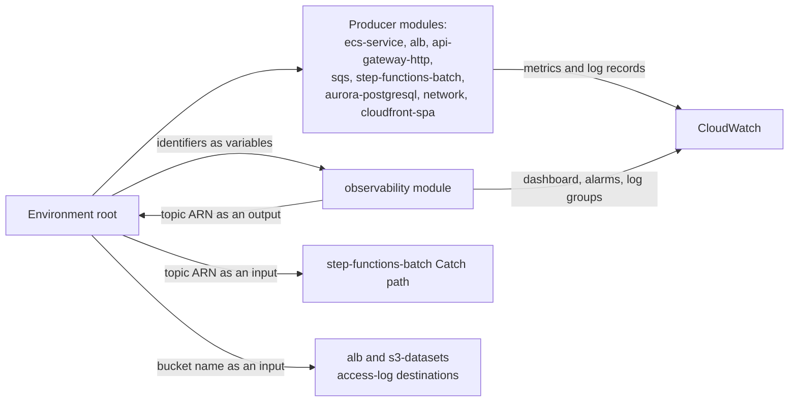

# CardDemo observability module

**Why this document exists.** It is the **prose half** of the project's HCL
documentation obligation. HCL has no docstring construct, so Rule 1
"Explainability" is discharged for a Terraform directory in two halves: a
file-header block in every `.tf` file, a `description` on every `variable` and
`output`, and a why-comment on each non-obvious resource argument — the
machine-checked half, gated by [`infra/.tflint.hcl`](../../.tflint.hcl) and
[`infra/.terraform-docs.yml`](../../.terraform-docs.yml) — plus a `README.md` in
every module directory and both environment roots, which is this half. The
convention and the split are stated normatively in
[`docs/CODE_DOCUMENTATION_STANDARD.md`](../../../docs/CODE_DOCUMENTATION_STANDARD.md),
and the same obligation already governs the repository's existing test suite
([`tests/README.md`](../../../tests/README.md) §12, "Explainability rule
(mandatory)"). Rule 1 and established house convention therefore agree; nothing
here is a new standard.

Rule 1 asks a docstring for four things. Markdown has no docstring either, so
they map onto sections:

| Rule 1 element | Where it is discharged |
|---|---|
| **Purpose** | [§1](#1-purpose), and the measured surface it replaces in [§2](#2-the-measured-job-log-surface-this-module-replaces) |
| **Parameters** | [§7](#7-contract-reference-generated) generated Inputs table, plus [§8](#8-inputs-that-need-more-than-a-table-cell) for the inputs a table cell cannot explain |
| **Return values** | [§7](#7-contract-reference-generated) generated Outputs table, plus [§9](#9-outputs-and-their-consumers), which names a consumer for every output |
| **Exceptions or errors** | [§14](#14-caveats-and-troubleshooting) — what fails, what degrades, and the boundary of what has been proven |

Every non-obvious decision below carries a rationale tagged with one of Rule 1's
four categories, spelled as the rule spells them: `Assumptions:`,
`Trade-offs:`, `Alternatives Considered:`, `Refactoring Rationale:`. The
consolidated set is in [§12](#12-why-non-obvious-design-decisions).

---

## 1. Purpose

This module creates CardDemo's shared operational surface: **log groups,
dashboards, alarms and an SNS topic**. It is the cross-cutting module of the
package — most of what it watches is created elsewhere, and it is the only place
those signals are brought together:

- `step-functions-batch` takes this module's topic ARN as the target its nightly
  chain's `Catch` path publishes a failure to;
- `eventbridge-scheduler` does **not** use this topic as its dead-letter target: it
  routes undeliverable schedule invocations to the SQS **error queue**, because its
  `dead_letter_arn` input validates the value against an SQS queue ARN and rejects
  anything else, and both environment roots pass `module.sqs.error_queue_arn`;
- `ecs-service` owns each service's log group, and the meters those services
  export through Micrometer surface on this module's dashboard;
- `network`, `api-gateway-http`, `alb`, `sqs`, `aurora-postgresql` and
  `cloudfront-spa` each publish metrics or log records that this module's
  widgets and alarms read.

What it owns outright is narrower than what it displays: one dashboard, thirteen
metric alarms, one SNS topic with its policy and optional subscriptions, one
shared access-log bucket, and a log group **only** for a producer that owns no
group resource of its own.

It is a reusable **module**, not a Terraform root. It declares no `provider` and
no `backend`, and it is never applied on its own — see
[§6](#6-usage-this-is-a-module-not-a-root).

---

## 2. The measured job-log surface this module replaces

The figures below were counted from the baseline on the source branch, not
estimated, and [§14](#14-caveats-and-troubleshooting) gives the commands that
reproduce them. They are what turns "this module adds logging" into a claim a
reader can check.

Across the **38** members of [`app/jcl`](../../../app/jcl), `SYSOUT=*` appears
**116** times and `//SYSPRINT` appears **80** times. Every one of those 116
occurrences resolves to one of six DD names, and the six sum to exactly 116,
which is what shows the census is complete rather than merely large:

| Output DD | Occurrences | What it carried |
|---|---|---|
| `SYSPRINT` | 80 | Utility and runtime messages |
| `SYSOUT` | 18 | COBOL `DISPLAY` output |
| `ISFOUT` | 8 | SDSF operator-command output |
| `CMDOUT` | 8 | SDSF command responses |
| `SYSTSPRT` | 1 | TSO terminal output |
| `OUTDD` | 1 | CSD utility report |
| **Total** | **116** | Equal to the total `SYSOUT=*` count |

The step census explains why the target's batch log surface is not organised
around 38 jobs. `EXEC PGM=` resolves to **IDCAMS 61 · SDSF 8 · IEBGENER 6 ·
IEFBR14 5 · SORT 4 · IKJEFT1B 1 · FTP 1 · DFHCSDUP 1 · COBSWAIT 1**, plus
exactly **ten** COBOL business programs at one step each. That is **88 utility
steps to 10 business steps**, near enough nine to one. Most of the baseline's
step count is dataset definition, deletion and copying rather than business
work, so the target's unit of batch log addressability is the **eleven Step
Functions states** of the nightly chain, not the 38 job members.

- Refactoring Rationale: **what was wrong with the baseline arrangement was its
  addressability, not its content.** The 116 spool destinations carried the
  right information; each was retrieved one job at a time by an operator who
  already knew which job to open. The target needs the same content queryable
  *across* services and correlatable across a whole request or batch execution,
  and it needs a condition to be **pushed** rather than to wait until somebody
  opens a job log. A log group with explicit retention plus an alarm that
  publishes is that same content under a different access path. The full
  treatment is in
  [`docs/architecture/observability.md`](../../../docs/architecture/observability.md).

### 2.1 Three consequences of the census

**One — the operator-command streams are in five files, and the quiesce and
resume states are not the only ones affected.** `ISFOUT` and `CMDOUT` are SDSF's
output and command-response streams, and they appear 8 times each across
**five** members — `CARDFILE.jcl` (2 each), `CLOSEFIL.jcl` (1 each),
`CUSTFILE.jcl` (2 each), `OPENFIL.jcl` (1 each) and `TRANFILE.jcl` (2 each) —
matching the 8 `EXEC PGM=SDSF` steps exactly.
[`app/jcl/CLOSEFIL.jcl`](../../../app/jcl/CLOSEFIL.jcl) and
[`app/jcl/OPENFIL.jcl`](../../../app/jcl/OPENFIL.jcl) share one shape:
`EXEC PGM=SDSF` at L22, `//ISFOUT DD SYSOUT=*` at L23, `//CMDOUT DD SYSOUT=*`
at L24, `//ISFIN DD *` at L25, then five `CEMT SET FIL(...) CLO` or `... OPE`
operator commands at L26–L30. The three master-refresh loaders carry the same
bracket inline, which is why two each appear in `CARDFILE`, `CUSTFILE` and
`TRANFILE`.

  - Assumptions: the consequence is that the chain's **quiesce and resume states
    need a log destination of their own, and so do the dataset-staging
    branches** — an operator action that opens or closes a file is exactly the
    record wanted when a later state behaves unexpectedly. Those states are
    Lambda-backed and own no log group resource, which is precisely the case the
    `log_group_names` input serves.

**Two — `OUTDD` is a documented non-target.** It appears exactly once, at
[`app/jcl/CBADMCDJ.jcl`](../../../app/jcl/CBADMCDJ.jcl) L31
(`//OUTDD    DD  SYSOUT=*`), beside `//SYSPRINT DD SYSOUT=*` at L32, inside
`//STEP1   EXEC PGM=DFHCSDUP` at L27 — the CICS resource-definition deployment
job. **No CloudWatch log group corresponds to it.** The equivalent record for
deploying the target's own resource definitions is the CI job log plus the
uploaded plan artifact of
[`.github/workflows/infra-ci.yml`](../../../.github/workflows/infra-ci.yml).
Stated here so a reader does not go looking for a log group that is deliberately
absent.

**Three — two spool streams become one log stream.** Every COBOL business step
declares both, and the pairing is consistent enough to be a contract rather than
a habit: `POSTTRAN.jcl` L26/L27 under `//STEP15 EXEC PGM=CBTRN02C` at L23;
`INTCALC.jcl` L25/L26 under `//STEP15 EXEC PGM=CBACT04C,PARM='2022071800'` at
L22; `CREASTMT.JCL` L46/L47 under the sort step and L81/L82 under
`EXEC PGM=CBSTM03A` at L79; `TRANREPT.jcl` L50 under the sort step and L62/L63
under `EXEC PGM=CBTRN03C` at L59. Even the shared procedure carries its own:
[`app/proc/REPROC.prc`](../../../app/proc/REPROC.prc) declares
`//PRC001 EXEC PGM=IDCAMS` at L21 with `//SYSPRINT DD SYSOUT=*` at L22.
`SYSPRINT` carried runtime and utility messages; `SYSOUT` carried the program's
own `DISPLAY` output.

  - Trade-offs: **a Fargate task collapses stdout and stderr into a single
    CloudWatch log stream, so the two streams merge.** This is an accepted
    consequence, named rather than discovered: what is lost is the ability to
    read utility messages separately from application output by choosing a
    destination. What replaces it is field-level attribution — the shared
    console pattern carries service, environment, version and correlation
    fields — so the same separation is recoverable by query instead of by
    stream. The alternative, two log groups per task with a redirected stream,
    was rejected because it doubles the group count and the retention and key
    configuration attached to it while making a single-execution read require
    two queries.

### 2.2 Why retention is always set explicitly

`MSGCLASS=0` appears on **29 of the 38** job cards. Of the remaining nine, eight
use `MSGCLASS=H` (`CBADMCDJ`, `CREASTMT`, `DUSRSECJ`, `ESDSRRDS`, `FTPJCL`,
`INTRDRJ1`, `INTRDRJ2`, `READACCT`) and one uses `MSGCLASS=X` (`TXT2PDF1`).

- Refactoring Rationale: **a job log's survival was a side effect of a spool
  class chosen per job card, and for 29 of 38 jobs it was effectively
  transient.** That measurement, not a general preference, is why
  `log_retention_days` has no unlimited fallback: every group this module
  creates gets a finite, declared retention, and the value is an environment
  input rather than a per-producer decision. The property gained is that "how
  long is this kept" has one answer per environment that can be read without
  opening 38 files.

### 2.3 Why there is one SNS topic per environment

**All 38 job cards carry a `NOTIFY=` operand.** The baseline already pushed
notification to a named recipient; it was addressed to a TSO user id.

- Refactoring Rationale: **the topic is a continuation of an existing habit, not
  a new capability.** What changes is the address and the granularity: 38
  per-job targets become one per-environment target.
- Trade-offs: **one topic per environment, rather than one per alarm family.**
  Two specific properties decided it. Subscription policy is configured
  **once** — who is told, and by what means, is a single decision rather than
  one per alarm, so adding an alarm cannot leave it with nobody subscribed, and
  an alarm nobody is subscribed to is indistinguishable from one that never
  fires. And an environment's entire alerting surface can be muted or
  redirected **atomically** during a maintenance window by changing one
  subscription, instead of by editing every alarm and having to restore them
  all afterwards. The rejected alternative — a topic per family, so messaging
  alerts and batch alerts could be routed to different recipients — buys
  routing granularity that the same effect can be had from by filtering on the
  subscriber side, and costs the atomic mute. The baseline makes the contrast
  concrete: redirecting its notification surface would mean editing 38 job
  cards.
- Assumptions: **no contact detail appears anywhere in this repository.** The
  `alarm_email_endpoints` input defaults to empty, and subscriptions are
  supplied at apply time. The same discipline covers every generated name: the
  topic, the dashboard, the log groups and all thirteen alarms are composed from a
  prefix and an environment, so no account identifier, endpoint or hostname
  appears in a name this module creates.

---

## 3. The baseline already had structured logging

This is the framing the rest of the design follows from: **the target formalises
an existing concept rather than inventing one.**

[`app/app-authorization-ims-db2-mq/cpy/CCPAUERY.cpy`](../../../app/app-authorization-ims-db2-mq/cpy/CCPAUERY.cpy)
declares `01 ERROR-LOG-RECORD.` at **L19** — uniquely among the extension
payload copybooks it carries its own `01` level rather than being a subordinate
group — with eleven fields whose declared widths sum to **122 bytes**:

| Line | Field | Picture | Relevance to the target |
|---|---|---|---|
| L20 | `ERR-DATE` | `X(06)` | Six characters cannot express a four-digit year |
| L21 | `ERR-TIME` | `X(06)` | |
| L22 | `ERR-APPLICATION` | `X(08)` | The ancestor of the `service` metric tag |
| L23 | `ERR-PROGRAM` | `X(08)` | Exactly the resource-definition program-name width |
| L24 | `ERR-LOCATION` | `X(04)` | |
| L25 | `ERR-LEVEL` | `X(01)` | **Four** values at L26–L29: `'L'` log, `'I'` info, `'W'` warning, `'C'` critical |
| L30 | `ERR-SUBSYSTEM` | `X(01)` | **Six** values at L31–L36: `'A'` application, `'C'` CICS, `'I'` IMS, `'D'` Db2, `'M'` MQ, `'F'` file |
| L37 | `ERR-CODE-1` | `X(09)` | Sized for a platform status code |
| L38 | `ERR-CODE-2` | `X(09)` | |
| L39 | `ERR-MESSAGE` | `X(50)` | |
| L40 | `ERR-EVENT-KEY` | `X(20)` | **The baseline's own correlation identifier** |

Emission is already centralised.
[`COPAUA0C.cbl`](../../../app/app-authorization-ims-db2-mq/cbl/COPAUA0C.cbl)
defines the paragraph `9500-LOG-ERROR` at L983 and performs it from **fourteen**
call sites — L282, L316, L429, L500, L512, L547, L560, L595, L608, L639, L778,
L846, L931 and L975 — writing the record with
`LENGTH OF ERROR-LOG-RECORD` at L1004.

- Assumptions: **fourteen is the measured count and a figure of ten is in
  circulation.** The shorter figure omits four sites: the reply put, both
  segment writes and the queue close. The line numbers are listed above so the
  discrepancy is resolvable by inspection rather than by trusting either
  figure — the reproduction command is in
  [§14](#14-caveats-and-troubleshooting).
- Trade-offs: **the level mapping is a decision, not an identity.** The baseline
  has no debug level and no split between error and fatal — `'C'` is its single
  fatal value — so mapping its four values onto a conventional five-level scheme
  requires choosing, and the choice is recorded in
  [`docs/architecture/observability.md`](../../../docs/architecture/observability.md)
  rather than duplicated here.
- Assumptions: **the subsystem dimension is retained while its values are
  re-based.** Three of the six name platforms the migration does not carry
  forward — CICS, IMS and MQ — so keeping the value set unchanged would label
  target records with components that do not exist, while dropping the dimension
  would lose the ability to ask which layer a failure came from. The dimension
  is kept; the domain is re-based.

---

## 4. What the baseline did not retain, stated factually

Every one of the eight `DEFINE FILE` stanzas in
[`app/csd/CARDDEMO.CSD`](../../../app/csd/CARDDEMO.CSD) carries the same nine
attributes: `JOURNAL(NO)`, `JNLREAD(NONE)`, `JNLSYNCREAD(NO)`, `JNLUPDATE(NO)`,
`JNLADD(NONE)`, `JNLSYNCWRITE(YES)`, `RECOVERY(NONE)`, `FWDRECOVLOG(NO)` and
`BACKUPTYPE(STATIC)` — six journalling attributes plus recovery, forward
recovery and backup type. Beyond the job spool there was no per-record audit
trail.

The same file defines `TDQUEUE(JOBS)` at L499–L505 with `DDNAME(INREADER)` and
**`ERROROPTION(IGNORE)`** at L501. A failure writing the ad-hoc job-submission
queue was discarded without a record, which is the concrete failure mode a
report-submission alarm now covers: the target's equivalent submission is a
state-machine execution whose failure is a metric.

This is a description of a coherent operational model for its platform, not a
criticism of one. All of [`app/**`](../../../app) is reference-only, and the
migration adds a path rather than removing one: the job-log path, the resource
definitions and the programs are untouched and remain runnable.

---

## 5. Alarms: condition, question, action

`main.tf` authors **thirteen** `aws_cloudwatch_metric_alarm` resources. Each row
below states the condition, the question the condition answers and the action it
enables. Every alarm publishes both its `ALARM` and its `OK` transition to this
module's topic.

**A threshold here is a detection default, not a target.** The repository defines
no service-level objectives and this module invents none — see
[§11](#11-what-this-module-deliberately-does-not-create).

| # | Alarm resource | Condition | Question it answers | Action it enables |
|---|---|---|---|---|
| 1 | `service_unhealthy` | Unhealthy target count above zero in a service's target group | Is this service's task failing its health check | Replace the task, or roll back the image the `version` tag names |
| 2 | `service_no_healthy_targets` | Minimum healthy target count below one, missing data treated as breaching | Is this service serving at all | Read the task's stopped reason and log stream, then correct the image, configuration or health-check contract |
| 3 | `service_5xx` | Server-error responses counted by the load balancer for one service | Is one service failing requests | Correlate that service's log stream, then roll back or scale |
| 4 | `api_5xx` | Server-error responses returned at the HTTP API | Is the failure at the edge or integration boundary rather than inside a service | Compare the API access log against rows 3 and 1 for the same window |
| 5 | `dead_letter_depth` | Visible messages in any dead-letter queue | Has any message failed every one of its configured receives | Investigate that message, then redrive |
| 6 | `reply_queue_age` | Oldest-message age on a reply queue | Are replies being consumed before they can expire | Inspect the waiting requester by correlation identifier |
| 7 | `work_queue_age` | Oldest-message age on a request or error queue | Is the consumer for this queue still taking work off it | Inspect that consumer's task, and check row 2 for its service |
| 8 | `rotation_failure` | Invocation errors reported by a credential-rotation function | Did a scheduled rotation fail and leave the secret on its previous version | Inspect that function's log stream and re-run the rotation before a task placement presents a credential the database no longer accepts |
| 9 | `batch_failure` | `ExecutionsFailed`, `ExecutionsTimedOut` or `ExecutionThrottled` on the nightly chain, one alarm per metric | Did the chain fail, or refuse to start at all | Redrive from the failed state |
| 10 | `aurora_cpu` | Cluster processor utilisation | Is the workload pressed against its configured capacity | Compare capacity and connection counts before changing sizing |
| 11 | `aurora_capacity` | Serverless capacity against `aurora_max_capacity` | Is the cluster at the ceiling the environment root itself configured | Review the workload before raising the maximum |
| 12 | `aurora_connections` | Cluster connection count against the total every configured pool could open at full autoscale | Is the cluster running out of **connections** before it runs out of **capacity** | Reduce a service's pool size or bound its maximum task count — both compute-side configuration |
| 13 | `cloudfront_5xx` | Server-error **rate** at the distribution | Is the static delivery path failing, as distinct from the API path row 4 watches | Compare the origin bucket's access log before redeploying the built assets |

Four points about that table are decisions rather than mechanics.

- Assumptions: **rows 1, 2, 3, 4, 5, 8 and 9 are structural — the condition is a
  failure by definition, not by comparison with a chosen number.** A target the
  load balancer has already classified unhealthy is unhealthy on the load
  balancer's own authority; a 5xx is a server-side error by definition; a
  rotation error is a discrete reported event; a failed execution is a failure
  the state machine itself declared. This matters because it is what makes those
  rows defensible without an objective to compare against.
- Refactoring Rationale: **row 5's threshold is derived, not chosen, and it is
  the template for the rest.** A message reaches a dead-letter queue only after
  exhausting `maxReceiveCount`, which the messaging design sets to **5**. Any
  depth at all therefore already means five failed receives have happened, so
  the smallest breachable value is the correct one and no tuning judgement is
  involved. This is the highest-signal messaging alarm for the same reason:
  nothing else produces the signal.
- Assumptions: **rows 6 and 7 are not redundant with row 5, and row 7 covers a
  case row 5 structurally cannot.** A message reaches a dead-letter queue only
  if a consumer received and failed it. A consumer that has stopped receiving
  entirely leaves the dead-letter queue empty and its alarm in `OK` while work
  accumulates on the live queue, so an age alarm on the primary queue is the
  only row that speaks. Row 6 is the observable form of the request/reply expiry
  gap: `COPAUA0C.cbl` sets the reply expiry to `50` at L750 in tenths of a
  second and the receive wait to `5000` at L242 in milliseconds — two units, the
  same five seconds, in one program — and the target queue service has no
  per-message expiry, so an unconsumed reply is the case the queue cannot
  discard for itself. The resolution is recorded in
  [`docs/adr/ADR-004-messaging.md`](../../../docs/adr/ADR-004-messaging.md) and
  the contract in
  [`docs/architecture/messaging-contracts.md`](../../../docs/architecture/messaging-contracts.md).
- Assumptions: **the load-balancer rows dimension on the ARN *suffix*, never a
  full ARN.** CloudWatch's `AWS/ApplicationELB` dimensions take the suffix form
  the provider returns as a separate attribute. A full ARN is accepted by
  Terraform, creates an alarm successfully, and then receives no datapoint
  ever — so the alarm appears configured while being unable to fire. The
  variables carry a validation that rejects the full-ARN form for exactly this
  reason.

Two conditions worth watching have **no alarm resource**, and their absence is a
decision. A state entering its `Catch` path is not itself a CloudWatch metric, so
alarming on it requires a metric filter or an explicitly published metric; pool
**acquisition** failure inside a task needs an application meter that reaches a
namespace before it can be alarmed on. Both are recorded in
[`docs/architecture/observability.md`](../../../docs/architecture/observability.md)
rather than silently omitted. `ExecutionsAborted` is also deliberately not
watched: an abort is ordinarily somebody's deliberate act, so alarming on it
would notify whoever just performed the stop.

Refactoring Rationale: **that second omission used to be stated more broadly than
it holds, and row 12 is the difference.** "Connection-pool exhaustion" names two
distinct saturations that publish to two different places, and only one of them is
out of reach. Pool *acquisition* failure is a HikariCP meter, reported per pool name
by each service's Micrometer registry, and remains unalarmable here. The *cluster's*
connection count is an ordinary `AWS/RDS` metric on the `DBClusterIdentifier`
dimension — one this module was already graphing on its dashboard — so the
application-meter argument never applied to it, and it was covering a gap rather
than explaining one. Row 12 alarms it, with a threshold derived rather than chosen:
the environment root multiplies each service's configured pool size by that
workload's maximum task count and sums the products, which is the relationship
`ADR-003` states as tasks times pool size rather than tasks plus pool size. Row 12
can breach while rows 10 and 11 both stay `OK`, which is precisely the risk
`ADR-003` names — a wide scale-out exhausting connections before it exhausts
capacity.

### 5.1 The batch outcome model is graded, and warn is green

The baseline expresses step gating as a graded condition code, and the two forms
are different instruments:

- [`app/jcl/TRANBKP.jcl`](../../../app/jcl/TRANBKP.jcl) L51 —
  `//STEP10 EXEC PGM=IDCAMS,COND=(4,LT)` — a **soft-warn** gate: the step runs
  when the code is 4 or lower, so a warning does not stop the sequence. It is
  job-local, gating an `IDCAMS` step against earlier steps of that same job, and
  it is evidence about the gate *vocabulary* rather than about posting.
- [`app/jcl/CREASTMT.JCL`](../../../app/jcl/CREASTMT.JCL) L56, L66 and L79 —
  `COND=(0,NE)` — **clean-only** gates that require every predecessor to have
  ended at zero.
- The posting warn tier itself comes from the program:
  [`app/cbl/CBTRN02C.cbl`](../../../app/cbl/CBTRN02C.cbl) L229–L230 reads
  `IF WS-REJECT-COUNT > 0` then `MOVE 4 TO RETURN-CODE`.
- A third form shares the keyword and is not a gate at all:
  `TRANREPT.jcl` L47's `INCLUDE COND=(...)` is a record-selection predicate
  inside a sort step, which becomes a SQL `WHERE` clause. Conflating it with a
  step gate is an easy mistake because the keyword is identical.

The rubric is fixed by two independent citations, which is what makes it a
contract rather than a convention:
[`tests/README.md`](../../../tests/README.md) §8 documents it — heading at L412,
the aggregation rule "**aggregate the worst (highest) code** seen" at L415, and
the table at L417–L423 giving **0** pass, **4** warn or soft reject, **8** fail,
**16** fatal and **2** usage — and
[`.github/workflows/tests.yml`](../../../.github/workflows/tests.yml) restates it
independently at L28–L38.

- Assumptions: **`batch_failure` fires on the fail tier only, and a night with
  business-rule rejects is a successful execution carrying a warning record.**
  Written the obvious way — notify on any non-zero exit — the alarm would fire
  on every run that correctly wrote a reject, which is a 4, while the pipeline
  beside it treated that same run as passing. Two systems would then disagree
  about what healthy means, and the disagreement would present as a stream of
  alerts nobody can act on. The warn tier is therefore a distinct edge with its
  own record, not a degenerate failure.

> **The existing COBOL suite's documented warn-level aggregate return code is the
> GREEN state, and it must not be read as a regression introduced by this
> migration work.** Its cause is named in the workflow itself at L34–L35 and in
> [`tests/README.md`](../../../tests/README.md) §1.1: two of the twelve batch
> programs declare a record key on their file description that is defined only in
> working storage and not in the file's record, so they do not compile under the
> open-source compiler and their integration test is skipped with that exact
> reason. **No COBOL is changed to address this.** The baseline is
> reference-only; the divergence is registered in
> [`docs/architecture/cobol-to-service-traceability.md`](../../../docs/architecture/cobol-to-service-traceability.md),
> which owns the divergence register.

---

## 6. Usage: this is a module, not a root

```hcl
module "observability" {
  source = "../../modules/observability"

  # Assumptions: every monitored identifier is a variable the ROOT supplies from
  # a producer module's output. See the generated Inputs table in section 7 for
  # the twelve required inputs and the seventeen that carry defaults.
}
```

The three Terraform roots in this package are
[`infra/bootstrap`](../../bootstrap), [`infra/envs/dev`](../../envs/dev) and
[`infra/envs/prod`](../../envs/prod). This directory is none of them. It is
**never applied directly**; it is validated **transitively** when a calling root
initialises without a backend and validates — see
[§13](#13-validation). Full deploy and teardown sequences are in
[`infra/README.md`](../../README.md) and are not duplicated here.

Three absences in this module are decisions, and each is recorded because a
reader who finds nothing cannot otherwise distinguish a considered omission from
an oversight.

- Alternatives Considered: **no `provider` block.** Mirroring
  [`infra/bootstrap`](../../bootstrap), which legitimately owns the only
  `provider "aws"` block in its configuration, was rejected — bootstrap *is* a
  root, and this is not. A provider block inside a shared module fixes region and
  credentials at the module rather than at the environment, so `dev` and `prod`
  could no longer differ; it displaces the root's `default_tags`, dropping
  package-wide tagging from every log group, alarm and topic created here; and it
  breaks the credential-free `init -backend=false` path that makes static
  validation possible in CI without an account. With no provider block the module
  inherits the calling root's configuration, which is what lets one module body
  serve both environments. That contrast is stated explicitly so a future reader
  does not "fix" this module by adding one.
- Assumptions: **no `backend` block.** A backend is valid only in a root module,
  so including one here would not merely be redundant — it would fail `init` for
  every root that calls this module.
- Trade-offs: **no `hashicorp/random` provider,** even though the package as a
  whole pins one. That provider exists to generate credentials at apply time, and
  this module generates no random value. Declaring it anyway would trip tflint's
  `terraform_unused_required_providers` rule and would make every caller resolve
  a provider it never uses.

**Wiring rule:** every monitored identifier arrives as a variable **supplied by
the environment root, never by a sibling `module` reference.** A direct
`module.alb.*` reference inside this module would couple the two and destroy
independent reuse — the module could then only be instantiated in a
configuration that also instantiates that exact sibling. Composition stays in the
root, where a producer-to-consumer dependency is visible in one file. The flow is
one-way:



Ownership stays with the producer wherever the resource's lifecycle is
inseparable from it:

| Surface | Owning module | How this module consumes it |
|---|---|---|
| Per-service log groups | `ecs-service` | Dashboard widgets and alarm dimensions, via root-supplied identifiers |
| API access-log group | `api-gateway-http` | Edge metrics and widgets |
| State-machine execution history | `step-functions-batch` | Batch metrics and the `Catch` notification target |
| VPC flow-log group | `network` | A dashboard log query |
| A producer with no group of its own | **this module**, from `log_group_names` | Created here, then published back for the producer's own configuration |
| ALB and dataset access logs | **this module** owns the destination bucket | Bucket name published as an output the root passes to both producers |

---

## 7. Contract reference (generated)

Everything between the two markers below is generated from this directory's own
`.tf` files by [`infra/.terraform-docs.yml`](../../.terraform-docs.yml) and is
the authoritative reference for inputs and outputs.

**Do not hand-edit inside the markers, and do not add a competing table outside
them.** Two tables drift and only one is checked. Regenerate after any change to
a variable, an output, a version constraint or a resource — the command is in
[§13](#13-validation).

<!-- BEGIN_TF_DOCS -->
### Requirements

| Name | Version |
|------|---------|
| <a name="requirement_terraform"></a> [terraform](#requirement\_terraform) | >= 1.15.0 |
| <a name="requirement_aws"></a> [aws](#requirement\_aws) | ~> 6.56 |

### Providers

| Name | Version |
|------|---------|
| <a name="provider_aws"></a> [aws](#provider\_aws) | 6.57.1 |

### Resources

| Name | Type |
|------|------|
| [aws_cloudwatch_dashboard.operations](https://registry.terraform.io/providers/hashicorp/aws/latest/docs/resources/cloudwatch_dashboard) | resource |
| [aws_cloudwatch_log_group.managed](https://registry.terraform.io/providers/hashicorp/aws/latest/docs/resources/cloudwatch_log_group) | resource |
| [aws_cloudwatch_metric_alarm.api_5xx](https://registry.terraform.io/providers/hashicorp/aws/latest/docs/resources/cloudwatch_metric_alarm) | resource |
| [aws_cloudwatch_metric_alarm.aurora_capacity](https://registry.terraform.io/providers/hashicorp/aws/latest/docs/resources/cloudwatch_metric_alarm) | resource |
| [aws_cloudwatch_metric_alarm.aurora_connections](https://registry.terraform.io/providers/hashicorp/aws/latest/docs/resources/cloudwatch_metric_alarm) | resource |
| [aws_cloudwatch_metric_alarm.aurora_cpu](https://registry.terraform.io/providers/hashicorp/aws/latest/docs/resources/cloudwatch_metric_alarm) | resource |
| [aws_cloudwatch_metric_alarm.batch_failure](https://registry.terraform.io/providers/hashicorp/aws/latest/docs/resources/cloudwatch_metric_alarm) | resource |
| [aws_cloudwatch_metric_alarm.cloudfront_5xx](https://registry.terraform.io/providers/hashicorp/aws/latest/docs/resources/cloudwatch_metric_alarm) | resource |
| [aws_cloudwatch_metric_alarm.dead_letter_depth](https://registry.terraform.io/providers/hashicorp/aws/latest/docs/resources/cloudwatch_metric_alarm) | resource |
| [aws_cloudwatch_metric_alarm.reply_queue_age](https://registry.terraform.io/providers/hashicorp/aws/latest/docs/resources/cloudwatch_metric_alarm) | resource |
| [aws_cloudwatch_metric_alarm.rotation_failure](https://registry.terraform.io/providers/hashicorp/aws/latest/docs/resources/cloudwatch_metric_alarm) | resource |
| [aws_cloudwatch_metric_alarm.service_5xx](https://registry.terraform.io/providers/hashicorp/aws/latest/docs/resources/cloudwatch_metric_alarm) | resource |
| [aws_cloudwatch_metric_alarm.service_no_healthy_targets](https://registry.terraform.io/providers/hashicorp/aws/latest/docs/resources/cloudwatch_metric_alarm) | resource |
| [aws_cloudwatch_metric_alarm.service_unhealthy](https://registry.terraform.io/providers/hashicorp/aws/latest/docs/resources/cloudwatch_metric_alarm) | resource |
| [aws_cloudwatch_metric_alarm.work_queue_age](https://registry.terraform.io/providers/hashicorp/aws/latest/docs/resources/cloudwatch_metric_alarm) | resource |
| [aws_s3_bucket.access_logs](https://registry.terraform.io/providers/hashicorp/aws/latest/docs/resources/s3_bucket) | resource |
| [aws_s3_bucket_lifecycle_configuration.access_logs](https://registry.terraform.io/providers/hashicorp/aws/latest/docs/resources/s3_bucket_lifecycle_configuration) | resource |
| [aws_s3_bucket_ownership_controls.access_logs](https://registry.terraform.io/providers/hashicorp/aws/latest/docs/resources/s3_bucket_ownership_controls) | resource |
| [aws_s3_bucket_policy.access_logs](https://registry.terraform.io/providers/hashicorp/aws/latest/docs/resources/s3_bucket_policy) | resource |
| [aws_s3_bucket_public_access_block.access_logs](https://registry.terraform.io/providers/hashicorp/aws/latest/docs/resources/s3_bucket_public_access_block) | resource |
| [aws_s3_bucket_server_side_encryption_configuration.access_logs](https://registry.terraform.io/providers/hashicorp/aws/latest/docs/resources/s3_bucket_server_side_encryption_configuration) | resource |
| [aws_s3_bucket_versioning.access_logs](https://registry.terraform.io/providers/hashicorp/aws/latest/docs/resources/s3_bucket_versioning) | resource |
| [aws_sns_topic.alerts](https://registry.terraform.io/providers/hashicorp/aws/latest/docs/resources/sns_topic) | resource |
| [aws_sns_topic_policy.alerts](https://registry.terraform.io/providers/hashicorp/aws/latest/docs/resources/sns_topic_policy) | resource |
| [aws_sns_topic_subscription.email](https://registry.terraform.io/providers/hashicorp/aws/latest/docs/resources/sns_topic_subscription) | resource |
| [aws_caller_identity.current](https://registry.terraform.io/providers/hashicorp/aws/latest/docs/data-sources/caller_identity) | data source |
| [aws_iam_policy_document.access_logs](https://registry.terraform.io/providers/hashicorp/aws/latest/docs/data-sources/iam_policy_document) | data source |
| [aws_iam_policy_document.alerts](https://registry.terraform.io/providers/hashicorp/aws/latest/docs/data-sources/iam_policy_document) | data source |
| [aws_partition.current](https://registry.terraform.io/providers/hashicorp/aws/latest/docs/data-sources/partition) | data source |
| [aws_region.current](https://registry.terraform.io/providers/hashicorp/aws/latest/docs/data-sources/region) | data source |

### Inputs

| Name | Description | Type | Default | Required |
|------|-------------|------|---------|:--------:|
| <a name="input_alb_arn_suffix"></a> [alb\_arn\_suffix](#input\_alb\_arn\_suffix) | Provider-returned ARN suffix of the internal Application Load Balancer, used as the LoadBalancer dimension in AWS/ApplicationELB metrics. A full ARN is invalid for this dimension and produces a permanently empty alarm. | `string` | n/a | yes |
| <a name="input_api_gateway_id"></a> [api\_gateway\_id](#input\_api\_gateway\_id) | HTTP API identifier used as the ApiId dimension for edge 5xx widgets and alarms. It comes from api-gateway-http rather than being reconstructed from the endpoint URL. | `string` | n/a | yes |
| <a name="input_api_gateway_stage_name"></a> [api\_gateway\_stage\_name](#input\_api\_gateway\_stage\_name) | Created HTTP API stage name used as the Stage dimension beside api\_gateway\_id. The reserved $default stage is valid and must be passed literally when that is what the producer module created. | `string` | n/a | yes |
| <a name="input_aurora_cluster_identifier"></a> [aurora\_cluster\_identifier](#input\_aurora\_cluster\_identifier) | Provider-returned Aurora cluster identifier used as the DBClusterIdentifier dimension for processor, connection and serverless-capacity metrics. | `string` | n/a | yes |
| <a name="input_aurora_max_capacity"></a> [aurora\_max\_capacity](#input\_aurora\_max\_capacity) | Maximum Aurora Serverless capacity units configured by the environment root. The capacity-ceiling alarm compares against this declared configuration fact rather than inventing an independent target. | `number` | n/a | yes |
| <a name="input_daily_state_machine_arn"></a> [daily\_state\_machine\_arn](#input\_daily\_state\_machine\_arn) | ARN of the daily batch state machine used as the StateMachineArn dimension for failed and timed-out execution alarms. | `string` | n/a | yes |
| <a name="input_ecs_cluster_name"></a> [ecs\_cluster\_name](#input\_ecs\_cluster\_name) | Exact ECS cluster name used as the ClusterName dimension for Container Insights widgets. Required from the ecs-cluster module output so a cluster rename cannot leave this dashboard querying a derived, obsolete name. | `string` | n/a | yes |
| <a name="input_environment"></a> [environment](#input\_environment) | Environment name interpolated into the log group paths, the dashboard name, every alarm name and the topic name, so an alarm's own name says which environment raised it; must be `dev` or `prod`, the two environments that have a Terraform root under infra/envs/. | `string` | n/a | yes |
| <a name="input_kms_key_arn"></a> [kms\_key\_arn](#input\_kms\_key\_arn) | ARN of the customer-managed key the log groups and notification topic are encrypted with. Required rather than optional because all eight CICS VSAM FILE resources are configured without recovery or journalling, so customer-controlled encryption is a target property that must not become skippable. Alternatives Considered: allowing null to select the services' managed-encryption fallback was rejected because it would make that target property optional and diverge from both environment roots, which provide a customer-managed key. | `string` | n/a | yes |
| <a name="input_queue_names"></a> [queue\_names](#input\_queue\_names) | Map of logical queue key to the exact SQS QueueName dimension. Keys ending in \_dlq receive dead-letter alarms, keys ending in \_reply receive stale-reply alarms, and every other key receives a primary work-queue age alarm; an empty map creates no queue alarm. | `map(string)` | n/a | yes |
| <a name="input_service_target_group_arn_suffixes"></a> [service\_target\_group\_arn\_suffixes](#input\_service\_target\_group\_arn\_suffixes) | Map of service name to provider-returned target-group ARN suffix for the seven online services. The map key labels dashboard and alarm outputs; an empty map deliberately creates no per-service load-balancer alarm. | `map(string)` | n/a | yes |
| <a name="input_vpc_flow_log_group_name"></a> [vpc\_flow\_log\_group\_name](#input\_vpc\_flow\_log\_group\_name) | Exact CloudWatch log-group name created by the network module for VPC flow logs. It feeds the dashboard Logs Insights query and is never recreated here, preserving the network module's ownership of the flow-log lifecycle. | `string` | n/a | yes |
| <a name="input_access_log_bucket_force_destroy"></a> [access\_log\_bucket\_force\_destroy](#input\_access\_log\_bucket\_force\_destroy) | Whether Terraform may remove the shared ALB and S3 access-log destination while it still contains current or noncurrent objects. False preserves the audit trail and makes an operator purge it explicitly before teardown. | `bool` | `false` | no |
| <a name="input_alarm_email_endpoints"></a> [alarm\_email\_endpoints](#input\_alarm\_email\_endpoints) | Email addresses subscribed to the notification topic, which is what replaces the baseline's NOTIFY=&SYSUID operator notification. Empty by default, because an address is a person's contact detail and this repository is not the place to record one. | `list(string)` | `[]` | no |
| <a name="input_alarm_evaluation_periods"></a> [alarm\_evaluation\_periods](#input\_alarm\_evaluation\_periods) | Consecutive breaching periods required before an alarm changes state. Anything above one is what distinguishes a sustained problem from a single unlucky period, at the cost of delaying the notification by that many periods. | `number` | `2` | no |
| <a name="input_alarm_period_seconds"></a> [alarm\_period\_seconds](#input\_alarm\_period\_seconds) | Length of one evaluation period, in seconds. The alarm's complete detection window is this value multiplied by the evaluation period count, so the two inputs are read together. | `number` | `300` | no |
| <a name="input_batch_failure_threshold"></a> [batch\_failure\_threshold](#input\_batch\_failure\_threshold) | Failed nightly-chain executions within one evaluation period that raise the batch alarm. This is the metric that replaces reading a job log for a non-zero condition code, and it counts executions the state machine itself reported as failed. | `number` | `1` | no |
| <a name="input_cloudfront_5xx_error_rate_threshold_percent"></a> [cloudfront\_5xx\_error\_rate\_threshold\_percent](#input\_cloudfront\_5xx\_error\_rate\_threshold\_percent) | Percentage of viewer requests answered with a server error that raises the distribution alarm. A rate rather than a count, because a static single-page application's request volume differs by orders of magnitude between working hours and overnight, and a count meaningful at one volume is noise or silence at the other. Ignored when cloudfront\_distribution\_id is null or when the provider region is not us-east-1, because CloudFront publishes distribution metrics to us-east-1 alone. | `number` | `5` | no |
| <a name="input_cloudfront_distribution_id"></a> [cloudfront\_distribution\_id](#input\_cloudfront\_distribution\_id) | Optional CloudFront distribution identifier shown on the dashboard and alarmed for server-error rate. Null omits both the widget and the alarm. The alarm is additionally conditional on the provider region being us-east-1, because CloudFront publishes distribution metrics to us-east-1 alone; an earlier revision of this description said global metrics require a different provider region, which turned that conditional constraint into a blanket impossibility and omitted a signal both environment roots can in fact create, since both set aws\_region to us-east-1. | `string` | `null` | no |
| <a name="input_create_cloudfront_alarm"></a> [create\_cloudfront\_alarm](#input\_create\_cloudfront\_alarm) | Whether to create the distribution server-error-rate alarm. Set from<br/>root-owned topology rather than inferred from cloudfront\_distribution\_id,<br/>whose value is unknown until the distribution exists. The alarm is<br/>additionally conditional inside the module on the provider region being<br/>us-east-1, because CloudFront publishes distribution metrics there alone. | `bool` | `false` | no |
| <a name="input_dashboard_service_names"></a> [dashboard\_service\_names](#input\_dashboard\_service\_names) | Service names the dashboard renders a row of widgets for, in the order given. The order is preserved because it is the order an operator reads the dashboard in, and a request travels through these services in roughly that sequence. | `list(string)` | <pre>[<br/>  "auth-service",<br/>  "account-service",<br/>  "card-service",<br/>  "transaction-service",<br/>  "reference-service",<br/>  "batch-service",<br/>  "authorization-service",<br/>  "reporting-service"<br/>]</pre> | no |
| <a name="input_database_connection_threshold"></a> [database\_connection\_threshold](#input\_database\_connection\_threshold) | Cluster connection count that raises the connection-saturation alarm, or null to create no such alarm. This is a DERIVED value, not a tuned one: ADR-003 states the relationship as tasks times pool size rather than tasks plus pool size, so a caller computes the product of its service task count and its per-task connection-pool size and passes that. Null is the correct value only for a composition that runs no pooled service, because otherwise cluster connections can be exhausted by scale-out while processor utilisation and serverless capacity both stay well inside their own alarms. | `number` | `null` | no |
| <a name="input_database_cpu_threshold_percent"></a> [database\_cpu\_threshold\_percent](#input\_database\_cpu\_threshold\_percent) | Cluster processor utilisation, as a percentage, that raises the database alarm. On a serverless cluster this is a scaling signal as much as a saturation one: sustained high utilisation means the workload is pressed against its configured maximum capacity. | `number` | `80` | no |
| <a name="input_dead_letter_depth_threshold"></a> [dead\_letter\_depth\_threshold](#input\_dead\_letter\_depth\_threshold) | Visible messages in any dead-letter queue that raise the messaging alarm. A dead-letter queue is empty in normal operation, so this is the one threshold whose default is the smallest value that can be breached. | `number` | `1` | no |
| <a name="input_log_group_names"></a> [log\_group\_names](#input\_log\_group\_names) | Map of logical producer key to the exact CloudWatch log-group name this module creates for producers that do not own a group resource. Empty means no additional group is created; full names are required because Lambda and other managed producers write only to their service-defined paths. | `map(string)` | `{}` | no |
| <a name="input_log_retention_days"></a> [log\_retention\_days](#input\_log\_retention\_days) | Days the log groups this module creates retain events. Retention is always set explicitly and never falls back to the service's unlimited default: 29 of the 38 baseline JCL members route job logs with MSGCLASS=0, so finite retention is part of the migration contract rather than an implicit service setting. This is one of the retention values the dev and prod roots are permitted to set differently without changing the stack's shape, and it is the direct analogue of how long a mainframe job log was kept before it aged off the spool. | `number` | `30` | no |
| <a name="input_name_prefix"></a> [name\_prefix](#input\_name\_prefix) | Prefix concatenated into the dashboard name, the topic name, every alarm name and every log group path this module creates, giving the observability surface one greppable identity shared with the rest of the stack; lowercase letters, digits and hyphens only, at most 32 characters. | `string` | `"carddemo"` | no |
| <a name="input_reply_queue_age_threshold_seconds"></a> [reply\_queue\_age\_threshold\_seconds](#input\_reply\_queue\_age\_threshold\_seconds) | Oldest-message age that raises a reply-queue alarm. Five seconds is derived from the baseline request/reply expiry contract rather than an invented service objective; the consumer still enforces expiresAt because SQS has no per-message expiry. | `number` | `5` | no |
| <a name="input_rotation_lambda_function_names"></a> [rotation\_lambda\_function\_names](#input\_rotation\_lambda\_function\_names) | Set of Secrets Manager rotation Lambda function names that receive a non-zero Errors alarm. Empty creates no rotation alarm and is appropriate only when rotation is not provisioned in the composed root. | `set(string)` | `[]` | no |
| <a name="input_service_error_count_threshold"></a> [service\_error\_count\_threshold](#input\_service\_error\_count\_threshold) | Count of server-error responses within one evaluation period that raises the per-service alarm. This is an absolute Sum of the load balancer's own 5xx count and not a proportion of requests, so it fires for a service that is failing requests regardless of whether the service itself is still logging. | `number` | `5` | no |
| <a name="input_tags"></a> [tags](#input\_tags) | Tags merged onto the resources this module creates, layered on top of the common tag set the calling root already applies through its provider's `default_tags`; defaults to none, because the baseline tags arrive from the root rather than from this module. | `map(string)` | `{}` | no |
| <a name="input_work_queue_age_threshold_seconds"></a> [work\_queue\_age\_threshold\_seconds](#input\_work\_queue\_age\_threshold\_seconds) | Oldest-message age that raises a primary work-queue alarm, covering the request queues and the error queue. This is a detection default equal to one full evaluation period, not a latency objective; the repository defines none. | `number` | `300` | no |

### Outputs

| Name | Description |
|------|-------------|
| <a name="output_access_log_bucket_arn"></a> [access\_log\_bucket\_arn](#output\_access\_log\_bucket\_arn) | ARN of that same access-log destination, for an IAM policy Resource element -- granting an operator or a log-analysis task read access to the delivered records without granting it across every bucket in the account. The two producer modules take the bucket name output instead, because an IAM Resource element does not accept a bare bucket name and an S3 destination argument does not accept an ARN. |
| <a name="output_access_log_bucket_name"></a> [access\_log\_bucket\_name](#output\_access\_log\_bucket\_name) | Name of the shared terminal access-log destination this module owns. A calling root passes it into the alb module's access\_logs\_bucket input and the s3-datasets module's access\_log\_bucket\_name input, so both delivery services write into one destination whose public-access block, encryption, versioning, lifecycle rules and exact-source bucket policy are reviewed together. Both of those arguments take a bucket name and reject an ARN. |
| <a name="output_alarm_arns"></a> [alarm\_arns](#output\_alarm\_arns) | Map of alarm ARNs covering all THIRTEEN alarm families this module creates, keyed <family>/<instance> for the eight families iterated per service, per queue, per rotation function or per terminal batch outcome, and by bare family name for the five single-instance alarms. Three of those five are unconditional (api\_5xx, aurora\_cpu, aurora\_capacity); the remaining two are present only when their gate is open -- aurora\_connections when database\_connection\_threshold is set, and cloudfront\_5xx when a distribution id is supplied and the region is us-east-1 -- so their keys are absent rather than null when they are not created. A caller composes a composite alarm over a chosen subset of families, attaches an action beyond this module's notification topic, or scopes an IAM Resource element to these alarms -- each of which needs the ARN and none of which then has to rediscover an alarm by its composed name. |
| <a name="output_dashboard_arn"></a> [dashboard\_arn](#output\_dashboard\_arn) | ARN of that dashboard, for an IAM policy Resource element granting a read-only operator access to this board alone rather than to every dashboard in the account. A deep-link and an API call both take the name output instead, so neither form makes the other redundant. |
| <a name="output_dashboard_name"></a> [dashboard\_name](#output\_dashboard\_name) | Name of the operations dashboard main.tf composes, which is the argument both a console deep-link and the CloudWatch GetDashboard call take. It is the identifier a deploy or batch-operations procedure uses to send a reader to the board, because a console URL would carry an account identifier and a region and neither may be committed to this repository. |
| <a name="output_managed_log_group_arns"></a> [managed\_log\_group\_arns](#output\_managed\_log\_group\_arns) | Map of the same producer keys to log-group ARNs, published without the all-streams :* suffix so a caller appends it unconditionally. Both environment roots index this map inside their lambda\_logs IAM policy document to scope logs:CreateLogStream and logs:PutLogEvents to one group per function role rather than to every group in the account, which is what makes least privilege reachable at log-group granularity instead of by wildcard. Keys match managed\_log\_group\_names exactly, so the two maps are indexed with one key set. |
| <a name="output_managed_log_group_names"></a> [managed\_log\_group\_names](#output\_managed\_log\_group\_names) | Map of producer key to the exact CloudWatch log-group name for the groups this module creates, keyed as var.log\_group\_names is keyed. A caller uses a name wherever an ARN is not accepted: a container log-driver awslogs-group option, a Logs Insights SOURCE clause, and the LogGroupName metric dimension. Each value is read from the created group rather than re-derived from a path convention, so it is the destination the producer actually writes to. |
| <a name="output_notification_topic_arn"></a> [notification\_topic\_arn](#output\_notification\_topic\_arn) | ARN of the single per-environment notification topic that every alarm in this module already publishes both its ALARM and its OK transition to. A calling root passes this value into the step-functions-batch module's notification\_topic\_arn input, where it becomes the target the nightly chain's Catch path publishes a failure to, and uses it as the alarm\_actions target of any alarm authored outside this module. Because one topic serves the whole environment, muting or redirecting that environment's alerting is a change to this topic's subscriptions rather than to every alarm. |
| <a name="output_notification_topic_name"></a> [notification\_topic\_name](#output\_notification\_topic\_name) | Bare name of the notification topic, carrying neither the account nor the region part of an ARN. CloudWatch dimensions the AWS/SNS metric family on TopicName, so this is the value a caller needs to place this topic's own delivery counts on a board or to alarm on its failed deliveries -- the signal that reports a failure in the alerting path itself, which no alarm publishing THROUGH that path can report. An ARN is not accepted as that dimension. |
<!-- END_TF_DOCS -->

---

## 8. Inputs that need more than a table cell

The generated table above carries every input with its type, default and required
flag. Four of them need a paragraph the table has no room for.

- **`kms_key_arn` is required and is not nullable.** Every log group this module
  creates and the topic itself are encrypted with the customer-managed key the
  root supplies. Alternatives Considered: accepting `null` to fall back to the
  service's own managed encryption was considered and **rejected** — it would
  make customer-controlled encryption an optional property of the target, and
  both environment roots supply a key regardless, so the fallback would exist
  only to permit a configuration nobody wants. The consequence to know is that
  the HIGH/CRITICAL policy scan expects a key, so the required form is what makes
  that gate pass **by construction rather than by suppression**. The input also
  validates that it received a key ARN rather than an alias ARN, because an alias
  is accepted at plan time and fails at apply.
- **`log_retention_days` is this module's single genuine `dev`-versus-`prod`
  axis.** It is one of the closed set of parameters
  [`infra/README.md`](../../README.md) §8 permits the two environments to differ
  on, and it is the direct analogue of how long a job log survived on the spool
  before ageing off. It validates against the retention periods the service
  accepts, so a plausible-looking value the service would reject fails at plan
  rather than at apply.
- **An empty collection creates no alarm of that family, deliberately.**
  `service_target_group_arn_suffixes`, `queue_names`,
  `rotation_lambda_function_names` and `log_group_names` are each iterated rather
  than compared against a fixed list. Assumptions: a root that has not yet
  composed a producer should not be forced to invent an identifier to satisfy
  this module, so an empty map or set is a valid configuration meaning "no alarm
  of this family", not an error. The cost is that a missing entry produces a
  silently absent alarm rather than a plan failure, which is why the composed
  root is the place to read the alarm set from.
- **`queue_names` keys are classified by suffix.** A key ending `_dlq` receives a
  dead-letter alarm, a key ending `_reply` receives a stale-reply alarm, and every
  other key receives a work-queue age alarm. Assumptions: this makes the map both
  the naming source and the alarm-family selector, so adding a queue to the map
  is the only action needed to alarm on it — at the cost that a mis-suffixed key
  gets the wrong alarm family, which is why the queue naming convention is fixed
  in the messaging contract rather than chosen per environment.

---

## 9. Outputs and their consumers

Rule 1 asks what a module returns and what the caller does with it. All nine
outputs have a named consumer; an output with no consumer would be contract
surface nobody needs.

| Output | Consumer, and why that form |
|---|---|
| `notification_topic_arn` | `step-functions-batch` as its `notification_topic_arn` input, where it becomes the target the nightly chain's `Catch` path publishes to; and the `alarm_actions` target of any alarm authored outside this module. **Not** the scheduler's dead-letter target — that input takes an SQS queue ARN and both roots supply the error queue |
| `notification_topic_name` | A dashboard widget or an alarm on the topic's **own** delivery failures — CloudWatch dimensions `AWS/SNS` on `TopicName`, which no ARN satisfies. This is the one signal that reports a failure *in* the alerting path, which nothing publishing *through* that path can report |
| `managed_log_group_names` | A task definition's `awslogs-group` option, a log-query `SOURCE` clause, and the `LogGroupName` metric dimension — each of which takes a name and rejects an ARN |
| `managed_log_group_arns` | An IAM policy `Resource` element, so a producer's role is scoped to its own group instead of to every group in the account. Published without the all-streams suffix so a caller appends it unconditionally; keys match `managed_log_group_names` exactly, so one key set indexes both |
| `dashboard_name` | The identifier a deploy or batch-operations procedure uses to send a reader to the board, and the argument the dashboard-read API takes. A console URL is deliberately not published, because one would embed an account identifier and a region |
| `dashboard_arn` | An IAM policy `Resource` element granting a read-only operator this board alone rather than every dashboard in the account |
| `alarm_arns` | A composite alarm over a chosen subset of families, an additional action beyond this module's topic, or an IAM `Resource` element scoped to these alarms — none of which should have to rediscover an alarm by reconstructing its composed name |
| `access_log_bucket_name` | Passed by the root into the `alb` module's access-log bucket argument and the `s3-datasets` module's equivalent, so both delivery services write to one destination whose encryption, versioning, lifecycle and exact-source policy are reviewed together. Both arguments take a name and reject an ARN |
| `access_log_bucket_arn` | An IAM policy `Resource` element granting read access to the delivered records without granting it across every bucket in the account |

- Assumptions: **the name-and-ARN pairs are not duplication.** An IAM `Resource`
  element does not accept a bare bucket or group name, and a log-driver option, a
  metric dimension and an S3 destination argument do not accept an ARN. Publishing
  one form would force every caller to reconstruct the other by string
  concatenation, which is exactly the derived-identifier pattern that breaks
  silently when a naming convention changes.

---

## 10. Environment parameterization

`dev` and `prod` differ **only in retention and in alarm thresholds and
notification targets — never in topology.** Both roots call this module with the
same shape; only values differ. The closed parameter set for the package is in
[`infra/README.md`](../../README.md) §8, and `log_retention_days` is this
module's entry in it.

- Trade-offs: `dev` is **under-sized rather than differently shaped.** Giving it
  a cheaper observability surface — fewer alarms, no dashboard, service-managed
  log encryption — would cut its cost, and it was rejected: the moment the two
  environments differ in shape, `dev` stops being able to falsify a `prod`
  change, and any failure mode that depends on the alarm set becomes
  discoverable only in production.

The environment `terraform.tfvars` files are **tracked deliberately** and carry
sizing, capacity and retention values **and nothing else**. No credential, no
contact address and no endpoint appears in one. Credentials are generated at
apply time straight into the secret store, which is what makes "no secrets
committed" a structural property of the package rather than something reviewers
have to keep noticing.

---

## 11. What this module deliberately does not create

Each omission names the alternative that was rejected and what specifically
would be worse. An absence with no recorded reason is indistinguishable from an
oversight.

- **No self-managed metrics or dashboard server.** Metrics are exported from
  inside each service by its Micrometer registry and collected by CloudWatch.
  Alternatives Considered: a self-hosted Prometheus plus Grafana pair. It was
  rejected because it adds **two stateful services** to operate, patch, back up
  and scale — each with its own storage, retention and access control — to a
  package whose guiding principle prefers a managed service unless cost or a hard
  constraint dictates otherwise, and neither would answer a question the
  collected metrics do not already answer here.
- **No cache tier.** Alternatives Considered: adding Redis or a managed
  equivalent, with its hit-rate and eviction metrics on the dashboard. Rejected
  because the baseline has no cache tier, so introducing one would create a cache
  **invalidation** correctness problem that does not currently exist, in exchange
  for a metric family that measures only the thing just introduced.
- **No streaming platform.** Alternatives Considered: Kafka or a managed stream
  as the messaging substrate, with consumer-lag metrics. Rejected because the
  requirement is request/reply with a correlated response, which queues satisfy
  directly; a log-structured stream would need a separate reply mechanism built
  on top of it.
- **No key-authorization alarm, despite `kms_key_arn` being required.** A reader
  who sees an encryption key threaded into an observability module reasonably looks
  for an alarm on key-access failure, so its absence is recorded rather than left to
  inference. Assumptions: **KMS authorization failure is not a CloudWatch metric.**
  An `AccessDenied` on a `Decrypt` or `GenerateDataKey` call is a CloudTrail
  management **event**, and the `AWS/KMS` namespace publishes no error or
  denied-request series to alarm on, so there is no metric here to compare against a
  threshold. Alternatives Considered: a metric filter over a CloudTrail log group,
  counting denied KMS events and alarming on the resulting custom metric. Rejected
  as unauthorable **in this module as composed**: it needs a trail delivering
  management events to a CloudWatch log group, and no such trail exists in this stack
  — the only log-group name this module is given from outside is the VPC flow-log
  group. Authoring the filter against a group that nothing writes would produce an
  alarm permanently in `INSUFFICIENT_DATA`, which reads identically to a control that
  is passing, and that is the same failure mode both environment roots already avoid
  by leaving `rotation_lambda_function_names` empty rather than naming a function
  that does not exist. Trade-offs: the consequence is accepted and narrow. A key
  misconfiguration does not go unnoticed — it surfaces immediately as the failure it
  causes, which the authored alarms do cover: a task that cannot decrypt its
  credential fails its health check and raises rows 1 and 2, and a producer that
  cannot write to an encrypted log group fails at `CreateLogGroup`, which is why
  `kms_key_arn` is required and not nullable in the first place.
- **No multi-region observability.** Single region, three availability zones.
  Alternatives Considered: cross-region dashboards and alarm replication.
  Rejected because the deployment topology is single-region, so a cross-region
  alarm would monitor infrastructure that does not exist.
- **No tracing resources in this module.** Tracing is in the package's scope, and
  this is a module-boundary decision rather than an absence of tracing; the
  treatment is in
  [`docs/architecture/observability.md`](../../../docs/architecture/observability.md).
  Alternatives Considered: authoring the collector here, alongside the dashboard
  that displays what it produces. Rejected because the collector shares the
  **task** lifecycle, not the dashboard lifecycle — it is a sidecar that must
  start before the application container in the same task definition, and a
  resource created in this module cannot participate in another module's task
  definition. Placing it here would split one task's definition across two
  modules, so a task revision would depend on which module applied last. It is
  therefore authored in `ecs-service` beside the container it instruments.
- **No log group for the resource-definition deployment audit trail.**
  Refactoring Rationale: the baseline's equivalent record was the `OUTDD` and
  `SYSPRINT` spool of a deployment job, and the target's deployment is a CI job
  rather than a task in the account, so the corresponding record is the CI job
  log plus the uploaded plan artifact. Creating a CloudWatch group for it would
  produce a group nothing ever writes to. Full derivation in
  [§2.1](#21-three-consequences-of-the-census), consequence two.
- **No service-level objective.** The repository defines none, and none is
  invented here: there is no latency target, no throughput target, no
  availability percentage, no error-budget figure and no recovery objective
  anywhere in this document or in the module.
  Alternatives Considered: stating plausible figures so the document reads as
  complete. Rejected because an invented objective is indistinguishable in form
  from a derived one, and the first time such a figure is quoted back as a
  requirement the document has manufactured a commitment out of a guess. What
  the design does commit to are **structural** properties: every online service
  is stateless, so it scales horizontally without sticky sessions or a session
  store; database capacity is elastic and can scale to zero in the development
  environment; authorization processing is per-card ordered and
  duplicate-suppressed; and batch has per-state retry, redrive and a durable step
  ledger, which the baseline has no equivalent of. Each is a property of the
  configuration rather than a promise about behaviour.

---

## 12. WHY (non-obvious design decisions)

The decisions already argued at their point of use, collected so the set can be
read in one place. Each carries one of Rule 1's four category names.

- Refactoring Rationale: **the property being replaced is addressability, not
  content.** 116 spool destinations across 38 job members carried the right
  information, retrieved one job at a time by an operator who already knew which
  job to open. A log group with declared retention plus an alarm that publishes
  is the same content, queryable across producers and correlatable across one
  request or execution. [§2](#2-the-measured-job-log-surface-this-module-replaces)
- Refactoring Rationale: **retention is explicit because in the baseline it was
  incidental.** `MSGCLASS=0` on 29 of 38 job cards made log survival a
  consequence of a per-job spool class. [§2.2](#22-why-retention-is-always-set-explicitly)
- Refactoring Rationale: **one topic continues an existing habit.** `NOTIFY=` on
  all 38 job cards already pushed notification; the change is the address and the
  granularity. [§2.3](#23-why-there-is-one-sns-topic-per-environment)
- Refactoring Rationale: **structured logging is formalised, not invented.** A
  122-byte error record with a 20-byte event key and fourteen centralised
  emission sites already existed. [§3](#3-the-baseline-already-had-structured-logging)
- Trade-offs: **one topic per environment rather than one per family** —
  subscription configured once, and the whole surface mutable atomically, at the
  cost of per-family routing that a subscriber-side filter recovers.
  [§2.3](#23-why-there-is-one-sns-topic-per-environment)
- Trade-offs: **two spool streams merge into one log stream** on Fargate.
  Separation by destination is lost; separation by field is gained.
  [§2.1](#21-three-consequences-of-the-census)
- Trade-offs: **the log-level domain is a mapping decision, not an identity** —
  the baseline has four levels, no debug and no error-versus-fatal split.
  [§3](#3-the-baseline-already-had-structured-logging)
- Trade-offs: **no `hashicorp/random` provider**, though the package pins one —
  nothing here generates a random value, and declaring it would trip an unused
  provider rule and burden every caller. [§6](#6-usage-this-is-a-module-not-a-root)
- Trade-offs: **`dev` is under-sized, not differently shaped**, so it can still
  falsify a `prod` change. [§10](#10-environment-parameterization)
- Alternatives Considered: **no `provider` block**, unlike `infra/bootstrap`
  which owns one because it is a root — a provider here would fix region and
  credentials at the module, displace the root's `default_tags` and break the
  credential-free validation path. [§6](#6-usage-this-is-a-module-not-a-root)
- Alternatives Considered: **`kms_key_arn` required rather than nullable** — a
  null fallback would make customer-controlled encryption optional for a
  configuration neither root wants. [§8](#8-inputs-that-need-more-than-a-table-cell)
- Alternatives Considered: **no self-managed metrics or dashboard server** — two
  more stateful services to operate for questions already answered.
  [§11](#11-what-this-module-deliberately-does-not-create)
- Alternatives Considered: **no invented service-level objective** — an invented
  figure is indistinguishable in form from a derived one.
  [§11](#11-what-this-module-deliberately-does-not-create)
- Assumptions: **seven of the thirteen alarms are structural** — the condition is a
  failure by definition rather than by comparison with a chosen number.
  [§5](#5-alarms-condition-question-action)
- Assumptions: **the dead-letter threshold is derived from `maxReceiveCount` =
  5**, so the smallest breachable value is the correct one.
  [§5](#5-alarms-condition-question-action)
- Assumptions: **`batch_failure` fires on the fail tier only**, because an alarm
  that reddened on the warn tier would contradict the pipeline beside it.
  [§5.1](#51-the-batch-outcome-model-is-graded-and-warn-is-green)
- Assumptions: **load-balancer alarms dimension on the ARN suffix**; a full ARN
  yields an alarm that is created successfully and can never receive a datapoint.
  [§5](#5-alarms-condition-question-action)
- Assumptions: **identifiers arrive from the root, never from a sibling `module`
  reference**, which is what preserves independent reuse.
  [§6](#6-usage-this-is-a-module-not-a-root)
- Assumptions: **an empty collection means no alarm of that family**, not an
  error, so a root need not invent an identifier for a producer it has not
  composed. [§8](#8-inputs-that-need-more-than-a-table-cell)
- Assumptions: **no contact detail and no generated name carrying an account
  identifier, endpoint or hostname appears in this repository.**
  [§2.3](#23-why-there-is-one-sns-topic-per-environment)

---

## 13. Validation

Five gates apply, all of them gating in
[`.github/workflows/infra-ci.yml`](../../../.github/workflows/infra-ci.yml) with
no tolerated return code. Run from the repository root.

```bash
# WHAT: check canonical HCL formatting across the whole infra tree.
# WHY : -check reports and does not rewrite, so unformatted HCL fails the gate
#       instead of being silently reformatted by the pipeline.
terraform fmt -check -recursive infra/
```

```bash
# WHAT: initialise a calling root without a backend, then validate it.
# WHY : Assumptions: -backend=false is what makes this credential-free -- no
#       state bucket and no AWS account are contacted, so the gate runs on any
#       checkout. This module is validated TRANSITIVELY here, because a module
#       is not a root and has no plan of its own.
terraform -chdir=infra/envs/dev init -backend=false
terraform -chdir=infra/envs/dev validate
```

```bash
# WHAT: initialise and validate this module directory on its own.
# WHY : Trade-offs: this is the faster loop while editing one module, and it is
#       not a substitute for the root validation above -- it cannot see whether
#       the root actually supplies the twelve required inputs. It also writes
#       this directory's .terraform.lock.hcl, which the repository tracks
#       deliberately and which terraform-docs reads for the Providers table.
terraform -chdir=infra/modules/observability init -backend=false
terraform -chdir=infra/modules/observability validate
```

```bash
# WHAT: lint this module against the package's shared TFLint policy.
# WHY : the rules that bear on this directory are terraform_documented_variables
#       and terraform_documented_outputs (a description on every one),
#       terraform_typed_variables, terraform_unused_declarations and
#       terraform_unused_required_providers, terraform_required_version and
#       terraform_required_providers, terraform_naming_convention,
#       terraform_comment_syntax, terraform_deprecated_interpolation and
#       terraform_standard_module_structure.
tflint --chdir=infra/modules/observability \
  --config="$(pwd)/infra/.tflint.hcl"
```

```bash
# WHAT: confirm the generated region of this README still matches the .tf files.
# WHY : --output-check writes NOTHING and exits non-zero on drift. CI runs this
#       form and is forbidden from regenerating and committing, because an
#       auto-fix would turn a review gate into a silent mutation -- the pipeline
#       would repair the table, the build would go green, and the author would
#       never learn the published contract was wrong.
terraform-docs --config infra/.terraform-docs.yml \
  --output-check infra/modules/observability
```

```bash
# WHAT: regenerate the contract tables after changing a variable, an output, a
#       version constraint or a resource.
# WHY : the same configuration serves both modes, which is what guarantees the
#       regenerated bytes are the ones the check compares against. Review the
#       resulting diff before committing -- a change to the generated table IS a
#       change to this module's published contract.
terraform-docs --config infra/.terraform-docs.yml \
  infra/modules/observability
```

The fifth gate is a **policy scan at HIGH and CRITICAL severity**. The three
findings it would raise against the logging and notification surface are
satisfied **by construction, not by suppression**: every log group is encrypted
with the required customer-managed key, every log group has an explicit finite
retention with no unlimited fallback, and the topic is encrypted with the same
key. None of the three has a waiver, exception entry or inline ignore comment
anywhere in this module — which is the point of making `kms_key_arn` required and
`log_retention_days` unlimited-free rather than optional.

- Trade-offs: **the module does carry exactly two scanner exceptions, and both
  sit on the shared access-log bucket rather than on anything above.** They are
  named here rather than left for a reader to discover by grep, because a blanket
  "nothing is suppressed" claim would be the misleading kind of true. The first
  records that the terminal access-log destination does not log its own access —
  sending a log destination's writes back to itself generates a new record for
  each record delivered. The second records that this one bucket uses SSE-S3
  rather than the customer-managed key, because access-log **delivery** requires
  it: under a customer key the delivering service may write objects the account
  cannot then read, which would produce an audit trail that exists and cannot be
  examined. The compensating controls are on the same resource — public access
  blocked, versioning enabled, TLS-only access and a bucket policy restricted to
  exact source buckets. Both annotations are deliberately placed **inside** the
  resource body, because a scanner attaches an annotation to the block enclosing
  it; one written above the block parses cleanly and suppresses nothing, which is
  worse than no annotation at all since it stops a reviewer looking further.

---

## 14. Caveats and troubleshooting

**The boundary of what has been proven.** Every resource here is authored as
infrastructure-as-code and **statically validated only**. **No infrastructure has
been applied by this work: no dashboard has rendered, no alarm has evaluated a
datapoint or fired, no trace has been sampled, and no benchmark or load test has
been run.** Applying against a live account is an operator action outside this
scope. Every number in this document is therefore one of exactly two kinds — a
count measured from the reference baseline, or a configuration default read from
the module's own inputs — and **neither kind is a measurement of the target's
behaviour**.

**The measured counts are reproducible.** They are not estimates and not
benchmarks:

```bash
# WHAT: reproduce the spool-destination and job-card counts from section 2.
# WHY : Assumptions: the DD census is asserted to be COMPLETE, and the check
#       that establishes that is arithmetic -- the six per-DD counts must sum to
#       the total SYSOUT=* count. Printing both is what lets a reader verify the
#       claim instead of trusting it; a seventh DD name would break the equality.
ls app/jcl | wc -l                                        # 38 members
grep -o 'SYSOUT=\*' app/jcl/* | wc -l                     # 116 destinations
grep -h -c '^//SYSPRINT' app/jcl/* | awk '{s+=$1} END {print s}'   # 80
grep -h -oE '^//[A-Z0-9]+ +DD +SYSOUT=\*' app/jcl/* \
  | awk '{print $1}' | sort | uniq -c | sort -rn          # the six-name census
grep -h -oE 'MSGCLASS=[A-Z0-9]' app/jcl/* | sort | uniq -c # 29 of 38 at 0
grep -l 'NOTIFY=' app/jcl/* | wc -l                       # 38 of 38
```

```bash
# WHAT: reproduce the structured-record width and the emission-site count.
# WHY : Trade-offs: the call-site count is PRINTED WITH ITS LINE NUMBERS rather
#       than asserted, because a shorter figure of ten is in circulation and
#       omits four sites. Showing the numbers lets a reader see WHICH four a
#       smaller figure drops, not merely that two figures differ.
awk 'BEGIN{print 6+6+8+8+4+1+1+9+9+50+20}'                # 122 bytes
grep -n 'PERFORM *9500-LOG-ERROR' \
  app/app-authorization-ims-db2-mq/cbl/COPAUA0C.cbl        # 14 sites
```

**Things that go wrong, and what each one means.**

| Symptom | Cause | Resolution |
|---|---|---|
| `terraform-docs` reports the README out of date | A variable, output, version constraint, resource or the tracked provider lock changed without regenerating | Run the regenerate command in [§13](#13-validation). Never hand-edit inside the markers, and never delete a marker |
| TFLint reports `terraform_unused_declarations` | A variable is declared but no resource reads it | Remove the variable, or wire it — an unread input is contract surface that promises an effect it does not have |
| TFLint reports `terraform_documented_variables` or `..._outputs` | A `variable` or `output` has no `description` | Add one. This rule is what guarantees the generated table has content to publish |
| An alarm sits in `INSUFFICIENT_DATA` and never fires | A dimension value the metric namespace does not publish — most often a **full load-balancer or target-group ARN where the ARN suffix is required**, or a globally-scoped distribution metric queried from the wrong region | Pass the suffix attribute, not the ARN. This is why the module surfaces the distribution as a dashboard widget and authors no alarm for it |
| Policy scan raises a HIGH finding | A log group without its customer-managed key or without explicit retention | Supply `kms_key_arn` and a valid `log_retention_days`. Do not add a suppression — the required inputs exist so the finding cannot arise |
| An expected alarm is absent from the plan | The corresponding collection input is empty | Populate `service_target_group_arn_suffixes`, `queue_names` or `rotation_lambda_function_names` in the calling root. An empty collection is a valid configuration meaning "no alarm of this family" |
| `init` fails on an unsupported core or provider version | The CLI is below the declared floor, or no provider resolves inside the pessimistic range | Use a CLI at or above the floor in the generated Requirements table. Both failures occur before any resource is evaluated |

**What this work does not touch.** The existing COBOL parity suite keeps its own
workflow, its own return-code rubric and its own reporting, and it remains the
functional-parity oracle: [`tests/**`](../../../tests),
[`scripts/**`](../../../scripts) and
[`.github/workflows/tests.yml`](../../../.github/workflows/tests.yml) are
reference-only, as is all of [`app/**`](../../../app). **The mainframe job-log
path is preserved intact** — the job cards, their spool classes and their
notification operands are exactly as they were, and nothing in this module reads
or requires them at run time.

---

## 15. Related documents

- [`infra/README.md`](../../README.md) — package overview, prerequisites, the
  three roots, and the full deploy and teardown sequences
- [`docs/architecture/observability.md`](../../../docs/architecture/observability.md)
  — the authoritative treatment: log groups and formats, the three metric tags,
  traces, the full alarm catalog and the graded return code
- [`docs/architecture/messaging-contracts.md`](../../../docs/architecture/messaging-contracts.md)
  — the queue contracts and the per-message expiry gap the reply-age alarm makes
  observable
- [`docs/adr/ADR-004-messaging.md`](../../../docs/adr/ADR-004-messaging.md) —
  where the resolution of that expiry gap is recorded
- [`docs/architecture/cobol-to-service-traceability.md`](../../../docs/architecture/cobol-to-service-traceability.md)
  — the divergence register, including the baseline compilation divergence behind
  the suite's warn-level green state
- [`docs/runbooks/batch-operations.md`](../../../docs/runbooks/batch-operations.md)
  — operating the nightly chain, including redrive
- [`docs/CODE_DOCUMENTATION_STANDARD.md`](../../../docs/CODE_DOCUMENTATION_STANDARD.md)
  — the polyglot documentation convention this document is written to, including
  the HCL analogue and the `# WHAT:` / `# WHY :` idiom
