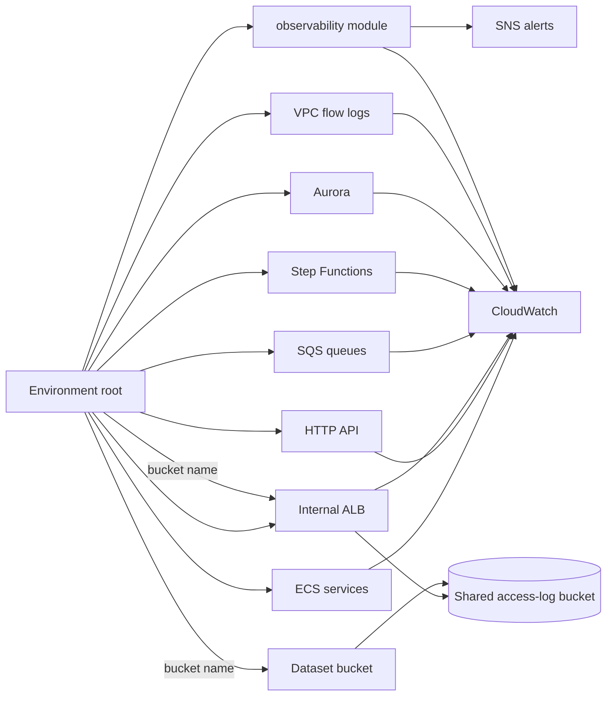

# CardDemo observability module

This README is the prose half of Rule 1's documentation contract for HCL.
The sibling Terraform files carry the machine-checked half: a header on every
file, typed and described inputs and outputs, and adjacent rationale for
non-obvious resource arguments.

## 1. Purpose

The module creates the shared operational surface that the environment roots
wire around the migrated CardDemo services:

- customer-key-encrypted CloudWatch log groups for producers that do not own a
  group resource;
- one versioned access-log bucket for the internal load balancer and dataset
  bucket;
- one customer-key-encrypted SNS topic and optional subscriptions;
- one dashboard joining ECS, API Gateway, ALB, SQS, Step Functions, Aurora,
  VPC flow-log and optional CloudFront signals;
- alarms for unhealthy targets, 5xx responses, dead-letter messages, stale
  replies, failed or timed-out batch executions and Aurora pressure.

It is a reusable module, not a Terraform root. It declares no provider or
backend and is never applied directly.

## 2. Baseline lineage

The target formalises operational concepts that the baseline already expresses.
Across the 38 files under `app/jcl`, `SYSOUT=*` appears 116 times and
`//SYSPRINT DD` appears 80 times. All 38 jobs carry `NOTIFY=`, so one alert
topic is a re-addressed push-notification path rather than a newly invented
operator habit.

- Refactoring Rationale: a spool destination is read one job at a time. A
  CloudWatch group is queryable across services and batch states, while an alarm
  pushes a condition rather than waiting for an operator to open a job log.
- Trade-offs: Fargate merges the baseline's separate `SYSPRINT` and `SYSOUT`
  streams into one stdout/stderr log stream. The content remains attributable
  through service, environment, version and correlation fields, but the original
  stream distinction no longer exists.
- Assumptions: retention is always explicit. Twenty-nine of the 38 jobs use
  `MSGCLASS=0`, so their log survival was a job-card property; the target makes
  that period an environment input instead.
- Refactoring Rationale: `CCPAUERY.cpy` already defines a structured
  `ERROR-LOG-RECORD` with a dedicated event key, and `COPAUA0C.cbl` centralises
  its emission. The target changes custody and addressability, not the existence
  of structured logging.

The baseline under `app/**` remains reference-only and unchanged.

## 3. Ownership and data flow



Every monitored identifier arrives from the environment root. The module never
reads a sibling `module.*` value directly. That one-way wiring preserves module
reuse and makes a producer-to-consumer dependency visible where the two are
composed.

Resource ownership remains with the producer where its lifecycle is inseparable:

| Surface | Owning module | How observability consumes it |
|---|---|---|
| ECS service log groups | `ecs-service` | Container Insights dimensions and root wiring |
| API access-log group | `api-gateway-http` | API metrics and root wiring |
| State-machine log groups | `step-functions-batch` | State-machine metrics and root wiring |
| VPC flow-log group | `network` | Logs Insights dashboard query |
| Glue Lambda groups | `observability` when named by the root | `log_group_names` map |
| ALB and dataset access logs | `observability` destination bucket | bucket name output passed by the root |

## 4. Alarm semantics

Every alarm records a condition, the question it answers and the action it
enables. Thresholds are detection settings, not service-level objectives; the
repository defines no service-level objectives and this module invents none.

| Family | Condition | Why the condition is structural | Operator action |
|---|---|---|---|
| No healthy target | `HealthyHostCount < 1`, missing data breaching | An empty target group publishes zero and then stops publishing, so absence is the signal rather than the lack of one | Read the task's stopped reason and log stream |
| Unhealthy target | `UnHealthyHostCount > 0` | The load balancer has already classified the target as unhealthy | Replace the task or roll back the image |
| Service/API errors | 5xx count reaches the configured input | A 5xx is a server-side failure by definition | Correlate edge, target and service logs |
| Dead-letter queue | Visible depth reaches 1 | A message is present only after exhausting the source queue's receive attempts | Correct the cause, then redrive |
| Stale reply | Oldest reply reaches five seconds by default | Five seconds is the baseline request/reply expiry contract | Inspect the waiting requester and correlation id |
| Stale work | Oldest message on a request or error queue reaches the configured wait | A stopped consumer never receives, so nothing redrives and the dead-letter alarm stays silent | Inspect that consumer's task and its healthy-target alarm |
| Batch failure | `ExecutionsFailed`, `ExecutionsTimedOut` or `ExecutionThrottled` | The state machine has entered the fail tier, or refused to start the chain at all | Inspect the state and redrive |
| Aurora processor pressure | CPU reaches the configured input | The environment owns the chosen detection value | Compare capacity and connections |
| Aurora capacity ceiling | Capacity reaches `aurora_max_capacity` | The threshold is the exact configured ceiling | Review workload before raising the maximum |

The batch alarm intentionally does **not** fire on posting return code 4. That
outcome is authored in the program itself -- `app/cbl/CBTRN02C.cbl:229-230` reads
`IF WS-REJECT-COUNT > 0` then `MOVE 4 TO RETURN-CODE` -- and the tier is modelled
in `services/batch-service/.../dto/BatchReturnCode.java` (L64-L74), where the run
gate is expressed once in the run sense. The target state machine preserves the
outcome as a **successful** execution carrying a warning record, so
`ExecutionsFailed` never counts it. `app/jcl/TRANBKP.jcl:51` is a different thing
and is not cited as evidence here: its `COND=(4,LT)` gates an `IDCAMS` step
against earlier steps of that same job and cannot observe posting, which runs in
another job entirely with no condition parameter at all.

Since the batch alarm cannot see the warn tier by design, that tier is reported by
the batch entry point instead: `BatchApplication` emits one outcome line per
finished execution, at warn level for the soft-warn tier, carrying the same
`POSTING_REJECTS_PRESENT` token the state machine writes into its execution state.
A log query and an execution history therefore answer with one string.

The `CardDemo` metric namespace, into which the telemetry sidecar exports each
service's Actuator meters, is read by the dashboard's application-meter widget.
Only framework meters exist to read today; no business meter is authored in any
service yet, and none is claimed here.

## 5. Encryption and access-log destinations

CloudWatch log groups and the SNS topic use the customer-managed key supplied by
the root. The KMS module grants the regional CloudWatch Logs principal access
only through Logs in this account and region, constrained by the log-group
encryption context. It separately admits CloudWatch alarm and SNS envelope
encryption for this environment's alert path.

The shared access-log bucket is private, versioned, TLS-only and explicitly
retained. It uses SSE-S3 rather than SSE-KMS because ALB access-log delivery must
be able to write the destination; the exception is confined to this terminal
bucket and documented next to the encryption resource. The bucket policy admits:

- the regional ALB log-delivery principal under an `AWSLogs/<account>` path;
- the S3 server-access-log principal under `s3-access-logs/`, restricted to
  CardDemo source buckets in this account and environment.

The log bucket does not log its own writes. Sending a terminal log destination
to itself would recursively generate a new access record for each delivered
record.

## 6. Metrics and tracing boundary

ECS Container Insights supplies task and service metrics. API Gateway, ALB, SQS,
Step Functions, Aurora, CloudFront and VPC Flow Logs supply their native metrics
or log records.

Application telemetry closes through `ecs-service`, because the collector shares
the task lifecycle rather than the dashboard lifecycle:

1. `common-lib` carries Spring Boot's OpenTelemetry starter. Its shared defaults
   keep OTLP export off for local runs where no collector exists.
2. Every ECS task enables OTLP explicitly and starts the pinned AWS Distro for
   OpenTelemetry collector sidecar before the application.
3. Online services are scraped on their loopback Actuator Prometheus endpoint;
   the batch task omits that receiver because it has no HTTP service.
4. The collector exports meters through CloudWatch EMF and sends spans to
   X-Ray. Tail sampling retains every error trace and applies the
   environment-configurable percentage only to successful traces.
5. The collector's task role can write only its service log group and the two
   X-Ray ingestion actions; business permissions remain root-owned.
6. The shared console pattern carries `traceId` and `spanId` beside the caller
   correlation id and API request id, so a log record can pivot in both
   directions without collapsing the four identities into one field.

Step Functions tracing is enabled in `step-functions-batch`, and the alert topic
uses active tracing so a failure publication can remain associated with the
execution that produced it. No self-managed Prometheus, Grafana, Redis, streaming
platform or multi-region telemetry tier is created.

## 7. Usage

```hcl
# WHAT: instantiate the reusable module from an environment root.
# WHY : the root is the only layer that can see all producer outputs and wire
#       them into the monitoring dimensions without coupling sibling modules.
module "observability" {
  source = "../../modules/observability"

  # Inputs are shown in the generated contract below.
}
```

The root passes `access_log_bucket_name` to both:

- `module.alb.access_logs_bucket`;
- `module.s3_datasets.access_log_bucket_name`.

It passes `notification_topic_arn` to
`module.step_functions_batch.notification_topic_arn`.

## 8. Inputs and outputs

The generated region is the authoritative reference table. Do not hand-edit it;
regenerate it after any variable, output or resource-contract change.

<!-- BEGIN_TF_DOCS -->
### Requirements

| Name | Version |
|------|---------|
| <a name="requirement_terraform"></a> [terraform](#requirement\_terraform) | >= 1.15.0 |
| <a name="requirement_aws"></a> [aws](#requirement\_aws) | ~> 6.56 |

### Providers

| Name | Version |
|------|---------|
| <a name="provider_aws"></a> [aws](#provider\_aws) | 6.57.1 |

### Resources

| Name | Type |
|------|------|
| [aws_cloudwatch_dashboard.operations](https://registry.terraform.io/providers/hashicorp/aws/latest/docs/resources/cloudwatch_dashboard) | resource |
| [aws_cloudwatch_log_group.managed](https://registry.terraform.io/providers/hashicorp/aws/latest/docs/resources/cloudwatch_log_group) | resource |
| [aws_cloudwatch_metric_alarm.api_5xx](https://registry.terraform.io/providers/hashicorp/aws/latest/docs/resources/cloudwatch_metric_alarm) | resource |
| [aws_cloudwatch_metric_alarm.aurora_capacity](https://registry.terraform.io/providers/hashicorp/aws/latest/docs/resources/cloudwatch_metric_alarm) | resource |
| [aws_cloudwatch_metric_alarm.aurora_cpu](https://registry.terraform.io/providers/hashicorp/aws/latest/docs/resources/cloudwatch_metric_alarm) | resource |
| [aws_cloudwatch_metric_alarm.batch_failure](https://registry.terraform.io/providers/hashicorp/aws/latest/docs/resources/cloudwatch_metric_alarm) | resource |
| [aws_cloudwatch_metric_alarm.dead_letter_depth](https://registry.terraform.io/providers/hashicorp/aws/latest/docs/resources/cloudwatch_metric_alarm) | resource |
| [aws_cloudwatch_metric_alarm.reply_queue_age](https://registry.terraform.io/providers/hashicorp/aws/latest/docs/resources/cloudwatch_metric_alarm) | resource |
| [aws_cloudwatch_metric_alarm.rotation_failure](https://registry.terraform.io/providers/hashicorp/aws/latest/docs/resources/cloudwatch_metric_alarm) | resource |
| [aws_cloudwatch_metric_alarm.service_5xx](https://registry.terraform.io/providers/hashicorp/aws/latest/docs/resources/cloudwatch_metric_alarm) | resource |
| [aws_cloudwatch_metric_alarm.service_no_healthy_targets](https://registry.terraform.io/providers/hashicorp/aws/latest/docs/resources/cloudwatch_metric_alarm) | resource |
| [aws_cloudwatch_metric_alarm.service_unhealthy](https://registry.terraform.io/providers/hashicorp/aws/latest/docs/resources/cloudwatch_metric_alarm) | resource |
| [aws_cloudwatch_metric_alarm.work_queue_age](https://registry.terraform.io/providers/hashicorp/aws/latest/docs/resources/cloudwatch_metric_alarm) | resource |
| [aws_s3_bucket.access_logs](https://registry.terraform.io/providers/hashicorp/aws/latest/docs/resources/s3_bucket) | resource |
| [aws_s3_bucket_lifecycle_configuration.access_logs](https://registry.terraform.io/providers/hashicorp/aws/latest/docs/resources/s3_bucket_lifecycle_configuration) | resource |
| [aws_s3_bucket_ownership_controls.access_logs](https://registry.terraform.io/providers/hashicorp/aws/latest/docs/resources/s3_bucket_ownership_controls) | resource |
| [aws_s3_bucket_policy.access_logs](https://registry.terraform.io/providers/hashicorp/aws/latest/docs/resources/s3_bucket_policy) | resource |
| [aws_s3_bucket_public_access_block.access_logs](https://registry.terraform.io/providers/hashicorp/aws/latest/docs/resources/s3_bucket_public_access_block) | resource |
| [aws_s3_bucket_server_side_encryption_configuration.access_logs](https://registry.terraform.io/providers/hashicorp/aws/latest/docs/resources/s3_bucket_server_side_encryption_configuration) | resource |
| [aws_s3_bucket_versioning.access_logs](https://registry.terraform.io/providers/hashicorp/aws/latest/docs/resources/s3_bucket_versioning) | resource |
| [aws_sns_topic.alerts](https://registry.terraform.io/providers/hashicorp/aws/latest/docs/resources/sns_topic) | resource |
| [aws_sns_topic_policy.alerts](https://registry.terraform.io/providers/hashicorp/aws/latest/docs/resources/sns_topic_policy) | resource |
| [aws_sns_topic_subscription.email](https://registry.terraform.io/providers/hashicorp/aws/latest/docs/resources/sns_topic_subscription) | resource |
| [aws_caller_identity.current](https://registry.terraform.io/providers/hashicorp/aws/latest/docs/data-sources/caller_identity) | data source |
| [aws_iam_policy_document.access_logs](https://registry.terraform.io/providers/hashicorp/aws/latest/docs/data-sources/iam_policy_document) | data source |
| [aws_iam_policy_document.alerts](https://registry.terraform.io/providers/hashicorp/aws/latest/docs/data-sources/iam_policy_document) | data source |
| [aws_partition.current](https://registry.terraform.io/providers/hashicorp/aws/latest/docs/data-sources/partition) | data source |
| [aws_region.current](https://registry.terraform.io/providers/hashicorp/aws/latest/docs/data-sources/region) | data source |

### Inputs

| Name | Description | Type | Default | Required |
|------|-------------|------|---------|:--------:|
| <a name="input_alb_arn_suffix"></a> [alb\_arn\_suffix](#input\_alb\_arn\_suffix) | Provider-returned ARN suffix of the internal Application Load Balancer, used as the LoadBalancer dimension in AWS/ApplicationELB metrics. A full ARN is invalid for this dimension and produces a permanently empty alarm. | `string` | n/a | yes |
| <a name="input_api_gateway_id"></a> [api\_gateway\_id](#input\_api\_gateway\_id) | HTTP API identifier used as the ApiId dimension for edge 5xx widgets and alarms. It comes from api-gateway-http rather than being reconstructed from the endpoint URL. | `string` | n/a | yes |
| <a name="input_api_gateway_stage_name"></a> [api\_gateway\_stage\_name](#input\_api\_gateway\_stage\_name) | Created HTTP API stage name used as the Stage dimension beside api\_gateway\_id. The reserved $default stage is valid and must be passed literally when that is what the producer module created. | `string` | n/a | yes |
| <a name="input_aurora_cluster_identifier"></a> [aurora\_cluster\_identifier](#input\_aurora\_cluster\_identifier) | Provider-returned Aurora cluster identifier used as the DBClusterIdentifier dimension for processor, connection and serverless-capacity metrics. | `string` | n/a | yes |
| <a name="input_aurora_max_capacity"></a> [aurora\_max\_capacity](#input\_aurora\_max\_capacity) | Maximum Aurora Serverless capacity units configured by the environment root. The capacity-ceiling alarm compares against this declared configuration fact rather than inventing an independent target. | `number` | n/a | yes |
| <a name="input_daily_state_machine_arn"></a> [daily\_state\_machine\_arn](#input\_daily\_state\_machine\_arn) | ARN of the daily batch state machine used as the StateMachineArn dimension for failed and timed-out execution alarms. | `string` | n/a | yes |
| <a name="input_ecs_cluster_name"></a> [ecs\_cluster\_name](#input\_ecs\_cluster\_name) | Exact ECS cluster name used as the ClusterName dimension for Container Insights widgets. Required from the ecs-cluster module output so a cluster rename cannot leave this dashboard querying a derived, obsolete name. | `string` | n/a | yes |
| <a name="input_environment"></a> [environment](#input\_environment) | Environment name interpolated into the log group paths, the dashboard name, every alarm name and the topic name, so an alarm's own name says which environment raised it; must be `dev` or `prod`, the two environments that have a Terraform root under infra/envs/. | `string` | n/a | yes |
| <a name="input_kms_key_arn"></a> [kms\_key\_arn](#input\_kms\_key\_arn) | ARN of the customer-managed key the log groups and notification topic are encrypted with. Required rather than optional because all eight CICS VSAM FILE resources are configured without recovery or journalling, so customer-controlled encryption is a target property that must not become skippable. Alternatives Considered: allowing null to select the services' managed-encryption fallback was rejected because it would make that target property optional and diverge from both environment roots, which provide a customer-managed key. | `string` | n/a | yes |
| <a name="input_queue_names"></a> [queue\_names](#input\_queue\_names) | Map of logical queue key to the exact SQS QueueName dimension. Keys ending in \_dlq receive dead-letter alarms, keys ending in \_reply receive stale-reply alarms, and every other key receives a primary work-queue age alarm; an empty map creates no queue alarm. | `map(string)` | n/a | yes |
| <a name="input_service_target_group_arn_suffixes"></a> [service\_target\_group\_arn\_suffixes](#input\_service\_target\_group\_arn\_suffixes) | Map of service name to provider-returned target-group ARN suffix for the seven online services. The map key labels dashboard and alarm outputs; an empty map deliberately creates no per-service load-balancer alarm. | `map(string)` | n/a | yes |
| <a name="input_vpc_flow_log_group_name"></a> [vpc\_flow\_log\_group\_name](#input\_vpc\_flow\_log\_group\_name) | Exact CloudWatch log-group name created by the network module for VPC flow logs. It feeds the dashboard Logs Insights query and is never recreated here, preserving the network module's ownership of the flow-log lifecycle. | `string` | n/a | yes |
| <a name="input_access_log_bucket_force_destroy"></a> [access\_log\_bucket\_force\_destroy](#input\_access\_log\_bucket\_force\_destroy) | Whether Terraform may remove the shared ALB and S3 access-log destination while it still contains current or noncurrent objects. False preserves the audit trail and makes an operator purge it explicitly before teardown. | `bool` | `false` | no |
| <a name="input_alarm_email_endpoints"></a> [alarm\_email\_endpoints](#input\_alarm\_email\_endpoints) | Email addresses subscribed to the notification topic, which is what replaces the baseline's NOTIFY=&SYSUID operator notification. Empty by default, because an address is a person's contact detail and this repository is not the place to record one. | `list(string)` | `[]` | no |
| <a name="input_alarm_evaluation_periods"></a> [alarm\_evaluation\_periods](#input\_alarm\_evaluation\_periods) | Consecutive breaching periods required before an alarm changes state. Anything above one is what distinguishes a sustained problem from a single unlucky period, at the cost of delaying the notification by that many periods. | `number` | `2` | no |
| <a name="input_alarm_period_seconds"></a> [alarm\_period\_seconds](#input\_alarm\_period\_seconds) | Length of one evaluation period, in seconds. The alarm's complete detection window is this value multiplied by the evaluation period count, so the two inputs are read together. | `number` | `300` | no |
| <a name="input_batch_failure_threshold"></a> [batch\_failure\_threshold](#input\_batch\_failure\_threshold) | Failed nightly-chain executions within one evaluation period that raise the batch alarm. This is the metric that replaces reading a job log for a non-zero condition code, and it counts executions the state machine itself reported as failed. | `number` | `1` | no |
| <a name="input_cloudfront_distribution_id"></a> [cloudfront\_distribution\_id](#input\_cloudfront\_distribution\_id) | Optional CloudFront distribution identifier shown on the dashboard. Null omits the widget; no CloudFront alarm is created because global distribution metrics require a different provider region. | `string` | `null` | no |
| <a name="input_dashboard_service_names"></a> [dashboard\_service\_names](#input\_dashboard\_service\_names) | Service names the dashboard renders a row of widgets for, in the order given. The order is preserved because it is the order an operator reads the dashboard in, and a request travels through these services in roughly that sequence. | `list(string)` | <pre>[<br/>  "auth-service",<br/>  "account-service",<br/>  "card-service",<br/>  "transaction-service",<br/>  "reference-service",<br/>  "batch-service",<br/>  "authorization-service",<br/>  "reporting-service"<br/>]</pre> | no |
| <a name="input_database_cpu_threshold_percent"></a> [database\_cpu\_threshold\_percent](#input\_database\_cpu\_threshold\_percent) | Cluster processor utilisation, as a percentage, that raises the database alarm. On a serverless cluster this is a scaling signal as much as a saturation one: sustained high utilisation means the workload is pressed against its configured maximum capacity. | `number` | `80` | no |
| <a name="input_dead_letter_depth_threshold"></a> [dead\_letter\_depth\_threshold](#input\_dead\_letter\_depth\_threshold) | Visible messages in any dead-letter queue that raise the messaging alarm. A dead-letter queue is empty in normal operation, so this is the one threshold whose default is the smallest value that can be breached. | `number` | `1` | no |
| <a name="input_log_group_names"></a> [log\_group\_names](#input\_log\_group\_names) | Map of logical producer key to the exact CloudWatch log-group name this module creates for producers that do not own a group resource. Empty means no additional group is created; full names are required because Lambda and other managed producers write only to their service-defined paths. | `map(string)` | `{}` | no |
| <a name="input_log_retention_days"></a> [log\_retention\_days](#input\_log\_retention\_days) | Days the log groups this module creates retain events. Retention is always set explicitly and never falls back to the service's unlimited default: 29 of the 38 baseline JCL members route job logs with MSGCLASS=0, so finite retention is part of the migration contract rather than an implicit service setting. This is one of the retention values the dev and prod roots are permitted to set differently without changing the stack's shape, and it is the direct analogue of how long a mainframe job log was kept before it aged off the spool. | `number` | `30` | no |
| <a name="input_name_prefix"></a> [name\_prefix](#input\_name\_prefix) | Prefix concatenated into the dashboard name, the topic name, every alarm name and every log group path this module creates, giving the observability surface one greppable identity shared with the rest of the stack; lowercase letters, digits and hyphens only, at most 32 characters. | `string` | `"carddemo"` | no |
| <a name="input_reply_queue_age_threshold_seconds"></a> [reply\_queue\_age\_threshold\_seconds](#input\_reply\_queue\_age\_threshold\_seconds) | Oldest-message age that raises a reply-queue alarm. Five seconds is derived from the baseline request/reply expiry contract rather than an invented service objective; the consumer still enforces expiresAt because SQS has no per-message expiry. | `number` | `5` | no |
| <a name="input_rotation_lambda_function_names"></a> [rotation\_lambda\_function\_names](#input\_rotation\_lambda\_function\_names) | Set of Secrets Manager rotation Lambda function names that receive a non-zero Errors alarm. Empty creates no rotation alarm and is appropriate only when rotation is not provisioned in the composed root. | `set(string)` | `[]` | no |
| <a name="input_service_error_count_threshold"></a> [service\_error\_count\_threshold](#input\_service\_error\_count\_threshold) | Count of server-error responses within one evaluation period that raises the per-service alarm. This is an absolute Sum of the load balancer's own 5xx count and not a proportion of requests, so it fires for a service that is failing requests regardless of whether the service itself is still logging. | `number` | `5` | no |
| <a name="input_tags"></a> [tags](#input\_tags) | Tags merged onto the resources this module creates, layered on top of the common tag set the calling root already applies through its provider's `default_tags`; defaults to none, because the baseline tags arrive from the root rather than from this module. | `map(string)` | `{}` | no |
| <a name="input_work_queue_age_threshold_seconds"></a> [work\_queue\_age\_threshold\_seconds](#input\_work\_queue\_age\_threshold\_seconds) | Oldest-message age that raises a primary work-queue alarm, covering the request queues and the error queue. This is a detection default equal to one full evaluation period, not a latency objective; the repository defines none. | `number` | `300` | no |

### Outputs

| Name | Description |
|------|-------------|
| <a name="output_access_log_bucket_arn"></a> [access\_log\_bucket\_arn](#output\_access\_log\_bucket\_arn) | ARN of the shared access-log bucket for IAM policy composition and audit inventory. Producers take the bucket name output instead; IAM Resource elements take this ARN. |
| <a name="output_access_log_bucket_name"></a> [access\_log\_bucket\_name](#output\_access\_log\_bucket\_name) | Name of the shared terminal access-log bucket. Pass it to alb.access\_logs\_bucket and s3-datasets.access\_log\_bucket\_name so both producers write into a destination whose policies this module owns. |
| <a name="output_alarm_arns"></a> [alarm\_arns](#output\_alarm\_arns) | Map of stable signal keys to alarm ARNs. A root may use these values to compose a composite alarm or attach an additional action without discovering alarms by name. |
| <a name="output_dashboard_arn"></a> [dashboard\_arn](#output\_dashboard\_arn) | ARN of the operations dashboard for IAM policies that grant a read-only operator access to this dashboard without granting access to every dashboard. |
| <a name="output_dashboard_name"></a> [dashboard\_name](#output\_dashboard\_name) | Name of the operations dashboard for runbook deep-links and console lookup after deployment. |
| <a name="output_managed_log_group_arns"></a> [managed\_log\_group\_arns](#output\_managed\_log\_group\_arns) | Map of the same logical producer keys to CloudWatch log-group ARNs. Use these values to scope logs:CreateLogStream and logs:PutLogEvents without granting access to every group in the account. |
| <a name="output_managed_log_group_names"></a> [managed\_log\_group\_names](#output\_managed\_log\_group\_names) | Map of logical producer key to exact CloudWatch log-group name for groups this module creates. Use the name in a Lambda or collector logging configuration; keys match the input map and remain stable when a path changes. |
| <a name="output_notification_topic_arn"></a> [notification\_topic\_arn](#output\_notification\_topic\_arn) | ARN of the single per-environment alert topic. Pass it to step-functions-batch as its failure-publication target and use it as the action target for any alarm authored outside this module. |
| <a name="output_notification_topic_name"></a> [notification\_topic\_name](#output\_notification\_topic\_name) | Name of the alert topic for operator lookup and CloudWatch/SNS diagnostics where a name, rather than an IAM resource ARN, is required. |
<!-- END_TF_DOCS -->

## 9. Validation

```bash
# WHAT: verify canonical HCL formatting for this module.
# WHY : formatting is a gating byte-level check and does not rewrite in check mode.
terraform fmt -check -diff infra/modules/observability
```

```bash
# WHAT: initialise without a backend and validate provider/resource contracts.
# WHY : a reusable module has no state backend and needs no live deployment for static validation.
terraform -chdir=infra/modules/observability init -backend=false -input=false
terraform -chdir=infra/modules/observability validate
```

```bash
# WHAT: run the repository's Terraform lint policy against the module.
# WHY : this catches undocumented, untyped or unused declarations before root composition.
tflint --chdir=infra/modules/observability \
  --config="$(pwd)/infra/.tflint.hcl"
```

```bash
# WHAT: confirm the generated contract matches the HCL.
# WHY : CI checks drift and never regenerates documentation automatically.
terraform-docs --config infra/.terraform-docs.yml \
  --output-check infra/modules/observability
```

## 10. Caveats

- No infrastructure has been applied by this work. No dashboard has rendered
  and no alarm has fired.
- Empty service, queue or managed-log-group maps deliberately create no
  resource of that family.
- A target-group or load-balancer **full ARN** is not interchangeable with its
  CloudWatch ARN suffix; the variable validation rejects the common mis-wiring.
- CloudFront appears only as a dashboard widget because its global metrics use a
  fixed region. Creating a CloudFront alarm with the default regional provider
  would leave it without datapoints.
- Contact endpoints are inputs and default to empty; no address is committed in
  this module.
- The existing COBOL test suite and mainframe job-log path remain untouched.

## 11. Related documents

- [`infra/README.md`](../../README.md)
- [`docs/architecture/observability.md`](../../../docs/architecture/observability.md)
- [`docs/architecture/messaging-contracts.md`](../../../docs/architecture/messaging-contracts.md)
- [`docs/CODE_DOCUMENTATION_STANDARD.md`](../../../docs/CODE_DOCUMENTATION_STANDARD.md)
