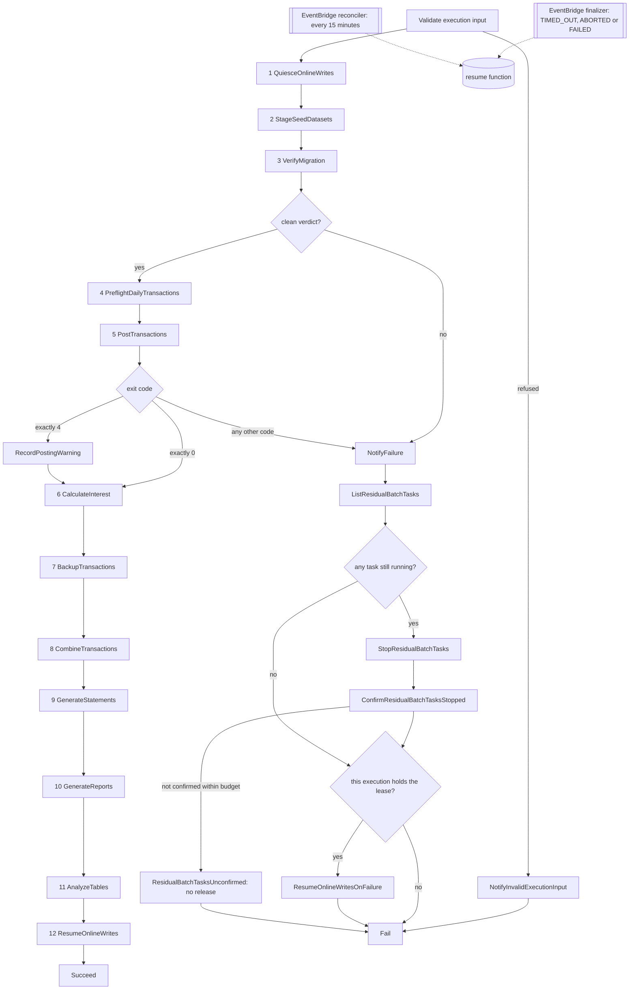

# Step Functions batch module

This reusable module provisions four STANDARD Step Functions workflows: the
twelve-work-state nightly CardDemo batch chain, the smaller ad-hoc report
workflow started by reporting-service, the operator-invoked dataset
export/import round trip, and the operator-invoked pending-authorization segment
export and extract load. It also provisions their shared least-privilege
execution role, one encrypted execution-log group per workflow, and the
dead-letter queue and alarm covering the out-of-graph bracket release.

⚠️ Refactoring Rationale: this sentence said **three** workflows and named the
first three. The authorization-extract machine landed with its own log group, its
own timeouts and its own task definition input, and the count was not
re-measured. A reader taking the count at face value would conclude the machine
they are looking at is not provisioned here.

The immutable JCL under `app/jcl/` and the CICS submission queue in
`app/csd/CARDDEMO.CSD` are the behavioural lineage. The migration adds an AWS
path beside them and does not remove or modify the mainframe path. The full
analysis is in the existing
[batch orchestration architecture](../../../docs/architecture/batch-orchestration.md).

This README is the prose half of Rule 1 Explainability. The typed/documented
input and output gates are enforced by [TFLint](../../.tflint.hcl), and the
reference tables below are drift-checked with
[terraform-docs](../../.terraform-docs.yml).

## Module boundary

This directory is a module, not a root. `infra/envs/dev` and `infra/envs/prod`
call it with `source = "../../modules/step-functions-batch"`. It declares no
provider configuration, backend, schedule, ECS cluster, task definition, Lambda
function, bucket, or database. Those resources are supplied through typed inputs
by the environment root.

⚠️ Refactoring Rationale: this sentence also listed **alarm** among the things
the module declares none of, and that is no longer true. It declares exactly one
queue and one alarm, both belonging to the out-of-graph bracket release described
under [Releasing the quiesce bracket](#releasing-the-quiesce-bracket): the
dead-letter queue for the finalizer rule's own undelivered events, and the alarm
that fires on the first message. Their lifecycle is that rule's rather than the
environment's -- they are named after it and must be destroyed with it -- so
taking them as inputs would let a root point two rules at one queue and lose
which failure came from where. Nothing else in the module owns a queue, an alarm
or a metric.

```hcl
module "step_functions_batch" {
  source = "../../modules/step-functions-batch"

  name_prefix                        = var.name_prefix
  environment                        = var.environment
  ecs_cluster_arn                    = module.ecs_cluster.cluster_arn
  batch_task_definition_arn          = module.ecs_service["batch"].task_definition_arn
  data_migration_task_definition_arn = module.ecs_service["data-migration"].task_definition_arn
  reporting_task_definition_arn      = module.ecs_service["reporting"].task_definition_arn
  authorization_task_definition_arn  = module.ecs_service["authorization"].task_definition_arn
  batch_container_name               = module.ecs_service["batch"].container_name
  data_migration_container_name      = module.ecs_service["data-migration"].container_name
  reporting_container_name           = module.ecs_service["reporting"].container_name
  authorization_container_name       = module.ecs_service["authorization"].container_name
  private_app_subnet_ids             = module.network.private_app_subnet_ids
  task_security_group_id             = module.network.app_security_group_id

  # Each machine's execution role may pass only the roles of the task definitions
  # THAT machine runs, which is why this is keyed rather than one flat list.
  pass_role_arns = {
    daily = [
      module.ecs_service["batch"].task_role_arn,
      module.ecs_service["batch"].execution_role_arn,
      module.ecs_service["data-migration"].task_role_arn,
      module.ecs_service["data-migration"].execution_role_arn,
      module.ecs_service["reporting"].task_role_arn,
      module.ecs_service["reporting"].execution_role_arn,
    ]
    adhoc = [
      module.ecs_service["reporting"].task_role_arn,
      module.ecs_service["reporting"].execution_role_arn,
    ]
    dataset = [
      module.ecs_service["batch"].task_role_arn,
      module.ecs_service["batch"].execution_role_arn,
    ]
    authz = [
      module.ecs_service["authorization"].task_role_arn,
      module.ecs_service["authorization"].execution_role_arn,
    ]
  }

  quiesce_function_arn          = aws_lambda_function.quiesce.arn
  resume_function_arn           = aws_lambda_function.resume.arn
  analyze_tables_function_arn   = aws_lambda_function.database_admin.arn
  read_only_flag_parameter_name = aws_ssm_parameter.online_writes_enabled.name
  notification_topic_arn        = module.observability.notification_topic_arn
  dataset_bucket_name           = module.s3_datasets.bucket_name
  log_retention_days            = var.log_retention_days
  log_group_kms_key_arn         = module.kms.s3_key_arn
  dead_letter_kms_key_arn       = module.kms.sqs_key_arn

  # The SAME value is set on the resume function's BATCH_TASK_STARTED_BY, which is why
  # the root owns it: the module stamps it on every task and the function filters
  # ListTasks by it, so a second spelling would be a filter that matches nothing.
  task_started_by = local.batch_task_started_by
}
```

Assumptions: the environment root is the only composition boundary. This
module does not look up sibling resources by name or remote state, so every
producer-to-consumer edge remains visible in one root plan.

Two details in that example are easy to get wrong, and both were wrong in an
earlier revision of this file:

- **`analyze_tables_function_arn` takes the database-admin function.** There is
  no `aws_lambda_function.analyze_tables` in either environment root; one
  function serves both the `AnalyzeTables` state and the one-shot schema
  bootstrap, and it is declared as `aws_lambda_function.database_admin`. Copying
  the older spelling produced an unresolvable reference.
- **`read_only_flag_parameter_name` is required and was omitted.** Sixteen of the
  inputs above are required -- none carries a default -- so an example missing
  one does not plan. The value must be an ABSOLUTE parameter name: the module
  validates the leading slash because
  `infra/lambda/online_write_flag.py` refuses a relative name at import time,
  which would otherwise fail inside the first state of the chain rather than at
  plan.

## Daily workflow

| # | Work state | Mechanism | Baseline lineage |
|---|---|---|---|
| 1 | `QuiesceOnlineWrites` | Lambda invocation | `app/jcl/CLOSEFIL.jcl` |
| 2 | `StageSeedDatasets` | Map of synchronous data-migration tasks, one full dataset refresh per branch | The `IDCAMS REPRO` copy and the `DEFINE CLUSTER` and load half of the ten master-load jobs, plus `DALYTRAN.PS` |
| 3 | `VerifyMigration` | Synchronous data-migration task and exit-code Choice | No baseline analogue: the baseline verified nothing |
| 4 | `PreflightDailyTransactions` | Synchronous batch-service task | `CBTRN01C`, which has no JCL driver |
| 5 | `PostTransactions` | Synchronous batch-service task and exit-code Choice | `app/jcl/POSTTRAN.jcl` / `CBTRN02C` |
| 6 | `CalculateInterest` | Synchronous batch-service task | `app/jcl/INTCALC.jcl` / `CBACT04C` |
| 7 | `BackupTransactions` | Synchronous batch-service task | `app/jcl/TRANBKP.jcl` |
| 8 | `CombineTransactions` | Synchronous batch-service task | `app/jcl/COMBTRAN.jcl` |
| 9 | `GenerateStatements` | Synchronous reporting-service task | `app/jcl/CREASTMT.JCL` |
| 10 | `GenerateReports` | Synchronous reporting-service task | `app/jcl/TRANREPT.jcl` and `app/jcl/PRTCATBL.jcl` |
| 11 | `AnalyzeTables` | Lambda invocation | Statistics analogue of `app/jcl/TRANIDX.jcl` |
| 12 | `ResumeOnlineWrites` | Lambda invocation | `app/jcl/OPENFIL.jcl` |

Twelve counts the states that perform business or operational work. Input
validation, task-exit Choices, warning recording, notification, terminal
success/failure, and failure-path resume states are additional control states.

State 3 stands between staging an extract and posting against it. It runs the
combined verification gate -- row counts, then per-record checksums, then exact
money totals -- on the SELECT-only verification login, and its Choice is the ONLY
edge into state 4, so business processing cannot be reached over data that does
not match its source.

Refactoring Rationale: two further states were authored into this position -- a
`LoadSeedDatasets` Map and a `ReconcileTransactionSequence` task, which would have
made the chain fourteen work states -- and both are withdrawn. Each was written
against a state 2 that only staged: an earlier revision of this chain copied an
extract from a prefix to a retained generation prefix and wrote no row, so nothing
loaded Aurora and the identifier sequence was never advanced past the loaded rows.
State 2 now runs a full refresh per dataset, which loads the target table and
advances `ledger.transaction_id_seq` for the one dataset whose rows occupy the
allocator's range, so both hazards are closed one state earlier and a second pass
would repeat work already done. The hazards themselves are unchanged and are worth
restating: a chain that stages without loading reads whatever the tables already
held, and a load that leaves the sequence inside the range it just inserted makes
the first transaction the online service adds collide on the primary key.



Assumptions: the failure path stops and CONFIRMS the chain's residual tasks before it
reaches the ownership gate, and refuses to release at all if it cannot confirm them.
A synchronous run-task state that timed out leaves its container running -- Step
Functions stops waiting, ECS does not stop the task -- so releasing the bracket at
that moment would re-enable online writes underneath a posting container that is
still writing. `ResidualBatchTasksUnconfirmed` is deliberately a terminal failure
that does NOT pass through the release, on the same principle as
`OnlineWriteLeaseUnavailable`: a bracket held is recoverable, a bracket released
under a live writer is not.

### Condition-code inversion

A JCL `COND` is a **skip** predicate; a Step Functions `Choice` is a **run**
predicate. The sense must therefore be inverted.

- `COND=(0,NE)` means the step runs only after clean predecessors. In the
  workflow this is the ordinary success edge; infrastructure failures take the
  state's `Catch`.
- The one `COND=(4,LT)` site at `app/jcl/TRANBKP.jcl:51` means continue for a
  return code of four or lower. `app/cbl/CBTRN02C.cbl:229-230` produces code 4
  when posting completed with rejects, so `CheckPostingExitCode` rejoins the
  success path for that warn tier.
- `CheckPostingExitCode` matches **exactly 0 and exactly 4** and routes every
  other code to failure. Refactoring Rationale: it previously compared with
  `NumericLessThanEquals` against a configurable ceiling, which tolerated 1, 2
  and 3 as reject nights. `app/cbl/CBTRN02C.cbl` assigns `RETURN-CODE` in exactly
  one place -- `MOVE 4 TO RETURN-CODE` at its line 230 -- so those three codes
  cannot come from the program's own exit path and can only mean the runtime
  failed around it. The ceiling was also an input, so it could be set to 255, at
  which point every failure satisfied the predicate and the chain ran interest
  accrual over transactions that were never posted. The two codes are now locals
  in `main.tf` and are not configurable, because they are the baseline's contract
  rather than a policy.
- `INCLUDE COND=(...)` in `app/jcl/TRANREPT.jcl:47-48` selects records and
  becomes a reporting query predicate. It is not represented as a workflow
  Choice.

Refactoring Rationale: treating code 4 as failure would report a correctly
posted night with business rejects as an infrastructure incident and skip
backup, statements, and reports. The explicit numeric Choice preserves the
baseline's graded outcome rather than collapsing it to binary success/failure.

### Container invocation

Batch states pass an argument array matching `BatchApplication` exactly:

```text
--job=<preflight-daily-transactions|post-transactions|calculate-interest|backup-transactions|combine-transactions>
--business-date=<ten-character token>
```

Each batch task also receives `CARDDEMO_BATCH_RUN_ID=$$.Execution.Name`.
Container overrides name the target container explicitly; an incorrect name
would leave the baked-in command running, so every container name is a validated
module input rather than an assumed constant.

Assumptions: state 2 runs `python -m carddemo_migration.cli` with the
`refresh-dataset` subcommand, per-item dataset/business-date arguments, and the
`--extract-prefix` this module passes from `dataset_source_extract_prefix`. States
8 and 9 use reporting-service commands because the batch-service job list has
no statement or report job.

Refactoring Rationale: that subcommand read `stage-dataset`, which stages one
generation and stops. Staging alone leaves the relational masters untouched, so a
chain that "succeeded" at state 2 continued into posting against whatever the
previous run had left in the database -- the load half of the ten `IDCAMS REPRO`
jobs the state claims lineage from was simply absent. `refresh-dataset` performs
the whole round trip per branch, in this order: fetch the published extract from
the dataset bucket's source prefix into a scratch directory, stage it as a new
generation, decode and load it into its owning schema, verify row counts, verify
the record checksum, verify money parity, and -- for the transaction master alone,
because it is the one table whose identifier allocator can point into a loaded
range -- reconcile the allocator. The allocator step runs LAST rather than before
the verifications, because advancing a sequence changes nothing the three passes
compare. The load and the three passes are composed only for a dataset whose layout
ships a committed extract, so the `transactions` branch stages, reconciles and exits
zero without loading -- see [Seed-data Maps](#seed-data-maps). The scratch directory
is removed when the step ends whatever the outcome.
The subcommand
was added rather than the branch being expanded into five states because the
eleven-state contract of the migration plan's section 0.4.1.7 is a topology this
module must not change.

Reporting states pass an argument array matching `ReportingTaskRunner` exactly:

```text
--job=<generate-statements|generate-reports>  --business-date=<ten-character token>
--job=generate-report  --start-date=<token> --end-date=<token> --report-type=<type>
```

Refactoring Rationale: those three commands previously had no receiver at all.
The environment roots wire `reporting_task_definition_arn` to the reporting ECS
SERVICE's own task definition, and that image's entry point started a web server
-- so a dispatched state started a container that listened for requests and never
terminated, and the state reported a TIMEOUT after its whole ceiling elapsed
rather than reporting that the command was unimplemented. The image now has two
modes selected by the presence of `--job=`: task mode validates the command
before building any context, resolves a `ReportingTask` bean whose name is the
job token, and exits 0 on completion or 8 on any failure.

### Business-date input

The scheduler supplies an ISO `scheduledTime`. The workflow takes the portion
before `T` and passes it as `--business-date=YYYY-MM-DD`. A manual or redriven
execution may instead supply `businessDate` directly:

```json
{"businessDate":"2022-07-18"}
```

`app/jcl/INTCALC.jcl:22` likewise injects its ten-character date token through
`PARM`; no batch state substitutes a wall-clock reading. This keeps reruns
reproducible.

## Seed-data Maps

`StageSeedDatasets` iterates eleven items:
accounts, cards, customers, card cross-reference, transactions, daily
transactions, disclosure groups, transaction-category balances, transaction
types, transaction categories, and users. Ten of the eleven correspond
one-to-one to the ten `IDCAMS` master-load jobs in `app/jcl/` -- ACCTFILE,
CARDFILE, CUSTFILE, XREFFILE, TRANFILE, DISCGRP, TCATBALF, TRANTYPE, TRANCATG
and DUSRSECJ -- each of which performs exactly one `REPRO`.

Refactoring Rationale: `daily_transactions` is the eleventh and was added after
first being reasoned out of the list. The earlier reasoning was that
`app/jcl/POSTTRAN.jcl:30` reads `DALYTRAN.PS` directly with `DISP=SHR`, making it
flat sequential input to posting rather than a loaded master. That is true of the
baseline and false of the target: here posting reads `ledger.daily_transactions`,
a real table with a declared Aurora load target whose `amount` column is one of
the nine the committed money-total query totals. Omitting it therefore left a
declared target unloaded while verification totalled it, and verification pass 3
refuses the whole run when a layout that ships a committed extract contributes no
source total.

Assumptions: ten of the eleven branches load and verify their master, and
`transactions` STAGES ITS GENERATION AND STOPS -- reporting success rather than
failing. The exemption belongs to the ETL and not to this module: the repository
commits no `TRANSACT` extract, so the registry points that token at
`AWS.M2.CARDDEMO.DALYTRAN.PS.INIT`, the single 350-byte record `TRANFILE.jcl` `REPRO`s
to prime the cluster, whose unpopulated fields do not decode as a whole transaction.
`carddemo_migration.readers.transaction` declares `HAS_COMMITTED_SEED_DATASET = False`
and state 3's row-count query REQUIRES `ledger.transactions` to hold zero rows after
the ETL, because posting at state 5 fills it -- so a branch that loaded even one
record would turn a green Map into a failed gate two states later. `refresh-dataset`
reads that same predicate and states the exemption in the branch's log. The token is
kept in `var.seed_datasets` rather than dropped, because its generation family and
`LIMIT(5)` retention sweep are real and because that list is asserted equal to the
registry's eleven tokens by `data-migration/tests/test_seed_datasets.py`.

Each branch is four inner states -- `RefreshSeedDataset`,
`CheckDatasetRefreshExitCode`, and the two terminal states of the branch -- so the
branch reports the refresh's own exit status rather than the task integration's.

Each name is passed verbatim as `--dataset`, and the data-migration CLI resolves
it through `carddemo_migration.seed_datasets` to obtain the bounded-context
domain, the prefix segment, the source extract and the declared record length. The
Map state names no extract file, no generation number and no domain.

Refactoring Rationale: there is ONE Map here and there was briefly a second. A
`LoadSeedDatasets` Map was authored to run `load-dataset` over the same eleven
items, on the grounds that staging writes no row -- which was true of the state
that preceded it, and is not true of this one. `refresh-dataset` stages the
generation, loads the target table for the ten datasets that ship a committed
extract, runs all three verification passes over each of those, stages the backup
generation for the three families that have one, and advances
`ledger.transaction_id_seq` for the one dataset whose rows occupy the
allocator's range. A second Map would re-fetch and re-decode every extract to
perform an upsert that by construction changes nothing, so it is withdrawn and
what it was written to guarantee -- that the bytes staged are the bytes loaded --
holds by construction here: one branch reads one extract once and does both.

Where the extracts come from: the branch reads each dataset's registered source
file name under `dataset_source_extract_prefix` of the dataset bucket, which the
`s3-datasets` module provisions and publishes as `source_extract_prefix`. Nothing
is mounted and no filesystem is provisioned; the runbook's `aws s3 sync` of
`app/data/` into that prefix is what makes an extract available. The refresh then
refuses an extract that is not a whole number of records for its registered record
length, and cross-checks every integrity value the object actually carries --
content length, an SSE checksum if one was requested at upload, and this package's
own byte-count and digest metadata if it was published -- against the bytes that
arrived. Absent values are not fabricated; a mismatched one fails the branch.

Assumptions: a branch is idempotent per dataset within a business date. A rerun
of one branch re-reads the same published extract, allocates the next generation
under the same date prefix, and reloads the same rows, so a redrive that repeats
a completed branch converges rather than duplicating. What it does NOT do is
detect that a branch already ran -- the durable `batch.batch_run` ledger records
steps of the chain and not items of a Map -- so a partially-completed Map redriven
from state 2 repeats every branch, and the cost of that is time rather than
correctness.

Trade-offs: `MaxConcurrency` defaults to three. One would serialise
independent loads; eleven would burst every branch against the same Aurora
connection budget and Fargate quota. The value is a sizing input and does not
change the workflow topology.

## Failure, retry, and restart

Every work state has an explicit timeout and catch. ECS and Lambda integration
faults retry with bounded exponential backoff. Container exit codes are not
replayed: they reach a Choice and either continue or fail. A daily failure
publishes to the supplied SNS topic and then enters the terminal Fail state,
releasing the quiesce bracket on the way out **only when this execution acquired
it**.

Refactoring Rationale: every failure used to reach the release directly,
including a refusal raised before the bracket was taken and a failure of the
quiesce call itself. Such an execution never held the flag, so clearing it
re-enabled online writes inside whatever DID hold it -- a concurrent execution's
write window, or an operator's maintenance window set by hand -- and did so
silently, because clearing an already-clear flag and clearing someone else's look
identical from inside the graph. `QuiesceOnlineWrites` now records the lease as
`leaseAcquired` and `leaseOwner`, lifted out of the Lambda invoke envelope by a
`ResultSelector` so the graph can address them directly;
`CheckQuiesceLeaseOwnership` compares the owner against the execution identity the
preparation states copied into the input; and both in-graph release edges pass
`expectedLeaseOwner` so the function performs a conditional clear rather than an
unconditional one. A refused input takes its own notification state whose every
edge ends at `Fail`.

The success edge carries the same argument even though no Choice guards it.
`QuiesceOnlineWrites` continues to `StageSeedDatasets` whether or not it acquired
the bracket, so a chain that ran to completion may be one that was refused at the
bracket; a refusal reports an EMPTY owner and the function declines to clear on
behalf of a caller that names none. The function's half of the check is bounded by
what the flag can attest -- it stores the boolean every online service reads and no
owner -- so it verifies that the bracket is still engaged rather than who engaged
it. Recording the owner in the value was rejected for the readers it would break,
and a companion owner parameter was rejected as a resource, a grant and a module
input to narrow a window the ownership gate already covers.

Refactoring Rationale: restart is an improvement, not a port. The only
`RESTART=` in the baseline is commented out at `app/jcl/DEFGDGD.jcl:2`, and no
active checkpoint contract exists. STANDARD-workflow redrive resumes from the
failed state, while the `batch.batch_run` ledger makes an already-completed
step a no-op.

The per-state timeout is a ceiling, not a runtime prediction. Its purpose is to
keep one task from holding the online write path quiesced beyond its own
allowance, and `state_machine_timeout_seconds` is the same kind of ceiling for
the execution as a whole.

### Releasing the quiesce bracket

Both in-graph resume paths are states, so neither runs when the execution itself
stops. An execution-level `TIMED_OUT`, or an operator `ABORTED`, terminates
without reaching `NotifyFailure` or `ResumeOnlineWritesOnFailure`; after
`QuiesceOnlineWrites` has run, that would leave the online write path quiesced
indefinitely. The top-level ceiling therefore does **not** release the bracket,
and this module does not claim it does. Three mechanisms close the gap, and none of
them lives inside the timed execution: an event-driven finalizer, a scheduled
reconciler, and the lease's own expiry that both of them read.

`aws_cloudwatch_event_rule.daily_finalizer` matches `Step Functions Execution
Status Change` for this module's own daily machine with a status of `TIMED_OUT`,
`ABORTED` or `FAILED`, and invokes the resume function through an input
transformer that supplies `action`, the parameter to clear, the terminating
execution's name and its terminal status. It passes that same execution name as
`expectedLeaseOwner`, so this rule is checked exactly like the two in-graph edges:
it can clear the lease of the execution that just terminated, and no other. It
additionally sets `confirmTasksStopped`, which makes the release conditional on no
task carrying this module's `StartedBy` marker being short of `STOPPED` -- because
this rule fires the instant an execution ends, when a task abandoned by a timed-out
synchronous state may still be writing.

Trade-offs: the template that carries those values is built in
`local.finalizer_input_template`, not by a bare `jsonencode`, and the difference is
not cosmetic. Terraform's `jsonencode` HTML-escapes `<` to `\u003c` and `>` to
`\u003e`, so a bare encode produces a template in which the literal
`<executionName>` token EventBridge substitutes on does not appear at all; the
substitution then never happens and the function is handed the placeholder text as
the owner it must match, refusing every out-of-graph release. The local restores the
two delimiters after encoding, which is the same rewrite
`infra/modules/eventbridge-scheduler` applies to its own target payload.

`aws_cloudwatch_event_rule.bracket_reconciler` is the backstop for the cases the
finalizer cannot cover: its own delivery failing after every retry, and a release it
refused because tasks were still draining. It runs on a cadence -- every
`reconcile_interval_minutes`, 15 by default -- and carries a STATIC input rather than
a transformer, which is why it is immune to the escaping trap above: with no
placeholder there is nothing to mangle. It names no owner, because nobody is left to
name one; the function derives the owner from the lease and releases only once the
owning execution is no longer `RUNNING` and the chain's tasks are terminal. That is
what lets a cadence carry no staleness threshold: a legitimate long night is an
execution that is still running.

Assumptions: both rules dead-letter to `aws_sqs_queue.finalizer_dlq` and three alarms
cover the three independent ways a release can fail -- `FailedInvocations` per rule,
the resume function's `Errors`, and the queue's depth. Before them, an undeliverable
release was discarded after an hour with nothing recording that it had been attempted,
which is the condition that made a stranded bracket silent.

Refactoring Rationale: this rule previously passed **no** expected owner, and an
absent owner was read as an unconditional release. That reading was forced rather
than chosen -- the bracket was stored as a bare boolean, so no owner existed to
compare a claim against and "unconditional" was the only release the handler could
implement. The consequence was an outage the rule itself could cause: it fires per
terminating execution, so a chain that lost the lease and failed fast triggered a
release that re-enabled online writes underneath the execution which legitimately
held the window. The owner was available all along -- the transformer already
extracted `$.detail.name` -- so naming it costs nothing now that there is a durable
owner to check it against.

⚠️ Refactoring Rationale: this paragraph claimed that making the rule conditional
"does not strand a bracket whose owner died before the event was delivered, because
the handler's release condition also admits an **expired** lease", concluding that
"a lost event delays release to the lease's expiry instead of requiring an
operator." Expiry does not release anything. It changes what a **future** caller is
permitted to do; nothing observes an expiry, and nothing writes the read-only flag
on it. A lost event therefore leaves the flag set until some later invocation
releases it, and the next one is the following night's chain, whose own resume runs
after a full batch window -- roughly a day of refused online writes, reached by the
one path that had no recovery.

Two mechanisms now cover it, and neither is an expiry. Delivery failures land on
`aws_sqs_queue.bracket_release_dlq`, an encrypted queue with fourteen-day retention
that keeps the original payload -- including the terminating execution's name, which
is what the release condition compares against -- so a redrive is a faithful retry
of the release rather than a reconstruction of it.
`aws_cloudwatch_metric_alarm.release_dead_letters` fires on the first message and
publishes to the same notification topic the state machines use, so the operator
learns within a metric period rather than when a user reports a refused write.
Redrive stays an operator action deliberately: an automatic consumer would be a
second releaser running on its own clock, which is the unbounded-staleness design
the scheduled watchdog was rejected for above.

For the executions that do transition, the graph carries the other half of the same
signal: both release edges gate on the flag's resulting state, so
`CheckOnlineWritesResumed` refuses to reach `BatchSucceeded` unless writes were
re-enabled, and `CheckOnlineWritesResumedOnFailure` ends a failed chain in
`OnlineWritesStranded` rather than `CardDemoBatchFailed` when they were not. The two
error names are two operational events: one says tonight's work did not complete,
the other says the online write path is still closed.

`FAILED` is matched even though the in-execution failure path already resumes,
because that path is itself a state and can fail: a chain whose
`ResumeOnlineWritesOnFailure` state errors ends `FAILED` with the bracket still
engaged, which is precisely the outage this rule exists to prevent. The duplicate
release that a matched `FAILED` implies on an ordinary failure is harmless -- the
lease has already been deleted, so the conditional claim that opens the release finds
no lease to prove ownership of and the handler reports "no lease is held" without
writing the parameter, which is one extra log line and no parameter version.
That is also why the release sequence puts the flag write **before** the delete:
after a completed release the flag already reads enabled, so a duplicate invocation
reports `onlineWritesEnabled` true and the graph's gates pass it.
`SUCCEEDED` is deliberately not
matched: it is reachable only after `ResumeOnlineWrites` has already run. The rule
invokes the function through an `aws_lambda_permission` scoped to the rule's own
ARN rather than through the execution role, because EventBridge invokes Lambda via
the function's resource policy.

`QuiesceOnlineWrites` takes the bracket as a real lease, in a DynamoDB item the
environment root provisions, and not in the flag. `leaseStartedAt` is the execution
start time and `leaseSeconds` is `state_machine_timeout_seconds`, which the handler
stores as an absolute `expiresAt` on the lease item. The lease length is derived
from the execution ceiling rather than accepted as its own input, so it cannot be
configured to lapse while a chain is still running.

Refactoring Rationale: the bracket used to be the flag itself, and that could not be
a lease. Parameter Store offers no compare-and-set for a plain String parameter, so
acquisition was a read of the flag followed by a write of it -- two executions
reading in the same instant both concluded they had acquired it -- and release had no
stored owner to check a claimed one against. The lease item supplies the
compare-and-set the flag cannot: acquisition is a conditional `PutItem` that succeeds
only when no lease is stored, the stored one has expired, or the stored one already
names this same execution; and release is a conditional `UpdateItem` that claims it
for the recorded owner or an expired lease, followed -- after the flag write -- by a
conditional `DeleteItem` that completes it. Refactoring Rationale: both of those
conditions were narrower to begin with, and each omission cost the same thing in a
different direction. Without the third acquire case, a quiesce whose flag write failed
after the lease was taken retried into a condition that could only fail, reported
`leaseAcquired` false naming itself, and routed to `OnlineWriteLeaseUnavailable` --
deadlocked against its own lease. And with the release deleting BEFORE the flag write,
a failed write left online writes disabled with no lease left to prove who could
re-enable them, so this module's own recovery path re-invoked the release with the same
owner, was refused with "no lease is held", skipped the write and returned success with
every online service still read-only.

Trade-offs: the **flag stays exactly where it was**, at the same parameter
path with the same boolean spelling, and is now written as a consequence of the
lease decision rather than being the lease. Moving the flag instead of the bracket
was the alternative and was rejected because every online service reads that flag;
this way none of them gains a second client or a second thing to read.

`CheckQuiesceLeaseAcquired` is what makes the lease decide whether the chain runs.
Refactoring Rationale: the quiesce state used to continue straight to
`StageSeedDatasets` whether or not it had acquired the bracket, so the lease was
computed, reported and then ignored on the success edge -- the only place the graph
consulted it was the failure edge. An execution starting while a previous night
still held the window therefore went on to post transactions and accrue interest
with online writes enabled, which is the condition the bracket exists to prevent. A
refused acquisition now routes to `OnlineWriteLeaseUnavailable`, a `Fail` state that
deliberately passes through no resume state at all: another execution owns the
bracket, so clearing the flag would re-enable online writes underneath a run still
inside its window. Alternatives Considered: waiting and retrying instead of failing,
rejected because the schedule starts one execution per night, so a refused
acquisition means the previous night is still running -- waiting would stack a second
chain behind an overdue run and hide that fact, where failing surfaces it.

Refactoring Rationale: an earlier revision wired TWO equivalent out-of-graph
release rules, one matching `TIMED_OUT` and `ABORTED` only and one matching all
three statuses, each with its own target and Lambda permission. Two rules invoking
one idempotent function is not twice the safety: it is two places to keep in step,
and their comments already disagreed about whether `FAILED` should be matched. One
rule, matching all three non-succeeded terminal statuses, is the whole of the
out-of-graph release.

## Ad-hoc report workflow

The second machine validates `startDate`, `endDate`, and `reportType`, runs the
reporting-service task, checks its exit code, and either succeeds or publishes a
failure notification before failing loudly. The environment root publishes this
machine's ARN to reporting-service and grants `states:StartExecution` on that
exact ARN.

This preserves the capability behind `app/csd/CARDDEMO.CSD` lines 499-505,
where the `JOBS` transient-data queue submitted fixed-width JCL card images to
`DDNAME(INREADER)`, while replacing the submission tunnel with a tracked
execution identity.

## Dataset round-trip workflow

The third machine is on demand rather than scheduled. It takes one input,
`businessDate`, validates its shape, runs the batch-service task with
`--job=export`, gates on that task's exit code, then runs the same task
definition with `--job=import`, gates again, and either succeeds or publishes a
failure notification before failing loudly.

It exists because two jobs were otherwise unreachable. `BatchApplication`
accepts `--job=export` and `--job=import`, and `ExportJob` and `ImportJob`
register beans under exactly those tokens — yet neither token appeared in any
state machine, schedule or API, so both jobs could be built, tested and deployed
while remaining impossible to run in a provisioned environment.

The pair is operator-submitted in the baseline too. `app/jcl/CBEXPORT.jcl` and
`app/jcl/CBIMPORT.jcl` appear in neither `app/scheduler/CardDemo.ca7` nor
`app/scheduler/CardDemo.controlm`, so an on-demand machine is the faithful
target rather than two more nightly states — which would additionally export a
full five-master extract every night whether or not anyone asked for one.

**Sequencing is a correctness requirement, not a preference.** The import reads
exactly the object the export writes, `export/<yyyymmdd00>/export.dat`, composed
identically by both jobs from the same business date. Running them in parallel,
or letting the import follow a non-zero export, would read a partial or absent
dataset and then report the six artefacts it produced as complete.

**Idempotency is layered.** Each task receives `CARDDEMO_BATCH_RUN_ID` bound to
`$$.Execution.Name`, and `BatchStepLedger` keys on `(runId, stepName)` over
`batch.batch_run` — so a re-invocation carrying the same execution name finds the
step already recorded and replays its outcome instead of running the body twice.
That matters most for the import, whose second body run would append a second
copy of every record to all six artefacts. Step Functions independently refuses
a duplicate execution name on a STANDARD machine, so a repeat is normally
refused before it starts. The operator convention that makes the name repeatable
is in
[the batch operations runbook](../../../docs/runbooks/batch-operations.md).

**IAM is narrower than the chain's.** This machine holds its own execution role,
keyed `dataset`, whose `ecs:RunTask` grant covers the batch task definition and
nothing else, whose `iam:PassRole` covers that image's two roles and nothing else,
and which carries no `lambda:InvokeFunction` and no `ecs:ListTasks` at all. It
previously shared one role with the other three machines, and this paragraph
claimed that role added nothing — it added the data-migration, reporting and
authorization task definitions, all eight task and execution roles, and the three
operational functions, none of which this round trip references. A principal that
needs to *start* the machine is granted `states:StartExecution` on exactly the
published ARN in its own runtime policy, the same way the reporting task is for the
ad-hoc machine; an operator uses their own role and the exact command in the runbook.

## Execution-role boundary

There are **four** execution roles, one per state machine, each with its own inline
policy and its own trust document. Refactoring Rationale: there was one shared role,
and the comments around it claimed each machine had exactly what it needed. They were
wrong in the direction that matters — the union role let the ad-hoc report machine
start the batch, data-migration and authorization task definitions, pass all eight
task and execution roles, and invoke the quiesce, analyze-tables and resume functions,
so an operator-invoked report carried the privileges needed to reopen the online write
bracket or run a posting container. Each role is now the consequence of what its own
machine's definition references, and `local.machines` is the single place that says so.

Every role carries these, because every machine needs them:

- `ecs:RunTask` on **its own** task-definition families and only in the supplied
  cluster — three for the daily chain, one each for the other three machines;
- `ecs:TagResource` on the cluster's task ARN pattern, conditioned on
  `ecs:CreateAction = RunTask`, which is what authorises `PropagateTags` to apply the
  task definition's tags to the task RunTask creates;
- `ecs:StopTask` scoped by RESOURCE to `task/<cluster>/*`, and `ecs:DescribeTasks`
  scoped by the `ecs:cluster` condition. Assumptions: they are separate statements
  because the narrowest supported bound differs — AWS's service authorization
  reference lists the task resource type for both, and a task ARN embeds the cluster
  name, so scoping the stop by resource restricts it where the service enforces it;
- the EventBridge managed-rule actions required by `runTask.sync`;
- `iam:PassRole` on **its own** task and execution roles, constrained to
  `ecs-tasks.amazonaws.com`;
- `sns:Publish` on the one notification topic;
- the enumerated vended-log-delivery and X-Ray actions.

Only the `daily` role carries these, because only the daily chain uses them:

- `lambda:InvokeFunction` on the three operational functions;
- `ecs:ListTasks`, conditioned on the cluster, for the cancellation sub-chain that
  finds a task abandoned by a state that gave up on it.

Each trust document names ONE exact state-machine ARN under `aws:SourceArn`, plus
`aws:SourceAccount`. It was a same-prefix `ArnLike` wildcard, which additionally
matched any future machine sharing the stem.

There is no wildcard IAM action. The wildcard resources are isolated to APIs
that do not support static resource scoping: task describing and listing,
CloudWatch vended-log delivery, and X-Ray write/sampling operations.

## Validation

All commands are gating and tolerate no non-zero exit code.

```bash
# WHAT: verify canonical formatting across the infrastructure package.
# WHY : CI checks rather than rewrites committed HCL.
terraform fmt -check -recursive infra/

# WHAT: validate the provider schema and state-machine resources in isolation.
# WHY : this catches invalid resource arguments before environment-root wiring.
terraform -chdir=infra/modules/step-functions-batch init -backend=false
terraform -chdir=infra/modules/step-functions-batch validate

# WHAT: enforce typed, documented, and consumed module contracts.
# WHY : an unused variable or provider means the published wiring is incomplete.
tflint --chdir=infra/modules/step-functions-batch \
  --config="$(pwd)/infra/.tflint.hcl"

# WHAT: verify the generated Terraform reference is byte-current.
# WHY : a variable, resource, or output change makes a stale README incorrect.
terraform-docs --config infra/.terraform-docs.yml \
  --output-check infra/modules/step-functions-batch
```

The module is authored and statically validated. `terraform apply` against a
live AWS account, and the cost it incurs, remain operator actions outside this
scope.

## Related documents

- [Infrastructure guide](../../README.md)
- [Batch orchestration architecture](../../../docs/architecture/batch-orchestration.md)
- [Documentation standard](../../../docs/CODE_DOCUMENTATION_STANDARD.md)
- [Batch entry point](../../../services/batch-service/src/main/java/com/carddemo/batch/BatchApplication.java)

## Terraform reference

<!-- BEGIN_TF_DOCS -->
### Requirements

| Name | Version |
|------|---------|
| <a name="requirement_terraform"></a> [terraform](#requirement\_terraform) | >= 1.15.0 |
| <a name="requirement_aws"></a> [aws](#requirement\_aws) | ~> 6.56 |

### Providers

| Name | Version |
|------|---------|
| <a name="provider_aws"></a> [aws](#provider\_aws) | 6.57.1 |

### Resources

| Name | Type |
|------|------|
| [aws_cloudwatch_event_rule.bracket_reconciler](https://registry.terraform.io/providers/hashicorp/aws/latest/docs/resources/cloudwatch_event_rule) | resource |
| [aws_cloudwatch_event_rule.daily_finalizer](https://registry.terraform.io/providers/hashicorp/aws/latest/docs/resources/cloudwatch_event_rule) | resource |
| [aws_cloudwatch_event_target.bracket_reconciler](https://registry.terraform.io/providers/hashicorp/aws/latest/docs/resources/cloudwatch_event_target) | resource |
| [aws_cloudwatch_event_target.daily_finalizer](https://registry.terraform.io/providers/hashicorp/aws/latest/docs/resources/cloudwatch_event_target) | resource |
| [aws_cloudwatch_log_group.adhoc](https://registry.terraform.io/providers/hashicorp/aws/latest/docs/resources/cloudwatch_log_group) | resource |
| [aws_cloudwatch_log_group.authorization_extract](https://registry.terraform.io/providers/hashicorp/aws/latest/docs/resources/cloudwatch_log_group) | resource |
| [aws_cloudwatch_log_group.daily](https://registry.terraform.io/providers/hashicorp/aws/latest/docs/resources/cloudwatch_log_group) | resource |
| [aws_cloudwatch_log_group.dataset_roundtrip](https://registry.terraform.io/providers/hashicorp/aws/latest/docs/resources/cloudwatch_log_group) | resource |
| [aws_cloudwatch_metric_alarm.release_dead_letters](https://registry.terraform.io/providers/hashicorp/aws/latest/docs/resources/cloudwatch_metric_alarm) | resource |
| [aws_cloudwatch_metric_alarm.release_delivery_failed](https://registry.terraform.io/providers/hashicorp/aws/latest/docs/resources/cloudwatch_metric_alarm) | resource |
| [aws_cloudwatch_metric_alarm.release_function_errors](https://registry.terraform.io/providers/hashicorp/aws/latest/docs/resources/cloudwatch_metric_alarm) | resource |
| [aws_iam_role.this](https://registry.terraform.io/providers/hashicorp/aws/latest/docs/resources/iam_role) | resource |
| [aws_iam_role_policy.this](https://registry.terraform.io/providers/hashicorp/aws/latest/docs/resources/iam_role_policy) | resource |
| [aws_lambda_permission.bracket_reconciler](https://registry.terraform.io/providers/hashicorp/aws/latest/docs/resources/lambda_permission) | resource |
| [aws_lambda_permission.daily_finalizer](https://registry.terraform.io/providers/hashicorp/aws/latest/docs/resources/lambda_permission) | resource |
| [aws_sfn_state_machine.adhoc](https://registry.terraform.io/providers/hashicorp/aws/latest/docs/resources/sfn_state_machine) | resource |
| [aws_sfn_state_machine.authorization_extract](https://registry.terraform.io/providers/hashicorp/aws/latest/docs/resources/sfn_state_machine) | resource |
| [aws_sfn_state_machine.daily](https://registry.terraform.io/providers/hashicorp/aws/latest/docs/resources/sfn_state_machine) | resource |
| [aws_sfn_state_machine.dataset_roundtrip](https://registry.terraform.io/providers/hashicorp/aws/latest/docs/resources/sfn_state_machine) | resource |
| [aws_sqs_queue.bracket_release_dlq](https://registry.terraform.io/providers/hashicorp/aws/latest/docs/resources/sqs_queue) | resource |
| [aws_sqs_queue_policy.bracket_release_dlq](https://registry.terraform.io/providers/hashicorp/aws/latest/docs/resources/sqs_queue_policy) | resource |
| [aws_caller_identity.current](https://registry.terraform.io/providers/hashicorp/aws/latest/docs/data-sources/caller_identity) | data source |
| [aws_iam_policy_document.assume_role](https://registry.terraform.io/providers/hashicorp/aws/latest/docs/data-sources/iam_policy_document) | data source |
| [aws_iam_policy_document.permissions](https://registry.terraform.io/providers/hashicorp/aws/latest/docs/data-sources/iam_policy_document) | data source |
| [aws_partition.current](https://registry.terraform.io/providers/hashicorp/aws/latest/docs/data-sources/partition) | data source |
| [aws_region.current](https://registry.terraform.io/providers/hashicorp/aws/latest/docs/data-sources/region) | data source |

### Inputs

| Name | Description | Type | Default | Required |
|------|-------------|------|---------|:--------:|
| <a name="input_analyze_tables_function_arn"></a> [analyze\_tables\_function\_arn](#input\_analyze\_tables\_function\_arn) | ARN of the function the penultimate state invokes to refresh table statistics after the night's writes. Declared by the environment root. It replaces app/jcl/TRANIDX.jcl only in part: that job rebuilt an alternate index, and index building is retired because PostgreSQL maintains indexes inside the same transaction as the write, leaving statistics as the only part of the step with a target. | `string` | n/a | yes |
| <a name="input_authorization_task_definition_arn"></a> [authorization\_task\_definition\_arn](#input\_authorization\_task\_definition\_arn) | ARN of the authorization-service task definition the operator-invoked authorization-extract machine runs. Published by the authorization infra/modules/ecs-service instance and wired by the environment root. It is a fourth definition rather than a reuse of the batch one because the segment export reads authorization.pending\_auth\_summary and authorization.pending\_auth\_detail, and only the authorization context's database role may read them. | `string` | n/a | yes |
| <a name="input_batch_task_definition_arn"></a> [batch\_task\_definition\_arn](#input\_batch\_task\_definition\_arn) | ARN of the task definition the five batch job states run, which is the batch-service image. Published by the batch infra/modules/ecs-service instance and wired by the environment root. Each state overrides only that task's container command, so one task definition serves all five jobs and the per-step arguments stay in the state machine where the step order is also expressed. | `string` | n/a | yes |
| <a name="input_data_migration_task_definition_arn"></a> [data\_migration\_task\_definition\_arn](#input\_data\_migration\_task\_definition\_arn) | ARN of the task definition each seed-staging map branch runs, which is the data-migration ETL image. Published by the data-migration infra/modules/ecs-service instance and wired by the environment root. It is separate from the batch definition because the two carry different images, roles and resource sizes. | `string` | n/a | yes |
| <a name="input_dataset_bucket_name"></a> [dataset\_bucket\_name](#input\_dataset\_bucket\_name) | Name of the versioned bucket the staging, backup, combine, statement and report states read and write dataset generations in. Published as an output by infra/modules/s3-datasets and passed in by the environment root. This module only consumes it: the bucket, its ten generation-dataset prefix families and its five-noncurrent-version lifecycle rule all belong to s3-datasets. | `string` | n/a | yes |
| <a name="input_ecs_cluster_arn"></a> [ecs\_cluster\_arn](#input\_ecs\_cluster\_arn) | ARN of the ECS cluster every task state runs its task in. Published as an output by infra/modules/ecs-cluster and passed in by the environment root; it is also the value of the `ecs:cluster` condition that scopes the execution role's task-stopping and task-describing grants, which is why the full ARN is required rather than a cluster name. | `string` | n/a | yes |
| <a name="input_environment"></a> [environment](#input\_environment) | Environment name suffixed onto the state machine, its log group and its execution role, so one environment's nightly chain is distinguishable from the other's in the console and in every IAM policy that names it; must be `dev` or `prod`, the two environments that have a Terraform root under infra/envs/. | `string` | n/a | yes |
| <a name="input_notification_topic_arn"></a> [notification\_topic\_arn](#input\_notification\_topic\_arn) | ARN of the SNS topic every state's catch handler publishes to before the execution reaches its terminal failure state. Published as an output by infra/modules/observability and passed in by the environment root. It replaces the baseline's job-card NOTIFY and job log; routing all twelve states through one topic is what makes a failure in any of them reach the same place rather than failing silently. | `string` | n/a | yes |
| <a name="input_pass_role_arns"></a> [pass\_role\_arns](#input\_pass\_role\_arns) | IAM role ARNs each state machine's execution role may pass to ECS, keyed by machine: `daily` takes the task role AND task execution role of the batch, data-migration and reporting task definitions (six entries), `adhoc` those of reporting, `dataset` those of batch, and `authz` those of authorization (two entries each). The environment root assembles each list from the ecs-service outputs it already holds; the per-machine split is the least-privilege boundary of what THAT machine may run a task as, and omitting an entry fails at run-task with an access-denied error on iam:PassRole. | `map(list(string))` | n/a | yes |
| <a name="input_private_app_subnet_ids"></a> [private\_app\_subnet\_ids](#input\_private\_app\_subnet\_ids) | Private application subnet identifiers the state machine places each task into -- the application tier, not the public tier that carries the load balancer and NAT gateways and not the isolated data tier that carries the database. Published as an output by infra/modules/network and passed in by the environment root; tasks reach the database through these subnets and reach AWS APIs through that VPC's interface endpoints, so they need no public address. | `list(string)` | n/a | yes |
| <a name="input_quiesce_function_arn"></a> [quiesce\_function\_arn](#input\_quiesce\_function\_arn) | ARN of the function the first state invokes to set the online read-only flag, opening the batch window. Declared by the environment root, which owns these functions and the parameter they toggle. This is the migrated form of app/jcl/CLOSEFIL.jcl, which closed five CICS files with an operator command; the target sets a parameter the online services read, so the mechanism changes while the bracket does not. | `string` | n/a | yes |
| <a name="input_read_only_flag_parameter_name"></a> [read\_only\_flag\_parameter\_name](#input\_read\_only\_flag\_parameter\_name) | Name of the SSM Parameter Store parameter the first and last states toggle, passed to the quiesce and resume functions in their invocation payload so the execution history records which flag the bracket controls. Declared by the environment root alongside the functions. It replaces the operator-command mechanism of app/jcl/CLOSEFIL.jcl and app/jcl/OPENFIL.jcl, which issued five CEMT SET FIL commands each; the bracket is scoped to the write path, because the baseline's read-only unload jobs opened their files shared. | `string` | n/a | yes |
| <a name="input_reporting_task_definition_arn"></a> [reporting\_task\_definition\_arn](#input\_reporting\_task\_definition\_arn) | ARN of the reporting-service task definition the two daily output states and the ad-hoc report machine run. Published by the reporting infra/modules/ecs-service instance and wired by the environment root. It is distinct from the batch definition because batch-service's job list contains no statement job and no report job -- those writers live in reporting-service. | `string` | n/a | yes |
| <a name="input_resume_function_arn"></a> [resume\_function\_arn](#input\_resume\_function\_arn) | ARN of the function invoked to clear the online read-only flag, closing the batch window. Declared by the environment root. This is the migrated form of app/jcl/OPENFIL.jcl and the counterpart of the quiesce state: it is invoked on the success path and on the failure path alike, because a chain that failed without clearing the flag it set would leave the online services read-only after the window ended. It is additionally invoked from outside the execution, by an EventBridge rule on the daily machine's terminal status, so a timed-out or operator-aborted execution -- which runs no further state and so reaches neither in-execution path -- still releases the flag. | `string` | n/a | yes |
| <a name="input_task_security_group_id"></a> [task\_security\_group\_id](#input\_task\_security\_group\_id) | Security group attached to every task the state machines start, the single application-tier group published by infra/modules/network. It is what permits the egress a batch step actually needs -- the database port to Aurora and 443 to the VPC interface endpoints -- and nothing wider. | `string` | n/a | yes |
| <a name="input_task_started_by"></a> [task\_started\_by](#input\_task\_started\_by) | Literal stamped as StartedBy on every task these state machines launch, and used as the ListTasks filter that finds a residual task after the state that started it gave up. The environment root owns the value because the resume function's environment must carry the identical string. | `string` | n/a | yes |
| <a name="input_adhoc_report_timeout_seconds"></a> [adhoc\_report\_timeout\_seconds](#input\_adhoc\_report\_timeout\_seconds) | Ceiling on a single ad-hoc report execution, applied at the top level of the ad-hoc state machine definition. Separate from the daily ceiling because one on-demand report is a far smaller unit of work than the nightly chain, and a shared value would have to be sized for the larger of the two. | `number` | `7200` | no |
| <a name="input_authorization_container_name"></a> [authorization\_container\_name](#input\_authorization\_container\_name) | Name of the container inside the authorization-service task definition whose command the authorization-extract states override. The environment root passes the name published by the authorization ecs-service instance rather than an assumed literal, because an unmatched override starts the image's ordinary server command inside a state that waits for the task to stop. | `string` | `"authorization"` | no |
| <a name="input_authorization_extract_timeout_seconds"></a> [authorization\_extract\_timeout\_seconds](#input\_authorization\_extract\_timeout\_seconds) | Ceiling on a single authorization-extract execution, applied at the top level of that state machine's definition. Separate from the two per-state ceilings because a per-state TimeoutSeconds does not bound an execution that stalls between states. | `number` | `2100` | no |
| <a name="input_authorization_state_timeout_seconds"></a> [authorization\_state\_timeout\_seconds](#input\_authorization\_state\_timeout\_seconds) | Per-state ceiling for the two work states of the operator-invoked authorization extract, keyed by state name: UnloadAuthorizations and LoadAuthorizations. Held in its own map for the reason dataset\_state\_timeout\_seconds is, so that widening either map cannot weaken the other's exact-name check. | `map(number)` | <pre>{<br/>  "LoadAuthorizations": 1800,<br/>  "UnloadAuthorizations": 1800<br/>}</pre> | no |
| <a name="input_batch_container_name"></a> [batch\_container\_name](#input\_batch\_container\_name) | Name of the container inside the batch task definition whose command each job state overrides. The environment root passes the name published by the batch ecs-service instance. An override addresses its container by name and a name that matches nothing is ignored rather than rejected, so a wrong value here silently runs the image's baked-in command instead of the intended job. | `string` | `"batch"` | no |
| <a name="input_cancellation_max_attempts"></a> [cancellation\_max\_attempts](#input\_cancellation\_max\_attempts) | How many passes of the residual-task cancellation loop the daily failure path will make before it gives up and fails WITHOUT releasing the online-write bracket. The product of this value and cancellation\_poll\_seconds is the total drain allowance; exhausting it is treated as an operator-visible failure rather than an excuse to release, because releasing while a batch task may still be writing is the corruption the bracket exists to prevent. | `number` | `10` | no |
| <a name="input_cancellation_max_concurrency"></a> [cancellation\_max\_concurrency](#input\_cancellation\_max\_concurrency) | How many residual tasks the cancellation sub-chain stops and confirms in parallel. Bounded rather than unlimited so that a failure which left many tasks running cannot answer with a burst of StopTask and DescribeTasks calls large enough to be throttled, which would turn a cleanup into a second failure. | `number` | `5` | no |
| <a name="input_cancellation_poll_seconds"></a> [cancellation\_poll\_seconds](#input\_cancellation\_poll\_seconds) | Seconds the daily failure path waits between passes of the residual-task cancellation loop. The default matches the Amazon ECS container stop timeout, which is the shortest interval after which a task asked to stop can plausibly have exited, so a smaller value spends DescribeTasks calls observing a container that cannot yet be gone. | `number` | `30` | no |
| <a name="input_cancellation_state_timeout_seconds"></a> [cancellation\_state\_timeout\_seconds](#input\_cancellation\_state\_timeout\_seconds) | Ceiling on each individual state of the residual-task cancellation sub-chain: the ListTasks discovery call and the two Map states that stop and then confirm the tasks. Held separately from state\_timeout\_seconds because that map's validation asserts exactly the eleven names of the nightly work chain, and these states are failure-path recovery rather than work. | `number` | `60` | no |
| <a name="input_data_migration_container_name"></a> [data\_migration\_container\_name](#input\_data\_migration\_container\_name) | Name of the container inside the data-migration task definition whose command each staging branch overrides, matched by name exactly as the batch container name is, and published by the data-migration ecs-service instance. | `string` | `"data-migration"` | no |
| <a name="input_data_migration_sql_root"></a> [data\_migration\_sql\_root](#input\_data\_migration\_sql\_root) | Absolute path inside the data-migration container of the directory holding the sql tree, passed to the verification state as --sql-root. Matches the WORKDIR that data-migration/Dockerfile copies sql/ beneath, so the two committed verification queries -- whose digests the passes pin -- are found where the image actually places them. | `string` | `"/opt/carddemo"` | no |
| <a name="input_dataset_roundtrip_timeout_seconds"></a> [dataset\_roundtrip\_timeout\_seconds](#input\_dataset\_roundtrip\_timeout\_seconds) | Ceiling on a single dataset round-trip execution, applied at the top level of that state machine's definition. Separate from the two per-state ceilings because a per-state TimeoutSeconds does not bound an execution that stalls between states or inside the service's own bookkeeping. | `number` | `7800` | no |
| <a name="input_dataset_source_extract_prefix"></a> [dataset\_source\_extract\_prefix](#input\_dataset\_source\_extract\_prefix) | S3 key prefix inside the dataset bucket holding the exported baseline extracts the seed-refresh state READS. Passed to the data-migration container as --extract-prefix; the container joins each dataset's registered source file name to it. Owned and provisioned by the s3-datasets module, which publishes it as source\_extract\_prefix. Populating it is an operator action documented in docs/runbooks/data-migration.md. | `string` | `"migration/source/EBCDIC/"` | no |
| <a name="input_dataset_staging_root"></a> [dataset\_staging\_root](#input\_dataset\_staging\_root) | Optional override for the location the data-migration container resolves seed extracts from, replacing the composed `s3://dataset_bucket_name/dataset_source_extract_prefix` value. Accepts an absolute filesystem path for a mounted or local source, or an `s3://bucket/prefix` URI to read a different bucket. Leave null in both environment roots. | `string` | `null` | no |
| <a name="input_dataset_state_timeout_seconds"></a> [dataset\_state\_timeout\_seconds](#input\_dataset\_state\_timeout\_seconds) | Per-state ceiling for the two work states of the operator-invoked dataset round trip, keyed by state name: ExportDataset and ImportDataset. Held in its own map rather than merged into state\_timeout\_seconds because that variable's validation asserts exactly the twelve names of the nightly chain, and widening it would weaken the check that catches a missing or misspelled nightly ceiling. | `map(number)` | <pre>{<br/>  "ExportDataset": 3600,<br/>  "ImportDataset": 3600<br/>}</pre> | no |
| <a name="input_dead_letter_kms_key_arn"></a> [dead\_letter\_kms\_key\_arn](#input\_dead\_letter\_kms\_key\_arn) | ARN of the customer-managed key encrypting the bracket-release dead-letter queue, published as an output by infra/modules/kms and passed in by the environment root. Null leaves the queue on SQS-managed encryption. | `string` | `null` | no |
| <a name="input_log_group_kms_key_arn"></a> [log\_group\_kms\_key\_arn](#input\_log\_group\_kms\_key\_arn) | ARN of the customer-managed key both execution log groups are encrypted with, published as an output by infra/modules/kms and passed in by the environment root. Null leaves the log groups on CloudWatch's own service-managed encryption. | `string` | `null` | no |
| <a name="input_log_include_authorization_execution_data"></a> [log\_include\_authorization\_execution\_data](#input\_log\_include\_authorization\_execution\_data) | Whether the authorization-extract machine's logged events carry state input and output as well as the transition. Governed separately from log\_include\_execution\_data because this machine's load mode accepts two extract locations from the operator's request; those locations are constrained by the graph to objects under the deployment's own authorization/extract/ prefix before any transition, which is what makes logging them safe. Setting this to false withholds the payload and fails Checkov CKV\_AWS\_285, which requires execution-data logging on a state machine. | `bool` | `true` | no |
| <a name="input_log_include_execution_data"></a> [log\_include\_execution\_data](#input\_log\_include\_execution\_data) | Whether each logged event of the daily, ad-hoc report and dataset round-trip machines carries the state's input and output payload as well as the transition itself. Safe to leave on because those three chains' payloads are business dates, dataset names, job names and execution identities -- no cardholder data, primary account number or credential enters them. It remains an input so that a future change threading record-level data through an execution can turn it off. The authorization-extract machine is governed separately by log\_include\_authorization\_execution\_data, because its payload carries operator-supplied extract locations. | `bool` | `true` | no |
| <a name="input_log_level"></a> [log\_level](#input\_log\_level) | Which execution events reach both state-machine log groups: ERROR records failures, FATAL only terminal failures, and ALL every transition. Logging cannot be disabled, because execution history is the target analogue of the baseline job log. | `string` | `"ALL"` | no |
| <a name="input_log_retention_days"></a> [log\_retention\_days](#input\_log\_retention\_days) | Days both state machines' execution log groups retain events. Supplied by the environment root, which is where dev and prod are permitted to differ; retention and sizing are the only axes on which the two environments may diverge, and this is the record of which states ran on which night. | `number` | `30` | no |
| <a name="input_name_prefix"></a> [name\_prefix](#input\_name\_prefix) | Prefix concatenated into the state machine, log group and execution role names ahead of the environment suffix, giving the nightly chain one greppable identity shared with the rest of the stack's resource names. Passed in by the environment root, which hands the same value to every module it calls; lowercase letters, digits and hyphens only, at most 32 characters. | `string` | `"carddemo"` | no |
| <a name="input_reconcile_interval_minutes"></a> [reconcile\_interval\_minutes](#input\_reconcile\_interval\_minutes) | How often the bracket reconciler asks the resume function to look for a quiesce bracket that no event released. It is a cadence and not a staleness threshold: the release still requires the owning execution and its tasks to be terminal. | `number` | `15` | no |
| <a name="input_reporting_container_name"></a> [reporting\_container\_name](#input\_reporting\_container\_name) | Name of the container inside the reporting-service task definition whose command the two daily output states and the ad-hoc report state override. The environment root passes the name published by the reporting ecs-service instance rather than relying on an assumed literal, because an unmatched override starts the image's ordinary server command inside a state that waits for the task to stop. | `string` | `"reporting"` | no |
| <a name="input_retry_backoff_rate"></a> [retry\_backoff\_rate](#input\_retry\_backoff\_rate) | Multiplier applied to the retry interval on each successive attempt. A value of 1 makes every wait equal to the interval, which is a flat retry rather than a backoff; higher values grow the wait geometrically. | `number` | `2` | no |
| <a name="input_retry_interval_seconds"></a> [retry\_interval\_seconds](#input\_retry\_interval\_seconds) | Seconds a state waits before its first retry. Subsequent waits are this interval multiplied by the backoff rate, compounding per attempt, so this value and the rate together bound how long a retrying state can occupy the batch window. | `number` | `30` | no |
| <a name="input_retry_max_attempts"></a> [retry\_max\_attempts](#input\_retry\_max\_attempts) | Retry attempts each state makes after its first failure, before its catch handler runs. This is the per-state half of the durable retry tier; the other half is that a failed execution can be redriven from the state that failed, and that the batch run ledger makes a step which already completed a no-op when it is retried. | `number` | `3` | no |
| <a name="input_seed_datasets"></a> [seed\_datasets](#input\_seed\_datasets) | Dataset names the seed-staging state iterates over, one Map branch and one data-migration task per name. The default is the eleven registered seed masters, one per declared Aurora load target. Ten of them stage, load and verify; transactions stages a generation only and reports success, because no committed TRANSACT extract exists and ledger.transactions must stay empty until posting fills it. daily\_transactions IS loaded, because ledger.daily\_transactions is a declared load target whose amount column the committed money-total query totals, so verification pass 3 refuses the whole run without a DALYTRAN source total. An environment may pass a subset to restage one master without a module edit. | `list(string)` | <pre>[<br/>  "accounts",<br/>  "cards",<br/>  "customers",<br/>  "card_xref",<br/>  "transactions",<br/>  "daily_transactions",<br/>  "disclosure_groups",<br/>  "transaction_category_balances",<br/>  "transaction_types",<br/>  "transaction_categories",<br/>  "users"<br/>]</pre> | no |
| <a name="input_stage_datasets_max_concurrency"></a> [stage\_datasets\_max\_concurrency](#input\_stage\_datasets\_max\_concurrency) | Maximum number of seed-staging Map branches allowed to run at once. The environment root may lower it to fit Aurora connection and Fargate task quotas; the default permits parallel loads without starting all eleven branches simultaneously. A sizing value, so it is one of the few a root may legitimately differ on. | `number` | `3` | no |
| <a name="input_state_machine_timeout_seconds"></a> [state\_machine\_timeout\_seconds](#input\_state\_machine\_timeout\_seconds) | Ceiling on a single daily-batch execution, applied at the top level of the state machine definition rather than to any one state. It bounds the whole chain: an execution that stalls where no individual state's timeout applies would otherwise wait indefinitely, holding the online read-only flag set, because the resume state runs only after the chain finishes or fails. The ceiling caps how long the flag can be held rather than releasing it -- a timed-out execution runs no further state -- so release on that path comes from the out-of-execution watchdog rule, and this same value is published to the quiesce call as the bracket's lease length. The default is validated against the aggregate SEQUENTIAL budget of the twelve work states rather than against the largest single one, because the chain runs them one after another. | `number` | `61200` | no |
| <a name="input_state_timeout_seconds"></a> [state\_timeout\_seconds](#input\_state\_timeout\_seconds) | Ceiling on each of the twelve work states, keyed by the state name exactly as main.tf spells it. The default puts the migration verification gate at the top ceiling because it re-reads every staged record and runs both committed whole-migration queries, then the four next-longest states -- seed staging, posting, interest and statements -- below it, the three dataset-writing states in the middle, and the three states that only toggle a flag or refresh statistics at the bottom. Every key must be present, so a state can never be left without a timeout: a state with no ceiling waits indefinitely, which holds the whole chain open and leaves the online read-only flag set until an operator intervenes. | `map(number)` | <pre>{<br/>  "AnalyzeTables": 1800,<br/>  "BackupTransactions": 3600,<br/>  "CalculateInterest": 7200,<br/>  "CombineTransactions": 3600,<br/>  "GenerateReports": 3600,<br/>  "GenerateStatements": 7200,<br/>  "PostTransactions": 7200,<br/>  "PreflightDailyTransactions": 1800,<br/>  "QuiesceOnlineWrites": 300,<br/>  "ResumeOnlineWrites": 300,<br/>  "StageSeedDatasets": 7200,<br/>  "VerifyMigration": 10800<br/>}</pre> | no |
| <a name="input_tags"></a> [tags](#input\_tags) | Tags merged onto both state machines and both log groups, layered on top of the common tag set the calling root already applies through its provider's `default_tags`; defaults to none, because the baseline tags arrive from the root rather than from this module. | `map(string)` | `{}` | no |

### Outputs

| Name | Description |
|------|-------------|
| <a name="output_adhoc_report_log_group_arn"></a> [adhoc\_report\_log\_group\_arn](#output\_adhoc\_report\_log\_group\_arn) | ARN of the encrypted CloudWatch log group receiving ad-hoc report execution events. |
| <a name="output_adhoc_report_log_group_name"></a> [adhoc\_report\_log\_group\_name](#output\_adhoc\_report\_log\_group\_name) | Name of the CloudWatch log group receiving ad-hoc report execution events, for report-operations dashboards and log queries. |
| <a name="output_adhoc_report_state_machine_arn"></a> [adhoc\_report\_state\_machine\_arn](#output\_adhoc\_report\_state\_machine\_arn) | ARN of the ad-hoc report machine. The environment root publishes it to reporting-service and grants that service states:StartExecution on this exact resource. |
| <a name="output_adhoc_report_state_machine_name"></a> [adhoc\_report\_state\_machine\_name](#output\_adhoc\_report\_state\_machine\_name) | Name of the ad-hoc report machine, used in execution-history queries and report-operations diagnostics. |
| <a name="output_authorization_extract_log_group_arn"></a> [authorization\_extract\_log\_group\_arn](#output\_authorization\_extract\_log\_group\_arn) | ARN of the log group the authorization-extract state machine writes its execution history to. |
| <a name="output_authorization_extract_log_group_name"></a> [authorization\_extract\_log\_group\_name](#output\_authorization\_extract\_log\_group\_name) | Name of the log group the authorization-extract state machine writes its execution history to. |
| <a name="output_authorization_extract_state_machine_arn"></a> [authorization\_extract\_state\_machine\_arn](#output\_authorization\_extract\_state\_machine\_arn) | ARN of the operator-invoked authorization-extract state machine, which runs the pending-authorization segment export and the extract load. |
| <a name="output_authorization_extract_state_machine_name"></a> [authorization\_extract\_state\_machine\_name](#output\_authorization\_extract\_state\_machine\_name) | Name of the operator-invoked authorization-extract state machine, which is what an operator passes to start-execution. |
| <a name="output_bracket_finalizer_rule_arn"></a> [bracket\_finalizer\_rule\_arn](#output\_bracket\_finalizer\_rule\_arn) | ARN of the EventBridge rule that releases the online write quiesce bracket when a daily execution terminates without having released it in-graph. Consumers scope failed-invocation alarms to this exact rule. |
| <a name="output_bracket_finalizer_rule_name"></a> [bracket\_finalizer\_rule\_name](#output\_bracket\_finalizer\_rule\_name) | Name of the bracket finalizer rule, used in operator diagnostics and CloudWatch metric dimensions when explaining a resume that no state in the execution history performed. |
| <a name="output_bracket_reconciler_rule_arn"></a> [bracket\_reconciler\_rule\_arn](#output\_bracket\_reconciler\_rule\_arn) | ARN of the scheduled EventBridge rule that asks the resume function to release a quiesce bracket no event released, once its owning execution and tasks are terminal. |
| <a name="output_bracket_reconciler_rule_name"></a> [bracket\_reconciler\_rule\_name](#output\_bracket\_reconciler\_rule\_name) | Name of the bracket reconciler rule, used in operator diagnostics and CloudWatch metric dimensions when explaining a resume that no state in the execution history performed. |
| <a name="output_bracket_release_alarm_names"></a> [bracket\_release\_alarm\_names](#output\_bracket\_release\_alarm\_names) | Names of every alarm guarding the out-of-execution bracket release: one per release rule's failed invocations, one for the resume function's errors and one for the dead-letter queue's depth. |
| <a name="output_bracket_release_dead_letter_queue_arn"></a> [bracket\_release\_dead\_letter\_queue\_arn](#output\_bracket\_release\_dead\_letter\_queue\_arn) | ARN of the queue retaining bracket-release invocations that EventBridge could not deliver. Operators read it to find which execution's bracket was never released; nothing consumes it automatically. |
| <a name="output_bracket_release_dead_letter_queue_url"></a> [bracket\_release\_dead\_letter\_queue\_url](#output\_bracket\_release\_dead\_letter\_queue\_url) | URL of the bracket-release dead-letter queue, for the receive-message and purge commands the batch-operations runbook publishes. |
| <a name="output_daily_log_group_arn"></a> [daily\_log\_group\_arn](#output\_daily\_log\_group\_arn) | ARN of the encrypted CloudWatch log group receiving daily-machine execution events. |
| <a name="output_daily_log_group_name"></a> [daily\_log\_group\_name](#output\_daily\_log\_group\_name) | Name of the CloudWatch log group receiving daily-machine execution events, for observability dashboards and log queries. |
| <a name="output_daily_state_machine_arn"></a> [daily\_state\_machine\_arn](#output\_daily\_state\_machine\_arn) | ARN of the twelve-work-state daily batch machine. The EventBridge Scheduler module targets this value and observability scopes the batch-failure alarm to it. |
| <a name="output_daily_state_machine_name"></a> [daily\_state\_machine\_name](#output\_daily\_state\_machine\_name) | Name of the daily batch machine, used in operator commands, execution-history queries and dashboard dimensions. |
| <a name="output_dataset_roundtrip_log_group_arn"></a> [dataset\_roundtrip\_log\_group\_arn](#output\_dataset\_roundtrip\_log\_group\_arn) | ARN of the CloudWatch log group the dataset round-trip machine writes its execution history to. Published so a root can attach a subscription or a metric filter without reaching into the module. |
| <a name="output_dataset_roundtrip_log_group_name"></a> [dataset\_roundtrip\_log\_group\_name](#output\_dataset\_roundtrip\_log\_group\_name) | Name of the CloudWatch log group the dataset round-trip machine writes to, for a console link or a logs query. |
| <a name="output_dataset_roundtrip_state_machine_arn"></a> [dataset\_roundtrip\_state\_machine\_arn](#output\_dataset\_roundtrip\_state\_machine\_arn) | ARN of the operator-invoked dataset export/import round-trip machine. An operator or automation starts it with a single `businessDate` input; the environment root grants states:StartExecution on exactly this resource to any principal that needs it. |
| <a name="output_dataset_roundtrip_state_machine_name"></a> [dataset\_roundtrip\_state\_machine\_name](#output\_dataset\_roundtrip\_state\_machine\_name) | Name of the dataset round-trip state machine, for a console link or a CLI invocation that addresses it by name. |
| <a name="output_dataset_source_extract_prefix"></a> [dataset\_source\_extract\_prefix](#output\_dataset\_source\_extract\_prefix) | Key prefix within the dataset bucket that the seed extracts must be uploaded to, flat and under the names the seed-dataset registry records. |
| <a name="output_dataset_staging_root"></a> [dataset\_staging\_root](#output\_dataset\_staging\_root) | Resolved location the data-migration container reads seed extracts from, as passed to every staging and load task in CARDDEMO\_DATASET\_STAGING\_ROOT. Either an s3://bucket/prefix URI or, when overridden, an absolute filesystem path. |
| <a name="output_execution_role_arns"></a> [execution\_role\_arns](#output\_execution\_role\_arns) | ARN of each state machine's execution role, keyed by machine (daily, adhoc, dataset, authz), for IAM inventory and policy auditing by the environment root. |
| <a name="output_execution_role_names"></a> [execution\_role\_names](#output\_execution\_role\_names) | Name of each state machine's execution role, keyed by machine (daily, adhoc, dataset, authz), used by operator and compliance queries that address IAM roles by name. |
<!-- END_TF_DOCS -->
