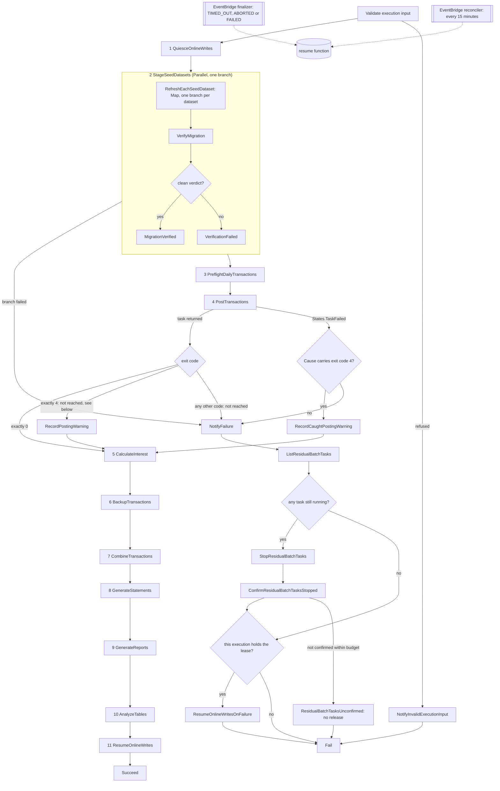

# Step Functions batch module

## 1. Purpose and source of truth

This reusable module provisions four STANDARD Step Functions workflows: the
eleven-work-state nightly CardDemo batch chain, the smaller ad-hoc report
workflow started by reporting-service, the operator-invoked dataset
export/import round trip, and the operator-invoked pending-authorization segment
export and extract load. It also provisions **one least-privilege execution role
per workflow**, one encrypted execution-log group per workflow, and the
dead-letter queue and **four** alarms covering the out-of-graph bracket release.

⚠️ Refactoring Rationale: three counts in that sentence were wrong at once, and
each was wrong in the direction that makes a reader stop looking for something
that is really there. It said **three** workflows and named the first three: the
authorization-extract machine landed with its own log group, its own timeouts and
its own task definition input, and the count was not re-measured. It said the
workflows share **one** execution role, which stopped being true when the shared
role was split -- `aws_iam_role.this` is declared `for_each = local.machines`, so
there are four, and a reader auditing "the" role would audit a resource that does
not exist. And it said "the dead-letter queue and alarm", singular, where
[§8.1](#81-releasing-the-quiesce-bracket) documents and
`bracket_release_alarm_names` publishes **four** -- the direction that leaves one
delivery rule's failures unsubscribed.

### 1.1 What this module orchestrates, and what it is derived from

The immutable JCL under `app/jcl/` and the CICS submission queue in
`app/csd/CARDDEMO.CSD` are the behavioural lineage, and they are read-only: the
COBOL, JCL and CSD baseline is the behavioural oracle for this migration and
stays byte-identical. Every claim below cites it by path and line. The
load-bearing citations, each verified against the bytes rather than inferred, are
the posting step and its daily input at `app/jcl/POSTTRAN.jcl:23-41` and its
`DALYTRAN` DD at `app/jcl/POSTTRAN.jcl:30`; the injected business date at
`app/jcl/INTCALC.jcl:22` and the system-transaction generation it writes at
`app/jcl/INTCALC.jcl:41`; the one graded return code in the whole chain at
`app/cbl/CBTRN02C.cbl:229-230`; the quiesce and resume brackets at
`app/jcl/CLOSEFIL.jcl:22-30` and `app/jcl/OPENFIL.jcl:22-30`; and the on-demand
submission queue at `app/csd/CARDDEMO.CSD:499-505`.

**The migration adds a path, it does not remove one.** The mainframe path
continues to exist and continues to run; nothing here retires, replaces or
disparages it. Where a mainframe *mechanism* has no cloud analogue, what retires
is the mechanism and not the behaviour, and each such case is named at the state
that carries it. The full analysis is in the existing
[batch orchestration architecture](../../../docs/architecture/batch-orchestration.md),
which is the authoritative prose home of the state table, the condition-code
inversion and the generation-dataset families; this README gives the module-level
view and defers to it rather than restating it at length.

### 1.2 Why this file exists

This README is the prose half of Rule 1 Explainability. HCL has no docstring
construct, so the obligation is split: `infra/.tflint.hcl` and
`infra/.terraform-docs.yml` supply the mechanical half -- the typed and
documented input and output gates are enforced by [TFLint](../../.tflint.hcl),
and the reference tables in [§16](#16-terraform-reference) are drift-checked with
[terraform-docs](../../.terraform-docs.yml) -- and this file supplies the
reasoning those four `.tf` files cannot hold at length. The convention it follows
is [the documentation standard](../../../docs/CODE_DOCUMENTATION_STANDARD.md),
whose HCL section is the authority for the form used here, and the house
`# WHAT:` / `# WHY :` command idiom is the one `tests/README.md` establishes.

Read as a docstring for the module, the four sections that answer Rule 1's four
questions are: **purpose**, this section; **parameters**, the inputs in
[§2](#2-module-boundary) and the execution-input contract in
[§6](#6-business-date-input); **return values and their consumers**, the outputs
in [§12](#12-ownership-boundaries) and [§16](#16-terraform-reference); and
**errors**, the failure and warn paths in [§4](#4-condition-code-inversion) and
[§8](#8-failure-retry-and-restart) together with the honest boundaries in
[§14](#14-validation).

## 2. Module boundary

This directory is a module, not a root, and is **never applied directly**.
`infra/envs/dev` and `infra/envs/prod` call it with
`source = "../../modules/step-functions-batch"`. It declares no provider
configuration, backend, schedule, ECS cluster, task definition, Lambda function,
bucket, or database. Those resources are supplied through typed inputs by the
environment root.

Three consequences follow, and each is stated because it is a thing a reader might
otherwise try here:

- **There is no `backend.tf`**, because a backend belongs to a root. The
  environment roots' backend points at the S3 state bucket and DynamoDB lock table
  that `infra/bootstrap` provisions once per account.
- **There is no `provider` block.** The module inherits the provider the calling
  root configures. `versions.tf` declares the provider *requirement*
  (`hashicorp/aws ~> 6.56`) without configuring it, and those are different
  things -- a requirement constrains what a caller may install, a configuration
  decides the region and credentials, and only the caller may do the second.
- **There is no `terraform.tfvars`.** Per-environment values live in
  `infra/envs/*/terraform.tfvars`, and those files carry **sizing and retention
  parameters only, never a credential**. This module's inputs are correspondingly
  free of secret material: it takes ARNs, names and numbers, and the one input
  that names a security control (`permissions_boundary_arn`) names a policy rather
  than carrying its contents.

⚠️ Refactoring Rationale: this sentence also listed **alarm** among the things
the module declares none of, and that is no longer true. It declares exactly one
queue and one alarm, both belonging to the out-of-graph bracket release described
under [Releasing the quiesce bracket](#81-releasing-the-quiesce-bracket): the
dead-letter queue for the finalizer rule's own undelivered events, and the alarm
that fires on the first message. Their lifecycle is that rule's rather than the
environment's -- they are named after it and must be destroyed with it -- so
taking them as inputs would let a root point two rules at one queue and lose
which failure came from where. Nothing else in the module owns a queue, an alarm
or a metric.

```hcl
module "step_functions_batch" {
  source = "../../modules/step-functions-batch"

  name_prefix                        = var.name_prefix
  environment                        = var.environment
  ecs_cluster_arn                    = module.ecs_cluster.cluster_arn
  batch_task_definition_arn          = module.ecs_service["batch"].task_definition_arn
  data_migration_task_definition_arn = module.ecs_service["data-migration"].task_definition_arn
  reporting_task_definition_arn      = module.ecs_service["reporting"].task_definition_arn
  authorization_task_definition_arn  = module.ecs_service["authorization"].task_definition_arn
  batch_container_name               = module.ecs_service["batch"].container_name
  data_migration_container_name      = module.ecs_service["data-migration"].container_name
  reporting_container_name           = module.ecs_service["reporting"].container_name
  authorization_container_name       = module.ecs_service["authorization"].container_name
  private_app_subnet_ids             = module.network.private_app_subnet_ids
  task_security_group_id             = module.network.app_security_group_id

  # Each machine's execution role may pass only the roles of the task definitions
  # THAT machine runs, which is why this is keyed rather than one flat list.
  pass_role_arns = {
    daily = [
      module.ecs_service["batch"].task_role_arn,
      module.ecs_service["batch"].execution_role_arn,
      module.ecs_service["data-migration"].task_role_arn,
      module.ecs_service["data-migration"].execution_role_arn,
      module.ecs_service["reporting"].task_role_arn,
      module.ecs_service["reporting"].execution_role_arn,
    ]
    adhoc = [
      module.ecs_service["reporting"].task_role_arn,
      module.ecs_service["reporting"].execution_role_arn,
    ]
    dataset = [
      module.ecs_service["batch"].task_role_arn,
      module.ecs_service["batch"].execution_role_arn,
    ]
    authz = [
      module.ecs_service["authorization"].task_role_arn,
      module.ecs_service["authorization"].execution_role_arn,
    ]
  }

  quiesce_function_arn          = aws_lambda_function.quiesce.arn
  resume_function_arn           = aws_lambda_function.resume.arn
  analyze_tables_function_arn   = aws_lambda_function.database_admin.arn
  read_only_flag_parameter_name = aws_ssm_parameter.online_writes_enabled.name
  notification_topic_arn        = module.observability.notification_topic_arn
  dataset_bucket_name           = module.s3_datasets.bucket_name
  log_retention_days            = var.log_retention_days
  log_group_kms_key_arn         = module.kms.s3_key_arn
  dead_letter_kms_key_arn       = module.kms.sqs_key_arn

  # Required. Bounds all FOUR execution roles this module creates -- each holds
  # ecs:RunTask, iam:PassRole over the task roles and lambda:InvokeFunction, and
  # iam:PassRole is a privilege-escalation primitive, so the ceiling matters most here.
  # The module asserts the ARN names THIS account: a cross-account boundary is accepted
  # by IAM and then bounds nothing.
  permissions_boundary_arn = var.permissions_boundary_arn

  # The SAME value is set on the resume function's BATCH_TASK_STARTED_BY, which is why
  # the root owns it: the module stamps it on every task and the function filters
  # ListTasks by it, so a second spelling would be a filter that matches nothing.
  task_started_by = local.batch_task_started_by
}
```

Assumptions: the environment root is the only composition boundary. This
module does not look up sibling resources by name or remote state, so every
producer-to-consumer edge remains visible in one root plan.

Two details in that example are easy to get wrong, and both were wrong in an
earlier revision of this file:

- **`analyze_tables_function_arn` takes the database-admin function.** There is
  no `aws_lambda_function.analyze_tables` in either environment root; one
  function serves both the `AnalyzeTables` state and the one-shot schema
  bootstrap, and it is declared as `aws_lambda_function.database_admin`. Copying
  the older spelling produced an unresolvable reference.
- **`read_only_flag_parameter_name` is required and was omitted.** Seventeen of the
  inputs above are required -- none carries a default -- so an example missing
  one does not plan. The value must be an ABSOLUTE parameter name: the module
  validates the leading slash because
  `infra/lambda/online_write_flag.py` refuses a relative name at import time,
  which would otherwise fail inside the first state of the chain rather than at
  plan.

## 3. Daily workflow

| # | Work state | Mechanism | Baseline lineage |
|---|---|---|---|
| 1 | `QuiesceOnlineWrites` | Lambda invocation setting the read-only flag in SSM Parameter Store | `app/jcl/CLOSEFIL.jcl:22-30`, step `CLCIFIL`, `EXEC PGM=SDSF` |
| 2 | `StageSeedDatasets` | Parallel wrapping one branch: a Map of synchronous data-migration tasks, one full dataset refresh per branch, then the combined verification gate | The `IDCAMS REPRO` copy and the `DEFINE CLUSTER` and load half of the ten master-load jobs, plus `DALYTRAN.PS` |
| 3 | `PreflightDailyTransactions` | Synchronous batch-service task | `CBTRN01C`, which has **no JCL driver in the baseline** |
| 4 | `PostTransactions` | Synchronous batch-service task, an exit-code Choice on its result and a task-failure classifier on its error | `app/jcl/POSTTRAN.jcl:23-41` / `CBTRN02C` |
| 5 | `CalculateInterest` | Synchronous batch-service task | `app/jcl/INTCALC.jcl:22-41` / `CBACT04C` |
| 6 | `BackupTransactions` | Synchronous batch-service task | `app/jcl/TRANBKP.jcl:23-33` |
| 7 | `CombineTransactions` | Synchronous batch-service task | `app/jcl/COMBTRAN.jcl:22-48` |
| 8 | `GenerateStatements` | Synchronous reporting-service task | `app/jcl/CREASTMT.JCL:79-96` / `CBSTM03A` + `CBSTM03B` |
| 9 | `GenerateReports` | Synchronous reporting-service task | `app/jcl/TRANREPT.jcl:37-48` / `CBTRN03C` and `app/jcl/PRTCATBL.jcl` |
| 10 | `AnalyzeTables` | Lambda invocation running statistics maintenance | Statistics analogue of `app/jcl/TRANIDX.jcl:22-52` (`IDCAMS BLDINDEX`) |
| 11 | `ResumeOnlineWrites` | Lambda invocation clearing the read-only flag | `app/jcl/OPENFIL.jcl:22-30` |

Eleven counts the states that perform business or operational work, and it is the
count the migration plan's section 0.4.1.7 fixes. Input validation, task-exit
Choices, the posting task-failure classifier, warning recording, notification,
terminal success/failure, and failure-path resume states are additional control
states.

### 3.1 Per-state lineage notes

Each note below prevents one specific misreading of the table, and each rests on
bytes read from the immutable baseline rather than on the job names.

**Assumptions: state 3 has no job card, and that is not an omission in the
table.** `CBTRN01C` is referenced by no file in `app/jcl/`, `app/proc/` or
`app/scheduler/`, and it is absent from the `EXEC PGM=` census across `app/jcl`,
which names `CBACT01C`, `CBACT02C`, `CBACT03C`, `CBACT04C`, `CBCUS01C`,
`CBEXPORT`, `CBIMPORT`, `CBSTM03A`, `CBTRN02C` and `CBTRN03C` -- and no
`CBTRN01C`. It is exercised only by `tests/integration/test_cbtrn01c_prepost.py`.
The state therefore exists because the program and its integration test define a
contract, not because a job card was ported.

**Refactoring Rationale: state 6 removes duplicated work.**
`app/jcl/TRANREPT.jcl:23-33` re-does the same `REPROC` unload that
`app/jcl/TRANBKP.jcl:23-33` performs -- both write `TRANSACT.BKUP(+1)` -- because
each JCL job is redundantly self-contained, which is the correct shape for jobs
that must be submittable individually. The state machine has one graph instead of
several job cards, so it unloads **once** in state 6 and states 7 and 9 consume
that generation: less work, identical output.

**Assumptions: state 7's ordering is load-bearing rather than conventional.**
`app/jcl/COMBTRAN.jcl` merges a **concatenated** `SORTIN` -- `TRANSACT.BKUP(0)`
at line 24 and `SYSTRAN(0)` at line 26 -- on `TRAN-ID` (line 30), writes
`TRANSACT.COMBINED(+1)` at line 37, then `REPRO`s it back into the transaction
master at line 48. State 7 must therefore follow **both** state 5, which writes
`SYSTRAN(+1)` (`app/jcl/INTCALC.jcl:41`), and state 6, which writes
`TRANSACT.BKUP(+1)`. Note too that `(+1)` appears twice in that job, at lines 37
and 44, and resolves to the **same** physical generation.

**Assumptions: state 8 produces TWO artifacts, and a rerun replaces rather than
appends.** `app/jcl/CREASTMT.JCL` declares `STMTFILE` at lines 87-91 as `LRECL=80`
plain text (`STATEMNT.PS`) and `HTMLFILE` at lines 92-96 as `LRECL=100` HTML
(`STATEMNT.HTML`). `STEP030` at line 66 runs `IEFBR14` with
`DISP=(MOD,DELETE,DELETE)` before `STEP040` at line 79 writes
`DISP=(NEW,CATLG,DELETE)`, so the previous run's outputs are deleted first. Two
further properties of that member are recorded here as observations of an
immutable baseline rather than as defects to fix, because a reader comparing the
job to this state will notice them: line 90 carries overlapping text from an
earlier edit, and `HTMLFILE` is declared at `LRECL=80` in the delete step at line
69 while the writing step declares it at `LRECL=100` at line 94.

**Refactoring Rationale: state 10 retires the rebuild, NOT the index.**
`app/jcl/TRANIDX.jcl` has three IDCAMS steps: `STEP20` at line 22 defining the
alternate index with `KEYS(26 304)`, `NONUNIQUEKEY` and `RECORDSIZE(350,350)`
(lines 25-30), `STEP25` at line 39 defining the path, and `STEP30` at line 49
running `BLDINDEX`. All three retire because PostgreSQL maintains indexes inside
the same transaction as the write, and the index itself is declared in
transaction-service's Flyway migration. **The index is not dropped -- only its
imperative rebuild.** What survives as work for this state is statistics
maintenance, which is why the table calls it an analogue rather than a port.

**Refactoring Rationale: states 1 and 11 retire the SDSF mechanism, not the
behaviour.** `app/jcl/CLOSEFIL.jcl` and `app/jcl/OPENFIL.jcl` each run
`EXEC PGM=SDSF` (line 22, steps `CLCIFIL` and `OPCIFIL`) and issue **five**
`/F CICSAWSA,'CEMT SET FIL(<name> ) CLO'` -- respectively `OPE'` -- commands at
lines 26-30, over `TRANSACT`, `CCXREF`, `ACCTDAT`, `CXACAIX` and `USRSEC`. That
is five of the eight files `app/csd/CARDDEMO.CSD` defines, because the bracket is
scoped to the **write** path: the read-only unload jobs open their files shared.
A flag every online service reads is therefore the faithful analogue rather than
a hard lock. The operational consequence is the reason
[§8.1](#81-releasing-the-quiesce-bracket) exists: **state 11 must be reachable on
the failure path**, or a failed run leaves the online write path quiesced.

**Assumptions: state 2 stages ten master families plus the daily input.** The ten
master-refresh load jobs are `ACCTFILE.jcl`, `CARDFILE.jcl`, `CUSTFILE.jcl`,
`XREFFILE.jcl`, `TRANFILE.jcl`, `DISCGRP.jcl`, `TCATBALF.jcl`, `TRANTYPE.jcl`,
`TRANCATG.jcl` and `DUSRSECJ.jcl`, and **none of the ten carries a `COND=`**.
`DALYTRAN.PS` has no load job in the baseline -- `app/jcl/POSTTRAN.jcl:30` reads
it directly at its `DALYTRAN` DD with `DISP=SHR`, as flat sequential input to
posting rather than a loaded master -- yet it IS staged and loaded here, for the
target-side reason given in [§7](#7-seed-data-maps).

### 3.2 The verification gate inside state 2

State 2 is a `Parallel` with a single branch, and the branch holds four states in
sequence: `RefreshEachSeedDataset` (the Map), `VerifyMigration`, its exit-code
`Choice`, and the branch's own terminal `Succeed` or `Fail`. The gate runs the
combined verification -- row counts, then per-record checksums, then exact money
totals -- on the SELECT-only verification login, and it stands between staging an
extract and posting against it. State 2's single outgoing edge is the ONLY edge
into state 3, so business processing cannot be reached over data that does not
match its source.

Refactoring Rationale: the gate is nested rather than promoted to a state of its
own. Section 0.4.1.7 fixes the nightly chain at ELEVEN top-level work states and
describes state 2 as "a Map state, one branch per dataset, each a runTask.sync",
while sections 0.9.2 and 0.7.7 mandate this verification as a first-class
deliverable with three passes and give it no state to run in. A revision that
published the gate as a twelfth top-level state resolved that tension by changing
the frozen topology; nesting it resolves the same tension without changing it, and
keeps every safety property the gate exists for -- the SELECT-only login, the two
committed whole-migration queries, and sole control of the edge into state 3.
The wrapper is what makes the nesting possible: a `Map` cannot hold a state that
runs once after all its branches, so the Map and the gate are siblings inside one
branch instead. `VerifyMigration` is therefore a TIMED state without being a
top-level one, which is why `state_timeout_seconds` carries twelve keys for an
eleven-state chain. Two consequences are deliberate and are recorded at the states
themselves in `main.tf`: the wrapper carries no `TimeoutSeconds`, because the
States Language does not define that field for a `Parallel`, and neither the Map
nor the gate carries its own `Catch`, because a state inside a branch cannot
transition out of it -- both raise to the wrapper's `Catch`, which is the shared
handler that every other work state uses and writes the same `$.failure` path.

Refactoring Rationale: two further states were authored into this position -- a
`LoadSeedDatasets` Map and a `ReconcileTransactionSequence` task, which together
with `VerifyMigration` would have made the chain fourteen work states -- and all
three are withdrawn; the first two for the reason below. Each was written
against a state 2 that only staged: an earlier revision of this chain copied an
extract from a prefix to a retained generation prefix and wrote no row, so nothing
loaded Aurora and the identifier sequence was never advanced past the loaded rows.
State 2 now runs a full refresh per dataset, which loads the target table and
advances `ledger.transaction_id_seq` for the one dataset whose rows occupy the
allocator's range, so both hazards are closed one state earlier and a second pass
would repeat work already done. The hazards themselves are unchanged and are worth
restating: a chain that stages without loading reads whatever the tables already
held, and a load that leaves the sequence inside the range it just inserted makes
the first transaction the online service adds collide on the primary key.



Assumptions: the failure path stops and CONFIRMS the chain's residual tasks before it
reaches the ownership gate, and refuses to release at all if it cannot confirm them.
A synchronous run-task state that timed out leaves its container running -- Step
Functions stops waiting, ECS does not stop the task -- so releasing the bracket at
that moment would re-enable online writes underneath a posting container that is
still writing. `ResidualBatchTasksUnconfirmed` is deliberately a terminal failure
that does NOT pass through the release, on the same principle as
`OnlineWriteLeaseUnavailable`: a bracket held is recoverable, a bracket released
under a live writer is not.

## 4. Condition-code inversion

**A JCL `COND` is a *skip* predicate; a Step Functions `Choice` is a *run*
predicate, so the sense must be INVERTED, not copied.** This is the single
easiest thing in the migration to get backwards, and getting it backwards is
silent: an inverted gate still runs, it just runs the wrong nights.

There are three forms in the baseline, and the counts below are a census of
`app/jcl/` rather than an estimate.

- **`COND=(0,NE)` -- eight sites.** `app/jcl/DEFGDGD.jcl` lines 36, 47, 59 and
  82; `app/jcl/CREASTMT.JCL` lines 56, 66 and 79; and `app/jcl/TXT2PDF1.JCL` line
  26, in a job that retires with no target at all. It reads "skip when zero is not
  equal to a prior return code", i.e. run only when every predecessor ended
  cleanly. In the workflow this is the ordinary success edge -- the clean rule of
  the work state's exit-code `Choice`, reached when the integration returned a
  task envelope carrying exit code 0. Every other outcome, integration fault and
  non-zero container exit alike, takes the state's `Catch`, which routes to
  notification and then to a terminal `Fail`.
- **`COND=(4,LT)` -- exactly ONE site: `app/jcl/TRANBKP.jcl:51`.** It reads "skip
  when four is less than the return code", i.e. **run only when the return code is
  4 or lower** -- so it becomes an explicit `Choice` whose run-predicate is
  `rc <= 4`, letting the soft-warn path continue. `app/cbl/CBTRN02C.cbl:229-230`
  produces code 4 when posting completed with rejects, so the workflow rejoins the
  success path for that warn tier -- by way of `ClassifyPostingTaskFailure`,
  described in [§4.1](#41-where-the-posting-warn-tier-actually-lives), rather than
  by way of `CheckPostingExitCode`.
- **`INCLUDE COND=(...)` -- one site, and it is NOT a step gate.**
  `app/jcl/TRANREPT.jcl:47-48` selects records on an inclusive processing-date
  range. It becomes a SQL `WHERE` clause inside the reporting service and **must
  never be modelled as a `Choice` state.** The hazard is worth naming plainly: the
  two forms share the `COND` keyword, which is exactly why they get conflated, and
  a record filter promoted to a step gate would skip the whole report on a night
  whose data merely fell outside the range. Its bounds are injected as DFSORT
  `SYMNAMES` at lines 43 and 44 -- `PARM-START-DATE,C'2022-01-01'` and
  `PARM-END-DATE,C'2022-07-06'` -- which is why the ad-hoc machine passes them as
  arguments rather than embedding them.

**Refactoring Rationale: what the one `COND=(4,LT)` site actually gates, and why
the target must be idempotent because of it.** It sits on `STEP10`, the
`IDCAMS DEFINE CLUSTER` at `app/jcl/TRANBKP.jcl:51-54` that re-creates the emptied
transaction master, after `STEP05R` at line 23 unloaded that master to
`TRANSACT.BKUP(+1)` at line 33 and `STEP05` at line 37 deleted the cluster and its
alternate index. It is therefore a **safety interlock**: never re-create an empty
master unless the backup and the delete both went acceptably. The two
`IF MAXCC LE 08 THEN SET MAXCC = 0` lines at 42 and 45 are what normalise a
not-found delete down to 0 so the `<= 4` test can pass -- which is precisely why
the target's drop-if-exists must likewise be non-fatal and idempotent: a first run
against a clean database, where there is nothing to drop, must not be reported as
a failure.

**Refactoring Rationale: why the warn tier must survive the translation.**
`app/cbl/CBTRN02C.cbl:229-230` is the only place the program assigns
`RETURN-CODE`, and it assigns 4 when the reject count is greater than zero. If the
state machine treated 4 as a failure, **a night that posted successfully but had
rejects would be reported as a failed batch run** -- a false alarm on every single
run that rejects anything, which is a normal operating condition rather than an
incident, and which would additionally skip backup, statements and reports. The
graded outcome is therefore preserved rather than collapsed to binary
success/failure. The state that actually carries it is the classifier rather than
the numeric `Choice`, for the reason in
[§4.1](#41-where-the-posting-warn-tier-actually-lives).

`CheckPostingExitCode` matches **exactly 0 and exactly 4** and routes every other
code to failure. Refactoring Rationale: it previously compared with
`NumericLessThanEquals` against a configurable ceiling, which tolerated 1, 2 and 3
as reject nights. `app/cbl/CBTRN02C.cbl` assigns `RETURN-CODE` in exactly one
place -- `MOVE 4 TO RETURN-CODE` at its line 230 -- so those three codes cannot
come from the program's own exit path and can only mean the runtime failed around
it. The ceiling was also an input, so it could be set to 255, at which point every
failure satisfied the predicate and the chain ran interest accrual over
transactions that were never posted. The two codes are now locals in `main.tf` and
are not configurable, because they are the baseline's contract rather than a
policy.

### 4.1 Where the posting warn tier actually lives

Assumptions: the `ecs:runTask.sync` integration RAISES on a non-zero
essential-container exit. The error name is `States.TaskFailed` and the exit code
survives only inside that error's `Cause`, which the integration supplies as the
`DescribeTasks` view of the stopped task serialised into a JSON **string**. The
integration returns a task envelope, and therefore reaches the state's `Next`,
only when the container exited 0.

Two consequences follow, and both are properties of the graph rather than of this
module's preferences:

- The **clean rule** of every `Check*ExitCode` gate is live. Their warn rule --
  `CheckPostingExitCode`'s second rule -- and their `Default` edges are not
  entered on any path the chain takes, because the result they would inspect only
  ever carries a zero. Both are kept: a `Choice` with no `Default` raises
  `States.NoChoiceMatched`, a `Choice` state cannot carry a `Catch`, and that
  error would end the execution without publishing the notification, sweeping the
  residual tasks or releasing the write bracket. The warn rule is kept because it
  is the one declarative statement of the rc=4 contract on the result path, next
  to which the classifier reads as the same contract on the error path.
- `PostTransactions` therefore carries **two catchers in declaration order**: a
  `States.TaskFailed` catcher that captures the error at `$.postingFailure` and
  routes to `ClassifyPostingTaskFailure`, followed by the shared `States.ALL`
  catcher that writes `$.failure` and routes to `NotifyFailure`. Amazon States
  Language evaluates catchers in order and the first match wins, so the order is
  load-bearing: the wildcard placed first would swallow the error before the
  specific catcher was consulted.

Assumptions: `States.TaskFailed` is itself a **wildcard** wherever it appears in a
`Retry` or a `Catch` -- the language defines it as matching every known error name
except `States.Timeout`. The first catcher therefore also receives the `ECS.*`
integration faults once their retries are spent, which is why the classification
is done by guards on the `Cause` and not by the error name: a fault that never ran
the job carries no batch container reporting 4, so it takes the `Choice`'s
`Default` and ends the run exactly as before, one `Choice` hop later. The one
documented exception is what keeps the cancellation sweep intact -- `States.Timeout`
does not match that catcher, so an abandoned-wait expiry still falls through to the
`States.ALL` catcher and still reaches `ListResidualBatchTasks`.

`ClassifyPostingTaskFailure` guards with `IsPresent` and `IsString` on the `Cause`,
then requires the `Cause` to **name the batch container** -- `*"Name":"<batch
container>"*` or the same pattern with a space after the colon, under `Or` -- and
only then matches four `StringMatches` patterns under `Or`:
`*"ExitCode":4,*`, `*"ExitCode":4}*`, `*"ExitCode": 4,*` and `*"ExitCode": 4}*`.
Assumptions: `StringMatches` is the only comparator in the language that admits a
wildcard, and exactly one character is special in its pattern -- `*`. Each pattern
carries a boundary character after the digit, and that is what makes the rule
correct rather than merely plausible: a bare `*"ExitCode":4*` also matches
`"ExitCode":40`, which would read a hard failure as a reject night. A match routes
to `RecordCaughtPostingWarning`, a `Pass` writing the same
`{code = "POSTING_REJECTS_PRESENT", exitCode = 4}` payload to `$.warning` that
`RecordPostingWarning` writes, and then to `CalculateInterest`. Its payload is
static because a task state applies no `ResultPath` when it fails, so `$.posting`
does not exist on this edge.

The container-name conjunct is what binds the classification to this task rather
than to any failure that happens to carry a 4: it comes from
`var.batch_container_name`, the same input the `ContainerOverrides` address, and a
`Cause` carrying no container entries at all -- a `RunTask` response holding only
`Failures`, or a plain-text integration message -- fails closed. Both spacings are
covered for the same reason the exit-code patterns cover both: a compact-only name
pattern refuses a payload whose members are separated with a space, which would be
a warn tier that stops matching on a serialiser detail rather than on the outcome.

Trade-offs: an unrecognised `Cause` **fails closed** to `NotifyFailure`.
Over-matching would continue the chain past a genuine hard failure, whereas
under-matching stops a night that is recoverable by redrive and whose reject
stream is already durable -- the rejects are committed to
`ledger.transaction_rejects` and staged as the `DALYREJS` generation before
posting exits.

Trade-offs: the name conjunct proves the payload is this task's stopped-task
description; it does not attribute the exit code to one entry **inside** it. The
batch task definition carries the telemetry collector beside the application
container -- `enable_telemetry_collector` defaults to `true` in
`infra/modules/ecs-service` and neither environment root overrides it -- and both
are essential, so an `ExitCode` of 4 on either satisfies the rule. Attributing it
within the pattern language is not expressible: the only wildcard is `*`, there is
no negation, and a pattern holding both tokens matches a name from one entry with
an exit code from the next. Making it exact is a property of the task definition
rather than of this graph -- passing `enable_telemetry_collector = false` for the
batch workload in the environment roots leaves one container able to report an exit
code, and the run-to-completion task has no long-lived telemetry to export anyway.
The residual is detectable rather than silent: the code posting finished with is
durable in `batch.batch_run` for the run that continued.

Alternatives Considered: `States.StringToJson` on the `Cause` in a `Pass` state,
then `NumericEquals` on the decoded `Containers[i].ExitCode`, which would be exact
and would need no patterns. Rejected because a `Pass` state cannot carry a `Catch`,
so a `Cause` that is not parseable JSON -- the integration-level fault, the case
most in need of routing -- raises `States.IntrinsicFailure` and ends the execution
without publishing the notification, sweeping the residual tasks or releasing the
write bracket; and a missing reference path raises `States.Runtime`, which
`States.ALL` does not catch. That trades a rare detectable misroute for a rare
silent unnotified abort of the whole chain.

Assumptions: only `PostTransactions` has a classifier. A non-zero exit from
preflight, interest, backup, combine, statements, reports, export, import or the
authorization extract remains a hard failure through the shared catcher, which is
the correct outcome -- none of those programs has a documented warn tier to
preserve, so giving them a classifier would invent a soft-failure semantic the
baseline does not have. The asymmetry is deliberate and is recorded at each site
in `main.tf`.

## 5. Container invocation

Batch states pass an argument array matching `BatchApplication` exactly:

```text
--job=<preflight-daily-transactions|post-transactions|calculate-interest|backup-transactions|combine-transactions>
--business-date=<ten-character token>
```

Each batch task also receives `CARDDEMO_BATCH_RUN_ID=$$.Execution.Name`.

**Assumptions: there are FOUR task definitions, and which image serves which
state is verifiable rather than conventional.** `services/batch-service`'s job-name
list is exactly `preflight-daily-transactions`, `post-transactions`,
`calculate-interest`, `backup-transactions`, `combine-transactions`, `export` and
`import` -- **no statement job and no report job** -- so the statement and report
writers must be, and are, in reporting-service. The **batch** image therefore
serves states 3 through 7, the **data-migration** image serves state 2's Map
branches, the **reporting** image serves states 8 and 9 and the whole ad-hoc
machine, and the **authorization** image serves the operator-invoked
authorization extract. The migration plan describes three; the fourth arrived with
the authorization-extract machine, and its own input
(`authorization_task_definition_arn`) records why it is not a reuse of the batch
one: the segment export reads the authorization context's tables, which only that
context's database role may read.

Keep the provenance distinction when reading the command shapes below: the five
batch job tokens used by the nightly chain are **verified** against that service's
own README, while the statement and report tokens are **derived** from the state
names and follow the same `--job=<kebab-case>` convention. Derived is not
guessed -- the receiving image resolves a bean whose name is the job token, as
[§5.1](#51-reporting-commands-and-their-receiver) records -- but it is not the same
evidence, and presenting it as verified would overstate it.

**Assumptions: `ContainerOverrides.Command` is an argument ARRAY.** It is never a
space-joined string and never wrapped in `sh -c`, and both mistakes fail in ways
that are easy to misdiagnose. A space-joined string arrives as a single argument,
which the option parser rejects as one unrecognised token rather than reading it as
five options. An `sh -c` wrapper makes the shell the container's process 1, so it
receives the stop signal and the JVM never gets `SIGTERM` on task drain -- the job
is then killed rather than shut down, and a step that was mid-write is the one most
likely to be interrupted. `services/batch-service/Dockerfile` uses an exec-form
`ENTRYPOINT`, and an ECS command override replaces `CMD` and is appended after that
entrypoint, which is what makes the bare argument array correct.

`ContainerOverrides` additionally addresses containers **by name**, and an override
naming a container the task definition does not contain is silently ignored rather
than rejected -- the task then runs its baked-in command, which for a service image
is a web server that never terminates, inside a state that waits for the task to
stop. That is why every container name is a validated module input rather than an
assumed constant.

Assumptions: state 2 runs `python -m carddemo_migration.cli` with the
`refresh-dataset` subcommand, per-item dataset/business-date arguments, and the
`--extract-prefix` this module passes from `dataset_source_extract_prefix`. States
8 and 9 use reporting-service commands because the batch-service job list has
no statement or report job.

Refactoring Rationale: that subcommand read `stage-dataset`, which stages one
generation and stops. Staging alone leaves the relational masters untouched, so a
chain that "succeeded" at state 2 continued into posting against whatever the
previous run had left in the database -- the load half of the ten `IDCAMS REPRO`
jobs the state claims lineage from was simply absent. `refresh-dataset` performs
the whole round trip per branch, in this order: fetch the published extract from
the dataset bucket's source prefix into a scratch directory, stage it as a new
generation, decode and load it into its owning schema, verify row counts, verify
the record checksum, verify money parity, and -- for the transaction master alone,
because it is the one table whose identifier allocator can point into a loaded
range -- reconcile the allocator. The allocator step runs LAST rather than before
the verifications, because advancing a sequence changes nothing the three passes
compare. The load and the three passes are composed only for a dataset whose layout
ships a committed extract, so the `transactions` branch stages, reconciles and exits
zero without loading -- see [Seed-data Maps](#7-seed-data-maps). The scratch directory
is removed when the step ends whatever the outcome.
The subcommand
was added rather than the branch being expanded into five states because the
eleven-state contract of the migration plan's section 0.4.1.7 is a topology this
module must not change.

### 5.1 Reporting commands and their receiver

Reporting states pass an argument array matching `ReportingTaskRunner` exactly:

```text
--job=<generate-statements|generate-reports>  --business-date=<ten-character token>
--job=generate-report  --start-date=<token> --end-date=<token> --report-type=<type>
```

Refactoring Rationale: those three commands previously had no receiver at all.
The environment roots wire `reporting_task_definition_arn` to the reporting ECS
SERVICE's own task definition, and that image's entry point started a web server
-- so a dispatched state started a container that listened for requests and never
terminated, and the state reported a TIMEOUT after its whole ceiling elapsed
rather than reporting that the command was unimplemented. The image now has two
modes selected by the presence of `--job=`: task mode validates the command
before building any context, resolves a `ReportingTask` bean whose name is the
job token, and exits 0 on completion or 8 on any failure.

## 6. Business-date input

The scheduler supplies an ISO `scheduledTime`. The workflow takes the portion
before `T` and passes it as `--business-date=YYYY-MM-DD`. A manual or redriven
execution may instead supply `businessDate` directly:

```json
{"businessDate":"2022-07-18"}
```

`app/jcl/INTCALC.jcl:22` likewise injects its ten-character date token through
`PARM`; no batch state substitutes a wall-clock reading. This keeps reruns
reproducible.

## 7. Seed-data Maps

`StageSeedDatasets` iterates eleven items:
accounts, cards, customers, card cross-reference, transactions, daily
transactions, disclosure groups, transaction-category balances, transaction
types, transaction categories, and users. Ten of the eleven correspond
one-to-one to the ten `IDCAMS` master-load jobs in `app/jcl/` -- ACCTFILE,
CARDFILE, CUSTFILE, XREFFILE, TRANFILE, DISCGRP, TCATBALF, TRANTYPE, TRANCATG
and DUSRSECJ -- each of which performs exactly one `REPRO`.

Refactoring Rationale: `daily_transactions` is the eleventh and was added after
first being reasoned out of the list. The earlier reasoning was that
`app/jcl/POSTTRAN.jcl:30` reads `DALYTRAN.PS` directly with `DISP=SHR`, making it
flat sequential input to posting rather than a loaded master. That is true of the
baseline and false of the target: here posting reads `ledger.daily_transactions`,
a real table with a declared Aurora load target whose `amount` column is one of
the nine the committed money-total query totals. Omitting it therefore left a
declared target unloaded while verification totalled it, and verification pass 3
refuses the whole run when a layout that ships a committed extract contributes no
source total.

Assumptions: ten of the eleven branches load and verify their master, and
`transactions` STAGES ITS GENERATION AND STOPS -- reporting success rather than
failing. The exemption belongs to the ETL and not to this module: the repository
commits no `TRANSACT` extract, so the registry points that token at
`AWS.M2.CARDDEMO.DALYTRAN.PS.INIT`, the single 350-byte record `TRANFILE.jcl` `REPRO`s
to prime the cluster, whose unpopulated fields do not decode as a whole transaction.
`carddemo_migration.readers.transaction` declares `HAS_COMMITTED_SEED_DATASET = False`
and the verification gate's row-count query REQUIRES `ledger.transactions` to hold zero
rows after the ETL, because posting at state 4 fills it -- so a branch that loaded even
one record would turn a green Map into a failed gate in the same branch. `refresh-dataset`
reads that same predicate and states the exemption in the branch's log. The token is
kept in `var.seed_datasets` rather than dropped, because its generation family and
`LIMIT(5)` retention sweep are real and because that list is asserted equal to the
registry's eleven tokens by `data-migration/tests/test_seed_datasets.py`.

Each branch is four inner states -- `RefreshSeedDataset`,
`CheckDatasetRefreshExitCode`, and the two terminal states of the branch -- so the
branch reports the refresh's own exit status rather than the task integration's.

Each name is passed verbatim as `--dataset`, and the data-migration CLI resolves
it through `carddemo_migration.seed_datasets` to obtain the bounded-context
domain, the prefix segment, the source extract and the declared record length. The
Map state names no extract file, no generation number and no domain.

Refactoring Rationale: there is ONE Map here and there was briefly a second. A
`LoadSeedDatasets` Map was authored to run `load-dataset` over the same eleven
items, on the grounds that staging writes no row -- which was true of the state
that preceded it, and is not true of this one. `refresh-dataset` stages the
generation, loads the target table for the ten datasets that ship a committed
extract, runs all three verification passes over each of those, stages the backup
generation for the three families that have one, and advances
`ledger.transaction_id_seq` for the one dataset whose rows occupy the
allocator's range. A second Map would re-fetch and re-decode every extract to
perform an upsert that by construction changes nothing, so it is withdrawn and
what it was written to guarantee -- that the bytes staged are the bytes loaded --
holds by construction here: one branch reads one extract once and does both.

Where the extracts come from: the branch reads each dataset's registered source
file name under `dataset_source_extract_prefix` of the dataset bucket, which the
`s3-datasets` module provisions and publishes as `source_extract_prefix`. Nothing
is mounted and no filesystem is provisioned; the runbook's `aws s3 sync` of
`app/data/` into that prefix is what makes an extract available. The refresh then
refuses an extract that is not a whole number of records for its registered record
length, and cross-checks every integrity value the object actually carries --
content length, an SSE checksum if one was requested at upload, and this package's
own byte-count and digest metadata if it was published -- against the bytes that
arrived. Absent values are not fabricated; a mismatched one fails the branch.

Assumptions: a branch is idempotent per dataset within a business date. A rerun
of one branch re-reads the same published extract, allocates the next generation
under the same date prefix, and reloads the same rows, so a redrive that repeats
a completed branch converges rather than duplicating. What it does NOT do is
detect that a branch already ran -- the durable `batch.batch_run` ledger records
steps of the chain and not items of a Map -- so a partially-completed Map redriven
from state 2 repeats every branch, and the cost of that is time rather than
correctness.

Trade-offs: `MaxConcurrency` defaults to three. One would serialise
independent loads; eleven would burst every branch against the same Aurora
connection budget and Fargate quota. The value is a sizing input and does not
change the workflow topology.

## 8. Failure, retry, and restart

Every work state has an explicit timeout and catch. Integration faults retry with
bounded exponential backoff, and each retrier names **service fault errors only**
-- `ECS.AmazonECSException`, `ECS.SdkClientException`, `ECS.ServerException` and
`ECS.ThrottlingException` for the ECS states, the four `Lambda.*` equivalents for
the Lambda states. A daily failure publishes to the supplied SNS topic and then
enters the terminal Fail state, releasing the quiesce bracket on the way out
**only when this execution acquired it**.

Refactoring Rationale: `States.TaskFailed` was removed from the ECS retrier. It is
the error name a non-zero container exit arrives under, so retrying it replayed a
DETERMINISTIC outcome: a reject night re-ran the same feed against the same ledger
key and returned 4 again on every attempt before the failure path was reached at
all. Assumptions: naming the four `ECS.*` faults is not a narrowing of that entry
but a **replacement** for it, because `States.TaskFailed` in a retrier is a
wildcard over every known error name except `States.Timeout` -- it was retrying the
integration faults too, under a name that could not be told apart from the job's own
exit. `ECS.AmazonECSException` is the name AWS documents for a `RunTask` that could
not be placed for want of capacity; the other three follow the
`<Service>.<ExceptionName>` form the language uses for service exceptions, applied
to the ECS API's own modelled faults and to the SDK's transport fault. Trade-offs:
naming an error the integration never raises costs nothing, because a retrier that
never matches is inert, while omitting one costs a real retry on a fault that would
have cleared. The `batch.batch_run` ledger is what made those repeats harmless rather than
corrupting -- attempts after the first record `batch.step.skipped` against the
already-recorded return code -- which is what shows the replay to have been futile
rather than protective. Trade-offs: a LAUNCH fault now takes the failure path on
its first attempt too, because the same error name reports a task that never ran.
The cost is accepted because the name cannot separate the two at retry time,
retrying it is what made the posting warn tier unreachable, and the recovery for a
launch fault is an operator redrive -- which the ledger makes safe, since a step
that completed before the fault is a no-op on the way back through.

Refactoring Rationale: `States.Timeout` is likewise absent, and for a different
reason that must not be conflated with the one above. A `.sync` ECS state whose
`TimeoutSeconds` expires does NOT stop its container -- Step Functions abandons the
wait and the task keeps running -- so retrying that error started a second task of
the same job while the first was still writing. An expiry therefore goes straight
to the failure path, where the cancellation sub-chain stops the abandoned task
before the run is declared failed.

Refactoring Rationale: every failure used to reach the release directly,
including a refusal raised before the bracket was taken and a failure of the
quiesce call itself. Such an execution never held the flag, so clearing it
re-enabled online writes inside whatever DID hold it -- a concurrent execution's
write window, or an operator's maintenance window set by hand -- and did so
silently, because clearing an already-clear flag and clearing someone else's look
identical from inside the graph. `QuiesceOnlineWrites` now records the lease as
`leaseAcquired` and `leaseOwner`, lifted out of the Lambda invoke envelope by a
`ResultSelector` so the graph can address them directly;
`CheckQuiesceLeaseOwnership` compares the owner against the execution identity the
preparation states copied into the input; and both in-graph release edges pass
`expectedLeaseOwner` so the function performs a conditional clear rather than an
unconditional one. A refused input takes its own notification state whose every
edge ends at `Fail`.

The success edge carries the same argument even though no Choice guards it.
`QuiesceOnlineWrites` continues to `StageSeedDatasets` whether or not it acquired
the bracket, so a chain that ran to completion may be one that was refused at the
bracket; a refusal reports an EMPTY owner and the function declines to clear on
behalf of a caller that names none. The function's half of the check is bounded by
what the flag can attest -- it stores the boolean every online service reads and no
owner -- so it verifies that the bracket is still engaged rather than who engaged
it. Recording the owner in the value was rejected for the readers it would break,
and a companion owner parameter was rejected as a resource, a grant and a module
input to narrow a window the ownership gate already covers.

**Refactoring Rationale: restart is an IMPROVEMENT, not a port, and the direction
matters.** There is **no baseline batch-restart contract to preserve**. The only
`RESTART=` anywhere in the tree is commented out -- `app/jcl/DEFGDGD.jcl:2` reads
`//*  RESTART=STEP30`, carrying a leftover job-sequence field -- and `CHKPT=`, the
JCL checkpoint keyword, appears **zero** times across `app/`.

That second claim is stated precisely because it is easy to appear to contradict: a
bare search for `CHKPT` in `app/` returns nine hits, and none of them is a JCL
restart contract. They are the COBOL working-storage item `WK-CHKPT-ID` and one
`EXEC DLI CHKP` call inside the authorization extension programs
(`app/app-authorization-ims-db2-mq/cbl/CBPAUP0C.cbl`, `DBUNLDGS.CBL`,
`PAUDBLOD.CBL` and `PAUDBUNL.CBL`) -- IMS DL/I checkpoint calls belonging to those
programs' own processing, not step-restart declarations on any job in this chain.

So STANDARD-workflow **redrive**, which resumes a failed execution from the state
that failed, combined with the durable `batch.batch_run` step ledger owned by
batch-service -- unique on `(run_id, step_name)`, so a redriven step that already
completed is a no-op -- is a documented improvement over the baseline rather than a
migration of something that existed. Presenting it as a port would misdescribe
both sides.

Assumptions, recorded as a fact about an immutable baseline and **not** as an
asserted defect: had `RESTART=STEP30` been active, it would have resumed at a step
whose predecessors included an already-created generation-data-group definition,
and re-running that definition is exactly the idempotency problem the step ledger
solves. The line is commented out, so the baseline never had the problem; the
observation is here because it explains what the ledger is for.

`app/jcl/WAITSTEP.jcl:22` -- `//WAIT     EXEC PGM=COBSWAIT` -- retires **with an
analogue** rather than with no target: its function is the state transition itself,
which waits for the previous state to reach a terminal status before the next
begins. A batch chain expressed as a graph has nowhere to put a wait-step utility,
because waiting is what the edges already do.

The per-state timeout is a ceiling, not a runtime prediction. Its purpose is to
keep one task from holding the online write path quiesced beyond its own
allowance, and `state_machine_timeout_seconds` is the same kind of ceiling for
the execution as a whole.

### 8.1 Releasing the quiesce bracket

Both in-graph resume paths are states, so neither runs when the execution itself
stops. An execution-level `TIMED_OUT`, or an operator `ABORTED`, terminates
without reaching `NotifyFailure` or `ResumeOnlineWritesOnFailure`; after
`QuiesceOnlineWrites` has run, that would leave the online write path quiesced
indefinitely. The top-level ceiling therefore does **not** release the bracket,
and this module does not claim it does. Three mechanisms close the gap, and none of
them lives inside the timed execution: an event-driven finalizer, a scheduled
reconciler, and the lease's own expiry that both of them read.

`aws_cloudwatch_event_rule.daily_finalizer` matches `Step Functions Execution
Status Change` for this module's own daily machine with a status of `TIMED_OUT`,
`ABORTED` or `FAILED`, and invokes the resume function through an input
transformer that supplies `action`, the parameter to clear, the terminating
execution's name and its terminal status. It passes that same execution name as
`expectedLeaseOwner`, so this rule is checked exactly like the two in-graph edges:
it can clear the lease of the execution that just terminated, and no other. It
additionally sets `confirmTasksStopped`, which makes the release conditional on no
task carrying this module's `StartedBy` marker being short of `STOPPED` -- because
this rule fires the instant an execution ends, when a task abandoned by a timed-out
synchronous state may still be writing.

Trade-offs: the template that carries those values is built in
`local.finalizer_input_template`, not by a bare `jsonencode`, and the difference is
not cosmetic. Terraform's `jsonencode` HTML-escapes `<` to `\u003c` and `>` to
`\u003e`, so a bare encode produces a template in which the literal
`<executionName>` token EventBridge substitutes on does not appear at all; the
substitution then never happens and the function is handed the placeholder text as
the owner it must match, refusing every out-of-graph release. The local restores the
two delimiters after encoding, which is the same rewrite
`infra/modules/eventbridge-scheduler` applies to its own target payload.

`aws_cloudwatch_event_rule.bracket_reconciler` is the backstop for the cases the
finalizer cannot cover: its own delivery failing after every retry, and a release it
refused because tasks were still draining. It runs on a cadence -- every
`reconcile_interval_minutes`, 15 by default -- and carries a STATIC input rather than
a transformer, which is why it is immune to the escaping trap above: with no
placeholder there is nothing to mangle. It names no owner, because nobody is left to
name one; the function derives the owner from the lease and releases only once the
owning execution is no longer `RUNNING` and the chain's tasks are terminal. That is
what lets a cadence carry no staleness threshold: a legitimate long night is an
execution that is still running.

Assumptions: both rules dead-letter to `aws_sqs_queue.bracket_release_dlq` and **four** alarms
cover the three independent ways a release can fail. The count exceeds the number of
failure modes because the first mode is alarmed PER RULE:
`aws_cloudwatch_metric_alarm.release_delivery_failed` is declared `for_each` over both
release rules -- `daily_finalizer` and `bracket_reconciler` -- so it yields two alarms
watching `FailedInvocations`, one per rule, and `bracket_release_alarm_names` concatenates
those with `release_function_errors` and `release_dead_letters` for four names in total.
The four are therefore:

| # | Alarm | Watches | Failure mode |
|---|---|---|---|
| 1 | `release_delivery_failed["finalizer"]` | `FailedInvocations` on `daily_finalizer` | the scheduled release was never delivered |
| 2 | `release_delivery_failed["reconciler"]` | `FailedInvocations` on `bracket_reconciler` | the reconciling release was never delivered |
| 3 | `release_function_errors` | the resume function's `Errors` | the release was delivered and the function failed |
| 4 | `release_dead_letters` | the dead-letter queue's depth | a release was abandoned into the queue |

Refactoring Rationale: this paragraph previously said "three alarms cover the three
independent ways a release can fail" and then listed the modes rather than the alarms, so
the sentence read as a count of outputs while actually counting causes. A reader sizing an
alarm-notification subscription, or asserting the length of
`bracket_release_alarm_names`, would have taken three from it and been wrong by one --
and wrong in the direction that leaves one delivery rule's failures unsubscribed. Stating
the per-rule expansion explicitly is what keeps the two numbers from being confused
again.

Before these alarms, an undeliverable release was discarded after an hour with nothing
recording that it had been attempted, which is the condition that made a stranded
bracket silent.

Refactoring Rationale: this rule previously passed **no** expected owner, and an
absent owner was read as an unconditional release. That reading was forced rather
than chosen -- the bracket was stored as a bare boolean, so no owner existed to
compare a claim against and "unconditional" was the only release the handler could
implement. The consequence was an outage the rule itself could cause: it fires per
terminating execution, so a chain that lost the lease and failed fast triggered a
release that re-enabled online writes underneath the execution which legitimately
held the window. The owner was available all along -- the transformer already
extracted `$.detail.name` -- so naming it costs nothing now that there is a durable
owner to check it against.

⚠️ Refactoring Rationale: this paragraph claimed that making the rule conditional
"does not strand a bracket whose owner died before the event was delivered, because
the handler's release condition also admits an **expired** lease", concluding that
"a lost event delays release to the lease's expiry instead of requiring an
operator." Expiry does not release anything. It changes what a **future** caller is
permitted to do; nothing observes an expiry, and nothing writes the read-only flag
on it. A lost event therefore leaves the flag set until some later invocation
releases it, and absent the two mechanisms below the next one is the following
night's chain -- so every online write in between is refused, by the one path that
had no recovery. The cost is stated as which invocation releases next rather than as
an elapsed duration, because the duration is a property of the schedule this module
does not own.

Two mechanisms now cover it, and neither is an expiry. Delivery failures land on
`aws_sqs_queue.bracket_release_dlq`, an encrypted queue with fourteen-day retention
that keeps the original payload -- including the terminating execution's name, which
is what the release condition compares against -- so a redrive is a faithful retry
of the release rather than a reconstruction of it.
`aws_cloudwatch_metric_alarm.release_dead_letters` fires on the first message and
publishes to the same notification topic the state machines use, so the operator
learns within a metric period rather than when a user reports a refused write.
Redrive stays an operator action deliberately: an automatic consumer would be a
second releaser running on its own clock, which is the unbounded-staleness design
the scheduled watchdog was rejected for above.

For the executions that do transition, the graph carries the other half of the same
signal: both release edges gate on the flag's resulting state, so
`CheckOnlineWritesResumed` refuses to reach `BatchSucceeded` unless writes were
re-enabled, and `CheckOnlineWritesResumedOnFailure` ends a failed chain in
`OnlineWritesStranded` rather than `CardDemoBatchFailed` when they were not. The two
error names are two operational events: one says tonight's work did not complete,
the other says the online write path is still closed.

`FAILED` is matched even though the in-execution failure path already resumes,
because that path is itself a state and can fail: a chain whose
`ResumeOnlineWritesOnFailure` state errors ends `FAILED` with the bracket still
engaged, which is precisely the outage this rule exists to prevent. The duplicate
release that a matched `FAILED` implies on an ordinary failure is harmless -- the
lease has already been deleted, so the conditional claim that opens the release finds
no lease to prove ownership of and the handler reports "no lease is held" without
writing the parameter, which is one extra log line and no parameter version.
That is also why the release sequence puts the flag write **before** the delete:
after a completed release the flag already reads enabled, so a duplicate invocation
reports `onlineWritesEnabled` true and the graph's gates pass it.
`SUCCEEDED` is deliberately not
matched: it is reachable only after `ResumeOnlineWrites` has already run. The rule
invokes the function through an `aws_lambda_permission` scoped to the rule's own
ARN rather than through the execution role, because EventBridge invokes Lambda via
the function's resource policy.

`QuiesceOnlineWrites` takes the bracket as a real lease, in a DynamoDB item the
environment root provisions, and not in the flag. `leaseStartedAt` is the execution
start time and `leaseSeconds` is `state_machine_timeout_seconds`, which the handler
stores as an absolute `expiresAt` on the lease item. The lease length is derived
from the execution ceiling rather than accepted as its own input, so it cannot be
configured to lapse while a chain is still running.

Refactoring Rationale: the bracket used to be the flag itself, and that could not be
a lease. Parameter Store offers no compare-and-set for a plain String parameter, so
acquisition was a read of the flag followed by a write of it -- two executions
reading in the same instant both concluded they had acquired it -- and release had no
stored owner to check a claimed one against. The lease item supplies the
compare-and-set the flag cannot: acquisition is a conditional `PutItem` that succeeds
only when no lease is stored, the stored one has expired, or the stored one already
names this same execution; and release is a conditional `UpdateItem` that claims it
for the recorded owner or an expired lease, followed -- after the flag write -- by a
conditional `DeleteItem` that completes it. Refactoring Rationale: both of those
conditions were narrower to begin with, and each omission cost the same thing in a
different direction. Without the third acquire case, a quiesce whose flag write failed
after the lease was taken retried into a condition that could only fail, reported
`leaseAcquired` false naming itself, and routed to `OnlineWriteLeaseUnavailable` --
deadlocked against its own lease. And with the release deleting BEFORE the flag write,
a failed write left online writes disabled with no lease left to prove who could
re-enable them, so this module's own recovery path re-invoked the release with the same
owner, was refused with "no lease is held", skipped the write and returned success with
every online service still read-only.

Trade-offs: the **flag stays exactly where it was**, at the same parameter
path with the same boolean spelling, and is now written as a consequence of the
lease decision rather than being the lease. Moving the flag instead of the bracket
was the alternative and was rejected because every online service reads that flag;
this way none of them gains a second client or a second thing to read.

`CheckQuiesceLeaseAcquired` is what makes the lease decide whether the chain runs.
Refactoring Rationale: the quiesce state used to continue straight to
`StageSeedDatasets` whether or not it had acquired the bracket, so the lease was
computed, reported and then ignored on the success edge -- the only place the graph
consulted it was the failure edge. An execution starting while a previous night
still held the window therefore went on to post transactions and accrue interest
with online writes enabled, which is the condition the bracket exists to prevent. A
refused acquisition now routes to `OnlineWriteLeaseUnavailable`, a `Fail` state that
deliberately passes through no resume state at all: another execution owns the
bracket, so clearing the flag would re-enable online writes underneath a run still
inside its window. Alternatives Considered: waiting and retrying instead of failing,
rejected because the schedule starts one execution per night, so a refused
acquisition means the previous night is still running -- waiting would stack a second
chain behind an overdue run and hide that fact, where failing surfaces it.

Refactoring Rationale: an earlier revision wired TWO equivalent out-of-graph
release rules, one matching `TIMED_OUT` and `ABORTED` only and one matching all
three statuses, each with its own target and Lambda permission. Two rules invoking
one idempotent function is not twice the safety: it is two places to keep in step,
and their comments already disagreed about whether `FAILED` should be matched. One
rule, matching all three non-succeeded terminal statuses, is the whole of the
out-of-graph release.

## 9. Ad-hoc report workflow

The second machine validates `startDate`, `endDate`, and `reportType`, runs the
reporting-service task, checks its exit code, and either succeeds or publishes a
failure notification before failing loudly. The environment root publishes this
machine's ARN to reporting-service and grants `states:StartExecution` on that
exact ARN.

**Refactoring Rationale: this preserves the capability and replaces the tunnel.**
The baseline submits an on-demand report by writing 80-byte JCL card images to an
extrapartition CICS transient data queue, defined at `app/csd/CARDDEMO.CSD:499-505`:
line 499 `DEFINE TDQUEUE(JOBS) GROUP(CARDDEMO)`; line 500 the description
`SUBMIT JOBS FROM CICS`; line 501 `TYPE(EXTRA) DATABUFFERS(1) DDNAME(INREADER)
ERROROPTION(IGNORE)`; line 502 `OPENTIME(INITIAL) TYPEFILE(OUTPUT)
RECORDSIZE(80)`; and line 503 `RECORDFORMAT(FIXED) BLOCKFORMAT(UNBLOCKED)
DISPOSITION(MOD)`. Note that `DDNAME(INREADER)` is at line 501 -- line 502 alone
does not contain it.

Two properties of that definition are what the replacement improves on, and both
are named specifically rather than as a general preference for modern tooling.
`ERROROPTION(IGNORE)` silently swallowed a failed write, so a user could believe a
report had been requested when nothing was ever queued and no error surfaced
anywhere. And `DISPOSITION(MOD)` meant submissions accumulated in the queue rather
than each standing alone. `states:StartExecution` returns an execution ARN and
**fails loudly**: the caller either holds an identity it can poll and correlate to
a log stream, or it holds an error.

**The boundary here is narrow on purpose.** reporting-service starts this machine,
and **this module exports the ARN and nothing more**. The environment root writes
that ARN to Parameter Store and grants `states:StartExecution` on exactly it in
reporting-service's own runtime policy. A module must not reach into another
service's IAM, so the grant is not made here even though the resource it names is
created here.

## 10. Dataset round-trip workflow

The third machine is on demand rather than scheduled. It takes one input,
`businessDate`, validates its shape, runs the batch-service task with
`--job=export`, gates on that task's exit code, then runs the same task
definition with `--job=import`, gates again, and either succeeds or publishes a
failure notification before failing loudly.

It exists because two jobs were otherwise unreachable. `BatchApplication`
accepts `--job=export` and `--job=import`, and `ExportJob` and `ImportJob`
register beans under exactly those tokens — yet neither token appeared in any
state machine, schedule or API, so both jobs could be built, tested and deployed
while remaining impossible to run in a provisioned environment.

The pair is operator-submitted in the baseline too. `app/jcl/CBEXPORT.jcl` and
`app/jcl/CBIMPORT.jcl` appear in neither `app/scheduler/CardDemo.ca7` nor
`app/scheduler/CardDemo.controlm`, so an on-demand machine is the faithful
target rather than two more nightly states — which would additionally export a
full five-master extract every night whether or not anyone asked for one.

**Sequencing is a correctness requirement, not a preference.** The import reads
exactly the object the export writes, `export/<yyyymmdd00>/export.dat`, composed
identically by both jobs from the same business date. Running them in parallel,
or letting the import follow a non-zero export, would read a partial or absent
dataset and then report the six artefacts it produced as complete.

**Idempotency is layered.** Each task receives `CARDDEMO_BATCH_RUN_ID` bound to
`$$.Execution.Name`, and `BatchStepLedger` keys on `(runId, stepName)` over
`batch.batch_run` — so a re-invocation carrying the same execution name finds the
step already recorded and replays its outcome instead of running the body twice.
That matters most for the import, whose second body run would append a second
copy of every record to all six artefacts. Step Functions independently refuses
a duplicate execution name on a STANDARD machine, so a repeat is normally
refused before it starts. The operator convention that makes the name repeatable
is in
[the batch operations runbook](../../../docs/runbooks/batch-operations.md).

**IAM is narrower than the chain's.** This machine holds its own execution role,
keyed `dataset`, whose `ecs:RunTask` grant covers the batch task definition and
nothing else, whose `iam:PassRole` covers that image's two roles and nothing else,
and which carries no `lambda:InvokeFunction` and no `ecs:ListTasks` at all. It
previously shared one role with the other three machines, and this paragraph
claimed that role added nothing — it added the data-migration, reporting and
authorization task definitions, all eight task and execution roles, and the three
operational functions, none of which this round trip references. A principal that
needs to *start* the machine is granted `states:StartExecution` on exactly the
published ARN in its own runtime policy, the same way the reporting task is for the
ad-hoc machine; an operator uses their own role and the exact command in the runbook.

## 11. Execution-role boundary

There are **four** execution roles, one per state machine, each with its own inline
policy and its own trust document. Refactoring Rationale: there was one shared role,
and the comments around it claimed each machine had exactly what it needed. They were
wrong in the direction that matters — the union role let the ad-hoc report machine
start the batch, data-migration and authorization task definitions, pass all eight
task and execution roles, and invoke the quiesce, analyze-tables and resume functions,
so an operator-invoked report carried the privileges needed to reopen the online write
bracket or run a posting container. Each role is now the consequence of what its own
machine's definition references, and `local.machines` is the single place that says so.

Every role carries these, because every machine needs them:

- `ecs:RunTask` on **its own** task-definition families and only in the supplied
  cluster — three for the daily chain, one each for the other three machines;
- `ecs:TagResource` on the cluster's task ARN pattern, conditioned on
  `ecs:CreateAction = RunTask`, which is what authorises `PropagateTags` to apply the
  task definition's tags to the task RunTask creates;
- `ecs:StopTask` scoped by RESOURCE to `task/<cluster>/*`, and `ecs:DescribeTasks`
  scoped by the `ecs:cluster` condition. Assumptions: they are separate statements
  because the narrowest supported bound differs — AWS's service authorization
  reference lists the task resource type for both, and a task ARN embeds the cluster
  name, so scoping the stop by resource restricts it where the service enforces it;
- the EventBridge managed-rule actions required by `runTask.sync`;
- `iam:PassRole` on **its own** task and execution roles, constrained to
  `ecs-tasks.amazonaws.com`;
- `sns:Publish` on the one notification topic;
- the enumerated vended-log-delivery and X-Ray actions.

Only the `daily` role carries these, because only the daily chain uses them:

- `lambda:InvokeFunction` on the three operational functions;
- `ecs:ListTasks`, conditioned on the cluster, for the cancellation sub-chain that
  finds a task abandoned by a state that gave up on it.

Each trust document names ONE exact state-machine ARN under `aws:SourceArn`, plus
`aws:SourceAccount`. It was a same-prefix `ArnLike` wildcard, which additionally
matched any future machine sharing the stem.

**Assumptions: the distinction the CI policy scan depends on is between a wildcard
ACTION and a wildcard RESOURCE, and only the second appears here.**

- **There is no wildcard IAM action anywhere.** No `"*"`, no `"ecs:*"`, no
  `"logs:*"`. Every action is enumerated individually, which is what makes the
  statement list above readable as the complete set of things a machine may do.
- **The wildcard resources are confined to four statements, and AWS leaves no
  narrower form for any of them.** `ecs:DescribeTasks`
  (`DescribeTasksInApprovedCluster`) and, on the daily role only, `ecs:ListTasks`
  (`ListTasksInApprovedCluster`) act on task ARNs that **do not exist until
  runtime**, so they are bounded by an `ecs:cluster` condition instead -- the
  least-privilege form AWS itself documents for them. The vended-log-delivery
  actions a state machine's `logging_configuration` requires
  (`DeliverExecutionLogs`) and the X-Ray write and sampling actions
  (`PublishExecutionTraces`) **support no resource-level permissions at all**, so
  each sits in its own isolated statement rather than being merged into a broader
  one. Note that `ecs:StopTask` is deliberately **not** in this list: it is scoped
  by resource to the cluster's task ARN pattern, because a task ARN embeds the
  cluster name and the service enforces the bound there.
- **`iam:PassRole` is condition-scoped** on the passed-to service, so it cannot be
  used to hand those roles to anything but ECS tasks -- which matters because
  `iam:PassRole` is the one privilege-escalation primitive in the set.

Logging and X-Ray tracing are **enabled on all four machines**. That is not a
general preference: `CKV_AWS_285` requires execution-data logging on a state
machine and is in the material check set the CI policy scan gates on, so disabling
it fails the build. It is also the target analogue of the job log and console
output the baseline routed through its `SYSOUT` and `SYSPRINT` DD statements --
execution history is where a failed night is diagnosed, exactly as a job log was.

## 12. Ownership boundaries

Every row below is a plausible place for scope to creep into this module, so each
names the module that actually owns the thing and what this module does with it
instead. The outputs this module publishes, and who consumes them, are listed in
[§16](#16-terraform-reference).

| Not owned here | Owner | This module's relationship to it |
|---|---|---|
| The versioned dataset bucket, its generation-dataset prefix families and the five-noncurrent-version lifecycle rule | `s3-datasets` | Consumes the bucket name as `dataset_bucket_name` and the source prefix as `dataset_source_extract_prefix` |
| The nightly cron schedule and its dead-letter target | `eventbridge-scheduler` | *Consumes* nothing from it; that module consumes this one's `daily_state_machine_arn` |
| Dashboards, alarms on execution **outcome**, and the notification topic | `observability` | Consumes `notification_topic_arn`; publishes its four log-group names for metric filters. It does create four alarms of its own, but only over the **bracket release** -- see [§8.1](#81-releasing-the-quiesce-bracket) -- never over execution outcome |
| The three operational Lambda functions | Declared by the environment root | Invokes them by ARN; does not create them |
| The ECS cluster, the four task definitions and their task roles | `ecs-cluster` and `ecs-service` | Consumes the cluster ARN, four task-definition ARNs, four container names and `pass_role_arns` |
| Aurora, its schemas and the `batch.batch_run` ledger table | Elsewhere entirely | Never touches the database; the ledger is written by the containers this module starts |

**Assumptions: there are TEN generation-dataset families, not six, and the count
is a census rather than a recollection.** Six are defined in `app/jcl/DEFGDGB.jcl`
at lines 25, 31, 37, 43, 49 and 55 (`TRANSACT.BKUP`, `TRANSACT.DALY`, `TRANREPT`,
`TCATBALF.BKUP`, `SYSTRAN` and `TRANSACT.COMBINED`); three in
`app/jcl/DEFGDGD.jcl` at lines 28, 51 and 74; and one in `app/jcl/DALYREJS.jcl` at
line 24. **Every one is declared at `LIMIT(5)`.** The generation convention in the
target is a date-and-generation prefix under the dataset bucket, and the
five-noncurrent-version lifecycle rule is the direct analogue of `LIMIT(5)
SCRATCH`. All of it belongs to `s3-datasets`; this module only names the bucket
when it passes staging arguments to a task, which is why a reader looking for the
retention rule here will not find it. The count is recorded in this module's README
because the states in [§3](#3-daily-workflow) are what write those generations, and
sizing the retention against six families would silently under-provision four.

**Alternatives Considered: making the three Lambda ARNs optional inputs and
degrading states 1, 10 and 11 to no-ops when they are absent.** Rejected. It would
make the module easier to call in a partial environment, but a state machine that
silently skips the quiesce bracket would run the entire batch window against a live
online write path -- posting and interest accrual writing the same rows the online
services are writing -- and it would do so with a green execution, because a
skipped no-op state succeeds. The three ARNs are therefore required, and an
environment that cannot supply them fails at plan rather than at 3am.

## 13. Operations

The procedures themselves are in
[the batch operations runbook](../../../docs/runbooks/batch-operations.md); what
follows is only the module-level orientation an operator needs before opening it.

**Where to look when a run fails.** Three things identify the failure together: the
execution's log group, published as `daily_log_group_name` and retained for
`log_retention_days`; the name of the state that failed, which the execution
history records and which is one of the eleven in [§3](#3-daily-workflow) or one of
the control states around them; and the notification published to
`notification_topic_arn` by the catch handler before the execution reaches its
terminal `Fail`. Because every work state's `Catch` routes through the same
notification state, a failure anywhere in the chain reaches the same place rather
than failing silently.

**What redrive does, and what the ledger guarantees.** Redrive resumes a failed
execution from the state that failed rather than from the beginning. The durable
`batch.batch_run` ledger is what makes that safe: it is unique on
`(run_id, step_name)`, so a step the previous attempt already completed is a no-op
on the way back through rather than a second execution of its body. The two
together are the restart capability discussed in
[§8](#8-failure-retry-and-restart), and they are an improvement on the baseline
rather than a port of it. One limit is worth knowing before relying on it: the
ledger records steps of the chain and not items of a Map, so a partially-completed
state 2 redriven from that state repeats every branch, which converges because each
branch is idempotent per dataset and business date.

**A timeout is a ceiling, not a prediction.** Both `state_timeout_seconds` per
state and `state_machine_timeout_seconds` for the execution exist to stop an
execution sitting indefinitely with the online write path quiesced. Neither is an
estimate of how long a run takes, and neither should be read as one or tuned as
though it were. The execution ceiling additionally serves as the quiesce lease
length, so lowering it shortens the bracket a single run may hold.

**Reading a "warn" outcome.** A warn outcome means **rejects were present and
posting succeeded** -- the graded tier
[§4](#4-condition-code-inversion) preserves from
`app/cbl/CBTRN02C.cbl:229-230`. It is a normal operating condition, not an
incident: the chain continues through backup, statements and reports, and the
rejects are durable in `ledger.transaction_rejects` and staged as the `DALYREJS`
generation. An operator who sees it should read the reject stream, not restart the
night.

## 14. Validation

All commands are gating and tolerate no non-zero exit code.

```bash
# WHAT: verify canonical formatting across the infrastructure package.
# WHY : Alternatives Considered: a bare `terraform fmt` was the obvious choice
#       and is wrong here, because it silently REWRITES the tree and then exits
#       zero -- in CI a formatting regression would pass as green because the
#       command "fixed" it. `-check` reports and exits non-zero instead.
terraform fmt -check -recursive infra/

# WHAT: validate the provider schema and state-machine resources in isolation.
# WHY : Trade-offs: an isolated run catches an invalid resource argument without
#       needing a root, which makes it the fast local loop; what it CANNOT check
#       is that a caller passes every required input, so it is a convenience and
#       the root-driven run below is the authoritative one.
terraform -chdir=infra/modules/step-functions-batch init -backend=false
terraform -chdir=infra/modules/step-functions-batch validate

# WHAT: enforce typed, documented, and consumed module contracts.
# WHY : Assumptions: this is the mechanical half of the Rule 1 obligation for
#       HCL -- the ruleset requires a description on every variable and output,
#       and treats an unused variable or provider as incomplete published
#       wiring rather than as harmless dead configuration.
tflint --chdir=infra/modules/step-functions-batch \
  --config="$(pwd)/infra/.tflint.hcl"

# WHAT: verify the generated Terraform reference is byte-current.
# WHY : Assumptions: the region between the injection markers is DERIVED from
#       this directory's HCL, so a variable, resource or output change makes a
#       stale README factually wrong. The check must fail rather than silently
#       regenerate, which is why CI never commits a regenerated file.
terraform-docs --config infra/.terraform-docs.yml \
  --output-check infra/modules/step-functions-batch

# WHAT: evaluate the material security policy set over the whole infra tree.
# WHY : Assumptions: CKV_AWS_285 is in the gated set, and it requires
#       execution-data logging on a state machine -- so setting either
#       log_include_execution_data or log_include_authorization_execution_data
#       to false fails this scan rather than merely reducing detail.
checkov -d infra --framework terraform --skip-path '\.terraform' --compact
```

**Assumptions: the authoritative run is the root-driven one, and the isolated run
above is a convenience.** A module validated in isolation resolves undeclared
references and inherited providers differently from the same module reached through
a root: in isolation the directory supplies its own provider requirement and
nothing checks that a caller actually passes every required input, whereas a root
resolves the module's variables against real wiring. Validate through a root when
the answer matters:

```bash
# WHAT: initialise and validate the environment root that calls this module,
#       without touching remote state.
# WHY : Refactoring Rationale: a plain `init` reads infra/envs/<env>/backend.tf
#       and so needs credentials and an already-bootstrapped account, which
#       makes it unusable as a local gate; `-backend=false` installs providers
#       and resolves this module as a called module, which is what actually
#       exercises the input contract.
terraform -chdir=infra/envs/dev init -backend=false
terraform -chdir=infra/envs/dev validate
```

⚠️ The environment roots additionally require the Lambda deployment packages to
exist before `validate` succeeds, because their `filebase64sha256` calls read them
from disk:

```bash
# WHAT: build the Lambda zip artifacts the environment roots hash.
# WHY : Assumptions: the roots call filebase64sha256 on these files, so they
#       must exist on disk before validate runs. Without them both roots fail
#       with a missing-file error, which reads as a broken root rather than a
#       missing build step and costs a debugging cycle. The output lands in the
#       gitignored infra/lambda/dist/, so it never enters a commit.
python3 infra/lambda/build_packages.py
```

The module is authored and statically validated. **`terraform apply` against a
live AWS account, and the cost it incurs, remain operator actions outside this
scope** -- so nothing in this README should be read as a report of a provisioned
environment, a rendered dashboard, a fired alarm or a sampled trace. The exact
deploy and teardown sequences are in
[the deploy runbook](../../../docs/runbooks/deploy.md) and
[the teardown runbook](../../../docs/runbooks/teardown.md); this file deliberately
does not duplicate them.

## 15. Related documents

- [Infrastructure guide](../../README.md) — the package-level overview, the module
  index and the version pins
- [Batch orchestration architecture](../../../docs/architecture/batch-orchestration.md)
  — the authoritative prose home of the state table, the condition-code inversion
  and the generation-dataset families
- [ADR-005: batch orchestration](../../../docs/adr/ADR-005-batch-orchestration.md)
  — decision D5 and the alternatives it rejected, including AWS Batch
- [ADR-009: IaC tool](../../../docs/adr/ADR-009-iac-tool.md) — decision D9, why
  Terraform, and the `destroy` requirement this module must satisfy
- [COBOL-to-service traceability](../../../docs/architecture/cobol-to-service-traceability.md)
  — the register of retirements and documented behavioural divergences
- [Batch operations runbook](../../../docs/runbooks/batch-operations.md) — the
  operator procedures for starting, redriving and diagnosing a run
- [Deploy runbook](../../../docs/runbooks/deploy.md) and
  [teardown runbook](../../../docs/runbooks/teardown.md) — the exact commands,
  which this README does not duplicate
- [Documentation standard](../../../docs/CODE_DOCUMENTATION_STANDARD.md) — the
  polyglot convention whose HCL section governs this file's form
- [batch-service](../../../services/batch-service/README.md) — the container
  contract for states 3 through 7, and the authority for the job-name list
- [Batch entry point](../../../services/batch-service/src/main/java/com/carddemo/batch/BatchApplication.java)
  — the argument parser the batch states' command arrays must match

## 16. Terraform reference

<!-- BEGIN_TF_DOCS -->
### Requirements

| Name | Version |
|------|---------|
| <a name="requirement_terraform"></a> [terraform](#requirement\_terraform) | >= 1.15.0 |
| <a name="requirement_aws"></a> [aws](#requirement\_aws) | ~> 6.56 |

### Providers

| Name | Version |
|------|---------|
| <a name="provider_aws"></a> [aws](#provider\_aws) | 6.57.1 |

### Resources

| Name | Type |
|------|------|
| [aws_cloudwatch_event_rule.bracket_reconciler](https://registry.terraform.io/providers/hashicorp/aws/latest/docs/resources/cloudwatch_event_rule) | resource |
| [aws_cloudwatch_event_rule.daily_finalizer](https://registry.terraform.io/providers/hashicorp/aws/latest/docs/resources/cloudwatch_event_rule) | resource |
| [aws_cloudwatch_event_target.bracket_reconciler](https://registry.terraform.io/providers/hashicorp/aws/latest/docs/resources/cloudwatch_event_target) | resource |
| [aws_cloudwatch_event_target.daily_finalizer](https://registry.terraform.io/providers/hashicorp/aws/latest/docs/resources/cloudwatch_event_target) | resource |
| [aws_cloudwatch_log_group.adhoc](https://registry.terraform.io/providers/hashicorp/aws/latest/docs/resources/cloudwatch_log_group) | resource |
| [aws_cloudwatch_log_group.authorization_extract](https://registry.terraform.io/providers/hashicorp/aws/latest/docs/resources/cloudwatch_log_group) | resource |
| [aws_cloudwatch_log_group.daily](https://registry.terraform.io/providers/hashicorp/aws/latest/docs/resources/cloudwatch_log_group) | resource |
| [aws_cloudwatch_log_group.dataset_roundtrip](https://registry.terraform.io/providers/hashicorp/aws/latest/docs/resources/cloudwatch_log_group) | resource |
| [aws_cloudwatch_metric_alarm.release_dead_letters](https://registry.terraform.io/providers/hashicorp/aws/latest/docs/resources/cloudwatch_metric_alarm) | resource |
| [aws_cloudwatch_metric_alarm.release_delivery_failed](https://registry.terraform.io/providers/hashicorp/aws/latest/docs/resources/cloudwatch_metric_alarm) | resource |
| [aws_cloudwatch_metric_alarm.release_function_errors](https://registry.terraform.io/providers/hashicorp/aws/latest/docs/resources/cloudwatch_metric_alarm) | resource |
| [aws_iam_role.this](https://registry.terraform.io/providers/hashicorp/aws/latest/docs/resources/iam_role) | resource |
| [aws_iam_role_policy.this](https://registry.terraform.io/providers/hashicorp/aws/latest/docs/resources/iam_role_policy) | resource |
| [aws_lambda_permission.bracket_reconciler](https://registry.terraform.io/providers/hashicorp/aws/latest/docs/resources/lambda_permission) | resource |
| [aws_lambda_permission.daily_finalizer](https://registry.terraform.io/providers/hashicorp/aws/latest/docs/resources/lambda_permission) | resource |
| [aws_sfn_state_machine.adhoc](https://registry.terraform.io/providers/hashicorp/aws/latest/docs/resources/sfn_state_machine) | resource |
| [aws_sfn_state_machine.authorization_extract](https://registry.terraform.io/providers/hashicorp/aws/latest/docs/resources/sfn_state_machine) | resource |
| [aws_sfn_state_machine.daily](https://registry.terraform.io/providers/hashicorp/aws/latest/docs/resources/sfn_state_machine) | resource |
| [aws_sfn_state_machine.dataset_roundtrip](https://registry.terraform.io/providers/hashicorp/aws/latest/docs/resources/sfn_state_machine) | resource |
| [aws_sqs_queue.bracket_release_dlq](https://registry.terraform.io/providers/hashicorp/aws/latest/docs/resources/sqs_queue) | resource |
| [aws_sqs_queue_policy.bracket_release_dlq](https://registry.terraform.io/providers/hashicorp/aws/latest/docs/resources/sqs_queue_policy) | resource |
| [aws_caller_identity.current](https://registry.terraform.io/providers/hashicorp/aws/latest/docs/data-sources/caller_identity) | data source |
| [aws_iam_policy_document.assume_role](https://registry.terraform.io/providers/hashicorp/aws/latest/docs/data-sources/iam_policy_document) | data source |
| [aws_iam_policy_document.permissions](https://registry.terraform.io/providers/hashicorp/aws/latest/docs/data-sources/iam_policy_document) | data source |
| [aws_partition.current](https://registry.terraform.io/providers/hashicorp/aws/latest/docs/data-sources/partition) | data source |
| [aws_region.current](https://registry.terraform.io/providers/hashicorp/aws/latest/docs/data-sources/region) | data source |

### Inputs

| Name | Description | Type | Default | Required |
|------|-------------|------|---------|:--------:|
| <a name="input_analyze_tables_function_arn"></a> [analyze\_tables\_function\_arn](#input\_analyze\_tables\_function\_arn) | ARN of the function the penultimate state invokes to refresh table statistics after the night's writes. Declared by the environment root. It replaces app/jcl/TRANIDX.jcl only in part: that job rebuilt an alternate index, and index building is retired because PostgreSQL maintains indexes inside the same transaction as the write, leaving statistics as the only part of the step with a target. | `string` | n/a | yes |
| <a name="input_authorization_task_definition_arn"></a> [authorization\_task\_definition\_arn](#input\_authorization\_task\_definition\_arn) | ARN of the authorization-service task definition the operator-invoked authorization-extract machine runs. Published by the authorization infra/modules/ecs-service instance and wired by the environment root. It is a fourth definition rather than a reuse of the batch one because the segment export reads authorization.pending\_auth\_summary and authorization.pending\_auth\_detail, and only the authorization context's database role may read them. | `string` | n/a | yes |
| <a name="input_batch_task_definition_arn"></a> [batch\_task\_definition\_arn](#input\_batch\_task\_definition\_arn) | ARN of the task definition the five batch job states run, which is the batch-service image. Published by the batch infra/modules/ecs-service instance and wired by the environment root. Each state overrides only that task's container command, so one task definition serves all five jobs and the per-step arguments stay in the state machine where the step order is also expressed. | `string` | n/a | yes |
| <a name="input_data_migration_task_definition_arn"></a> [data\_migration\_task\_definition\_arn](#input\_data\_migration\_task\_definition\_arn) | ARN of the task definition each seed-staging map branch runs, which is the data-migration ETL image. Published by the data-migration infra/modules/ecs-service instance and wired by the environment root. It is separate from the batch definition because the two carry different images, roles and resource sizes. | `string` | n/a | yes |
| <a name="input_dataset_bucket_name"></a> [dataset\_bucket\_name](#input\_dataset\_bucket\_name) | Name of the versioned bucket the staging, backup, combine, statement and report states read and write dataset generations in. Published as an output by infra/modules/s3-datasets and passed in by the environment root. This module only consumes it: the bucket, its ten generation-dataset prefix families and its five-noncurrent-version lifecycle rule all belong to s3-datasets. | `string` | n/a | yes |
| <a name="input_ecs_cluster_arn"></a> [ecs\_cluster\_arn](#input\_ecs\_cluster\_arn) | ARN of the ECS cluster every task state runs its task in. Published as an output by infra/modules/ecs-cluster and passed in by the environment root; it is also the value of the `ecs:cluster` condition that scopes the execution role's task-stopping and task-describing grants, which is why the full ARN is required rather than a cluster name. | `string` | n/a | yes |
| <a name="input_environment"></a> [environment](#input\_environment) | Environment name suffixed onto the state machine, its log group and its execution role, so one environment's nightly chain is distinguishable from the other's in the console and in every IAM policy that names it; must be `dev` or `prod`, the two environments that have a Terraform root under infra/envs/. | `string` | n/a | yes |
| <a name="input_notification_topic_arn"></a> [notification\_topic\_arn](#input\_notification\_topic\_arn) | ARN of the SNS topic every state's catch handler publishes to before the execution reaches its terminal failure state. Published as an output by infra/modules/observability and passed in by the environment root. It replaces the baseline's job-card NOTIFY and job log; routing every catch handler in the chain through one topic is what makes a failure anywhere in it reach the same place rather than failing silently. | `string` | n/a | yes |
| <a name="input_pass_role_arns"></a> [pass\_role\_arns](#input\_pass\_role\_arns) | IAM role ARNs each state machine's execution role may pass to ECS, keyed by machine: `daily` takes the task role AND task execution role of the batch, data-migration and reporting task definitions (six entries), `adhoc` those of reporting, `dataset` those of batch, and `authz` those of authorization (two entries each). The environment root assembles each list from the ecs-service outputs it already holds; the per-machine split is the least-privilege boundary of what THAT machine may run a task as, and omitting an entry fails at run-task with an access-denied error on iam:PassRole. | `map(list(string))` | n/a | yes |
| <a name="input_permissions_boundary_arn"></a> [permissions\_boundary\_arn](#input\_permissions\_boundary\_arn) | Same-account customer-managed IAM policy ARN used as the permissions boundary on each of the four state-machine execution roles this module creates. Required so no capability this module composes can exceed the account's deployment boundary. Supplied by the caller; never created here. | `string` | n/a | yes |
| <a name="input_private_app_subnet_ids"></a> [private\_app\_subnet\_ids](#input\_private\_app\_subnet\_ids) | Private application subnet identifiers the state machine places each task into -- the application tier, not the public tier that carries the load balancer and NAT gateways and not the isolated data tier that carries the database. Published as an output by infra/modules/network and passed in by the environment root; tasks reach the database through these subnets and reach AWS APIs through that VPC's interface endpoints, so they need no public address. | `list(string)` | n/a | yes |
| <a name="input_quiesce_function_arn"></a> [quiesce\_function\_arn](#input\_quiesce\_function\_arn) | ARN of the function the first state invokes to set the online read-only flag, opening the batch window. Declared by the environment root, which owns these functions and the parameter they toggle. This is the migrated form of app/jcl/CLOSEFIL.jcl, which closed five CICS files with an operator command; the target sets a parameter the online services read, so the mechanism changes while the bracket does not. | `string` | n/a | yes |
| <a name="input_read_only_flag_parameter_name"></a> [read\_only\_flag\_parameter\_name](#input\_read\_only\_flag\_parameter\_name) | Name of the SSM Parameter Store parameter the first and last states toggle, passed to the quiesce and resume functions in their invocation payload so the execution history records which flag the bracket controls. Declared by the environment root alongside the functions. It replaces the operator-command mechanism of app/jcl/CLOSEFIL.jcl and app/jcl/OPENFIL.jcl, which issued five CEMT SET FIL commands each; the bracket is scoped to the write path, because the baseline's read-only unload jobs opened their files shared. | `string` | n/a | yes |
| <a name="input_reporting_task_definition_arn"></a> [reporting\_task\_definition\_arn](#input\_reporting\_task\_definition\_arn) | ARN of the reporting-service task definition the two daily output states and the ad-hoc report machine run. Published by the reporting infra/modules/ecs-service instance and wired by the environment root. It is distinct from the batch definition because batch-service's job list contains no statement job and no report job -- those writers live in reporting-service. | `string` | n/a | yes |
| <a name="input_resume_function_arn"></a> [resume\_function\_arn](#input\_resume\_function\_arn) | ARN of the function invoked to clear the online read-only flag, closing the batch window. Declared by the environment root. This is the migrated form of app/jcl/OPENFIL.jcl and the counterpart of the quiesce state: it is invoked on the success path and on the failure path alike, because a chain that failed without clearing the flag it set would leave the online services read-only after the window ended. It is additionally invoked from outside the execution, by an EventBridge rule on the daily machine's terminal status, so a timed-out or operator-aborted execution -- which runs no further state and so reaches neither in-execution path -- still releases the flag. | `string` | n/a | yes |
| <a name="input_task_security_group_id"></a> [task\_security\_group\_id](#input\_task\_security\_group\_id) | Security group attached to every task the state machines start, the single application-tier group published by infra/modules/network. It is what permits the egress a batch step actually needs -- the database port to Aurora and 443 to the VPC interface endpoints -- and nothing wider. | `string` | n/a | yes |
| <a name="input_task_started_by"></a> [task\_started\_by](#input\_task\_started\_by) | Literal stamped as StartedBy on every task these state machines launch, and used as the ListTasks filter that finds a residual task after the state that started it gave up. The environment root owns the value because the resume function's environment must carry the identical string. | `string` | n/a | yes |
| <a name="input_adhoc_report_timeout_seconds"></a> [adhoc\_report\_timeout\_seconds](#input\_adhoc\_report\_timeout\_seconds) | Ceiling on a single ad-hoc report execution, applied at the top level of the ad-hoc state machine definition. Separate from the daily ceiling because one on-demand report is a far smaller unit of work than the nightly chain, and a shared value would have to be sized for the larger of the two. | `number` | `7200` | no |
| <a name="input_authorization_container_name"></a> [authorization\_container\_name](#input\_authorization\_container\_name) | Name of the container inside the authorization-service task definition whose command the authorization-extract states override. The environment root passes the name published by the authorization ecs-service instance rather than an assumed literal, because an unmatched override starts the image's ordinary server command inside a state that waits for the task to stop. | `string` | `"authorization"` | no |
| <a name="input_authorization_extract_timeout_seconds"></a> [authorization\_extract\_timeout\_seconds](#input\_authorization\_extract\_timeout\_seconds) | Ceiling on a single authorization-extract execution, applied at the top level of that state machine's definition. Separate from the two per-state ceilings because a per-state TimeoutSeconds does not bound an execution that stalls between states. | `number` | `2100` | no |
| <a name="input_authorization_state_timeout_seconds"></a> [authorization\_state\_timeout\_seconds](#input\_authorization\_state\_timeout\_seconds) | Per-state ceiling for the two work states of the operator-invoked authorization extract, keyed by state name: UnloadAuthorizations and LoadAuthorizations. Held in its own map for the reason dataset\_state\_timeout\_seconds is, so that widening either map cannot weaken the other's exact-name check. | `map(number)` | <pre>{<br/>  "LoadAuthorizations": 1800,<br/>  "UnloadAuthorizations": 1800<br/>}</pre> | no |
| <a name="input_batch_container_name"></a> [batch\_container\_name](#input\_batch\_container\_name) | Name of the container inside the batch task definition whose command each job state overrides. The environment root passes the name published by the batch ecs-service instance. An override addresses its container by name and a name that matches nothing is ignored rather than rejected, so a wrong value here silently runs the image's baked-in command instead of the intended job. | `string` | `"batch"` | no |
| <a name="input_cancellation_max_attempts"></a> [cancellation\_max\_attempts](#input\_cancellation\_max\_attempts) | How many passes of the residual-task cancellation loop the daily failure path will make before it gives up and fails WITHOUT releasing the online-write bracket. The product of this value and cancellation\_poll\_seconds is the total drain allowance; exhausting it is treated as an operator-visible failure rather than an excuse to release, because releasing while a batch task may still be writing is the corruption the bracket exists to prevent. | `number` | `10` | no |
| <a name="input_cancellation_max_concurrency"></a> [cancellation\_max\_concurrency](#input\_cancellation\_max\_concurrency) | How many residual tasks the cancellation sub-chain stops and confirms in parallel. Bounded rather than unlimited so that a failure which left many tasks running cannot answer with a burst of StopTask and DescribeTasks calls large enough to be throttled, which would turn a cleanup into a second failure. | `number` | `5` | no |
| <a name="input_cancellation_poll_seconds"></a> [cancellation\_poll\_seconds](#input\_cancellation\_poll\_seconds) | Seconds the daily failure path waits between passes of the residual-task cancellation loop. The default matches the Amazon ECS container stop timeout, which is the shortest interval after which a task asked to stop can plausibly have exited, so a smaller value spends DescribeTasks calls observing a container that cannot yet be gone. | `number` | `30` | no |
| <a name="input_cancellation_state_timeout_seconds"></a> [cancellation\_state\_timeout\_seconds](#input\_cancellation\_state\_timeout\_seconds) | Ceiling on each individual state of the residual-task cancellation sub-chain: the ListTasks discovery call and the two Map states that stop and then confirm the tasks. Held separately from state\_timeout\_seconds because that map's validation asserts exactly the twelve timed names of the nightly work chain, and these states are failure-path recovery rather than work. | `number` | `60` | no |
| <a name="input_data_migration_container_name"></a> [data\_migration\_container\_name](#input\_data\_migration\_container\_name) | Name of the container inside the data-migration task definition whose command each staging branch overrides, matched by name exactly as the batch container name is, and published by the data-migration ecs-service instance. | `string` | `"data-migration"` | no |
| <a name="input_data_migration_sql_root"></a> [data\_migration\_sql\_root](#input\_data\_migration\_sql\_root) | Absolute path inside the data-migration container of the directory holding the sql tree, passed to the verification state as --sql-root. Matches the WORKDIR that data-migration/Dockerfile copies sql/ beneath, so the two committed verification queries -- whose digests the passes pin -- are found where the image actually places them. | `string` | `"/opt/carddemo"` | no |
| <a name="input_dataset_roundtrip_timeout_seconds"></a> [dataset\_roundtrip\_timeout\_seconds](#input\_dataset\_roundtrip\_timeout\_seconds) | Ceiling on a single dataset round-trip execution, applied at the top level of that state machine's definition. Separate from the two per-state ceilings because a per-state TimeoutSeconds does not bound an execution that stalls between states or inside the service's own bookkeeping. | `number` | `7800` | no |
| <a name="input_dataset_source_extract_prefix"></a> [dataset\_source\_extract\_prefix](#input\_dataset\_source\_extract\_prefix) | S3 key prefix inside the dataset bucket holding the exported baseline extracts the seed-refresh state READS. Passed to the data-migration container as --extract-prefix; the container joins each dataset's registered source file name to it. Owned and provisioned by the s3-datasets module, which publishes it as source\_extract\_prefix. Populating it is an operator action documented in docs/runbooks/data-migration.md. | `string` | `"migration/source/EBCDIC/"` | no |
| <a name="input_dataset_staging_root"></a> [dataset\_staging\_root](#input\_dataset\_staging\_root) | Optional override for the location the data-migration container resolves seed extracts from, replacing the composed `s3://dataset_bucket_name/dataset_source_extract_prefix` value. Accepts an absolute filesystem path for a mounted or local source, or an `s3://bucket/prefix` URI to read a different bucket. Leave null in both environment roots. | `string` | `null` | no |
| <a name="input_dataset_state_timeout_seconds"></a> [dataset\_state\_timeout\_seconds](#input\_dataset\_state\_timeout\_seconds) | Per-state ceiling for the two work states of the operator-invoked dataset round trip, keyed by state name: ExportDataset and ImportDataset. Held in its own map rather than merged into state\_timeout\_seconds because that variable's validation asserts exactly the eleven names of the nightly chain, and widening it would weaken the check that catches a missing or misspelled nightly ceiling. | `map(number)` | <pre>{<br/>  "ExportDataset": 3600,<br/>  "ImportDataset": 3600<br/>}</pre> | no |
| <a name="input_dead_letter_kms_key_arn"></a> [dead\_letter\_kms\_key\_arn](#input\_dead\_letter\_kms\_key\_arn) | ARN of the customer-managed key encrypting the bracket-release dead-letter queue, published as an output by infra/modules/kms and passed in by the environment root. Null leaves the queue on SQS-managed encryption. | `string` | `null` | no |
| <a name="input_log_group_kms_key_arn"></a> [log\_group\_kms\_key\_arn](#input\_log\_group\_kms\_key\_arn) | ARN of the customer-managed key all four execution log groups are encrypted with, published as an output by infra/modules/kms and passed in by the environment root. Null leaves the log groups on CloudWatch's own service-managed encryption. | `string` | `null` | no |
| <a name="input_log_include_authorization_execution_data"></a> [log\_include\_authorization\_execution\_data](#input\_log\_include\_authorization\_execution\_data) | Whether the authorization-extract machine's logged events carry state input and output as well as the transition. Governed separately from log\_include\_execution\_data because this machine's load mode accepts two extract locations from the operator's request; those locations are constrained by the graph to objects under the deployment's own authorization/extract/ prefix before any transition, which is what makes logging them safe. Setting this to false withholds the payload and fails Checkov CKV\_AWS\_285, which requires execution-data logging on a state machine. | `bool` | `true` | no |
| <a name="input_log_include_execution_data"></a> [log\_include\_execution\_data](#input\_log\_include\_execution\_data) | Whether each logged event of the daily, ad-hoc report and dataset round-trip machines carries the state's input and output payload as well as the transition itself. Safe to leave on because those three chains' payloads are business dates, dataset names, job names and execution identities -- no cardholder data, primary account number or credential enters them. It remains an input so that a future change threading record-level data through an execution can turn it off. The authorization-extract machine is governed separately by log\_include\_authorization\_execution\_data, because its payload carries operator-supplied extract locations. | `bool` | `true` | no |
| <a name="input_log_level"></a> [log\_level](#input\_log\_level) | Which execution events reach all four state-machine log groups: ERROR records failures, FATAL only terminal failures, and ALL every transition. Logging cannot be disabled, because execution history is the target analogue of the baseline job log. | `string` | `"ALL"` | no |
| <a name="input_log_retention_days"></a> [log\_retention\_days](#input\_log\_retention\_days) | Days each of the four state machines' execution log groups retains events. Supplied by the environment root, which is where dev and prod are permitted to differ; retention and sizing are the only axes on which the two environments may diverge, and this is the record of which states ran on which night. | `number` | `30` | no |
| <a name="input_name_prefix"></a> [name\_prefix](#input\_name\_prefix) | Prefix concatenated into the state machine, log group and execution role names ahead of the environment suffix, giving the nightly chain one greppable identity shared with the rest of the stack's resource names. Passed in by the environment root, which hands the same value to every module it calls; lowercase letters, digits and hyphens only, at most 32 characters. | `string` | `"carddemo"` | no |
| <a name="input_reconcile_interval_minutes"></a> [reconcile\_interval\_minutes](#input\_reconcile\_interval\_minutes) | How often the bracket reconciler asks the resume function to look for a quiesce bracket that no event released. It is a cadence and not a staleness threshold: the release still requires the owning execution and its tasks to be terminal. | `number` | `15` | no |
| <a name="input_reporting_container_name"></a> [reporting\_container\_name](#input\_reporting\_container\_name) | Name of the container inside the reporting-service task definition whose command the two daily output states and the ad-hoc report state override. The environment root passes the name published by the reporting ecs-service instance rather than relying on an assumed literal, because an unmatched override starts the image's ordinary server command inside a state that waits for the task to stop. | `string` | `"reporting"` | no |
| <a name="input_retry_backoff_rate"></a> [retry\_backoff\_rate](#input\_retry\_backoff\_rate) | Multiplier applied to the retry interval on each successive attempt. A value of 1 makes every wait equal to the interval, which is a flat retry rather than a backoff; higher values grow the wait geometrically. | `number` | `2` | no |
| <a name="input_retry_interval_seconds"></a> [retry\_interval\_seconds](#input\_retry\_interval\_seconds) | Seconds a state waits before its first retry. Subsequent waits are this interval multiplied by the backoff rate, compounding per attempt, so this value and the rate together bound how long a retrying state can occupy the batch window. | `number` | `30` | no |
| <a name="input_retry_max_attempts"></a> [retry\_max\_attempts](#input\_retry\_max\_attempts) | Retry attempts each state makes after its first failure, before its catch handler runs. This is the per-state half of the durable retry tier; the other half is that a failed execution can be redriven from the state that failed, and that the batch run ledger makes a step which already completed a no-op when it is retried. | `number` | `3` | no |
| <a name="input_seed_datasets"></a> [seed\_datasets](#input\_seed\_datasets) | Dataset names the seed-staging state iterates over, one Map branch and one data-migration task per name. The default is the eleven registered seed masters, one per declared Aurora load target. Ten of them stage, load and verify; transactions stages a generation only and reports success, because no committed TRANSACT extract exists and ledger.transactions must stay empty until posting fills it. daily\_transactions IS loaded, because ledger.daily\_transactions is a declared load target whose amount column the committed money-total query totals, so verification pass 3 refuses the whole run without a DALYTRAN source total. An environment may pass a subset to restage one master without a module edit. | `list(string)` | <pre>[<br/>  "accounts",<br/>  "cards",<br/>  "customers",<br/>  "card_xref",<br/>  "transactions",<br/>  "daily_transactions",<br/>  "disclosure_groups",<br/>  "transaction_category_balances",<br/>  "transaction_types",<br/>  "transaction_categories",<br/>  "users"<br/>]</pre> | no |
| <a name="input_stage_datasets_max_concurrency"></a> [stage\_datasets\_max\_concurrency](#input\_stage\_datasets\_max\_concurrency) | Maximum number of seed-staging Map branches allowed to run at once. The environment root may lower it to fit Aurora connection and Fargate task quotas; the default permits parallel loads without starting all eleven branches simultaneously. A sizing value, so it is one of the few a root may legitimately differ on. | `number` | `3` | no |
| <a name="input_state_machine_timeout_seconds"></a> [state\_machine\_timeout\_seconds](#input\_state\_machine\_timeout\_seconds) | Ceiling on a single daily-batch execution, applied at the top level of the state machine definition rather than to any one state. It bounds the whole chain: an execution that stalls where no individual state's timeout applies would otherwise wait indefinitely, holding the online read-only flag set, because the resume state runs only after the chain finishes or fails. The ceiling caps how long the flag can be held rather than releasing it -- a timed-out execution runs no further state -- so release on that path comes from the out-of-execution watchdog rule, and this same value is published to the quiesce call as the bracket's lease length. The default is validated against the aggregate SEQUENTIAL budget of the twelve timed states rather than against the largest single one, because the chain runs them one after another. | `number` | `61200` | no |
| <a name="input_state_timeout_seconds"></a> [state\_timeout\_seconds](#input\_state\_timeout\_seconds) | Ceiling on each of the twelve TIMED states of the nightly chain -- the eleven top-level work states AAP section 0.4.1.7 fixes, plus VerifyMigration, which is not a twelfth top-level state but runs inside the StageSeedDatasets branch and still needs its own ceiling -- keyed by the state name exactly as main.tf spells it. The default puts the migration verification gate at the top ceiling because it re-reads every staged record and runs both committed whole-migration queries, then the four next-longest states -- seed staging, posting, interest and statements -- below it, the three dataset-writing states in the middle, and the three states that only toggle a flag or refresh statistics at the bottom. Every key must be present, so a state can never be left without a timeout: a state with no ceiling waits indefinitely, which holds the whole chain open and leaves the online read-only flag set until an operator intervenes. | `map(number)` | <pre>{<br/>  "AnalyzeTables": 1800,<br/>  "BackupTransactions": 3600,<br/>  "CalculateInterest": 7200,<br/>  "CombineTransactions": 3600,<br/>  "GenerateReports": 3600,<br/>  "GenerateStatements": 7200,<br/>  "PostTransactions": 7200,<br/>  "PreflightDailyTransactions": 1800,<br/>  "QuiesceOnlineWrites": 300,<br/>  "ResumeOnlineWrites": 300,<br/>  "StageSeedDatasets": 7200,<br/>  "VerifyMigration": 10800<br/>}</pre> | no |
| <a name="input_tags"></a> [tags](#input\_tags) | Tags merged onto all four state machines and all four log groups, layered on top of the common tag set the calling root already applies through its provider's `default_tags`; defaults to none, because the baseline tags arrive from the root rather than from this module. | `map(string)` | `{}` | no |

### Outputs

| Name | Description |
|------|-------------|
| <a name="output_adhoc_report_log_group_arn"></a> [adhoc\_report\_log\_group\_arn](#output\_adhoc\_report\_log\_group\_arn) | ARN of the encrypted CloudWatch log group receiving ad-hoc report execution events. Discovery only in the sense that matters here: no module or root reads this ARN, because modules/observability takes the group by NAME. A metric filter and an execution-failure alarm ARE attached to the group itself through that path, so this value is the identity a further consumer would scope to rather than evidence the group is unwatched. |
| <a name="output_adhoc_report_log_group_name"></a> [adhoc\_report\_log\_group\_name](#output\_adhoc\_report\_log\_group\_name) | Name of the CloudWatch log group receiving ad-hoc report execution events. Both environment roots pass this name to modules/observability as the `adhoc` entry of state\_machine\_log\_group\_names, which attaches a metric filter counting terminal ExecutionFailed and ExecutionTimedOut events and an alarm on that metric, so the group is a consumed contract rather than a discovery value. |
| <a name="output_adhoc_report_state_machine_arn"></a> [adhoc\_report\_state\_machine\_arn](#output\_adhoc\_report\_state\_machine\_arn) | ARN of the ad-hoc report machine. The environment root asserts the ARN it composes for reporting-service against this output, publishes that copy to Parameter Store, and grants states:StartExecution on this exact resource in reporting-service's own runtime policy. |
| <a name="output_adhoc_report_state_machine_name"></a> [adhoc\_report\_state\_machine\_name](#output\_adhoc\_report\_state\_machine\_name) | Name of the ad-hoc report machine, used in execution-history queries and report-operations diagnostics. |
| <a name="output_authorization_extract_log_group_arn"></a> [authorization\_extract\_log\_group\_arn](#output\_authorization\_extract\_log\_group\_arn) | ARN of the log group the authorization-extract state machine writes its execution history to. Discovery only in the sense that matters here: no module or root reads this ARN, because modules/observability takes the group by NAME. A metric filter and an execution-failure alarm ARE attached to the group itself through that path, so this value is the identity a further consumer would scope to rather than evidence the group is unwatched. |
| <a name="output_authorization_extract_log_group_name"></a> [authorization\_extract\_log\_group\_name](#output\_authorization\_extract\_log\_group\_name) | Name of the log group the authorization-extract state machine writes its execution history to. Both environment roots pass this name to modules/observability as the `authz` entry of state\_machine\_log\_group\_names, which attaches a metric filter counting terminal ExecutionFailed and ExecutionTimedOut events and an alarm on that metric, so the group is a consumed contract rather than a discovery value. |
| <a name="output_authorization_extract_state_machine_arn"></a> [authorization\_extract\_state\_machine\_arn](#output\_authorization\_extract\_state\_machine\_arn) | ARN of the operator-invoked authorization-extract state machine, which runs the pending-authorization segment export and the extract load. The environment root publishes it under its authorization parameter path for discovery and grants states:StartExecution on this exact resource to the principal that starts it. |
| <a name="output_authorization_extract_state_machine_name"></a> [authorization\_extract\_state\_machine\_name](#output\_authorization\_extract\_state\_machine\_name) | Name of the operator-invoked authorization-extract state machine, which is what an operator passes to start-execution. |
| <a name="output_bracket_finalizer_rule_arn"></a> [bracket\_finalizer\_rule\_arn](#output\_bracket\_finalizer\_rule\_arn) | ARN of the EventBridge rule that releases the online write quiesce bracket when a daily execution terminates without having released it in-graph. Consumers scope failed-invocation alarms to this exact rule. |
| <a name="output_bracket_finalizer_rule_name"></a> [bracket\_finalizer\_rule\_name](#output\_bracket\_finalizer\_rule\_name) | Name of the bracket finalizer rule, used in operator diagnostics and CloudWatch metric dimensions when explaining a resume that no state in the execution history performed. |
| <a name="output_bracket_reconciler_rule_arn"></a> [bracket\_reconciler\_rule\_arn](#output\_bracket\_reconciler\_rule\_arn) | ARN of the scheduled EventBridge rule that asks the resume function to release a quiesce bracket no event released, once its owning execution and tasks are terminal. |
| <a name="output_bracket_reconciler_rule_name"></a> [bracket\_reconciler\_rule\_name](#output\_bracket\_reconciler\_rule\_name) | Name of the bracket reconciler rule, used in operator diagnostics and CloudWatch metric dimensions when explaining a resume that no state in the execution history performed. |
| <a name="output_bracket_release_alarm_names"></a> [bracket\_release\_alarm\_names](#output\_bracket\_release\_alarm\_names) | Names of every alarm guarding the out-of-execution bracket release: one per release rule's failed invocations, one for the resume function's errors and one for the dead-letter queue's depth. |
| <a name="output_bracket_release_dead_letter_queue_arn"></a> [bracket\_release\_dead\_letter\_queue\_arn](#output\_bracket\_release\_dead\_letter\_queue\_arn) | ARN of the queue retaining bracket-release invocations that EventBridge could not deliver. Operators read it to find which execution's bracket was never released; nothing consumes it automatically. |
| <a name="output_bracket_release_dead_letter_queue_url"></a> [bracket\_release\_dead\_letter\_queue\_url](#output\_bracket\_release\_dead\_letter\_queue\_url) | URL of the bracket-release dead-letter queue, for the receive-message and purge commands the batch-operations runbook publishes. |
| <a name="output_daily_log_group_arn"></a> [daily\_log\_group\_arn](#output\_daily\_log\_group\_arn) | ARN of the encrypted CloudWatch log group receiving daily-machine execution events. No module or root reads this ARN, because modules/observability takes the group by NAME; a metric filter and an execution-failure alarm ARE attached to the group itself through that path, so an unread ARN is not evidence the group is unwatched. It is the identity a further consumer would scope one to, or that an operator names in a Logs Insights query. |
| <a name="output_daily_log_group_name"></a> [daily\_log\_group\_name](#output\_daily\_log\_group\_name) | Name of the CloudWatch log group receiving daily-machine execution events. Both environment roots pass this name to modules/observability as the `daily` entry of state\_machine\_log\_group\_names, which attaches a metric filter counting terminal ExecutionFailed and ExecutionTimedOut events and an alarm on that metric, so the group is a consumed contract rather than a discovery value. |
| <a name="output_daily_state_machine_arn"></a> [daily\_state\_machine\_arn](#output\_daily\_state\_machine\_arn) | ARN of the eleven-work-state daily batch machine. The EventBridge Scheduler module targets this value and observability scopes the batch-failure alarm to it. |
| <a name="output_daily_state_machine_name"></a> [daily\_state\_machine\_name](#output\_daily\_state\_machine\_name) | Name of the daily batch machine, used in operator commands, execution-history queries and dashboard dimensions. |
| <a name="output_dataset_roundtrip_log_group_arn"></a> [dataset\_roundtrip\_log\_group\_arn](#output\_dataset\_roundtrip\_log\_group\_arn) | ARN of the CloudWatch log group the dataset round-trip machine writes its execution history to. Discovery only in the sense that matters here: no module or root reads this ARN, because modules/observability takes the group by NAME. A metric filter and an execution-failure alarm ARE attached to the group itself through that path, so this value is the identity a further consumer would scope to rather than evidence the group is unwatched. |
| <a name="output_dataset_roundtrip_log_group_name"></a> [dataset\_roundtrip\_log\_group\_name](#output\_dataset\_roundtrip\_log\_group\_name) | Name of the CloudWatch log group the dataset round-trip machine writes to. Both environment roots pass this name to modules/observability as the `dataset` entry of state\_machine\_log\_group\_names, which attaches a metric filter counting terminal ExecutionFailed and ExecutionTimedOut events and an alarm on that metric, so the group is a consumed contract rather than a discovery value. |
| <a name="output_dataset_roundtrip_state_machine_arn"></a> [dataset\_roundtrip\_state\_machine\_arn](#output\_dataset\_roundtrip\_state\_machine\_arn) | ARN of the operator-invoked dataset export/import round-trip machine. An operator or automation starts it with a single `businessDate` input; the environment root grants states:StartExecution on exactly this resource to any principal that needs it. |
| <a name="output_dataset_roundtrip_state_machine_name"></a> [dataset\_roundtrip\_state\_machine\_name](#output\_dataset\_roundtrip\_state\_machine\_name) | Name of the dataset round-trip state machine, for a console link or a CLI invocation that addresses it by name. |
| <a name="output_dataset_source_extract_prefix"></a> [dataset\_source\_extract\_prefix](#output\_dataset\_source\_extract\_prefix) | DEPRECATED, retained for one compatibility window and removed in the next major revision of this module's output contract. S3 key prefix inside the dataset bucket holding the exported baseline extracts the seed-refresh state reads, echoed verbatim from this module's identically named input. It reports the COMPOSED DEFAULT and cannot see the dataset\_staging\_root override, so it does not necessarily name the location the tasks read. Replace it with source\_extract\_prefix from the roots' datasets output, which infra/modules/s3-datasets owns and decides, or with dataset\_staging\_root above where the location the tasks actually resolve is what is wanted. |
| <a name="output_dataset_staging_root"></a> [dataset\_staging\_root](#output\_dataset\_staging\_root) | Resolved location the data-migration container reads seed extracts from, as passed to every staging and load task in CARDDEMO\_DATASET\_STAGING\_ROOT. Either an s3 URI over the dataset bucket and the source extract prefix or, where an operator overrides it, an absolute filesystem path. The data-migration runbook reads it from each root's batch\_orchestration output to confirm the nightly chain and the operator commands resolve the same place. |
| <a name="output_execution_role_arns"></a> [execution\_role\_arns](#output\_execution\_role\_arns) | ARN of each state machine's execution role, keyed by machine (daily, adhoc, dataset, authz), for IAM inventory and policy auditing by the environment root. |
| <a name="output_execution_role_names"></a> [execution\_role\_names](#output\_execution\_role\_names) | Name of each state machine's execution role, keyed by machine (daily, adhoc, dataset, authz), used by operator and compliance queries that address IAM roles by name. |
<!-- END_TF_DOCS -->
