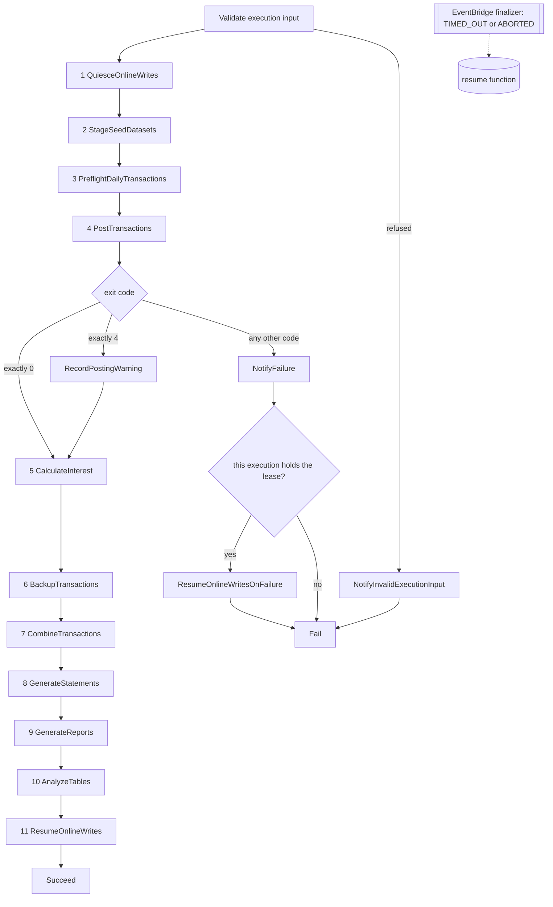

# Step Functions batch module

This reusable module provisions two STANDARD Step Functions workflows: the
eleven-work-state nightly CardDemo batch chain and the smaller ad-hoc report
workflow started by reporting-service. It also provisions their shared
least-privilege execution role and one encrypted execution-log group per
workflow.

The immutable JCL under `app/jcl/` and the CICS submission queue in
`app/csd/CARDDEMO.CSD` are the behavioural lineage. The migration adds an AWS
path beside them and does not remove or modify the mainframe path. The full
analysis is in the existing
[batch orchestration architecture](../../../docs/architecture/batch-orchestration.md).

This README is the prose half of Rule 1 Explainability. The typed/documented
input and output gates are enforced by [TFLint](../../.tflint.hcl), and the
reference tables below are drift-checked with
[terraform-docs](../../.terraform-docs.yml).

## Module boundary

This directory is a module, not a root. `infra/envs/dev` and `infra/envs/prod`
call it with `source = "../../modules/step-functions-batch"`. It declares no
provider configuration, backend, schedule, alarm, ECS cluster, task definition,
Lambda function, bucket, or database. Those resources are supplied through
typed inputs by the environment root.

```hcl
module "step_functions_batch" {
  source = "../../modules/step-functions-batch"

  environment                        = var.environment
  ecs_cluster_arn                    = module.ecs_cluster.cluster_arn
  batch_task_definition_arn          = module.batch_service.task_definition_arn
  data_migration_task_definition_arn = module.data_migration.task_definition_arn
  reporting_task_definition_arn      = module.reporting_service.task_definition_arn
  private_app_subnet_ids             = module.network.private_app_subnet_ids
  security_group_ids                 = [module.network.app_security_group_id]
  task_role_arns = [
    module.batch_service.task_role_arn,
    module.batch_service.execution_role_arn,
    module.data_migration.task_role_arn,
    module.data_migration.execution_role_arn,
    module.reporting_service.task_role_arn,
    module.reporting_service.execution_role_arn,
  ]
  quiesce_function_arn          = aws_lambda_function.quiesce.arn
  resume_function_arn           = aws_lambda_function.resume.arn
  analyze_tables_function_arn   = aws_lambda_function.database_admin.arn
  read_only_flag_parameter_name = aws_ssm_parameter.online_writes_enabled.name
  notification_topic_arn        = module.observability.notification_topic_arn
  dataset_bucket_name           = module.s3_datasets.bucket_name
  kms_key_arn                   = module.kms.s3_key_arn
}
```

Assumptions: the environment root is the only composition boundary. This
module does not look up sibling resources by name or remote state, so every
producer-to-consumer edge remains visible in one root plan.

Two details in that example are easy to get wrong, and both were wrong in an
earlier revision of this file:

- **`analyze_tables_function_arn` takes the database-admin function.** There is
  no `aws_lambda_function.analyze_tables` in either environment root; one
  function serves both the `AnalyzeTables` state and the one-shot schema
  bootstrap, and it is declared as `aws_lambda_function.database_admin`. Copying
  the older spelling produced an unresolvable reference.
- **`read_only_flag_parameter_name` is required and was omitted.** All fifteen
  inputs above are required -- none carries a default -- so an example missing
  one does not plan. The value must be an ABSOLUTE parameter name: the module
  validates the leading slash because
  `infra/lambda/online_write_flag.py` refuses a relative name at import time,
  which would otherwise fail inside the first state of the chain rather than at
  plan.

## Daily workflow

| # | Work state | Mechanism | Baseline lineage |
|---|---|---|---|
| 1 | `QuiesceOnlineWrites` | Lambda invocation | `app/jcl/CLOSEFIL.jcl` |
| 2 | `StageSeedDatasets` | Map of synchronous data-migration tasks | Ten IDCAMS master-load jobs |
| 3 | `PreflightDailyTransactions` | Synchronous batch-service task | `CBTRN01C`, which has no JCL driver |
| 4 | `PostTransactions` | Synchronous batch-service task and exit-code Choice | `app/jcl/POSTTRAN.jcl` / `CBTRN02C` |
| 5 | `CalculateInterest` | Synchronous batch-service task | `app/jcl/INTCALC.jcl` / `CBACT04C` |
| 6 | `BackupTransactions` | Synchronous batch-service task | `app/jcl/TRANBKP.jcl` |
| 7 | `CombineTransactions` | Synchronous batch-service task | `app/jcl/COMBTRAN.jcl` |
| 8 | `GenerateStatements` | Synchronous reporting-service task | `app/jcl/CREASTMT.JCL` |
| 9 | `GenerateReports` | Synchronous reporting-service task | `app/jcl/TRANREPT.jcl` and `app/jcl/PRTCATBL.jcl` |
| 10 | `AnalyzeTables` | Lambda invocation | Statistics analogue of `app/jcl/TRANIDX.jcl` |
| 11 | `ResumeOnlineWrites` | Lambda invocation | `app/jcl/OPENFIL.jcl` |

Eleven counts the states that perform business or operational work. Input
validation, task-exit Choices, warning recording, notification, terminal
success/failure, and failure-path resume states are additional control states.



### Condition-code inversion

A JCL `COND` is a **skip** predicate; a Step Functions `Choice` is a **run**
predicate. The sense must therefore be inverted.

- `COND=(0,NE)` means the step runs only after clean predecessors. In the
  workflow this is the ordinary success edge; infrastructure failures take the
  state's `Catch`.
- The one `COND=(4,LT)` site at `app/jcl/TRANBKP.jcl:51` means continue for a
  return code of four or lower. `app/cbl/CBTRN02C.cbl:229-230` produces code 4
  when posting completed with rejects, so `CheckPostingExitCode` rejoins the
  success path for that warn tier.
- `CheckPostingExitCode` matches **exactly 0 and exactly 4** and routes every
  other code to failure. Refactoring Rationale: it previously compared with
  `NumericLessThanEquals` against a configurable ceiling, which tolerated 1, 2
  and 3 as reject nights. `app/cbl/CBTRN02C.cbl` assigns `RETURN-CODE` in exactly
  one place -- `MOVE 4 TO RETURN-CODE` at its line 230 -- so those three codes
  cannot come from the program's own exit path and can only mean the runtime
  failed around it. The ceiling was also an input, so it could be set to 255, at
  which point every failure satisfied the predicate and the chain ran interest
  accrual over transactions that were never posted. The two codes are now locals
  in `main.tf` and are not configurable, because they are the baseline's contract
  rather than a policy.
- `INCLUDE COND=(...)` in `app/jcl/TRANREPT.jcl:47-48` selects records and
  becomes a reporting query predicate. It is not represented as a workflow
  Choice.

Refactoring Rationale: treating code 4 as failure would report a correctly
posted night with business rejects as an infrastructure incident and skip
backup, statements, and reports. The explicit numeric Choice preserves the
baseline's graded outcome rather than collapsing it to binary success/failure.

### Container invocation

Batch states pass an argument array matching `BatchApplication` exactly:

```text
--job=<preflight-daily-transactions|post-transactions|calculate-interest|backup-transactions|combine-transactions>
--business-date=<ten-character token>
```

Each batch task also receives `CARDDEMO_BATCH_RUN_ID=$$.Execution.Name`.
Container overrides name the target container explicitly; an incorrect name
would leave the baked-in command running, so every container name is a validated
module input rather than an assumed constant.

Assumptions: state 2 runs `python -m carddemo_migration.cli` with the
`stage-dataset` subcommand and per-item dataset/business-date arguments. States
8 and 9 use reporting-service commands because the batch-service job list has
no statement or report job.

Reporting states pass an argument array matching `ReportingTaskRunner` exactly:

```text
--job=<generate-statements|generate-reports>  --business-date=<ten-character token>
--job=generate-report  --start-date=<token> --end-date=<token> --report-type=<type>
```

Refactoring Rationale: those three commands previously had no receiver at all.
The environment roots wire `reporting_task_definition_arn` to the reporting ECS
SERVICE's own task definition, and that image's entry point started a web server
-- so a dispatched state started a container that listened for requests and never
terminated, and the state reported a TIMEOUT after its whole ceiling elapsed
rather than reporting that the command was unimplemented. The image now has two
modes selected by the presence of `--job=`: task mode validates the command
before building any context, resolves a `ReportingTask` bean whose name is the
job token, and exits 0 on completion or 8 on any failure.

### Business-date input

The scheduler supplies an ISO `scheduledTime`. The workflow takes the portion
before `T` and passes it as `--business-date=YYYY-MM-DD`. A manual or redriven
execution may instead supply `businessDate` directly:

```json
{"businessDate":"2022-07-18"}
```

`app/jcl/INTCALC.jcl:22` likewise injects its ten-character date token through
`PARM`; no batch state substitutes a wall-clock reading. This keeps reruns
reproducible.

## Seed-data Map

`StageSeedDatasets` defaults to ten items: accounts, cards, customers,
card cross-reference, transactions, disclosure groups, transaction-category
balances, transaction types, transaction categories, and users. These correspond
to the ten IDCAMS master-load jobs. `DALYTRAN.PS` is absent because posting reads
it directly as a sequential input.

Trade-offs: `MaxConcurrency` defaults to three. One would serialise
independent loads; ten would burst every branch against the same Aurora
connection budget and Fargate quota. The value is a sizing input and does not
change the workflow topology.

## Failure, retry, and restart

Every work state has an explicit timeout and catch. ECS and Lambda integration
faults retry with bounded exponential backoff. Container exit codes are not
replayed: they reach a Choice and either continue or fail. A daily failure
publishes to the supplied SNS topic and then enters the terminal Fail state,
releasing the quiesce bracket on the way out **only when this execution acquired
it**.

Refactoring Rationale: every failure used to reach the release directly,
including a refusal raised before the bracket was taken and a failure of the
quiesce call itself. Such an execution never held the flag, so clearing it
re-enabled online writes inside whatever DID hold it -- a concurrent execution's
write window, or an operator's maintenance window set by hand -- and did so
silently, because clearing an already-clear flag and clearing someone else's look
identical from inside the graph. `QuiesceOnlineWrites` now records the lease as
`leaseAcquired` and `leaseOwner`, lifted out of the Lambda invoke envelope by a
`ResultSelector` so the graph can address them directly;
`CheckQuiesceLeaseOwnership` compares the owner against the execution identity the
preparation states copied into the input; and both in-graph release edges pass
`expectedLeaseOwner` so the function performs a conditional clear rather than an
unconditional one. A refused input takes its own notification state whose every
edge ends at `Fail`.

The success edge carries the same argument even though no Choice guards it.
`QuiesceOnlineWrites` continues to `StageSeedDatasets` whether or not it acquired
the bracket, so a chain that ran to completion may be one that was refused at the
bracket; a refusal reports an EMPTY owner and the function declines to clear on
behalf of a caller that names none. The function's half of the check is bounded by
what the flag can attest -- it stores the boolean every online service reads and no
owner -- so it verifies that the bracket is still engaged rather than who engaged
it. Recording the owner in the value was rejected for the readers it would break,
and a companion owner parameter was rejected as a resource, a grant and a module
input to narrow a window the ownership gate already covers.

Refactoring Rationale: restart is an improvement, not a port. The only
`RESTART=` in the baseline is commented out at `app/jcl/DEFGDGD.jcl:2`, and no
active checkpoint contract exists. STANDARD-workflow redrive resumes from the
failed state, while the `batch.batch_run` ledger makes an already-completed
step a no-op.

The per-state timeout is a ceiling, not a runtime prediction. Its purpose is to
keep one task from holding the online write path quiesced beyond its own
allowance, and `state_machine_timeout_seconds` is the same kind of ceiling for
the execution as a whole.

### Releasing the quiesce bracket

Both in-graph resume paths are states, so neither runs when the execution itself
stops. An execution-level `TIMED_OUT`, or an operator `ABORTED`, terminates
without reaching `NotifyFailure` or `ResumeOnlineWritesOnFailure`; after
`QuiesceOnlineWrites` has run, that would leave the online write path quiesced
indefinitely. The top-level ceiling therefore does **not** release the bracket,
and this module does not claim it does. Two mechanisms close the gap, and neither
of them lives inside the timed execution.

`aws_cloudwatch_event_rule.daily_finalizer` matches `Step Functions Execution
Status Change` for this module's own daily machine with a status of `TIMED_OUT`,
`ABORTED` or `FAILED`, and invokes the resume function through an input
transformer that supplies `action`, the parameter to clear, the terminating
execution's name and its terminal status. It passes no expected lease owner: the
two in-graph edges name one so that a chain which never took the bracket cannot
clear it, whereas this rule exists for the execution that DID take it and then
stopped, so requiring an owner here would refuse the very invocation the rule was
added for. An absent expected owner is read as an unconditional release. `FAILED` is
matched even though the in-execution failure path already resumes, because that
path is itself a state and can fail: a chain whose `ResumeOnlineWritesOnFailure`
state errors ends `FAILED` with the bracket still engaged, which is precisely the
outage this rule exists to prevent. The duplicate release that a matched `FAILED`
implies on an ordinary failure is harmless -- the handler reads the flag before it
writes, finds it already released, and skips the write, so a second invocation is
one extra log line and no parameter version. `SUCCEEDED` is deliberately not
matched: it is reachable only after `ResumeOnlineWrites` has already run. The rule
invokes the function through an `aws_lambda_permission` scoped to the rule's own
ARN rather than through the execution role, because EventBridge invokes Lambda via
the function's resource policy.

`QuiesceOnlineWrites` additionally publishes the bracket as a lease:
`leaseStartedAt` is the execution start time and `leaseSeconds` is
`state_machine_timeout_seconds`, so a reader of the flag can compute the instant
after which a still-quiesced flag has outlived any execution that could
legitimately hold it, and fail safe. The lease length is derived from the
execution ceiling rather than accepted as its own input, so it cannot be
configured to lapse while a chain is still running. The finalizer rule is what
releases the bracket; the lease is what lets a consumer notice before it does.

Refactoring Rationale: an earlier revision wired TWO equivalent out-of-graph
release rules, one matching `TIMED_OUT` and `ABORTED` only and one matching all
three statuses, each with its own target and Lambda permission. Two rules invoking
one idempotent function is not twice the safety: it is two places to keep in step,
and their comments already disagreed about whether `FAILED` should be matched. One
rule, matching all three non-succeeded terminal statuses, is the whole of the
out-of-graph release.

## Ad-hoc report workflow

The second machine validates `startDate`, `endDate`, and `reportType`, runs the
reporting-service task, checks its exit code, and either succeeds or publishes a
failure notification before failing loudly. The environment root publishes this
machine's ARN to reporting-service and grants `states:StartExecution` on that
exact ARN.

This preserves the capability behind `app/csd/CARDDEMO.CSD` lines 499-505,
where the `JOBS` transient-data queue submitted fixed-width JCL card images to
`DDNAME(INREADER)`, while replacing the submission tunnel with a tracked
execution identity.

## Execution-role boundary

The role enumerates every action:

- `ecs:RunTask` on the three approved task-definition families and only in the
  supplied cluster;
- `ecs:DescribeTasks` and `ecs:StopTask` on runtime-created task ARNs, constrained
  by `ecs:cluster`;
- the EventBridge managed-rule actions required by `runTask.sync`;
- `iam:PassRole` on the supplied task/execution roles, constrained to
  `ecs-tasks.amazonaws.com`;
- `lambda:InvokeFunction` on the three operational functions;
- `sns:Publish` on the one notification topic;
- the enumerated vended-log-delivery and X-Ray actions.

There is no wildcard IAM action. The wildcard resources are isolated to APIs
that do not support static resource scoping: runtime-created ECS tasks,
CloudWatch vended-log delivery, and X-Ray write/sampling operations.

## Validation

All commands are gating and tolerate no non-zero exit code.

```bash
# WHAT: verify canonical formatting across the infrastructure package.
# WHY : CI checks rather than rewrites committed HCL.
terraform fmt -check -recursive infra/

# WHAT: validate the provider schema and state-machine resources in isolation.
# WHY : this catches invalid resource arguments before environment-root wiring.
terraform -chdir=infra/modules/step-functions-batch init -backend=false
terraform -chdir=infra/modules/step-functions-batch validate

# WHAT: enforce typed, documented, and consumed module contracts.
# WHY : an unused variable or provider means the published wiring is incomplete.
tflint --chdir=infra/modules/step-functions-batch \
  --config="$(pwd)/infra/.tflint.hcl"

# WHAT: verify the generated Terraform reference is byte-current.
# WHY : a variable, resource, or output change makes a stale README incorrect.
terraform-docs --config infra/.terraform-docs.yml \
  --output-check infra/modules/step-functions-batch
```

The module is authored and statically validated. `terraform apply` against a
live AWS account, and the cost it incurs, remain operator actions outside this
scope.

## Related documents

- [Infrastructure guide](../../README.md)
- [Batch orchestration architecture](../../../docs/architecture/batch-orchestration.md)
- [Documentation standard](../../../docs/CODE_DOCUMENTATION_STANDARD.md)
- [Batch entry point](../../../services/batch-service/src/main/java/com/carddemo/batch/BatchApplication.java)

## Terraform reference

<!-- BEGIN_TF_DOCS -->
### Requirements

| Name | Version |
|------|---------|
| <a name="requirement_terraform"></a> [terraform](#requirement\_terraform) | >= 1.15.0 |
| <a name="requirement_aws"></a> [aws](#requirement\_aws) | ~> 6.56 |

### Providers

| Name | Version |
|------|---------|
| <a name="provider_aws"></a> [aws](#provider\_aws) | 6.57.1 |

### Resources

| Name | Type |
|------|------|
| [aws_cloudwatch_event_rule.daily_finalizer](https://registry.terraform.io/providers/hashicorp/aws/latest/docs/resources/cloudwatch_event_rule) | resource |
| [aws_cloudwatch_event_target.daily_finalizer](https://registry.terraform.io/providers/hashicorp/aws/latest/docs/resources/cloudwatch_event_target) | resource |
| [aws_cloudwatch_log_group.adhoc](https://registry.terraform.io/providers/hashicorp/aws/latest/docs/resources/cloudwatch_log_group) | resource |
| [aws_cloudwatch_log_group.daily](https://registry.terraform.io/providers/hashicorp/aws/latest/docs/resources/cloudwatch_log_group) | resource |
| [aws_iam_role.this](https://registry.terraform.io/providers/hashicorp/aws/latest/docs/resources/iam_role) | resource |
| [aws_iam_role_policy.this](https://registry.terraform.io/providers/hashicorp/aws/latest/docs/resources/iam_role_policy) | resource |
| [aws_lambda_permission.daily_finalizer](https://registry.terraform.io/providers/hashicorp/aws/latest/docs/resources/lambda_permission) | resource |
| [aws_sfn_state_machine.adhoc](https://registry.terraform.io/providers/hashicorp/aws/latest/docs/resources/sfn_state_machine) | resource |
| [aws_sfn_state_machine.daily](https://registry.terraform.io/providers/hashicorp/aws/latest/docs/resources/sfn_state_machine) | resource |
| [aws_caller_identity.current](https://registry.terraform.io/providers/hashicorp/aws/latest/docs/data-sources/caller_identity) | data source |
| [aws_iam_policy_document.assume_role](https://registry.terraform.io/providers/hashicorp/aws/latest/docs/data-sources/iam_policy_document) | data source |
| [aws_iam_policy_document.permissions](https://registry.terraform.io/providers/hashicorp/aws/latest/docs/data-sources/iam_policy_document) | data source |
| [aws_partition.current](https://registry.terraform.io/providers/hashicorp/aws/latest/docs/data-sources/partition) | data source |
| [aws_region.current](https://registry.terraform.io/providers/hashicorp/aws/latest/docs/data-sources/region) | data source |

### Inputs

| Name | Description | Type | Default | Required |
|------|-------------|------|---------|:--------:|
| <a name="input_analyze_tables_function_arn"></a> [analyze\_tables\_function\_arn](#input\_analyze\_tables\_function\_arn) | ARN of the function the penultimate state invokes to refresh table statistics after the night's writes. Declared by the environment root. It replaces app/jcl/TRANIDX.jcl only in part: that job rebuilt an alternate index, and index building is retired because PostgreSQL maintains indexes inside the same transaction as the write, leaving statistics as the only part of the step with a target. | `string` | n/a | yes |
| <a name="input_batch_task_definition_arn"></a> [batch\_task\_definition\_arn](#input\_batch\_task\_definition\_arn) | ARN of the task definition the five batch job states run, which is the batch-service image. Published by the batch infra/modules/ecs-service instance and wired by the environment root. Each state overrides only that task's container command, so one task definition serves all five jobs and the per-step arguments stay in the state machine where the step order is also expressed. | `string` | n/a | yes |
| <a name="input_data_migration_task_definition_arn"></a> [data\_migration\_task\_definition\_arn](#input\_data\_migration\_task\_definition\_arn) | ARN of the task definition each seed-staging map branch runs, which is the data-migration ETL image. Published by the data-migration infra/modules/ecs-service instance and wired by the environment root. It is separate from the batch definition because the two carry different images, roles and resource sizes. | `string` | n/a | yes |
| <a name="input_dataset_bucket_name"></a> [dataset\_bucket\_name](#input\_dataset\_bucket\_name) | Name of the versioned bucket the staging, backup, combine, statement and report states read and write dataset generations in. Published as an output by infra/modules/s3-datasets and passed in by the environment root. This module only consumes it: the bucket, its ten generation-dataset prefix families and its five-noncurrent-version lifecycle rule all belong to s3-datasets. | `string` | n/a | yes |
| <a name="input_ecs_cluster_arn"></a> [ecs\_cluster\_arn](#input\_ecs\_cluster\_arn) | ARN of the ECS cluster every task state runs its task in. Published as an output by infra/modules/ecs-cluster and passed in by the environment root; it is also the value of the `ecs:cluster` condition that scopes the execution role's task-stopping and task-describing grants, which is why the full ARN is required rather than a cluster name. | `string` | n/a | yes |
| <a name="input_environment"></a> [environment](#input\_environment) | Environment name suffixed onto the state machine, its log group and its execution role, so one environment's nightly chain is distinguishable from the other's in the console and in every IAM policy that names it; must be `dev` or `prod`, the two environments that have a Terraform root under infra/envs/. | `string` | n/a | yes |
| <a name="input_notification_topic_arn"></a> [notification\_topic\_arn](#input\_notification\_topic\_arn) | ARN of the SNS topic every state's catch handler publishes to before the execution reaches its terminal failure state. Published as an output by infra/modules/observability and passed in by the environment root. It replaces the baseline's job-card NOTIFY and job log; routing all eleven states through one topic is what makes a failure in any of them reach the same place rather than failing silently. | `string` | n/a | yes |
| <a name="input_pass_role_arns"></a> [pass\_role\_arns](#input\_pass\_role\_arns) | IAM role ARNs the state-machine execution role is permitted to pass to ECS: the task role AND the task execution role of each of the batch, data-migration and reporting task definitions, six entries for three images. The environment root assembles the list from the ecs-service outputs it already holds; enumerating it is the least-privilege boundary of what either state machine may run a task as, and omitting an entry fails at run-task with an access-denied error on iam:PassRole. | `list(string)` | n/a | yes |
| <a name="input_private_app_subnet_ids"></a> [private\_app\_subnet\_ids](#input\_private\_app\_subnet\_ids) | Private application subnet identifiers the state machine places each task into -- the application tier, not the public tier that carries the load balancer and NAT gateways and not the isolated data tier that carries the database. Published as an output by infra/modules/network and passed in by the environment root; tasks reach the database through these subnets and reach AWS APIs through that VPC's interface endpoints, so they need no public address. | `list(string)` | n/a | yes |
| <a name="input_quiesce_function_arn"></a> [quiesce\_function\_arn](#input\_quiesce\_function\_arn) | ARN of the function the first state invokes to set the online read-only flag, opening the batch window. Declared by the environment root, which owns these functions and the parameter they toggle. This is the migrated form of app/jcl/CLOSEFIL.jcl, which closed five CICS files with an operator command; the target sets a parameter the online services read, so the mechanism changes while the bracket does not. | `string` | n/a | yes |
| <a name="input_read_only_flag_parameter_name"></a> [read\_only\_flag\_parameter\_name](#input\_read\_only\_flag\_parameter\_name) | Name of the SSM Parameter Store parameter the first and last states toggle, passed to the quiesce and resume functions in their invocation payload so the execution history records which flag the bracket controls. Declared by the environment root alongside the functions. It replaces the operator-command mechanism of app/jcl/CLOSEFIL.jcl and app/jcl/OPENFIL.jcl, which issued five CEMT SET FIL commands each; the bracket is scoped to the write path, because the baseline's read-only unload jobs opened their files shared. | `string` | n/a | yes |
| <a name="input_reporting_task_definition_arn"></a> [reporting\_task\_definition\_arn](#input\_reporting\_task\_definition\_arn) | ARN of the reporting-service task definition the two daily output states and the ad-hoc report machine run. Published by the reporting infra/modules/ecs-service instance and wired by the environment root. It is distinct from the batch definition because batch-service's job list contains no statement job and no report job -- those writers live in reporting-service. | `string` | n/a | yes |
| <a name="input_resume_function_arn"></a> [resume\_function\_arn](#input\_resume\_function\_arn) | ARN of the function invoked to clear the online read-only flag, closing the batch window. Declared by the environment root. This is the migrated form of app/jcl/OPENFIL.jcl and the counterpart of the quiesce state: it is invoked on the success path and on the failure path alike, because a chain that failed without clearing the flag it set would leave the online services read-only after the window ended. It is additionally invoked from outside the execution, by an EventBridge rule on the daily machine's terminal status, so a timed-out or operator-aborted execution -- which runs no further state and so reaches neither in-execution path -- still releases the flag. | `string` | n/a | yes |
| <a name="input_task_security_group_id"></a> [task\_security\_group\_id](#input\_task\_security\_group\_id) | Security group attached to every task the state machines start, the single application-tier group published by infra/modules/network. It is what permits the egress a batch step actually needs -- the database port to Aurora and 443 to the VPC interface endpoints -- and nothing wider. | `string` | n/a | yes |
| <a name="input_adhoc_report_timeout_seconds"></a> [adhoc\_report\_timeout\_seconds](#input\_adhoc\_report\_timeout\_seconds) | Ceiling on a single ad-hoc report execution, applied at the top level of the ad-hoc state machine definition. Separate from the daily ceiling because one on-demand report is a far smaller unit of work than the nightly chain, and a shared value would have to be sized for the larger of the two. | `number` | `7200` | no |
| <a name="input_batch_container_name"></a> [batch\_container\_name](#input\_batch\_container\_name) | Name of the container inside the batch task definition whose command each job state overrides. The environment root passes the name published by the batch ecs-service instance. An override addresses its container by name and a name that matches nothing is ignored rather than rejected, so a wrong value here silently runs the image's baked-in command instead of the intended job. | `string` | `"batch"` | no |
| <a name="input_data_migration_container_name"></a> [data\_migration\_container\_name](#input\_data\_migration\_container\_name) | Name of the container inside the data-migration task definition whose command each staging branch overrides, matched by name exactly as the batch container name is, and published by the data-migration ecs-service instance. | `string` | `"data-migration"` | no |
| <a name="input_log_group_kms_key_arn"></a> [log\_group\_kms\_key\_arn](#input\_log\_group\_kms\_key\_arn) | ARN of the customer-managed key both execution log groups are encrypted with, published as an output by infra/modules/kms and passed in by the environment root. Null leaves the log groups on CloudWatch's own service-managed encryption. | `string` | `null` | no |
| <a name="input_log_include_execution_data"></a> [log\_include\_execution\_data](#input\_log\_include\_execution\_data) | Whether each logged event carries the state's input and output payload as well as the transition itself. Safe to leave on because this chain's payloads are business dates, dataset names, job names and execution identities -- no cardholder data, primary account number or credential enters either state machine. It remains an input so that a future change threading record-level data through an execution can turn it off. | `bool` | `true` | no |
| <a name="input_log_level"></a> [log\_level](#input\_log\_level) | Which execution events reach both state-machine log groups: ERROR records failures, FATAL only terminal failures, and ALL every transition. Logging cannot be disabled, because execution history is the target analogue of the baseline job log. | `string` | `"ALL"` | no |
| <a name="input_log_retention_days"></a> [log\_retention\_days](#input\_log\_retention\_days) | Days both state machines' execution log groups retain events. Supplied by the environment root, which is where dev and prod are permitted to differ; retention and sizing are the only axes on which the two environments may diverge, and this is the record of which states ran on which night. | `number` | `30` | no |
| <a name="input_name_prefix"></a> [name\_prefix](#input\_name\_prefix) | Prefix concatenated into the state machine, log group and execution role names ahead of the environment suffix, giving the nightly chain one greppable identity shared with the rest of the stack's resource names. Passed in by the environment root, which hands the same value to every module it calls; lowercase letters, digits and hyphens only, at most 32 characters. | `string` | `"carddemo"` | no |
| <a name="input_reporting_container_name"></a> [reporting\_container\_name](#input\_reporting\_container\_name) | Name of the container inside the reporting-service task definition whose command the two daily output states and the ad-hoc report state override. The environment root passes the name published by the reporting ecs-service instance rather than relying on an assumed literal, because an unmatched override starts the image's ordinary server command inside a state that waits for the task to stop. | `string` | `"reporting"` | no |
| <a name="input_retry_backoff_rate"></a> [retry\_backoff\_rate](#input\_retry\_backoff\_rate) | Multiplier applied to the retry interval on each successive attempt. A value of 1 makes every wait equal to the interval, which is a flat retry rather than a backoff; higher values grow the wait geometrically. | `number` | `2` | no |
| <a name="input_retry_interval_seconds"></a> [retry\_interval\_seconds](#input\_retry\_interval\_seconds) | Seconds a state waits before its first retry. Subsequent waits are this interval multiplied by the backoff rate, compounding per attempt, so this value and the rate together bound how long a retrying state can occupy the batch window. | `number` | `30` | no |
| <a name="input_retry_max_attempts"></a> [retry\_max\_attempts](#input\_retry\_max\_attempts) | Retry attempts each state makes after its first failure, before its catch handler runs. This is the per-state half of the durable retry tier; the other half is that a failed execution can be redriven from the state that failed, and that the batch run ledger makes a step which already completed a no-op when it is retried. | `number` | `3` | no |
| <a name="input_seed_datasets"></a> [seed\_datasets](#input\_seed\_datasets) | Dataset names the seed-staging state iterates over, one Map branch and one data-migration task per name. The default is the ten loaded masters, one per IDCAMS master-refresh load job in app/jcl/; DALYTRAN is absent because posting reads it directly as sequential input rather than loading it into a master table. An environment may pass a subset to restage one master without a module edit. | `list(string)` | <pre>[<br/>  "accounts",<br/>  "cards",<br/>  "customers",<br/>  "card_xref",<br/>  "transactions",<br/>  "disclosure_groups",<br/>  "transaction_category_balances",<br/>  "transaction_types",<br/>  "transaction_categories",<br/>  "users"<br/>]</pre> | no |
| <a name="input_stage_datasets_max_concurrency"></a> [stage\_datasets\_max\_concurrency](#input\_stage\_datasets\_max\_concurrency) | Maximum number of seed-staging Map branches allowed to run at once. The environment root may lower it to fit Aurora connection and Fargate task quotas; the default permits parallel loads without starting all ten branches simultaneously. A sizing value, so it is one of the few a root may legitimately differ on. | `number` | `3` | no |
| <a name="input_state_machine_timeout_seconds"></a> [state\_machine\_timeout\_seconds](#input\_state\_machine\_timeout\_seconds) | Ceiling on a single daily-batch execution, applied at the top level of the state machine definition rather than to any one state. It bounds the whole chain: an execution that stalls where no individual state's timeout applies would otherwise wait indefinitely, holding the online read-only flag set, because the resume state runs only after the chain finishes or fails. The ceiling caps how long the flag can be held rather than releasing it -- a timed-out execution runs no further state -- so release on that path comes from the out-of-execution watchdog rule, and this same value is published to the quiesce call as the bracket's lease length. | `number` | `28800` | no |
| <a name="input_state_timeout_seconds"></a> [state\_timeout\_seconds](#input\_state\_timeout\_seconds) | Ceiling on each of the eleven work states, keyed by the state name exactly as main.tf spells it. The default sizes the long-running states -- seed staging, posting, interest, statements and reports -- above the states that only toggle a flag or refresh statistics. Every key must be present, so a state can never be left without a timeout: a state with no ceiling waits indefinitely, which holds the whole chain open and leaves the online read-only flag set until an operator intervenes. | `map(number)` | <pre>{<br/>  "AnalyzeTables": 1800,<br/>  "BackupTransactions": 3600,<br/>  "CalculateInterest": 7200,<br/>  "CombineTransactions": 3600,<br/>  "GenerateReports": 3600,<br/>  "GenerateStatements": 7200,<br/>  "PostTransactions": 7200,<br/>  "PreflightDailyTransactions": 1800,<br/>  "QuiesceOnlineWrites": 300,<br/>  "ResumeOnlineWrites": 300,<br/>  "StageSeedDatasets": 3600<br/>}</pre> | no |
| <a name="input_tags"></a> [tags](#input\_tags) | Tags merged onto both state machines and both log groups, layered on top of the common tag set the calling root already applies through its provider's `default_tags`; defaults to none, because the baseline tags arrive from the root rather than from this module. | `map(string)` | `{}` | no |

### Outputs

| Name | Description |
|------|-------------|
| <a name="output_adhoc_report_log_group_arn"></a> [adhoc\_report\_log\_group\_arn](#output\_adhoc\_report\_log\_group\_arn) | ARN of the encrypted CloudWatch log group receiving ad-hoc report execution events. |
| <a name="output_adhoc_report_log_group_name"></a> [adhoc\_report\_log\_group\_name](#output\_adhoc\_report\_log\_group\_name) | Name of the CloudWatch log group receiving ad-hoc report execution events, for report-operations dashboards and log queries. |
| <a name="output_adhoc_report_state_machine_arn"></a> [adhoc\_report\_state\_machine\_arn](#output\_adhoc\_report\_state\_machine\_arn) | ARN of the ad-hoc report machine. The environment root publishes it to reporting-service and grants that service states:StartExecution on this exact resource. |
| <a name="output_adhoc_report_state_machine_name"></a> [adhoc\_report\_state\_machine\_name](#output\_adhoc\_report\_state\_machine\_name) | Name of the ad-hoc report machine, used in execution-history queries and report-operations diagnostics. |
| <a name="output_bracket_finalizer_rule_arn"></a> [bracket\_finalizer\_rule\_arn](#output\_bracket\_finalizer\_rule\_arn) | ARN of the EventBridge rule that releases the online write quiesce bracket when a daily execution terminates without having released it in-graph. Consumers scope failed-invocation alarms to this exact rule. |
| <a name="output_bracket_finalizer_rule_name"></a> [bracket\_finalizer\_rule\_name](#output\_bracket\_finalizer\_rule\_name) | Name of the bracket finalizer rule, used in operator diagnostics and CloudWatch metric dimensions when explaining a resume that no state in the execution history performed. |
| <a name="output_daily_log_group_arn"></a> [daily\_log\_group\_arn](#output\_daily\_log\_group\_arn) | ARN of the encrypted CloudWatch log group receiving daily-machine execution events. |
| <a name="output_daily_log_group_name"></a> [daily\_log\_group\_name](#output\_daily\_log\_group\_name) | Name of the CloudWatch log group receiving daily-machine execution events, for observability dashboards and log queries. |
| <a name="output_daily_state_machine_arn"></a> [daily\_state\_machine\_arn](#output\_daily\_state\_machine\_arn) | ARN of the eleven-work-state daily batch machine. The EventBridge Scheduler module targets this value and observability scopes the batch-failure alarm to it. |
| <a name="output_daily_state_machine_name"></a> [daily\_state\_machine\_name](#output\_daily\_state\_machine\_name) | Name of the daily batch machine, used in operator commands, execution-history queries and dashboard dimensions. |
| <a name="output_execution_role_arn"></a> [execution\_role\_arn](#output\_execution\_role\_arn) | ARN of the shared Step Functions execution role, for IAM inventory and policy auditing by the environment root. |
| <a name="output_execution_role_name"></a> [execution\_role\_name](#output\_execution\_role\_name) | Name of the shared Step Functions execution role, used by operator and compliance queries that address IAM roles by name. |
<!-- END_TF_DOCS -->
