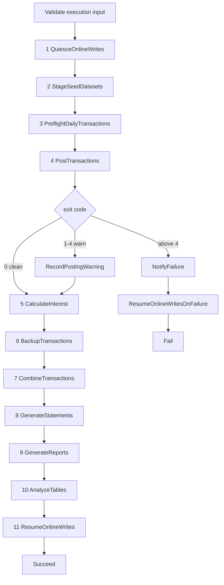

# Step Functions batch module

This reusable module provisions two STANDARD Step Functions workflows: the
eleven-work-state nightly CardDemo batch chain and the smaller ad-hoc report
workflow started by reporting-service. It also provisions their shared
least-privilege execution role and one encrypted execution-log group per
workflow.

The immutable JCL under `app/jcl/` and the CICS submission queue in
`app/csd/CARDDEMO.CSD` are the behavioural lineage. The migration adds an AWS
path beside them and does not remove or modify the mainframe path. The full
analysis is in the existing
[batch orchestration architecture](../../../docs/architecture/batch-orchestration.md).

This README is the prose half of Rule 1 Explainability. The typed/documented
input and output gates are enforced by [TFLint](../../.tflint.hcl), and the
reference tables below are drift-checked with
[terraform-docs](../../.terraform-docs.yml).

## Module boundary

This directory is a module, not a root. `infra/envs/dev` and `infra/envs/prod`
call it with `source = "../../modules/step-functions-batch"`. It declares no
provider configuration, backend, schedule, alarm, ECS cluster, task definition,
Lambda function, bucket, or database. Those resources are supplied through
typed inputs by the environment root.

```hcl
module "step_functions_batch" {
  source = "../../modules/step-functions-batch"

  environment                        = var.environment
  ecs_cluster_arn                    = module.ecs_cluster.cluster_arn
  batch_task_definition_arn          = module.batch_service.task_definition_arn
  data_migration_task_definition_arn = module.data_migration.task_definition_arn
  reporting_task_definition_arn      = module.reporting_service.task_definition_arn
  private_app_subnet_ids             = module.network.private_app_subnet_ids
  security_group_ids                 = [module.network.app_security_group_id]
  task_role_arns = [
    module.batch_service.task_role_arn,
    module.batch_service.execution_role_arn,
    module.data_migration.task_role_arn,
    module.data_migration.execution_role_arn,
    module.reporting_service.task_role_arn,
    module.reporting_service.execution_role_arn,
  ]
  quiesce_function_arn       = aws_lambda_function.quiesce.arn
  resume_function_arn        = aws_lambda_function.resume.arn
  analyze_tables_function_arn = aws_lambda_function.analyze_tables.arn
  notification_topic_arn     = module.observability.notification_topic_arn
  dataset_bucket_name        = module.s3_datasets.bucket_name
  kms_key_arn                = module.kms.s3_key_arn
}
```

**Assumptions:** the environment root is the only composition boundary. This
module does not look up sibling resources by name or remote state, so every
producer-to-consumer edge remains visible in one root plan.

## Daily workflow

| # | Work state | Mechanism | Baseline lineage |
|---|---|---|---|
| 1 | `QuiesceOnlineWrites` | Lambda invocation | `app/jcl/CLOSEFIL.jcl` |
| 2 | `StageSeedDatasets` | Map of synchronous data-migration tasks | Ten IDCAMS master-load jobs |
| 3 | `PreflightDailyTransactions` | Synchronous batch-service task | `CBTRN01C`, which has no JCL driver |
| 4 | `PostTransactions` | Synchronous batch-service task and exit-code Choice | `app/jcl/POSTTRAN.jcl` / `CBTRN02C` |
| 5 | `CalculateInterest` | Synchronous batch-service task | `app/jcl/INTCALC.jcl` / `CBACT04C` |
| 6 | `BackupTransactions` | Synchronous batch-service task | `app/jcl/TRANBKP.jcl` |
| 7 | `CombineTransactions` | Synchronous batch-service task | `app/jcl/COMBTRAN.jcl` |
| 8 | `GenerateStatements` | Synchronous reporting-service task | `app/jcl/CREASTMT.JCL` |
| 9 | `GenerateReports` | Synchronous reporting-service task | `app/jcl/TRANREPT.jcl` and `app/jcl/PRTCATBL.jcl` |
| 10 | `AnalyzeTables` | Lambda invocation | Statistics analogue of `app/jcl/TRANIDX.jcl` |
| 11 | `ResumeOnlineWrites` | Lambda invocation | `app/jcl/OPENFIL.jcl` |

Eleven counts the states that perform business or operational work. Input
validation, task-exit Choices, warning recording, notification, terminal
success/failure, and failure-path resume states are additional control states.



### Condition-code inversion

A JCL `COND` is a **skip** predicate; a Step Functions `Choice` is a **run**
predicate. The sense must therefore be inverted.

- `COND=(0,NE)` means the step runs only after clean predecessors. In the
  workflow this is the ordinary success edge; infrastructure failures take the
  state's `Catch`.
- The one `COND=(4,LT)` site at `app/jcl/TRANBKP.jcl:51` means continue for a
  return code of four or lower. `app/cbl/CBTRN02C.cbl:229-230` produces code 4
  when posting completed with rejects, so `CheckPostingExitCode` rejoins the
  success path for that warn tier.
- `INCLUDE COND=(...)` in `app/jcl/TRANREPT.jcl:47-48` selects records and
  becomes a reporting query predicate. It is not represented as a workflow
  Choice.

**Refactoring Rationale:** treating code 4 as failure would report a correctly
posted night with business rejects as an infrastructure incident and skip
backup, statements, and reports. The explicit numeric Choice preserves the
baseline's graded outcome rather than collapsing it to binary success/failure.

### Container invocation

Batch states pass an argument array matching `BatchApplication` exactly:

```text
--job=<preflight-daily-transactions|post-transactions|calculate-interest|backup-transactions|combine-transactions>
--business-date=<ten-character token>
```

Each batch task also receives `CARDDEMO_BATCH_RUN_ID=$$.Execution.Name`.
Container overrides name the target container explicitly; an incorrect name
would leave the baked-in command running, so every container name is a validated
module input rather than an assumed constant.

**Assumptions:** state 2 runs `python -m carddemo_migration.cli` with the
`stage-dataset` subcommand and per-item dataset/business-date arguments. States
8 and 9 use reporting-service commands because the batch-service job list has
no statement or report job.

### Business-date input

The scheduler supplies an ISO `scheduledTime`. The workflow takes the portion
before `T` and passes it as `--business-date=YYYY-MM-DD`. A manual or redriven
execution may instead supply `businessDate` directly:

```json
{"businessDate":"2022-07-18"}
```

`app/jcl/INTCALC.jcl:22` likewise injects its ten-character date token through
`PARM`; no batch state substitutes a wall-clock reading. This keeps reruns
reproducible.

## Seed-data Map

`StageSeedDatasets` defaults to ten items: accounts, cards, customers,
card cross-reference, transactions, disclosure groups, transaction-category
balances, transaction types, transaction categories, and users. These correspond
to the ten IDCAMS master-load jobs. `DALYTRAN.PS` is absent because posting reads
it directly as a sequential input.

**Trade-offs:** `MaxConcurrency` defaults to three. One would serialise
independent loads; ten would burst every branch against the same Aurora
connection budget and Fargate quota. The value is a sizing input and does not
change the workflow topology.

## Failure, retry, and restart

Every work state has an explicit timeout and catch. ECS and Lambda integration
faults retry with bounded exponential backoff. Container exit codes are not
replayed: they reach a Choice and either continue or fail. A daily failure
publishes to the supplied SNS topic, invokes the idempotent resume function, and
then enters the terminal Fail state.

**Refactoring Rationale:** restart is an improvement, not a port. The only
`RESTART=` in the baseline is commented out at `app/jcl/DEFGDGD.jcl:2`, and no
active checkpoint contract exists. STANDARD-workflow redrive resumes from the
failed state, while the `batch.batch_run` ledger makes an already-completed
step a no-op.

The per-state timeout is a ceiling, not a runtime prediction. Its purpose is to
keep one task from holding the online write path quiesced indefinitely.

## Ad-hoc report workflow

The second machine validates `startDate`, `endDate`, and `reportType`, runs the
reporting-service task, checks its exit code, and either succeeds or publishes a
failure notification before failing loudly. The environment root publishes this
machine's ARN to reporting-service and grants `states:StartExecution` on that
exact ARN.

This preserves the capability behind `app/csd/CARDDEMO.CSD` lines 499-505,
where the `JOBS` transient-data queue submitted fixed-width JCL card images to
`DDNAME(INREADER)`, while replacing the submission tunnel with a tracked
execution identity.

## Execution-role boundary

The role enumerates every action:

- `ecs:RunTask` on the three approved task-definition families and only in the
  supplied cluster;
- `ecs:DescribeTasks` and `ecs:StopTask` on runtime-created task ARNs, constrained
  by `ecs:cluster`;
- the EventBridge managed-rule actions required by `runTask.sync`;
- `iam:PassRole` on the supplied task/execution roles, constrained to
  `ecs-tasks.amazonaws.com`;
- `lambda:InvokeFunction` on the three operational functions;
- `sns:Publish` on the one notification topic;
- the enumerated vended-log-delivery and X-Ray actions.

There is no wildcard IAM action. The wildcard resources are isolated to APIs
that do not support static resource scoping: runtime-created ECS tasks,
CloudWatch vended-log delivery, and X-Ray write/sampling operations.

## Validation

All commands are gating and tolerate no non-zero exit code.

```bash
# WHAT: verify canonical formatting across the infrastructure package.
# WHY : CI checks rather than rewrites committed HCL.
terraform fmt -check -recursive infra/

# WHAT: validate the provider schema and state-machine resources in isolation.
# WHY : this catches invalid resource arguments before environment-root wiring.
terraform -chdir=infra/modules/step-functions-batch init -backend=false
terraform -chdir=infra/modules/step-functions-batch validate

# WHAT: enforce typed, documented, and consumed module contracts.
# WHY : an unused variable or provider means the published wiring is incomplete.
tflint --chdir=infra/modules/step-functions-batch \
  --config="$(pwd)/infra/.tflint.hcl"

# WHAT: verify the generated Terraform reference is byte-current.
# WHY : a variable, resource, or output change makes a stale README incorrect.
terraform-docs --config infra/.terraform-docs.yml \
  --output-check infra/modules/step-functions-batch
```

The module is authored and statically validated. `terraform apply` against a
live AWS account, and the cost it incurs, remain operator actions outside this
scope.

## Related documents

- [Infrastructure guide](../../README.md)
- [Batch orchestration architecture](../../../docs/architecture/batch-orchestration.md)
- [Documentation standard](../../../docs/CODE_DOCUMENTATION_STANDARD.md)
- [Batch entry point](../../../services/batch-service/src/main/java/com/carddemo/batch/BatchApplication.java)

## Terraform reference

<!-- BEGIN_TF_DOCS -->
### Requirements

| Name | Version |
|------|---------|
| <a name="requirement_terraform"></a> [terraform](#requirement\_terraform) | >= 1.15.0 |
| <a name="requirement_aws"></a> [aws](#requirement\_aws) | ~> 6.56 |

### Providers

| Name | Version |
|------|---------|
| <a name="provider_aws"></a> [aws](#provider\_aws) | 6.57.1 |

### Resources

| Name | Type |
|------|------|
| [aws_cloudwatch_log_group.adhoc](https://registry.terraform.io/providers/hashicorp/aws/latest/docs/resources/cloudwatch_log_group) | resource |
| [aws_cloudwatch_log_group.daily](https://registry.terraform.io/providers/hashicorp/aws/latest/docs/resources/cloudwatch_log_group) | resource |
| [aws_iam_role.this](https://registry.terraform.io/providers/hashicorp/aws/latest/docs/resources/iam_role) | resource |
| [aws_iam_role_policy.this](https://registry.terraform.io/providers/hashicorp/aws/latest/docs/resources/iam_role_policy) | resource |
| [aws_sfn_state_machine.adhoc](https://registry.terraform.io/providers/hashicorp/aws/latest/docs/resources/sfn_state_machine) | resource |
| [aws_sfn_state_machine.daily](https://registry.terraform.io/providers/hashicorp/aws/latest/docs/resources/sfn_state_machine) | resource |
| [aws_caller_identity.current](https://registry.terraform.io/providers/hashicorp/aws/latest/docs/data-sources/caller_identity) | data source |
| [aws_iam_policy_document.assume_role](https://registry.terraform.io/providers/hashicorp/aws/latest/docs/data-sources/iam_policy_document) | data source |
| [aws_iam_policy_document.permissions](https://registry.terraform.io/providers/hashicorp/aws/latest/docs/data-sources/iam_policy_document) | data source |
| [aws_partition.current](https://registry.terraform.io/providers/hashicorp/aws/latest/docs/data-sources/partition) | data source |
| [aws_region.current](https://registry.terraform.io/providers/hashicorp/aws/latest/docs/data-sources/region) | data source |

### Inputs

| Name | Description | Type | Default | Required |
|------|-------------|------|---------|:--------:|
| <a name="input_analyze_tables_function_arn"></a> [analyze\_tables\_function\_arn](#input\_analyze\_tables\_function\_arn) | ARN of the function the penultimate state invokes to refresh table statistics after the night's writes. It replaces app/jcl/TRANIDX.jcl only in part: that job REBUILT an alternate index, and index building is retired because PostgreSQL maintains indexes inside the same transaction as the write, leaving statistics as the only part of the step with a target. | `string` | n/a | yes |
| <a name="input_batch_task_definition_arn"></a> [batch\_task\_definition\_arn](#input\_batch\_task\_definition\_arn) | ARN of the task definition states 3 through 7 run, which is the batch-service image. Each state overrides only that task's container command, so one task definition serves all five jobs and the per-step arguments stay in the state machine where the step order is also expressed. | `string` | n/a | yes |
| <a name="input_data_migration_task_definition_arn"></a> [data\_migration\_task\_definition\_arn](#input\_data\_migration\_task\_definition\_arn) | ARN of the task definition the seed-dataset staging state runs, which is the data-migration ETL image. It is a separate definition from the batch one because the two carry different images, different roles and different resource sizes; the staging step reads flat files and bulk-loads them, the job steps do not. | `string` | n/a | yes |
| <a name="input_dataset_bucket_name"></a> [dataset\_bucket\_name](#input\_dataset\_bucket\_name) | Name of the versioned bucket the staging, backup, combine, statement and report states read and write dataset generations in. Published as an output by infra/modules/s3-datasets and passed in by the environment root; the execution role and the task overrides both reference it, so it is supplied once rather than twice. | `string` | n/a | yes |
| <a name="input_ecs_cluster_arn"></a> [ecs\_cluster\_arn](#input\_ecs\_cluster\_arn) | ARN of the ECS cluster every task state runs its task in. Published as an output by infra/modules/ecs-cluster and passed in by the environment root; the execution role's ecs:RunTask grant is scoped so that tasks may be started only in this cluster. | `string` | n/a | yes |
| <a name="input_environment"></a> [environment](#input\_environment) | Environment name suffixed onto the state machine, its log group and its execution role, so one environment's nightly chain is distinguishable from the other's in the console and in every IAM policy that names it; must be `dev` or `prod`, the two environments that have a Terraform root under infra/envs/. | `string` | n/a | yes |
| <a name="input_kms_key_arn"></a> [kms\_key\_arn](#input\_kms\_key\_arn) | ARN of the customer-managed key the execution log group is encrypted with. Required rather than optional, because every CICS file in the baseline was defined RECOVERY(NONE) JOURNAL(NO) and encryption at rest is one of the properties this migration adds; making the key mandatory is what keeps that addition from being skippable. | `string` | n/a | yes |
| <a name="input_notification_topic_arn"></a> [notification\_topic\_arn](#input\_notification\_topic\_arn) | ARN of the topic every state's catch handler publishes to before the execution fails. The baseline reported a failed step through `NOTIFY=&SYSUID` on the job card and the job log; this is that path's replacement, and routing every catch through one topic is what makes a failure in any of the eleven states reach the same place. | `string` | n/a | yes |
| <a name="input_private_app_subnet_ids"></a> [private\_app\_subnet\_ids](#input\_private\_app\_subnet\_ids) | Private application subnet identifiers the state machine places each task into. Published as an output by infra/modules/network and passed in by the environment root; batch tasks reach the database through these subnets and reach AWS APIs through that VPC's interface endpoints, so they need no public address. | `list(string)` | n/a | yes |
| <a name="input_quiesce_function_arn"></a> [quiesce\_function\_arn](#input\_quiesce\_function\_arn) | ARN of the function the first state invokes to set the online read-only flag, opening the batch window. This is the migrated form of app/jcl/CLOSEFIL.jcl, which closed the CICS files with an operator command; the flag is a parameter the services read, so the mechanism changes while the bracket around the window does not. | `string` | n/a | yes |
| <a name="input_reporting_task_definition_arn"></a> [reporting\_task\_definition\_arn](#input\_reporting\_task\_definition\_arn) | ARN of the reporting-service task definition used by daily statement/report states and the ad-hoc report machine. Published by the reporting ecs-service module and wired by the environment root; it is separate from batch\_task\_definition\_arn because BatchApplication's verified job list contains no statement or report job. | `string` | n/a | yes |
| <a name="input_resume_function_arn"></a> [resume\_function\_arn](#input\_resume\_function\_arn) | ARN of the function the last state invokes to clear the online read-only flag, closing the batch window. This is the migrated form of app/jcl/OPENFIL.jcl, and it is the counterpart of the quiesce state: the chain must clear the flag it set, on the success path and on the failure path alike, or the online services stay read-only after the window ends. | `string` | n/a | yes |
| <a name="input_security_group_ids"></a> [security\_group\_ids](#input\_security\_group\_ids) | Security groups attached to every task the state machine starts. These are what permit the egress a batch step actually needs -- the database port to Aurora and 443 to the VPC interface endpoints -- and nothing wider. | `list(string)` | n/a | yes |
| <a name="input_task_role_arns"></a> [task\_role\_arns](#input\_task\_role\_arns) | IAM role ARNs the state-machine execution role is permitted to pass to ECS: the task role and task execution role used by each of the batch, data-migration and reporting task definitions. The environment root assembles the list from ecs-service outputs; enumerating it is the least-privilege boundary of what either machine may run as. | `list(string)` | n/a | yes |
| <a name="input_batch_container_name"></a> [batch\_container\_name](#input\_batch\_container\_name) | Name of the container inside the batch task definition whose command each job state overrides. The synchronous run-task integration matches an override to a container by name, so a value that does not appear in the definition is rejected by the service at invocation rather than at apply. | `string` | `"batch"` | no |
| <a name="input_data_migration_container_name"></a> [data\_migration\_container\_name](#input\_data\_migration\_container\_name) | Name of the container inside the data-migration task definition whose command the staging state overrides, matched by the run-task integration exactly as the batch container name is. | `string` | `"data-migration"` | no |
| <a name="input_default_state_timeout_seconds"></a> [default\_state\_timeout\_seconds](#input\_default\_state\_timeout\_seconds) | Timeout applied to every state that has no entry in the override map. A state without a timeout waits indefinitely, so a task that hangs holds the whole chain open and the online read-only flag stays set until an operator intervenes; a conservative default is therefore safer than none. | `number` | `3600` | no |
| <a name="input_include_execution_data"></a> [include\_execution\_data](#input\_include\_execution\_data) | Whether each logged event carries the state's input and output payloads as well as the transition itself. The payloads in this chain are job names, business dates and dataset prefixes rather than record data, which is what makes recording them safe. | `bool` | `true` | no |
| <a name="input_log_level"></a> [log\_level](#input\_log\_level) | Which execution events reach both state-machine log groups. ERROR records failures, FATAL only terminal failures and ALL every transition; logging cannot be disabled because execution history is the target analogue of the baseline job log. | `string` | `"ALL"` | no |
| <a name="input_log_retention_days"></a> [log\_retention\_days](#input\_log\_retention\_days) | Days the state machine's execution log group retains events. This is one of the retention values the dev and prod roots are permitted to set differently without changing the stack's shape, and it is the record of which states ran on which night. | `number` | `30` | no |
| <a name="input_name_prefix"></a> [name\_prefix](#input\_name\_prefix) | Prefix concatenated into the state machine, log group and execution role names ahead of the environment suffix, giving the nightly chain one greppable identity shared with the rest of the stack's resource names; lowercase letters, digits and hyphens only, at most 32 characters. | `string` | `"carddemo"` | no |
| <a name="input_posting_warn_return_code"></a> [posting\_warn\_return\_code](#input\_posting\_warn\_return\_code) | Highest process exit status the transaction-posting state may return and still let the chain continue. This is the migrated form of the baseline's graded condition code, and it is the reason the posting state is followed by a choice rather than by a plain success edge. | `number` | `4` | no |
| <a name="input_reporting_container_name"></a> [reporting\_container\_name](#input\_reporting\_container\_name) | Name of the container inside the reporting-service task definition whose command the two daily output states and the ad-hoc report state override. ContainerOverrides matches this name exactly, so the environment root passes the name exported by the reporting ecs-service module rather than relying on an assumed literal. | `string` | `"reporting"` | no |
| <a name="input_retry_backoff_rate"></a> [retry\_backoff\_rate](#input\_retry\_backoff\_rate) | Multiplier applied to the retry interval on each successive attempt. A value of 1 makes every wait equal to the interval, which is a flat retry rather than a backoff; higher values grow the wait geometrically. | `number` | `2` | no |
| <a name="input_retry_interval_seconds"></a> [retry\_interval\_seconds](#input\_retry\_interval\_seconds) | Seconds a state waits before its first retry. Subsequent waits are this interval multiplied by the backoff rate, compounding per attempt, so this value and the rate together set how long a retrying state can occupy the batch window. | `number` | `30` | no |
| <a name="input_retry_max_attempts"></a> [retry\_max\_attempts](#input\_retry\_max\_attempts) | Retry attempts each state makes after its first failure, before its catch handler runs. This is the per-state half of the durable retry tier; the other half is that a failed execution can be redriven from the state that failed, and that the batch run ledger makes a step which already completed a no-op when it is retried. | `number` | `3` | no |
| <a name="input_seed_dataset_names"></a> [seed\_dataset\_names](#input\_seed\_dataset\_names) | Dataset names the seed-staging state iterates over, one branch per IDCAMS master-refresh load job and one data-migration task per branch. The default is the ten loaded masters; DALYTRAN is absent because posting reads it directly as sequential input rather than loading it into a master table. | `list(string)` | <pre>[<br/>  "accounts",<br/>  "cards",<br/>  "customers",<br/>  "card_xref",<br/>  "transactions",<br/>  "disclosure_groups",<br/>  "transaction_category_balances",<br/>  "transaction_types",<br/>  "transaction_categories",<br/>  "users"<br/>]</pre> | no |
| <a name="input_stage_datasets_max_concurrency"></a> [stage\_datasets\_max\_concurrency](#input\_stage\_datasets\_max\_concurrency) | Maximum number of StageSeedDatasets Map branches allowed to run at once. The environment root may lower it to fit Aurora and Fargate quotas; the default permits parallel loads without starting all ten task branches simultaneously. | `number` | `3` | no |
| <a name="input_state_timeout_seconds_overrides"></a> [state\_timeout\_seconds\_overrides](#input\_state\_timeout\_seconds\_overrides) | Per-state timeout exceptions, keyed by the state name exactly as main.tf spells it, for the states whose duration is known to differ from the default. Empty by default, because a timeout that has not been measured is better left at the module's conservative floor than guessed at per state. | `map(number)` | `{}` | no |
| <a name="input_tags"></a> [tags](#input\_tags) | Tags merged onto the state machine and its log group, layered on top of the common tag set the calling root already applies through its provider's `default_tags`; defaults to none, because the baseline tags arrive from the root rather than from this module. | `map(string)` | `{}` | no |
| <a name="input_tracing_enabled"></a> [tracing\_enabled](#input\_tracing\_enabled) | Whether both workflows are traced end to end. The target observability contract requires one trace spanning task and function invocations, so environment roots must leave this true. | `bool` | `true` | no |

### Outputs

| Name | Description |
|------|-------------|
| <a name="output_adhoc_report_log_group_arn"></a> [adhoc\_report\_log\_group\_arn](#output\_adhoc\_report\_log\_group\_arn) | ARN of the encrypted CloudWatch log group receiving ad-hoc report execution events. |
| <a name="output_adhoc_report_log_group_name"></a> [adhoc\_report\_log\_group\_name](#output\_adhoc\_report\_log\_group\_name) | Name of the CloudWatch log group receiving ad-hoc report execution events, for report-operations dashboards and log queries. |
| <a name="output_adhoc_report_state_machine_arn"></a> [adhoc\_report\_state\_machine\_arn](#output\_adhoc\_report\_state\_machine\_arn) | ARN of the ad-hoc report machine. The environment root publishes it to reporting-service and grants that service states:StartExecution on this exact resource. |
| <a name="output_adhoc_report_state_machine_name"></a> [adhoc\_report\_state\_machine\_name](#output\_adhoc\_report\_state\_machine\_name) | Name of the ad-hoc report machine, used in execution-history queries and report-operations diagnostics. |
| <a name="output_daily_log_group_arn"></a> [daily\_log\_group\_arn](#output\_daily\_log\_group\_arn) | ARN of the encrypted CloudWatch log group receiving daily-machine execution events. |
| <a name="output_daily_log_group_name"></a> [daily\_log\_group\_name](#output\_daily\_log\_group\_name) | Name of the CloudWatch log group receiving daily-machine execution events, for observability dashboards and log queries. |
| <a name="output_daily_state_machine_arn"></a> [daily\_state\_machine\_arn](#output\_daily\_state\_machine\_arn) | ARN of the eleven-work-state daily batch machine. The EventBridge Scheduler module targets this value and observability scopes the batch-failure alarm to it. |
| <a name="output_daily_state_machine_name"></a> [daily\_state\_machine\_name](#output\_daily\_state\_machine\_name) | Name of the daily batch machine, used in operator commands, execution-history queries and dashboard dimensions. |
| <a name="output_execution_role_arn"></a> [execution\_role\_arn](#output\_execution\_role\_arn) | ARN of the shared Step Functions execution role, for IAM inventory and policy auditing by the environment root. |
| <a name="output_execution_role_name"></a> [execution\_role\_name](#output\_execution\_role\_name) | Name of the shared Step Functions execution role, used by operator and compliance queries that address IAM roles by name. |
<!-- END_TF_DOCS -->
