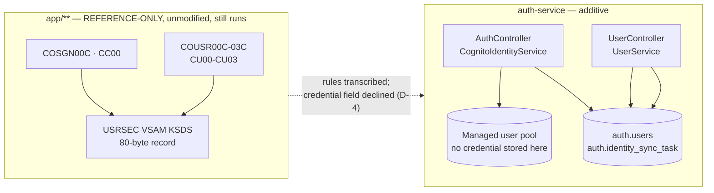

# CardDemo — `auth-service`

> Module guide for the **auth** bounded context: sign-on and user administration.
> Build, run, test, configuration, endpoints, schema, and every divergence from
> the COBOL baseline that a reader would otherwise have to re-derive.
>
> **House style.** This file follows `tests/README.md`: numbered sections, dense
> tables, and every fenced block carrying its own `# WHAT:` / `# WHY :` pair.
> **If a command here and the artifact it describes ever disagree, the artifact is
> authoritative** — please open a fix rather than diverging.

---

## 1. Purpose and provenance

`auth-service` is the **sign-on and user-administration** bounded context of the
CardDemo mainframe-to-AWS migration. It owns the PostgreSQL schema **`auth`** and
is the migration target of five COBOL programs: `COSGN00C` plus `COUSR00C`
through `COUSR03C`.

| Property | Value |
|---|---|
| Package root | `com.carddemo.auth` |
| Maven artifactId | `auth-service` |
| Maven parent | `com.carddemo:carddemo-services:1.0.0-SNAPSHOT` |
| Sibling-module dependency | exactly one — `common-lib` (plus that same module's `test-jar` at test scope, which delivers the shared architecture rules) |
| Owned schema | `auth` — tables `auth.users` and `auth.identity_sync_task` |
| Entry point | `com.carddemo.auth.AuthApplication` |
| Container port | 8080 |

**The mainframe path is not retired.** This module *adds* a path; it does not
remove one. Everything under `app/**` — the COBOL programs, the copybooks, the
BMS mapsets, the JCL and the CICS resource definitions — is **REFERENCE-ONLY**,
is byte-for-byte unmodified by this migration, and still runs. The five programs
named above remain the behavioural specification, and this README cites them by
path and line rather than restating them.

### 1.1 What the baseline did

`COSGN00C` read a record from the `USRSEC` VSAM KSDS, compared an eight-character
password held in clear text, and transferred control to either the administrator
menu or the general menu. The four `COUSR0*C` programs listed, added, updated and
deleted rows in the same file. Session continuity between screen turns lived in a
passed `DFHCOMMAREA`, because CICS ended the task at every turn.

### 1.2 What this module does instead

Credential storage and comparison move to a managed user pool. `auth.users` keeps
a subject reference and no credential of any kind. Requests are stateless:
identity arrives as claims on a signed token, selection context arrives in the
request path, and navigation is decided by the browser client. The consequences of
that shift are enumerated in [§11](#11-documented-divergences-from-the-baseline);
the one place where functional parity is **explicitly declined** is
[D-4](#d-4--the-plaintext-credential-field-is-not-carried-forward).

---

## 2. COBOL provenance mapping

Transaction identifiers are verified against `app/csd/CARDDEMO.CSD`
(`DEFINE TRANSACTION` stanzas at L378, L449, L459, L469 and L479) and agree with
the inventory in the repository root `README.md` at L291 and L307–L310.

| COBOL program | CICS transaction | Responsibility | Target |
|---|---|---|---|
| `COSGN00C` | `CC00` | Sign-on | `AuthController`, `CognitoIdentityService` |
| `COUSR00C` | `CU00` | User list (browse, paged) | `UserController` (list), `UserService` |
| `COUSR01C` | `CU01` | User add | `UserController` (create), `UserService` |
| `COUSR02C` | `CU02` | User update | `UserController` (update), `UserService` |
| `COUSR03C` | `CU03` | User delete | `UserController` (delete), `UserService` |

**Every significant COBOL paragraph maps to one named Java method**, so the
traceability matrix at
[`docs/architecture/cobol-to-service-traceability.md`](../../docs/architecture/cobol-to-service-traceability.md)
can cite paragraph-to-method pairs rather than gesturing at a whole program. That
register — not this README — is the authoritative divergence list.

**The whole user-CRUD family is administrator-only.** All four `COUSR0*C`
programs return to the *administrator* menu (`COADM01C`) on PF3, never to the
general menu (`COMEN01C`). In the target that restriction is enforced by the
`carddemo-admin` authority derived from the signed group claim, not by which
screen the caller happened to arrive from.



### 2.1 The record contract

The `USRSEC` record is declared at `app/cpy/CSUSR01Y.cpy` L17–L23. Offsets below
are zero-based and were derived by summing the `PICTURE` clauses, then reconciled
against the shared fixed-width codec `CopybookLayout.SECUSER_LAYOUT` in
`common-lib` and against
[`docs/architecture/data-model-and-schema-mapping.md`](../../docs/architecture/data-model-and-schema-mapping.md).
All three agree.

| Field | Picture | Offset | Bytes | Target column |
|---|---|---|---|---|
| `SEC-USR-ID` (L18) | `X(08)` | 0 | 8 | `user_id CHAR(8)` — primary key |
| `SEC-USR-FNAME` (L19) | `X(20)` | 8 | 20 | `first_name VARCHAR(20)` |
| `SEC-USR-LNAME` (L20) | `X(20)` | 28 | 20 | `last_name VARCHAR(20)` |
| `SEC-USR-PWD` (L21) | `X(08)` | 48 | 8 | **not carried forward — see [D-4](#d-4--the-plaintext-credential-field-is-not-carried-forward)** |
| `SEC-USR-TYPE` (L22) | `X(01)` | 56 | 1 | `user_type CHAR(1)`, domain `'A'`/`'U'` |
| `SEC-USR-FILLER` (L23) | `X(23)` | 57 | 23 | dropped — record padding |
| — | — | — | — | `cognito_sub UUID UNIQUE` (added) |

**Total: 80 bytes.** The `FILLER` drop is recorded here rather than left silent,
because a reader reconstructing the fixed-width layout needs to know the 23 bytes
existed and carried no data. The offsets are load-bearing: the same numbers drive
the codec that decodes seed records, so an error in this table would surface as
mis-parsed data rather than as a documentation defect.

---

## 3. Build

Run both commands from the **repository root**.

```bash
# WHAT: full multi-module build of every service module, running Surefire unit
#       tests and Failsafe integration tests.
# WHY : the reactor must build common-lib before auth-service, so a
#       module-scoped build cannot resolve the parent POM or the sibling
#       dependency.
mvn -f services/pom.xml clean verify
```

```bash
# WHAT: fire the Checkstyle documentation gate for this module alone.
# WHY : the gate is bound to the Maven `validate` phase, so it runs on every
#       local build and not only in CI; this invocation exercises it in
#       isolation.
mvn -f services/auth-service/pom.xml validate
```

`validate` is the earliest phase in the Maven lifecycle, so the documentation
gate fires **before** compilation. A module whose Javadoc is incomplete therefore
fails without spending time on `javac`, and the same gate runs identically in a
local build, in CI, and inside the container image build.

To iterate on this module without building the other seven services:

```bash
# WHAT: build this module and the shared library it depends on, and nothing else.
# WHY : Trade-offs: `-pl auth-service -am` is faster than a full reactor build but
#       proves less — it cannot detect that a change to common-lib broke a
#       sibling context. Use it while iterating; use the full `clean verify`
#       above before committing.
mvn -B -f services/pom.xml -pl auth-service -am test
```

---

## 4. Run locally

The service needs a reachable PostgreSQL instance carrying the `auth` schema and
a reachable token issuer. Every setting arrives from the environment — see
[§7](#7-configuration) for the variable names and where they come from.

Prepare the credentials **out of band**, in a file that cannot be committed:

```bash
# WHAT: create the environment file with owner-only permissions, before any value
#       is written into it.
# WHY : Assumptions: the name is `.env.auth-service.local` specifically because
#       `.gitignore` ignores `.env.*`; run the `git check-ignore` line below and
#       it prints the rule and its line number. Refactoring Rationale: this
#       runbook sourced `auth-service.env` while claiming `.gitignore` protected
#       it. It does not — the repository ignores `.env` and `.env.*`, and
#       `auth-service.env` matches neither, so a file holding the Cognito client
#       secret and two database passwords was tracked like ordinary source. The
#       extension-last spelling is the entire defect: it reads like an env file
#       to a person and like a committable file to git.
# WHY : Assumptions: `umask 077` is applied BEFORE the file is created rather
#       than corrected afterwards with `chmod`. A later `chmod` leaves a window
#       in which the file was group- and world-readable, and on a shared host
#       that window is sufficient; the `chmod` below is a second assertion for a
#       file that may survive from an earlier session, not the primary control.
umask 077
touch .env.auth-service.local
chmod 600 .env.auth-service.local
git check-ignore -v .env.auth-service.local   # prints the rule that protects it
```

Fill it with the eleven variables §7 marks as having no fallback, one
`KEY=value` per line. Then build and start:

```bash
# WHAT: the COMPLETE local launch contract, in the order it has to be performed.
# WHY : (1) Refactoring Rationale: the TLS disable used to be shown in a SECOND
#       block AFTER the launch. Order is not presentational here: `application.yml`
#       enables TLS and opens a PKCS#12 keystore that exists only inside the
#       deployed image, so a reader who followed the blocks in the order they were
#       printed watched the process fail on a missing keystore and only then read
#       why. The three steps are one block for that reason, and the export comes
#       first.
#       (2) Assumptions: `spring-boot-maven-plugin` repackages the jar so it is
#       self-contained, and no class path is assembled at launch.
#       (3) Assumptions: TWELVE variables in §7 have no fallback, so an incomplete
#       environment stops the process at startup rather than letting it serve requests
#       bound to nothing. §7 marks each of the twelve `none`, and the environment file
#       has to set every one of them. Eleven are `${...}` placeholders in
#       `application.yml`; the twelfth, CARDDEMO_PAGINATION_CURSOR_SIGNING_KEY, is not
#       written in any profile and reaches the shared kernel through relaxed binding --
#       see the rationale under §7, because auditing the profiles for placeholders will
#       not find it.
#       Trade-offs: the failure names the SYMPTOM rather than the key for the
#       framework-bound values, which is worth knowing before you read one. Measured
#       on the sibling transaction service with nothing set, the first failure is
#       `'url' must start with "jdbc"` -- because Spring Boot's binder leaves an
#       unresolvable placeholder as its own literal text, so the property is set to
#       the characters `${SPRING_DATASOURCE_URL}` rather than reported as absent. The
#       values this module injects with `@Value` do name themselves, because that
#       path resolves through the environment rather than the binder and additionally
#       validates blankness. An earlier revision of this note claimed the startup
#       failure names the missing key in every case; it does not.
#       (4) Trade-offs: those variables are supplied from an environment file that
#       is deliberately not committed, rather than typed on the command line,
#       because a shell history is a poor place for a credential and `.gitignore`
#       already excludes `.env`. The cost is that this file cannot show you the
#       file's contents; §7 names every key it must carry.
#       (5) Assumptions: `SERVER_SSL_ENABLED` is not a `${...}` placeholder in any
#       profile — it reaches `server.ssl.enabled` through the framework's relaxed
#       binding of an environment name onto a property. That is why it appears in
#       §7 with a fallback of `true` rather than `none`: nothing fails when it is
#       absent, the listener simply stays encrypted and then cannot open its
#       keystore.
# WHY : Alternatives Considered: minting a local certificate so a local run also
#       speaks TLS. Rejected because the certificate would not match the loopback
#       name for any caller that verified it; disabling the listener states
#       plainly that a local run does not exercise the deployed transport rather
#       than appearing to.
mvn -B -f services/pom.xml -pl auth-service -am package

export SERVER_SSL_ENABLED=false
set -a && . ./auth-service.env && set +a
java -jar services/auth-service/target/auth-service-1.0.0-SNAPSHOT.jar
```

In deployment the image entry point,
[`config/docker/generate-listener-material.sh`](../../config/docker/generate-listener-material.sh),
mints **this task's own** key pair and self-signed certificate before the JVM
starts, onto the task's ephemeral volume. TLS stays enabled there, and no
listener private key is written to infrastructure state or to an image layer.

---

## 5. Container image

```bash
# WHAT: build the service image.
# WHY : the context is the repository ROOT, not the module directory, because
#       the parent POM, the common-lib sources and the shared Checkstyle
#       configuration are all siblings of this module.
docker build -f services/auth-service/Dockerfile -t carddemo/auth-service:local .
```

| Stage | Image | Role |
|---|---|---|
| build | `maven:3.9.16-amazoncorretto-21-al2023` | Resolves dependencies, runs the documentation gate, packages the bootable jar |
| runtime | `public.ecr.aws/amazoncorretto/amazoncorretto:21.0.12-al2023-headless` | Ships the jar on a Java 21 runtime |

Both tags are additionally **digest-pinned** in the Dockerfile, so a re-tag
upstream cannot change what a rebuild produces.

**There is no Alpine variant of the Corretto image.** The repository publishes
only `-al2` and `-al2023` tags, with `headful`, `headless`, `generic` and `jdk`
suffixes, and the highest 21.x is `21.0.12`. Substituting a musl-style suffix
fails the build outright, because the tag is not published at all — the failure
is a manifest-not-found on pull, not a runtime incompatibility, so it will not be
diagnosed by reading Java. The build stage is matched to the runtime's JDK vendor
and major version for the same reason.

Runtime properties, all set in the Dockerfile:

- runs as a **non-root** user (`carddemo`, uid/gid 10001) that owns only `/app`;
- **exposes 8080**;
- carries a `HEALTHCHECK` polling the actuator health endpoint at
  `/actuator/health` on the task's own loopback interface.

The multi-stage split keeps Maven, the JDK and the dependency cache out of the
shipped image; only the bootable jar and a Java runtime ship.

**`docker build` here is validation-only.**
[`.github/workflows/services-ci.yml`](../../.github/workflows/services-ci.yml)
performs **no image push** — it declares no registry login and no cloud
credential at any scope, so a compromise of any step in it has no credential to
read. Image publication belongs to the deployment workflow.

---

## 6. Testing

```bash
# WHAT: run this module's unit tests and its container-backed integration test.
# WHY : Assumptions: the aggregator splits Surefire from Failsafe by class-name
#       suffix -- a `Test` suffix runs at `test`, an `IT` suffix at
#       `integration-test` and `verify` -- so the repository integration test
#       runs only under `verify` and a plain `test` invocation will not start a
#       container.
mvn -B -f services/pom.xml -pl auth-service -am verify
```

The principal test classes, and what each one holds:

| Test class | Kind | Asserts |
|---|---|---|
| `AuthControllerTest` | web layer, MockMvc | The sign-on family's request handling, status mapping and verbatim message text |
| `UserControllerTest` | web layer, MockMvc | The five user-administration operations, including the delete confirmation contract |
| `UserServiceTest` | plain unit test | Validation branches transcribed from the COBOL paragraphs, and keyset page assembly |
| `UserRepositoryIT` | Testcontainers, real PostgreSQL | The keyset queries and the schema constraints, against the engine that actually runs them |
| `OperationCensusTest` | contract census | That the published surface is exactly the operations [§8](#8-api-surface) lists — four open and five administrator-only |

Alongside these the module carries further focused tests covering the security
configuration, request validation, authority derivation, response-rendering
exposure and the identity-synchronisation ledger. The suite is discovered by the
reactor; this table names the load-bearing classes rather than enumerating every
file.

Two wiring notes, recorded because each looks like an omission otherwise:

- **`@WebMvcTest` is not used, and is not available here.** Spring Boot 4 moved
  the servlet slice annotation into a separate artifact that this module's POM
  does not declare and that `spring-boot-starter-test` does not pull in. Both
  controller tests therefore assemble the MockMvc slice explicitly through
  `MockMvcBuilders`. The real resource-server filter, the real authentication
  converter and the real role converter all run, so the authority derivation
  under assertion is the deployed one.
- **`UserRepositoryIT` deliberately does not use `@DataJpaTest`**, which would be
  the narrower slice. The test asserts constraints that exist only because Flyway
  created them, and that slice does not run Flyway.

Fixtures under `src/test/resources/fixtures/` derive from the `CSUSR01Y` layout at
its verified **80-byte** length and the `CHAR(8)` key contract.

### 6.1 There is no golden master for this service

**No golden-master oracle covers this module, and none can.** `tests/README.md`
§1.1 records that the online `CO*` programs **cannot run end-to-end without a
CICS runtime**, which is absent on the runner; only their extractable
field-validation logic is unit-testable in COBOL. The repository's golden-master
comparison therefore covers **batch flows only**. All five programs this module
migrates are online programs.

Parity for this context consequently rests on two things and is claimed for
nothing beyond them:

1. **Validation logic transcribed directly from the COBOL paragraphs**, method by
   method, with the source paragraph cited at the method that carries it.
2. **The copybook field contracts** — the widths, the key length, the `'A'`/`'U'`
   domain and the verbatim message strings in [§10](#10-user-visible-message-catalog).

A future reader should not go looking for a golden file for sign-on, and should
not read the absence of one as an oversight. Machine-verified byte-level parity is
**not** available for this module.

### 6.2 The existing COBOL suite is reference-only

`tests/**` and `scripts/**` are **REFERENCE-ONLY**. They are the migration's
parity oracle for the batch contexts, and this work neither modifies them nor
moves any of their pinned versions. Every Java, TypeScript and Python test added
by the migration is strictly **additive**.

**The RC=4 caveat.** The existing suite's documented aggregate **warn return code
of 4 is its green state.** It arises from a single out-of-scope defect in the
immutable baseline: the `CBEXPORT`/`CBIMPORT` pair declares a `RECORD KEY` on a
field that exists only in `WORKING-STORAGE` and not in the FD record, so the pair
does not compile under the open-source compiler and its integration test is
skipped. That warn code **must not be read as a regression**, and in particular
must not be read as anything this module caused.

The mainframe `0/2/4/8/16` condition-code rubric **is not imported into any Maven
or JUnit gate.** A Java gate is binary: `verify` either passes or fails. Mapping a
soft-warn tier onto it would make a failing build look conditionally acceptable,
which is the opposite of what a build gate is for.

---

## 7. Configuration

Names only. **No value for any variable below appears anywhere in this
repository** — not in this file, not in a profile, not in an infrastructure
parameter file.

| Variable | Purpose | Fallback |
|---|---|---|
| `SPRING_PROFILES_ACTIVE` | Selects the environment overlay | — |
| `SPRING_DATASOURCE_URL` | Connection target for the runtime role | none |
| `SPRING_DATASOURCE_USERNAME` | Runtime database role | none |
| `SPRING_DATASOURCE_PASSWORD` | Credential reference for the runtime role | none |
| `SPRING_FLYWAY_USER` | Migration role, distinct from the runtime role | none |
| `SPRING_FLYWAY_PASSWORD` | Credential reference for the migration role | none |
| `SPRING_SECURITY_OAUTH2_RESOURCESERVER_JWT_ISSUER_URI` | Issuer location whose keys validate presented tokens | none |
| `CARDDEMO_SECURITY_JWT_EXPECTED_CLIENT_ID` | The app client a presented token must name | none |
| `CARDDEMO_AUTH_COGNITO_USER_POOL_ID` | Pool this context administers | none |
| `CARDDEMO_AUTH_COGNITO_CLIENT_ID` | App client used for the sign-on exchange | none |
| `CARDDEMO_AUTH_COGNITO_CLIENT_SECRET` | Client credential reference for that exchange | none |
| `CARDDEMO_SERVER_TLS_KEYSTORE_PASSWORD` | Opens the listener keystore | none |
| `CARDDEMO_PAGINATION_CURSOR_SIGNING_KEY` | Keys the sealed paging cursor the user list issues | none |
| `CARDDEMO_ONLINE_WRITES_PARAMETER` | Names the SSM flag that closes writes during the batch window | none in effect |
| `CARDDEMO_VERSION` | Release label on every log record, metric series and span | `unspecified`, which the service module refuses |
| `CARDDEMO_SERVER_TLS_KEYSTORE` | Keystore location | has a default |
| `CARDDEMO_SERVER_TLS_KEY_ALIAS` | Listener key alias | has a default |
| `CARDDEMO_COGNITO_ADMIN_GROUP_NAME` | Group mapped to the administrator authority | `carddemo-admin` |
| `CARDDEMO_COGNITO_USER_GROUP_NAME` | Group mapped to the ordinary-user authority | `carddemo-user` |
| `CARDDEMO_DB_SSL_ROOT_CERT` | Trust anchor for the database connection | has a default |
| `SERVER_SSL_ENABLED` | Whether the listener is encrypted; set `false` for a loopback-only local run | `true`, set in `application.yml` |

The twelve marked `none` have **no fallback on purpose**, rather than letting the
service come up bound to a default that happens to be wrong. What a missing one looks
like is set out in the launch note in §4: for the framework-bound values the failure
names the symptom rather than the key, because the binder leaves an unresolvable
placeholder as its own literal text.

Refactoring Rationale: three of the rows above were absent from this table, and two of
them are **required**. `CARDDEMO_PAGINATION_CURSOR_SIGNING_KEY` and
`CARDDEMO_ONLINE_WRITES_PARAMETER` are the only inputs this service reads that are *not*
written as `${...}` placeholders in any profile — Spring's relaxed binding maps them onto
`carddemo.pagination.cursor.signing-key` and `carddemo.online-writes.parameter`, both
declared in the shared kernel's auto-configuration rather than here. They were therefore
invisible to a reader auditing the profiles for placeholders, and to the audit that
produced this table. The two behave differently when absent, which is why both are named:
the cursor key **stops startup**, because its bean is `@ConditionalOnProperty` and
`service/UserService` takes a `CursorToken` as a mandatory constructor argument with no
`ObjectProvider` wrapper; the write gate **removes itself silently**, because both its
beans are conditional on the same property and nothing outside the auto-configuration
injects them — so an absent value leaves user administration accepting writes during the
nightly batch window with nothing in the log to say so. `infra/modules/ecs-service`
requires the cursor key by name and makes the gate name biconditional for the seven web
workloads, so a root that drops either fails at `plan`. `CARDDEMO_VERSION` is the third:
it has a fallback here and the service module refuses that fallback, because a task
labelled `unspecified` produces telemetry no release can be attributed to.

**Where the values come from.** Every one arrives from **Terraform outputs by way
of Parameter Store and Secrets Manager**, injected by the ECS task definition and
read at startup through the active Spring profile. As the specification puts it:
**"No service hard-codes an endpoint."** Nothing in this module reads a cloud
parameter store directly — the platform resolves configuration before the process
starts, and the framework's own environment binding reads it from there.

Three documents, and the two overlays vary on exactly **four** axes — never in
topology, and never in what the service does:

| File | Role |
|---|---|
| `src/main/resources/application.yml` | Base configuration; every variable reference and every default lives here |
| `src/main/resources/application-dev.yml` | Development overlay |
| `src/main/resources/application-prod.yml` | Production overlay |

| Axis | `dev` | `prod` |
|---|---|---|
| Connection-pool sizing | `maximum-pool-size: 5`, `minimum-idle: 0` | `maximum-pool-size: 20`, `minimum-idle: 5` |
| Log levels | `com.carddemo`, `org.flywaydb` and `org.hibernate.SQL` at `DEBUG` | `root: WARN`, `com.carddemo: INFO` |
| Actuator exposure | `health,info,metrics,prometheus,env,configprops,flyway` | `health,metrics,prometheus` |
| Flyway clean protection | not set | `spring.flyway.clean-disabled: true` |

Two of those deserve a word, because they are the two a reader is most likely to
assume are the same everywhere. The **actuator exposure list is a security axis,
not a convenience one**: `env` and `configprops` render resolved configuration, so
exposing them in production would publish the shape of the very settings §7 keeps
in a secret store, which is why the production list is three endpoints rather than
seven. And **`clean-disabled` is a one-way guard**: `flyway:clean` drops every
object in the schema, so the production overlay refuses the command outright
rather than relying on nobody issuing it.

Refactoring Rationale: this section said the profiles "vary only in sizing, log
levels and retention". Two of those three were wrong. There is **no
application-level retention setting in this module at all**, and
`application.yml` says so itself where it notes that log retention "is governed by
the log group rather than by this service" — the property belongs to
`infra/modules/observability`, which parameterises `log_retention_days`. A reader
looking for a retention profile here would find nothing and reasonably conclude the
documentation was out of date rather than describing a setting that never existed.
And
the list omitted both axes that carry a security consequence, which is precisely
the pair worth naming. The axes are now tabulated from the overlays themselves so
the claim can be diffed against them.

---

## 8. API surface

The published contract is **nine operations**, and that count is asserted by
`OperationCensusTest` rather than merely documented, so the table below cannot
drift from the code without a test failing. A tenth endpoint, the health probe, is
an operational contract rather than part of the business API.

| Method | Path | Authority | Source |
|---|---|---|---|
| `POST` | `/api/v1/auth/signon` | none — it issues the token | `COSGN00C` |
| `POST` | `/api/v1/auth/challenge` | none — continues an in-flight sign-on | `COSGN00C` |
| `POST` | `/api/v1/auth/refresh` | none — presents a refresh grant | `COSGN00C` |
| `POST` | `/api/v1/auth/signout` | none — it presents the grant it revokes | no reference counterpart |
| `GET` | `/api/v1/auth/users` | `carddemo-admin` | `COUSR00C` |
| `POST` | `/api/v1/auth/users` | `carddemo-admin` | `COUSR01C` |
| `GET` | `/api/v1/auth/users/{userId}` | `carddemo-admin` | `COUSR02C` (fetch) |
| `PUT` | `/api/v1/auth/users/{userId}` | `carddemo-admin` | `COUSR02C` |
| `DELETE` | `/api/v1/auth/users/{userId}` | `carddemo-admin` | `COUSR03C` |
| `GET` | `/actuator/health` | none | operational |

The five user-administration operations require the **`carddemo-admin`**
authority. The four session operations are open because on each one the caller has
no usable access token to present: three of them are the operations that *obtain*
a token, and requiring a token to get a token cannot terminate.

**The fourth is `POST /api/v1/auth/signout`, and it is open for a different
reason worth stating.** `Trade-offs:` gating revocation behind a live access token
would refuse it in precisely the case that most needs it — a session abandoned
rather than closed, whose one-hour access token has expired while its thirty-day
refresh token has weeks of life left. Its authority is possession of the refresh
token, which is the only credential the pool's own revocation operation accepts,
so requiring a second one would add a failure mode without adding a check. It
answers `204` both for a token it revoked and for one the pool declines to accept,
because every state the pool reports for the latter — already revoked, expired,
not a revocable type — describes a token that can no longer mint anything;
distinguishing them would tell an unauthenticated caller whether a token was live.
It answers `500` only when the pool could not be reached, because then nothing was
revoked and the caller must retry. `Alternatives Considered:` requiring the bearer
token as well and revoking only on a match. Rejected on the reasoning above — it
narrows nothing an attacker holding the refresh token could not already do, and it
withdraws the operation from the users who need it.

Any path matching neither set is denied rather than merely challenged, so a
validly signed token still reaches nothing that was not deliberately published.

**The health endpoint is unauthenticated.** Two independent consumers poll it —
the load-balancer target group and the container's own `HEALTHCHECK` — and neither
is able to present a JWT. The endpoint returns liveness state and exposes no
business data, no user record and no configuration value. `Trade-offs:` an
unauthenticated path is accepted in exchange for a health signal the platform can
actually read; the exposure is bounded by the endpoint returning nothing an
attacker could not learn from whether the port answers at all. The wider
`/actuator/**` surface is *not* open — operator endpoints sit behind their own
authority.

The **OpenAPI 3.1** contract is at
[`src/main/resources/openapi/auth-api.yaml`](src/main/resources/openapi/auth-api.yaml).
It is what the SPA client [`ui/src/api/auth.ts`](../../ui/src/api/auth.ts) is
written against, so the contract is the coordination point between the two trees
rather than either implementation.

**One operation in that table answers with a shape carrying material no other
returns.** `POST /api/v1/auth/users` answers `201` with `CreatedUserResponse`, which
is the five properties of `UserResponse` plus `credentialSecretName` — the name of the
managed-secret entry holding the one-time credential the pool account was created
with. `Refactoring Rationale:` the body carries the entry's **name and not its
value**, because a credential in a response body is copied into every proxy log and
browser history on the path. Collect the value from that entry: the account lands in
the provider's force-change state, so presenting it at `POST /api/v1/auth/signon`
yields the `NEW_PASSWORD_REQUIRED` challenge that `POST /api/v1/auth/challenge`
answers, and the pool issues tokens only once a permanent credential has replaced it.
The name is derived from the identifier, so it is recomputable rather than
irrecoverable. See
[D-4](#d-4--the-plaintext-credential-field-is-not-carried-forward) for why the value
is created here rather than delivered by the provider, and
`FirstSignOnHandoverTest` for the end-to-end evidence that the value a creation
returns is the value that account's first sign-on accepts.

### 8.1 Keyset pagination on the user list

The list operation pages **by key, never by offset**. The page size is **10**,
taken from `02 USER-REC OCCURS 10 TIMES` at `app/cbl/COUSR00C.cbl` L57 — the
baseline's own screen array — and one extra row is read per page so the
next-page indicator can be set by discovering a row that does not fit, which is
exactly how the COBOL sets it.

Request parameters are `cursor` and `direction`. The response envelope is
`PageResponse<T>` from `common-lib`, and it has **four** components:

| Component | Meaning |
|---|---|
| `items` | The page's rows, at most 10 |
| `firstKey` | Sealed cursor token naming this page's leading boundary — the position a backward request is issued from |
| `lastKey` | Sealed cursor token naming this page's trailing boundary — the position a forward request is issued from |
| `hasNext` | Whether a further page follows, established by reading one row beyond the window |

**Backward availability is not a component**, and `UserService` reports no such
flag. Forward availability is the surplus row on a forward walk
and is unconditionally true on a backward one, because a caller that has just
stepped back came from a page that demonstrably exists. What the envelope owes a
caller that wants to step back is the **position** to seek from, which is
`firstKey`, and nothing more: the backward read asks for keys strictly less than
that token in descending order.

`Refactoring Rationale:` the baseline answers "is there an earlier page" from a
page ordinal the terminal carried between turns and never from a read of the
file. `app/cbl/COUSR00C.cbl` declares `CDEMO-CU00-PAGE-NUM` at L70 inside that
communication area, tests `CDEMO-CU00-PAGE-NUM > 1` at L247, and when it is not
raises `'You are already at the top of the page...'` at L251 without reading
anything at all. That ordinal's migrated home is the browser client's own
navigation state, so the client refuses the backward key while it holds the first
page and this service is never asked. A fifth component restating it would spend
a query recomputing what the caller already knows — whether it issued a cursor —
and would put the wire out of agreement with the four members every consumer of
the envelope declares. `PageResponseTest` asserts the closed set at four and
refuses that fifth member by name.

`Alternatives Considered:` offset pagination, which the component library and the
persistence layer both offer for free. It is rejected because under concurrent
inserts an offset **skips and repeats rows** — a row inserted before the cursor
shifts every later row by one — whereas the baseline's `STARTBR` / `READNEXT` /
`READPREV` browse resumes from a key and does neither. Keyset paging over the same
key column preserves the observable page boundaries; offset paging would change
them, and would do so only under concurrency, which is the hardest condition in
which to notice.

### 8.2 Delete requires explicit confirmation

The delete operation requires an explicit affirmative confirmation parameter. Its
absence is rejected and **nothing is deleted**. This is the target of the 3270
re-key-to-confirm convention: the destructive action is never implicit and never
fires as a side effect of navigation. The browser client renders the same contract
as a confirmation prompt before it will issue the request.

### 8.3 Identity, and why the group claim is not merely a port

The baseline transferred control with `EXEC CICS XCTL` to either `COADM01C` or
`COMEN01C`, chosen at `app/cbl/COSGN00C.cbl` L230–L240 from `CDEMO-USER-TYPE`,
which L227 had just copied out of the record. In the target that branch becomes
**client-side navigation driven by the signed `cognito:groups` claim**, with
`SEC-USR-TYPE` `'A'` and `'U'` mapping to `carddemo-admin` and `carddemo-user`.

This is **not** a server-side redirect, and the difference is a real security
property rather than a restructuring. In the baseline the `DFHCOMMAREA` is storage
the client echoes back between turns, so the user type an authorization decision
reads is a value the client last held — a client could in principle assert its
own. A claim on a signed token cannot be asserted by the client at all: the
signature is checked against the issuer's keys on every request, and the
authority is derived from the verified claim. The conversion is performed by the
shared `JwtRoleConverter` in `common-lib`, so all eight services derive authority
identically.

Full treatment is in
[`docs/architecture/security-and-identity.md`](../../docs/architecture/security-and-identity.md).

---

## 9. Database schema

Two tables, both inside the `auth` schema.

### 9.1 `auth.users`

Declared by
[`src/main/resources/db/migration/V1__auth.sql`](src/main/resources/db/migration/V1__auth.sql):

| Column | Type | Notes |
|---|---|---|
| `user_id` | `CHAR(8)` | Primary key, from `SEC-USR-ID` |
| `first_name` | `VARCHAR(20)` | From `SEC-USR-FNAME`, at its declared width |
| `last_name` | `VARCHAR(20)` | From `SEC-USR-LNAME`, at its declared width |
| `user_type` | `CHAR(1)` | `CHECK (user_type IN ('A','U'))` |
| `cognito_sub` | `UUID` | `NOT NULL UNIQUE` — the subject reference |

**There is no password column of any kind**, and no hashed-credential column
either. See [D-4](#d-4--the-plaintext-credential-field-is-not-carried-forward).

**`CHAR(8)` for the key, `VARCHAR(20)` for the names**, and the asymmetry is
deliberate. The baseline field is `PIC X(08)` and the identifier is a key of
declared fixed width, so its trailing positions are contractual — a browse
resumes from an eight-character value and a shorter one is a different key. The
two name fields are descriptive, so their trailing blanks are padding to the
record length rather than data, and `VARCHAR` stores what was meant without
preserving the fill.

The `CHECK` constraint carries the baseline's own domain forward: `SEC-USR-TYPE`
admitted exactly `'A'` and `'U'`, and the constraint is evaluated by the engine in
the same statement that inserts, so the domain cannot be widened by an application
path that forgot to validate.

### 9.2 `auth.identity_sync_task`

Declared by
[`src/main/resources/db/migration/V2__auth_identity_sync.sql`](src/main/resources/db/migration/V2__auth_identity_sync.sql).
It is a durable intended-change ledger: one row per change owed to the managed
user pool. **Update and delete** write their row **in the same transaction** as the
`auth.users` change that caused it and apply it after that transaction commits.

`Alternatives Considered:` calling the pool inline, inside the same transaction as
the row write. Rejected because the pool is a remote system that cannot enlist in
a database transaction: a failure after the call and before the commit leaves the
pool changed and the table not, and a failure the other way leaves a user row with
no identity behind it. The ledger makes the owed change durable at the moment it
is decided, so the two converge without either being able to advance alone.

**Create is the exception, and it is the reverse order.** `auth.users.cognito_sub`
is `NOT NULL` and only the pool can mint the subject a row carries, so the account
must exist *before* the row can be written at all — there is no "same transaction"
for a create's intention to join. It therefore **arms** a `WITHDRAW` row in a
committed transaction of its own *before* provisioning, and settles it inside the
same transaction as the insert:

| Create outcome | What happens to the armed row |
|---|---|
| The insert commits | Abandoned (`create-committed`) **inside the insert's transaction**, so a committed row and a live withdrawal intention never coexist. |
| The pool already holds the username | Abandoned (`pool-held-account`) — this request provisioned nothing, and the account belongs either to the caller that won the race or to an earlier interrupted create whose *own* armed row the scheduled pass owns. |
| The provider faults, or the insert is refused | Applied — the account is withdrawn now, and stays pending for the scheduled pass if the provider cannot be reached. |
| The process dies between provisioning and the insert | Stays pending, which is the whole point: the orphaned account is named by a durable row rather than by nothing. |

`Refactoring Rationale:` the compensation was previously recorded from the insert's
failure handlers, which covers a failed insert and **nothing else** — a process
death, an eviction or a rollback raised outside those handlers each left an account
that can authenticate, holds no membership this context records, permanently blocks
a later create of the same identifier, and appeared in no ledger and no log.

`Assumptions:` two further properties follow from arming before the account exists,
and both are enforced in `IdentitySyncService`. A withdrawal is **guarded** against
a committed row that owns the account, because a stale withdrawal from a delete
whose provider call was lost would otherwise destroy an account created afresh
under the same identifier; and the scheduled pass **defers** a task younger than
`COMPENSATION_GRACE` (30 seconds), because an armed row is visible to it while the
create that armed it is still running. The create path's own compensation applies
through a separate entry point that skips the guard, since it provisioned the
account itself.

### 9.3 Migration, and the companion artifact that is easy to omit

Migrations are applied by **Flyway 13.0.0**. Two coordinates matter, and neither
is optional:

- **`flyway-database-postgresql`** — Flyway 10 and later moved PostgreSQL support
  out of the core artifact into this companion. With `flyway-core` alone the build
  resolves, compiles and starts perfectly, and then **fails at runtime rather
  than at build time**, when the service first opens a connection to a real
  database. Nothing in a build or a unit test reports it, which is exactly what
  makes the coordinate easy to drop and expensive to omit: the mistake is
  invisible until deployment.
- **`spring-boot-starter-flyway`** — Spring Boot 4 split its autoconfiguration
  into one module per technology, so the Flyway autoconfiguration no longer ships
  with the framework core. Without the starter, every `spring.flyway.*` key binds
  to nothing, no schema history table is created, and the service reports healthy
  against a database on which `V1__auth.sql` never ran.

### 9.4 Ownership boundary

The **schema itself, its roles and its grants are bootstrapped by**
[`data-migration/sql/V0__schemas_and_roles.sql`](../../data-migration/sql/V0__schemas_and_roles.sql),
which creates all eight schemas and the owner, migration and runtime roles for
each. This module's migrations own only the objects **inside** `auth` and contain
**no `CREATE SCHEMA`, no `CREATE ROLE` and no `GRANT`**.

`Assumptions:` the privilege to create a schema or a role is not held by the
identity that runs these migrations, and that separation is the point — a service
migration that could grant itself privileges would make the least-privilege role
split unenforceable. This is why `SPRING_FLYWAY_USER` in [§7](#7-configuration) is
a different role from `SPRING_DATASOURCE_USERNAME`.

### 9.5 `auth.users` has no version column

Unlike `accounts`, `customers` and `cards`, `auth.users` carries **no optimistic
concurrency version column**, and the evidence for that asymmetry is in the
baseline:

- `COUSR02C` performs `READ ... UPDATE` and the paired `REWRITE` **inside a single
  CICS task**: L217 reads for update, L219–L234 compare the submitted fields
  against the record just read, and L237 rewrites — a straight-line sequence with
  no intervening screen send and return.
- `COUSR03C` is tighter still: L190 reads for update and **L191** deletes.
- By contrast `COACTUPC` snapshots a complete before-image into
  `ACUP-OLD-DETAILS` (L669) and carries a change flag (L168) tested by
  `DATA-WAS-CHANGED-BEFORE-UPDATE` (L521), because its read and its rewrite sit on
  opposite sides of a pseudo-conversational gap where no lock can be held.

`Refactoring Rationale:` the account context needs a `@Version` column because it
is porting a before-image check that genuinely exists. This context has no such
check to port — there is no gap for a concurrent writer to slip into — so a plain
transactional read-modify-write is the faithful equivalent, and adding a version
column here would invent a conflict semantic the baseline never had.

### 9.6 Two baseline access characteristics the target changes

Both are read from the `FILE(USRSEC)` stanza in `app/csd/CARDDEMO.CSD`:

- **`STRINGS(1)`** allowed a single concurrent access string against the file, so
  requests serialised on it. That is a real concurrency ceiling, and it is absent
  in the target because PostgreSQL admits concurrent readers and writers on the
  same table under MVCC.
- **`READINTEG(UNCOMMITTED)`** permitted reads of uncommitted data. PostgreSQL's
  default `READ COMMITTED` is **stricter**, so the target cannot return a value
  that was never committed. This is a narrowing, not a widening, and needs no
  compensating behaviour.

The same stanza carries **`RECOVERY(NONE)`** and **`JOURNAL(NO)`**: the file was
defined with neither recovery logging nor journalling. That is the justification
for the target's encryption at rest under a customer-managed key and its automated
backups — the baseline had no equivalent, so these are additions rather than
ports.

---

## 10. User-visible message catalog

These strings are an **externally observable interface** and are carried across
**character-for-character**. Line numbers below were verified by reading each
source file at the cited line.

| Program | Line | String |
|---|---|---|
| `COSGN00C` | L120 | `Please enter User ID ...` |
| `COSGN00C` | L125 | `Please enter Password ...` |
| `COSGN00C` | L242 | `Wrong Password. Try again ...` |
| `COSGN00C` | L249 | `User not found. Try again ...` |
| `COSGN00C` | L254 | `Unable to verify the User ...` |
| `COUSR00C` | L212 | `Invalid selection. Valid values are U and D` |
| `COUSR00C` | L251 | `You are already at the top of the page...` |
| `COUSR00C` | L273 | `You are already at the bottom of the page...` |

**They must not be reworded, re-punctuated, re-capitalised, or have their trailing
ellipses normalised.** A reader tidying this table would be changing the
interface, not the documentation.

Three properties of the catalog are worth stating explicitly:

- **The catalog is eight strings, not three.** The two blank-field prompts at L120
  and L125 do not appear in any higher-level summary of this migration; they were
  recovered by reading `app/cbl/COSGN00C.cbl` directly. They are exactly as binding
  as the three verification messages that are summarised elsewhere. Never reduce
  this table to three.
- **The ellipsis spacing differs between the two programs, and the difference is
  real.** All five `COSGN00C` strings carry **a space before** the three-dot
  ellipsis (`User ID ...`); both `COUSR00C` paging strings have **no preceding
  space** (`the page...`). Both forms are preserved as written.
- **The `Invalid selection` string has no ellipsis at all**, and its two valid
  values `U` and `D` are the baseline's selection markers, reproduced verbatim
  rather than renamed to match the target's verbs.

Field-level validation errors do **not** travel as message text. They surface as a
**structured per-field error array** in the response body — `ApiError` from
`common-lib` — including the `'*'` blank marker the baseline moved into an empty
field. `Refactoring Rationale:` the baseline expressed a field error by moving a
colour attribute and a marker character into the map, which is a presentation act
performed on the server. A structured array lets the browser client render the
same two signals (the highlighted control and the marker) while leaving the
rendering decision where the rendering happens.

---

## 11. Documented divergences from the baseline

Every entry below is a place where this module's structure or behaviour differs
from the COBOL, together with the specific mechanism that justifies it. The
authoritative register for the whole migration is
[`docs/architecture/cobol-to-service-traceability.md`](../../docs/architecture/cobol-to-service-traceability.md);
this section is the subset that belongs to `auth-service`.

**Exactly one of them is a declined behavioural parity. It is D-4.** The rest are
structural: same observable behaviour, different construction.

### D-4 — the plaintext credential field is not carried forward

**This is the one place in the entire migration where functional parity is
explicitly DECLINED.**

#### The evidence

- **`app/cpy/CSUSR01Y.cpy` line 21** declares `SEC-USR-PWD PIC X(08)` — an
  eight-character password **stored in plain text** at offset 48 of the 80-byte
  record.
- **`app/cbl/COSGN00C.cbl` L211–L256** is the `READ-USER-SEC-FILE` verification
  block: `L211` issues the `EXEC CICS READ` of the security dataset into
  `SEC-USER-DATA`, and **the direct plaintext comparison is at L223**,
  `IF SEC-USR-PWD = WS-USER-PWD`. There is no hash, no salt and no work factor in
  that comparison, because nothing is stored to compare against but the characters
  themselves.

Both citation forms are given deliberately: the range **L211–L256** matches how
the sibling architecture documents cite the block, so the traceability register
reconciles, and the exact line **L223** lets a reader find the comparison without
re-deriving it.

#### The exposure has four faces, not one

A reader shown only the comparison will underestimate the defect being corrected:

| # | Location | Exposure |
|---|---|---|
| 1 | `app/cpy/CSUSR01Y.cpy` L21 | **Stored in clear** — the field is part of the persisted record |
| 2 | `app/cbl/COSGN00C.cbl` L223 | **Compared in clear** on every sign-on |
| 3 | `app/cbl/COUSR01C.cbl` L157 | **Written in clear** on user creation, then persisted by the `WRITE` at L240 |
| 4 | `app/cbl/COUSR02C.cbl` L169 | **The stored plaintext password is echoed back to the screen** on the update path, and L227–L228 compare and rewrite it in clear |

The fourth is the most consequential: the update screen does not merely handle the
credential, it **redisplays the stored one to whoever opened the screen**.
`COUSR03C` contains no password field anywhere, so the delete path is unaffected.

#### The target position

Identity moves to a **managed Cognito user pool**. `auth.users` keeps only a
**`cognito_sub`** reference, and **no password column of any kind exists** —
neither plaintext nor hashed. No credential is persisted and none is logged. Seed
users are created at provisioning time with generated credentials written to
Secrets Manager, so no credential value appears in source at any point.

> `Refactoring Rationale:` no credential is persisted, logged, or returned by any
> operation, and the create operation is the one worth stating explicitly.
> `POST /api/v1/auth/users` previously created the pool account with delivery
> suppressed and no supplied credential, so the provider minted one internally and
> sent it nowhere, and the account was unusable by anyone. The service now generates a
> policy-compliant one-time value, supplies it to the pool, and publishes it to a
> per-user Secrets Manager entry encrypted with the customer-managed key; the response
> carries that entry's `credentialSecretName` and never the value. The pool
> declares no email or phone attribute over which a reset could be delivered, no
> reset operation exists in this reactor, and the seed-user bootstrap runs only
> inside `terraform apply` — so the response was the only place the value could
> reach its owner. `Assumptions:` the returned value is single-use (the account is
> in the provider's force-change state, so it buys exactly one sign-on and must be
> replaced through `POST /api/v1/auth/challenge`), never persisted (there is no
> column for it) and never logged (`ProvisionedIdentity` and `CreatedUserResponse`
> both override their generated rendering, and `FirstSignOnHandoverTest` asserts
> that no line emitted during the whole journey contains it). Those three
> properties are what make it defensible; its absence was not.

`Refactoring Rationale:` what was wrong with the old approach is not that the
hashing was weak but that there was none, and that the same field was
simultaneously stored, compared, written and redisplayed in clear across four
program paths. Correcting one path would have left the other three.

`Alternatives Considered:` porting the file read faithfully and adding a hashed
password column to `auth.users`. Rejected because a managed pool **removes the
defect class entirely rather than mitigating one instance of it**: with no
credential column there is nothing to hash badly, nothing to log accidentally,
nothing to echo to a screen, and no migration path that carries the old values
forward. A hashed column would still have required this service to receive,
handle and store credential material on all four paths above.

**The COBOL is not fixed.** Any modification to `app/**` is out of scope, so
`SEC-USR-PWD` is still declared at `CSUSR01Y.cpy` L21 and still compared at
`COSGN00C.cbl` L223. The Java implements the correct behaviour, the baseline keeps
its defect, and the divergence is registered — as **D-4** in
[`docs/architecture/cobol-to-service-traceability.md`](../../docs/architecture/cobol-to-service-traceability.md),
with the full identity treatment in
[`docs/architecture/security-and-identity.md`](../../docs/architecture/security-and-identity.md).

The other known baseline defects belong to other modules and are equally
untouched; none of them is fixed by this work either.

### The remaining divergences

| Divergence | Mechanism |
|---|---|
| **No golden master for this service** | The online programs cannot run without a CICS runtime, so no byte-level oracle exists for any of the five. Parity rests on transcribed validation logic and the copybook contracts — see [§6.1](#61-there-is-no-golden-master-for-this-service). |
| **`auth.users` has no version column** while `accounts`, `customers` and `cards` have one | `COUSR02C` L217→L237 and `COUSR03C` L190→L191 read for update and write inside one CICS task, so there is no pseudo-conversational gap and no before-image check to port. `COACTUPC` L168/L521/L669 shows the machinery that does exist where a gap does — see [§9.5](#95-authusers-has-no-version-column). |
| **Keyset rather than offset pagination** | Offset paging skips and repeats rows under concurrent inserts; keyset paging over the browsed key column does not — see [§8.1](#81-keyset-pagination-on-the-user-list). |
| **`CHAR(8)` key, `VARCHAR(20)` names** | The identifier is a key of declared fixed width, so trailing positions are contractual; the name fields are descriptive, so their trailing blanks are record padding — see [§9](#9-database-schema). |
| **No Lombok** | Generated accessors cannot carry the Javadoc the explainability rule requires, and the documentation gate in [§12](#12-documentation-standard-and-the-checkstyle-gate) checks every public member. Java 21 records with hand-written members give the same brevity while remaining documentable. |
| **No generated mappers** | The copybook-to-DTO mapping is not mechanical: it drops `FILLER`, applies the `'A'`/`'U'` domain, and adds a subject reference that has no baseline counterpart. Each of those needs a justification recorded at the mapping site, which a generated mapper has nowhere to put. |
| **The signed group claim replaces `CDEMO-USER-TYPE`** | The COMMAREA field was storage the client echoed back, so the client could in principle assert its own user type; a signature checked against the issuer's keys cannot be asserted — see [§8.3](#83-identity-and-why-the-group-claim-is-not-merely-a-port). |
| **Full statelessness** | `CDEMO-PGM-CONTEXT`, the first-entry-versus-re-entry discriminator, **disappears entirely**: a handler that returns a field-error array has no turn count to remember. There are no sticky sessions and no server-side session store. This is what makes horizontally-scaled tasks behind a load balancer viable at all — any task can serve any request, so scaling out needs no session affinity and losing a task loses no user's place. |
| **Navigation is client-side** | `EXEC CICS XCTL` between programs becomes a route change in the browser client. No server-side "next program" field exists in the target at all. |
| **A durable identity-synchronisation ledger is added** | The pool cannot enlist in a database transaction, so the owed change is committed alongside the row and applied afterwards — or, for a create, *armed before* the account exists and settled with the insert — see [§9.2](#92-authidentity_sync_task). The baseline had no equivalent because it had no second system to keep in step. |

---

## 12. Documentation standard and the Checkstyle gate

The written convention for every language in this repository is
[`docs/CODE_DOCUMENTATION_STANDARD.md`](../../docs/CODE_DOCUMENTATION_STANDARD.md).
**This README points at it and deliberately does not restate it** — duplicating a
convention creates two sources of truth that drift apart, and the copy is always
the one that goes stale.

The mechanical half of the gate is
[`config/checkstyle/checkstyle.xml`](../../config/checkstyle/checkstyle.xml),
executed by `maven-checkstyle-plugin` bound to the Maven **`validate`** phase in
`services/pom.xml`. The plugin's bundled Checkstyle is overridden to **13.8.0**,
because the ruleset uses module properties that the version bundled with the
plugin rejects while parsing — without the override the build stops before
auditing a single file, reporting a property name rather than the version gap that
caused it.

```bash
# WHAT: run the documentation gate for this module without building anything else.
# WHY : Trade-offs: invoking the `validate` phase rather than the plugin goal
#       directly is slower by one lifecycle step, and is correct — a bare goal
#       invocation bypasses the configuration the POM supplies and audits with
#       plugin defaults, which reports results that do not match the gate CI runs.
mvn -f services/auth-service/pom.xml validate
```

**What the gate does and does not check.** Checkstyle mechanises **docstring
presence and completeness** — that every public member carries Javadoc and that it
documents purpose, parameters and return values. It **cannot** check that an
inline comment explains *why* a decision was made rather than restating what the
code does. That half is a **review gate**: code missing either the docstring or the
decision rationale fails review. Nothing in this module's build claims otherwise,
and a green `validate` is therefore necessary but not sufficient.

---

## 13. Known limitations, and what this module is not

Documented plainly so that no statement above hides a gap.

### 13.1 Limitations

- **No golden master, and none is possible.** The five migrated programs are all
  online `CO*` programs, which cannot run end-to-end without a CICS runtime. Parity
  is argued from transcribed logic and copybook contracts, not demonstrated by
  byte comparison. See [§6.1](#61-there-is-no-golden-master-for-this-service).
- **The deployment boundary is real.** The infrastructure for this service is
  authored and **statically validated** — formatted, validated, planned, linted and
  policy-scanned. Executing a real cloud deployment, and the cost it incurs, is an
  operator action outside the scope of this work. Nothing here should be read as a
  claim that a running environment exists.
- **A local run does not exercise the deployed transport.** TLS is disabled for
  loopback runs, for the reason given in [§4](#4-run-locally). The listener
  material that deployment uses is minted per task by the image entry point and
  cannot be reproduced meaningfully on a developer machine.
- **`@WebMvcTest` is unavailable on this module's test class path**, so the two
  controller tests assemble their MockMvc slice explicitly. Adding the missing
  artifact would mean editing the sibling-owned aggregator POM, so the gap is
  reported here rather than patched from this module.
- **The mainframe `0/2/4/8/16` return-code rubric does not apply to this module's
  build.** A Java gate is binary. The existing COBOL suite's aggregate warn code of
  4 is *its* documented green state and is not a signal about this service.

### 13.2 Out of scope by design

Absent deliberately. None of the following is present, and none should be
described as delivered:

| Not present | |
|---|---|
| Multi-region or disaster-recovery topology | Single region, three availability zones |
| Blue-green or canary deployment | Rolling service deployment only |
| Kafka or Kinesis | This context neither publishes nor consumes a message |
| Redis, ElastiCache or any application cache | The baseline has no cache tier and none is needed for parity |
| Read replicas | Reads go to the writer |
| Distributed transactions | Every write here is one local transaction |
| A retry library or circuit breaker | The framework core supplies retry; the only synchronous hops stay inside the private network behind bounded timeouts, so a breaker would add a failure mode without removing one |

### 13.3 What this module does not own

- **Credential storage and verification.** Held by the managed user pool. This
  service holds a subject reference only.
- **The `auth` schema, its roles and its grants.** Bootstrapped by
  `data-migration/sql/V0__schemas_and_roles.sql`; see [§9.4](#94-ownership-boundary).
- **Any other context's data.** No cross-schema read or write is performed from
  here, and the shared architecture rules delivered by `common-lib`'s test artifact
  fail the build if a class in `com.carddemo.auth` imports another context's
  domain package.
- **`common-lib` itself.** It is a library: it has **no Dockerfile and no image**.
  The migration has nine Maven modules, eight Dockerfiles, and ten container images
  — the eight services plus the browser client and the ETL package.

---

<sub>Apache-2.0 · This module is additive. Production `app/**` is REFERENCE-ONLY
and is never modified, and the existing suite under `tests/**` is never modified or
re-pinned. See the repository root `README.md` for the application overview,
`MIGRATION_README.md` for the migration as a whole, `CONTRIBUTING.md` for
contribution conventions, and
[`docs/CODE_DOCUMENTATION_STANDARD.md`](../../docs/CODE_DOCUMENTATION_STANDARD.md)
for the documentation convention this file is held to.</sub>
